<!-- markdownlint-capture -->
<!-- markdownlint-disable -->

# Code Metrics

This file is dynamically maintained by a bot, *please do not* edit this by hand. It represents various [code metrics](https://aka.ms/dotnet/code-metrics), such as cyclomatic complexity, maintainability index, and so on.

<div id='silverbot-shared'></div>

## SilverBot.Shared :exploding_head:

The *SilverBot.Shared.csproj* project file contains:

- 12 namespaces.
- 123 named types.
- 5,240 total lines of source code.
- Approximately 2,017 lines of executable code.
- The highest cyclomatic complexity is 17 :exploding_head:.

<details>
<summary>
  <strong id="silverbot-shared-attributes">
    SilverBot.Shared.Attributes :radioactive:
  </strong>
</summary>
<br>

The `SilverBot.Shared.Attributes` namespace contains 8 named types.

- 8 named types.
- 198 total lines of source code.
- Approximately 53 lines of executable code.
- The highest cyclomatic complexity is 10 :radioactive:.

<details>
<summary>
  <strong id="aigenchannelattribute">
    AiGenChannelAttribute :heavy_check_mark:
  </strong>
</summary>
<br>

- The `AiGenChannelAttribute` contains 3 members.
- 15 total lines of source code.
- Approximately 2 lines of executable code.
- The highest cyclomatic complexity is 2 :heavy_check_mark:.

| Member kind | Line number | Maintainability index | Cyclomatic complexity | Depth of inheritance | Class coupling | Lines of source / executable code |
| :-: | :-: | :-: | :-: | :-: | :-: | :-: |
| Method | <a href='https://github.com/thesilvercraft/SilverCraft.SilverBot/blob/master/SilverBot.Shared/Attributes/RequireAttachmentAttribute.cs#L55' title='AiGenChannelAttribute.AiGenChannelAttribute(ulong id)'>55</a> | 96 | 1 :heavy_check_mark: | 0 | 0 | 4 / 1 |
| Method | <a href='https://github.com/thesilvercraft/SilverCraft.SilverBot/blob/master/SilverBot.Shared/Attributes/RequireAttachmentAttribute.cs#L62' title='Task<bool> AiGenChannelAttribute.ExecuteCheckAsync(CommandContext ctx, bool help)'>62</a> | 94 | 1 :heavy_check_mark: | 0 | 3 | 5 / 1 |
| Property | <a href='https://github.com/thesilvercraft/SilverCraft.SilverBot/blob/master/SilverBot.Shared/Attributes/RequireAttachmentAttribute.cs#L60' title='ulong AiGenChannelAttribute.Id'>60</a> | 100 | 2 :heavy_check_mark: | 0 | 0 | 1 / 0 |

<a href="#AiGenChannelAttribute-class-diagram">:link: to `AiGenChannelAttribute` class diagram</a>

<a href="#silverbot-shared-attributes">:top: back to SilverBot.Shared.Attributes</a>

</details>

<details>
<summary>
  <strong id="categoryattribute">
    CategoryAttribute :heavy_check_mark:
  </strong>
</summary>
<br>

- The `CategoryAttribute` contains 2 members.
- 10 total lines of source code.
- Approximately 3 lines of executable code.
- The highest cyclomatic complexity is 1 :heavy_check_mark:.

| Member kind | Line number | Maintainability index | Cyclomatic complexity | Depth of inheritance | Class coupling | Lines of source / executable code |
| :-: | :-: | :-: | :-: | :-: | :-: | :-: |
| Method | <a href='https://github.com/thesilvercraft/SilverCraft.SilverBot/blob/master/SilverBot.Shared/Attributes/CategoryAttribute.cs#L14' title='CategoryAttribute.CategoryAttribute(params string[] thing)'>14</a> | 96 | 1 :heavy_check_mark: | 0 | 0 | 4 / 1 |
| Field | <a href='https://github.com/thesilvercraft/SilverCraft.SilverBot/blob/master/SilverBot.Shared/Attributes/CategoryAttribute.cs#L12' title='string[] CategoryAttribute.Category'>12</a> | 100 | 0 :heavy_check_mark: | 0 | 0 | 1 / 0 |

<a href="#CategoryAttribute-class-diagram">:link: to `CategoryAttribute` class diagram</a>

<a href="#silverbot-shared-attributes">:top: back to SilverBot.Shared.Attributes</a>

</details>

<details>
<summary>
  <strong id="requireattachmentattribute">
    RequireAttachmentAttribute :heavy_check_mark:
  </strong>
</summary>
<br>

- The `RequireAttachmentAttribute` contains 6 members.
- 39 total lines of source code.
- Approximately 13 lines of executable code.
- The highest cyclomatic complexity is 7 :heavy_check_mark:.

| Member kind | Line number | Maintainability index | Cyclomatic complexity | Depth of inheritance | Class coupling | Lines of source / executable code |
| :-: | :-: | :-: | :-: | :-: | :-: | :-: |
| Method | <a href='https://github.com/thesilvercraft/SilverCraft.SilverBot/blob/master/SilverBot.Shared/Attributes/RequireAttachmentAttribute.cs#L15' title='RequireAttachmentAttribute.RequireAttachmentAttribute(uint attachmentcount = null, string lessthen = "NoImageGeneric", string morethen = "MoreThanOneImageGeneric", int argumentCountThatOverloadsCheck = null)'>15</a> | 57 | 7 :heavy_check_mark: | 0 | 4 | 24 / 12 |
| Property | <a href='https://github.com/thesilvercraft/SilverCraft.SilverBot/blob/master/SilverBot.Shared/Attributes/RequireAttachmentAttribute.cs#L40' title='uint RequireAttachmentAttribute.AttachmentCount'>40</a> | 100 | 2 :heavy_check_mark: | 0 | 0 | 1 / 0 |
| Method | <a href='https://github.com/thesilvercraft/SilverCraft.SilverBot/blob/master/SilverBot.Shared/Attributes/RequireAttachmentAttribute.cs#L45' title='Task<bool> RequireAttachmentAttribute.ExecuteCheckAsync(CommandContext ctx, bool help)'>45</a> | 88 | 3 :heavy_check_mark: | 0 | 3 | 6 / 1 |
| Property | <a href='https://github.com/thesilvercraft/SilverCraft.SilverBot/blob/master/SilverBot.Shared/Attributes/RequireAttachmentAttribute.cs#L41' title='string RequireAttachmentAttribute.LessThenLang'>41</a> | 100 | 2 :heavy_check_mark: | 0 | 0 | 1 / 0 |
| Property | <a href='https://github.com/thesilvercraft/SilverCraft.SilverBot/blob/master/SilverBot.Shared/Attributes/RequireAttachmentAttribute.cs#L42' title='string RequireAttachmentAttribute.MoreThenLang'>42</a> | 100 | 2 :heavy_check_mark: | 0 | 0 | 1 / 0 |
| Property | <a href='https://github.com/thesilvercraft/SilverCraft.SilverBot/blob/master/SilverBot.Shared/Attributes/RequireAttachmentAttribute.cs#L43' title='int RequireAttachmentAttribute.OverloadCount'>43</a> | 100 | 2 :heavy_check_mark: | 0 | 0 | 1 / 0 |

<a href="#RequireAttachmentAttribute-class-diagram">:link: to `RequireAttachmentAttribute` class diagram</a>

<a href="#silverbot-shared-attributes">:top: back to SilverBot.Shared.Attributes</a>

</details>

<details>
<summary>
  <strong id="requireconfigvariableattribute">
    RequireConfigVariableAttribute :heavy_check_mark:
  </strong>
</summary>
<br>

- The `RequireConfigVariableAttribute` contains 4 members.
- 17 total lines of source code.
- Approximately 4 lines of executable code.
- The highest cyclomatic complexity is 3 :heavy_check_mark:.

| Member kind | Line number | Maintainability index | Cyclomatic complexity | Depth of inheritance | Class coupling | Lines of source / executable code |
| :-: | :-: | :-: | :-: | :-: | :-: | :-: |
| Method | <a href='https://github.com/thesilvercraft/SilverCraft.SilverBot/blob/master/SilverBot.Shared/Attributes/RequireConfigVariableAttribute.cs#L16' title='RequireConfigVariableAttribute.RequireConfigVariableAttribute(string variable, object? state)'>16</a> | 85 | 1 :heavy_check_mark: | 0 | 1 | 5 / 2 |
| Method | <a href='https://github.com/thesilvercraft/SilverCraft.SilverBot/blob/master/SilverBot.Shared/Attributes/RequireConfigVariableAttribute.cs#L25' title='Task<bool> RequireConfigVariableAttribute.ExecuteCheckAsync(CommandContext ctx, bool help)'>25</a> | 83 | 3 :heavy_check_mark: | 0 | 5 | 5 / 2 |
| Property | <a href='https://github.com/thesilvercraft/SilverCraft.SilverBot/blob/master/SilverBot.Shared/Attributes/RequireConfigVariableAttribute.cs#L23' title='object? RequireConfigVariableAttribute.State'>23</a> | 100 | 1 :heavy_check_mark: | 0 | 1 | 1 / 0 |
| Property | <a href='https://github.com/thesilvercraft/SilverCraft.SilverBot/blob/master/SilverBot.Shared/Attributes/RequireConfigVariableAttribute.cs#L22' title='string RequireConfigVariableAttribute.Variable'>22</a> | 100 | 1 :heavy_check_mark: | 0 | 0 | 1 / 0 |

<a href="#RequireConfigVariableAttribute-class-diagram">:link: to `RequireConfigVariableAttribute` class diagram</a>

<a href="#silverbot-shared-attributes">:top: back to SilverBot.Shared.Attributes</a>

</details>

<details>
<summary>
  <strong id="requiredjattribute">
    RequireDjAttribute :radioactive:
  </strong>
</summary>
<br>

- The `RequireDjAttribute` contains 1 members.
- 11 total lines of source code.
- Approximately 3 lines of executable code.
- The highest cyclomatic complexity is 10 :radioactive:.

| Member kind | Line number | Maintainability index | Cyclomatic complexity | Depth of inheritance | Class coupling | Lines of source / executable code |
| :-: | :-: | :-: | :-: | :-: | :-: | :-: |
| Method | <a href='https://github.com/thesilvercraft/SilverCraft.SilverBot/blob/master/SilverBot.Shared/Attributes/RequireDjAttribute.cs#L15' title='Task<bool> RequireDjAttribute.ExecuteCheckAsync(CommandContext ctx, bool help)'>15</a> | 75 | 10 :radioactive: | 0 | 3 | 8 / 3 |

<a href="#RequireDjAttribute-class-diagram">:link: to `RequireDjAttribute` class diagram</a>

<a href="#silverbot-shared-attributes">:top: back to SilverBot.Shared.Attributes</a>

</details>

<details>
<summary>
  <strong id="requiredjslashattribute">
    RequireDjSlashAttribute :heavy_check_mark:
  </strong>
</summary>
<br>

- The `RequireDjSlashAttribute` contains 1 members.
- 11 total lines of source code.
- Approximately 3 lines of executable code.
- The highest cyclomatic complexity is 6 :heavy_check_mark:.

| Member kind | Line number | Maintainability index | Cyclomatic complexity | Depth of inheritance | Class coupling | Lines of source / executable code |
| :-: | :-: | :-: | :-: | :-: | :-: | :-: |
| Method | <a href='https://github.com/thesilvercraft/SilverCraft.SilverBot/blob/master/SilverBot.Shared/Attributes/RequireDjSlashAttribute.cs#L14' title='Task<bool> RequireDjSlashAttribute.ExecuteChecksAsync(InteractionContext ctx)'>14</a> | 77 | 6 :heavy_check_mark: | 0 | 3 | 8 / 3 |

<a href="#RequireDjSlashAttribute-class-diagram">:link: to `RequireDjSlashAttribute` class diagram</a>

<a href="#silverbot-shared-attributes">:top: back to SilverBot.Shared.Attributes</a>

</details>

<details>
<summary>
  <strong id="requiremoduleguildenabled">
    RequireModuleGuildEnabled :heavy_check_mark:
  </strong>
</summary>
<br>

- The `RequireModuleGuildEnabled` contains 4 members.
- 39 total lines of source code.
- Approximately 15 lines of executable code.
- The highest cyclomatic complexity is 5 :heavy_check_mark:.

| Member kind | Line number | Maintainability index | Cyclomatic complexity | Depth of inheritance | Class coupling | Lines of source / executable code |
| :-: | :-: | :-: | :-: | :-: | :-: | :-: |
| Method | <a href='https://github.com/thesilvercraft/SilverCraft.SilverBot/blob/master/SilverBot.Shared/Attributes/RequireDatabaseValue.cs#L18' title='RequireModuleGuildEnabled.RequireModuleGuildEnabled(EnabledModules module, bool allowdms)'>18</a> | 85 | 1 :heavy_check_mark: | 0 | 1 | 5 / 2 |
| Property | <a href='https://github.com/thesilvercraft/SilverCraft.SilverBot/blob/master/SilverBot.Shared/Attributes/RequireDatabaseValue.cs#L25' title='bool RequireModuleGuildEnabled.AllowDirectMessages'>25</a> | 100 | 1 :heavy_check_mark: | 0 | 0 | 1 / 0 |
| Method | <a href='https://github.com/thesilvercraft/SilverCraft.SilverBot/blob/master/SilverBot.Shared/Attributes/RequireDatabaseValue.cs#L27' title='Task<bool> RequireModuleGuildEnabled.ExecuteCheckAsync(CommandContext ctx, bool help)'>27</a> | 61 | 5 :heavy_check_mark: | 0 | 4 | 26 / 11 |
| Property | <a href='https://github.com/thesilvercraft/SilverCraft.SilverBot/blob/master/SilverBot.Shared/Attributes/RequireDatabaseValue.cs#L24' title='EnabledModules RequireModuleGuildEnabled.Module'>24</a> | 100 | 1 :heavy_check_mark: | 0 | 1 | 1 / 0 |

<a href="#RequireModuleGuildEnabled-class-diagram">:link: to `RequireModuleGuildEnabled` class diagram</a>

<a href="#silverbot-shared-attributes">:top: back to SilverBot.Shared.Attributes</a>

</details>

<details>
<summary>
  <strong id="requiretranslatorattribute">
    RequireTranslatorAttribute :heavy_check_mark:
  </strong>
</summary>
<br>

- The `RequireTranslatorAttribute` contains 4 members.
- 29 total lines of source code.
- Approximately 10 lines of executable code.
- The highest cyclomatic complexity is 4 :heavy_check_mark:.

| Member kind | Line number | Maintainability index | Cyclomatic complexity | Depth of inheritance | Class coupling | Lines of source / executable code |
| :-: | :-: | :-: | :-: | :-: | :-: | :-: |
| Method | <a href='https://github.com/thesilvercraft/SilverCraft.SilverBot/blob/master/SilverBot.Shared/Attributes/RequireTranslatorAttribute.cs#L17' title='RequireTranslatorAttribute.RequireTranslatorAttribute(bool inchannel = false)'>17</a> | 83 | 1 :heavy_check_mark: | 0 | 0 | 4 / 2 |
| Method | <a href='https://github.com/thesilvercraft/SilverCraft.SilverBot/blob/master/SilverBot.Shared/Attributes/RequireTranslatorAttribute.cs#L24' title='Task<bool> RequireTranslatorAttribute.ExecuteCheckAsync(CommandContext ctx, bool help)'>24</a> | 84 | 2 :heavy_check_mark: | 0 | 3 | 5 / 2 |
| Property | <a href='https://github.com/thesilvercraft/SilverCraft.SilverBot/blob/master/SilverBot.Shared/Attributes/RequireTranslatorAttribute.cs#L22' title='bool RequireTranslatorAttribute.InChannel'>22</a> | 100 | 1 :heavy_check_mark: | 0 | 0 | 1 / 0 |
| Method | <a href='https://github.com/thesilvercraft/SilverCraft.SilverBot/blob/master/SilverBot.Shared/Attributes/RequireTranslatorAttribute.cs#L30' title='Task<bool> RequireTranslatorAttribute.IsTranslator(Config cnf, DiscordClient client, ulong userid, ulong? channelid = null)'>30</a> | 66 | 4 :heavy_check_mark: | 0 | 5 | 13 / 6 |

<a href="#RequireTranslatorAttribute-class-diagram">:link: to `RequireTranslatorAttribute` class diagram</a>

<a href="#silverbot-shared-attributes">:top: back to SilverBot.Shared.Attributes</a>

</details>

</details>

<details>
<summary>
  <strong id="silverbot-shared-objects-classes">
    SilverBot.Shared.Objects.Classes :exploding_head:
  </strong>
</summary>
<br>

The `SilverBot.Shared.Objects.Classes` namespace contains 13 named types.

- 13 named types.
- 554 total lines of source code.
- Approximately 177 lines of executable code.
- The highest cyclomatic complexity is 17 :exploding_head:.

<details>
<summary>
  <strong id="betterplayereventdata">
    BetterPlayerEventData :heavy_check_mark:
  </strong>
</summary>
<br>

- The `BetterPlayerEventData` contains 1 members.
- 4 total lines of source code.
- Approximately 0 lines of executable code.
- The highest cyclomatic complexity is 0 :heavy_check_mark:.

| Member kind | Line number | Maintainability index | Cyclomatic complexity | Depth of inheritance | Class coupling | Lines of source / executable code |
| :-: | :-: | :-: | :-: | :-: | :-: | :-: |
| Field | <a href='https://github.com/thesilvercraft/SilverCraft.SilverBot/blob/master/SilverBot.Shared/Objects/Classes/BetterVoteLavalinkPlayer.cs#L60' title='ChangeType BetterPlayerEventData.ChangeType'>60</a> | 100 | 0 :heavy_check_mark: | 0 | 1 | 1 / 0 |

<a href="#BetterPlayerEventData-class-diagram">:link: to `BetterPlayerEventData` class diagram</a>

<a href="#silverbot-shared-objects-classes">:top: back to SilverBot.Shared.Objects.Classes</a>

</details>

<details>
<summary>
  <strong id="bettervotelavalinkplayer">
    BetterVoteLavalinkPlayer :x:
  </strong>
</summary>
<br>

- The `BetterVoteLavalinkPlayer` contains 15 members.
- 137 total lines of source code.
- Approximately 53 lines of executable code.
- The highest cyclomatic complexity is 13 :x:.

| Member kind | Line number | Maintainability index | Cyclomatic complexity | Depth of inheritance | Class coupling | Lines of source / executable code |
| :-: | :-: | :-: | :-: | :-: | :-: | :-: |
| Property | <a href='https://github.com/thesilvercraft/SilverCraft.SilverBot/blob/master/SilverBot.Shared/Objects/Classes/BetterVoteLavalinkPlayer.cs#L66' title='LoopSettings BetterVoteLavalinkPlayer.LoopSettings'>66</a> | 100 | 2 :heavy_check_mark: | 0 | 1 | 1 / 1 |
| Property | <a href='https://github.com/thesilvercraft/SilverCraft.SilverBot/blob/master/SilverBot.Shared/Objects/Classes/BetterVoteLavalinkPlayer.cs#L68' title='ulong BetterVoteLavalinkPlayer.LoopTimes'>68</a> | 100 | 2 :heavy_check_mark: | 0 | 0 | 1 / 1 |
| Field | <a href='https://github.com/thesilvercraft/SilverCraft.SilverBot/blob/master/SilverBot.Shared/Objects/Classes/BetterVoteLavalinkPlayer.cs#L67' title='EventHandler<BetterPlayerEventData> BetterVoteLavalinkPlayer.OnChangedState'>67</a> | 100 | 0 :heavy_check_mark: | 0 | 2 | 1 / 0 |
| Event | <a href='https://github.com/thesilvercraft/SilverCraft.SilverBot/blob/master/SilverBot.Shared/Objects/Classes/BetterVoteLavalinkPlayer.cs#L171' title='event EventHandler<TrackStartedEventArgs>? BetterVoteLavalinkPlayer.OnNewTrack'>171</a> | 100 | 0 :heavy_check_mark: | 0 | 3 | 1 / 0 |
| Method | <a href='https://github.com/thesilvercraft/SilverCraft.SilverBot/blob/master/SilverBot.Shared/Objects/Classes/BetterVoteLavalinkPlayer.cs#L194' title='Task BetterVoteLavalinkPlayer.OnTrackEndAsync(TrackEndEventArgs eventArgs)'>194</a> | 82 | 3 :heavy_check_mark: | 0 | 6 | 5 / 2 |
| Method | <a href='https://github.com/thesilvercraft/SilverCraft.SilverBot/blob/master/SilverBot.Shared/Objects/Classes/BetterVoteLavalinkPlayer.cs#L186' title='Task BetterVoteLavalinkPlayer.OnTrackStartedAsync(TrackStartedEventArgs eventArgs)'>186</a> | 75 | 3 :heavy_check_mark: | 0 | 8 | 7 / 4 |
| Field | <a href='https://github.com/thesilvercraft/SilverCraft.SilverBot/blob/master/SilverBot.Shared/Objects/Classes/BetterVoteLavalinkPlayer.cs#L65' title='Dictionary<DiscordUser, List<Func<string, DiscordUser, bool>>> BetterVoteLavalinkPlayer.OnWebsiteEvent'>65</a> | 93 | 0 :heavy_check_mark: | 0 | 4 | 1 / 1 |
| Method | <a href='https://github.com/thesilvercraft/SilverCraft.SilverBot/blob/master/SilverBot.Shared/Objects/Classes/BetterVoteLavalinkPlayer.cs#L88' title='Task BetterVoteLavalinkPlayer.PauseAsync()'>88</a> | 85 | 2 :heavy_check_mark: | 0 | 6 | 6 / 2 |
| Method | <a href='https://github.com/thesilvercraft/SilverCraft.SilverBot/blob/master/SilverBot.Shared/Objects/Classes/BetterVoteLavalinkPlayer.cs#L71' title='Task<int> BetterVoteLavalinkPlayer.PlayAsync(LavalinkTrack track, bool enqueue, TimeSpan? startTime = null, TimeSpan? endTime = null, bool noReplace = false)'>71</a> | 61 | 4 :heavy_check_mark: | 0 | 15 | 16 / 9 |
| Property | <a href='https://github.com/thesilvercraft/SilverCraft.SilverBot/blob/master/SilverBot.Shared/Objects/Classes/BetterVoteLavalinkPlayer.cs#L69' title='Dictionary<LavalinkTrack, QueueHistoryObject> BetterVoteLavalinkPlayer.QueueHistory'>69</a> | 100 | 2 :heavy_check_mark: | 0 | 3 | 1 / 1 |
| Method | <a href='https://github.com/thesilvercraft/SilverCraft.SilverBot/blob/master/SilverBot.Shared/Objects/Classes/BetterVoteLavalinkPlayer.cs#L173' title='void BetterVoteLavalinkPlayer.RemoveOnWebsiteEventHandelers(DiscordUser gaming)'>173</a> | 97 | 1 :heavy_check_mark: | 0 | 5 | 4 / 1 |
| Method | <a href='https://github.com/thesilvercraft/SilverCraft.SilverBot/blob/master/SilverBot.Shared/Objects/Classes/BetterVoteLavalinkPlayer.cs#L95' title='Task BetterVoteLavalinkPlayer.ResumeAsync()'>95</a> | 85 | 2 :heavy_check_mark: | 0 | 6 | 6 / 2 |
| Method | <a href='https://github.com/thesilvercraft/SilverCraft.SilverBot/blob/master/SilverBot.Shared/Objects/Classes/BetterVoteLavalinkPlayer.cs#L102' title='Task BetterVoteLavalinkPlayer.SkipAsync(int count = 1)'>102</a> | 82 | 1 :heavy_check_mark: | 0 | 1 | 4 / 2 |
| Method | <a href='https://github.com/thesilvercraft/SilverCraft.SilverBot/blob/master/SilverBot.Shared/Objects/Classes/BetterVoteLavalinkPlayer.cs#L107' title='Task BetterVoteLavalinkPlayer.SkipAsync(int count, bool command)'>107</a> | 50 | 13 :x: | 0 | 12 | 63 / 24 |
| Method | <a href='https://github.com/thesilvercraft/SilverCraft.SilverBot/blob/master/SilverBot.Shared/Objects/Classes/BetterVoteLavalinkPlayer.cs#L178' title='void BetterVoteLavalinkPlayer.TriggerWebsiteEvent(DiscordUser user, string action)'>178</a> | 81 | 2 :heavy_check_mark: | 0 | 6 | 7 / 3 |

<a href="#BetterVoteLavalinkPlayer-class-diagram">:link: to `BetterVoteLavalinkPlayer` class diagram</a>

<a href="#silverbot-shared-objects-classes">:top: back to SilverBot.Shared.Objects.Classes</a>

</details>

<details>
<summary>
  <strong id="changetype">
    ChangeType :heavy_check_mark:
  </strong>
</summary>
<br>

- The `ChangeType` contains 5 members.
- 8 total lines of source code.
- Approximately 0 lines of executable code.
- The highest cyclomatic complexity is 0 :heavy_check_mark:.

| Member kind | Line number | Maintainability index | Cyclomatic complexity | Depth of inheritance | Class coupling | Lines of source / executable code |
| :-: | :-: | :-: | :-: | :-: | :-: | :-: |
| Field | <a href='https://github.com/thesilvercraft/SilverCraft.SilverBot/blob/master/SilverBot.Shared/Objects/Classes/BetterVoteLavalinkPlayer.cs#L52' title='ChangeType.CurrentSongChange'>52</a> | 100 | 0 :heavy_check_mark: | 0 | 0 | 1 / 0 |
| Field | <a href='https://github.com/thesilvercraft/SilverCraft.SilverBot/blob/master/SilverBot.Shared/Objects/Classes/BetterVoteLavalinkPlayer.cs#L54' title='ChangeType.CurrentStateChangePause'>54</a> | 100 | 0 :heavy_check_mark: | 0 | 0 | 1 / 0 |
| Field | <a href='https://github.com/thesilvercraft/SilverCraft.SilverBot/blob/master/SilverBot.Shared/Objects/Classes/BetterVoteLavalinkPlayer.cs#L55' title='ChangeType.CurrentStateChangeResume'>55</a> | 100 | 0 :heavy_check_mark: | 0 | 0 | 1 / 0 |
| Field | <a href='https://github.com/thesilvercraft/SilverCraft.SilverBot/blob/master/SilverBot.Shared/Objects/Classes/BetterVoteLavalinkPlayer.cs#L51' title='ChangeType.QueueChange'>51</a> | 100 | 0 :heavy_check_mark: | 0 | 0 | 1 / 0 |
| Field | <a href='https://github.com/thesilvercraft/SilverCraft.SilverBot/blob/master/SilverBot.Shared/Objects/Classes/BetterVoteLavalinkPlayer.cs#L53' title='ChangeType.TrackEnd'>53</a> | 100 | 0 :heavy_check_mark: | 0 | 0 | 1 / 0 |

<a href="#ChangeType-class-diagram">:link: to `ChangeType` class diagram</a>

<a href="#silverbot-shared-objects-classes">:top: back to SilverBot.Shared.Objects.Classes</a>

</details>

<details>
<summary>
  <strong id="coolerhelpformatter">
    CoolerHelpFormatter :exploding_head:
  </strong>
</summary>
<br>

- The `CoolerHelpFormatter` contains 8 members.
- 159 total lines of source code.
- Approximately 57 lines of executable code.
- The highest cyclomatic complexity is 17 :exploding_head:.

| Member kind | Line number | Maintainability index | Cyclomatic complexity | Depth of inheritance | Class coupling | Lines of source / executable code |
| :-: | :-: | :-: | :-: | :-: | :-: | :-: |
| Method | <a href='https://github.com/thesilvercraft/SilverCraft.SilverBot/blob/master/SilverBot.Shared/Objects/Classes/CoolerHelpFormatter.cs#L25' title='CoolerHelpFormatter.CoolerHelpFormatter(CommandContext ctx)'>25</a> | 77 | 1 :heavy_check_mark: | 0 | 6 | 12 / 3 |
| Method | <a href='https://github.com/thesilvercraft/SilverCraft.SilverBot/blob/master/SilverBot.Shared/Objects/Classes/CoolerHelpFormatter.cs#L163' title='CommandHelpMessage CoolerHelpFormatter.Build()'>163</a> | 71 | 3 :heavy_check_mark: | 0 | 7 | 18 / 5 |
| Property | <a href='https://github.com/thesilvercraft/SilverCraft.SilverBot/blob/master/SilverBot.Shared/Objects/Classes/CoolerHelpFormatter.cs#L36' title='ColourService? CoolerHelpFormatter.ColourService'>36</a> | 100 | 1 :heavy_check_mark: | 0 | 1 | 1 / 0 |
| Property | <a href='https://github.com/thesilvercraft/SilverCraft.SilverBot/blob/master/SilverBot.Shared/Objects/Classes/CoolerHelpFormatter.cs#L35' title='Command CoolerHelpFormatter.Command'>35</a> | 100 | 2 :heavy_check_mark: | 0 | 1 | 1 / 0 |
| Property | <a href='https://github.com/thesilvercraft/SilverCraft.SilverBot/blob/master/SilverBot.Shared/Objects/Classes/CoolerHelpFormatter.cs#L34' title='DiscordEmbedBuilder CoolerHelpFormatter.EmbedBuilder'>34</a> | 100 | 1 :heavy_check_mark: | 0 | 1 | 1 / 0 |
| Property | <a href='https://github.com/thesilvercraft/SilverCraft.SilverBot/blob/master/SilverBot.Shared/Objects/Classes/CoolerHelpFormatter.cs#L37' title='Language CoolerHelpFormatter.Language'>37</a> | 100 | 1 :heavy_check_mark: | 0 | 1 | 1 / 0 |
| Method | <a href='https://github.com/thesilvercraft/SilverCraft.SilverBot/blob/master/SilverBot.Shared/Objects/Classes/CoolerHelpFormatter.cs#L44' title='BaseHelpFormatter CoolerHelpFormatter.WithCommand(Command command)'>44</a> | 49 | 17 :exploding_head: | 0 | 7 | 54 / 23 |
| Method | <a href='https://github.com/thesilvercraft/SilverCraft.SilverBot/blob/master/SilverBot.Shared/Objects/Classes/CoolerHelpFormatter.cs#L99' title='BaseHelpFormatter CoolerHelpFormatter.WithSubcommands(IEnumerable<Command> subcommands)'>99</a> | 50 | 13 :x: | 0 | 11 | 64 / 26 |

<a href="#CoolerHelpFormatter-class-diagram">:link: to `CoolerHelpFormatter` class diagram</a>

<a href="#silverbot-shared-objects-classes">:top: back to SilverBot.Shared.Objects.Classes</a>

</details>

<details>
<summary>
  <strong id="finishreason">
    FinishReason :heavy_check_mark:
  </strong>
</summary>
<br>

- The `FinishReason` contains 4 members.
- 7 total lines of source code.
- Approximately 0 lines of executable code.
- The highest cyclomatic complexity is 0 :heavy_check_mark:.

| Member kind | Line number | Maintainability index | Cyclomatic complexity | Depth of inheritance | Class coupling | Lines of source / executable code |
| :-: | :-: | :-: | :-: | :-: | :-: | :-: |
| Field | <a href='https://github.com/thesilvercraft/SilverCraft.SilverBot/blob/master/SilverBot.Shared/Objects/Classes/BetterVoteLavalinkPlayer.cs#L32' title='FinishReason.FullySkipped'>32</a> | 100 | 0 :heavy_check_mark: | 0 | 0 | 1 / 0 |
| Field | <a href='https://github.com/thesilvercraft/SilverCraft.SilverBot/blob/master/SilverBot.Shared/Objects/Classes/BetterVoteLavalinkPlayer.cs#L29' title='FinishReason.NotFinishedYet'>29</a> | 100 | 0 :heavy_check_mark: | 0 | 0 | 1 / 0 |
| Field | <a href='https://github.com/thesilvercraft/SilverCraft.SilverBot/blob/master/SilverBot.Shared/Objects/Classes/BetterVoteLavalinkPlayer.cs#L31' title='FinishReason.Skipped'>31</a> | 100 | 0 :heavy_check_mark: | 0 | 0 | 1 / 0 |
| Field | <a href='https://github.com/thesilvercraft/SilverCraft.SilverBot/blob/master/SilverBot.Shared/Objects/Classes/BetterVoteLavalinkPlayer.cs#L30' title='FinishReason.TrackEnd'>30</a> | 100 | 0 :heavy_check_mark: | 0 | 0 | 1 / 0 |

<a href="#FinishReason-class-diagram">:link: to `FinishReason` class diagram</a>

<a href="#silverbot-shared-objects-classes">:top: back to SilverBot.Shared.Objects.Classes</a>

</details>

<details>
<summary>
  <strong id="loopsettings">
    LoopSettings :heavy_check_mark:
  </strong>
</summary>
<br>

- The `LoopSettings` contains 3 members.
- 8 total lines of source code.
- Approximately 4 lines of executable code.
- The highest cyclomatic complexity is 0 :heavy_check_mark:.

| Member kind | Line number | Maintainability index | Cyclomatic complexity | Depth of inheritance | Class coupling | Lines of source / executable code |
| :-: | :-: | :-: | :-: | :-: | :-: | :-: |
| Field | <a href='https://github.com/thesilvercraft/SilverCraft.SilverBot/blob/master/SilverBot.Shared/Objects/Classes/BetterVoteLavalinkPlayer.cs#L24' title='LoopSettings.LoopingQueue'>24</a> | 93 | 0 :heavy_check_mark: | 0 | 2 | 1 / 2 |
| Field | <a href='https://github.com/thesilvercraft/SilverCraft.SilverBot/blob/master/SilverBot.Shared/Objects/Classes/BetterVoteLavalinkPlayer.cs#L22' title='LoopSettings.LoopingSong'>22</a> | 93 | 0 :heavy_check_mark: | 0 | 2 | 1 / 2 |
| Field | <a href='https://github.com/thesilvercraft/SilverCraft.SilverBot/blob/master/SilverBot.Shared/Objects/Classes/BetterVoteLavalinkPlayer.cs#L20' title='LoopSettings.NotLooping'>20</a> | 93 | 0 :heavy_check_mark: | 0 | 2 | 1 / 2 |

<a href="#LoopSettings-class-diagram">:link: to `LoopSettings` class diagram</a>

<a href="#silverbot-shared-objects-classes">:top: back to SilverBot.Shared.Objects.Classes</a>

</details>

<details>
<summary>
  <strong id="meme">
    Meme :heavy_check_mark:
  </strong>
</summary>
<br>

- The `Meme` contains 8 members.
- 50 total lines of source code.
- Approximately 16 lines of executable code.
- The highest cyclomatic complexity is 2 :heavy_check_mark:.

| Member kind | Line number | Maintainability index | Cyclomatic complexity | Depth of inheritance | Class coupling | Lines of source / executable code |
| :-: | :-: | :-: | :-: | :-: | :-: | :-: |
| Property | <a href='https://github.com/thesilvercraft/SilverCraft.SilverBot/blob/master/SilverBot.Shared/Objects/Classes/Meme.cs#L53' title='string Meme.Author'>53</a> | 100 | 2 :heavy_check_mark: | 0 | 1 | 5 / 2 |
| Property | <a href='https://github.com/thesilvercraft/SilverCraft.SilverBot/blob/master/SilverBot.Shared/Objects/Classes/Meme.cs#L41' title='bool Meme.Nsfw'>41</a> | 100 | 2 :heavy_check_mark: | 0 | 1 | 5 / 2 |
| Property | <a href='https://github.com/thesilvercraft/SilverCraft.SilverBot/blob/master/SilverBot.Shared/Objects/Classes/Meme.cs#L17' title='string Meme.PostLink'>17</a> | 100 | 2 :heavy_check_mark: | 0 | 1 | 5 / 2 |
| Property | <a href='https://github.com/thesilvercraft/SilverCraft.SilverBot/blob/master/SilverBot.Shared/Objects/Classes/Meme.cs#L47' title='bool Meme.Spoiler'>47</a> | 100 | 2 :heavy_check_mark: | 0 | 1 | 5 / 2 |
| Property | <a href='https://github.com/thesilvercraft/SilverCraft.SilverBot/blob/master/SilverBot.Shared/Objects/Classes/Meme.cs#L23' title='string Meme.Subreddit'>23</a> | 100 | 2 :heavy_check_mark: | 0 | 1 | 5 / 2 |
| Property | <a href='https://github.com/thesilvercraft/SilverCraft.SilverBot/blob/master/SilverBot.Shared/Objects/Classes/Meme.cs#L29' title='string Meme.Title'>29</a> | 100 | 2 :heavy_check_mark: | 0 | 1 | 5 / 2 |
| Property | <a href='https://github.com/thesilvercraft/SilverCraft.SilverBot/blob/master/SilverBot.Shared/Objects/Classes/Meme.cs#L59' title='int Meme.Ups'>59</a> | 100 | 2 :heavy_check_mark: | 0 | 1 | 5 / 2 |
| Property | <a href='https://github.com/thesilvercraft/SilverCraft.SilverBot/blob/master/SilverBot.Shared/Objects/Classes/Meme.cs#L35' title='string Meme.Url'>35</a> | 100 | 2 :heavy_check_mark: | 0 | 1 | 5 / 2 |

<a href="#Meme-class-diagram">:link: to `Meme` class diagram</a>

<a href="#silverbot-shared-objects-classes">:top: back to SilverBot.Shared.Objects.Classes</a>

</details>

<details>
<summary>
  <strong id="queuehistoryobject">
    QueueHistoryObject :heavy_check_mark:
  </strong>
</summary>
<br>

- The `QueueHistoryObject` contains 3 members.
- 6 total lines of source code.
- Approximately 1 lines of executable code.
- The highest cyclomatic complexity is 2 :heavy_check_mark:.

| Member kind | Line number | Maintainability index | Cyclomatic complexity | Depth of inheritance | Class coupling | Lines of source / executable code |
| :-: | :-: | :-: | :-: | :-: | :-: | :-: |
| Property | <a href='https://github.com/thesilvercraft/SilverCraft.SilverBot/blob/master/SilverBot.Shared/Objects/Classes/BetterVoteLavalinkPlayer.cs#L46' title='List<QueueHistoryPlayback> QueueHistoryObject.Playbacks'>46</a> | 100 | 2 :heavy_check_mark: | 0 | 2 | 1 / 1 |
| Property | <a href='https://github.com/thesilvercraft/SilverCraft.SilverBot/blob/master/SilverBot.Shared/Objects/Classes/BetterVoteLavalinkPlayer.cs#L45' title='DateTime QueueHistoryObject.TimeAdded'>45</a> | 100 | 2 :heavy_check_mark: | 0 | 1 | 1 / 0 |
| Property | <a href='https://github.com/thesilvercraft/SilverCraft.SilverBot/blob/master/SilverBot.Shared/Objects/Classes/BetterVoteLavalinkPlayer.cs#L44' title='LavalinkTrack QueueHistoryObject.Track'>44</a> | 100 | 2 :heavy_check_mark: | 0 | 1 | 1 / 0 |

<a href="#QueueHistoryObject-class-diagram">:link: to `QueueHistoryObject` class diagram</a>

<a href="#silverbot-shared-objects-classes">:top: back to SilverBot.Shared.Objects.Classes</a>

</details>

<details>
<summary>
  <strong id="queuehistoryplayback">
    QueueHistoryPlayback :heavy_check_mark:
  </strong>
</summary>
<br>

- The `QueueHistoryPlayback` contains 3 members.
- 6 total lines of source code.
- Approximately 0 lines of executable code.
- The highest cyclomatic complexity is 2 :heavy_check_mark:.

| Member kind | Line number | Maintainability index | Cyclomatic complexity | Depth of inheritance | Class coupling | Lines of source / executable code |
| :-: | :-: | :-: | :-: | :-: | :-: | :-: |
| Property | <a href='https://github.com/thesilvercraft/SilverCraft.SilverBot/blob/master/SilverBot.Shared/Objects/Classes/BetterVoteLavalinkPlayer.cs#L39' title='FinishReason QueueHistoryPlayback.ReasonFinished'>39</a> | 100 | 2 :heavy_check_mark: | 0 | 1 | 1 / 0 |
| Property | <a href='https://github.com/thesilvercraft/SilverCraft.SilverBot/blob/master/SilverBot.Shared/Objects/Classes/BetterVoteLavalinkPlayer.cs#L38' title='DateTime? QueueHistoryPlayback.TimeFinishedPlaying'>38</a> | 100 | 2 :heavy_check_mark: | 0 | 2 | 1 / 0 |
| Property | <a href='https://github.com/thesilvercraft/SilverCraft.SilverBot/blob/master/SilverBot.Shared/Objects/Classes/BetterVoteLavalinkPlayer.cs#L37' title='DateTime? QueueHistoryPlayback.TimeStartedPlaying'>37</a> | 100 | 2 :heavy_check_mark: | 0 | 2 | 1 / 0 |

<a href="#QueueHistoryPlayback-class-diagram">:link: to `QueueHistoryPlayback` class diagram</a>

<a href="#silverbot-shared-objects-classes">:top: back to SilverBot.Shared.Objects.Classes</a>

</details>

<details>
<summary>
  <strong id="serializabledictionarytkey,+tvalue">
    SerializableDictionary&lt;TKey, TValue&gt; :heavy_check_mark:
  </strong>
</summary>
<br>

- The `SerializableDictionary<TKey, TValue>` contains 3 members.
- 58 total lines of source code.
- Approximately 32 lines of executable code.
- The highest cyclomatic complexity is 3 :heavy_check_mark:.

| Member kind | Line number | Maintainability index | Cyclomatic complexity | Depth of inheritance | Class coupling | Lines of source / executable code |
| :-: | :-: | :-: | :-: | :-: | :-: | :-: |
| Method | <a href='https://github.com/thesilvercraft/SilverCraft.SilverBot/blob/master/SilverBot.Shared/Objects/Classes/SerializableDictionary.cs#L18' title='XmlSchema SerializableDictionary<TKey, TValue>.GetSchema()'>18</a> | 100 | 1 :heavy_check_mark: | 0 | 1 | 6 / 1 |
| Method | <a href='https://github.com/thesilvercraft/SilverCraft.SilverBot/blob/master/SilverBot.Shared/Objects/Classes/SerializableDictionary.cs#L23' title='void SerializableDictionary<TKey, TValue>.ReadXml(XmlReader reader)'>23</a> | 58 | 3 :heavy_check_mark: | 0 | 4 | 27 / 17 |
| Method | <a href='https://github.com/thesilvercraft/SilverCraft.SilverBot/blob/master/SilverBot.Shared/Objects/Classes/SerializableDictionary.cs#L51' title='void SerializableDictionary<TKey, TValue>.WriteXml(XmlWriter writer)'>51</a> | 63 | 2 :heavy_check_mark: | 0 | 5 | 17 / 12 |

<a href="#SerializableDictionary&lt;TKey, TValue&gt;-class-diagram">:link: to `SerializableDictionary&lt;TKey, TValue&gt;` class diagram</a>

<a href="#silverbot-shared-objects-classes">:top: back to SilverBot.Shared.Objects.Classes</a>

</details>

<details>
<summary>
  <strong id="silverbotplaylist">
    SilverBotPlaylist :heavy_check_mark:
  </strong>
</summary>
<br>

- The `SilverBotPlaylist` contains 6 members.
- 22 total lines of source code.
- Approximately 3 lines of executable code.
- The highest cyclomatic complexity is 3 :heavy_check_mark:.

| Member kind | Line number | Maintainability index | Cyclomatic complexity | Depth of inheritance | Class coupling | Lines of source / executable code |
| :-: | :-: | :-: | :-: | :-: | :-: | :-: |
| Property | <a href='https://github.com/thesilvercraft/SilverCraft.SilverBot/blob/master/SilverBot.Shared/Objects/Classes/SerialisableQueue.cs#L12' title='double SilverBotPlaylist.CurrentSongTimems'>12</a> | 100 | 2 :heavy_check_mark: | 0 | 0 | 1 / 0 |
| Method | <a href='https://github.com/thesilvercraft/SilverCraft.SilverBot/blob/master/SilverBot.Shared/Objects/Classes/SerialisableQueue.cs#L15' title='bool SilverBotPlaylist.Equals(SilverBotPlaylist other)'>15</a> | 88 | 3 :heavy_check_mark: | 0 | 2 | 5 / 1 |
| Method | <a href='https://github.com/thesilvercraft/SilverCraft.SilverBot/blob/master/SilverBot.Shared/Objects/Classes/SerialisableQueue.cs#L21' title='bool SilverBotPlaylist.Equals(object? obj)'>21</a> | 92 | 2 :heavy_check_mark: | 0 | 1 | 4 / 1 |
| Method | <a href='https://github.com/thesilvercraft/SilverCraft.SilverBot/blob/master/SilverBot.Shared/Objects/Classes/SerialisableQueue.cs#L26' title='int SilverBotPlaylist.GetHashCode()'>26</a> | 93 | 1 :heavy_check_mark: | 0 | 2 | 4 / 1 |
| Property | <a href='https://github.com/thesilvercraft/SilverCraft.SilverBot/blob/master/SilverBot.Shared/Objects/Classes/SerialisableQueue.cs#L11' title='string[] SilverBotPlaylist.Identifiers'>11</a> | 100 | 2 :heavy_check_mark: | 0 | 0 | 1 / 0 |
| Property | <a href='https://github.com/thesilvercraft/SilverCraft.SilverBot/blob/master/SilverBot.Shared/Objects/Classes/SerialisableQueue.cs#L13' title='string? SilverBotPlaylist.PlaylistTitle'>13</a> | 100 | 2 :heavy_check_mark: | 0 | 1 | 1 / 0 |

<a href="#SilverBotPlaylist-class-diagram">:link: to `SilverBotPlaylist` class diagram</a>

<a href="#silverbot-shared-objects-classes">:top: back to SilverBot.Shared.Objects.Classes</a>

</details>

<details>
<summary>
  <strong id="songorsongs">
    SongORSongs :heavy_check_mark:
  </strong>
</summary>
<br>

- The `SongORSongs` contains 6 members.
- 23 total lines of source code.
- Approximately 7 lines of executable code.
- The highest cyclomatic complexity is 2 :heavy_check_mark:.

| Member kind | Line number | Maintainability index | Cyclomatic complexity | Depth of inheritance | Class coupling | Lines of source / executable code |
| :-: | :-: | :-: | :-: | :-: | :-: | :-: |
| Method | <a href='https://github.com/thesilvercraft/SilverCraft.SilverBot/blob/master/SilverBot.Shared/Objects/Classes/SongOrSongs.cs#L16' title='SongORSongs.SongORSongs(LavalinkTrack song, string? nameofplaylist, IAsyncEnumerable<LavalinkTrack>? songs)'>16</a> | 79 | 1 :heavy_check_mark: | 0 | 3 | 6 / 3 |
| Method | <a href='https://github.com/thesilvercraft/SilverCraft.SilverBot/blob/master/SilverBot.Shared/Objects/Classes/SongOrSongs.cs#L23' title='SongORSongs.SongORSongs(LavalinkTrack song, string? nameofplaylist, IAsyncEnumerable<LavalinkTrack>? songs, TimeSpan startime)'>23</a> | 75 | 1 :heavy_check_mark: | 0 | 4 | 8 / 4 |
| Property | <a href='https://github.com/thesilvercraft/SilverCraft.SilverBot/blob/master/SilverBot.Shared/Objects/Classes/SongOrSongs.cs#L35' title='IAsyncEnumerable<LavalinkTrack>? SongORSongs.GetRestOfSongs'>35</a> | 100 | 2 :heavy_check_mark: | 0 | 3 | 1 / 0 |
| Property | <a href='https://github.com/thesilvercraft/SilverCraft.SilverBot/blob/master/SilverBot.Shared/Objects/Classes/SongOrSongs.cs#L34' title='string? SongORSongs.NameOfPlayList'>34</a> | 100 | 2 :heavy_check_mark: | 0 | 1 | 1 / 0 |
| Property | <a href='https://github.com/thesilvercraft/SilverCraft.SilverBot/blob/master/SilverBot.Shared/Objects/Classes/SongOrSongs.cs#L32' title='LavalinkTrack? SongORSongs.Song'>32</a> | 100 | 2 :heavy_check_mark: | 0 | 2 | 1 / 0 |
| Property | <a href='https://github.com/thesilvercraft/SilverCraft.SilverBot/blob/master/SilverBot.Shared/Objects/Classes/SongOrSongs.cs#L33' title='TimeSpan? SongORSongs.SongStartTime'>33</a> | 100 | 2 :heavy_check_mark: | 0 | 2 | 1 / 0 |

<a href="#SongORSongs-class-diagram">:link: to `SongORSongs` class diagram</a>

<a href="#silverbot-shared-objects-classes">:top: back to SilverBot.Shared.Objects.Classes</a>

</details>

<details>
<summary>
  <strong id="splash">
    Splash :heavy_check_mark:
  </strong>
</summary>
<br>

- The `Splash` contains 7 members.
- 34 total lines of source code.
- Approximately 4 lines of executable code.
- The highest cyclomatic complexity is 2 :heavy_check_mark:.

| Member kind | Line number | Maintainability index | Cyclomatic complexity | Depth of inheritance | Class coupling | Lines of source / executable code |
| :-: | :-: | :-: | :-: | :-: | :-: | :-: |
| Method | <a href='https://github.com/thesilvercraft/SilverCraft.SilverBot/blob/master/SilverBot.Shared/Objects/Classes/Splash.cs#L14' title='Splash.Splash()'>14</a> | 100 | 1 :heavy_check_mark: | 0 | 0 | 3 / 0 |
| Method | <a href='https://github.com/thesilvercraft/SilverCraft.SilverBot/blob/master/SilverBot.Shared/Objects/Classes/Splash.cs#L18' title='Splash.Splash(string namewithparameters, ActivityType type)'>18</a> | 85 | 1 :heavy_check_mark: | 0 | 1 | 5 / 2 |
| Method | <a href='https://github.com/thesilvercraft/SilverCraft.SilverBot/blob/master/SilverBot.Shared/Objects/Classes/Splash.cs#L38' title='DiscordActivity Splash.GetDiscordActivity(Dictionary<string, string> pairs)'>38</a> | 90 | 1 :heavy_check_mark: | 0 | 5 | 7 / 1 |
| Method | <a href='https://github.com/thesilvercraft/SilverCraft.SilverBot/blob/master/SilverBot.Shared/Objects/Classes/Splash.cs#L28' title='Splash Splash.GetFromDiscordActivity(DiscordActivity discordActivity)'>28</a> | 89 | 1 :heavy_check_mark: | 0 | 3 | 9 / 1 |
| Property | <a href='https://github.com/thesilvercraft/SilverCraft.SilverBot/blob/master/SilverBot.Shared/Objects/Classes/Splash.cs#L24' title='string Splash.Name'>24</a> | 100 | 2 :heavy_check_mark: | 0 | 0 | 1 / 0 |
| Property | <a href='https://github.com/thesilvercraft/SilverCraft.SilverBot/blob/master/SilverBot.Shared/Objects/Classes/Splash.cs#L26' title='string Splash.StreamUrl'>26</a> | 100 | 2 :heavy_check_mark: | 0 | 0 | 1 / 0 |
| Property | <a href='https://github.com/thesilvercraft/SilverCraft.SilverBot/blob/master/SilverBot.Shared/Objects/Classes/Splash.cs#L25' title='ActivityType Splash.Type'>25</a> | 100 | 2 :heavy_check_mark: | 0 | 1 | 1 / 0 |

<a href="#Splash-class-diagram">:link: to `Splash` class diagram</a>

<a href="#silverbot-shared-objects-classes">:top: back to SilverBot.Shared.Objects.Classes</a>

</details>

</details>

<details>
<summary>
  <strong id="silverbot-shared-objects-database-classes">
    SilverBot.Shared.Objects.Database.Classes :heavy_check_mark:
  </strong>
</summary>
<br>

The `SilverBot.Shared.Objects.Database.Classes` namespace contains 13 named types.

- 13 named types.
- 322 total lines of source code.
- Approximately 75 lines of executable code.
- The highest cyclomatic complexity is 3 :heavy_check_mark:.

<details>
<summary>
  <strong id="bingrankingdata">
    BingRankingData :heavy_check_mark:
  </strong>
</summary>
<br>

- The `BingRankingData` contains 4 members.
- 11 total lines of source code.
- Approximately 6 lines of executable code.
- The highest cyclomatic complexity is 2 :heavy_check_mark:.

| Member kind | Line number | Maintainability index | Cyclomatic complexity | Depth of inheritance | Class coupling | Lines of source / executable code |
| :-: | :-: | :-: | :-: | :-: | :-: | :-: |
| Property | <a href='https://github.com/thesilvercraft/SilverCraft.SilverBot/blob/master/SilverBot.Shared/Objects/Database/Classes/ServerSettings.cs#L61' title='ulong BingRankingData.BingCount'>61</a> | 100 | 2 :heavy_check_mark: | 0 | 0 | 1 / 0 |
| Property | <a href='https://github.com/thesilvercraft/SilverCraft.SilverBot/blob/master/SilverBot.Shared/Objects/Database/Classes/ServerSettings.cs#L54' title='Guid BingRankingData.BingRankingDataId'>54</a> | 100 | 2 :heavy_check_mark: | 0 | 2 | 1 / 2 |
| Property | <a href='https://github.com/thesilvercraft/SilverCraft.SilverBot/blob/master/SilverBot.Shared/Objects/Database/Classes/ServerSettings.cs#L57' title='ulong BingRankingData.ServerId'>57</a> | 100 | 2 :heavy_check_mark: | 0 | 1 | 2 / 2 |
| Property | <a href='https://github.com/thesilvercraft/SilverCraft.SilverBot/blob/master/SilverBot.Shared/Objects/Database/Classes/ServerSettings.cs#L59' title='ulong BingRankingData.UserId'>59</a> | 100 | 2 :heavy_check_mark: | 0 | 1 | 1 / 2 |

<a href="#BingRankingData-class-diagram">:link: to `BingRankingData` class diagram</a>

<a href="#silverbot-shared-objects-database-classes">:top: back to SilverBot.Shared.Objects.Database.Classes</a>

</details>

<details>
<summary>
  <strong id="databasewebhookdata">
    DatabaseWebhookData :heavy_check_mark:
  </strong>
</summary>
<br>

- The `DatabaseWebhookData` contains 5 members.
- 29 total lines of source code.
- Approximately 9 lines of executable code.
- The highest cyclomatic complexity is 2 :heavy_check_mark:.

| Member kind | Line number | Maintainability index | Cyclomatic complexity | Depth of inheritance | Class coupling | Lines of source / executable code |
| :-: | :-: | :-: | :-: | :-: | :-: | :-: |
| Method | <a href='https://github.com/thesilvercraft/SilverCraft.SilverBot/blob/master/SilverBot.Shared/Objects/Database/Classes/WebhookData.cs#L42' title='DatabaseWebhookData.DatabaseWebhookData()'>42</a> | 100 | 1 :heavy_check_mark: | 0 | 1 | 3 / 0 |
| Method | <a href='https://github.com/thesilvercraft/SilverCraft.SilverBot/blob/master/SilverBot.Shared/Objects/Database/Classes/WebhookData.cs#L46' title='DatabaseWebhookData.DatabaseWebhookData(string webhookUrl)'>46</a> | 72 | 2 :heavy_check_mark: | 0 | 5 | 13 / 5 |
| Method | <a href='https://github.com/thesilvercraft/SilverCraft.SilverBot/blob/master/SilverBot.Shared/Objects/Database/Classes/WebhookData.cs#L60' title='DatabaseWebhookData.DatabaseWebhookData(ulong id, string token)'>60</a> | 85 | 1 :heavy_check_mark: | 0 | 1 | 5 / 2 |
| Property | <a href='https://github.com/thesilvercraft/SilverCraft.SilverBot/blob/master/SilverBot.Shared/Objects/Database/Classes/WebhookData.cs#L66' title='Guid DatabaseWebhookData.DatabaseWebhookDataId'>66</a> | 100 | 2 :heavy_check_mark: | 0 | 2 | 1 / 2 |
| Property | <a href='https://github.com/thesilvercraft/SilverCraft.SilverBot/blob/master/SilverBot.Shared/Objects/Database/Classes/WebhookData.cs#L67' title='Guid DatabaseWebhookData.ServerSettingsId'>67</a> | 100 | 2 :heavy_check_mark: | 0 | 1 | 1 / 0 |

<a href="#DatabaseWebhookData-class-diagram">:link: to `DatabaseWebhookData` class diagram</a>

<a href="#silverbot-shared-objects-database-classes">:top: back to SilverBot.Shared.Objects.Database.Classes</a>

</details>

<details>
<summary>
  <strong id="enabledmodules">
    EnabledModules :heavy_check_mark:
  </strong>
</summary>
<br>

- The `EnabledModules` contains 20 members.
- 26 total lines of source code.
- Approximately 4 lines of executable code.
- The highest cyclomatic complexity is 0 :heavy_check_mark:.

| Member kind | Line number | Maintainability index | Cyclomatic complexity | Depth of inheritance | Class coupling | Lines of source / executable code |
| :-: | :-: | :-: | :-: | :-: | :-: | :-: |
| Field | <a href='https://github.com/thesilvercraft/SilverCraft.SilverBot/blob/master/SilverBot.Shared/Objects/Database/Classes/ServerSettings.cs#L79' title='EnabledModules.Admin'>79</a> | 93 | 0 :heavy_check_mark: | 0 | 0 | 1 / 1 |
| Field | <a href='https://github.com/thesilvercraft/SilverCraft.SilverBot/blob/master/SilverBot.Shared/Objects/Database/Classes/ServerSettings.cs#L88' title='EnabledModules.All'>88</a> | 87 | 0 :heavy_check_mark: | 0 | 1 | 1 / 1 |
| Field | <a href='https://github.com/thesilvercraft/SilverCraft.SilverBot/blob/master/SilverBot.Shared/Objects/Database/Classes/ServerSettings.cs#L86' title='EnabledModules.AllExceptReminders'>86</a> | 78 | 0 :heavy_check_mark: | 0 | 1 | 2 / 1 |
| Field | <a href='https://github.com/thesilvercraft/SilverCraft.SilverBot/blob/master/SilverBot.Shared/Objects/Database/Classes/ServerSettings.cs#L83' title='EnabledModules.Anime'>83</a> | 93 | 0 :heavy_check_mark: | 0 | 0 | 1 / 1 |
| Field | <a href='https://github.com/thesilvercraft/SilverCraft.SilverBot/blob/master/SilverBot.Shared/Objects/Database/Classes/ServerSettings.cs#L73' title='EnabledModules.Audio'>73</a> | 93 | 0 :heavy_check_mark: | 0 | 0 | 1 / 1 |
| Field | <a href='https://github.com/thesilvercraft/SilverCraft.SilverBot/blob/master/SilverBot.Shared/Objects/Database/Classes/ServerSettings.cs#L84' title='EnabledModules.Bing'>84</a> | 93 | 0 :heavy_check_mark: | 0 | 0 | 1 / 1 |
| Field | <a href='https://github.com/thesilvercraft/SilverCraft.SilverBot/blob/master/SilverBot.Shared/Objects/Database/Classes/ServerSettings.cs#L78' title='EnabledModules.Bubot'>78</a> | 93 | 0 :heavy_check_mark: | 0 | 0 | 1 / 1 |
| Field | <a href='https://github.com/thesilvercraft/SilverCraft.SilverBot/blob/master/SilverBot.Shared/Objects/Database/Classes/ServerSettings.cs#L72' title='EnabledModules.Experience'>72</a> | 93 | 0 :heavy_check_mark: | 0 | 0 | 1 / 1 |
| Field | <a href='https://github.com/thesilvercraft/SilverCraft.SilverBot/blob/master/SilverBot.Shared/Objects/Database/Classes/ServerSettings.cs#L76' title='EnabledModules.Fortnite'>76</a> | 93 | 0 :heavy_check_mark: | 0 | 0 | 1 / 1 |
| Field | <a href='https://github.com/thesilvercraft/SilverCraft.SilverBot/blob/master/SilverBot.Shared/Objects/Database/Classes/ServerSettings.cs#L68' title='EnabledModules.Generic'>68</a> | 93 | 0 :heavy_check_mark: | 0 | 0 | 1 / 1 |
| Field | <a href='https://github.com/thesilvercraft/SilverCraft.SilverBot/blob/master/SilverBot.Shared/Objects/Database/Classes/ServerSettings.cs#L69' title='EnabledModules.ImageModule'>69</a> | 93 | 0 :heavy_check_mark: | 0 | 0 | 1 / 1 |
| Field | <a href='https://github.com/thesilvercraft/SilverCraft.SilverBot/blob/master/SilverBot.Shared/Objects/Database/Classes/ServerSettings.cs#L77' title='EnabledModules.Minecraft'>77</a> | 93 | 0 :heavy_check_mark: | 0 | 0 | 1 / 1 |
| Field | <a href='https://github.com/thesilvercraft/SilverCraft.SilverBot/blob/master/SilverBot.Shared/Objects/Database/Classes/ServerSettings.cs#L71' title='EnabledModules.Misc'>71</a> | 93 | 0 :heavy_check_mark: | 0 | 0 | 1 / 1 |
| Field | <a href='https://github.com/thesilvercraft/SilverCraft.SilverBot/blob/master/SilverBot.Shared/Objects/Database/Classes/ServerSettings.cs#L74' title='EnabledModules.Moderator'>74</a> | 93 | 0 :heavy_check_mark: | 0 | 0 | 1 / 1 |
| Field | <a href='https://github.com/thesilvercraft/SilverCraft.SilverBot/blob/master/SilverBot.Shared/Objects/Database/Classes/ServerSettings.cs#L67' title='EnabledModules.None'>67</a> | 93 | 0 :heavy_check_mark: | 0 | 0 | 1 / 1 |
| Field | <a href='https://github.com/thesilvercraft/SilverCraft.SilverBot/blob/master/SilverBot.Shared/Objects/Database/Classes/ServerSettings.cs#L82' title='EnabledModules.QuoteBook'>82</a> | 93 | 0 :heavy_check_mark: | 0 | 0 | 1 / 1 |
| Field | <a href='https://github.com/thesilvercraft/SilverCraft.SilverBot/blob/master/SilverBot.Shared/Objects/Database/Classes/ServerSettings.cs#L75' title='EnabledModules.ReactionRole'>75</a> | 93 | 0 :heavy_check_mark: | 0 | 0 | 1 / 1 |
| Field | <a href='https://github.com/thesilvercraft/SilverCraft.SilverBot/blob/master/SilverBot.Shared/Objects/Database/Classes/ServerSettings.cs#L70' title='EnabledModules.Reminders'>70</a> | 93 | 0 :heavy_check_mark: | 0 | 0 | 1 / 1 |
| Field | <a href='https://github.com/thesilvercraft/SilverCraft.SilverBot/blob/master/SilverBot.Shared/Objects/Database/Classes/ServerSettings.cs#L81' title='EnabledModules.ServerStats'>81</a> | 93 | 0 :heavy_check_mark: | 0 | 0 | 1 / 1 |
| Field | <a href='https://github.com/thesilvercraft/SilverCraft.SilverBot/blob/master/SilverBot.Shared/Objects/Database/Classes/ServerSettings.cs#L80' title='EnabledModules.Steam'>80</a> | 93 | 0 :heavy_check_mark: | 0 | 0 | 1 / 1 |

<a href="#EnabledModules-class-diagram">:link: to `EnabledModules` class diagram</a>

<a href="#silverbot-shared-objects-database-classes">:top: back to SilverBot.Shared.Objects.Database.Classes</a>

</details>

<details>
<summary>
  <strong id="ihaveexecutablerequirements">
    IHaveExecutableRequirements :heavy_check_mark:
  </strong>
</summary>
<br>

- The `IHaveExecutableRequirements` contains 1 members.
- 4 total lines of source code.
- Approximately 0 lines of executable code.
- The highest cyclomatic complexity is 1 :heavy_check_mark:.

| Member kind | Line number | Maintainability index | Cyclomatic complexity | Depth of inheritance | Class coupling | Lines of source / executable code |
| :-: | :-: | :-: | :-: | :-: | :-: | :-: |
| Method | <a href='https://github.com/thesilvercraft/SilverCraft.SilverBot/blob/master/SilverBot.Shared/Objects/Database/Classes/SilverBotCommandModule.cs#L11' title='Task<bool> IHaveExecutableRequirements.ExecuteRequirements(Config conf)'>11</a> | 100 | 1 :heavy_check_mark: | 0 | 2 | 1 / 0 |

<a href="#IHaveExecutableRequirements-class-diagram">:link: to `IHaveExecutableRequirements` class diagram</a>

<a href="#silverbot-shared-objects-database-classes">:top: back to SilverBot.Shared.Objects.Database.Classes</a>

</details>

<details>
<summary>
  <strong id="irequireassets">
    IRequireAssets :question:
  </strong>
</summary>
<br>

- The `IRequireAssets` contains 0 members.
- 3 total lines of source code.
- Approximately 0 lines of executable code.
- The highest cyclomatic complexity is 0 :question:.

| Member kind | Line number | Maintainability index | Cyclomatic complexity | Depth of inheritance | Class coupling | Lines of source / executable code |
| :-: | :-: | :-: | :-: | :-: | :-: | :-: |

<a href="#IRequireAssets-class-diagram">:link: to `IRequireAssets` class diagram</a>

<a href="#silverbot-shared-objects-database-classes">:top: back to SilverBot.Shared.Objects.Database.Classes</a>

</details>

<details>
<summary>
  <strong id="plannedevent">
    PlannedEvent :heavy_check_mark:
  </strong>
</summary>
<br>

- The `PlannedEvent` contains 10 members.
- 53 total lines of source code.
- Approximately 3 lines of executable code.
- The highest cyclomatic complexity is 2 :heavy_check_mark:.

| Member kind | Line number | Maintainability index | Cyclomatic complexity | Depth of inheritance | Class coupling | Lines of source / executable code |
| :-: | :-: | :-: | :-: | :-: | :-: | :-: |
| Method | <a href='https://github.com/thesilvercraft/SilverCraft.SilverBot/blob/master/SilverBot.Shared/Objects/Database/Classes/PlannedEvent.cs#L13' title='PlannedEvent.PlannedEvent()'>13</a> | 100 | 1 :heavy_check_mark: | 0 | 1 | 4 / 1 |
| Property | <a href='https://github.com/thesilvercraft/SilverCraft.SilverBot/blob/master/SilverBot.Shared/Objects/Database/Classes/PlannedEvent.cs#L41' title='ulong PlannedEvent.ChannelID'>41</a> | 100 | 2 :heavy_check_mark: | 0 | 0 | 4 / 0 |
| Property | <a href='https://github.com/thesilvercraft/SilverCraft.SilverBot/blob/master/SilverBot.Shared/Objects/Database/Classes/PlannedEvent.cs#L56' title='string PlannedEvent.Data'>56</a> | 100 | 2 :heavy_check_mark: | 0 | 0 | 4 / 0 |
| Property | <a href='https://github.com/thesilvercraft/SilverCraft.SilverBot/blob/master/SilverBot.Shared/Objects/Database/Classes/PlannedEvent.cs#L21' title='string PlannedEvent.EventID'>21</a> | 100 | 2 :heavy_check_mark: | 0 | 1 | 5 / 2 |
| Property | <a href='https://github.com/thesilvercraft/SilverCraft.SilverBot/blob/master/SilverBot.Shared/Objects/Database/Classes/PlannedEvent.cs#L62' title='bool PlannedEvent.Handled'>62</a> | 100 | 2 :heavy_check_mark: | 0 | 0 | 5 / 0 |
| Property | <a href='https://github.com/thesilvercraft/SilverCraft.SilverBot/blob/master/SilverBot.Shared/Objects/Database/Classes/PlannedEvent.cs#L46' title='ulong PlannedEvent.MessageID'>46</a> | 100 | 2 :heavy_check_mark: | 0 | 0 | 4 / 0 |
| Property | <a href='https://github.com/thesilvercraft/SilverCraft.SilverBot/blob/master/SilverBot.Shared/Objects/Database/Classes/PlannedEvent.cs#L51' title='ulong? PlannedEvent.ResponseMessageID'>51</a> | 100 | 2 :heavy_check_mark: | 0 | 1 | 4 / 0 |
| Property | <a href='https://github.com/thesilvercraft/SilverCraft.SilverBot/blob/master/SilverBot.Shared/Objects/Database/Classes/PlannedEvent.cs#L26' title='DateTime PlannedEvent.Time'>26</a> | 100 | 2 :heavy_check_mark: | 0 | 1 | 4 / 0 |
| Property | <a href='https://github.com/thesilvercraft/SilverCraft.SilverBot/blob/master/SilverBot.Shared/Objects/Database/Classes/PlannedEvent.cs#L31' title='PlannedEventType PlannedEvent.Type'>31</a> | 100 | 2 :heavy_check_mark: | 0 | 1 | 4 / 0 |
| Property | <a href='https://github.com/thesilvercraft/SilverCraft.SilverBot/blob/master/SilverBot.Shared/Objects/Database/Classes/PlannedEvent.cs#L36' title='ulong PlannedEvent.UserID'>36</a> | 100 | 2 :heavy_check_mark: | 0 | 0 | 4 / 0 |

<a href="#PlannedEvent-class-diagram">:link: to `PlannedEvent` class diagram</a>

<a href="#silverbot-shared-objects-database-classes">:top: back to SilverBot.Shared.Objects.Database.Classes</a>

</details>

<details>
<summary>
  <strong id="plannedeventtype">
    PlannedEventType :heavy_check_mark:
  </strong>
</summary>
<br>

- The `PlannedEventType` contains 3 members.
- 6 total lines of source code.
- Approximately 0 lines of executable code.
- The highest cyclomatic complexity is 0 :heavy_check_mark:.

| Member kind | Line number | Maintainability index | Cyclomatic complexity | Depth of inheritance | Class coupling | Lines of source / executable code |
| :-: | :-: | :-: | :-: | :-: | :-: | :-: |
| Field | <a href='https://github.com/thesilvercraft/SilverCraft.SilverBot/blob/master/SilverBot.Shared/Objects/Database/Classes/PlannedEvent.cs#L67' title='PlannedEventType.EmojiPoll'>67</a> | 100 | 0 :heavy_check_mark: | 0 | 0 | 1 / 0 |
| Field | <a href='https://github.com/thesilvercraft/SilverCraft.SilverBot/blob/master/SilverBot.Shared/Objects/Database/Classes/PlannedEvent.cs#L68' title='PlannedEventType.GiveAway'>68</a> | 100 | 0 :heavy_check_mark: | 0 | 0 | 1 / 0 |
| Field | <a href='https://github.com/thesilvercraft/SilverCraft.SilverBot/blob/master/SilverBot.Shared/Objects/Database/Classes/PlannedEvent.cs#L69' title='PlannedEventType.Reminder'>69</a> | 100 | 0 :heavy_check_mark: | 0 | 0 | 1 / 0 |

<a href="#PlannedEventType-class-diagram">:link: to `PlannedEventType` class diagram</a>

<a href="#silverbot-shared-objects-database-classes">:top: back to SilverBot.Shared.Objects.Database.Classes</a>

</details>

<details>
<summary>
  <strong id="serversettings">
    ServerSettings :heavy_check_mark:
  </strong>
</summary>
<br>

- The `ServerSettings` contains 13 members.
- 35 total lines of source code.
- Approximately 22 lines of executable code.
- The highest cyclomatic complexity is 3 :heavy_check_mark:.

| Member kind | Line number | Maintainability index | Cyclomatic complexity | Depth of inheritance | Class coupling | Lines of source / executable code |
| :-: | :-: | :-: | :-: | :-: | :-: | :-: |
| Property | <a href='https://github.com/thesilvercraft/SilverCraft.SilverBot/blob/master/SilverBot.Shared/Objects/Database/Classes/ServerSettings.cs#L49' title='List<BingRankingData> ServerSettings.BingRankingData'>49</a> | 100 | 2 :heavy_check_mark: | 0 | 2 | 1 / 1 |
| Property | <a href='https://github.com/thesilvercraft/SilverCraft.SilverBot/blob/master/SilverBot.Shared/Objects/Database/Classes/ServerSettings.cs#L36' title='List<DatabaseWebhookData> ServerSettings.BingWebhooks'>36</a> | 100 | 2 :heavy_check_mark: | 0 | 2 | 1 / 1 |
| Property | <a href='https://github.com/thesilvercraft/SilverCraft.SilverBot/blob/master/SilverBot.Shared/Objects/Database/Classes/ServerSettings.cs#L33' title='EnabledModules ServerSettings.EnabledModules'>33</a> | 100 | 2 :heavy_check_mark: | 0 | 1 | 1 / 1 |
| Property | <a href='https://github.com/thesilvercraft/SilverCraft.SilverBot/blob/master/SilverBot.Shared/Objects/Database/Classes/ServerSettings.cs#L21' title='string ServerSettings.LangName'>21</a> | 100 | 2 :heavy_check_mark: | 0 | 0 | 1 / 1 |
| Property | <a href='https://github.com/thesilvercraft/SilverCraft.SilverBot/blob/master/SilverBot.Shared/Objects/Database/Classes/ServerSettings.cs#L39' title='string[] ServerSettings.Prefixes'>39</a> | 95 | 3 :heavy_check_mark: | 0 | 2 | 8 / 4 |
| Property | <a href='https://github.com/thesilvercraft/SilverCraft.SilverBot/blob/master/SilverBot.Shared/Objects/Database/Classes/ServerSettings.cs#L47' title='string ServerSettings.PrefixesInJson'>47</a> | 100 | 2 :heavy_check_mark: | 0 | 0 | 1 / 1 |
| Property | <a href='https://github.com/thesilvercraft/SilverCraft.SilverBot/blob/master/SilverBot.Shared/Objects/Database/Classes/ServerSettings.cs#L48' title='List<ReactionRoleMapping> ServerSettings.ReactionRoleMappings'>48</a> | 100 | 2 :heavy_check_mark: | 0 | 2 | 1 / 1 |
| Property | <a href='https://github.com/thesilvercraft/SilverCraft.SilverBot/blob/master/SilverBot.Shared/Objects/Database/Classes/ServerSettings.cs#L35' title='bool ServerSettings.RepeatThings'>35</a> | 100 | 2 :heavy_check_mark: | 0 | 0 | 1 / 0 |
| Property | <a href='https://github.com/thesilvercraft/SilverCraft.SilverBot/blob/master/SilverBot.Shared/Objects/Database/Classes/ServerSettings.cs#L20' title='ulong ServerSettings.ServerId'>20</a> | 100 | 2 :heavy_check_mark: | 0 | 1 | 1 / 2 |
| Property | <a href='https://github.com/thesilvercraft/SilverCraft.SilverBot/blob/master/SilverBot.Shared/Objects/Database/Classes/ServerSettings.cs#L19' title='Guid ServerSettings.ServerSettingsId'>19</a> | 100 | 2 :heavy_check_mark: | 0 | 2 | 1 / 2 |
| Property | <a href='https://github.com/thesilvercraft/SilverCraft.SilverBot/blob/master/SilverBot.Shared/Objects/Database/Classes/ServerSettings.cs#L22' title='ulong? ServerSettings.ServerStatsCategoryId'>22</a> | 100 | 2 :heavy_check_mark: | 0 | 1 | 1 / 1 |
| Property | <a href='https://github.com/thesilvercraft/SilverCraft.SilverBot/blob/master/SilverBot.Shared/Objects/Database/Classes/ServerSettings.cs#L25' title='ServerStatString[] ServerSettings.ServerStatsTemplates'>25</a> | 95 | 3 :heavy_check_mark: | 0 | 3 | 8 / 4 |
| Property | <a href='https://github.com/thesilvercraft/SilverCraft.SilverBot/blob/master/SilverBot.Shared/Objects/Database/Classes/ServerSettings.cs#L34' title='string ServerSettings.ServerStatsTemplatesInJson'>34</a> | 100 | 2 :heavy_check_mark: | 0 | 0 | 1 / 1 |

<a href="#ServerSettings-class-diagram">:link: to `ServerSettings` class diagram</a>

<a href="#silverbot-shared-objects-database-classes">:top: back to SilverBot.Shared.Objects.Database.Classes</a>

</details>

<details>
<summary>
  <strong id="serverstatstring">
    ServerStatString :heavy_check_mark:
  </strong>
</summary>
<br>

- The `ServerStatString` contains 5 members.
- 30 total lines of source code.
- Approximately 6 lines of executable code.
- The highest cyclomatic complexity is 2 :heavy_check_mark:.

| Member kind | Line number | Maintainability index | Cyclomatic complexity | Depth of inheritance | Class coupling | Lines of source / executable code |
| :-: | :-: | :-: | :-: | :-: | :-: | :-: |
| Method | <a href='https://github.com/thesilvercraft/SilverCraft.SilverBot/blob/master/SilverBot.Shared/Objects/Database/Classes/ServerStatString.cs#L14' title='ServerStatString.ServerStatString()'>14</a> | 100 | 1 :heavy_check_mark: | 0 | 0 | 3 / 0 |
| Method | <a href='https://github.com/thesilvercraft/SilverCraft.SilverBot/blob/master/SilverBot.Shared/Objects/Database/Classes/ServerStatString.cs#L18' title='ServerStatString.ServerStatString(string template)'>18</a> | 96 | 1 :heavy_check_mark: | 0 | 0 | 4 / 1 |
| Method | <a href='https://github.com/thesilvercraft/SilverCraft.SilverBot/blob/master/SilverBot.Shared/Objects/Database/Classes/ServerStatString.cs#L30' title='Task<Dictionary<string, string>> ServerStatString.GetStringDictionaryAsync(DiscordGuild guild)'>30</a> | 74 | 1 :heavy_check_mark: | 0 | 5 | 11 / 4 |
| Method | <a href='https://github.com/thesilvercraft/SilverCraft.SilverBot/blob/master/SilverBot.Shared/Objects/Database/Classes/ServerStatString.cs#L25' title='string ServerStatString.Serialize(Dictionary<string, string> dict)'>25</a> | 93 | 1 :heavy_check_mark: | 0 | 2 | 4 / 1 |
| Property | <a href='https://github.com/thesilvercraft/SilverCraft.SilverBot/blob/master/SilverBot.Shared/Objects/Database/Classes/ServerStatString.cs#L23' title='string ServerStatString.Template'>23</a> | 100 | 2 :heavy_check_mark: | 0 | 0 | 1 / 0 |

<a href="#ServerStatString-class-diagram">:link: to `ServerStatString` class diagram</a>

<a href="#silverbot-shared-objects-database-classes">:top: back to SilverBot.Shared.Objects.Database.Classes</a>

</details>

<details>
<summary>
  <strong id="translatorsettings">
    TranslatorSettings :heavy_check_mark:
  </strong>
</summary>
<br>

- The `TranslatorSettings` contains 4 members.
- 9 total lines of source code.
- Approximately 3 lines of executable code.
- The highest cyclomatic complexity is 2 :heavy_check_mark:.

| Member kind | Line number | Maintainability index | Cyclomatic complexity | Depth of inheritance | Class coupling | Lines of source / executable code |
| :-: | :-: | :-: | :-: | :-: | :-: | :-: |
| Property | <a href='https://github.com/thesilvercraft/SilverCraft.SilverBot/blob/master/SilverBot.Shared/Objects/Database/Classes/TranslatorSettings.cs#L17' title='Language? TranslatorSettings.CurrentCustomLanguage'>17</a> | 100 | 2 :heavy_check_mark: | 0 | 1 | 1 / 0 |
| Property | <a href='https://github.com/thesilvercraft/SilverCraft.SilverBot/blob/master/SilverBot.Shared/Objects/Database/Classes/TranslatorSettings.cs#L18' title='ICollection<Language> TranslatorSettings.CustomLanguages'>18</a> | 100 | 2 :heavy_check_mark: | 0 | 3 | 1 / 1 |
| Property | <a href='https://github.com/thesilvercraft/SilverCraft.SilverBot/blob/master/SilverBot.Shared/Objects/Database/Classes/TranslatorSettings.cs#L13' title='ulong TranslatorSettings.Id'>13</a> | 100 | 2 :heavy_check_mark: | 0 | 1 | 1 / 2 |
| Property | <a href='https://github.com/thesilvercraft/SilverCraft.SilverBot/blob/master/SilverBot.Shared/Objects/Database/Classes/TranslatorSettings.cs#L15' title='bool TranslatorSettings.IsTranslator'>15</a> | 100 | 2 :heavy_check_mark: | 0 | 0 | 1 / 0 |

<a href="#TranslatorSettings-class-diagram">:link: to `TranslatorSettings` class diagram</a>

<a href="#silverbot-shared-objects-database-classes">:top: back to SilverBot.Shared.Objects.Database.Classes</a>

</details>

<details>
<summary>
  <strong id="userexperience">
    UserExperience :heavy_check_mark:
  </strong>
</summary>
<br>

- The `UserExperience` contains 6 members.
- 27 total lines of source code.
- Approximately 6 lines of executable code.
- The highest cyclomatic complexity is 2 :heavy_check_mark:.

| Member kind | Line number | Maintainability index | Cyclomatic complexity | Depth of inheritance | Class coupling | Lines of source / executable code |
| :-: | :-: | :-: | :-: | :-: | :-: | :-: |
| Method | <a href='https://github.com/thesilvercraft/SilverCraft.SilverBot/blob/master/SilverBot.Shared/Objects/Database/Classes/UserExperience.cs#L31' title='void UserExperience.Decrease()'>31</a> | 100 | 1 :heavy_check_mark: | 0 | 1 | 4 / 1 |
| Method | <a href='https://github.com/thesilvercraft/SilverCraft.SilverBot/blob/master/SilverBot.Shared/Objects/Database/Classes/UserExperience.cs#L36' title='void UserExperience.Decrease(ulong count)'>36</a> | 94 | 1 :heavy_check_mark: | 0 | 1 | 4 / 1 |
| Property | <a href='https://github.com/thesilvercraft/SilverCraft.SilverBot/blob/master/SilverBot.Shared/Objects/Database/Classes/UserExperience.cs#L16' title='ulong UserExperience.Id'>16</a> | 100 | 2 :heavy_check_mark: | 0 | 1 | 1 / 2 |
| Method | <a href='https://github.com/thesilvercraft/SilverCraft.SilverBot/blob/master/SilverBot.Shared/Objects/Database/Classes/UserExperience.cs#L21' title='void UserExperience.Increase()'>21</a> | 100 | 1 :heavy_check_mark: | 0 | 1 | 4 / 1 |
| Method | <a href='https://github.com/thesilvercraft/SilverCraft.SilverBot/blob/master/SilverBot.Shared/Objects/Database/Classes/UserExperience.cs#L26' title='void UserExperience.Increase(ulong count)'>26</a> | 94 | 1 :heavy_check_mark: | 0 | 1 | 4 / 1 |
| Property | <a href='https://github.com/thesilvercraft/SilverCraft.SilverBot/blob/master/SilverBot.Shared/Objects/Database/Classes/UserExperience.cs#L19' title='ulong UserExperience.XP'>19</a> | 100 | 2 :heavy_check_mark: | 0 | 0 | 1 / 0 |

<a href="#UserExperience-class-diagram">:link: to `UserExperience` class diagram</a>

<a href="#silverbot-shared-objects-database-classes">:top: back to SilverBot.Shared.Objects.Database.Classes</a>

</details>

<details>
<summary>
  <strong id="usersettings">
    UserSettings :heavy_check_mark:
  </strong>
</summary>
<br>

- The `UserSettings` contains 5 members.
- 22 total lines of source code.
- Approximately 7 lines of executable code.
- The highest cyclomatic complexity is 2 :heavy_check_mark:.

| Member kind | Line number | Maintainability index | Cyclomatic complexity | Depth of inheritance | Class coupling | Lines of source / executable code |
| :-: | :-: | :-: | :-: | :-: | :-: | :-: |
| Property | <a href='https://github.com/thesilvercraft/SilverCraft.SilverBot/blob/master/SilverBot.Shared/Objects/Database/Classes/UserSettings.cs#L32' title='List<BingRankingData> UserSettings.BingRankingData'>32</a> | 100 | 2 :heavy_check_mark: | 0 | 2 | 1 / 1 |
| Property | <a href='https://github.com/thesilvercraft/SilverCraft.SilverBot/blob/master/SilverBot.Shared/Objects/Database/Classes/UserSettings.cs#L19' title='ulong UserSettings.Id'>19</a> | 100 | 2 :heavy_check_mark: | 0 | 1 | 5 / 2 |
| Property | <a href='https://github.com/thesilvercraft/SilverCraft.SilverBot/blob/master/SilverBot.Shared/Objects/Database/Classes/UserSettings.cs#L29' title='bool UserSettings.IsBanned'>29</a> | 100 | 2 :heavy_check_mark: | 0 | 0 | 4 / 0 |
| Property | <a href='https://github.com/thesilvercraft/SilverCraft.SilverBot/blob/master/SilverBot.Shared/Objects/Database/Classes/UserSettings.cs#L24' title='string UserSettings.LangName'>24</a> | 100 | 2 :heavy_check_mark: | 0 | 0 | 4 / 1 |
| Property | <a href='https://github.com/thesilvercraft/SilverCraft.SilverBot/blob/master/SilverBot.Shared/Objects/Database/Classes/UserSettings.cs#L31' title='bool UserSettings.UsesNewMusicPage'>31</a> | 100 | 2 :heavy_check_mark: | 0 | 0 | 1 / 1 |

<a href="#UserSettings-class-diagram">:link: to `UserSettings` class diagram</a>

<a href="#silverbot-shared-objects-database-classes">:top: back to SilverBot.Shared.Objects.Database.Classes</a>

</details>

<details>
<summary>
  <strong id="webhookdata">
    WebhookData :heavy_check_mark:
  </strong>
</summary>
<br>

- The `WebhookData` contains 6 members.
- 33 total lines of source code.
- Approximately 9 lines of executable code.
- The highest cyclomatic complexity is 2 :heavy_check_mark:.

| Member kind | Line number | Maintainability index | Cyclomatic complexity | Depth of inheritance | Class coupling | Lines of source / executable code |
| :-: | :-: | :-: | :-: | :-: | :-: | :-: |
| Method | <a href='https://github.com/thesilvercraft/SilverCraft.SilverBot/blob/master/SilverBot.Shared/Objects/Database/Classes/WebhookData.cs#L8' title='WebhookData.WebhookData()'>8</a> | 100 | 1 :heavy_check_mark: | 0 | 0 | 3 / 0 |
| Method | <a href='https://github.com/thesilvercraft/SilverCraft.SilverBot/blob/master/SilverBot.Shared/Objects/Database/Classes/WebhookData.cs#L12' title='WebhookData.WebhookData(string webhookUrl)'>12</a> | 72 | 2 :heavy_check_mark: | 0 | 4 | 13 / 5 |
| Method | <a href='https://github.com/thesilvercraft/SilverCraft.SilverBot/blob/master/SilverBot.Shared/Objects/Database/Classes/WebhookData.cs#L26' title='WebhookData.WebhookData(ulong id, string token)'>26</a> | 85 | 1 :heavy_check_mark: | 0 | 0 | 5 / 2 |
| Property | <a href='https://github.com/thesilvercraft/SilverCraft.SilverBot/blob/master/SilverBot.Shared/Objects/Database/Classes/WebhookData.cs#L32' title='ulong WebhookData.Id'>32</a> | 100 | 2 :heavy_check_mark: | 0 | 0 | 1 / 0 |
| Property | <a href='https://github.com/thesilvercraft/SilverCraft.SilverBot/blob/master/SilverBot.Shared/Objects/Database/Classes/WebhookData.cs#L34' title='string WebhookData.Token'>34</a> | 100 | 2 :heavy_check_mark: | 0 | 0 | 1 / 0 |
| Property | <a href='https://github.com/thesilvercraft/SilverCraft.SilverBot/blob/master/SilverBot.Shared/Objects/Database/Classes/WebhookData.cs#L36' title='string WebhookData.URL'>36</a> | 95 | 2 :heavy_check_mark: | 0 | 0 | 2 / 2 |

<a href="#WebhookData-class-diagram">:link: to `WebhookData` class diagram</a>

<a href="#silverbot-shared-objects-database-classes">:top: back to SilverBot.Shared.Objects.Database.Classes</a>

</details>

</details>

<details>
<summary>
  <strong id="silverbot-shared-objects-database">
    SilverBot.Shared.Objects.Database :heavy_check_mark:
  </strong>
</summary>
<br>

The `SilverBot.Shared.Objects.Database` namespace contains 1 named types.

- 1 named types.
- 235 total lines of source code.
- Approximately 112 lines of executable code.
- The highest cyclomatic complexity is 5 :heavy_check_mark:.

<details>
<summary>
  <strong id="databasecontext">
    DatabaseContext :heavy_check_mark:
  </strong>
</summary>
<br>

- The `DatabaseContext` contains 25 members.
- 232 total lines of source code.
- Approximately 112 lines of executable code.
- The highest cyclomatic complexity is 5 :heavy_check_mark:.

| Member kind | Line number | Maintainability index | Cyclomatic complexity | Depth of inheritance | Class coupling | Lines of source / executable code |
| :-: | :-: | :-: | :-: | :-: | :-: | :-: |
| Method | <a href='https://github.com/thesilvercraft/SilverCraft.SilverBot/blob/master/SilverBot.Shared/Objects/Database/DatabaseContext.cs#L24' title='DatabaseContext.DatabaseContext(DbContextOptions<DatabaseContext> options)'>24</a> | 100 | 1 :heavy_check_mark: | 0 | 2 | 3 / 0 |
| Method | <a href='https://github.com/thesilvercraft/SilverCraft.SilverBot/blob/master/SilverBot.Shared/Objects/Database/DatabaseContext.cs#L94' title='string DatabaseContext.GetLangCodeGuild(ulong id)'>94</a> | 84 | 3 :heavy_check_mark: | 0 | 3 | 4 / 2 |
| Method | <a href='https://github.com/thesilvercraft/SilverCraft.SilverBot/blob/master/SilverBot.Shared/Objects/Database/DatabaseContext.cs#L64' title='string DatabaseContext.GetLangCodeUser(ulong id)'>64</a> | 84 | 3 :heavy_check_mark: | 0 | 3 | 4 / 2 |
| Method | <a href='https://github.com/thesilvercraft/SilverCraft.SilverBot/blob/master/SilverBot.Shared/Objects/Database/DatabaseContext.cs#L77' title='ServerSettings DatabaseContext.GetServerSettings(ulong id)'>77</a> | 67 | 2 :heavy_check_mark: | 0 | 3 | 16 / 8 |
| Method | <a href='https://github.com/thesilvercraft/SilverCraft.SilverBot/blob/master/SilverBot.Shared/Objects/Database/DatabaseContext.cs#L69' title='Tuple<ulong, ulong?, ServerStatString[]>[] DatabaseContext.GetStatisticSettings()'>69</a> | 80 | 1 :heavy_check_mark: | 0 | 5 | 7 / 3 |
| Method | <a href='https://github.com/thesilvercraft/SilverCraft.SilverBot/blob/master/SilverBot.Shared/Objects/Database/DatabaseContext.cs#L99' title='bool DatabaseContext.IsBanned(ulong id)'>99</a> | 84 | 2 :heavy_check_mark: | 0 | 3 | 4 / 2 |
| Property | <a href='https://github.com/thesilvercraft/SilverCraft.SilverBot/blob/master/SilverBot.Shared/Objects/Database/DatabaseContext.cs#L243' title='DbSet<PlannedEvent> DatabaseContext.plannedEvents'>243</a> | 100 | 2 :heavy_check_mark: | 0 | 3 | 1 / 2 |
| Property | <a href='https://github.com/thesilvercraft/SilverCraft.SilverBot/blob/master/SilverBot.Shared/Objects/Database/DatabaseContext.cs#L245' title='DbSet<ReactionRoleMapping> DatabaseContext.ReactionRoleMappings'>245</a> | 100 | 2 :heavy_check_mark: | 0 | 3 | 1 / 2 |
| Method | <a href='https://github.com/thesilvercraft/SilverCraft.SilverBot/blob/master/SilverBot.Shared/Objects/Database/DatabaseContext.cs#L31' title='Task DatabaseContext.RemoveUser(ulong userId)'>31</a> | 54 | 5 :heavy_check_mark: | 0 | 7 | 34 / 20 |
| Method | <a href='https://github.com/thesilvercraft/SilverCraft.SilverBot/blob/master/SilverBot.Shared/Objects/Database/DatabaseContext.cs#L199' title='Task<string> DatabaseContext.RunSqlAsync(string sql)'>199</a> | 57 | 4 :heavy_check_mark: | 0 | 9 | 34 / 17 |
| Property | <a href='https://github.com/thesilvercraft/SilverCraft.SilverBot/blob/master/SilverBot.Shared/Objects/Database/DatabaseContext.cs#L240' title='DbSet<ServerSettings> DatabaseContext.serverSettings'>240</a> | 100 | 2 :heavy_check_mark: | 0 | 3 | 2 / 2 |
| Method | <a href='https://github.com/thesilvercraft/SilverCraft.SilverBot/blob/master/SilverBot.Shared/Objects/Database/DatabaseContext.cs#L151' title='void DatabaseContext.SetServerPrefixes(ulong sid, string[] prefixes)'>151</a> | 88 | 1 :heavy_check_mark: | 0 | 1 | 4 / 2 |
| Method | <a href='https://github.com/thesilvercraft/SilverCraft.SilverBot/blob/master/SilverBot.Shared/Objects/Database/DatabaseContext.cs#L104' title='void DatabaseContext.SetServerStatsCategory(ulong sid, ulong? id)'>104</a> | 88 | 1 :heavy_check_mark: | 0 | 2 | 4 / 2 |
| Method | <a href='https://github.com/thesilvercraft/SilverCraft.SilverBot/blob/master/SilverBot.Shared/Objects/Database/DatabaseContext.cs#L156' title='void DatabaseContext.SetServerStatStrings(ulong sid, ServerStatString[]? id)'>156</a> | 81 | 1 :heavy_check_mark: | 0 | 2 | 5 / 3 |
| Field | <a href='https://github.com/thesilvercraft/SilverCraft.SilverBot/blob/master/SilverBot.Shared/Objects/Database/DatabaseContext.cs#L18' title='ServerStatString[] DatabaseContext.StatsTemplates'>18</a> | 83 | 0 :heavy_check_mark: | 0 | 1 | 4 / 1 |
| Method | <a href='https://github.com/thesilvercraft/SilverCraft.SilverBot/blob/master/SilverBot.Shared/Objects/Database/DatabaseContext.cs#L162' title='void DatabaseContext.ToggleBanUser(ulong id, bool BAN)'>162</a> | 88 | 1 :heavy_check_mark: | 0 | 1 | 4 / 2 |
| Property | <a href='https://github.com/thesilvercraft/SilverCraft.SilverBot/blob/master/SilverBot.Shared/Objects/Database/DatabaseContext.cs#L244' title='DbSet<TranslatorSettings> DatabaseContext.translatorSettings'>244</a> | 100 | 2 :heavy_check_mark: | 0 | 3 | 1 / 2 |
| Method | <a href='https://github.com/thesilvercraft/SilverCraft.SilverBot/blob/master/SilverBot.Shared/Objects/Database/DatabaseContext.cs#L172' title='void DatabaseContext.UpsertBing(ulong userId, ServerSettings s, Action<BingRankingData, bool> action)'>172</a> | 62 | 2 :heavy_check_mark: | 0 | 6 | 19 / 10 |
| Method | <a href='https://github.com/thesilvercraft/SilverCraft.SilverBot/blob/master/SilverBot.Shared/Objects/Database/DatabaseContext.cs#L234' title='void DatabaseContext.UpsertGuildLanguageCode(ulong id, string lang)'>234</a> | 88 | 1 :heavy_check_mark: | 0 | 1 | 4 / 2 |
| Method | <a href='https://github.com/thesilvercraft/SilverCraft.SilverBot/blob/master/SilverBot.Shared/Objects/Database/DatabaseContext.cs#L192' title='ulong DatabaseContext.UpsertIncrementUserBing(ulong userId, ulong serverId)'>192</a> | 74 | 1 :heavy_check_mark: | 0 | 1 | 6 / 5 |
| Method | <a href='https://github.com/thesilvercraft/SilverCraft.SilverBot/blob/master/SilverBot.Shared/Objects/Database/DatabaseContext.cs#L109' title='void DatabaseContext.UpsertServerSettings(ulong serverId, Action<ServerSettings, bool> action)'>109</a> | 65 | 2 :heavy_check_mark: | 0 | 4 | 20 / 9 |
| Method | <a href='https://github.com/thesilvercraft/SilverCraft.SilverBot/blob/master/SilverBot.Shared/Objects/Database/DatabaseContext.cs#L167' title='void DatabaseContext.UpsertUserLanguageCode(ulong id, string lang)'>167</a> | 88 | 1 :heavy_check_mark: | 0 | 1 | 4 / 2 |
| Method | <a href='https://github.com/thesilvercraft/SilverCraft.SilverBot/blob/master/SilverBot.Shared/Objects/Database/DatabaseContext.cs#L130' title='void DatabaseContext.UpsertUserSettings(ulong userId, Action<UserSettings, bool> action)'>130</a> | 67 | 2 :heavy_check_mark: | 0 | 4 | 20 / 8 |
| Property | <a href='https://github.com/thesilvercraft/SilverCraft.SilverBot/blob/master/SilverBot.Shared/Objects/Database/DatabaseContext.cs#L242' title='DbSet<UserExperience> DatabaseContext.userExperiences'>242</a> | 100 | 2 :heavy_check_mark: | 0 | 3 | 1 / 2 |
| Property | <a href='https://github.com/thesilvercraft/SilverCraft.SilverBot/blob/master/SilverBot.Shared/Objects/Database/DatabaseContext.cs#L241' title='DbSet<UserSettings> DatabaseContext.userSettings'>241</a> | 100 | 2 :heavy_check_mark: | 0 | 3 | 1 / 2 |

<a href="#DatabaseContext-class-diagram">:link: to `DatabaseContext` class diagram</a>

<a href="#silverbot-shared-objects-database">:top: back to SilverBot.Shared.Objects.Database</a>

</details>

</details>

<details>
<summary>
  <strong id="silverbot-shared-exceptions">
    SilverBot.Shared.Exceptions :heavy_check_mark:
  </strong>
</summary>
<br>

The `SilverBot.Shared.Exceptions` namespace contains 6 named types.

- 6 named types.
- 126 total lines of source code.
- Approximately 10 lines of executable code.
- The highest cyclomatic complexity is 2 :heavy_check_mark:.

<details>
<summary>
  <strong id="attachmentcountincorrectexception">
    AttachmentCountIncorrectException :heavy_check_mark:
  </strong>
</summary>
<br>

- The `AttachmentCountIncorrectException` contains 6 members.
- 34 total lines of source code.
- Approximately 6 lines of executable code.
- The highest cyclomatic complexity is 2 :heavy_check_mark:.

| Member kind | Line number | Maintainability index | Cyclomatic complexity | Depth of inheritance | Class coupling | Lines of source / executable code |
| :-: | :-: | :-: | :-: | :-: | :-: | :-: |
| Method | <a href='https://github.com/thesilvercraft/SilverCraft.SilverBot/blob/master/SilverBot.Shared/Exceptions/AttachmentCountIncorrectException.cs#L15' title='AttachmentCountIncorrectException.AttachmentCountIncorrectException(AttachmentCountIncorrect count)'>15</a> | 100 | 1 :heavy_check_mark: | 0 | 1 | 4 / 1 |
| Method | <a href='https://github.com/thesilvercraft/SilverCraft.SilverBot/blob/master/SilverBot.Shared/Exceptions/AttachmentCountIncorrectException.cs#L20' title='AttachmentCountIncorrectException.AttachmentCountIncorrectException(AttachmentCountIncorrect count, string message)'>20</a> | 97 | 1 :heavy_check_mark: | 0 | 2 | 4 / 1 |
| Method | <a href='https://github.com/thesilvercraft/SilverCraft.SilverBot/blob/master/SilverBot.Shared/Exceptions/AttachmentCountIncorrectException.cs#L25' title='AttachmentCountIncorrectException.AttachmentCountIncorrectException(AttachmentCountIncorrect count, string message, Exception inner)'>25</a> | 94 | 1 :heavy_check_mark: | 0 | 3 | 6 / 1 |
| Method | <a href='https://github.com/thesilvercraft/SilverCraft.SilverBot/blob/master/SilverBot.Shared/Exceptions/AttachmentCountIncorrectException.cs#L34' title='AttachmentCountIncorrectException.AttachmentCountIncorrectException(SerializationInfo info, StreamingContext context)'>34</a> | 98 | 1 :heavy_check_mark: | 0 | 3 | 6 / 0 |
| Property | <a href='https://github.com/thesilvercraft/SilverCraft.SilverBot/blob/master/SilverBot.Shared/Exceptions/AttachmentCountIncorrectException.cs#L39' title='AttachmentCountIncorrect AttachmentCountIncorrectException.AttachmentCount'>39</a> | 100 | 2 :heavy_check_mark: | 0 | 1 | 1 / 0 |
| Method | <a href='https://github.com/thesilvercraft/SilverCraft.SilverBot/blob/master/SilverBot.Shared/Exceptions/AttachmentCountIncorrectException.cs#L41' title='void AttachmentCountIncorrectException.SetAttachmentCount(AttachmentCountIncorrect value)'>41</a> | 96 | 1 :heavy_check_mark: | 0 | 1 | 4 / 1 |

<a href="#AttachmentCountIncorrectException-class-diagram">:link: to `AttachmentCountIncorrectException` class diagram</a>

<a href="#silverbot-shared-exceptions">:top: back to SilverBot.Shared.Exceptions</a>

</details>

<details>
<summary>
  <strong id="botnotinvcexception">
    BotNotInVCException :heavy_check_mark:
  </strong>
</summary>
<br>

- The `BotNotInVCException` contains 2 members.
- 10 total lines of source code.
- Approximately 0 lines of executable code.
- The highest cyclomatic complexity is 1 :heavy_check_mark:.

| Member kind | Line number | Maintainability index | Cyclomatic complexity | Depth of inheritance | Class coupling | Lines of source / executable code |
| :-: | :-: | :-: | :-: | :-: | :-: | :-: |
| Method | <a href='https://github.com/thesilvercraft/SilverCraft.SilverBot/blob/master/SilverBot.Shared/Exceptions/AudioExceptions.cs#L11' title='BotNotInVCException.BotNotInVCException(string? message)'>11</a> | 100 | 1 :heavy_check_mark: | 0 | 2 | 3 / 0 |
| Method | <a href='https://github.com/thesilvercraft/SilverCraft.SilverBot/blob/master/SilverBot.Shared/Exceptions/AudioExceptions.cs#L15' title='BotNotInVCException.BotNotInVCException(string? message, Exception? innerException)'>15</a> | 98 | 1 :heavy_check_mark: | 0 | 3 | 3 / 0 |

<a href="#BotNotInVCException-class-diagram">:link: to `BotNotInVCException` class diagram</a>

<a href="#silverbot-shared-exceptions">:top: back to SilverBot.Shared.Exceptions</a>

</details>

<details>
<summary>
  <strong id="mojangexception">
    MojangException :heavy_check_mark:
  </strong>
</summary>
<br>

- The `MojangException` contains 3 members.
- 17 total lines of source code.
- Approximately 2 lines of executable code.
- The highest cyclomatic complexity is 1 :heavy_check_mark:.

| Member kind | Line number | Maintainability index | Cyclomatic complexity | Depth of inheritance | Class coupling | Lines of source / executable code |
| :-: | :-: | :-: | :-: | :-: | :-: | :-: |
| Method | <a href='https://github.com/thesilvercraft/SilverCraft.SilverBot/blob/master/SilverBot.Shared/Exceptions/MojangException.cs#L12' title='MojangException.MojangException()'>12</a> | 100 | 1 :heavy_check_mark: | 0 | 0 | 3 / 0 |
| Method | <a href='https://github.com/thesilvercraft/SilverCraft.SilverBot/blob/master/SilverBot.Shared/Exceptions/MojangException.cs#L16' title='MojangException.MojangException(string error, string errormessage)'>16</a> | 97 | 1 :heavy_check_mark: | 0 | 1 | 4 / 0 |
| Method | <a href='https://github.com/thesilvercraft/SilverCraft.SilverBot/blob/master/SilverBot.Shared/Exceptions/MojangException.cs#L21' title='MojangException.MojangException(SerializationInfo info, StreamingContext context)'>21</a> | 98 | 1 :heavy_check_mark: | 0 | 6 | 4 / 0 |

<a href="#MojangException-class-diagram">:link: to `MojangException` class diagram</a>

<a href="#silverbot-shared-exceptions">:top: back to SilverBot.Shared.Exceptions</a>

</details>

<details>
<summary>
  <strong id="playerisnullexception">
    PlayerIsNullException :heavy_check_mark:
  </strong>
</summary>
<br>

- The `PlayerIsNullException` contains 3 members.
- 14 total lines of source code.
- Approximately 0 lines of executable code.
- The highest cyclomatic complexity is 1 :heavy_check_mark:.

| Member kind | Line number | Maintainability index | Cyclomatic complexity | Depth of inheritance | Class coupling | Lines of source / executable code |
| :-: | :-: | :-: | :-: | :-: | :-: | :-: |
| Method | <a href='https://github.com/thesilvercraft/SilverCraft.SilverBot/blob/master/SilverBot.Shared/Exceptions/AudioExceptions.cs#L33' title='PlayerIsNullException.PlayerIsNullException()'>33</a> | 100 | 1 :heavy_check_mark: | 0 | 0 | 3 / 0 |
| Method | <a href='https://github.com/thesilvercraft/SilverCraft.SilverBot/blob/master/SilverBot.Shared/Exceptions/AudioExceptions.cs#L37' title='PlayerIsNullException.PlayerIsNullException(string? message)'>37</a> | 100 | 1 :heavy_check_mark: | 0 | 2 | 3 / 0 |
| Method | <a href='https://github.com/thesilvercraft/SilverCraft.SilverBot/blob/master/SilverBot.Shared/Exceptions/AudioExceptions.cs#L41' title='PlayerIsNullException.PlayerIsNullException(string? message, Exception? innerException)'>41</a> | 98 | 1 :heavy_check_mark: | 0 | 3 | 3 / 0 |

<a href="#PlayerIsNullException-class-diagram">:link: to `PlayerIsNullException` class diagram</a>

<a href="#silverbot-shared-exceptions">:top: back to SilverBot.Shared.Exceptions</a>

</details>

<details>
<summary>
  <strong id="templatereturningnullexception">
    TemplateReturningNullException :heavy_check_mark:
  </strong>
</summary>
<br>

- The `TemplateReturningNullException` contains 3 members.
- 17 total lines of source code.
- Approximately 2 lines of executable code.
- The highest cyclomatic complexity is 1 :heavy_check_mark:.

| Member kind | Line number | Maintainability index | Cyclomatic complexity | Depth of inheritance | Class coupling | Lines of source / executable code |
| :-: | :-: | :-: | :-: | :-: | :-: | :-: |
| Method | <a href='https://github.com/thesilvercraft/SilverCraft.SilverBot/blob/master/SilverBot.Shared/Exceptions/TemplateReturningNullException.cs#L12' title='TemplateReturningNullException.TemplateReturningNullException()'>12</a> | 100 | 1 :heavy_check_mark: | 0 | 0 | 3 / 0 |
| Method | <a href='https://github.com/thesilvercraft/SilverCraft.SilverBot/blob/master/SilverBot.Shared/Exceptions/TemplateReturningNullException.cs#L16' title='TemplateReturningNullException.TemplateReturningNullException(string template)'>16</a> | 100 | 1 :heavy_check_mark: | 0 | 1 | 4 / 0 |
| Method | <a href='https://github.com/thesilvercraft/SilverCraft.SilverBot/blob/master/SilverBot.Shared/Exceptions/TemplateReturningNullException.cs#L21' title='TemplateReturningNullException.TemplateReturningNullException(string template, Exception innerException)'>21</a> | 97 | 1 :heavy_check_mark: | 0 | 2 | 4 / 0 |

<a href="#TemplateReturningNullException-class-diagram">:link: to `TemplateReturningNullException` class diagram</a>

<a href="#silverbot-shared-exceptions">:top: back to SilverBot.Shared.Exceptions</a>

</details>

<details>
<summary>
  <strong id="usernotinvcexception">
    UserNotInVCException :heavy_check_mark:
  </strong>
</summary>
<br>

- The `UserNotInVCException` contains 2 members.
- 10 total lines of source code.
- Approximately 0 lines of executable code.
- The highest cyclomatic complexity is 1 :heavy_check_mark:.

| Member kind | Line number | Maintainability index | Cyclomatic complexity | Depth of inheritance | Class coupling | Lines of source / executable code |
| :-: | :-: | :-: | :-: | :-: | :-: | :-: |
| Method | <a href='https://github.com/thesilvercraft/SilverCraft.SilverBot/blob/master/SilverBot.Shared/Exceptions/AudioExceptions.cs#L22' title='UserNotInVCException.UserNotInVCException(string? message)'>22</a> | 100 | 1 :heavy_check_mark: | 0 | 2 | 3 / 0 |
| Method | <a href='https://github.com/thesilvercraft/SilverCraft.SilverBot/blob/master/SilverBot.Shared/Exceptions/AudioExceptions.cs#L26' title='UserNotInVCException.UserNotInVCException(string? message, Exception? innerException)'>26</a> | 98 | 1 :heavy_check_mark: | 0 | 3 | 3 / 0 |

<a href="#UserNotInVCException-class-diagram">:link: to `UserNotInVCException` class diagram</a>

<a href="#silverbot-shared-exceptions">:top: back to SilverBot.Shared.Exceptions</a>

</details>

</details>

<details>
<summary>
  <strong id="silverbot-shared-objects-language">
    SilverBot.Shared.Objects.Language :heavy_check_mark:
  </strong>
</summary>
<br>

The `SilverBot.Shared.Objects.Language` namespace contains 2 named types.

- 2 named types.
- 869 total lines of source code.
- Approximately 305 lines of executable code.
- The highest cyclomatic complexity is 7 :heavy_check_mark:.

<details>
<summary>
  <strong id="language">
    Language :heavy_check_mark:
  </strong>
</summary>
<br>

- The `Language` contains 240 members.
- 689 total lines of source code.
- Approximately 245 lines of executable code.
- The highest cyclomatic complexity is 2 :heavy_check_mark:.

| Member kind | Line number | Maintainability index | Cyclomatic complexity | Depth of inheritance | Class coupling | Lines of source / executable code |
| :-: | :-: | :-: | :-: | :-: | :-: | :-: |
| Property | <a href='https://github.com/thesilvercraft/SilverCraft.SilverBot/blob/master/SilverBot.Shared/Objects/Language/Language.cs#L215' title='string Language.AccountCreationDate'>215</a> | 100 | 2 :heavy_check_mark: | 0 | 0 | 1 / 1 |
| Property | <a href='https://github.com/thesilvercraft/SilverCraft.SilverBot/blob/master/SilverBot.Shared/Objects/Language/Language.cs#L216' title='string Language.AccountJoinDate'>216</a> | 100 | 2 :heavy_check_mark: | 0 | 0 | 1 / 1 |
| Property | <a href='https://github.com/thesilvercraft/SilverCraft.SilverBot/blob/master/SilverBot.Shared/Objects/Language/Language.cs#L696' title='string Language.AddedBingToChannel'>696</a> | 100 | 2 :heavy_check_mark: | 0 | 0 | 2 / 1 |
| Property | <a href='https://github.com/thesilvercraft/SilverCraft.SilverBot/blob/master/SilverBot.Shared/Objects/Language/Language.cs#L462' title='string Language.AddedXAmountOfSongs'>462</a> | 100 | 2 :heavy_check_mark: | 0 | 0 | 1 / 1 |
| Property | <a href='https://github.com/thesilvercraft/SilverCraft.SilverBot/blob/master/SilverBot.Shared/Objects/Language/Language.cs#L279' title='string Language.AllAvailibleEmotes'>279</a> | 100 | 2 :heavy_check_mark: | 0 | 0 | 4 / 1 |
| Property | <a href='https://github.com/thesilvercraft/SilverCraft.SilverBot/blob/master/SilverBot.Shared/Objects/Language/Language.cs#L78' title='string Language.AlreadyConnected'>78</a> | 100 | 2 :heavy_check_mark: | 0 | 0 | 5 / 1 |
| Property | <a href='https://github.com/thesilvercraft/SilverCraft.SilverBot/blob/master/SilverBot.Shared/Objects/Language/Language.cs#L254' title='string Language.AlreadyOptedIn'>254</a> | 100 | 2 :heavy_check_mark: | 0 | 0 | 4 / 1 |
| Property | <a href='https://github.com/thesilvercraft/SilverCraft.SilverBot/blob/master/SilverBot.Shared/Objects/Language/Language.cs#L410' title='string Language.AlreadyVoted'>410</a> | 100 | 2 :heavy_check_mark: | 0 | 0 | 4 / 1 |
| Property | <a href='https://github.com/thesilvercraft/SilverCraft.SilverBot/blob/master/SilverBot.Shared/Objects/Language/Language.cs#L635' title='string Language.AmericanMoney'>635</a> | 100 | 2 :heavy_check_mark: | 0 | 0 | 1 / 1 |
| Property | <a href='https://github.com/thesilvercraft/SilverCraft.SilverBot/blob/master/SilverBot.Shared/Objects/Language/Language.cs#L569' title='string Language.AttributeDataBaseCheckNoDirectMessages'>569</a> | 100 | 2 :heavy_check_mark: | 0 | 0 | 2 / 1 |
| Property | <a href='https://github.com/thesilvercraft/SilverCraft.SilverBot/blob/master/SilverBot.Shared/Objects/Language/Language.cs#L572' title='string Language.AttributeDataBaseCheckWebShot'>572</a> | 100 | 2 :heavy_check_mark: | 0 | 0 | 2 / 1 |
| Property | <a href='https://github.com/thesilvercraft/SilverCraft.SilverBot/blob/master/SilverBot.Shared/Objects/Language/Language.cs#L294' title='string Language.Ban'>294</a> | 100 | 2 :heavy_check_mark: | 0 | 0 | 1 / 1 |
| Property | <a href='https://github.com/thesilvercraft/SilverCraft.SilverBot/blob/master/SilverBot.Shared/Objects/Language/Language.cs#L460' title='string Language.BotBannedUser'>460</a> | 100 | 2 :heavy_check_mark: | 0 | 0 | 1 / 1 |
| Property | <a href='https://github.com/thesilvercraft/SilverCraft.SilverBot/blob/master/SilverBot.Shared/Objects/Language/Language.cs#L296' title='string Language.BotHasLowerRole'>296</a> | 100 | 2 :heavy_check_mark: | 0 | 0 | 1 / 1 |
| Property | <a href='https://github.com/thesilvercraft/SilverCraft.SilverBot/blob/master/SilverBot.Shared/Objects/Language/Language.cs#L461' title='string Language.BotKickedUser'>461</a> | 100 | 2 :heavy_check_mark: | 0 | 0 | 1 / 1 |
| Property | <a href='https://github.com/thesilvercraft/SilverCraft.SilverBot/blob/master/SilverBot.Shared/Objects/Language/Language.cs#L668' title='string Language.CancelReminderErrorAlreadyHandled'>668</a> | 100 | 2 :heavy_check_mark: | 0 | 0 | 2 / 1 |
| Property | <a href='https://github.com/thesilvercraft/SilverCraft.SilverBot/blob/master/SilverBot.Shared/Objects/Language/Language.cs#L666' title='string Language.CancelReminderErrorMultiple'>666</a> | 100 | 2 :heavy_check_mark: | 0 | 0 | 1 / 1 |
| Property | <a href='https://github.com/thesilvercraft/SilverCraft.SilverBot/blob/master/SilverBot.Shared/Objects/Language/Language.cs#L665' title='string Language.CancelReminderErrorNoEvent'>665</a> | 100 | 2 :heavy_check_mark: | 0 | 0 | 1 / 1 |
| Property | <a href='https://github.com/thesilvercraft/SilverCraft.SilverBot/blob/master/SilverBot.Shared/Objects/Language/Language.cs#L671' title='string Language.CancelReminderSuccess'>671</a> | 100 | 2 :heavy_check_mark: | 0 | 0 | 1 / 1 |
| Property | <a href='https://github.com/thesilvercraft/SilverCraft.SilverBot/blob/master/SilverBot.Shared/Objects/Language/Language.cs#L395' title='string Language.CanForceSkip'>395</a> | 100 | 2 :heavy_check_mark: | 0 | 0 | 4 / 1 |
| Property | <a href='https://github.com/thesilvercraft/SilverCraft.SilverBot/blob/master/SilverBot.Shared/Objects/Language/Language.cs#L591' title='string Language.CategorySetSuccess'>591</a> | 100 | 2 :heavy_check_mark: | 0 | 0 | 2 / 1 |
| Property | <a href='https://github.com/thesilvercraft/SilverCraft.SilverBot/blob/master/SilverBot.Shared/Objects/Language/Language.cs#L490' title='string Language.CheckFailed'>490</a> | 100 | 2 :heavy_check_mark: | 0 | 0 | 5 / 1 |
| Property | <a href='https://github.com/thesilvercraft/SilverCraft.SilverBot/blob/master/SilverBot.Shared/Objects/Language/Language.cs#L495' title='string Language.ChecksFailed'>495</a> | 100 | 2 :heavy_check_mark: | 0 | 0 | 4 / 1 |
| Property | <a href='https://github.com/thesilvercraft/SilverCraft.SilverBot/blob/master/SilverBot.Shared/Objects/Language/Language.cs#L643' title='string Language.CLR'>643</a> | 100 | 2 :heavy_check_mark: | 0 | 0 | 1 / 1 |
| Property | <a href='https://github.com/thesilvercraft/SilverCraft.SilverBot/blob/master/SilverBot.Shared/Objects/Language/Language.cs#L577' title='string Language.ComicSuccess'>577</a> | 100 | 2 :heavy_check_mark: | 0 | 0 | 1 / 1 |
| Property | <a href='https://github.com/thesilvercraft/SilverCraft.SilverBot/blob/master/SilverBot.Shared/Objects/Language/Language.cs#L57' title='string Language.CommandIsDisabled'>57</a> | 100 | 2 :heavy_check_mark: | 0 | 0 | 4 / 1 |
| Property | <a href='https://github.com/thesilvercraft/SilverCraft.SilverBot/blob/master/SilverBot.Shared/Objects/Language/Language.cs#L629' title='string Language.CostsMoneyGameTypeBug'>629</a> | 100 | 2 :heavy_check_mark: | 0 | 0 | 1 / 1 |
| Property | <a href='https://github.com/thesilvercraft/SilverCraft.SilverBot/blob/master/SilverBot.Shared/Objects/Language/Language.cs#L458' title='string Language.CultureInfo'>458</a> | 100 | 2 :heavy_check_mark: | 0 | 0 | 1 / 1 |
| Property | <a href='https://github.com/thesilvercraft/SilverCraft.SilverBot/blob/master/SilverBot.Shared/Objects/Language/Language.cs#L72' title='string Language.DblaReturnedNull'>72</a> | 100 | 2 :heavy_check_mark: | 0 | 0 | 4 / 1 |
| Property | <a href='https://github.com/thesilvercraft/SilverCraft.SilverBot/blob/master/SilverBot.Shared/Objects/Language/Language.cs#L480' title='string Language.DisabledRepeatedPhrases'>480</a> | 100 | 2 :heavy_check_mark: | 0 | 0 | 2 / 1 |
| Property | <a href='https://github.com/thesilvercraft/SilverCraft.SilverBot/blob/master/SilverBot.Shared/Objects/Language/Language.cs#L585' title='string Language.Downloads'>585</a> | 100 | 2 :heavy_check_mark: | 0 | 0 | 1 / 1 |
| Property | <a href='https://github.com/thesilvercraft/SilverCraft.SilverBot/blob/master/SilverBot.Shared/Objects/Language/Language.cs#L637' title='string Language.DsharpplusVersion'>637</a> | 100 | 2 :heavy_check_mark: | 0 | 0 | 1 / 1 |
| Property | <a href='https://github.com/thesilvercraft/SilverCraft.SilverBot/blob/master/SilverBot.Shared/Objects/Language/Language.cs#L600' title='string Language.EmojiEnd'>600</a> | 100 | 2 :heavy_check_mark: | 0 | 0 | 2 / 1 |
| Property | <a href='https://github.com/thesilvercraft/SilverCraft.SilverBot/blob/master/SilverBot.Shared/Objects/Language/Language.cs#L597' title='string Language.EmojiMessageDownloadEnd'>597</a> | 100 | 2 :heavy_check_mark: | 0 | 0 | 2 / 1 |
| Property | <a href='https://github.com/thesilvercraft/SilverCraft.SilverBot/blob/master/SilverBot.Shared/Objects/Language/Language.cs#L594' title='string Language.EmojiMessageDownloadStart'>594</a> | 100 | 2 :heavy_check_mark: | 0 | 0 | 2 / 1 |
| Property | <a href='https://github.com/thesilvercraft/SilverCraft.SilverBot/blob/master/SilverBot.Shared/Objects/Language/Language.cs#L320' title='string Language.EmoteWasLargerThan256K'>320</a> | 100 | 2 :heavy_check_mark: | 0 | 0 | 5 / 1 |
| Property | <a href='https://github.com/thesilvercraft/SilverCraft.SilverBot/blob/master/SilverBot.Shared/Objects/Language/Language.cs#L483' title='string Language.EnableRepeatedPhrases'>483</a> | 100 | 2 :heavy_check_mark: | 0 | 0 | 2 / 1 |
| Property | <a href='https://github.com/thesilvercraft/SilverCraft.SilverBot/blob/master/SilverBot.Shared/Objects/Language/Language.cs#L383' title='string Language.Enqueued'>383</a> | 100 | 2 :heavy_check_mark: | 0 | 0 | 1 / 1 |
| Property | <a href='https://github.com/thesilvercraft/SilverCraft.SilverBot/blob/master/SilverBot.Shared/Objects/Language/Language.cs#L384' title='string Language.EnqueuedBy'>384</a> | 100 | 2 :heavy_check_mark: | 0 | 0 | 1 / 1 |
| Property | <a href='https://github.com/thesilvercraft/SilverCraft.SilverBot/blob/master/SilverBot.Shared/Objects/Language/Language.cs#L627' title='string Language.FreeToPlayGameType'>627</a> | 100 | 2 :heavy_check_mark: | 0 | 0 | 1 / 1 |
| Property | <a href='https://github.com/thesilvercraft/SilverCraft.SilverBot/blob/master/SilverBot.Shared/Objects/Language/Language.cs#L505' title='string Language.GeneralException'>505</a> | 100 | 2 :heavy_check_mark: | 0 | 0 | 5 / 1 |
| Method | <a href='https://github.com/thesilvercraft/SilverCraft.SilverBot/blob/master/SilverBot.Shared/Objects/Language/Language.cs#L699' title='CultureInfo Language.GetCultureInfo()'>699</a> | 100 | 1 :heavy_check_mark: | 0 | 1 | 4 / 1 |
| Method | <a href='https://github.com/thesilvercraft/SilverCraft.SilverBot/blob/master/SilverBot.Shared/Objects/Language/Language.cs#L376' title='string Language.GetEnqueuedTitle(string trackName, string? authorName)'>376</a> | 91 | 2 :heavy_check_mark: | 0 | 2 | 6 / 1 |
| Method | <a href='https://github.com/thesilvercraft/SilverCraft.SilverBot/blob/master/SilverBot.Shared/Objects/Language/Language.cs#L369' title='string Language.GetNowPlaying(string trackName, string? authorName)'>369</a> | 91 | 2 :heavy_check_mark: | 0 | 2 | 6 / 1 |
| Method | <a href='https://github.com/thesilvercraft/SilverCraft.SilverBot/blob/master/SilverBot.Shared/Objects/Language/Language.cs#L124' title='string Language.GetRemovedTitle(string trackName, string? authorName)'>124</a> | 91 | 2 :heavy_check_mark: | 0 | 2 | 6 / 1 |
| Property | <a href='https://github.com/thesilvercraft/SilverCraft.SilverBot/blob/master/SilverBot.Shared/Objects/Language/Language.cs#L641' title='string Language.GitBranch'>641</a> | 100 | 2 :heavy_check_mark: | 0 | 0 | 1 / 1 |
| Property | <a href='https://github.com/thesilvercraft/SilverCraft.SilverBot/blob/master/SilverBot.Shared/Objects/Language/Language.cs#L640' title='string Language.GitCommitHash'>640</a> | 100 | 2 :heavy_check_mark: | 0 | 0 | 1 / 1 |
| Property | <a href='https://github.com/thesilvercraft/SilverCraft.SilverBot/blob/master/SilverBot.Shared/Objects/Language/Language.cs#L639' title='string Language.GitRepo'>639</a> | 100 | 2 :heavy_check_mark: | 0 | 0 | 1 / 1 |
| Property | <a href='https://github.com/thesilvercraft/SilverCraft.SilverBot/blob/master/SilverBot.Shared/Objects/Language/Language.cs#L662' title='string Language.GiveawayItemNull'>662</a> | 100 | 2 :heavy_check_mark: | 0 | 0 | 1 / 1 |
| Property | <a href='https://github.com/thesilvercraft/SilverCraft.SilverBot/blob/master/SilverBot.Shared/Objects/Language/Language.cs#L661' title='string Language.GiveawayResultsNoReactions'>661</a> | 100 | 2 :heavy_check_mark: | 0 | 0 | 1 / 1 |
| Property | <a href='https://github.com/thesilvercraft/SilverCraft.SilverBot/blob/master/SilverBot.Shared/Objects/Language/Language.cs#L663' title='string Language.GiveawayResultsWon'>663</a> | 100 | 2 :heavy_check_mark: | 0 | 0 | 1 / 1 |
| Property | <a href='https://github.com/thesilvercraft/SilverCraft.SilverBot/blob/master/SilverBot.Shared/Objects/Language/Language.cs#L527' title='string Language.HelpCommandGroupAliases'>527</a> | 100 | 2 :heavy_check_mark: | 0 | 0 | 1 / 1 |
| Property | <a href='https://github.com/thesilvercraft/SilverCraft.SilverBot/blob/master/SilverBot.Shared/Objects/Language/Language.cs#L528' title='string Language.HelpCommandGroupArguments'>528</a> | 100 | 2 :heavy_check_mark: | 0 | 0 | 1 / 1 |
| Property | <a href='https://github.com/thesilvercraft/SilverCraft.SilverBot/blob/master/SilverBot.Shared/Objects/Language/Language.cs#L524' title='string Language.HelpCommandGroupCanBeExecuted'>524</a> | 100 | 2 :heavy_check_mark: | 0 | 1 | 2 / 1 |
| Property | <a href='https://github.com/thesilvercraft/SilverCraft.SilverBot/blob/master/SilverBot.Shared/Objects/Language/Language.cs#L531' title='string Language.HelpCommandGroupListingAllCommands'>531</a> | 100 | 2 :heavy_check_mark: | 0 | 0 | 2 / 1 |
| Property | <a href='https://github.com/thesilvercraft/SilverCraft.SilverBot/blob/master/SilverBot.Shared/Objects/Language/Language.cs#L529' title='string Language.HelpCommandGroupSubcommands'>529</a> | 100 | 2 :heavy_check_mark: | 0 | 0 | 1 / 1 |
| Property | <a href='https://github.com/thesilvercraft/SilverCraft.SilverBot/blob/master/SilverBot.Shared/Objects/Language/Language.cs#L521' title='string Language.HelpCommandHelpString'>521</a> | 100 | 2 :heavy_check_mark: | 0 | 0 | 1 / 1 |
| Property | <a href='https://github.com/thesilvercraft/SilverCraft.SilverBot/blob/master/SilverBot.Shared/Objects/Language/Language.cs#L522' title='string Language.HelpCommandNoDescription'>522</a> | 100 | 2 :heavy_check_mark: | 0 | 0 | 1 / 1 |
| Property | <a href='https://github.com/thesilvercraft/SilverCraft.SilverBot/blob/master/SilverBot.Shared/Objects/Language/Language.cs#L42' title='string Language.Hi'>42</a> | 100 | 2 :heavy_check_mark: | 0 | 0 | 9 / 1 |
| Property | <a href='https://github.com/thesilvercraft/SilverCraft.SilverBot/blob/master/SilverBot.Shared/Objects/Language/Language.cs#L20' title='Guid Language.Id'>20</a> | 100 | 2 :heavy_check_mark: | 0 | 3 | 3 / 4 |
| Property | <a href='https://github.com/thesilvercraft/SilverCraft.SilverBot/blob/master/SilverBot.Shared/Objects/Language/Language.cs#L178' title='string Language.InformationAbout'>178</a> | 100 | 2 :heavy_check_mark: | 0 | 0 | 4 / 1 |
| Property | <a href='https://github.com/thesilvercraft/SilverCraft.SilverBot/blob/master/SilverBot.Shared/Objects/Language/Language.cs#L500' title='string Language.InvalidOverload'>500</a> | 100 | 2 :heavy_check_mark: | 0 | 0 | 4 / 1 |
| Property | <a href='https://github.com/thesilvercraft/SilverCraft.SilverBot/blob/master/SilverBot.Shared/Objects/Language/Language.cs#L213' title='string Language.IsABot'>213</a> | 100 | 2 :heavy_check_mark: | 0 | 0 | 4 / 1 |
| Property | <a href='https://github.com/thesilvercraft/SilverCraft.SilverBot/blob/master/SilverBot.Shared/Objects/Language/Language.cs#L208' title='string Language.IsAnOwner'>208</a> | 100 | 2 :heavy_check_mark: | 0 | 0 | 4 / 1 |
| Property | <a href='https://github.com/thesilvercraft/SilverCraft.SilverBot/blob/master/SilverBot.Shared/Objects/Language/Language.cs#L642' title='string Language.IsDirty'>642</a> | 100 | 2 :heavy_check_mark: | 0 | 0 | 1 / 1 |
| Property | <a href='https://github.com/thesilvercraft/SilverCraft.SilverBot/blob/master/SilverBot.Shared/Objects/Language/Language.cs#L98' title='string Language.Joined'>98</a> | 100 | 2 :heavy_check_mark: | 0 | 0 | 9 / 1 |
| Property | <a href='https://github.com/thesilvercraft/SilverCraft.SilverBot/blob/master/SilverBot.Shared/Objects/Language/Language.cs#L183' title='string Language.JoinedSilverCraft'>183</a> | 100 | 2 :heavy_check_mark: | 0 | 0 | 4 / 1 |
| Property | <a href='https://github.com/thesilvercraft/SilverCraft.SilverBot/blob/master/SilverBot.Shared/Objects/Language/Language.cs#L575' title='string Language.JpegSuccess'>575</a> | 100 | 2 :heavy_check_mark: | 0 | 0 | 1 / 1 |
| Property | <a href='https://github.com/thesilvercraft/SilverCraft.SilverBot/blob/master/SilverBot.Shared/Objects/Language/Language.cs#L295' title='string Language.Kick'>295</a> | 100 | 2 :heavy_check_mark: | 0 | 0 | 1 / 1 |
| Property | <a href='https://github.com/thesilvercraft/SilverCraft.SilverBot/blob/master/SilverBot.Shared/Objects/Language/Language.cs#L32' title='string Language.LangCodeGoogleTranslate'>32</a> | 100 | 2 :heavy_check_mark: | 0 | 0 | 4 / 1 |
| Property | <a href='https://github.com/thesilvercraft/SilverCraft.SilverBot/blob/master/SilverBot.Shared/Objects/Language/Language.cs#L25' title='string Language.LangName'>25</a> | 100 | 2 :heavy_check_mark: | 0 | 0 | 4 / 1 |
| Property | <a href='https://github.com/thesilvercraft/SilverCraft.SilverBot/blob/master/SilverBot.Shared/Objects/Language/Language.cs#L673' title='string Language.LavalinkNotSetup'>673</a> | 100 | 2 :heavy_check_mark: | 0 | 0 | 2 / 1 |
| Property | <a href='https://github.com/thesilvercraft/SilverCraft.SilverBot/blob/master/SilverBot.Shared/Objects/Language/Language.cs#L173' title='string Language.Left'>173</a> | 100 | 2 :heavy_check_mark: | 0 | 0 | 4 / 1 |
| Property | <a href='https://github.com/thesilvercraft/SilverCraft.SilverBot/blob/master/SilverBot.Shared/Objects/Language/Language.cs#L652' title='string Language.ListReminderListMore'>652</a> | 100 | 2 :heavy_check_mark: | 0 | 0 | 1 / 1 |
| Property | <a href='https://github.com/thesilvercraft/SilverCraft.SilverBot/blob/master/SilverBot.Shared/Objects/Language/Language.cs#L650' title='string Language.ListReminderNone'>650</a> | 100 | 2 :heavy_check_mark: | 0 | 0 | 1 / 1 |
| Property | <a href='https://github.com/thesilvercraft/SilverCraft.SilverBot/blob/master/SilverBot.Shared/Objects/Language/Language.cs#L651' title='string Language.ListReminderStart'>651</a> | 100 | 2 :heavy_check_mark: | 0 | 0 | 1 / 1 |
| Property | <a href='https://github.com/thesilvercraft/SilverCraft.SilverBot/blob/master/SilverBot.Shared/Objects/Language/Language.cs#L451' title='string Language.LoadedSilverBotPlaylistWithTitle'>451</a> | 100 | 2 :heavy_check_mark: | 0 | 0 | 2 / 1 |
| Property | <a href='https://github.com/thesilvercraft/SilverCraft.SilverBot/blob/master/SilverBot.Shared/Objects/Language/Language.cs#L149' title='string Language.LoopingQueue'>149</a> | 100 | 2 :heavy_check_mark: | 0 | 0 | 4 / 1 |
| Property | <a href='https://github.com/thesilvercraft/SilverCraft.SilverBot/blob/master/SilverBot.Shared/Objects/Language/Language.cs#L144' title='string Language.LoopingSong'>144</a> | 100 | 2 :heavy_check_mark: | 0 | 0 | 4 / 1 |
| Property | <a href='https://github.com/thesilvercraft/SilverCraft.SilverBot/blob/master/SilverBot.Shared/Objects/Language/Language.cs#L580' title='string Language.MathSteps'>580</a> | 100 | 2 :heavy_check_mark: | 0 | 0 | 1 / 1 |
| Property | <a href='https://github.com/thesilvercraft/SilverCraft.SilverBot/blob/master/SilverBot.Shared/Objects/Language/Language.cs#L307' title='string Language.Meme'>307</a> | 100 | 2 :heavy_check_mark: | 0 | 0 | 4 / 1 |
| Property | <a href='https://github.com/thesilvercraft/SilverCraft.SilverBot/blob/master/SilverBot.Shared/Objects/Language/Language.cs#L329' title='string Language.MoreThanOneImageGeneric'>329</a> | 100 | 2 :heavy_check_mark: | 0 | 0 | 7 / 1 |
| Property | <a href='https://github.com/thesilvercraft/SilverCraft.SilverBot/blob/master/SilverBot.Shared/Objects/Language/Language.cs#L249' title='string Language.MultipleEmotesFound'>249</a> | 100 | 2 :heavy_check_mark: | 0 | 0 | 4 / 1 |
| Property | <a href='https://github.com/thesilvercraft/SilverCraft.SilverBot/blob/master/SilverBot.Shared/Objects/Language/Language.cs#L566' title='string Language.NetVipsLoadFail'>566</a> | 100 | 2 :heavy_check_mark: | 0 | 0 | 2 / 1 |
| Property | <a href='https://github.com/thesilvercraft/SilverCraft.SilverBot/blob/master/SilverBot.Shared/Objects/Language/Language.cs#L239' title='string Language.NoEmotesFound'>239</a> | 100 | 2 :heavy_check_mark: | 0 | 0 | 4 / 1 |
| Property | <a href='https://github.com/thesilvercraft/SilverCraft.SilverBot/blob/master/SilverBot.Shared/Objects/Language/Language.cs#L630' title='string Language.NoGamesWereReturned'>630</a> | 100 | 2 :heavy_check_mark: | 0 | 0 | 1 / 1 |
| Property | <a href='https://github.com/thesilvercraft/SilverCraft.SilverBot/blob/master/SilverBot.Shared/Objects/Language/Language.cs#L632' title='string Language.NoGamesWereReturnedDescription'>632</a> | 100 | 2 :heavy_check_mark: | 0 | 0 | 2 / 1 |
| Property | <a href='https://github.com/thesilvercraft/SilverCraft.SilverBot/blob/master/SilverBot.Shared/Objects/Language/Language.cs#L315' title='string Language.NoImageGeneric'>315</a> | 100 | 2 :heavy_check_mark: | 0 | 0 | 7 / 1 |
| Property | <a href='https://github.com/thesilvercraft/SilverCraft.SilverBot/blob/master/SilverBot.Shared/Objects/Language/Language.cs#L511' title='string Language.NoMatchingSubcommandsAndGroupNotExecutable'>511</a> | 100 | 2 :heavy_check_mark: | 0 | 0 | 5 / 1 |
| Property | <a href='https://github.com/thesilvercraft/SilverCraft.SilverBot/blob/master/SilverBot.Shared/Objects/Language/Language.cs#L589' title='string Language.NoPerm'>589</a> | 100 | 2 :heavy_check_mark: | 0 | 0 | 1 / 1 |
| Property | <a href='https://github.com/thesilvercraft/SilverCraft.SilverBot/blob/master/SilverBot.Shared/Objects/Language/Language.cs#L167' title='string Language.NoResults'>167</a> | 100 | 2 :heavy_check_mark: | 0 | 0 | 8 / 1 |
| Property | <a href='https://github.com/thesilvercraft/SilverCraft.SilverBot/blob/master/SilverBot.Shared/Objects/Language/Language.cs#L628' title='string Language.NotAvailableGameType'>628</a> | 100 | 2 :heavy_check_mark: | 0 | 0 | 1 / 1 |
| Property | <a href='https://github.com/thesilvercraft/SilverCraft.SilverBot/blob/master/SilverBot.Shared/Objects/Language/Language.cs#L103' title='string Language.NotConnected'>103</a> | 100 | 2 :heavy_check_mark: | 0 | 0 | 4 / 1 |
| Property | <a href='https://github.com/thesilvercraft/SilverCraft.SilverBot/blob/master/SilverBot.Shared/Objects/Language/Language.cs#L113' title='string Language.NothingInQueue'>113</a> | 100 | 2 :heavy_check_mark: | 0 | 0 | 4 / 1 |
| Property | <a href='https://github.com/thesilvercraft/SilverCraft.SilverBot/blob/master/SilverBot.Shared/Objects/Language/Language.cs#L118' title='string Language.NothingInQueueHistory'>118</a> | 100 | 2 :heavy_check_mark: | 0 | 0 | 1 / 1 |
| Property | <a href='https://github.com/thesilvercraft/SilverCraft.SilverBot/blob/master/SilverBot.Shared/Objects/Language/Language.cs#L115' title='string Language.NothingInQueueToRemove'>115</a> | 100 | 2 :heavy_check_mark: | 0 | 0 | 1 / 1 |
| Property | <a href='https://github.com/thesilvercraft/SilverCraft.SilverBot/blob/master/SilverBot.Shared/Objects/Language/Language.cs#L159' title='string Language.NotLooping'>159</a> | 100 | 2 :heavy_check_mark: | 0 | 0 | 4 / 1 |
| Property | <a href='https://github.com/thesilvercraft/SilverCraft.SilverBot/blob/master/SilverBot.Shared/Objects/Language/Language.cs#L400' title='string Language.NotPaused'>400</a> | 100 | 2 :heavy_check_mark: | 0 | 0 | 4 / 1 |
| Property | <a href='https://github.com/thesilvercraft/SilverCraft.SilverBot/blob/master/SilverBot.Shared/Objects/Language/Language.cs#L108' title='string Language.NotPlaying'>108</a> | 100 | 2 :heavy_check_mark: | 0 | 0 | 4 / 1 |
| Property | <a href='https://github.com/thesilvercraft/SilverCraft.SilverBot/blob/master/SilverBot.Shared/Objects/Language/Language.cs#L457' title='string Language.NotValidLanguage'>457</a> | 100 | 2 :heavy_check_mark: | 0 | 0 | 1 / 1 |
| Property | <a href='https://github.com/thesilvercraft/SilverCraft.SilverBot/blob/master/SilverBot.Shared/Objects/Language/Language.cs#L365' title='string Language.NowPlaying'>365</a> | 100 | 2 :heavy_check_mark: | 0 | 0 | 4 / 1 |
| Property | <a href='https://github.com/thesilvercraft/SilverCraft.SilverBot/blob/master/SilverBot.Shared/Objects/Language/Language.cs#L367' title='string Language.NowPlayingBy'>367</a> | 100 | 2 :heavy_check_mark: | 0 | 0 | 1 / 1 |
| Property | <a href='https://github.com/thesilvercraft/SilverCraft.SilverBot/blob/master/SilverBot.Shared/Objects/Language/Language.cs#L583' title='string Language.NuGetVerified'>583</a> | 100 | 2 :heavy_check_mark: | 0 | 0 | 1 / 1 |
| Property | <a href='https://github.com/thesilvercraft/SilverCraft.SilverBot/blob/master/SilverBot.Shared/Objects/Language/Language.cs#L264' title='string Language.OptedIn'>264</a> | 100 | 2 :heavy_check_mark: | 0 | 0 | 4 / 1 |
| Property | <a href='https://github.com/thesilvercraft/SilverCraft.SilverBot/blob/master/SilverBot.Shared/Objects/Language/Language.cs#L269' title='string Language.OptedInWebshot'>269</a> | 100 | 2 :heavy_check_mark: | 0 | 0 | 4 / 1 |
| Property | <a href='https://github.com/thesilvercraft/SilverCraft.SilverBot/blob/master/SilverBot.Shared/Objects/Language/Language.cs#L274' title='string Language.OptedOutWebshot'>274</a> | 100 | 2 :heavy_check_mark: | 0 | 0 | 4 / 1 |
| Property | <a href='https://github.com/thesilvercraft/SilverCraft.SilverBot/blob/master/SilverBot.Shared/Objects/Language/Language.cs#L636' title='string Language.OS'>636</a> | 100 | 2 :heavy_check_mark: | 0 | 0 | 1 / 1 |
| Property | <a href='https://github.com/thesilvercraft/SilverCraft.SilverBot/blob/master/SilverBot.Shared/Objects/Language/Language.cs#L337' title='string Language.OutputFileLargerThan8M'>337</a> | 100 | 2 :heavy_check_mark: | 0 | 0 | 7 / 1 |
| Property | <a href='https://github.com/thesilvercraft/SilverCraft.SilverBot/blob/master/SilverBot.Shared/Objects/Language/Language.cs#L342' title='string Language.PageGif'>342</a> | 100 | 2 :heavy_check_mark: | 0 | 0 | 5 / 1 |
| Property | <a href='https://github.com/thesilvercraft/SilverCraft.SilverBot/blob/master/SilverBot.Shared/Objects/Language/Language.cs#L345' title='string Language.PageGifButtonText'>345</a> | 100 | 2 :heavy_check_mark: | 0 | 0 | 1 / 1 |
| Property | <a href='https://github.com/thesilvercraft/SilverCraft.SilverBot/blob/master/SilverBot.Shared/Objects/Language/Language.cs#L350' title='string Language.PageNuget'>350</a> | 100 | 2 :heavy_check_mark: | 0 | 0 | 4 / 1 |
| Property | <a href='https://github.com/thesilvercraft/SilverCraft.SilverBot/blob/master/SilverBot.Shared/Objects/Language/Language.cs#L355' title='string Language.PeriodExpired'>355</a> | 100 | 2 :heavy_check_mark: | 0 | 0 | 4 / 1 |
| Property | <a href='https://github.com/thesilvercraft/SilverCraft.SilverBot/blob/master/SilverBot.Shared/Objects/Language/Language.cs#L659' title='string Language.PollErrorQuestionNull'>659</a> | 100 | 2 :heavy_check_mark: | 0 | 0 | 1 / 1 |
| Property | <a href='https://github.com/thesilvercraft/SilverCraft.SilverBot/blob/master/SilverBot.Shared/Objects/Language/Language.cs#L657' title='string Language.PollResultsResultNo'>657</a> | 100 | 2 :heavy_check_mark: | 0 | 0 | 1 / 1 |
| Property | <a href='https://github.com/thesilvercraft/SilverCraft.SilverBot/blob/master/SilverBot.Shared/Objects/Language/Language.cs#L658' title='string Language.PollResultsResultUndecided'>658</a> | 100 | 2 :heavy_check_mark: | 0 | 0 | 1 / 1 |
| Property | <a href='https://github.com/thesilvercraft/SilverCraft.SilverBot/blob/master/SilverBot.Shared/Objects/Language/Language.cs#L656' title='string Language.PollResultsResultYes'>656</a> | 100 | 2 :heavy_check_mark: | 0 | 0 | 1 / 1 |
| Property | <a href='https://github.com/thesilvercraft/SilverCraft.SilverBot/blob/master/SilverBot.Shared/Objects/Language/Language.cs#L655' title='string Language.PollResultsStart'>655</a> | 100 | 2 :heavy_check_mark: | 0 | 0 | 1 / 1 |
| Property | <a href='https://github.com/thesilvercraft/SilverCraft.SilverBot/blob/master/SilverBot.Shared/Objects/Language/Language.cs#L302' title='string Language.PoweredByGiphy'>302</a> | 100 | 2 :heavy_check_mark: | 0 | 0 | 4 / 1 |
| Property | <a href='https://github.com/thesilvercraft/SilverCraft.SilverBot/blob/master/SilverBot.Shared/Objects/Language/Language.cs#L188' title='string Language.PrefixUsedTopgg'>188</a> | 100 | 2 :heavy_check_mark: | 0 | 0 | 4 / 1 |
| Property | <a href='https://github.com/thesilvercraft/SilverCraft.SilverBot/blob/master/SilverBot.Shared/Objects/Language/Language.cs#L456' title='string Language.PurgedBySilverBotReason'>456</a> | 100 | 2 :heavy_check_mark: | 0 | 0 | 1 / 1 |
| Property | <a href='https://github.com/thesilvercraft/SilverCraft.SilverBot/blob/master/SilverBot.Shared/Objects/Language/Language.cs#L230' title='string Language.PurgeNothingToDelete'>230</a> | 100 | 2 :heavy_check_mark: | 0 | 0 | 1 / 1 |
| Property | <a href='https://github.com/thesilvercraft/SilverCraft.SilverBot/blob/master/SilverBot.Shared/Objects/Language/Language.cs#L229' title='string Language.PurgeNumberNegative'>229</a> | 100 | 2 :heavy_check_mark: | 0 | 0 | 1 / 1 |
| Property | <a href='https://github.com/thesilvercraft/SilverCraft.SilverBot/blob/master/SilverBot.Shared/Objects/Language/Language.cs#L232' title='string Language.PurgeRemovedFront'>232</a> | 100 | 2 :heavy_check_mark: | 0 | 0 | 1 / 1 |
| Property | <a href='https://github.com/thesilvercraft/SilverCraft.SilverBot/blob/master/SilverBot.Shared/Objects/Language/Language.cs#L234' title='string Language.PurgeRemovedPlural'>234</a> | 100 | 2 :heavy_check_mark: | 0 | 0 | 1 / 1 |
| Property | <a href='https://github.com/thesilvercraft/SilverCraft.SilverBot/blob/master/SilverBot.Shared/Objects/Language/Language.cs#L233' title='string Language.PurgeRemovedSingle'>233</a> | 100 | 2 :heavy_check_mark: | 0 | 0 | 1 / 1 |
| Property | <a href='https://github.com/thesilvercraft/SilverCraft.SilverBot/blob/master/SilverBot.Shared/Objects/Language/Language.cs#L664' title='string Language.QueueNothing'>664</a> | 100 | 2 :heavy_check_mark: | 0 | 0 | 1 / 1 |
| Property | <a href='https://github.com/thesilvercraft/SilverCraft.SilverBot/blob/master/SilverBot.Shared/Objects/Language/Language.cs#L516' title='string Language.QuoteGetNoBook'>516</a> | 100 | 2 :heavy_check_mark: | 0 | 0 | 2 / 1 |
| Property | <a href='https://github.com/thesilvercraft/SilverCraft.SilverBot/blob/master/SilverBot.Shared/Objects/Language/Language.cs#L519' title='string Language.QuoteGetNoQuoteWithId'>519</a> | 100 | 2 :heavy_check_mark: | 0 | 0 | 1 / 1 |
| Property | <a href='https://github.com/thesilvercraft/SilverCraft.SilverBot/blob/master/SilverBot.Shared/Objects/Language/Language.cs#L520' title='string Language.QuotePreviewDeleteSuccess'>520</a> | 100 | 2 :heavy_check_mark: | 0 | 0 | 1 / 1 |
| Property | <a href='https://github.com/thesilvercraft/SilverCraft.SilverBot/blob/master/SilverBot.Shared/Objects/Language/Language.cs#L514' title='string Language.QuotePreviewQuoteID'>514</a> | 100 | 2 :heavy_check_mark: | 0 | 0 | 1 / 1 |
| Property | <a href='https://github.com/thesilvercraft/SilverCraft.SilverBot/blob/master/SilverBot.Shared/Objects/Language/Language.cs#L297' title='string Language.RandomGif'>297</a> | 100 | 2 :heavy_check_mark: | 0 | 0 | 1 / 1 |
| Property | <a href='https://github.com/thesilvercraft/SilverCraft.SilverBot/blob/master/SilverBot.Shared/Objects/Language/Language.cs#L620' title='string Language.ReactionRoleDone'>620</a> | 100 | 2 :heavy_check_mark: | 0 | 0 | 1 / 1 |
| Property | <a href='https://github.com/thesilvercraft/SilverCraft.SilverBot/blob/master/SilverBot.Shared/Objects/Language/Language.cs#L626' title='string Language.ReactionRoleEmbedColour'>626</a> | 100 | 2 :heavy_check_mark: | 0 | 0 | 1 / 1 |
| Property | <a href='https://github.com/thesilvercraft/SilverCraft.SilverBot/blob/master/SilverBot.Shared/Objects/Language/Language.cs#L606' title='string Language.ReactionRoleIntro'>606</a> | 100 | 2 :heavy_check_mark: | 0 | 0 | 2 / 1 |
| Property | <a href='https://github.com/thesilvercraft/SilverCraft.SilverBot/blob/master/SilverBot.Shared/Objects/Language/Language.cs#L623' title='string Language.ReactionRoleMainLoop'>623</a> | 100 | 2 :heavy_check_mark: | 0 | 0 | 2 / 1 |
| Property | <a href='https://github.com/thesilvercraft/SilverCraft.SilverBot/blob/master/SilverBot.Shared/Objects/Language/Language.cs#L621' title='string Language.ReactionRoleNone'>621</a> | 100 | 2 :heavy_check_mark: | 0 | 0 | 1 / 1 |
| Property | <a href='https://github.com/thesilvercraft/SilverCraft.SilverBot/blob/master/SilverBot.Shared/Objects/Language/Language.cs#L603' title='string Language.ReactionRoleNoPermManageRoles'>603</a> | 100 | 2 :heavy_check_mark: | 0 | 0 | 2 / 1 |
| Property | <a href='https://github.com/thesilvercraft/SilverCraft.SilverBot/blob/master/SilverBot.Shared/Objects/Language/Language.cs#L616' title='string Language.ReactionRoleResponseNo'>616</a> | 100 | 2 :heavy_check_mark: | 0 | 0 | 1 / 1 |
| Property | <a href='https://github.com/thesilvercraft/SilverCraft.SilverBot/blob/master/SilverBot.Shared/Objects/Language/Language.cs#L617' title='string Language.ReactionRoleResponseNo2'>617</a> | 100 | 2 :heavy_check_mark: | 0 | 0 | 1 / 1 |
| Property | <a href='https://github.com/thesilvercraft/SilverCraft.SilverBot/blob/master/SilverBot.Shared/Objects/Language/Language.cs#L618' title='string Language.ReactionRoleResponseNo3'>618</a> | 100 | 2 :heavy_check_mark: | 0 | 0 | 1 / 1 |
| Property | <a href='https://github.com/thesilvercraft/SilverCraft.SilverBot/blob/master/SilverBot.Shared/Objects/Language/Language.cs#L612' title='string Language.ReactionRoleResponseYes'>612</a> | 100 | 2 :heavy_check_mark: | 0 | 0 | 1 / 1 |
| Property | <a href='https://github.com/thesilvercraft/SilverCraft.SilverBot/blob/master/SilverBot.Shared/Objects/Language/Language.cs#L613' title='string Language.ReactionRoleResponseYes2'>613</a> | 100 | 2 :heavy_check_mark: | 0 | 0 | 1 / 1 |
| Property | <a href='https://github.com/thesilvercraft/SilverCraft.SilverBot/blob/master/SilverBot.Shared/Objects/Language/Language.cs#L614' title='string Language.ReactionRoleResponseYes3'>614</a> | 100 | 2 :heavy_check_mark: | 0 | 0 | 1 / 1 |
| Property | <a href='https://github.com/thesilvercraft/SilverCraft.SilverBot/blob/master/SilverBot.Shared/Objects/Language/Language.cs#L619' title='string Language.ReactionRoleRolesAdded'>619</a> | 100 | 2 :heavy_check_mark: | 0 | 0 | 1 / 1 |
| Property | <a href='https://github.com/thesilvercraft/SilverCraft.SilverBot/blob/master/SilverBot.Shared/Objects/Language/Language.cs#L609' title='string Language.ReactionRoleTitle'>609</a> | 100 | 2 :heavy_check_mark: | 0 | 0 | 2 / 1 |
| Property | <a href='https://github.com/thesilvercraft/SilverCraft.SilverBot/blob/master/SilverBot.Shared/Objects/Language/Language.cs#L653' title='string Language.ReminderContent'>653</a> | 100 | 2 :heavy_check_mark: | 0 | 0 | 1 / 1 |
| Property | <a href='https://github.com/thesilvercraft/SilverCraft.SilverBot/blob/master/SilverBot.Shared/Objects/Language/Language.cs#L645' title='string Language.ReminderErrorNoContent'>645</a> | 100 | 2 :heavy_check_mark: | 0 | 0 | 1 / 1 |
| Property | <a href='https://github.com/thesilvercraft/SilverCraft.SilverBot/blob/master/SilverBot.Shared/Objects/Language/Language.cs#L647' title='string Language.ReminderSuccess'>647</a> | 100 | 2 :heavy_check_mark: | 0 | 0 | 2 / 1 |
| Property | <a href='https://github.com/thesilvercraft/SilverCraft.SilverBot/blob/master/SilverBot.Shared/Objects/Language/Language.cs#L121' title='string Language.RemovedFront'>121</a> | 100 | 2 :heavy_check_mark: | 0 | 0 | 1 / 1 |
| Property | <a href='https://github.com/thesilvercraft/SilverCraft.SilverBot/blob/master/SilverBot.Shared/Objects/Language/Language.cs#L122' title='string Language.RemovedFrontWithAuthorName'>122</a> | 100 | 2 :heavy_check_mark: | 0 | 0 | 1 / 1 |
| Property | <a href='https://github.com/thesilvercraft/SilverCraft.SilverBot/blob/master/SilverBot.Shared/Objects/Language/Language.cs#L138' title='string Language.RemovedSong'>138</a> | 100 | 2 :heavy_check_mark: | 0 | 0 | 1 / 1 |
| Property | <a href='https://github.com/thesilvercraft/SilverCraft.SilverBot/blob/master/SilverBot.Shared/Objects/Language/Language.cs#L139' title='string Language.RemovedSongs'>139</a> | 100 | 2 :heavy_check_mark: | 0 | 0 | 1 / 1 |
| Property | <a href='https://github.com/thesilvercraft/SilverCraft.SilverBot/blob/master/SilverBot.Shared/Objects/Language/Language.cs#L136' title='string Language.RemovedXSongOrSongs'>136</a> | 100 | 2 :heavy_check_mark: | 0 | 0 | 6 / 1 |
| Property | <a href='https://github.com/thesilvercraft/SilverCraft.SilverBot/blob/master/SilverBot.Shared/Objects/Language/Language.cs#L67' title='string Language.RequestedBy'>67</a> | 100 | 2 :heavy_check_mark: | 0 | 0 | 9 / 1 |
| Property | <a href='https://github.com/thesilvercraft/SilverCraft.SilverBot/blob/master/SilverBot.Shared/Objects/Language/Language.cs#L557' title='string Language.RequireBotAndUserPermisionsCheckFailedPL'>557</a> | 100 | 2 :heavy_check_mark: | 0 | 0 | 2 / 1 |
| Property | <a href='https://github.com/thesilvercraft/SilverCraft.SilverBot/blob/master/SilverBot.Shared/Objects/Language/Language.cs#L560' title='string Language.RequireBotAndUserPermisionsCheckFailedSG'>560</a> | 100 | 2 :heavy_check_mark: | 0 | 0 | 2 / 1 |
| Property | <a href='https://github.com/thesilvercraft/SilverCraft.SilverBot/blob/master/SilverBot.Shared/Objects/Language/Language.cs#L546' title='string Language.RequireBotPermisionsCheckFailedPL'>546</a> | 100 | 2 :heavy_check_mark: | 0 | 0 | 2 / 1 |
| Property | <a href='https://github.com/thesilvercraft/SilverCraft.SilverBot/blob/master/SilverBot.Shared/Objects/Language/Language.cs#L549' title='string Language.RequireBotPermisionsCheckFailedSG'>549</a> | 100 | 2 :heavy_check_mark: | 0 | 0 | 2 / 1 |
| Property | <a href='https://github.com/thesilvercraft/SilverCraft.SilverBot/blob/master/SilverBot.Shared/Objects/Language/Language.cs#L534' title='string Language.RequireDJCheckFailed'>534</a> | 100 | 2 :heavy_check_mark: | 0 | 0 | 1 / 1 |
| Property | <a href='https://github.com/thesilvercraft/SilverCraft.SilverBot/blob/master/SilverBot.Shared/Objects/Language/Language.cs#L536' title='string Language.RequireGuildCheckFailed'>536</a> | 100 | 2 :heavy_check_mark: | 0 | 0 | 2 / 1 |
| Property | <a href='https://github.com/thesilvercraft/SilverCraft.SilverBot/blob/master/SilverBot.Shared/Objects/Language/Language.cs#L539' title='string Language.RequireNsfwCheckFailed'>539</a> | 100 | 2 :heavy_check_mark: | 0 | 0 | 2 / 1 |
| Property | <a href='https://github.com/thesilvercraft/SilverCraft.SilverBot/blob/master/SilverBot.Shared/Objects/Language/Language.cs#L542' title='string Language.RequireOwnerCheckFailed'>542</a> | 100 | 2 :heavy_check_mark: | 0 | 0 | 1 / 1 |
| Property | <a href='https://github.com/thesilvercraft/SilverCraft.SilverBot/blob/master/SilverBot.Shared/Objects/Language/Language.cs#L544' title='string Language.RequireRolesCheckFailedPL'>544</a> | 100 | 2 :heavy_check_mark: | 0 | 0 | 1 / 1 |
| Property | <a href='https://github.com/thesilvercraft/SilverCraft.SilverBot/blob/master/SilverBot.Shared/Objects/Language/Language.cs#L543' title='string Language.RequireRolesCheckFailedSG'>543</a> | 100 | 2 :heavy_check_mark: | 0 | 0 | 1 / 1 |
| Property | <a href='https://github.com/thesilvercraft/SilverCraft.SilverBot/blob/master/SilverBot.Shared/Objects/Language/Language.cs#L552' title='string Language.RequireUserPermisionsCheckFailedPL'>552</a> | 100 | 2 :heavy_check_mark: | 0 | 0 | 2 / 1 |
| Property | <a href='https://github.com/thesilvercraft/SilverCraft.SilverBot/blob/master/SilverBot.Shared/Objects/Language/Language.cs#L555' title='string Language.RequireUserPermisionsCheckFailedSG'>555</a> | 100 | 2 :heavy_check_mark: | 0 | 0 | 1 / 1 |
| Property | <a href='https://github.com/thesilvercraft/SilverCraft.SilverBot/blob/master/SilverBot.Shared/Objects/Language/Language.cs#L578' title='string Language.ResizeSuccess'>578</a> | 100 | 2 :heavy_check_mark: | 0 | 0 | 1 / 1 |
| Property | <a href='https://github.com/thesilvercraft/SilverCraft.SilverBot/blob/master/SilverBot.Shared/Objects/Language/Language.cs#L581' title='string Language.Results'>581</a> | 100 | 2 :heavy_check_mark: | 0 | 0 | 1 / 1 |
| Property | <a href='https://github.com/thesilvercraft/SilverCraft.SilverBot/blob/master/SilverBot.Shared/Objects/Language/Language.cs#L244' title='string Language.SearchedFor'>244</a> | 100 | 2 :heavy_check_mark: | 0 | 0 | 4 / 1 |
| Property | <a href='https://github.com/thesilvercraft/SilverCraft.SilverBot/blob/master/SilverBot.Shared/Objects/Language/Language.cs#L423' title='string Language.SearchFail'>423</a> | 100 | 2 :heavy_check_mark: | 0 | 0 | 4 / 1 |
| Property | <a href='https://github.com/thesilvercraft/SilverCraft.SilverBot/blob/master/SilverBot.Shared/Objects/Language/Language.cs#L433' title='string Language.SearchFailDescription'>433</a> | 100 | 2 :heavy_check_mark: | 0 | 0 | 4 / 1 |
| Property | <a href='https://github.com/thesilvercraft/SilverCraft.SilverBot/blob/master/SilverBot.Shared/Objects/Language/Language.cs#L428' title='string Language.SearchFailTitle'>428</a> | 100 | 2 :heavy_check_mark: | 0 | 0 | 4 / 1 |
| Property | <a href='https://github.com/thesilvercraft/SilverCraft.SilverBot/blob/master/SilverBot.Shared/Objects/Language/Language.cs#L259' title='string Language.Server'>259</a> | 100 | 2 :heavy_check_mark: | 0 | 0 | 4 / 1 |
| Property | <a href='https://github.com/thesilvercraft/SilverCraft.SilverBot/blob/master/SilverBot.Shared/Objects/Language/Language.cs#L588' title='string Language.SetToDefaultStrings'>588</a> | 100 | 2 :heavy_check_mark: | 0 | 0 | 1 / 1 |
| Property | <a href='https://github.com/thesilvercraft/SilverCraft.SilverBot/blob/master/SilverBot.Shared/Objects/Language/Language.cs#L587' title='string Language.SetToProvidedStrings'>587</a> | 100 | 2 :heavy_check_mark: | 0 | 0 | 1 / 1 |
| Property | <a href='https://github.com/thesilvercraft/SilverCraft.SilverBot/blob/master/SilverBot.Shared/Objects/Language/Language.cs#L193' title='string Language.ShuffledSuccess'>193</a> | 100 | 2 :heavy_check_mark: | 0 | 0 | 4 / 1 |
| Property | <a href='https://github.com/thesilvercraft/SilverCraft.SilverBot/blob/master/SilverBot.Shared/Objects/Language/Language.cs#L226' title='string Language.SilverhostingJokeDescription'>226</a> | 100 | 2 :heavy_check_mark: | 0 | 0 | 5 / 1 |
| Property | <a href='https://github.com/thesilvercraft/SilverCraft.SilverBot/blob/master/SilverBot.Shared/Objects/Language/Language.cs#L221' title='string Language.SilverhostingJokeTitle'>221</a> | 100 | 2 :heavy_check_mark: | 0 | 0 | 4 / 1 |
| Property | <a href='https://github.com/thesilvercraft/SilverCraft.SilverBot/blob/master/SilverBot.Shared/Objects/Language/Language.cs#L576' title='string Language.SilverSuccess'>576</a> | 100 | 2 :heavy_check_mark: | 0 | 0 | 1 / 1 |
| Property | <a href='https://github.com/thesilvercraft/SilverCraft.SilverBot/blob/master/SilverBot.Shared/Objects/Language/Language.cs#L390' title='string Language.SkippedNP'>390</a> | 100 | 2 :heavy_check_mark: | 0 | 0 | 4 / 1 |
| Property | <a href='https://github.com/thesilvercraft/SilverCraft.SilverBot/blob/master/SilverBot.Shared/Objects/Language/Language.cs#L582' title='string Language.SomethingsContributors'>582</a> | 100 | 2 :heavy_check_mark: | 0 | 0 | 1 / 1 |
| Property | <a href='https://github.com/thesilvercraft/SilverCraft.SilverBot/blob/master/SilverBot.Shared/Objects/Language/Language.cs#L437' title='string Language.SongLength'>437</a> | 100 | 2 :heavy_check_mark: | 0 | 0 | 1 / 1 |
| Property | <a href='https://github.com/thesilvercraft/SilverCraft.SilverBot/blob/master/SilverBot.Shared/Objects/Language/Language.cs#L454' title='string Language.SongNotExist'>454</a> | 100 | 2 :heavy_check_mark: | 0 | 0 | 1 / 1 |
| Property | <a href='https://github.com/thesilvercraft/SilverCraft.SilverBot/blob/master/SilverBot.Shared/Objects/Language/Language.cs#L439' title='string Language.SongTimeLeft'>439</a> | 100 | 2 :heavy_check_mark: | 0 | 0 | 1 / 1 |
| Property | <a href='https://github.com/thesilvercraft/SilverCraft.SilverBot/blob/master/SilverBot.Shared/Objects/Language/Language.cs#L449' title='string Language.SongTimeLeftSongLooping'>449</a> | 100 | 2 :heavy_check_mark: | 0 | 0 | 4 / 1 |
| Property | <a href='https://github.com/thesilvercraft/SilverCraft.SilverBot/blob/master/SilverBot.Shared/Objects/Language/Language.cs#L444' title='string Language.SongTimeLeftSongLoopingCurrent'>444</a> | 100 | 2 :heavy_check_mark: | 0 | 0 | 4 / 1 |
| Property | <a href='https://github.com/thesilvercraft/SilverCraft.SilverBot/blob/master/SilverBot.Shared/Objects/Language/Language.cs#L438' title='string Language.SongTimePosition'>438</a> | 100 | 2 :heavy_check_mark: | 0 | 0 | 1 / 1 |
| Property | <a href='https://github.com/thesilvercraft/SilverCraft.SilverBot/blob/master/SilverBot.Shared/Objects/Language/Language.cs#L435' title='string Language.Success'>435</a> | 100 | 2 :heavy_check_mark: | 0 | 0 | 1 / 1 |
| Property | <a href='https://github.com/thesilvercraft/SilverCraft.SilverBot/blob/master/SilverBot.Shared/Objects/Language/Language.cs#L52' title='string Language.TimeInUtc'>52</a> | 100 | 2 :heavy_check_mark: | 0 | 0 | 9 / 1 |
| Property | <a href='https://github.com/thesilvercraft/SilverCraft.SilverBot/blob/master/SilverBot.Shared/Objects/Language/Language.cs#L418' title='string Language.TimesTrackLooped'>418</a> | 100 | 2 :heavy_check_mark: | 0 | 0 | 1 / 1 |
| Property | <a href='https://github.com/thesilvercraft/SilverCraft.SilverBot/blob/master/SilverBot.Shared/Objects/Language/Language.cs#L415' title='string Language.TimeTillTrackPlays'>415</a> | 100 | 2 :heavy_check_mark: | 0 | 0 | 4 / 1 |
| Property | <a href='https://github.com/thesilvercraft/SilverCraft.SilverBot/blob/master/SilverBot.Shared/Objects/Language/Language.cs#L417' title='string Language.TimeWhenTrackPlayed'>417</a> | 100 | 2 :heavy_check_mark: | 0 | 0 | 1 / 1 |
| Property | <a href='https://github.com/thesilvercraft/SilverCraft.SilverBot/blob/master/SilverBot.Shared/Objects/Language/Language.cs#L579' title='string Language.TintSuccess'>579</a> | 100 | 2 :heavy_check_mark: | 0 | 0 | 1 / 1 |
| Property | <a href='https://github.com/thesilvercraft/SilverCraft.SilverBot/blob/master/SilverBot.Shared/Objects/Language/Language.cs#L465' title='string Language.TrackCanNotBeSeeked'>465</a> | 100 | 2 :heavy_check_mark: | 0 | 0 | 1 / 1 |
| Property | <a href='https://github.com/thesilvercraft/SilverCraft.SilverBot/blob/master/SilverBot.Shared/Objects/Language/Language.cs#L463' title='string Language.TrackingStarted'>463</a> | 100 | 2 :heavy_check_mark: | 0 | 0 | 1 / 1 |
| Property | <a href='https://github.com/thesilvercraft/SilverCraft.SilverBot/blob/master/SilverBot.Shared/Objects/Language/Language.cs#L464' title='string Language.TrackingStopped'>464</a> | 100 | 2 :heavy_check_mark: | 0 | 0 | 1 / 1 |
| Property | <a href='https://github.com/thesilvercraft/SilverCraft.SilverBot/blob/master/SilverBot.Shared/Objects/Language/Language.cs#L584' title='string Language.Type'>584</a> | 100 | 2 :heavy_check_mark: | 0 | 0 | 1 / 1 |
| Property | <a href='https://github.com/thesilvercraft/SilverCraft.SilverBot/blob/master/SilverBot.Shared/Objects/Language/Language.cs#L27' title='string Language.UnknownError'>27</a> | 100 | 2 :heavy_check_mark: | 0 | 0 | 1 / 1 |
| Property | <a href='https://github.com/thesilvercraft/SilverCraft.SilverBot/blob/master/SilverBot.Shared/Objects/Language/Language.cs#L563' title='string Language.UnknownImageFormat'>563</a> | 100 | 2 :heavy_check_mark: | 0 | 0 | 2 / 1 |
| Property | <a href='https://github.com/thesilvercraft/SilverCraft.SilverBot/blob/master/SilverBot.Shared/Objects/Language/Language.cs#L436' title='string Language.UrbanExample'>436</a> | 100 | 2 :heavy_check_mark: | 0 | 0 | 1 / 1 |
| Property | <a href='https://github.com/thesilvercraft/SilverCraft.SilverBot/blob/master/SilverBot.Shared/Objects/Language/Language.cs#L287' title='string Language.UselessFact'>287</a> | 100 | 2 :heavy_check_mark: | 0 | 0 | 1 / 1 |
| Property | <a href='https://github.com/thesilvercraft/SilverCraft.SilverBot/blob/master/SilverBot.Shared/Objects/Language/Language.cs#L198' title='string Language.User'>198</a> | 100 | 2 :heavy_check_mark: | 0 | 0 | 4 / 1 |
| Property | <a href='https://github.com/thesilvercraft/SilverCraft.SilverBot/blob/master/SilverBot.Shared/Objects/Language/Language.cs#L292' title='string Language.UserHasLowerRole'>292</a> | 100 | 2 :heavy_check_mark: | 0 | 0 | 4 / 1 |
| Property | <a href='https://github.com/thesilvercraft/SilverCraft.SilverBot/blob/master/SilverBot.Shared/Objects/Language/Language.cs#L203' title='string Language.Userid'>203</a> | 100 | 2 :heavy_check_mark: | 0 | 0 | 4 / 1 |
| Property | <a href='https://github.com/thesilvercraft/SilverCraft.SilverBot/blob/master/SilverBot.Shared/Objects/Language/Language.cs#L284' title='string Language.UserIsBannedFromSilversocial'>284</a> | 100 | 2 :heavy_check_mark: | 0 | 0 | 5 / 1 |
| Property | <a href='https://github.com/thesilvercraft/SilverCraft.SilverBot/blob/master/SilverBot.Shared/Objects/Language/Language.cs#L360' title='string Language.UserIsntBot'>360</a> | 100 | 2 :heavy_check_mark: | 0 | 0 | 4 / 1 |
| Property | <a href='https://github.com/thesilvercraft/SilverCraft.SilverBot/blob/master/SilverBot.Shared/Objects/Language/Language.cs#L83' title='string Language.UserNotConnected'>83</a> | 100 | 2 :heavy_check_mark: | 0 | 0 | 4 / 1 |
| Property | <a href='https://github.com/thesilvercraft/SilverCraft.SilverBot/blob/master/SilverBot.Shared/Objects/Language/Language.cs#L586' title='string Language.Version'>586</a> | 100 | 2 :heavy_check_mark: | 0 | 0 | 1 / 1 |
| Property | <a href='https://github.com/thesilvercraft/SilverCraft.SilverBot/blob/master/SilverBot.Shared/Objects/Language/Language.cs#L455' title='string Language.VersionInfoTitle'>455</a> | 100 | 2 :heavy_check_mark: | 0 | 0 | 1 / 1 |
| Property | <a href='https://github.com/thesilvercraft/SilverCraft.SilverBot/blob/master/SilverBot.Shared/Objects/Language/Language.cs#L638' title='string Language.VersionNumber'>638</a> | 100 | 2 :heavy_check_mark: | 0 | 0 | 1 / 1 |
| Property | <a href='https://github.com/thesilvercraft/SilverCraft.SilverBot/blob/master/SilverBot.Shared/Objects/Language/Language.cs#L88' title='string Language.VolumeNotCorrect'>88</a> | 100 | 2 :heavy_check_mark: | 0 | 0 | 4 / 1 |
| Property | <a href='https://github.com/thesilvercraft/SilverCraft.SilverBot/blob/master/SilverBot.Shared/Objects/Language/Language.cs#L405' title='string Language.Voted'>405</a> | 100 | 2 :heavy_check_mark: | 0 | 0 | 4 / 1 |
| Property | <a href='https://github.com/thesilvercraft/SilverCraft.SilverBot/blob/master/SilverBot.Shared/Objects/Language/Language.cs#L692' title='string Language.WebsiteBLoopQueue'>692</a> | 100 | 2 :heavy_check_mark: | 0 | 0 | 1 / 1 |
| Property | <a href='https://github.com/thesilvercraft/SilverCraft.SilverBot/blob/master/SilverBot.Shared/Objects/Language/Language.cs#L691' title='string Language.WebsiteBLoopSong'>691</a> | 100 | 2 :heavy_check_mark: | 0 | 0 | 1 / 1 |
| Property | <a href='https://github.com/thesilvercraft/SilverCraft.SilverBot/blob/master/SilverBot.Shared/Objects/Language/Language.cs#L693' title='string Language.WebsiteBVolumeDown'>693</a> | 100 | 2 :heavy_check_mark: | 0 | 0 | 1 / 1 |
| Property | <a href='https://github.com/thesilvercraft/SilverCraft.SilverBot/blob/master/SilverBot.Shared/Objects/Language/Language.cs#L694' title='string Language.WebsiteBVolumeUp'>694</a> | 100 | 2 :heavy_check_mark: | 0 | 0 | 1 / 1 |
| Property | <a href='https://github.com/thesilvercraft/SilverCraft.SilverBot/blob/master/SilverBot.Shared/Objects/Language/Language.cs#L688' title='string Language.WebsiteForceSkip'>688</a> | 100 | 2 :heavy_check_mark: | 0 | 0 | 1 / 1 |
| Property | <a href='https://github.com/thesilvercraft/SilverCraft.SilverBot/blob/master/SilverBot.Shared/Objects/Language/Language.cs#L682' title='string Language.WebsiteLoopOff'>682</a> | 100 | 2 :heavy_check_mark: | 0 | 0 | 1 / 1 |
| Property | <a href='https://github.com/thesilvercraft/SilverCraft.SilverBot/blob/master/SilverBot.Shared/Objects/Language/Language.cs#L684' title='string Language.WebsiteLoopQueue'>684</a> | 100 | 2 :heavy_check_mark: | 0 | 0 | 1 / 1 |
| Property | <a href='https://github.com/thesilvercraft/SilverCraft.SilverBot/blob/master/SilverBot.Shared/Objects/Language/Language.cs#L683' title='string Language.WebsiteLoopSong'>683</a> | 100 | 2 :heavy_check_mark: | 0 | 0 | 1 / 1 |
| Property | <a href='https://github.com/thesilvercraft/SilverCraft.SilverBot/blob/master/SilverBot.Shared/Objects/Language/Language.cs#L690' title='string Language.WebsiteNoLoop'>690</a> | 100 | 2 :heavy_check_mark: | 0 | 0 | 1 / 1 |
| Property | <a href='https://github.com/thesilvercraft/SilverCraft.SilverBot/blob/master/SilverBot.Shared/Objects/Language/Language.cs#L677' title='string Language.WebsitePlayerPaused'>677</a> | 100 | 2 :heavy_check_mark: | 0 | 0 | 1 / 1 |
| Property | <a href='https://github.com/thesilvercraft/SilverCraft.SilverBot/blob/master/SilverBot.Shared/Objects/Language/Language.cs#L676' title='string Language.WebsitePlayerResumed'>676</a> | 100 | 2 :heavy_check_mark: | 0 | 0 | 1 / 1 |
| Property | <a href='https://github.com/thesilvercraft/SilverCraft.SilverBot/blob/master/SilverBot.Shared/Objects/Language/Language.cs#L685' title='string Language.WebsitePlayingNothingTrackName'>685</a> | 100 | 2 :heavy_check_mark: | 0 | 0 | 1 / 1 |
| Property | <a href='https://github.com/thesilvercraft/SilverCraft.SilverBot/blob/master/SilverBot.Shared/Objects/Language/Language.cs#L686' title='string Language.WebsitePlayPause'>686</a> | 100 | 2 :heavy_check_mark: | 0 | 0 | 1 / 1 |
| Property | <a href='https://github.com/thesilvercraft/SilverCraft.SilverBot/blob/master/SilverBot.Shared/Objects/Language/Language.cs#L689' title='string Language.WebsiteShuffle'>689</a> | 100 | 2 :heavy_check_mark: | 0 | 0 | 1 / 1 |
| Property | <a href='https://github.com/thesilvercraft/SilverCraft.SilverBot/blob/master/SilverBot.Shared/Objects/Language/Language.cs#L681' title='string Language.WebsiteShuffled'>681</a> | 100 | 2 :heavy_check_mark: | 0 | 0 | 1 / 1 |
| Property | <a href='https://github.com/thesilvercraft/SilverCraft.SilverBot/blob/master/SilverBot.Shared/Objects/Language/Language.cs#L680' title='string Language.WebsiteSkipped'>680</a> | 100 | 2 :heavy_check_mark: | 0 | 0 | 1 / 1 |
| Property | <a href='https://github.com/thesilvercraft/SilverCraft.SilverBot/blob/master/SilverBot.Shared/Objects/Language/Language.cs#L678' title='string Language.WebsiteSkippedViaVote'>678</a> | 100 | 2 :heavy_check_mark: | 0 | 0 | 1 / 1 |
| Property | <a href='https://github.com/thesilvercraft/SilverCraft.SilverBot/blob/master/SilverBot.Shared/Objects/Language/Language.cs#L679' title='string Language.WebsiteVotedForSkip'>679</a> | 100 | 2 :heavy_check_mark: | 0 | 0 | 1 / 1 |
| Property | <a href='https://github.com/thesilvercraft/SilverCraft.SilverBot/blob/master/SilverBot.Shared/Objects/Language/Language.cs#L687' title='string Language.WebsiteVoteSkip'>687</a> | 100 | 2 :heavy_check_mark: | 0 | 0 | 1 / 1 |
| Property | <a href='https://github.com/thesilvercraft/SilverCraft.SilverBot/blob/master/SilverBot.Shared/Objects/Language/Language.cs#L154' title='string Language.WrongImageCount'>154</a> | 100 | 2 :heavy_check_mark: | 0 | 0 | 4 / 1 |
| Property | <a href='https://github.com/thesilvercraft/SilverCraft.SilverBot/blob/master/SilverBot.Shared/Objects/Language/Language.cs#L469' title='string Language.XPCommandCardSuccess'>469</a> | 100 | 2 :heavy_check_mark: | 0 | 0 | 1 / 1 |
| Property | <a href='https://github.com/thesilvercraft/SilverCraft.SilverBot/blob/master/SilverBot.Shared/Objects/Language/Language.cs#L474' title='string Language.XPCommandFailOther'>474</a> | 100 | 2 :heavy_check_mark: | 0 | 0 | 2 / 1 |
| Property | <a href='https://github.com/thesilvercraft/SilverCraft.SilverBot/blob/master/SilverBot.Shared/Objects/Language/Language.cs#L471' title='string Language.XPCommandFailSelf'>471</a> | 100 | 2 :heavy_check_mark: | 0 | 0 | 2 / 1 |
| Property | <a href='https://github.com/thesilvercraft/SilverCraft.SilverBot/blob/master/SilverBot.Shared/Objects/Language/Language.cs#L468' title='string Language.XPCommandGeneralFail'>468</a> | 100 | 2 :heavy_check_mark: | 0 | 0 | 1 / 1 |
| Property | <a href='https://github.com/thesilvercraft/SilverCraft.SilverBot/blob/master/SilverBot.Shared/Objects/Language/Language.cs#L478' title='string Language.XPCommandLeaderBoardPerson'>478</a> | 100 | 2 :heavy_check_mark: | 0 | 0 | 1 / 1 |
| Property | <a href='https://github.com/thesilvercraft/SilverCraft.SilverBot/blob/master/SilverBot.Shared/Objects/Language/Language.cs#L477' title='string Language.XPCommandLeaderBoardTitle'>477</a> | 100 | 2 :heavy_check_mark: | 0 | 0 | 1 / 1 |
| Property | <a href='https://github.com/thesilvercraft/SilverCraft.SilverBot/blob/master/SilverBot.Shared/Objects/Language/Language.cs#L467' title='string Language.XPCommandOther'>467</a> | 100 | 2 :heavy_check_mark: | 0 | 0 | 1 / 1 |
| Property | <a href='https://github.com/thesilvercraft/SilverCraft.SilverBot/blob/master/SilverBot.Shared/Objects/Language/Language.cs#L466' title='string Language.XPCommandSelf'>466</a> | 100 | 2 :heavy_check_mark: | 0 | 0 | 1 / 1 |

<a href="#Language-class-diagram">:link: to `Language` class diagram</a>

<a href="#silverbot-shared-objects-language">:top: back to SilverBot.Shared.Objects.Language</a>

</details>

<details>
<summary>
  <strong id="languageservice">
    LanguageService :heavy_check_mark:
  </strong>
</summary>
<br>

- The `LanguageService` contains 20 members.
- 174 total lines of source code.
- Approximately 60 lines of executable code.
- The highest cyclomatic complexity is 7 :heavy_check_mark:.

| Member kind | Line number | Maintainability index | Cyclomatic complexity | Depth of inheritance | Class coupling | Lines of source / executable code |
| :-: | :-: | :-: | :-: | :-: | :-: | :-: |
| Field | <a href='https://github.com/thesilvercraft/SilverCraft.SilverBot/blob/master/SilverBot.Shared/Objects/Language/LanguageService.cs#L14' title='Dictionary<string, Language> LanguageService.CachedLanguages'>14</a> | 93 | 0 :heavy_check_mark: | 0 | 2 | 1 / 1 |
| Method | <a href='https://github.com/thesilvercraft/SilverCraft.SilverBot/blob/master/SilverBot.Shared/Objects/Language/LanguageService.cs#L120' title='Language LanguageService.FromCtx(CommandContext ctx)'>120</a> | 88 | 1 :heavy_check_mark: | 0 | 4 | 4 / 2 |
| Method | <a href='https://github.com/thesilvercraft/SilverCraft.SilverBot/blob/master/SilverBot.Shared/Objects/Language/LanguageService.cs#L125' title='Language LanguageService.FromCtx(ISilverBotContext ctx)'>125</a> | 88 | 1 :heavy_check_mark: | 0 | 4 | 4 / 2 |
| Method | <a href='https://github.com/thesilvercraft/SilverCraft.SilverBot/blob/master/SilverBot.Shared/Objects/Language/LanguageService.cs#L130' title='Task<Language> LanguageService.FromCtxAsync(CommandContext ctx)'>130</a> | 80 | 3 :heavy_check_mark: | 0 | 6 | 7 / 3 |
| Method | <a href='https://github.com/thesilvercraft/SilverCraft.SilverBot/blob/master/SilverBot.Shared/Objects/Language/LanguageService.cs#L138' title='Task<Language> LanguageService.FromCtxAsync(BaseContext ctx)'>138</a> | 80 | 3 :heavy_check_mark: | 0 | 6 | 7 / 3 |
| Method | <a href='https://github.com/thesilvercraft/SilverCraft.SilverBot/blob/master/SilverBot.Shared/Objects/Language/LanguageService.cs#L146' title='Task<Language> LanguageService.FromCtxAsync(ISilverBotContext ctx)'>146</a> | 78 | 3 :heavy_check_mark: | 0 | 7 | 7 / 3 |
| Method | <a href='https://github.com/thesilvercraft/SilverCraft.SilverBot/blob/master/SilverBot.Shared/Objects/Language/LanguageService.cs#L164' title='Task<Language> LanguageService.FromCtxAsync(dynamic ctx, Config config, DatabaseContext databaseContext)'>164</a> | 61 | 7 :heavy_check_mark: | 0 | 7 | 21 / 9 |
| Method | <a href='https://github.com/thesilvercraft/SilverCraft.SilverBot/blob/master/SilverBot.Shared/Objects/Language/LanguageService.cs#L154' title='Language LanguageService.FromUserId(ulong userId, DatabaseContext databaseContext)'>154</a> | 86 | 1 :heavy_check_mark: | 0 | 4 | 4 / 2 |
| Method | <a href='https://github.com/thesilvercraft/SilverCraft.SilverBot/blob/master/SilverBot.Shared/Objects/Language/LanguageService.cs#L159' title='Task<Language> LanguageService.FromUserIdAsync(ulong userId, DatabaseContext databaseContext)'>159</a> | 91 | 1 :heavy_check_mark: | 0 | 4 | 4 / 1 |
| Method | <a href='https://github.com/thesilvercraft/SilverCraft.SilverBot/blob/master/SilverBot.Shared/Objects/Language/LanguageService.cs#L42' title='Language LanguageService.Get(string languageName)'>42</a> | 88 | 1 :heavy_check_mark: | 0 | 3 | 4 / 2 |
| Method | <a href='https://github.com/thesilvercraft/SilverCraft.SilverBot/blob/master/SilverBot.Shared/Objects/Language/LanguageService.cs#L65' title='Task<Language> LanguageService.GetAsync(string languageName)'>65</a> | 58 | 6 :heavy_check_mark: | 0 | 8 | 32 / 14 |
| Method | <a href='https://github.com/thesilvercraft/SilverCraft.SilverBot/blob/master/SilverBot.Shared/Objects/Language/LanguageService.cs#L59' title='Language LanguageService.GetDefault()'>59</a> | 86 | 2 :heavy_check_mark: | 0 | 2 | 8 / 2 |
| Method | <a href='https://github.com/thesilvercraft/SilverCraft.SilverBot/blob/master/SilverBot.Shared/Objects/Language/LanguageService.cs#L50' title='Task<Language> LanguageService.GetDefaultAsync()'>50</a> | 86 | 2 :heavy_check_mark: | 0 | 3 | 8 / 2 |
| Method | <a href='https://github.com/thesilvercraft/SilverCraft.SilverBot/blob/master/SilverBot.Shared/Objects/Language/LanguageService.cs#L115' title='Task<Language> LanguageService.GetLanguageFromGuildIdAsync(ulong id, DatabaseContext db)'>115</a> | 91 | 1 :heavy_check_mark: | 0 | 4 | 4 / 1 |
| Method | <a href='https://github.com/thesilvercraft/SilverCraft.SilverBot/blob/master/SilverBot.Shared/Objects/Language/LanguageService.cs#L21' title='Dictionary<string, Language> LanguageService.GetLoadedLanguages()'>21</a> | 76 | 2 :heavy_check_mark: | 0 | 3 | 10 / 4 |
| Method | <a href='https://github.com/thesilvercraft/SilverCraft.SilverBot/blob/master/SilverBot.Shared/Objects/Language/LanguageService.cs#L32' title='IEnumerable<string> LanguageService.LoadedLanguages()'>32</a> | 80 | 2 :heavy_check_mark: | 0 | 4 | 9 / 3 |
| Field | <a href='https://github.com/thesilvercraft/SilverCraft.SilverBot/blob/master/SilverBot.Shared/Objects/Language/LanguageService.cs#L16' title='JsonSerializerOptions LanguageService.options'>16</a> | 93 | 0 :heavy_check_mark: | 0 | 2 | 3 / 1 |
| Method | <a href='https://github.com/thesilvercraft/SilverCraft.SilverBot/blob/master/SilverBot.Shared/Objects/Language/LanguageService.cs#L104' title='void LanguageService.SerialiseDefault(string loc)'>104</a> | 86 | 1 :heavy_check_mark: | 0 | 4 | 5 / 2 |
| Method | <a href='https://github.com/thesilvercraft/SilverCraft.SilverBot/blob/master/SilverBot.Shared/Objects/Language/LanguageService.cs#L110' title='string LanguageService.SerialiseDefault()'>110</a> | 100 | 1 :heavy_check_mark: | 0 | 3 | 4 / 1 |
| Method | <a href='https://github.com/thesilvercraft/SilverCraft.SilverBot/blob/master/SilverBot.Shared/Objects/Language/LanguageService.cs#L98' title='Task LanguageService.SerialiseDefaultAsync(string loc)'>98</a> | 86 | 1 :heavy_check_mark: | 0 | 5 | 5 / 2 |

<a href="#LanguageService-class-diagram">:link: to `LanguageService` class diagram</a>

<a href="#silverbot-shared-objects-language">:top: back to SilverBot.Shared.Objects.Language</a>

</details>

</details>

<details>
<summary>
  <strong id="silverbot-shared-objects-classes-oauth">
    SilverBot.Shared.Objects.Classes.OAuth :heavy_check_mark:
  </strong>
</summary>
<br>

The `SilverBot.Shared.Objects.Classes.OAuth` namespace contains 2 named types.

- 2 named types.
- 46 total lines of source code.
- Approximately 36 lines of executable code.
- The highest cyclomatic complexity is 2 :heavy_check_mark:.

<details>
<summary>
  <strong id="oauthguild">
    OAuthGuild :heavy_check_mark:
  </strong>
</summary>
<br>

- The `OAuthGuild` contains 7 members.
- 17 total lines of source code.
- Approximately 14 lines of executable code.
- The highest cyclomatic complexity is 2 :heavy_check_mark:.

| Member kind | Line number | Maintainability index | Cyclomatic complexity | Depth of inheritance | Class coupling | Lines of source / executable code |
| :-: | :-: | :-: | :-: | :-: | :-: | :-: |
| Property | <a href='https://github.com/thesilvercraft/SilverCraft.SilverBot/blob/master/SilverBot.Shared/Objects/Classes/OAuth/OAuthGuild.cs#L26' title='string[] OAuthGuild.Features'>26</a> | 100 | 2 :heavy_check_mark: | 0 | 1 | 2 / 2 |
| Property | <a href='https://github.com/thesilvercraft/SilverCraft.SilverBot/blob/master/SilverBot.Shared/Objects/Classes/OAuth/OAuthGuild.cs#L19' title='string OAuthGuild.Icon'>19</a> | 100 | 2 :heavy_check_mark: | 0 | 1 | 1 / 2 |
| Property | <a href='https://github.com/thesilvercraft/SilverCraft.SilverBot/blob/master/SilverBot.Shared/Objects/Classes/OAuth/OAuthGuild.cs#L13' title='string OAuthGuild.Id'>13</a> | 100 | 2 :heavy_check_mark: | 0 | 1 | 1 / 2 |
| Property | <a href='https://github.com/thesilvercraft/SilverCraft.SilverBot/blob/master/SilverBot.Shared/Objects/Classes/OAuth/OAuthGuild.cs#L17' title='string OAuthGuild.Name'>17</a> | 100 | 2 :heavy_check_mark: | 0 | 1 | 1 / 2 |
| Property | <a href='https://github.com/thesilvercraft/SilverCraft.SilverBot/blob/master/SilverBot.Shared/Objects/Classes/OAuth/OAuthGuild.cs#L21' title='bool OAuthGuild.Owner'>21</a> | 100 | 2 :heavy_check_mark: | 0 | 1 | 1 / 2 |
| Property | <a href='https://github.com/thesilvercraft/SilverCraft.SilverBot/blob/master/SilverBot.Shared/Objects/Classes/OAuth/OAuthGuild.cs#L23' title='string OAuthGuild.Permissions'>23</a> | 100 | 2 :heavy_check_mark: | 0 | 1 | 1 / 2 |
| Property | <a href='https://github.com/thesilvercraft/SilverCraft.SilverBot/blob/master/SilverBot.Shared/Objects/Classes/OAuth/OAuthGuild.cs#L15' title='ulong OAuthGuild.UId'>15</a> | 100 | 2 :heavy_check_mark: | 0 | 1 | 1 / 2 |

<a href="#OAuthGuild-class-diagram">:link: to `OAuthGuild` class diagram</a>

<a href="#silverbot-shared-objects-classes-oauth">:top: back to SilverBot.Shared.Objects.Classes.OAuth</a>

</details>

<details>
<summary>
  <strong id="oauthuser">
    OAuthUser :heavy_check_mark:
  </strong>
</summary>
<br>

- The `OAuthUser` contains 11 members.
- 23 total lines of source code.
- Approximately 22 lines of executable code.
- The highest cyclomatic complexity is 2 :heavy_check_mark:.

| Member kind | Line number | Maintainability index | Cyclomatic complexity | Depth of inheritance | Class coupling | Lines of source / executable code |
| :-: | :-: | :-: | :-: | :-: | :-: | :-: |
| Property | <a href='https://github.com/thesilvercraft/SilverCraft.SilverBot/blob/master/SilverBot.Shared/Objects/Classes/OAuth/OAuthUser.cs#L12' title='string OAuthUser.Avatar'>12</a> | 100 | 2 :heavy_check_mark: | 0 | 1 | 1 / 2 |
| Property | <a href='https://github.com/thesilvercraft/SilverCraft.SilverBot/blob/master/SilverBot.Shared/Objects/Classes/OAuth/OAuthUser.cs#L14' title='string OAuthUser.Discriminator'>14</a> | 100 | 2 :heavy_check_mark: | 0 | 1 | 1 / 2 |
| Property | <a href='https://github.com/thesilvercraft/SilverCraft.SilverBot/blob/master/SilverBot.Shared/Objects/Classes/OAuth/OAuthUser.cs#L20' title='string OAuthUser.Email'>20</a> | 100 | 2 :heavy_check_mark: | 0 | 1 | 1 / 2 |
| Property | <a href='https://github.com/thesilvercraft/SilverCraft.SilverBot/blob/master/SilverBot.Shared/Objects/Classes/OAuth/OAuthUser.cs#L18' title='int OAuthUser.Flags'>18</a> | 100 | 2 :heavy_check_mark: | 0 | 1 | 1 / 2 |
| Property | <a href='https://github.com/thesilvercraft/SilverCraft.SilverBot/blob/master/SilverBot.Shared/Objects/Classes/OAuth/OAuthUser.cs#L7' title='string OAuthUser.Id'>7</a> | 100 | 2 :heavy_check_mark: | 0 | 1 | 1 / 2 |
| Property | <a href='https://github.com/thesilvercraft/SilverCraft.SilverBot/blob/master/SilverBot.Shared/Objects/Classes/OAuth/OAuthUser.cs#L24' title='string OAuthUser.Locale'>24</a> | 100 | 2 :heavy_check_mark: | 0 | 1 | 1 / 2 |
| Property | <a href='https://github.com/thesilvercraft/SilverCraft.SilverBot/blob/master/SilverBot.Shared/Objects/Classes/OAuth/OAuthUser.cs#L26' title='bool OAuthUser.Mfa_enabled'>26</a> | 100 | 2 :heavy_check_mark: | 0 | 1 | 1 / 2 |
| Property | <a href='https://github.com/thesilvercraft/SilverCraft.SilverBot/blob/master/SilverBot.Shared/Objects/Classes/OAuth/OAuthUser.cs#L16' title='int OAuthUser.Public_flags'>16</a> | 100 | 2 :heavy_check_mark: | 0 | 1 | 1 / 2 |
| Property | <a href='https://github.com/thesilvercraft/SilverCraft.SilverBot/blob/master/SilverBot.Shared/Objects/Classes/OAuth/OAuthUser.cs#L8' title='ulong OAuthUser.UId'>8</a> | 100 | 2 :heavy_check_mark: | 0 | 1 | 1 / 2 |
| Property | <a href='https://github.com/thesilvercraft/SilverCraft.SilverBot/blob/master/SilverBot.Shared/Objects/Classes/OAuth/OAuthUser.cs#L10' title='string OAuthUser.Username'>10</a> | 100 | 2 :heavy_check_mark: | 0 | 1 | 1 / 2 |
| Property | <a href='https://github.com/thesilvercraft/SilverCraft.SilverBot/blob/master/SilverBot.Shared/Objects/Classes/OAuth/OAuthUser.cs#L22' title='bool OAuthUser.Verified'>22</a> | 100 | 2 :heavy_check_mark: | 0 | 1 | 1 / 2 |

<a href="#OAuthUser-class-diagram">:link: to `OAuthUser` class diagram</a>

<a href="#silverbot-shared-objects-classes-oauth">:top: back to SilverBot.Shared.Objects.Classes.OAuth</a>

</details>

</details>

<details>
<summary>
  <strong id="silverbot-shared-objects">
    SilverBot.Shared.Objects :x:
  </strong>
</summary>
<br>

The `SilverBot.Shared.Objects` namespace contains 6 named types.

- 6 named types.
- 611 total lines of source code.
- Approximately 220 lines of executable code.
- The highest cyclomatic complexity is 12 :x:.

<details>
<summary>
  <strong id="attachmentcountincorrect">
    AttachmentCountIncorrect :heavy_check_mark:
  </strong>
</summary>
<br>

- The `AttachmentCountIncorrect` contains 2 members.
- 5 total lines of source code.
- Approximately 0 lines of executable code.
- The highest cyclomatic complexity is 0 :heavy_check_mark:.

| Member kind | Line number | Maintainability index | Cyclomatic complexity | Depth of inheritance | Class coupling | Lines of source / executable code |
| :-: | :-: | :-: | :-: | :-: | :-: | :-: |
| Field | <a href='https://github.com/thesilvercraft/SilverCraft.SilverBot/blob/master/SilverBot.Shared/Objects/SDImage.cs#L125' title='AttachmentCountIncorrect.TooLittleAttachments'>125</a> | 100 | 0 :heavy_check_mark: | 0 | 0 | 1 / 0 |
| Field | <a href='https://github.com/thesilvercraft/SilverCraft.SilverBot/blob/master/SilverBot.Shared/Objects/SDImage.cs#L124' title='AttachmentCountIncorrect.TooManyAttachments'>124</a> | 100 | 0 :heavy_check_mark: | 0 | 0 | 1 / 0 |

<a href="#AttachmentCountIncorrect-class-diagram">:link: to `AttachmentCountIncorrect` class diagram</a>

<a href="#silverbot-shared-objects">:top: back to SilverBot.Shared.Objects</a>

</details>

<details>
<summary>
  <strong id="config">
    Config :x:
  </strong>
</summary>
<br>

- The `Config` contains 54 members.
- 408 total lines of source code.
- Approximately 174 lines of executable code.
- The highest cyclomatic complexity is 12 :x:.

| Member kind | Line number | Maintainability index | Cyclomatic complexity | Depth of inheritance | Class coupling | Lines of source / executable code |
| :-: | :-: | :-: | :-: | :-: | :-: | :-: |
| Property | <a href='https://github.com/thesilvercraft/SilverCraft.SilverBot/blob/master/SilverBot.Shared/Objects/Config.cs#L424' title='bool Config.AllowedToRead'>424</a> | 100 | 2 :heavy_check_mark: | 0 | 1 | 1 / 3 |
| Property | <a href='https://github.com/thesilvercraft/SilverCraft.SilverBot/blob/master/SilverBot.Shared/Objects/Config.cs#L209' title='string[] Config.ArchiveWebhooks'>209</a> | 100 | 2 :heavy_check_mark: | 0 | 2 | 1 / 3 |
| Property | <a href='https://github.com/thesilvercraft/SilverCraft.SilverBot/blob/master/SilverBot.Shared/Objects/Config.cs#L136' title='bool Config.AutoDownloadAndStartLavalink'>136</a> | 100 | 2 :heavy_check_mark: | 0 | 1 | 3 / 3 |
| Property | <a href='https://github.com/thesilvercraft/SilverCraft.SilverBot/blob/master/SilverBot.Shared/Objects/Config.cs#L177' title='string Config.BibiLibCutOut'>177</a> | 100 | 2 :heavy_check_mark: | 0 | 1 | 3 / 3 |
| Property | <a href='https://github.com/thesilvercraft/SilverCraft.SilverBot/blob/master/SilverBot.Shared/Objects/Config.cs#L181' title='string Config.BibiLibCutOutConfig'>181</a> | 100 | 2 :heavy_check_mark: | 0 | 1 | 2 / 3 |
| Property | <a href='https://github.com/thesilvercraft/SilverCraft.SilverBot/blob/master/SilverBot.Shared/Objects/Config.cs#L184' title='string Config.BibiLibFull'>184</a> | 100 | 2 :heavy_check_mark: | 0 | 1 | 3 / 3 |
| Property | <a href='https://github.com/thesilvercraft/SilverCraft.SilverBot/blob/master/SilverBot.Shared/Objects/Config.cs#L188' title='string Config.BibiLibFullConfig'>188</a> | 100 | 2 :heavy_check_mark: | 0 | 1 | 2 / 3 |
| Property | <a href='https://github.com/thesilvercraft/SilverCraft.SilverBot/blob/master/SilverBot.Shared/Objects/Config.cs#L110' title='bool Config.CallGcOnSplashChange'>110</a> | 100 | 2 :heavy_check_mark: | 0 | 1 | 2 / 3 |
| Property | <a href='https://github.com/thesilvercraft/SilverCraft.SilverBot/blob/master/SilverBot.Shared/Objects/Config.cs#L212' title='ulong[] Config.ChannelsToArchivePicturesFrom'>212</a> | 100 | 2 :heavy_check_mark: | 0 | 2 | 2 / 3 |
| Property | <a href='https://github.com/thesilvercraft/SilverCraft.SilverBot/blob/master/SilverBot.Shared/Objects/Config.cs#L121' title='bool Config.ClearTasks'>121</a> | 100 | 2 :heavy_check_mark: | 0 | 1 | 3 / 3 |
| Property | <a href='https://github.com/thesilvercraft/SilverCraft.SilverBot/blob/master/SilverBot.Shared/Objects/Config.cs#L165' title='bool Config.ColorConfig'>165</a> | 100 | 2 :heavy_check_mark: | 0 | 1 | 2 / 3 |
| Property | <a href='https://github.com/thesilvercraft/SilverCraft.SilverBot/blob/master/SilverBot.Shared/Objects/Config.cs#L128' title='ulong? Config.ConfigVer'>128</a> | 100 | 2 :heavy_check_mark: | 0 | 2 | 2 / 2 |
| Field | <a href='https://github.com/thesilvercraft/SilverCraft.SilverBot/blob/master/SilverBot.Shared/Objects/Config.cs#L21' title='ulong Config.CurrentConfVer'>21</a> | 93 | 0 :heavy_check_mark: | 0 | 0 | 1 / 1 |
| Property | <a href='https://github.com/thesilvercraft/SilverCraft.SilverBot/blob/master/SilverBot.Shared/Objects/Config.cs#L168' title='bool Config.EmulateBubot'>168</a> | 100 | 2 :heavy_check_mark: | 0 | 1 | 2 / 3 |
| Property | <a href='https://github.com/thesilvercraft/SilverCraft.SilverBot/blob/master/SilverBot.Shared/Objects/Config.cs#L171' title='bool Config.EmulateBubotBibi'>171</a> | 100 | 2 :heavy_check_mark: | 0 | 1 | 2 / 3 |
| Property | <a href='https://github.com/thesilvercraft/SilverCraft.SilverBot/blob/master/SilverBot.Shared/Objects/Config.cs#L158' title='bool Config.EnableJellyFinLookupService'>158</a> | 100 | 2 :heavy_check_mark: | 0 | 1 | 2 / 3 |
| Property | <a href='https://github.com/thesilvercraft/SilverCraft.SilverBot/blob/master/SilverBot.Shared/Objects/Config.cs#L194' title='bool Config.EnableServerStatistics'>194</a> | 100 | 2 :heavy_check_mark: | 0 | 1 | 2 / 3 |
| Property | <a href='https://github.com/thesilvercraft/SilverCraft.SilverBot/blob/master/SilverBot.Shared/Objects/Config.cs#L205' title='bool Config.EnableUpdateChecking'>205</a> | 100 | 2 :heavy_check_mark: | 0 | 1 | 2 / 3 |
| Property | <a href='https://github.com/thesilvercraft/SilverCraft.SilverBot/blob/master/SilverBot.Shared/Objects/Config.cs#L79' title='SerializableDictionary<string, string> Config.ExtraParams'>79</a> | 100 | 2 :heavy_check_mark: | 0 | 3 | 13 / 3 |
| Property | <a href='https://github.com/thesilvercraft/SilverCraft.SilverBot/blob/master/SilverBot.Shared/Objects/Config.cs#L102' title='string Config.FApiToken'>102</a> | 100 | 2 :heavy_check_mark: | 0 | 1 | 2 / 3 |
| Property | <a href='https://github.com/thesilvercraft/SilverCraft.SilverBot/blob/master/SilverBot.Shared/Objects/Config.cs#L162' title='ulong Config.FridayTextChannel'>162</a> | 100 | 2 :heavy_check_mark: | 0 | 1 | 2 / 2 |
| Method | <a href='https://github.com/thesilvercraft/SilverCraft.SilverBot/blob/master/SilverBot.Shared/Objects/Config.cs#L363' title='Task<Config?> Config.GetAsync()'>363</a> | 49 | 12 :x: | 0 | 6 | 53 / 27 |
| Property | <a href='https://github.com/thesilvercraft/SilverCraft.SilverBot/blob/master/SilverBot.Shared/Objects/Config.cs#L99' title='string Config.Gtoken'>99</a> | 100 | 2 :heavy_check_mark: | 0 | 1 | 2 / 3 |
| Property | <a href='https://github.com/thesilvercraft/SilverCraft.SilverBot/blob/master/SilverBot.Shared/Objects/Config.cs#L117' title='bool Config.HostWebsite'>117</a> | 100 | 2 :heavy_check_mark: | 0 | 1 | 2 / 3 |
| Property | <a href='https://github.com/thesilvercraft/SilverCraft.SilverBot/blob/master/SilverBot.Shared/Objects/Config.cs#L105' title='string Config.JavaLoc'>105</a> | 100 | 2 :heavy_check_mark: | 0 | 1 | 2 / 3 |
| Property | <a href='https://github.com/thesilvercraft/SilverCraft.SilverBot/blob/master/SilverBot.Shared/Objects/Config.cs#L146' title='string Config.LavalinkBuildsSourceGitHubRepo'>146</a> | 100 | 2 :heavy_check_mark: | 0 | 0 | 1 / 1 |
| Property | <a href='https://github.com/thesilvercraft/SilverCraft.SilverBot/blob/master/SilverBot.Shared/Objects/Config.cs#L144' title='string Config.LavalinkBuildsSourceGitHubUser'>144</a> | 100 | 2 :heavy_check_mark: | 0 | 1 | 3 / 3 |
| Property | <a href='https://github.com/thesilvercraft/SilverCraft.SilverBot/blob/master/SilverBot.Shared/Objects/Config.cs#L155' title='string Config.LavalinkPassword'>155</a> | 100 | 2 :heavy_check_mark: | 0 | 1 | 2 / 3 |
| Property | <a href='https://github.com/thesilvercraft/SilverCraft.SilverBot/blob/master/SilverBot.Shared/Objects/Config.cs#L149' title='string Config.LavalinkRestUri'>149</a> | 100 | 2 :heavy_check_mark: | 0 | 1 | 2 / 3 |
| Property | <a href='https://github.com/thesilvercraft/SilverCraft.SilverBot/blob/master/SilverBot.Shared/Objects/Config.cs#L152' title='string Config.LavalinkWebSocketUri'>152</a> | 100 | 2 :heavy_check_mark: | 0 | 1 | 2 / 3 |
| Property | <a href='https://github.com/thesilvercraft/SilverCraft.SilverBot/blob/master/SilverBot.Shared/Objects/Config.cs#L174' title='string Config.LocalBibiPictures'>174</a> | 100 | 2 :heavy_check_mark: | 0 | 1 | 2 / 3 |
| Property | <a href='https://github.com/thesilvercraft/SilverCraft.SilverBot/blob/master/SilverBot.Shared/Objects/Config.cs#L201' title='ulong Config.LoginPageDiscordClientId'>201</a> | 100 | 2 :heavy_check_mark: | 0 | 0 | 1 / 1 |
| Property | <a href='https://github.com/thesilvercraft/SilverCraft.SilverBot/blob/master/SilverBot.Shared/Objects/Config.cs#L202' title='string Config.LoginPageDiscordClientSecret'>202</a> | 100 | 2 :heavy_check_mark: | 0 | 0 | 1 / 1 |
| Property | <a href='https://github.com/thesilvercraft/SilverCraft.SilverBot/blob/master/SilverBot.Shared/Objects/Config.cs#L37' title='LogLevel Config.MinimumLogLevel'>37</a> | 100 | 2 :heavy_check_mark: | 0 | 3 | 3 / 3 |
| Property | <a href='https://github.com/thesilvercraft/SilverCraft.SilverBot/blob/master/SilverBot.Shared/Objects/Config.cs#L93' title='string[] Config.ModulesFilesToLoadExternal'>93</a> | 100 | 2 :heavy_check_mark: | 0 | 1 | 5 / 3 |
| Property | <a href='https://github.com/thesilvercraft/SilverCraft.SilverBot/blob/master/SilverBot.Shared/Objects/Config.cs#L46' title='string[] Config.ModulesToLoad'>46</a> | 100 | 2 :heavy_check_mark: | 0 | 1 | 26 / 3 |
| Property | <a href='https://github.com/thesilvercraft/SilverCraft.SilverBot/blob/master/SilverBot.Shared/Objects/Config.cs#L125' title='int Config.MsInterval'>125</a> | 100 | 2 :heavy_check_mark: | 0 | 1 | 3 / 3 |
| Method | <a href='https://github.com/thesilvercraft/SilverCraft.SilverBot/blob/master/SilverBot.Shared/Objects/Config.cs#L340' title='Task Config.OutdatedConfigTask(Config readConfig, CommentXmlConfigReaderNotifyWhenChanged<Config> configReader)'>340</a> | 62 | 4 :heavy_check_mark: | 0 | 7 | 22 / 10 |
| Property | <a href='https://github.com/thesilvercraft/SilverCraft.SilverBot/blob/master/SilverBot.Shared/Objects/Config.cs#L24' title='string[] Config.Prefix'>24</a> | 100 | 2 :heavy_check_mark: | 0 | 1 | 11 / 3 |
| Event | <a href='https://github.com/thesilvercraft/SilverCraft.SilverBot/blob/master/SilverBot.Shared/Objects/Config.cs#L417' title='event PropertyChangedEventHandler? Config.PropertyChanged'>417</a> | 100 | 0 :heavy_check_mark: | 0 | 2 | 1 / 0 |
| Property | <a href='https://github.com/thesilvercraft/SilverCraft.SilverBot/blob/master/SilverBot.Shared/Objects/Config.cs#L114' title='bool Config.ReactionRolesEnabled'>114</a> | 100 | 2 :heavy_check_mark: | 0 | 1 | 3 / 3 |
| Property | <a href='https://github.com/thesilvercraft/SilverCraft.SilverBot/blob/master/SilverBot.Shared/Objects/Config.cs#L107' title='ulong Config.ServerId'>107</a> | 100 | 2 :heavy_check_mark: | 0 | 1 | 1 / 3 |
| Property | <a href='https://github.com/thesilvercraft/SilverCraft.SilverBot/blob/master/SilverBot.Shared/Objects/Config.cs#L73' title='SerializableDictionary<string, string> Config.ServicesToLoadExternal'>73</a> | 100 | 2 :heavy_check_mark: | 0 | 3 | 5 / 3 |
| Method | <a href='https://github.com/thesilvercraft/SilverCraft.SilverBot/blob/master/SilverBot.Shared/Objects/Config.cs#L419' title='void Config.PropertyChanged(object sender, PropertyChangedEventArgs e)'>419</a> | 93 | 2 :heavy_check_mark: | 0 | 4 | 4 / 1 |
| Property | <a href='https://github.com/thesilvercraft/SilverCraft.SilverBot/blob/master/SilverBot.Shared/Objects/Config.cs#L191' title='bool Config.SitInVc'>191</a> | 100 | 2 :heavy_check_mark: | 0 | 1 | 2 / 3 |
| Property | <a href='https://github.com/thesilvercraft/SilverCraft.SilverBot/blob/master/SilverBot.Shared/Objects/Config.cs#L216' title='SerializableDictionary<string, string> Config.SongAliases'>216</a> | 100 | 2 :heavy_check_mark: | 0 | 3 | 17 / 3 |
| Property | <a href='https://github.com/thesilvercraft/SilverCraft.SilverBot/blob/master/SilverBot.Shared/Objects/Config.cs#L232' title='Splash[] Config.Splashes'>232</a> | 100 | 2 :heavy_check_mark: | 0 | 2 | 106 / 1 |
| Property | <a href='https://github.com/thesilvercraft/SilverCraft.SilverBot/blob/master/SilverBot.Shared/Objects/Config.cs#L140' title='bool Config.SponsorBlock'>140</a> | 100 | 2 :heavy_check_mark: | 0 | 1 | 3 / 3 |
| Property | <a href='https://github.com/thesilvercraft/SilverCraft.SilverBot/blob/master/SilverBot.Shared/Objects/Config.cs#L43' title='string Config.Token'>43</a> | 100 | 2 :heavy_check_mark: | 0 | 1 | 2 / 3 |
| Property | <a href='https://github.com/thesilvercraft/SilverCraft.SilverBot/blob/master/SilverBot.Shared/Objects/Config.cs#L199' title='ulong Config.TranslatorModeChannel'>199</a> | 100 | 2 :heavy_check_mark: | 0 | 0 | 1 / 1 |
| Property | <a href='https://github.com/thesilvercraft/SilverCraft.SilverBot/blob/master/SilverBot.Shared/Objects/Config.cs#L197' title='ulong Config.TranslatorRoleId'>197</a> | 100 | 2 :heavy_check_mark: | 0 | 1 | 2 / 3 |
| Property | <a href='https://github.com/thesilvercraft/SilverCraft.SilverBot/blob/master/SilverBot.Shared/Objects/Config.cs#L207' title='bool Config.UseAnalytics'>207</a> | 100 | 2 :heavy_check_mark: | 0 | 0 | 1 / 1 |
| Property | <a href='https://github.com/thesilvercraft/SilverCraft.SilverBot/blob/master/SilverBot.Shared/Objects/Config.cs#L132' title='bool Config.UseLavaLink'>132</a> | 100 | 2 :heavy_check_mark: | 0 | 1 | 3 / 3 |
| Property | <a href='https://github.com/thesilvercraft/SilverCraft.SilverBot/blob/master/SilverBot.Shared/Objects/Config.cs#L40' title='bool Config.UseTxtFilesAsLogs'>40</a> | 100 | 2 :heavy_check_mark: | 0 | 1 | 2 / 3 |

<a href="#Config-class-diagram">:link: to `Config` class diagram</a>

<a href="#silverbot-shared-objects">:top: back to SilverBot.Shared.Objects</a>

</details>

<details>
<summary>
  <strong id="consoleinputhelper">
    ConsoleInputHelper :heavy_check_mark:
  </strong>
</summary>
<br>

- The `ConsoleInputHelper` contains 1 members.
- 24 total lines of source code.
- Approximately 3 lines of executable code.
- The highest cyclomatic complexity is 6 :heavy_check_mark:.

| Member kind | Line number | Maintainability index | Cyclomatic complexity | Depth of inheritance | Class coupling | Lines of source / executable code |
| :-: | :-: | :-: | :-: | :-: | :-: | :-: |
| Method | <a href='https://github.com/thesilvercraft/SilverCraft.SilverBot/blob/master/SilverBot.Shared/Objects/ConsoleInputHelper.cs#L11' title='bool ConsoleInputHelper.GetBoolFromConsole(bool? defaultValue = null)'>11</a> | 74 | 6 :heavy_check_mark: | 0 | 2 | 21 / 3 |

<a href="#ConsoleInputHelper-class-diagram">:link: to `ConsoleInputHelper` class diagram</a>

<a href="#silverbot-shared-objects">:top: back to SilverBot.Shared.Objects</a>

</details>

<details>
<summary>
  <strong id="iservice">
    IService :heavy_check_mark:
  </strong>
</summary>
<br>

- The `IService` contains 2 members.
- 10 total lines of source code.
- Approximately 0 lines of executable code.
- The highest cyclomatic complexity is 1 :heavy_check_mark:.

| Member kind | Line number | Maintainability index | Cyclomatic complexity | Depth of inheritance | Class coupling | Lines of source / executable code |
| :-: | :-: | :-: | :-: | :-: | :-: | :-: |
| Method | <a href='https://github.com/thesilvercraft/SilverCraft.SilverBot/blob/master/SilverBot.Shared/Objects/IService.cs#L15' title='Task IService.Start()'>15</a> | 100 | 1 :heavy_check_mark: | 0 | 1 | 1 / 0 |
| Method | <a href='https://github.com/thesilvercraft/SilverCraft.SilverBot/blob/master/SilverBot.Shared/Objects/IService.cs#L17' title='Task IService.Stop()'>17</a> | 100 | 1 :heavy_check_mark: | 0 | 1 | 1 / 0 |

<a href="#IService-class-diagram">:link: to `IService` class diagram</a>

<a href="#silverbot-shared-objects">:top: back to SilverBot.Shared.Objects</a>

</details>

<details>
<summary>
  <strong id="sdimage">
    SdImage :warning:
  </strong>
</summary>
<br>

- The `SdImage` contains 13 members.
- 105 total lines of source code.
- Approximately 31 lines of executable code.
- The highest cyclomatic complexity is 8 :warning:.

| Member kind | Line number | Maintainability index | Cyclomatic complexity | Depth of inheritance | Class coupling | Lines of source / executable code |
| :-: | :-: | :-: | :-: | :-: | :-: | :-: |
| Field | <a href='https://github.com/thesilvercraft/SilverCraft.SilverBot/blob/master/SilverBot.Shared/Objects/SDImage.cs#L18' title='byte[] SdImage._bytes'>18</a> | 100 | 0 :heavy_check_mark: | 0 | 0 | 1 / 0 |
| Field | <a href='https://github.com/thesilvercraft/SilverCraft.SilverBot/blob/master/SilverBot.Shared/Objects/SDImage.cs#L19' title='bool SdImage._disposedValue'>19</a> | 100 | 0 :heavy_check_mark: | 0 | 0 | 1 / 0 |
| Method | <a href='https://github.com/thesilvercraft/SilverCraft.SilverBot/blob/master/SilverBot.Shared/Objects/SDImage.cs#L22' title='SdImage.SdImage()'>22</a> | 100 | 1 :heavy_check_mark: | 0 | 0 | 3 / 0 |
| Method | <a href='https://github.com/thesilvercraft/SilverCraft.SilverBot/blob/master/SilverBot.Shared/Objects/SDImage.cs#L26' title='SdImage.SdImage(string url)'>26</a> | 96 | 1 :heavy_check_mark: | 0 | 0 | 4 / 1 |
| Method | <a href='https://github.com/thesilvercraft/SilverCraft.SilverBot/blob/master/SilverBot.Shared/Objects/SDImage.cs#L31' title='SdImage.SdImage(DiscordUser user)'>31</a> | 94 | 1 :heavy_check_mark: | 0 | 2 | 4 / 1 |
| Method | <a href='https://github.com/thesilvercraft/SilverCraft.SilverBot/blob/master/SilverBot.Shared/Objects/SDImage.cs#L36' title='void SdImage.Dispose()'>36</a> | 93 | 1 :heavy_check_mark: | 0 | 1 | 5 / 2 |
| Method | <a href='https://github.com/thesilvercraft/SilverCraft.SilverBot/blob/master/SilverBot.Shared/Objects/SDImage.cs#L106' title='void SdImage.Dispose(bool disposing)'>106</a> | 76 | 2 :heavy_check_mark: | 0 | 1 | 9 / 4 |
| Method | <a href='https://github.com/thesilvercraft/SilverCraft.SilverBot/blob/master/SilverBot.Shared/Objects/SDImage.cs#L116' title='SdImage.~SdImage()'>116</a> | 100 | 1 :heavy_check_mark: | 0 | 0 | 4 / 1 |
| Method | <a href='https://github.com/thesilvercraft/SilverCraft.SilverBot/blob/master/SilverBot.Shared/Objects/SDImage.cs#L81' title='SdImage SdImage.FromAttachments(IReadOnlyList<DiscordAttachment> attachments)'>81</a> | 73 | 3 :heavy_check_mark: | 0 | 6 | 14 / 5 |
| Method | <a href='https://github.com/thesilvercraft/SilverCraft.SilverBot/blob/master/SilverBot.Shared/Objects/SDImage.cs#L42' title='SdImage SdImage.FromContext(CommandContext ctx)'>42</a> | 58 | 8 :warning: | 0 | 7 | 38 / 15 |
| Method | <a href='https://github.com/thesilvercraft/SilverCraft.SilverBot/blob/master/SilverBot.Shared/Objects/SDImage.cs#L96' title='Task<byte[]> SdImage.GetBytesAsync(HttpClient httpClient)'>96</a> | 93 | 1 :heavy_check_mark: | 0 | 3 | 4 / 1 |
| Method | <a href='https://github.com/thesilvercraft/SilverCraft.SilverBot/blob/master/SilverBot.Shared/Objects/SDImage.cs#L101' title='Task<Stream> SdImage.GetByteStream(HttpClient httpClient)'>101</a> | 90 | 2 :heavy_check_mark: | 0 | 5 | 4 / 1 |
| Field | <a href='https://github.com/thesilvercraft/SilverCraft.SilverBot/blob/master/SilverBot.Shared/Objects/SDImage.cs#L20' title='string SdImage.Url'>20</a> | 100 | 0 :heavy_check_mark: | 0 | 0 | 1 / 0 |

<a href="#SdImage-class-diagram">:link: to `SdImage` class diagram</a>

<a href="#silverbot-shared-objects">:top: back to SilverBot.Shared.Objects</a>

</details>

<details>
<summary>
  <strong id="sdimageconverter">
    SdImageConverter :heavy_check_mark:
  </strong>
</summary>
<br>

- The `SdImageConverter` contains 4 members.
- 35 total lines of source code.
- Approximately 12 lines of executable code.
- The highest cyclomatic complexity is 4 :heavy_check_mark:.

| Member kind | Line number | Maintainability index | Cyclomatic complexity | Depth of inheritance | Class coupling | Lines of source / executable code |
| :-: | :-: | :-: | :-: | :-: | :-: | :-: |
| Method | <a href='https://github.com/thesilvercraft/SilverCraft.SilverBot/blob/master/SilverBot.Shared/Objects/SDImage.cs#L140' title='Task<Optional<SdImage>> SdImageConverter.ConvertAsync(string value, CommandContext ctx)'>140</a> | 65 | 4 :heavy_check_mark: | 0 | 6 | 22 / 9 |
| Field | <a href='https://github.com/thesilvercraft/SilverCraft.SilverBot/blob/master/SilverBot.Shared/Objects/SDImage.cs#L134' title='Regex SdImageConverter.Emote'>134</a> | 90 | 0 :heavy_check_mark: | 0 | 2 | 1 / 1 |
| Field | <a href='https://github.com/thesilvercraft/SilverCraft.SilverBot/blob/master/SilverBot.Shared/Objects/SDImage.cs#L130' title='Regex SdImageConverter.UrLregex'>130</a> | 90 | 0 :heavy_check_mark: | 0 | 2 | 2 / 1 |
| Field | <a href='https://github.com/thesilvercraft/SilverCraft.SilverBot/blob/master/SilverBot.Shared/Objects/SDImage.cs#L137' title='Regex SdImageConverter.User'>137</a> | 90 | 0 :heavy_check_mark: | 0 | 2 | 1 / 1 |

<a href="#SdImageConverter-class-diagram">:link: to `SdImageConverter` class diagram</a>

<a href="#silverbot-shared-objects">:top: back to SilverBot.Shared.Objects</a>

</details>

</details>

<details>
<summary>
  <strong id="silverbot-shared-pagination">
    SilverBot.Shared.Pagination :x:
  </strong>
</summary>
<br>

The `SilverBot.Shared.Pagination` namespace contains 7 named types.

- 7 named types.
- 218 total lines of source code.
- Approximately 50 lines of executable code.
- The highest cyclomatic complexity is 14 :x:.

<details>
<summary>
  <strong id="bibipage">
    BibiPage :heavy_check_mark:
  </strong>
</summary>
<br>

- The `BibiPage` contains 10 members.
- 27 total lines of source code.
- Approximately 11 lines of executable code.
- The highest cyclomatic complexity is 2 :heavy_check_mark:.

| Member kind | Line number | Maintainability index | Cyclomatic complexity | Depth of inheritance | Class coupling | Lines of source / executable code |
| :-: | :-: | :-: | :-: | :-: | :-: | :-: |
| Method | <a href='https://github.com/thesilvercraft/SilverCraft.SilverBot/blob/master/SilverBot.Shared/Pagination/BibiPage.cs#L12' title='BibiPage.BibiPage(int pageId, string urlFormat, string[] _bibiDescText, Language lang, DiscordUser user)'>12</a> | 71 | 1 :heavy_check_mark: | 0 | 3 | 8 / 5 |
| Field | <a href='https://github.com/thesilvercraft/SilverCraft.SilverBot/blob/master/SilverBot.Shared/Pagination/BibiPage.cs#L9' title='string[] BibiPage.BibiDescText'>9</a> | 100 | 0 :heavy_check_mark: | 0 | 0 | 1 / 0 |
| Property | <a href='https://github.com/thesilvercraft/SilverCraft.SilverBot/blob/master/SilverBot.Shared/Pagination/BibiPage.cs#L23' title='Optional<string> BibiPage.Content'>23</a> | 100 | 1 :heavy_check_mark: | 0 | 1 | 1 / 0 |
| Property | <a href='https://github.com/thesilvercraft/SilverCraft.SilverBot/blob/master/SilverBot.Shared/Pagination/BibiPage.cs#L25' title='Optional<DiscordEmbedBuilder> BibiPage.Embed'>25</a> | 86 | 2 :heavy_check_mark: | 0 | 5 | 4 / 2 |
| Property | <a href='https://github.com/thesilvercraft/SilverCraft.SilverBot/blob/master/SilverBot.Shared/Pagination/BibiPage.cs#L30' title='int BibiPage.Id'>30</a> | 100 | 1 :heavy_check_mark: | 0 | 0 | 1 / 0 |
| Field | <a href='https://github.com/thesilvercraft/SilverCraft.SilverBot/blob/master/SilverBot.Shared/Pagination/BibiPage.cs#L22' title='string BibiPage.imgurl'>22</a> | 100 | 0 :heavy_check_mark: | 0 | 0 | 1 / 0 |
| Field | <a href='https://github.com/thesilvercraft/SilverCraft.SilverBot/blob/master/SilverBot.Shared/Pagination/BibiPage.cs#L10' title='Language BibiPage.Lang'>10</a> | 100 | 0 :heavy_check_mark: | 0 | 1 | 1 / 0 |
| Property | <a href='https://github.com/thesilvercraft/SilverCraft.SilverBot/blob/master/SilverBot.Shared/Pagination/BibiPage.cs#L32' title='int? BibiPage.NextId'>32</a> | 94 | 2 :heavy_check_mark: | 0 | 2 | 1 / 2 |
| Property | <a href='https://github.com/thesilvercraft/SilverCraft.SilverBot/blob/master/SilverBot.Shared/Pagination/BibiPage.cs#L31' title='int? BibiPage.PreviousId'>31</a> | 94 | 2 :heavy_check_mark: | 0 | 2 | 1 / 2 |
| Field | <a href='https://github.com/thesilvercraft/SilverCraft.SilverBot/blob/master/SilverBot.Shared/Pagination/BibiPage.cs#L21' title='DiscordUser BibiPage.user'>21</a> | 100 | 0 :heavy_check_mark: | 0 | 1 | 1 / 0 |

<a href="#BibiPage-class-diagram">:link: to `BibiPage` class diagram</a>

<a href="#silverbot-shared-pagination">:top: back to SilverBot.Shared.Pagination</a>

</details>

<details>
<summary>
  <strong id="bibipagination">
    BibiPagination :heavy_check_mark:
  </strong>
</summary>
<br>

- The `BibiPagination` contains 8 members.
- 25 total lines of source code.
- Approximately 7 lines of executable code.
- The highest cyclomatic complexity is 1 :heavy_check_mark:.

| Member kind | Line number | Maintainability index | Cyclomatic complexity | Depth of inheritance | Class coupling | Lines of source / executable code |
| :-: | :-: | :-: | :-: | :-: | :-: | :-: |
| Method | <a href='https://github.com/thesilvercraft/SilverCraft.SilverBot/blob/master/SilverBot.Shared/Pagination/BibiPagination.cs#L8' title='BibiPagination.BibiPagination(string urlFormat, string[] _bibiDescText, Language lang, DiscordUser user)'>8</a> | 72 | 1 :heavy_check_mark: | 0 | 4 | 8 / 5 |
| Property | <a href='https://github.com/thesilvercraft/SilverCraft.SilverBot/blob/master/SilverBot.Shared/Pagination/BibiPagination.cs#L29' title='Range BibiPagination.AllowedRange'>29</a> | 100 | 1 :heavy_check_mark: | 0 | 1 | 1 / 0 |
| Field | <a href='https://github.com/thesilvercraft/SilverCraft.SilverBot/blob/master/SilverBot.Shared/Pagination/BibiPagination.cs#L17' title='string[] BibiPagination.BibiDescText'>17</a> | 100 | 0 :heavy_check_mark: | 0 | 0 | 1 / 0 |
| Property | <a href='https://github.com/thesilvercraft/SilverCraft.SilverBot/blob/master/SilverBot.Shared/Pagination/BibiPagination.cs#L22' title='int BibiPagination.DefaultId'>22</a> | 100 | 1 :heavy_check_mark: | 0 | 0 | 1 / 1 |
| Method | <a href='https://github.com/thesilvercraft/SilverCraft.SilverBot/blob/master/SilverBot.Shared/Pagination/BibiPagination.cs#L24' title='ILazyPage BibiPagination.GetPageAtId(int id)'>24</a> | 89 | 1 :heavy_check_mark: | 0 | 4 | 4 / 1 |
| Field | <a href='https://github.com/thesilvercraft/SilverCraft.SilverBot/blob/master/SilverBot.Shared/Pagination/BibiPagination.cs#L18' title='Language BibiPagination.Lang'>18</a> | 100 | 0 :heavy_check_mark: | 0 | 1 | 1 / 0 |
| Field | <a href='https://github.com/thesilvercraft/SilverCraft.SilverBot/blob/master/SilverBot.Shared/Pagination/BibiPagination.cs#L21' title='string BibiPagination.UrlFormat'>21</a> | 100 | 0 :heavy_check_mark: | 0 | 0 | 1 / 0 |
| Field | <a href='https://github.com/thesilvercraft/SilverCraft.SilverBot/blob/master/SilverBot.Shared/Pagination/BibiPagination.cs#L19' title='DiscordUser BibiPagination.User'>19</a> | 100 | 0 :heavy_check_mark: | 0 | 1 | 1 / 0 |

<a href="#BibiPagination-class-diagram">:link: to `BibiPagination` class diagram</a>

<a href="#silverbot-shared-pagination">:top: back to SilverBot.Shared.Pagination</a>

</details>

<details>
<summary>
  <strong id="coolerpaginatior">
    CoolerPaginatior :x:
  </strong>
</summary>
<br>

- The `CoolerPaginatior` contains 5 members.
- 100 total lines of source code.
- Approximately 28 lines of executable code.
- The highest cyclomatic complexity is 14 :x:.

| Member kind | Line number | Maintainability index | Cyclomatic complexity | Depth of inheritance | Class coupling | Lines of source / executable code |
| :-: | :-: | :-: | :-: | :-: | :-: | :-: |
| Method | <a href='https://github.com/thesilvercraft/SilverCraft.SilverBot/blob/master/SilverBot.Shared/Pagination/CoolerPaginatior.cs#L9' title='CoolerPaginatior.CoolerPaginatior(DiscordClient client)'>9</a> | 57 | 14 :x: | 0 | 12 | 49 / 12 |
| Method | <a href='https://github.com/thesilvercraft/SilverCraft.SilverBot/blob/master/SilverBot.Shared/Pagination/CoolerPaginatior.cs#L61' title='IEnumerable<DiscordButtonComponent> CoolerPaginatior.GetButtons(ILazyPage page, IPagination pagination, Guid id)'>61</a> | 69 | 7 :heavy_check_mark: | 0 | 9 | 16 / 4 |
| Field | <a href='https://github.com/thesilvercraft/SilverCraft.SilverBot/blob/master/SilverBot.Shared/Pagination/CoolerPaginatior.cs#L59' title='Dictionary<Guid, PaginationRecord> CoolerPaginatior.Paginations'>59</a> | 93 | 0 :heavy_check_mark: | 0 | 3 | 1 / 1 |
| Method | <a href='https://github.com/thesilvercraft/SilverCraft.SilverBot/blob/master/SilverBot.Shared/Pagination/CoolerPaginatior.cs#L78' title='Task<DiscordMessage> CoolerPaginatior.SendPage(ILazyPage page, DiscordChannel channel, IPagination pagination, Guid id)'>78</a> | 70 | 3 :heavy_check_mark: | 0 | 12 | 18 / 6 |
| Method | <a href='https://github.com/thesilvercraft/SilverCraft.SilverBot/blob/master/SilverBot.Shared/Pagination/CoolerPaginatior.cs#L97' title='Task<Guid> CoolerPaginatior.SendPaginatedMessage(DiscordChannel channel, DiscordUser user, bool shared, IPagination pagination)'>97</a> | 71 | 1 :heavy_check_mark: | 0 | 10 | 9 / 5 |

<a href="#CoolerPaginatior-class-diagram">:link: to `CoolerPaginatior` class diagram</a>

<a href="#silverbot-shared-pagination">:top: back to SilverBot.Shared.Pagination</a>

</details>

<details>
<summary>
  <strong id="ilazypage">
    ILazyPage :heavy_check_mark:
  </strong>
</summary>
<br>

- The `ILazyPage` contains 5 members.
- 20 total lines of source code.
- Approximately 0 lines of executable code.
- The highest cyclomatic complexity is 1 :heavy_check_mark:.

| Member kind | Line number | Maintainability index | Cyclomatic complexity | Depth of inheritance | Class coupling | Lines of source / executable code |
| :-: | :-: | :-: | :-: | :-: | :-: | :-: |
| Property | <a href='https://github.com/thesilvercraft/SilverCraft.SilverBot/blob/master/SilverBot.Shared/Pagination/ILazyPage.cs#L10' title='Optional<string> ILazyPage.Content'>10</a> | 100 | 1 :heavy_check_mark: | 0 | 1 | 4 / 0 |
| Property | <a href='https://github.com/thesilvercraft/SilverCraft.SilverBot/blob/master/SilverBot.Shared/Pagination/ILazyPage.cs#L15' title='Optional<DiscordEmbedBuilder> ILazyPage.Embed'>15</a> | 100 | 1 :heavy_check_mark: | 0 | 2 | 4 / 0 |
| Property | <a href='https://github.com/thesilvercraft/SilverCraft.SilverBot/blob/master/SilverBot.Shared/Pagination/ILazyPage.cs#L20' title='int ILazyPage.Id'>20</a> | 100 | 1 :heavy_check_mark: | 0 | 0 | 4 / 0 |
| Property | <a href='https://github.com/thesilvercraft/SilverCraft.SilverBot/blob/master/SilverBot.Shared/Pagination/ILazyPage.cs#L23' title='int? ILazyPage.NextId'>23</a> | 100 | 1 :heavy_check_mark: | 0 | 1 | 1 / 0 |
| Property | <a href='https://github.com/thesilvercraft/SilverCraft.SilverBot/blob/master/SilverBot.Shared/Pagination/ILazyPage.cs#L22' title='int? ILazyPage.PreviousId'>22</a> | 100 | 1 :heavy_check_mark: | 0 | 1 | 1 / 0 |

<a href="#ILazyPage-class-diagram">:link: to `ILazyPage` class diagram</a>

<a href="#silverbot-shared-pagination">:top: back to SilverBot.Shared.Pagination</a>

</details>

<details>
<summary>
  <strong id="ipagination">
    IPagination :heavy_check_mark:
  </strong>
</summary>
<br>

- The `IPagination` contains 3 members.
- 6 total lines of source code.
- Approximately 0 lines of executable code.
- The highest cyclomatic complexity is 1 :heavy_check_mark:.

| Member kind | Line number | Maintainability index | Cyclomatic complexity | Depth of inheritance | Class coupling | Lines of source / executable code |
| :-: | :-: | :-: | :-: | :-: | :-: | :-: |
| Property | <a href='https://github.com/thesilvercraft/SilverCraft.SilverBot/blob/master/SilverBot.Shared/Pagination/IPagination.cs#L7' title='Range IPagination.AllowedRange'>7</a> | 100 | 1 :heavy_check_mark: | 0 | 1 | 1 / 0 |
| Property | <a href='https://github.com/thesilvercraft/SilverCraft.SilverBot/blob/master/SilverBot.Shared/Pagination/IPagination.cs#L5' title='int IPagination.DefaultId'>5</a> | 100 | 1 :heavy_check_mark: | 0 | 0 | 1 / 0 |
| Method | <a href='https://github.com/thesilvercraft/SilverCraft.SilverBot/blob/master/SilverBot.Shared/Pagination/IPagination.cs#L6' title='ILazyPage IPagination.GetPageAtId(int id)'>6</a> | 100 | 1 :heavy_check_mark: | 0 | 1 | 1 / 0 |

<a href="#IPagination-class-diagram">:link: to `IPagination` class diagram</a>

<a href="#silverbot-shared-pagination">:top: back to SilverBot.Shared.Pagination</a>

</details>

<details>
<summary>
  <strong id="ipaginator">
    IPaginator :heavy_check_mark:
  </strong>
</summary>
<br>

- The `IPaginator` contains 1 members.
- 5 total lines of source code.
- Approximately 0 lines of executable code.
- The highest cyclomatic complexity is 1 :heavy_check_mark:.

| Member kind | Line number | Maintainability index | Cyclomatic complexity | Depth of inheritance | Class coupling | Lines of source / executable code |
| :-: | :-: | :-: | :-: | :-: | :-: | :-: |
| Method | <a href='https://github.com/thesilvercraft/SilverCraft.SilverBot/blob/master/SilverBot.Shared/Pagination/IPaginator.cs#L7' title='Task<Guid> IPaginator.SendPaginatedMessage(DiscordChannel channel, DiscordUser user, bool allowOtherUsersToStartTheirOwn, IPagination pagination)'>7</a> | 100 | 1 :heavy_check_mark: | 0 | 5 | 2 / 0 |

<a href="#IPaginator-class-diagram">:link: to `IPaginator` class diagram</a>

<a href="#silverbot-shared-pagination">:top: back to SilverBot.Shared.Pagination</a>

</details>

<details>
<summary>
  <strong id="paginationrecord">
    PaginationRecord :heavy_check_mark:
  </strong>
</summary>
<br>

- The `PaginationRecord` contains 5 members.
- 15 total lines of source code.
- Approximately 4 lines of executable code.
- The highest cyclomatic complexity is 2 :heavy_check_mark:.

| Member kind | Line number | Maintainability index | Cyclomatic complexity | Depth of inheritance | Class coupling | Lines of source / executable code |
| :-: | :-: | :-: | :-: | :-: | :-: | :-: |
| Method | <a href='https://github.com/thesilvercraft/SilverCraft.SilverBot/blob/master/SilverBot.Shared/Pagination/PaginationRecord.cs#L7' title='PaginationRecord.PaginationRecord(IPagination pagination, int currentPage, DiscordUser user, bool shared)'>7</a> | 75 | 1 :heavy_check_mark: | 0 | 2 | 7 / 4 |
| Property | <a href='https://github.com/thesilvercraft/SilverCraft.SilverBot/blob/master/SilverBot.Shared/Pagination/PaginationRecord.cs#L16' title='int PaginationRecord.CurrentPage'>16</a> | 100 | 2 :heavy_check_mark: | 0 | 0 | 1 / 0 |
| Property | <a href='https://github.com/thesilvercraft/SilverCraft.SilverBot/blob/master/SilverBot.Shared/Pagination/PaginationRecord.cs#L15' title='IPagination PaginationRecord.Pagination'>15</a> | 100 | 1 :heavy_check_mark: | 0 | 1 | 1 / 0 |
| Property | <a href='https://github.com/thesilvercraft/SilverCraft.SilverBot/blob/master/SilverBot.Shared/Pagination/PaginationRecord.cs#L18' title='bool PaginationRecord.Shared'>18</a> | 100 | 2 :heavy_check_mark: | 0 | 0 | 1 / 0 |
| Property | <a href='https://github.com/thesilvercraft/SilverCraft.SilverBot/blob/master/SilverBot.Shared/Pagination/PaginationRecord.cs#L17' title='DiscordUser PaginationRecord.User'>17</a> | 100 | 2 :heavy_check_mark: | 0 | 1 | 1 / 0 |

<a href="#PaginationRecord-class-diagram">:link: to `PaginationRecord` class diagram</a>

<a href="#silverbot-shared-pagination">:top: back to SilverBot.Shared.Pagination</a>

</details>

</details>

<details>
<summary>
  <strong id="silverbot-shared-objects-database-classes-reactionrole">
    SilverBot.Shared.Objects.Database.Classes.ReactionRole :heavy_check_mark:
  </strong>
</summary>
<br>

The `SilverBot.Shared.Objects.Database.Classes.ReactionRole` namespace contains 2 named types.

- 2 named types.
- 42 total lines of source code.
- Approximately 7 lines of executable code.
- The highest cyclomatic complexity is 2 :heavy_check_mark:.

<details>
<summary>
  <strong id="reactionrolemapping">
    ReactionRoleMapping :heavy_check_mark:
  </strong>
</summary>
<br>

- The `ReactionRoleMapping` contains 8 members.
- 13 total lines of source code.
- Approximately 2 lines of executable code.
- The highest cyclomatic complexity is 2 :heavy_check_mark:.

| Member kind | Line number | Maintainability index | Cyclomatic complexity | Depth of inheritance | Class coupling | Lines of source / executable code |
| :-: | :-: | :-: | :-: | :-: | :-: | :-: |
| Property | <a href='https://github.com/thesilvercraft/SilverCraft.SilverBot/blob/master/SilverBot.Shared/Objects/Database/Classes/ReactionRole/ReactionRoleMapping.cs#L19' title='ulong ReactionRoleMapping.ChannelId'>19</a> | 100 | 2 :heavy_check_mark: | 0 | 0 | 1 / 0 |
| Property | <a href='https://github.com/thesilvercraft/SilverCraft.SilverBot/blob/master/SilverBot.Shared/Objects/Database/Classes/ReactionRole/ReactionRoleMapping.cs#L20' title='string? ReactionRoleMapping.Emoji'>20</a> | 100 | 2 :heavy_check_mark: | 0 | 1 | 1 / 0 |
| Property | <a href='https://github.com/thesilvercraft/SilverCraft.SilverBot/blob/master/SilverBot.Shared/Objects/Database/Classes/ReactionRole/ReactionRoleMapping.cs#L21' title='ulong? ReactionRoleMapping.EmojiId'>21</a> | 100 | 2 :heavy_check_mark: | 0 | 1 | 1 / 0 |
| Property | <a href='https://github.com/thesilvercraft/SilverCraft.SilverBot/blob/master/SilverBot.Shared/Objects/Database/Classes/ReactionRole/ReactionRoleMapping.cs#L13' title='Guid ReactionRoleMapping.MappingId'>13</a> | 100 | 2 :heavy_check_mark: | 0 | 2 | 1 / 2 |
| Property | <a href='https://github.com/thesilvercraft/SilverCraft.SilverBot/blob/master/SilverBot.Shared/Objects/Database/Classes/ReactionRole/ReactionRoleMapping.cs#L17' title='ulong ReactionRoleMapping.MessageId'>17</a> | 100 | 2 :heavy_check_mark: | 0 | 0 | 1 / 0 |
| Property | <a href='https://github.com/thesilvercraft/SilverCraft.SilverBot/blob/master/SilverBot.Shared/Objects/Database/Classes/ReactionRole/ReactionRoleMapping.cs#L22' title='ReactionRoleType ReactionRoleMapping.Mode'>22</a> | 100 | 2 :heavy_check_mark: | 0 | 1 | 1 / 0 |
| Property | <a href='https://github.com/thesilvercraft/SilverCraft.SilverBot/blob/master/SilverBot.Shared/Objects/Database/Classes/ReactionRole/ReactionRoleMapping.cs#L15' title='ulong ReactionRoleMapping.RoleId'>15</a> | 100 | 2 :heavy_check_mark: | 0 | 0 | 1 / 0 |
| Property | <a href='https://github.com/thesilvercraft/SilverCraft.SilverBot/blob/master/SilverBot.Shared/Objects/Database/Classes/ReactionRole/ReactionRoleMapping.cs#L14' title='Guid ReactionRoleMapping.ServerSettingsId'>14</a> | 100 | 2 :heavy_check_mark: | 0 | 1 | 1 / 0 |

<a href="#ReactionRoleMapping-class-diagram">:link: to `ReactionRoleMapping` class diagram</a>

<a href="#silverbot-shared-objects-database-classes-reactionrole">:top: back to SilverBot.Shared.Objects.Database.Classes.ReactionRole</a>

</details>

<details>
<summary>
  <strong id="reactionroletype">
    ReactionRoleType :heavy_check_mark:
  </strong>
</summary>
<br>

- The `ReactionRoleType` contains 5 members.
- 25 total lines of source code.
- Approximately 5 lines of executable code.
- The highest cyclomatic complexity is 0 :heavy_check_mark:.

| Member kind | Line number | Maintainability index | Cyclomatic complexity | Depth of inheritance | Class coupling | Lines of source / executable code |
| :-: | :-: | :-: | :-: | :-: | :-: | :-: |
| Field | <a href='https://github.com/thesilvercraft/SilverCraft.SilverBot/blob/master/SilverBot.Shared/Objects/Database/Classes/ReactionRole/ReactionRoleMapping.cs#L33' title='ReactionRoleType.Inverse'>33</a> | 90 | 0 :heavy_check_mark: | 0 | 1 | 4 / 1 |
| Field | <a href='https://github.com/thesilvercraft/SilverCraft.SilverBot/blob/master/SilverBot.Shared/Objects/Database/Classes/ReactionRole/ReactionRoleMapping.cs#L28' title='ReactionRoleType.None'>28</a> | 93 | 0 :heavy_check_mark: | 0 | 0 | 1 / 1 |
| Field | <a href='https://github.com/thesilvercraft/SilverCraft.SilverBot/blob/master/SilverBot.Shared/Objects/Database/Classes/ReactionRole/ReactionRoleMapping.cs#L48' title='ReactionRoleType.Normal'>48</a> | 89 | 0 :heavy_check_mark: | 0 | 1 | 4 / 1 |
| Field | <a href='https://github.com/thesilvercraft/SilverCraft.SilverBot/blob/master/SilverBot.Shared/Objects/Database/Classes/ReactionRole/ReactionRoleMapping.cs#L38' title='ReactionRoleType.Sticky'>38</a> | 89 | 0 :heavy_check_mark: | 0 | 1 | 4 / 1 |
| Field | <a href='https://github.com/thesilvercraft/SilverCraft.SilverBot/blob/master/SilverBot.Shared/Objects/Database/Classes/ReactionRole/ReactionRoleMapping.cs#L43' title='ReactionRoleType.Vanishing'>43</a> | 89 | 0 :heavy_check_mark: | 0 | 1 | 4 / 1 |

<a href="#ReactionRoleType-class-diagram">:link: to `ReactionRoleType` class diagram</a>

<a href="#silverbot-shared-objects-database-classes-reactionrole">:top: back to SilverBot.Shared.Objects.Database.Classes.ReactionRole</a>

</details>

</details>

<details>
<summary>
  <strong id="silverbot-shared">
    SilverBot.Shared :x:
  </strong>
</summary>
<br>

The `SilverBot.Shared` namespace contains 20 named types.

- 20 named types.
- 739 total lines of source code.
- Approximately 276 lines of executable code.
- The highest cyclomatic complexity is 12 :x:.

<details>
<summary>
  <strong id="commentxmlconfigreadernotifywhenchangedt">
    CommentXmlConfigReaderNotifyWhenChanged&lt;T&gt; :x:
  </strong>
</summary>
<br>

- The `CommentXmlConfigReaderNotifyWhenChanged<T>` contains 4 members.
- 74 total lines of source code.
- Approximately 24 lines of executable code.
- The highest cyclomatic complexity is 12 :x:.

| Member kind | Line number | Maintainability index | Cyclomatic complexity | Depth of inheritance | Class coupling | Lines of source / executable code |
| :-: | :-: | :-: | :-: | :-: | :-: | :-: |
| Method | <a href='https://github.com/thesilvercraft/SilverCraft.SilverBot/blob/master/SilverBot.Shared/Attributes/XmlDescriptionAttribute.cs#L24' title='void CommentXmlConfigReaderNotifyWhenChanged<T>.Dispose()'>24</a> | 93 | 1 :heavy_check_mark: | 0 | 1 | 5 / 2 |
| Method | <a href='https://github.com/thesilvercraft/SilverCraft.SilverBot/blob/master/SilverBot.Shared/Attributes/XmlDescriptionAttribute.cs#L30' title='void CommentXmlConfigReaderNotifyWhenChanged<T>.Dispose(bool disposing)'>30</a> | 84 | 3 :heavy_check_mark: | 0 | 4 | 10 / 3 |
| Field | <a href='https://github.com/thesilvercraft/SilverCraft.SilverBot/blob/master/SilverBot.Shared/Attributes/XmlDescriptionAttribute.cs#L22' title='List<FileSystemWatcher> CommentXmlConfigReaderNotifyWhenChanged<T>.fileSystemWatchers'>22</a> | 93 | 0 :heavy_check_mark: | 0 | 2 | 1 / 1 |
| Method | <a href='https://github.com/thesilvercraft/SilverCraft.SilverBot/blob/master/SilverBot.Shared/Attributes/XmlDescriptionAttribute.cs#L41' title='T? CommentXmlConfigReaderNotifyWhenChanged<T>.Read(string path)'>41</a> | 53 | 12 :x: | 0 | 7 | 51 / 18 |

<a href="#CommentXmlConfigReaderNotifyWhenChanged&lt;T&gt;-class-diagram">:link: to `CommentXmlConfigReaderNotifyWhenChanged&lt;T&gt;` class diagram</a>

<a href="#silverbot-shared">:top: back to SilverBot.Shared</a>

</details>

<details>
<summary>
  <strong id="contextextensions">
    ContextExtensions :heavy_check_mark:
  </strong>
</summary>
<br>

- The `ContextExtensions` contains 15 members.
- 189 total lines of source code.
- Approximately 94 lines of executable code.
- The highest cyclomatic complexity is 5 :heavy_check_mark:.

| Member kind | Line number | Maintainability index | Cyclomatic complexity | Depth of inheritance | Class coupling | Lines of source / executable code |
| :-: | :-: | :-: | :-: | :-: | :-: | :-: |
| Method | <a href='https://github.com/thesilvercraft/SilverCraft.SilverBot/blob/master/SilverBot.Shared/Utils/ContextExtensions.cs#L102' title='void ContextExtensions.CommonSendMessageLogic(DiscordEmbedBuilder embedBuilder, string title = "", string message = "", string imageUrl = "", string url = "")'>102</a> | 61 | 5 :heavy_check_mark: | 0 | 2 | 23 / 12 |
| Method | <a href='https://github.com/thesilvercraft/SilverCraft.SilverBot/blob/master/SilverBot.Shared/Utils/ContextExtensions.cs#L52' title='Language? ContextExtensions.GetLanguage(ISilverBotContext ctx, Language? language = null)'>52</a> | 68 | 2 :heavy_check_mark: | 0 | 4 | 12 / 7 |
| Method | <a href='https://github.com/thesilvercraft/SilverCraft.SilverBot/blob/master/SilverBot.Shared/Utils/ContextExtensions.cs#L65' title='Language? ContextExtensions.GetLanguage(CommandContext ctx, Language? language = null)'>65</a> | 69 | 2 :heavy_check_mark: | 0 | 3 | 12 / 7 |
| Method | <a href='https://github.com/thesilvercraft/SilverCraft.SilverBot/blob/master/SilverBot.Shared/Utils/ContextExtensions.cs#L13' title='Task<Language?> ContextExtensions.GetLanguageAsync(BaseContext ctx, Language? language = null)'>13</a> | 69 | 2 :heavy_check_mark: | 0 | 4 | 12 / 7 |
| Method | <a href='https://github.com/thesilvercraft/SilverCraft.SilverBot/blob/master/SilverBot.Shared/Utils/ContextExtensions.cs#L26' title='Task<Language?> ContextExtensions.GetLanguageAsync(CommandContext ctx, Language? language = null)'>26</a> | 69 | 2 :heavy_check_mark: | 0 | 4 | 12 / 7 |
| Method | <a href='https://github.com/thesilvercraft/SilverCraft.SilverBot/blob/master/SilverBot.Shared/Utils/ContextExtensions.cs#L39' title='Task<Language?> ContextExtensions.GetLanguageAsync(ISilverBotContext ctx, Language? language = null)'>39</a> | 68 | 2 :heavy_check_mark: | 0 | 5 | 12 / 7 |
| Method | <a href='https://github.com/thesilvercraft/SilverCraft.SilverBot/blob/master/SilverBot.Shared/Utils/ContextExtensions.cs#L158' title='DiscordEmbedBuilder ContextExtensions.GetNewBuilder(BaseContext ctx, Language language)'>158</a> | 75 | 2 :heavy_check_mark: | 0 | 5 | 13 / 4 |
| Method | <a href='https://github.com/thesilvercraft/SilverCraft.SilverBot/blob/master/SilverBot.Shared/Utils/ContextExtensions.cs#L172' title='DiscordEmbedBuilder ContextExtensions.GetNewBuilder(ISilverBotContext ctx, Language language)'>172</a> | 75 | 2 :heavy_check_mark: | 0 | 6 | 13 / 4 |
| Method | <a href='https://github.com/thesilvercraft/SilverCraft.SilverBot/blob/master/SilverBot.Shared/Utils/ContextExtensions.cs#L186' title='DiscordEmbedBuilder ContextExtensions.GetNewBuilder(CommandContext ctx, Language language)'>186</a> | 75 | 2 :heavy_check_mark: | 0 | 5 | 13 / 4 |
| Method | <a href='https://github.com/thesilvercraft/SilverCraft.SilverBot/blob/master/SilverBot.Shared/Utils/ContextExtensions.cs#L126' title='Task ContextExtensions.SendMessageAsync(CommandContext ctx, string title = "", string message = "", string imageUrl = "", string url = "", Language? language = null)'>126</a> | 60 | 1 :heavy_check_mark: | 0 | 7 | 12 / 10 |
| Method | <a href='https://github.com/thesilvercraft/SilverCraft.SilverBot/blob/master/SilverBot.Shared/Utils/ContextExtensions.cs#L139' title='Task ContextExtensions.SendMessageAsync(ISilverBotContext ctx, string title = "", string message = "", string imageUrl = "", string url = "", Language? language = null)'>139</a> | 60 | 1 :heavy_check_mark: | 0 | 8 | 9 / 10 |
| Method | <a href='https://github.com/thesilvercraft/SilverCraft.SilverBot/blob/master/SilverBot.Shared/Utils/ContextExtensions.cs#L149' title='Task ContextExtensions.SendMessageAsync(BaseContext ctx, string title = "", string message = "", string imageUrl = "", string url = "", Language? language = null)'>149</a> | 61 | 1 :heavy_check_mark: | 0 | 7 | 8 / 9 |
| Method | <a href='https://github.com/thesilvercraft/SilverCraft.SilverBot/blob/master/SilverBot.Shared/Utils/ContextExtensions.cs#L78' title='Task ContextExtensions.SendStringFileWithContent(CommandContext ctx, string title, string file, string filename = "message.txt")'>78</a> | 81 | 1 :heavy_check_mark: | 0 | 5 | 7 / 2 |
| Method | <a href='https://github.com/thesilvercraft/SilverCraft.SilverBot/blob/master/SilverBot.Shared/Utils/ContextExtensions.cs#L86' title='Task ContextExtensions.SendStringFileWithContent(BaseContext ctx, string title, string file, string filename = "message.txt")'>86</a> | 81 | 1 :heavy_check_mark: | 0 | 5 | 7 / 2 |
| Method | <a href='https://github.com/thesilvercraft/SilverCraft.SilverBot/blob/master/SilverBot.Shared/Utils/ContextExtensions.cs#L94' title='Task ContextExtensions.SendStringFileWithContent(ISilverBotContext ctx, string title, string file, string filename = "message.txt")'>94</a> | 80 | 1 :heavy_check_mark: | 0 | 6 | 7 / 2 |

<a href="#ContextExtensions-class-diagram">:link: to `ContextExtensions` class diagram</a>

<a href="#silverbot-shared">:top: back to SilverBot.Shared</a>

</details>

<details>
<summary>
  <strong id="emojipack">
    EmojiPack :heavy_check_mark:
  </strong>
</summary>
<br>

- The `EmojiPack` contains 3 members.
- 8 total lines of source code.
- Approximately 6 lines of executable code.
- The highest cyclomatic complexity is 2 :heavy_check_mark:.

| Member kind | Line number | Maintainability index | Cyclomatic complexity | Depth of inheritance | Class coupling | Lines of source / executable code |
| :-: | :-: | :-: | :-: | :-: | :-: | :-: |
| Property | <a href='https://github.com/thesilvercraft/SilverCraft.SilverBot/blob/master/SilverBot.Shared/EmojiPack.cs#L9' title='string EmojiPack.Author'>9</a> | 100 | 2 :heavy_check_mark: | 0 | 1 | 1 / 2 |
| Property | <a href='https://github.com/thesilvercraft/SilverCraft.SilverBot/blob/master/SilverBot.Shared/EmojiPack.cs#L11' title='Emote[] EmojiPack.Emotes'>11</a> | 100 | 2 :heavy_check_mark: | 0 | 2 | 1 / 2 |
| Property | <a href='https://github.com/thesilvercraft/SilverCraft.SilverBot/blob/master/SilverBot.Shared/EmojiPack.cs#L7' title='string EmojiPack.Name'>7</a> | 100 | 2 :heavy_check_mark: | 0 | 1 | 1 / 2 |

<a href="#EmojiPack-class-diagram">:link: to `EmojiPack` class diagram</a>

<a href="#silverbot-shared">:top: back to SilverBot.Shared</a>

</details>

<details>
<summary>
  <strong id="emote">
    Emote :heavy_check_mark:
  </strong>
</summary>
<br>

- The `Emote` contains 2 members.
- 6 total lines of source code.
- Approximately 4 lines of executable code.
- The highest cyclomatic complexity is 2 :heavy_check_mark:.

| Member kind | Line number | Maintainability index | Cyclomatic complexity | Depth of inheritance | Class coupling | Lines of source / executable code |
| :-: | :-: | :-: | :-: | :-: | :-: | :-: |
| Property | <a href='https://github.com/thesilvercraft/SilverCraft.SilverBot/blob/master/SilverBot.Shared/Emote.cs#L7' title='string Emote.Name'>7</a> | 100 | 2 :heavy_check_mark: | 0 | 1 | 1 / 2 |
| Property | <a href='https://github.com/thesilvercraft/SilverCraft.SilverBot/blob/master/SilverBot.Shared/Emote.cs#L9' title='string Emote.Url'>9</a> | 100 | 2 :heavy_check_mark: | 0 | 1 | 1 / 2 |

<a href="#Emote-class-diagram">:link: to `Emote` class diagram</a>

<a href="#silverbot-shared">:top: back to SilverBot.Shared</a>

</details>

<details>
<summary>
  <strong id="expectedcontexttypeattribute">
    ExpectedContextTypeAttribute :heavy_check_mark:
  </strong>
</summary>
<br>

- The `ExpectedContextTypeAttribute` contains 2 members.
- 8 total lines of source code.
- Approximately 1 lines of executable code.
- The highest cyclomatic complexity is 2 :heavy_check_mark:.

| Member kind | Line number | Maintainability index | Cyclomatic complexity | Depth of inheritance | Class coupling | Lines of source / executable code |
| :-: | :-: | :-: | :-: | :-: | :-: | :-: |
| Method | <a href='https://github.com/thesilvercraft/SilverCraft.SilverBot/blob/master/SilverBot.Shared/IProgramExtension.cs#L19' title='ExpectedContextTypeAttribute.ExpectedContextTypeAttribute(params Type[] types)'>19</a> | 96 | 1 :heavy_check_mark: | 0 | 1 | 4 / 1 |
| Property | <a href='https://github.com/thesilvercraft/SilverCraft.SilverBot/blob/master/SilverBot.Shared/IProgramExtension.cs#L18' title='Type[] ExpectedContextTypeAttribute.Types'>18</a> | 100 | 2 :heavy_check_mark: | 0 | 1 | 1 / 0 |

<a href="#ExpectedContextTypeAttribute-class-diagram">:link: to `ExpectedContextTypeAttribute` class diagram</a>

<a href="#silverbot-shared">:top: back to SilverBot.Shared</a>

</details>

<details>
<summary>
  <strong id="fileassetschemechecker">
    FileAssetSchemeChecker :heavy_check_mark:
  </strong>
</summary>
<br>

- The `FileAssetSchemeChecker` contains 2 members.
- 10 total lines of source code.
- Approximately 4 lines of executable code.
- The highest cyclomatic complexity is 2 :heavy_check_mark:.

| Member kind | Line number | Maintainability index | Cyclomatic complexity | Depth of inheritance | Class coupling | Lines of source / executable code |
| :-: | :-: | :-: | :-: | :-: | :-: | :-: |
| Method | <a href='https://github.com/thesilvercraft/SilverCraft.SilverBot/blob/master/SilverBot.Shared/AssetScheme.cs#L16' title='bool FileAssetSchemeChecker.CheckForAsset(string asset)'>16</a> | 85 | 1 :heavy_check_mark: | 0 | 2 | 5 / 2 |
| Property | <a href='https://github.com/thesilvercraft/SilverCraft.SilverBot/blob/master/SilverBot.Shared/AssetScheme.cs#L14' title='string FileAssetSchemeChecker.Scheme'>14</a> | 100 | 2 :heavy_check_mark: | 0 | 0 | 1 / 2 |

<a href="#FileAssetSchemeChecker-class-diagram">:link: to `FileAssetSchemeChecker` class diagram</a>

<a href="#silverbot-shared">:top: back to SilverBot.Shared</a>

</details>

<details>
<summary>
  <strong id="iassetschemechecker">
    IAssetSchemeChecker :heavy_check_mark:
  </strong>
</summary>
<br>

- The `IAssetSchemeChecker` contains 2 members.
- 6 total lines of source code.
- Approximately 0 lines of executable code.
- The highest cyclomatic complexity is 1 :heavy_check_mark:.

| Member kind | Line number | Maintainability index | Cyclomatic complexity | Depth of inheritance | Class coupling | Lines of source / executable code |
| :-: | :-: | :-: | :-: | :-: | :-: | :-: |
| Method | <a href='https://github.com/thesilvercraft/SilverCraft.SilverBot/blob/master/SilverBot.Shared/AssetScheme.cs#L9' title='bool IAssetSchemeChecker.CheckForAsset(string asset)'>9</a> | 100 | 1 :heavy_check_mark: | 0 | 0 | 1 / 0 |
| Property | <a href='https://github.com/thesilvercraft/SilverCraft.SilverBot/blob/master/SilverBot.Shared/AssetScheme.cs#L7' title='string IAssetSchemeChecker.Scheme'>7</a> | 100 | 1 :heavy_check_mark: | 0 | 0 | 1 / 0 |

<a href="#IAssetSchemeChecker-class-diagram">:link: to `IAssetSchemeChecker` class diagram</a>

<a href="#silverbot-shared">:top: back to SilverBot.Shared</a>

</details>

<details>
<summary>
  <strong id="icallback">
    ICallBack :heavy_check_mark:
  </strong>
</summary>
<br>

- The `ICallBack` contains 7 members.
- 35 total lines of source code.
- Approximately 12 lines of executable code.
- The highest cyclomatic complexity is 1 :heavy_check_mark:.

| Member kind | Line number | Maintainability index | Cyclomatic complexity | Depth of inheritance | Class coupling | Lines of source / executable code |
| :-: | :-: | :-: | :-: | :-: | :-: | :-: |
| Method | <a href='https://github.com/thesilvercraft/SilverCraft.SilverBot/blob/master/SilverBot.Shared/ICallBack.cs#L13' title='void ICallBack.Add(Func<Task<DateTime?>> task, DateTime when, string? name = null, CancellationTokenSource? source = null)'>13</a> | 80 | 1 :heavy_check_mark: | 0 | 5 | 6 / 4 |
| Method | <a href='https://github.com/thesilvercraft/SilverCraft.SilverBot/blob/master/SilverBot.Shared/ICallBack.cs#L21' title='void ICallBack.Add(Func<Task<double?>> task, double when, string? name = null, CancellationTokenSource? source = null)'>21</a> | 80 | 1 :heavy_check_mark: | 0 | 4 | 6 / 4 |
| Method | <a href='https://github.com/thesilvercraft/SilverCraft.SilverBot/blob/master/SilverBot.Shared/ICallBack.cs#L15' title='void ICallBack.AddOnce(Func<Task> task, DateTime when, string? name = null, CancellationTokenSource? source = null)'>15</a> | 80 | 1 :heavy_check_mark: | 0 | 5 | 1 / 4 |
| Property | <a href='https://github.com/thesilvercraft/SilverCraft.SilverBot/blob/master/SilverBot.Shared/ICallBack.cs#L34' title='DateTime? ICallBack.LastCallBackTime'>34</a> | 100 | 1 :heavy_check_mark: | 0 | 2 | 4 / 0 |
| Property | <a href='https://github.com/thesilvercraft/SilverCraft.SilverBot/blob/master/SilverBot.Shared/ICallBack.cs#L30' title='DateTime? ICallBack.NextCallBackTime'>30</a> | 100 | 1 :heavy_check_mark: | 0 | 2 | 4 / 0 |
| Property | <a href='https://github.com/thesilvercraft/SilverCraft.SilverBot/blob/master/SilverBot.Shared/ICallBack.cs#L25' title='int ICallBack.NumberOfCallBacks'>25</a> | 100 | 1 :heavy_check_mark: | 0 | 0 | 4 / 0 |
| Property | <a href='https://github.com/thesilvercraft/SilverCraft.SilverBot/blob/master/SilverBot.Shared/ICallBack.cs#L35' title='int ICallBack.RunningTaskCount'>35</a> | 100 | 1 :heavy_check_mark: | 0 | 0 | 1 / 0 |

<a href="#ICallBack-class-diagram">:link: to `ICallBack` class diagram</a>

<a href="#silverbot-shared">:top: back to SilverBot.Shared</a>

</details>

<details>
<summary>
  <strong id="icanbetoldthatapartofmeischanged">
    ICanBeToldThatAPartOfMeIsChanged :heavy_check_mark:
  </strong>
</summary>
<br>

- The `ICanBeToldThatAPartOfMeIsChanged` contains 2 members.
- 5 total lines of source code.
- Approximately 0 lines of executable code.
- The highest cyclomatic complexity is 1 :heavy_check_mark:.

| Member kind | Line number | Maintainability index | Cyclomatic complexity | Depth of inheritance | Class coupling | Lines of source / executable code |
| :-: | :-: | :-: | :-: | :-: | :-: | :-: |
| Property | <a href='https://github.com/thesilvercraft/SilverCraft.SilverBot/blob/master/SilverBot.Shared/Attributes/XmlDescriptionAttribute.cs#L16' title='bool ICanBeToldThatAPartOfMeIsChanged.AllowedToRead'>16</a> | 100 | 1 :heavy_check_mark: | 0 | 0 | 1 / 0 |
| Method | <a href='https://github.com/thesilvercraft/SilverCraft.SilverBot/blob/master/SilverBot.Shared/Attributes/XmlDescriptionAttribute.cs#L15' title='void ICanBeToldThatAPartOfMeIsChanged.PropertyChanged(object sender, PropertyChangedEventArgs e)'>15</a> | 100 | 1 :heavy_check_mark: | 0 | 1 | 1 / 0 |

<a href="#ICanBeToldThatAPartOfMeIsChanged-class-diagram">:link: to `ICanBeToldThatAPartOfMeIsChanged` class diagram</a>

<a href="#silverbot-shared">:top: back to SilverBot.Shared</a>

</details>

<details>
<summary>
  <strong id="iprogramextension">
    IProgramExtension :heavy_check_mark:
  </strong>
</summary>
<br>

- The `IProgramExtension` contains 4 members.
- 7 total lines of source code.
- Approximately 0 lines of executable code.
- The highest cyclomatic complexity is 1 :heavy_check_mark:.

| Member kind | Line number | Maintainability index | Cyclomatic complexity | Depth of inheritance | Class coupling | Lines of source / executable code |
| :-: | :-: | :-: | :-: | :-: | :-: | :-: |
| Property | <a href='https://github.com/thesilvercraft/SilverCraft.SilverBot/blob/master/SilverBot.Shared/IProgramExtension.cs#L13' title='bool IProgramExtension.IsLoaded'>13</a> | 100 | 1 :heavy_check_mark: | 0 | 0 | 1 / 0 |
| Method | <a href='https://github.com/thesilvercraft/SilverCraft.SilverBot/blob/master/SilverBot.Shared/IProgramExtension.cs#L10' title='Task IProgramExtension.Register(ServiceProvider sp, Logger log, params object[] additionalContext)'>10</a> | 100 | 1 :heavy_check_mark: | 0 | 3 | 1 / 0 |
| Method | <a href='https://github.com/thesilvercraft/SilverCraft.SilverBot/blob/master/SilverBot.Shared/IProgramExtension.cs#L11' title='Task IProgramExtension.Reload()'>11</a> | 100 | 1 :heavy_check_mark: | 0 | 1 | 1 / 0 |
| Method | <a href='https://github.com/thesilvercraft/SilverCraft.SilverBot/blob/master/SilverBot.Shared/IProgramExtension.cs#L12' title='Task IProgramExtension.Unregister(ServiceProvider sp, Logger log, params object[] additionalContext)'>12</a> | 100 | 1 :heavy_check_mark: | 0 | 3 | 1 / 0 |

<a href="#IProgramExtension-class-diagram">:link: to `IProgramExtension` class diagram</a>

<a href="#silverbot-shared">:top: back to SilverBot.Shared</a>

</details>

<details>
<summary>
  <strong id="isilverbotcontext">
    ISilverBotContext :heavy_check_mark:
  </strong>
</summary>
<br>

- The `ISilverBotContext` contains 13 members.
- 16 total lines of source code.
- Approximately 0 lines of executable code.
- The highest cyclomatic complexity is 1 :heavy_check_mark:.

| Member kind | Line number | Maintainability index | Cyclomatic complexity | Depth of inheritance | Class coupling | Lines of source / executable code |
| :-: | :-: | :-: | :-: | :-: | :-: | :-: |
| Property | <a href='https://github.com/thesilvercraft/SilverCraft.SilverBot/blob/master/SilverBot.Shared/ISilverBotContext.cs#L13' title='DiscordChannel ISilverBotContext.Channel'>13</a> | 100 | 1 :heavy_check_mark: | 0 | 1 | 1 / 0 |
| Property | <a href='https://github.com/thesilvercraft/SilverCraft.SilverBot/blob/master/SilverBot.Shared/ISilverBotContext.cs#L11' title='DiscordClient ISilverBotContext.Client'>11</a> | 100 | 1 :heavy_check_mark: | 0 | 1 | 1 / 0 |
| Property | <a href='https://github.com/thesilvercraft/SilverCraft.SilverBot/blob/master/SilverBot.Shared/ISilverBotContext.cs#L16' title='CommandsNextExtension? ISilverBotContext.CommandsNext'>16</a> | 100 | 1 :heavy_check_mark: | 0 | 2 | 1 / 0 |
| Method | <a href='https://github.com/thesilvercraft/SilverCraft.SilverBot/blob/master/SilverBot.Shared/ISilverBotContext.cs#L9' title='object ISilverBotContext.GetOriginal()'>9</a> | 100 | 1 :heavy_check_mark: | 0 | 0 | 1 / 0 |
| Property | <a href='https://github.com/thesilvercraft/SilverCraft.SilverBot/blob/master/SilverBot.Shared/ISilverBotContext.cs#L10' title='DiscordGuild? ISilverBotContext.Guild'>10</a> | 100 | 1 :heavy_check_mark: | 0 | 2 | 1 / 0 |
| Property | <a href='https://github.com/thesilvercraft/SilverCraft.SilverBot/blob/master/SilverBot.Shared/ISilverBotContext.cs#L15' title='DiscordMember? ISilverBotContext.Member'>15</a> | 100 | 1 :heavy_check_mark: | 0 | 2 | 1 / 0 |
| Method | <a href='https://github.com/thesilvercraft/SilverCraft.SilverBot/blob/master/SilverBot.Shared/ISilverBotContext.cs#L17' title='Task<DiscordMessage> ISilverBotContext.RespondAsync(string content)'>17</a> | 100 | 1 :heavy_check_mark: | 0 | 2 | 1 / 0 |
| Method | <a href='https://github.com/thesilvercraft/SilverCraft.SilverBot/blob/master/SilverBot.Shared/ISilverBotContext.cs#L18' title='Task<DiscordMessage> ISilverBotContext.RespondAsync(DiscordEmbed embed)'>18</a> | 100 | 1 :heavy_check_mark: | 0 | 3 | 1 / 0 |
| Method | <a href='https://github.com/thesilvercraft/SilverCraft.SilverBot/blob/master/SilverBot.Shared/ISilverBotContext.cs#L19' title='Task<DiscordMessage> ISilverBotContext.RespondAsync(string content, DiscordEmbed embed)'>19</a> | 100 | 1 :heavy_check_mark: | 0 | 3 | 1 / 0 |
| Method | <a href='https://github.com/thesilvercraft/SilverCraft.SilverBot/blob/master/SilverBot.Shared/ISilverBotContext.cs#L20' title='Task<DiscordMessage> ISilverBotContext.RespondAsync(DiscordMessageBuilder builder)'>20</a> | 100 | 1 :heavy_check_mark: | 0 | 3 | 1 / 0 |
| Method | <a href='https://github.com/thesilvercraft/SilverCraft.SilverBot/blob/master/SilverBot.Shared/ISilverBotContext.cs#L21' title='Task<DiscordMessage> ISilverBotContext.RespondAsync(Action<DiscordMessageBuilder> action)'>21</a> | 100 | 1 :heavy_check_mark: | 0 | 4 | 1 / 0 |
| Property | <a href='https://github.com/thesilvercraft/SilverCraft.SilverBot/blob/master/SilverBot.Shared/ISilverBotContext.cs#L14' title='IServiceProvider ISilverBotContext.Services'>14</a> | 100 | 1 :heavy_check_mark: | 0 | 1 | 1 / 0 |
| Property | <a href='https://github.com/thesilvercraft/SilverCraft.SilverBot/blob/master/SilverBot.Shared/ISilverBotContext.cs#L12' title='DiscordUser ISilverBotContext.User'>12</a> | 100 | 1 :heavy_check_mark: | 0 | 1 | 1 / 0 |

<a href="#ISilverBotContext-class-diagram">:link: to `ISilverBotContext` class diagram</a>

<a href="#silverbot-shared">:top: back to SilverBot.Shared</a>

</details>

<details>
<summary>
  <strong id="ispecialmoduleregistration">
    ISpecialModuleRegistration :heavy_check_mark:
  </strong>
</summary>
<br>

- The `ISpecialModuleRegistration` contains 1 members.
- 4 total lines of source code.
- Approximately 0 lines of executable code.
- The highest cyclomatic complexity is 1 :heavy_check_mark:.

| Member kind | Line number | Maintainability index | Cyclomatic complexity | Depth of inheritance | Class coupling | Lines of source / executable code |
| :-: | :-: | :-: | :-: | :-: | :-: | :-: |
| Method | <a href='https://github.com/thesilvercraft/SilverCraft.SilverBot/blob/master/SilverBot.Shared/ISpecialModuleRegistration.cs#L7' title='Task ISpecialModuleRegistration.Register(CommandsNextExtension commandsNextExtension)'>7</a> | 100 | 1 :heavy_check_mark: | 0 | 2 | 1 / 0 |

<a href="#ISpecialModuleRegistration-class-diagram">:link: to `ISpecialModuleRegistration` class diagram</a>

<a href="#silverbot-shared">:top: back to SilverBot.Shared</a>

</details>

<details>
<summary>
  <strong id="programextensionalreadyloadedexception">
    ProgramExtensionAlreadyLoadedException :heavy_check_mark:
  </strong>
</summary>
<br>

- The `ProgramExtensionAlreadyLoadedException` contains 2 members.
- 11 total lines of source code.
- Approximately 0 lines of executable code.
- The highest cyclomatic complexity is 1 :heavy_check_mark:.

| Member kind | Line number | Maintainability index | Cyclomatic complexity | Depth of inheritance | Class coupling | Lines of source / executable code |
| :-: | :-: | :-: | :-: | :-: | :-: | :-: |
| Method | <a href='https://github.com/thesilvercraft/SilverCraft.SilverBot/blob/master/SilverBot.Shared/IProgramExtension.cs#L36' title='ProgramExtensionAlreadyLoadedException.ProgramExtensionAlreadyLoadedException()'>36</a> | 100 | 1 :heavy_check_mark: | 0 | 1 | 4 / 0 |
| Method | <a href='https://github.com/thesilvercraft/SilverCraft.SilverBot/blob/master/SilverBot.Shared/IProgramExtension.cs#L40' title='ProgramExtensionAlreadyLoadedException.ProgramExtensionAlreadyLoadedException(string name)'>40</a> | 100 | 1 :heavy_check_mark: | 0 | 1 | 4 / 0 |

<a href="#ProgramExtensionAlreadyLoadedException-class-diagram">:link: to `ProgramExtensionAlreadyLoadedException` class diagram</a>

<a href="#silverbot-shared">:top: back to SilverBot.Shared</a>

</details>

<details>
<summary>
  <strong id="programextensionexception">
    ProgramExtensionException :heavy_check_mark:
  </strong>
</summary>
<br>

- The `ProgramExtensionException` contains 2 members.
- 9 total lines of source code.
- Approximately 0 lines of executable code.
- The highest cyclomatic complexity is 1 :heavy_check_mark:.

| Member kind | Line number | Maintainability index | Cyclomatic complexity | Depth of inheritance | Class coupling | Lines of source / executable code |
| :-: | :-: | :-: | :-: | :-: | :-: | :-: |
| Method | <a href='https://github.com/thesilvercraft/SilverCraft.SilverBot/blob/master/SilverBot.Shared/IProgramExtension.cs#L27' title='ProgramExtensionException.ProgramExtensionException()'>27</a> | 100 | 1 :heavy_check_mark: | 0 | 0 | 3 / 0 |
| Method | <a href='https://github.com/thesilvercraft/SilverCraft.SilverBot/blob/master/SilverBot.Shared/IProgramExtension.cs#L30' title='ProgramExtensionException.ProgramExtensionException(string message)'>30</a> | 100 | 1 :heavy_check_mark: | 0 | 1 | 3 / 0 |

<a href="#ProgramExtensionException-class-diagram">:link: to `ProgramExtensionException` class diagram</a>

<a href="#silverbot-shared">:top: back to SilverBot.Shared</a>

</details>

<details>
<summary>
  <strong id="programextensionnotloadedexception">
    ProgramExtensionNotLoadedException :heavy_check_mark:
  </strong>
</summary>
<br>

- The `ProgramExtensionNotLoadedException` contains 2 members.
- 11 total lines of source code.
- Approximately 0 lines of executable code.
- The highest cyclomatic complexity is 1 :heavy_check_mark:.

| Member kind | Line number | Maintainability index | Cyclomatic complexity | Depth of inheritance | Class coupling | Lines of source / executable code |
| :-: | :-: | :-: | :-: | :-: | :-: | :-: |
| Method | <a href='https://github.com/thesilvercraft/SilverCraft.SilverBot/blob/master/SilverBot.Shared/IProgramExtension.cs#L47' title='ProgramExtensionNotLoadedException.ProgramExtensionNotLoadedException()'>47</a> | 100 | 1 :heavy_check_mark: | 0 | 1 | 4 / 0 |
| Method | <a href='https://github.com/thesilvercraft/SilverCraft.SilverBot/blob/master/SilverBot.Shared/IProgramExtension.cs#L51' title='ProgramExtensionNotLoadedException.ProgramExtensionNotLoadedException(string name)'>51</a> | 100 | 1 :heavy_check_mark: | 0 | 1 | 4 / 0 |

<a href="#ProgramExtensionNotLoadedException-class-diagram">:link: to `ProgramExtensionNotLoadedException` class diagram</a>

<a href="#silverbot-shared">:top: back to SilverBot.Shared</a>

</details>

<details>
<summary>
  <strong id="scheduledtask">
    ScheduledTask :heavy_check_mark:
  </strong>
</summary>
<br>

- The `ScheduledTask` contains 6 members.
- 18 total lines of source code.
- Approximately 7 lines of executable code.
- The highest cyclomatic complexity is 2 :heavy_check_mark:.

| Member kind | Line number | Maintainability index | Cyclomatic complexity | Depth of inheritance | Class coupling | Lines of source / executable code |
| :-: | :-: | :-: | :-: | :-: | :-: | :-: |
| Method | <a href='https://github.com/thesilvercraft/SilverCraft.SilverBot/blob/master/SilverBot.Shared/TaskSchedulerService.cs#L8' title='ScheduledTask.ScheduledTask(DateTime? nextCall, Func<Task<DateTime?>> function, string? name = null, CancellationTokenSource? source = null)'>8</a> | 66 | 1 :heavy_check_mark: | 0 | 7 | 9 / 7 |
| Property | <a href='https://github.com/thesilvercraft/SilverCraft.SilverBot/blob/master/SilverBot.Shared/TaskSchedulerService.cs#L18' title='Func<Task<DateTime?>> ScheduledTask.Function'>18</a> | 100 | 1 :heavy_check_mark: | 0 | 4 | 1 / 0 |
| Property | <a href='https://github.com/thesilvercraft/SilverCraft.SilverBot/blob/master/SilverBot.Shared/TaskSchedulerService.cs#L20' title='Guid ScheduledTask.Id'>20</a> | 100 | 1 :heavy_check_mark: | 0 | 1 | 1 / 0 |
| Property | <a href='https://github.com/thesilvercraft/SilverCraft.SilverBot/blob/master/SilverBot.Shared/TaskSchedulerService.cs#L22' title='string? ScheduledTask.Name'>22</a> | 100 | 2 :heavy_check_mark: | 0 | 1 | 1 / 0 |
| Property | <a href='https://github.com/thesilvercraft/SilverCraft.SilverBot/blob/master/SilverBot.Shared/TaskSchedulerService.cs#L19' title='DateTime? ScheduledTask.NextCall'>19</a> | 100 | 2 :heavy_check_mark: | 0 | 2 | 1 / 0 |
| Property | <a href='https://github.com/thesilvercraft/SilverCraft.SilverBot/blob/master/SilverBot.Shared/TaskSchedulerService.cs#L21' title='CancellationTokenSource? ScheduledTask.TokenSource'>21</a> | 100 | 2 :heavy_check_mark: | 0 | 2 | 1 / 0 |

<a href="#ScheduledTask-class-diagram">:link: to `ScheduledTask` class diagram</a>

<a href="#silverbot-shared">:top: back to SilverBot.Shared</a>

</details>

<details>
<summary>
  <strong id="slashneutralcommandcontext">
    SlashNeutralCommandContext :heavy_check_mark:
  </strong>
</summary>
<br>

- The `SlashNeutralCommandContext` contains 17 members.
- 80 total lines of source code.
- Approximately 35 lines of executable code.
- The highest cyclomatic complexity is 5 :heavy_check_mark:.

| Member kind | Line number | Maintainability index | Cyclomatic complexity | Depth of inheritance | Class coupling | Lines of source / executable code |
| :-: | :-: | :-: | :-: | :-: | :-: | :-: |
| Method | <a href='https://github.com/thesilvercraft/SilverCraft.SilverBot/blob/master/SilverBot.Shared/SlashNeutralCommandContext.cs#L78' title='SlashNeutralCommandContext.SlashNeutralCommandContext(InteractionContext ctx)'>78</a> | 96 | 1 :heavy_check_mark: | 0 | 1 | 4 / 1 |
| Property | <a href='https://github.com/thesilvercraft/SilverCraft.SilverBot/blob/master/SilverBot.Shared/SlashNeutralCommandContext.cs#L22' title='DiscordChannel SlashNeutralCommandContext.Channel'>22</a> | 100 | 2 :heavy_check_mark: | 0 | 3 | 1 / 2 |
| Property | <a href='https://github.com/thesilvercraft/SilverCraft.SilverBot/blob/master/SilverBot.Shared/SlashNeutralCommandContext.cs#L24' title='DiscordClient SlashNeutralCommandContext.Client'>24</a> | 100 | 2 :heavy_check_mark: | 0 | 3 | 1 / 2 |
| Property | <a href='https://github.com/thesilvercraft/SilverCraft.SilverBot/blob/master/SilverBot.Shared/SlashNeutralCommandContext.cs#L27' title='CommandsNextExtension? SlashNeutralCommandContext.CommandsNext'>27</a> | 100 | 2 :heavy_check_mark: | 0 | 2 | 1 / 2 |
| Method | <a href='https://github.com/thesilvercraft/SilverCraft.SilverBot/blob/master/SilverBot.Shared/SlashNeutralCommandContext.cs#L83' title='object SlashNeutralCommandContext.GetOriginal()'>83</a> | 100 | 1 :heavy_check_mark: | 0 | 1 | 4 / 1 |
| Property | <a href='https://github.com/thesilvercraft/SilverCraft.SilverBot/blob/master/SilverBot.Shared/SlashNeutralCommandContext.cs#L21' title='DiscordGuild? SlashNeutralCommandContext.Guild'>21</a> | 100 | 2 :heavy_check_mark: | 0 | 4 | 1 / 2 |
| Property | <a href='https://github.com/thesilvercraft/SilverCraft.SilverBot/blob/master/SilverBot.Shared/SlashNeutralCommandContext.cs#L26' title='DiscordMember? SlashNeutralCommandContext.Member'>26</a> | 100 | 2 :heavy_check_mark: | 0 | 4 | 1 / 2 |
| Method | <a href='https://github.com/thesilvercraft/SilverCraft.SilverBot/blob/master/SilverBot.Shared/SlashNeutralCommandContext.cs#L10' title='SlashNeutralCommandContext.implicit operator SlashNeutralCommandContext(InteractionContext d)'>10</a> | 96 | 1 :heavy_check_mark: | 0 | 1 | 4 / 1 |
| Method | <a href='https://github.com/thesilvercraft/SilverCraft.SilverBot/blob/master/SilverBot.Shared/SlashNeutralCommandContext.cs#L15' title='SlashNeutralCommandContext.implicit operator InteractionContext(SlashNeutralCommandContext d)'>15</a> | 96 | 1 :heavy_check_mark: | 0 | 1 | 4 / 1 |
| Property | <a href='https://github.com/thesilvercraft/SilverCraft.SilverBot/blob/master/SilverBot.Shared/SlashNeutralCommandContext.cs#L20' title='InteractionContext SlashNeutralCommandContext.Org'>20</a> | 100 | 1 :heavy_check_mark: | 0 | 1 | 1 / 0 |
| Method | <a href='https://github.com/thesilvercraft/SilverCraft.SilverBot/blob/master/SilverBot.Shared/SlashNeutralCommandContext.cs#L29' title='Task<DiscordMessage> SlashNeutralCommandContext.RespondAsync(string content)'>29</a> | 96 | 1 :heavy_check_mark: | 0 | 5 | 4 / 1 |
| Method | <a href='https://github.com/thesilvercraft/SilverCraft.SilverBot/blob/master/SilverBot.Shared/SlashNeutralCommandContext.cs#L34' title='Task<DiscordMessage> SlashNeutralCommandContext.RespondAsync(DiscordEmbed embed)'>34</a> | 96 | 1 :heavy_check_mark: | 0 | 6 | 4 / 1 |
| Method | <a href='https://github.com/thesilvercraft/SilverCraft.SilverBot/blob/master/SilverBot.Shared/SlashNeutralCommandContext.cs#L39' title='Task<DiscordMessage> SlashNeutralCommandContext.RespondAsync(string content, DiscordEmbed embed)'>39</a> | 94 | 1 :heavy_check_mark: | 0 | 6 | 4 / 1 |
| Method | <a href='https://github.com/thesilvercraft/SilverCraft.SilverBot/blob/master/SilverBot.Shared/SlashNeutralCommandContext.cs#L44' title='Task<DiscordMessage> SlashNeutralCommandContext.RespondAsync(DiscordMessageBuilder builder)'>44</a> | 64 | 5 :heavy_check_mark: | 0 | 6 | 26 / 11 |
| Method | <a href='https://github.com/thesilvercraft/SilverCraft.SilverBot/blob/master/SilverBot.Shared/SlashNeutralCommandContext.cs#L71' title='Task<DiscordMessage> SlashNeutralCommandContext.RespondAsync(Action<DiscordMessageBuilder> action)'>71</a> | 82 | 1 :heavy_check_mark: | 0 | 5 | 6 / 3 |
| Property | <a href='https://github.com/thesilvercraft/SilverCraft.SilverBot/blob/master/SilverBot.Shared/SlashNeutralCommandContext.cs#L23' title='IServiceProvider SlashNeutralCommandContext.Services'>23</a> | 100 | 2 :heavy_check_mark: | 0 | 3 | 1 / 2 |
| Property | <a href='https://github.com/thesilvercraft/SilverCraft.SilverBot/blob/master/SilverBot.Shared/SlashNeutralCommandContext.cs#L25' title='DiscordUser SlashNeutralCommandContext.User'>25</a> | 100 | 2 :heavy_check_mark: | 0 | 3 | 1 / 2 |

<a href="#SlashNeutralCommandContext-class-diagram">:link: to `SlashNeutralCommandContext` class diagram</a>

<a href="#silverbot-shared">:top: back to SilverBot.Shared</a>

</details>

<details>
<summary>
  <strong id="sourcefile">
    SourceFile :heavy_check_mark:
  </strong>
</summary>
<br>

- The `SourceFile` contains 3 members.
- 6 total lines of source code.
- Approximately 0 lines of executable code.
- The highest cyclomatic complexity is 2 :heavy_check_mark:.

| Member kind | Line number | Maintainability index | Cyclomatic complexity | Depth of inheritance | Class coupling | Lines of source / executable code |
| :-: | :-: | :-: | :-: | :-: | :-: | :-: |
| Property | <a href='https://github.com/thesilvercraft/SilverCraft.SilverBot/blob/master/SilverBot.Shared/SourceFile.cs#L6' title='string SourceFile.Extension'>6</a> | 100 | 2 :heavy_check_mark: | 0 | 0 | 1 / 0 |
| Property | <a href='https://github.com/thesilvercraft/SilverCraft.SilverBot/blob/master/SilverBot.Shared/SourceFile.cs#L7' title='byte[] SourceFile.FileBytes'>7</a> | 100 | 2 :heavy_check_mark: | 0 | 0 | 1 / 0 |
| Property | <a href='https://github.com/thesilvercraft/SilverCraft.SilverBot/blob/master/SilverBot.Shared/SourceFile.cs#L5' title='string SourceFile.Name'>5</a> | 100 | 2 :heavy_check_mark: | 0 | 0 | 1 / 0 |

<a href="#SourceFile-class-diagram">:link: to `SourceFile` class diagram</a>

<a href="#silverbot-shared">:top: back to SilverBot.Shared</a>

</details>

<details>
<summary>
  <strong id="taskschedulerservice">
    TaskSchedulerService :radioactive:
  </strong>
</summary>
<br>

- The `TaskSchedulerService` contains 17 members.
- 137 total lines of source code.
- Approximately 64 lines of executable code.
- The highest cyclomatic complexity is 11 :radioactive:.

| Member kind | Line number | Maintainability index | Cyclomatic complexity | Depth of inheritance | Class coupling | Lines of source / executable code |
| :-: | :-: | :-: | :-: | :-: | :-: | :-: |
| Field | <a href='https://github.com/thesilvercraft/SilverCraft.SilverBot/blob/master/SilverBot.Shared/TaskSchedulerService.cs#L32' title='Guid TaskSchedulerService._lastCallBackId'>32</a> | 93 | 0 :heavy_check_mark: | 0 | 2 | 1 / 1 |
| Field | <a href='https://github.com/thesilvercraft/SilverCraft.SilverBot/blob/master/SilverBot.Shared/TaskSchedulerService.cs#L28' title='DateTime TaskSchedulerService._nextCall'>28</a> | 93 | 0 :heavy_check_mark: | 0 | 2 | 1 / 1 |
| Field | <a href='https://github.com/thesilvercraft/SilverCraft.SilverBot/blob/master/SilverBot.Shared/TaskSchedulerService.cs#L29' title='Timer TaskSchedulerService._timer'>29</a> | 100 | 0 :heavy_check_mark: | 0 | 1 | 1 / 0 |
| Method | <a href='https://github.com/thesilvercraft/SilverCraft.SilverBot/blob/master/SilverBot.Shared/TaskSchedulerService.cs#L39' title='TaskSchedulerService.TaskSchedulerService()'>39</a> | 94 | 1 :heavy_check_mark: | 0 | 2 | 4 / 1 |
| Method | <a href='https://github.com/thesilvercraft/SilverCraft.SilverBot/blob/master/SilverBot.Shared/TaskSchedulerService.cs#L44' title='void TaskSchedulerService.Add(Func<Task<DateTime?>> task, DateTime when, string? name = null, CancellationTokenSource? source = null)'>44</a> | 62 | 3 :heavy_check_mark: | 0 | 9 | 17 / 9 |
| Method | <a href='https://github.com/thesilvercraft/SilverCraft.SilverBot/blob/master/SilverBot.Shared/TaskSchedulerService.cs#L67' title='void TaskSchedulerService.Add(Func<Task<double?>> task, double when, string? name = null, CancellationTokenSource? source = null)'>67</a> | 69 | 1 :heavy_check_mark: | 0 | 5 | 7 / 5 |
| Method | <a href='https://github.com/thesilvercraft/SilverCraft.SilverBot/blob/master/SilverBot.Shared/TaskSchedulerService.cs#L61' title='void TaskSchedulerService.AddOnce(Func<Task> task, DateTime when, string? name = null, CancellationTokenSource? source = null)'>61</a> | 72 | 1 :heavy_check_mark: | 0 | 6 | 6 / 4 |
| Method | <a href='https://github.com/thesilvercraft/SilverCraft.SilverBot/blob/master/SilverBot.Shared/TaskSchedulerService.cs#L92' title='void TaskSchedulerService.CheckQueue(object? state)'>92</a> | 52 | 11 :radioactive: | 0 | 7 | 49 / 22 |
| Method | <a href='https://github.com/thesilvercraft/SilverCraft.SilverBot/blob/master/SilverBot.Shared/TaskSchedulerService.cs#L142' title='DateTime TaskSchedulerService.ConvertUlongToDateTime(double when)'>142</a> | 100 | 1 :heavy_check_mark: | 0 | 2 | 1 / 1 |
| Property | <a href='https://github.com/thesilvercraft/SilverCraft.SilverBot/blob/master/SilverBot.Shared/TaskSchedulerService.cs#L34' title='DateTime? TaskSchedulerService.LastCallBackTime'>34</a> | 100 | 2 :heavy_check_mark: | 0 | 3 | 1 / 1 |
| Property | <a href='https://github.com/thesilvercraft/SilverCraft.SilverBot/blob/master/SilverBot.Shared/TaskSchedulerService.cs#L31' title='DateTime? TaskSchedulerService.NextCallBackTime'>31</a> | 100 | 2 :heavy_check_mark: | 0 | 2 | 1 / 2 |
| Property | <a href='https://github.com/thesilvercraft/SilverCraft.SilverBot/blob/master/SilverBot.Shared/TaskSchedulerService.cs#L30' title='int TaskSchedulerService.NumberOfCallBacks'>30</a> | 100 | 2 :heavy_check_mark: | 0 | 4 | 1 / 2 |
| Field | <a href='https://github.com/thesilvercraft/SilverCraft.SilverBot/blob/master/SilverBot.Shared/TaskSchedulerService.cs#L27' title='PriorityQueue<ScheduledTask, DateTime> TaskSchedulerService.Queue'>27</a> | 93 | 0 :heavy_check_mark: | 0 | 3 | 1 / 1 |
| Method | <a href='https://github.com/thesilvercraft/SilverCraft.SilverBot/blob/master/SilverBot.Shared/TaskSchedulerService.cs#L75' title='void TaskSchedulerService.ReAdd(ScheduledTask task, DateTime when)'>75</a> | 67 | 3 :heavy_check_mark: | 0 | 6 | 16 / 7 |
| Property | <a href='https://github.com/thesilvercraft/SilverCraft.SilverBot/blob/master/SilverBot.Shared/TaskSchedulerService.cs#L37' title='int TaskSchedulerService.RunningTaskCount'>37</a> | 100 | 2 :heavy_check_mark: | 0 | 0 | 2 / 0 |
| Method | <a href='https://github.com/thesilvercraft/SilverCraft.SilverBot/blob/master/SilverBot.Shared/TaskSchedulerService.cs#L144' title='Func<Task<DateTime?>> TaskSchedulerService.WrapTask(Func<Task> task)'>144</a> | 85 | 1 :heavy_check_mark: | 0 | 6 | 6 / 3 |
| Method | <a href='https://github.com/thesilvercraft/SilverCraft.SilverBot/blob/master/SilverBot.Shared/TaskSchedulerService.cs#L151' title='Func<Task<DateTime?>> TaskSchedulerService.WrapTask(Func<Task<double?>> task)'>151</a> | 73 | 5 :heavy_check_mark: | 0 | 5 | 10 / 5 |

<a href="#TaskSchedulerService-class-diagram">:link: to `TaskSchedulerService` class diagram</a>

<a href="#silverbot-shared">:top: back to SilverBot.Shared</a>

</details>

<details>
<summary>
  <strong id="textneutralcommandcontext">
    TextNeutralCommandContext :heavy_check_mark:
  </strong>
</summary>
<br>

- The `TextNeutralCommandContext` contains 18 members.
- 57 total lines of source code.
- Approximately 25 lines of executable code.
- The highest cyclomatic complexity is 2 :heavy_check_mark:.

| Member kind | Line number | Maintainability index | Cyclomatic complexity | Depth of inheritance | Class coupling | Lines of source / executable code |
| :-: | :-: | :-: | :-: | :-: | :-: | :-: |
| Method | <a href='https://github.com/thesilvercraft/SilverCraft.SilverBot/blob/master/SilverBot.Shared/TextNeutralCommandContext.cs#L54' title='TextNeutralCommandContext.TextNeutralCommandContext(CommandContext ctx)'>54</a> | 96 | 1 :heavy_check_mark: | 0 | 1 | 4 / 1 |
| Property | <a href='https://github.com/thesilvercraft/SilverCraft.SilverBot/blob/master/SilverBot.Shared/TextNeutralCommandContext.cs#L21' title='DiscordChannel TextNeutralCommandContext.Channel'>21</a> | 100 | 2 :heavy_check_mark: | 0 | 3 | 1 / 2 |
| Property | <a href='https://github.com/thesilvercraft/SilverCraft.SilverBot/blob/master/SilverBot.Shared/TextNeutralCommandContext.cs#L23' title='DiscordClient TextNeutralCommandContext.Client'>23</a> | 100 | 2 :heavy_check_mark: | 0 | 3 | 1 / 2 |
| Property | <a href='https://github.com/thesilvercraft/SilverCraft.SilverBot/blob/master/SilverBot.Shared/TextNeutralCommandContext.cs#L27' title='CommandsNextExtension? TextNeutralCommandContext.CommandsNext'>27</a> | 100 | 2 :heavy_check_mark: | 0 | 4 | 1 / 2 |
| Method | <a href='https://github.com/thesilvercraft/SilverCraft.SilverBot/blob/master/SilverBot.Shared/TextNeutralCommandContext.cs#L59' title='object TextNeutralCommandContext.GetOriginal()'>59</a> | 100 | 1 :heavy_check_mark: | 0 | 1 | 4 / 1 |
| Property | <a href='https://github.com/thesilvercraft/SilverCraft.SilverBot/blob/master/SilverBot.Shared/TextNeutralCommandContext.cs#L20' title='DiscordGuild? TextNeutralCommandContext.Guild'>20</a> | 100 | 2 :heavy_check_mark: | 0 | 4 | 1 / 2 |
| Property | <a href='https://github.com/thesilvercraft/SilverCraft.SilverBot/blob/master/SilverBot.Shared/TextNeutralCommandContext.cs#L26' title='DiscordMember? TextNeutralCommandContext.Member'>26</a> | 100 | 2 :heavy_check_mark: | 0 | 4 | 1 / 2 |
| Property | <a href='https://github.com/thesilvercraft/SilverCraft.SilverBot/blob/master/SilverBot.Shared/TextNeutralCommandContext.cs#L25' title='DiscordMessage TextNeutralCommandContext.Message'>25</a> | 100 | 2 :heavy_check_mark: | 0 | 3 | 1 / 2 |
| Method | <a href='https://github.com/thesilvercraft/SilverCraft.SilverBot/blob/master/SilverBot.Shared/TextNeutralCommandContext.cs#L9' title='TextNeutralCommandContext.implicit operator TextNeutralCommandContext(CommandContext d)'>9</a> | 96 | 1 :heavy_check_mark: | 0 | 1 | 4 / 1 |
| Method | <a href='https://github.com/thesilvercraft/SilverCraft.SilverBot/blob/master/SilverBot.Shared/TextNeutralCommandContext.cs#L14' title='TextNeutralCommandContext.implicit operator CommandContext(TextNeutralCommandContext d)'>14</a> | 96 | 1 :heavy_check_mark: | 0 | 1 | 4 / 1 |
| Property | <a href='https://github.com/thesilvercraft/SilverCraft.SilverBot/blob/master/SilverBot.Shared/TextNeutralCommandContext.cs#L19' title='CommandContext TextNeutralCommandContext.Org'>19</a> | 100 | 1 :heavy_check_mark: | 0 | 1 | 1 / 0 |
| Method | <a href='https://github.com/thesilvercraft/SilverCraft.SilverBot/blob/master/SilverBot.Shared/TextNeutralCommandContext.cs#L29' title='Task<DiscordMessage> TextNeutralCommandContext.RespondAsync(string content)'>29</a> | 96 | 1 :heavy_check_mark: | 0 | 3 | 4 / 1 |
| Method | <a href='https://github.com/thesilvercraft/SilverCraft.SilverBot/blob/master/SilverBot.Shared/TextNeutralCommandContext.cs#L34' title='Task<DiscordMessage> TextNeutralCommandContext.RespondAsync(DiscordEmbed embed)'>34</a> | 96 | 1 :heavy_check_mark: | 0 | 4 | 4 / 1 |
| Method | <a href='https://github.com/thesilvercraft/SilverCraft.SilverBot/blob/master/SilverBot.Shared/TextNeutralCommandContext.cs#L39' title='Task<DiscordMessage> TextNeutralCommandContext.RespondAsync(string content, DiscordEmbed embed)'>39</a> | 94 | 1 :heavy_check_mark: | 0 | 4 | 4 / 1 |
| Method | <a href='https://github.com/thesilvercraft/SilverCraft.SilverBot/blob/master/SilverBot.Shared/TextNeutralCommandContext.cs#L44' title='Task<DiscordMessage> TextNeutralCommandContext.RespondAsync(DiscordMessageBuilder builder)'>44</a> | 96 | 1 :heavy_check_mark: | 0 | 4 | 4 / 1 |
| Method | <a href='https://github.com/thesilvercraft/SilverCraft.SilverBot/blob/master/SilverBot.Shared/TextNeutralCommandContext.cs#L49' title='Task<DiscordMessage> TextNeutralCommandContext.RespondAsync(Action<DiscordMessageBuilder> action)'>49</a> | 96 | 1 :heavy_check_mark: | 0 | 5 | 4 / 1 |
| Property | <a href='https://github.com/thesilvercraft/SilverCraft.SilverBot/blob/master/SilverBot.Shared/TextNeutralCommandContext.cs#L22' title='IServiceProvider TextNeutralCommandContext.Services'>22</a> | 100 | 2 :heavy_check_mark: | 0 | 3 | 1 / 2 |
| Property | <a href='https://github.com/thesilvercraft/SilverCraft.SilverBot/blob/master/SilverBot.Shared/TextNeutralCommandContext.cs#L24' title='DiscordUser TextNeutralCommandContext.User'>24</a> | 100 | 2 :heavy_check_mark: | 0 | 3 | 1 / 2 |

<a href="#TextNeutralCommandContext-class-diagram">:link: to `TextNeutralCommandContext` class diagram</a>

<a href="#silverbot-shared">:top: back to SilverBot.Shared</a>

</details>

</details>

<details>
<summary>
  <strong id="silverbot-shared-utils">
    SilverBot.Shared.Utils :heavy_check_mark:
  </strong>
</summary>
<br>

The `SilverBot.Shared.Utils` namespace contains 43 named types.

- 43 named types.
- 1,280 total lines of source code.
- Approximately 696 lines of executable code.
- The highest cyclomatic complexity is 6 :heavy_check_mark:.

<details>
<summary>
  <strong id="arrayutils">
    ArrayUtils :heavy_check_mark:
  </strong>
</summary>
<br>

- The `ArrayUtils` contains 1 members.
- 9 total lines of source code.
- Approximately 1 lines of executable code.
- The highest cyclomatic complexity is 2 :heavy_check_mark:.

| Member kind | Line number | Maintainability index | Cyclomatic complexity | Depth of inheritance | Class coupling | Lines of source / executable code |
| :-: | :-: | :-: | :-: | :-: | :-: | :-: |
| Method | <a href='https://github.com/thesilvercraft/SilverCraft.SilverBot/blob/master/SilverBot.Shared/Utils/ArrayUtils.cs#L11' title='T ArrayUtils.RandomFrom<T>(T[] vs)'>11</a> | 88 | 2 :heavy_check_mark: | 0 | 4 | 6 / 1 |

<a href="#ArrayUtils-class-diagram">:link: to `ArrayUtils` class diagram</a>

<a href="#silverbot-shared-utils">:top: back to SilverBot.Shared.Utils</a>

</details>

<details>
<summary>
  <strong id="githubutils-asset">
    GitHubUtils.Asset :heavy_check_mark:
  </strong>
</summary>
<br>

- The `GitHubUtils.Asset` contains 13 members.
- 29 total lines of source code.
- Approximately 34 lines of executable code.
- The highest cyclomatic complexity is 2 :heavy_check_mark:.

| Member kind | Line number | Maintainability index | Cyclomatic complexity | Depth of inheritance | Class coupling | Lines of source / executable code |
| :-: | :-: | :-: | :-: | :-: | :-: | :-: |
| Property | <a href='https://github.com/thesilvercraft/SilverCraft.SilverBot/blob/master/SilverBot.Shared/Utils/GitHubUtils.cs#L411' title='string Asset.BrowserDownloadUrl'>411</a> | 100 | 2 :heavy_check_mark: | 0 | 1 | 2 / 3 |
| Property | <a href='https://github.com/thesilvercraft/SilverCraft.SilverBot/blob/master/SilverBot.Shared/Utils/GitHubUtils.cs#L398' title='string Asset.ContentType'>398</a> | 100 | 2 :heavy_check_mark: | 0 | 1 | 1 / 3 |
| Property | <a href='https://github.com/thesilvercraft/SilverCraft.SilverBot/blob/master/SilverBot.Shared/Utils/GitHubUtils.cs#L406' title='DateTime Asset.CreatedAt'>406</a> | 100 | 2 :heavy_check_mark: | 0 | 2 | 1 / 2 |
| Property | <a href='https://github.com/thesilvercraft/SilverCraft.SilverBot/blob/master/SilverBot.Shared/Utils/GitHubUtils.cs#L404' title='int Asset.DownloadCount'>404</a> | 100 | 2 :heavy_check_mark: | 0 | 1 | 1 / 2 |
| Property | <a href='https://github.com/thesilvercraft/SilverCraft.SilverBot/blob/master/SilverBot.Shared/Utils/GitHubUtils.cs#L388' title='int Asset.Id'>388</a> | 100 | 2 :heavy_check_mark: | 0 | 1 | 1 / 2 |
| Property | <a href='https://github.com/thesilvercraft/SilverCraft.SilverBot/blob/master/SilverBot.Shared/Utils/GitHubUtils.cs#L394' title='string Asset.Label'>394</a> | 100 | 2 :heavy_check_mark: | 0 | 1 | 1 / 3 |
| Property | <a href='https://github.com/thesilvercraft/SilverCraft.SilverBot/blob/master/SilverBot.Shared/Utils/GitHubUtils.cs#L392' title='string Asset.Name'>392</a> | 100 | 2 :heavy_check_mark: | 0 | 1 | 1 / 3 |
| Property | <a href='https://github.com/thesilvercraft/SilverCraft.SilverBot/blob/master/SilverBot.Shared/Utils/GitHubUtils.cs#L390' title='string Asset.NodeId'>390</a> | 100 | 2 :heavy_check_mark: | 0 | 1 | 1 / 3 |
| Property | <a href='https://github.com/thesilvercraft/SilverCraft.SilverBot/blob/master/SilverBot.Shared/Utils/GitHubUtils.cs#L402' title='int Asset.Size'>402</a> | 100 | 2 :heavy_check_mark: | 0 | 1 | 1 / 2 |
| Property | <a href='https://github.com/thesilvercraft/SilverCraft.SilverBot/blob/master/SilverBot.Shared/Utils/GitHubUtils.cs#L400' title='string Asset.State'>400</a> | 100 | 2 :heavy_check_mark: | 0 | 1 | 1 / 3 |
| Property | <a href='https://github.com/thesilvercraft/SilverCraft.SilverBot/blob/master/SilverBot.Shared/Utils/GitHubUtils.cs#L408' title='DateTime Asset.UpdatedAt'>408</a> | 100 | 2 :heavy_check_mark: | 0 | 2 | 1 / 2 |
| Property | <a href='https://github.com/thesilvercraft/SilverCraft.SilverBot/blob/master/SilverBot.Shared/Utils/GitHubUtils.cs#L396' title='Uploader Asset.Uploader'>396</a> | 100 | 2 :heavy_check_mark: | 0 | 2 | 1 / 3 |
| Property | <a href='https://github.com/thesilvercraft/SilverCraft.SilverBot/blob/master/SilverBot.Shared/Utils/GitHubUtils.cs#L386' title='string Asset.Url'>386</a> | 100 | 2 :heavy_check_mark: | 0 | 1 | 1 / 3 |

<a href="#GitHubUtils.Asset-class-diagram">:link: to `GitHubUtils.Asset` class diagram</a>

<a href="#silverbot-shared-utils">:top: back to SilverBot.Shared.Utils</a>

</details>

<details>
<summary>
  <strong id="githubutils-author">
    GitHubUtils.Author :heavy_check_mark:
  </strong>
</summary>
<br>

- The `GitHubUtils.Author` contains 18 members.
- 41 total lines of source code.
- Approximately 52 lines of executable code.
- The highest cyclomatic complexity is 2 :heavy_check_mark:.

| Member kind | Line number | Maintainability index | Cyclomatic complexity | Depth of inheritance | Class coupling | Lines of source / executable code |
| :-: | :-: | :-: | :-: | :-: | :-: | :-: |
| Property | <a href='https://github.com/thesilvercraft/SilverCraft.SilverBot/blob/master/SilverBot.Shared/Utils/GitHubUtils.cs#L350' title='string Author.AvatarUrl'>350</a> | 100 | 2 :heavy_check_mark: | 0 | 1 | 1 / 3 |
| Property | <a href='https://github.com/thesilvercraft/SilverCraft.SilverBot/blob/master/SilverBot.Shared/Utils/GitHubUtils.cs#L374' title='string Author.EventsUrl'>374</a> | 100 | 2 :heavy_check_mark: | 0 | 1 | 1 / 3 |
| Property | <a href='https://github.com/thesilvercraft/SilverCraft.SilverBot/blob/master/SilverBot.Shared/Utils/GitHubUtils.cs#L358' title='string Author.FollowersUrl'>358</a> | 100 | 2 :heavy_check_mark: | 0 | 1 | 1 / 3 |
| Property | <a href='https://github.com/thesilvercraft/SilverCraft.SilverBot/blob/master/SilverBot.Shared/Utils/GitHubUtils.cs#L360' title='string Author.FollowingUrl'>360</a> | 100 | 2 :heavy_check_mark: | 0 | 1 | 1 / 3 |
| Property | <a href='https://github.com/thesilvercraft/SilverCraft.SilverBot/blob/master/SilverBot.Shared/Utils/GitHubUtils.cs#L362' title='string Author.GistsUrl'>362</a> | 100 | 2 :heavy_check_mark: | 0 | 1 | 1 / 3 |
| Property | <a href='https://github.com/thesilvercraft/SilverCraft.SilverBot/blob/master/SilverBot.Shared/Utils/GitHubUtils.cs#L352' title='string Author.GravatarId'>352</a> | 100 | 2 :heavy_check_mark: | 0 | 1 | 1 / 3 |
| Property | <a href='https://github.com/thesilvercraft/SilverCraft.SilverBot/blob/master/SilverBot.Shared/Utils/GitHubUtils.cs#L356' title='string Author.HtmlUrl'>356</a> | 100 | 2 :heavy_check_mark: | 0 | 1 | 1 / 3 |
| Property | <a href='https://github.com/thesilvercraft/SilverCraft.SilverBot/blob/master/SilverBot.Shared/Utils/GitHubUtils.cs#L346' title='int Author.Id'>346</a> | 100 | 2 :heavy_check_mark: | 0 | 1 | 1 / 2 |
| Property | <a href='https://github.com/thesilvercraft/SilverCraft.SilverBot/blob/master/SilverBot.Shared/Utils/GitHubUtils.cs#L344' title='string Author.Login'>344</a> | 100 | 2 :heavy_check_mark: | 0 | 1 | 1 / 3 |
| Property | <a href='https://github.com/thesilvercraft/SilverCraft.SilverBot/blob/master/SilverBot.Shared/Utils/GitHubUtils.cs#L348' title='string Author.NodeId'>348</a> | 100 | 2 :heavy_check_mark: | 0 | 1 | 1 / 3 |
| Property | <a href='https://github.com/thesilvercraft/SilverCraft.SilverBot/blob/master/SilverBot.Shared/Utils/GitHubUtils.cs#L370' title='string Author.OrganizationsUrl'>370</a> | 100 | 2 :heavy_check_mark: | 0 | 1 | 2 / 3 |
| Property | <a href='https://github.com/thesilvercraft/SilverCraft.SilverBot/blob/master/SilverBot.Shared/Utils/GitHubUtils.cs#L377' title='string Author.ReceivedEventsUrl'>377</a> | 100 | 2 :heavy_check_mark: | 0 | 1 | 2 / 3 |
| Property | <a href='https://github.com/thesilvercraft/SilverCraft.SilverBot/blob/master/SilverBot.Shared/Utils/GitHubUtils.cs#L372' title='string Author.ReposUrl'>372</a> | 100 | 2 :heavy_check_mark: | 0 | 1 | 1 / 3 |
| Property | <a href='https://github.com/thesilvercraft/SilverCraft.SilverBot/blob/master/SilverBot.Shared/Utils/GitHubUtils.cs#L381' title='bool Author.SiteAdmin'>381</a> | 100 | 2 :heavy_check_mark: | 0 | 1 | 1 / 2 |
| Property | <a href='https://github.com/thesilvercraft/SilverCraft.SilverBot/blob/master/SilverBot.Shared/Utils/GitHubUtils.cs#L364' title='string Author.StarredUrl'>364</a> | 100 | 2 :heavy_check_mark: | 0 | 1 | 1 / 3 |
| Property | <a href='https://github.com/thesilvercraft/SilverCraft.SilverBot/blob/master/SilverBot.Shared/Utils/GitHubUtils.cs#L367' title='string Author.SubscriptionsUrl'>367</a> | 100 | 2 :heavy_check_mark: | 0 | 1 | 2 / 3 |
| Property | <a href='https://github.com/thesilvercraft/SilverCraft.SilverBot/blob/master/SilverBot.Shared/Utils/GitHubUtils.cs#L379' title='string Author.Type'>379</a> | 100 | 2 :heavy_check_mark: | 0 | 1 | 1 / 3 |
| Property | <a href='https://github.com/thesilvercraft/SilverCraft.SilverBot/blob/master/SilverBot.Shared/Utils/GitHubUtils.cs#L354' title='string Author.Url'>354</a> | 100 | 2 :heavy_check_mark: | 0 | 1 | 1 / 3 |

<a href="#GitHubUtils.Author-class-diagram">:link: to `GitHubUtils.Author` class diagram</a>

<a href="#silverbot-shared-utils">:top: back to SilverBot.Shared.Utils</a>

</details>

<details>
<summary>
  <strong id="githubutils-author1">
    GitHubUtils.Author1 :heavy_check_mark:
  </strong>
</summary>
<br>

- The `GitHubUtils.Author1` contains 18 members.
- 41 total lines of source code.
- Approximately 52 lines of executable code.
- The highest cyclomatic complexity is 2 :heavy_check_mark:.

| Member kind | Line number | Maintainability index | Cyclomatic complexity | Depth of inheritance | Class coupling | Lines of source / executable code |
| :-: | :-: | :-: | :-: | :-: | :-: | :-: |
| Property | <a href='https://github.com/thesilvercraft/SilverCraft.SilverBot/blob/master/SilverBot.Shared/Utils/GitHubUtils.cs#L157' title='string Author1.AvatarUrl'>157</a> | 100 | 2 :heavy_check_mark: | 0 | 1 | 1 / 3 |
| Property | <a href='https://github.com/thesilvercraft/SilverCraft.SilverBot/blob/master/SilverBot.Shared/Utils/GitHubUtils.cs#L181' title='string Author1.Events_url'>181</a> | 100 | 2 :heavy_check_mark: | 0 | 1 | 1 / 3 |
| Property | <a href='https://github.com/thesilvercraft/SilverCraft.SilverBot/blob/master/SilverBot.Shared/Utils/GitHubUtils.cs#L165' title='string Author1.Followers_url'>165</a> | 100 | 2 :heavy_check_mark: | 0 | 1 | 1 / 3 |
| Property | <a href='https://github.com/thesilvercraft/SilverCraft.SilverBot/blob/master/SilverBot.Shared/Utils/GitHubUtils.cs#L167' title='string Author1.Following_url'>167</a> | 100 | 2 :heavy_check_mark: | 0 | 1 | 1 / 3 |
| Property | <a href='https://github.com/thesilvercraft/SilverCraft.SilverBot/blob/master/SilverBot.Shared/Utils/GitHubUtils.cs#L169' title='string Author1.Gists_url'>169</a> | 100 | 2 :heavy_check_mark: | 0 | 1 | 1 / 3 |
| Property | <a href='https://github.com/thesilvercraft/SilverCraft.SilverBot/blob/master/SilverBot.Shared/Utils/GitHubUtils.cs#L159' title='string Author1.GravatarId'>159</a> | 100 | 2 :heavy_check_mark: | 0 | 1 | 1 / 3 |
| Property | <a href='https://github.com/thesilvercraft/SilverCraft.SilverBot/blob/master/SilverBot.Shared/Utils/GitHubUtils.cs#L163' title='string Author1.HtmlUrl'>163</a> | 100 | 2 :heavy_check_mark: | 0 | 1 | 1 / 3 |
| Property | <a href='https://github.com/thesilvercraft/SilverCraft.SilverBot/blob/master/SilverBot.Shared/Utils/GitHubUtils.cs#L153' title='int Author1.Id'>153</a> | 100 | 2 :heavy_check_mark: | 0 | 1 | 1 / 2 |
| Property | <a href='https://github.com/thesilvercraft/SilverCraft.SilverBot/blob/master/SilverBot.Shared/Utils/GitHubUtils.cs#L151' title='string Author1.Login'>151</a> | 100 | 2 :heavy_check_mark: | 0 | 1 | 1 / 3 |
| Property | <a href='https://github.com/thesilvercraft/SilverCraft.SilverBot/blob/master/SilverBot.Shared/Utils/GitHubUtils.cs#L155' title='string Author1.NodeId'>155</a> | 100 | 2 :heavy_check_mark: | 0 | 1 | 1 / 3 |
| Property | <a href='https://github.com/thesilvercraft/SilverCraft.SilverBot/blob/master/SilverBot.Shared/Utils/GitHubUtils.cs#L177' title='string Author1.Organizations_url'>177</a> | 100 | 2 :heavy_check_mark: | 0 | 1 | 2 / 3 |
| Property | <a href='https://github.com/thesilvercraft/SilverCraft.SilverBot/blob/master/SilverBot.Shared/Utils/GitHubUtils.cs#L184' title='string Author1.Received_events_url'>184</a> | 100 | 2 :heavy_check_mark: | 0 | 1 | 2 / 3 |
| Property | <a href='https://github.com/thesilvercraft/SilverCraft.SilverBot/blob/master/SilverBot.Shared/Utils/GitHubUtils.cs#L179' title='string Author1.Repos_url'>179</a> | 100 | 2 :heavy_check_mark: | 0 | 1 | 1 / 3 |
| Property | <a href='https://github.com/thesilvercraft/SilverCraft.SilverBot/blob/master/SilverBot.Shared/Utils/GitHubUtils.cs#L188' title='bool Author1.Site_admin'>188</a> | 100 | 2 :heavy_check_mark: | 0 | 1 | 1 / 2 |
| Property | <a href='https://github.com/thesilvercraft/SilverCraft.SilverBot/blob/master/SilverBot.Shared/Utils/GitHubUtils.cs#L171' title='string Author1.Starred_url'>171</a> | 100 | 2 :heavy_check_mark: | 0 | 1 | 1 / 3 |
| Property | <a href='https://github.com/thesilvercraft/SilverCraft.SilverBot/blob/master/SilverBot.Shared/Utils/GitHubUtils.cs#L174' title='string Author1.Subscriptions_url'>174</a> | 100 | 2 :heavy_check_mark: | 0 | 1 | 2 / 3 |
| Property | <a href='https://github.com/thesilvercraft/SilverCraft.SilverBot/blob/master/SilverBot.Shared/Utils/GitHubUtils.cs#L186' title='string Author1.Type'>186</a> | 100 | 2 :heavy_check_mark: | 0 | 1 | 1 / 3 |
| Property | <a href='https://github.com/thesilvercraft/SilverCraft.SilverBot/blob/master/SilverBot.Shared/Utils/GitHubUtils.cs#L161' title='string Author1.Url'>161</a> | 100 | 2 :heavy_check_mark: | 0 | 1 | 1 / 3 |

<a href="#GitHubUtils.Author1-class-diagram">:link: to `GitHubUtils.Author1` class diagram</a>

<a href="#silverbot-shared-utils">:top: back to SilverBot.Shared.Utils</a>

</details>

<details>
<summary>
  <strong id="colourservice">
    ColourService :heavy_check_mark:
  </strong>
</summary>
<br>

- The `ColourService` contains 6 members.
- 85 total lines of source code.
- Approximately 24 lines of executable code.
- The highest cyclomatic complexity is 5 :heavy_check_mark:.

| Member kind | Line number | Maintainability index | Cyclomatic complexity | Depth of inheritance | Class coupling | Lines of source / executable code |
| :-: | :-: | :-: | :-: | :-: | :-: | :-: |
| Field | <a href='https://github.com/thesilvercraft/SilverCraft.SilverBot/blob/master/SilverBot.Shared/Utils/ColourService.cs#L14' title='DiscordColor[] ColourService.cache'>14</a> | 100 | 0 :heavy_check_mark: | 0 | 0 | 1 / 0 |
| Method | <a href='https://github.com/thesilvercraft/SilverCraft.SilverBot/blob/master/SilverBot.Shared/Utils/ColourService.cs#L25' title='DiscordColor[] ColourService.Get(bool ignorecache = false, bool useinternal = false)'>25</a> | 62 | 5 :heavy_check_mark: | 0 | 1 | 21 / 11 |
| Method | <a href='https://github.com/thesilvercraft/SilverCraft.SilverBot/blob/master/SilverBot.Shared/Utils/ColourService.cs#L74' title='DiscordColor ColourService.GetSingle(bool ignorecache = false, bool useinternal = false)'>74</a> | 72 | 1 :heavy_check_mark: | 0 | 3 | 11 / 4 |
| Property | <a href='https://github.com/thesilvercraft/SilverCraft.SilverBot/blob/master/SilverBot.Shared/Utils/ColourService.cs#L16' title='DiscordColor[] ColourService.Internal'>16</a> | 100 | 1 :heavy_check_mark: | 0 | 2 | 8 / 1 |
| Method | <a href='https://github.com/thesilvercraft/SilverCraft.SilverBot/blob/master/SilverBot.Shared/Utils/ColourService.cs#L47' title='void ColourService.ReadConfig()'>47</a> | 74 | 3 :heavy_check_mark: | 0 | 2 | 9 / 5 |
| Method | <a href='https://github.com/thesilvercraft/SilverCraft.SilverBot/blob/master/SilverBot.Shared/Utils/ColourService.cs#L57' title='void ColourService.WriteConfig()'>57</a> | 80 | 1 :heavy_check_mark: | 0 | 4 | 10 / 3 |

<a href="#ColourService-class-diagram">:link: to `ColourService` class diagram</a>

<a href="#silverbot-shared-utils">:top: back to SilverBot.Shared.Utils</a>

</details>

<details>
<summary>
  <strong id="githubutils-commit">
    GitHubUtils.Commit :heavy_check_mark:
  </strong>
</summary>
<br>

- The `GitHubUtils.Commit` contains 7 members.
- 16 total lines of source code.
- Approximately 20 lines of executable code.
- The highest cyclomatic complexity is 2 :heavy_check_mark:.

| Member kind | Line number | Maintainability index | Cyclomatic complexity | Depth of inheritance | Class coupling | Lines of source / executable code |
| :-: | :-: | :-: | :-: | :-: | :-: | :-: |
| Property | <a href='https://github.com/thesilvercraft/SilverCraft.SilverBot/blob/master/SilverBot.Shared/Utils/GitHubUtils.cs#L98' title='CommitAuthor Commit.Author'>98</a> | 100 | 2 :heavy_check_mark: | 0 | 2 | 1 / 3 |
| Property | <a href='https://github.com/thesilvercraft/SilverCraft.SilverBot/blob/master/SilverBot.Shared/Utils/GitHubUtils.cs#L108' title='int Commit.CommentCount'>108</a> | 100 | 2 :heavy_check_mark: | 0 | 1 | 1 / 2 |
| Property | <a href='https://github.com/thesilvercraft/SilverCraft.SilverBot/blob/master/SilverBot.Shared/Utils/GitHubUtils.cs#L100' title='Committer Commit.Committer'>100</a> | 100 | 2 :heavy_check_mark: | 0 | 2 | 1 / 3 |
| Property | <a href='https://github.com/thesilvercraft/SilverCraft.SilverBot/blob/master/SilverBot.Shared/Utils/GitHubUtils.cs#L102' title='string Commit.Message'>102</a> | 100 | 2 :heavy_check_mark: | 0 | 1 | 1 / 3 |
| Property | <a href='https://github.com/thesilvercraft/SilverCraft.SilverBot/blob/master/SilverBot.Shared/Utils/GitHubUtils.cs#L104' title='Tree Commit.Tree'>104</a> | 100 | 2 :heavy_check_mark: | 0 | 2 | 1 / 3 |
| Property | <a href='https://github.com/thesilvercraft/SilverCraft.SilverBot/blob/master/SilverBot.Shared/Utils/GitHubUtils.cs#L106' title='string Commit.Url'>106</a> | 100 | 2 :heavy_check_mark: | 0 | 1 | 1 / 3 |
| Property | <a href='https://github.com/thesilvercraft/SilverCraft.SilverBot/blob/master/SilverBot.Shared/Utils/GitHubUtils.cs#L110' title='Verification Commit.Verification'>110</a> | 100 | 2 :heavy_check_mark: | 0 | 2 | 1 / 3 |

<a href="#GitHubUtils.Commit-class-diagram">:link: to `GitHubUtils.Commit` class diagram</a>

<a href="#silverbot-shared-utils">:top: back to SilverBot.Shared.Utils</a>

</details>

<details>
<summary>
  <strong id="githubutils-commitauthor">
    GitHubUtils.CommitAuthor :heavy_check_mark:
  </strong>
</summary>
<br>

- The `GitHubUtils.CommitAuthor` contains 3 members.
- 8 total lines of source code.
- Approximately 8 lines of executable code.
- The highest cyclomatic complexity is 2 :heavy_check_mark:.

| Member kind | Line number | Maintainability index | Cyclomatic complexity | Depth of inheritance | Class coupling | Lines of source / executable code |
| :-: | :-: | :-: | :-: | :-: | :-: | :-: |
| Property | <a href='https://github.com/thesilvercraft/SilverCraft.SilverBot/blob/master/SilverBot.Shared/Utils/GitHubUtils.cs#L119' title='DateTime CommitAuthor.Date'>119</a> | 100 | 2 :heavy_check_mark: | 0 | 2 | 1 / 2 |
| Property | <a href='https://github.com/thesilvercraft/SilverCraft.SilverBot/blob/master/SilverBot.Shared/Utils/GitHubUtils.cs#L117' title='string CommitAuthor.Email'>117</a> | 100 | 2 :heavy_check_mark: | 0 | 1 | 1 / 3 |
| Property | <a href='https://github.com/thesilvercraft/SilverCraft.SilverBot/blob/master/SilverBot.Shared/Utils/GitHubUtils.cs#L115' title='string CommitAuthor.Name'>115</a> | 100 | 2 :heavy_check_mark: | 0 | 1 | 1 / 3 |

<a href="#GitHubUtils.CommitAuthor-class-diagram">:link: to `GitHubUtils.CommitAuthor` class diagram</a>

<a href="#silverbot-shared-utils">:top: back to SilverBot.Shared.Utils</a>

</details>

<details>
<summary>
  <strong id="githubutils-commitinfo">
    GitHubUtils.CommitInfo :heavy_check_mark:
  </strong>
</summary>
<br>

- The `GitHubUtils.CommitInfo` contains 13 members.
- 42 total lines of source code.
- Approximately 39 lines of executable code.
- The highest cyclomatic complexity is 2 :heavy_check_mark:.

| Member kind | Line number | Maintainability index | Cyclomatic complexity | Depth of inheritance | Class coupling | Lines of source / executable code |
| :-: | :-: | :-: | :-: | :-: | :-: | :-: |
| Property | <a href='https://github.com/thesilvercraft/SilverCraft.SilverBot/blob/master/SilverBot.Shared/Utils/GitHubUtils.cs#L67' title='Author1 CommitInfo.Author'>67</a> | 100 | 2 :heavy_check_mark: | 0 | 2 | 1 / 3 |
| Property | <a href='https://github.com/thesilvercraft/SilverCraft.SilverBot/blob/master/SilverBot.Shared/Utils/GitHubUtils.cs#L65' title='string CommitInfo.CommentsUrl'>65</a> | 100 | 2 :heavy_check_mark: | 0 | 1 | 1 / 3 |
| Property | <a href='https://github.com/thesilvercraft/SilverCraft.SilverBot/blob/master/SilverBot.Shared/Utils/GitHubUtils.cs#L59' title='Commit CommitInfo.Commit'>59</a> | 100 | 2 :heavy_check_mark: | 0 | 2 | 1 / 3 |
| Property | <a href='https://github.com/thesilvercraft/SilverCraft.SilverBot/blob/master/SilverBot.Shared/Utils/GitHubUtils.cs#L69' title='Committer1 CommitInfo.Committer'>69</a> | 100 | 2 :heavy_check_mark: | 0 | 2 | 1 / 3 |
| Property | <a href='https://github.com/thesilvercraft/SilverCraft.SilverBot/blob/master/SilverBot.Shared/Utils/GitHubUtils.cs#L75' title='File[] CommitInfo.Files'>75</a> | 100 | 2 :heavy_check_mark: | 0 | 2 | 1 / 3 |
| Method | <a href='https://github.com/thesilvercraft/SilverCraft.SilverBot/blob/master/SilverBot.Shared/Utils/GitHubUtils.cs#L77' title='Task<CommitInfo> CommitInfo.GetLatestFromRepoAsync(Repo repo, HttpClient client)'>77</a> | 92 | 1 :heavy_check_mark: | 0 | 4 | 4 / 1 |
| Method | <a href='https://github.com/thesilvercraft/SilverCraft.SilverBot/blob/master/SilverBot.Shared/Utils/GitHubUtils.cs#L82' title='Task<CommitInfo> CommitInfo.GetLatestFromRepoAsync(Repo repo, string branch, HttpClient client)'>82</a> | 71 | 2 :heavy_check_mark: | 0 | 6 | 12 / 5 |
| Property | <a href='https://github.com/thesilvercraft/SilverCraft.SilverBot/blob/master/SilverBot.Shared/Utils/GitHubUtils.cs#L63' title='string CommitInfo.HtmlUrl'>63</a> | 100 | 2 :heavy_check_mark: | 0 | 1 | 1 / 3 |
| Property | <a href='https://github.com/thesilvercraft/SilverCraft.SilverBot/blob/master/SilverBot.Shared/Utils/GitHubUtils.cs#L57' title='string CommitInfo.Node_id'>57</a> | 100 | 2 :heavy_check_mark: | 0 | 1 | 1 / 3 |
| Property | <a href='https://github.com/thesilvercraft/SilverCraft.SilverBot/blob/master/SilverBot.Shared/Utils/GitHubUtils.cs#L71' title='Parent[] CommitInfo.Parents'>71</a> | 100 | 2 :heavy_check_mark: | 0 | 2 | 1 / 3 |
| Property | <a href='https://github.com/thesilvercraft/SilverCraft.SilverBot/blob/master/SilverBot.Shared/Utils/GitHubUtils.cs#L55' title='string CommitInfo.Sha'>55</a> | 100 | 2 :heavy_check_mark: | 0 | 1 | 1 / 3 |
| Property | <a href='https://github.com/thesilvercraft/SilverCraft.SilverBot/blob/master/SilverBot.Shared/Utils/GitHubUtils.cs#L73' title='Stats CommitInfo.Stats'>73</a> | 100 | 2 :heavy_check_mark: | 0 | 2 | 1 / 3 |
| Property | <a href='https://github.com/thesilvercraft/SilverCraft.SilverBot/blob/master/SilverBot.Shared/Utils/GitHubUtils.cs#L61' title='string CommitInfo.Url'>61</a> | 100 | 2 :heavy_check_mark: | 0 | 1 | 1 / 3 |

<a href="#GitHubUtils.CommitInfo-class-diagram">:link: to `GitHubUtils.CommitInfo` class diagram</a>

<a href="#silverbot-shared-utils">:top: back to SilverBot.Shared.Utils</a>

</details>

<details>
<summary>
  <strong id="githubutils-committer">
    GitHubUtils.Committer :heavy_check_mark:
  </strong>
</summary>
<br>

- The `GitHubUtils.Committer` contains 3 members.
- 8 total lines of source code.
- Approximately 8 lines of executable code.
- The highest cyclomatic complexity is 2 :heavy_check_mark:.

| Member kind | Line number | Maintainability index | Cyclomatic complexity | Depth of inheritance | Class coupling | Lines of source / executable code |
| :-: | :-: | :-: | :-: | :-: | :-: | :-: |
| Property | <a href='https://github.com/thesilvercraft/SilverCraft.SilverBot/blob/master/SilverBot.Shared/Utils/GitHubUtils.cs#L128' title='DateTime Committer.Date'>128</a> | 100 | 2 :heavy_check_mark: | 0 | 2 | 1 / 2 |
| Property | <a href='https://github.com/thesilvercraft/SilverCraft.SilverBot/blob/master/SilverBot.Shared/Utils/GitHubUtils.cs#L126' title='string Committer.Email'>126</a> | 100 | 2 :heavy_check_mark: | 0 | 1 | 1 / 3 |
| Property | <a href='https://github.com/thesilvercraft/SilverCraft.SilverBot/blob/master/SilverBot.Shared/Utils/GitHubUtils.cs#L124' title='string Committer.Name'>124</a> | 100 | 2 :heavy_check_mark: | 0 | 1 | 1 / 3 |

<a href="#GitHubUtils.Committer-class-diagram">:link: to `GitHubUtils.Committer` class diagram</a>

<a href="#silverbot-shared-utils">:top: back to SilverBot.Shared.Utils</a>

</details>

<details>
<summary>
  <strong id="githubutils-committer1">
    GitHubUtils.Committer1 :heavy_check_mark:
  </strong>
</summary>
<br>

- The `GitHubUtils.Committer1` contains 18 members.
- 41 total lines of source code.
- Approximately 52 lines of executable code.
- The highest cyclomatic complexity is 2 :heavy_check_mark:.

| Member kind | Line number | Maintainability index | Cyclomatic complexity | Depth of inheritance | Class coupling | Lines of source / executable code |
| :-: | :-: | :-: | :-: | :-: | :-: | :-: |
| Property | <a href='https://github.com/thesilvercraft/SilverCraft.SilverBot/blob/master/SilverBot.Shared/Utils/GitHubUtils.cs#L199' title='string Committer1.Avatar_url'>199</a> | 100 | 2 :heavy_check_mark: | 0 | 1 | 1 / 3 |
| Property | <a href='https://github.com/thesilvercraft/SilverCraft.SilverBot/blob/master/SilverBot.Shared/Utils/GitHubUtils.cs#L223' title='string Committer1.Events_url'>223</a> | 100 | 2 :heavy_check_mark: | 0 | 1 | 1 / 3 |
| Property | <a href='https://github.com/thesilvercraft/SilverCraft.SilverBot/blob/master/SilverBot.Shared/Utils/GitHubUtils.cs#L207' title='string Committer1.Followers_url'>207</a> | 100 | 2 :heavy_check_mark: | 0 | 1 | 1 / 3 |
| Property | <a href='https://github.com/thesilvercraft/SilverCraft.SilverBot/blob/master/SilverBot.Shared/Utils/GitHubUtils.cs#L209' title='string Committer1.Following_url'>209</a> | 100 | 2 :heavy_check_mark: | 0 | 1 | 1 / 3 |
| Property | <a href='https://github.com/thesilvercraft/SilverCraft.SilverBot/blob/master/SilverBot.Shared/Utils/GitHubUtils.cs#L211' title='string Committer1.Gists_url'>211</a> | 100 | 2 :heavy_check_mark: | 0 | 1 | 1 / 3 |
| Property | <a href='https://github.com/thesilvercraft/SilverCraft.SilverBot/blob/master/SilverBot.Shared/Utils/GitHubUtils.cs#L201' title='string Committer1.Gravatar_id'>201</a> | 100 | 2 :heavy_check_mark: | 0 | 1 | 1 / 3 |
| Property | <a href='https://github.com/thesilvercraft/SilverCraft.SilverBot/blob/master/SilverBot.Shared/Utils/GitHubUtils.cs#L205' title='string Committer1.Html_url'>205</a> | 100 | 2 :heavy_check_mark: | 0 | 1 | 1 / 3 |
| Property | <a href='https://github.com/thesilvercraft/SilverCraft.SilverBot/blob/master/SilverBot.Shared/Utils/GitHubUtils.cs#L195' title='int Committer1.Id'>195</a> | 100 | 2 :heavy_check_mark: | 0 | 1 | 1 / 2 |
| Property | <a href='https://github.com/thesilvercraft/SilverCraft.SilverBot/blob/master/SilverBot.Shared/Utils/GitHubUtils.cs#L193' title='string Committer1.Login'>193</a> | 100 | 2 :heavy_check_mark: | 0 | 1 | 1 / 3 |
| Property | <a href='https://github.com/thesilvercraft/SilverCraft.SilverBot/blob/master/SilverBot.Shared/Utils/GitHubUtils.cs#L197' title='string Committer1.Node_id'>197</a> | 100 | 2 :heavy_check_mark: | 0 | 1 | 1 / 3 |
| Property | <a href='https://github.com/thesilvercraft/SilverCraft.SilverBot/blob/master/SilverBot.Shared/Utils/GitHubUtils.cs#L219' title='string Committer1.Organizations_url'>219</a> | 100 | 2 :heavy_check_mark: | 0 | 1 | 2 / 3 |
| Property | <a href='https://github.com/thesilvercraft/SilverCraft.SilverBot/blob/master/SilverBot.Shared/Utils/GitHubUtils.cs#L226' title='string Committer1.Received_events_url'>226</a> | 100 | 2 :heavy_check_mark: | 0 | 1 | 2 / 3 |
| Property | <a href='https://github.com/thesilvercraft/SilverCraft.SilverBot/blob/master/SilverBot.Shared/Utils/GitHubUtils.cs#L221' title='string Committer1.Repos_url'>221</a> | 100 | 2 :heavy_check_mark: | 0 | 1 | 1 / 3 |
| Property | <a href='https://github.com/thesilvercraft/SilverCraft.SilverBot/blob/master/SilverBot.Shared/Utils/GitHubUtils.cs#L230' title='bool Committer1.SiteAdmin'>230</a> | 100 | 2 :heavy_check_mark: | 0 | 1 | 1 / 2 |
| Property | <a href='https://github.com/thesilvercraft/SilverCraft.SilverBot/blob/master/SilverBot.Shared/Utils/GitHubUtils.cs#L213' title='string Committer1.Starred_url'>213</a> | 100 | 2 :heavy_check_mark: | 0 | 1 | 1 / 3 |
| Property | <a href='https://github.com/thesilvercraft/SilverCraft.SilverBot/blob/master/SilverBot.Shared/Utils/GitHubUtils.cs#L216' title='string Committer1.Subscriptions_url'>216</a> | 100 | 2 :heavy_check_mark: | 0 | 1 | 2 / 3 |
| Property | <a href='https://github.com/thesilvercraft/SilverCraft.SilverBot/blob/master/SilverBot.Shared/Utils/GitHubUtils.cs#L228' title='string Committer1.Type'>228</a> | 100 | 2 :heavy_check_mark: | 0 | 1 | 1 / 3 |
| Property | <a href='https://github.com/thesilvercraft/SilverCraft.SilverBot/blob/master/SilverBot.Shared/Utils/GitHubUtils.cs#L203' title='string Committer1.Url'>203</a> | 100 | 2 :heavy_check_mark: | 0 | 1 | 1 / 3 |

<a href="#GitHubUtils.Committer1-class-diagram">:link: to `GitHubUtils.Committer1` class diagram</a>

<a href="#silverbot-shared-utils">:top: back to SilverBot.Shared.Utils</a>

</details>

<details>
<summary>
  <strong id="nugetutils-context">
    NuGetUtils.Context :heavy_check_mark:
  </strong>
</summary>
<br>

- The `NuGetUtils.Context` contains 2 members.
- 6 total lines of source code.
- Approximately 4 lines of executable code.
- The highest cyclomatic complexity is 2 :heavy_check_mark:.

| Member kind | Line number | Maintainability index | Cyclomatic complexity | Depth of inheritance | Class coupling | Lines of source / executable code |
| :-: | :-: | :-: | :-: | :-: | :-: | :-: |
| Property | <a href='https://github.com/thesilvercraft/SilverCraft.SilverBot/blob/master/SilverBot.Shared/Utils/NuGetUtils.cs#L43' title='string Context.Base'>43</a> | 100 | 2 :heavy_check_mark: | 0 | 1 | 1 / 2 |
| Property | <a href='https://github.com/thesilvercraft/SilverCraft.SilverBot/blob/master/SilverBot.Shared/Utils/NuGetUtils.cs#L41' title='string Context.Vocab'>41</a> | 100 | 2 :heavy_check_mark: | 0 | 1 | 1 / 2 |

<a href="#NuGetUtils.Context-class-diagram">:link: to `NuGetUtils.Context` class diagram</a>

<a href="#silverbot-shared-utils">:top: back to SilverBot.Shared.Utils</a>

</details>

<details>
<summary>
  <strong id="datetimeutils">
    DateTimeUtils :heavy_check_mark:
  </strong>
</summary>
<br>

- The `DateTimeUtils` contains 4 members.
- 33 total lines of source code.
- Approximately 13 lines of executable code.
- The highest cyclomatic complexity is 2 :heavy_check_mark:.

| Member kind | Line number | Maintainability index | Cyclomatic complexity | Depth of inheritance | Class coupling | Lines of source / executable code |
| :-: | :-: | :-: | :-: | :-: | :-: | :-: |
| Method | <a href='https://github.com/thesilvercraft/SilverCraft.SilverBot/blob/master/SilverBot.Shared/Utils/DateTimeUtils.cs#L13' title='DateTime DateTimeUtils.CalculateNextFriday()'>13</a> | 75 | 2 :heavy_check_mark: | 0 | 2 | 10 / 4 |
| Method | <a href='https://github.com/thesilvercraft/SilverCraft.SilverBot/blob/master/SilverBot.Shared/Utils/DateTimeUtils.cs#L23' title='DateTime DateTimeUtils.CalculateNextSaturday()'>23</a> | 75 | 2 :heavy_check_mark: | 0 | 2 | 10 / 4 |
| Method | <a href='https://github.com/thesilvercraft/SilverCraft.SilverBot/blob/master/SilverBot.Shared/Utils/DateTimeUtils.cs#L33' title='string DateTimeUtils.DateTimeToTimeStamp(DateTime? dt, TimestampFormat tf = null, string def = "NA")'>33</a> | 74 | 2 :heavy_check_mark: | 0 | 4 | 5 / 3 |
| Method | <a href='https://github.com/thesilvercraft/SilverCraft.SilverBot/blob/master/SilverBot.Shared/Utils/DateTimeUtils.cs#L39' title='string DateTimeUtils.DateTimeToTimeStamp(DateTime dt, TimestampFormat tf = null)'>39</a> | 86 | 1 :heavy_check_mark: | 0 | 3 | 4 / 2 |

<a href="#DateTimeUtils-class-diagram">:link: to `DateTimeUtils` class diagram</a>

<a href="#silverbot-shared-utils">:top: back to SilverBot.Shared.Utils</a>

</details>

<details>
<summary>
  <strong id="nugetutils-datum">
    NuGetUtils.Datum :heavy_check_mark:
  </strong>
</summary>
<br>

- The `NuGetUtils.Datum` contains 17 members.
- 36 total lines of source code.
- Approximately 34 lines of executable code.
- The highest cyclomatic complexity is 2 :heavy_check_mark:.

| Member kind | Line number | Maintainability index | Cyclomatic complexity | Depth of inheritance | Class coupling | Lines of source / executable code |
| :-: | :-: | :-: | :-: | :-: | :-: | :-: |
| Property | <a href='https://github.com/thesilvercraft/SilverCraft.SilverBot/blob/master/SilverBot.Shared/Utils/NuGetUtils.cs#L48' title='string Datum.Atid'>48</a> | 100 | 2 :heavy_check_mark: | 0 | 1 | 1 / 2 |
| Property | <a href='https://github.com/thesilvercraft/SilverCraft.SilverBot/blob/master/SilverBot.Shared/Utils/NuGetUtils.cs#L72' title='string[] Datum.Authors'>72</a> | 100 | 2 :heavy_check_mark: | 0 | 1 | 1 / 2 |
| Property | <a href='https://github.com/thesilvercraft/SilverCraft.SilverBot/blob/master/SilverBot.Shared/Utils/NuGetUtils.cs#L58' title='string Datum.Description'>58</a> | 100 | 2 :heavy_check_mark: | 0 | 1 | 1 / 2 |
| Property | <a href='https://github.com/thesilvercraft/SilverCraft.SilverBot/blob/master/SilverBot.Shared/Utils/NuGetUtils.cs#L64' title='string Datum.IconUrl'>64</a> | 100 | 2 :heavy_check_mark: | 0 | 1 | 1 / 2 |
| Property | <a href='https://github.com/thesilvercraft/SilverCraft.SilverBot/blob/master/SilverBot.Shared/Utils/NuGetUtils.cs#L54' title='string Datum.Id'>54</a> | 100 | 2 :heavy_check_mark: | 0 | 1 | 1 / 2 |
| Property | <a href='https://github.com/thesilvercraft/SilverCraft.SilverBot/blob/master/SilverBot.Shared/Utils/NuGetUtils.cs#L66' title='string Datum.LicenseUrl'>66</a> | 100 | 2 :heavy_check_mark: | 0 | 1 | 1 / 2 |
| Property | <a href='https://github.com/thesilvercraft/SilverCraft.SilverBot/blob/master/SilverBot.Shared/Utils/NuGetUtils.cs#L78' title='Packagetype[] Datum.PackageTypes'>78</a> | 100 | 2 :heavy_check_mark: | 0 | 2 | 1 / 2 |
| Property | <a href='https://github.com/thesilvercraft/SilverCraft.SilverBot/blob/master/SilverBot.Shared/Utils/NuGetUtils.cs#L68' title='string Datum.ProjectUrl'>68</a> | 100 | 2 :heavy_check_mark: | 0 | 1 | 1 / 2 |
| Property | <a href='https://github.com/thesilvercraft/SilverCraft.SilverBot/blob/master/SilverBot.Shared/Utils/NuGetUtils.cs#L52' title='string Datum.Registration'>52</a> | 100 | 2 :heavy_check_mark: | 0 | 1 | 1 / 2 |
| Property | <a href='https://github.com/thesilvercraft/SilverCraft.SilverBot/blob/master/SilverBot.Shared/Utils/NuGetUtils.cs#L60' title='string Datum.Summary'>60</a> | 100 | 2 :heavy_check_mark: | 0 | 1 | 1 / 2 |
| Property | <a href='https://github.com/thesilvercraft/SilverCraft.SilverBot/blob/master/SilverBot.Shared/Utils/NuGetUtils.cs#L70' title='string[] Datum.Tags'>70</a> | 100 | 2 :heavy_check_mark: | 0 | 1 | 1 / 2 |
| Property | <a href='https://github.com/thesilvercraft/SilverCraft.SilverBot/blob/master/SilverBot.Shared/Utils/NuGetUtils.cs#L62' title='string Datum.Title'>62</a> | 100 | 2 :heavy_check_mark: | 0 | 1 | 1 / 2 |
| Property | <a href='https://github.com/thesilvercraft/SilverCraft.SilverBot/blob/master/SilverBot.Shared/Utils/NuGetUtils.cs#L74' title='int? Datum.TotalDownloads'>74</a> | 100 | 2 :heavy_check_mark: | 0 | 2 | 1 / 2 |
| Property | <a href='https://github.com/thesilvercraft/SilverCraft.SilverBot/blob/master/SilverBot.Shared/Utils/NuGetUtils.cs#L50' title='string Datum.Type'>50</a> | 100 | 2 :heavy_check_mark: | 0 | 1 | 1 / 2 |
| Property | <a href='https://github.com/thesilvercraft/SilverCraft.SilverBot/blob/master/SilverBot.Shared/Utils/NuGetUtils.cs#L76' title='bool? Datum.Verified'>76</a> | 100 | 2 :heavy_check_mark: | 0 | 2 | 1 / 2 |
| Property | <a href='https://github.com/thesilvercraft/SilverCraft.SilverBot/blob/master/SilverBot.Shared/Utils/NuGetUtils.cs#L56' title='string Datum.Version'>56</a> | 100 | 2 :heavy_check_mark: | 0 | 1 | 1 / 2 |
| Property | <a href='https://github.com/thesilvercraft/SilverCraft.SilverBot/blob/master/SilverBot.Shared/Utils/NuGetUtils.cs#L80' title='Version[] Datum.Versions'>80</a> | 100 | 2 :heavy_check_mark: | 0 | 2 | 1 / 2 |

<a href="#NuGetUtils.Datum-class-diagram">:link: to `NuGetUtils.Datum` class diagram</a>

<a href="#silverbot-shared-utils">:top: back to SilverBot.Shared.Utils</a>

</details>

<details>
<summary>
  <strong id="urbandictutils-defenition">
    UrbanDictUtils.Defenition :heavy_check_mark:
  </strong>
</summary>
<br>

- The `UrbanDictUtils.Defenition` contains 11 members.
- 24 total lines of source code.
- Approximately 22 lines of executable code.
- The highest cyclomatic complexity is 2 :heavy_check_mark:.

| Member kind | Line number | Maintainability index | Cyclomatic complexity | Depth of inheritance | Class coupling | Lines of source / executable code |
| :-: | :-: | :-: | :-: | :-: | :-: | :-: |
| Property | <a href='https://github.com/thesilvercraft/SilverCraft.SilverBot/blob/master/SilverBot.Shared/Utils/UrbanDictUtils.cs#L44' title='string Defenition.Author'>44</a> | 100 | 2 :heavy_check_mark: | 0 | 1 | 1 / 2 |
| Property | <a href='https://github.com/thesilvercraft/SilverCraft.SilverBot/blob/master/SilverBot.Shared/Utils/UrbanDictUtils.cs#L50' title='string Defenition.CurrentVote'>50</a> | 100 | 2 :heavy_check_mark: | 0 | 1 | 1 / 2 |
| Property | <a href='https://github.com/thesilvercraft/SilverCraft.SilverBot/blob/master/SilverBot.Shared/Utils/UrbanDictUtils.cs#L48' title='int Defenition.DefId'>48</a> | 100 | 2 :heavy_check_mark: | 0 | 1 | 1 / 2 |
| Property | <a href='https://github.com/thesilvercraft/SilverCraft.SilverBot/blob/master/SilverBot.Shared/Utils/UrbanDictUtils.cs#L36' title='string Defenition.Definition'>36</a> | 100 | 2 :heavy_check_mark: | 0 | 1 | 1 / 2 |
| Property | <a href='https://github.com/thesilvercraft/SilverCraft.SilverBot/blob/master/SilverBot.Shared/Utils/UrbanDictUtils.cs#L54' title='string Defenition.Example'>54</a> | 100 | 2 :heavy_check_mark: | 0 | 1 | 1 / 2 |
| Property | <a href='https://github.com/thesilvercraft/SilverCraft.SilverBot/blob/master/SilverBot.Shared/Utils/UrbanDictUtils.cs#L38' title='string Defenition.Permalink'>38</a> | 100 | 2 :heavy_check_mark: | 0 | 1 | 1 / 2 |
| Property | <a href='https://github.com/thesilvercraft/SilverCraft.SilverBot/blob/master/SilverBot.Shared/Utils/UrbanDictUtils.cs#L42' title='object[] Defenition.SoundUrls'>42</a> | 100 | 2 :heavy_check_mark: | 0 | 1 | 1 / 2 |
| Property | <a href='https://github.com/thesilvercraft/SilverCraft.SilverBot/blob/master/SilverBot.Shared/Utils/UrbanDictUtils.cs#L56' title='int Defenition.ThumbsDown'>56</a> | 100 | 2 :heavy_check_mark: | 0 | 1 | 1 / 2 |
| Property | <a href='https://github.com/thesilvercraft/SilverCraft.SilverBot/blob/master/SilverBot.Shared/Utils/UrbanDictUtils.cs#L40' title='int Defenition.ThumbsUp'>40</a> | 100 | 2 :heavy_check_mark: | 0 | 1 | 1 / 2 |
| Property | <a href='https://github.com/thesilvercraft/SilverCraft.SilverBot/blob/master/SilverBot.Shared/Utils/UrbanDictUtils.cs#L46' title='string Defenition.Word'>46</a> | 100 | 2 :heavy_check_mark: | 0 | 1 | 1 / 2 |
| Property | <a href='https://github.com/thesilvercraft/SilverCraft.SilverBot/blob/master/SilverBot.Shared/Utils/UrbanDictUtils.cs#L52' title='DateTime Defenition.WrittenOn'>52</a> | 100 | 2 :heavy_check_mark: | 0 | 2 | 1 / 2 |

<a href="#UrbanDictUtils.Defenition-class-diagram">:link: to `UrbanDictUtils.Defenition` class diagram</a>

<a href="#silverbot-shared-utils">:top: back to SilverBot.Shared.Utils</a>

</details>

<details>
<summary>
  <strong id="embedbuilderutils">
    EmbedBuilderUtils :heavy_check_mark:
  </strong>
</summary>
<br>

- The `EmbedBuilderUtils` contains 4 members.
- 27 total lines of source code.
- Approximately 4 lines of executable code.
- The highest cyclomatic complexity is 1 :heavy_check_mark:.

| Member kind | Line number | Maintainability index | Cyclomatic complexity | Depth of inheritance | Class coupling | Lines of source / executable code |
| :-: | :-: | :-: | :-: | :-: | :-: | :-: |
| Method | <a href='https://github.com/thesilvercraft/SilverCraft.SilverBot/blob/master/SilverBot.Shared/Utils/EmbedBuilderUtils.cs#L12' title='DiscordEmbedBuilder EmbedBuilderUtils.AddRequestedByFooter(DiscordEmbedBuilder builder, CommandContext ctx, Language language)'>12</a> | 94 | 1 :heavy_check_mark: | 0 | 4 | 5 / 1 |
| Method | <a href='https://github.com/thesilvercraft/SilverCraft.SilverBot/blob/master/SilverBot.Shared/Utils/EmbedBuilderUtils.cs#L18' title='DiscordEmbedBuilder EmbedBuilderUtils.AddRequestedByFooter(DiscordEmbedBuilder builder, BaseContext ctx, Language language)'>18</a> | 94 | 1 :heavy_check_mark: | 0 | 4 | 5 / 1 |
| Method | <a href='https://github.com/thesilvercraft/SilverCraft.SilverBot/blob/master/SilverBot.Shared/Utils/EmbedBuilderUtils.cs#L24' title='DiscordEmbedBuilder EmbedBuilderUtils.AddRequestedByFooter(DiscordEmbedBuilder builder, ISilverBotContext ctx, Language language)'>24</a> | 91 | 1 :heavy_check_mark: | 0 | 4 | 5 / 1 |
| Method | <a href='https://github.com/thesilvercraft/SilverCraft.SilverBot/blob/master/SilverBot.Shared/Utils/EmbedBuilderUtils.cs#L30' title='DiscordEmbedBuilder EmbedBuilderUtils.AddRequestedByFooter(DiscordEmbedBuilder builder, DiscordUser user, Language language)'>30</a> | 92 | 1 :heavy_check_mark: | 0 | 4 | 6 / 1 |

<a href="#EmbedBuilderUtils-class-diagram">:link: to `EmbedBuilderUtils` class diagram</a>

<a href="#silverbot-shared-utils">:top: back to SilverBot.Shared.Utils</a>

</details>

<details>
<summary>
  <strong id="githubutils-file">
    GitHubUtils.File :heavy_check_mark:
  </strong>
</summary>
<br>

- The `GitHubUtils.File` contains 10 members.
- 22 total lines of source code.
- Approximately 27 lines of executable code.
- The highest cyclomatic complexity is 2 :heavy_check_mark:.

| Member kind | Line number | Maintainability index | Cyclomatic complexity | Depth of inheritance | Class coupling | Lines of source / executable code |
| :-: | :-: | :-: | :-: | :-: | :-: | :-: |
| Property | <a href='https://github.com/thesilvercraft/SilverCraft.SilverBot/blob/master/SilverBot.Shared/Utils/GitHubUtils.cs#L259' title='int File.Additions'>259</a> | 100 | 2 :heavy_check_mark: | 0 | 1 | 1 / 2 |
| Property | <a href='https://github.com/thesilvercraft/SilverCraft.SilverBot/blob/master/SilverBot.Shared/Utils/GitHubUtils.cs#L265' title='string File.Bloburl'>265</a> | 100 | 2 :heavy_check_mark: | 0 | 1 | 1 / 3 |
| Property | <a href='https://github.com/thesilvercraft/SilverCraft.SilverBot/blob/master/SilverBot.Shared/Utils/GitHubUtils.cs#L263' title='int File.Changes'>263</a> | 100 | 2 :heavy_check_mark: | 0 | 1 | 1 / 2 |
| Property | <a href='https://github.com/thesilvercraft/SilverCraft.SilverBot/blob/master/SilverBot.Shared/Utils/GitHubUtils.cs#L269' title='string File.Contents_url'>269</a> | 100 | 2 :heavy_check_mark: | 0 | 1 | 1 / 3 |
| Property | <a href='https://github.com/thesilvercraft/SilverCraft.SilverBot/blob/master/SilverBot.Shared/Utils/GitHubUtils.cs#L261' title='int File.Deletions'>261</a> | 100 | 2 :heavy_check_mark: | 0 | 1 | 1 / 2 |
| Property | <a href='https://github.com/thesilvercraft/SilverCraft.SilverBot/blob/master/SilverBot.Shared/Utils/GitHubUtils.cs#L255' title='string File.Filename'>255</a> | 100 | 2 :heavy_check_mark: | 0 | 1 | 1 / 3 |
| Property | <a href='https://github.com/thesilvercraft/SilverCraft.SilverBot/blob/master/SilverBot.Shared/Utils/GitHubUtils.cs#L271' title='string File.Patch'>271</a> | 100 | 2 :heavy_check_mark: | 0 | 1 | 1 / 3 |
| Property | <a href='https://github.com/thesilvercraft/SilverCraft.SilverBot/blob/master/SilverBot.Shared/Utils/GitHubUtils.cs#L267' title='string File.Rawurl'>267</a> | 100 | 2 :heavy_check_mark: | 0 | 1 | 1 / 3 |
| Property | <a href='https://github.com/thesilvercraft/SilverCraft.SilverBot/blob/master/SilverBot.Shared/Utils/GitHubUtils.cs#L253' title='string File.Sha'>253</a> | 100 | 2 :heavy_check_mark: | 0 | 1 | 1 / 3 |
| Property | <a href='https://github.com/thesilvercraft/SilverCraft.SilverBot/blob/master/SilverBot.Shared/Utils/GitHubUtils.cs#L257' title='string File.Status'>257</a> | 100 | 2 :heavy_check_mark: | 0 | 1 | 1 / 3 |

<a href="#GitHubUtils.File-class-diagram">:link: to `GitHubUtils.File` class diagram</a>

<a href="#silverbot-shared-utils">:top: back to SilverBot.Shared.Utils</a>

</details>

<details>
<summary>
  <strong id="filesizes">
    FileSizes :heavy_check_mark:
  </strong>
</summary>
<br>

- The `FileSizes` contains 2 members.
- 19 total lines of source code.
- Approximately 1 lines of executable code.
- The highest cyclomatic complexity is 1 :heavy_check_mark:.

| Member kind | Line number | Maintainability index | Cyclomatic complexity | Depth of inheritance | Class coupling | Lines of source / executable code |
| :-: | :-: | :-: | :-: | :-: | :-: | :-: |
| Method | <a href='https://github.com/thesilvercraft/SilverCraft.SilverBot/blob/master/SilverBot.Shared/Utils/FileSizes.cs#L24' title='FileSizes.FileSizes()'>24</a> | 100 | 1 :heavy_check_mark: | 0 | 0 | 3 / 0 |
| Field | <a href='https://github.com/thesilvercraft/SilverCraft.SilverBot/blob/master/SilverBot.Shared/Utils/FileSizes.cs#L11' title='FSize[] FileSizes.FSizes'>11</a> | 78 | 0 :heavy_check_mark: | 0 | 1 | 11 / 1 |

<a href="#FileSizes-class-diagram">:link: to `FileSizes` class diagram</a>

<a href="#silverbot-shared-utils">:top: back to SilverBot.Shared.Utils</a>

</details>

<details>
<summary>
  <strong id="filesizeutils">
    FileSizeUtils :heavy_check_mark:
  </strong>
</summary>
<br>

- The `FileSizeUtils` contains 1 members.
- 15 total lines of source code.
- Approximately 6 lines of executable code.
- The highest cyclomatic complexity is 2 :heavy_check_mark:.

| Member kind | Line number | Maintainability index | Cyclomatic complexity | Depth of inheritance | Class coupling | Lines of source / executable code |
| :-: | :-: | :-: | :-: | :-: | :-: | :-: |
| Method | <a href='https://github.com/thesilvercraft/SilverCraft.SilverBot/blob/master/SilverBot.Shared/Utils/FileSizeUtils.cs#L11' title='string FileSizeUtils.FormatSize(long bytes)'>11</a> | 69 | 2 :heavy_check_mark: | 0 | 4 | 12 / 6 |

<a href="#FileSizeUtils-class-diagram">:link: to `FileSizeUtils` class diagram</a>

<a href="#silverbot-shared-utils">:top: back to SilverBot.Shared.Utils</a>

</details>

<details>
<summary>
  <strong id="fileutils">
    FileUtils :heavy_check_mark:
  </strong>
</summary>
<br>

- The `FileUtils` contains 1 members.
- 14 total lines of source code.
- Approximately 3 lines of executable code.
- The highest cyclomatic complexity is 2 :heavy_check_mark:.

| Member kind | Line number | Maintainability index | Cyclomatic complexity | Depth of inheritance | Class coupling | Lines of source / executable code |
| :-: | :-: | :-: | :-: | :-: | :-: | :-: |
| Method | <a href='https://github.com/thesilvercraft/SilverCraft.SilverBot/blob/master/SilverBot.Shared/Utils/FileUtils.cs#L16' title='string FileUtils.GetFileExtensionFromUrl(string url)'>16</a> | 78 | 2 :heavy_check_mark: | 0 | 3 | 11 / 3 |

<a href="#FileUtils-class-diagram">:link: to `FileUtils` class diagram</a>

<a href="#silverbot-shared-utils">:top: back to SilverBot.Shared.Utils</a>

</details>

<details>
<summary>
  <strong id="fsize">
    FSize :heavy_check_mark:
  </strong>
</summary>
<br>

- The `FSize` contains 3 members.
- 24 total lines of source code.
- Approximately 2 lines of executable code.
- The highest cyclomatic complexity is 1 :heavy_check_mark:.

| Member kind | Line number | Maintainability index | Cyclomatic complexity | Depth of inheritance | Class coupling | Lines of source / executable code |
| :-: | :-: | :-: | :-: | :-: | :-: | :-: |
| Method | <a href='https://github.com/thesilvercraft/SilverCraft.SilverBot/blob/master/SilverBot.Shared/Utils/FSize.cs#L27' title='FSize.FSize(string fn, string sfx)'>27</a> | 85 | 1 :heavy_check_mark: | 0 | 0 | 11 / 2 |
| Field | <a href='https://github.com/thesilvercraft/SilverCraft.SilverBot/blob/master/SilverBot.Shared/Utils/FSize.cs#L14' title='string FSize.FullName'>14</a> | 100 | 0 :heavy_check_mark: | 0 | 0 | 1 / 0 |
| Field | <a href='https://github.com/thesilvercraft/SilverCraft.SilverBot/blob/master/SilverBot.Shared/Utils/FSize.cs#L19' title='string FSize.Suffix'>19</a> | 100 | 0 :heavy_check_mark: | 0 | 0 | 1 / 0 |

<a href="#FSize-class-diagram">:link: to `FSize` class diagram</a>

<a href="#silverbot-shared-utils">:top: back to SilverBot.Shared.Utils</a>

</details>

<details>
<summary>
  <strong id="githubutils">
    GitHubUtils :heavy_check_mark:
  </strong>
</summary>
<br>

- The `GitHubUtils` contains 2 members.
- 445 total lines of source code.
- Approximately 3 lines of executable code.
- The highest cyclomatic complexity is 1 :heavy_check_mark:.

| Member kind | Line number | Maintainability index | Cyclomatic complexity | Depth of inheritance | Class coupling | Lines of source / executable code |
| :-: | :-: | :-: | :-: | :-: | :-: | :-: |
| Method | <a href='https://github.com/thesilvercraft/SilverCraft.SilverBot/blob/master/SilverBot.Shared/Utils/GitHubUtils.cs#L458' title='Regex GitHubUtils.MyRegex()'>458</a> | 88 | 1 :heavy_check_mark: | 0 | 3 | 3 / 2 |
| Field | <a href='https://github.com/thesilvercraft/SilverCraft.SilverBot/blob/master/SilverBot.Shared/Utils/GitHubUtils.cs#L17' title='Regex GitHubUtils.R'>17</a> | 93 | 0 :heavy_check_mark: | 0 | 1 | 1 / 1 |

<a href="#GitHubUtils-class-diagram">:link: to `GitHubUtils` class diagram</a>

<a href="#silverbot-shared-utils">:top: back to SilverBot.Shared.Utils</a>

</details>

<details>
<summary>
  <strong id="minecraftutils">
    MinecraftUtils :heavy_check_mark:
  </strong>
</summary>
<br>

- The `MinecraftUtils` contains 3 members.
- 46 total lines of source code.
- Approximately 8 lines of executable code.
- The highest cyclomatic complexity is 3 :heavy_check_mark:.

| Member kind | Line number | Maintainability index | Cyclomatic complexity | Depth of inheritance | Class coupling | Lines of source / executable code |
| :-: | :-: | :-: | :-: | :-: | :-: | :-: |
| Field | <a href='https://github.com/thesilvercraft/SilverCraft.SilverBot/blob/master/SilverBot.Shared/Utils/MinecraftUtils.cs#L16' title='string MinecraftUtils.CrafatarBaseUrl'>16</a> | 93 | 0 :heavy_check_mark: | 0 | 0 | 1 / 1 |
| Method | <a href='https://github.com/thesilvercraft/SilverCraft.SilverBot/blob/master/SilverBot.Shared/Utils/MinecraftUtils.cs#L18' title='Task<Player> MinecraftUtils.GetPlayerAsync(string name, HttpClient httpClient)'>18</a> | 69 | 3 :heavy_check_mark: | 0 | 7 | 12 / 6 |
| Field | <a href='https://github.com/thesilvercraft/SilverCraft.SilverBot/blob/master/SilverBot.Shared/Utils/MinecraftUtils.cs#L15' title='string MinecraftUtils.GetProfileUrl'>15</a> | 93 | 0 :heavy_check_mark: | 0 | 0 | 1 / 1 |

<a href="#MinecraftUtils-class-diagram">:link: to `MinecraftUtils` class diagram</a>

<a href="#silverbot-shared-utils">:top: back to SilverBot.Shared.Utils</a>

</details>

<details>
<summary>
  <strong id="nugetutils">
    NuGetUtils :heavy_check_mark:
  </strong>
</summary>
<br>

- The `NuGetUtils` contains 1 members.
- 85 total lines of source code.
- Approximately 3 lines of executable code.
- The highest cyclomatic complexity is 2 :heavy_check_mark:.

| Member kind | Line number | Maintainability index | Cyclomatic complexity | Depth of inheritance | Class coupling | Lines of source / executable code |
| :-: | :-: | :-: | :-: | :-: | :-: | :-: |
| Method | <a href='https://github.com/thesilvercraft/SilverCraft.SilverBot/blob/master/SilverBot.Shared/Utils/NuGetUtils.cs#L20' title='Task<Datum[]> NuGetUtils.SearchAsync(string query, HttpClient httpClient)'>20</a> | 79 | 2 :heavy_check_mark: | 0 | 4 | 15 / 3 |

<a href="#NuGetUtils-class-diagram">:link: to `NuGetUtils` class diagram</a>

<a href="#silverbot-shared-utils">:top: back to SilverBot.Shared.Utils</a>

</details>

<details>
<summary>
  <strong id="numberutils">
    NumberUtils :heavy_check_mark:
  </strong>
</summary>
<br>

- The `NumberUtils` contains 2 members.
- 26 total lines of source code.
- Approximately 7 lines of executable code.
- The highest cyclomatic complexity is 2 :heavy_check_mark:.

| Member kind | Line number | Maintainability index | Cyclomatic complexity | Depth of inheritance | Class coupling | Lines of source / executable code |
| :-: | :-: | :-: | :-: | :-: | :-: | :-: |
| Field | <a href='https://github.com/thesilvercraft/SilverCraft.SilverBot/blob/master/SilverBot.Shared/Utils/NumberUtils.cs#L11' title='string[] NumberUtils.Divisors'>11</a> | 84 | 0 :heavy_check_mark: | 0 | 0 | 9 / 1 |
| Method | <a href='https://github.com/thesilvercraft/SilverCraft.SilverBot/blob/master/SilverBot.Shared/Utils/NumberUtils.cs#L22' title='string NumberUtils.FormatSize(long bytes)'>22</a> | 69 | 2 :heavy_check_mark: | 0 | 1 | 12 / 6 |

<a href="#NumberUtils-class-diagram">:link: to `NumberUtils` class diagram</a>

<a href="#silverbot-shared-utils">:top: back to SilverBot.Shared.Utils</a>

</details>

<details>
<summary>
  <strong id="nugetutils-packagetype">
    NuGetUtils.Packagetype :heavy_check_mark:
  </strong>
</summary>
<br>

- The `NuGetUtils.Packagetype` contains 1 members.
- 4 total lines of source code.
- Approximately 2 lines of executable code.
- The highest cyclomatic complexity is 2 :heavy_check_mark:.

| Member kind | Line number | Maintainability index | Cyclomatic complexity | Depth of inheritance | Class coupling | Lines of source / executable code |
| :-: | :-: | :-: | :-: | :-: | :-: | :-: |
| Property | <a href='https://github.com/thesilvercraft/SilverCraft.SilverBot/blob/master/SilverBot.Shared/Utils/NuGetUtils.cs#L85' title='string Packagetype.Name'>85</a> | 100 | 2 :heavy_check_mark: | 0 | 1 | 1 / 2 |

<a href="#NuGetUtils.Packagetype-class-diagram">:link: to `NuGetUtils.Packagetype` class diagram</a>

<a href="#silverbot-shared-utils">:top: back to SilverBot.Shared.Utils</a>

</details>

<details>
<summary>
  <strong id="githubutils-parent">
    GitHubUtils.Parent :heavy_check_mark:
  </strong>
</summary>
<br>

- The `GitHubUtils.Parent` contains 3 members.
- 8 total lines of source code.
- Approximately 9 lines of executable code.
- The highest cyclomatic complexity is 2 :heavy_check_mark:.

| Member kind | Line number | Maintainability index | Cyclomatic complexity | Depth of inheritance | Class coupling | Lines of source / executable code |
| :-: | :-: | :-: | :-: | :-: | :-: | :-: |
| Property | <a href='https://github.com/thesilvercraft/SilverCraft.SilverBot/blob/master/SilverBot.Shared/Utils/GitHubUtils.cs#L248' title='string Parent.Htmlurl'>248</a> | 100 | 2 :heavy_check_mark: | 0 | 1 | 1 / 3 |
| Property | <a href='https://github.com/thesilvercraft/SilverCraft.SilverBot/blob/master/SilverBot.Shared/Utils/GitHubUtils.cs#L244' title='string Parent.Sha'>244</a> | 100 | 2 :heavy_check_mark: | 0 | 1 | 1 / 3 |
| Property | <a href='https://github.com/thesilvercraft/SilverCraft.SilverBot/blob/master/SilverBot.Shared/Utils/GitHubUtils.cs#L246' title='string Parent.Url'>246</a> | 100 | 2 :heavy_check_mark: | 0 | 1 | 1 / 3 |

<a href="#GitHubUtils.Parent-class-diagram">:link: to `GitHubUtils.Parent` class diagram</a>

<a href="#silverbot-shared-utils">:top: back to SilverBot.Shared.Utils</a>

</details>

<details>
<summary>
  <strong id="minecraftutils-player">
    MinecraftUtils.Player :heavy_check_mark:
  </strong>
</summary>
<br>

- The `MinecraftUtils.Player` contains 8 members.
- 27 total lines of source code.
- Approximately 13 lines of executable code.
- The highest cyclomatic complexity is 2 :heavy_check_mark:.

| Member kind | Line number | Maintainability index | Cyclomatic complexity | Depth of inheritance | Class coupling | Lines of source / executable code |
| :-: | :-: | :-: | :-: | :-: | :-: | :-: |
| Property | <a href='https://github.com/thesilvercraft/SilverCraft.SilverBot/blob/master/SilverBot.Shared/Utils/MinecraftUtils.cs#L41' title='bool Player.Demo'>41</a> | 100 | 2 :heavy_check_mark: | 0 | 1 | 1 / 2 |
| Property | <a href='https://github.com/thesilvercraft/SilverCraft.SilverBot/blob/master/SilverBot.Shared/Utils/MinecraftUtils.cs#L37' title='string Player.Error'>37</a> | 100 | 2 :heavy_check_mark: | 0 | 1 | 1 / 2 |
| Property | <a href='https://github.com/thesilvercraft/SilverCraft.SilverBot/blob/master/SilverBot.Shared/Utils/MinecraftUtils.cs#L39' title='string Player.ErrorMessage'>39</a> | 100 | 2 :heavy_check_mark: | 0 | 1 | 1 / 2 |
| Method | <a href='https://github.com/thesilvercraft/SilverCraft.SilverBot/blob/master/SilverBot.Shared/Utils/MinecraftUtils.cs#L43' title='string Player.GetAvatarUrl()'>43</a> | 94 | 1 :heavy_check_mark: | 0 | 0 | 4 / 1 |
| Method | <a href='https://github.com/thesilvercraft/SilverCraft.SilverBot/blob/master/SilverBot.Shared/Utils/MinecraftUtils.cs#L53' title='string Player.GetBodyUrl()'>53</a> | 94 | 1 :heavy_check_mark: | 0 | 0 | 4 / 1 |
| Method | <a href='https://github.com/thesilvercraft/SilverCraft.SilverBot/blob/master/SilverBot.Shared/Utils/MinecraftUtils.cs#L48' title='string Player.GetHeadUrl()'>48</a> | 94 | 1 :heavy_check_mark: | 0 | 0 | 4 / 1 |
| Property | <a href='https://github.com/thesilvercraft/SilverCraft.SilverBot/blob/master/SilverBot.Shared/Utils/MinecraftUtils.cs#L35' title='string Player.Id'>35</a> | 100 | 2 :heavy_check_mark: | 0 | 1 | 1 / 2 |
| Property | <a href='https://github.com/thesilvercraft/SilverCraft.SilverBot/blob/master/SilverBot.Shared/Utils/MinecraftUtils.cs#L33' title='string Player.Name'>33</a> | 100 | 2 :heavy_check_mark: | 0 | 1 | 1 / 2 |

<a href="#MinecraftUtils.Player-class-diagram">:link: to `MinecraftUtils.Player` class diagram</a>

<a href="#silverbot-shared-utils">:top: back to SilverBot.Shared.Utils</a>

</details>

<details>
<summary>
  <strong id="randomgenerator">
    RandomGenerator :heavy_check_mark:
  </strong>
</summary>
<br>

- The `RandomGenerator` contains 5 members.
- 42 total lines of source code.
- Approximately 10 lines of executable code.
- The highest cyclomatic complexity is 2 :heavy_check_mark:.

| Member kind | Line number | Maintainability index | Cyclomatic complexity | Depth of inheritance | Class coupling | Lines of source / executable code |
| :-: | :-: | :-: | :-: | :-: | :-: | :-: |
| Method | <a href='https://github.com/thesilvercraft/SilverCraft.SilverBot/blob/master/SilverBot.Shared/Utils/RandomGenerator.cs#L32' title='byte[] RandomGenerator.GenerateRandomBytes(int bytesNumber)'>32</a> | 100 | 1 :heavy_check_mark: | 0 | 1 | 4 / 1 |
| Method | <a href='https://github.com/thesilvercraft/SilverCraft.SilverBot/blob/master/SilverBot.Shared/Utils/RandomGenerator.cs#L26' title='uint RandomGenerator.GetRandomUInt()'>26</a> | 85 | 1 :heavy_check_mark: | 0 | 1 | 5 / 2 |
| Method | <a href='https://github.com/thesilvercraft/SilverCraft.SilverBot/blob/master/SilverBot.Shared/Utils/RandomGenerator.cs#L14' title='int RandomGenerator.Next(int minValue, int maxExclusiveValue)'>14</a> | 76 | 2 :heavy_check_mark: | 0 | 3 | 11 / 4 |
| Method | <a href='https://github.com/thesilvercraft/SilverCraft.SilverBot/blob/master/SilverBot.Shared/Utils/RandomGenerator.cs#L48' title='string RandomGenerator.RandomAbcString(int length, double timespan = 1.5)'>48</a> | 81 | 1 :heavy_check_mark: | 0 | 1 | 5 / 2 |
| Method | <a href='https://github.com/thesilvercraft/SilverCraft.SilverBot/blob/master/SilverBot.Shared/Utils/RandomGenerator.cs#L42' title='string RandomGenerator.RandomString(int length)'>42</a> | 96 | 1 :heavy_check_mark: | 0 | 1 | 9 / 1 |

<a href="#RandomGenerator-class-diagram">:link: to `RandomGenerator` class diagram</a>

<a href="#silverbot-shared-utils">:top: back to SilverBot.Shared.Utils</a>

</details>

<details>
<summary>
  <strong id="githubutils-release">
    GitHubUtils.Release :heavy_check_mark:
  </strong>
</summary>
<br>

- The `GitHubUtils.Release` contains 21 members.
- 67 total lines of source code.
- Approximately 60 lines of executable code.
- The highest cyclomatic complexity is 2 :heavy_check_mark:.

| Member kind | Line number | Maintainability index | Cyclomatic complexity | Depth of inheritance | Class coupling | Lines of source / executable code |
| :-: | :-: | :-: | :-: | :-: | :-: | :-: |
| Property | <a href='https://github.com/thesilvercraft/SilverCraft.SilverBot/blob/master/SilverBot.Shared/Utils/GitHubUtils.cs#L304' title='Asset[] Release.Assets'>304</a> | 100 | 2 :heavy_check_mark: | 0 | 2 | 1 / 3 |
| Property | <a href='https://github.com/thesilvercraft/SilverCraft.SilverBot/blob/master/SilverBot.Shared/Utils/GitHubUtils.cs#L278' title='string Release.AssetsUrl'>278</a> | 100 | 2 :heavy_check_mark: | 0 | 1 | 1 / 3 |
| Property | <a href='https://github.com/thesilvercraft/SilverCraft.SilverBot/blob/master/SilverBot.Shared/Utils/GitHubUtils.cs#L286' title='Author Release.Author'>286</a> | 100 | 2 :heavy_check_mark: | 0 | 2 | 1 / 3 |
| Property | <a href='https://github.com/thesilvercraft/SilverCraft.SilverBot/blob/master/SilverBot.Shared/Utils/GitHubUtils.cs#L310' title='string Release.Body'>310</a> | 100 | 2 :heavy_check_mark: | 0 | 1 | 1 / 3 |
| Property | <a href='https://github.com/thesilvercraft/SilverCraft.SilverBot/blob/master/SilverBot.Shared/Utils/GitHubUtils.cs#L300' title='DateTime Release.CreatedAt'>300</a> | 100 | 2 :heavy_check_mark: | 0 | 2 | 1 / 2 |
| Method | <a href='https://github.com/thesilvercraft/SilverCraft.SilverBot/blob/master/SilverBot.Shared/Utils/GitHubUtils.cs#L312' title='Task Release.DownloadLatestAsync(Release release, HttpClient client)'>312</a> | 71 | 1 :heavy_check_mark: | 0 | 6 | 10 / 5 |
| Method | <a href='https://github.com/thesilvercraft/SilverCraft.SilverBot/blob/master/SilverBot.Shared/Utils/GitHubUtils.cs#L323' title='Task Release.DownloadLatestAsync(HttpClient client)'>323</a> | 96 | 1 :heavy_check_mark: | 0 | 3 | 4 / 1 |
| Property | <a href='https://github.com/thesilvercraft/SilverCraft.SilverBot/blob/master/SilverBot.Shared/Utils/GitHubUtils.cs#L296' title='bool Release.Draft'>296</a> | 100 | 2 :heavy_check_mark: | 0 | 1 | 1 / 2 |
| Method | <a href='https://github.com/thesilvercraft/SilverCraft.SilverBot/blob/master/SilverBot.Shared/Utils/GitHubUtils.cs#L328' title='Task<Release> Release.GetLatestFromRepoAsync(Repo repo, HttpClient client)'>328</a> | 72 | 2 :heavy_check_mark: | 0 | 6 | 12 / 5 |
| Property | <a href='https://github.com/thesilvercraft/SilverCraft.SilverBot/blob/master/SilverBot.Shared/Utils/GitHubUtils.cs#L282' title='string Release.HtmlUrl'>282</a> | 100 | 2 :heavy_check_mark: | 0 | 1 | 1 / 3 |
| Property | <a href='https://github.com/thesilvercraft/SilverCraft.SilverBot/blob/master/SilverBot.Shared/Utils/GitHubUtils.cs#L284' title='int Release.Id'>284</a> | 100 | 2 :heavy_check_mark: | 0 | 1 | 1 / 2 |
| Property | <a href='https://github.com/thesilvercraft/SilverCraft.SilverBot/blob/master/SilverBot.Shared/Utils/GitHubUtils.cs#L294' title='string Release.Name'>294</a> | 100 | 2 :heavy_check_mark: | 0 | 1 | 1 / 3 |
| Property | <a href='https://github.com/thesilvercraft/SilverCraft.SilverBot/blob/master/SilverBot.Shared/Utils/GitHubUtils.cs#L288' title='string Release.NodeId'>288</a> | 100 | 2 :heavy_check_mark: | 0 | 1 | 1 / 3 |
| Property | <a href='https://github.com/thesilvercraft/SilverCraft.SilverBot/blob/master/SilverBot.Shared/Utils/GitHubUtils.cs#L298' title='bool Release.Prerelease'>298</a> | 100 | 2 :heavy_check_mark: | 0 | 1 | 1 / 2 |
| Property | <a href='https://github.com/thesilvercraft/SilverCraft.SilverBot/blob/master/SilverBot.Shared/Utils/GitHubUtils.cs#L302' title='DateTime Release.PublishedAt'>302</a> | 100 | 2 :heavy_check_mark: | 0 | 2 | 1 / 2 |
| Property | <a href='https://github.com/thesilvercraft/SilverCraft.SilverBot/blob/master/SilverBot.Shared/Utils/GitHubUtils.cs#L290' title='string Release.TagName'>290</a> | 100 | 2 :heavy_check_mark: | 0 | 1 | 1 / 3 |
| Property | <a href='https://github.com/thesilvercraft/SilverCraft.SilverBot/blob/master/SilverBot.Shared/Utils/GitHubUtils.cs#L306' title='string Release.TarballUrl'>306</a> | 100 | 2 :heavy_check_mark: | 0 | 1 | 1 / 3 |
| Property | <a href='https://github.com/thesilvercraft/SilverCraft.SilverBot/blob/master/SilverBot.Shared/Utils/GitHubUtils.cs#L292' title='string Release.TargetCommitish'>292</a> | 100 | 2 :heavy_check_mark: | 0 | 1 | 1 / 3 |
| Property | <a href='https://github.com/thesilvercraft/SilverCraft.SilverBot/blob/master/SilverBot.Shared/Utils/GitHubUtils.cs#L280' title='string Release.UploadUrl'>280</a> | 100 | 2 :heavy_check_mark: | 0 | 1 | 1 / 3 |
| Property | <a href='https://github.com/thesilvercraft/SilverCraft.SilverBot/blob/master/SilverBot.Shared/Utils/GitHubUtils.cs#L276' title='string Release.Url'>276</a> | 100 | 2 :heavy_check_mark: | 0 | 1 | 1 / 3 |
| Property | <a href='https://github.com/thesilvercraft/SilverCraft.SilverBot/blob/master/SilverBot.Shared/Utils/GitHubUtils.cs#L308' title='string Release.ZipballUrl'>308</a> | 100 | 2 :heavy_check_mark: | 0 | 1 | 1 / 3 |

<a href="#GitHubUtils.Release-class-diagram">:link: to `GitHubUtils.Release` class diagram</a>

<a href="#silverbot-shared-utils">:top: back to SilverBot.Shared.Utils</a>

</details>

<details>
<summary>
  <strong id="githubutils-repo">
    GitHubUtils.Repo :heavy_check_mark:
  </strong>
</summary>
<br>

- The `GitHubUtils.Repo` contains 5 members.
- 33 total lines of source code.
- Approximately 8 lines of executable code.
- The highest cyclomatic complexity is 2 :heavy_check_mark:.

| Member kind | Line number | Maintainability index | Cyclomatic complexity | Depth of inheritance | Class coupling | Lines of source / executable code |
| :-: | :-: | :-: | :-: | :-: | :-: | :-: |
| Method | <a href='https://github.com/thesilvercraft/SilverCraft.SilverBot/blob/master/SilverBot.Shared/Utils/GitHubUtils.cs#L21' title='Repo.Repo(string user, string reponame)'>21</a> | 85 | 1 :heavy_check_mark: | 0 | 0 | 5 / 2 |
| Method | <a href='https://github.com/thesilvercraft/SilverCraft.SilverBot/blob/master/SilverBot.Shared/Utils/GitHubUtils.cs#L27' title='Repo.Repo()'>27</a> | 100 | 1 :heavy_check_mark: | 0 | 0 | 3 / 0 |
| Property | <a href='https://github.com/thesilvercraft/SilverCraft.SilverBot/blob/master/SilverBot.Shared/Utils/GitHubUtils.cs#L33' title='string Repo.Reponame'>33</a> | 100 | 2 :heavy_check_mark: | 0 | 0 | 1 / 0 |
| Method | <a href='https://github.com/thesilvercraft/SilverCraft.SilverBot/blob/master/SilverBot.Shared/Utils/GitHubUtils.cs#L35' title='bool Repo.TryParseUrl(string url, out Repo? r)'>35</a> | 69 | 2 :heavy_check_mark: | 0 | 2 | 16 / 6 |
| Property | <a href='https://github.com/thesilvercraft/SilverCraft.SilverBot/blob/master/SilverBot.Shared/Utils/GitHubUtils.cs#L31' title='string Repo.User'>31</a> | 100 | 2 :heavy_check_mark: | 0 | 0 | 1 / 0 |

<a href="#GitHubUtils.Repo-class-diagram">:link: to `GitHubUtils.Repo` class diagram</a>

<a href="#silverbot-shared-utils">:top: back to SilverBot.Shared.Utils</a>

</details>

<details>
<summary>
  <strong id="nugetutils-rootobject">
    NuGetUtils.Rootobject :heavy_check_mark:
  </strong>
</summary>
<br>

- The `NuGetUtils.Rootobject` contains 3 members.
- 8 total lines of source code.
- Approximately 6 lines of executable code.
- The highest cyclomatic complexity is 2 :heavy_check_mark:.

| Member kind | Line number | Maintainability index | Cyclomatic complexity | Depth of inheritance | Class coupling | Lines of source / executable code |
| :-: | :-: | :-: | :-: | :-: | :-: | :-: |
| Property | <a href='https://github.com/thesilvercraft/SilverCraft.SilverBot/blob/master/SilverBot.Shared/Utils/NuGetUtils.cs#L32' title='Context Rootobject.Context'>32</a> | 100 | 2 :heavy_check_mark: | 0 | 2 | 1 / 2 |
| Property | <a href='https://github.com/thesilvercraft/SilverCraft.SilverBot/blob/master/SilverBot.Shared/Utils/NuGetUtils.cs#L36' title='Datum[] Rootobject.Data'>36</a> | 100 | 2 :heavy_check_mark: | 0 | 2 | 1 / 2 |
| Property | <a href='https://github.com/thesilvercraft/SilverCraft.SilverBot/blob/master/SilverBot.Shared/Utils/NuGetUtils.cs#L34' title='int Rootobject.TotalHits'>34</a> | 100 | 2 :heavy_check_mark: | 0 | 1 | 1 / 2 |

<a href="#NuGetUtils.Rootobject-class-diagram">:link: to `NuGetUtils.Rootobject` class diagram</a>

<a href="#silverbot-shared-utils">:top: back to SilverBot.Shared.Utils</a>

</details>

<details>
<summary>
  <strong id="urbandictutils-rootobject">
    UrbanDictUtils.Rootobject :heavy_check_mark:
  </strong>
</summary>
<br>

- The `UrbanDictUtils.Rootobject` contains 1 members.
- 4 total lines of source code.
- Approximately 2 lines of executable code.
- The highest cyclomatic complexity is 2 :heavy_check_mark:.

| Member kind | Line number | Maintainability index | Cyclomatic complexity | Depth of inheritance | Class coupling | Lines of source / executable code |
| :-: | :-: | :-: | :-: | :-: | :-: | :-: |
| Property | <a href='https://github.com/thesilvercraft/SilverCraft.SilverBot/blob/master/SilverBot.Shared/Utils/UrbanDictUtils.cs#L31' title='Defenition[] Rootobject.List'>31</a> | 100 | 2 :heavy_check_mark: | 0 | 2 | 1 / 2 |

<a href="#UrbanDictUtils.Rootobject-class-diagram">:link: to `UrbanDictUtils.Rootobject` class diagram</a>

<a href="#silverbot-shared-utils">:top: back to SilverBot.Shared.Utils</a>

</details>

<details>
<summary>
  <strong id="colourservice-sdcolor">
    ColourService.SdColor :heavy_check_mark:
  </strong>
</summary>
<br>

- The `ColourService.SdColor` contains 5 members.
- 16 total lines of source code.
- Approximately 2 lines of executable code.
- The highest cyclomatic complexity is 2 :heavy_check_mark:.

| Member kind | Line number | Maintainability index | Cyclomatic complexity | Depth of inheritance | Class coupling | Lines of source / executable code |
| :-: | :-: | :-: | :-: | :-: | :-: | :-: |
| Property | <a href='https://github.com/thesilvercraft/SilverCraft.SilverBot/blob/master/SilverBot.Shared/Utils/ColourService.cs#L84' title='byte SdColor.B'>84</a> | 100 | 2 :heavy_check_mark: | 0 | 0 | 1 / 0 |
| Method | <a href='https://github.com/thesilvercraft/SilverCraft.SilverBot/blob/master/SilverBot.Shared/Utils/ColourService.cs#L91' title='SdColor SdColor.FromDiscordColor(DiscordColor color)'>91</a> | 90 | 1 :heavy_check_mark: | 0 | 2 | 4 / 1 |
| Property | <a href='https://github.com/thesilvercraft/SilverCraft.SilverBot/blob/master/SilverBot.Shared/Utils/ColourService.cs#L83' title='byte SdColor.G'>83</a> | 100 | 2 :heavy_check_mark: | 0 | 0 | 1 / 0 |
| Property | <a href='https://github.com/thesilvercraft/SilverCraft.SilverBot/blob/master/SilverBot.Shared/Utils/ColourService.cs#L82' title='byte SdColor.R'>82</a> | 100 | 2 :heavy_check_mark: | 0 | 0 | 1 / 0 |
| Method | <a href='https://github.com/thesilvercraft/SilverCraft.SilverBot/blob/master/SilverBot.Shared/Utils/ColourService.cs#L86' title='DiscordColor SdColor.ToDiscordColor()'>86</a> | 93 | 1 :heavy_check_mark: | 0 | 1 | 4 / 1 |

<a href="#ColourService.SdColor-class-diagram">:link: to `ColourService.SdColor` class diagram</a>

<a href="#silverbot-shared-utils">:top: back to SilverBot.Shared.Utils</a>

</details>

<details>
<summary>
  <strong id="githubutils-stats">
    GitHubUtils.Stats :heavy_check_mark:
  </strong>
</summary>
<br>

- The `GitHubUtils.Stats` contains 3 members.
- 8 total lines of source code.
- Approximately 6 lines of executable code.
- The highest cyclomatic complexity is 2 :heavy_check_mark:.

| Member kind | Line number | Maintainability index | Cyclomatic complexity | Depth of inheritance | Class coupling | Lines of source / executable code |
| :-: | :-: | :-: | :-: | :-: | :-: | :-: |
| Property | <a href='https://github.com/thesilvercraft/SilverCraft.SilverBot/blob/master/SilverBot.Shared/Utils/GitHubUtils.cs#L237' title='int Stats.Additions'>237</a> | 100 | 2 :heavy_check_mark: | 0 | 1 | 1 / 2 |
| Property | <a href='https://github.com/thesilvercraft/SilverCraft.SilverBot/blob/master/SilverBot.Shared/Utils/GitHubUtils.cs#L239' title='int Stats.Deletions'>239</a> | 100 | 2 :heavy_check_mark: | 0 | 1 | 1 / 2 |
| Property | <a href='https://github.com/thesilvercraft/SilverCraft.SilverBot/blob/master/SilverBot.Shared/Utils/GitHubUtils.cs#L235' title='int Stats.Total'>235</a> | 100 | 2 :heavy_check_mark: | 0 | 1 | 1 / 2 |

<a href="#GitHubUtils.Stats-class-diagram">:link: to `GitHubUtils.Stats` class diagram</a>

<a href="#silverbot-shared-utils">:top: back to SilverBot.Shared.Utils</a>

</details>

<details>
<summary>
  <strong id="stringutils">
    StringUtils :heavy_check_mark:
  </strong>
</summary>
<br>

- The `StringUtils` contains 7 members.
- 85 total lines of source code.
- Approximately 22 lines of executable code.
- The highest cyclomatic complexity is 3 :heavy_check_mark:.

| Member kind | Line number | Maintainability index | Cyclomatic complexity | Depth of inheritance | Class coupling | Lines of source / executable code |
| :-: | :-: | :-: | :-: | :-: | :-: | :-: |
| Method | <a href='https://github.com/thesilvercraft/SilverCraft.SilverBot/blob/master/SilverBot.Shared/Utils/StringUtils.cs#L69' title='string StringUtils.BoolToEmoteString(bool b)'>69</a> | 94 | 2 :heavy_check_mark: | 0 | 0 | 4 / 1 |
| Method | <a href='https://github.com/thesilvercraft/SilverCraft.SilverBot/blob/master/SilverBot.Shared/Utils/StringUtils.cs#L23' title='string StringUtils.FormatFromDictionary(string formatString, Dictionary<string, string> valueDict)'>23</a> | 63 | 2 :heavy_check_mark: | 0 | 4 | 15 / 11 |
| Method | <a href='https://github.com/thesilvercraft/SilverCraft.SilverBot/blob/master/SilverBot.Shared/Utils/StringUtils.cs#L18' title='string StringUtils.RandomFromArray(string[] vs)'>18</a> | 96 | 1 :heavy_check_mark: | 0 | 1 | 9 / 1 |
| Method | <a href='https://github.com/thesilvercraft/SilverCraft.SilverBot/blob/master/SilverBot.Shared/Utils/StringUtils.cs#L80' title='string StringUtils.RemoveStringFromEnd(string a, string sub)'>80</a> | 93 | 2 :heavy_check_mark: | 0 | 3 | 10 / 1 |
| Method | <a href='https://github.com/thesilvercraft/SilverCraft.SilverBot/blob/master/SilverBot.Shared/Utils/StringUtils.cs#L91' title='string StringUtils.RemoveStringFromStart(string a, string sub)'>91</a> | 94 | 2 :heavy_check_mark: | 0 | 3 | 10 / 1 |
| Method | <a href='https://github.com/thesilvercraft/SilverCraft.SilverBot/blob/master/SilverBot.Shared/Utils/StringUtils.cs#L45' title='IEnumerable<string> StringUtils.SplitInParts(string s, int partLength)'>45</a> | 72 | 3 :heavy_check_mark: | 0 | 4 | 20 / 5 |
| Method | <a href='https://github.com/thesilvercraft/SilverCraft.SilverBot/blob/master/SilverBot.Shared/Utils/StringUtils.cs#L60' title='IEnumerable<string> StringUtils.SplitInPartsIterator(string s, int partLength)'>60</a> | 81 | 2 :heavy_check_mark: | 0 | 2 | 7 / 2 |

<a href="#StringUtils-class-diagram">:link: to `StringUtils` class diagram</a>

<a href="#silverbot-shared-utils">:top: back to SilverBot.Shared.Utils</a>

</details>

<details>
<summary>
  <strong id="translator">
    Translator :heavy_check_mark:
  </strong>
</summary>
<br>

- The `Translator` contains 8 members.
- 159 total lines of source code.
- Approximately 38 lines of executable code.
- The highest cyclomatic complexity is 6 :heavy_check_mark:.

| Member kind | Line number | Maintainability index | Cyclomatic complexity | Depth of inheritance | Class coupling | Lines of source / executable code |
| :-: | :-: | :-: | :-: | :-: | :-: | :-: |
| Field | <a href='https://github.com/thesilvercraft/SilverCraft.SilverBot/blob/master/SilverBot.Shared/Utils/Translator.cs#L82' title='HttpClient Translator._httpClient'>82</a> | 100 | 0 :heavy_check_mark: | 0 | 1 | 1 / 0 |
| Method | <a href='https://github.com/thesilvercraft/SilverCraft.SilverBot/blob/master/SilverBot.Shared/Utils/Translator.cs#L84' title='Translator.Translator()'>84</a> | 81 | 1 :heavy_check_mark: | 0 | 2 | 6 / 3 |
| Method | <a href='https://github.com/thesilvercraft/SilverCraft.SilverBot/blob/master/SilverBot.Shared/Utils/Translator.cs#L91' title='Translator.Translator(HttpClient httpClient)'>91</a> | 96 | 1 :heavy_check_mark: | 0 | 1 | 4 / 1 |
| Method | <a href='https://github.com/thesilvercraft/SilverCraft.SilverBot/blob/master/SilverBot.Shared/Utils/Translator.cs#L154' title='bool Translator.ContainsKeyOrVal(string language)'>154</a> | 92 | 2 :heavy_check_mark: | 0 | 2 | 4 / 1 |
| Method | <a href='https://github.com/thesilvercraft/SilverCraft.SilverBot/blob/master/SilverBot.Shared/Utils/Translator.cs#L159' title='string Translator.LanguageEnumToIdentifier(string language)'>159</a> | 78 | 2 :heavy_check_mark: | 0 | 3 | 11 / 4 |
| Field | <a href='https://github.com/thesilvercraft/SilverCraft.SilverBot/blob/master/SilverBot.Shared/Utils/Translator.cs#L14' title='Dictionary<string, string> Translator.LanguageModeMap'>14</a> | 73 | 0 :heavy_check_mark: | 0 | 2 | 66 / 1 |
| Property | <a href='https://github.com/thesilvercraft/SilverCraft.SilverBot/blob/master/SilverBot.Shared/Utils/Translator.cs#L96' title='IEnumerable<string> Translator.Languages'>96</a> | 90 | 2 :heavy_check_mark: | 0 | 3 | 1 / 4 |
| Method | <a href='https://github.com/thesilvercraft/SilverCraft.SilverBot/blob/master/SilverBot.Shared/Utils/Translator.cs#L98' title='Task<Tuple<string, string>> Translator.TranslateAsync(string sourceText, string sourceLanguage, string targetLanguage)'>98</a> | 49 | 6 :heavy_check_mark: | 0 | 5 | 55 / 24 |

<a href="#Translator-class-diagram">:link: to `Translator` class diagram</a>

<a href="#silverbot-shared-utils">:top: back to SilverBot.Shared.Utils</a>

</details>

<details>
<summary>
  <strong id="githubutils-tree">
    GitHubUtils.Tree :heavy_check_mark:
  </strong>
</summary>
<br>

- The `GitHubUtils.Tree` contains 2 members.
- 6 total lines of source code.
- Approximately 6 lines of executable code.
- The highest cyclomatic complexity is 2 :heavy_check_mark:.

| Member kind | Line number | Maintainability index | Cyclomatic complexity | Depth of inheritance | Class coupling | Lines of source / executable code |
| :-: | :-: | :-: | :-: | :-: | :-: | :-: |
| Property | <a href='https://github.com/thesilvercraft/SilverCraft.SilverBot/blob/master/SilverBot.Shared/Utils/GitHubUtils.cs#L133' title='string Tree.Sha'>133</a> | 100 | 2 :heavy_check_mark: | 0 | 1 | 1 / 3 |
| Property | <a href='https://github.com/thesilvercraft/SilverCraft.SilverBot/blob/master/SilverBot.Shared/Utils/GitHubUtils.cs#L135' title='string Tree.Url'>135</a> | 100 | 2 :heavy_check_mark: | 0 | 1 | 1 / 3 |

<a href="#GitHubUtils.Tree-class-diagram">:link: to `GitHubUtils.Tree` class diagram</a>

<a href="#silverbot-shared-utils">:top: back to SilverBot.Shared.Utils</a>

</details>

<details>
<summary>
  <strong id="githubutils-uploader">
    GitHubUtils.Uploader :heavy_check_mark:
  </strong>
</summary>
<br>

- The `GitHubUtils.Uploader` contains 18 members.
- 41 total lines of source code.
- Approximately 52 lines of executable code.
- The highest cyclomatic complexity is 2 :heavy_check_mark:.

| Member kind | Line number | Maintainability index | Cyclomatic complexity | Depth of inheritance | Class coupling | Lines of source / executable code |
| :-: | :-: | :-: | :-: | :-: | :-: | :-: |
| Property | <a href='https://github.com/thesilvercraft/SilverCraft.SilverBot/blob/master/SilverBot.Shared/Utils/GitHubUtils.cs#L422' title='string Uploader.AvatarUrl'>422</a> | 100 | 2 :heavy_check_mark: | 0 | 1 | 1 / 3 |
| Property | <a href='https://github.com/thesilvercraft/SilverCraft.SilverBot/blob/master/SilverBot.Shared/Utils/GitHubUtils.cs#L446' title='string Uploader.EventsUrl'>446</a> | 100 | 2 :heavy_check_mark: | 0 | 1 | 1 / 3 |
| Property | <a href='https://github.com/thesilvercraft/SilverCraft.SilverBot/blob/master/SilverBot.Shared/Utils/GitHubUtils.cs#L430' title='string Uploader.FollowersUrl'>430</a> | 100 | 2 :heavy_check_mark: | 0 | 1 | 1 / 3 |
| Property | <a href='https://github.com/thesilvercraft/SilverCraft.SilverBot/blob/master/SilverBot.Shared/Utils/GitHubUtils.cs#L432' title='string Uploader.FollowingUrl'>432</a> | 100 | 2 :heavy_check_mark: | 0 | 1 | 1 / 3 |
| Property | <a href='https://github.com/thesilvercraft/SilverCraft.SilverBot/blob/master/SilverBot.Shared/Utils/GitHubUtils.cs#L434' title='string Uploader.GistsUrl'>434</a> | 100 | 2 :heavy_check_mark: | 0 | 1 | 1 / 3 |
| Property | <a href='https://github.com/thesilvercraft/SilverCraft.SilverBot/blob/master/SilverBot.Shared/Utils/GitHubUtils.cs#L424' title='string Uploader.GravatarId'>424</a> | 100 | 2 :heavy_check_mark: | 0 | 1 | 1 / 3 |
| Property | <a href='https://github.com/thesilvercraft/SilverCraft.SilverBot/blob/master/SilverBot.Shared/Utils/GitHubUtils.cs#L428' title='string Uploader.HtmlUrl'>428</a> | 100 | 2 :heavy_check_mark: | 0 | 1 | 1 / 3 |
| Property | <a href='https://github.com/thesilvercraft/SilverCraft.SilverBot/blob/master/SilverBot.Shared/Utils/GitHubUtils.cs#L418' title='int Uploader.Id'>418</a> | 100 | 2 :heavy_check_mark: | 0 | 1 | 1 / 2 |
| Property | <a href='https://github.com/thesilvercraft/SilverCraft.SilverBot/blob/master/SilverBot.Shared/Utils/GitHubUtils.cs#L416' title='string Uploader.Login'>416</a> | 100 | 2 :heavy_check_mark: | 0 | 1 | 1 / 3 |
| Property | <a href='https://github.com/thesilvercraft/SilverCraft.SilverBot/blob/master/SilverBot.Shared/Utils/GitHubUtils.cs#L420' title='string Uploader.NodeId'>420</a> | 100 | 2 :heavy_check_mark: | 0 | 1 | 1 / 3 |
| Property | <a href='https://github.com/thesilvercraft/SilverCraft.SilverBot/blob/master/SilverBot.Shared/Utils/GitHubUtils.cs#L442' title='string Uploader.OrganizationsUrl'>442</a> | 100 | 2 :heavy_check_mark: | 0 | 1 | 2 / 3 |
| Property | <a href='https://github.com/thesilvercraft/SilverCraft.SilverBot/blob/master/SilverBot.Shared/Utils/GitHubUtils.cs#L449' title='string Uploader.ReceivedEventsUrl'>449</a> | 100 | 2 :heavy_check_mark: | 0 | 1 | 2 / 3 |
| Property | <a href='https://github.com/thesilvercraft/SilverCraft.SilverBot/blob/master/SilverBot.Shared/Utils/GitHubUtils.cs#L444' title='string Uploader.ReposUrl'>444</a> | 100 | 2 :heavy_check_mark: | 0 | 1 | 1 / 3 |
| Property | <a href='https://github.com/thesilvercraft/SilverCraft.SilverBot/blob/master/SilverBot.Shared/Utils/GitHubUtils.cs#L453' title='bool Uploader.SiteAdmin'>453</a> | 100 | 2 :heavy_check_mark: | 0 | 1 | 1 / 2 |
| Property | <a href='https://github.com/thesilvercraft/SilverCraft.SilverBot/blob/master/SilverBot.Shared/Utils/GitHubUtils.cs#L436' title='string Uploader.StarredUrl'>436</a> | 100 | 2 :heavy_check_mark: | 0 | 1 | 1 / 3 |
| Property | <a href='https://github.com/thesilvercraft/SilverCraft.SilverBot/blob/master/SilverBot.Shared/Utils/GitHubUtils.cs#L439' title='string Uploader.SubscriptionsUrl'>439</a> | 100 | 2 :heavy_check_mark: | 0 | 1 | 2 / 3 |
| Property | <a href='https://github.com/thesilvercraft/SilverCraft.SilverBot/blob/master/SilverBot.Shared/Utils/GitHubUtils.cs#L451' title='string Uploader.Type'>451</a> | 100 | 2 :heavy_check_mark: | 0 | 1 | 1 / 3 |
| Property | <a href='https://github.com/thesilvercraft/SilverCraft.SilverBot/blob/master/SilverBot.Shared/Utils/GitHubUtils.cs#L426' title='string Uploader.Url'>426</a> | 100 | 2 :heavy_check_mark: | 0 | 1 | 1 / 3 |

<a href="#GitHubUtils.Uploader-class-diagram">:link: to `GitHubUtils.Uploader` class diagram</a>

<a href="#silverbot-shared-utils">:top: back to SilverBot.Shared.Utils</a>

</details>

<details>
<summary>
  <strong id="urbandictutils">
    UrbanDictUtils :heavy_check_mark:
  </strong>
</summary>
<br>

- The `UrbanDictUtils` contains 1 members.
- 45 total lines of source code.
- Approximately 5 lines of executable code.
- The highest cyclomatic complexity is 2 :heavy_check_mark:.

| Member kind | Line number | Maintainability index | Cyclomatic complexity | Depth of inheritance | Class coupling | Lines of source / executable code |
| :-: | :-: | :-: | :-: | :-: | :-: | :-: |
| Method | <a href='https://github.com/thesilvercraft/SilverCraft.SilverBot/blob/master/SilverBot.Shared/Utils/UrbanDictUtils.cs#L16' title='Task<Defenition[]> UrbanDictUtils.GetDefinition(string word, HttpClient httpClient)'>16</a> | 73 | 2 :heavy_check_mark: | 0 | 5 | 12 / 5 |

<a href="#UrbanDictUtils-class-diagram">:link: to `UrbanDictUtils` class diagram</a>

<a href="#silverbot-shared-utils">:top: back to SilverBot.Shared.Utils</a>

</details>

<details>
<summary>
  <strong id="userutils">
    UserUtils :heavy_check_mark:
  </strong>
</summary>
<br>

- The `UserUtils` contains 1 members.
- 7 total lines of source code.
- Approximately 1 lines of executable code.
- The highest cyclomatic complexity is 2 :heavy_check_mark:.

| Member kind | Line number | Maintainability index | Cyclomatic complexity | Depth of inheritance | Class coupling | Lines of source / executable code |
| :-: | :-: | :-: | :-: | :-: | :-: | :-: |
| Method | <a href='https://github.com/thesilvercraft/SilverCraft.SilverBot/blob/master/SilverBot.Shared/Utils/UserUtils.cs#L7' title='string UserUtils.GetNickOrUsernameInOldCmd(DiscordUser user)'>7</a> | 93 | 2 :heavy_check_mark: | 0 | 3 | 4 / 1 |

<a href="#UserUtils-class-diagram">:link: to `UserUtils` class diagram</a>

<a href="#silverbot-shared-utils">:top: back to SilverBot.Shared.Utils</a>

</details>

<details>
<summary>
  <strong id="githubutils-verification">
    GitHubUtils.Verification :heavy_check_mark:
  </strong>
</summary>
<br>

- The `GitHubUtils.Verification` contains 4 members.
- 10 total lines of source code.
- Approximately 11 lines of executable code.
- The highest cyclomatic complexity is 2 :heavy_check_mark:.

| Member kind | Line number | Maintainability index | Cyclomatic complexity | Depth of inheritance | Class coupling | Lines of source / executable code |
| :-: | :-: | :-: | :-: | :-: | :-: | :-: |
| Property | <a href='https://github.com/thesilvercraft/SilverCraft.SilverBot/blob/master/SilverBot.Shared/Utils/GitHubUtils.cs#L146' title='string Verification.Payload'>146</a> | 100 | 2 :heavy_check_mark: | 0 | 1 | 1 / 3 |
| Property | <a href='https://github.com/thesilvercraft/SilverCraft.SilverBot/blob/master/SilverBot.Shared/Utils/GitHubUtils.cs#L142' title='string Verification.Reason'>142</a> | 100 | 2 :heavy_check_mark: | 0 | 1 | 1 / 3 |
| Property | <a href='https://github.com/thesilvercraft/SilverCraft.SilverBot/blob/master/SilverBot.Shared/Utils/GitHubUtils.cs#L144' title='string Verification.Signature'>144</a> | 100 | 2 :heavy_check_mark: | 0 | 1 | 1 / 3 |
| Property | <a href='https://github.com/thesilvercraft/SilverCraft.SilverBot/blob/master/SilverBot.Shared/Utils/GitHubUtils.cs#L140' title='bool Verification.Verified'>140</a> | 100 | 2 :heavy_check_mark: | 0 | 1 | 1 / 2 |

<a href="#GitHubUtils.Verification-class-diagram">:link: to `GitHubUtils.Verification` class diagram</a>

<a href="#silverbot-shared-utils">:top: back to SilverBot.Shared.Utils</a>

</details>

<details>
<summary>
  <strong id="nugetutils-version">
    NuGetUtils.Version :heavy_check_mark:
  </strong>
</summary>
<br>

- The `NuGetUtils.Version` contains 3 members.
- 8 total lines of source code.
- Approximately 6 lines of executable code.
- The highest cyclomatic complexity is 2 :heavy_check_mark:.

| Member kind | Line number | Maintainability index | Cyclomatic complexity | Depth of inheritance | Class coupling | Lines of source / executable code |
| :-: | :-: | :-: | :-: | :-: | :-: | :-: |
| Property | <a href='https://github.com/thesilvercraft/SilverCraft.SilverBot/blob/master/SilverBot.Shared/Utils/NuGetUtils.cs#L92' title='int Version.Downloads'>92</a> | 100 | 2 :heavy_check_mark: | 0 | 1 | 1 / 2 |
| Property | <a href='https://github.com/thesilvercraft/SilverCraft.SilverBot/blob/master/SilverBot.Shared/Utils/NuGetUtils.cs#L94' title='string Version.Id'>94</a> | 100 | 2 :heavy_check_mark: | 0 | 1 | 1 / 2 |
| Property | <a href='https://github.com/thesilvercraft/SilverCraft.SilverBot/blob/master/SilverBot.Shared/Utils/NuGetUtils.cs#L90' title='string Version.StrVersion'>90</a> | 100 | 2 :heavy_check_mark: | 0 | 1 | 1 / 2 |

<a href="#NuGetUtils.Version-class-diagram">:link: to `NuGetUtils.Version` class diagram</a>

<a href="#silverbot-shared-utils">:top: back to SilverBot.Shared.Utils</a>

</details>

<details>
<summary>
  <strong id="webhookutils">
    WebHookUtils :heavy_check_mark:
  </strong>
</summary>
<br>

- The `WebHookUtils` contains 2 members.
- 30 total lines of source code.
- Approximately 10 lines of executable code.
- The highest cyclomatic complexity is 6 :heavy_check_mark:.

| Member kind | Line number | Maintainability index | Cyclomatic complexity | Depth of inheritance | Class coupling | Lines of source / executable code |
| :-: | :-: | :-: | :-: | :-: | :-: | :-: |
| Method | <a href='https://github.com/thesilvercraft/SilverCraft.SilverBot/blob/master/SilverBot.Shared/Utils/WebHookUtils.cs#L18' title='void WebHookUtils.ParseWebhookUrlNullable(string webhookUrl, out ulong? webhookIdnullable, out string webhookToken)'>18</a> | 65 | 6 :heavy_check_mark: | 0 | 4 | 23 / 8 |
| Method | <a href='https://github.com/thesilvercraft/SilverCraft.SilverBot/blob/master/SilverBot.Shared/Utils/WebHookUtils.cs#L16' title='Regex WebHookUtils.WebhookUrlRegex()'>16</a> | 88 | 1 :heavy_check_mark: | 0 | 3 | 3 / 2 |

<a href="#WebHookUtils-class-diagram">:link: to `WebHookUtils` class diagram</a>

<a href="#silverbot-shared-utils">:top: back to SilverBot.Shared.Utils</a>

</details>

</details>

<a href="#silverbot-shared">:top: back to SilverBot.Shared</a>

<div id='silverbot-sysadminmodule'></div>

## SilverBot.SysAdminModule :radioactive:

The *SilverBot.SysAdminModule.csproj* project file contains:

- 1 namespaces.
- 5 named types.
- 308 total lines of source code.
- Approximately 108 lines of executable code.
- The highest cyclomatic complexity is 11 :radioactive:.

<details>
<summary>
  <strong id="silverbot-sysadminmodule">
    SilverBot.SysAdminModule :radioactive:
  </strong>
</summary>
<br>

The `SilverBot.SysAdminModule` namespace contains 5 named types.

- 5 named types.
- 308 total lines of source code.
- Approximately 108 lines of executable code.
- The highest cyclomatic complexity is 11 :radioactive:.

<details>
<summary>
  <strong id="ipackage">
    IPackage :heavy_check_mark:
  </strong>
</summary>
<br>

- The `IPackage` contains 5 members.
- 27 total lines of source code.
- Approximately 0 lines of executable code.
- The highest cyclomatic complexity is 1 :heavy_check_mark:.

| Member kind | Line number | Maintainability index | Cyclomatic complexity | Depth of inheritance | Class coupling | Lines of source / executable code |
| :-: | :-: | :-: | :-: | :-: | :-: | :-: |
| Property | <a href='https://github.com/thesilvercraft/SilverCraft.SilverBot/blob/master/SilverBot.SysAdminModule/SysAdminModule.cs#L97' title='string? IPackage.Description'>97</a> | 100 | 1 :heavy_check_mark: | 0 | 1 | 4 / 0 |
| Property | <a href='https://github.com/thesilvercraft/SilverCraft.SilverBot/blob/master/SilverBot.SysAdminModule/SysAdminModule.cs#L102' title='string? IPackage.FullDescription'>102</a> | 100 | 1 :heavy_check_mark: | 0 | 1 | 4 / 0 |
| Property | <a href='https://github.com/thesilvercraft/SilverCraft.SilverBot/blob/master/SilverBot.SysAdminModule/SysAdminModule.cs#L87' title='string IPackage.Name'>87</a> | 100 | 1 :heavy_check_mark: | 0 | 0 | 4 / 0 |
| Property | <a href='https://github.com/thesilvercraft/SilverCraft.SilverBot/blob/master/SilverBot.SysAdminModule/SysAdminModule.cs#L107' title='string? IPackage.Source'>107</a> | 100 | 1 :heavy_check_mark: | 0 | 1 | 4 / 0 |
| Property | <a href='https://github.com/thesilvercraft/SilverCraft.SilverBot/blob/master/SilverBot.SysAdminModule/SysAdminModule.cs#L92' title='string IPackage.Version'>92</a> | 100 | 1 :heavy_check_mark: | 0 | 0 | 4 / 0 |

<a href="#IPackage-class-diagram">:link: to `IPackage` class diagram</a>

<a href="#silverbot-sysadminmodule">:top: back to SilverBot.SysAdminModule</a>

</details>

<details>
<summary>
  <strong id="ipackagemanager">
    IPackageManager :heavy_check_mark:
  </strong>
</summary>
<br>

- The `IPackageManager` contains 8 members.
- 47 total lines of source code.
- Approximately 0 lines of executable code.
- The highest cyclomatic complexity is 1 :heavy_check_mark:.

| Member kind | Line number | Maintainability index | Cyclomatic complexity | Depth of inheritance | Class coupling | Lines of source / executable code |
| :-: | :-: | :-: | :-: | :-: | :-: | :-: |
| Method | <a href='https://github.com/thesilvercraft/SilverCraft.SilverBot/blob/master/SilverBot.SysAdminModule/SysAdminModule.cs#L126' title='IEnumerable<IPackage> IPackageManager.GetInstalledPackages()'>126</a> | 100 | 1 :heavy_check_mark: | 0 | 2 | 5 / 0 |
| Method | <a href='https://github.com/thesilvercraft/SilverCraft.SilverBot/blob/master/SilverBot.SysAdminModule/SysAdminModule.cs#L132' title='IEnumerable<IPackage> IPackageManager.GetPackagesReadyToUpdate()'>132</a> | 100 | 1 :heavy_check_mark: | 0 | 2 | 5 / 0 |
| Method | <a href='https://github.com/thesilvercraft/SilverCraft.SilverBot/blob/master/SilverBot.SysAdminModule/SysAdminModule.cs#L150' title='void IPackageManager.InstallPackage(string id)'>150</a> | 100 | 1 :heavy_check_mark: | 0 | 0 | 5 / 0 |
| Property | <a href='https://github.com/thesilvercraft/SilverCraft.SilverBot/blob/master/SilverBot.SysAdminModule/SysAdminModule.cs#L115' title='string IPackageManager.Name'>115</a> | 100 | 1 :heavy_check_mark: | 0 | 0 | 4 / 0 |
| Method | <a href='https://github.com/thesilvercraft/SilverCraft.SilverBot/blob/master/SilverBot.SysAdminModule/SysAdminModule.cs#L138' title='void IPackageManager.UpgradeIndex()'>138</a> | 100 | 1 :heavy_check_mark: | 0 | 0 | 5 / 0 |
| Method | <a href='https://github.com/thesilvercraft/SilverCraft.SilverBot/blob/master/SilverBot.SysAdminModule/SysAdminModule.cs#L144' title='void IPackageManager.UpgradePackage(string id)'>144</a> | 100 | 1 :heavy_check_mark: | 0 | 0 | 5 / 0 |
| Method | <a href='https://github.com/thesilvercraft/SilverCraft.SilverBot/blob/master/SilverBot.SysAdminModule/SysAdminModule.cs#L155' title='void IPackageManager.UpgradePackages()'>155</a> | 100 | 1 :heavy_check_mark: | 0 | 0 | 4 / 0 |
| Property | <a href='https://github.com/thesilvercraft/SilverCraft.SilverBot/blob/master/SilverBot.SysAdminModule/SysAdminModule.cs#L120' title='string IPackageManager.Version'>120</a> | 100 | 1 :heavy_check_mark: | 0 | 0 | 4 / 0 |

<a href="#IPackageManager-class-diagram">:link: to `IPackageManager` class diagram</a>

<a href="#silverbot-sysadminmodule">:top: back to SilverBot.SysAdminModule</a>

</details>

<details>
<summary>
  <strong id="scooppackage">
    ScoopPackage :heavy_check_mark:
  </strong>
</summary>
<br>

- The `ScoopPackage` contains 12 members.
- 37 total lines of source code.
- Approximately 14 lines of executable code.
- The highest cyclomatic complexity is 2 :heavy_check_mark:.

| Member kind | Line number | Maintainability index | Cyclomatic complexity | Depth of inheritance | Class coupling | Lines of source / executable code |
| :-: | :-: | :-: | :-: | :-: | :-: | :-: |
| Method | <a href='https://github.com/thesilvercraft/SilverCraft.SilverBot/blob/master/SilverBot.SysAdminModule/ScoopPackage.cs#L11' title='ScoopPackage.ScoopPackage(string name, string version)'>11</a> | 85 | 1 :heavy_check_mark: | 0 | 0 | 5 / 2 |
| Method | <a href='https://github.com/thesilvercraft/SilverCraft.SilverBot/blob/master/SilverBot.SysAdminModule/ScoopPackage.cs#L17' title='ScoopPackage.ScoopPackage(string name, string version, string newversion)'>17</a> | 92 | 1 :heavy_check_mark: | 0 | 1 | 4 / 1 |
| Method | <a href='https://github.com/thesilvercraft/SilverCraft.SilverBot/blob/master/SilverBot.SysAdminModule/ScoopPackage.cs#L22' title='ScoopPackage.ScoopPackage(string name, string version, string bucket, string date, string time)'>22</a> | 72 | 1 :heavy_check_mark: | 0 | 0 | 8 / 5 |
| Property | <a href='https://github.com/thesilvercraft/SilverCraft.SilverBot/blob/master/SilverBot.SysAdminModule/ScoopPackage.cs#L39' title='string ScoopPackage.Bucket'>39</a> | 100 | 1 :heavy_check_mark: | 0 | 0 | 1 / 0 |
| Property | <a href='https://github.com/thesilvercraft/SilverCraft.SilverBot/blob/master/SilverBot.SysAdminModule/ScoopPackage.cs#L31' title='string ScoopPackage.Date'>31</a> | 100 | 1 :heavy_check_mark: | 0 | 0 | 1 / 0 |
| Property | <a href='https://github.com/thesilvercraft/SilverCraft.SilverBot/blob/master/SilverBot.SysAdminModule/ScoopPackage.cs#L42' title='string? ScoopPackage.Description'>42</a> | 100 | 2 :heavy_check_mark: | 0 | 1 | 1 / 2 |
| Property | <a href='https://github.com/thesilvercraft/SilverCraft.SilverBot/blob/master/SilverBot.SysAdminModule/ScoopPackage.cs#L44' title='string? ScoopPackage.FullDescription'>44</a> | 100 | 2 :heavy_check_mark: | 0 | 4 | 1 / 2 |
| Property | <a href='https://github.com/thesilvercraft/SilverCraft.SilverBot/blob/master/SilverBot.SysAdminModule/ScoopPackage.cs#L34' title='string ScoopPackage.Name'>34</a> | 100 | 1 :heavy_check_mark: | 0 | 0 | 1 / 0 |
| Property | <a href='https://github.com/thesilvercraft/SilverCraft.SilverBot/blob/master/SilverBot.SysAdminModule/ScoopPackage.cs#L37' title='string? ScoopPackage.NewVersion'>37</a> | 100 | 1 :heavy_check_mark: | 0 | 1 | 1 / 0 |
| Property | <a href='https://github.com/thesilvercraft/SilverCraft.SilverBot/blob/master/SilverBot.SysAdminModule/ScoopPackage.cs#L40' title='string? ScoopPackage.Source'>40</a> | 100 | 2 :heavy_check_mark: | 0 | 1 | 1 / 2 |
| Property | <a href='https://github.com/thesilvercraft/SilverCraft.SilverBot/blob/master/SilverBot.SysAdminModule/ScoopPackage.cs#L32' title='string ScoopPackage.Time'>32</a> | 100 | 1 :heavy_check_mark: | 0 | 0 | 1 / 0 |
| Property | <a href='https://github.com/thesilvercraft/SilverCraft.SilverBot/blob/master/SilverBot.SysAdminModule/ScoopPackage.cs#L36' title='string ScoopPackage.Version'>36</a> | 100 | 1 :heavy_check_mark: | 0 | 0 | 1 / 0 |

<a href="#ScoopPackage-class-diagram">:link: to `ScoopPackage` class diagram</a>

<a href="#silverbot-sysadminmodule">:top: back to SilverBot.SysAdminModule</a>

</details>

<details>
<summary>
  <strong id="scooppackagemanager">
    ScoopPackageManager :heavy_check_mark:
  </strong>
</summary>
<br>

- The `ScoopPackageManager` contains 10 members.
- 116 total lines of source code.
- Approximately 65 lines of executable code.
- The highest cyclomatic complexity is 5 :heavy_check_mark:.

| Member kind | Line number | Maintainability index | Cyclomatic complexity | Depth of inheritance | Class coupling | Lines of source / executable code |
| :-: | :-: | :-: | :-: | :-: | :-: | :-: |
| Method | <a href='https://github.com/thesilvercraft/SilverCraft.SilverBot/blob/master/SilverBot.SysAdminModule/SysAdminModule.cs#L183' title='IEnumerable<IPackage> ScoopPackageManager.GetInstalledPackages()'>183</a> | 60 | 5 :heavy_check_mark: | 0 | 6 | 24 / 11 |
| Method | <a href='https://github.com/thesilvercraft/SilverCraft.SilverBot/blob/master/SilverBot.SysAdminModule/SysAdminModule.cs#L208' title='IEnumerable<IPackage> ScoopPackageManager.GetPackagesReadyToUpdate()'>208</a> | 60 | 5 :heavy_check_mark: | 0 | 6 | 24 / 11 |
| Method | <a href='https://github.com/thesilvercraft/SilverCraft.SilverBot/blob/master/SilverBot.SysAdminModule/SysAdminModule.cs#L164' title='string ScoopPackageManager.GetScoopVer()'>164</a> | 70 | 1 :heavy_check_mark: | 0 | 3 | 9 / 6 |
| Method | <a href='https://github.com/thesilvercraft/SilverCraft.SilverBot/blob/master/SilverBot.SysAdminModule/SysAdminModule.cs#L234' title='void ScoopPackageManager.InstallPackage(string id)'>234</a> | 69 | 1 :heavy_check_mark: | 0 | 3 | 9 / 8 |
| Property | <a href='https://github.com/thesilvercraft/SilverCraft.SilverBot/blob/master/SilverBot.SysAdminModule/SysAdminModule.cs#L160' title='string ScoopPackageManager.Name'>160</a> | 100 | 2 :heavy_check_mark: | 0 | 0 | 1 / 2 |
| Method | <a href='https://github.com/thesilvercraft/SilverCraft.SilverBot/blob/master/SilverBot.SysAdminModule/SysAdminModule.cs#L174' title='Process? ScoopPackageManager.RunCommand(string args)'>174</a> | 90 | 1 :heavy_check_mark: | 0 | 4 | 8 / 1 |
| Method | <a href='https://github.com/thesilvercraft/SilverCraft.SilverBot/blob/master/SilverBot.SysAdminModule/SysAdminModule.cs#L244' title='void ScoopPackageManager.UpgradeIndex()'>244</a> | 69 | 1 :heavy_check_mark: | 0 | 3 | 9 / 8 |
| Method | <a href='https://github.com/thesilvercraft/SilverCraft.SilverBot/blob/master/SilverBot.SysAdminModule/SysAdminModule.cs#L254' title='void ScoopPackageManager.UpgradePackage(string id)'>254</a> | 69 | 1 :heavy_check_mark: | 0 | 3 | 9 / 8 |
| Method | <a href='https://github.com/thesilvercraft/SilverCraft.SilverBot/blob/master/SilverBot.SysAdminModule/SysAdminModule.cs#L264' title='void ScoopPackageManager.UpgradePackages()'>264</a> | 69 | 1 :heavy_check_mark: | 0 | 3 | 9 / 8 |
| Property | <a href='https://github.com/thesilvercraft/SilverCraft.SilverBot/blob/master/SilverBot.SysAdminModule/SysAdminModule.cs#L162' title='string ScoopPackageManager.Version'>162</a> | 100 | 2 :heavy_check_mark: | 0 | 0 | 1 / 2 |

<a href="#ScoopPackageManager-class-diagram">:link: to `ScoopPackageManager` class diagram</a>

<a href="#silverbot-sysadminmodule">:top: back to SilverBot.SysAdminModule</a>

</details>

<details>
<summary>
  <strong id="sysadminmodule">
    SysAdminModule :radioactive:
  </strong>
</summary>
<br>

- The `SysAdminModule` contains 4 members.
- 67 total lines of source code.
- Approximately 29 lines of executable code.
- The highest cyclomatic complexity is 11 :radioactive:.

| Member kind | Line number | Maintainability index | Cyclomatic complexity | Depth of inheritance | Class coupling | Lines of source / executable code |
| :-: | :-: | :-: | :-: | :-: | :-: | :-: |
| Property | <a href='https://github.com/thesilvercraft/SilverCraft.SilverBot/blob/master/SilverBot.SysAdminModule/SysAdminModule.cs#L16' title='DiscordClient SysAdminModule.client'>16</a> | 100 | 2 :heavy_check_mark: | 0 | 1 | 1 / 0 |
| Field | <a href='https://github.com/thesilvercraft/SilverCraft.SilverBot/blob/master/SilverBot.SysAdminModule/SysAdminModule.cs#L17' title='IPackageManager SysAdminModule.pm'>17</a> | 93 | 0 :heavy_check_mark: | 0 | 2 | 1 / 1 |
| Method | <a href='https://github.com/thesilvercraft/SilverCraft.SilverBot/blob/master/SilverBot.SysAdminModule/SysAdminModule.cs#L19' title='Task SysAdminModule.Start()'>19</a> | 49 | 11 :radioactive: | 0 | 9 | 56 / 27 |
| Method | <a href='https://github.com/thesilvercraft/SilverCraft.SilverBot/blob/master/SilverBot.SysAdminModule/SysAdminModule.cs#L76' title='Task SysAdminModule.Stop()'>76</a> | 100 | 1 :heavy_check_mark: | 0 | 2 | 4 / 1 |

<a href="#SysAdminModule-class-diagram">:link: to `SysAdminModule` class diagram</a>

<a href="#silverbot-sysadminmodule">:top: back to SilverBot.SysAdminModule</a>

</details>

</details>

<a href="#silverbot-sysadminmodule">:top: back to SilverBot.SysAdminModule</a>

<div id='silverbot-web'></div>

## SilverBot.Web :warning:

The *SilverBot.Web.csproj* project file contains:

- 4 namespaces.
- 7 named types.
- 296 total lines of source code.
- Approximately 152 lines of executable code.
- The highest cyclomatic complexity is 8 :warning:.

<details>
<summary>
  <strong id="global+namespace">
    &lt;global namespace&gt; :warning:
  </strong>
</summary>
<br>

The `<global namespace>` namespace contains 1 named types.

- 1 named types.
- 81 total lines of source code.
- Approximately 76 lines of executable code.
- The highest cyclomatic complexity is 8 :warning:.

<details>
<summary>
  <strong id="program">
    Program :warning:
  </strong>
</summary>
<br>

- The `Program` contains 1 members.
- 81 total lines of source code.
- Approximately 76 lines of executable code.
- The highest cyclomatic complexity is 8 :warning:.

| Member kind | Line number | Maintainability index | Cyclomatic complexity | Depth of inheritance | Class coupling | Lines of source / executable code |
| :-: | :-: | :-: | :-: | :-: | :-: | :-: |
| Method | <a href='https://github.com/thesilvercraft/SilverCraft.SilverBot/blob/master/SilverBot.Web/Program.cs#L7' title='<top-level-statements-entry-point>'>7</a> | 47 | 8 :warning: | 0 | 8 | 81 / 38 |

<a href="#Program-class-diagram">:link: to `Program` class diagram</a>

<a href="#global+namespace">:top: back to &lt;global namespace&gt;</a>

</details>

</details>

<details>
<summary>
  <strong id="silverbot-web-controllers">
    SilverBot.Web.Controllers :heavy_check_mark:
  </strong>
</summary>
<br>

The `SilverBot.Web.Controllers` namespace contains 4 named types.

- 4 named types.
- 101 total lines of source code.
- Approximately 33 lines of executable code.
- The highest cyclomatic complexity is 4 :heavy_check_mark:.

<details>
<summary>
  <strong id="manifest-icon">
    Manifest.Icon :heavy_check_mark:
  </strong>
</summary>
<br>

- The `Manifest.Icon` contains 4 members.
- 10 total lines of source code.
- Approximately 8 lines of executable code.
- The highest cyclomatic complexity is 2 :heavy_check_mark:.

| Member kind | Line number | Maintainability index | Cyclomatic complexity | Depth of inheritance | Class coupling | Lines of source / executable code |
| :-: | :-: | :-: | :-: | :-: | :-: | :-: |
| Property | <a href='https://github.com/thesilvercraft/SilverCraft.SilverBot/blob/master/SilverBot.Web/Controllers/Manifest.cs#L95' title='string Icon.Purpose'>95</a> | 100 | 2 :heavy_check_mark: | 0 | 1 | 1 / 2 |
| Property | <a href='https://github.com/thesilvercraft/SilverCraft.SilverBot/blob/master/SilverBot.Web/Controllers/Manifest.cs#L91' title='string Icon.Sizes'>91</a> | 100 | 2 :heavy_check_mark: | 0 | 1 | 1 / 2 |
| Property | <a href='https://github.com/thesilvercraft/SilverCraft.SilverBot/blob/master/SilverBot.Web/Controllers/Manifest.cs#L89' title='string Icon.Src'>89</a> | 100 | 2 :heavy_check_mark: | 0 | 1 | 1 / 2 |
| Property | <a href='https://github.com/thesilvercraft/SilverCraft.SilverBot/blob/master/SilverBot.Web/Controllers/Manifest.cs#L93' title='string Icon.Type'>93</a> | 100 | 2 :heavy_check_mark: | 0 | 1 | 1 / 2 |

<a href="#Manifest.Icon-class-diagram">:link: to `Manifest.Icon` class diagram</a>

<a href="#silverbot-web-controllers">:top: back to SilverBot.Web.Controllers</a>

</details>

<details>
<summary>
  <strong id="login">
    Login :heavy_check_mark:
  </strong>
</summary>
<br>

- The `Login` contains 1 members.
- 9 total lines of source code.
- Approximately 2 lines of executable code.
- The highest cyclomatic complexity is 1 :heavy_check_mark:.

| Member kind | Line number | Maintainability index | Cyclomatic complexity | Depth of inheritance | Class coupling | Lines of source / executable code |
| :-: | :-: | :-: | :-: | :-: | :-: | :-: |
| Method | <a href='https://github.com/thesilvercraft/SilverCraft.SilverBot/blob/master/SilverBot.Web/Controllers/Login.cs#L16' title='IActionResult Login.LogIn()'>16</a> | 89 | 1 :heavy_check_mark: | 0 | 4 | 6 / 2 |

<a href="#Login-class-diagram">:link: to `Login` class diagram</a>

<a href="#silverbot-web-controllers">:top: back to SilverBot.Web.Controllers</a>

</details>

<details>
<summary>
  <strong id="manifest">
    Manifest :heavy_check_mark:
  </strong>
</summary>
<br>

- The `Manifest` contains 1 members.
- 86 total lines of source code.
- Approximately 9 lines of executable code.
- The highest cyclomatic complexity is 4 :heavy_check_mark:.

| Member kind | Line number | Maintainability index | Cyclomatic complexity | Depth of inheritance | Class coupling | Lines of source / executable code |
| :-: | :-: | :-: | :-: | :-: | :-: | :-: |
| Method | <a href='https://github.com/thesilvercraft/SilverCraft.SilverBot/blob/master/SilverBot.Web/Controllers/Manifest.cs#L17' title='Rootobject Manifest.Index()'>17</a> | 69 | 4 :heavy_check_mark: | 0 | 3 | 52 / 3 |

<a href="#Manifest-class-diagram">:link: to `Manifest` class diagram</a>

<a href="#silverbot-web-controllers">:top: back to SilverBot.Web.Controllers</a>

</details>

<details>
<summary>
  <strong id="manifest-rootobject">
    Manifest.Rootobject :heavy_check_mark:
  </strong>
</summary>
<br>

- The `Manifest.Rootobject` contains 7 members.
- 16 total lines of source code.
- Approximately 14 lines of executable code.
- The highest cyclomatic complexity is 2 :heavy_check_mark:.

| Member kind | Line number | Maintainability index | Cyclomatic complexity | Depth of inheritance | Class coupling | Lines of source / executable code |
| :-: | :-: | :-: | :-: | :-: | :-: | :-: |
| Property | <a href='https://github.com/thesilvercraft/SilverCraft.SilverBot/blob/master/SilverBot.Web/Controllers/Manifest.cs#L82' title='string Rootobject.BackgroundColor'>82</a> | 100 | 2 :heavy_check_mark: | 0 | 1 | 1 / 2 |
| Property | <a href='https://github.com/thesilvercraft/SilverCraft.SilverBot/blob/master/SilverBot.Web/Controllers/Manifest.cs#L80' title='string Rootobject.Display'>80</a> | 100 | 2 :heavy_check_mark: | 0 | 1 | 1 / 2 |
| Property | <a href='https://github.com/thesilvercraft/SilverCraft.SilverBot/blob/master/SilverBot.Web/Controllers/Manifest.cs#L76' title='Icon[] Rootobject.Icons'>76</a> | 100 | 2 :heavy_check_mark: | 0 | 2 | 1 / 2 |
| Property | <a href='https://github.com/thesilvercraft/SilverCraft.SilverBot/blob/master/SilverBot.Web/Controllers/Manifest.cs#L72' title='string Rootobject.Name'>72</a> | 100 | 2 :heavy_check_mark: | 0 | 1 | 1 / 2 |
| Property | <a href='https://github.com/thesilvercraft/SilverCraft.SilverBot/blob/master/SilverBot.Web/Controllers/Manifest.cs#L74' title='string Rootobject.ShortName'>74</a> | 100 | 2 :heavy_check_mark: | 0 | 1 | 1 / 2 |
| Property | <a href='https://github.com/thesilvercraft/SilverCraft.SilverBot/blob/master/SilverBot.Web/Controllers/Manifest.cs#L78' title='string Rootobject.StartUrl'>78</a> | 100 | 2 :heavy_check_mark: | 0 | 1 | 1 / 2 |
| Property | <a href='https://github.com/thesilvercraft/SilverCraft.SilverBot/blob/master/SilverBot.Web/Controllers/Manifest.cs#L84' title='string Rootobject.ThemeColor'>84</a> | 100 | 2 :heavy_check_mark: | 0 | 1 | 1 / 2 |

<a href="#Manifest.Rootobject-class-diagram">:link: to `Manifest.Rootobject` class diagram</a>

<a href="#silverbot-web-controllers">:top: back to SilverBot.Web.Controllers</a>

</details>

</details>

<details>
<summary>
  <strong id="silverbot-web-pages">
    SilverBot.Web.Pages :heavy_check_mark:
  </strong>
</summary>
<br>

The `SilverBot.Web.Pages` namespace contains 1 named types.

- 1 named types.
- 15 total lines of source code.
- Approximately 7 lines of executable code.
- The highest cyclomatic complexity is 3 :heavy_check_mark:.

<details>
<summary>
  <strong id="errormodel">
    ErrorModel :heavy_check_mark:
  </strong>
</summary>
<br>

- The `ErrorModel` contains 3 members.
- 12 total lines of source code.
- Approximately 7 lines of executable code.
- The highest cyclomatic complexity is 3 :heavy_check_mark:.

| Member kind | Line number | Maintainability index | Cyclomatic complexity | Depth of inheritance | Class coupling | Lines of source / executable code |
| :-: | :-: | :-: | :-: | :-: | :-: | :-: |
| Method | <a href='https://github.com/thesilvercraft/SilverCraft.SilverBot/blob/master/SilverBot.Web/Pages/Error.cshtml.cs#L20' title='void ErrorModel.OnGet()'>20</a> | 100 | 3 :heavy_check_mark: | 0 | 1 | 4 / 1 |
| Property | <a href='https://github.com/thesilvercraft/SilverCraft.SilverBot/blob/master/SilverBot.Web/Pages/Error.cshtml.cs#L17' title='string ErrorModel.RequestId'>17</a> | 100 | 2 :heavy_check_mark: | 0 | 0 | 1 / 0 |
| Property | <a href='https://github.com/thesilvercraft/SilverCraft.SilverBot/blob/master/SilverBot.Web/Pages/Error.cshtml.cs#L18' title='bool ErrorModel.ShowRequestId'>18</a> | 100 | 2 :heavy_check_mark: | 0 | 1 | 1 / 2 |

<a href="#ErrorModel-class-diagram">:link: to `ErrorModel` class diagram</a>

<a href="#silverbot-web-pages">:top: back to SilverBot.Web.Pages</a>

</details>

</details>

<details>
<summary>
  <strong id="silverbot-web-webhelpers">
    SilverBot.Web.WebHelpers :heavy_check_mark:
  </strong>
</summary>
<br>

The `SilverBot.Web.WebHelpers` namespace contains 1 named types.

- 1 named types.
- 99 total lines of source code.
- Approximately 36 lines of executable code.
- The highest cyclomatic complexity is 4 :heavy_check_mark:.

<details>
<summary>
  <strong id="sessionhelper">
    SessionHelper :heavy_check_mark:
  </strong>
</summary>
<br>

- The `SessionHelper` contains 10 members.
- 96 total lines of source code.
- Approximately 36 lines of executable code.
- The highest cyclomatic complexity is 4 :heavy_check_mark:.

| Member kind | Line number | Maintainability index | Cyclomatic complexity | Depth of inheritance | Class coupling | Lines of source / executable code |
| :-: | :-: | :-: | :-: | :-: | :-: | :-: |
| Method | <a href='https://github.com/thesilvercraft/SilverCraft.SilverBot/blob/master/SilverBot.Web/WebHelpers/SessionHelper.cs#L63' title='AuthenticationState SessionHelper.AuthState(AuthenticationStateProvider provider)'>63</a> | 100 | 1 :heavy_check_mark: | 0 | 3 | 4 / 1 |
| Method | <a href='https://github.com/thesilvercraft/SilverCraft.SilverBot/blob/master/SilverBot.Web/WebHelpers/SessionHelper.cs#L88' title='string SessionHelper.AvatarHash(ClaimsPrincipal user)'>88</a> | 97 | 1 :heavy_check_mark: | 0 | 2 | 4 / 1 |
| Method | <a href='https://github.com/thesilvercraft/SilverCraft.SilverBot/blob/master/SilverBot.Web/WebHelpers/SessionHelper.cs#L73' title='string SessionHelper.Discriminator(ClaimsPrincipal user)'>73</a> | 97 | 1 :heavy_check_mark: | 0 | 2 | 4 / 1 |
| Method | <a href='https://github.com/thesilvercraft/SilverCraft.SilverBot/blob/master/SilverBot.Web/WebHelpers/SessionHelper.cs#L31' title='OAuthGuild[] SessionHelper.GetGuilds(ClaimsPrincipal user, HttpClient client, IMemoryCache cache)'>31</a> | 57 | 4 :heavy_check_mark: | 0 | 9 | 31 / 16 |
| Method | <a href='https://github.com/thesilvercraft/SilverCraft.SilverBot/blob/master/SilverBot.Web/WebHelpers/SessionHelper.cs#L25' title='T SessionHelper.GetObjectFromJson<T>(ISession session, string key)'>25</a> | 84 | 2 :heavy_check_mark: | 0 | 2 | 5 / 2 |
| Method | <a href='https://github.com/thesilvercraft/SilverCraft.SilverBot/blob/master/SilverBot.Web/WebHelpers/SessionHelper.cs#L93' title='OAuthUser SessionHelper.GetUserInfoFromSession(ISession session, HttpClient client)'>93</a> | 61 | 3 :heavy_check_mark: | 0 | 11 | 20 / 11 |
| Method | <a href='https://github.com/thesilvercraft/SilverCraft.SilverBot/blob/master/SilverBot.Web/WebHelpers/SessionHelper.cs#L83' title='ulong SessionHelper.PUID(ClaimsPrincipal user)'>83</a> | 96 | 1 :heavy_check_mark: | 0 | 2 | 4 / 1 |
| Method | <a href='https://github.com/thesilvercraft/SilverCraft.SilverBot/blob/master/SilverBot.Web/WebHelpers/SessionHelper.cs#L20' title='void SessionHelper.SetObjectAsJson(ISession session, string key, object value)'>20</a> | 95 | 1 :heavy_check_mark: | 0 | 2 | 4 / 1 |
| Method | <a href='https://github.com/thesilvercraft/SilverCraft.SilverBot/blob/master/SilverBot.Web/WebHelpers/SessionHelper.cs#L78' title='string SessionHelper.UID(ClaimsPrincipal user)'>78</a> | 97 | 1 :heavy_check_mark: | 0 | 2 | 4 / 1 |
| Method | <a href='https://github.com/thesilvercraft/SilverCraft.SilverBot/blob/master/SilverBot.Web/WebHelpers/SessionHelper.cs#L68' title='string SessionHelper.Username(ClaimsPrincipal user)'>68</a> | 97 | 1 :heavy_check_mark: | 0 | 2 | 4 / 1 |

<a href="#SessionHelper-class-diagram">:link: to `SessionHelper` class diagram</a>

<a href="#silverbot-web-webhelpers">:top: back to SilverBot.Web.WebHelpers</a>

</details>

</details>

<a href="#silverbot-web">:top: back to SilverBot.Web</a>

<div id='silverbotds-animemodule'></div>

## SilverBotDS.AnimeModule :heavy_check_mark:

The *SilverBotDS.AnimeModule.csproj* project file contains:

- 1 namespaces.
- 3 named types.
- 155 total lines of source code.
- Approximately 54 lines of executable code.
- The highest cyclomatic complexity is 2 :heavy_check_mark:.

<details>
<summary>
  <strong id="silverbotds-animemodule">
    SilverBotDS.AnimeModule :heavy_check_mark:
  </strong>
</summary>
<br>

The `SilverBotDS.AnimeModule` namespace contains 3 named types.

- 3 named types.
- 155 total lines of source code.
- Approximately 54 lines of executable code.
- The highest cyclomatic complexity is 2 :heavy_check_mark:.

<details>
<summary>
  <strong id="anime">
    Anime :heavy_check_mark:
  </strong>
</summary>
<br>

- The `Anime` contains 12 members.
- 77 total lines of source code.
- Approximately 31 lines of executable code.
- The highest cyclomatic complexity is 2 :heavy_check_mark:.

| Member kind | Line number | Maintainability index | Cyclomatic complexity | Depth of inheritance | Class coupling | Lines of source / executable code |
| :-: | :-: | :-: | :-: | :-: | :-: | :-: |
| Field | <a href='https://github.com/thesilvercraft/SilverCraft.SilverBot/blob/master/SilverBotDS.AnimeModule/Anime.cs#L22' title='string Anime.BaseUrl'>22</a> | 93 | 0 :heavy_check_mark: | 0 | 0 | 1 / 1 |
| Property | <a href='https://github.com/thesilvercraft/SilverCraft.SilverBot/blob/master/SilverBotDS.AnimeModule/Anime.cs#L23' title='HttpClient Anime.Client'>23</a> | 100 | 2 :heavy_check_mark: | 0 | 1 | 1 / 0 |
| Method | <a href='https://github.com/thesilvercraft/SilverCraft.SilverBot/blob/master/SilverBotDS.AnimeModule/Anime.cs#L83' title='Task Anime.Cuddle(CommandContext ctx)'>83</a> | 81 | 1 :heavy_check_mark: | 0 | 6 | 6 / 3 |
| Method | <a href='https://github.com/thesilvercraft/SilverCraft.SilverBot/blob/master/SilverBotDS.AnimeModule/Anime.cs#L25' title='Task<string> Anime.GetAnimeUrl(string endpoint)'>25</a> | 91 | 1 :heavy_check_mark: | 0 | 3 | 6 / 1 |
| Method | <a href='https://github.com/thesilvercraft/SilverCraft.SilverBot/blob/master/SilverBotDS.AnimeModule/Anime.cs#L41' title='Task Anime.Hug(CommandContext ctx)'>41</a> | 81 | 1 :heavy_check_mark: | 0 | 6 | 6 / 3 |
| Method | <a href='https://github.com/thesilvercraft/SilverCraft.SilverBot/blob/master/SilverBotDS.AnimeModule/Anime.cs#L76' title='Task Anime.Kill(CommandContext ctx)'>76</a> | 81 | 1 :heavy_check_mark: | 0 | 6 | 6 / 3 |
| Method | <a href='https://github.com/thesilvercraft/SilverCraft.SilverBot/blob/master/SilverBotDS.AnimeModule/Anime.cs#L48' title='Task Anime.Kiss(CommandContext ctx)'>48</a> | 81 | 1 :heavy_check_mark: | 0 | 6 | 6 / 3 |
| Method | <a href='https://github.com/thesilvercraft/SilverCraft.SilverBot/blob/master/SilverBotDS.AnimeModule/Anime.cs#L69' title='Task Anime.Pat(CommandContext ctx)'>69</a> | 81 | 1 :heavy_check_mark: | 0 | 6 | 6 / 3 |
| Method | <a href='https://github.com/thesilvercraft/SilverCraft.SilverBot/blob/master/SilverBotDS.AnimeModule/Anime.cs#L90' title='Task Anime.Punch(CommandContext ctx)'>90</a> | 81 | 1 :heavy_check_mark: | 0 | 6 | 6 / 3 |
| Method | <a href='https://github.com/thesilvercraft/SilverCraft.SilverBot/blob/master/SilverBotDS.AnimeModule/Anime.cs#L32' title='Task Anime.SendImage(CommandContext ctx, string url)'>32</a> | 96 | 1 :heavy_check_mark: | 0 | 5 | 6 / 1 |
| Method | <a href='https://github.com/thesilvercraft/SilverCraft.SilverBot/blob/master/SilverBotDS.AnimeModule/Anime.cs#L55' title='Task Anime.Slap(CommandContext ctx)'>55</a> | 81 | 1 :heavy_check_mark: | 0 | 6 | 6 / 3 |
| Method | <a href='https://github.com/thesilvercraft/SilverCraft.SilverBot/blob/master/SilverBotDS.AnimeModule/Anime.cs#L62' title='Task Anime.Wink(CommandContext ctx)'>62</a> | 81 | 1 :heavy_check_mark: | 0 | 6 | 6 / 3 |

<a href="#Anime-class-diagram">:link: to `Anime` class diagram</a>

<a href="#silverbotds-animemodule">:top: back to SilverBotDS.AnimeModule</a>

</details>

<details>
<summary>
  <strong id="animeslash">
    AnimeSlash :heavy_check_mark:
  </strong>
</summary>
<br>

- The `AnimeSlash` contains 12 members.
- 67 total lines of source code.
- Approximately 21 lines of executable code.
- The highest cyclomatic complexity is 2 :heavy_check_mark:.

| Member kind | Line number | Maintainability index | Cyclomatic complexity | Depth of inheritance | Class coupling | Lines of source / executable code |
| :-: | :-: | :-: | :-: | :-: | :-: | :-: |
| Field | <a href='https://github.com/thesilvercraft/SilverCraft.SilverBot/blob/master/SilverBotDS.AnimeModule/AnimeSlash.cs#L18' title='string AnimeSlash.BaseUrl'>18</a> | 93 | 0 :heavy_check_mark: | 0 | 0 | 1 / 1 |
| Property | <a href='https://github.com/thesilvercraft/SilverCraft.SilverBot/blob/master/SilverBotDS.AnimeModule/AnimeSlash.cs#L19' title='HttpClient AnimeSlash.Client'>19</a> | 100 | 2 :heavy_check_mark: | 0 | 1 | 1 / 0 |
| Method | <a href='https://github.com/thesilvercraft/SilverCraft.SilverBot/blob/master/SilverBotDS.AnimeModule/AnimeSlash.cs#L71' title='Task AnimeSlash.Cuddle(InteractionContext ctx)'>71</a> | 84 | 1 :heavy_check_mark: | 0 | 5 | 5 / 2 |
| Method | <a href='https://github.com/thesilvercraft/SilverCraft.SilverBot/blob/master/SilverBotDS.AnimeModule/AnimeSlash.cs#L21' title='Task<string> AnimeSlash.GetAnimeUrl(string endpoint)'>21</a> | 91 | 1 :heavy_check_mark: | 0 | 3 | 6 / 1 |
| Method | <a href='https://github.com/thesilvercraft/SilverCraft.SilverBot/blob/master/SilverBotDS.AnimeModule/AnimeSlash.cs#L35' title='Task AnimeSlash.Hug(InteractionContext ctx)'>35</a> | 84 | 1 :heavy_check_mark: | 0 | 5 | 5 / 2 |
| Method | <a href='https://github.com/thesilvercraft/SilverCraft.SilverBot/blob/master/SilverBotDS.AnimeModule/AnimeSlash.cs#L65' title='Task AnimeSlash.Kill(InteractionContext ctx)'>65</a> | 84 | 1 :heavy_check_mark: | 0 | 5 | 5 / 2 |
| Method | <a href='https://github.com/thesilvercraft/SilverCraft.SilverBot/blob/master/SilverBotDS.AnimeModule/AnimeSlash.cs#L41' title='Task AnimeSlash.Kiss(InteractionContext ctx)'>41</a> | 84 | 1 :heavy_check_mark: | 0 | 5 | 5 / 2 |
| Method | <a href='https://github.com/thesilvercraft/SilverCraft.SilverBot/blob/master/SilverBotDS.AnimeModule/AnimeSlash.cs#L59' title='Task AnimeSlash.Pat(InteractionContext ctx)'>59</a> | 84 | 1 :heavy_check_mark: | 0 | 5 | 5 / 2 |
| Method | <a href='https://github.com/thesilvercraft/SilverCraft.SilverBot/blob/master/SilverBotDS.AnimeModule/AnimeSlash.cs#L77' title='Task AnimeSlash.Punch(InteractionContext ctx)'>77</a> | 84 | 1 :heavy_check_mark: | 0 | 5 | 5 / 2 |
| Method | <a href='https://github.com/thesilvercraft/SilverCraft.SilverBot/blob/master/SilverBotDS.AnimeModule/AnimeSlash.cs#L28' title='Task AnimeSlash.SendImage(InteractionContext ctx, string url)'>28</a> | 97 | 1 :heavy_check_mark: | 0 | 5 | 5 / 1 |
| Method | <a href='https://github.com/thesilvercraft/SilverCraft.SilverBot/blob/master/SilverBotDS.AnimeModule/AnimeSlash.cs#L47' title='Task AnimeSlash.Slap(InteractionContext ctx)'>47</a> | 84 | 1 :heavy_check_mark: | 0 | 5 | 5 / 2 |
| Method | <a href='https://github.com/thesilvercraft/SilverCraft.SilverBot/blob/master/SilverBotDS.AnimeModule/AnimeSlash.cs#L53' title='Task AnimeSlash.Wink(InteractionContext ctx)'>53</a> | 84 | 1 :heavy_check_mark: | 0 | 5 | 5 / 2 |

<a href="#AnimeSlash-class-diagram">:link: to `AnimeSlash` class diagram</a>

<a href="#silverbotds-animemodule">:top: back to SilverBotDS.AnimeModule</a>

</details>

<details>
<summary>
  <strong id="rootobject">
    RootObject :heavy_check_mark:
  </strong>
</summary>
<br>

- The `RootObject` contains 1 members.
- 4 total lines of source code.
- Approximately 2 lines of executable code.
- The highest cyclomatic complexity is 2 :heavy_check_mark:.

| Member kind | Line number | Maintainability index | Cyclomatic complexity | Depth of inheritance | Class coupling | Lines of source / executable code |
| :-: | :-: | :-: | :-: | :-: | :-: | :-: |
| Property | <a href='https://github.com/thesilvercraft/SilverCraft.SilverBot/blob/master/SilverBotDS.AnimeModule/Anime.cs#L98' title='string RootObject.Url'>98</a> | 100 | 2 :heavy_check_mark: | 0 | 1 | 1 / 2 |

<a href="#RootObject-class-diagram">:link: to `RootObject` class diagram</a>

<a href="#silverbotds-animemodule">:top: back to SilverBotDS.AnimeModule</a>

</details>

</details>

<a href="#silverbotds-animemodule">:top: back to SilverBotDS.AnimeModule</a>

<div id='silverbotds'></div>

## SilverBotDS :exploding_head:

The *SilverBotDS.csproj* project file contains:

- 7 namespaces.
- 63 named types.
- 12,937 total lines of source code.
- Approximately 4,212 lines of executable code.
- The highest cyclomatic complexity is 40 :exploding_head:.

<details>
<summary>
  <strong id="silverbotds-commands">
    SilverBotDS.Commands :exploding_head:
  </strong>
</summary>
<br>

The `SilverBotDS.Commands` namespace contains 32 named types.

- 32 named types.
- 4,730 total lines of source code.
- Approximately 1,991 lines of executable code.
- The highest cyclomatic complexity is 33 :exploding_head:.

<details>
<summary>
  <strong id="admincommands">
    AdminCommands :heavy_check_mark:
  </strong>
</summary>
<br>

- The `AdminCommands` contains 12 members.
- 180 total lines of source code.
- Approximately 66 lines of executable code.
- The highest cyclomatic complexity is 4 :heavy_check_mark:.

| Member kind | Line number | Maintainability index | Cyclomatic complexity | Depth of inheritance | Class coupling | Lines of source / executable code |
| :-: | :-: | :-: | :-: | :-: | :-: | :-: |
| Property | <a href='https://github.com/thesilvercraft/SilverCraft.SilverBot/blob/master/SilverBotDS/Commands/AdminCommands.cs#L41' title='ColourService AdminCommands.ColourService'>41</a> | 100 | 2 :heavy_check_mark: | 0 | 1 | 1 / 0 |
| Property | <a href='https://github.com/thesilvercraft/SilverCraft.SilverBot/blob/master/SilverBotDS/Commands/AdminCommands.cs#L38' title='DatabaseContext AdminCommands.Database'>38</a> | 100 | 2 :heavy_check_mark: | 0 | 1 | 1 / 0 |
| Method | <a href='https://github.com/thesilvercraft/SilverCraft.SilverBot/blob/master/SilverBotDS/Commands/AdminCommands.cs#L168' title='Task AdminCommands.DownloadEmotz(CommandContext ctx)'>168</a> | 56 | 4 :heavy_check_mark: | 0 | 12 | 42 / 18 |
| Method | <a href='https://github.com/thesilvercraft/SilverCraft.SilverBot/blob/master/SilverBotDS/Commands/AdminCommands.cs#L66' title='Task AdminCommands.EmojiPollAsync(CommandContext commandContext, TimeSpan duration, string question)'>66</a> | 59 | 4 :heavy_check_mark: | 0 | 14 | 45 / 13 |
| Field | <a href='https://github.com/thesilvercraft/SilverCraft.SilverBot/blob/master/SilverBotDS/Commands/AdminCommands.cs#L36' title='DiscordEmoji AdminCommands.EntryEmoji'>36</a> | 93 | 0 :heavy_check_mark: | 0 | 2 | 1 / 1 |
| Method | <a href='https://github.com/thesilvercraft/SilverCraft.SilverBot/blob/master/SilverBotDS/Commands/AdminCommands.cs#L140' title='Task AdminCommands.ExportEmotesToGuilded(CommandContext ctx)'>140</a> | 62 | 3 :heavy_check_mark: | 0 | 9 | 28 / 11 |
| Method | <a href='https://github.com/thesilvercraft/SilverCraft.SilverBot/blob/master/SilverBotDS/Commands/AdminCommands.cs#L104' title='Task AdminCommands.GiveAway(CommandContext commandContext, TimeSpan duration, string item)'>104</a> | 61 | 3 :heavy_check_mark: | 0 | 12 | 34 / 11 |
| Property | <a href='https://github.com/thesilvercraft/SilverCraft.SilverBot/blob/master/SilverBotDS/Commands/AdminCommands.cs#L39' title='HttpClient AdminCommands.HttpClient'>39</a> | 100 | 2 :heavy_check_mark: | 0 | 1 | 1 / 0 |
| Property | <a href='https://github.com/thesilvercraft/SilverCraft.SilverBot/blob/master/SilverBotDS/Commands/AdminCommands.cs#L40' title='LanguageService AdminCommands.LanguageService'>40</a> | 100 | 2 :heavy_check_mark: | 0 | 1 | 1 / 0 |
| Field | <a href='https://github.com/thesilvercraft/SilverCraft.SilverBot/blob/master/SilverBotDS/Commands/AdminCommands.cs#L35' title='DiscordEmoji AdminCommands.NoEmoji'>35</a> | 93 | 0 :heavy_check_mark: | 0 | 2 | 1 / 1 |
| Method | <a href='https://github.com/thesilvercraft/SilverCraft.SilverBot/blob/master/SilverBotDS/Commands/AdminCommands.cs#L45' title='Task AdminCommands.SetPrefix(CommandContext ctx, params string[] cake)'>45</a> | 74 | 1 :heavy_check_mark: | 0 | 8 | 11 / 5 |
| Field | <a href='https://github.com/thesilvercraft/SilverCraft.SilverBot/blob/master/SilverBotDS/Commands/AdminCommands.cs#L34' title='DiscordEmoji AdminCommands.YesEmoji'>34</a> | 93 | 0 :heavy_check_mark: | 0 | 2 | 1 / 1 |

<a href="#AdminCommands-class-diagram">:link: to `AdminCommands` class diagram</a>

<a href="#silverbotds-commands">:top: back to SilverBotDS.Commands</a>

</details>

<details>
<summary>
  <strong id="misccommands-argument">
    MiscCommands.Argument :heavy_check_mark:
  </strong>
</summary>
<br>

- The `MiscCommands.Argument` contains 7 members.
- 15 total lines of source code.
- Approximately 3 lines of executable code.
- The highest cyclomatic complexity is 2 :heavy_check_mark:.

| Member kind | Line number | Maintainability index | Cyclomatic complexity | Depth of inheritance | Class coupling | Lines of source / executable code |
| :-: | :-: | :-: | :-: | :-: | :-: | :-: |
| Method | <a href='https://github.com/thesilvercraft/SilverCraft.SilverBot/blob/master/SilverBotDS/Commands/Misc.cs#L272' title='Argument.Argument(string name, string type)'>272</a> | 85 | 1 :heavy_check_mark: | 0 | 0 | 5 / 2 |
| Property | <a href='https://github.com/thesilvercraft/SilverCraft.SilverBot/blob/master/SilverBotDS/Commands/Misc.cs#L283' title='List<string> Argument.CustomAttributes'>283</a> | 100 | 2 :heavy_check_mark: | 0 | 1 | 1 / 1 |
| Property | <a href='https://github.com/thesilvercraft/SilverCraft.SilverBot/blob/master/SilverBotDS/Commands/Misc.cs#L280' title='string? Argument.Description'>280</a> | 100 | 2 :heavy_check_mark: | 0 | 1 | 1 / 0 |
| Property | <a href='https://github.com/thesilvercraft/SilverCraft.SilverBot/blob/master/SilverBotDS/Commands/Misc.cs#L278' title='string Argument.Name'>278</a> | 100 | 2 :heavy_check_mark: | 0 | 0 | 1 / 0 |
| Property | <a href='https://github.com/thesilvercraft/SilverCraft.SilverBot/blob/master/SilverBotDS/Commands/Misc.cs#L282' title='bool Argument.Optional'>282</a> | 100 | 2 :heavy_check_mark: | 0 | 0 | 1 / 0 |
| Property | <a href='https://github.com/thesilvercraft/SilverCraft.SilverBot/blob/master/SilverBotDS/Commands/Misc.cs#L281' title='bool Argument.RemainingText'>281</a> | 100 | 2 :heavy_check_mark: | 0 | 0 | 1 / 0 |
| Property | <a href='https://github.com/thesilvercraft/SilverCraft.SilverBot/blob/master/SilverBotDS/Commands/Misc.cs#L279' title='string Argument.Type'>279</a> | 100 | 2 :heavy_check_mark: | 0 | 0 | 1 / 0 |

<a href="#MiscCommands.Argument-class-diagram">:link: to `MiscCommands.Argument` class diagram</a>

<a href="#silverbotds-commands">:top: back to SilverBotDS.Commands</a>

</details>

<details>
<summary>
  <strong id="audio">
    Audio :heavy_check_mark:
  </strong>
</summary>
<br>

- The `Audio` contains 23 members.
- 180 total lines of source code.
- Approximately 88 lines of executable code.
- The highest cyclomatic complexity is 2 :heavy_check_mark:.

| Member kind | Line number | Maintainability index | Cyclomatic complexity | Depth of inheritance | Class coupling | Lines of source / executable code |
| :-: | :-: | :-: | :-: | :-: | :-: | :-: |
| Method | <a href='https://github.com/thesilvercraft/SilverCraft.SilverBot/blob/master/SilverBotDS/Commands/Audio.cs#L145' title='Task Audio.Aliases(CommandContext ctx)'>145</a> | 84 | 1 :heavy_check_mark: | 0 | 6 | 6 / 3 |
| Method | <a href='https://github.com/thesilvercraft/SilverCraft.SilverBot/blob/master/SilverBotDS/Commands/Audio.cs#L77' title='Task Audio.ClearQueue(CommandContext ctx)'>77</a> | 81 | 1 :heavy_check_mark: | 0 | 7 | 7 / 4 |
| Method | <a href='https://github.com/thesilvercraft/SilverCraft.SilverBot/blob/master/SilverBotDS/Commands/Audio.cs#L195' title='Task Audio.Disconnect(CommandContext ctx)'>195</a> | 75 | 1 :heavy_check_mark: | 0 | 8 | 8 / 5 |
| Method | <a href='https://github.com/thesilvercraft/SilverCraft.SilverBot/blob/master/SilverBotDS/Commands/Audio.cs#L92' title='Task Audio.ExportQueue(CommandContext ctx, string? playlistName = null)'>92</a> | 77 | 1 :heavy_check_mark: | 0 | 7 | 6 / 4 |
| Method | <a href='https://github.com/thesilvercraft/SilverCraft.SilverBot/blob/master/SilverBotDS/Commands/Audio.cs#L186' title='Task Audio.ForceDisconnect(CommandContext ctx)'>186</a> | 78 | 1 :heavy_check_mark: | 0 | 8 | 8 / 5 |
| Method | <a href='https://github.com/thesilvercraft/SilverCraft.SilverBot/blob/master/SilverBotDS/Commands/Audio.cs#L159' title='Task Audio.Join(CommandContext ctx)'>159</a> | 84 | 1 :heavy_check_mark: | 0 | 6 | 6 / 3 |
| Method | <a href='https://github.com/thesilvercraft/SilverCraft.SilverBot/blob/master/SilverBotDS/Commands/Audio.cs#L123' title='Task Audio.Loop(CommandContext ctx, LoopSettings settings)'>123</a> | 79 | 1 :heavy_check_mark: | 0 | 8 | 7 / 4 |
| Method | <a href='https://github.com/thesilvercraft/SilverCraft.SilverBot/blob/master/SilverBotDS/Commands/Audio.cs#L45' title='Task Audio.MusicController(CommandContext ctx)'>45</a> | 84 | 1 :heavy_check_mark: | 0 | 6 | 6 / 3 |
| Property | <a href='https://github.com/thesilvercraft/SilverCraft.SilverBot/blob/master/SilverBotDS/Commands/Audio.cs#L25' title='NeutralAudio Audio.NeutralAudio'>25</a> | 100 | 2 :heavy_check_mark: | 0 | 1 | 1 / 0 |
| Method | <a href='https://github.com/thesilvercraft/SilverCraft.SilverBot/blob/master/SilverBotDS/Commands/Audio.cs#L138' title='Task Audio.Ovh(CommandContext ctx, string name, string artist)'>138</a> | 81 | 1 :heavy_check_mark: | 0 | 6 | 6 / 3 |
| Method | <a href='https://github.com/thesilvercraft/SilverCraft.SilverBot/blob/master/SilverBotDS/Commands/Audio.cs#L131' title='Task Audio.Pause(CommandContext ctx)'>131</a> | 84 | 1 :heavy_check_mark: | 0 | 6 | 6 / 3 |
| Method | <a href='https://github.com/thesilvercraft/SilverCraft.SilverBot/blob/master/SilverBotDS/Commands/Audio.cs#L38' title='Task Audio.Play(CommandContext ctx)'>38</a> | 80 | 1 :heavy_check_mark: | 0 | 7 | 7 / 4 |
| Method | <a href='https://github.com/thesilvercraft/SilverCraft.SilverBot/blob/master/SilverBotDS/Commands/Audio.cs#L51' title='Task Audio.Play(CommandContext ctx, SongORSongs song)'>51</a> | 88 | 1 :heavy_check_mark: | 0 | 7 | 5 / 2 |
| Method | <a href='https://github.com/thesilvercraft/SilverCraft.SilverBot/blob/master/SilverBotDS/Commands/Audio.cs#L29' title='Task Audio.PlayNext(CommandContext ctx, SongORSongs song)'>29</a> | 82 | 1 :heavy_check_mark: | 0 | 8 | 6 / 3 |
| Method | <a href='https://github.com/thesilvercraft/SilverCraft.SilverBot/blob/master/SilverBotDS/Commands/Audio.cs#L115' title='Task Audio.Queue(CommandContext ctx)'>115</a> | 78 | 1 :heavy_check_mark: | 0 | 7 | 7 / 4 |
| Method | <a href='https://github.com/thesilvercraft/SilverCraft.SilverBot/blob/master/SilverBotDS/Commands/Audio.cs#L107' title='Task Audio.QueueHistory(CommandContext ctx)'>107</a> | 78 | 1 :heavy_check_mark: | 0 | 7 | 7 / 4 |
| Method | <a href='https://github.com/thesilvercraft/SilverCraft.SilverBot/blob/master/SilverBotDS/Commands/Audio.cs#L99' title='Task Audio.Remove(CommandContext ctx, int songindex)'>99</a> | 82 | 1 :heavy_check_mark: | 0 | 6 | 6 / 3 |
| Method | <a href='https://github.com/thesilvercraft/SilverCraft.SilverBot/blob/master/SilverBotDS/Commands/Audio.cs#L152' title='Task Audio.Resume(CommandContext ctx)'>152</a> | 84 | 1 :heavy_check_mark: | 0 | 6 | 6 / 3 |
| Method | <a href='https://github.com/thesilvercraft/SilverCraft.SilverBot/blob/master/SilverBotDS/Commands/Audio.cs#L68' title='Task Audio.Seek(CommandContext ctx, TimeSpan time)'>68</a> | 80 | 1 :heavy_check_mark: | 0 | 8 | 7 / 4 |
| Method | <a href='https://github.com/thesilvercraft/SilverCraft.SilverBot/blob/master/SilverBotDS/Commands/Audio.cs#L85' title='Task Audio.Shuffle(CommandContext ctx)'>85</a> | 81 | 1 :heavy_check_mark: | 0 | 7 | 7 / 4 |
| Method | <a href='https://github.com/thesilvercraft/SilverCraft.SilverBot/blob/master/SilverBotDS/Commands/Audio.cs#L169' title='Task Audio.Skip(CommandContext ctx)'>169</a> | 78 | 1 :heavy_check_mark: | 0 | 8 | 8 / 5 |
| Method | <a href='https://github.com/thesilvercraft/SilverCraft.SilverBot/blob/master/SilverBotDS/Commands/Audio.cs#L60' title='Task Audio.Volume(CommandContext ctx, ushort volume)'>60</a> | 77 | 1 :heavy_check_mark: | 0 | 8 | 8 / 5 |
| Method | <a href='https://github.com/thesilvercraft/SilverCraft.SilverBot/blob/master/SilverBotDS/Commands/Audio.cs#L177' title='Task Audio.VoteSkip(CommandContext ctx)'>177</a> | 80 | 1 :heavy_check_mark: | 0 | 7 | 7 / 4 |

<a href="#Audio-class-diagram">:link: to `Audio` class diagram</a>

<a href="#silverbotds-commands">:top: back to SilverBotDS.Commands</a>

</details>

<details>
<summary>
  <strong id="bibicommands">
    BibiCommands :heavy_check_mark:
  </strong>
</summary>
<br>

- The `BibiCommands` contains 6 members.
- 42 total lines of source code.
- Approximately 23 lines of executable code.
- The highest cyclomatic complexity is 2 :heavy_check_mark:.

| Member kind | Line number | Maintainability index | Cyclomatic complexity | Depth of inheritance | Class coupling | Lines of source / executable code |
| :-: | :-: | :-: | :-: | :-: | :-: | :-: |
| Method | <a href='https://github.com/thesilvercraft/SilverCraft.SilverBot/blob/master/SilverBotDS/Commands/bubot.cs#L70' title='Task BibiCommands.Bibi(CommandContext ctx, string input)'>70</a> | 59 | 2 :heavy_check_mark: | 0 | 10 | 21 / 12 |
| Property | <a href='https://github.com/thesilvercraft/SilverCraft.SilverBot/blob/master/SilverBotDS/Commands/bubot.cs#L59' title='int BibiCommands.BibiPictureCount'>59</a> | 91 | 2 :heavy_check_mark: | 0 | 2 | 2 / 4 |
| Property | <a href='https://github.com/thesilvercraft/SilverCraft.SilverBot/blob/master/SilverBotDS/Commands/bubot.cs#L56' title='Config BibiCommands.Config'>56</a> | 100 | 2 :heavy_check_mark: | 0 | 1 | 1 / 0 |
| Method | <a href='https://github.com/thesilvercraft/SilverCraft.SilverBot/blob/master/SilverBotDS/Commands/bubot.cs#L62' title='Task<bool> BibiCommands.ExecuteRequirements(Config conf)'>62</a> | 100 | 1 :heavy_check_mark: | 0 | 3 | 4 / 1 |
| Property | <a href='https://github.com/thesilvercraft/SilverCraft.SilverBot/blob/master/SilverBotDS/Commands/bubot.cs#L57' title='LanguageService BibiCommands.LanguageService'>57</a> | 100 | 2 :heavy_check_mark: | 0 | 1 | 1 / 0 |
| Property | <a href='https://github.com/thesilvercraft/SilverCraft.SilverBot/blob/master/SilverBotDS/Commands/bubot.cs#L51' title='string[] BibiCommands.RequiredAssets'>51</a> | 100 | 2 :heavy_check_mark: | 0 | 0 | 4 / 2 |

<a href="#BibiCommands-class-diagram">:link: to `BibiCommands` class diagram</a>

<a href="#silverbotds-commands">:top: back to SilverBotDS.Commands</a>

</details>

<details>
<summary>
  <strong id="bibilib">
    BibiLib :heavy_check_mark:
  </strong>
</summary>
<br>

- The `BibiLib` contains 11 members.
- 58 total lines of source code.
- Approximately 29 lines of executable code.
- The highest cyclomatic complexity is 3 :heavy_check_mark:.

| Member kind | Line number | Maintainability index | Cyclomatic complexity | Depth of inheritance | Class coupling | Lines of source / executable code |
| :-: | :-: | :-: | :-: | :-: | :-: | :-: |
| Field | <a href='https://github.com/thesilvercraft/SilverCraft.SilverBot/blob/master/SilverBotDS/Commands/bubot.cs#L97' title='string[] BibiLib._bibiDescText'>97</a> | 100 | 0 :heavy_check_mark: | 0 | 0 | 1 / 0 |
| Field | <a href='https://github.com/thesilvercraft/SilverCraft.SilverBot/blob/master/SilverBotDS/Commands/bubot.cs#L98' title='string[] BibiLib._bibiFullDescText'>98</a> | 100 | 0 :heavy_check_mark: | 0 | 0 | 1 / 0 |
| Method | <a href='https://github.com/thesilvercraft/SilverCraft.SilverBot/blob/master/SilverBotDS/Commands/bubot.cs#L130' title='Task BibiLib.BibiLibrary(CommandContext ctx)'>130</a> | 71 | 1 :heavy_check_mark: | 0 | 9 | 9 / 6 |
| Method | <a href='https://github.com/thesilvercraft/SilverCraft.SilverBot/blob/master/SilverBotDS/Commands/bubot.cs#L140' title='Task BibiLib.BibiLibraryFull(CommandContext ctx)'>140</a> | 70 | 1 :heavy_check_mark: | 0 | 9 | 9 / 6 |
| Property | <a href='https://github.com/thesilvercraft/SilverCraft.SilverBot/blob/master/SilverBotDS/Commands/bubot.cs#L99' title='Config BibiLib.Config'>99</a> | 100 | 2 :heavy_check_mark: | 0 | 1 | 1 / 0 |
| Method | <a href='https://github.com/thesilvercraft/SilverCraft.SilverBot/blob/master/SilverBotDS/Commands/bubot.cs#L110' title='void BibiLib.EnsureCreated()'>110</a> | 85 | 1 :heavy_check_mark: | 0 | 0 | 5 / 2 |
| Method | <a href='https://github.com/thesilvercraft/SilverCraft.SilverBot/blob/master/SilverBotDS/Commands/bubot.cs#L104' title='Task<bool> BibiLib.ExecuteRequirements(Config conf)'>104</a> | 94 | 3 :heavy_check_mark: | 0 | 3 | 5 / 1 |
| Method | <a href='https://github.com/thesilvercraft/SilverCraft.SilverBot/blob/master/SilverBotDS/Commands/bubot.cs#L116' title='string[] BibiLib.GetBibiDescText()'>116</a> | 93 | 1 :heavy_check_mark: | 0 | 3 | 5 / 2 |
| Method | <a href='https://github.com/thesilvercraft/SilverCraft.SilverBot/blob/master/SilverBotDS/Commands/bubot.cs#L122' title='string[] BibiLib.GetBibiFullDescText()'>122</a> | 93 | 1 :heavy_check_mark: | 0 | 3 | 5 / 2 |
| Property | <a href='https://github.com/thesilvercraft/SilverCraft.SilverBot/blob/master/SilverBotDS/Commands/bubot.cs#L101' title='LanguageService BibiLib.LanguageService'>101</a> | 100 | 2 :heavy_check_mark: | 0 | 1 | 1 / 0 |
| Property | <a href='https://github.com/thesilvercraft/SilverCraft.SilverBot/blob/master/SilverBotDS/Commands/bubot.cs#L100' title='IPaginator BibiLib.Paginator'>100</a> | 100 | 2 :heavy_check_mark: | 0 | 1 | 1 / 0 |

<a href="#BibiLib-class-diagram">:link: to `BibiLib` class diagram</a>

<a href="#silverbotds-commands">:top: back to SilverBotDS.Commands</a>

</details>

<details>
<summary>
  <strong id="bingcommandmodule">
    BingCommandModule :heavy_check_mark:
  </strong>
</summary>
<br>

- The `BingCommandModule` contains 12 members.
- 89 total lines of source code.
- Approximately 40 lines of executable code.
- The highest cyclomatic complexity is 3 :heavy_check_mark:.

| Member kind | Line number | Maintainability index | Cyclomatic complexity | Depth of inheritance | Class coupling | Lines of source / executable code |
| :-: | :-: | :-: | :-: | :-: | :-: | :-: |
| Field | <a href='https://github.com/thesilvercraft/SilverCraft.SilverBot/blob/master/SilverBotDS/Commands/BingCommandModule.cs#L97' title='string BingCommandModule._bongContent'>97</a> | 88 | 0 :heavy_check_mark: | 0 | 1 | 3 / 1 |
| Field | <a href='https://github.com/thesilvercraft/SilverCraft.SilverBot/blob/master/SilverBotDS/Commands/BingCommandModule.cs#L30' title='DiscordWebhookClient BingCommandModule._webhookClient'>30</a> | 93 | 0 :heavy_check_mark: | 0 | 1 | 1 / 1 |
| Method | <a href='https://github.com/thesilvercraft/SilverCraft.SilverBot/blob/master/SilverBotDS/Commands/BingCommandModule.cs#L35' title='Task BingCommandModule.AddBingChannel(CommandContext ctx, DiscordChannel bingchannel)'>35</a> | 64 | 1 :heavy_check_mark: | 0 | 12 | 26 / 10 |
| Method | <a href='https://github.com/thesilvercraft/SilverCraft.SilverBot/blob/master/SilverBotDS/Commands/BingCommandModule.cs#L75' title='Task BingCommandModule.AddWebHooksToClientAsync(DatabaseContext dbCtx)'>75</a> | 69 | 2 :heavy_check_mark: | 0 | 5 | 9 / 7 |
| Field | <a href='https://github.com/thesilvercraft/SilverCraft.SilverBot/blob/master/SilverBotDS/Commands/BingCommandModule.cs#L102' title='BingsList BingCommandModule.bings'>102</a> | 93 | 0 :heavy_check_mark: | 0 | 1 | 1 / 1 |
| Property | <a href='https://github.com/thesilvercraft/SilverCraft.SilverBot/blob/master/SilverBotDS/Commands/BingCommandModule.cs#L29' title='ColourService BingCommandModule.ColourService'>29</a> | 100 | 2 :heavy_check_mark: | 0 | 1 | 1 / 0 |
| Property | <a href='https://github.com/thesilvercraft/SilverCraft.SilverBot/blob/master/SilverBotDS/Commands/BingCommandModule.cs#L26' title='DatabaseContext BingCommandModule.Database'>26</a> | 100 | 2 :heavy_check_mark: | 0 | 1 | 1 / 0 |
| Method | <a href='https://github.com/thesilvercraft/SilverCraft.SilverBot/blob/master/SilverBotDS/Commands/BingCommandModule.cs#L104' title='Task BingCommandModule.DoBong()'>104</a> | 90 | 1 :heavy_check_mark: | 0 | 6 | 6 / 1 |
| Method | <a href='https://github.com/thesilvercraft/SilverCraft.SilverBot/blob/master/SilverBotDS/Commands/BingCommandModule.cs#L59' title='Task BingCommandModule.HandleButton(DiscordClient sender, ComponentInteractionCreateEventArgs args, ServiceProvider services)'>59</a> | 66 | 3 :heavy_check_mark: | 0 | 9 | 16 / 8 |
| Property | <a href='https://github.com/thesilvercraft/SilverCraft.SilverBot/blob/master/SilverBotDS/Commands/BingCommandModule.cs#L27' title='HttpClient BingCommandModule.HttpClient'>27</a> | 100 | 2 :heavy_check_mark: | 0 | 1 | 1 / 0 |
| Property | <a href='https://github.com/thesilvercraft/SilverCraft.SilverBot/blob/master/SilverBotDS/Commands/BingCommandModule.cs#L28' title='LanguageService BingCommandModule.LanguageService'>28</a> | 100 | 2 :heavy_check_mark: | 0 | 1 | 1 / 0 |
| Method | <a href='https://github.com/thesilvercraft/SilverCraft.SilverBot/blob/master/SilverBotDS/Commands/BingCommandModule.cs#L84' title='Task BingCommandModule.Register(CommandsNextExtension commandsNextExtension)'>84</a> | 68 | 1 :heavy_check_mark: | 0 | 3 | 12 / 8 |

<a href="#BingCommandModule-class-diagram">:link: to `BingCommandModule` class diagram</a>

<a href="#silverbotds-commands">:top: back to SilverBotDS.Commands</a>

</details>

<details>
<summary>
  <strong id="bingslist">
    BingsList :x:
  </strong>
</summary>
<br>

- The `BingsList` contains 2 members.
- 34 total lines of source code.
- Approximately 4 lines of executable code.
- The highest cyclomatic complexity is 14 :x:.

| Member kind | Line number | Maintainability index | Cyclomatic complexity | Depth of inheritance | Class coupling | Lines of source / executable code |
| :-: | :-: | :-: | :-: | :-: | :-: | :-: |
| Method | <a href='https://github.com/thesilvercraft/SilverCraft.SilverBot/blob/master/SilverBotDS/Commands/BingCommandModule.cs#L114' title='string BingsList.GetAppropriate(ulong NumberOfBings)'>114</a> | 72 | 14 :x: | 0 | 3 | 11 / 3 |
| Field | <a href='https://github.com/thesilvercraft/SilverCraft.SilverBot/blob/master/SilverBotDS/Commands/BingCommandModule.cs#L126' title='List<BingText> BingsList.Texts'>126</a> | 78 | 0 :heavy_check_mark: | 0 | 4 | 18 / 1 |

<a href="#BingsList-class-diagram">:link: to `BingsList` class diagram</a>

<a href="#silverbotds-commands">:top: back to SilverBotDS.Commands</a>

</details>

<details>
<summary>
  <strong id="bingtext">
    BingText :heavy_check_mark:
  </strong>
</summary>
<br>

- The `BingText` contains 9 members.
- 27 total lines of source code.
- Approximately 39 lines of executable code.
- The highest cyclomatic complexity is 2 :heavy_check_mark:.

| Member kind | Line number | Maintainability index | Cyclomatic complexity | Depth of inheritance | Class coupling | Lines of source / executable code |
| :-: | :-: | :-: | :-: | :-: | :-: | :-: |
| Method | <a href='https://github.com/thesilvercraft/SilverCraft.SilverBot/blob/master/SilverBotDS/Commands/BingCommandModule.cs#L149' title='BingText.BingText(string text, int? day = null, int? month = null, int? year = null, int? hour = null, int? minute = null, int? dayOfWeek = null, ulong? numberOfBingsOfUser = null)'>149</a> | 55 | 1 :heavy_check_mark: | 0 | 1 | 12 / 15 |
| Property | <a href='https://github.com/thesilvercraft/SilverCraft.SilverBot/blob/master/SilverBotDS/Commands/BingCommandModule.cs#L163' title='int? BingText.Day'>163</a> | 100 | 2 :heavy_check_mark: | 0 | 2 | 1 / 3 |
| Property | <a href='https://github.com/thesilvercraft/SilverCraft.SilverBot/blob/master/SilverBotDS/Commands/BingCommandModule.cs#L168' title='int? BingText.DayOfWeek'>168</a> | 100 | 2 :heavy_check_mark: | 0 | 2 | 1 / 3 |
| Property | <a href='https://github.com/thesilvercraft/SilverCraft.SilverBot/blob/master/SilverBotDS/Commands/BingCommandModule.cs#L166' title='int? BingText.Hour'>166</a> | 100 | 2 :heavy_check_mark: | 0 | 2 | 1 / 3 |
| Property | <a href='https://github.com/thesilvercraft/SilverCraft.SilverBot/blob/master/SilverBotDS/Commands/BingCommandModule.cs#L167' title='int? BingText.Minute'>167</a> | 100 | 2 :heavy_check_mark: | 0 | 2 | 1 / 3 |
| Property | <a href='https://github.com/thesilvercraft/SilverCraft.SilverBot/blob/master/SilverBotDS/Commands/BingCommandModule.cs#L164' title='int? BingText.Month'>164</a> | 100 | 2 :heavy_check_mark: | 0 | 2 | 1 / 3 |
| Property | <a href='https://github.com/thesilvercraft/SilverCraft.SilverBot/blob/master/SilverBotDS/Commands/BingCommandModule.cs#L172' title='ulong? BingText.NumberOfBingsOfUser'>172</a> | 100 | 2 :heavy_check_mark: | 0 | 2 | 3 / 3 |
| Property | <a href='https://github.com/thesilvercraft/SilverCraft.SilverBot/blob/master/SilverBotDS/Commands/BingCommandModule.cs#L162' title='string BingText.Text'>162</a> | 100 | 2 :heavy_check_mark: | 0 | 1 | 1 / 3 |
| Property | <a href='https://github.com/thesilvercraft/SilverCraft.SilverBot/blob/master/SilverBotDS/Commands/BingCommandModule.cs#L165' title='int? BingText.Year'>165</a> | 100 | 2 :heavy_check_mark: | 0 | 2 | 1 / 3 |

<a href="#BingText-class-diagram">:link: to `BingText` class diagram</a>

<a href="#silverbotds-commands">:top: back to SilverBotDS.Commands</a>

</details>

<details>
<summary>
  <strong id="bubot">
    Bubot :heavy_check_mark:
  </strong>
</summary>
<br>

- The `Bubot` contains 1 members.
- 14 total lines of source code.
- Approximately 7 lines of executable code.
- The highest cyclomatic complexity is 1 :heavy_check_mark:.

| Member kind | Line number | Maintainability index | Cyclomatic complexity | Depth of inheritance | Class coupling | Lines of source / executable code |
| :-: | :-: | :-: | :-: | :-: | :-: | :-: |
| Method | <a href='https://github.com/thesilvercraft/SilverCraft.SilverBot/blob/master/SilverBotDS/Commands/bubot.cs#L38' title='Task Bubot.Silveryeet(CommandContext ctx)'>38</a> | 82 | 1 :heavy_check_mark: | 0 | 6 | 9 / 3 |

<a href="#Bubot-class-diagram">:link: to `Bubot` class diagram</a>

<a href="#silverbotds-commands">:top: back to SilverBotDS.Commands</a>

</details>

<details>
<summary>
  <strong id="codeenv">
    CodeEnv :heavy_check_mark:
  </strong>
</summary>
<br>

- The `CodeEnv` contains 10 members.
- 25 total lines of source code.
- Approximately 9 lines of executable code.
- The highest cyclomatic complexity is 2 :heavy_check_mark:.

| Member kind | Line number | Maintainability index | Cyclomatic complexity | Depth of inheritance | Class coupling | Lines of source / executable code |
| :-: | :-: | :-: | :-: | :-: | :-: | :-: |
| Method | <a href='https://github.com/thesilvercraft/SilverCraft.SilverBot/blob/master/SilverBotDS/Commands/CodeEnv.cs#L18' title='CodeEnv.CodeEnv(CommandContext context, Config config, DatabaseContext dbctx)'>18</a> | 64 | 1 :heavy_check_mark: | 0 | 10 | 12 / 9 |
| Property | <a href='https://github.com/thesilvercraft/SilverCraft.SilverBot/blob/master/SilverBotDS/Commands/CodeEnv.cs#L35' title='DiscordClient CodeEnv.Client'>35</a> | 100 | 2 :heavy_check_mark: | 0 | 1 | 1 / 0 |
| Property | <a href='https://github.com/thesilvercraft/SilverCraft.SilverBot/blob/master/SilverBotDS/Commands/CodeEnv.cs#L37' title='Config CodeEnv.Config'>37</a> | 100 | 2 :heavy_check_mark: | 0 | 1 | 1 / 0 |
| Property | <a href='https://github.com/thesilvercraft/SilverCraft.SilverBot/blob/master/SilverBotDS/Commands/CodeEnv.cs#L31' title='CommandContext CodeEnv.Ctx'>31</a> | 100 | 2 :heavy_check_mark: | 0 | 1 | 1 / 0 |
| Property | <a href='https://github.com/thesilvercraft/SilverCraft.SilverBot/blob/master/SilverBotDS/Commands/CodeEnv.cs#L39' title='DatabaseContext CodeEnv.DbContext'>39</a> | 100 | 2 :heavy_check_mark: | 0 | 1 | 1 / 0 |
| Property | <a href='https://github.com/thesilvercraft/SilverCraft.SilverBot/blob/master/SilverBotDS/Commands/CodeEnv.cs#L36' title='Config CodeEnv.ExConfig'>36</a> | 100 | 2 :heavy_check_mark: | 0 | 1 | 1 / 0 |
| Property | <a href='https://github.com/thesilvercraft/SilverCraft.SilverBot/blob/master/SilverBotDS/Commands/CodeEnv.cs#L34' title='DiscordGuild CodeEnv.Guild'>34</a> | 100 | 2 :heavy_check_mark: | 0 | 1 | 1 / 0 |
| Property | <a href='https://github.com/thesilvercraft/SilverCraft.SilverBot/blob/master/SilverBotDS/Commands/CodeEnv.cs#L32' title='DiscordMember? CodeEnv.Member'>32</a> | 100 | 2 :heavy_check_mark: | 0 | 2 | 1 / 0 |
| Property | <a href='https://github.com/thesilvercraft/SilverCraft.SilverBot/blob/master/SilverBotDS/Commands/CodeEnv.cs#L33' title='DiscordUser CodeEnv.User'>33</a> | 100 | 2 :heavy_check_mark: | 0 | 1 | 1 / 0 |
| Property | <a href='https://github.com/thesilvercraft/SilverCraft.SilverBot/blob/master/SilverBotDS/Commands/CodeEnv.cs#L38' title='string CodeEnv.VerString'>38</a> | 100 | 2 :heavy_check_mark: | 0 | 0 | 1 / 0 |

<a href="#CodeEnv-class-diagram">:link: to `CodeEnv` class diagram</a>

<a href="#silverbotds-commands">:top: back to SilverBotDS.Commands</a>

</details>

<details>
<summary>
  <strong id="misccommands-command">
    MiscCommands.Command :heavy_check_mark:
  </strong>
</summary>
<br>

- The `MiscCommands.Command` contains 6 members.
- 9 total lines of source code.
- Approximately 2 lines of executable code.
- The highest cyclomatic complexity is 2 :heavy_check_mark:.

| Member kind | Line number | Maintainability index | Cyclomatic complexity | Depth of inheritance | Class coupling | Lines of source / executable code |
| :-: | :-: | :-: | :-: | :-: | :-: | :-: |
| Property | <a href='https://github.com/thesilvercraft/SilverCraft.SilverBot/blob/master/SilverBotDS/Commands/Misc.cs#L265' title='string[]? Command.Aliases'>265</a> | 100 | 2 :heavy_check_mark: | 0 | 0 | 1 / 0 |
| Property | <a href='https://github.com/thesilvercraft/SilverCraft.SilverBot/blob/master/SilverBotDS/Commands/Misc.cs#L267' title='List<Argument> Command.Arguments'>267</a> | 100 | 2 :heavy_check_mark: | 0 | 2 | 1 / 1 |
| Property | <a href='https://github.com/thesilvercraft/SilverCraft.SilverBot/blob/master/SilverBotDS/Commands/Misc.cs#L266' title='List<string> Command.CustomAttributes'>266</a> | 100 | 2 :heavy_check_mark: | 0 | 1 | 1 / 1 |
| Property | <a href='https://github.com/thesilvercraft/SilverCraft.SilverBot/blob/master/SilverBotDS/Commands/Misc.cs#L264' title='string? Command.Description'>264</a> | 100 | 2 :heavy_check_mark: | 0 | 1 | 1 / 0 |
| Property | <a href='https://github.com/thesilvercraft/SilverCraft.SilverBot/blob/master/SilverBotDS/Commands/Misc.cs#L262' title='string Command.Location'>262</a> | 100 | 2 :heavy_check_mark: | 0 | 0 | 1 / 0 |
| Property | <a href='https://github.com/thesilvercraft/SilverCraft.SilverBot/blob/master/SilverBotDS/Commands/Misc.cs#L263' title='string? Command.Name'>263</a> | 100 | 2 :heavy_check_mark: | 0 | 1 | 1 / 0 |

<a href="#MiscCommands.Command-class-diagram">:link: to `MiscCommands.Command` class diagram</a>

<a href="#silverbotds-commands">:top: back to SilverBotDS.Commands</a>

</details>

<details>
<summary>
  <strong id="misccommands-commandmodule">
    MiscCommands.CommandModule :heavy_check_mark:
  </strong>
</summary>
<br>

- The `MiscCommands.CommandModule` contains 2 members.
- 5 total lines of source code.
- Approximately 1 lines of executable code.
- The highest cyclomatic complexity is 2 :heavy_check_mark:.

| Member kind | Line number | Maintainability index | Cyclomatic complexity | Depth of inheritance | Class coupling | Lines of source / executable code |
| :-: | :-: | :-: | :-: | :-: | :-: | :-: |
| Property | <a href='https://github.com/thesilvercraft/SilverCraft.SilverBot/blob/master/SilverBotDS/Commands/Misc.cs#L257' title='List<Command> CommandModule.Commands'>257</a> | 100 | 2 :heavy_check_mark: | 0 | 2 | 1 / 1 |
| Property | <a href='https://github.com/thesilvercraft/SilverCraft.SilverBot/blob/master/SilverBotDS/Commands/Misc.cs#L256' title='string CommandModule.Name'>256</a> | 100 | 2 :heavy_check_mark: | 0 | 0 | 1 / 0 |

<a href="#MiscCommands.CommandModule-class-diagram">:link: to `MiscCommands.CommandModule` class diagram</a>

<a href="#silverbotds-commands">:top: back to SilverBotDS.Commands</a>

</details>

<details>
<summary>
  <strong id="experience">
    Experience :heavy_check_mark:
  </strong>
</summary>
<br>

- The `Experience` contains 16 members.
- 263 total lines of source code.
- Approximately 128 lines of executable code.
- The highest cyclomatic complexity is 6 :heavy_check_mark:.

| Member kind | Line number | Maintainability index | Cyclomatic complexity | Depth of inheritance | Class coupling | Lines of source / executable code |
| :-: | :-: | :-: | :-: | :-: | :-: | :-: |
| Method | <a href='https://github.com/thesilvercraft/SilverCraft.SilverBot/blob/master/SilverBotDS/Commands/Experience.cs#L57' title='Task Experience.BonusXp(CommandContext ctx, byte percent)'>57</a> | 71 | 2 :heavy_check_mark: | 0 | 7 | 12 / 6 |
| Method | <a href='https://github.com/thesilvercraft/SilverCraft.SilverBot/blob/master/SilverBotDS/Commands/Experience.cs#L70' title='Task Experience.BonusXpPerperson(CommandContext ctx, ulong xp)'>70</a> | 73 | 2 :heavy_check_mark: | 0 | 7 | 12 / 6 |
| Property | <a href='https://github.com/thesilvercraft/SilverCraft.SilverBot/blob/master/SilverBotDS/Commands/Experience.cs#L52' title='ColourService Experience.ColourService'>52</a> | 100 | 2 :heavy_check_mark: | 0 | 1 | 1 / 0 |
| Property | <a href='https://github.com/thesilvercraft/SilverCraft.SilverBot/blob/master/SilverBotDS/Commands/Experience.cs#L49' title='DatabaseContext Experience.Database'>49</a> | 100 | 2 :heavy_check_mark: | 0 | 1 | 1 / 0 |
| Method | <a href='https://github.com/thesilvercraft/SilverCraft.SilverBot/blob/master/SilverBotDS/Commands/Experience.cs#L288' title='ulong Experience.GetLevel(ulong xp)'>288</a> | 70 | 2 :heavy_check_mark: | 0 | 1 | 12 / 6 |
| Method | <a href='https://github.com/thesilvercraft/SilverCraft.SilverBot/blob/master/SilverBotDS/Commands/Experience.cs#L262' title='BigInteger Experience.GetNeededXpForNextLevel(ulong xp)'>262</a> | 70 | 2 :heavy_check_mark: | 0 | 2 | 12 / 6 |
| Method | <a href='https://github.com/thesilvercraft/SilverCraft.SilverBot/blob/master/SilverBotDS/Commands/Experience.cs#L275' title='double Experience.GetProgressToNextLevel(ulong xp)'>275</a> | 69 | 2 :heavy_check_mark: | 0 | 1 | 12 / 6 |
| Property | <a href='https://github.com/thesilvercraft/SilverCraft.SilverBot/blob/master/SilverBotDS/Commands/Experience.cs#L50' title='HttpClient Experience.HttpClient'>50</a> | 100 | 2 :heavy_check_mark: | 0 | 1 | 1 / 0 |
| Property | <a href='https://github.com/thesilvercraft/SilverCraft.SilverBot/blob/master/SilverBotDS/Commands/Experience.cs#L51' title='LanguageService Experience.LanguageService'>51</a> | 100 | 2 :heavy_check_mark: | 0 | 1 | 1 / 0 |
| Field | <a href='https://github.com/thesilvercraft/SilverCraft.SilverBot/blob/master/SilverBotDS/Commands/Experience.cs#L42' title='IEnumerable<int> Experience.Range'>42</a> | 91 | 0 :heavy_check_mark: | 0 | 2 | 1 / 1 |
| Property | <a href='https://github.com/thesilvercraft/SilverCraft.SilverBot/blob/master/SilverBotDS/Commands/Experience.cs#L44' title='string[] Experience.RequiredAssets'>44</a> | 100 | 2 :heavy_check_mark: | 0 | 0 | 4 / 2 |
| Method | <a href='https://github.com/thesilvercraft/SilverCraft.SilverBot/blob/master/SilverBotDS/Commands/Experience.cs#L175' title='Task Experience.XpCard(CommandContext ctx, DiscordUser user)'>175</a> | 42 | 6 :heavy_check_mark: | 0 | 13 | 81 / 41 |
| Method | <a href='https://github.com/thesilvercraft/SilverCraft.SilverBot/blob/master/SilverBotDS/Commands/Experience.cs#L257' title='Task Experience.XpCard(CommandContext ctx)'>257</a> | 89 | 1 :heavy_check_mark: | 0 | 4 | 5 / 2 |
| Method | <a href='https://github.com/thesilvercraft/SilverCraft.SilverBot/blob/master/SilverBotDS/Commands/Experience.cs#L82' title='Task Experience.XpCommand(CommandContext ctx)'>82</a> | 64 | 2 :heavy_check_mark: | 0 | 9 | 20 / 10 |
| Method | <a href='https://github.com/thesilvercraft/SilverCraft.SilverBot/blob/master/SilverBotDS/Commands/Experience.cs#L103' title='Task Experience.XpCommand(CommandContext ctx, DiscordMember member)'>103</a> | 64 | 2 :heavy_check_mark: | 0 | 7 | 18 / 10 |
| Method | <a href='https://github.com/thesilvercraft/SilverCraft.SilverBot/blob/master/SilverBotDS/Commands/Experience.cs#L123' title='Task Experience.XpLeaderboard(CommandContext ctx)'>123</a> | 49 | 5 :heavy_check_mark: | 0 | 16 | 51 / 28 |

<a href="#Experience-class-diagram">:link: to `Experience` class diagram</a>

<a href="#silverbotds-commands">:top: back to SilverBotDS.Commands</a>

</details>

<details>
<summary>
  <strong id="fullresponse">
    Fullresponse :heavy_check_mark:
  </strong>
</summary>
<br>

- The `Fullresponse` contains 3 members.
- 6 total lines of source code.
- Approximately 6 lines of executable code.
- The highest cyclomatic complexity is 2 :heavy_check_mark:.

| Member kind | Line number | Maintainability index | Cyclomatic complexity | Depth of inheritance | Class coupling | Lines of source / executable code |
| :-: | :-: | :-: | :-: | :-: | :-: | :-: |
| Property | <a href='https://github.com/thesilvercraft/SilverCraft.SilverBot/blob/master/SilverBotDS/Commands/StableDiff.cs#L286' title='Output[] Fullresponse.Output'>286</a> | 100 | 2 :heavy_check_mark: | 0 | 2 | 1 / 2 |
| Property | <a href='https://github.com/thesilvercraft/SilverCraft.SilverBot/blob/master/SilverBotDS/Commands/StableDiff.cs#L285' title='Input Fullresponse.Request'>285</a> | 100 | 2 :heavy_check_mark: | 0 | 2 | 1 / 2 |
| Property | <a href='https://github.com/thesilvercraft/SilverCraft.SilverBot/blob/master/SilverBotDS/Commands/StableDiff.cs#L284' title='string Fullresponse.Status'>284</a> | 100 | 2 :heavy_check_mark: | 0 | 1 | 1 / 2 |

<a href="#Fullresponse-class-diagram">:link: to `Fullresponse` class diagram</a>

<a href="#silverbotds-commands">:top: back to SilverBotDS.Commands</a>

</details>

<details>
<summary>
  <strong id="genericcommands">
    Genericcommands :heavy_check_mark:
  </strong>
</summary>
<br>

- The `Genericcommands` contains 15 members.
- 172 total lines of source code.
- Approximately 56 lines of executable code.
- The highest cyclomatic complexity is 4 :heavy_check_mark:.

| Member kind | Line number | Maintainability index | Cyclomatic complexity | Depth of inheritance | Class coupling | Lines of source / executable code |
| :-: | :-: | :-: | :-: | :-: | :-: | :-: |
| Method | <a href='https://github.com/thesilvercraft/SilverCraft.SilverBot/blob/master/SilverBotDS/Commands/genericcommands.cs#L119' title='Task Genericcommands.ArchiveMessage(CommandContext ctx, DiscordMessage message)'>119</a> | 58 | 2 :heavy_check_mark: | 0 | 12 | 30 / 15 |
| Property | <a href='https://github.com/thesilvercraft/SilverCraft.SilverBot/blob/master/SilverBotDS/Commands/genericcommands.cs#L38' title='ColourService Genericcommands.ColourService'>38</a> | 100 | 2 :heavy_check_mark: | 0 | 1 | 1 / 0 |
| Property | <a href='https://github.com/thesilvercraft/SilverCraft.SilverBot/blob/master/SilverBotDS/Commands/genericcommands.cs#L35' title='Config Genericcommands.Config'>35</a> | 100 | 2 :heavy_check_mark: | 0 | 1 | 1 / 0 |
| Method | <a href='https://github.com/thesilvercraft/SilverCraft.SilverBot/blob/master/SilverBotDS/Commands/genericcommands.cs#L151' title='Task Genericcommands.Dukt(CommandContext ctx)'>151</a> | 73 | 1 :heavy_check_mark: | 0 | 9 | 15 / 5 |
| Method | <a href='https://github.com/thesilvercraft/SilverCraft.SilverBot/blob/master/SilverBotDS/Commands/genericcommands.cs#L88' title='Task Genericcommands.DumpMessage(CommandContext ctx, DiscordMessage message)'>88</a> | 73 | 1 :heavy_check_mark: | 0 | 9 | 16 / 5 |
| Method | <a href='https://github.com/thesilvercraft/SilverCraft.SilverBot/blob/master/SilverBotDS/Commands/genericcommands.cs#L104' title='Task Genericcommands.DumpMessage(CommandContext ctx)'>104</a> | 73 | 2 :heavy_check_mark: | 0 | 5 | 13 / 5 |
| Method | <a href='https://github.com/thesilvercraft/SilverCraft.SilverBot/blob/master/SilverBotDS/Commands/genericcommands.cs#L43' title='Task Genericcommands.GreetCommand(CommandContext ctx)'>43</a> | 77 | 1 :heavy_check_mark: | 0 | 7 | 9 / 4 |
| Property | <a href='https://github.com/thesilvercraft/SilverCraft.SilverBot/blob/master/SilverBotDS/Commands/genericcommands.cs#L36' title='HttpClient Genericcommands.HttpClient'>36</a> | 100 | 2 :heavy_check_mark: | 0 | 1 | 1 / 0 |
| Method | <a href='https://github.com/thesilvercraft/SilverCraft.SilverBot/blob/master/SilverBotDS/Commands/genericcommands.cs#L65' title='Task Genericcommands.Invite(CommandContext ctx)'>65</a> | 82 | 1 :heavy_check_mark: | 0 | 6 | 11 / 3 |
| Method | <a href='https://github.com/thesilvercraft/SilverCraft.SilverBot/blob/master/SilverBotDS/Commands/genericcommands.cs#L164' title='Task<bool> Genericcommands.IsAtSilverCraftAsync(DiscordClient discord, DiscordUser b, Config cnf)'>164</a> | 94 | 1 :heavy_check_mark: | 0 | 5 | 4 / 1 |
| Property | <a href='https://github.com/thesilvercraft/SilverCraft.SilverBot/blob/master/SilverBotDS/Commands/genericcommands.cs#L37' title='LanguageService Genericcommands.LanguageService'>37</a> | 100 | 2 :heavy_check_mark: | 0 | 1 | 1 / 0 |
| Method | <a href='https://github.com/thesilvercraft/SilverCraft.SilverBot/blob/master/SilverBotDS/Commands/genericcommands.cs#L76' title='Task Genericcommands.Ping(CommandContext ctx)'>76</a> | 79 | 1 :heavy_check_mark: | 0 | 5 | 9 / 3 |
| Method | <a href='https://github.com/thesilvercraft/SilverCraft.SilverBot/blob/master/SilverBotDS/Commands/genericcommands.cs#L53' title='Task Genericcommands.Time(CommandContext ctx)'>53</a> | 78 | 1 :heavy_check_mark: | 0 | 7 | 11 / 4 |
| Method | <a href='https://github.com/thesilvercraft/SilverCraft.SilverBot/blob/master/SilverBotDS/Commands/genericcommands.cs#L171' title='Task Genericcommands.Userinfo(CommandContext ctx, DiscordUser a)'>171</a> | 71 | 4 :heavy_check_mark: | 0 | 12 | 26 / 4 |
| Method | <a href='https://github.com/thesilvercraft/SilverCraft.SilverBot/blob/master/SilverBotDS/Commands/genericcommands.cs#L198' title='Task Genericcommands.Userinfo(CommandContext ctx)'>198</a> | 83 | 1 :heavy_check_mark: | 0 | 5 | 6 / 3 |

<a href="#Genericcommands-class-diagram">:link: to `Genericcommands` class diagram</a>

<a href="#silverbotds-commands">:top: back to SilverBotDS.Commands</a>

</details>

<details>
<summary>
  <strong id="imagemodule">
    ImageModule :radioactive:
  </strong>
</summary>
<br>

- The `ImageModule` contains 56 members.
- 960 total lines of source code.
- Approximately 393 lines of executable code.
- The highest cyclomatic complexity is 10 :radioactive:.

| Member kind | Line number | Maintainability index | Cyclomatic complexity | Depth of inheritance | Class coupling | Lines of source / executable code |
| :-: | :-: | :-: | :-: | :-: | :-: | :-: |
| Method | <a href='https://github.com/thesilvercraft/SilverCraft.SilverBot/blob/master/SilverBotDS/Commands/ImageModule.cs#L622' title='Task ImageModule.AdventureTime(CommandContext ctx)'>622</a> | 85 | 1 :heavy_check_mark: | 0 | 5 | 6 / 3 |
| Method | <a href='https://github.com/thesilvercraft/SilverCraft.SilverBot/blob/master/SilverBotDS/Commands/ImageModule.cs#L628' title='Task ImageModule.AdventureTime(CommandContext ctx, DiscordUser friendo)'>628</a> | 87 | 1 :heavy_check_mark: | 0 | 5 | 5 / 2 |
| Method | <a href='https://github.com/thesilvercraft/SilverCraft.SilverBot/blob/master/SilverBotDS/Commands/ImageModule.cs#L634' title='Task ImageModule.AdventureTime(CommandContext ctx, DiscordUser person, DiscordUser friendo)'>634</a> | 58 | 4 :heavy_check_mark: | 0 | 11 | 22 / 14 |
| Method | <a href='https://github.com/thesilvercraft/SilverCraft.SilverBot/blob/master/SilverBotDS/Commands/ImageModule.cs#L267' title='void ImageModule.AutoFixRequiredAssets(IEnumerable<string> missing)'>267</a> | 57 | 4 :heavy_check_mark: | 0 | 5 | 28 / 17 |
| Method | <a href='https://github.com/thesilvercraft/SilverCraft.SilverBot/blob/master/SilverBotDS/Commands/ImageModule.cs#L339' title='Task<Image> ImageModule.Caption(Image loadedimg, string text, string font = null)'>339</a> | 52 | 6 :heavy_check_mark: | 0 | 5 | 49 / 18 |
| Method | <a href='https://github.com/thesilvercraft/SilverCraft.SilverBot/blob/master/SilverBotDS/Commands/ImageModule.cs#L297' title='Task ImageModule.CaptionAndSend(CommandContext ctx, Stream input, string text, string extension, string font = null)'>297</a> | 76 | 1 :heavy_check_mark: | 0 | 6 | 6 / 3 |
| Method | <a href='https://github.com/thesilvercraft/SilverCraft.SilverBot/blob/master/SilverBotDS/Commands/ImageModule.cs#L304' title='Task ImageModule.CaptionAndSend(CommandContext ctx, byte[] input, string text, string extension, string font = null)'>304</a> | 68 | 2 :heavy_check_mark: | 0 | 5 | 12 / 6 |
| Method | <a href='https://github.com/thesilvercraft/SilverCraft.SilverBot/blob/master/SilverBotDS/Commands/ImageModule.cs#L317' title='Task ImageModule.CaptionAndSend(CommandContext ctx, Image loadedimg, string text, string extension, string font = null)'>317</a> | 69 | 1 :heavy_check_mark: | 0 | 6 | 9 / 5 |
| Field | <a href='https://github.com/thesilvercraft/SilverCraft.SilverBot/blob/master/SilverBotDS/Commands/ImageModule.cs#L251' title='string ImageModule.CaptionFont'>251</a> | 93 | 0 :heavy_check_mark: | 0 | 0 | 1 / 1 |
| Method | <a href='https://github.com/thesilvercraft/SilverCraft.SilverBot/blob/master/SilverBotDS/Commands/ImageModule.cs#L406' title='Task ImageModule.CaptionImage(CommandContext ctx, SdImage image, string text)'>406</a> | 71 | 1 :heavy_check_mark: | 0 | 8 | 10 / 6 |
| Method | <a href='https://github.com/thesilvercraft/SilverCraft.SilverBot/blob/master/SilverBotDS/Commands/ImageModule.cs#L416' title='Task ImageModule.CaptionImage(CommandContext ctx, string text)'>416</a> | 87 | 1 :heavy_check_mark: | 0 | 5 | 5 / 2 |
| Method | <a href='https://github.com/thesilvercraft/SilverCraft.SilverBot/blob/master/SilverBotDS/Commands/ImageModule.cs#L933' title='Task ImageModule.CatGeneration(CommandContext ctx, string name = null)'>933</a> | 49 | 7 :heavy_check_mark: | 0 | 11 | 64 / 22 |
| Method | <a href='https://github.com/thesilvercraft/SilverCraft.SilverBot/blob/master/SilverBotDS/Commands/ImageModule.cs#L156' title='Task ImageModule.CommonCodeWithTemplate(CommandContext ctx, string template, Func<Image, Task<Tuple<bool, Image>>> func, bool TriggerTyping = true, string filename = "sbimg.png", string? encoder = null, string msgcontent = "there")'>156</a> | 56 | 5 :heavy_check_mark: | 0 | 11 | 27 / 15 |
| Method | <a href='https://github.com/thesilvercraft/SilverCraft.SilverBot/blob/master/SilverBotDS/Commands/ImageModule.cs#L498' title='Task<Image> ImageModule.EpicGifComposite(Image img, SdImage img2, Tuple<int, int, int>[] gaming)'>498</a> | 49 | 10 :radioactive: | 0 | 9 | 52 / 25 |
| Method | <a href='https://github.com/thesilvercraft/SilverCraft.SilverBot/blob/master/SilverBotDS/Commands/ImageModule.cs#L184' title='Task<Image> ImageModule.GetProfilePictureAsyncStatic(DiscordUser user, ushort size = null)'>184</a> | 80 | 1 :heavy_check_mark: | 0 | 5 | 4 / 2 |
| Method | <a href='https://github.com/thesilvercraft/SilverCraft.SilverBot/blob/master/SilverBotDS/Commands/ImageModule.cs#L196' title='Task<Image> ImageModule.GetProfilePictureAsyncStatic(DiscordUser user, HttpClient client, ushort size = null)'>196</a> | 58 | 6 :heavy_check_mark: | 0 | 9 | 33 / 13 |
| Method | <a href='https://github.com/thesilvercraft/SilverCraft.SilverBot/blob/master/SilverBotDS/Commands/ImageModule.cs#L915' title='Task ImageModule.Grayscale(CommandContext ctx)'>915</a> | 82 | 1 :heavy_check_mark: | 0 | 4 | 7 / 3 |
| Method | <a href='https://github.com/thesilvercraft/SilverCraft.SilverBot/blob/master/SilverBotDS/Commands/ImageModule.cs#L922' title='Task ImageModule.Grayscale(CommandContext ctx, SdImage image)'>922</a> | 70 | 1 :heavy_check_mark: | 0 | 10 | 10 / 6 |
| Method | <a href='https://github.com/thesilvercraft/SilverCraft.SilverBot/blob/master/SilverBotDS/Commands/ImageModule.cs#L904' title='Task<Tuple<MemoryStream, string>> ImageModule.GrayScaleAsync(byte[] photoBytes, string extension)'>904</a> | 74 | 1 :heavy_check_mark: | 0 | 5 | 8 / 5 |
| Method | <a href='https://github.com/thesilvercraft/SilverCraft.SilverBot/blob/master/SilverBotDS/Commands/ImageModule.cs#L886' title='Task ImageModule.HappyNewYear(CommandContext ctx)'>886</a> | 89 | 1 :heavy_check_mark: | 0 | 4 | 5 / 2 |
| Method | <a href='https://github.com/thesilvercraft/SilverCraft.SilverBot/blob/master/SilverBotDS/Commands/ImageModule.cs#L892' title='Task ImageModule.HappyNewYear(CommandContext ctx, DiscordUser person)'>892</a> | 73 | 1 :heavy_check_mark: | 0 | 8 | 11 / 4 |
| Property | <a href='https://github.com/thesilvercraft/SilverCraft.SilverBot/blob/master/SilverBotDS/Commands/ImageModule.cs#L256' title='HttpClient ImageModule.HttpClient'>256</a> | 100 | 2 :heavy_check_mark: | 0 | 1 | 1 / 0 |
| Method | <a href='https://github.com/thesilvercraft/SilverCraft.SilverBot/blob/master/SilverBotDS/Commands/ImageModule.cs#L244' title='bool ImageModule.IsAnimated(byte[] bytes)'>244</a> | 83 | 7 :heavy_check_mark: | 0 | 0 | 5 / 1 |
| Method | <a href='https://github.com/thesilvercraft/SilverCraft.SilverBot/blob/master/SilverBotDS/Commands/ImageModule.cs#L423' title='Task ImageModule.JokerLaugh(CommandContext ctx, string text)'>423</a> | 71 | 2 :heavy_check_mark: | 0 | 9 | 14 / 6 |
| Method | <a href='https://github.com/thesilvercraft/SilverCraft.SilverBot/blob/master/SilverBotDS/Commands/ImageModule.cs#L552' title='Task ImageModule.Jpegize(CommandContext ctx, SdImage image)'>552</a> | 75 | 1 :heavy_check_mark: | 0 | 8 | 7 / 4 |
| Method | <a href='https://github.com/thesilvercraft/SilverCraft.SilverBot/blob/master/SilverBotDS/Commands/ImageModule.cs#L561' title='Task ImageModule.Jpegize(CommandContext ctx)'>561</a> | 89 | 1 :heavy_check_mark: | 0 | 4 | 6 / 2 |
| Method | <a href='https://github.com/thesilvercraft/SilverCraft.SilverBot/blob/master/SilverBotDS/Commands/ImageModule.cs#L389' title='MemoryStream ImageModule.JPEGSpecialSauce(byte[] photoBytes)'>389</a> | 70 | 1 :heavy_check_mark: | 0 | 4 | 14 / 6 |
| Property | <a href='https://github.com/thesilvercraft/SilverCraft.SilverBot/blob/master/SilverBotDS/Commands/ImageModule.cs#L67' title='LanguageService ImageModule.LanguageService'>67</a> | 100 | 2 :heavy_check_mark: | 0 | 1 | 1 / 0 |
| Method | <a href='https://github.com/thesilvercraft/SilverCraft.SilverBot/blob/master/SilverBotDS/Commands/ImageModule.cs#L668' title='Task ImageModule.Linus(CommandContext ctx, string company = "NVIDIA")'>668</a> | 52 | 6 :heavy_check_mark: | 0 | 10 | 49 / 19 |
| Method | <a href='https://github.com/thesilvercraft/SilverCraft.SilverBot/blob/master/SilverBotDS/Commands/ImageModule.cs#L223' title='Image ImageModule.LoadFromStream(Stream s, bool? gif = null)'>223</a> | 57 | 10 :radioactive: | 0 | 5 | 20 / 11 |
| Method | <a href='https://github.com/thesilvercraft/SilverCraft.SilverBot/blob/master/SilverBotDS/Commands/ImageModule.cs#L71' title='int ImageModule.MaxBytes(dynamic ctx)'>71</a> | 88 | 3 :heavy_check_mark: | 0 | 1 | 9 / 1 |
| Field | <a href='https://github.com/thesilvercraft/SilverCraft.SilverBot/blob/master/SilverBotDS/Commands/ImageModule.cs#L69' title='int ImageModule.MegaByte'>69</a> | 93 | 0 :heavy_check_mark: | 0 | 0 | 1 / 1 |
| Method | <a href='https://github.com/thesilvercraft/SilverCraft.SilverBot/blob/master/SilverBotDS/Commands/ImageModule.cs#L840' title='Task ImageModule.ObMedal(CommandContext ctx)'>840</a> | 89 | 1 :heavy_check_mark: | 0 | 4 | 5 / 2 |
| Method | <a href='https://github.com/thesilvercraft/SilverCraft.SilverBot/blob/master/SilverBotDS/Commands/ImageModule.cs#L846' title='Task ImageModule.ObMedal(CommandContext ctx, DiscordUser obama)'>846</a> | 66 | 1 :heavy_check_mark: | 0 | 8 | 16 / 8 |
| Method | <a href='https://github.com/thesilvercraft/SilverCraft.SilverBot/blob/master/SilverBotDS/Commands/ImageModule.cs#L863' title='Task ImageModule.ObMedal(CommandContext ctx, DiscordUser obama, DiscordUser secondPerson)'>863</a> | 61 | 1 :heavy_check_mark: | 0 | 8 | 22 / 11 |
| Method | <a href='https://github.com/thesilvercraft/SilverCraft.SilverBot/blob/master/SilverBotDS/Commands/ImageModule.cs#L775' title='Task ImageModule.Reliable(CommandContext ctx)'>775</a> | 88 | 1 :heavy_check_mark: | 0 | 4 | 5 / 2 |
| Method | <a href='https://github.com/thesilvercraft/SilverCraft.SilverBot/blob/master/SilverBotDS/Commands/ImageModule.cs#L781' title='Task ImageModule.Reliable(CommandContext ctx, DiscordUser koichi)'>781</a> | 87 | 1 :heavy_check_mark: | 0 | 5 | 5 / 2 |
| Method | <a href='https://github.com/thesilvercraft/SilverCraft.SilverBot/blob/master/SilverBotDS/Commands/ImageModule.cs#L787' title='Task ImageModule.Reliable(CommandContext ctx, DiscordUser jotaro, DiscordUser koichi)'>787</a> | 48 | 3 :heavy_check_mark: | 0 | 11 | 52 / 28 |
| Property | <a href='https://github.com/thesilvercraft/SilverCraft.SilverBot/blob/master/SilverBotDS/Commands/ImageModule.cs#L258' title='string[] ImageModule.RequiredAssets'>258</a> | 91 | 2 :heavy_check_mark: | 0 | 0 | 8 / 2 |
| Method | <a href='https://github.com/thesilvercraft/SilverCraft.SilverBot/blob/master/SilverBotDS/Commands/ImageModule.cs#L717' title='Task ImageModule.Resize(CommandContext ctx, SdImage image, int x = 0, int y = 0, string? format = null)'>717</a> | 65 | 1 :heavy_check_mark: | 0 | 10 | 8 / 7 |
| Method | <a href='https://github.com/thesilvercraft/SilverCraft.SilverBot/blob/master/SilverBotDS/Commands/ImageModule.cs#L755' title='Task ImageModule.Resize(CommandContext ctx, SdImage image, string? format)'>755</a> | 84 | 1 :heavy_check_mark: | 0 | 6 | 5 / 2 |
| Method | <a href='https://github.com/thesilvercraft/SilverCraft.SilverBot/blob/master/SilverBotDS/Commands/ImageModule.cs#L761' title='Task ImageModule.Resize(CommandContext ctx, string? format)'>761</a> | 85 | 1 :heavy_check_mark: | 0 | 5 | 5 / 2 |
| Method | <a href='https://github.com/thesilvercraft/SilverCraft.SilverBot/blob/master/SilverBotDS/Commands/ImageModule.cs#L767' title='Task ImageModule.Resize(CommandContext ctx, int x = 0, int y = 0, string? format = null)'>767</a> | 70 | 1 :heavy_check_mark: | 0 | 6 | 7 / 5 |
| Method | <a href='https://github.com/thesilvercraft/SilverCraft.SilverBot/blob/master/SilverBotDS/Commands/ImageModule.cs#L725' title='Tuple<Stream, string> ImageModule.ResizeAsyncOP(byte[] bytes, int x, int y, string? format = null)'>725</a> | 54 | 6 :heavy_check_mark: | 0 | 6 | 28 / 18 |
| Method | <a href='https://github.com/thesilvercraft/SilverCraft.SilverBot/blob/master/SilverBotDS/Commands/ImageModule.cs#L658' title='Task ImageModule.Seal(CommandContext ctx, string text)'>658</a> | 76 | 1 :heavy_check_mark: | 0 | 9 | 9 / 4 |
| Method | <a href='https://github.com/thesilvercraft/SilverCraft.SilverBot/blob/master/SilverBotDS/Commands/ImageModule.cs#L81' title='Task ImageModule.Send_img_plsAsync(CommandContext ctx, string? message)'>81</a> | 93 | 2 :heavy_check_mark: | 0 | 5 | 7 / 1 |
| Method | <a href='https://github.com/thesilvercraft/SilverCraft.SilverBot/blob/master/SilverBotDS/Commands/ImageModule.cs#L147' title='Task ImageModule.SendImageStream(CommandContext ctx, Stream outStream, string filename = "sbimg.png", string? content = null)'>147</a> | 73 | 1 :heavy_check_mark: | 0 | 6 | 8 / 4 |
| Method | <a href='https://github.com/thesilvercraft/SilverCraft.SilverBot/blob/master/SilverBotDS/Commands/ImageModule.cs#L89' title='Task ImageModule.SendImageStreamIfAllowed(CommandContext ctx, Stream image, bool DisposeOfStream, string Filename = "sbimg.png", string? content = null, Language? lang = null, bool dryrun = false)'>89</a> | 57 | 6 :heavy_check_mark: | 0 | 6 | 28 / 13 |
| Method | <a href='https://github.com/thesilvercraft/SilverCraft.SilverBot/blob/master/SilverBotDS/Commands/ImageModule.cs#L118' title='Task ImageModule.SendImageStreamIfAllowed(InteractionContext ctx, Stream image, bool DisposeOfStream, string Filename = "sbimg.png", string? content = null, Language? lang = null, bool dryrun = false)'>118</a> | 58 | 6 :heavy_check_mark: | 0 | 7 | 28 / 13 |
| Field | <a href='https://github.com/thesilvercraft/SilverCraft.SilverBot/blob/master/SilverBotDS/Commands/ImageModule.cs#L254' title='string ImageModule.SubtitlesFont'>254</a> | 93 | 0 :heavy_check_mark: | 0 | 0 | 1 / 1 |
| Method | <a href='https://github.com/thesilvercraft/SilverCraft.SilverBot/blob/master/SilverBotDS/Commands/ImageModule.cs#L566' title='Tuple<MemoryStream, string> ImageModule.Tint(Stream photoStream, Color color, string extension)'>566</a> | 54 | 4 :heavy_check_mark: | 0 | 7 | 32 / 17 |
| Method | <a href='https://github.com/thesilvercraft/SilverCraft.SilverBot/blob/master/SilverBotDS/Commands/ImageModule.cs#L601' title='Task ImageModule.Tint(CommandContext ctx, SdImage image, Color color)'>601</a> | 70 | 1 :heavy_check_mark: | 0 | 8 | 12 / 6 |
| Method | <a href='https://github.com/thesilvercraft/SilverCraft.SilverBot/blob/master/SilverBotDS/Commands/ImageModule.cs#L613' title='Task ImageModule.Tint(CommandContext ctx, Color color)'>613</a> | 87 | 1 :heavy_check_mark: | 0 | 6 | 7 / 2 |
| Method | <a href='https://github.com/thesilvercraft/SilverCraft.SilverBot/blob/master/SilverBotDS/Commands/ImageModule.cs#L327' title='void ImageModule.WriteImageToStream(Image w, Stream s, string extension)'>327</a> | 73 | 2 :heavy_check_mark: | 0 | 4 | 11 / 5 |
| Method | <a href='https://github.com/thesilvercraft/SilverCraft.SilverBot/blob/master/SilverBotDS/Commands/ImageModule.cs#L438' title='Task ImageModule.Yeet(CommandContext ctx)'>438</a> | 83 | 1 :heavy_check_mark: | 0 | 5 | 6 / 3 |
| Method | <a href='https://github.com/thesilvercraft/SilverCraft.SilverBot/blob/master/SilverBotDS/Commands/ImageModule.cs#L445' title='Task ImageModule.Yeet(CommandContext ctx, SdImage img2)'>445</a> | 63 | 1 :heavy_check_mark: | 0 | 10 | 54 / 5 |

<a href="#ImageModule-class-diagram">:link: to `ImageModule` class diagram</a>

<a href="#silverbotds-commands">:top: back to SilverBotDS.Commands</a>

</details>

<details>
<summary>
  <strong id="input">
    Input :heavy_check_mark:
  </strong>
</summary>
<br>

- The `Input` contains 25 members.
- 30 total lines of source code.
- Approximately 13 lines of executable code.
- The highest cyclomatic complexity is 2 :heavy_check_mark:.

| Member kind | Line number | Maintainability index | Cyclomatic complexity | Depth of inheritance | Class coupling | Lines of source / executable code |
| :-: | :-: | :-: | :-: | :-: | :-: | :-: |
| Property | <a href='https://github.com/thesilvercraft/SilverCraft.SilverBot/blob/master/SilverBotDS/Commands/StableDiff.cs#L268' title='object[] Input.active_tags'>268</a> | 100 | 2 :heavy_check_mark: | 0 | 0 | 1 / 1 |
| Property | <a href='https://github.com/thesilvercraft/SilverCraft.SilverBot/blob/master/SilverBotDS/Commands/StableDiff.cs#L263' title='bool Input.block_nsfw'>263</a> | 100 | 2 :heavy_check_mark: | 0 | 0 | 1 / 0 |
| Property | <a href='https://github.com/thesilvercraft/SilverCraft.SilverBot/blob/master/SilverBotDS/Commands/StableDiff.cs#L254' title='double Input.guidance_scale'>254</a> | 100 | 2 :heavy_check_mark: | 0 | 0 | 1 / 1 |
| Property | <a href='https://github.com/thesilvercraft/SilverCraft.SilverBot/blob/master/SilverBotDS/Commands/StableDiff.cs#L256' title='int Input.height'>256</a> | 100 | 2 :heavy_check_mark: | 0 | 0 | 1 / 0 |
| Property | <a href='https://github.com/thesilvercraft/SilverCraft.SilverBot/blob/master/SilverBotDS/Commands/StableDiff.cs#L269' title='object[] Input.inactive_tags'>269</a> | 100 | 2 :heavy_check_mark: | 0 | 0 | 1 / 1 |
| Property | <a href='https://github.com/thesilvercraft/SilverCraft.SilverBot/blob/master/SilverBotDS/Commands/StableDiff.cs#L246' title='string Input.init_image'>246</a> | 100 | 2 :heavy_check_mark: | 0 | 2 | 2 / 2 |
| Property | <a href='https://github.com/thesilvercraft/SilverCraft.SilverBot/blob/master/SilverBotDS/Commands/StableDiff.cs#L266' title='string Input.metadata_output_format'>266</a> | 100 | 2 :heavy_check_mark: | 0 | 0 | 1 / 1 |
| Property | <a href='https://github.com/thesilvercraft/SilverCraft.SilverBot/blob/master/SilverBotDS/Commands/StableDiff.cs#L251' title='string Input.negative_prompt'>251</a> | 100 | 2 :heavy_check_mark: | 0 | 0 | 1 / 0 |
| Property | <a href='https://github.com/thesilvercraft/SilverCraft.SilverBot/blob/master/SilverBotDS/Commands/StableDiff.cs#L253' title='int Input.num_inference_steps'>253</a> | 100 | 2 :heavy_check_mark: | 0 | 0 | 1 / 1 |
| Property | <a href='https://github.com/thesilvercraft/SilverCraft.SilverBot/blob/master/SilverBotDS/Commands/StableDiff.cs#L252' title='int Input.num_outputs'>252</a> | 100 | 2 :heavy_check_mark: | 0 | 0 | 1 / 1 |
| Property | <a href='https://github.com/thesilvercraft/SilverCraft.SilverBot/blob/master/SilverBotDS/Commands/StableDiff.cs#L267' title='string Input.original_prompt'>267</a> | 100 | 2 :heavy_check_mark: | 0 | 0 | 1 / 0 |
| Property | <a href='https://github.com/thesilvercraft/SilverCraft.SilverBot/blob/master/SilverBotDS/Commands/StableDiff.cs#L264' title='string Input.output_format'>264</a> | 100 | 2 :heavy_check_mark: | 0 | 0 | 1 / 1 |
| Property | <a href='https://github.com/thesilvercraft/SilverCraft.SilverBot/blob/master/SilverBotDS/Commands/StableDiff.cs#L265' title='int Input.output_quality'>265</a> | 100 | 2 :heavy_check_mark: | 0 | 0 | 1 / 0 |
| Property | <a href='https://github.com/thesilvercraft/SilverCraft.SilverBot/blob/master/SilverBotDS/Commands/StableDiff.cs#L248' title='string Input.prompt'>248</a> | 100 | 2 :heavy_check_mark: | 0 | 0 | 1 / 0 |
| Property | <a href='https://github.com/thesilvercraft/SilverCraft.SilverBot/blob/master/SilverBotDS/Commands/StableDiff.cs#L270' title='string Input.sampler_name'>270</a> | 100 | 2 :heavy_check_mark: | 0 | 0 | 1 / 1 |
| Property | <a href='https://github.com/thesilvercraft/SilverCraft.SilverBot/blob/master/SilverBotDS/Commands/StableDiff.cs#L249' title='int Input.seed'>249</a> | 100 | 2 :heavy_check_mark: | 0 | 0 | 1 / 0 |
| Property | <a href='https://github.com/thesilvercraft/SilverCraft.SilverBot/blob/master/SilverBotDS/Commands/StableDiff.cs#L271' title='string Input.session_id'>271</a> | 100 | 2 :heavy_check_mark: | 0 | 0 | 1 / 1 |
| Property | <a href='https://github.com/thesilvercraft/SilverCraft.SilverBot/blob/master/SilverBotDS/Commands/StableDiff.cs#L262' title='bool Input.show_only_filtered_image'>262</a> | 100 | 2 :heavy_check_mark: | 0 | 0 | 1 / 1 |
| Property | <a href='https://github.com/thesilvercraft/SilverCraft.SilverBot/blob/master/SilverBotDS/Commands/StableDiff.cs#L261' title='bool Input.stream_image_progress'>261</a> | 100 | 2 :heavy_check_mark: | 0 | 0 | 1 / 0 |
| Property | <a href='https://github.com/thesilvercraft/SilverCraft.SilverBot/blob/master/SilverBotDS/Commands/StableDiff.cs#L260' title='bool Input.stream_progress_updates'>260</a> | 100 | 2 :heavy_check_mark: | 0 | 0 | 1 / 0 |
| Property | <a href='https://github.com/thesilvercraft/SilverCraft.SilverBot/blob/master/SilverBotDS/Commands/StableDiff.cs#L258' title='string Input.use_stable_diffusion_model'>258</a> | 100 | 2 :heavy_check_mark: | 0 | 0 | 1 / 0 |
| Property | <a href='https://github.com/thesilvercraft/SilverCraft.SilverBot/blob/master/SilverBotDS/Commands/StableDiff.cs#L259' title='string Input.use_vae_model'>259</a> | 100 | 2 :heavy_check_mark: | 0 | 0 | 1 / 0 |
| Property | <a href='https://github.com/thesilvercraft/SilverCraft.SilverBot/blob/master/SilverBotDS/Commands/StableDiff.cs#L250' title='bool Input.used_random_seed'>250</a> | 100 | 2 :heavy_check_mark: | 0 | 0 | 1 / 0 |
| Property | <a href='https://github.com/thesilvercraft/SilverCraft.SilverBot/blob/master/SilverBotDS/Commands/StableDiff.cs#L257' title='string Input.vram_usage_level'>257</a> | 100 | 2 :heavy_check_mark: | 0 | 0 | 1 / 1 |
| Property | <a href='https://github.com/thesilvercraft/SilverCraft.SilverBot/blob/master/SilverBotDS/Commands/StableDiff.cs#L255' title='int Input.width'>255</a> | 100 | 2 :heavy_check_mark: | 0 | 0 | 1 / 0 |

<a href="#Input-class-diagram">:link: to `Input` class diagram</a>

<a href="#silverbotds-commands">:top: back to SilverBotDS.Commands</a>

</details>

<details>
<summary>
  <strong id="misccommands">
    MiscCommands :exploding_head:
  </strong>
</summary>
<br>

- The `MiscCommands` contains 10 members.
- 290 total lines of source code.
- Approximately 104 lines of executable code.
- The highest cyclomatic complexity is 23 :exploding_head:.

| Member kind | Line number | Maintainability index | Cyclomatic complexity | Depth of inheritance | Class coupling | Lines of source / executable code |
| :-: | :-: | :-: | :-: | :-: | :-: | :-: |
| Property | <a href='https://github.com/thesilvercraft/SilverCraft.SilverBot/blob/master/SilverBotDS/Commands/Misc.cs#L38' title='DatabaseContext MiscCommands.Database'>38</a> | 100 | 2 :heavy_check_mark: | 0 | 1 | 1 / 0 |
| Property | <a href='https://github.com/thesilvercraft/SilverCraft.SilverBot/blob/master/SilverBotDS/Commands/Misc.cs#L39' title='HttpClient MiscCommands.HttpClient'>39</a> | 100 | 2 :heavy_check_mark: | 0 | 1 | 1 / 0 |
| Property | <a href='https://github.com/thesilvercraft/SilverCraft.SilverBot/blob/master/SilverBotDS/Commands/Misc.cs#L37' title='LanguageService MiscCommands.LanguageService'>37</a> | 100 | 2 :heavy_check_mark: | 0 | 1 | 1 / 0 |
| Method | <a href='https://github.com/thesilvercraft/SilverCraft.SilverBot/blob/master/SilverBotDS/Commands/Misc.cs#L71' title='Task MiscCommands.SetLanguage(CommandContext ctx, string langName)'>71</a> | 64 | 3 :heavy_check_mark: | 0 | 10 | 30 / 11 |
| Method | <a href='https://github.com/thesilvercraft/SilverCraft.SilverBot/blob/master/SilverBotDS/Commands/Misc.cs#L102' title='Task MiscCommands.SetLanguage(CommandContext ctx, bool enable)'>102</a> | 60 | 3 :heavy_check_mark: | 0 | 11 | 35 / 14 |
| Method | <a href='https://github.com/thesilvercraft/SilverCraft.SilverBot/blob/master/SilverBotDS/Commands/Misc.cs#L138' title='Task MiscCommands.TranlateUnknown(CommandContext ctx, string text)'>138</a> | 64 | 2 :heavy_check_mark: | 0 | 13 | 21 / 9 |
| Method | <a href='https://github.com/thesilvercraft/SilverCraft.SilverBot/blob/master/SilverBotDS/Commands/Misc.cs#L289' title='Task MiscCommands.TranlateUnknown(CommandContext ctx, string languageTo, string text)'>289</a> | 60 | 4 :heavy_check_mark: | 0 | 13 | 36 / 13 |
| Method | <a href='https://github.com/thesilvercraft/SilverCraft.SilverBot/blob/master/SilverBotDS/Commands/Misc.cs#L61' title='Task MiscCommands.VersionInfoCmd(CommandContext ctx)'>61</a> | 73 | 1 :heavy_check_mark: | 0 | 10 | 9 / 5 |
| Method | <a href='https://github.com/thesilvercraft/SilverCraft.SilverBot/blob/master/SilverBotDS/Commands/Misc.cs#L41' title='DiscordEmbed MiscCommands.VersionInfoEmbed(Language lang, dynamic ctx)'>41</a> | 88 | 1 :heavy_check_mark: | 0 | 5 | 16 / 1 |
| Method | <a href='https://github.com/thesilvercraft/SilverCraft.SilverBot/blob/master/SilverBotDS/Commands/Misc.cs#L159' title='Task MiscCommands.WhereIs(CommandContext ctx, string commandname)'>159</a> | 39 | 23 :exploding_head: | 0 | 14 | 88 / 47 |

<a href="#MiscCommands-class-diagram">:link: to `MiscCommands` class diagram</a>

<a href="#silverbotds-commands">:top: back to SilverBotDS.Commands</a>

</details>

<details>
<summary>
  <strong id="modcommands">
    ModCommands :heavy_check_mark:
  </strong>
</summary>
<br>

- The `ModCommands` contains 6 members.
- 142 total lines of source code.
- Approximately 64 lines of executable code.
- The highest cyclomatic complexity is 6 :heavy_check_mark:.

| Member kind | Line number | Maintainability index | Cyclomatic complexity | Depth of inheritance | Class coupling | Lines of source / executable code |
| :-: | :-: | :-: | :-: | :-: | :-: | :-: |
| Method | <a href='https://github.com/thesilvercraft/SilverCraft.SilverBot/blob/master/SilverBotDS/Commands/ModCommands.cs#L68' title='Task ModCommands.Ban(CommandContext ctx, DiscordUser a, string reason = "The ban hammer has spoken")'>68</a> | 53 | 6 :heavy_check_mark: | 0 | 11 | 39 / 20 |
| Property | <a href='https://github.com/thesilvercraft/SilverCraft.SilverBot/blob/master/SilverBotDS/Commands/ModCommands.cs#L27' title='ColourService ModCommands.ColourService'>27</a> | 100 | 2 :heavy_check_mark: | 0 | 1 | 1 / 0 |
| Method | <a href='https://github.com/thesilvercraft/SilverCraft.SilverBot/blob/master/SilverBotDS/Commands/ModCommands.cs#L32' title='Task ModCommands.Kick(CommandContext ctx, DiscordMember a, string reason = "The kick boot has spoken")'>32</a> | 53 | 6 :heavy_check_mark: | 0 | 11 | 35 / 19 |
| Method | <a href='https://github.com/thesilvercraft/SilverCraft.SilverBot/blob/master/SilverBotDS/Commands/ModCommands.cs#L108' title='Task ModCommands.Kms(CommandContext ctx, bool ban = false)'>108</a> | 68 | 2 :heavy_check_mark: | 0 | 6 | 16 / 8 |
| Property | <a href='https://github.com/thesilvercraft/SilverCraft.SilverBot/blob/master/SilverBotDS/Commands/ModCommands.cs#L26' title='LanguageService ModCommands.LanguageService'>26</a> | 100 | 2 :heavy_check_mark: | 0 | 1 | 1 / 0 |
| Method | <a href='https://github.com/thesilvercraft/SilverCraft.SilverBot/blob/master/SilverBotDS/Commands/ModCommands.cs#L126' title='Task ModCommands.Purge(CommandContext ctx, int amount)'>126</a> | 59 | 4 :heavy_check_mark: | 0 | 11 | 41 / 13 |

<a href="#ModCommands-class-diagram">:link: to `ModCommands` class diagram</a>

<a href="#silverbotds-commands">:top: back to SilverBotDS.Commands</a>

</details>

<details>
<summary>
  <strong id="musiccontroller">
    MusicController :heavy_check_mark:
  </strong>
</summary>
<br>

- The `MusicController` contains 3 members.
- 6 total lines of source code.
- Approximately 0 lines of executable code.
- The highest cyclomatic complexity is 2 :heavy_check_mark:.

| Member kind | Line number | Maintainability index | Cyclomatic complexity | Depth of inheritance | Class coupling | Lines of source / executable code |
| :-: | :-: | :-: | :-: | :-: | :-: | :-: |
| Property | <a href='https://github.com/thesilvercraft/SilverCraft.SilverBot/blob/master/SilverBotDS/Commands/NeutralCommands/NeutralAudio.cs#L41' title='DiscordGuild MusicController.Guild'>41</a> | 100 | 2 :heavy_check_mark: | 0 | 1 | 1 / 0 |
| Property | <a href='https://github.com/thesilvercraft/SilverCraft.SilverBot/blob/master/SilverBotDS/Commands/NeutralCommands/NeutralAudio.cs#L42' title='DiscordMessage MusicController.Message'>42</a> | 100 | 2 :heavy_check_mark: | 0 | 1 | 1 / 0 |
| Property | <a href='https://github.com/thesilvercraft/SilverCraft.SilverBot/blob/master/SilverBotDS/Commands/NeutralCommands/NeutralAudio.cs#L40' title='BetterVoteLavalinkPlayer MusicController.Player'>40</a> | 100 | 2 :heavy_check_mark: | 0 | 1 | 1 / 0 |

<a href="#MusicController-class-diagram">:link: to `MusicController` class diagram</a>

<a href="#silverbotds-commands">:top: back to SilverBotDS.Commands</a>

</details>

<details>
<summary>
  <strong id="musiccontrollerservice">
    MusicControllerService :exploding_head:
  </strong>
</summary>
<br>

- The `MusicControllerService` contains 6 members.
- 138 total lines of source code.
- Approximately 32 lines of executable code.
- The highest cyclomatic complexity is 19 :exploding_head:.

| Member kind | Line number | Maintainability index | Cyclomatic complexity | Depth of inheritance | Class coupling | Lines of source / executable code |
| :-: | :-: | :-: | :-: | :-: | :-: | :-: |
| Method | <a href='https://github.com/thesilvercraft/SilverCraft.SilverBot/blob/master/SilverBotDS/Commands/NeutralCommands/NeutralAudio.cs#L132' title='MusicControllerService.MusicControllerService(DiscordClient discord, ArtworkService artworkService, LanguageService languageService)'>132</a> | 58 | 19 :exploding_head: | 0 | 15 | 50 / 10 |
| Field | <a href='https://github.com/thesilvercraft/SilverCraft.SilverBot/blob/master/SilverBotDS/Commands/NeutralCommands/NeutralAudio.cs#L74' title='Dictionary<ulong, MusicController> MusicControllerService.Controllers'>74</a> | 93 | 0 :heavy_check_mark: | 0 | 2 | 1 / 1 |
| Method | <a href='https://github.com/thesilvercraft/SilverCraft.SilverBot/blob/master/SilverBotDS/Commands/NeutralCommands/NeutralAudio.cs#L76' title='IEnumerable<DiscordButtonComponent> MusicControllerService.GetButtons(BetterVoteLavalinkPlayer player)'>76</a> | 69 | 4 :heavy_check_mark: | 0 | 5 | 28 / 5 |
| Method | <a href='https://github.com/thesilvercraft/SilverCraft.SilverBot/blob/master/SilverBotDS/Commands/NeutralCommands/NeutralAudio.cs#L47' title='MusicController MusicControllerService.GetControllerViaMessage(DiscordMessage message)'>47</a> | 96 | 1 :heavy_check_mark: | 0 | 4 | 4 / 1 |
| Method | <a href='https://github.com/thesilvercraft/SilverCraft.SilverBot/blob/master/SilverBotDS/Commands/NeutralCommands/NeutralAudio.cs#L52' title='Task<DiscordEmbed> MusicControllerService.GetEmbedFromController(MusicController controller, ArtworkService ArtworkService, Language lang)'>52</a> | 66 | 4 :heavy_check_mark: | 0 | 8 | 21 / 7 |
| Method | <a href='https://github.com/thesilvercraft/SilverCraft.SilverBot/blob/master/SilverBotDS/Commands/NeutralCommands/NeutralAudio.cs#L105' title='Task MusicControllerService.SendMessageController(DiscordChannel channel, BetterVoteLavalinkPlayer player, ArtworkService artworkService, LanguageService languageService)'>105</a> | 64 | 2 :heavy_check_mark: | 0 | 15 | 26 / 8 |

<a href="#MusicControllerService-class-diagram">:link: to `MusicControllerService` class diagram</a>

<a href="#silverbotds-commands">:top: back to SilverBotDS.Commands</a>

</details>

<details>
<summary>
  <strong id="neutralaudio">
    NeutralAudio :exploding_head:
  </strong>
</summary>
<br>

- The `NeutralAudio` contains 38 members.
- 654 total lines of source code.
- Approximately 289 lines of executable code.
- The highest cyclomatic complexity is 15 :exploding_head:.

| Member kind | Line number | Maintainability index | Cyclomatic complexity | Depth of inheritance | Class coupling | Lines of source / executable code |
| :-: | :-: | :-: | :-: | :-: | :-: | :-: |
| Method | <a href='https://github.com/thesilvercraft/SilverCraft.SilverBot/blob/master/SilverBotDS/Commands/NeutralCommands/NeutralAudio.cs#L684' title='Task NeutralAudio.Aliases(ISilverBotContext ctx)'>684</a> | 73 | 2 :heavy_check_mark: | 0 | 8 | 12 / 6 |
| Property | <a href='https://github.com/thesilvercraft/SilverCraft.SilverBot/blob/master/SilverBotDS/Commands/NeutralCommands/NeutralAudio.cs#L192' title='ArtworkService NeutralAudio.ArtworkService'>192</a> | 100 | 2 :heavy_check_mark: | 0 | 1 | 1 / 0 |
| Property | <a href='https://github.com/thesilvercraft/SilverCraft.SilverBot/blob/master/SilverBotDS/Commands/NeutralCommands/NeutralAudio.cs#L189' title='LavalinkNode NeutralAudio.AudioService'>189</a> | 100 | 2 :heavy_check_mark: | 0 | 1 | 1 / 0 |
| Method | <a href='https://github.com/thesilvercraft/SilverCraft.SilverBot/blob/master/SilverBotDS/Commands/NeutralCommands/NeutralAudio.cs#L459' title='Task NeutralAudio.ClearQueue(ISilverBotContext ctx)'>459</a> | 61 | 4 :heavy_check_mark: | 0 | 8 | 20 / 11 |
| Property | <a href='https://github.com/thesilvercraft/SilverCraft.SilverBot/blob/master/SilverBotDS/Commands/NeutralCommands/NeutralAudio.cs#L194' title='ColourService NeutralAudio.ColourService'>194</a> | 100 | 2 :heavy_check_mark: | 0 | 1 | 1 / 0 |
| Property | <a href='https://github.com/thesilvercraft/SilverCraft.SilverBot/blob/master/SilverBotDS/Commands/NeutralCommands/NeutralAudio.cs#L191' title='Config NeutralAudio.Config'>191</a> | 100 | 2 :heavy_check_mark: | 0 | 1 | 1 / 0 |
| Method | <a href='https://github.com/thesilvercraft/SilverCraft.SilverBot/blob/master/SilverBotDS/Commands/NeutralCommands/NeutralAudio.cs#L829' title='Task NeutralAudio.Disconnect(ISilverBotContext ctx)'>829</a> | 65 | 4 :heavy_check_mark: | 0 | 9 | 12 / 9 |
| Method | <a href='https://github.com/thesilvercraft/SilverCraft.SilverBot/blob/master/SilverBotDS/Commands/NeutralCommands/NeutralAudio.cs#L491' title='Task NeutralAudio.ExportQueue(ISilverBotContext ctx, string? playlistName = null)'>491</a> | 58 | 11 :radioactive: | 0 | 11 | 23 / 12 |
| Method | <a href='https://github.com/thesilvercraft/SilverCraft.SilverBot/blob/master/SilverBotDS/Commands/NeutralCommands/NeutralAudio.cs#L812' title='Task NeutralAudio.ForceDisconnect(ISilverBotContext ctx)'>812</a> | 64 | 2 :heavy_check_mark: | 0 | 9 | 16 / 11 |
| Method | <a href='https://github.com/thesilvercraft/SilverCraft.SilverBot/blob/master/SilverBotDS/Commands/NeutralCommands/NeutralAudio.cs#L641' title='string NeutralAudio.GetMessageOfLoopSetting(Language lang, LoopSettings setting)'>641</a> | 91 | 1 :heavy_check_mark: | 0 | 5 | 10 / 1 |
| Method | <a href='https://github.com/thesilvercraft/SilverCraft.SilverBot/blob/master/SilverBotDS/Commands/NeutralCommands/NeutralAudio.cs#L197' title='bool NeutralAudio.IsInVc(ISilverBotContext ctx)'>197</a> | 93 | 1 :heavy_check_mark: | 0 | 2 | 4 / 1 |
| Method | <a href='https://github.com/thesilvercraft/SilverCraft.SilverBot/blob/master/SilverBotDS/Commands/NeutralCommands/NeutralAudio.cs#L202' title='bool NeutralAudio.IsInVc(ISilverBotContext ctx, LavalinkNode lavalinkNode)'>202</a> | 91 | 2 :heavy_check_mark: | 0 | 3 | 6 / 1 |
| Method | <a href='https://github.com/thesilvercraft/SilverCraft.SilverBot/blob/master/SilverBotDS/Commands/NeutralCommands/NeutralAudio.cs#L713' title='Task NeutralAudio.Join(ISilverBotContext ctx)'>713</a> | 81 | 1 :heavy_check_mark: | 0 | 8 | 6 / 3 |
| Property | <a href='https://github.com/thesilvercraft/SilverCraft.SilverBot/blob/master/SilverBotDS/Commands/NeutralCommands/NeutralAudio.cs#L193' title='LanguageService NeutralAudio.LanguageService'>193</a> | 100 | 2 :heavy_check_mark: | 0 | 1 | 1 / 0 |
| Method | <a href='https://github.com/thesilvercraft/SilverCraft.SilverBot/blob/master/SilverBotDS/Commands/NeutralCommands/NeutralAudio.cs#L631' title='Task NeutralAudio.Loop(ISilverBotContext ctx, LoopSettings settings)'>631</a> | 67 | 1 :heavy_check_mark: | 0 | 9 | 12 / 8 |
| Property | <a href='https://github.com/thesilvercraft/SilverCraft.SilverBot/blob/master/SilverBotDS/Commands/NeutralCommands/NeutralAudio.cs#L190' title='LyricsService NeutralAudio.LyricsService'>190</a> | 100 | 2 :heavy_check_mark: | 0 | 1 | 1 / 0 |
| Method | <a href='https://github.com/thesilvercraft/SilverCraft.SilverBot/blob/master/SilverBotDS/Commands/NeutralCommands/NeutralAudio.cs#L441' title='Task NeutralAudio.MakeSureBothAreInVC(ISilverBotContext ctx, Language lang)'>441</a> | 84 | 1 :heavy_check_mark: | 0 | 4 | 5 / 2 |
| Method | <a href='https://github.com/thesilvercraft/SilverCraft.SilverBot/blob/master/SilverBotDS/Commands/NeutralCommands/NeutralAudio.cs#L423' title='Task NeutralAudio.MakeSureBotIsInVC(ISilverBotContext ctx, Language lang)'>423</a> | 80 | 2 :heavy_check_mark: | 0 | 6 | 8 / 3 |
| Method | <a href='https://github.com/thesilvercraft/SilverCraft.SilverBot/blob/master/SilverBotDS/Commands/NeutralCommands/NeutralAudio.cs#L447' title='Task NeutralAudio.MakeSurePlayerIsntNull(ISilverBotContext ctx, Language lang, BetterVoteLavalinkPlayer? player)'>447</a> | 80 | 2 :heavy_check_mark: | 0 | 8 | 8 / 3 |
| Method | <a href='https://github.com/thesilvercraft/SilverCraft.SilverBot/blob/master/SilverBotDS/Commands/NeutralCommands/NeutralAudio.cs#L432' title='Task NeutralAudio.MakeSureUserIsInVC(ISilverBotContext ctx, Language lang)'>432</a> | 79 | 4 :heavy_check_mark: | 0 | 6 | 8 / 3 |
| Method | <a href='https://github.com/thesilvercraft/SilverCraft.SilverBot/blob/master/SilverBotDS/Commands/NeutralCommands/NeutralAudio.cs#L211' title='Task NeutralAudio.MusicController(ISilverBotContext ctx)'>211</a> | 70 | 2 :heavy_check_mark: | 0 | 11 | 10 / 6 |
| Property | <a href='https://github.com/thesilvercraft/SilverCraft.SilverBot/blob/master/SilverBotDS/Commands/NeutralCommands/NeutralAudio.cs#L195' title='MusicControllerService NeutralAudio.MusicControllerService'>195</a> | 100 | 2 :heavy_check_mark: | 0 | 1 | 1 / 0 |
| Method | <a href='https://github.com/thesilvercraft/SilverCraft.SilverBot/blob/master/SilverBotDS/Commands/NeutralCommands/NeutralAudio.cs#L670' title='Task NeutralAudio.Ovh(ISilverBotContext ctx, string name, string artist)'>670</a> | 71 | 2 :heavy_check_mark: | 0 | 6 | 13 / 6 |
| Method | <a href='https://github.com/thesilvercraft/SilverCraft.SilverBot/blob/master/SilverBotDS/Commands/NeutralCommands/NeutralAudio.cs#L654' title='Task NeutralAudio.Pause(ISilverBotContext ctx)'>654</a> | 66 | 4 :heavy_check_mark: | 0 | 7 | 15 / 8 |
| Method | <a href='https://github.com/thesilvercraft/SilverCraft.SilverBot/blob/master/SilverBotDS/Commands/NeutralCommands/NeutralAudio.cs#L301' title='Task NeutralAudio.Play(ISilverBotContext ctx)'>301</a> | 64 | 5 :heavy_check_mark: | 0 | 9 | 26 / 9 |
| Method | <a href='https://github.com/thesilvercraft/SilverCraft.SilverBot/blob/master/SilverBotDS/Commands/NeutralCommands/NeutralAudio.cs#L326' title='Task NeutralAudio.Play(ISilverBotContext ctx, SongORSongs song)'>326</a> | 52 | 10 :radioactive: | 0 | 12 | 50 / 20 |
| Method | <a href='https://github.com/thesilvercraft/SilverCraft.SilverBot/blob/master/SilverBotDS/Commands/NeutralCommands/NeutralAudio.cs#L258' title='Task NeutralAudio.PlayNext(ISilverBotContext ctx, SongORSongs song)'>258</a> | 54 | 10 :radioactive: | 0 | 14 | 42 / 19 |
| Method | <a href='https://github.com/thesilvercraft/SilverCraft.SilverBot/blob/master/SilverBotDS/Commands/NeutralCommands/NeutralAudio.cs#L570' title='Task NeutralAudio.Queue(ISilverBotContext ctx)'>570</a> | 49 | 12 :x: | 0 | 14 | 60 / 24 |
| Method | <a href='https://github.com/thesilvercraft/SilverCraft.SilverBot/blob/master/SilverBotDS/Commands/NeutralCommands/NeutralAudio.cs#L540' title='Task NeutralAudio.QueueHistory(ISilverBotContext ctx)'>540</a> | 58 | 5 :heavy_check_mark: | 0 | 15 | 29 / 14 |
| Method | <a href='https://github.com/thesilvercraft/SilverCraft.SilverBot/blob/master/SilverBotDS/Commands/NeutralCommands/NeutralAudio.cs#L515' title='Task NeutralAudio.Remove(ISilverBotContext ctx, int songindex)'>515</a> | 60 | 4 :heavy_check_mark: | 0 | 9 | 23 / 12 |
| Method | <a href='https://github.com/thesilvercraft/SilverCraft.SilverBot/blob/master/SilverBotDS/Commands/NeutralCommands/NeutralAudio.cs#L697' title='Task NeutralAudio.Resume(ISilverBotContext ctx)'>697</a> | 66 | 4 :heavy_check_mark: | 0 | 7 | 15 / 8 |
| Method | <a href='https://github.com/thesilvercraft/SilverCraft.SilverBot/blob/master/SilverBotDS/Commands/NeutralCommands/NeutralAudio.cs#L408' title='Task NeutralAudio.Seek(ISilverBotContext ctx, TimeSpan time)'>408</a> | 66 | 2 :heavy_check_mark: | 0 | 9 | 17 / 9 |
| Method | <a href='https://github.com/thesilvercraft/SilverCraft.SilverBot/blob/master/SilverBotDS/Commands/NeutralCommands/NeutralAudio.cs#L480' title='Task NeutralAudio.Shuffle(ISilverBotContext ctx)'>480</a> | 68 | 2 :heavy_check_mark: | 0 | 8 | 11 / 8 |
| Method | <a href='https://github.com/thesilvercraft/SilverCraft.SilverBot/blob/master/SilverBotDS/Commands/NeutralCommands/NeutralAudio.cs#L740' title='Task NeutralAudio.Skip(ISilverBotContext ctx)'>740</a> | 58 | 10 :radioactive: | 0 | 10 | 24 / 13 |
| Method | <a href='https://github.com/thesilvercraft/SilverCraft.SilverBot/blob/master/SilverBotDS/Commands/NeutralCommands/NeutralAudio.cs#L718' title='Task NeutralAudio.StaticJoin(ISilverBotContext ctx, LavalinkNode audioService, Language? language = null)'>718</a> | 64 | 8 :warning: | 0 | 6 | 17 / 8 |
| Method | <a href='https://github.com/thesilvercraft/SilverCraft.SilverBot/blob/master/SilverBotDS/Commands/NeutralCommands/NeutralAudio.cs#L220' title='TimeSpan NeutralAudio.TimeTillSongPlays(QueuedLavalinkPlayer player, int song)'>220</a> | 59 | 6 :heavy_check_mark: | 0 | 3 | 34 / 12 |
| Method | <a href='https://github.com/thesilvercraft/SilverCraft.SilverBot/blob/master/SilverBotDS/Commands/NeutralCommands/NeutralAudio.cs#L380' title='Task NeutralAudio.Volume(ISilverBotContext ctx, ushort volume)'>380</a> | 59 | 6 :heavy_check_mark: | 0 | 9 | 28 / 13 |
| Method | <a href='https://github.com/thesilvercraft/SilverCraft.SilverBot/blob/master/SilverBotDS/Commands/NeutralCommands/NeutralAudio.cs#L764' title='Task NeutralAudio.VoteSkip(ISilverBotContext ctx)'>764</a> | 52 | 15 :exploding_head: | 0 | 13 | 46 / 20 |

<a href="#NeutralAudio-class-diagram">:link: to `NeutralAudio` class diagram</a>

<a href="#silverbotds-commands">:top: back to SilverBotDS.Commands</a>

</details>

<details>
<summary>
  <strong id="output">
    Output :heavy_check_mark:
  </strong>
</summary>
<br>

- The `Output` contains 3 members.
- 6 total lines of source code.
- Approximately 6 lines of executable code.
- The highest cyclomatic complexity is 2 :heavy_check_mark:.

| Member kind | Line number | Maintainability index | Cyclomatic complexity | Depth of inheritance | Class coupling | Lines of source / executable code |
| :-: | :-: | :-: | :-: | :-: | :-: | :-: |
| Property | <a href='https://github.com/thesilvercraft/SilverCraft.SilverBot/blob/master/SilverBotDS/Commands/StableDiff.cs#L277' title='string Output.Data'>277</a> | 100 | 2 :heavy_check_mark: | 0 | 1 | 1 / 2 |
| Property | <a href='https://github.com/thesilvercraft/SilverCraft.SilverBot/blob/master/SilverBotDS/Commands/StableDiff.cs#L279' title='object Output.PathAbs'>279</a> | 100 | 2 :heavy_check_mark: | 0 | 1 | 1 / 2 |
| Property | <a href='https://github.com/thesilvercraft/SilverCraft.SilverBot/blob/master/SilverBotDS/Commands/StableDiff.cs#L278' title='int Output.Seed'>278</a> | 100 | 2 :heavy_check_mark: | 0 | 1 | 1 / 2 |

<a href="#Output-class-diagram">:link: to `Output` class diagram</a>

<a href="#silverbotds-commands">:top: back to SilverBotDS.Commands</a>

</details>

<details>
<summary>
  <strong id="owneronly">
    OwnerOnly :radioactive:
  </strong>
</summary>
<br>

- The `OwnerOnly` contains 26 members.
- 472 total lines of source code.
- Approximately 188 lines of executable code.
- The highest cyclomatic complexity is 10 :radioactive:.

| Member kind | Line number | Maintainability index | Cyclomatic complexity | Depth of inheritance | Class coupling | Lines of source / executable code |
| :-: | :-: | :-: | :-: | :-: | :-: | :-: |
| Field | <a href='https://github.com/thesilvercraft/SilverCraft.SilverBot/blob/master/SilverBotDS/Commands/OwnerOnly.cs#L180' title='string[] OwnerOnly._imports'>180</a> | 81 | 0 :heavy_check_mark: | 0 | 0 | 5 / 1 |
| Method | <a href='https://github.com/thesilvercraft/SilverCraft.SilverBot/blob/master/SilverBotDS/Commands/OwnerOnly.cs#L401' title='Task OwnerOnly.Addemotez(CommandContext ctx)'>401</a> | 47 | 8 :warning: | 0 | 13 | 69 / 34 |
| Method | <a href='https://github.com/thesilvercraft/SilverCraft.SilverBot/blob/master/SilverBotDS/Commands/OwnerOnly.cs#L106' title='Task OwnerOnly.Category(CommandContext ctx, DiscordRole role)'>106</a> | 62 | 1 :heavy_check_mark: | 0 | 10 | 39 / 10 |
| Method | <a href='https://github.com/thesilvercraft/SilverCraft.SilverBot/blob/master/SilverBotDS/Commands/OwnerOnly.cs#L146' title='Task OwnerOnly.Category(CommandContext ctx, DiscordMember person)'>146</a> | 63 | 1 :heavy_check_mark: | 0 | 9 | 36 / 9 |
| Property | <a href='https://github.com/thesilvercraft/SilverCraft.SilverBot/blob/master/SilverBotDS/Commands/OwnerOnly.cs#L47' title='ColourService OwnerOnly.ColourService'>47</a> | 100 | 2 :heavy_check_mark: | 0 | 1 | 1 / 0 |
| Property | <a href='https://github.com/thesilvercraft/SilverCraft.SilverBot/blob/master/SilverBotDS/Commands/OwnerOnly.cs#L43' title='Config OwnerOnly.Config'>43</a> | 100 | 2 :heavy_check_mark: | 0 | 1 | 1 / 0 |
| Property | <a href='https://github.com/thesilvercraft/SilverCraft.SilverBot/blob/master/SilverBotDS/Commands/OwnerOnly.cs#L42' title='DatabaseContext OwnerOnly.Database'>42</a> | 100 | 2 :heavy_check_mark: | 0 | 1 | 1 / 0 |
| Method | <a href='https://github.com/thesilvercraft/SilverCraft.SilverBot/blob/master/SilverBotDS/Commands/OwnerOnly.cs#L190' title='Task OwnerOnly.Dependencies(CommandContext ctx)'>190</a> | 68 | 3 :heavy_check_mark: | 0 | 9 | 21 / 8 |
| Method | <a href='https://github.com/thesilvercraft/SilverCraft.SilverBot/blob/master/SilverBotDS/Commands/OwnerOnly.cs#L246' title='Task OwnerOnly.Evaluate(CommandContext ctx, string code)'>246</a> | 43 | 10 :radioactive: | 0 | 15 | 112 / 42 |
| Method | <a href='https://github.com/thesilvercraft/SilverCraft.SilverBot/blob/master/SilverBotDS/Commands/OwnerOnly.cs#L468' title='Task OwnerOnly.Guilds(CommandContext ctx)'>468</a> | 74 | 2 :heavy_check_mark: | 0 | 6 | 13 / 5 |
| Property | <a href='https://github.com/thesilvercraft/SilverCraft.SilverBot/blob/master/SilverBotDS/Commands/OwnerOnly.cs#L44' title='HttpClient OwnerOnly.HttpClient'>44</a> | 100 | 2 :heavy_check_mark: | 0 | 1 | 1 / 0 |
| Property | <a href='https://github.com/thesilvercraft/SilverCraft.SilverBot/blob/master/SilverBotDS/Commands/OwnerOnly.cs#L45' title='LanguageService OwnerOnly.LanguageService'>45</a> | 100 | 2 :heavy_check_mark: | 0 | 1 | 1 / 0 |
| Method | <a href='https://github.com/thesilvercraft/SilverCraft.SilverBot/blob/master/SilverBotDS/Commands/OwnerOnly.cs#L213' title='Task OwnerOnly.ListScheduledTasks(CommandContext ctx)'>213</a> | 61 | 4 :heavy_check_mark: | 0 | 11 | 27 / 12 |
| Property | <a href='https://github.com/thesilvercraft/SilverCraft.SilverBot/blob/master/SilverBotDS/Commands/OwnerOnly.cs#L46' title='ModuleRegistrationService OwnerOnly.ModuleRegistrationService'>46</a> | 100 | 2 :heavy_check_mark: | 0 | 1 | 1 / 0 |
| Method | <a href='https://github.com/thesilvercraft/SilverCraft.SilverBot/blob/master/SilverBotDS/Commands/OwnerOnly.cs#L508' title='Regex OwnerOnly.MyRegex()'>508</a> | 93 | 1 :heavy_check_mark: | 0 | 2 | 2 / 2 |
| Method | <a href='https://github.com/thesilvercraft/SilverCraft.SilverBot/blob/master/SilverBotDS/Commands/OwnerOnly.cs#L78' title='Task OwnerOnly.RegMod(CommandContext ctx, string mod)'>78</a> | 80 | 1 :heavy_check_mark: | 0 | 6 | 7 / 3 |
| Method | <a href='https://github.com/thesilvercraft/SilverCraft.SilverBot/blob/master/SilverBotDS/Commands/OwnerOnly.cs#L52' title='Task OwnerOnly.ReloadColors(CommandContext ctx)'>52</a> | 71 | 2 :heavy_check_mark: | 0 | 9 | 19 / 6 |
| Method | <a href='https://github.com/thesilvercraft/SilverCraft.SilverBot/blob/master/SilverBotDS/Commands/OwnerOnly.cs#L491' title='Task OwnerOnly.Reloadsplashes(CommandContext ctx)'>491</a> | 76 | 1 :heavy_check_mark: | 0 | 5 | 8 / 5 |
| Method | <a href='https://github.com/thesilvercraft/SilverCraft.SilverBot/blob/master/SilverBotDS/Commands/OwnerOnly.cs#L500' title='Task OwnerOnly.RemoveUser(CommandContext ctx, DiscordUser userid)'>500</a> | 77 | 1 :heavy_check_mark: | 0 | 6 | 7 / 4 |
| Method | <a href='https://github.com/thesilvercraft/SilverCraft.SilverBot/blob/master/SilverBotDS/Commands/OwnerOnly.cs#L354' title='Task OwnerOnly.RunConsole(CommandContext ctx, string command)'>354</a> | 52 | 8 :warning: | 0 | 10 | 35 / 21 |
| Method | <a href='https://github.com/thesilvercraft/SilverCraft.SilverBot/blob/master/SilverBotDS/Commands/OwnerOnly.cs#L390' title='Task OwnerOnly.Runsql(CommandContext ctx, string sql)'>390</a> | 76 | 1 :heavy_check_mark: | 0 | 8 | 7 / 4 |
| Method | <a href='https://github.com/thesilvercraft/SilverCraft.SilverBot/blob/master/SilverBotDS/Commands/OwnerOnly.cs#L89' title='Task OwnerOnly.Sudo(CommandContext ctx, DiscordMember member, string command)'>89</a> | 68 | 1 :heavy_check_mark: | 0 | 10 | 14 / 8 |
| Property | <a href='https://github.com/thesilvercraft/SilverCraft.SilverBot/blob/master/SilverBotDS/Commands/OwnerOnly.cs#L210' title='ICallBack OwnerOnly.TaskSched'>210</a> | 100 | 2 :heavy_check_mark: | 0 | 1 | 1 / 0 |
| Method | <a href='https://github.com/thesilvercraft/SilverCraft.SilverBot/blob/master/SilverBotDS/Commands/OwnerOnly.cs#L482' title='Task OwnerOnly.ToggleBanUser(CommandContext ctx, DiscordUser userid, bool ban = true)'>482</a> | 71 | 2 :heavy_check_mark: | 0 | 6 | 7 / 5 |
| Method | <a href='https://github.com/thesilvercraft/SilverCraft.SilverBot/blob/master/SilverBotDS/Commands/OwnerOnly.cs#L71' title='Task OwnerOnly.UnRegCmd(CommandContext ctx, string cmdwithparm)'>71</a> | 83 | 1 :heavy_check_mark: | 0 | 6 | 6 / 3 |
| Method | <a href='https://github.com/thesilvercraft/SilverCraft.SilverBot/blob/master/SilverBotDS/Commands/OwnerOnly.cs#L101' title='Regex OwnerOnly.Whitespace()'>101</a> | 93 | 1 :heavy_check_mark: | 0 | 2 | 2 / 2 |

<a href="#OwnerOnly-class-diagram">:link: to `OwnerOnly` class diagram</a>

<a href="#silverbotds-commands">:top: back to SilverBotDS.Commands</a>

</details>

<details>
<summary>
  <strong id="partialresponse">
    PartialResponse :heavy_check_mark:
  </strong>
</summary>
<br>

- The `PartialResponse` contains 3 members.
- 6 total lines of source code.
- Approximately 6 lines of executable code.
- The highest cyclomatic complexity is 2 :heavy_check_mark:.

| Member kind | Line number | Maintainability index | Cyclomatic complexity | Depth of inheritance | Class coupling | Lines of source / executable code |
| :-: | :-: | :-: | :-: | :-: | :-: | :-: |
| Property | <a href='https://github.com/thesilvercraft/SilverCraft.SilverBot/blob/master/SilverBotDS/Commands/StableDiff.cs#L238' title='int PartialResponse.Step'>238</a> | 100 | 2 :heavy_check_mark: | 0 | 1 | 1 / 2 |
| Property | <a href='https://github.com/thesilvercraft/SilverCraft.SilverBot/blob/master/SilverBotDS/Commands/StableDiff.cs#L239' title='double PartialResponse.StepTime'>239</a> | 100 | 2 :heavy_check_mark: | 0 | 1 | 1 / 2 |
| Property | <a href='https://github.com/thesilvercraft/SilverCraft.SilverBot/blob/master/SilverBotDS/Commands/StableDiff.cs#L240' title='int PartialResponse.TotalSteps'>240</a> | 100 | 2 :heavy_check_mark: | 0 | 1 | 1 / 2 |

<a href="#PartialResponse-class-diagram">:link: to `PartialResponse` class diagram</a>

<a href="#silverbotds-commands">:top: back to SilverBotDS.Commands</a>

</details>

<details>
<summary>
  <strong id="reactionrolecommands">
    ReactionRoleCommands :exploding_head:
  </strong>
</summary>
<br>

- The `ReactionRoleCommands` contains 5 members.
- 190 total lines of source code.
- Approximately 96 lines of executable code.
- The highest cyclomatic complexity is 33 :exploding_head:.

| Member kind | Line number | Maintainability index | Cyclomatic complexity | Depth of inheritance | Class coupling | Lines of source / executable code |
| :-: | :-: | :-: | :-: | :-: | :-: | :-: |
| Property | <a href='https://github.com/thesilvercraft/SilverCraft.SilverBot/blob/master/SilverBotDS/Commands/ReactionRoleCommands.cs#L37' title='DatabaseContext ReactionRoleCommands.DbCtx'>37</a> | 100 | 2 :heavy_check_mark: | 0 | 1 | 1 / 0 |
| Method | <a href='https://github.com/thesilvercraft/SilverCraft.SilverBot/blob/master/SilverBotDS/Commands/ReactionRoleCommands.cs#L46' title='Regex ReactionRoleCommands.Emote()'>46</a> | 88 | 1 :heavy_check_mark: | 0 | 3 | 3 / 2 |
| Method | <a href='https://github.com/thesilvercraft/SilverCraft.SilverBot/blob/master/SilverBotDS/Commands/ReactionRoleCommands.cs#L39' title='Task<bool> ReactionRoleCommands.ExecuteRequirements(Config conf)'>39</a> | 100 | 1 :heavy_check_mark: | 0 | 3 | 4 / 1 |
| Property | <a href='https://github.com/thesilvercraft/SilverCraft.SilverBot/blob/master/SilverBotDS/Commands/ReactionRoleCommands.cs#L48' title='LanguageService ReactionRoleCommands.LanguageService'>48</a> | 100 | 2 :heavy_check_mark: | 0 | 1 | 1 / 0 |
| Method | <a href='https://github.com/thesilvercraft/SilverCraft.SilverBot/blob/master/SilverBotDS/Commands/ReactionRoleCommands.cs#L51' title='Task ReactionRoleCommands.ReactionRoleAdd(CommandContext ctx)'>51</a> | 31 | 33 :exploding_head: | 0 | 22 | 169 / 83 |

<a href="#ReactionRoleCommands-class-diagram">:link: to `ReactionRoleCommands` class diagram</a>

<a href="#silverbotds-commands">:top: back to SilverBotDS.Commands</a>

</details>

<details>
<summary>
  <strong id="remindercommands">
    ReminderCommands :warning:
  </strong>
</summary>
<br>

- The `ReminderCommands` contains 7 members.
- 186 total lines of source code.
- Approximately 70 lines of executable code.
- The highest cyclomatic complexity is 8 :warning:.

| Member kind | Line number | Maintainability index | Cyclomatic complexity | Depth of inheritance | Class coupling | Lines of source / executable code |
| :-: | :-: | :-: | :-: | :-: | :-: | :-: |
| Property | <a href='https://github.com/thesilvercraft/SilverCraft.SilverBot/blob/master/SilverBotDS/Commands/ReminderCommands.cs#L30' title='DatabaseContext ReminderCommands.DbCtx'>30</a> | 100 | 2 :heavy_check_mark: | 0 | 1 | 1 / 0 |
| Method | <a href='https://github.com/thesilvercraft/SilverCraft.SilverBot/blob/master/SilverBotDS/Commands/ReminderCommands.cs#L145' title='Task ReminderCommands.DeleteReminder(CommandContext ctx, string id)'>145</a> | 63 | 8 :warning: | 0 | 8 | 31 / 8 |
| Method | <a href='https://github.com/thesilvercraft/SilverCraft.SilverBot/blob/master/SilverBotDS/Commands/ReminderCommands.cs#L178' title='Task ReminderCommands.DeleteReminderF(CommandContext ctx, string id)'>178</a> | 59 | 8 :warning: | 0 | 9 | 34 / 11 |
| Property | <a href='https://github.com/thesilvercraft/SilverCraft.SilverBot/blob/master/SilverBotDS/Commands/ReminderCommands.cs#L31' title='LanguageService ReminderCommands.LanguageService'>31</a> | 100 | 2 :heavy_check_mark: | 0 | 1 | 1 / 0 |
| Method | <a href='https://github.com/thesilvercraft/SilverCraft.SilverBot/blob/master/SilverBotDS/Commands/ReminderCommands.cs#L72' title='Task ReminderCommands.ListReminders(CommandContext ctx)'>72</a> | 57 | 6 :heavy_check_mark: | 0 | 10 | 35 / 15 |
| Method | <a href='https://github.com/thesilvercraft/SilverCraft.SilverBot/blob/master/SilverBotDS/Commands/ReminderCommands.cs#L109' title='Task ReminderCommands.ListRemindersG(CommandContext ctx)'>109</a> | 55 | 6 :heavy_check_mark: | 0 | 11 | 36 / 18 |
| Method | <a href='https://github.com/thesilvercraft/SilverCraft.SilverBot/blob/master/SilverBotDS/Commands/ReminderCommands.cs#L35' title='Task ReminderCommands.RemindCommand(CommandContext ctx, TimeSpan duration, string item)'>35</a> | 62 | 2 :heavy_check_mark: | 0 | 11 | 36 / 10 |

<a href="#ReminderCommands-class-diagram">:link: to `ReminderCommands` class diagram</a>

<a href="#silverbotds-commands">:top: back to SilverBotDS.Commands</a>

</details>

<details>
<summary>
  <strong id="response">
    Response :heavy_check_mark:
  </strong>
</summary>
<br>

- The `Response` contains 4 members.
- 7 total lines of source code.
- Approximately 8 lines of executable code.
- The highest cyclomatic complexity is 2 :heavy_check_mark:.

| Member kind | Line number | Maintainability index | Cyclomatic complexity | Depth of inheritance | Class coupling | Lines of source / executable code |
| :-: | :-: | :-: | :-: | :-: | :-: | :-: |
| Property | <a href='https://github.com/thesilvercraft/SilverCraft.SilverBot/blob/master/SilverBotDS/Commands/StableDiff.cs#L230' title='int Response.Queue'>230</a> | 100 | 2 :heavy_check_mark: | 0 | 1 | 1 / 2 |
| Property | <a href='https://github.com/thesilvercraft/SilverCraft.SilverBot/blob/master/SilverBotDS/Commands/StableDiff.cs#L229' title='string Response.Status'>229</a> | 100 | 2 :heavy_check_mark: | 0 | 1 | 1 / 2 |
| Property | <a href='https://github.com/thesilvercraft/SilverCraft.SilverBot/blob/master/SilverBotDS/Commands/StableDiff.cs#L231' title='string Response.Stream'>231</a> | 100 | 2 :heavy_check_mark: | 0 | 1 | 1 / 2 |
| Property | <a href='https://github.com/thesilvercraft/SilverCraft.SilverBot/blob/master/SilverBotDS/Commands/StableDiff.cs#L232' title='long Response.Task'>232</a> | 100 | 2 :heavy_check_mark: | 0 | 1 | 1 / 2 |

<a href="#Response-class-diagram">:link: to `Response` class diagram</a>

<a href="#silverbotds-commands">:top: back to SilverBotDS.Commands</a>

</details>

<details>
<summary>
  <strong id="serverstatscommands">
    ServerStatsCommands :heavy_check_mark:
  </strong>
</summary>
<br>

- The `ServerStatsCommands` contains 7 members.
- 110 total lines of source code.
- Approximately 50 lines of executable code.
- The highest cyclomatic complexity is 6 :heavy_check_mark:.

| Member kind | Line number | Maintainability index | Cyclomatic complexity | Depth of inheritance | Class coupling | Lines of source / executable code |
| :-: | :-: | :-: | :-: | :-: | :-: | :-: |
| Field | <a href='https://github.com/thesilvercraft/SilverCraft.SilverBot/blob/master/SilverBotDS/Commands/ServerStatsCommands.cs#L30' title='Regex ServerStatsCommands._emote'>30</a> | 90 | 0 :heavy_check_mark: | 0 | 2 | 1 / 1 |
| Property | <a href='https://github.com/thesilvercraft/SilverCraft.SilverBot/blob/master/SilverBotDS/Commands/ServerStatsCommands.cs#L33' title='DatabaseContext ServerStatsCommands.Database'>33</a> | 100 | 2 :heavy_check_mark: | 0 | 1 | 1 / 0 |
| Method | <a href='https://github.com/thesilvercraft/SilverCraft.SilverBot/blob/master/SilverBotDS/Commands/ServerStatsCommands.cs#L39' title='Task ServerStatsCommands.EmoteAnalytics(CommandContext ctx, DiscordChannel channel, int limit = 10000)'>39</a> | 50 | 6 :heavy_check_mark: | 0 | 13 | 47 / 23 |
| Property | <a href='https://github.com/thesilvercraft/SilverCraft.SilverBot/blob/master/SilverBotDS/Commands/ServerStatsCommands.cs#L34' title='LanguageService ServerStatsCommands.LanguageService'>34</a> | 100 | 2 :heavy_check_mark: | 0 | 1 | 1 / 0 |
| Method | <a href='https://github.com/thesilvercraft/SilverCraft.SilverBot/blob/master/SilverBotDS/Commands/ServerStatsCommands.cs#L87' title='Task ServerStatsCommands.SetCategory(CommandContext ctx, DiscordChannel category)'>87</a> | 66 | 3 :heavy_check_mark: | 0 | 10 | 25 / 9 |
| Method | <a href='https://github.com/thesilvercraft/SilverCraft.SilverBot/blob/master/SilverBotDS/Commands/ServerStatsCommands.cs#L113' title='Task ServerStatsCommands.SetStatisticStrings(CommandContext ctx)'>113</a> | 73 | 1 :heavy_check_mark: | 0 | 9 | 12 / 6 |
| Method | <a href='https://github.com/thesilvercraft/SilverCraft.SilverBot/blob/master/SilverBotDS/Commands/ServerStatsCommands.cs#L126' title='Task ServerStatsCommands.SetStatisticStrings(CommandContext ctx, params string[] cake)'>126</a> | 71 | 1 :heavy_check_mark: | 0 | 10 | 12 / 7 |

<a href="#ServerStatsCommands-class-diagram">:link: to `ServerStatsCommands` class diagram</a>

<a href="#silverbotds-commands">:top: back to SilverBotDS.Commands</a>

</details>

<details>
<summary>
  <strong id="misccommands-silvercraftspecificdata">
    MiscCommands.SilverCraftSpecificData :heavy_check_mark:
  </strong>
</summary>
<br>

- The `MiscCommands.SilverCraftSpecificData` contains 1 members.
- 7 total lines of source code.
- Approximately 1 lines of executable code.
- The highest cyclomatic complexity is 2 :heavy_check_mark:.

| Member kind | Line number | Maintainability index | Cyclomatic complexity | Depth of inheritance | Class coupling | Lines of source / executable code |
| :-: | :-: | :-: | :-: | :-: | :-: | :-: |
| Property | <a href='https://github.com/thesilvercraft/SilverCraft.SilverBot/blob/master/SilverBotDS/Commands/Misc.cs#L251' title='List<CommandModule> SilverCraftSpecificData.CommandModules'>251</a> | 100 | 2 :heavy_check_mark: | 0 | 2 | 4 / 1 |

<a href="#MiscCommands.SilverCraftSpecificData-class-diagram">:link: to `MiscCommands.SilverCraftSpecificData` class diagram</a>

<a href="#silverbotds-commands">:top: back to SilverBotDS.Commands</a>

</details>

<details>
<summary>
  <strong id="stablediff">
    StableDiff :exploding_head:
  </strong>
</summary>
<br>

- The `StableDiff` contains 3 members.
- 196 total lines of source code.
- Approximately 85 lines of executable code.
- The highest cyclomatic complexity is 33 :exploding_head:.

| Member kind | Line number | Maintainability index | Cyclomatic complexity | Depth of inheritance | Class coupling | Lines of source / executable code |
| :-: | :-: | :-: | :-: | :-: | :-: | :-: |
| Property | <a href='https://github.com/thesilvercraft/SilverCraft.SilverBot/blob/master/SilverBotDS/Commands/StableDiff.cs#L35' title='Config StableDiff.Config'>35</a> | 100 | 2 :heavy_check_mark: | 0 | 1 | 1 / 0 |
| Property | <a href='https://github.com/thesilvercraft/SilverCraft.SilverBot/blob/master/SilverBotDS/Commands/StableDiff.cs#L34' title='HttpClient StableDiff.HttpClient'>34</a> | 100 | 2 :heavy_check_mark: | 0 | 1 | 1 / 0 |
| Method | <a href='https://github.com/thesilvercraft/SilverCraft.SilverBot/blob/master/SilverBotDS/Commands/StableDiff.cs#L39' title='Task StableDiff.TImagine(CommandContext ctx, string prompt = "space", string model = "sd-v1-4", int? seed = null, string negative_prompt = "", int resolution = 512, int steps = 25)'>39</a> | 29 | 33 :exploding_head: | 0 | 17 | 187 / 81 |

<a href="#StableDiff-class-diagram">:link: to `StableDiff` class diagram</a>

<a href="#silverbotds-commands">:top: back to SilverBotDS.Commands</a>

</details>

<details>
<summary>
  <strong id="translatorcommands">
    TranslatorCommands :heavy_check_mark:
  </strong>
</summary>
<br>

- The `TranslatorCommands` contains 9 members.
- 181 total lines of source code.
- Approximately 85 lines of executable code.
- The highest cyclomatic complexity is 7 :heavy_check_mark:.

| Member kind | Line number | Maintainability index | Cyclomatic complexity | Depth of inheritance | Class coupling | Lines of source / executable code |
| :-: | :-: | :-: | :-: | :-: | :-: | :-: |
| Field | <a href='https://github.com/thesilvercraft/SilverCraft.SilverBot/blob/master/SilverBotDS/Commands/TranslatorCommands.cs#L33' title='Regex TranslatorCommands._customlangregex'>33</a> | 93 | 0 :heavy_check_mark: | 0 | 1 | 1 / 1 |
| Field | <a href='https://github.com/thesilvercraft/SilverCraft.SilverBot/blob/master/SilverBotDS/Commands/TranslatorCommands.cs#L35' title='JsonSerializerOptions TranslatorCommands._options'>35</a> | 93 | 0 :heavy_check_mark: | 0 | 2 | 3 / 1 |
| Property | <a href='https://github.com/thesilvercraft/SilverCraft.SilverBot/blob/master/SilverBotDS/Commands/TranslatorCommands.cs#L40' title='DatabaseContext TranslatorCommands.DatabaseContext'>40</a> | 100 | 2 :heavy_check_mark: | 0 | 1 | 1 / 0 |
| Method | <a href='https://github.com/thesilvercraft/SilverCraft.SilverBot/blob/master/SilverBotDS/Commands/TranslatorCommands.cs#L151' title='Task TranslatorCommands.GenerateLanguageTemplate(CommandContext ctx, string? lang = null)'>151</a> | 49 | 6 :heavy_check_mark: | 0 | 13 | 59 / 28 |
| Method | <a href='https://github.com/thesilvercraft/SilverCraft.SilverBot/blob/master/SilverBotDS/Commands/TranslatorCommands.cs#L47' title='Task TranslatorCommands.Get(CommandContext ctx, string name)'>47</a> | 77 | 1 :heavy_check_mark: | 0 | 7 | 7 / 4 |
| Property | <a href='https://github.com/thesilvercraft/SilverCraft.SilverBot/blob/master/SilverBotDS/Commands/TranslatorCommands.cs#L41' title='HttpClient TranslatorCommands.HttpClient'>41</a> | 100 | 2 :heavy_check_mark: | 0 | 1 | 1 / 0 |
| Property | <a href='https://github.com/thesilvercraft/SilverCraft.SilverBot/blob/master/SilverBotDS/Commands/TranslatorCommands.cs#L42' title='LanguageService TranslatorCommands.LanguageService'>42</a> | 100 | 2 :heavy_check_mark: | 0 | 1 | 1 / 0 |
| Method | <a href='https://github.com/thesilvercraft/SilverCraft.SilverBot/blob/master/SilverBotDS/Commands/TranslatorCommands.cs#L55' title='Task TranslatorCommands.SetLanguage(CommandContext ctx, string lang)'>55</a> | 49 | 7 :heavy_check_mark: | 0 | 12 | 65 / 30 |
| Method | <a href='https://github.com/thesilvercraft/SilverCraft.SilverBot/blob/master/SilverBotDS/Commands/TranslatorCommands.cs#L121' title='Task TranslatorCommands.UploadCustomLanguage(CommandContext ctx)'>121</a> | 58 | 2 :heavy_check_mark: | 0 | 10 | 29 / 17 |

<a href="#TranslatorCommands-class-diagram">:link: to `TranslatorCommands` class diagram</a>

<a href="#silverbotds-commands">:top: back to SilverBotDS.Commands</a>

</details>

</details>

<details>
<summary>
  <strong id="silverbotds-converters">
    SilverBotDS.Converters :exploding_head:
  </strong>
</summary>
<br>

The `SilverBotDS.Converters` namespace contains 4 named types.

- 4 named types.
- 198 total lines of source code.
- Approximately 66 lines of executable code.
- The highest cyclomatic complexity is 23 :exploding_head:.

<details>
<summary>
  <strong id="colorconverter">
    ColorConverter :heavy_check_mark:
  </strong>
</summary>
<br>

- The `ColorConverter` contains 1 members.
- 25 total lines of source code.
- Approximately 8 lines of executable code.
- The highest cyclomatic complexity is 5 :heavy_check_mark:.

| Member kind | Line number | Maintainability index | Cyclomatic complexity | Depth of inheritance | Class coupling | Lines of source / executable code |
| :-: | :-: | :-: | :-: | :-: | :-: | :-: |
| Method | <a href='https://github.com/thesilvercraft/SilverCraft.SilverBot/blob/master/SilverBotDS/Converters/ColorConverter.cs#L9' title='Color? ColorConverter.Convert(string value)'>9</a> | 65 | 5 :heavy_check_mark: | 0 | 6 | 22 / 8 |

<a href="#ColorConverter-class-diagram">:link: to `ColorConverter` class diagram</a>

<a href="#silverbotds-converters">:top: back to SilverBotDS.Converters</a>

</details>

<details>
<summary>
  <strong id="loopsettingsconverter">
    LoopSettingsConverter :heavy_check_mark:
  </strong>
</summary>
<br>

- The `LoopSettingsConverter` contains 1 members.
- 18 total lines of source code.
- Approximately 3 lines of executable code.
- The highest cyclomatic complexity is 2 :heavy_check_mark:.

| Member kind | Line number | Maintainability index | Cyclomatic complexity | Depth of inheritance | Class coupling | Lines of source / executable code |
| :-: | :-: | :-: | :-: | :-: | :-: | :-: |
| Method | <a href='https://github.com/thesilvercraft/SilverCraft.SilverBot/blob/master/SilverBotDS/Converters/LoopSettingsConverter.cs#L19' title='Task<Optional<LoopSettings>> LoopSettingsConverter.ConvertAsync(string value, CommandContext ctx)'>19</a> | 77 | 2 :heavy_check_mark: | 0 | 7 | 15 / 3 |

<a href="#LoopSettingsConverter-class-diagram">:link: to `LoopSettingsConverter` class diagram</a>

<a href="#silverbotds-converters">:top: back to SilverBotDS.Converters</a>

</details>

<details>
<summary>
  <strong id="scolorconverter">
    SColorConverter :heavy_check_mark:
  </strong>
</summary>
<br>

- The `SColorConverter` contains 1 members.
- 13 total lines of source code.
- Approximately 4 lines of executable code.
- The highest cyclomatic complexity is 2 :heavy_check_mark:.

| Member kind | Line number | Maintainability index | Cyclomatic complexity | Depth of inheritance | Class coupling | Lines of source / executable code |
| :-: | :-: | :-: | :-: | :-: | :-: | :-: |
| Method | <a href='https://github.com/thesilvercraft/SilverCraft.SilverBot/blob/master/SilverBotDS/Converters/SColorConverter.cs#L17' title='Task<Optional<Color>> SColorConverter.ConvertAsync(string value, CommandContext ctx)'>17</a> | 77 | 2 :heavy_check_mark: | 0 | 7 | 10 / 4 |

<a href="#SColorConverter-class-diagram">:link: to `SColorConverter` class diagram</a>

<a href="#silverbotds-converters">:top: back to SilverBotDS.Converters</a>

</details>

<details>
<summary>
  <strong id="songorsongsconverter">
    SongOrSongsConverter :exploding_head:
  </strong>
</summary>
<br>

- The `SongOrSongsConverter` contains 5 members.
- 125 total lines of source code.
- Approximately 51 lines of executable code.
- The highest cyclomatic complexity is 23 :exploding_head:.

| Member kind | Line number | Maintainability index | Cyclomatic complexity | Depth of inheritance | Class coupling | Lines of source / executable code |
| :-: | :-: | :-: | :-: | :-: | :-: | :-: |
| Method | <a href='https://github.com/thesilvercraft/SilverCraft.SilverBot/blob/master/SilverBotDS/Converters/SongOrSongsConverter.cs#L143' title='Task<Optional<SongORSongs>> SongOrSongsConverter.ConvertAsync(string value, CommandContext ctx)'>143</a> | 95 | 2 :heavy_check_mark: | 0 | 7 | 5 / 1 |
| Method | <a href='https://github.com/thesilvercraft/SilverCraft.SilverBot/blob/master/SilverBotDS/Converters/SongOrSongsConverter.cs#L136' title='Task<SongORSongs?> SongOrSongsConverter.ConvertToSong(InteractionContext ctx, string value, Language? language = null)'>136</a> | 82 | 1 :heavy_check_mark: | 0 | 7 | 5 / 2 |
| Method | <a href='https://github.com/thesilvercraft/SilverCraft.SilverBot/blob/master/SilverBotDS/Converters/SongOrSongsConverter.cs#L38' title='Task<SongORSongs?> SongOrSongsConverter.ConvertToSongSB(ISilverBotContext ctx, string value, Language? language = null)'>38</a> | 40 | 23 :exploding_head: | 0 | 12 | 97 / 46 |
| Method | <a href='https://github.com/thesilvercraft/SilverCraft.SilverBot/blob/master/SilverBotDS/Converters/SongOrSongsConverter.cs#L150' title='bool SongOrSongsConverter.IsInVc(ISilverBotContext ctx, IAudioService audioService)'>150</a> | 89 | 3 :heavy_check_mark: | 0 | 3 | 8 / 1 |
| Field | <a href='https://github.com/thesilvercraft/SilverCraft.SilverBot/blob/master/SilverBotDS/Converters/SongOrSongsConverter.cs#L36' title='string SongOrSongsConverter.JellyStart'>36</a> | 93 | 0 :heavy_check_mark: | 0 | 0 | 1 / 1 |

<a href="#SongOrSongsConverter-class-diagram">:link: to `SongOrSongsConverter` class diagram</a>

<a href="#silverbotds-converters">:top: back to SilverBotDS.Converters</a>

</details>

</details>

<details>
<summary>
  <strong id="silverbotds-commands-gamering">
    SilverBotDS.Commands.Gamering :warning:
  </strong>
</summary>
<br>

The `SilverBotDS.Commands.Gamering` namespace contains 2 named types.

- 2 named types.
- 117 total lines of source code.
- Approximately 50 lines of executable code.
- The highest cyclomatic complexity is 9 :warning:.

<details>
<summary>
  <strong id="minecraftmodule">
    MinecraftModule :heavy_check_mark:
  </strong>
</summary>
<br>

- The `MinecraftModule` contains 3 members.
- 26 total lines of source code.
- Approximately 15 lines of executable code.
- The highest cyclomatic complexity is 2 :heavy_check_mark:.

| Member kind | Line number | Maintainability index | Cyclomatic complexity | Depth of inheritance | Class coupling | Lines of source / executable code |
| :-: | :-: | :-: | :-: | :-: | :-: | :-: |
| Method | <a href='https://github.com/thesilvercraft/SilverCraft.SilverBot/blob/master/SilverBotDS/Commands/Gamering/Minecraft.cs#L34' title='Task MinecraftModule.Calculate(CommandContext ctx, string input)'>34</a> | 68 | 1 :heavy_check_mark: | 0 | 10 | 15 / 7 |
| Property | <a href='https://github.com/thesilvercraft/SilverCraft.SilverBot/blob/master/SilverBotDS/Commands/Gamering/Minecraft.cs#L29' title='ColourService MinecraftModule.ColourService'>29</a> | 100 | 2 :heavy_check_mark: | 0 | 1 | 1 / 0 |
| Property | <a href='https://github.com/thesilvercraft/SilverCraft.SilverBot/blob/master/SilverBotDS/Commands/Gamering/Minecraft.cs#L28' title='HttpClient MinecraftModule.HttpClient'>28</a> | 100 | 2 :heavy_check_mark: | 0 | 1 | 2 / 0 |

<a href="#MinecraftModule-class-diagram">:link: to `MinecraftModule` class diagram</a>

<a href="#silverbotds-commands-gamering">:top: back to SilverBotDS.Commands.Gamering</a>

</details>

<details>
<summary>
  <strong id="steamcommands">
    SteamCommands :warning:
  </strong>
</summary>
<br>

- The `SteamCommands` contains 2 members.
- 83 total lines of source code.
- Approximately 35 lines of executable code.
- The highest cyclomatic complexity is 9 :warning:.

| Member kind | Line number | Maintainability index | Cyclomatic complexity | Depth of inheritance | Class coupling | Lines of source / executable code |
| :-: | :-: | :-: | :-: | :-: | :-: | :-: |
| Property | <a href='https://github.com/thesilvercraft/SilverCraft.SilverBot/blob/master/SilverBotDS/Commands/Gamering/Steam.cs#L30' title='LanguageService SteamCommands.LanguageService'>30</a> | 100 | 2 :heavy_check_mark: | 0 | 1 | 1 / 0 |
| Method | <a href='https://github.com/thesilvercraft/SilverCraft.SilverBot/blob/master/SilverBotDS/Commands/Gamering/Steam.cs#L35' title='Task SteamCommands.Search(CommandContext ctx, string game)'>35</a> | 48 | 9 :warning: | 0 | 15 | 75 / 29 |

<a href="#SteamCommands-class-diagram">:link: to `SteamCommands` class diagram</a>

<a href="#silverbotds-commands-gamering">:top: back to SilverBotDS.Commands.Gamering</a>

</details>

</details>

<details>
<summary>
  <strong id="silverbotds-migrations">
    SilverBotDS.Migrations :heavy_check_mark:
  </strong>
</summary>
<br>

The `SilverBotDS.Migrations` namespace contains 2 named types.

- 2 named types.
- 5,135 total lines of source code.
- Approximately 1,224 lines of executable code.
- The highest cyclomatic complexity is 1 :heavy_check_mark:.

<details>
<summary>
  <strong id="databasecontextmodelsnapshot">
    DatabaseContextModelSnapshot :heavy_check_mark:
  </strong>
</summary>
<br>

- The `DatabaseContextModelSnapshot` contains 1 members.
- 2,203 total lines of source code.
- Approximately 579 lines of executable code.
- The highest cyclomatic complexity is 1 :heavy_check_mark:.

| Member kind | Line number | Maintainability index | Cyclomatic complexity | Depth of inheritance | Class coupling | Lines of source / executable code |
| :-: | :-: | :-: | :-: | :-: | :-: | :-: |
| Method | <a href='https://github.com/thesilvercraft/SilverCraft.SilverBot/blob/master/SilverBotDS/Migrations/DatabaseContextModelSnapshot.cs#L15' title='void DatabaseContextModelSnapshot.BuildModel(ModelBuilder modelBuilder)'>15</a> | 11 | 1 :heavy_check_mark: | 0 | 2 | 2,199 / 577 |

<a href="#DatabaseContextModelSnapshot-class-diagram">:link: to `DatabaseContextModelSnapshot` class diagram</a>

<a href="#silverbotds-migrations">:top: back to SilverBotDS.Migrations</a>

</details>

<details>
<summary>
  <strong id="dbv4">
    DBV4 :heavy_check_mark:
  </strong>
</summary>
<br>

- The `DBV4` contains 3 members.
- 2,917 total lines of source code.
- Approximately 645 lines of executable code.
- The highest cyclomatic complexity is 1 :heavy_check_mark:.

| Member kind | Line number | Maintainability index | Cyclomatic complexity | Depth of inheritance | Class coupling | Lines of source / executable code |
| :-: | :-: | :-: | :-: | :-: | :-: | :-: |
| Method | <a href='https://github.com/thesilvercraft/SilverCraft.SilverBot/blob/master/SilverBotDS/Migrations/20230417204110_DBV4.Designer.cs#L18' title='void DBV4.BuildTargetModel(ModelBuilder modelBuilder)'>18</a> | 11 | 1 :heavy_check_mark: | 0 | 2 | 2,200 / 577 |
| Method | <a href='https://github.com/thesilvercraft/SilverCraft.SilverBot/blob/master/SilverBotDS/Migrations/20230417204110_DBV4.cs#L687' title='void DBV4.Down(MigrationBuilder migrationBuilder)'>687</a> | 65 | 1 :heavy_check_mark: | 0 | 2 | 33 / 10 |
| Method | <a href='https://github.com/thesilvercraft/SilverCraft.SilverBot/blob/master/SilverBotDS/Migrations/20230417204110_DBV4.cs#L12' title='void DBV4.Up(MigrationBuilder migrationBuilder)'>12</a> | 31 | 1 :heavy_check_mark: | 0 | 2 | 674 / 54 |

<a href="#DBV4-class-diagram">:link: to `DBV4` class diagram</a>

<a href="#silverbotds-migrations">:top: back to SilverBotDS.Migrations</a>

</details>

</details>

<details>
<summary>
  <strong id="silverbotds-programextensions">
    SilverBotDS.ProgramExtensions :exploding_head:
  </strong>
</summary>
<br>

The `SilverBotDS.ProgramExtensions` namespace contains 11 named types.

- 11 named types.
- 1,084 total lines of source code.
- Approximately 316 lines of executable code.
- The highest cyclomatic complexity is 20 :exploding_head:.

<details>
<summary>
  <strong id="archiver">
    Archiver :x:
  </strong>
</summary>
<br>

- The `Archiver` contains 12 members.
- 150 total lines of source code.
- Approximately 64 lines of executable code.
- The highest cyclomatic complexity is 14 :x:.

| Member kind | Line number | Maintainability index | Cyclomatic complexity | Depth of inheritance | Class coupling | Lines of source / executable code |
| :-: | :-: | :-: | :-: | :-: | :-: | :-: |
| Field | <a href='https://github.com/thesilvercraft/SilverCraft.SilverBot/blob/master/SilverBotDS/ProgramExtensions/ArchiverExtension.cs#L26' title='bool Archiver._isLoaded'>26</a> | 100 | 0 :heavy_check_mark: | 0 | 0 | 1 / 0 |
| Field | <a href='https://github.com/thesilvercraft/SilverCraft.SilverBot/blob/master/SilverBotDS/ProgramExtensions/ArchiverExtension.cs#L28' title='Config Archiver.config'>28</a> | 100 | 0 :heavy_check_mark: | 0 | 1 | 1 / 0 |
| Field | <a href='https://github.com/thesilvercraft/SilverCraft.SilverBot/blob/master/SilverBotDS/ProgramExtensions/ArchiverExtension.cs#L29' title='HttpClient Archiver.httpClient'>29</a> | 100 | 0 :heavy_check_mark: | 0 | 1 | 1 / 0 |
| Property | <a href='https://github.com/thesilvercraft/SilverCraft.SilverBot/blob/master/SilverBotDS/ProgramExtensions/ArchiverExtension.cs#L168' title='bool Archiver.IsLoaded'>168</a> | 100 | 2 :heavy_check_mark: | 0 | 0 | 1 / 2 |
| Method | <a href='https://github.com/thesilvercraft/SilverCraft.SilverBot/blob/master/SilverBotDS/ProgramExtensions/ArchiverExtension.cs#L32' title='Task Archiver.OnMessage(DiscordMessage a)'>32</a> | 45 | 14 :x: | 0 | 13 | 86 / 39 |
| Method | <a href='https://github.com/thesilvercraft/SilverCraft.SilverBot/blob/master/SilverBotDS/ProgramExtensions/ArchiverExtension.cs#L144' title='Task Archiver.OnMessageCreated(DiscordClient sender, MessageCreateEventArgs args)'>144</a> | 100 | 1 :heavy_check_mark: | 0 | 4 | 1 / 1 |
| Method | <a href='https://github.com/thesilvercraft/SilverCraft.SilverBot/blob/master/SilverBotDS/ProgramExtensions/ArchiverExtension.cs#L145' title='Task Archiver.OnMessageUpdated(DiscordClient sender, MessageUpdateEventArgs args)'>145</a> | 100 | 1 :heavy_check_mark: | 0 | 4 | 1 / 1 |
| Method | <a href='https://github.com/thesilvercraft/SilverCraft.SilverBot/blob/master/SilverBotDS/ProgramExtensions/ArchiverExtension.cs#L118' title='Task Archiver.Register(ServiceProvider sp, Logger log, params object[] additionalContext)'>118</a> | 60 | 5 :heavy_check_mark: | 0 | 11 | 25 / 12 |
| Method | <a href='https://github.com/thesilvercraft/SilverCraft.SilverBot/blob/master/SilverBotDS/ProgramExtensions/ArchiverExtension.cs#L149' title='Task Archiver.Reload()'>149</a> | 100 | 1 :heavy_check_mark: | 0 | 2 | 4 / 1 |
| Property | <a href='https://github.com/thesilvercraft/SilverCraft.SilverBot/blob/master/SilverBotDS/ProgramExtensions/ArchiverExtension.cs#L147' title='ServiceProvider Archiver.ServiceProvider'>147</a> | 100 | 2 :heavy_check_mark: | 0 | 1 | 1 / 0 |
| Method | <a href='https://github.com/thesilvercraft/SilverCraft.SilverBot/blob/master/SilverBotDS/ProgramExtensions/ArchiverExtension.cs#L154' title='Task Archiver.Unregister(ServiceProvider sp, Logger log, params object[] additionalContext)'>154</a> | 74 | 2 :heavy_check_mark: | 0 | 7 | 13 / 5 |
| Field | <a href='https://github.com/thesilvercraft/SilverCraft.SilverBot/blob/master/SilverBotDS/ProgramExtensions/ArchiverExtension.cs#L27' title='DiscordWebhookClient Archiver.webhookClient'>27</a> | 93 | 0 :heavy_check_mark: | 0 | 1 | 1 / 1 |

<a href="#Archiver-class-diagram">:link: to `Archiver` class diagram</a>

<a href="#silverbotds-programextensions">:top: back to SilverBotDS.ProgramExtensions</a>

</details>

<details>
<summary>
  <strong id="birthdaywatcher">
    BirthdayWatcher :heavy_check_mark:
  </strong>
</summary>
<br>

- The `BirthdayWatcher` contains 9 members.
- 65 total lines of source code.
- Approximately 24 lines of executable code.
- The highest cyclomatic complexity is 5 :heavy_check_mark:.

| Member kind | Line number | Maintainability index | Cyclomatic complexity | Depth of inheritance | Class coupling | Lines of source / executable code |
| :-: | :-: | :-: | :-: | :-: | :-: | :-: |
| Field | <a href='https://github.com/thesilvercraft/SilverCraft.SilverBot/blob/master/SilverBotDS/ProgramExtensions/BirthdayWatcher.cs#L24' title='bool BirthdayWatcher._isLoaded'>24</a> | 100 | 0 :heavy_check_mark: | 0 | 0 | 1 / 0 |
| Property | <a href='https://github.com/thesilvercraft/SilverCraft.SilverBot/blob/master/SilverBotDS/ProgramExtensions/BirthdayWatcher.cs#L20' title='ulong BirthdayWatcher.ChannelId'>20</a> | 100 | 2 :heavy_check_mark: | 0 | 0 | 1 / 1 |
| Method | <a href='https://github.com/thesilvercraft/SilverCraft.SilverBot/blob/master/SilverBotDS/ProgramExtensions/BirthdayWatcher.cs#L42' title='Task BirthdayWatcher.ClientOnChannelUpdatedAsync(DiscordClient sender, ChannelUpdateEventArgs args)'>42</a> | 72 | 5 :heavy_check_mark: | 0 | 4 | 11 / 4 |
| Property | <a href='https://github.com/thesilvercraft/SilverCraft.SilverBot/blob/master/SilverBotDS/ProgramExtensions/BirthdayWatcher.cs#L21' title='string BirthdayWatcher.Content'>21</a> | 100 | 2 :heavy_check_mark: | 0 | 0 | 1 / 1 |
| Property | <a href='https://github.com/thesilvercraft/SilverCraft.SilverBot/blob/master/SilverBotDS/ProgramExtensions/BirthdayWatcher.cs#L22' title='int BirthdayWatcher.DayOfMonth'>22</a> | 100 | 2 :heavy_check_mark: | 0 | 0 | 1 / 1 |
| Property | <a href='https://github.com/thesilvercraft/SilverCraft.SilverBot/blob/master/SilverBotDS/ProgramExtensions/BirthdayWatcher.cs#L75' title='bool BirthdayWatcher.IsLoaded'>75</a> | 100 | 2 :heavy_check_mark: | 0 | 0 | 1 / 2 |
| Method | <a href='https://github.com/thesilvercraft/SilverCraft.SilverBot/blob/master/SilverBotDS/ProgramExtensions/BirthdayWatcher.cs#L26' title='Task BirthdayWatcher.Register(ServiceProvider sp, Logger log, params object[] additionalContext)'>26</a> | 72 | 3 :heavy_check_mark: | 0 | 7 | 15 / 6 |
| Method | <a href='https://github.com/thesilvercraft/SilverCraft.SilverBot/blob/master/SilverBotDS/ProgramExtensions/BirthdayWatcher.cs#L54' title='Task BirthdayWatcher.Reload()'>54</a> | 100 | 1 :heavy_check_mark: | 0 | 2 | 4 / 1 |
| Method | <a href='https://github.com/thesilvercraft/SilverCraft.SilverBot/blob/master/SilverBotDS/ProgramExtensions/BirthdayWatcher.cs#L59' title='Task BirthdayWatcher.Unregister(ServiceProvider sp, Logger log, params object[] additionalContext)'>59</a> | 71 | 3 :heavy_check_mark: | 0 | 7 | 15 / 6 |

<a href="#BirthdayWatcher-class-diagram">:link: to `BirthdayWatcher` class diagram</a>

<a href="#silverbotds-programextensions">:top: back to SilverBotDS.ProgramExtensions</a>

</details>

<details>
<summary>
  <strong id="commanderrorhandler">
    CommandErrorHandler :exploding_head:
  </strong>
</summary>
<br>

- The `CommandErrorHandler` contains 14 members.
- 296 total lines of source code.
- Approximately 62 lines of executable code.
- The highest cyclomatic complexity is 20 :exploding_head:.

| Member kind | Line number | Maintainability index | Cyclomatic complexity | Depth of inheritance | Class coupling | Lines of source / executable code |
| :-: | :-: | :-: | :-: | :-: | :-: | :-: |
| Field | <a href='https://github.com/thesilvercraft/SilverCraft.SilverBot/blob/master/SilverBotDS/ProgramExtensions/CommandErrorHandler.cs#L102' title='bool CommandErrorHandler._isLoaded'>102</a> | 100 | 0 :heavy_check_mark: | 0 | 0 | 1 / 0 |
| Method | <a href='https://github.com/thesilvercraft/SilverCraft.SilverBot/blob/master/SilverBotDS/ProgramExtensions/CommandErrorHandler.cs#L294' title='Task CommandErrorHandler.Commands_CommandErrored(CommandsNextExtension sender, CommandErrorEventArgs e)'>294</a> | 63 | 12 :x: | 0 | 8 | 33 / 8 |
| Property | <a href='https://github.com/thesilvercraft/SilverCraft.SilverBot/blob/master/SilverBotDS/ProgramExtensions/CommandErrorHandler.cs#L37' title='CommandsNextExtension CommandErrorHandler.CommandsNext'>37</a> | 100 | 2 :heavy_check_mark: | 0 | 1 | 1 / 0 |
| Method | <a href='https://github.com/thesilvercraft/SilverCraft.SilverBot/blob/master/SilverBotDS/ProgramExtensions/CommandErrorHandler.cs#L190' title='Task CommandErrorHandler.ExceptionFormatAndHandle(dynamic e, Func<string, Task> respondWithContent)'>190</a> | 52 | 20 :exploding_head: | 0 | 10 | 103 / 14 |
| Property | <a href='https://github.com/thesilvercraft/SilverCraft.SilverBot/blob/master/SilverBotDS/ProgramExtensions/CommandErrorHandler.cs#L93' title='bool CommandErrorHandler.IsLoaded'>93</a> | 100 | 2 :heavy_check_mark: | 0 | 0 | 1 / 2 |
| Property | <a href='https://github.com/thesilvercraft/SilverCraft.SilverBot/blob/master/SilverBotDS/ProgramExtensions/CommandErrorHandler.cs#L35' title='Logger CommandErrorHandler.Log'>35</a> | 100 | 2 :heavy_check_mark: | 0 | 1 | 1 / 0 |
| Method | <a href='https://github.com/thesilvercraft/SilverCraft.SilverBot/blob/master/SilverBotDS/ProgramExtensions/CommandErrorHandler.cs#L39' title='Task CommandErrorHandler.Register(ServiceProvider sp, Logger log, params object[] additionalContext)'>39</a> | 62 | 3 :heavy_check_mark: | 0 | 8 | 20 / 11 |
| Method | <a href='https://github.com/thesilvercraft/SilverCraft.SilverBot/blob/master/SilverBotDS/ProgramExtensions/CommandErrorHandler.cs#L60' title='Task CommandErrorHandler.Reload()'>60</a> | 72 | 2 :heavy_check_mark: | 0 | 6 | 11 / 6 |
| Method | <a href='https://github.com/thesilvercraft/SilverCraft.SilverBot/blob/master/SilverBotDS/ProgramExtensions/CommandErrorHandler.cs#L112' title='string CommandErrorHandler.RenderErrorMessageForAttribute(CheckBaseAttribute checkBase, Language lang, bool isinguild, CommandErrorEventArgs e)'>112</a> | 59 | 15 :exploding_head: | 0 | 12 | 75 / 8 |
| Method | <a href='https://github.com/thesilvercraft/SilverCraft.SilverBot/blob/master/SilverBotDS/ProgramExtensions/CommandErrorHandler.cs#L180' title='string CommandErrorHandler.RenderErrorMessageForAttribute(SlashCheckBaseAttribute checkBase, Language lang, bool isinguild, SlashCommandErrorEventArgs e)'>180</a> | 85 | 1 :heavy_check_mark: | 0 | 4 | 9 / 2 |
| Property | <a href='https://github.com/thesilvercraft/SilverCraft.SilverBot/blob/master/SilverBotDS/ProgramExtensions/CommandErrorHandler.cs#L34' title='ServiceProvider CommandErrorHandler.ServiceProvider'>34</a> | 100 | 2 :heavy_check_mark: | 0 | 1 | 1 / 0 |
| Method | <a href='https://github.com/thesilvercraft/SilverCraft.SilverBot/blob/master/SilverBotDS/ProgramExtensions/CommandErrorHandler.cs#L72' title='Task CommandErrorHandler.Unregister(ServiceProvider sp, Logger log, params object[] additionalContext)'>72</a> | 63 | 3 :heavy_check_mark: | 0 | 8 | 20 / 10 |
| Property | <a href='https://github.com/thesilvercraft/SilverCraft.SilverBot/blob/master/SilverBotDS/ProgramExtensions/CommandErrorHandler.cs#L36' title='bool CommandErrorHandler.UseAnalytics'>36</a> | 100 | 2 :heavy_check_mark: | 0 | 0 | 1 / 0 |
| Field | <a href='https://github.com/thesilvercraft/SilverCraft.SilverBot/blob/master/SilverBotDS/ProgramExtensions/CommandErrorHandler.cs#L95' title='List<string> CommandErrorHandler.WaysToPissOffUser'>95</a> | 89 | 0 :heavy_check_mark: | 0 | 2 | 5 / 1 |

<a href="#CommandErrorHandler-class-diagram">:link: to `CommandErrorHandler` class diagram</a>

<a href="#silverbotds-programextensions">:top: back to SilverBotDS.ProgramExtensions</a>

</details>

<details>
<summary>
  <strong id="fontassetschemechecker">
    FontAssetSchemeChecker :heavy_check_mark:
  </strong>
</summary>
<br>

- The `FontAssetSchemeChecker` contains 2 members.
- 10 total lines of source code.
- Approximately 4 lines of executable code.
- The highest cyclomatic complexity is 2 :heavy_check_mark:.

| Member kind | Line number | Maintainability index | Cyclomatic complexity | Depth of inheritance | Class coupling | Lines of source / executable code |
| :-: | :-: | :-: | :-: | :-: | :-: | :-: |
| Method | <a href='https://github.com/thesilvercraft/SilverCraft.SilverBot/blob/master/SilverBotDS/ProgramExtensions/FontAssetSchemeChecker.cs#L12' title='bool FontAssetSchemeChecker.CheckForAsset(string asset)'>12</a> | 84 | 1 :heavy_check_mark: | 0 | 1 | 5 / 2 |
| Property | <a href='https://github.com/thesilvercraft/SilverCraft.SilverBot/blob/master/SilverBotDS/ProgramExtensions/FontAssetSchemeChecker.cs#L10' title='string FontAssetSchemeChecker.Scheme'>10</a> | 100 | 2 :heavy_check_mark: | 0 | 0 | 1 / 2 |

<a href="#FontAssetSchemeChecker-class-diagram">:link: to `FontAssetSchemeChecker` class diagram</a>

<a href="#silverbotds-programextensions">:top: back to SilverBotDS.ProgramExtensions</a>

</details>

<details>
<summary>
  <strong id="messagereactionaddedeventargs">
    MessageReactionAddedEventArgs :heavy_check_mark:
  </strong>
</summary>
<br>

- The `MessageReactionAddedEventArgs` contains 6 members.
- 17 total lines of source code.
- Approximately 9 lines of executable code.
- The highest cyclomatic complexity is 2 :heavy_check_mark:.

| Member kind | Line number | Maintainability index | Cyclomatic complexity | Depth of inheritance | Class coupling | Lines of source / executable code |
| :-: | :-: | :-: | :-: | :-: | :-: | :-: |
| Field | <a href='https://github.com/thesilvercraft/SilverCraft.SilverBot/blob/master/SilverBotDS/ProgramExtensions/ReactionRolesHandlers.cs#L31' title='MessageReactionAddEventArgs MessageReactionAddedEventArgs._args'>31</a> | 100 | 0 :heavy_check_mark: | 0 | 1 | 1 / 0 |
| Method | <a href='https://github.com/thesilvercraft/SilverCraft.SilverBot/blob/master/SilverBotDS/ProgramExtensions/ReactionRolesHandlers.cs#L33' title='MessageReactionAddedEventArgs.MessageReactionAddedEventArgs(MessageReactionAddEventArgs args)'>33</a> | 96 | 1 :heavy_check_mark: | 0 | 1 | 4 / 1 |
| Property | <a href='https://github.com/thesilvercraft/SilverCraft.SilverBot/blob/master/SilverBotDS/ProgramExtensions/ReactionRolesHandlers.cs#L44' title='DiscordEmoji MessageReactionAddedEventArgs.Emoji'>44</a> | 100 | 2 :heavy_check_mark: | 0 | 3 | 1 / 2 |
| Property | <a href='https://github.com/thesilvercraft/SilverCraft.SilverBot/blob/master/SilverBotDS/ProgramExtensions/ReactionRolesHandlers.cs#L40' title='DiscordGuild? MessageReactionAddedEventArgs.Guild'>40</a> | 100 | 2 :heavy_check_mark: | 0 | 4 | 1 / 2 |
| Property | <a href='https://github.com/thesilvercraft/SilverCraft.SilverBot/blob/master/SilverBotDS/ProgramExtensions/ReactionRolesHandlers.cs#L38' title='DiscordMessage MessageReactionAddedEventArgs.Message'>38</a> | 100 | 2 :heavy_check_mark: | 0 | 3 | 1 / 2 |
| Property | <a href='https://github.com/thesilvercraft/SilverCraft.SilverBot/blob/master/SilverBotDS/ProgramExtensions/ReactionRolesHandlers.cs#L42' title='DiscordUser MessageReactionAddedEventArgs.User'>42</a> | 100 | 2 :heavy_check_mark: | 0 | 3 | 1 / 2 |

<a href="#MessageReactionAddedEventArgs-class-diagram">:link: to `MessageReactionAddedEventArgs` class diagram</a>

<a href="#silverbotds-programextensions">:top: back to SilverBotDS.ProgramExtensions</a>

</details>

<details>
<summary>
  <strong id="messagereactionchangeeventargs">
    MessageReactionChangeEventArgs :heavy_check_mark:
  </strong>
</summary>
<br>

- The `MessageReactionChangeEventArgs` contains 5 members.
- 8 total lines of source code.
- Approximately 2 lines of executable code.
- The highest cyclomatic complexity is 2 :heavy_check_mark:.

| Member kind | Line number | Maintainability index | Cyclomatic complexity | Depth of inheritance | Class coupling | Lines of source / executable code |
| :-: | :-: | :-: | :-: | :-: | :-: | :-: |
| Property | <a href='https://github.com/thesilvercraft/SilverCraft.SilverBot/blob/master/SilverBotDS/ProgramExtensions/ReactionRolesHandlers.cs#L23' title='DiscordChannel MessageReactionChangeEventArgs.Channel'>23</a> | 100 | 2 :heavy_check_mark: | 0 | 3 | 1 / 2 |
| Property | <a href='https://github.com/thesilvercraft/SilverCraft.SilverBot/blob/master/SilverBotDS/ProgramExtensions/ReactionRolesHandlers.cs#L26' title='DiscordEmoji MessageReactionChangeEventArgs.Emoji'>26</a> | 100 | 1 :heavy_check_mark: | 0 | 1 | 1 / 0 |
| Property | <a href='https://github.com/thesilvercraft/SilverCraft.SilverBot/blob/master/SilverBotDS/ProgramExtensions/ReactionRolesHandlers.cs#L24' title='DiscordGuild? MessageReactionChangeEventArgs.Guild'>24</a> | 100 | 1 :heavy_check_mark: | 0 | 2 | 1 / 0 |
| Property | <a href='https://github.com/thesilvercraft/SilverCraft.SilverBot/blob/master/SilverBotDS/ProgramExtensions/ReactionRolesHandlers.cs#L22' title='DiscordMessage MessageReactionChangeEventArgs.Message'>22</a> | 100 | 1 :heavy_check_mark: | 0 | 1 | 1 / 0 |
| Property | <a href='https://github.com/thesilvercraft/SilverCraft.SilverBot/blob/master/SilverBotDS/ProgramExtensions/ReactionRolesHandlers.cs#L25' title='DiscordUser MessageReactionChangeEventArgs.User'>25</a> | 100 | 1 :heavy_check_mark: | 0 | 1 | 1 / 0 |

<a href="#MessageReactionChangeEventArgs-class-diagram">:link: to `MessageReactionChangeEventArgs` class diagram</a>

<a href="#silverbotds-programextensions">:top: back to SilverBotDS.ProgramExtensions</a>

</details>

<details>
<summary>
  <strong id="messagereactionremovedeventargs">
    MessageReactionRemovedEventArgs :heavy_check_mark:
  </strong>
</summary>
<br>

- The `MessageReactionRemovedEventArgs` contains 6 members.
- 17 total lines of source code.
- Approximately 9 lines of executable code.
- The highest cyclomatic complexity is 2 :heavy_check_mark:.

| Member kind | Line number | Maintainability index | Cyclomatic complexity | Depth of inheritance | Class coupling | Lines of source / executable code |
| :-: | :-: | :-: | :-: | :-: | :-: | :-: |
| Field | <a href='https://github.com/thesilvercraft/SilverCraft.SilverBot/blob/master/SilverBotDS/ProgramExtensions/ReactionRolesHandlers.cs#L49' title='MessageReactionRemoveEventArgs MessageReactionRemovedEventArgs._args'>49</a> | 100 | 0 :heavy_check_mark: | 0 | 1 | 1 / 0 |
| Method | <a href='https://github.com/thesilvercraft/SilverCraft.SilverBot/blob/master/SilverBotDS/ProgramExtensions/ReactionRolesHandlers.cs#L51' title='MessageReactionRemovedEventArgs.MessageReactionRemovedEventArgs(MessageReactionRemoveEventArgs args)'>51</a> | 96 | 1 :heavy_check_mark: | 0 | 1 | 4 / 1 |
| Property | <a href='https://github.com/thesilvercraft/SilverCraft.SilverBot/blob/master/SilverBotDS/ProgramExtensions/ReactionRolesHandlers.cs#L62' title='DiscordEmoji MessageReactionRemovedEventArgs.Emoji'>62</a> | 100 | 2 :heavy_check_mark: | 0 | 3 | 1 / 2 |
| Property | <a href='https://github.com/thesilvercraft/SilverCraft.SilverBot/blob/master/SilverBotDS/ProgramExtensions/ReactionRolesHandlers.cs#L58' title='DiscordGuild? MessageReactionRemovedEventArgs.Guild'>58</a> | 100 | 2 :heavy_check_mark: | 0 | 4 | 1 / 2 |
| Property | <a href='https://github.com/thesilvercraft/SilverCraft.SilverBot/blob/master/SilverBotDS/ProgramExtensions/ReactionRolesHandlers.cs#L56' title='DiscordMessage MessageReactionRemovedEventArgs.Message'>56</a> | 100 | 2 :heavy_check_mark: | 0 | 3 | 1 / 2 |
| Property | <a href='https://github.com/thesilvercraft/SilverCraft.SilverBot/blob/master/SilverBotDS/ProgramExtensions/ReactionRolesHandlers.cs#L60' title='DiscordUser MessageReactionRemovedEventArgs.User'>60</a> | 100 | 2 :heavy_check_mark: | 0 | 3 | 1 / 2 |

<a href="#MessageReactionRemovedEventArgs-class-diagram">:link: to `MessageReactionRemovedEventArgs` class diagram</a>

<a href="#silverbotds-programextensions">:top: back to SilverBotDS.ProgramExtensions</a>

</details>

<details>
<summary>
  <strong id="moduleregistrationservice">
    ModuleRegistrationService :exploding_head:
  </strong>
</summary>
<br>

- The `ModuleRegistrationService` contains 4 members.
- 203 total lines of source code.
- Approximately 79 lines of executable code.
- The highest cyclomatic complexity is 17 :exploding_head:.

| Member kind | Line number | Maintainability index | Cyclomatic complexity | Depth of inheritance | Class coupling | Lines of source / executable code |
| :-: | :-: | :-: | :-: | :-: | :-: | :-: |
| Method | <a href='https://github.com/thesilvercraft/SilverCraft.SilverBot/blob/master/SilverBotDS/ProgramExtensions/ModuleRegistrationService.cs#L18' title='object ModuleRegistrationService.CreateInstance(Type t, IServiceProvider services)'>18</a> | 46 | 17 :exploding_head: | 0 | 7 | 73 / 33 |
| Method | <a href='https://github.com/thesilvercraft/SilverCraft.SilverBot/blob/master/SilverBotDS/ProgramExtensions/ModuleRegistrationService.cs#L92' title='IEnumerable<string> ModuleRegistrationService.GetMissingAssets(string[] required)'>92</a> | 89 | 1 :heavy_check_mark: | 0 | 3 | 4 / 2 |
| Method | <a href='https://github.com/thesilvercraft/SilverCraft.SilverBot/blob/master/SilverBotDS/ProgramExtensions/ModuleRegistrationService.cs#L97' title='Task ModuleRegistrationService.ProcessExternalServiceType(Type? module, ServiceCollection services)'>97</a> | 57 | 6 :heavy_check_mark: | 0 | 9 | 43 / 16 |
| Method | <a href='https://github.com/thesilvercraft/SilverCraft.SilverBot/blob/master/SilverBotDS/ProgramExtensions/ModuleRegistrationService.cs#L141' title='Task ModuleRegistrationService.ProcessModuleType(Type? type, Config _config, CommandsNextExtension commands, SlashCommandsExtension slash)'>141</a> | 49 | 12 :x: | 0 | 12 | 77 / 28 |

<a href="#ModuleRegistrationService-class-diagram">:link: to `ModuleRegistrationService` class diagram</a>

<a href="#silverbotds-programextensions">:top: back to SilverBotDS.ProgramExtensions</a>

</details>

<details>
<summary>
  <strong id="reactionroleshandlers">
    ReactionRolesHandlers :warning:
  </strong>
</summary>
<br>

- The `ReactionRolesHandlers` contains 5 members.
- 66 total lines of source code.
- Approximately 16 lines of executable code.
- The highest cyclomatic complexity is 9 :warning:.

| Member kind | Line number | Maintainability index | Cyclomatic complexity | Depth of inheritance | Class coupling | Lines of source / executable code |
| :-: | :-: | :-: | :-: | :-: | :-: | :-: |
| Method | <a href='https://github.com/thesilvercraft/SilverCraft.SilverBot/blob/master/SilverBotDS/ProgramExtensions/ReactionRolesHandlers.cs#L67' title='void ReactionRolesHandlers.AddReactionRolesHandlers(DiscordClient discord)'>67</a> | 89 | 1 :heavy_check_mark: | 0 | 2 | 5 / 2 |
| Method | <a href='https://github.com/thesilvercraft/SilverCraft.SilverBot/blob/master/SilverBotDS/ProgramExtensions/ReactionRolesHandlers.cs#L79' title='Task ReactionRolesHandlers.Discord_MessageReactionAdded(DiscordClient sender, MessageReactionAddEventArgs e)'>79</a> | 82 | 3 :heavy_check_mark: | 0 | 5 | 15 / 2 |
| Method | <a href='https://github.com/thesilvercraft/SilverCraft.SilverBot/blob/master/SilverBotDS/ProgramExtensions/ReactionRolesHandlers.cs#L115' title='Task ReactionRolesHandlers.Discord_MessageReactionRemoved(DiscordClient sender, MessageReactionRemoveEventArgs e)'>115</a> | 82 | 3 :heavy_check_mark: | 0 | 5 | 15 / 2 |
| Method | <a href='https://github.com/thesilvercraft/SilverCraft.SilverBot/blob/master/SilverBotDS/ProgramExtensions/ReactionRolesHandlers.cs#L95' title='Task ReactionRolesHandlers.ReactionGeneric(DiscordClient sender, MessageReactionChangeEventArgs e, Func<ReactionRoleMapping, DiscordMember, Task> logic)'>95</a> | 62 | 9 :warning: | 0 | 13 | 19 / 8 |
| Method | <a href='https://github.com/thesilvercraft/SilverCraft.SilverBot/blob/master/SilverBotDS/ProgramExtensions/ReactionRolesHandlers.cs#L73' title='void ReactionRolesHandlers.RemoveReactionRolesHandlers(DiscordClient discord)'>73</a> | 89 | 1 :heavy_check_mark: | 0 | 2 | 5 / 2 |

<a href="#ReactionRolesHandlers-class-diagram">:link: to `ReactionRolesHandlers` class diagram</a>

<a href="#silverbotds-programextensions">:top: back to SilverBotDS.ProgramExtensions</a>

</details>

<details>
<summary>
  <strong id="slasherrorhandler">
    SlashErrorHandler :radioactive:
  </strong>
</summary>
<br>

- The `SlashErrorHandler` contains 8 members.
- 97 total lines of source code.
- Approximately 29 lines of executable code.
- The highest cyclomatic complexity is 11 :radioactive:.

| Member kind | Line number | Maintainability index | Cyclomatic complexity | Depth of inheritance | Class coupling | Lines of source / executable code |
| :-: | :-: | :-: | :-: | :-: | :-: | :-: |
| Field | <a href='https://github.com/thesilvercraft/SilverCraft.SilverBot/blob/master/SilverBotDS/ProgramExtensions/SlashErrorHandler.cs#L24' title='bool SlashErrorHandler._isLoaded'>24</a> | 100 | 0 :heavy_check_mark: | 0 | 0 | 1 / 0 |
| Property | <a href='https://github.com/thesilvercraft/SilverCraft.SilverBot/blob/master/SilverBotDS/ProgramExtensions/SlashErrorHandler.cs#L64' title='bool SlashErrorHandler.IsLoaded'>64</a> | 100 | 2 :heavy_check_mark: | 0 | 0 | 1 / 2 |
| Property | <a href='https://github.com/thesilvercraft/SilverCraft.SilverBot/blob/master/SilverBotDS/ProgramExtensions/SlashErrorHandler.cs#L26' title='Logger SlashErrorHandler.Log'>26</a> | 100 | 2 :heavy_check_mark: | 0 | 1 | 1 / 0 |
| Method | <a href='https://github.com/thesilvercraft/SilverCraft.SilverBot/blob/master/SilverBotDS/ProgramExtensions/SlashErrorHandler.cs#L28' title='Task SlashErrorHandler.Register(ServiceProvider sp, Logger log, params object[] additionalContext)'>28</a> | 70 | 2 :heavy_check_mark: | 0 | 7 | 15 / 6 |
| Method | <a href='https://github.com/thesilvercraft/SilverCraft.SilverBot/blob/master/SilverBotDS/ProgramExtensions/SlashErrorHandler.cs#L44' title='Task SlashErrorHandler.Reload()'>44</a> | 100 | 1 :heavy_check_mark: | 0 | 1 | 3 / 0 |
| Property | <a href='https://github.com/thesilvercraft/SilverCraft.SilverBot/blob/master/SilverBotDS/ProgramExtensions/SlashErrorHandler.cs#L25' title='ServiceProvider SlashErrorHandler.ServiceProvider'>25</a> | 100 | 2 :heavy_check_mark: | 0 | 1 | 1 / 0 |
| Method | <a href='https://github.com/thesilvercraft/SilverCraft.SilverBot/blob/master/SilverBotDS/ProgramExtensions/SlashErrorHandler.cs#L67' title='Task SlashErrorHandler.Slash_SlashCommandErrored(SlashCommandsExtension sender, SlashCommandErrorEventArgs e)'>67</a> | 56 | 11 :radioactive: | 0 | 9 | 51 / 15 |
| Method | <a href='https://github.com/thesilvercraft/SilverCraft.SilverBot/blob/master/SilverBotDS/ProgramExtensions/SlashErrorHandler.cs#L48' title='Task SlashErrorHandler.Unregister(ServiceProvider sp, Logger log, params object[] additionalContext)'>48</a> | 70 | 2 :heavy_check_mark: | 0 | 7 | 15 / 6 |

<a href="#SlashErrorHandler-class-diagram">:link: to `SlashErrorHandler` class diagram</a>

<a href="#silverbotds-programextensions">:top: back to SilverBotDS.ProgramExtensions</a>

</details>

<details>
<summary>
  <strong id="versioninfo">
    VersionInfo :warning:
  </strong>
</summary>
<br>

- The `VersionInfo` contains 4 members.
- 128 total lines of source code.
- Approximately 18 lines of executable code.
- The highest cyclomatic complexity is 8 :warning:.

| Member kind | Line number | Maintainability index | Cyclomatic complexity | Depth of inheritance | Class coupling | Lines of source / executable code |
| :-: | :-: | :-: | :-: | :-: | :-: | :-: |
| Method | <a href='https://github.com/thesilvercraft/SilverCraft.SilverBot/blob/master/SilverBotDS/ProgramExtensions/VersionInfo.cs#L56' title='Task VersionInfo.Checkforupdates(HttpClient client, Logger log)'>56</a> | 69 | 2 :heavy_check_mark: | 0 | 7 | 93 / 7 |
| Property | <a href='https://github.com/thesilvercraft/SilverCraft.SilverBot/blob/master/SilverBotDS/ProgramExtensions/VersionInfo.cs#L27' title='string VersionInfo.GitRepo'>27</a> | 100 | 2 :heavy_check_mark: | 0 | 0 | 2 / 1 |
| Method | <a href='https://github.com/thesilvercraft/SilverCraft.SilverBot/blob/master/SilverBotDS/ProgramExtensions/VersionInfo.cs#L30' title='void VersionInfo.SetRepoURL()'>30</a> | 63 | 8 :warning: | 0 | 4 | 25 / 9 |
| Field | <a href='https://github.com/thesilvercraft/SilverCraft.SilverBot/blob/master/SilverBotDS/ProgramExtensions/VersionInfo.cs#L24' title='string VersionInfo.VNumber'>24</a> | 93 | 0 :heavy_check_mark: | 0 | 0 | 1 / 1 |

<a href="#VersionInfo-class-diagram">:link: to `VersionInfo` class diagram</a>

<a href="#silverbotds-programextensions">:top: back to SilverBotDS.ProgramExtensions</a>

</details>

</details>

<details>
<summary>
  <strong id="silverbotds">
    SilverBotDS :exploding_head:
  </strong>
</summary>
<br>

The `SilverBotDS` namespace contains 9 named types.

- 9 named types.
- 1,378 total lines of source code.
- Approximately 467 lines of executable code.
- The highest cyclomatic complexity is 40 :exploding_head:.

<details>
<summary>
  <strong id="codeenvhelper">
    CodeEnvHelper :x:
  </strong>
</summary>
<br>

- The `CodeEnvHelper` contains 3 members.
- 120 total lines of source code.
- Approximately 37 lines of executable code.
- The highest cyclomatic complexity is 13 :x:.

| Member kind | Line number | Maintainability index | Cyclomatic complexity | Depth of inheritance | Class coupling | Lines of source / executable code |
| :-: | :-: | :-: | :-: | :-: | :-: | :-: |
| Field | <a href='https://github.com/thesilvercraft/SilverCraft.SilverBot/blob/master/SilverBotDS/CodeEnvHelper.cs#L14' title='JsonSerializerOptions CodeEnvHelper.Options'>14</a> | 93 | 0 :heavy_check_mark: | 0 | 2 | 3 / 1 |
| Method | <a href='https://github.com/thesilvercraft/SilverCraft.SilverBot/blob/master/SilverBotDS/CodeEnvHelper.cs#L77' title='string CodeEnvHelper.RemoveCodeBraces(string str)'>77</a> | 52 | 11 :radioactive: | 0 | 1 | 54 / 21 |
| Method | <a href='https://github.com/thesilvercraft/SilverCraft.SilverBot/blob/master/SilverBotDS/CodeEnvHelper.cs#L19' title='Task CodeEnvHelper.SendBestRepresentationAsync(object ob, CommandContext ctx)'>19</a> | 55 | 13 :x: | 0 | 9 | 57 / 15 |

<a href="#CodeEnvHelper-class-diagram">:link: to `CodeEnvHelper` class diagram</a>

<a href="#silverbotds">:top: back to SilverBotDS</a>

</details>

<details>
<summary>
  <strong id="consoleanalytics">
    ConsoleAnalytics :heavy_check_mark:
  </strong>
</summary>
<br>

- The `ConsoleAnalytics` contains 1 members.
- 8 total lines of source code.
- Approximately 1 lines of executable code.
- The highest cyclomatic complexity is 1 :heavy_check_mark:.

| Member kind | Line number | Maintainability index | Cyclomatic complexity | Depth of inheritance | Class coupling | Lines of source / executable code |
| :-: | :-: | :-: | :-: | :-: | :-: | :-: |
| Method | <a href='https://github.com/thesilvercraft/SilverCraft.SilverBot/blob/master/SilverBotDS/IAnalyse.cs#L20' title='Task ConsoleAnalytics.EmitEvent(DiscordUser userId, string eventName, IDictionary<string, object> args)'>20</a> | 100 | 1 :heavy_check_mark: | 0 | 4 | 5 / 1 |

<a href="#ConsoleAnalytics-class-diagram">:link: to `ConsoleAnalytics` class diagram</a>

<a href="#silverbotds">:top: back to SilverBotDS</a>

</details>

<details>
<summary>
  <strong id="databasecontextfactory">
    DatabaseContextFactory :heavy_check_mark:
  </strong>
</summary>
<br>

- The `DatabaseContextFactory` contains 1 members.
- 11 total lines of source code.
- Approximately 4 lines of executable code.
- The highest cyclomatic complexity is 1 :heavy_check_mark:.

| Member kind | Line number | Maintainability index | Cyclomatic complexity | Depth of inheritance | Class coupling | Lines of source / executable code |
| :-: | :-: | :-: | :-: | :-: | :-: | :-: |
| Method | <a href='https://github.com/thesilvercraft/SilverCraft.SilverBot/blob/master/SilverBotDS/DatabaseContextFactory.cs#L15' title='DatabaseContext DatabaseContextFactory.CreateDbContext(string[] args)'>15</a> | 78 | 1 :heavy_check_mark: | 0 | 3 | 8 / 4 |

<a href="#DatabaseContextFactory-class-diagram">:link: to `DatabaseContextFactory` class diagram</a>

<a href="#silverbotds">:top: back to SilverBotDS</a>

</details>

<details>
<summary>
  <strong id="eventsrunner">
    EventsRunner :heavy_check_mark:
  </strong>
</summary>
<br>

- The `EventsRunner` contains 10 members.
- 172 total lines of source code.
- Approximately 75 lines of executable code.
- The highest cyclomatic complexity is 7 :heavy_check_mark:.

| Member kind | Line number | Maintainability index | Cyclomatic complexity | Depth of inheritance | Class coupling | Lines of source / executable code |
| :-: | :-: | :-: | :-: | :-: | :-: | :-: |
| Method | <a href='https://github.com/thesilvercraft/SilverCraft.SilverBot/blob/master/SilverBotDS/EventsRunner.cs#L32' title='void EventsRunner.InjectEvents(ServiceProvider sp, Logger log)'>32</a> | 85 | 1 :heavy_check_mark: | 0 | 2 | 5 / 2 |
| Property | <a href='https://github.com/thesilvercraft/SilverCraft.SilverBot/blob/master/SilverBotDS/EventsRunner.cs#L30' title='Logger EventsRunner.Log'>30</a> | 100 | 2 :heavy_check_mark: | 0 | 1 | 1 / 0 |
| Method | <a href='https://github.com/thesilvercraft/SilverCraft.SilverBot/blob/master/SilverBotDS/EventsRunner.cs#L38' title='Task EventsRunner.RunEmojiEvent(PlannedEvent @event)'>38</a> | 80 | 2 :heavy_check_mark: | 0 | 5 | 9 / 3 |
| Method | <a href='https://github.com/thesilvercraft/SilverCraft.SilverBot/blob/master/SilverBotDS/EventsRunner.cs#L48' title='Task EventsRunner.RunEmojiEventAsync(PlannedEvent @event)'>48</a> | 51 | 6 :heavy_check_mark: | 0 | 11 | 40 / 23 |
| Method | <a href='https://github.com/thesilvercraft/SilverCraft.SilverBot/blob/master/SilverBotDS/EventsRunner.cs#L153' title='Task<double> EventsRunner.RunEventsAsync()'>153</a> | 55 | 7 :heavy_check_mark: | 0 | 8 | 45 / 17 |
| Method | <a href='https://github.com/thesilvercraft/SilverCraft.SilverBot/blob/master/SilverBotDS/EventsRunner.cs#L117' title='Task EventsRunner.RunGiveAwayEvent(PlannedEvent @event)'>117</a> | 80 | 2 :heavy_check_mark: | 0 | 5 | 9 / 3 |
| Method | <a href='https://github.com/thesilvercraft/SilverCraft.SilverBot/blob/master/SilverBotDS/EventsRunner.cs#L127' title='Task EventsRunner.RunGiveAwayEventAsync(PlannedEvent @event)'>127</a> | 58 | 5 :heavy_check_mark: | 0 | 6 | 25 / 13 |
| Method | <a href='https://github.com/thesilvercraft/SilverCraft.SilverBot/blob/master/SilverBotDS/EventsRunner.cs#L89' title='Task EventsRunner.RunReminderEvent(PlannedEvent @event)'>89</a> | 80 | 2 :heavy_check_mark: | 0 | 5 | 9 / 3 |
| Method | <a href='https://github.com/thesilvercraft/SilverCraft.SilverBot/blob/master/SilverBotDS/EventsRunner.cs#L99' title='Task EventsRunner.RunReminderEventAsync(PlannedEvent @event)'>99</a> | 63 | 2 :heavy_check_mark: | 0 | 9 | 17 / 11 |
| Property | <a href='https://github.com/thesilvercraft/SilverCraft.SilverBot/blob/master/SilverBotDS/EventsRunner.cs#L29' title='ServiceProvider EventsRunner.ServiceProvider'>29</a> | 100 | 2 :heavy_check_mark: | 0 | 1 | 1 / 0 |

<a href="#EventsRunner-class-diagram">:link: to `EventsRunner` class diagram</a>

<a href="#silverbotds">:top: back to SilverBotDS</a>

</details>

<details>
<summary>
  <strong id="ianalyse">
    IAnalyse :heavy_check_mark:
  </strong>
</summary>
<br>

- The `IAnalyse` contains 1 members.
- 4 total lines of source code.
- Approximately 0 lines of executable code.
- The highest cyclomatic complexity is 1 :heavy_check_mark:.

| Member kind | Line number | Maintainability index | Cyclomatic complexity | Depth of inheritance | Class coupling | Lines of source / executable code |
| :-: | :-: | :-: | :-: | :-: | :-: | :-: |
| Method | <a href='https://github.com/thesilvercraft/SilverCraft.SilverBot/blob/master/SilverBotDS/IAnalyse.cs#L15' title='Task IAnalyse.EmitEvent(DiscordUser userId, string eventName, IDictionary<string, object> args)'>15</a> | 100 | 1 :heavy_check_mark: | 0 | 3 | 1 / 0 |

<a href="#IAnalyse-class-diagram">:link: to `IAnalyse` class diagram</a>

<a href="#silverbotds">:top: back to SilverBotDS</a>

</details>

<details>
<summary>
  <strong id="itrackoralbumlookupservice">
    ITrackOrAlbumLookupService :heavy_check_mark:
  </strong>
</summary>
<br>

- The `ITrackOrAlbumLookupService` contains 1 members.
- 4 total lines of source code.
- Approximately 0 lines of executable code.
- The highest cyclomatic complexity is 1 :heavy_check_mark:.

| Member kind | Line number | Maintainability index | Cyclomatic complexity | Depth of inheritance | Class coupling | Lines of source / executable code |
| :-: | :-: | :-: | :-: | :-: | :-: | :-: |
| Method | <a href='https://github.com/thesilvercraft/SilverCraft.SilverBot/blob/master/SilverBotDS/ITrackOrAlbumLookupService.cs#L13' title='Task<List<string>?> ITrackOrAlbumLookupService.TryGettingTrackOrAlbum(string name)'>13</a> | 100 | 1 :heavy_check_mark: | 0 | 3 | 1 / 0 |

<a href="#ITrackOrAlbumLookupService-class-diagram">:link: to `ITrackOrAlbumLookupService` class diagram</a>

<a href="#silverbotds">:top: back to SilverBotDS</a>

</details>

<details>
<summary>
  <strong id="jellyfinlookupservice">
    JellyFinLookupService :exploding_head:
  </strong>
</summary>
<br>

- The `JellyFinLookupService` contains 4 members.
- 104 total lines of source code.
- Approximately 8 lines of executable code.
- The highest cyclomatic complexity is 40 :exploding_head:.

| Member kind | Line number | Maintainability index | Cyclomatic complexity | Depth of inheritance | Class coupling | Lines of source / executable code |
| :-: | :-: | :-: | :-: | :-: | :-: | :-: |
| Field | <a href='https://github.com/thesilvercraft/SilverCraft.SilverBot/blob/master/SilverBotDS/ITrackOrAlbumLookupService.cs#L19' title='Config JellyFinLookupService._config'>19</a> | 100 | 0 :heavy_check_mark: | 0 | 1 | 1 / 0 |
| Field | <a href='https://github.com/thesilvercraft/SilverCraft.SilverBot/blob/master/SilverBotDS/ITrackOrAlbumLookupService.cs#L18' title='IItemsClient JellyFinLookupService._itemsClient'>18</a> | 100 | 0 :heavy_check_mark: | 0 | 1 | 1 / 0 |
| Method | <a href='https://github.com/thesilvercraft/SilverCraft.SilverBot/blob/master/SilverBotDS/ITrackOrAlbumLookupService.cs#L21' title='JellyFinLookupService.JellyFinLookupService(HttpClient client, Config config)'>21</a> | 77 | 1 :heavy_check_mark: | 0 | 6 | 12 / 3 |
| Method | <a href='https://github.com/thesilvercraft/SilverCraft.SilverBot/blob/master/SilverBotDS/ITrackOrAlbumLookupService.cs#L34' title='Task<List<string>?> JellyFinLookupService.TryGettingTrackOrAlbum(string name)'>34</a> | 60 | 40 :exploding_head: | 0 | 9 | 85 / 5 |

<a href="#JellyFinLookupService-class-diagram">:link: to `JellyFinLookupService` class diagram</a>

<a href="#silverbotds">:top: back to SilverBotDS</a>

</details>

<details>
<summary>
  <strong id="program">
    Program :exploding_head:
  </strong>
</summary>
<br>

- The `Program` contains 45 members.
- 933 total lines of source code.
- Approximately 342 lines of executable code.
- The highest cyclomatic complexity is 18 :exploding_head:.

| Member kind | Line number | Maintainability index | Cyclomatic complexity | Depth of inheritance | Class coupling | Lines of source / executable code |
| :-: | :-: | :-: | :-: | :-: | :-: | :-: |
| Field | <a href='https://github.com/thesilvercraft/SilverCraft.SilverBot/blob/master/SilverBotDS/Program.cs#L73' title='LavalinkNode Program._audioService'>73</a> | 100 | 0 :heavy_check_mark: | 0 | 1 | 1 / 0 |
| Field | <a href='https://github.com/thesilvercraft/SilverCraft.SilverBot/blob/master/SilverBotDS/Program.cs#L68' title='Config Program._config'>68</a> | 100 | 0 :heavy_check_mark: | 0 | 1 | 1 / 0 |
| Field | <a href='https://github.com/thesilvercraft/SilverCraft.SilverBot/blob/master/SilverBotDS/Program.cs#L70' title='DiscordClient Program._discord'>70</a> | 100 | 0 :heavy_check_mark: | 0 | 1 | 1 / 0 |
| Field | <a href='https://github.com/thesilvercraft/SilverCraft.SilverBot/blob/master/SilverBotDS/Program.cs#L76' title='Logger Program._log'>76</a> | 100 | 0 :heavy_check_mark: | 0 | 1 | 1 / 0 |
| Field | <a href='https://github.com/thesilvercraft/SilverCraft.SilverBot/blob/master/SilverBotDS/Program.cs#L74' title='InactivityTrackingService Program._trackingService'>74</a> | 100 | 0 :heavy_check_mark: | 0 | 1 | 1 / 0 |
| Method | <a href='https://github.com/thesilvercraft/SilverCraft.SilverBot/blob/master/SilverBotDS/Program.cs#L158' title='bool Program.AssetPresent(string asset)'>158</a> | 84 | 2 :heavy_check_mark: | 0 | 3 | 4 / 2 |
| Field | <a href='https://github.com/thesilvercraft/SilverCraft.SilverBot/blob/master/SilverBotDS/Program.cs#L163' title='List<IAssetSchemeChecker> Program.AssetSchemeCheckers'>163</a> | 93 | 0 :heavy_check_mark: | 0 | 5 | 1 / 1 |
| Method | <a href='https://github.com/thesilvercraft/SilverCraft.SilverBot/blob/master/SilverBotDS/Program.cs#L752' title='Task Program.Commands_CommandExecuted(CommandsNextExtension sender, CommandExecutionEventArgs e)'>752</a> | 78 | 3 :heavy_check_mark: | 0 | 6 | 14 / 3 |
| Method | <a href='https://github.com/thesilvercraft/SilverCraft.SilverBot/blob/master/SilverBotDS/Program.cs#L527' title='Task Program.ConnectToLavaLink()'>527</a> | 64 | 3 :heavy_check_mark: | 0 | 9 | 37 / 10 |
| Method | <a href='https://github.com/thesilvercraft/SilverCraft.SilverBot/blob/master/SilverBotDS/Program.cs#L95' title='IHostBuilder Program.CreateHostBuilder(string[] args)'>95</a> | 100 | 1 :heavy_check_mark: | 0 | 1 | 7 / 1 |
| Method | <a href='https://github.com/thesilvercraft/SilverCraft.SilverBot/blob/master/SilverBotDS/Program.cs#L983' title='Task Program.Discord_MessageCreated(DiscordClient sender, MessageCreateEventArgs e)'>983</a> | 78 | 3 :heavy_check_mark: | 0 | 4 | 15 / 4 |
| Method | <a href='https://github.com/thesilvercraft/SilverCraft.SilverBot/blob/master/SilverBotDS/Program.cs#L947' title='Task Program.DoRepeatingLogic(MessageCreateEventArgs e)'>947</a> | 63 | 12 :x: | 0 | 7 | 35 / 8 |
| Method | <a href='https://github.com/thesilvercraft/SilverCraft.SilverBot/blob/master/SilverBotDS/Program.cs#L931' title='Task Program.DoXpLogic(MessageCreateEventArgs e)'>931</a> | 73 | 3 :heavy_check_mark: | 0 | 7 | 15 / 5 |
| Method | <a href='https://github.com/thesilvercraft/SilverCraft.SilverBot/blob/master/SilverBotDS/Program.cs#L893' title='Task Program.ExecuteFridayAsync(CancellationToken ct = null)'>893</a> | 72 | 1 :heavy_check_mark: | 0 | 5 | 7 / 5 |
| Method | <a href='https://github.com/thesilvercraft/SilverCraft.SilverBot/blob/master/SilverBotDS/Program.cs#L901' title='Task Program.ExecuteFridayCleanupAsync(CancellationToken ct = null)'>901</a> | 74 | 1 :heavy_check_mark: | 0 | 5 | 7 / 4 |
| Field | <a href='https://github.com/thesilvercraft/SilverCraft.SilverBot/blob/master/SilverBotDS/Program.cs#L857' title='string Program.FridayFileName'>857</a> | 93 | 0 :heavy_check_mark: | 0 | 0 | 1 / 1 |
| Method | <a href='https://github.com/thesilvercraft/SilverCraft.SilverBot/blob/master/SilverBotDS/Program.cs#L694' title='Task<DateTime> Program.FridayTaskAsync(CancellationTokenSource s)'>694</a> | 76 | 2 :heavy_check_mark: | 0 | 5 | 10 / 5 |
| Method | <a href='https://github.com/thesilvercraft/SilverCraft.SilverBot/blob/master/SilverBotDS/Program.cs#L767' title='Dictionary<string, string> Program.GetStringDictionary(DiscordClient client, ServiceProvider provider)'>767</a> | 88 | 3 :heavy_check_mark: | 0 | 4 | 10 / 1 |
| Field | <a href='https://github.com/thesilvercraft/SilverCraft.SilverBot/blob/master/SilverBotDS/Program.cs#L77' title='HttpClient Program.HttpClient'>77</a> | 93 | 0 :heavy_check_mark: | 0 | 1 | 1 / 1 |
| Method | <a href='https://github.com/thesilvercraft/SilverCraft.SilverBot/blob/master/SilverBotDS/Program.cs#L909' title='Task Program.IncreaseXp(ulong id, ulong count = null)'>909</a> | 61 | 3 :heavy_check_mark: | 0 | 4 | 21 / 12 |
| Method | <a href='https://github.com/thesilvercraft/SilverCraft.SilverBot/blob/master/SilverBotDS/Program.cs#L209' title='Task Program.InitializeInteractivity(ILogger mainlog)'>209</a> | 71 | 1 :heavy_check_mark: | 0 | 8 | 31 / 4 |
| Method | <a href='https://github.com/thesilvercraft/SilverCraft.SilverBot/blob/master/SilverBotDS/Program.cs#L147' title='bool Program.IsNotNullAndIsNotB(object? a, object? b)'>147</a> | 76 | 5 :heavy_check_mark: | 0 | 2 | 9 / 3 |
| Method | <a href='https://github.com/thesilvercraft/SilverCraft.SilverBot/blob/master/SilverBotDS/Program.cs#L100' title='void Program.Main(string[] args)'>100</a> | 61 | 9 :warning: | 0 | 3 | 32 / 12 |
| Method | <a href='https://github.com/thesilvercraft/SilverCraft.SilverBot/blob/master/SilverBotDS/Program.cs#L572' title='Task Program.MainAsync(bool exitAfterStartup = false, CancellationToken cancellationToken = null)'>572</a> | 36 | 18 :exploding_head: | 0 | 24 | 121 / 67 |
| Field | <a href='https://github.com/thesilvercraft/SilverCraft.SilverBot/blob/master/SilverBotDS/Program.cs#L88' title='TimeSpan Program.MessageLimit'>88</a> | 93 | 0 :heavy_check_mark: | 0 | 2 | 1 / 1 |
| Field | <a href='https://github.com/thesilvercraft/SilverCraft.SilverBot/blob/master/SilverBotDS/Program.cs#L80' title='string[] Program.MessagesToRepeat'>80</a> | 83 | 0 :heavy_check_mark: | 0 | 0 | 5 / 1 |
| Method | <a href='https://github.com/thesilvercraft/SilverCraft.SilverBot/blob/master/SilverBotDS/Program.cs#L140' title='HttpClient Program.NewHttpClientWithUserAgent()'>140</a> | 84 | 1 :heavy_check_mark: | 0 | 2 | 6 / 3 |
| Method | <a href='https://github.com/thesilvercraft/SilverCraft.SilverBot/blob/master/SilverBotDS/Program.cs#L706' title='Task<int> Program.ResolvePrefixAsync(DiscordMessage msg)'>706</a> | 53 | 11 :radioactive: | 0 | 7 | 45 / 21 |
| Method | <a href='https://github.com/thesilvercraft/SilverCraft.SilverBot/blob/master/SilverBotDS/Program.cs#L134' title='void Program.SendLog(Exception exception)'>134</a> | 94 | 1 :heavy_check_mark: | 0 | 3 | 4 / 1 |
| Property | <a href='https://github.com/thesilvercraft/SilverCraft.SilverBot/blob/master/SilverBotDS/Program.cs#L89' title='ServiceProvider Program.ServiceProvider'>89</a> | 100 | 2 :heavy_check_mark: | 0 | 1 | 1 / 0 |
| Field | <a href='https://github.com/thesilvercraft/SilverCraft.SilverBot/blob/master/SilverBotDS/Program.cs#L166' title='ServiceCollection Program.services'>166</a> | 93 | 0 :heavy_check_mark: | 0 | 1 | 1 / 1 |
| Method | <a href='https://github.com/thesilvercraft/SilverCraft.SilverBot/blob/master/SilverBotDS/Program.cs#L266' title='Task Program.SetupCommandLavalink(ILogger mainlog)'>266</a> | 66 | 3 :heavy_check_mark: | 0 | 8 | 36 / 8 |
| Method | <a href='https://github.com/thesilvercraft/SilverCraft.SilverBot/blob/master/SilverBotDS/Program.cs#L442' title='Task Program.SetupCommands(ILogger mainlog, CancellationToken cancellationToken)'>442</a> | 45 | 4 :heavy_check_mark: | 0 | 21 | 84 / 39 |
| Method | <a href='https://github.com/thesilvercraft/SilverCraft.SilverBot/blob/master/SilverBotDS/Program.cs#L242' title='Task Program.SetupCommandServices()'>242</a> | 61 | 2 :heavy_check_mark: | 0 | 11 | 23 / 14 |
| Method | <a href='https://github.com/thesilvercraft/SilverCraft.SilverBot/blob/master/SilverBotDS/Program.cs#L406' title='Task Program.SetupCommandsExternal(ILogger mainlog, ModuleRegistrationService moduleRegistrationService, CommandsNextExtension commands, SlashCommandsExtension slash)'>406</a> | 63 | 5 :heavy_check_mark: | 0 | 10 | 35 / 10 |
| Method | <a href='https://github.com/thesilvercraft/SilverCraft.SilverBot/blob/master/SilverBotDS/Program.cs#L345' title='Task Program.SetupCommandsExternalServices(ILogger mainlog, ModuleRegistrationService moduleRegistrationService)'>345</a> | 62 | 4 :heavy_check_mark: | 0 | 8 | 32 / 12 |
| Method | <a href='https://github.com/thesilvercraft/SilverCraft.SilverBot/blob/master/SilverBotDS/Program.cs#L378' title='Task Program.SetupCommandsInternal(ILogger mainlog, ModuleRegistrationService moduleRegistrationService, CommandsNextExtension commands, SlashCommandsExtension slash)'>378</a> | 64 | 3 :heavy_check_mark: | 0 | 12 | 27 / 9 |
| Method | <a href='https://github.com/thesilvercraft/SilverCraft.SilverBot/blob/master/SilverBotDS/Program.cs#L303' title='Task Program.SetupCommandsLavalinkService(ILogger mainlog)'>303</a> | 54 | 3 :heavy_check_mark: | 0 | 17 | 41 / 20 |
| Method | <a href='https://github.com/thesilvercraft/SilverCraft.SilverBot/blob/master/SilverBotDS/Program.cs#L168' title='Task Program.SetupLogging()'>168</a> | 63 | 10 :radioactive: | 0 | 7 | 40 / 9 |
| Method | <a href='https://github.com/thesilvercraft/SilverCraft.SilverBot/blob/master/SilverBotDS/Program.cs#L875' title='bool Program.ShouldCleanUpFriday()'>875</a> | 70 | 3 :heavy_check_mark: | 0 | 2 | 15 / 6 |
| Method | <a href='https://github.com/thesilvercraft/SilverCraft.SilverBot/blob/master/SilverBotDS/Program.cs#L859' title='bool Program.ShouldDoFriday()'>859</a> | 72 | 3 :heavy_check_mark: | 0 | 2 | 15 / 6 |
| Method | <a href='https://github.com/thesilvercraft/SilverCraft.SilverBot/blob/master/SilverBotDS/Program.cs#L565' title='Task Program.SplashTask()'>565</a> | 82 | 1 :heavy_check_mark: | 0 | 7 | 6 / 2 |
| Method | <a href='https://github.com/thesilvercraft/SilverCraft.SilverBot/blob/master/SilverBotDS/Program.cs#L778' title='Task<double> Program.StatisticsMainAsync(CancellationToken ct = null)'>778</a> | 46 | 9 :warning: | 0 | 10 | 78 / 34 |
| Field | <a href='https://github.com/thesilvercraft/SilverCraft.SilverBot/blob/master/SilverBotDS/Program.cs#L241' title='ICallBack Program.taskService'>241</a> | 93 | 0 :heavy_check_mark: | 0 | 2 | 1 / 1 |
| Field | <a href='https://github.com/thesilvercraft/SilverCraft.SilverBot/blob/master/SilverBotDS/Program.cs#L87' title='Dictionary<ulong, DateTime> Program.XpLevelling'>87</a> | 93 | 0 :heavy_check_mark: | 0 | 2 | 1 / 1 |

<a href="#Program-class-diagram">:link: to `Program` class diagram</a>

<a href="#silverbotds">:top: back to SilverBotDS</a>

</details>

<details>
<summary>
  <strong id="programhelper">
    ProgramHelper :question:
  </strong>
</summary>
<br>

- The `ProgramHelper` contains 0 members.
- 1 total lines of source code.
- Approximately 0 lines of executable code.
- The highest cyclomatic complexity is 0 :question:.

| Member kind | Line number | Maintainability index | Cyclomatic complexity | Depth of inheritance | Class coupling | Lines of source / executable code |
| :-: | :-: | :-: | :-: | :-: | :-: | :-: |

<a href="#ProgramHelper-class-diagram">:link: to `ProgramHelper` class diagram</a>

<a href="#silverbotds">:top: back to SilverBotDS</a>

</details>

</details>

<details>
<summary>
  <strong id="silverbotds-commands-slash">
    SilverBotDS.Commands.Slash :heavy_check_mark:
  </strong>
</summary>
<br>

The `SilverBotDS.Commands.Slash` namespace contains 3 named types.

- 3 named types.
- 295 total lines of source code.
- Approximately 98 lines of executable code.
- The highest cyclomatic complexity is 5 :heavy_check_mark:.

<details>
<summary>
  <strong id="audioslash">
    AudioSlash :heavy_check_mark:
  </strong>
</summary>
<br>

- The `AudioSlash` contains 17 members.
- 136 total lines of source code.
- Approximately 57 lines of executable code.
- The highest cyclomatic complexity is 2 :heavy_check_mark:.

| Member kind | Line number | Maintainability index | Cyclomatic complexity | Depth of inheritance | Class coupling | Lines of source / executable code |
| :-: | :-: | :-: | :-: | :-: | :-: | :-: |
| Method | <a href='https://github.com/thesilvercraft/SilverCraft.SilverBot/blob/master/SilverBotDS/Commands/Slash/AudioSlash.cs#L68' title='Task AudioSlash.ClearQueue(InteractionContext ctx)'>68</a> | 80 | 1 :heavy_check_mark: | 0 | 7 | 7 / 4 |
| Method | <a href='https://github.com/thesilvercraft/SilverCraft.SilverBot/blob/master/SilverBotDS/Commands/Slash/AudioSlash.cs#L142' title='Task AudioSlash.Disconnect(InteractionContext ctx)'>142</a> | 80 | 1 :heavy_check_mark: | 0 | 7 | 7 / 4 |
| Method | <a href='https://github.com/thesilvercraft/SilverCraft.SilverBot/blob/master/SilverBotDS/Commands/Slash/AudioSlash.cs#L84' title='Task AudioSlash.ExportQueue(InteractionContext ctx, string? playlistName = null)'>84</a> | 76 | 1 :heavy_check_mark: | 0 | 8 | 8 / 4 |
| Method | <a href='https://github.com/thesilvercraft/SilverCraft.SilverBot/blob/master/SilverBotDS/Commands/Slash/AudioSlash.cs#L125' title='Task AudioSlash.Join(InteractionContext ctx)'>125</a> | 83 | 1 :heavy_check_mark: | 0 | 6 | 6 / 3 |
| Property | <a href='https://github.com/thesilvercraft/SilverCraft.SilverBot/blob/master/SilverBotDS/Commands/Slash/AudioSlash.cs#L22' title='LanguageService AudioSlash.LanguageService'>22</a> | 100 | 2 :heavy_check_mark: | 0 | 1 | 1 / 0 |
| Method | <a href='https://github.com/thesilvercraft/SilverCraft.SilverBot/blob/master/SilverBotDS/Commands/Slash/AudioSlash.cs#L101' title='Task AudioSlash.Loop(InteractionContext ctx, LoopSettings settings)'>101</a> | 81 | 1 :heavy_check_mark: | 0 | 8 | 8 / 3 |
| Property | <a href='https://github.com/thesilvercraft/SilverCraft.SilverBot/blob/master/SilverBotDS/Commands/Slash/AudioSlash.cs#L21' title='NeutralAudio AudioSlash.NeutralAudio'>21</a> | 100 | 2 :heavy_check_mark: | 0 | 1 | 1 / 0 |
| Method | <a href='https://github.com/thesilvercraft/SilverCraft.SilverBot/blob/master/SilverBotDS/Commands/Slash/AudioSlash.cs#L111' title='Task AudioSlash.Pause(InteractionContext ctx)'>111</a> | 83 | 1 :heavy_check_mark: | 0 | 6 | 6 / 3 |
| Method | <a href='https://github.com/thesilvercraft/SilverCraft.SilverBot/blob/master/SilverBotDS/Commands/Slash/AudioSlash.cs#L37' title='Task AudioSlash.Play(InteractionContext ctx, string sg)'>37</a> | 73 | 1 :heavy_check_mark: | 0 | 12 | 10 / 5 |
| Method | <a href='https://github.com/thesilvercraft/SilverCraft.SilverBot/blob/master/SilverBotDS/Commands/Slash/AudioSlash.cs#L26' title='Task AudioSlash.PlayNext(InteractionContext ctx, string sg)'>26</a> | 73 | 1 :heavy_check_mark: | 0 | 12 | 10 / 5 |
| Method | <a href='https://github.com/thesilvercraft/SilverCraft.SilverBot/blob/master/SilverBotDS/Commands/Slash/AudioSlash.cs#L94' title='Task AudioSlash.Remove(InteractionContext ctx, long songindex)'>94</a> | 81 | 1 :heavy_check_mark: | 0 | 7 | 6 / 3 |
| Method | <a href='https://github.com/thesilvercraft/SilverCraft.SilverBot/blob/master/SilverBotDS/Commands/Slash/AudioSlash.cs#L118' title='Task AudioSlash.Resume(InteractionContext ctx)'>118</a> | 83 | 1 :heavy_check_mark: | 0 | 6 | 6 / 3 |
| Method | <a href='https://github.com/thesilvercraft/SilverCraft.SilverBot/blob/master/SilverBotDS/Commands/Slash/AudioSlash.cs#L57' title='Task AudioSlash.Seek(InteractionContext ctx, TimeSpan? time)'>57</a> | 75 | 2 :heavy_check_mark: | 0 | 10 | 10 / 5 |
| Method | <a href='https://github.com/thesilvercraft/SilverCraft.SilverBot/blob/master/SilverBotDS/Commands/Slash/AudioSlash.cs#L76' title='Task AudioSlash.Shuffle(InteractionContext ctx)'>76</a> | 80 | 1 :heavy_check_mark: | 0 | 7 | 7 / 4 |
| Method | <a href='https://github.com/thesilvercraft/SilverCraft.SilverBot/blob/master/SilverBotDS/Commands/Slash/AudioSlash.cs#L134' title='Task AudioSlash.Skip(InteractionContext ctx)'>134</a> | 80 | 1 :heavy_check_mark: | 0 | 7 | 7 / 4 |
| Method | <a href='https://github.com/thesilvercraft/SilverCraft.SilverBot/blob/master/SilverBotDS/Commands/Slash/AudioSlash.cs#L49' title='Task AudioSlash.Volume(InteractionContext ctx, long volume)'>49</a> | 78 | 1 :heavy_check_mark: | 0 | 8 | 7 / 4 |
| Method | <a href='https://github.com/thesilvercraft/SilverCraft.SilverBot/blob/master/SilverBotDS/Commands/Slash/AudioSlash.cs#L149' title='Task AudioSlash.VoteSkip(InteractionContext ctx)'>149</a> | 83 | 1 :heavy_check_mark: | 0 | 6 | 6 / 3 |

<a href="#AudioSlash-class-diagram">:link: to `AudioSlash` class diagram</a>

<a href="#silverbotds-commands-slash">:top: back to SilverBotDS.Commands.Slash</a>

</details>

<details>
<summary>
  <strong id="bubotslash">
    BubotSlash :heavy_check_mark:
  </strong>
</summary>
<br>

- The `BubotSlash` contains 10 members.
- 60 total lines of source code.
- Approximately 24 lines of executable code.
- The highest cyclomatic complexity is 2 :heavy_check_mark:.

| Member kind | Line number | Maintainability index | Cyclomatic complexity | Depth of inheritance | Class coupling | Lines of source / executable code |
| :-: | :-: | :-: | :-: | :-: | :-: | :-: |
| Field | <a href='https://github.com/thesilvercraft/SilverCraft.SilverBot/blob/master/SilverBotDS/Commands/Slash/BubotSlash.cs#L23' title='string[] BubotSlash._bibiDescText'>23</a> | 100 | 0 :heavy_check_mark: | 0 | 0 | 1 / 0 |
| Field | <a href='https://github.com/thesilvercraft/SilverCraft.SilverBot/blob/master/SilverBotDS/Commands/Slash/BubotSlash.cs#L24' title='string[] BubotSlash._bibiFullDescText'>24</a> | 100 | 0 :heavy_check_mark: | 0 | 0 | 1 / 0 |
| Method | <a href='https://github.com/thesilvercraft/SilverCraft.SilverBot/blob/master/SilverBotDS/Commands/Slash/BubotSlash.cs#L62' title='Task BubotSlash.Bibi(InteractionContext ctx, string input)'>62</a> | 60 | 2 :heavy_check_mark: | 0 | 9 | 20 / 11 |
| Property | <a href='https://github.com/thesilvercraft/SilverCraft.SilverBot/blob/master/SilverBotDS/Commands/Slash/BubotSlash.cs#L56' title='int BubotSlash.BibiPictureCount'>56</a> | 91 | 2 :heavy_check_mark: | 0 | 2 | 2 / 4 |
| Property | <a href='https://github.com/thesilvercraft/SilverCraft.SilverBot/blob/master/SilverBotDS/Commands/Slash/BubotSlash.cs#L25' title='Config BubotSlash.Config'>25</a> | 100 | 2 :heavy_check_mark: | 0 | 1 | 1 / 0 |
| Method | <a href='https://github.com/thesilvercraft/SilverCraft.SilverBot/blob/master/SilverBotDS/Commands/Slash/BubotSlash.cs#L32' title='void BubotSlash.EnsureCreated()'>32</a> | 85 | 1 :heavy_check_mark: | 0 | 0 | 5 / 2 |
| Method | <a href='https://github.com/thesilvercraft/SilverCraft.SilverBot/blob/master/SilverBotDS/Commands/Slash/BubotSlash.cs#L27' title='Task<bool> BubotSlash.ExecuteRequirements(Config conf)'>27</a> | 100 | 1 :heavy_check_mark: | 0 | 3 | 4 / 1 |
| Method | <a href='https://github.com/thesilvercraft/SilverCraft.SilverBot/blob/master/SilverBotDS/Commands/Slash/BubotSlash.cs#L38' title='string[] BubotSlash.GetBibiDescText()'>38</a> | 93 | 1 :heavy_check_mark: | 0 | 3 | 5 / 2 |
| Method | <a href='https://github.com/thesilvercraft/SilverCraft.SilverBot/blob/master/SilverBotDS/Commands/Slash/BubotSlash.cs#L44' title='string[] BubotSlash.GetBibiFullDescText()'>44</a> | 93 | 1 :heavy_check_mark: | 0 | 3 | 5 / 2 |
| Property | <a href='https://github.com/thesilvercraft/SilverCraft.SilverBot/blob/master/SilverBotDS/Commands/Slash/BubotSlash.cs#L50' title='string[] BubotSlash.RequiredAssets'>50</a> | 100 | 2 :heavy_check_mark: | 0 | 0 | 4 / 2 |

<a href="#BubotSlash-class-diagram">:link: to `BubotSlash` class diagram</a>

<a href="#silverbotds-commands-slash">:top: back to SilverBotDS.Commands.Slash</a>

</details>

<details>
<summary>
  <strong id="generalcommands">
    GeneralCommands :heavy_check_mark:
  </strong>
</summary>
<br>

- The `GeneralCommands` contains 11 members.
- 88 total lines of source code.
- Approximately 17 lines of executable code.
- The highest cyclomatic complexity is 5 :heavy_check_mark:.

| Member kind | Line number | Maintainability index | Cyclomatic complexity | Depth of inheritance | Class coupling | Lines of source / executable code |
| :-: | :-: | :-: | :-: | :-: | :-: | :-: |
| Property | <a href='https://github.com/thesilvercraft/SilverCraft.SilverBot/blob/master/SilverBotDS/Commands/Slash/GeneralCommands.cs#L24' title='Config GeneralCommands.Cnf'>24</a> | 100 | 2 :heavy_check_mark: | 0 | 1 | 1 / 0 |
| Property | <a href='https://github.com/thesilvercraft/SilverCraft.SilverBot/blob/master/SilverBotDS/Commands/Slash/GeneralCommands.cs#L26' title='ColourService GeneralCommands.ColourService'>26</a> | 100 | 2 :heavy_check_mark: | 0 | 1 | 1 / 0 |
| Property | <a href='https://github.com/thesilvercraft/SilverCraft.SilverBot/blob/master/SilverBotDS/Commands/Slash/GeneralCommands.cs#L23' title='DatabaseContext GeneralCommands.Dbctx'>23</a> | 100 | 2 :heavy_check_mark: | 0 | 1 | 1 / 0 |
| Method | <a href='https://github.com/thesilvercraft/SilverCraft.SilverBot/blob/master/SilverBotDS/Commands/Slash/GeneralCommands.cs#L85' title='Task GeneralCommands.DuktHostingCommand(InteractionContext ctx)'>85</a> | 79 | 1 :heavy_check_mark: | 0 | 8 | 13 / 3 |
| Method | <a href='https://github.com/thesilvercraft/SilverCraft.SilverBot/blob/master/SilverBotDS/Commands/Slash/GeneralCommands.cs#L99' title='Task GeneralCommands.DumpCommand(ContextMenuContext ctx)'>99</a> | 80 | 1 :heavy_check_mark: | 0 | 6 | 10 / 3 |
| Property | <a href='https://github.com/thesilvercraft/SilverCraft.SilverBot/blob/master/SilverBotDS/Commands/Slash/GeneralCommands.cs#L25' title='LanguageService GeneralCommands.LanguageService'>25</a> | 100 | 2 :heavy_check_mark: | 0 | 1 | 1 / 0 |
| Method | <a href='https://github.com/thesilvercraft/SilverCraft.SilverBot/blob/master/SilverBotDS/Commands/Slash/GeneralCommands.cs#L29' title='Task GeneralCommands.TestCommand(InteractionContext ctx)'>29</a> | 86 | 1 :heavy_check_mark: | 0 | 5 | 6 / 2 |
| Method | <a href='https://github.com/thesilvercraft/SilverCraft.SilverBot/blob/master/SilverBotDS/Commands/Slash/GeneralCommands.cs#L70' title='Task GeneralCommands.UserMenu(ContextMenuContext ctx)'>70</a> | 89 | 1 :heavy_check_mark: | 0 | 4 | 5 / 2 |
| Method | <a href='https://github.com/thesilvercraft/SilverCraft.SilverBot/blob/master/SilverBotDS/Commands/Slash/GeneralCommands.cs#L76' title='Task GeneralCommands.VersionInfoCommand(InteractionContext ctx)'>76</a> | 80 | 1 :heavy_check_mark: | 0 | 8 | 8 / 3 |
| Method | <a href='https://github.com/thesilvercraft/SilverCraft.SilverBot/blob/master/SilverBotDS/Commands/Slash/GeneralCommands.cs#L64' title='Task GeneralCommands.WhoIsCommand(InteractionContext ctx, DiscordUser user)'>64</a> | 86 | 1 :heavy_check_mark: | 0 | 5 | 5 / 2 |
| Method | <a href='https://github.com/thesilvercraft/SilverCraft.SilverBot/blob/master/SilverBotDS/Commands/Slash/GeneralCommands.cs#L35' title='Task GeneralCommands.WhoIsTask(BaseContext ctx, DiscordUser user)'>35</a> | 77 | 5 :heavy_check_mark: | 0 | 12 | 27 / 2 |

<a href="#GeneralCommands-class-diagram">:link: to `GeneralCommands` class diagram</a>

<a href="#silverbotds-commands-slash">:top: back to SilverBotDS.Commands.Slash</a>

</details>

</details>

<a href="#silverbotds">:top: back to SilverBotDS</a>

<div id='silverneutralcommandhelper'></div>

## SilverNeutralCommandHelper :question:

The *SilverNeutralCommandHelper.csproj* project file contains:

- 0 namespaces.
- 0 named types.
- 0 total lines of source code.
- Approximately 0 lines of executable code.
- The highest cyclomatic complexity is 0 :question:.

<a href="#silverneutralcommandhelper">:top: back to SilverNeutralCommandHelper</a>

## Metric definitions

  - **Maintainability index**: Measures ease of code maintenance. 🧽 ⬆ Higher values are better.
  - **Cyclomatic complexity**: Measures the number of branches. 🌱 ⬇️ Lower values are better.
  - **Depth of inheritance**: Measures length of object inheritance hierarchy. 🇿 ⬇️ Lower values are better.
  - **Class coupling**: Measures the number of classes that are referenced.🇨 🇨 ⬇️ Lower values are better.
  - **Lines of source code**: Exact number of lines of source code. 🇱 🇴 🇨 ⬇️ Lower values are better.
  - **Lines of executable code**: Approximates the lines of executable code. 🇱 🇴 🇪 🇨 ⬇️ Lower values are better.

## Mermaid class diagrams

<div id="AiGenChannelAttribute-class-diagram"></div>

##### `AiGenChannelAttribute` class diagram

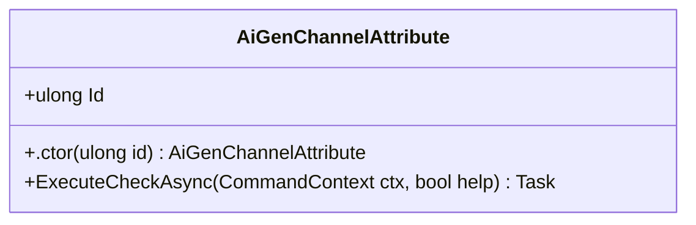

<div id="CategoryAttribute-class-diagram"></div>

##### `CategoryAttribute` class diagram

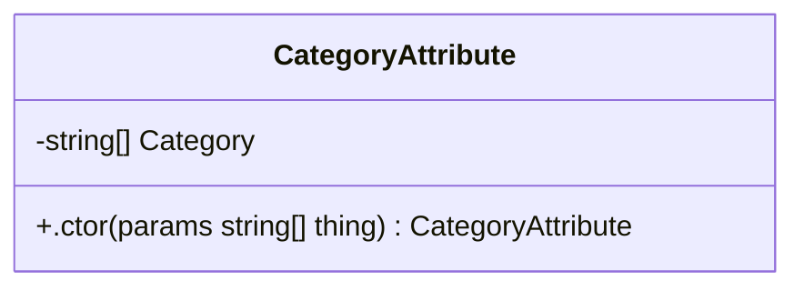

<div id="RequireAttachmentAttribute-class-diagram"></div>

##### `RequireAttachmentAttribute` class diagram

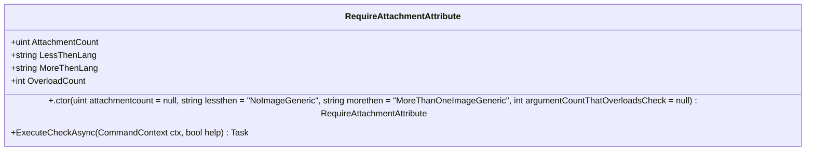

<div id="RequireConfigVariableAttribute-class-diagram"></div>

##### `RequireConfigVariableAttribute` class diagram

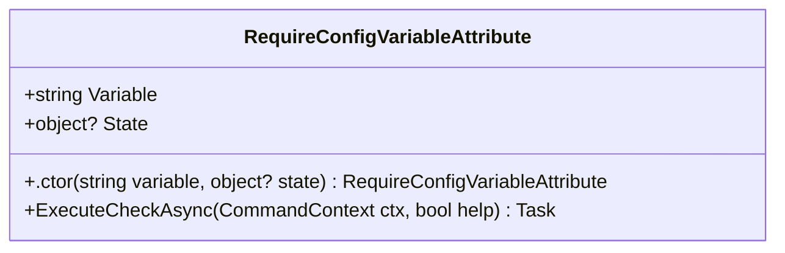

<div id="RequireDjAttribute-class-diagram"></div>

##### `RequireDjAttribute` class diagram

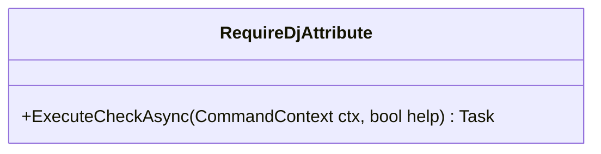

<div id="RequireDjSlashAttribute-class-diagram"></div>

##### `RequireDjSlashAttribute` class diagram

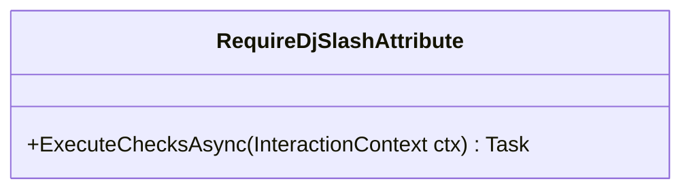

<div id="RequireModuleGuildEnabled-class-diagram"></div>

##### `RequireModuleGuildEnabled` class diagram

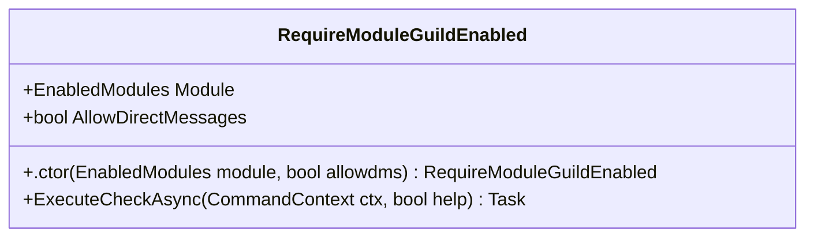

<div id="RequireTranslatorAttribute-class-diagram"></div>

##### `RequireTranslatorAttribute` class diagram

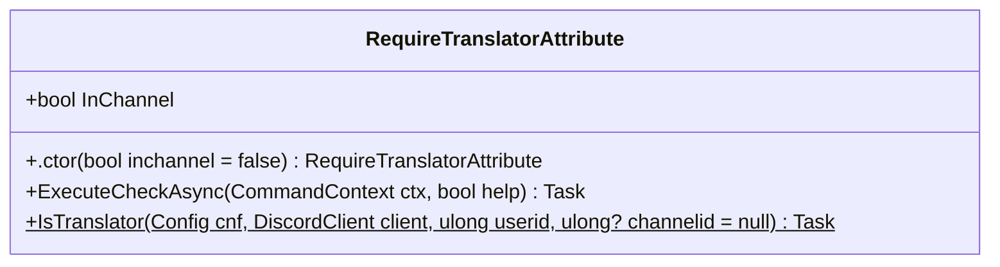

<div id="BetterPlayerEventData-class-diagram"></div>

##### `BetterPlayerEventData` class diagram

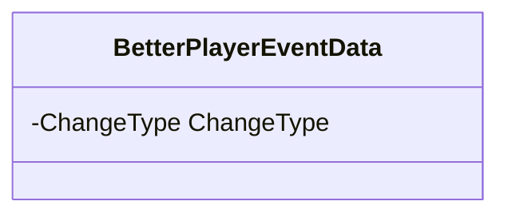

<div id="BetterVoteLavalinkPlayer-class-diagram"></div>

##### `BetterVoteLavalinkPlayer` class diagram

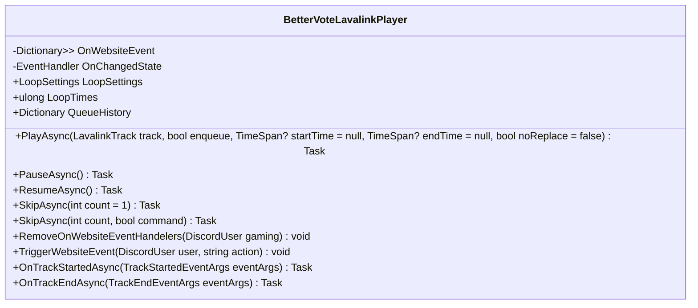

<div id="ChangeType-class-diagram"></div>

##### `ChangeType` class diagram

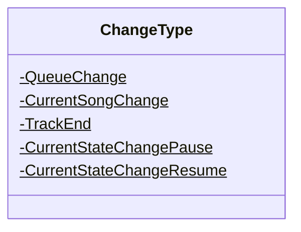

<div id="CoolerHelpFormatter-class-diagram"></div>

##### `CoolerHelpFormatter` class diagram

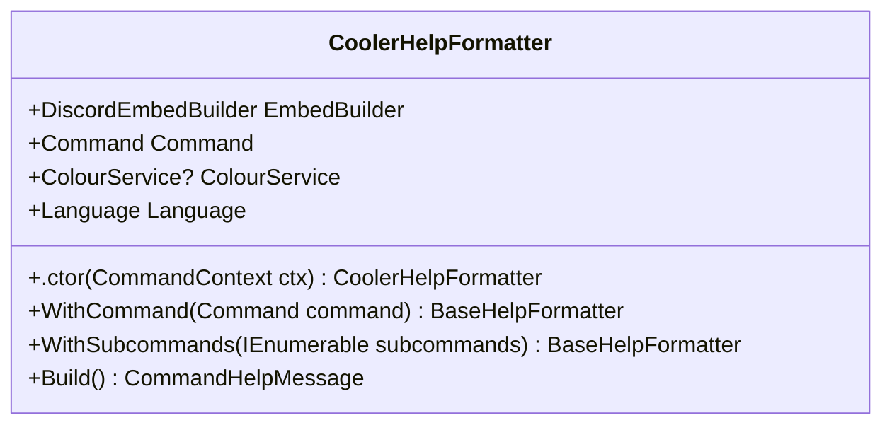

<div id="FinishReason-class-diagram"></div>

##### `FinishReason` class diagram

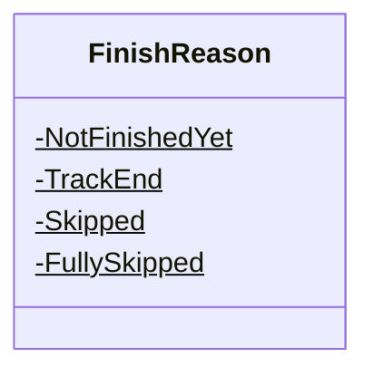

<div id="LoopSettings-class-diagram"></div>

##### `LoopSettings` class diagram

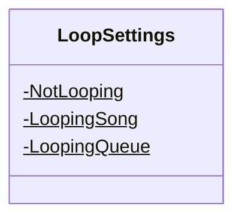

<div id="Meme-class-diagram"></div>

##### `Meme` class diagram

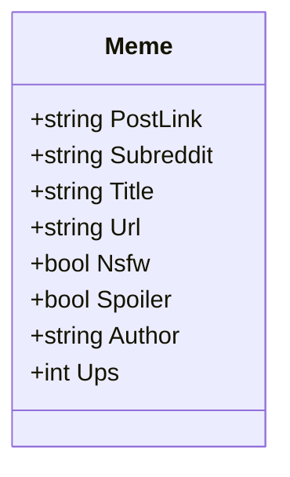

<div id="QueueHistoryObject-class-diagram"></div>

##### `QueueHistoryObject` class diagram

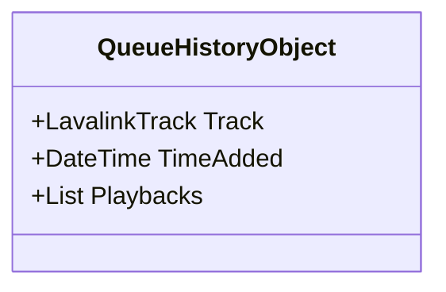

<div id="QueueHistoryPlayback-class-diagram"></div>

##### `QueueHistoryPlayback` class diagram

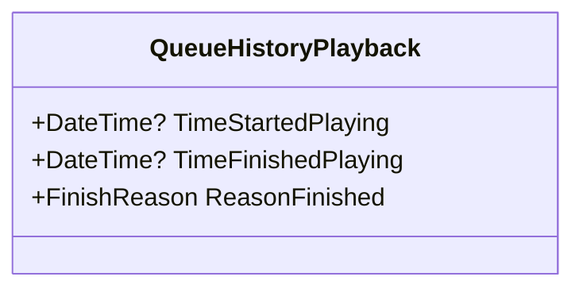

<div id="SerializableDictionary&lt;TKey, TValue&gt;-class-diagram"></div>

##### `SerializableDictionary<TKey, TValue>` class diagram

```mermaid
classDiagram
IXmlSerializable <|-- SerializableDictionary<TKey, TValue> : implements
class SerializableDictionary<TKey, TValue>{
    +GetSchema() XmlSchema
    +ReadXml(XmlReader reader) void
    +WriteXml(XmlWriter writer) void
}

```

<div id="SilverBotPlaylist-class-diagram"></div>

##### `SilverBotPlaylist` class diagram

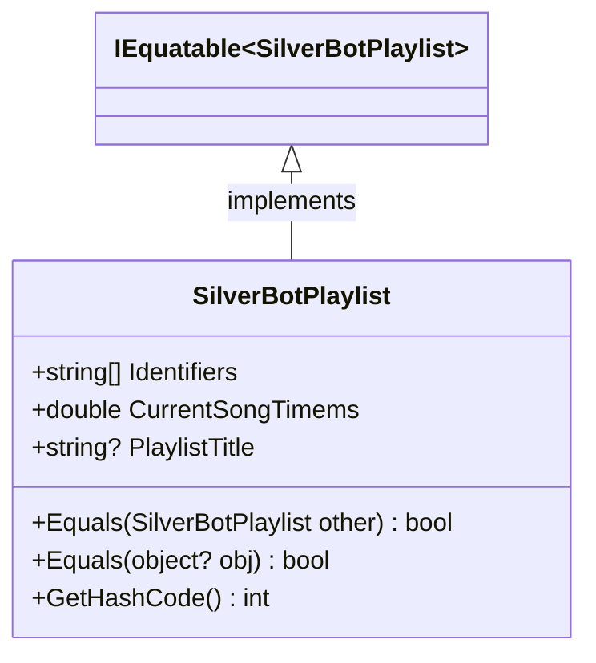

<div id="SongORSongs-class-diagram"></div>

##### `SongORSongs` class diagram

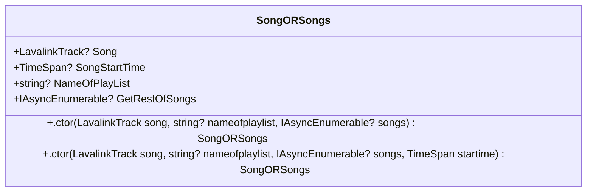

<div id="Splash-class-diagram"></div>

##### `Splash` class diagram

```mermaid
classDiagram
class Splash{
    +string Name
    +ActivityType Type
    +string StreamUrl
    +.ctor() Splash
    +.ctor(string namewithparameters, ActivityType type) Splash
    +GetFromDiscordActivity(DiscordActivity discordActivity)$ Splash
    +GetDiscordActivity(Dictionary<string, string> pairs) DiscordActivity
}

```

<div id="BingRankingData-class-diagram"></div>

##### `BingRankingData` class diagram

```mermaid
classDiagram
class BingRankingData{
    +Guid BingRankingDataId
    +ulong ServerId
    +ulong UserId
    +ulong BingCount
}

```

<div id="DatabaseWebhookData-class-diagram"></div>

##### `DatabaseWebhookData` class diagram

```mermaid
classDiagram
class DatabaseWebhookData{
    +Guid DatabaseWebhookDataId
    +Guid ServerSettingsId
    +.ctor() DatabaseWebhookData
    +.ctor(string webhookUrl) DatabaseWebhookData
    +.ctor(ulong id, string token) DatabaseWebhookData
}

```

<div id="EnabledModules-class-diagram"></div>

##### `EnabledModules` class diagram

```mermaid
classDiagram
class EnabledModules{
    -None$
    -Generic$
    -ImageModule$
    -Reminders$
    -Misc$
    -Experience$
    -Audio$
    -Moderator$
    -ReactionRole$
    -Fortnite$
    -Minecraft$
    -Bubot$
    -Admin$
    -Steam$
    -ServerStats$
    -QuoteBook$
    -Anime$
    -Bing$
    -AllExceptReminders$
    -All$
}

```

<div id="IHaveExecutableRequirements-class-diagram"></div>

##### `IHaveExecutableRequirements` class diagram

```mermaid
classDiagram
class IHaveExecutableRequirements{
    +ExecuteRequirements(Config conf)* Task<bool>
}

```

<div id="IRequireAssets-class-diagram"></div>

##### `IRequireAssets` class diagram

```mermaid
classDiagram
class IRequireAssets{
}

```

<div id="PlannedEvent-class-diagram"></div>

##### `PlannedEvent` class diagram

```mermaid
classDiagram
class PlannedEvent{
    +string EventID
    +DateTime Time
    +PlannedEventType Type
    +ulong UserID
    +ulong ChannelID
    +ulong MessageID
    +ulong? ResponseMessageID
    +string Data
    +bool Handled
    +.ctor() PlannedEvent
}

```

<div id="PlannedEventType-class-diagram"></div>

##### `PlannedEventType` class diagram

```mermaid
classDiagram
class PlannedEventType{
    -EmojiPoll$
    -GiveAway$
    -Reminder$
}

```

<div id="ServerSettings-class-diagram"></div>

##### `ServerSettings` class diagram

```mermaid
classDiagram
class ServerSettings{
    +Guid ServerSettingsId
    +ulong ServerId
    +string LangName
    +ulong? ServerStatsCategoryId
    +ServerStatString[] ServerStatsTemplates
    +EnabledModules EnabledModules
    +string ServerStatsTemplatesInJson
    +bool RepeatThings
    +List<DatabaseWebhookData> BingWebhooks
    +string[] Prefixes
    +string PrefixesInJson
    +List<ReactionRoleMapping> ReactionRoleMappings
    +List<BingRankingData> BingRankingData
}

```

<div id="ServerStatString-class-diagram"></div>

##### `ServerStatString` class diagram

```mermaid
classDiagram
class ServerStatString{
    +string Template
    +.ctor() ServerStatString
    +.ctor(string template) ServerStatString
    +Serialize(Dictionary<string, string> dict) string
    +GetStringDictionaryAsync(DiscordGuild guild)$ Task<Dictionary<string, string>>
}

```

<div id="TranslatorSettings-class-diagram"></div>

##### `TranslatorSettings` class diagram

```mermaid
classDiagram
class TranslatorSettings{
    +ulong Id
    +bool IsTranslator
    +Language? CurrentCustomLanguage
    +ICollection<Language> CustomLanguages
}

```

<div id="UserExperience-class-diagram"></div>

##### `UserExperience` class diagram

```mermaid
classDiagram
class UserExperience{
    +ulong Id
    +ulong XP
    +Increase() void
    +Increase(ulong count) void
    +Decrease() void
    +Decrease(ulong count) void
}

```

<div id="UserSettings-class-diagram"></div>

##### `UserSettings` class diagram

```mermaid
classDiagram
class UserSettings{
    +ulong Id
    +string LangName
    +bool IsBanned
    +bool UsesNewMusicPage
    +List<BingRankingData> BingRankingData
}

```

<div id="WebhookData-class-diagram"></div>

##### `WebhookData` class diagram

```mermaid
classDiagram
class WebhookData{
    +ulong Id
    +string Token
    +string URL
    +.ctor() WebhookData
    +.ctor(string webhookUrl) WebhookData
    +.ctor(ulong id, string token) WebhookData
}

```

<div id="DatabaseContext-class-diagram"></div>

##### `DatabaseContext` class diagram

```mermaid
classDiagram
class DatabaseContext{
    -ServerStatString[] StatsTemplates
    +DbSet<ServerSettings> serverSettings
    +DbSet<UserSettings> userSettings
    +DbSet<UserExperience> userExperiences
    +DbSet<PlannedEvent> plannedEvents
    +DbSet<TranslatorSettings> translatorSettings
    +DbSet<ReactionRoleMapping> ReactionRoleMappings
    +.ctor(DbContextOptions<DatabaseContext> options) DatabaseContext
    +RemoveUser(ulong userId) Task
    +GetLangCodeUser(ulong id) string
    +atString[]>[] DatabaseContext.GetStatisticSettings() Tuple<ulong,
    +GetServerSettings(ulong id) ServerSettings
    +GetLangCodeGuild(ulong id) string
    +IsBanned(ulong id) bool
    +SetServerStatsCategory(ulong sid, ulong? id) void
    +UpsertServerSettings(ulong serverId, Action<ServerSettings, bool> action) void
    +UpsertUserSettings(ulong userId, Action<UserSettings, bool> action) void
    +SetServerPrefixes(ulong sid, string[] prefixes) void
    +SetServerStatStrings(ulong sid, ServerStatString[]? id) void
    +ToggleBanUser(ulong id, bool BAN) void
    +UpsertUserLanguageCode(ulong id, string lang) void
    +UpsertBing(ulong userId, ServerSettings s, Action<BingRankingData, bool> action) void
    +UpsertIncrementUserBing(ulong userId, ulong serverId) ulong
    +RunSqlAsync(string sql) Task<string>
    +UpsertGuildLanguageCode(ulong id, string lang) void
}

```

<div id="AttachmentCountIncorrectException-class-diagram"></div>

##### `AttachmentCountIncorrectException` class diagram

```mermaid
classDiagram
class AttachmentCountIncorrectException{
    +AttachmentCountIncorrect AttachmentCount
    +.ctor(AttachmentCountIncorrect count) AttachmentCountIncorrectException
    +.ctor(AttachmentCountIncorrect count, string message) AttachmentCountIncorrectException
    +.ctor(AttachmentCountIncorrect count, string message, Exception inner) AttachmentCountIncorrectException
    +.ctor(SerializationInfo info, StreamingContext context) AttachmentCountIncorrectException
    +SetAttachmentCount(AttachmentCountIncorrect value) void
}

```

<div id="BotNotInVCException-class-diagram"></div>

##### `BotNotInVCException` class diagram

```mermaid
classDiagram
class BotNotInVCException{
    +.ctor(string? message) BotNotInVCException
    +.ctor(string? message, Exception? innerException) BotNotInVCException
}

```

<div id="MojangException-class-diagram"></div>

##### `MojangException` class diagram

```mermaid
classDiagram
class MojangException{
    +.ctor() MojangException
    +.ctor(string error, string errormessage) MojangException
    +.ctor(SerializationInfo info, StreamingContext context) MojangException
}

```

<div id="PlayerIsNullException-class-diagram"></div>

##### `PlayerIsNullException` class diagram

```mermaid
classDiagram
class PlayerIsNullException{
    +.ctor() PlayerIsNullException
    +.ctor(string? message) PlayerIsNullException
    +.ctor(string? message, Exception? innerException) PlayerIsNullException
}

```

<div id="TemplateReturningNullException-class-diagram"></div>

##### `TemplateReturningNullException` class diagram

```mermaid
classDiagram
class TemplateReturningNullException{
    +.ctor() TemplateReturningNullException
    +.ctor(string template) TemplateReturningNullException
    +.ctor(string template, Exception innerException) TemplateReturningNullException
}

```

<div id="UserNotInVCException-class-diagram"></div>

##### `UserNotInVCException` class diagram

```mermaid
classDiagram
class UserNotInVCException{
    +.ctor(string? message) UserNotInVCException
    +.ctor(string? message, Exception? innerException) UserNotInVCException
}

```

<div id="Language-class-diagram"></div>

##### `Language` class diagram

```mermaid
classDiagram
class Language{
    +Guid Id
    +string LangName
    +string UnknownError
    +string LangCodeGoogleTranslate
    +string Hi
    +string TimeInUtc
    +string CommandIsDisabled
    +string RequestedBy
    +string DblaReturnedNull
    +string AlreadyConnected
    +string UserNotConnected
    +string VolumeNotCorrect
    +string Joined
    +string NotConnected
    +string NotPlaying
    +string NothingInQueue
    +string NothingInQueueToRemove
    +string NothingInQueueHistory
    +string RemovedFront
    +string RemovedFrontWithAuthorName
    +string RemovedXSongOrSongs
    +string RemovedSong
    +string RemovedSongs
    +string LoopingSong
    +string LoopingQueue
    +string WrongImageCount
    +string NotLooping
    +string NoResults
    +string Left
    +string InformationAbout
    +string JoinedSilverCraft
    +string PrefixUsedTopgg
    +string ShuffledSuccess
    +string User
    +string Userid
    +string IsAnOwner
    +string IsABot
    +string AccountCreationDate
    +string AccountJoinDate
    +string SilverhostingJokeTitle
    +string SilverhostingJokeDescription
    +string PurgeNumberNegative
    +string PurgeNothingToDelete
    +string PurgeRemovedFront
    +string PurgeRemovedSingle
    +string PurgeRemovedPlural
    +string NoEmotesFound
    +string SearchedFor
    +string MultipleEmotesFound
    +string AlreadyOptedIn
    +string Server
    +string OptedIn
    +string OptedInWebshot
    +string OptedOutWebshot
    +string AllAvailibleEmotes
    +string UserIsBannedFromSilversocial
    +string UselessFact
    +string UserHasLowerRole
    +string Ban
    +string Kick
    +string BotHasLowerRole
    +string RandomGif
    +string PoweredByGiphy
    +string Meme
    +string NoImageGeneric
    +string EmoteWasLargerThan256K
    +string MoreThanOneImageGeneric
    +string OutputFileLargerThan8M
    +string PageGif
    +string PageGifButtonText
    +string PageNuget
    +string PeriodExpired
    +string UserIsntBot
    +string NowPlaying
    +string NowPlayingBy
    +string Enqueued
    +string EnqueuedBy
    +string SkippedNP
    +string CanForceSkip
    +string NotPaused
    +string Voted
    +string AlreadyVoted
    +string TimeTillTrackPlays
    +string TimeWhenTrackPlayed
    +string TimesTrackLooped
    +string SearchFail
    +string SearchFailTitle
    +string SearchFailDescription
    +string Success
    +string UrbanExample
    +string SongLength
    +string SongTimePosition
    +string SongTimeLeft
    +string SongTimeLeftSongLoopingCurrent
    +string SongTimeLeftSongLooping
    +string LoadedSilverBotPlaylistWithTitle
    +string SongNotExist
    +string VersionInfoTitle
    +string PurgedBySilverBotReason
    +string NotValidLanguage
    +string CultureInfo
    +string BotBannedUser
    +string BotKickedUser
    +string AddedXAmountOfSongs
    +string TrackingStarted
    +string TrackingStopped
    +string TrackCanNotBeSeeked
    +string XPCommandSelf
    +string XPCommandOther
    +string XPCommandGeneralFail
    +string XPCommandCardSuccess
    +string XPCommandFailSelf
    +string XPCommandFailOther
    +string XPCommandLeaderBoardTitle
    +string XPCommandLeaderBoardPerson
    +string DisabledRepeatedPhrases
    +string EnableRepeatedPhrases
    +string CheckFailed
    +string ChecksFailed
    +string InvalidOverload
    +string GeneralException
    +string NoMatchingSubcommandsAndGroupNotExecutable
    +string QuotePreviewQuoteID
    +string QuoteGetNoBook
    +string QuoteGetNoQuoteWithId
    +string QuotePreviewDeleteSuccess
    +string HelpCommandHelpString
    +string HelpCommandNoDescription
    +string HelpCommandGroupCanBeExecuted
    +string HelpCommandGroupAliases
    +string HelpCommandGroupArguments
    +string HelpCommandGroupSubcommands
    +string HelpCommandGroupListingAllCommands
    +string RequireDJCheckFailed
    +string RequireGuildCheckFailed
    +string RequireNsfwCheckFailed
    +string RequireOwnerCheckFailed
    +string RequireRolesCheckFailedSG
    +string RequireRolesCheckFailedPL
    +string RequireBotPermisionsCheckFailedPL
    +string RequireBotPermisionsCheckFailedSG
    +string RequireUserPermisionsCheckFailedPL
    +string RequireUserPermisionsCheckFailedSG
    +string RequireBotAndUserPermisionsCheckFailedPL
    +string RequireBotAndUserPermisionsCheckFailedSG
    +string UnknownImageFormat
    +string NetVipsLoadFail
    +string AttributeDataBaseCheckNoDirectMessages
    +string AttributeDataBaseCheckWebShot
    +string JpegSuccess
    +string SilverSuccess
    +string ComicSuccess
    +string ResizeSuccess
    +string TintSuccess
    +string MathSteps
    +string Results
    +string SomethingsContributors
    +string NuGetVerified
    +string Type
    +string Downloads
    +string Version
    +string SetToProvidedStrings
    +string SetToDefaultStrings
    +string NoPerm
    +string CategorySetSuccess
    +string EmojiMessageDownloadStart
    +string EmojiMessageDownloadEnd
    +string EmojiEnd
    +string ReactionRoleNoPermManageRoles
    +string ReactionRoleIntro
    +string ReactionRoleTitle
    +string ReactionRoleResponseYes
    +string ReactionRoleResponseYes2
    +string ReactionRoleResponseYes3
    +string ReactionRoleResponseNo
    +string ReactionRoleResponseNo2
    +string ReactionRoleResponseNo3
    +string ReactionRoleRolesAdded
    +string ReactionRoleDone
    +string ReactionRoleNone
    +string ReactionRoleMainLoop
    +string ReactionRoleEmbedColour
    +string FreeToPlayGameType
    +string NotAvailableGameType
    +string CostsMoneyGameTypeBug
    +string NoGamesWereReturned
    +string NoGamesWereReturnedDescription
    +string AmericanMoney
    +string OS
    +string DsharpplusVersion
    +string VersionNumber
    +string GitRepo
    +string GitCommitHash
    +string GitBranch
    +string IsDirty
    +string CLR
    +string ReminderErrorNoContent
    +string ReminderSuccess
    +string ListReminderNone
    +string ListReminderStart
    +string ListReminderListMore
    +string ReminderContent
    +string PollResultsStart
    +string PollResultsResultYes
    +string PollResultsResultNo
    +string PollResultsResultUndecided
    +string PollErrorQuestionNull
    +string GiveawayResultsNoReactions
    +string GiveawayItemNull
    +string GiveawayResultsWon
    +string QueueNothing
    +string CancelReminderErrorNoEvent
    +string CancelReminderErrorMultiple
    +string CancelReminderErrorAlreadyHandled
    +string CancelReminderSuccess
    +string LavalinkNotSetup
    +string WebsitePlayerResumed
    +string WebsitePlayerPaused
    +string WebsiteSkippedViaVote
    +string WebsiteVotedForSkip
    +string WebsiteSkipped
    +string WebsiteShuffled
    +string WebsiteLoopOff
    +string WebsiteLoopSong
    +string WebsiteLoopQueue
    +string WebsitePlayingNothingTrackName
    +string WebsitePlayPause
    +string WebsiteVoteSkip
    +string WebsiteForceSkip
    +string WebsiteShuffle
    +string WebsiteNoLoop
    +string WebsiteBLoopSong
    +string WebsiteBLoopQueue
    +string WebsiteBVolumeDown
    +string WebsiteBVolumeUp
    +string AddedBingToChannel
    +GetRemovedTitle(string trackName, string? authorName) string
    +GetNowPlaying(string trackName, string? authorName) string
    +GetEnqueuedTitle(string trackName, string? authorName) string
    +GetCultureInfo() CultureInfo
}

```

<div id="LanguageService-class-diagram"></div>

##### `LanguageService` class diagram

```mermaid
classDiagram
class LanguageService{
    -Dictionary<string, Language> CachedLanguages$
    -JsonSerializerOptions options$
    +geService.GetLoadedLanguages() Dictionary<string,
    +LoadedLanguages() IEnumerable<string>
    +Get(string languageName) Language
    +GetDefaultAsync() Task<Language>
    +GetDefault() Language
    +GetAsync(string languageName) Task<Language>
    +SerialiseDefaultAsync(string loc)$ Task
    +SerialiseDefault(string loc)$ void
    +SerialiseDefault()$ string
    +GetLanguageFromGuildIdAsync(ulong id, DatabaseContext db) Task<Language>
    +FromCtx(CommandContext ctx) Language
    +FromCtx(ISilverBotContext ctx) Language
    +FromCtxAsync(CommandContext ctx) Task<Language>
    +FromCtxAsync(BaseContext ctx) Task<Language>
    +FromCtxAsync(ISilverBotContext ctx) Task<Language>
    +FromUserId(ulong userId, DatabaseContext databaseContext) Language
    +FromUserIdAsync(ulong userId, DatabaseContext databaseContext) Task<Language>
    +FromCtxAsync(dynamic ctx, Config config, DatabaseContext databaseContext) Task<Language>
}

```

<div id="OAuthGuild-class-diagram"></div>

##### `OAuthGuild` class diagram

```mermaid
classDiagram
class OAuthGuild{
    +string Id
    +ulong UId
    +string Name
    +string Icon
    +bool Owner
    +string Permissions
    +string[] Features
}

```

<div id="OAuthUser-class-diagram"></div>

##### `OAuthUser` class diagram

```mermaid
classDiagram
class OAuthUser{
    +string Id
    +ulong UId
    +string Username
    +string Avatar
    +string Discriminator
    +int Public_flags
    +int Flags
    +string Email
    +bool Verified
    +string Locale
    +bool Mfa_enabled
}

```

<div id="AttachmentCountIncorrect-class-diagram"></div>

##### `AttachmentCountIncorrect` class diagram

```mermaid
classDiagram
class AttachmentCountIncorrect{
    -TooManyAttachments$
    -TooLittleAttachments$
}

```

<div id="Config-class-diagram"></div>

##### `Config` class diagram

```mermaid
classDiagram
ICanBeToldThatAPartOfMeIsChanged <|-- Config : implements
class Config{
    -ulong CurrentConfVer$
    +string[] Prefix
    +LogLevel MinimumLogLevel
    +bool UseTxtFilesAsLogs
    +string Token
    +string[] ModulesToLoad
    +SerializableDictionary<string, string> ServicesToLoadExternal
    +SerializableDictionary<string, string> ExtraParams
    +string[] ModulesFilesToLoadExternal
    +string Gtoken
    +string FApiToken
    +string JavaLoc
    +ulong ServerId
    +bool CallGcOnSplashChange
    +bool ReactionRolesEnabled
    +bool HostWebsite
    +bool ClearTasks
    +int MsInterval
    +ulong? ConfigVer
    +bool UseLavaLink
    +bool AutoDownloadAndStartLavalink
    +bool SponsorBlock
    +string LavalinkBuildsSourceGitHubUser
    +string LavalinkBuildsSourceGitHubRepo
    +string LavalinkRestUri
    +string LavalinkWebSocketUri
    +string LavalinkPassword
    +bool EnableJellyFinLookupService
    +ulong FridayTextChannel
    +bool ColorConfig
    +bool EmulateBubot
    +bool EmulateBubotBibi
    +string LocalBibiPictures
    +string BibiLibCutOut
    +string BibiLibCutOutConfig
    +string BibiLibFull
    +string BibiLibFullConfig
    +bool SitInVc
    +bool EnableServerStatistics
    +ulong TranslatorRoleId
    +ulong TranslatorModeChannel
    +ulong LoginPageDiscordClientId
    +string LoginPageDiscordClientSecret
    +bool EnableUpdateChecking
    +bool UseAnalytics
    +string[] ArchiveWebhooks
    +ulong[] ChannelsToArchivePicturesFrom
    +SerializableDictionary<string, string> SongAliases
    +Splash[] Splashes
    +bool AllowedToRead
    +OutdatedConfigTask(Config readConfig, CommentXmlConfigReaderNotifyWhenChanged<Config> configReader)$ Task
    +GetAsync()$ Task<Config?>
    +PropertyChanged(object sender, PropertyChangedEventArgs e) void
}

```

<div id="ConsoleInputHelper-class-diagram"></div>

##### `ConsoleInputHelper` class diagram

```mermaid
classDiagram
class ConsoleInputHelper{
    +GetBoolFromConsole(bool? defaultValue = null)$ bool
}

```

<div id="IService-class-diagram"></div>

##### `IService` class diagram

```mermaid
classDiagram
class IService{
    +Start()* Task
    +Stop()* Task
}

```

<div id="SdImage-class-diagram"></div>

##### `SdImage` class diagram

```mermaid
classDiagram
class SdImage{
    -byte[] _bytes
    -bool _disposedValue
    -string Url
    +.ctor() SdImage
    +.ctor(string url) SdImage
    +.ctor(DiscordUser user) SdImage
    +Dispose() void
    +FromContext(CommandContext ctx)$ SdImage
    +FromAttachments(IReadOnlyList<DiscordAttachment> attachments)$ SdImage
    +GetBytesAsync(HttpClient httpClient) Task<byte[]>
    +GetByteStream(HttpClient httpClient) Task<Stream>
    +Dispose(bool disposing) void
    +age() void
}

```

<div id="SdImageConverter-class-diagram"></div>

##### `SdImageConverter` class diagram

```mermaid
classDiagram
class SdImageConverter{
    -Regex UrLregex$
    -Regex Emote$
    -Regex User$
    +ConvertAsync(string value, CommandContext ctx) Task<Optional<SdImage>>
}

```

<div id="BibiPage-class-diagram"></div>

##### `BibiPage` class diagram

```mermaid
classDiagram
ILazyPage <|-- BibiPage : implements
class BibiPage{
    -string[] BibiDescText
    -Language Lang
    -DiscordUser user
    -string imgurl
    +Optional<string> Content
    +Optional<DiscordEmbedBuilder> Embed
    +int Id
    +int? PreviousId
    +int? NextId
    +.ctor(int pageId, string urlFormat, string[] _bibiDescText, Language lang, DiscordUser user) BibiPage
}

```

<div id="BibiPagination-class-diagram"></div>

##### `BibiPagination` class diagram

```mermaid
classDiagram
IPagination <|-- BibiPagination : implements
class BibiPagination{
    -string[] BibiDescText
    -Language Lang
    -DiscordUser User
    -string UrlFormat
    +int DefaultId
    +Range AllowedRange
    +.ctor(string urlFormat, string[] _bibiDescText, Language lang, DiscordUser user) BibiPagination
    +GetPageAtId(int id) ILazyPage
}

```

<div id="CoolerPaginatior-class-diagram"></div>

##### `CoolerPaginatior` class diagram

```mermaid
classDiagram
IPaginator <|-- CoolerPaginatior : implements
class CoolerPaginatior{
    -Dictionary<Guid, PaginationRecord> Paginations
    +.ctor(DiscordClient client) CoolerPaginatior
    +GetButtons(ILazyPage page, IPagination pagination, Guid id) IEnumerable<DiscordButtonComponent>
    +SendPage(ILazyPage page, DiscordChannel channel, IPagination pagination, Guid id) Task<DiscordMessage>
    +SendPaginatedMessage(DiscordChannel channel, DiscordUser user, bool shared, IPagination pagination) Task<Guid>
}

```

<div id="ILazyPage-class-diagram"></div>

##### `ILazyPage` class diagram

```mermaid
classDiagram
class ILazyPage{
    +Optional<string> Content*
    +Optional<DiscordEmbedBuilder> Embed*
    +int Id*
    +int? PreviousId*
    +int? NextId*
}

```

<div id="IPagination-class-diagram"></div>

##### `IPagination` class diagram

```mermaid
classDiagram
class IPagination{
    +int DefaultId*
    +Range AllowedRange*
    +GetPageAtId(int id)* ILazyPage
}

```

<div id="IPaginator-class-diagram"></div>

##### `IPaginator` class diagram

```mermaid
classDiagram
class IPaginator{
    +SendPaginatedMessage(DiscordChannel channel, DiscordUser user, bool allowOtherUsersToStartTheirOwn, IPagination pagination)* Task<Guid>
}

```

<div id="PaginationRecord-class-diagram"></div>

##### `PaginationRecord` class diagram

```mermaid
classDiagram
class PaginationRecord{
    +IPagination Pagination
    +int CurrentPage
    +DiscordUser User
    +bool Shared
    +.ctor(IPagination pagination, int currentPage, DiscordUser user, bool shared) PaginationRecord
}

```

<div id="ReactionRoleMapping-class-diagram"></div>

##### `ReactionRoleMapping` class diagram

```mermaid
classDiagram
class ReactionRoleMapping{
    +Guid MappingId
    +Guid ServerSettingsId
    +ulong RoleId
    +ulong MessageId
    +ulong ChannelId
    +string? Emoji
    +ulong? EmojiId
    +ReactionRoleType Mode
}

```

<div id="ReactionRoleType-class-diagram"></div>

##### `ReactionRoleType` class diagram

```mermaid
classDiagram
class ReactionRoleType{
    -None$
    -Inverse$
    -Sticky$
    -Vanishing$
    -Normal$
}

```

<div id="CommentXmlConfigReaderNotifyWhenChanged&lt;T&gt;-class-diagram"></div>

##### `CommentXmlConfigReaderNotifyWhenChanged<T>` class diagram

```mermaid
classDiagram
IDisposable <|-- CommentXmlConfigReaderNotifyWhenChanged<T> : implements
class CommentXmlConfigReaderNotifyWhenChanged<T>{
    -List<FileSystemWatcher> fileSystemWatchers
    +Dispose() void
    +Dispose(bool disposing) void
    +Read(string path) T?
}

```

<div id="ContextExtensions-class-diagram"></div>

##### `ContextExtensions` class diagram

```mermaid
classDiagram
class ContextExtensions{
    +GetLanguageAsync(BaseContext ctx, Language? language = null)$ Task<Language?>
    +GetLanguageAsync(CommandContext ctx, Language? language = null)$ Task<Language?>
    +GetLanguageAsync(ISilverBotContext ctx, Language? language = null)$ Task<Language?>
    +GetLanguage(ISilverBotContext ctx, Language? language = null)$ Language?
    +GetLanguage(CommandContext ctx, Language? language = null)$ Language?
    +SendStringFileWithContent(CommandContext ctx, string title, string file, string filename = "message.txt")$ Task
    +SendStringFileWithContent(BaseContext ctx, string title, string file, string filename = "message.txt")$ Task
    +SendStringFileWithContent(ISilverBotContext ctx, string title, string file, string filename = "message.txt")$ Task
    +CommonSendMessageLogic(DiscordEmbedBuilder embedBuilder, string title = "", string message = "", string imageUrl = "", string url = "")$ void
    +SendMessageAsync(CommandContext ctx, string title = "", string message = "", string imageUrl = "", string url = "", Language? language = null)$ Task
    +SendMessageAsync(ISilverBotContext ctx, string title = "", string message = "", string imageUrl = "", string url = "", Language? language = null)$ Task
    +SendMessageAsync(BaseContext ctx, string title = "", string message = "", string imageUrl = "", string url = "", Language? language = null)$ Task
    +GetNewBuilder(BaseContext ctx, Language language)$ DiscordEmbedBuilder
    +GetNewBuilder(ISilverBotContext ctx, Language language)$ DiscordEmbedBuilder
    +GetNewBuilder(CommandContext ctx, Language language)$ DiscordEmbedBuilder
}

```

<div id="EmojiPack-class-diagram"></div>

##### `EmojiPack` class diagram

```mermaid
classDiagram
class EmojiPack{
    +string Name
    +string Author
    +Emote[] Emotes
}

```

<div id="Emote-class-diagram"></div>

##### `Emote` class diagram

```mermaid
classDiagram
class Emote{
    +string Name
    +string Url
}

```

<div id="ExpectedContextTypeAttribute-class-diagram"></div>

##### `ExpectedContextTypeAttribute` class diagram

```mermaid
classDiagram
class ExpectedContextTypeAttribute{
    +Type[] Types
    +.ctor(params Type[] types) ExpectedContextTypeAttribute
}

```

<div id="FileAssetSchemeChecker-class-diagram"></div>

##### `FileAssetSchemeChecker` class diagram

```mermaid
classDiagram
IAssetSchemeChecker <|-- FileAssetSchemeChecker : implements
class FileAssetSchemeChecker{
    +string Scheme
    +CheckForAsset(string asset) bool
}

```

<div id="IAssetSchemeChecker-class-diagram"></div>

##### `IAssetSchemeChecker` class diagram

```mermaid
classDiagram
class IAssetSchemeChecker{
    +string Scheme*
    +CheckForAsset(string asset)* bool
}

```

<div id="ICallBack-class-diagram"></div>

##### `ICallBack` class diagram

```mermaid
classDiagram
class ICallBack{
    +int NumberOfCallBacks*
    +DateTime? NextCallBackTime*
    +DateTime? LastCallBackTime*
    +int RunningTaskCount*
    +Add(Func<Task<DateTime?>> task, DateTime when, string? name = null, CancellationTokenSource? source = null)* void
    +AddOnce(Func<Task> task, DateTime when, string? name = null, CancellationTokenSource? source = null)* void
    +Add(Func<Task<double?>> task, double when, string? name = null, CancellationTokenSource? source = null)* void
}

```

<div id="ICanBeToldThatAPartOfMeIsChanged-class-diagram"></div>

##### `ICanBeToldThatAPartOfMeIsChanged` class diagram

```mermaid
classDiagram
class ICanBeToldThatAPartOfMeIsChanged{
    +bool AllowedToRead*
    +PropertyChanged(object sender, PropertyChangedEventArgs e)* void
}

```

<div id="IProgramExtension-class-diagram"></div>

##### `IProgramExtension` class diagram

```mermaid
classDiagram
class IProgramExtension{
    +bool IsLoaded*
    +Register(ServiceProvider sp, Logger log, params object[] additionalContext)* Task
    +Reload()* Task
    +Unregister(ServiceProvider sp, Logger log, params object[] additionalContext)* Task
}

```

<div id="ISilverBotContext-class-diagram"></div>

##### `ISilverBotContext` class diagram

```mermaid
classDiagram
class ISilverBotContext{
    +DiscordGuild? Guild*
    +DiscordClient Client*
    +DiscordUser User*
    +DiscordChannel Channel*
    +IServiceProvider Services*
    +DiscordMember? Member*
    +CommandsNextExtension? CommandsNext*
    +GetOriginal()* object
    +RespondAsync(string content)* Task<DiscordMessage>
    +RespondAsync(DiscordEmbed embed)* Task<DiscordMessage>
    +RespondAsync(string content, DiscordEmbed embed)* Task<DiscordMessage>
    +RespondAsync(DiscordMessageBuilder builder)* Task<DiscordMessage>
    +RespondAsync(Action<DiscordMessageBuilder> action)* Task<DiscordMessage>
}

```

<div id="ISpecialModuleRegistration-class-diagram"></div>

##### `ISpecialModuleRegistration` class diagram

```mermaid
classDiagram
class ISpecialModuleRegistration{
    +Register(CommandsNextExtension commandsNextExtension)* Task
}

```

<div id="ProgramExtensionAlreadyLoadedException-class-diagram"></div>

##### `ProgramExtensionAlreadyLoadedException` class diagram

```mermaid
classDiagram
class ProgramExtensionAlreadyLoadedException{
    +.ctor() ProgramExtensionAlreadyLoadedException
    +.ctor(string name) ProgramExtensionAlreadyLoadedException
}

```

<div id="ProgramExtensionException-class-diagram"></div>

##### `ProgramExtensionException` class diagram

```mermaid
classDiagram
class ProgramExtensionException{
    +.ctor() ProgramExtensionException
    +.ctor(string message) ProgramExtensionException
}

```

<div id="ProgramExtensionNotLoadedException-class-diagram"></div>

##### `ProgramExtensionNotLoadedException` class diagram

```mermaid
classDiagram
class ProgramExtensionNotLoadedException{
    +.ctor() ProgramExtensionNotLoadedException
    +.ctor(string name) ProgramExtensionNotLoadedException
}

```

<div id="ScheduledTask-class-diagram"></div>

##### `ScheduledTask` class diagram

```mermaid
classDiagram
class ScheduledTask{
    +Func<Task<DateTime?>> Function
    +DateTime? NextCall
    +Guid Id
    +CancellationTokenSource? TokenSource
    +string? Name
    +.ctor(DateTime? nextCall, Func<Task<DateTime?>> function, string? name = null, CancellationTokenSource? source = null) ScheduledTask
}

```

<div id="SlashNeutralCommandContext-class-diagram"></div>

##### `SlashNeutralCommandContext` class diagram

```mermaid
classDiagram
ISilverBotContext <|-- SlashNeutralCommandContext : implements
class SlashNeutralCommandContext{
    +InteractionContext Org
    +DiscordGuild? Guild
    +DiscordChannel Channel
    +IServiceProvider Services
    +DiscordClient Client
    +DiscordUser User
    +DiscordMember? Member
    +CommandsNextExtension? CommandsNext
    +dContext(InteractionContext d)$ SlashNeutralCommandContext.implicit
    +nteractionContext(SlashNeutralCommandContext d)$ InteractionContext
    +RespondAsync(string content) Task<DiscordMessage>
    +RespondAsync(DiscordEmbed embed) Task<DiscordMessage>
    +RespondAsync(string content, DiscordEmbed embed) Task<DiscordMessage>
    +RespondAsync(DiscordMessageBuilder builder) Task<DiscordMessage>
    +RespondAsync(Action<DiscordMessageBuilder> action) Task<DiscordMessage>
    +.ctor(InteractionContext ctx) SlashNeutralCommandContext
    +GetOriginal() object
}

```

<div id="SourceFile-class-diagram"></div>

##### `SourceFile` class diagram

```mermaid
classDiagram
class SourceFile{
    +string Name
    +string Extension
    +byte[] FileBytes
}

```

<div id="TaskSchedulerService-class-diagram"></div>

##### `TaskSchedulerService` class diagram

```mermaid
classDiagram
ICallBack <|-- TaskSchedulerService : implements
class TaskSchedulerService{
    -PriorityQueue<ScheduledTask, DateTime> Queue
    -DateTime _nextCall
    -Timer _timer
    -Guid _lastCallBackId
    +int NumberOfCallBacks
    +DateTime? NextCallBackTime
    +DateTime? LastCallBackTime
    +int RunningTaskCount
    +.ctor() TaskSchedulerService
    +Add(Func<Task<DateTime?>> task, DateTime when, string? name = null, CancellationTokenSource? source = null) void
    +AddOnce(Func<Task> task, DateTime when, string? name = null, CancellationTokenSource? source = null) void
    +Add(Func<Task<double?>> task, double when, string? name = null, CancellationTokenSource? source = null) void
    +ReAdd(ScheduledTask task, DateTime when) void
    +CheckQueue(object? state) void
    +ConvertUlongToDateTime(double when)$ DateTime
    +WrapTask(Func<Task> task)$ Func<Task<DateTime?>>
    +WrapTask(Func<Task<double?>> task)$ Func<Task<DateTime?>>
}

```

<div id="TextNeutralCommandContext-class-diagram"></div>

##### `TextNeutralCommandContext` class diagram

```mermaid
classDiagram
ISilverBotContext <|-- TextNeutralCommandContext : implements
class TextNeutralCommandContext{
    +CommandContext Org
    +DiscordGuild? Guild
    +DiscordChannel Channel
    +IServiceProvider Services
    +DiscordClient Client
    +DiscordUser User
    +DiscordMessage Message
    +DiscordMember? Member
    +CommandsNextExtension? CommandsNext
    +dContext(CommandContext d)$ TextNeutralCommandContext.implicit
    +or CommandContext(TextNeutralCommandContext d)$ CommandContext
    +RespondAsync(string content) Task<DiscordMessage>
    +RespondAsync(DiscordEmbed embed) Task<DiscordMessage>
    +RespondAsync(string content, DiscordEmbed embed) Task<DiscordMessage>
    +RespondAsync(DiscordMessageBuilder builder) Task<DiscordMessage>
    +RespondAsync(Action<DiscordMessageBuilder> action) Task<DiscordMessage>
    +.ctor(CommandContext ctx) TextNeutralCommandContext
    +GetOriginal() object
}

```

<div id="ArrayUtils-class-diagram"></div>

##### `ArrayUtils` class diagram

```mermaid
classDiagram
class ArrayUtils{
    +RandomFrom<T>(T[] vs)$ T
}

```

<div id="GitHubUtils.Asset-class-diagram"></div>

##### `GitHubUtils.Asset` class diagram

```mermaid
classDiagram
class Asset{
    +string Url
    +int Id
    +string NodeId
    +string Name
    +string Label
    +Uploader Uploader
    +string ContentType
    +string State
    +int Size
    +int DownloadCount
    +DateTime CreatedAt
    +DateTime UpdatedAt
    +string BrowserDownloadUrl
}

```

<div id="GitHubUtils.Author-class-diagram"></div>

##### `GitHubUtils.Author` class diagram

```mermaid
classDiagram
class Author{
    +string Login
    +int Id
    +string NodeId
    +string AvatarUrl
    +string GravatarId
    +string Url
    +string HtmlUrl
    +string FollowersUrl
    +string FollowingUrl
    +string GistsUrl
    +string StarredUrl
    +string SubscriptionsUrl
    +string OrganizationsUrl
    +string ReposUrl
    +string EventsUrl
    +string ReceivedEventsUrl
    +string Type
    +bool SiteAdmin
}

```

<div id="GitHubUtils.Author1-class-diagram"></div>

##### `GitHubUtils.Author1` class diagram

```mermaid
classDiagram
class Author1{
    +string Login
    +int Id
    +string NodeId
    +string AvatarUrl
    +string GravatarId
    +string Url
    +string HtmlUrl
    +string Followers_url
    +string Following_url
    +string Gists_url
    +string Starred_url
    +string Subscriptions_url
    +string Organizations_url
    +string Repos_url
    +string Events_url
    +string Received_events_url
    +string Type
    +bool Site_admin
}

```

<div id="ColourService-class-diagram"></div>

##### `ColourService` class diagram

```mermaid
classDiagram
class ColourService{
    -DiscordColor[] cache
    +DiscordColor[] Internal
    +Get(bool ignorecache = false, bool useinternal = false) DiscordColor[]
    +ReadConfig() void
    +WriteConfig() void
    +GetSingle(bool ignorecache = false, bool useinternal = false) DiscordColor
}

```

<div id="GitHubUtils.Commit-class-diagram"></div>

##### `GitHubUtils.Commit` class diagram

```mermaid
classDiagram
class Commit{
    +CommitAuthor Author
    +Committer Committer
    +string Message
    +Tree Tree
    +string Url
    +int CommentCount
    +Verification Verification
}

```

<div id="GitHubUtils.CommitAuthor-class-diagram"></div>

##### `GitHubUtils.CommitAuthor` class diagram

```mermaid
classDiagram
class CommitAuthor{
    +string Name
    +string Email
    +DateTime Date
}

```

<div id="GitHubUtils.CommitInfo-class-diagram"></div>

##### `GitHubUtils.CommitInfo` class diagram

```mermaid
classDiagram
class CommitInfo{
    +string Sha
    +string Node_id
    +Commit Commit
    +string Url
    +string HtmlUrl
    +string CommentsUrl
    +Author1 Author
    +Committer1 Committer
    +Parent[] Parents
    +Stats Stats
    +File[] Files
    +GetLatestFromRepoAsync(Repo repo, HttpClient client)$ Task<CommitInfo>
    +GetLatestFromRepoAsync(Repo repo, string branch, HttpClient client)$ Task<CommitInfo>
}

```

<div id="GitHubUtils.Committer-class-diagram"></div>

##### `GitHubUtils.Committer` class diagram

```mermaid
classDiagram
class Committer{
    +string Name
    +string Email
    +DateTime Date
}

```

<div id="GitHubUtils.Committer1-class-diagram"></div>

##### `GitHubUtils.Committer1` class diagram

```mermaid
classDiagram
class Committer1{
    +string Login
    +int Id
    +string Node_id
    +string Avatar_url
    +string Gravatar_id
    +string Url
    +string Html_url
    +string Followers_url
    +string Following_url
    +string Gists_url
    +string Starred_url
    +string Subscriptions_url
    +string Organizations_url
    +string Repos_url
    +string Events_url
    +string Received_events_url
    +string Type
    +bool SiteAdmin
}

```

<div id="NuGetUtils.Context-class-diagram"></div>

##### `NuGetUtils.Context` class diagram

```mermaid
classDiagram
class Context{
    +string Vocab
    +string Base
}

```

<div id="DateTimeUtils-class-diagram"></div>

##### `DateTimeUtils` class diagram

```mermaid
classDiagram
class DateTimeUtils{
    +CalculateNextFriday()$ DateTime
    +CalculateNextSaturday()$ DateTime
    +DateTimeToTimeStamp(DateTime? dt, TimestampFormat tf = null, string def = "NA")$ string
    +DateTimeToTimeStamp(DateTime dt, TimestampFormat tf = null)$ string
}

```

<div id="NuGetUtils.Datum-class-diagram"></div>

##### `NuGetUtils.Datum` class diagram

```mermaid
classDiagram
class Datum{
    +string Atid
    +string Type
    +string Registration
    +string Id
    +string Version
    +string Description
    +string Summary
    +string Title
    +string IconUrl
    +string LicenseUrl
    +string ProjectUrl
    +string[] Tags
    +string[] Authors
    +int? TotalDownloads
    +bool? Verified
    +Packagetype[] PackageTypes
    +Version[] Versions
}

```

<div id="UrbanDictUtils.Defenition-class-diagram"></div>

##### `UrbanDictUtils.Defenition` class diagram

```mermaid
classDiagram
class Defenition{
    +string Definition
    +string Permalink
    +int ThumbsUp
    +object[] SoundUrls
    +string Author
    +string Word
    +int DefId
    +string CurrentVote
    +DateTime WrittenOn
    +string Example
    +int ThumbsDown
}

```

<div id="EmbedBuilderUtils-class-diagram"></div>

##### `EmbedBuilderUtils` class diagram

```mermaid
classDiagram
class EmbedBuilderUtils{
    +AddRequestedByFooter(DiscordEmbedBuilder builder, CommandContext ctx, Language language)$ DiscordEmbedBuilder
    +AddRequestedByFooter(DiscordEmbedBuilder builder, BaseContext ctx, Language language)$ DiscordEmbedBuilder
    +AddRequestedByFooter(DiscordEmbedBuilder builder, ISilverBotContext ctx, Language language)$ DiscordEmbedBuilder
    +AddRequestedByFooter(DiscordEmbedBuilder builder, DiscordUser user, Language language)$ DiscordEmbedBuilder
}

```

<div id="GitHubUtils.File-class-diagram"></div>

##### `GitHubUtils.File` class diagram

```mermaid
classDiagram
class File{
    +string Sha
    +string Filename
    +string Status
    +int Additions
    +int Deletions
    +int Changes
    +string Bloburl
    +string Rawurl
    +string Contents_url
    +string Patch
}

```

<div id="FileSizes-class-diagram"></div>

##### `FileSizes` class diagram

```mermaid
classDiagram
class FileSizes{
    -FSize[] FSizes$
    +.ctor() FileSizes
}

```

<div id="FileSizeUtils-class-diagram"></div>

##### `FileSizeUtils` class diagram

```mermaid
classDiagram
class FileSizeUtils{
    +FormatSize(long bytes)$ string
}

```

<div id="FileUtils-class-diagram"></div>

##### `FileUtils` class diagram

```mermaid
classDiagram
class FileUtils{
    +GetFileExtensionFromUrl(string url)$ string
}

```

<div id="FSize-class-diagram"></div>

##### `FSize` class diagram

```mermaid
classDiagram
class FSize{
    -string FullName
    -string Suffix
    +.ctor(string fn, string sfx) FSize
}

```

<div id="GitHubUtils-class-diagram"></div>

##### `GitHubUtils` class diagram

```mermaid
classDiagram
class GitHubUtils{
    -Regex R$
    +MyRegex()$ Regex
}

```

<div id="MinecraftUtils-class-diagram"></div>

##### `MinecraftUtils` class diagram

```mermaid
classDiagram
class MinecraftUtils{
    -string GetProfileUrl$
    -string CrafatarBaseUrl$
    +GetPlayerAsync(string name, HttpClient httpClient)$ Task<Player>
}

```

<div id="NuGetUtils-class-diagram"></div>

##### `NuGetUtils` class diagram

```mermaid
classDiagram
class NuGetUtils{
    +SearchAsync(string query, HttpClient httpClient)$ Task<Datum[]>
}

```

<div id="NumberUtils-class-diagram"></div>

##### `NumberUtils` class diagram

```mermaid
classDiagram
class NumberUtils{
    -string[] Divisors$
    +FormatSize(long bytes)$ string
}

```

<div id="NuGetUtils.Packagetype-class-diagram"></div>

##### `NuGetUtils.Packagetype` class diagram

```mermaid
classDiagram
class Packagetype{
    +string Name
}

```

<div id="GitHubUtils.Parent-class-diagram"></div>

##### `GitHubUtils.Parent` class diagram

```mermaid
classDiagram
class Parent{
    +string Sha
    +string Url
    +string Htmlurl
}

```

<div id="MinecraftUtils.Player-class-diagram"></div>

##### `MinecraftUtils.Player` class diagram

```mermaid
classDiagram
class Player{
    +string Name
    +string Id
    +string Error
    +string ErrorMessage
    +bool Demo
    +GetAvatarUrl() string
    +GetHeadUrl() string
    +GetBodyUrl() string
}

```

<div id="RandomGenerator-class-diagram"></div>

##### `RandomGenerator` class diagram

```mermaid
classDiagram
class RandomGenerator{
    +Next(int minValue, int maxExclusiveValue)$ int
    +GetRandomUInt()$ uint
    +GenerateRandomBytes(int bytesNumber)$ byte[]
    +RandomString(int length)$ string
    +RandomAbcString(int length, double timespan = 1.5)$ string
}

```

<div id="GitHubUtils.Release-class-diagram"></div>

##### `GitHubUtils.Release` class diagram

```mermaid
classDiagram
class Release{
    +string Url
    +string AssetsUrl
    +string UploadUrl
    +string HtmlUrl
    +int Id
    +Author Author
    +string NodeId
    +string TagName
    +string TargetCommitish
    +string Name
    +bool Draft
    +bool Prerelease
    +DateTime CreatedAt
    +DateTime PublishedAt
    +Asset[] Assets
    +string TarballUrl
    +string ZipballUrl
    +string Body
    +DownloadLatestAsync(Release release, HttpClient client)$ Task
    +DownloadLatestAsync(HttpClient client) Task
    +GetLatestFromRepoAsync(Repo repo, HttpClient client)$ Task<Release>
}

```

<div id="GitHubUtils.Repo-class-diagram"></div>

##### `GitHubUtils.Repo` class diagram

```mermaid
classDiagram
class Repo{
    +string User
    +string Reponame
    +.ctor(string user, string reponame) Repo
    +.ctor() Repo
    +TryParseUrl(string url, out Repo? r)$ bool
}

```

<div id="NuGetUtils.Rootobject-class-diagram"></div>

##### `NuGetUtils.Rootobject` class diagram

```mermaid
classDiagram
class Rootobject{
    +Context Context
    +int TotalHits
    +Datum[] Data
}

```

<div id="UrbanDictUtils.Rootobject-class-diagram"></div>

##### `UrbanDictUtils.Rootobject` class diagram

```mermaid
classDiagram
class Rootobject{
    +Defenition[] List
}

```

<div id="ColourService.SdColor-class-diagram"></div>

##### `ColourService.SdColor` class diagram

```mermaid
classDiagram
class SdColor{
    +byte R
    +byte G
    +byte B
    +ToDiscordColor() DiscordColor
    +FromDiscordColor(DiscordColor color)$ SdColor
}

```

<div id="GitHubUtils.Stats-class-diagram"></div>

##### `GitHubUtils.Stats` class diagram

```mermaid
classDiagram
class Stats{
    +int Total
    +int Additions
    +int Deletions
}

```

<div id="StringUtils-class-diagram"></div>

##### `StringUtils` class diagram

```mermaid
classDiagram
class StringUtils{
    +RandomFromArray(string[] vs)$ string
    +FormatFromDictionary(string formatString, Dictionary<string, string> valueDict)$ string
    +SplitInParts(string s, int partLength)$ IEnumerable<string>
    +SplitInPartsIterator(string s, int partLength)$ IEnumerable<string>
    +BoolToEmoteString(bool b)$ string
    +RemoveStringFromEnd(string a, string sub)$ string
    +RemoveStringFromStart(string a, string sub)$ string
}

```

<div id="Translator-class-diagram"></div>

##### `Translator` class diagram

```mermaid
classDiagram
class Translator{
    -Dictionary<string, string> LanguageModeMap$
    -HttpClient _httpClient
    +IEnumerable<string> Languages$
    +.ctor() Translator
    +.ctor(HttpClient httpClient) Translator
    +TranslateAsync(string sourceText, string sourceLanguage, string targetLanguage) Task<Tuple<string, string>>
    +ContainsKeyOrVal(string language)$ bool
    +LanguageEnumToIdentifier(string language)$ string
}

```

<div id="GitHubUtils.Tree-class-diagram"></div>

##### `GitHubUtils.Tree` class diagram

```mermaid
classDiagram
class Tree{
    +string Sha
    +string Url
}

```

<div id="GitHubUtils.Uploader-class-diagram"></div>

##### `GitHubUtils.Uploader` class diagram

```mermaid
classDiagram
class Uploader{
    +string Login
    +int Id
    +string NodeId
    +string AvatarUrl
    +string GravatarId
    +string Url
    +string HtmlUrl
    +string FollowersUrl
    +string FollowingUrl
    +string GistsUrl
    +string StarredUrl
    +string SubscriptionsUrl
    +string OrganizationsUrl
    +string ReposUrl
    +string EventsUrl
    +string ReceivedEventsUrl
    +string Type
    +bool SiteAdmin
}

```

<div id="UrbanDictUtils-class-diagram"></div>

##### `UrbanDictUtils` class diagram

```mermaid
classDiagram
class UrbanDictUtils{
    +GetDefinition(string word, HttpClient httpClient)$ Task<Defenition[]>
}

```

<div id="UserUtils-class-diagram"></div>

##### `UserUtils` class diagram

```mermaid
classDiagram
class UserUtils{
    +GetNickOrUsernameInOldCmd(DiscordUser user)$ string
}

```

<div id="GitHubUtils.Verification-class-diagram"></div>

##### `GitHubUtils.Verification` class diagram

```mermaid
classDiagram
class Verification{
    +bool Verified
    +string Reason
    +string Signature
    +string Payload
}

```

<div id="NuGetUtils.Version-class-diagram"></div>

##### `NuGetUtils.Version` class diagram

```mermaid
classDiagram
class Version{
    +string StrVersion
    +int Downloads
    +string Id
}

```

<div id="WebHookUtils-class-diagram"></div>

##### `WebHookUtils` class diagram

```mermaid
classDiagram
class WebHookUtils{
    +WebhookUrlRegex()$ Regex
    +ParseWebhookUrlNullable(string webhookUrl, out ulong? webhookIdnullable, out string webhookToken)$ void
}

```

<div id="IPackage-class-diagram"></div>

##### `IPackage` class diagram

```mermaid
classDiagram
class IPackage{
    +string Name*
    +string Version*
    +string? Description*
    +string? FullDescription*
    +string? Source*
}

```

<div id="IPackageManager-class-diagram"></div>

##### `IPackageManager` class diagram

```mermaid
classDiagram
class IPackageManager{
    +string Name*
    +string Version*
    +GetInstalledPackages()* IEnumerable<IPackage>
    +GetPackagesReadyToUpdate()* IEnumerable<IPackage>
    +UpgradeIndex()* void
    +UpgradePackage(string id)* void
    +InstallPackage(string id)* void
    +UpgradePackages()* void
}

```

<div id="ScoopPackage-class-diagram"></div>

##### `ScoopPackage` class diagram

```mermaid
classDiagram
IPackage <|-- ScoopPackage : implements
class ScoopPackage{
    +string Date
    +string Time
    +string Name
    +string Version
    +string? NewVersion
    +string Bucket
    +string? Source
    +string? Description
    +string? FullDescription
    +.ctor(string name, string version) ScoopPackage
    +.ctor(string name, string version, string newversion) ScoopPackage
    +.ctor(string name, string version, string bucket, string date, string time) ScoopPackage
}

```

<div id="ScoopPackageManager-class-diagram"></div>

##### `ScoopPackageManager` class diagram

```mermaid
classDiagram
IPackageManager <|-- ScoopPackageManager : implements
class ScoopPackageManager{
    +string Name
    +string Version
    +GetScoopVer() string
    +RunCommand(string args) Process?
    +GetInstalledPackages() IEnumerable<IPackage>
    +GetPackagesReadyToUpdate() IEnumerable<IPackage>
    +InstallPackage(string id) void
    +UpgradeIndex() void
    +UpgradePackage(string id) void
    +UpgradePackages() void
}

```

<div id="SysAdminModule-class-diagram"></div>

##### `SysAdminModule` class diagram

```mermaid
classDiagram
class SysAdminModule{
    -IPackageManager pm
    +DiscordClient client
    +Start() Task
    +Stop() Task
}

```

<div id="Program-class-diagram"></div>

##### `Program` class diagram

```mermaid
classDiagram
class Program{
    +el-statements-entry-point>$ <top-level-statements-entry-point>
}

```

<div id="Manifest.Icon-class-diagram"></div>

##### `Manifest.Icon` class diagram

```mermaid
classDiagram
class Icon{
    +string Src
    +string Sizes
    +string Type
    +string Purpose
}

```

<div id="Login-class-diagram"></div>

##### `Login` class diagram

```mermaid
classDiagram
class Login{
    +LogIn() IActionResult
}

```

<div id="Manifest-class-diagram"></div>

##### `Manifest` class diagram

```mermaid
classDiagram
class Manifest{
    +Index() Rootobject
}

```

<div id="Manifest.Rootobject-class-diagram"></div>

##### `Manifest.Rootobject` class diagram

```mermaid
classDiagram
class Rootobject{
    +string Name
    +string ShortName
    +Icon[] Icons
    +string StartUrl
    +string Display
    +string BackgroundColor
    +string ThemeColor
}

```

<div id="ErrorModel-class-diagram"></div>

##### `ErrorModel` class diagram

```mermaid
classDiagram
class ErrorModel{
    +string RequestId
    +bool ShowRequestId
    +OnGet() void
}

```

<div id="SessionHelper-class-diagram"></div>

##### `SessionHelper` class diagram

```mermaid
classDiagram
class SessionHelper{
    +SetObjectAsJson(ISession session, string key, object value)$ void
    +GetObjectFromJson<T>(ISession session, string key)$ T
    +GetGuilds(ClaimsPrincipal user, HttpClient client, IMemoryCache cache)$ OAuthGuild[]
    +AuthState(AuthenticationStateProvider provider)$ AuthenticationState
    +Username(ClaimsPrincipal user)$ string
    +Discriminator(ClaimsPrincipal user)$ string
    +UID(ClaimsPrincipal user)$ string
    +PUID(ClaimsPrincipal user)$ ulong
    +AvatarHash(ClaimsPrincipal user)$ string
    +GetUserInfoFromSession(ISession session, HttpClient client)$ OAuthUser
}

```

<div id="Anime-class-diagram"></div>

##### `Anime` class diagram

```mermaid
classDiagram
class Anime{
    -string BaseUrl$
    +HttpClient Client
    +GetAnimeUrl(string endpoint) Task<string>
    +SendImage(CommandContext ctx, string url) Task
    +Hug(CommandContext ctx) Task
    +Kiss(CommandContext ctx) Task
    +Slap(CommandContext ctx) Task
    +Wink(CommandContext ctx) Task
    +Pat(CommandContext ctx) Task
    +Kill(CommandContext ctx) Task
    +Cuddle(CommandContext ctx) Task
    +Punch(CommandContext ctx) Task
}

```

<div id="AnimeSlash-class-diagram"></div>

##### `AnimeSlash` class diagram

```mermaid
classDiagram
class AnimeSlash{
    -string BaseUrl$
    +HttpClient Client
    +GetAnimeUrl(string endpoint) Task<string>
    +SendImage(InteractionContext ctx, string url) Task
    +Hug(InteractionContext ctx) Task
    +Kiss(InteractionContext ctx) Task
    +Slap(InteractionContext ctx) Task
    +Wink(InteractionContext ctx) Task
    +Pat(InteractionContext ctx) Task
    +Kill(InteractionContext ctx) Task
    +Cuddle(InteractionContext ctx) Task
    +Punch(InteractionContext ctx) Task
}

```

<div id="RootObject-class-diagram"></div>

##### `RootObject` class diagram

```mermaid
classDiagram
class RootObject{
    +string Url
}

```

<div id="AdminCommands-class-diagram"></div>

##### `AdminCommands` class diagram

```mermaid
classDiagram
class AdminCommands{
    -DiscordEmoji YesEmoji$
    -DiscordEmoji NoEmoji$
    -DiscordEmoji EntryEmoji$
    +DatabaseContext Database
    +HttpClient HttpClient
    +LanguageService LanguageService
    +ColourService ColourService
    +SetPrefix(CommandContext ctx, params string[] cake) Task
    +EmojiPollAsync(CommandContext commandContext, TimeSpan duration, string question) Task
    +GiveAway(CommandContext commandContext, TimeSpan duration, string item) Task
    +ExportEmotesToGuilded(CommandContext ctx) Task
    +DownloadEmotz(CommandContext ctx) Task
}

```

<div id="MiscCommands.Argument-class-diagram"></div>

##### `MiscCommands.Argument` class diagram

```mermaid
classDiagram
class Argument{
    +string Name
    +string Type
    +string? Description
    +bool RemainingText
    +bool Optional
    +List<string> CustomAttributes
    +.ctor(string name, string type) Argument
}

```

<div id="Audio-class-diagram"></div>

##### `Audio` class diagram

```mermaid
classDiagram
class Audio{
    +NeutralAudio NeutralAudio
    +PlayNext(CommandContext ctx, SongORSongs song) Task
    +Play(CommandContext ctx) Task
    +MusicController(CommandContext ctx) Task
    +Play(CommandContext ctx, SongORSongs song) Task
    +Volume(CommandContext ctx, ushort volume) Task
    +Seek(CommandContext ctx, TimeSpan time) Task
    +ClearQueue(CommandContext ctx) Task
    +Shuffle(CommandContext ctx) Task
    +ExportQueue(CommandContext ctx, string? playlistName = null) Task
    +Remove(CommandContext ctx, int songindex) Task
    +QueueHistory(CommandContext ctx) Task
    +Queue(CommandContext ctx) Task
    +Loop(CommandContext ctx, LoopSettings settings) Task
    +Pause(CommandContext ctx) Task
    +Ovh(CommandContext ctx, string name, string artist) Task
    +Aliases(CommandContext ctx) Task
    +Resume(CommandContext ctx) Task
    +Join(CommandContext ctx) Task
    +Skip(CommandContext ctx) Task
    +VoteSkip(CommandContext ctx) Task
    +ForceDisconnect(CommandContext ctx) Task
    +Disconnect(CommandContext ctx) Task
}

```

<div id="BibiCommands-class-diagram"></div>

##### `BibiCommands` class diagram

```mermaid
classDiagram
IHaveExecutableRequirements <|-- BibiCommands : implements
IRequireAssets <|-- BibiCommands : implements
class BibiCommands{
    +string[] RequiredAssets$
    +Config Config
    +LanguageService LanguageService
    +int BibiPictureCount
    +ExecuteRequirements(Config conf) Task<bool>
    +Bibi(CommandContext ctx, string input) Task
}

```

<div id="BibiLib-class-diagram"></div>

##### `BibiLib` class diagram

```mermaid
classDiagram
IHaveExecutableRequirements <|-- BibiLib : implements
class BibiLib{
    -string[] _bibiDescText
    -string[] _bibiFullDescText
    +Config Config
    +IPaginator Paginator
    +LanguageService LanguageService
    +ExecuteRequirements(Config conf) Task<bool>
    +EnsureCreated() void
    +GetBibiDescText() string[]
    +GetBibiFullDescText() string[]
    +BibiLibrary(CommandContext ctx) Task
    +BibiLibraryFull(CommandContext ctx) Task
}

```

<div id="BingCommandModule-class-diagram"></div>

##### `BingCommandModule` class diagram

```mermaid
classDiagram
ISpecialModuleRegistration <|-- BingCommandModule : implements
class BingCommandModule{
    -DiscordWebhookClient _webhookClient$
    -string _bongContent$
    -BingsList bings$
    +DatabaseContext Database
    +HttpClient HttpClient
    +LanguageService LanguageService
    +ColourService ColourService
    +AddBingChannel(CommandContext ctx, DiscordChannel bingchannel) Task
    +HandleButton(DiscordClient sender, ComponentInteractionCreateEventArgs args, ServiceProvider services)$ Task
    +AddWebHooksToClientAsync(DatabaseContext dbCtx) Task
    +Register(CommandsNextExtension commandsNextExtension) Task
    +DoBong()$ Task
}

```

<div id="BingsList-class-diagram"></div>

##### `BingsList` class diagram

```mermaid
classDiagram
class BingsList{
    -List<BingText> Texts
    +GetAppropriate(ulong NumberOfBings) string
}

```

<div id="BingText-class-diagram"></div>

##### `BingText` class diagram

```mermaid
classDiagram
class BingText{
    +string Text
    +int? Day
    +int? Month
    +int? Year
    +int? Hour
    +int? Minute
    +int? DayOfWeek
    +ulong? NumberOfBingsOfUser
    +.ctor(string text, int? day = null, int? month = null, int? year = null, int? hour = null, int? minute = null, int? dayOfWeek = null, ulong? numberOfBingsOfUser = null) BingText
}

```

<div id="Bubot-class-diagram"></div>

##### `Bubot` class diagram

```mermaid
classDiagram
class Bubot{
    +Silveryeet(CommandContext ctx) Task
}

```

<div id="CodeEnv-class-diagram"></div>

##### `CodeEnv` class diagram

```mermaid
classDiagram
class CodeEnv{
    +CommandContext Ctx
    +DiscordMember? Member
    +DiscordUser User
    +DiscordGuild Guild
    +DiscordClient Client
    +Config ExConfig
    +Config Config
    +string VerString
    +DatabaseContext DbContext
    +.ctor(CommandContext context, Config config, DatabaseContext dbctx) CodeEnv
}

```

<div id="MiscCommands.Command-class-diagram"></div>

##### `MiscCommands.Command` class diagram

```mermaid
classDiagram
class Command{
    +string Location
    +string? Name
    +string? Description
    +string[]? Aliases
    +List<string> CustomAttributes
    +List<Argument> Arguments
}

```

<div id="MiscCommands.CommandModule-class-diagram"></div>

##### `MiscCommands.CommandModule` class diagram

```mermaid
classDiagram
class CommandModule{
    +string Name
    +List<Command> Commands
}

```

<div id="Experience-class-diagram"></div>

##### `Experience` class diagram

```mermaid
classDiagram
IRequireAssets <|-- Experience : implements
class Experience{
    -IEnumerable<int> Range$
    +string[] RequiredAssets$
    +DatabaseContext Database
    +HttpClient HttpClient
    +LanguageService LanguageService
    +ColourService ColourService
    +BonusXp(CommandContext ctx, byte percent) Task
    +BonusXpPerperson(CommandContext ctx, ulong xp) Task
    +XpCommand(CommandContext ctx) Task
    +XpCommand(CommandContext ctx, DiscordMember member) Task
    +XpLeaderboard(CommandContext ctx) Task
    +XpCard(CommandContext ctx, DiscordUser user) Task
    +XpCard(CommandContext ctx) Task
    +GetNeededXpForNextLevel(ulong xp) BigInteger
    +GetProgressToNextLevel(ulong xp) double
    +GetLevel(ulong xp) ulong
}

```

<div id="Fullresponse-class-diagram"></div>

##### `Fullresponse` class diagram

```mermaid
classDiagram
class Fullresponse{
    +string Status
    +Input Request
    +Output[] Output
}

```

<div id="Genericcommands-class-diagram"></div>

##### `Genericcommands` class diagram

```mermaid
classDiagram
class Genericcommands{
    +Config Config
    +HttpClient HttpClient
    +LanguageService LanguageService
    +ColourService ColourService
    +GreetCommand(CommandContext ctx) Task
    +Time(CommandContext ctx) Task
    +Invite(CommandContext ctx) Task
    +Ping(CommandContext ctx) Task
    +DumpMessage(CommandContext ctx, DiscordMessage message) Task
    +DumpMessage(CommandContext ctx) Task
    +ArchiveMessage(CommandContext ctx, DiscordMessage message) Task
    +Dukt(CommandContext ctx) Task
    +IsAtSilverCraftAsync(DiscordClient discord, DiscordUser b, Config cnf)$ Task<bool>
    +Userinfo(CommandContext ctx, DiscordUser a) Task
    +Userinfo(CommandContext ctx) Task
}

```

<div id="ImageModule-class-diagram"></div>

##### `ImageModule` class diagram

```mermaid
classDiagram
IRequireAssets <|-- ImageModule : implements
class ImageModule{
    -int MegaByte$
    -string CaptionFont$
    -string SubtitlesFont$
    +LanguageService LanguageService
    +HttpClient HttpClient
    +string[] RequiredAssets$
    +MaxBytes(dynamic ctx)$ int
    +Send_img_plsAsync(CommandContext ctx, string? message)$ Task
    +SendImageStreamIfAllowed(CommandContext ctx, Stream image, bool DisposeOfStream, string Filename = "sbimg.png", string? content = null, Language? lang = null, bool dryrun = false)$ Task
    +SendImageStreamIfAllowed(InteractionContext ctx, Stream image, bool DisposeOfStream, string Filename = "sbimg.png", string? content = null, Language? lang = null, bool dryrun = false)$ Task
    +SendImageStream(CommandContext ctx, Stream outStream, string filename = "sbimg.png", string? content = null)$ Task
    +CommonCodeWithTemplate(CommandContext ctx, string template, Func<Image, Task<Tuple<bool, Image>>> func, bool TriggerTyping = true, string filename = "sbimg.png", string? encoder = null, string msgcontent = "there") Task
    +GetProfilePictureAsyncStatic(DiscordUser user, ushort size = null) Task<Image>
    +GetProfilePictureAsyncStatic(DiscordUser user, HttpClient client, ushort size = null)$ Task<Image>
    +LoadFromStream(Stream s, bool? gif = null)$ Image
    +IsAnimated(byte[] bytes)$ bool
    +AutoFixRequiredAssets(IEnumerable<string> missing)$ void
    +CaptionAndSend(CommandContext ctx, Stream input, string text, string extension, string font = null) Task
    +CaptionAndSend(CommandContext ctx, byte[] input, string text, string extension, string font = null) Task
    +CaptionAndSend(CommandContext ctx, Image loadedimg, string text, string extension, string font = null) Task
    +WriteImageToStream(Image w, Stream s, string extension)$ void
    +Caption(Image loadedimg, string text, string font = null) Task<Image>
    +JPEGSpecialSauce(byte[] photoBytes)$ MemoryStream
    +CaptionImage(CommandContext ctx, SdImage image, string text) Task
    +CaptionImage(CommandContext ctx, string text) Task
    +JokerLaugh(CommandContext ctx, string text) Task
    +Yeet(CommandContext ctx) Task
    +Yeet(CommandContext ctx, SdImage img2) Task
    +EpicGifComposite(Image img, SdImage img2, Tuple<int, int, int>[] gaming) Task<Image>
    +Jpegize(CommandContext ctx, SdImage image) Task
    +Jpegize(CommandContext ctx) Task
    +Tint(Stream photoStream, Color color, string extension)$ Tuple<MemoryStream, string>
    +Tint(CommandContext ctx, SdImage image, Color color) Task
    +Tint(CommandContext ctx, Color color) Task
    +AdventureTime(CommandContext ctx) Task
    +AdventureTime(CommandContext ctx, DiscordUser friendo) Task
    +AdventureTime(CommandContext ctx, DiscordUser person, DiscordUser friendo) Task
    +Seal(CommandContext ctx, string text) Task
    +Linus(CommandContext ctx, string company = "NVIDIA") Task
    +Resize(CommandContext ctx, SdImage image, int x = 0, int y = 0, string? format = null) Task
    +ResizeAsyncOP(byte[] bytes, int x, int y, string? format = null)$ Tuple<Stream, string>
    +Resize(CommandContext ctx, SdImage image, string? format) Task
    +Resize(CommandContext ctx, string? format) Task
    +Resize(CommandContext ctx, int x = 0, int y = 0, string? format = null) Task
    +Reliable(CommandContext ctx) Task
    +Reliable(CommandContext ctx, DiscordUser koichi) Task
    +Reliable(CommandContext ctx, DiscordUser jotaro, DiscordUser koichi) Task
    +ObMedal(CommandContext ctx) Task
    +ObMedal(CommandContext ctx, DiscordUser obama) Task
    +ObMedal(CommandContext ctx, DiscordUser obama, DiscordUser secondPerson) Task
    +HappyNewYear(CommandContext ctx) Task
    +HappyNewYear(CommandContext ctx, DiscordUser person) Task
    +GrayScaleAsync(byte[] photoBytes, string extension)$ Task<Tuple<MemoryStream, string>>
    +Grayscale(CommandContext ctx) Task
    +Grayscale(CommandContext ctx, SdImage image) Task
    +CatGeneration(CommandContext ctx, string name = null) Task
}

```

<div id="Input-class-diagram"></div>

##### `Input` class diagram

```mermaid
classDiagram
class Input{
    +string init_image
    +string prompt
    +int seed
    +bool used_random_seed
    +string negative_prompt
    +int num_outputs
    +int num_inference_steps
    +double guidance_scale
    +int width
    +int height
    +string vram_usage_level
    +string use_stable_diffusion_model
    +string use_vae_model
    +bool stream_progress_updates
    +bool stream_image_progress
    +bool show_only_filtered_image
    +bool block_nsfw
    +string output_format
    +int output_quality
    +string metadata_output_format
    +string original_prompt
    +object[] active_tags
    +object[] inactive_tags
    +string sampler_name
    +string session_id
}

```

<div id="MiscCommands-class-diagram"></div>

##### `MiscCommands` class diagram

```mermaid
classDiagram
class MiscCommands{
    +LanguageService LanguageService
    +DatabaseContext Database
    +HttpClient HttpClient
    +VersionInfoEmbed(Language lang, dynamic ctx)$ DiscordEmbed
    +VersionInfoCmd(CommandContext ctx) Task
    +SetLanguage(CommandContext ctx, string langName) Task
    +SetLanguage(CommandContext ctx, bool enable) Task
    +TranlateUnknown(CommandContext ctx, string text) Task
    +WhereIs(CommandContext ctx, string commandname) Task
    +TranlateUnknown(CommandContext ctx, string languageTo, string text) Task
}

```

<div id="ModCommands-class-diagram"></div>

##### `ModCommands` class diagram

```mermaid
classDiagram
class ModCommands{
    +LanguageService LanguageService
    +ColourService ColourService
    +Kick(CommandContext ctx, DiscordMember a, string reason = "The kick boot has spoken") Task
    +Ban(CommandContext ctx, DiscordUser a, string reason = "The ban hammer has spoken") Task
    +Kms(CommandContext ctx, bool ban = false) Task
    +Purge(CommandContext ctx, int amount) Task
}

```

<div id="MusicController-class-diagram"></div>

##### `MusicController` class diagram

```mermaid
classDiagram
class MusicController{
    +BetterVoteLavalinkPlayer Player
    +DiscordGuild Guild
    +DiscordMessage Message
}

```

<div id="MusicControllerService-class-diagram"></div>

##### `MusicControllerService` class diagram

```mermaid
classDiagram
class MusicControllerService{
    -Dictionary<ulong, MusicController> Controllers
    +GetControllerViaMessage(DiscordMessage message) MusicController
    +GetEmbedFromController(MusicController controller, ArtworkService ArtworkService, Language lang) Task<DiscordEmbed>
    +GetButtons(BetterVoteLavalinkPlayer player) IEnumerable<DiscordButtonComponent>
    +SendMessageController(DiscordChannel channel, BetterVoteLavalinkPlayer player, ArtworkService artworkService, LanguageService languageService) Task
    +.ctor(DiscordClient discord, ArtworkService artworkService, LanguageService languageService) MusicControllerService
}

```

<div id="NeutralAudio-class-diagram"></div>

##### `NeutralAudio` class diagram

```mermaid
classDiagram
class NeutralAudio{
    +LavalinkNode AudioService
    +LyricsService LyricsService
    +Config Config
    +ArtworkService ArtworkService
    +LanguageService LanguageService
    +ColourService ColourService
    +MusicControllerService MusicControllerService
    +IsInVc(ISilverBotContext ctx) bool
    +IsInVc(ISilverBotContext ctx, LavalinkNode lavalinkNode)$ bool
    +MusicController(ISilverBotContext ctx) Task
    +TimeTillSongPlays(QueuedLavalinkPlayer player, int song)$ TimeSpan
    +PlayNext(ISilverBotContext ctx, SongORSongs song) Task
    +Play(ISilverBotContext ctx) Task
    +Play(ISilverBotContext ctx, SongORSongs song) Task
    +Volume(ISilverBotContext ctx, ushort volume) Task
    +Seek(ISilverBotContext ctx, TimeSpan time) Task
    +MakeSureBotIsInVC(ISilverBotContext ctx, Language lang) Task
    +MakeSureUserIsInVC(ISilverBotContext ctx, Language lang)$ Task
    +MakeSureBothAreInVC(ISilverBotContext ctx, Language lang) Task
    +MakeSurePlayerIsntNull(ISilverBotContext ctx, Language lang, BetterVoteLavalinkPlayer? player) Task
    +ClearQueue(ISilverBotContext ctx) Task
    +Shuffle(ISilverBotContext ctx) Task
    +ExportQueue(ISilverBotContext ctx, string? playlistName = null) Task
    +Remove(ISilverBotContext ctx, int songindex) Task
    +QueueHistory(ISilverBotContext ctx) Task
    +Queue(ISilverBotContext ctx) Task
    +Loop(ISilverBotContext ctx, LoopSettings settings) Task
    +GetMessageOfLoopSetting(Language lang, LoopSettings setting) string
    +Pause(ISilverBotContext ctx) Task
    +Ovh(ISilverBotContext ctx, string name, string artist) Task
    +Aliases(ISilverBotContext ctx) Task
    +Resume(ISilverBotContext ctx) Task
    +Join(ISilverBotContext ctx) Task
    +StaticJoin(ISilverBotContext ctx, LavalinkNode audioService, Language? language = null)$ Task
    +Skip(ISilverBotContext ctx) Task
    +VoteSkip(ISilverBotContext ctx) Task
    +ForceDisconnect(ISilverBotContext ctx) Task
    +Disconnect(ISilverBotContext ctx) Task
}

```

<div id="Output-class-diagram"></div>

##### `Output` class diagram

```mermaid
classDiagram
class Output{
    +string Data
    +int Seed
    +object PathAbs
}

```

<div id="OwnerOnly-class-diagram"></div>

##### `OwnerOnly` class diagram

```mermaid
classDiagram
class OwnerOnly{
    -string[] _imports
    +DatabaseContext Database
    +Config Config
    +HttpClient HttpClient
    +LanguageService LanguageService
    +ModuleRegistrationService ModuleRegistrationService
    +ColourService ColourService
    +ICallBack TaskSched
    +ReloadColors(CommandContext ctx) Task
    +UnRegCmd(CommandContext ctx, string cmdwithparm) Task
    +RegMod(CommandContext ctx, string mod) Task
    +Sudo(CommandContext ctx, DiscordMember member, string command) Task
    +Whitespace()$ Regex
    +Category(CommandContext ctx, DiscordRole role) Task
    +Category(CommandContext ctx, DiscordMember person) Task
    +Dependencies(CommandContext ctx) Task
    +ListScheduledTasks(CommandContext ctx) Task
    +Evaluate(CommandContext ctx, string code) Task
    +RunConsole(CommandContext ctx, string command) Task
    +Runsql(CommandContext ctx, string sql) Task
    +Addemotez(CommandContext ctx) Task
    +Guilds(CommandContext ctx) Task
    +ToggleBanUser(CommandContext ctx, DiscordUser userid, bool ban = true) Task
    +Reloadsplashes(CommandContext ctx) Task
    +RemoveUser(CommandContext ctx, DiscordUser userid) Task
    +MyRegex()$ Regex
}

```

<div id="PartialResponse-class-diagram"></div>

##### `PartialResponse` class diagram

```mermaid
classDiagram
class PartialResponse{
    +int Step
    +double StepTime
    +int TotalSteps
}

```

<div id="ReactionRoleCommands-class-diagram"></div>

##### `ReactionRoleCommands` class diagram

```mermaid
classDiagram
IHaveExecutableRequirements <|-- ReactionRoleCommands : implements
class ReactionRoleCommands{
    +DatabaseContext DbCtx
    +LanguageService LanguageService
    +ExecuteRequirements(Config conf) Task<bool>
    +Emote()$ Regex
    +ReactionRoleAdd(CommandContext ctx) Task
}

```

<div id="ReminderCommands-class-diagram"></div>

##### `ReminderCommands` class diagram

```mermaid
classDiagram
class ReminderCommands{
    +DatabaseContext DbCtx
    +LanguageService LanguageService
    +RemindCommand(CommandContext ctx, TimeSpan duration, string item) Task
    +ListReminders(CommandContext ctx) Task
    +ListRemindersG(CommandContext ctx) Task
    +DeleteReminder(CommandContext ctx, string id) Task
    +DeleteReminderF(CommandContext ctx, string id) Task
}

```

<div id="Response-class-diagram"></div>

##### `Response` class diagram

```mermaid
classDiagram
class Response{
    +string Status
    +int Queue
    +string Stream
    +long Task
}

```

<div id="ServerStatsCommands-class-diagram"></div>

##### `ServerStatsCommands` class diagram

```mermaid
classDiagram
class ServerStatsCommands{
    -Regex _emote
    +DatabaseContext Database
    +LanguageService LanguageService
    +EmoteAnalytics(CommandContext ctx, DiscordChannel channel, int limit = 10000) Task
    +SetCategory(CommandContext ctx, DiscordChannel category) Task
    +SetStatisticStrings(CommandContext ctx) Task
    +SetStatisticStrings(CommandContext ctx, params string[] cake) Task
}

```

<div id="MiscCommands.SilverCraftSpecificData-class-diagram"></div>

##### `MiscCommands.SilverCraftSpecificData` class diagram

```mermaid
classDiagram
class SilverCraftSpecificData{
    +List<CommandModule> CommandModules
}

```

<div id="StableDiff-class-diagram"></div>

##### `StableDiff` class diagram

```mermaid
classDiagram
class StableDiff{
    +HttpClient HttpClient
    +Config Config
    +TImagine(CommandContext ctx, string prompt = "space", string model = "sd-v1-4", int? seed = null, string negative_prompt = "", int resolution = 512, int steps = 25) Task
}

```

<div id="TranslatorCommands-class-diagram"></div>

##### `TranslatorCommands` class diagram

```mermaid
classDiagram
class TranslatorCommands{
    -Regex _customlangregex
    -JsonSerializerOptions _options
    +DatabaseContext DatabaseContext
    +HttpClient HttpClient
    +LanguageService LanguageService
    +Get(CommandContext ctx, string name) Task
    +SetLanguage(CommandContext ctx, string lang) Task
    +UploadCustomLanguage(CommandContext ctx) Task
    +GenerateLanguageTemplate(CommandContext ctx, string? lang = null) Task
}

```

<div id="ColorConverter-class-diagram"></div>

##### `ColorConverter` class diagram

```mermaid
classDiagram
class ColorConverter{
    +Convert(string value)$ Color?
}

```

<div id="LoopSettingsConverter-class-diagram"></div>

##### `LoopSettingsConverter` class diagram

```mermaid
classDiagram
class LoopSettingsConverter{
    +ConvertAsync(string value, CommandContext ctx) Task<Optional<LoopSettings>>
}

```

<div id="SColorConverter-class-diagram"></div>

##### `SColorConverter` class diagram

```mermaid
classDiagram
class SColorConverter{
    +ConvertAsync(string value, CommandContext ctx) Task<Optional<Color>>
}

```

<div id="SongOrSongsConverter-class-diagram"></div>

##### `SongOrSongsConverter` class diagram

```mermaid
classDiagram
class SongOrSongsConverter{
    -string JellyStart$
    +ConvertToSongSB(ISilverBotContext ctx, string value, Language? language = null)$ Task<SongORSongs?>
    +ConvertToSong(InteractionContext ctx, string value, Language? language = null)$ Task<SongORSongs?>
    +ConvertAsync(string value, CommandContext ctx) Task<Optional<SongORSongs>>
    +IsInVc(ISilverBotContext ctx, IAudioService audioService)$ bool
}

```

<div id="MinecraftModule-class-diagram"></div>

##### `MinecraftModule` class diagram

```mermaid
classDiagram
class MinecraftModule{
    +HttpClient HttpClient
    +ColourService ColourService
    +Calculate(CommandContext ctx, string input) Task
}

```

<div id="SteamCommands-class-diagram"></div>

##### `SteamCommands` class diagram

```mermaid
classDiagram
class SteamCommands{
    +LanguageService LanguageService
    +Search(CommandContext ctx, string game) Task
}

```

<div id="DatabaseContextModelSnapshot-class-diagram"></div>

##### `DatabaseContextModelSnapshot` class diagram

```mermaid
classDiagram
class DatabaseContextModelSnapshot{
    +BuildModel(ModelBuilder modelBuilder) void
}

```

<div id="DBV4-class-diagram"></div>

##### `DBV4` class diagram

```mermaid
classDiagram
class DBV4{
    +Up(MigrationBuilder migrationBuilder) void
    +Down(MigrationBuilder migrationBuilder) void
    +BuildTargetModel(ModelBuilder modelBuilder) void
}

```

<div id="Archiver-class-diagram"></div>

##### `Archiver` class diagram

```mermaid
classDiagram
class Archiver{
    -bool _isLoaded
    -DiscordWebhookClient webhookClient
    -Config config
    -HttpClient httpClient
    +ServiceProvider ServiceProvider
    +bool IsLoaded
    +OnMessage(DiscordMessage a) Task
    +Register(ServiceProvider sp, Logger log, params object[] additionalContext) Task
    +OnMessageCreated(DiscordClient sender, MessageCreateEventArgs args) Task
    +OnMessageUpdated(DiscordClient sender, MessageUpdateEventArgs args) Task
    +Reload() Task
    +Unregister(ServiceProvider sp, Logger log, params object[] additionalContext) Task
}

```

<div id="BirthdayWatcher-class-diagram"></div>

##### `BirthdayWatcher` class diagram

```mermaid
classDiagram
class BirthdayWatcher{
    -bool _isLoaded
    +ulong ChannelId
    +string Content
    +int DayOfMonth
    +bool IsLoaded
    +Register(ServiceProvider sp, Logger log, params object[] additionalContext) Task
    +ClientOnChannelUpdatedAsync(DiscordClient sender, ChannelUpdateEventArgs args) Task
    +Reload() Task
    +Unregister(ServiceProvider sp, Logger log, params object[] additionalContext) Task
}

```

<div id="CommandErrorHandler-class-diagram"></div>

##### `CommandErrorHandler` class diagram

```mermaid
classDiagram
class CommandErrorHandler{
    -List<string> WaysToPissOffUser$
    -bool _isLoaded
    +ServiceProvider ServiceProvider$
    +Logger Log$
    +bool UseAnalytics$
    +CommandsNextExtension CommandsNext$
    +bool IsLoaded
    +Register(ServiceProvider sp, Logger log, params object[] additionalContext) Task
    +Reload() Task
    +Unregister(ServiceProvider sp, Logger log, params object[] additionalContext) Task
    +RenderErrorMessageForAttribute(CheckBaseAttribute checkBase, Language lang, bool isinguild, CommandErrorEventArgs e)$ string
    +RenderErrorMessageForAttribute(SlashCheckBaseAttribute checkBase, Language lang, bool isinguild, SlashCommandErrorEventArgs e)$ string
    +ExceptionFormatAndHandle(dynamic e, Func<string, Task> respondWithContent)$ Task
    +Commands_CommandErrored(CommandsNextExtension sender, CommandErrorEventArgs e)$ Task
}

```

<div id="FontAssetSchemeChecker-class-diagram"></div>

##### `FontAssetSchemeChecker` class diagram

```mermaid
classDiagram
class FontAssetSchemeChecker{
    +string Scheme
    +CheckForAsset(string asset) bool
}

```

<div id="MessageReactionAddedEventArgs-class-diagram"></div>

##### `MessageReactionAddedEventArgs` class diagram

```mermaid
classDiagram
class MessageReactionAddedEventArgs{
    -MessageReactionAddEventArgs _args
    +DiscordMessage Message
    +DiscordGuild? Guild
    +DiscordUser User
    +DiscordEmoji Emoji
    +.ctor(MessageReactionAddEventArgs args) MessageReactionAddedEventArgs
}

```

<div id="MessageReactionChangeEventArgs-class-diagram"></div>

##### `MessageReactionChangeEventArgs` class diagram

```mermaid
classDiagram
class MessageReactionChangeEventArgs{
    +DiscordMessage Message
    +DiscordChannel Channel
    +DiscordGuild? Guild
    +DiscordUser User
    +DiscordEmoji Emoji
}

```

<div id="MessageReactionRemovedEventArgs-class-diagram"></div>

##### `MessageReactionRemovedEventArgs` class diagram

```mermaid
classDiagram
class MessageReactionRemovedEventArgs{
    -MessageReactionRemoveEventArgs _args
    +DiscordMessage Message
    +DiscordGuild? Guild
    +DiscordUser User
    +DiscordEmoji Emoji
    +.ctor(MessageReactionRemoveEventArgs args) MessageReactionRemovedEventArgs
}

```

<div id="ModuleRegistrationService-class-diagram"></div>

##### `ModuleRegistrationService` class diagram

```mermaid
classDiagram
class ModuleRegistrationService{
    +CreateInstance(Type t, IServiceProvider services)$ object
    +GetMissingAssets(string[] required)$ IEnumerable<string>
    +ProcessExternalServiceType(Type? module, ServiceCollection services) Task
    +ProcessModuleType(Type? type, Config _config, CommandsNextExtension commands, SlashCommandsExtension slash) Task
}

```

<div id="ReactionRolesHandlers-class-diagram"></div>

##### `ReactionRolesHandlers` class diagram

```mermaid
classDiagram
class ReactionRolesHandlers{
    +AddReactionRolesHandlers(DiscordClient discord)$ void
    +RemoveReactionRolesHandlers(DiscordClient discord)$ void
    +Discord_MessageReactionAdded(DiscordClient sender, MessageReactionAddEventArgs e)$ Task
    +ReactionGeneric(DiscordClient sender, MessageReactionChangeEventArgs e, Func<ReactionRoleMapping, DiscordMember, Task> logic)$ Task
    +Discord_MessageReactionRemoved(DiscordClient sender, MessageReactionRemoveEventArgs e)$ Task
}

```

<div id="SlashErrorHandler-class-diagram"></div>

##### `SlashErrorHandler` class diagram

```mermaid
classDiagram
class SlashErrorHandler{
    -bool _isLoaded
    +ServiceProvider ServiceProvider$
    +Logger Log$
    +bool IsLoaded
    +Register(ServiceProvider sp, Logger log, params object[] additionalContext) Task
    +Reload() Task
    +Unregister(ServiceProvider sp, Logger log, params object[] additionalContext) Task
    +Slash_SlashCommandErrored(SlashCommandsExtension sender, SlashCommandErrorEventArgs e)$ Task
}

```

<div id="VersionInfo-class-diagram"></div>

##### `VersionInfo` class diagram

```mermaid
classDiagram
class VersionInfo{
    -string VNumber$
    +string GitRepo$
    +SetRepoURL()$ void
    +Checkforupdates(HttpClient client, Logger log)$ Task
}

```

<div id="CodeEnvHelper-class-diagram"></div>

##### `CodeEnvHelper` class diagram

```mermaid
classDiagram
class CodeEnvHelper{
    -JsonSerializerOptions Options$
    +SendBestRepresentationAsync(object ob, CommandContext ctx)$ Task
    +RemoveCodeBraces(string str)$ string
}

```

<div id="ConsoleAnalytics-class-diagram"></div>

##### `ConsoleAnalytics` class diagram

```mermaid
classDiagram
IAnalyse <|-- ConsoleAnalytics : implements
class ConsoleAnalytics{
    +EmitEvent(DiscordUser userId, string eventName, IDictionary<string, object> args) Task
}

```

<div id="DatabaseContextFactory-class-diagram"></div>

##### `DatabaseContextFactory` class diagram

```mermaid
classDiagram
class DatabaseContextFactory{
    +CreateDbContext(string[] args) DatabaseContext
}

```

<div id="EventsRunner-class-diagram"></div>

##### `EventsRunner` class diagram

```mermaid
classDiagram
class EventsRunner{
    +ServiceProvider ServiceProvider$
    +Logger Log$
    +InjectEvents(ServiceProvider sp, Logger log)$ void
    +RunEmojiEvent(PlannedEvent @event)$ Task
    +RunEmojiEventAsync(PlannedEvent @event)$ Task
    +RunReminderEvent(PlannedEvent @event)$ Task
    +RunReminderEventAsync(PlannedEvent @event)$ Task
    +RunGiveAwayEvent(PlannedEvent @event)$ Task
    +RunGiveAwayEventAsync(PlannedEvent @event)$ Task
    +RunEventsAsync()$ Task<double>
}

```

<div id="IAnalyse-class-diagram"></div>

##### `IAnalyse` class diagram

```mermaid
classDiagram
class IAnalyse{
    +EmitEvent(DiscordUser userId, string eventName, IDictionary<string, object> args)* Task
}

```

<div id="ITrackOrAlbumLookupService-class-diagram"></div>

##### `ITrackOrAlbumLookupService` class diagram

```mermaid
classDiagram
class ITrackOrAlbumLookupService{
    +TryGettingTrackOrAlbum(string name)* Task<List<string>?>
}

```

<div id="JellyFinLookupService-class-diagram"></div>

##### `JellyFinLookupService` class diagram

```mermaid
classDiagram
ITrackOrAlbumLookupService <|-- JellyFinLookupService : implements
class JellyFinLookupService{
    -IItemsClient _itemsClient
    -Config _config
    +.ctor(HttpClient client, Config config) JellyFinLookupService
    +TryGettingTrackOrAlbum(string name) Task<List<string>?>
}

```

<div id="Program-class-diagram"></div>

##### `Program` class diagram

```mermaid
classDiagram
class Program{
    -Config _config$
    -DiscordClient _discord$
    -LavalinkNode _audioService$
    -InactivityTrackingService _trackingService$
    -Logger _log$
    -HttpClient HttpClient$
    -string[] MessagesToRepeat$
    -Dictionary<ulong, DateTime> XpLevelling$
    -TimeSpan MessageLimit$
    -List<IAssetSchemeChecker> AssetSchemeCheckers$
    -ServiceCollection services$
    -ICallBack taskService$
    -string FridayFileName$
    +ServiceProvider ServiceProvider$
    +CreateHostBuilder(string[] args)$ IHostBuilder
    +Main(string[] args)$ void
    +SendLog(Exception exception)$ void
    +NewHttpClientWithUserAgent()$ HttpClient
    +IsNotNullAndIsNotB(object? a, object? b)$ bool
    +AssetPresent(string asset)$ bool
    +SetupLogging()$ Task
    +InitializeInteractivity(ILogger mainlog)$ Task
    +SetupCommandServices()$ Task
    +SetupCommandLavalink(ILogger mainlog)$ Task
    +SetupCommandsLavalinkService(ILogger mainlog)$ Task
    +SetupCommandsExternalServices(ILogger mainlog, ModuleRegistrationService moduleRegistrationService)$ Task
    +SetupCommandsInternal(ILogger mainlog, ModuleRegistrationService moduleRegistrationService, CommandsNextExtension commands, SlashCommandsExtension slash)$ Task
    +SetupCommandsExternal(ILogger mainlog, ModuleRegistrationService moduleRegistrationService, CommandsNextExtension commands, SlashCommandsExtension slash)$ Task
    +SetupCommands(ILogger mainlog, CancellationToken cancellationToken)$ Task
    +ConnectToLavaLink()$ Task
    +SplashTask()$ Task
    +MainAsync(bool exitAfterStartup = false, CancellationToken cancellationToken = null)$ Task
    +FridayTaskAsync(CancellationTokenSource s)$ Task<DateTime>
    +ResolvePrefixAsync(DiscordMessage msg)$ Task<int>
    +Commands_CommandExecuted(CommandsNextExtension sender, CommandExecutionEventArgs e)$ Task
    +GetStringDictionary(DiscordClient client, ServiceProvider provider)$ Dictionary<string, string>
    +StatisticsMainAsync(CancellationToken ct = null)$ Task<double>
    +ShouldDoFriday()$ bool
    +ShouldCleanUpFriday()$ bool
    +ExecuteFridayAsync(CancellationToken ct = null)$ Task
    +ExecuteFridayCleanupAsync(CancellationToken ct = null)$ Task
    +IncreaseXp(ulong id, ulong count = null)$ Task
    +DoXpLogic(MessageCreateEventArgs e)$ Task
    +DoRepeatingLogic(MessageCreateEventArgs e)$ Task
    +Discord_MessageCreated(DiscordClient sender, MessageCreateEventArgs e)$ Task
}

```

<div id="ProgramHelper-class-diagram"></div>

##### `ProgramHelper` class diagram

```mermaid
classDiagram
IEquatable~ProgramHelper~ <|-- ProgramHelper : implements
class ProgramHelper{
}

```

<div id="AudioSlash-class-diagram"></div>

##### `AudioSlash` class diagram

```mermaid
classDiagram
class AudioSlash{
    +NeutralAudio NeutralAudio
    +LanguageService LanguageService
    +PlayNext(InteractionContext ctx, string sg) Task
    +Play(InteractionContext ctx, string sg) Task
    +Volume(InteractionContext ctx, long volume) Task
    +Seek(InteractionContext ctx, TimeSpan? time) Task
    +ClearQueue(InteractionContext ctx) Task
    +Shuffle(InteractionContext ctx) Task
    +ExportQueue(InteractionContext ctx, string? playlistName = null) Task
    +Remove(InteractionContext ctx, long songindex) Task
    +Loop(InteractionContext ctx, LoopSettings settings) Task
    +Pause(InteractionContext ctx) Task
    +Resume(InteractionContext ctx) Task
    +Join(InteractionContext ctx) Task
    +Skip(InteractionContext ctx) Task
    +Disconnect(InteractionContext ctx) Task
    +VoteSkip(InteractionContext ctx) Task
}

```

<div id="BubotSlash-class-diagram"></div>

##### `BubotSlash` class diagram

```mermaid
classDiagram
IHaveExecutableRequirements <|-- BubotSlash : implements
IRequireAssets <|-- BubotSlash : implements
class BubotSlash{
    -string[] _bibiDescText
    -string[] _bibiFullDescText
    +Config Config
    +string[] RequiredAssets$
    +int BibiPictureCount
    +ExecuteRequirements(Config conf) Task<bool>
    +EnsureCreated() void
    +GetBibiDescText() string[]
    +GetBibiFullDescText() string[]
    +Bibi(InteractionContext ctx, string input) Task
}

```

<div id="GeneralCommands-class-diagram"></div>

##### `GeneralCommands` class diagram

```mermaid
classDiagram
class GeneralCommands{
    +DatabaseContext Dbctx
    +Config Cnf
    +LanguageService LanguageService
    +ColourService ColourService
    +TestCommand(InteractionContext ctx) Task
    +WhoIsTask(BaseContext ctx, DiscordUser user) Task
    +WhoIsCommand(InteractionContext ctx, DiscordUser user) Task
    +UserMenu(ContextMenuContext ctx) Task
    +VersionInfoCommand(InteractionContext ctx) Task
    +DuktHostingCommand(InteractionContext ctx) Task
    +DumpCommand(ContextMenuContext ctx) Task
}

```

***This file is maintained by a github action.***

<!-- markdownlint-restore -->
