<!-- markdownlint-capture -->
<!-- markdownlint-disable -->

# Code Metrics

This file is dynamically maintained by a bot, *please do not* edit this by hand. It represents various [code metrics](https://aka.ms/dotnet/code-metrics), such as cyclomatic complexity, maintainability index, and so on.

<div id='sdbrowser'></div>

## SDBrowser :heavy_check_mark:

The *SDBrowser.csproj* project file contains:

- 1 namespaces.
- 4 named types.
- 165 total lines of source code.
- Approximately 70 lines of executable code.
- The highest cyclomatic complexity is 5 :heavy_check_mark:.

<details>
<summary>
  <strong id="sdbrowser">
    SDBrowser :heavy_check_mark:
  </strong>
</summary>
<br>

The `SDBrowser` namespace contains 4 named types.

- 4 named types.
- 165 total lines of source code.
- Approximately 70 lines of executable code.
- The highest cyclomatic complexity is 5 :heavy_check_mark:.

<details>
<summary>
  <strong id="browsertype">
    Browsertype :heavy_check_mark:
  </strong>
</summary>
<br>

- The `Browsertype` contains 2 members.
- 5 total lines of source code.
- Approximately 0 lines of executable code.
- The highest cyclomatic complexity is 0 :heavy_check_mark:.

| Member kind | Line number | Maintainability index | Cyclomatic complexity | Depth of inheritance | Class coupling | Lines of source / executable code |
| :-: | :-: | :-: | :-: | :-: | :-: | :-: |
| Field | <a href='https://github.com/thesilvercraft/SilverBot/blob/master/SDBrowser/Browsertype.cs#L5' title='Browsertype.Chrome'>5</a> | 100 | 0 :heavy_check_mark: | 0 | 0 | 1 / 0 |
| Field | <a href='https://github.com/thesilvercraft/SilverBot/blob/master/SDBrowser/Browsertype.cs#L6' title='Browsertype.Firefox'>6</a> | 100 | 0 :heavy_check_mark: | 0 | 0 | 1 / 0 |

<a href="#Browsertype-class-diagram">:link: to `Browsertype` class diagram</a>

<a href="#sdbrowser">:top: back to SDBrowser</a>

</details>

<details>
<summary>
  <strong id="ibrowser">
    IBrowser :heavy_check_mark:
  </strong>
</summary>
<br>

- The `IBrowser` contains 3 members.
- 11 total lines of source code.
- Approximately 6 lines of executable code.
- The highest cyclomatic complexity is 1 :heavy_check_mark:.

| Member kind | Line number | Maintainability index | Cyclomatic complexity | Depth of inheritance | Class coupling | Lines of source / executable code |
| :-: | :-: | :-: | :-: | :-: | :-: | :-: |
| Method | <a href='https://github.com/thesilvercraft/SilverBot/blob/master/SDBrowser/IBrowser.cs#L16' title='Task<Stream> IBrowser.RenderHtmlAsync(string html, byte waittime = null)'>16</a> | 87 | 1 :heavy_check_mark: | 0 | 2 | 1 / 2 |
| Method | <a href='https://github.com/thesilvercraft/SilverBot/blob/master/SDBrowser/IBrowser.cs#L9' title='Task<Stream> IBrowser.RenderUrlAsync(string url, byte waittime = null)'>9</a> | 87 | 1 :heavy_check_mark: | 0 | 2 | 1 / 2 |
| Method | <a href='https://github.com/thesilvercraft/SilverBot/blob/master/SDBrowser/IBrowser.cs#L11' title='Task<Stream> IBrowser.RenderUrlAsync(Uri url, byte waittime = null)'>11</a> | 84 | 1 :heavy_check_mark: | 0 | 4 | 4 / 2 |

<a href="#IBrowser-class-diagram">:link: to `IBrowser` class diagram</a>

<a href="#sdbrowser">:top: back to SDBrowser</a>

</details>

<details>
<summary>
  <strong id="remotebrowser">
    RemoteBrowser :heavy_check_mark:
  </strong>
</summary>
<br>

- The `RemoteBrowser` contains 8 members.
- 35 total lines of source code.
- Approximately 11 lines of executable code.
- The highest cyclomatic complexity is 1 :heavy_check_mark:.

| Member kind | Line number | Maintainability index | Cyclomatic complexity | Depth of inheritance | Class coupling | Lines of source / executable code |
| :-: | :-: | :-: | :-: | :-: | :-: | :-: |
| Field | <a href='https://github.com/thesilvercraft/SilverBot/blob/master/SDBrowser/RemoteBrowser.cs#L11' title='HttpClient RemoteBrowser._client'>11</a> | 100 | 0 :heavy_check_mark: | 0 | 1 | 1 / 0 |
| Field | <a href='https://github.com/thesilvercraft/SilverBot/blob/master/SDBrowser/RemoteBrowser.cs#L13' title='string RemoteBrowser._urlOfRemote'>13</a> | 93 | 0 :heavy_check_mark: | 0 | 0 | 1 / 1 |
| Method | <a href='https://github.com/thesilvercraft/SilverBot/blob/master/SDBrowser/RemoteBrowser.cs#L15' title='RemoteBrowser.RemoteBrowser(HttpClient client)'>15</a> | 96 | 1 :heavy_check_mark: | 0 | 1 | 4 / 1 |
| Method | <a href='https://github.com/thesilvercraft/SilverBot/blob/master/SDBrowser/RemoteBrowser.cs#L19' title='RemoteBrowser.RemoteBrowser(HttpClient client, string Remote)'>19</a> | 85 | 1 :heavy_check_mark: | 0 | 1 | 5 / 2 |
| Method | <a href='https://github.com/thesilvercraft/SilverBot/blob/master/SDBrowser/RemoteBrowser.cs#L24' title='RemoteBrowser.RemoteBrowser()'>24</a> | 100 | 1 :heavy_check_mark: | 0 | 1 | 4 / 1 |
| Method | <a href='https://github.com/thesilvercraft/SilverBot/blob/master/SDBrowser/RemoteBrowser.cs#L28' title='RemoteBrowser.RemoteBrowser(string Remote)'>28</a> | 86 | 1 :heavy_check_mark: | 0 | 1 | 5 / 2 |
| Method | <a href='https://github.com/thesilvercraft/SilverBot/blob/master/SDBrowser/RemoteBrowser.cs#L33' title='Task<Stream> RemoteBrowser.RenderHtmlAsync(string html, byte waittime = null)'>33</a> | 86 | 1 :heavy_check_mark: | 0 | 4 | 4 / 2 |
| Method | <a href='https://github.com/thesilvercraft/SilverBot/blob/master/SDBrowser/RemoteBrowser.cs#L38' title='Task<Stream> RemoteBrowser.RenderUrlAsync(string url, byte waittime = null)'>38</a> | 78 | 1 :heavy_check_mark: | 0 | 4 | 5 / 2 |

<a href="#RemoteBrowser-class-diagram">:link: to `RemoteBrowser` class diagram</a>

<a href="#sdbrowser">:top: back to SDBrowser</a>

</details>

<details>
<summary>
  <strong id="seleniumbrowser">
    SeleniumBrowser :heavy_check_mark:
  </strong>
</summary>
<br>

- The `SeleniumBrowser` contains 7 members.
- 107 total lines of source code.
- Approximately 53 lines of executable code.
- The highest cyclomatic complexity is 5 :heavy_check_mark:.

| Member kind | Line number | Maintainability index | Cyclomatic complexity | Depth of inheritance | Class coupling | Lines of source / executable code |
| :-: | :-: | :-: | :-: | :-: | :-: | :-: |
| Field | <a href='https://github.com/thesilvercraft/SilverBot/blob/master/SDBrowser/SeleniumBrowser.cs#L16' title='bool SeleniumBrowser._isLocked'>16</a> | 100 | 0 :heavy_check_mark: | 0 | 0 | 1 / 0 |
| Field | <a href='https://github.com/thesilvercraft/SilverBot/blob/master/SDBrowser/SeleniumBrowser.cs#L15' title='IWebDriver SeleniumBrowser._webDriver'>15</a> | 100 | 0 :heavy_check_mark: | 0 | 1 | 1 / 0 |
| Method | <a href='https://github.com/thesilvercraft/SilverBot/blob/master/SDBrowser/SeleniumBrowser.cs#L18' title='SeleniumBrowser.SeleniumBrowser(IWebDriver driver)'>18</a> | 96 | 1 :heavy_check_mark: | 0 | 1 | 4 / 1 |
| Method | <a href='https://github.com/thesilvercraft/SilverBot/blob/master/SDBrowser/SeleniumBrowser.cs#L23' title='SeleniumBrowser.SeleniumBrowser(Browsertype browsertype, string location)'>23</a> | 53 | 5 :heavy_check_mark: | 0 | 10 | 37 / 21 |
| Method | <a href='https://github.com/thesilvercraft/SilverBot/blob/master/SDBrowser/SeleniumBrowser.cs#L115' title='SeleniumBrowser SeleniumBrowser.FromBrowserType(Browsertype browsertype)'>115</a> | 100 | 1 :heavy_check_mark: | 0 | 2 | 4 / 1 |
| Method | <a href='https://github.com/thesilvercraft/SilverBot/blob/master/SDBrowser/SeleniumBrowser.cs#L61' title='Task<Stream> SeleniumBrowser.RenderHtmlAsync(string html, byte waittime = null)'>61</a> | 58 | 3 :heavy_check_mark: | 0 | 9 | 22 / 14 |
| Method | <a href='https://github.com/thesilvercraft/SilverBot/blob/master/SDBrowser/SeleniumBrowser.cs#L84' title='Task<Stream> SeleniumBrowser.RenderUrlAsync(string url, byte waittime = null)'>84</a> | 57 | 3 :heavy_check_mark: | 0 | 9 | 30 / 16 |

<a href="#SeleniumBrowser-class-diagram">:link: to `SeleniumBrowser` class diagram</a>

<a href="#sdbrowser">:top: back to SDBrowser</a>

</details>

</details>

<a href="#sdbrowser">:top: back to SDBrowser</a>

<div id='sdiscordsink'></div>

## SDiscordSink :exploding_head:

The *SDiscordSink.csproj* project file contains:

- 1 namespaces.
- 2 named types.
- 137 total lines of source code.
- Approximately 53 lines of executable code.
- The highest cyclomatic complexity is 21 :exploding_head:.

<details>
<summary>
  <strong id="sdiscordsink">
    SDiscordSink :exploding_head:
  </strong>
</summary>
<br>

The `SDiscordSink` namespace contains 2 named types.

- 2 named types.
- 137 total lines of source code.
- Approximately 53 lines of executable code.
- The highest cyclomatic complexity is 21 :exploding_head:.

<details>
<summary>
  <strong id="discordsink">
    DiscordSink :exploding_head:
  </strong>
</summary>
<br>

- The `DiscordSink` contains 6 members.
- 118 total lines of source code.
- Approximately 51 lines of executable code.
- The highest cyclomatic complexity is 21 :exploding_head:.

| Member kind | Line number | Maintainability index | Cyclomatic complexity | Depth of inheritance | Class coupling | Lines of source / executable code |
| :-: | :-: | :-: | :-: | :-: | :-: | :-: |
| Field | <a href='https://github.com/thesilvercraft/SilverBot/blob/master/SDiscordSink/DiscordSink.cs#L34' title='DiscordWebhookClient DiscordSink._webhookClient'>34</a> | 100 | 0 :heavy_check_mark: | 0 | 1 | 1 / 0 |
| Method | <a href='https://github.com/thesilvercraft/SilverBot/blob/master/SDiscordSink/DiscordSink.cs#L36' title='DiscordSink.DiscordSink(ulong id, string token)'>36</a> | 86 | 1 :heavy_check_mark: | 0 | 2 | 5 / 2 |
| Method | <a href='https://github.com/thesilvercraft/SilverBot/blob/master/SDiscordSink/DiscordSink.cs#L42' title='DiscordSink.DiscordSink(params Tuple<ulong, string>[] webhooks)'>42</a> | 82 | 2 :heavy_check_mark: | 0 | 3 | 8 / 3 |
| Method | <a href='https://github.com/thesilvercraft/SilverBot/blob/master/SDiscordSink/DiscordSink.cs#L63' title='void DiscordSink.Emit(LogEvent logEvent)'>63</a> | 40 | 21 :exploding_head: | 0 | 15 | 86 / 44 |
| Field | <a href='https://github.com/thesilvercraft/SilverBot/blob/master/SDiscordSink/DiscordSink.cs#L51' title='Dictionary<LogEventLevel, Tuple<string, DiscordColor?>> DiscordSink.k'>51</a> | 84 | 0 :heavy_check_mark: | 0 | 6 | 8 / 1 |
| Field | <a href='https://github.com/thesilvercraft/SilverBot/blob/master/SDiscordSink/DiscordSink.cs#L61' title='Regex DiscordSink.VBUErr'>61</a> | 91 | 0 :heavy_check_mark: | 0 | 2 | 1 / 1 |

<a href="#DiscordSink-class-diagram">:link: to `DiscordSink` class diagram</a>

<a href="#sdiscordsink">:top: back to SDiscordSink</a>

</details>

<details>
<summary>
  <strong id="discordsinkextensions">
    DiscordSinkExtensions :heavy_check_mark:
  </strong>
</summary>
<br>

- The `DiscordSinkExtensions` contains 2 members.
- 14 total lines of source code.
- Approximately 2 lines of executable code.
- The highest cyclomatic complexity is 1 :heavy_check_mark:.

| Member kind | Line number | Maintainability index | Cyclomatic complexity | Depth of inheritance | Class coupling | Lines of source / executable code |
| :-: | :-: | :-: | :-: | :-: | :-: | :-: |
| Method | <a href='https://github.com/thesilvercraft/SilverBot/blob/master/SDiscordSink/DiscordSink.cs#L19' title='LoggerConfiguration DiscordSinkExtensions.DiscordSink(LoggerSinkConfiguration loggerConfiguration, params Tuple<ulong, string>[] webhooks)'>19</a> | 94 | 1 :heavy_check_mark: | 0 | 5 | 5 / 1 |
| Method | <a href='https://github.com/thesilvercraft/SilverBot/blob/master/SDiscordSink/DiscordSink.cs#L25' title='LoggerConfiguration DiscordSinkExtensions.DiscordSink(LoggerSinkConfiguration loggerConfiguration, ulong id, string token)'>25</a> | 92 | 1 :heavy_check_mark: | 0 | 4 | 5 / 1 |

<a href="#DiscordSinkExtensions-class-diagram">:link: to `DiscordSinkExtensions` class diagram</a>

<a href="#sdiscordsink">:top: back to SDiscordSink</a>

</details>

</details>

<a href="#sdiscordsink">:top: back to SDiscordSink</a>

<div id='silverbotds-animemodule'></div>

## SilverBotDS.AnimeModule :heavy_check_mark:

The *SilverBotDS.AnimeModule.csproj* project file contains:

- 1 namespaces.
- 2 named types.
- 82 total lines of source code.
- Approximately 31 lines of executable code.
- The highest cyclomatic complexity is 2 :heavy_check_mark:.

<details>
<summary>
  <strong id="silverbotds-anime">
    SilverBotDS.Anime :heavy_check_mark:
  </strong>
</summary>
<br>

The `SilverBotDS.Anime` namespace contains 2 named types.

- 2 named types.
- 82 total lines of source code.
- Approximately 31 lines of executable code.
- The highest cyclomatic complexity is 2 :heavy_check_mark:.

<details>
<summary>
  <strong id="anime">
    Anime :heavy_check_mark:
  </strong>
</summary>
<br>

- The `Anime` contains 12 members.
- 80 total lines of source code.
- Approximately 29 lines of executable code.
- The highest cyclomatic complexity is 2 :heavy_check_mark:.

| Member kind | Line number | Maintainability index | Cyclomatic complexity | Depth of inheritance | Class coupling | Lines of source / executable code |
| :-: | :-: | :-: | :-: | :-: | :-: | :-: |
| Field | <a href='https://github.com/thesilvercraft/SilverBot/blob/master/SilverBotDS.AnimeModule/Anime.cs#L13' title='string Anime.BaseUrl'>13</a> | 93 | 0 :heavy_check_mark: | 0 | 0 | 1 / 1 |
| Property | <a href='https://github.com/thesilvercraft/SilverBot/blob/master/SilverBotDS.AnimeModule/Anime.cs#L14' title='HttpClient Anime.Client'>14</a> | 100 | 2 :heavy_check_mark: | 0 | 1 | 1 / 0 |
| Method | <a href='https://github.com/thesilvercraft/SilverBot/blob/master/SilverBotDS.AnimeModule/Anime.cs#L73' title='Task Anime.Cuddle(CommandContext ctx)'>73</a> | 81 | 1 :heavy_check_mark: | 0 | 6 | 6 / 3 |
| Method | <a href='https://github.com/thesilvercraft/SilverBot/blob/master/SilverBotDS.AnimeModule/Anime.cs#L16' title='Task<string> Anime.GetAnimeUrl(string endpoint)'>16</a> | 91 | 1 :heavy_check_mark: | 0 | 3 | 5 / 1 |
| Method | <a href='https://github.com/thesilvercraft/SilverBot/blob/master/SilverBotDS.AnimeModule/Anime.cs#L31' title='Task Anime.Hug(CommandContext ctx)'>31</a> | 81 | 1 :heavy_check_mark: | 0 | 6 | 6 / 3 |
| Method | <a href='https://github.com/thesilvercraft/SilverBot/blob/master/SilverBotDS.AnimeModule/Anime.cs#L66' title='Task Anime.Kill(CommandContext ctx)'>66</a> | 81 | 1 :heavy_check_mark: | 0 | 6 | 6 / 3 |
| Method | <a href='https://github.com/thesilvercraft/SilverBot/blob/master/SilverBotDS.AnimeModule/Anime.cs#L38' title='Task Anime.Kiss(CommandContext ctx)'>38</a> | 81 | 1 :heavy_check_mark: | 0 | 6 | 6 / 3 |
| Method | <a href='https://github.com/thesilvercraft/SilverBot/blob/master/SilverBotDS.AnimeModule/Anime.cs#L59' title='Task Anime.Pat(CommandContext ctx)'>59</a> | 81 | 1 :heavy_check_mark: | 0 | 6 | 6 / 3 |
| Method | <a href='https://github.com/thesilvercraft/SilverBot/blob/master/SilverBotDS.AnimeModule/Anime.cs#L80' title='Task Anime.Punch(CommandContext ctx)'>80</a> | 81 | 1 :heavy_check_mark: | 0 | 6 | 6 / 3 |
| Method | <a href='https://github.com/thesilvercraft/SilverBot/blob/master/SilverBotDS.AnimeModule/Anime.cs#L22' title='Task Anime.SendImage(CommandContext ctx, string url)'>22</a> | 96 | 1 :heavy_check_mark: | 0 | 5 | 6 / 1 |
| Method | <a href='https://github.com/thesilvercraft/SilverBot/blob/master/SilverBotDS.AnimeModule/Anime.cs#L45' title='Task Anime.Slap(CommandContext ctx)'>45</a> | 81 | 1 :heavy_check_mark: | 0 | 6 | 6 / 3 |
| Method | <a href='https://github.com/thesilvercraft/SilverBot/blob/master/SilverBotDS.AnimeModule/Anime.cs#L52' title='Task Anime.Wink(CommandContext ctx)'>52</a> | 81 | 1 :heavy_check_mark: | 0 | 6 | 6 / 3 |

<a href="#Anime-class-diagram">:link: to `Anime` class diagram</a>

<a href="#silverbotds-anime">:top: back to SilverBotDS.Anime</a>

</details>

<details>
<summary>
  <strong id="anime-rootobject">
    Anime.RootObject :heavy_check_mark:
  </strong>
</summary>
<br>

- The `Anime.RootObject` contains 1 members.
- 4 total lines of source code.
- Approximately 2 lines of executable code.
- The highest cyclomatic complexity is 2 :heavy_check_mark:.

| Member kind | Line number | Maintainability index | Cyclomatic complexity | Depth of inheritance | Class coupling | Lines of source / executable code |
| :-: | :-: | :-: | :-: | :-: | :-: | :-: |
| Property | <a href='https://github.com/thesilvercraft/SilverBot/blob/master/SilverBotDS.AnimeModule/Anime.cs#L87' title='string RootObject.Url'>87</a> | 100 | 2 :heavy_check_mark: | 0 | 1 | 1 / 2 |

<a href="#Anime.RootObject-class-diagram">:link: to `Anime.RootObject` class diagram</a>

<a href="#silverbotds-anime">:top: back to SilverBotDS.Anime</a>

</details>

</details>

<a href="#silverbotds-animemodule">:top: back to SilverBotDS.AnimeModule</a>

<div id='silverbotds-pixelsarchiver'></div>

## SilverBotDS.PixelsArchiver :exploding_head:

The *SilverBotDS.PixelsArchiver.csproj* project file contains:

- 2 namespaces.
- 3 named types.
- 219 total lines of source code.
- Approximately 97 lines of executable code.
- The highest cyclomatic complexity is 16 :exploding_head:.

<details>
<summary>
  <strong id="silverbotds-pixelsarchiver-objects">
    SilverBotDS.PixelsArchiver.Objects :heavy_check_mark:
  </strong>
</summary>
<br>

The `SilverBotDS.PixelsArchiver.Objects` namespace contains 1 named types.

- 1 named types.
- 86 total lines of source code.
- Approximately 41 lines of executable code.
- The highest cyclomatic complexity is 5 :heavy_check_mark:.

<details>
<summary>
  <strong id="pixelsarchiverconfig">
    PixelsArchiverConfig :heavy_check_mark:
  </strong>
</summary>
<br>

- The `PixelsArchiverConfig` contains 11 members.
- 84 total lines of source code.
- Approximately 41 lines of executable code.
- The highest cyclomatic complexity is 5 :heavy_check_mark:.

| Member kind | Line number | Maintainability index | Cyclomatic complexity | Depth of inheritance | Class coupling | Lines of source / executable code |
| :-: | :-: | :-: | :-: | :-: | :-: | :-: |
| Property | <a href='https://github.com/thesilvercraft/SilverBot/blob/master/SilverBotDS.PixelsArchiver/Config.cs#L25' title='SerializableDictionary<string, string> PixelsArchiverConfig.ApisToArchivePicturesFrom'>25</a> | 100 | 2 :heavy_check_mark: | 0 | 3 | 2 / 3 |
| Property | <a href='https://github.com/thesilvercraft/SilverBot/blob/master/SilverBotDS.PixelsArchiver/Config.cs#L19' title='string[] PixelsArchiverConfig.ArchiveWebhooks'>19</a> | 100 | 2 :heavy_check_mark: | 0 | 1 | 2 / 3 |
| Field | <a href='https://github.com/thesilvercraft/SilverBot/blob/master/SilverBotDS.PixelsArchiver/Config.cs#L27' title='string PixelsArchiverConfig.ConfigLocation'>27</a> | 93 | 0 :heavy_check_mark: | 0 | 0 | 1 / 1 |
| Property | <a href='https://github.com/thesilvercraft/SilverBot/blob/master/SilverBotDS.PixelsArchiver/Config.cs#L14' title='ulong? PixelsArchiverConfig.ConfigVer'>14</a> | 100 | 2 :heavy_check_mark: | 0 | 2 | 2 / 2 |
| Field | <a href='https://github.com/thesilvercraft/SilverBot/blob/master/SilverBotDS.PixelsArchiver/Config.cs#L11' title='ulong PixelsArchiverConfig.CurrentConfVer'>11</a> | 93 | 0 :heavy_check_mark: | 0 | 0 | 1 / 1 |
| Method | <a href='https://github.com/thesilvercraft/SilverBot/blob/master/SilverBotDS.PixelsArchiver/Config.cs#L59' title='Task<PixelsArchiverConfig?> PixelsArchiverConfig.GetAsync()'>59</a> | 57 | 3 :heavy_check_mark: | 0 | 9 | 32 / 17 |
| Method | <a href='https://github.com/thesilvercraft/SilverBot/blob/master/SilverBotDS.PixelsArchiver/Config.cs#L30' title='XmlDocument PixelsArchiverConfig.MakeDocumentWithComments(XmlDocument xmlDocument)'>30</a> | 69 | 5 :heavy_check_mark: | 0 | 6 | 21 / 7 |
| Field | <a href='https://github.com/thesilvercraft/SilverBot/blob/master/SilverBotDS.PixelsArchiver/Config.cs#L28' title='string PixelsArchiverConfig.OldConfigLocation'>28</a> | 93 | 0 :heavy_check_mark: | 0 | 0 | 1 / 1 |
| Method | <a href='https://github.com/thesilvercraft/SilverBot/blob/master/SilverBotDS.PixelsArchiver/Config.cs#L52' title='Task PixelsArchiverConfig.OutdatedConfigTask(PixelsArchiverConfig readconfig)'>52</a> | 79 | 1 :heavy_check_mark: | 0 | 4 | 6 / 3 |
| Property | <a href='https://github.com/thesilvercraft/SilverBot/blob/master/SilverBotDS.PixelsArchiver/Config.cs#L22' title='bool PixelsArchiverConfig.SaveZip'>22</a> | 100 | 2 :heavy_check_mark: | 0 | 1 | 2 / 3 |
| Property | <a href='https://github.com/thesilvercraft/SilverBot/blob/master/SilverBotDS.PixelsArchiver/Config.cs#L16' title='bool PixelsArchiverConfig.SendErrorsThroughSegment'>16</a> | 100 | 2 :heavy_check_mark: | 0 | 0 | 1 / 1 |

<a href="#PixelsArchiverConfig-class-diagram">:link: to `PixelsArchiverConfig` class diagram</a>

<a href="#silverbotds-pixelsarchiver-objects">:top: back to SilverBotDS.PixelsArchiver.Objects</a>

</details>

</details>

<details>
<summary>
  <strong id="silverbotds-pixelsarchiver">
    SilverBotDS.PixelsArchiver :exploding_head:
  </strong>
</summary>
<br>

The `SilverBotDS.PixelsArchiver` namespace contains 2 named types.

- 2 named types.
- 133 total lines of source code.
- Approximately 56 lines of executable code.
- The highest cyclomatic complexity is 16 :exploding_head:.

<details>
<summary>
  <strong id="pixelarchiverservice">
    PixelArchiverService :exploding_head:
  </strong>
</summary>
<br>

- The `PixelArchiverService` contains 7 members.
- 124 total lines of source code.
- Approximately 56 lines of executable code.
- The highest cyclomatic complexity is 16 :exploding_head:.

| Member kind | Line number | Maintainability index | Cyclomatic complexity | Depth of inheritance | Class coupling | Lines of source / executable code |
| :-: | :-: | :-: | :-: | :-: | :-: | :-: |
| Property | <a href='https://github.com/thesilvercraft/SilverBot/blob/master/SilverBotDS.PixelsArchiver/Main.cs#L16' title='HttpClient? PixelArchiverService.Client'>16</a> | 100 | 2 :heavy_check_mark: | 0 | 2 | 1 / 0 |
| Property | <a href='https://github.com/thesilvercraft/SilverBot/blob/master/SilverBotDS.PixelsArchiver/Main.cs#L17' title='ILogger<PixelArchiverService>? PixelArchiverService.Log'>17</a> | 100 | 2 :heavy_check_mark: | 0 | 2 | 1 / 0 |
| Method | <a href='https://github.com/thesilvercraft/SilverBot/blob/master/SilverBotDS.PixelsArchiver/Main.cs#L19' title='Task PixelArchiverService.Start()'>19</a> | 64 | 5 :heavy_check_mark: | 0 | 7 | 19 / 9 |
| Method | <a href='https://github.com/thesilvercraft/SilverBot/blob/master/SilverBotDS.PixelsArchiver/Main.cs#L129' title='Task PixelArchiverService.Stop()'>129</a> | 82 | 2 :heavy_check_mark: | 0 | 5 | 6 / 3 |
| Method | <a href='https://github.com/thesilvercraft/SilverBot/blob/master/SilverBotDS.PixelsArchiver/Main.cs#L39' title='void PixelArchiverService.Tick(object? gaming)'>39</a> | 42 | 16 :exploding_head: | 0 | 25 | 89 / 44 |
| Field | <a href='https://github.com/thesilvercraft/SilverBot/blob/master/SilverBotDS.PixelsArchiver/Main.cs#L14' title='Timer? PixelArchiverService.timer'>14</a> | 100 | 0 :heavy_check_mark: | 0 | 2 | 1 / 0 |
| Field | <a href='https://github.com/thesilvercraft/SilverBot/blob/master/SilverBotDS.PixelsArchiver/Main.cs#L15' title='DiscordWebhookClient? PixelArchiverService.webhookClient'>15</a> | 100 | 0 :heavy_check_mark: | 0 | 2 | 1 / 0 |

<a href="#PixelArchiverService-class-diagram">:link: to `PixelArchiverService` class diagram</a>

<a href="#silverbotds-pixelsarchiver">:top: back to SilverBotDS.PixelsArchiver</a>

</details>

<details>
<summary>
  <strong id="rootobject">
    Rootobject :heavy_check_mark:
  </strong>
</summary>
<br>

- The `Rootobject` contains 2 members.
- 5 total lines of source code.
- Approximately 0 lines of executable code.
- The highest cyclomatic complexity is 2 :heavy_check_mark:.

| Member kind | Line number | Maintainability index | Cyclomatic complexity | Depth of inheritance | Class coupling | Lines of source / executable code |
| :-: | :-: | :-: | :-: | :-: | :-: | :-: |
| Property | <a href='https://github.com/thesilvercraft/SilverBot/blob/master/SilverBotDS.PixelsArchiver/Main.cs#L140' title='string Rootobject.DataURL'>140</a> | 100 | 2 :heavy_check_mark: | 0 | 0 | 1 / 0 |
| Property | <a href='https://github.com/thesilvercraft/SilverBot/blob/master/SilverBotDS.PixelsArchiver/Main.cs#L139' title='string Rootobject.Method'>139</a> | 100 | 2 :heavy_check_mark: | 0 | 0 | 1 / 0 |

<a href="#Rootobject-class-diagram">:link: to `Rootobject` class diagram</a>

<a href="#silverbotds-pixelsarchiver">:top: back to SilverBotDS.PixelsArchiver</a>

</details>

</details>

<a href="#silverbotds-pixelsarchiver">:top: back to SilverBotDS.PixelsArchiver</a>

<div id='silverbotds'></div>

## SilverBotDS :exploding_head:

The *SilverBotDS.csproj* project file contains:

- 18 namespaces.
- 169 named types.
- 24,846 total lines of source code.
- Approximately 8,720 lines of executable code.
- The highest cyclomatic complexity is 110 :exploding_head:.

<details>
<summary>
  <strong id="silverbotds-attributes">
    SilverBotDS.Attributes :heavy_check_mark:
  </strong>
</summary>
<br>

The `SilverBotDS.Attributes` namespace contains 8 named types.

- 8 named types.
- 194 total lines of source code.
- Approximately 65 lines of executable code.
- The highest cyclomatic complexity is 4 :heavy_check_mark:.

<details>
<summary>
  <strong id="categoryattribute">
    CategoryAttribute :heavy_check_mark:
  </strong>
</summary>
<br>

- The `CategoryAttribute` contains 2 members.
- 10 total lines of source code.
- Approximately 3 lines of executable code.
- The highest cyclomatic complexity is 1 :heavy_check_mark:.

| Member kind | Line number | Maintainability index | Cyclomatic complexity | Depth of inheritance | Class coupling | Lines of source / executable code |
| :-: | :-: | :-: | :-: | :-: | :-: | :-: |
| Method | <a href='https://github.com/thesilvercraft/SilverBot/blob/master/SilverBotDS/Attributes/CategoryAttribute.cs#L10' title='CategoryAttribute.CategoryAttribute(params string[] thing)'>10</a> | 96 | 1 :heavy_check_mark: | 0 | 0 | 4 / 1 |
| Field | <a href='https://github.com/thesilvercraft/SilverBot/blob/master/SilverBotDS/Attributes/CategoryAttribute.cs#L8' title='string[] CategoryAttribute.Category'>8</a> | 100 | 0 :heavy_check_mark: | 0 | 0 | 1 / 0 |

<a href="#CategoryAttribute-class-diagram">:link: to `CategoryAttribute` class diagram</a>

<a href="#silverbotds-attributes">:top: back to SilverBotDS.Attributes</a>

</details>

<details>
<summary>
  <strong id="requireattachmentattribute">
    RequireAttachmentAttribute :heavy_check_mark:
  </strong>
</summary>
<br>

- The `RequireAttachmentAttribute` contains 6 members.
- 39 total lines of source code.
- Approximately 13 lines of executable code.
- The highest cyclomatic complexity is 3 :heavy_check_mark:.

| Member kind | Line number | Maintainability index | Cyclomatic complexity | Depth of inheritance | Class coupling | Lines of source / executable code |
| :-: | :-: | :-: | :-: | :-: | :-: | :-: |
| Method | <a href='https://github.com/thesilvercraft/SilverBot/blob/master/SilverBotDS/Attributes/RequireAttachmentAttribute.cs#L11' title='RequireAttachmentAttribute.RequireAttachmentAttribute(uint attachmentcount = null, string lessthen = "NoImageGeneric", string morethen = "MoreThanOneImageGeneric", int argumentCountThatOverloadsCheck = null)'>11</a> | 59 | 3 :heavy_check_mark: | 0 | 4 | 24 / 12 |
| Property | <a href='https://github.com/thesilvercraft/SilverBot/blob/master/SilverBotDS/Attributes/RequireAttachmentAttribute.cs#L36' title='uint RequireAttachmentAttribute.AttachmentCount'>36</a> | 100 | 2 :heavy_check_mark: | 0 | 0 | 1 / 0 |
| Method | <a href='https://github.com/thesilvercraft/SilverBot/blob/master/SilverBotDS/Attributes/RequireAttachmentAttribute.cs#L41' title='Task<bool> RequireAttachmentAttribute.ExecuteCheckAsync(CommandContext ctx, bool help)'>41</a> | 88 | 3 :heavy_check_mark: | 0 | 3 | 6 / 1 |
| Property | <a href='https://github.com/thesilvercraft/SilverBot/blob/master/SilverBotDS/Attributes/RequireAttachmentAttribute.cs#L37' title='string RequireAttachmentAttribute.LessThenLang'>37</a> | 100 | 2 :heavy_check_mark: | 0 | 0 | 1 / 0 |
| Property | <a href='https://github.com/thesilvercraft/SilverBot/blob/master/SilverBotDS/Attributes/RequireAttachmentAttribute.cs#L38' title='string RequireAttachmentAttribute.MoreThenLang'>38</a> | 100 | 2 :heavy_check_mark: | 0 | 0 | 1 / 0 |
| Property | <a href='https://github.com/thesilvercraft/SilverBot/blob/master/SilverBotDS/Attributes/RequireAttachmentAttribute.cs#L39' title='int RequireAttachmentAttribute.OverloadCount'>39</a> | 100 | 2 :heavy_check_mark: | 0 | 0 | 1 / 0 |

<a href="#RequireAttachmentAttribute-class-diagram">:link: to `RequireAttachmentAttribute` class diagram</a>

<a href="#silverbotds-attributes">:top: back to SilverBotDS.Attributes</a>

</details>

<details>
<summary>
  <strong id="requireconfigvariableattribute">
    RequireConfigVariableAttribute :heavy_check_mark:
  </strong>
</summary>
<br>

- The `RequireConfigVariableAttribute` contains 4 members.
- 22 total lines of source code.
- Approximately 7 lines of executable code.
- The highest cyclomatic complexity is 2 :heavy_check_mark:.

| Member kind | Line number | Maintainability index | Cyclomatic complexity | Depth of inheritance | Class coupling | Lines of source / executable code |
| :-: | :-: | :-: | :-: | :-: | :-: | :-: |
| Method | <a href='https://github.com/thesilvercraft/SilverBot/blob/master/SilverBotDS/Attributes/RequireConfigVariableAttribute.cs#L10' title='RequireConfigVariableAttribute.RequireConfigVariableAttribute(string variable, object state)'>10</a> | 85 | 1 :heavy_check_mark: | 0 | 0 | 5 / 2 |
| Method | <a href='https://github.com/thesilvercraft/SilverBot/blob/master/SilverBotDS/Attributes/RequireConfigVariableAttribute.cs#L19' title='Task<bool> RequireConfigVariableAttribute.ExecuteCheckAsync(CommandContext ctx, bool help)'>19</a> | 73 | 2 :heavy_check_mark: | 0 | 5 | 10 / 5 |
| Property | <a href='https://github.com/thesilvercraft/SilverBot/blob/master/SilverBotDS/Attributes/RequireConfigVariableAttribute.cs#L17' title='object RequireConfigVariableAttribute.State'>17</a> | 100 | 1 :heavy_check_mark: | 0 | 0 | 1 / 0 |
| Property | <a href='https://github.com/thesilvercraft/SilverBot/blob/master/SilverBotDS/Attributes/RequireConfigVariableAttribute.cs#L16' title='string RequireConfigVariableAttribute.Variable'>16</a> | 100 | 1 :heavy_check_mark: | 0 | 0 | 1 / 0 |

<a href="#RequireConfigVariableAttribute-class-diagram">:link: to `RequireConfigVariableAttribute` class diagram</a>

<a href="#silverbotds-attributes">:top: back to SilverBotDS.Attributes</a>

</details>

<details>
<summary>
  <strong id="requireguilddatabasevalueattribute">
    RequireGuildDatabaseValueAttribute :heavy_check_mark:
  </strong>
</summary>
<br>

- The `RequireGuildDatabaseValueAttribute` contains 5 members.
- 32 total lines of source code.
- Approximately 13 lines of executable code.
- The highest cyclomatic complexity is 3 :heavy_check_mark:.

| Member kind | Line number | Maintainability index | Cyclomatic complexity | Depth of inheritance | Class coupling | Lines of source / executable code |
| :-: | :-: | :-: | :-: | :-: | :-: | :-: |
| Method | <a href='https://github.com/thesilvercraft/SilverBot/blob/master/SilverBotDS/Attributes/RequireDatabaseValue.cs#L13' title='RequireGuildDatabaseValueAttribute.RequireGuildDatabaseValueAttribute(string variable, object state, bool allowdms)'>13</a> | 79 | 1 :heavy_check_mark: | 0 | 0 | 6 / 3 |
| Property | <a href='https://github.com/thesilvercraft/SilverBot/blob/master/SilverBotDS/Attributes/RequireDatabaseValue.cs#L22' title='bool RequireGuildDatabaseValueAttribute.AllowDirectMessages'>22</a> | 100 | 1 :heavy_check_mark: | 0 | 0 | 1 / 0 |
| Method | <a href='https://github.com/thesilvercraft/SilverBot/blob/master/SilverBotDS/Attributes/RequireDatabaseValue.cs#L24' title='Task<bool> RequireGuildDatabaseValueAttribute.ExecuteCheckAsync(CommandContext ctx, bool help)'>24</a> | 66 | 3 :heavy_check_mark: | 0 | 6 | 17 / 8 |
| Property | <a href='https://github.com/thesilvercraft/SilverBot/blob/master/SilverBotDS/Attributes/RequireDatabaseValue.cs#L21' title='object RequireGuildDatabaseValueAttribute.State'>21</a> | 100 | 1 :heavy_check_mark: | 0 | 0 | 1 / 0 |
| Property | <a href='https://github.com/thesilvercraft/SilverBot/blob/master/SilverBotDS/Attributes/RequireDatabaseValue.cs#L20' title='string RequireGuildDatabaseValueAttribute.Variable'>20</a> | 100 | 1 :heavy_check_mark: | 0 | 0 | 1 / 0 |

<a href="#RequireGuildDatabaseValueAttribute-class-diagram">:link: to `RequireGuildDatabaseValueAttribute` class diagram</a>

<a href="#silverbotds-attributes">:top: back to SilverBotDS.Attributes</a>

</details>

<details>
<summary>
  <strong id="requireguilddatabasevalueslashattribute">
    RequireGuildDatabaseValueSlashAttribute :heavy_check_mark:
  </strong>
</summary>
<br>

- The `RequireGuildDatabaseValueSlashAttribute` contains 5 members.
- 30 total lines of source code.
- Approximately 13 lines of executable code.
- The highest cyclomatic complexity is 3 :heavy_check_mark:.

| Member kind | Line number | Maintainability index | Cyclomatic complexity | Depth of inheritance | Class coupling | Lines of source / executable code |
| :-: | :-: | :-: | :-: | :-: | :-: | :-: |
| Method | <a href='https://github.com/thesilvercraft/SilverBot/blob/master/SilverBotDS/Attributes/RequireDatabaseValue.cs#L46' title='RequireGuildDatabaseValueSlashAttribute.RequireGuildDatabaseValueSlashAttribute(string variable, object state, bool allowdms)'>46</a> | 79 | 1 :heavy_check_mark: | 0 | 0 | 6 / 3 |
| Property | <a href='https://github.com/thesilvercraft/SilverBot/blob/master/SilverBotDS/Attributes/RequireDatabaseValue.cs#L55' title='bool RequireGuildDatabaseValueSlashAttribute.AllowDirectMessages'>55</a> | 100 | 1 :heavy_check_mark: | 0 | 0 | 1 / 0 |
| Method | <a href='https://github.com/thesilvercraft/SilverBot/blob/master/SilverBotDS/Attributes/RequireDatabaseValue.cs#L57' title='Task<bool> RequireGuildDatabaseValueSlashAttribute.ExecuteChecksAsync(InteractionContext ctx)'>57</a> | 66 | 3 :heavy_check_mark: | 0 | 6 | 15 / 8 |
| Property | <a href='https://github.com/thesilvercraft/SilverBot/blob/master/SilverBotDS/Attributes/RequireDatabaseValue.cs#L54' title='object RequireGuildDatabaseValueSlashAttribute.State'>54</a> | 100 | 1 :heavy_check_mark: | 0 | 0 | 1 / 0 |
| Property | <a href='https://github.com/thesilvercraft/SilverBot/blob/master/SilverBotDS/Attributes/RequireDatabaseValue.cs#L53' title='string RequireGuildDatabaseValueSlashAttribute.Variable'>53</a> | 100 | 1 :heavy_check_mark: | 0 | 0 | 1 / 0 |

<a href="#RequireGuildDatabaseValueSlashAttribute-class-diagram">:link: to `RequireGuildDatabaseValueSlashAttribute` class diagram</a>

<a href="#silverbotds-attributes">:top: back to SilverBotDS.Attributes</a>

</details>

<details>
<summary>
  <strong id="requiretranslatorattribute">
    RequireTranslatorAttribute :heavy_check_mark:
  </strong>
</summary>
<br>

- The `RequireTranslatorAttribute` contains 4 members.
- 27 total lines of source code.
- Approximately 10 lines of executable code.
- The highest cyclomatic complexity is 4 :heavy_check_mark:.

| Member kind | Line number | Maintainability index | Cyclomatic complexity | Depth of inheritance | Class coupling | Lines of source / executable code |
| :-: | :-: | :-: | :-: | :-: | :-: | :-: |
| Method | <a href='https://github.com/thesilvercraft/SilverBot/blob/master/SilverBotDS/Attributes/RequireTranslatorAttribute.cs#L12' title='RequireTranslatorAttribute.RequireTranslatorAttribute(bool inchannel = false)'>12</a> | 83 | 1 :heavy_check_mark: | 0 | 0 | 4 / 2 |
| Method | <a href='https://github.com/thesilvercraft/SilverBot/blob/master/SilverBotDS/Attributes/RequireTranslatorAttribute.cs#L19' title='Task<bool> RequireTranslatorAttribute.ExecuteCheckAsync(CommandContext ctx, bool help)'>19</a> | 83 | 2 :heavy_check_mark: | 0 | 5 | 5 / 2 |
| Property | <a href='https://github.com/thesilvercraft/SilverBot/blob/master/SilverBotDS/Attributes/RequireTranslatorAttribute.cs#L17' title='bool RequireTranslatorAttribute.InChannel'>17</a> | 100 | 1 :heavy_check_mark: | 0 | 0 | 1 / 0 |
| Method | <a href='https://github.com/thesilvercraft/SilverBot/blob/master/SilverBotDS/Attributes/RequireTranslatorAttribute.cs#L25' title='Task<bool> RequireTranslatorAttribute.IsTranslator(Config cnf, DiscordClient client, ulong userid, ulong? channelid = null)'>25</a> | 66 | 4 :heavy_check_mark: | 0 | 5 | 11 / 6 |

<a href="#RequireTranslatorAttribute-class-diagram">:link: to `RequireTranslatorAttribute` class diagram</a>

<a href="#silverbotds-attributes">:top: back to SilverBotDS.Attributes</a>

</details>

<details>
<summary>
  <strong id="xmlcommentinsideattribute">
    XmlCommentInsideAttribute :heavy_check_mark:
  </strong>
</summary>
<br>

- The `XmlCommentInsideAttribute` contains 2 members.
- 10 total lines of source code.
- Approximately 3 lines of executable code.
- The highest cyclomatic complexity is 1 :heavy_check_mark:.

| Member kind | Line number | Maintainability index | Cyclomatic complexity | Depth of inheritance | Class coupling | Lines of source / executable code |
| :-: | :-: | :-: | :-: | :-: | :-: | :-: |
| Method | <a href='https://github.com/thesilvercraft/SilverBot/blob/master/SilverBotDS/Attributes/XmlDescriptionAttribute.cs#L21' title='XmlCommentInsideAttribute.XmlCommentInsideAttribute(string des)'>21</a> | 96 | 1 :heavy_check_mark: | 0 | 0 | 4 / 1 |
| Field | <a href='https://github.com/thesilvercraft/SilverBot/blob/master/SilverBotDS/Attributes/XmlDescriptionAttribute.cs#L19' title='string XmlCommentInsideAttribute.Comment'>19</a> | 100 | 0 :heavy_check_mark: | 0 | 0 | 1 / 0 |

<a href="#XmlCommentInsideAttribute-class-diagram">:link: to `XmlCommentInsideAttribute` class diagram</a>

<a href="#silverbotds-attributes">:top: back to SilverBotDS.Attributes</a>

</details>

<details>
<summary>
  <strong id="xmldescriptionattribute">
    XmlDescriptionAttribute :heavy_check_mark:
  </strong>
</summary>
<br>

- The `XmlDescriptionAttribute` contains 2 members.
- 10 total lines of source code.
- Approximately 3 lines of executable code.
- The highest cyclomatic complexity is 1 :heavy_check_mark:.

| Member kind | Line number | Maintainability index | Cyclomatic complexity | Depth of inheritance | Class coupling | Lines of source / executable code |
| :-: | :-: | :-: | :-: | :-: | :-: | :-: |
| Method | <a href='https://github.com/thesilvercraft/SilverBot/blob/master/SilverBotDS/Attributes/XmlDescriptionAttribute.cs#L10' title='XmlDescriptionAttribute.XmlDescriptionAttribute(string des)'>10</a> | 96 | 1 :heavy_check_mark: | 0 | 0 | 4 / 1 |
| Field | <a href='https://github.com/thesilvercraft/SilverBot/blob/master/SilverBotDS/Attributes/XmlDescriptionAttribute.cs#L8' title='string XmlDescriptionAttribute.Description'>8</a> | 100 | 0 :heavy_check_mark: | 0 | 0 | 1 / 0 |

<a href="#XmlDescriptionAttribute-class-diagram">:link: to `XmlDescriptionAttribute` class diagram</a>

<a href="#silverbotds-attributes">:top: back to SilverBotDS.Attributes</a>

</details>

</details>

<details>
<summary>
  <strong id="silverbotds-objects-classes">
    SilverBotDS.Objects.Classes :exploding_head:
  </strong>
</summary>
<br>

The `SilverBotDS.Objects.Classes` namespace contains 10 named types.

- 10 named types.
- 338 total lines of source code.
- Approximately 145 lines of executable code.
- The highest cyclomatic complexity is 17 :exploding_head:.

<details>
<summary>
  <strong id="bettervotelavalinkplayer">
    BetterVoteLavalinkPlayer :warning:
  </strong>
</summary>
<br>

- The `BetterVoteLavalinkPlayer` contains 12 members.
- 93 total lines of source code.
- Approximately 39 lines of executable code.
- The highest cyclomatic complexity is 8 :warning:.

| Member kind | Line number | Maintainability index | Cyclomatic complexity | Depth of inheritance | Class coupling | Lines of source / executable code |
| :-: | :-: | :-: | :-: | :-: | :-: | :-: |
| Property | <a href='https://github.com/thesilvercraft/SilverBot/blob/master/SilverBotDS/Objects/Classes/BetterVoteLavalinkPlayer.cs#L25' title='LoopSettings BetterVoteLavalinkPlayer.LoopSettings'>25</a> | 100 | 2 :heavy_check_mark: | 0 | 1 | 1 / 1 |
| Property | <a href='https://github.com/thesilvercraft/SilverBot/blob/master/SilverBotDS/Objects/Classes/BetterVoteLavalinkPlayer.cs#L26' title='ulong BetterVoteLavalinkPlayer.LoopTimes'>26</a> | 100 | 2 :heavy_check_mark: | 0 | 0 | 1 / 1 |
| Event | <a href='https://github.com/thesilvercraft/SilverBot/blob/master/SilverBotDS/Objects/Classes/BetterVoteLavalinkPlayer.cs#L80' title='event EventHandler<TrackStartedEventArgs>? BetterVoteLavalinkPlayer.OnNewTrack'>80</a> | 100 | 0 :heavy_check_mark: | 0 | 3 | 1 / 0 |
| Method | <a href='https://github.com/thesilvercraft/SilverBot/blob/master/SilverBotDS/Objects/Classes/BetterVoteLavalinkPlayer.cs#L105' title='Task BetterVoteLavalinkPlayer.OnTrackEndAsync(TrackEndEventArgs eventArgs)'>105</a> | 81 | 2 :heavy_check_mark: | 0 | 3 | 9 / 3 |
| Method | <a href='https://github.com/thesilvercraft/SilverBot/blob/master/SilverBotDS/Objects/Classes/BetterVoteLavalinkPlayer.cs#L98' title='Task BetterVoteLavalinkPlayer.OnTrackStartedAsync(TrackStartedEventArgs eventArgs)'>98</a> | 81 | 2 :heavy_check_mark: | 0 | 6 | 6 / 3 |
| Field | <a href='https://github.com/thesilvercraft/SilverBot/blob/master/SilverBotDS/Objects/Classes/BetterVoteLavalinkPlayer.cs#L24' title='Dictionary<DiscordUser, List<Func<string, DiscordUser, bool>>> BetterVoteLavalinkPlayer.OnWebsiteEvent'>24</a> | 93 | 0 :heavy_check_mark: | 0 | 4 | 1 / 1 |
| Method | <a href='https://github.com/thesilvercraft/SilverBot/blob/master/SilverBotDS/Objects/Classes/BetterVoteLavalinkPlayer.cs#L29' title='Task<int> BetterVoteLavalinkPlayer.PlayAsync(LavalinkTrack track, bool enqueue, TimeSpan? startTime = null, TimeSpan? endTime = null, bool noReplace = false)'>29</a> | 68 | 2 :heavy_check_mark: | 0 | 9 | 10 / 6 |
| Property | <a href='https://github.com/thesilvercraft/SilverBot/blob/master/SilverBotDS/Objects/Classes/BetterVoteLavalinkPlayer.cs#L27' title='List<Tuple<LavalinkTrack, DateTime, bool>> BetterVoteLavalinkPlayer.QueueHistory'>27</a> | 100 | 2 :heavy_check_mark: | 0 | 4 | 1 / 1 |
| Method | <a href='https://github.com/thesilvercraft/SilverBot/blob/master/SilverBotDS/Objects/Classes/BetterVoteLavalinkPlayer.cs#L82' title='void BetterVoteLavalinkPlayer.RemoveOnWebsiteEventHandelers(DiscordUser gaming)'>82</a> | 97 | 1 :heavy_check_mark: | 0 | 5 | 4 / 1 |
| Method | <a href='https://github.com/thesilvercraft/SilverBot/blob/master/SilverBotDS/Objects/Classes/BetterVoteLavalinkPlayer.cs#L40' title='Task BetterVoteLavalinkPlayer.SkipAsync(int count = 1)'>40</a> | 82 | 1 :heavy_check_mark: | 0 | 1 | 4 / 2 |
| Method | <a href='https://github.com/thesilvercraft/SilverBot/blob/master/SilverBotDS/Objects/Classes/BetterVoteLavalinkPlayer.cs#L45' title='Task BetterVoteLavalinkPlayer.SkipAsync(int count, bool command)'>45</a> | 56 | 8 :warning: | 0 | 9 | 34 / 17 |
| Method | <a href='https://github.com/thesilvercraft/SilverBot/blob/master/SilverBotDS/Objects/Classes/BetterVoteLavalinkPlayer.cs#L87' title='void BetterVoteLavalinkPlayer.TriggerWebsiteEvent(DiscordUser user, string action)'>87</a> | 81 | 3 :heavy_check_mark: | 0 | 6 | 10 / 3 |

<a href="#BetterVoteLavalinkPlayer-class-diagram">:link: to `BetterVoteLavalinkPlayer` class diagram</a>

<a href="#silverbotds-objects-classes">:top: back to SilverBotDS.Objects.Classes</a>

</details>

<details>
<summary>
  <strong id="customhelpformatter">
    CustomHelpFormatter :exploding_head:
  </strong>
</summary>
<br>

- The `CustomHelpFormatter` contains 7 members.
- 150 total lines of source code.
- Approximately 55 lines of executable code.
- The highest cyclomatic complexity is 17 :exploding_head:.

| Member kind | Line number | Maintainability index | Cyclomatic complexity | Depth of inheritance | Class coupling | Lines of source / executable code |
| :-: | :-: | :-: | :-: | :-: | :-: | :-: |
| Method | <a href='https://github.com/thesilvercraft/SilverBot/blob/master/SilverBotDS/Objects/Classes/BetterHelpFormatter.cs#L20' title='CustomHelpFormatter.CustomHelpFormatter(CommandContext ctx)'>20</a> | 74 | 1 :heavy_check_mark: | 0 | 5 | 14 / 4 |
| Method | <a href='https://github.com/thesilvercraft/SilverBot/blob/master/SilverBotDS/Objects/Classes/BetterHelpFormatter.cs#L151' title='CommandHelpMessage CustomHelpFormatter.Build()'>151</a> | 70 | 2 :heavy_check_mark: | 0 | 8 | 16 / 6 |
| Property | <a href='https://github.com/thesilvercraft/SilverBot/blob/master/SilverBotDS/Objects/Classes/BetterHelpFormatter.cs#L32' title='Command CustomHelpFormatter.Command'>32</a> | 100 | 2 :heavy_check_mark: | 0 | 1 | 1 / 0 |
| Property | <a href='https://github.com/thesilvercraft/SilverBot/blob/master/SilverBotDS/Objects/Classes/BetterHelpFormatter.cs#L31' title='DiscordEmbedBuilder CustomHelpFormatter.EmbedBuilder'>31</a> | 100 | 1 :heavy_check_mark: | 0 | 1 | 1 / 0 |
| Property | <a href='https://github.com/thesilvercraft/SilverBot/blob/master/SilverBotDS/Objects/Classes/BetterHelpFormatter.cs#L33' title='Language CustomHelpFormatter.Lang'>33</a> | 100 | 1 :heavy_check_mark: | 0 | 1 | 1 / 0 |
| Method | <a href='https://github.com/thesilvercraft/SilverBot/blob/master/SilverBotDS/Objects/Classes/BetterHelpFormatter.cs#L40' title='BaseHelpFormatter CustomHelpFormatter.WithCommand(Command command)'>40</a> | 51 | 17 :exploding_head: | 0 | 8 | 48 / 20 |
| Method | <a href='https://github.com/thesilvercraft/SilverBot/blob/master/SilverBotDS/Objects/Classes/BetterHelpFormatter.cs#L89' title='BaseHelpFormatter CustomHelpFormatter.WithSubcommands(IEnumerable<Command> subcommands)'>89</a> | 51 | 12 :x: | 0 | 11 | 62 / 25 |

<a href="#CustomHelpFormatter-class-diagram">:link: to `CustomHelpFormatter` class diagram</a>

<a href="#silverbotds-objects-classes">:top: back to SilverBotDS.Objects.Classes</a>

</details>

<details>
<summary>
  <strong id="oauth-guild">
    Oauth.Guild :heavy_check_mark:
  </strong>
</summary>
<br>

- The `Oauth.Guild` contains 7 members.
- 17 total lines of source code.
- Approximately 14 lines of executable code.
- The highest cyclomatic complexity is 2 :heavy_check_mark:.

| Member kind | Line number | Maintainability index | Cyclomatic complexity | Depth of inheritance | Class coupling | Lines of source / executable code |
| :-: | :-: | :-: | :-: | :-: | :-: | :-: |
| Property | <a href='https://github.com/thesilvercraft/SilverBot/blob/master/SilverBotDS/Objects/Classes/Oauth.cs#L61' title='string[] Guild.Features'>61</a> | 100 | 2 :heavy_check_mark: | 0 | 1 | 2 / 2 |
| Property | <a href='https://github.com/thesilvercraft/SilverBot/blob/master/SilverBotDS/Objects/Classes/Oauth.cs#L54' title='string Guild.Icon'>54</a> | 100 | 2 :heavy_check_mark: | 0 | 1 | 1 / 2 |
| Property | <a href='https://github.com/thesilvercraft/SilverBot/blob/master/SilverBotDS/Objects/Classes/Oauth.cs#L48' title='string Guild.Id'>48</a> | 100 | 2 :heavy_check_mark: | 0 | 1 | 1 / 2 |
| Property | <a href='https://github.com/thesilvercraft/SilverBot/blob/master/SilverBotDS/Objects/Classes/Oauth.cs#L52' title='string Guild.Name'>52</a> | 100 | 2 :heavy_check_mark: | 0 | 1 | 1 / 2 |
| Property | <a href='https://github.com/thesilvercraft/SilverBot/blob/master/SilverBotDS/Objects/Classes/Oauth.cs#L56' title='bool Guild.Owner'>56</a> | 100 | 2 :heavy_check_mark: | 0 | 1 | 1 / 2 |
| Property | <a href='https://github.com/thesilvercraft/SilverBot/blob/master/SilverBotDS/Objects/Classes/Oauth.cs#L58' title='string Guild.Permissions'>58</a> | 100 | 2 :heavy_check_mark: | 0 | 1 | 1 / 2 |
| Property | <a href='https://github.com/thesilvercraft/SilverBot/blob/master/SilverBotDS/Objects/Classes/Oauth.cs#L50' title='ulong Guild.UId'>50</a> | 100 | 2 :heavy_check_mark: | 0 | 1 | 1 / 2 |

<a href="#Oauth.Guild-class-diagram">:link: to `Oauth.Guild` class diagram</a>

<a href="#silverbotds-objects-classes">:top: back to SilverBotDS.Objects.Classes</a>

</details>

<details>
<summary>
  <strong id="irequirefonts">
    IRequireFonts :question:
  </strong>
</summary>
<br>

- The `IRequireFonts` contains 0 members.
- 3 total lines of source code.
- Approximately 0 lines of executable code.
- The highest cyclomatic complexity is 0 :question:.

| Member kind | Line number | Maintainability index | Cyclomatic complexity | Depth of inheritance | Class coupling | Lines of source / executable code |
| :-: | :-: | :-: | :-: | :-: | :-: | :-: |

<a href="#IRequireFonts-class-diagram">:link: to `IRequireFonts` class diagram</a>

<a href="#silverbotds-objects-classes">:top: back to SilverBotDS.Objects.Classes</a>

</details>

<details>
<summary>
  <strong id="loopsettings">
    LoopSettings :heavy_check_mark:
  </strong>
</summary>
<br>

- The `LoopSettings` contains 3 members.
- 8 total lines of source code.
- Approximately 4 lines of executable code.
- The highest cyclomatic complexity is 0 :heavy_check_mark:.

| Member kind | Line number | Maintainability index | Cyclomatic complexity | Depth of inheritance | Class coupling | Lines of source / executable code |
| :-: | :-: | :-: | :-: | :-: | :-: | :-: |
| Field | <a href='https://github.com/thesilvercraft/SilverBot/blob/master/SilverBotDS/Objects/Classes/BetterVoteLavalinkPlayer.cs#L19' title='LoopSettings.LoopingQueue'>19</a> | 93 | 0 :heavy_check_mark: | 0 | 2 | 1 / 2 |
| Field | <a href='https://github.com/thesilvercraft/SilverBot/blob/master/SilverBotDS/Objects/Classes/BetterVoteLavalinkPlayer.cs#L17' title='LoopSettings.LoopingSong'>17</a> | 93 | 0 :heavy_check_mark: | 0 | 2 | 1 / 2 |
| Field | <a href='https://github.com/thesilvercraft/SilverBot/blob/master/SilverBotDS/Objects/Classes/BetterVoteLavalinkPlayer.cs#L15' title='LoopSettings.NotLooping'>15</a> | 93 | 0 :heavy_check_mark: | 0 | 2 | 1 / 2 |

<a href="#LoopSettings-class-diagram">:link: to `LoopSettings` class diagram</a>

<a href="#silverbotds-objects-classes">:top: back to SilverBotDS.Objects.Classes</a>

</details>

<details>
<summary>
  <strong id="oauth">
    Oauth :question:
  </strong>
</summary>
<br>

- The `Oauth` contains 0 members.
- 58 total lines of source code.
- Approximately 0 lines of executable code.
- The highest cyclomatic complexity is 0 :question:.

| Member kind | Line number | Maintainability index | Cyclomatic complexity | Depth of inheritance | Class coupling | Lines of source / executable code |
| :-: | :-: | :-: | :-: | :-: | :-: | :-: |

<a href="#Oauth-class-diagram">:link: to `Oauth` class diagram</a>

<a href="#silverbotds-objects-classes">:top: back to SilverBotDS.Objects.Classes</a>

</details>

<details>
<summary>
  <strong id="oauth-oauththingy">
    Oauth.Oauththingy :heavy_check_mark:
  </strong>
</summary>
<br>

- The `Oauth.Oauththingy` contains 11 members.
- 24 total lines of source code.
- Approximately 22 lines of executable code.
- The highest cyclomatic complexity is 2 :heavy_check_mark:.

| Member kind | Line number | Maintainability index | Cyclomatic complexity | Depth of inheritance | Class coupling | Lines of source / executable code |
| :-: | :-: | :-: | :-: | :-: | :-: | :-: |
| Property | <a href='https://github.com/thesilvercraft/SilverBot/blob/master/SilverBotDS/Objects/Classes/Oauth.cs#L16' title='string Oauththingy.Avatar'>16</a> | 100 | 2 :heavy_check_mark: | 0 | 1 | 1 / 2 |
| Property | <a href='https://github.com/thesilvercraft/SilverBot/blob/master/SilverBotDS/Objects/Classes/Oauth.cs#L18' title='string Oauththingy.Discriminator'>18</a> | 100 | 2 :heavy_check_mark: | 0 | 1 | 1 / 2 |
| Property | <a href='https://github.com/thesilvercraft/SilverBot/blob/master/SilverBotDS/Objects/Classes/Oauth.cs#L24' title='string Oauththingy.Email'>24</a> | 100 | 2 :heavy_check_mark: | 0 | 1 | 1 / 2 |
| Property | <a href='https://github.com/thesilvercraft/SilverBot/blob/master/SilverBotDS/Objects/Classes/Oauth.cs#L22' title='int Oauththingy.Flags'>22</a> | 100 | 2 :heavy_check_mark: | 0 | 1 | 1 / 2 |
| Property | <a href='https://github.com/thesilvercraft/SilverBot/blob/master/SilverBotDS/Objects/Classes/Oauth.cs#L10' title='string Oauththingy.Id'>10</a> | 100 | 2 :heavy_check_mark: | 0 | 1 | 1 / 2 |
| Property | <a href='https://github.com/thesilvercraft/SilverBot/blob/master/SilverBotDS/Objects/Classes/Oauth.cs#L28' title='string Oauththingy.Locale'>28</a> | 100 | 2 :heavy_check_mark: | 0 | 1 | 1 / 2 |
| Property | <a href='https://github.com/thesilvercraft/SilverBot/blob/master/SilverBotDS/Objects/Classes/Oauth.cs#L30' title='bool Oauththingy.Mfa_enabled'>30</a> | 100 | 2 :heavy_check_mark: | 0 | 1 | 1 / 2 |
| Property | <a href='https://github.com/thesilvercraft/SilverBot/blob/master/SilverBotDS/Objects/Classes/Oauth.cs#L20' title='int Oauththingy.Public_flags'>20</a> | 100 | 2 :heavy_check_mark: | 0 | 1 | 1 / 2 |
| Property | <a href='https://github.com/thesilvercraft/SilverBot/blob/master/SilverBotDS/Objects/Classes/Oauth.cs#L12' title='ulong Oauththingy.UId'>12</a> | 100 | 2 :heavy_check_mark: | 0 | 1 | 1 / 2 |
| Property | <a href='https://github.com/thesilvercraft/SilverBot/blob/master/SilverBotDS/Objects/Classes/Oauth.cs#L14' title='string Oauththingy.Username'>14</a> | 100 | 2 :heavy_check_mark: | 0 | 1 | 1 / 2 |
| Property | <a href='https://github.com/thesilvercraft/SilverBot/blob/master/SilverBotDS/Objects/Classes/Oauth.cs#L26' title='bool Oauththingy.Verified'>26</a> | 100 | 2 :heavy_check_mark: | 0 | 1 | 1 / 2 |

<a href="#Oauth.Oauththingy-class-diagram">:link: to `Oauth.Oauththingy` class diagram</a>

<a href="#silverbotds-objects-classes">:top: back to SilverBotDS.Objects.Classes</a>

</details>

<details>
<summary>
  <strong id="silverbotcommandmodule">
    SilverBotCommandModule :heavy_check_mark:
  </strong>
</summary>
<br>

- The `SilverBotCommandModule` contains 1 members.
- 7 total lines of source code.
- Approximately 1 lines of executable code.
- The highest cyclomatic complexity is 1 :heavy_check_mark:.

| Member kind | Line number | Maintainability index | Cyclomatic complexity | Depth of inheritance | Class coupling | Lines of source / executable code |
| :-: | :-: | :-: | :-: | :-: | :-: | :-: |
| Method | <a href='https://github.com/thesilvercraft/SilverBot/blob/master/SilverBotDS/Objects/Database/Classes/SilverBotCommandModule.cs#L8' title='Task<bool> SilverBotCommandModule.ExecuteRequirements(Config conf)'>8</a> | 100 | 1 :heavy_check_mark: | 0 | 3 | 4 / 1 |

<a href="#SilverBotCommandModule-class-diagram">:link: to `SilverBotCommandModule` class diagram</a>

<a href="#silverbotds-objects-classes">:top: back to SilverBotDS.Objects.Classes</a>

</details>

<details>
<summary>
  <strong id="silverbotplaylist">
    SilverBotPlaylist :heavy_check_mark:
  </strong>
</summary>
<br>

- The `SilverBotPlaylist` contains 3 members.
- 6 total lines of source code.
- Approximately 0 lines of executable code.
- The highest cyclomatic complexity is 2 :heavy_check_mark:.

| Member kind | Line number | Maintainability index | Cyclomatic complexity | Depth of inheritance | Class coupling | Lines of source / executable code |
| :-: | :-: | :-: | :-: | :-: | :-: | :-: |
| Property | <a href='https://github.com/thesilvercraft/SilverBot/blob/master/SilverBotDS/Objects/Classes/SerialisableQueue.cs#L6' title='double SilverBotPlaylist.CurrentSongTimems'>6</a> | 100 | 2 :heavy_check_mark: | 0 | 0 | 1 / 0 |
| Property | <a href='https://github.com/thesilvercraft/SilverBot/blob/master/SilverBotDS/Objects/Classes/SerialisableQueue.cs#L5' title='string[] SilverBotPlaylist.Identifiers'>5</a> | 100 | 2 :heavy_check_mark: | 0 | 0 | 1 / 0 |
| Property | <a href='https://github.com/thesilvercraft/SilverBot/blob/master/SilverBotDS/Objects/Classes/SerialisableQueue.cs#L7' title='string SilverBotPlaylist.PlaylistTitle'>7</a> | 100 | 2 :heavy_check_mark: | 0 | 0 | 1 / 0 |

<a href="#SilverBotPlaylist-class-diagram">:link: to `SilverBotPlaylist` class diagram</a>

<a href="#silverbotds-objects-classes">:top: back to SilverBotDS.Objects.Classes</a>

</details>

<details>
<summary>
  <strong id="oauth-token">
    Oauth.Token :heavy_check_mark:
  </strong>
</summary>
<br>

- The `Oauth.Token` contains 5 members.
- 12 total lines of source code.
- Approximately 10 lines of executable code.
- The highest cyclomatic complexity is 2 :heavy_check_mark:.

| Member kind | Line number | Maintainability index | Cyclomatic complexity | Depth of inheritance | Class coupling | Lines of source / executable code |
| :-: | :-: | :-: | :-: | :-: | :-: | :-: |
| Property | <a href='https://github.com/thesilvercraft/SilverBot/blob/master/SilverBotDS/Objects/Classes/Oauth.cs#L35' title='string Token.AccessToken'>35</a> | 100 | 2 :heavy_check_mark: | 0 | 1 | 1 / 2 |
| Property | <a href='https://github.com/thesilvercraft/SilverBot/blob/master/SilverBotDS/Objects/Classes/Oauth.cs#L39' title='ulong Token.ExpiresIn'>39</a> | 100 | 2 :heavy_check_mark: | 0 | 1 | 1 / 2 |
| Property | <a href='https://github.com/thesilvercraft/SilverBot/blob/master/SilverBotDS/Objects/Classes/Oauth.cs#L41' title='string Token.RefreshToken'>41</a> | 100 | 2 :heavy_check_mark: | 0 | 1 | 1 / 2 |
| Property | <a href='https://github.com/thesilvercraft/SilverBot/blob/master/SilverBotDS/Objects/Classes/Oauth.cs#L43' title='string Token.Scope'>43</a> | 100 | 2 :heavy_check_mark: | 0 | 1 | 1 / 2 |
| Property | <a href='https://github.com/thesilvercraft/SilverBot/blob/master/SilverBotDS/Objects/Classes/Oauth.cs#L37' title='string Token.TokenType'>37</a> | 100 | 2 :heavy_check_mark: | 0 | 1 | 1 / 2 |

<a href="#Oauth.Token-class-diagram">:link: to `Oauth.Token` class diagram</a>

<a href="#silverbotds-objects-classes">:top: back to SilverBotDS.Objects.Classes</a>

</details>

</details>

<details>
<summary>
  <strong id="silverbotds-objects-database-classes">
    SilverBotDS.Objects.Database.Classes :heavy_check_mark:
  </strong>
</summary>
<br>

The `SilverBotDS.Objects.Database.Classes` namespace contains 6 named types.

- 6 named types.
- 177 total lines of source code.
- Approximately 17 lines of executable code.
- The highest cyclomatic complexity is 2 :heavy_check_mark:.

<details>
<summary>
  <strong id="plannedevent">
    PlannedEvent :heavy_check_mark:
  </strong>
</summary>
<br>

- The `PlannedEvent` contains 9 members.
- 49 total lines of source code.
- Approximately 0 lines of executable code.
- The highest cyclomatic complexity is 2 :heavy_check_mark:.

| Member kind | Line number | Maintainability index | Cyclomatic complexity | Depth of inheritance | Class coupling | Lines of source / executable code |
| :-: | :-: | :-: | :-: | :-: | :-: | :-: |
| Property | <a href='https://github.com/thesilvercraft/SilverBot/blob/master/SilverBotDS/Objects/Database/Classes/PlannedEvent.cs#L32' title='ulong PlannedEvent.ChannelID'>32</a> | 100 | 2 :heavy_check_mark: | 0 | 0 | 4 / 0 |
| Property | <a href='https://github.com/thesilvercraft/SilverBot/blob/master/SilverBotDS/Objects/Database/Classes/PlannedEvent.cs#L47' title='string PlannedEvent.Data'>47</a> | 100 | 2 :heavy_check_mark: | 0 | 0 | 4 / 0 |
| Property | <a href='https://github.com/thesilvercraft/SilverBot/blob/master/SilverBotDS/Objects/Database/Classes/PlannedEvent.cs#L12' title='string PlannedEvent.EventID'>12</a> | 100 | 2 :heavy_check_mark: | 0 | 1 | 5 / 0 |
| Property | <a href='https://github.com/thesilvercraft/SilverBot/blob/master/SilverBotDS/Objects/Database/Classes/PlannedEvent.cs#L53' title='bool PlannedEvent.Handled'>53</a> | 100 | 2 :heavy_check_mark: | 0 | 0 | 5 / 0 |
| Property | <a href='https://github.com/thesilvercraft/SilverBot/blob/master/SilverBotDS/Objects/Database/Classes/PlannedEvent.cs#L37' title='ulong PlannedEvent.MessageID'>37</a> | 100 | 2 :heavy_check_mark: | 0 | 0 | 4 / 0 |
| Property | <a href='https://github.com/thesilvercraft/SilverBot/blob/master/SilverBotDS/Objects/Database/Classes/PlannedEvent.cs#L42' title='ulong? PlannedEvent.ResponseMessageID'>42</a> | 100 | 2 :heavy_check_mark: | 0 | 1 | 4 / 0 |
| Property | <a href='https://github.com/thesilvercraft/SilverBot/blob/master/SilverBotDS/Objects/Database/Classes/PlannedEvent.cs#L17' title='DateTime PlannedEvent.Time'>17</a> | 100 | 2 :heavy_check_mark: | 0 | 1 | 4 / 0 |
| Property | <a href='https://github.com/thesilvercraft/SilverBot/blob/master/SilverBotDS/Objects/Database/Classes/PlannedEvent.cs#L22' title='PlannedEventType PlannedEvent.Type'>22</a> | 100 | 2 :heavy_check_mark: | 0 | 1 | 4 / 0 |
| Property | <a href='https://github.com/thesilvercraft/SilverBot/blob/master/SilverBotDS/Objects/Database/Classes/PlannedEvent.cs#L27' title='ulong PlannedEvent.UserID'>27</a> | 100 | 2 :heavy_check_mark: | 0 | 0 | 4 / 0 |

<a href="#PlannedEvent-class-diagram">:link: to `PlannedEvent` class diagram</a>

<a href="#silverbotds-objects-database-classes">:top: back to SilverBotDS.Objects.Database.Classes</a>

</details>

<details>
<summary>
  <strong id="plannedeventtype">
    PlannedEventType :heavy_check_mark:
  </strong>
</summary>
<br>

- The `PlannedEventType` contains 3 members.
- 6 total lines of source code.
- Approximately 0 lines of executable code.
- The highest cyclomatic complexity is 0 :heavy_check_mark:.

| Member kind | Line number | Maintainability index | Cyclomatic complexity | Depth of inheritance | Class coupling | Lines of source / executable code |
| :-: | :-: | :-: | :-: | :-: | :-: | :-: |
| Field | <a href='https://github.com/thesilvercraft/SilverBot/blob/master/SilverBotDS/Objects/Database/Classes/PlannedEvent.cs#L58' title='PlannedEventType.EmojiPoll'>58</a> | 100 | 0 :heavy_check_mark: | 0 | 0 | 1 / 0 |
| Field | <a href='https://github.com/thesilvercraft/SilverBot/blob/master/SilverBotDS/Objects/Database/Classes/PlannedEvent.cs#L59' title='PlannedEventType.GiveAway'>59</a> | 100 | 0 :heavy_check_mark: | 0 | 0 | 1 / 0 |
| Field | <a href='https://github.com/thesilvercraft/SilverBot/blob/master/SilverBotDS/Objects/Database/Classes/PlannedEvent.cs#L60' title='PlannedEventType.Reminder'>60</a> | 100 | 0 :heavy_check_mark: | 0 | 0 | 1 / 0 |

<a href="#PlannedEventType-class-diagram">:link: to `PlannedEventType` class diagram</a>

<a href="#silverbotds-objects-database-classes">:top: back to SilverBotDS.Objects.Database.Classes</a>

</details>

<details>
<summary>
  <strong id="serverstatstring">
    ServerStatString :heavy_check_mark:
  </strong>
</summary>
<br>

- The `ServerStatString` contains 5 members.
- 30 total lines of source code.
- Approximately 6 lines of executable code.
- The highest cyclomatic complexity is 2 :heavy_check_mark:.

| Member kind | Line number | Maintainability index | Cyclomatic complexity | Depth of inheritance | Class coupling | Lines of source / executable code |
| :-: | :-: | :-: | :-: | :-: | :-: | :-: |
| Method | <a href='https://github.com/thesilvercraft/SilverBot/blob/master/SilverBotDS/Objects/Database/Classes/ServerStatString.cs#L11' title='ServerStatString.ServerStatString()'>11</a> | 100 | 1 :heavy_check_mark: | 0 | 0 | 3 / 0 |
| Method | <a href='https://github.com/thesilvercraft/SilverBot/blob/master/SilverBotDS/Objects/Database/Classes/ServerStatString.cs#L15' title='ServerStatString.ServerStatString(string template)'>15</a> | 96 | 1 :heavy_check_mark: | 0 | 0 | 4 / 1 |
| Method | <a href='https://github.com/thesilvercraft/SilverBot/blob/master/SilverBotDS/Objects/Database/Classes/ServerStatString.cs#L27' title='Task<Dictionary<string, string>> ServerStatString.GetStringDictionaryAsync(DiscordGuild guild)'>27</a> | 74 | 1 :heavy_check_mark: | 0 | 5 | 11 / 4 |
| Method | <a href='https://github.com/thesilvercraft/SilverBot/blob/master/SilverBotDS/Objects/Database/Classes/ServerStatString.cs#L22' title='string ServerStatString.Serialize(Dictionary<string, string> dict)'>22</a> | 93 | 1 :heavy_check_mark: | 0 | 2 | 4 / 1 |
| Property | <a href='https://github.com/thesilvercraft/SilverBot/blob/master/SilverBotDS/Objects/Database/Classes/ServerStatString.cs#L20' title='string ServerStatString.Template'>20</a> | 100 | 2 :heavy_check_mark: | 0 | 0 | 1 / 0 |

<a href="#ServerStatString-class-diagram">:link: to `ServerStatString` class diagram</a>

<a href="#silverbotds-objects-database-classes">:top: back to SilverBotDS.Objects.Database.Classes</a>

</details>

<details>
<summary>
  <strong id="translatorsettings">
    TranslatorSettings :heavy_check_mark:
  </strong>
</summary>
<br>

- The `TranslatorSettings` contains 4 members.
- 9 total lines of source code.
- Approximately 1 lines of executable code.
- The highest cyclomatic complexity is 2 :heavy_check_mark:.

| Member kind | Line number | Maintainability index | Cyclomatic complexity | Depth of inheritance | Class coupling | Lines of source / executable code |
| :-: | :-: | :-: | :-: | :-: | :-: | :-: |
| Property | <a href='https://github.com/thesilvercraft/SilverBot/blob/master/SilverBotDS/Objects/Database/Classes/TranslatorSettings.cs#L12' title='Language TranslatorSettings.CurrentCustomLanguage'>12</a> | 100 | 2 :heavy_check_mark: | 0 | 1 | 1 / 0 |
| Property | <a href='https://github.com/thesilvercraft/SilverBot/blob/master/SilverBotDS/Objects/Database/Classes/TranslatorSettings.cs#L13' title='ICollection<Language> TranslatorSettings.CustomLanguages'>13</a> | 100 | 2 :heavy_check_mark: | 0 | 3 | 1 / 1 |
| Property | <a href='https://github.com/thesilvercraft/SilverBot/blob/master/SilverBotDS/Objects/Database/Classes/TranslatorSettings.cs#L8' title='ulong TranslatorSettings.Id'>8</a> | 100 | 2 :heavy_check_mark: | 0 | 1 | 1 / 0 |
| Property | <a href='https://github.com/thesilvercraft/SilverBot/blob/master/SilverBotDS/Objects/Database/Classes/TranslatorSettings.cs#L10' title='bool TranslatorSettings.IsTranslator'>10</a> | 100 | 2 :heavy_check_mark: | 0 | 0 | 1 / 0 |

<a href="#TranslatorSettings-class-diagram">:link: to `TranslatorSettings` class diagram</a>

<a href="#silverbotds-objects-database-classes">:top: back to SilverBotDS.Objects.Database.Classes</a>

</details>

<details>
<summary>
  <strong id="userexperience">
    UserExperience :heavy_check_mark:
  </strong>
</summary>
<br>

- The `UserExperience` contains 7 members.
- 60 total lines of source code.
- Approximately 10 lines of executable code.
- The highest cyclomatic complexity is 2 :heavy_check_mark:.

| Member kind | Line number | Maintainability index | Cyclomatic complexity | Depth of inheritance | Class coupling | Lines of source / executable code |
| :-: | :-: | :-: | :-: | :-: | :-: | :-: |
| Method | <a href='https://github.com/thesilvercraft/SilverBot/blob/master/SilverBotDS/Objects/Database/Classes/UserExperience.cs#L45' title='void UserExperience.Decrease()'>45</a> | 93 | 1 :heavy_check_mark: | 0 | 2 | 11 / 2 |
| Method | <a href='https://github.com/thesilvercraft/SilverBot/blob/master/SilverBotDS/Objects/Database/Classes/UserExperience.cs#L57' title='void UserExperience.Decrease(ulong count)'>57</a> | 88 | 1 :heavy_check_mark: | 0 | 2 | 11 / 2 |
| Property | <a href='https://github.com/thesilvercraft/SilverBot/blob/master/SilverBotDS/Objects/Database/Classes/UserExperience.cs#L11' title='ulong UserExperience.Id'>11</a> | 100 | 2 :heavy_check_mark: | 0 | 1 | 1 / 0 |
| Method | <a href='https://github.com/thesilvercraft/SilverBot/blob/master/SilverBotDS/Objects/Database/Classes/UserExperience.cs#L21' title='void UserExperience.Increase()'>21</a> | 93 | 1 :heavy_check_mark: | 0 | 2 | 11 / 2 |
| Method | <a href='https://github.com/thesilvercraft/SilverBot/blob/master/SilverBotDS/Objects/Database/Classes/UserExperience.cs#L33' title='void UserExperience.Increase(ulong count)'>33</a> | 88 | 1 :heavy_check_mark: | 0 | 2 | 11 / 2 |
| Property | <a href='https://github.com/thesilvercraft/SilverBot/blob/master/SilverBotDS/Objects/Database/Classes/UserExperience.cs#L19' title='BigInteger UserExperience.XP'>19</a> | 100 | 2 :heavy_check_mark: | 0 | 2 | 1 / 0 |
| Property | <a href='https://github.com/thesilvercraft/SilverBot/blob/master/SilverBotDS/Objects/Database/Classes/UserExperience.cs#L13' title='string UserExperience.XPString'>13</a> | 98 | 2 :heavy_check_mark: | 0 | 2 | 5 / 2 |

<a href="#UserExperience-class-diagram">:link: to `UserExperience` class diagram</a>

<a href="#silverbotds-objects-database-classes">:top: back to SilverBotDS.Objects.Database.Classes</a>

</details>

<details>
<summary>
  <strong id="userquote">
    UserQuote :heavy_check_mark:
  </strong>
</summary>
<br>

- The `UserQuote` contains 4 members.
- 12 total lines of source code.
- Approximately 0 lines of executable code.
- The highest cyclomatic complexity is 2 :heavy_check_mark:.

| Member kind | Line number | Maintainability index | Cyclomatic complexity | Depth of inheritance | Class coupling | Lines of source / executable code |
| :-: | :-: | :-: | :-: | :-: | :-: | :-: |
| Property | <a href='https://github.com/thesilvercraft/SilverBot/blob/master/SilverBotDS/Objects/Database/Classes/UserQuotes.cs#L15' title='string UserQuote.QuoteContent'>15</a> | 100 | 2 :heavy_check_mark: | 0 | 0 | 1 / 0 |
| Property | <a href='https://github.com/thesilvercraft/SilverBot/blob/master/SilverBotDS/Objects/Database/Classes/UserQuotes.cs#L12' title='string UserQuote.QuoteId'>12</a> | 100 | 2 :heavy_check_mark: | 0 | 1 | 5 / 0 |
| Property | <a href='https://github.com/thesilvercraft/SilverBot/blob/master/SilverBotDS/Objects/Database/Classes/UserQuotes.cs#L16' title='DateTime UserQuote.TimeStamp'>16</a> | 100 | 2 :heavy_check_mark: | 0 | 1 | 1 / 0 |
| Property | <a href='https://github.com/thesilvercraft/SilverBot/blob/master/SilverBotDS/Objects/Database/Classes/UserQuotes.cs#L14' title='ulong UserQuote.UserId'>14</a> | 100 | 2 :heavy_check_mark: | 0 | 0 | 1 / 0 |

<a href="#UserQuote-class-diagram">:link: to `UserQuote` class diagram</a>

<a href="#silverbotds-objects-database-classes">:top: back to SilverBotDS.Objects.Database.Classes</a>

</details>

</details>

<details>
<summary>
  <strong id="silverbotds-commands">
    SilverBotDS.Commands :exploding_head:
  </strong>
</summary>
<br>

The `SilverBotDS.Commands` namespace contains 26 named types.

- 26 named types.
- 4,416 total lines of source code.
- Approximately 1,871 lines of executable code.
- The highest cyclomatic complexity is 33 :exploding_head:.

<details>
<summary>
  <strong id="admincommands">
    AdminCommands :heavy_check_mark:
  </strong>
</summary>
<br>

- The `AdminCommands` contains 8 members.
- 183 total lines of source code.
- Approximately 65 lines of executable code.
- The highest cyclomatic complexity is 5 :heavy_check_mark:.

| Member kind | Line number | Maintainability index | Cyclomatic complexity | Depth of inheritance | Class coupling | Lines of source / executable code |
| :-: | :-: | :-: | :-: | :-: | :-: | :-: |
| Field | <a href='https://github.com/thesilvercraft/SilverBot/blob/master/SilverBotDS/Commands/AdminCommands.cs#L25' title='DiscordEmoji[] AdminCommands._pollEmojiCache'>25</a> | 100 | 0 :heavy_check_mark: | 0 | 0 | 1 / 0 |
| Property | <a href='https://github.com/thesilvercraft/SilverBot/blob/master/SilverBotDS/Commands/AdminCommands.cs#L26' title='DatabaseContext AdminCommands.Database'>26</a> | 100 | 2 :heavy_check_mark: | 0 | 1 | 1 / 0 |
| Method | <a href='https://github.com/thesilvercraft/SilverBot/blob/master/SilverBotDS/Commands/AdminCommands.cs#L167' title='Task AdminCommands.DownloadEmotz(CommandContext ctx)'>167</a> | 55 | 4 :heavy_check_mark: | 0 | 11 | 38 / 17 |
| Method | <a href='https://github.com/thesilvercraft/SilverBot/blob/master/SilverBotDS/Commands/AdminCommands.cs#L51' title='Task AdminCommands.EmojiPollAsync(CommandContext commandContext, TimeSpan duration, string question)'>51</a> | 54 | 5 :heavy_check_mark: | 0 | 21 | 56 / 16 |
| Method | <a href='https://github.com/thesilvercraft/SilverBot/blob/master/SilverBotDS/Commands/AdminCommands.cs#L140' title='Task AdminCommands.ExportEmotesToGuilded(CommandContext ctx)'>140</a> | 62 | 3 :heavy_check_mark: | 0 | 9 | 27 / 10 |
| Method | <a href='https://github.com/thesilvercraft/SilverBot/blob/master/SilverBotDS/Commands/AdminCommands.cs#L100' title='Task AdminCommands.GiveAway(CommandContext commandContext, TimeSpan duration, string item)'>100</a> | 57 | 3 :heavy_check_mark: | 0 | 18 | 38 / 13 |
| Property | <a href='https://github.com/thesilvercraft/SilverBot/blob/master/SilverBotDS/Commands/AdminCommands.cs#L27' title='HttpClient AdminCommands.HttpClient'>27</a> | 100 | 2 :heavy_check_mark: | 0 | 1 | 1 / 0 |
| Method | <a href='https://github.com/thesilvercraft/SilverBot/blob/master/SilverBotDS/Commands/AdminCommands.cs#L31' title='Task AdminCommands.SetPrefix(CommandContext ctx, params string[] cake)'>31</a> | 73 | 1 :heavy_check_mark: | 0 | 9 | 11 / 5 |

<a href="#AdminCommands-class-diagram">:link: to `AdminCommands` class diagram</a>

<a href="#silverbotds-commands">:top: back to SilverBotDS.Commands</a>

</details>

<details>
<summary>
  <strong id="audio">
    Audio :x:
  </strong>
</summary>
<br>

- The `Audio` contains 32 members.
- 795 total lines of source code.
- Approximately 331 lines of executable code.
- The highest cyclomatic complexity is 12 :x:.

| Member kind | Line number | Maintainability index | Cyclomatic complexity | Depth of inheritance | Class coupling | Lines of source / executable code |
| :-: | :-: | :-: | :-: | :-: | :-: | :-: |
| Method | <a href='https://github.com/thesilvercraft/SilverBot/blob/master/SilverBotDS/Commands/Audio.cs#L624' title='Task Audio.Aliases(CommandContext ctx)'>624</a> | 71 | 2 :heavy_check_mark: | 0 | 9 | 12 / 6 |
| Property | <a href='https://github.com/thesilvercraft/SilverBot/blob/master/SilverBotDS/Commands/Audio.cs#L37' title='ArtworkService Audio.ArtworkService'>37</a> | 100 | 2 :heavy_check_mark: | 0 | 1 | 1 / 0 |
| Property | <a href='https://github.com/thesilvercraft/SilverBot/blob/master/SilverBotDS/Commands/Audio.cs#L31' title='LavalinkNode Audio.AudioService'>31</a> | 100 | 2 :heavy_check_mark: | 0 | 1 | 1 / 0 |
| Method | <a href='https://github.com/thesilvercraft/SilverBot/blob/master/SilverBotDS/Commands/Audio.cs#L319' title='Task Audio.ClearQueue(CommandContext ctx)'>319</a> | 58 | 8 :warning: | 0 | 9 | 31 / 13 |
| Property | <a href='https://github.com/thesilvercraft/SilverBot/blob/master/SilverBotDS/Commands/Audio.cs#L34' title='Config Audio.Config'>34</a> | 100 | 2 :heavy_check_mark: | 0 | 1 | 1 / 0 |
| Method | <a href='https://github.com/thesilvercraft/SilverBot/blob/master/SilverBotDS/Commands/Audio.cs#L801' title='Task Audio.Disconnect(CommandContext ctx)'>801</a> | 60 | 5 :heavy_check_mark: | 0 | 10 | 24 / 12 |
| Method | <a href='https://github.com/thesilvercraft/SilverBot/blob/master/SilverBotDS/Commands/Audio.cs#L374' title='Task Audio.ExportQueue(CommandContext ctx, string playlistName = null)'>374</a> | 57 | 5 :heavy_check_mark: | 0 | 9 | 28 / 14 |
| Method | <a href='https://github.com/thesilvercraft/SilverBot/blob/master/SilverBotDS/Commands/Audio.cs#L780' title='Task Audio.ForceDisconnect(CommandContext ctx)'>780</a> | 61 | 4 :heavy_check_mark: | 0 | 10 | 20 / 12 |
| Method | <a href='https://github.com/thesilvercraft/SilverBot/blob/master/SilverBotDS/Commands/Audio.cs#L39' title='bool Audio.IsInVc(CommandContext ctx)'>39</a> | 94 | 1 :heavy_check_mark: | 0 | 2 | 1 / 1 |
| Method | <a href='https://github.com/thesilvercraft/SilverBot/blob/master/SilverBotDS/Commands/Audio.cs#L41' title='bool Audio.IsInVc(CommandContext ctx, LavalinkNode lavalinkNode)'>41</a> | 92 | 2 :heavy_check_mark: | 0 | 3 | 2 / 1 |
| Method | <a href='https://github.com/thesilvercraft/SilverBot/blob/master/SilverBotDS/Commands/Audio.cs#L665' title='Task Audio.Join(CommandContext ctx)'>665</a> | 81 | 1 :heavy_check_mark: | 0 | 6 | 6 / 3 |
| Method | <a href='https://github.com/thesilvercraft/SilverBot/blob/master/SilverBotDS/Commands/Audio.cs#L541' title='Task Audio.Loop(CommandContext ctx, LoopSettings settings)'>541</a> | 58 | 9 :warning: | 0 | 12 | 39 / 12 |
| Property | <a href='https://github.com/thesilvercraft/SilverBot/blob/master/SilverBotDS/Commands/Audio.cs#L32' title='LyricsService Audio.LyricsService'>32</a> | 100 | 2 :heavy_check_mark: | 0 | 1 | 1 / 0 |
| Method | <a href='https://github.com/thesilvercraft/SilverBot/blob/master/SilverBotDS/Commands/Audio.cs#L610' title='Task Audio.Ovh(CommandContext ctx, string name, string artist)'>610</a> | 70 | 2 :heavy_check_mark: | 0 | 6 | 13 / 6 |
| Method | <a href='https://github.com/thesilvercraft/SilverBot/blob/master/SilverBotDS/Commands/Audio.cs#L580' title='Task Audio.Pause(CommandContext ctx)'>580</a> | 60 | 6 :heavy_check_mark: | 0 | 8 | 29 / 12 |
| Method | <a href='https://github.com/thesilvercraft/SilverBot/blob/master/SilverBotDS/Commands/Audio.cs#L181' title='Task Audio.Play(CommandContext ctx)'>181</a> | 65 | 4 :heavy_check_mark: | 0 | 8 | 22 / 8 |
| Method | <a href='https://github.com/thesilvercraft/SilverBot/blob/master/SilverBotDS/Commands/Audio.cs#L202' title='Task Audio.Play(CommandContext ctx, SongORSongs song)'>202</a> | 50 | 10 :radioactive: | 0 | 17 | 55 / 21 |
| Method | <a href='https://github.com/thesilvercraft/SilverBot/blob/master/SilverBotDS/Commands/Audio.cs#L133' title='Task Audio.PlayNext(CommandContext ctx, SongORSongs song)'>133</a> | 52 | 8 :warning: | 0 | 19 | 47 / 20 |
| Method | <a href='https://github.com/thesilvercraft/SilverBot/blob/master/SilverBotDS/Commands/Audio.cs#L474' title='Task Audio.Queue(CommandContext ctx)'>474</a> | 48 | 12 :x: | 0 | 16 | 66 / 26 |
| Method | <a href='https://github.com/thesilvercraft/SilverBot/blob/master/SilverBotDS/Commands/Audio.cs#L435' title='Task Audio.QueueHistory(CommandContext ctx)'>435</a> | 54 | 7 :heavy_check_mark: | 0 | 14 | 38 / 17 |
| Method | <a href='https://github.com/thesilvercraft/SilverBot/blob/master/SilverBotDS/Commands/Audio.cs#L403' title='Task Audio.Remove(CommandContext ctx, int songindex)'>403</a> | 57 | 7 :heavy_check_mark: | 0 | 8 | 30 / 14 |
| Method | <a href='https://github.com/thesilvercraft/SilverBot/blob/master/SilverBotDS/Commands/Audio.cs#L637' title='Task Audio.Resume(CommandContext ctx)'>637</a> | 60 | 6 :heavy_check_mark: | 0 | 8 | 27 / 12 |
| Method | <a href='https://github.com/thesilvercraft/SilverBot/blob/master/SilverBotDS/Commands/Audio.cs#L290' title='Task Audio.Seek(CommandContext ctx, TimeSpan time)'>290</a> | 61 | 5 :heavy_check_mark: | 0 | 10 | 28 / 12 |
| Method | <a href='https://github.com/thesilvercraft/SilverBot/blob/master/SilverBotDS/Commands/Audio.cs#L44' title='Task Audio.SendNowPlayingMessage(CommandContext ctx, string title = "", string message = "", string imageurl = "", string url = "", Language language = null)'>44</a> | 54 | 5 :heavy_check_mark: | 0 | 9 | 33 / 17 |
| Method | <a href='https://github.com/thesilvercraft/SilverBot/blob/master/SilverBotDS/Commands/Audio.cs#L78' title='Task Audio.SendSimpleMessage(CommandContext ctx, string title = "", string message = "", string image = "", Language language = null)'>78</a> | 57 | 4 :heavy_check_mark: | 0 | 9 | 26 / 14 |
| Method | <a href='https://github.com/thesilvercraft/SilverBot/blob/master/SilverBotDS/Commands/Audio.cs#L351' title='Task Audio.Shuffle(CommandContext ctx)'>351</a> | 62 | 5 :heavy_check_mark: | 0 | 9 | 23 / 11 |
| Method | <a href='https://github.com/thesilvercraft/SilverBot/blob/master/SilverBotDS/Commands/Audio.cs#L695' title='Task Audio.Skip(CommandContext ctx)'>695</a> | 55 | 10 :radioactive: | 0 | 10 | 35 / 16 |
| Property | <a href='https://github.com/thesilvercraft/SilverBot/blob/master/SilverBotDS/Commands/Audio.cs#L36' title='SpotifyClient Audio.SpotifyClient'>36</a> | 100 | 2 :heavy_check_mark: | 0 | 1 | 1 / 0 |
| Method | <a href='https://github.com/thesilvercraft/SilverBot/blob/master/SilverBotDS/Commands/Audio.cs#L670' title='Task Audio.StaticJoin(CommandContext ctx, LavalinkNode audioService)'>670</a> | 66 | 9 :warning: | 0 | 6 | 20 / 7 |
| Method | <a href='https://github.com/thesilvercraft/SilverBot/blob/master/SilverBotDS/Commands/Audio.cs#L105' title='TimeSpan Audio.TimeTillSongPlays(QueuedLavalinkPlayer player, int song)'>105</a> | 66 | 4 :heavy_check_mark: | 0 | 3 | 24 / 8 |
| Method | <a href='https://github.com/thesilvercraft/SilverBot/blob/master/SilverBotDS/Commands/Audio.cs#L261' title='Task Audio.Volume(CommandContext ctx, ushort volume)'>261</a> | 59 | 6 :heavy_check_mark: | 0 | 10 | 29 / 13 |
| Method | <a href='https://github.com/thesilvercraft/SilverBot/blob/master/SilverBotDS/Commands/Audio.cs#L730' title='Task Audio.VoteSkip(CommandContext ctx)'>730</a> | 52 | 11 :radioactive: | 0 | 10 | 48 / 21 |

<a href="#Audio-class-diagram">:link: to `Audio` class diagram</a>

<a href="#silverbotds-commands">:top: back to SilverBotDS.Commands</a>

</details>

<details>
<summary>
  <strong id="bibicommands">
    BibiCommands :heavy_check_mark:
  </strong>
</summary>
<br>

- The `BibiCommands` contains 6 members.
- 61 total lines of source code.
- Approximately 31 lines of executable code.
- The highest cyclomatic complexity is 4 :heavy_check_mark:.

| Member kind | Line number | Maintainability index | Cyclomatic complexity | Depth of inheritance | Class coupling | Lines of source / executable code |
| :-: | :-: | :-: | :-: | :-: | :-: | :-: |
| Field | <a href='https://github.com/thesilvercraft/SilverBot/blob/master/SilverBotDS/Commands/bubot.cs#L41' title='Font BibiCommands._bibiFont'>41</a> | 91 | 0 :heavy_check_mark: | 0 | 2 | 1 / 1 |
| Method | <a href='https://github.com/thesilvercraft/SilverBot/blob/master/SilverBotDS/Commands/bubot.cs#L73' title='Task BibiCommands.Bibi(CommandContext ctx, string input)'>73</a> | 55 | 3 :heavy_check_mark: | 0 | 13 | 28 / 17 |
| Property | <a href='https://github.com/thesilvercraft/SilverBot/blob/master/SilverBotDS/Commands/bubot.cs#L45' title='int BibiCommands.BibiPictureCount'>45</a> | 85 | 1 :heavy_check_mark: | 0 | 2 | 4 / 2 |
| Property | <a href='https://github.com/thesilvercraft/SilverBot/blob/master/SilverBotDS/Commands/bubot.cs#L43' title='Config BibiCommands.Config'>43</a> | 100 | 2 :heavy_check_mark: | 0 | 1 | 1 / 0 |
| Method | <a href='https://github.com/thesilvercraft/SilverBot/blob/master/SilverBotDS/Commands/bubot.cs#L50' title='Task<bool> BibiCommands.ExecuteRequirements(Config conf)'>50</a> | 69 | 4 :heavy_check_mark: | 0 | 3 | 19 / 7 |
| Property | <a href='https://github.com/thesilvercraft/SilverBot/blob/master/SilverBotDS/Commands/bubot.cs#L42' title='string[] BibiCommands.RequiredFontFamilies'>42</a> | 100 | 2 :heavy_check_mark: | 0 | 0 | 1 / 2 |

<a href="#BibiCommands-class-diagram">:link: to `BibiCommands` class diagram</a>

<a href="#silverbotds-commands">:top: back to SilverBotDS.Commands</a>

</details>

<details>
<summary>
  <strong id="bibilib">
    BibiLib :heavy_check_mark:
  </strong>
</summary>
<br>

- The `BibiLib` contains 9 members.
- 97 total lines of source code.
- Approximately 42 lines of executable code.
- The highest cyclomatic complexity is 4 :heavy_check_mark:.

| Member kind | Line number | Maintainability index | Cyclomatic complexity | Depth of inheritance | Class coupling | Lines of source / executable code |
| :-: | :-: | :-: | :-: | :-: | :-: | :-: |
| Field | <a href='https://github.com/thesilvercraft/SilverBot/blob/master/SilverBotDS/Commands/bubot.cs#L106' title='string[] BibiLib._bibiDescText'>106</a> | 100 | 0 :heavy_check_mark: | 0 | 0 | 1 / 0 |
| Field | <a href='https://github.com/thesilvercraft/SilverBot/blob/master/SilverBotDS/Commands/bubot.cs#L107' title='string[] BibiLib._bibiFullDescText'>107</a> | 100 | 0 :heavy_check_mark: | 0 | 0 | 1 / 0 |
| Method | <a href='https://github.com/thesilvercraft/SilverBot/blob/master/SilverBotDS/Commands/bubot.cs#L157' title='Task BibiLib.BibiLibrary(CommandContext ctx)'>157</a> | 63 | 2 :heavy_check_mark: | 0 | 13 | 20 / 9 |
| Method | <a href='https://github.com/thesilvercraft/SilverBot/blob/master/SilverBotDS/Commands/bubot.cs#L178' title='Task BibiLib.BibiLibraryFull(CommandContext ctx)'>178</a> | 61 | 2 :heavy_check_mark: | 0 | 13 | 20 / 10 |
| Property | <a href='https://github.com/thesilvercraft/SilverBot/blob/master/SilverBotDS/Commands/bubot.cs#L108' title='Config BibiLib.Config'>108</a> | 100 | 2 :heavy_check_mark: | 0 | 1 | 1 / 0 |
| Method | <a href='https://github.com/thesilvercraft/SilverBot/blob/master/SilverBotDS/Commands/bubot.cs#L130' title='void BibiLib.EnsureCreated()'>130</a> | 75 | 3 :heavy_check_mark: | 0 | 0 | 12 / 4 |
| Method | <a href='https://github.com/thesilvercraft/SilverBot/blob/master/SilverBotDS/Commands/bubot.cs#L110' title='Task<bool> BibiLib.ExecuteRequirements(Config conf)'>110</a> | 69 | 4 :heavy_check_mark: | 0 | 3 | 19 / 7 |
| Method | <a href='https://github.com/thesilvercraft/SilverBot/blob/master/SilverBotDS/Commands/bubot.cs#L143' title='string[] BibiLib.GetBibiDescText()'>143</a> | 86 | 1 :heavy_check_mark: | 0 | 3 | 5 / 2 |
| Method | <a href='https://github.com/thesilvercraft/SilverBot/blob/master/SilverBotDS/Commands/bubot.cs#L149' title='string[] BibiLib.GetBibiFullDescText()'>149</a> | 86 | 1 :heavy_check_mark: | 0 | 3 | 5 / 2 |

<a href="#BibiLib-class-diagram">:link: to `BibiLib` class diagram</a>

<a href="#silverbotds-commands">:top: back to SilverBotDS.Commands</a>

</details>

<details>
<summary>
  <strong id="bubot">
    Bubot :heavy_check_mark:
  </strong>
</summary>
<br>

- The `Bubot` contains 1 members.
- 13 total lines of source code.
- Approximately 5 lines of executable code.
- The highest cyclomatic complexity is 1 :heavy_check_mark:.

| Member kind | Line number | Maintainability index | Cyclomatic complexity | Depth of inheritance | Class coupling | Lines of source / executable code |
| :-: | :-: | :-: | :-: | :-: | :-: | :-: |
| Method | <a href='https://github.com/thesilvercraft/SilverBot/blob/master/SilverBotDS/Commands/bubot.cs#L29' title='Task Bubot.Silveryeet(CommandContext ctx)'>29</a> | 82 | 1 :heavy_check_mark: | 0 | 6 | 9 / 3 |

<a href="#Bubot-class-diagram">:link: to `Bubot` class diagram</a>

<a href="#silverbotds-commands">:top: back to SilverBotDS.Commands</a>

</details>

<details>
<summary>
  <strong id="calculatorcommands">
    CalculatorCommands :heavy_check_mark:
  </strong>
</summary>
<br>

- The `CalculatorCommands` contains 3 members.
- 36 total lines of source code.
- Approximately 11 lines of executable code.
- The highest cyclomatic complexity is 2 :heavy_check_mark:.

| Member kind | Line number | Maintainability index | Cyclomatic complexity | Depth of inheritance | Class coupling | Lines of source / executable code |
| :-: | :-: | :-: | :-: | :-: | :-: | :-: |
| Method | <a href='https://github.com/thesilvercraft/SilverBot/blob/master/SilverBotDS/Commands/CalculatorCommands.cs#L25' title='Task CalculatorCommands.Calc(CommandContext ctx, string input)'>25</a> | 67 | 2 :heavy_check_mark: | 0 | 10 | 13 / 7 |
| Method | <a href='https://github.com/thesilvercraft/SilverBot/blob/master/SilverBotDS/Commands/CalculatorCommands.cs#L19' title='Task<bool> CalculatorCommands.ExecuteRequirements(Config conf)'>19</a> | 96 | 1 :heavy_check_mark: | 0 | 3 | 4 / 1 |
| Field | <a href='https://github.com/thesilvercraft/SilverBot/blob/master/SilverBotDS/Commands/CalculatorCommands.cs#L16' title='string CalculatorCommands.Jscode'>16</a> | 93 | 0 :heavy_check_mark: | 0 | 0 | 1 / 1 |

<a href="#CalculatorCommands-class-diagram">:link: to `CalculatorCommands` class diagram</a>

<a href="#silverbotds-commands">:top: back to SilverBotDS.Commands</a>

</details>

<details>
<summary>
  <strong id="codeenv">
    CodeEnv :heavy_check_mark:
  </strong>
</summary>
<br>

- The `CodeEnv` contains 10 members.
- 25 total lines of source code.
- Approximately 9 lines of executable code.
- The highest cyclomatic complexity is 2 :heavy_check_mark:.

| Member kind | Line number | Maintainability index | Cyclomatic complexity | Depth of inheritance | Class coupling | Lines of source / executable code |
| :-: | :-: | :-: | :-: | :-: | :-: | :-: |
| Method | <a href='https://github.com/thesilvercraft/SilverBot/blob/master/SilverBotDS/Commands/CodeEnv.cs#L10' title='CodeEnv.CodeEnv(CommandContext context, Config config, DatabaseContext dbctx)'>10</a> | 64 | 1 :heavy_check_mark: | 0 | 9 | 12 / 9 |
| Property | <a href='https://github.com/thesilvercraft/SilverBot/blob/master/SilverBotDS/Commands/CodeEnv.cs#L27' title='DiscordClient CodeEnv.Client'>27</a> | 100 | 2 :heavy_check_mark: | 0 | 1 | 1 / 0 |
| Property | <a href='https://github.com/thesilvercraft/SilverBot/blob/master/SilverBotDS/Commands/CodeEnv.cs#L29' title='Config CodeEnv.Config'>29</a> | 100 | 2 :heavy_check_mark: | 0 | 1 | 1 / 0 |
| Property | <a href='https://github.com/thesilvercraft/SilverBot/blob/master/SilverBotDS/Commands/CodeEnv.cs#L23' title='CommandContext CodeEnv.Ctx'>23</a> | 100 | 2 :heavy_check_mark: | 0 | 1 | 1 / 0 |
| Property | <a href='https://github.com/thesilvercraft/SilverBot/blob/master/SilverBotDS/Commands/CodeEnv.cs#L31' title='DatabaseContext CodeEnv.DbContext'>31</a> | 100 | 2 :heavy_check_mark: | 0 | 1 | 1 / 0 |
| Property | <a href='https://github.com/thesilvercraft/SilverBot/blob/master/SilverBotDS/Commands/CodeEnv.cs#L28' title='Config CodeEnv.ExConfig'>28</a> | 100 | 2 :heavy_check_mark: | 0 | 1 | 1 / 0 |
| Property | <a href='https://github.com/thesilvercraft/SilverBot/blob/master/SilverBotDS/Commands/CodeEnv.cs#L26' title='DiscordGuild CodeEnv.Guild'>26</a> | 100 | 2 :heavy_check_mark: | 0 | 1 | 1 / 0 |
| Property | <a href='https://github.com/thesilvercraft/SilverBot/blob/master/SilverBotDS/Commands/CodeEnv.cs#L24' title='DiscordMember CodeEnv.Member'>24</a> | 100 | 2 :heavy_check_mark: | 0 | 1 | 1 / 0 |
| Property | <a href='https://github.com/thesilvercraft/SilverBot/blob/master/SilverBotDS/Commands/CodeEnv.cs#L25' title='DiscordUser CodeEnv.User'>25</a> | 100 | 2 :heavy_check_mark: | 0 | 1 | 1 / 0 |
| Property | <a href='https://github.com/thesilvercraft/SilverBot/blob/master/SilverBotDS/Commands/CodeEnv.cs#L30' title='string CodeEnv.VerString'>30</a> | 100 | 2 :heavy_check_mark: | 0 | 0 | 1 / 0 |

<a href="#CodeEnv-class-diagram">:link: to `CodeEnv` class diagram</a>

<a href="#silverbotds-commands">:top: back to SilverBotDS.Commands</a>

</details>

<details>
<summary>
  <strong id="imagemodule-efilter">
    ImageModule.EFilter :heavy_check_mark:
  </strong>
</summary>
<br>

- The `ImageModule.EFilter` contains 2 members.
- 5 total lines of source code.
- Approximately 0 lines of executable code.
- The highest cyclomatic complexity is 0 :heavy_check_mark:.

| Member kind | Line number | Maintainability index | Cyclomatic complexity | Depth of inheritance | Class coupling | Lines of source / executable code |
| :-: | :-: | :-: | :-: | :-: | :-: | :-: |
| Field | <a href='https://github.com/thesilvercraft/SilverBot/blob/master/SilverBotDS/Commands/ImageModule.cs#L37' title='EFilter.Comic'>37</a> | 100 | 0 :heavy_check_mark: | 0 | 0 | 1 / 0 |
| Field | <a href='https://github.com/thesilvercraft/SilverBot/blob/master/SilverBotDS/Commands/ImageModule.cs#L36' title='EFilter.Grayscale'>36</a> | 100 | 0 :heavy_check_mark: | 0 | 0 | 1 / 0 |

<a href="#ImageModule.EFilter-class-diagram">:link: to `ImageModule.EFilter` class diagram</a>

<a href="#silverbotds-commands">:top: back to SilverBotDS.Commands</a>

</details>

<details>
<summary>
  <strong id="owneronly-emote">
    OwnerOnly.Emote :heavy_check_mark:
  </strong>
</summary>
<br>

- The `OwnerOnly.Emote` contains 2 members.
- 6 total lines of source code.
- Approximately 4 lines of executable code.
- The highest cyclomatic complexity is 2 :heavy_check_mark:.

| Member kind | Line number | Maintainability index | Cyclomatic complexity | Depth of inheritance | Class coupling | Lines of source / executable code |
| :-: | :-: | :-: | :-: | :-: | :-: | :-: |
| Property | <a href='https://github.com/thesilvercraft/SilverBot/blob/master/SilverBotDS/Commands/OwnerOnly.cs#L640' title='string Emote.Name'>640</a> | 100 | 2 :heavy_check_mark: | 0 | 1 | 1 / 2 |
| Property | <a href='https://github.com/thesilvercraft/SilverBot/blob/master/SilverBotDS/Commands/OwnerOnly.cs#L642' title='string Emote.Url'>642</a> | 100 | 2 :heavy_check_mark: | 0 | 1 | 1 / 2 |

<a href="#OwnerOnly.Emote-class-diagram">:link: to `OwnerOnly.Emote` class diagram</a>

<a href="#silverbotds-commands">:top: back to SilverBotDS.Commands</a>

</details>

<details>
<summary>
  <strong id="emotes">
    Emotes :heavy_check_mark:
  </strong>
</summary>
<br>

- The `Emotes` contains 5 members.
- 60 total lines of source code.
- Approximately 25 lines of executable code.
- The highest cyclomatic complexity is 3 :heavy_check_mark:.

| Member kind | Line number | Maintainability index | Cyclomatic complexity | Depth of inheritance | Class coupling | Lines of source / executable code |
| :-: | :-: | :-: | :-: | :-: | :-: | :-: |
| Method | <a href='https://github.com/thesilvercraft/SilverBot/blob/master/SilverBotDS/Commands/Emotes.cs#L27' title='Task Emotes.AddEmote(CommandContext ctx, string name, SdImage url)'>27</a> | 59 | 2 :heavy_check_mark: | 0 | 15 | 28 / 13 |
| Method | <a href='https://github.com/thesilvercraft/SilverBot/blob/master/SilverBotDS/Commands/Emotes.cs#L55' title='Task Emotes.AddEmote(CommandContext ctx, string name)'>55</a> | 63 | 3 :heavy_check_mark: | 0 | 12 | 23 / 10 |
| Property | <a href='https://github.com/thesilvercraft/SilverBot/blob/master/SilverBotDS/Commands/Emotes.cs#L20' title='Config Emotes.Config'>20</a> | 100 | 2 :heavy_check_mark: | 0 | 1 | 1 / 0 |
| Property | <a href='https://github.com/thesilvercraft/SilverBot/blob/master/SilverBotDS/Commands/Emotes.cs#L19' title='DatabaseContext Emotes.Database'>19</a> | 100 | 2 :heavy_check_mark: | 0 | 1 | 1 / 0 |
| Property | <a href='https://github.com/thesilvercraft/SilverBot/blob/master/SilverBotDS/Commands/Emotes.cs#L21' title='HttpClient Emotes.HttpClient'>21</a> | 100 | 2 :heavy_check_mark: | 0 | 1 | 1 / 0 |

<a href="#Emotes-class-diagram">:link: to `Emotes` class diagram</a>

<a href="#silverbotds-commands">:top: back to SilverBotDS.Commands</a>

</details>

<details>
<summary>
  <strong id="experience">
    Experience :heavy_check_mark:
  </strong>
</summary>
<br>

- The `Experience` contains 16 members.
- 217 total lines of source code.
- Approximately 109 lines of executable code.
- The highest cyclomatic complexity is 5 :heavy_check_mark:.

| Member kind | Line number | Maintainability index | Cyclomatic complexity | Depth of inheritance | Class coupling | Lines of source / executable code |
| :-: | :-: | :-: | :-: | :-: | :-: | :-: |
| Field | <a href='https://github.com/thesilvercraft/SilverBot/blob/master/SilverBotDS/Commands/Experience.cs#L35' title='SolidBrush Experience._blackBrush'>35</a> | 93 | 0 :heavy_check_mark: | 0 | 2 | 1 / 1 |
| Field | <a href='https://github.com/thesilvercraft/SilverBot/blob/master/SilverBotDS/Commands/Experience.cs#L37' title='Font Experience._diavloLight'>37</a> | 91 | 0 :heavy_check_mark: | 0 | 2 | 1 / 1 |
| Method | <a href='https://github.com/thesilvercraft/SilverBot/blob/master/SilverBotDS/Commands/Experience.cs#L45' title='Task Experience.BonusXp(CommandContext ctx, byte percent)'>45</a> | 72 | 2 :heavy_check_mark: | 0 | 9 | 12 / 5 |
| Method | <a href='https://github.com/thesilvercraft/SilverBot/blob/master/SilverBotDS/Commands/Experience.cs#L58' title='Task Experience.BonusXpPerperson(CommandContext ctx, ulong xp)'>58</a> | 73 | 2 :heavy_check_mark: | 0 | 9 | 12 / 5 |
| Property | <a href='https://github.com/thesilvercraft/SilverBot/blob/master/SilverBotDS/Commands/Experience.cs#L38' title='DatabaseContext Experience.Database'>38</a> | 100 | 2 :heavy_check_mark: | 0 | 1 | 1 / 0 |
| Method | <a href='https://github.com/thesilvercraft/SilverBot/blob/master/SilverBotDS/Commands/Experience.cs#L235' title='BigInteger Experience.GetLevel(BigInteger xp)'>235</a> | 70 | 2 :heavy_check_mark: | 0 | 2 | 12 / 6 |
| Method | <a href='https://github.com/thesilvercraft/SilverBot/blob/master/SilverBotDS/Commands/Experience.cs#L209' title='BigInteger Experience.GetNeededXpForNextLevel(BigInteger xp)'>209</a> | 70 | 2 :heavy_check_mark: | 0 | 2 | 12 / 6 |
| Method | <a href='https://github.com/thesilvercraft/SilverBot/blob/master/SilverBotDS/Commands/Experience.cs#L222' title='double Experience.GetProgressToNextLevel(BigInteger xp)'>222</a> | 69 | 2 :heavy_check_mark: | 0 | 2 | 12 / 6 |
| Property | <a href='https://github.com/thesilvercraft/SilverBot/blob/master/SilverBotDS/Commands/Experience.cs#L39' title='HttpClient Experience.HttpClient'>39</a> | 100 | 2 :heavy_check_mark: | 0 | 1 | 1 / 0 |
| Field | <a href='https://github.com/thesilvercraft/SilverBot/blob/master/SilverBotDS/Commands/Experience.cs#L34' title='IEnumerable<int> Experience.Range'>34</a> | 91 | 0 :heavy_check_mark: | 0 | 2 | 1 / 1 |
| Property | <a href='https://github.com/thesilvercraft/SilverBot/blob/master/SilverBotDS/Commands/Experience.cs#L41' title='string[] Experience.RequiredFontFamilies'>41</a> | 100 | 2 :heavy_check_mark: | 0 | 0 | 1 / 2 |
| Method | <a href='https://github.com/thesilvercraft/SilverBot/blob/master/SilverBotDS/Commands/Experience.cs#L165' title='Task Experience.XpCard(CommandContext ctx, DiscordUser user)'>165</a> | 49 | 2 :heavy_check_mark: | 0 | 25 | 38 / 25 |
| Method | <a href='https://github.com/thesilvercraft/SilverBot/blob/master/SilverBotDS/Commands/Experience.cs#L204' title='Task Experience.XpCard(CommandContext ctx)'>204</a> | 89 | 1 :heavy_check_mark: | 0 | 4 | 5 / 2 |
| Method | <a href='https://github.com/thesilvercraft/SilverBot/blob/master/SilverBotDS/Commands/Experience.cs#L70' title='Task Experience.XpCommand(CommandContext ctx)'>70</a> | 61 | 2 :heavy_check_mark: | 0 | 14 | 21 / 11 |
| Method | <a href='https://github.com/thesilvercraft/SilverBot/blob/master/SilverBotDS/Commands/Experience.cs#L92' title='Task Experience.XpCommand(CommandContext ctx, DiscordMember member)'>92</a> | 62 | 2 :heavy_check_mark: | 0 | 15 | 20 / 10 |
| Method | <a href='https://github.com/thesilvercraft/SilverBot/blob/master/SilverBotDS/Commands/Experience.cs#L114' title='Task Experience.XpLeaderboard(CommandContext ctx)'>114</a> | 49 | 5 :heavy_check_mark: | 0 | 21 | 51 / 27 |

<a href="#Experience-class-diagram">:link: to `Experience` class diagram</a>

<a href="#silverbotds-commands">:top: back to SilverBotDS.Commands</a>

</details>

<details>
<summary>
  <strong id="genericcommands">
    Genericcommands :heavy_check_mark:
  </strong>
</summary>
<br>

- The `Genericcommands` contains 16 members.
- 215 total lines of source code.
- Approximately 69 lines of executable code.
- The highest cyclomatic complexity is 4 :heavy_check_mark:.

| Member kind | Line number | Maintainability index | Cyclomatic complexity | Depth of inheritance | Class coupling | Lines of source / executable code |
| :-: | :-: | :-: | :-: | :-: | :-: | :-: |
| Property | <a href='https://github.com/thesilvercraft/SilverBot/blob/master/SilverBotDS/Commands/genericcommands.cs#L23' title='Config Genericcommands.Config'>23</a> | 100 | 2 :heavy_check_mark: | 0 | 1 | 1 / 0 |
| Method | <a href='https://github.com/thesilvercraft/SilverBot/blob/master/SilverBotDS/Commands/genericcommands.cs#L152' title='Task Genericcommands.Dukt(CommandContext ctx)'>152</a> | 71 | 1 :heavy_check_mark: | 0 | 12 | 16 / 5 |
| Method | <a href='https://github.com/thesilvercraft/SilverBot/blob/master/SilverBotDS/Commands/genericcommands.cs#L121' title='Task Genericcommands.DumpMessage(CommandContext ctx, DiscordMessage message)'>121</a> | 73 | 1 :heavy_check_mark: | 0 | 9 | 16 / 5 |
| Method | <a href='https://github.com/thesilvercraft/SilverBot/blob/master/SilverBotDS/Commands/genericcommands.cs#L137' title='Task Genericcommands.DumpMessage(CommandContext ctx)'>137</a> | 73 | 2 :heavy_check_mark: | 0 | 5 | 13 / 5 |
| Method | <a href='https://github.com/thesilvercraft/SilverBot/blob/master/SilverBotDS/Commands/genericcommands.cs#L38' title='Task Genericcommands.Fox(CommandContext ctx)'>38</a> | 82 | 1 :heavy_check_mark: | 0 | 6 | 8 / 3 |
| Method | <a href='https://github.com/thesilvercraft/SilverBot/blob/master/SilverBotDS/Commands/genericcommands.cs#L28' title='Task Genericcommands.GreetCommand(CommandContext ctx)'>28</a> | 76 | 1 :heavy_check_mark: | 0 | 8 | 9 / 4 |
| Property | <a href='https://github.com/thesilvercraft/SilverBot/blob/master/SilverBotDS/Commands/genericcommands.cs#L24' title='HttpClient Genericcommands.HttpClient'>24</a> | 100 | 2 :heavy_check_mark: | 0 | 1 | 1 / 0 |
| Method | <a href='https://github.com/thesilvercraft/SilverBot/blob/master/SilverBotDS/Commands/genericcommands.cs#L101' title='Task Genericcommands.Invite(CommandContext ctx)'>101</a> | 82 | 1 :heavy_check_mark: | 0 | 6 | 11 / 3 |
| Method | <a href='https://github.com/thesilvercraft/SilverBot/blob/master/SilverBotDS/Commands/genericcommands.cs#L198' title='Task<bool> Genericcommands.IsAtSilverCraftAsync(DiscordClient discord, DiscordUser b, Config cnf)'>198</a> | 92 | 1 :heavy_check_mark: | 0 | 5 | 4 / 1 |
| Method | <a href='https://github.com/thesilvercraft/SilverBot/blob/master/SilverBotDS/Commands/genericcommands.cs#L46' title='Task Genericcommands.Kindsffeefdfdfergergrgfdfdsgfdfg(CommandContext ctx)'>46</a> | 58 | 4 :heavy_check_mark: | 0 | 11 | 42 / 13 |
| Method | <a href='https://github.com/thesilvercraft/SilverBot/blob/master/SilverBotDS/Commands/genericcommands.cs#L193' title='Task Genericcommands.Monke(CommandContext ctx)'>193</a> | 76 | 1 :heavy_check_mark: | 0 | 7 | 7 / 4 |
| Method | <a href='https://github.com/thesilvercraft/SilverBot/blob/master/SilverBotDS/Commands/genericcommands.cs#L112' title='Task Genericcommands.Ping(CommandContext ctx)'>112</a> | 88 | 1 :heavy_check_mark: | 0 | 5 | 6 / 2 |
| Method | <a href='https://github.com/thesilvercraft/SilverBot/blob/master/SilverBotDS/Commands/genericcommands.cs#L166' title='Task Genericcommands.SimpleImageMeme(CommandContext ctx, string imageurl, string title = null, string content = null, Language language = null)'>166</a> | 60 | 3 :heavy_check_mark: | 0 | 9 | 23 / 11 |
| Method | <a href='https://github.com/thesilvercraft/SilverBot/blob/master/SilverBotDS/Commands/genericcommands.cs#L90' title='Task Genericcommands.Time(CommandContext ctx)'>90</a> | 77 | 1 :heavy_check_mark: | 0 | 8 | 10 / 4 |
| Method | <a href='https://github.com/thesilvercraft/SilverBot/blob/master/SilverBotDS/Commands/genericcommands.cs#L206' title='Task Genericcommands.Userinfo(CommandContext ctx, DiscordUser a)'>206</a> | 70 | 4 :heavy_check_mark: | 0 | 13 | 24 / 4 |
| Method | <a href='https://github.com/thesilvercraft/SilverBot/blob/master/SilverBotDS/Commands/genericcommands.cs#L230' title='Task Genericcommands.Userinfo(CommandContext ctx)'>230</a> | 83 | 1 :heavy_check_mark: | 0 | 5 | 6 / 3 |

<a href="#Genericcommands-class-diagram">:link: to `Genericcommands` class diagram</a>

<a href="#silverbotds-commands">:top: back to SilverBotDS.Commands</a>

</details>

<details>
<summary>
  <strong id="giphy">
    Giphy :heavy_check_mark:
  </strong>
</summary>
<br>

- The `Giphy` contains 7 members.
- 103 total lines of source code.
- Approximately 36 lines of executable code.
- The highest cyclomatic complexity is 5 :heavy_check_mark:.

| Member kind | Line number | Maintainability index | Cyclomatic complexity | Depth of inheritance | Class coupling | Lines of source / executable code |
| :-: | :-: | :-: | :-: | :-: | :-: | :-: |
| Field | <a href='https://github.com/thesilvercraft/SilverBot/blob/master/SilverBotDS/Commands/Giphy.cs#L27' title='Giphy Giphy._giphy'>27</a> | 100 | 0 :heavy_check_mark: | 0 | 1 | 1 / 0 |
| Property | <a href='https://github.com/thesilvercraft/SilverBot/blob/master/SilverBotDS/Commands/Giphy.cs#L28' title='Config Giphy.Config'>28</a> | 100 | 2 :heavy_check_mark: | 0 | 1 | 1 / 0 |
| Method | <a href='https://github.com/thesilvercraft/SilverBot/blob/master/SilverBotDS/Commands/Giphy.cs#L22' title='Giphy Giphy.CreateInstance()'>22</a> | 100 | 1 :heavy_check_mark: | 0 | 0 | 4 / 1 |
| Method | <a href='https://github.com/thesilvercraft/SilverBot/blob/master/SilverBotDS/Commands/Giphy.cs#L30' title='void Giphy.MakeSureTokenIsSet()'>30</a> | 72 | 5 :heavy_check_mark: | 0 | 3 | 15 / 4 |
| Method | <a href='https://github.com/thesilvercraft/SilverBot/blob/master/SilverBotDS/Commands/Giphy.cs#L47' title='Task Giphy.Random(CommandContext ctx)'>47</a> | 68 | 1 :heavy_check_mark: | 0 | 12 | 16 / 6 |
| Method | <a href='https://github.com/thesilvercraft/SilverBot/blob/master/SilverBotDS/Commands/Giphy.cs#L65' title='Task Giphy.Search(CommandContext ctx, string term)'>65</a> | 61 | 1 :heavy_check_mark: | 0 | 15 | 26 / 10 |
| Method | <a href='https://github.com/thesilvercraft/SilverBot/blob/master/SilverBotDS/Commands/Giphy.cs#L90' title='Task Giphy.WaitForNextMessage(CommandContext ctx, DiscordMessage oldmessage, InteractivityExtension interactivity, Language lang, int page, string formated, GiphySearchResult gifResult, DiscordEmbedBuilder b = null)'>90</a> | 59 | 3 :heavy_check_mark: | 0 | 14 | 30 / 11 |

<a href="#Giphy-class-diagram">:link: to `Giphy` class diagram</a>

<a href="#silverbotds-commands">:top: back to SilverBotDS.Commands</a>

</details>

<details>
<summary>
  <strong id="imagemodule">
    ImageModule :x:
  </strong>
</summary>
<br>

- The `ImageModule` contains 43 members.
- 678 total lines of source code.
- Approximately 320 lines of executable code.
- The highest cyclomatic complexity is 12 :x:.

| Member kind | Line number | Maintainability index | Cyclomatic complexity | Depth of inheritance | Class coupling | Lines of source / executable code |
| :-: | :-: | :-: | :-: | :-: | :-: | :-: |
| Field | <a href='https://github.com/thesilvercraft/SilverBot/blob/master/SilverBotDS/Commands/ImageModule.cs#L47' title='FontFamily ImageModule._captionFont'>47</a> | 93 | 0 :heavy_check_mark: | 0 | 2 | 1 / 1 |
| Field | <a href='https://github.com/thesilvercraft/SilverBot/blob/master/SilverBotDS/Commands/ImageModule.cs#L49' title='FontFamily ImageModule._jokerFontFamily'>49</a> | 93 | 0 :heavy_check_mark: | 0 | 2 | 1 / 1 |
| Field | <a href='https://github.com/thesilvercraft/SilverBot/blob/master/SilverBotDS/Commands/ImageModule.cs#L51' title='Font ImageModule._motivateFont'>51</a> | 91 | 0 :heavy_check_mark: | 0 | 2 | 1 / 1 |
| Field | <a href='https://github.com/thesilvercraft/SilverBot/blob/master/SilverBotDS/Commands/ImageModule.cs#L53' title='Font ImageModule._subtitlesFont'>53</a> | 91 | 0 :heavy_check_mark: | 0 | 2 | 1 / 1 |
| Method | <a href='https://github.com/thesilvercraft/SilverBot/blob/master/SilverBotDS/Commands/ImageModule.cs#L490' title='Task ImageModule.AdventureTime(CommandContext ctx)'>490</a> | 89 | 1 :heavy_check_mark: | 0 | 5 | 6 / 2 |
| Method | <a href='https://github.com/thesilvercraft/SilverBot/blob/master/SilverBotDS/Commands/ImageModule.cs#L496' title='Task ImageModule.AdventureTime(CommandContext ctx, DiscordUser friendo)'>496</a> | 87 | 1 :heavy_check_mark: | 0 | 5 | 5 / 2 |
| Method | <a href='https://github.com/thesilvercraft/SilverBot/blob/master/SilverBotDS/Commands/ImageModule.cs#L502' title='Task ImageModule.AdventureTime(CommandContext ctx, DiscordUser person, DiscordUser friendo)'>502</a> | 54 | 5 :heavy_check_mark: | 0 | 12 | 38 / 18 |
| Field | <a href='https://github.com/thesilvercraft/SilverBot/blob/master/SilverBotDS/Commands/ImageModule.cs#L42' title='JpegEncoder ImageModule.BadJpegEncoder'>42</a> | 93 | 0 :heavy_check_mark: | 0 | 2 | 3 / 1 |
| Method | <a href='https://github.com/thesilvercraft/SilverBot/blob/master/SilverBotDS/Commands/ImageModule.cs#L664' title='Task ImageModule.Caption(CommandContext ctx, SdImage image, string text)'>664</a> | 51 | 2 :heavy_check_mark: | 0 | 20 | 36 / 24 |
| Method | <a href='https://github.com/thesilvercraft/SilverBot/blob/master/SilverBotDS/Commands/ImageModule.cs#L702' title='Task ImageModule.Caption(CommandContext ctx, string text)'>702</a> | 79 | 1 :heavy_check_mark: | 0 | 7 | 7 / 3 |
| Method | <a href='https://github.com/thesilvercraft/SilverBot/blob/master/SilverBotDS/Commands/ImageModule.cs#L68' title='Image ImageModule.DrawText(string text, Font font, Color textColor, Color backColor)'>68</a> | 69 | 1 :heavy_check_mark: | 0 | 8 | 16 / 7 |
| Method | <a href='https://github.com/thesilvercraft/SilverBot/blob/master/SilverBotDS/Commands/ImageModule.cs#L78' title='Task ImageModule.DrawText(CommandContext ctx, string text, string font = "Diavlo Light", float size = 30)'>78</a> | 63 | 1 :heavy_check_mark: | 0 | 7 | 12 / 9 |
| Method | <a href='https://github.com/thesilvercraft/SilverBot/blob/master/SilverBotDS/Commands/ImageModule.cs#L180' title='Task<Tuple<MemoryStream, string>> ImageModule.FilterImgBytes(byte[] photoBytes, EFilter filter)'>180</a> | 69 | 2 :heavy_check_mark: | 0 | 6 | 18 / 7 |
| Method | <a href='https://github.com/thesilvercraft/SilverBot/blob/master/SilverBotDS/Commands/ImageModule.cs#L326' title='Task<byte[]> ImageModule.GetProfilePictureAsync(DiscordUser user, ushort size = null)'>326</a> | 58 | 5 :heavy_check_mark: | 0 | 8 | 28 / 13 |
| Method | <a href='https://github.com/thesilvercraft/SilverBot/blob/master/SilverBotDS/Commands/ImageModule.cs#L295' title='Task ImageModule.Grayscale(CommandContext ctx)'>295</a> | 76 | 1 :heavy_check_mark: | 0 | 6 | 7 / 4 |
| Method | <a href='https://github.com/thesilvercraft/SilverBot/blob/master/SilverBotDS/Commands/ImageModule.cs#L302' title='Task ImageModule.Grayscale(CommandContext ctx, SdImage image)'>302</a> | 64 | 2 :heavy_check_mark: | 0 | 12 | 19 / 9 |
| Method | <a href='https://github.com/thesilvercraft/SilverBot/blob/master/SilverBotDS/Commands/ImageModule.cs#L450' title='Task ImageModule.HappyNewYear(CommandContext ctx)'>450</a> | 89 | 1 :heavy_check_mark: | 0 | 4 | 5 / 2 |
| Method | <a href='https://github.com/thesilvercraft/SilverBot/blob/master/SilverBotDS/Commands/ImageModule.cs#L456' title='Task ImageModule.HappyNewYear(CommandContext ctx, DiscordUser person)'>456</a> | 55 | 3 :heavy_check_mark: | 0 | 14 | 32 / 18 |
| Property | <a href='https://github.com/thesilvercraft/SilverBot/blob/master/SilverBotDS/Commands/ImageModule.cs#L55' title='HttpClient ImageModule.HttpClient'>55</a> | 100 | 2 :heavy_check_mark: | 0 | 1 | 1 / 0 |
| Method | <a href='https://github.com/thesilvercraft/SilverBot/blob/master/SilverBotDS/Commands/ImageModule.cs#L632' title='Task ImageModule.JokerLaugh(CommandContext ctx, string text)'>632</a> | 56 | 3 :heavy_check_mark: | 0 | 16 | 32 / 16 |
| Method | <a href='https://github.com/thesilvercraft/SilverBot/blob/master/SilverBotDS/Commands/ImageModule.cs#L194' title='Task ImageModule.Jpegize(CommandContext ctx, SdImage image)'>194</a> | 67 | 2 :heavy_check_mark: | 0 | 10 | 17 / 7 |
| Method | <a href='https://github.com/thesilvercraft/SilverBot/blob/master/SilverBotDS/Commands/ImageModule.cs#L213' title='Task ImageModule.Jpegize(CommandContext ctx)'>213</a> | 76 | 1 :heavy_check_mark: | 0 | 6 | 7 / 4 |
| Method | <a href='https://github.com/thesilvercraft/SilverBot/blob/master/SilverBotDS/Commands/ImageModule.cs#L136' title='Task<MemoryStream> ImageModule.Make_jpegnisedAsync(byte[] photoBytes)'>136</a> | 74 | 1 :heavy_check_mark: | 0 | 4 | 10 / 5 |
| Field | <a href='https://github.com/thesilvercraft/SilverBot/blob/master/SilverBotDS/Commands/ImageModule.cs#L40' title='int ImageModule.MaxBytes'>40</a> | 93 | 0 :heavy_check_mark: | 0 | 0 | 1 / 1 |
| Method | <a href='https://github.com/thesilvercraft/SilverBot/blob/master/SilverBotDS/Commands/ImageModule.cs#L580' title='Task ImageModule.Motivate(CommandContext ctx, SdImage image, string text)'>580</a> | 52 | 4 :heavy_check_mark: | 0 | 20 | 42 / 21 |
| Method | <a href='https://github.com/thesilvercraft/SilverBot/blob/master/SilverBotDS/Commands/ImageModule.cs#L624' title='Task ImageModule.Motivate(CommandContext ctx, string text)'>624</a> | 76 | 1 :heavy_check_mark: | 0 | 7 | 7 / 4 |
| Method | <a href='https://github.com/thesilvercraft/SilverBot/blob/master/SilverBotDS/Commands/ImageModule.cs#L541' title='Task ImageModule.Paint(CommandContext ctx, SdImage image)'>541</a> | 57 | 3 :heavy_check_mark: | 0 | 15 | 30 / 14 |
| Method | <a href='https://github.com/thesilvercraft/SilverBot/blob/master/SilverBotDS/Commands/ImageModule.cs#L573' title='Task ImageModule.Paint(CommandContext ctx)'>573</a> | 76 | 1 :heavy_check_mark: | 0 | 6 | 7 / 4 |
| Method | <a href='https://github.com/thesilvercraft/SilverBot/blob/master/SilverBotDS/Commands/ImageModule.cs#L351' title='Task ImageModule.Reliable(CommandContext ctx)'>351</a> | 88 | 1 :heavy_check_mark: | 0 | 4 | 5 / 2 |
| Method | <a href='https://github.com/thesilvercraft/SilverBot/blob/master/SilverBotDS/Commands/ImageModule.cs#L357' title='Task ImageModule.Reliable(CommandContext ctx, DiscordUser koichi)'>357</a> | 87 | 1 :heavy_check_mark: | 0 | 5 | 5 / 2 |
| Method | <a href='https://github.com/thesilvercraft/SilverBot/blob/master/SilverBotDS/Commands/ImageModule.cs#L363' title='Task ImageModule.Reliable(CommandContext ctx, DiscordUser jotaro, DiscordUser koichi)'>363</a> | 46 | 12 :x: | 0 | 15 | 52 / 29 |
| Property | <a href='https://github.com/thesilvercraft/SilverBot/blob/master/SilverBotDS/Commands/ImageModule.cs#L57' title='string[] ImageModule.RequiredFontFamilies'>57</a> | 92 | 2 :heavy_check_mark: | 0 | 0 | 2 / 2 |
| Method | <a href='https://github.com/thesilvercraft/SilverBot/blob/master/SilverBotDS/Commands/ImageModule.cs#L220' title='Task ImageModule.Resize(CommandContext ctx, SdImage image, int x = 0, int y = 0, IImageFormat format = null)'>220</a> | 60 | 2 :heavy_check_mark: | 0 | 13 | 18 / 10 |
| Method | <a href='https://github.com/thesilvercraft/SilverBot/blob/master/SilverBotDS/Commands/ImageModule.cs#L239' title='Task ImageModule.Resize(CommandContext ctx, SdImage image, IImageFormat format)'>239</a> | 84 | 1 :heavy_check_mark: | 0 | 6 | 5 / 2 |
| Method | <a href='https://github.com/thesilvercraft/SilverBot/blob/master/SilverBotDS/Commands/ImageModule.cs#L245' title='Task ImageModule.Resize(CommandContext ctx, IImageFormat format)'>245</a> | 78 | 1 :heavy_check_mark: | 0 | 6 | 6 / 3 |
| Method | <a href='https://github.com/thesilvercraft/SilverBot/blob/master/SilverBotDS/Commands/ImageModule.cs#L252' title='Task ImageModule.Resize(CommandContext ctx, int x = 0, int y = 0, IImageFormat format = null)'>252</a> | 67 | 1 :heavy_check_mark: | 0 | 7 | 7 / 6 |
| Method | <a href='https://github.com/thesilvercraft/SilverBot/blob/master/SilverBotDS/Commands/ImageModule.cs#L104' title='Task<Tuple<MemoryStream, string>> ImageModule.ResizeAsync(byte[] photoBytes, Size size, IImageFormat? format = null)'>104</a> | 59 | 4 :heavy_check_mark: | 0 | 9 | 31 / 14 |
| Method | <a href='https://github.com/thesilvercraft/SilverBot/blob/master/SilverBotDS/Commands/ImageModule.cs#L417' title='Task ImageModule.Seal(CommandContext ctx, string text)'>417</a> | 55 | 3 :heavy_check_mark: | 0 | 16 | 33 / 18 |
| Method | <a href='https://github.com/thesilvercraft/SilverBot/blob/master/SilverBotDS/Commands/ImageModule.cs#L145' title='Task ImageModule.Send_img_plsAsync(CommandContext ctx, string e, Language lang = null)'>145</a> | 74 | 1 :heavy_check_mark: | 0 | 7 | 10 / 3 |
| Method | <a href='https://github.com/thesilvercraft/SilverBot/blob/master/SilverBotDS/Commands/ImageModule.cs#L90' title='Task ImageModule.SendImageStream(CommandContext ctx, Stream outstream, string filename = "sbimg.png", string content = null, Language lang = null)'>90</a> | 66 | 1 :heavy_check_mark: | 0 | 8 | 11 / 6 |
| Method | <a href='https://github.com/thesilvercraft/SilverBot/blob/master/SilverBotDS/Commands/ImageModule.cs#L260' title='Task ImageModule.Tint(CommandContext ctx, SdImage image, Color color)'>260</a> | 63 | 2 :heavy_check_mark: | 0 | 12 | 22 / 9 |
| Method | <a href='https://github.com/thesilvercraft/SilverBot/blob/master/SilverBotDS/Commands/ImageModule.cs#L284' title='Task ImageModule.Tint(CommandContext ctx, Color color)'>284</a> | 76 | 1 :heavy_check_mark: | 0 | 8 | 10 / 4 |
| Method | <a href='https://github.com/thesilvercraft/SilverBot/blob/master/SilverBotDS/Commands/ImageModule.cs#L156' title='Task<Tuple<MemoryStream, string>> ImageModule.TintAsync(byte[] photoBytes, Color color)'>156</a> | 61 | 1 :heavy_check_mark: | 0 | 8 | 17 / 11 |

<a href="#ImageModule-class-diagram">:link: to `ImageModule` class diagram</a>

<a href="#silverbotds-commands">:top: back to SilverBotDS.Commands</a>

</details>

<details>
<summary>
  <strong id="calculatorcommands-mathstep">
    CalculatorCommands.MathStep :heavy_check_mark:
  </strong>
</summary>
<br>

- The `CalculatorCommands.MathStep` contains 3 members.
- 8 total lines of source code.
- Approximately 6 lines of executable code.
- The highest cyclomatic complexity is 2 :heavy_check_mark:.

| Member kind | Line number | Maintainability index | Cyclomatic complexity | Depth of inheritance | Class coupling | Lines of source / executable code |
| :-: | :-: | :-: | :-: | :-: | :-: | :-: |
| Property | <a href='https://github.com/thesilvercraft/SilverBot/blob/master/SilverBotDS/Commands/CalculatorCommands.MathStep.cs#L11' title='string MathStep.NewVal'>11</a> | 100 | 2 :heavy_check_mark: | 0 | 1 | 1 / 2 |
| Property | <a href='https://github.com/thesilvercraft/SilverBot/blob/master/SilverBotDS/Commands/CalculatorCommands.MathStep.cs#L9' title='string MathStep.OldVal'>9</a> | 100 | 2 :heavy_check_mark: | 0 | 1 | 1 / 2 |
| Property | <a href='https://github.com/thesilvercraft/SilverBot/blob/master/SilverBotDS/Commands/CalculatorCommands.MathStep.cs#L13' title='string MathStep.Step'>13</a> | 100 | 2 :heavy_check_mark: | 0 | 1 | 1 / 2 |

<a href="#CalculatorCommands.MathStep-class-diagram">:link: to `CalculatorCommands.MathStep` class diagram</a>

<a href="#silverbotds-commands">:top: back to SilverBotDS.Commands</a>

</details>

<details>
<summary>
  <strong id="misccommands">
    MiscCommands :warning:
  </strong>
</summary>
<br>

- The `MiscCommands` contains 19 members.
- 349 total lines of source code.
- Approximately 132 lines of executable code.
- The highest cyclomatic complexity is 9 :warning:.

| Member kind | Line number | Maintainability index | Cyclomatic complexity | Depth of inheritance | Class coupling | Lines of source / executable code |
| :-: | :-: | :-: | :-: | :-: | :-: | :-: |
| Field | <a href='https://github.com/thesilvercraft/SilverBot/blob/master/SilverBotDS/Commands/Misc.cs#L25' title='Regex MiscCommands._csharpErrorR'>25</a> | 90 | 0 :heavy_check_mark: | 0 | 2 | 1 / 1 |
| Field | <a href='https://github.com/thesilvercraft/SilverBot/blob/master/SilverBotDS/Commands/Misc.cs#L28' title='Regex MiscCommands._dotNetErrorR'>28</a> | 90 | 0 :heavy_check_mark: | 0 | 2 | 1 / 1 |
| Field | <a href='https://github.com/thesilvercraft/SilverBot/blob/master/SilverBotDS/Commands/Misc.cs#L31' title='Regex MiscCommands._fsharpErrorR'>31</a> | 90 | 0 :heavy_check_mark: | 0 | 2 | 1 / 1 |
| Field | <a href='https://github.com/thesilvercraft/SilverBot/blob/master/SilverBotDS/Commands/Misc.cs#L34' title='Regex MiscCommands._ideErrorR'>34</a> | 90 | 0 :heavy_check_mark: | 0 | 2 | 1 / 1 |
| Field | <a href='https://github.com/thesilvercraft/SilverBot/blob/master/SilverBotDS/Commands/Misc.cs#L37' title='Regex MiscCommands._nuGetErrorR'>37</a> | 90 | 0 :heavy_check_mark: | 0 | 2 | 1 / 1 |
| Field | <a href='https://github.com/thesilvercraft/SilverBot/blob/master/SilverBotDS/Commands/Misc.cs#L40' title='Regex MiscCommands._serilogErrorR'>40</a> | 90 | 0 :heavy_check_mark: | 0 | 2 | 1 / 1 |
| Field | <a href='https://github.com/thesilvercraft/SilverBot/blob/master/SilverBotDS/Commands/Misc.cs#L43' title='Regex MiscCommands._sonarErrorR'>43</a> | 90 | 0 :heavy_check_mark: | 0 | 2 | 1 / 1 |
| Field | <a href='https://github.com/thesilvercraft/SilverBot/blob/master/SilverBotDS/Commands/Misc.cs#L46' title='Regex MiscCommands._vbErrorR'>46</a> | 90 | 0 :heavy_check_mark: | 0 | 2 | 1 / 1 |
| Property | <a href='https://github.com/thesilvercraft/SilverBot/blob/master/SilverBotDS/Commands/Misc.cs#L50' title='Config MiscCommands.Config'>50</a> | 100 | 2 :heavy_check_mark: | 0 | 1 | 1 / 0 |
| Method | <a href='https://github.com/thesilvercraft/SilverBot/blob/master/SilverBotDS/Commands/Misc.cs#L316' title='Task MiscCommands.Csharperror(CommandContext ctx, string error)'>316</a> | 49 | 9 :warning: | 0 | 6 | 55 / 27 |
| Property | <a href='https://github.com/thesilvercraft/SilverBot/blob/master/SilverBotDS/Commands/Misc.cs#L49' title='DatabaseContext MiscCommands.Database'>49</a> | 100 | 2 :heavy_check_mark: | 0 | 1 | 1 / 0 |
| Property | <a href='https://github.com/thesilvercraft/SilverBot/blob/master/SilverBotDS/Commands/Misc.cs#L51' title='HttpClient MiscCommands.HttpClient'>51</a> | 100 | 2 :heavy_check_mark: | 0 | 1 | 1 / 0 |
| Method | <a href='https://github.com/thesilvercraft/SilverBot/blob/master/SilverBotDS/Commands/Misc.cs#L244' title='Task MiscCommands.Nuget(CommandContext ctx, string query)'>244</a> | 47 | 9 :warning: | 0 | 17 | 73 / 30 |
| Method | <a href='https://github.com/thesilvercraft/SilverBot/blob/master/SilverBotDS/Commands/Misc.cs#L78' title='Task MiscCommands.SetLanguage(CommandContext ctx, string langName)'>78</a> | 63 | 3 :heavy_check_mark: | 0 | 10 | 29 / 11 |
| Method | <a href='https://github.com/thesilvercraft/SilverBot/blob/master/SilverBotDS/Commands/Misc.cs#L108' title='Task MiscCommands.SetLanguage(CommandContext ctx, bool enable)'>108</a> | 58 | 3 :heavy_check_mark: | 0 | 12 | 35 / 14 |
| Method | <a href='https://github.com/thesilvercraft/SilverBot/blob/master/SilverBotDS/Commands/Misc.cs#L144' title='Task MiscCommands.TranlateUnknown(CommandContext ctx, string text)'>144</a> | 64 | 2 :heavy_check_mark: | 0 | 14 | 21 / 9 |
| Method | <a href='https://github.com/thesilvercraft/SilverBot/blob/master/SilverBotDS/Commands/Misc.cs#L166' title='Task MiscCommands.TranlateUnknown(CommandContext ctx, string languageTo, string text)'>166</a> | 58 | 4 :heavy_check_mark: | 0 | 15 | 36 / 13 |
| Method | <a href='https://github.com/thesilvercraft/SilverBot/blob/master/SilverBotDS/Commands/Misc.cs#L204' title='Task MiscCommands.Urban(CommandContext ctx, string query)'>204</a> | 54 | 4 :heavy_check_mark: | 0 | 18 | 40 / 18 |
| Method | <a href='https://github.com/thesilvercraft/SilverBot/blob/master/SilverBotDS/Commands/Misc.cs#L56' title='Task MiscCommands.VersionInfoCmd(CommandContext ctx)'>56</a> | 70 | 1 :heavy_check_mark: | 0 | 13 | 21 / 5 |

<a href="#MiscCommands-class-diagram">:link: to `MiscCommands` class diagram</a>

<a href="#silverbotds-commands">:top: back to SilverBotDS.Commands</a>

</details>

<details>
<summary>
  <strong id="modcommands">
    ModCommands :heavy_check_mark:
  </strong>
</summary>
<br>

- The `ModCommands` contains 4 members.
- 136 total lines of source code.
- Approximately 62 lines of executable code.
- The highest cyclomatic complexity is 6 :heavy_check_mark:.

| Member kind | Line number | Maintainability index | Cyclomatic complexity | Depth of inheritance | Class coupling | Lines of source / executable code |
| :-: | :-: | :-: | :-: | :-: | :-: | :-: |
| Method | <a href='https://github.com/thesilvercraft/SilverBot/blob/master/SilverBotDS/Commands/ModCommands.cs#L55' title='Task ModCommands.Ban(CommandContext ctx, DiscordUser a, string reason = "The ban hammer has spoken")'>55</a> | 53 | 6 :heavy_check_mark: | 0 | 13 | 38 / 20 |
| Method | <a href='https://github.com/thesilvercraft/SilverBot/blob/master/SilverBotDS/Commands/ModCommands.cs#L20' title='Task ModCommands.Kick(CommandContext ctx, DiscordMember a, string reason = "The kick boot has spoken")'>20</a> | 53 | 6 :heavy_check_mark: | 0 | 13 | 34 / 19 |
| Method | <a href='https://github.com/thesilvercraft/SilverBot/blob/master/SilverBotDS/Commands/ModCommands.cs#L94' title='Task ModCommands.Kms(CommandContext ctx, bool ban = false)'>94</a> | 68 | 2 :heavy_check_mark: | 0 | 6 | 16 / 8 |
| Method | <a href='https://github.com/thesilvercraft/SilverBot/blob/master/SilverBotDS/Commands/ModCommands.cs#L112' title='Task ModCommands.Purge(CommandContext ctx, int amount)'>112</a> | 58 | 4 :heavy_check_mark: | 0 | 13 | 41 / 13 |

<a href="#ModCommands-class-diagram">:link: to `ModCommands` class diagram</a>

<a href="#silverbotds-commands">:top: back to SilverBotDS.Commands</a>

</details>

<details>
<summary>
  <strong id="owneronly">
    OwnerOnly :radioactive:
  </strong>
</summary>
<br>

- The `OwnerOnly` contains 31 members.
- 759 total lines of source code.
- Approximately 290 lines of executable code.
- The highest cyclomatic complexity is 11 :radioactive:.

| Member kind | Line number | Maintainability index | Cyclomatic complexity | Depth of inheritance | Class coupling | Lines of source / executable code |
| :-: | :-: | :-: | :-: | :-: | :-: | :-: |
| Field | <a href='https://github.com/thesilvercraft/SilverBot/blob/master/SilverBotDS/Commands/OwnerOnly.cs#L206' title='string[] OwnerOnly._imports'>206</a> | 81 | 0 :heavy_check_mark: | 0 | 0 | 5 / 1 |
| Field | <a href='https://github.com/thesilvercraft/SilverBot/blob/master/SilverBotDS/Commands/OwnerOnly.cs#L38' title='string[] OwnerOnly._urls'>38</a> | 85 | 0 :heavy_check_mark: | 0 | 0 | 4 / 1 |
| Method | <a href='https://github.com/thesilvercraft/SilverBot/blob/master/SilverBotDS/Commands/OwnerOnly.cs#L656' title='Task OwnerOnly.Addemotez(CommandContext ctx)'>656</a> | 46 | 8 :warning: | 0 | 16 | 71 / 36 |
| Property | <a href='https://github.com/thesilvercraft/SilverBot/blob/master/SilverBotDS/Commands/OwnerOnly.cs#L34' title='IBrowser OwnerOnly.Browser'>34</a> | 100 | 2 :heavy_check_mark: | 0 | 1 | 1 / 0 |
| Method | <a href='https://github.com/thesilvercraft/SilverBot/blob/master/SilverBotDS/Commands/OwnerOnly.cs#L135' title='Task OwnerOnly.Category(CommandContext ctx, DiscordRole role)'>135</a> | 61 | 1 :heavy_check_mark: | 0 | 9 | 37 / 11 |
| Method | <a href='https://github.com/thesilvercraft/SilverBot/blob/master/SilverBotDS/Commands/OwnerOnly.cs#L173' title='Task OwnerOnly.Category(CommandContext ctx, DiscordMember person)'>173</a> | 63 | 1 :heavy_check_mark: | 0 | 8 | 35 / 9 |
| Property | <a href='https://github.com/thesilvercraft/SilverBot/blob/master/SilverBotDS/Commands/OwnerOnly.cs#L35' title='Config OwnerOnly.Config'>35</a> | 100 | 2 :heavy_check_mark: | 0 | 1 | 1 / 0 |
| Property | <a href='https://github.com/thesilvercraft/SilverBot/blob/master/SilverBotDS/Commands/OwnerOnly.cs#L33' title='DatabaseContext OwnerOnly.Database'>33</a> | 100 | 2 :heavy_check_mark: | 0 | 1 | 1 / 0 |
| Method | <a href='https://github.com/thesilvercraft/SilverBot/blob/master/SilverBotDS/Commands/OwnerOnly.cs#L335' title='Task OwnerOnly.Dependencies(CommandContext ctx)'>335</a> | 68 | 3 :heavy_check_mark: | 0 | 8 | 20 / 8 |
| Method | <a href='https://github.com/thesilvercraft/SilverBot/blob/master/SilverBotDS/Commands/OwnerOnly.cs#L361' title='Task OwnerOnly.Eval(CommandContext ctx, string code)'>361</a> | 43 | 10 :radioactive: | 0 | 14 | 112 / 44 |
| Method | <a href='https://github.com/thesilvercraft/SilverBot/blob/master/SilverBotDS/Commands/OwnerOnly.cs#L725' title='Task OwnerOnly.Guilds(CommandContext ctx)'>725</a> | 74 | 2 :heavy_check_mark: | 0 | 6 | 12 / 5 |
| Method | <a href='https://github.com/thesilvercraft/SilverBot/blob/master/SilverBotDS/Commands/OwnerOnly.cs#L772' title='Task OwnerOnly.Html(CommandContext ctx, string html)'>772</a> | 66 | 2 :heavy_check_mark: | 0 | 9 | 17 / 8 |
| Property | <a href='https://github.com/thesilvercraft/SilverBot/blob/master/SilverBotDS/Commands/OwnerOnly.cs#L36' title='HttpClient OwnerOnly.HttpClient'>36</a> | 100 | 2 :heavy_check_mark: | 0 | 1 | 1 / 0 |
| Method | <a href='https://github.com/thesilvercraft/SilverBot/blob/master/SilverBotDS/Commands/OwnerOnly.cs#L600' title='Task<bool> OwnerOnly.IsBrowserNotSpecifed(CommandContext ctx)'>600</a> | 75 | 2 :heavy_check_mark: | 0 | 5 | 11 / 4 |
| Method | <a href='https://github.com/thesilvercraft/SilverBot/blob/master/SilverBotDS/Commands/OwnerOnly.cs#L470' title='Task OwnerOnly.JsEval(CommandContext ctx, string code)'>470</a> | 50 | 6 :heavy_check_mark: | 0 | 11 | 72 / 28 |
| Field | <a href='https://github.com/thesilvercraft/SilverBot/blob/master/SilverBotDS/Commands/OwnerOnly.cs#L328' title='JsonSerializerOptions OwnerOnly.Options'>328</a> | 93 | 0 :heavy_check_mark: | 0 | 2 | 3 / 1 |
| Method | <a href='https://github.com/thesilvercraft/SilverBot/blob/master/SilverBotDS/Commands/OwnerOnly.cs#L83' title='Task OwnerOnly.RegMod(CommandContext ctx, string mod, bool skipcheck = false)'>83</a> | 57 | 6 :heavy_check_mark: | 0 | 9 | 36 / 15 |
| Method | <a href='https://github.com/thesilvercraft/SilverBot/blob/master/SilverBotDS/Commands/OwnerOnly.cs#L46' title='Task OwnerOnly.ReloadColors(CommandContext ctx)'>46</a> | 69 | 2 :heavy_check_mark: | 0 | 11 | 18 / 6 |
| Method | <a href='https://github.com/thesilvercraft/SilverBot/blob/master/SilverBotDS/Commands/OwnerOnly.cs#L747' title='Task OwnerOnly.Reloadsplashes(CommandContext ctx)'>747</a> | 79 | 1 :heavy_check_mark: | 0 | 5 | 7 / 4 |
| Method | <a href='https://github.com/thesilvercraft/SilverBot/blob/master/SilverBotDS/Commands/OwnerOnly.cs#L755' title='Task OwnerOnly.Reloadsplashesas(CommandContext ctx)'>755</a> | 76 | 1 :heavy_check_mark: | 0 | 6 | 8 / 5 |
| Method | <a href='https://github.com/thesilvercraft/SilverBot/blob/master/SilverBotDS/Commands/OwnerOnly.cs#L213' title='string OwnerOnly.RemoveCodeBraces(string str)'>213</a> | 52 | 11 :radioactive: | 0 | 1 | 54 / 21 |
| Method | <a href='https://github.com/thesilvercraft/SilverBot/blob/master/SilverBotDS/Commands/OwnerOnly.cs#L763' title='Task OwnerOnly.RemoveUser(CommandContext ctx, DiscordUser userid)'>763</a> | 77 | 1 :heavy_check_mark: | 0 | 6 | 7 / 4 |
| Method | <a href='https://github.com/thesilvercraft/SilverBot/blob/master/SilverBotDS/Commands/OwnerOnly.cs#L542' title='Task OwnerOnly.RunConsole(CommandContext ctx, string command)'>542</a> | 52 | 8 :warning: | 0 | 11 | 36 / 21 |
| Method | <a href='https://github.com/thesilvercraft/SilverBot/blob/master/SilverBotDS/Commands/OwnerOnly.cs#L579' title='Task OwnerOnly.Runsql(CommandContext ctx, string sql)'>579</a> | 61 | 5 :heavy_check_mark: | 0 | 13 | 22 / 11 |
| Method | <a href='https://github.com/thesilvercraft/SilverBot/blob/master/SilverBotDS/Commands/OwnerOnly.cs#L276' title='Task OwnerOnly.SendBestRepresentationAsync(object ob, CommandContext ctx)'>276</a> | 54 | 10 :radioactive: | 0 | 9 | 51 / 19 |
| Method | <a href='https://github.com/thesilvercraft/SilverBot/blob/master/SilverBotDS/Commands/OwnerOnly.cs#L268' title='Task OwnerOnly.SendStringFileWithContent(CommandContext ctx, string title, string file, string filename = "message.txt")'>268</a> | 81 | 1 :heavy_check_mark: | 0 | 5 | 7 / 2 |
| Method | <a href='https://github.com/thesilvercraft/SilverBot/blob/master/SilverBotDS/Commands/OwnerOnly.cs#L65' title='Task OwnerOnly.Stress(CommandContext ctx)'>65</a> | 75 | 2 :heavy_check_mark: | 0 | 5 | 11 / 5 |
| Method | <a href='https://github.com/thesilvercraft/SilverBot/blob/master/SilverBotDS/Commands/OwnerOnly.cs#L123' title='Task OwnerOnly.Sudo(CommandContext ctx, DiscordMember member, string command)'>123</a> | 70 | 1 :heavy_check_mark: | 0 | 10 | 12 / 6 |
| Method | <a href='https://github.com/thesilvercraft/SilverBot/blob/master/SilverBotDS/Commands/OwnerOnly.cs#L738' title='Task OwnerOnly.ToggleBanUser(CommandContext ctx, DiscordUser userid, bool ban = true)'>738</a> | 71 | 2 :heavy_check_mark: | 0 | 6 | 7 / 5 |
| Method | <a href='https://github.com/thesilvercraft/SilverBot/blob/master/SilverBotDS/Commands/OwnerOnly.cs#L76' title='Task OwnerOnly.UnRegCmd(CommandContext ctx, string cmdwithparm)'>76</a> | 83 | 1 :heavy_check_mark: | 0 | 6 | 6 / 3 |
| Method | <a href='https://github.com/thesilvercraft/SilverBot/blob/master/SilverBotDS/Commands/OwnerOnly.cs#L614' title='Task OwnerOnly.Webshot(CommandContext ctx, string html)'>614</a> | 69 | 2 :heavy_check_mark: | 0 | 9 | 16 / 6 |

<a href="#OwnerOnly-class-diagram">:link: to `OwnerOnly` class diagram</a>

<a href="#silverbotds-commands">:top: back to SilverBotDS.Commands</a>

</details>

<details>
<summary>
  <strong id="reactionrolecommands">
    ReactionRoleCommands :exploding_head:
  </strong>
</summary>
<br>

- The `ReactionRoleCommands` contains 4 members.
- 170 total lines of source code.
- Approximately 94 lines of executable code.
- The highest cyclomatic complexity is 33 :exploding_head:.

| Member kind | Line number | Maintainability index | Cyclomatic complexity | Depth of inheritance | Class coupling | Lines of source / executable code |
| :-: | :-: | :-: | :-: | :-: | :-: | :-: |
| Property | <a href='https://github.com/thesilvercraft/SilverBot/blob/master/SilverBotDS/Commands/ReactionRoleCommands.cs#L27' title='DatabaseContext ReactionRoleCommands.DbCtx'>27</a> | 100 | 2 :heavy_check_mark: | 0 | 1 | 1 / 0 |
| Field | <a href='https://github.com/thesilvercraft/SilverBot/blob/master/SilverBotDS/Commands/ReactionRoleCommands.cs#L34' title='Regex ReactionRoleCommands.Emote'>34</a> | 90 | 0 :heavy_check_mark: | 0 | 2 | 1 / 1 |
| Method | <a href='https://github.com/thesilvercraft/SilverBot/blob/master/SilverBotDS/Commands/ReactionRoleCommands.cs#L29' title='Task<bool> ReactionRoleCommands.ExecuteRequirements(Config conf)'>29</a> | 96 | 1 :heavy_check_mark: | 0 | 3 | 4 / 1 |
| Method | <a href='https://github.com/thesilvercraft/SilverBot/blob/master/SilverBotDS/Commands/ReactionRoleCommands.cs#L38' title='Task ReactionRoleCommands.ReactionRoleAdd(CommandContext ctx)'>38</a> | 30 | 33 :exploding_head: | 0 | 25 | 153 / 86 |

<a href="#ReactionRoleCommands-class-diagram">:link: to `ReactionRoleCommands` class diagram</a>

<a href="#silverbotds-commands">:top: back to SilverBotDS.Commands</a>

</details>

<details>
<summary>
  <strong id="remindercommands">
    ReminderCommands :heavy_check_mark:
  </strong>
</summary>
<br>

- The `ReminderCommands` contains 3 members.
- 66 total lines of source code.
- Approximately 29 lines of executable code.
- The highest cyclomatic complexity is 6 :heavy_check_mark:.

| Member kind | Line number | Maintainability index | Cyclomatic complexity | Depth of inheritance | Class coupling | Lines of source / executable code |
| :-: | :-: | :-: | :-: | :-: | :-: | :-: |
| Property | <a href='https://github.com/thesilvercraft/SilverBot/blob/master/SilverBotDS/Commands/ReminderCommands.cs#L22' title='DatabaseContext ReminderCommands.DbCtx'>22</a> | 100 | 2 :heavy_check_mark: | 0 | 1 | 1 / 0 |
| Method | <a href='https://github.com/thesilvercraft/SilverBot/blob/master/SilverBotDS/Commands/ReminderCommands.cs#L57' title='Task ReminderCommands.ListReminders(CommandContext ctx)'>57</a> | 56 | 6 :heavy_check_mark: | 0 | 14 | 27 / 15 |
| Method | <a href='https://github.com/thesilvercraft/SilverBot/blob/master/SilverBotDS/Commands/ReminderCommands.cs#L26' title='Task ReminderCommands.RemindCommand(CommandContext ctx, TimeSpan duration, string item)'>26</a> | 60 | 2 :heavy_check_mark: | 0 | 16 | 30 / 10 |

<a href="#ReminderCommands-class-diagram">:link: to `ReminderCommands` class diagram</a>

<a href="#silverbotds-commands">:top: back to SilverBotDS.Commands</a>

</details>

<details>
<summary>
  <strong id="owneronly-rootobject">
    OwnerOnly.Rootobject :heavy_check_mark:
  </strong>
</summary>
<br>

- The `OwnerOnly.Rootobject` contains 3 members.
- 8 total lines of source code.
- Approximately 6 lines of executable code.
- The highest cyclomatic complexity is 2 :heavy_check_mark:.

| Member kind | Line number | Maintainability index | Cyclomatic complexity | Depth of inheritance | Class coupling | Lines of source / executable code |
| :-: | :-: | :-: | :-: | :-: | :-: | :-: |
| Property | <a href='https://github.com/thesilvercraft/SilverBot/blob/master/SilverBotDS/Commands/OwnerOnly.cs#L633' title='string Rootobject.Author'>633</a> | 100 | 2 :heavy_check_mark: | 0 | 1 | 1 / 2 |
| Property | <a href='https://github.com/thesilvercraft/SilverBot/blob/master/SilverBotDS/Commands/OwnerOnly.cs#L635' title='Emote[] Rootobject.Emotes'>635</a> | 100 | 2 :heavy_check_mark: | 0 | 2 | 1 / 2 |
| Property | <a href='https://github.com/thesilvercraft/SilverBot/blob/master/SilverBotDS/Commands/OwnerOnly.cs#L631' title='string Rootobject.Name'>631</a> | 100 | 2 :heavy_check_mark: | 0 | 1 | 1 / 2 |

<a href="#OwnerOnly.Rootobject-class-diagram">:link: to `OwnerOnly.Rootobject` class diagram</a>

<a href="#silverbotds-commands">:top: back to SilverBotDS.Commands</a>

</details>

<details>
<summary>
  <strong id="serverstatscommands">
    ServerStatsCommands :heavy_check_mark:
  </strong>
</summary>
<br>

- The `ServerStatsCommands` contains 6 members.
- 106 total lines of source code.
- Approximately 47 lines of executable code.
- The highest cyclomatic complexity is 6 :heavy_check_mark:.

| Member kind | Line number | Maintainability index | Cyclomatic complexity | Depth of inheritance | Class coupling | Lines of source / executable code |
| :-: | :-: | :-: | :-: | :-: | :-: | :-: |
| Field | <a href='https://github.com/thesilvercraft/SilverBot/blob/master/SilverBotDS/Commands/ServerStatsCommands.cs#L20' title='Regex ServerStatsCommands._emote'>20</a> | 90 | 0 :heavy_check_mark: | 0 | 2 | 1 / 1 |
| Property | <a href='https://github.com/thesilvercraft/SilverBot/blob/master/SilverBotDS/Commands/ServerStatsCommands.cs#L23' title='DatabaseContext ServerStatsCommands.Database'>23</a> | 100 | 2 :heavy_check_mark: | 0 | 1 | 1 / 0 |
| Method | <a href='https://github.com/thesilvercraft/SilverBot/blob/master/SilverBotDS/Commands/ServerStatsCommands.cs#L28' title='Task ServerStatsCommands.EmoteAnalytics(CommandContext ctx, DiscordChannel channel, int limit = 10000)'>28</a> | 50 | 6 :heavy_check_mark: | 0 | 14 | 45 / 22 |
| Method | <a href='https://github.com/thesilvercraft/SilverBot/blob/master/SilverBotDS/Commands/ServerStatsCommands.cs#L74' title='Task ServerStatsCommands.SetCategory(CommandContext ctx, DiscordChannel category)'>74</a> | 66 | 3 :heavy_check_mark: | 0 | 11 | 25 / 9 |
| Method | <a href='https://github.com/thesilvercraft/SilverBot/blob/master/SilverBotDS/Commands/ServerStatsCommands.cs#L100' title='Task ServerStatsCommands.SetStatisticStrings(CommandContext ctx)'>100</a> | 72 | 1 :heavy_check_mark: | 0 | 10 | 12 / 6 |
| Method | <a href='https://github.com/thesilvercraft/SilverBot/blob/master/SilverBotDS/Commands/ServerStatsCommands.cs#L113' title='Task ServerStatsCommands.SetStatisticStrings(CommandContext ctx, params string[] cake)'>113</a> | 70 | 1 :heavy_check_mark: | 0 | 11 | 12 / 7 |

<a href="#ServerStatsCommands-class-diagram">:link: to `ServerStatsCommands` class diagram</a>

<a href="#silverbotds-commands">:top: back to SilverBotDS.Commands</a>

</details>

<details>
<summary>
  <strong id="owneronly-sourcefile">
    OwnerOnly.SourceFile :heavy_check_mark:
  </strong>
</summary>
<br>

- The `OwnerOnly.SourceFile` contains 3 members.
- 6 total lines of source code.
- Approximately 0 lines of executable code.
- The highest cyclomatic complexity is 2 :heavy_check_mark:.

| Member kind | Line number | Maintainability index | Cyclomatic complexity | Depth of inheritance | Class coupling | Lines of source / executable code |
| :-: | :-: | :-: | :-: | :-: | :-: | :-: |
| Property | <a href='https://github.com/thesilvercraft/SilverBot/blob/master/SilverBotDS/Commands/OwnerOnly.cs#L648' title='string SourceFile.Extension'>648</a> | 100 | 2 :heavy_check_mark: | 0 | 0 | 1 / 0 |
| Property | <a href='https://github.com/thesilvercraft/SilverBot/blob/master/SilverBotDS/Commands/OwnerOnly.cs#L649' title='byte[] SourceFile.FileBytes'>649</a> | 100 | 2 :heavy_check_mark: | 0 | 0 | 1 / 0 |
| Property | <a href='https://github.com/thesilvercraft/SilverBot/blob/master/SilverBotDS/Commands/OwnerOnly.cs#L647' title='string SourceFile.Name'>647</a> | 100 | 2 :heavy_check_mark: | 0 | 0 | 1 / 0 |

<a href="#OwnerOnly.SourceFile-class-diagram">:link: to `OwnerOnly.SourceFile` class diagram</a>

<a href="#silverbotds-commands">:top: back to SilverBotDS.Commands</a>

</details>

<details>
<summary>
  <strong id="translatorcommands">
    TranslatorCommands :heavy_check_mark:
  </strong>
</summary>
<br>

- The `TranslatorCommands` contains 9 members.
- 181 total lines of source code.
- Approximately 90 lines of executable code.
- The highest cyclomatic complexity is 7 :heavy_check_mark:.

| Member kind | Line number | Maintainability index | Cyclomatic complexity | Depth of inheritance | Class coupling | Lines of source / executable code |
| :-: | :-: | :-: | :-: | :-: | :-: | :-: |
| Field | <a href='https://github.com/thesilvercraft/SilverBot/blob/master/SilverBotDS/Commands/TranslatorCommands.cs#L26' title='Regex TranslatorCommands._customlangregex'>26</a> | 93 | 0 :heavy_check_mark: | 0 | 1 | 1 / 1 |
| Field | <a href='https://github.com/thesilvercraft/SilverBot/blob/master/SilverBotDS/Commands/TranslatorCommands.cs#L28' title='JsonSerializerOptions TranslatorCommands._options'>28</a> | 93 | 0 :heavy_check_mark: | 0 | 2 | 3 / 1 |
| Property | <a href='https://github.com/thesilvercraft/SilverBot/blob/master/SilverBotDS/Commands/TranslatorCommands.cs#L33' title='DatabaseContext TranslatorCommands.DatabaseContext'>33</a> | 100 | 2 :heavy_check_mark: | 0 | 1 | 1 / 0 |
| Method | <a href='https://github.com/thesilvercraft/SilverBot/blob/master/SilverBotDS/Commands/TranslatorCommands.cs#L38' title='Task TranslatorCommands.Edit(CommandContext ctx)'>38</a> | 82 | 1 :heavy_check_mark: | 0 | 5 | 7 / 3 |
| Method | <a href='https://github.com/thesilvercraft/SilverBot/blob/master/SilverBotDS/Commands/TranslatorCommands.cs#L144' title='Task TranslatorCommands.GenerateLanguageTemplate(CommandContext ctx, string lang = null)'>144</a> | 48 | 6 :heavy_check_mark: | 0 | 14 | 59 / 28 |
| Method | <a href='https://github.com/thesilvercraft/SilverBot/blob/master/SilverBotDS/Commands/TranslatorCommands.cs#L46' title='Task TranslatorCommands.Get(CommandContext ctx, string name)'>46</a> | 76 | 1 :heavy_check_mark: | 0 | 8 | 7 / 4 |
| Property | <a href='https://github.com/thesilvercraft/SilverBot/blob/master/SilverBotDS/Commands/TranslatorCommands.cs#L34' title='HttpClient TranslatorCommands.HttpClient'>34</a> | 100 | 2 :heavy_check_mark: | 0 | 1 | 1 / 0 |
| Method | <a href='https://github.com/thesilvercraft/SilverBot/blob/master/SilverBotDS/Commands/TranslatorCommands.cs#L54' title='Task TranslatorCommands.SetLanguage(CommandContext ctx, string lang)'>54</a> | 47 | 7 :heavy_check_mark: | 0 | 14 | 59 / 31 |
| Method | <a href='https://github.com/thesilvercraft/SilverBot/blob/master/SilverBotDS/Commands/TranslatorCommands.cs#L114' title='Task TranslatorCommands.UploadCustomLanguage(CommandContext ctx)'>114</a> | 57 | 2 :heavy_check_mark: | 0 | 11 | 29 / 16 |

<a href="#TranslatorCommands-class-diagram">:link: to `TranslatorCommands` class diagram</a>

<a href="#silverbotds-commands">:top: back to SilverBotDS.Commands</a>

</details>

<details>
<summary>
  <strong id="userquotesmodule">
    UserQuotesModule :heavy_check_mark:
  </strong>
</summary>
<br>

- The `UserQuotesModule` contains 4 members.
- 77 total lines of source code.
- Approximately 33 lines of executable code.
- The highest cyclomatic complexity is 4 :heavy_check_mark:.

| Member kind | Line number | Maintainability index | Cyclomatic complexity | Depth of inheritance | Class coupling | Lines of source / executable code |
| :-: | :-: | :-: | :-: | :-: | :-: | :-: |
| Method | <a href='https://github.com/thesilvercraft/SilverBot/blob/master/SilverBotDS/Commands/UserQuotes.cs#L53' title='Task UserQuotesModule.Add(CommandContext ctx, string content)'>53</a> | 66 | 1 :heavy_check_mark: | 0 | 13 | 16 / 7 |
| Property | <a href='https://github.com/thesilvercraft/SilverBot/blob/master/SilverBotDS/Commands/UserQuotes.cs#L21' title='DatabaseContext UserQuotesModule.Dctx'>21</a> | 100 | 2 :heavy_check_mark: | 0 | 1 | 1 / 0 |
| Method | <a href='https://github.com/thesilvercraft/SilverBot/blob/master/SilverBotDS/Commands/UserQuotes.cs#L70' title='Task UserQuotesModule.Get(CommandContext ctx, string id)'>70</a> | 60 | 4 :heavy_check_mark: | 0 | 10 | 24 / 12 |
| Method | <a href='https://github.com/thesilvercraft/SilverBot/blob/master/SilverBotDS/Commands/UserQuotes.cs#L23' title='Task UserQuotesModule.PresentQuote(CommandContext ctx, UserQuote quote, Language lang)'>23</a> | 64 | 2 :heavy_check_mark: | 0 | 14 | 27 / 8 |

<a href="#UserQuotesModule-class-diagram">:link: to `UserQuotesModule` class diagram</a>

<a href="#silverbotds-commands">:top: back to SilverBotDS.Commands</a>

</details>

<details>
<summary>
  <strong id="webshot">
    Webshot :heavy_check_mark:
  </strong>
</summary>
<br>

- The `Webshot` contains 4 members.
- 46 total lines of source code.
- Approximately 25 lines of executable code.
- The highest cyclomatic complexity is 4 :heavy_check_mark:.

| Member kind | Line number | Maintainability index | Cyclomatic complexity | Depth of inheritance | Class coupling | Lines of source / executable code |
| :-: | :-: | :-: | :-: | :-: | :-: | :-: |
| Property | <a href='https://github.com/thesilvercraft/SilverBot/blob/master/SilverBotDS/Commands/Webshot.cs#L15' title='IBrowser Webshot.Browser'>15</a> | 100 | 2 :heavy_check_mark: | 0 | 1 | 1 / 0 |
| Property | <a href='https://github.com/thesilvercraft/SilverBot/blob/master/SilverBotDS/Commands/Webshot.cs#L16' title='DatabaseContext Webshot.Database'>16</a> | 100 | 2 :heavy_check_mark: | 0 | 1 | 1 / 0 |
| Method | <a href='https://github.com/thesilvercraft/SilverBot/blob/master/SilverBotDS/Commands/Webshot.cs#L35' title='Task Webshot.Optin(CommandContext ctx, bool toggle)'>35</a> | 57 | 4 :heavy_check_mark: | 0 | 12 | 25 / 15 |
| Method | <a href='https://github.com/thesilvercraft/SilverBot/blob/master/SilverBotDS/Commands/Webshot.cs#L22' title='Task Webshot.WebshotCommand(CommandContext ctx, string html, byte waittime = null)'>22</a> | 65 | 1 :heavy_check_mark: | 0 | 10 | 13 / 8 |

<a href="#Webshot-class-diagram">:link: to `Webshot` class diagram</a>

<a href="#silverbotds-commands">:top: back to SilverBotDS.Commands</a>

</details>

</details>

<details>
<summary>
  <strong id="silverbotds-controllers">
    SilverBotDS.Controllers :heavy_check_mark:
  </strong>
</summary>
<br>

The `SilverBotDS.Controllers` namespace contains 8 named types.

- 8 named types.
- 120 total lines of source code.
- Approximately 54 lines of executable code.
- The highest cyclomatic complexity is 4 :heavy_check_mark:.

<details>
<summary>
  <strong id="browserconfig-browserconfig">
    BrowserConfig.browserconfig :heavy_check_mark:
  </strong>
</summary>
<br>

- The `BrowserConfig.browserconfig` contains 1 members.
- 13 total lines of source code.
- Approximately 6 lines of executable code.
- The highest cyclomatic complexity is 2 :heavy_check_mark:.

| Member kind | Line number | Maintainability index | Cyclomatic complexity | Depth of inheritance | Class coupling | Lines of source / executable code |
| :-: | :-: | :-: | :-: | :-: | :-: | :-: |
| Property | <a href='https://github.com/thesilvercraft/SilverBot/blob/master/SilverBotDS/Controllers/browserconfig.cs#L65' title='browserconfigMsapplication browserconfig.msapplication'>65</a> | 100 | 2 :heavy_check_mark: | 0 | 1 | 1 / 0 |

<a href="#BrowserConfig.browserconfig-class-diagram">:link: to `BrowserConfig.browserconfig` class diagram</a>

<a href="#silverbotds-controllers">:top: back to SilverBotDS.Controllers</a>

</details>

<details>
<summary>
  <strong id="browserconfig">
    BrowserConfig :heavy_check_mark:
  </strong>
</summary>
<br>

- The `BrowserConfig` contains 1 members.
- 118 total lines of source code.
- Approximately 24 lines of executable code.
- The highest cyclomatic complexity is 4 :heavy_check_mark:.

| Member kind | Line number | Maintainability index | Cyclomatic complexity | Depth of inheritance | Class coupling | Lines of source / executable code |
| :-: | :-: | :-: | :-: | :-: | :-: | :-: |
| Method | <a href='https://github.com/thesilvercraft/SilverBot/blob/master/SilverBotDS/Controllers/browserconfig.cs#L13' title='browserconfig BrowserConfig.Index()'>13</a> | 50 | 4 :heavy_check_mark: | 0 | 8 | 40 / 20 |

<a href="#BrowserConfig-class-diagram">:link: to `BrowserConfig` class diagram</a>

<a href="#silverbotds-controllers">:top: back to SilverBotDS.Controllers</a>

</details>

<details>
<summary>
  <strong id="browserconfig-browserconfigmsapplication">
    BrowserConfig.browserconfigMsapplication :heavy_check_mark:
  </strong>
</summary>
<br>

- The `BrowserConfig.browserconfigMsapplication` contains 1 members.
- 7 total lines of source code.
- Approximately 4 lines of executable code.
- The highest cyclomatic complexity is 2 :heavy_check_mark:.

| Member kind | Line number | Maintainability index | Cyclomatic complexity | Depth of inheritance | Class coupling | Lines of source / executable code |
| :-: | :-: | :-: | :-: | :-: | :-: | :-: |
| Property | <a href='https://github.com/thesilvercraft/SilverBot/blob/master/SilverBotDS/Controllers/browserconfig.cs#L73' title='browserconfigMsapplicationTile browserconfigMsapplication.tile'>73</a> | 100 | 2 :heavy_check_mark: | 0 | 1 | 1 / 0 |

<a href="#BrowserConfig.browserconfigMsapplication-class-diagram">:link: to `BrowserConfig.browserconfigMsapplication` class diagram</a>

<a href="#silverbotds-controllers">:top: back to SilverBotDS.Controllers</a>

</details>

<details>
<summary>
  <strong id="browserconfig-browserconfigmsapplicationtile">
    BrowserConfig.browserconfigMsapplicationTile :heavy_check_mark:
  </strong>
</summary>
<br>

- The `BrowserConfig.browserconfigMsapplicationTile` contains 5 members.
- 15 total lines of source code.
- Approximately 4 lines of executable code.
- The highest cyclomatic complexity is 2 :heavy_check_mark:.

| Member kind | Line number | Maintainability index | Cyclomatic complexity | Depth of inheritance | Class coupling | Lines of source / executable code |
| :-: | :-: | :-: | :-: | :-: | :-: | :-: |
| Property | <a href='https://github.com/thesilvercraft/SilverBot/blob/master/SilverBotDS/Controllers/browserconfig.cs#L83' title='browserconfigMsapplicationTileSquare150x150logo browserconfigMsapplicationTile.square150x150logo'>83</a> | 100 | 2 :heavy_check_mark: | 0 | 1 | 1 / 0 |
| Property | <a href='https://github.com/thesilvercraft/SilverBot/blob/master/SilverBotDS/Controllers/browserconfig.cs#L85' title='browserconfigMsapplicationTileSquare310x310logo browserconfigMsapplicationTile.square310x310logo'>85</a> | 100 | 2 :heavy_check_mark: | 0 | 1 | 1 / 0 |
| Property | <a href='https://github.com/thesilvercraft/SilverBot/blob/master/SilverBotDS/Controllers/browserconfig.cs#L81' title='browserconfigMsapplicationTileSquare70x70logo browserconfigMsapplicationTile.square70x70logo'>81</a> | 100 | 2 :heavy_check_mark: | 0 | 1 | 1 / 0 |
| Property | <a href='https://github.com/thesilvercraft/SilverBot/blob/master/SilverBotDS/Controllers/browserconfig.cs#L89' title='string browserconfigMsapplicationTile.TileColor'>89</a> | 100 | 2 :heavy_check_mark: | 0 | 0 | 1 / 0 |
| Property | <a href='https://github.com/thesilvercraft/SilverBot/blob/master/SilverBotDS/Controllers/browserconfig.cs#L87' title='browserconfigMsapplicationTileWide310x150logo browserconfigMsapplicationTile.wide310x150logo'>87</a> | 100 | 2 :heavy_check_mark: | 0 | 1 | 1 / 0 |

<a href="#BrowserConfig.browserconfigMsapplicationTile-class-diagram">:link: to `BrowserConfig.browserconfigMsapplicationTile` class diagram</a>

<a href="#silverbotds-controllers">:top: back to SilverBotDS.Controllers</a>

</details>

<details>
<summary>
  <strong id="browserconfig-browserconfigmsapplicationtilesquare150x150logo">
    BrowserConfig.browserconfigMsapplicationTileSquare150x150logo :heavy_check_mark:
  </strong>
</summary>
<br>

- The `BrowserConfig.browserconfigMsapplicationTileSquare150x150logo` contains 1 members.
- 7 total lines of source code.
- Approximately 4 lines of executable code.
- The highest cyclomatic complexity is 2 :heavy_check_mark:.

| Member kind | Line number | Maintainability index | Cyclomatic complexity | Depth of inheritance | Class coupling | Lines of source / executable code |
| :-: | :-: | :-: | :-: | :-: | :-: | :-: |
| Property | <a href='https://github.com/thesilvercraft/SilverBot/blob/master/SilverBotDS/Controllers/browserconfig.cs#L105' title='string browserconfigMsapplicationTileSquare150x150logo.src'>105</a> | 100 | 2 :heavy_check_mark: | 0 | 1 | 1 / 0 |

<a href="#BrowserConfig.browserconfigMsapplicationTileSquare150x150logo-class-diagram">:link: to `BrowserConfig.browserconfigMsapplicationTileSquare150x150logo` class diagram</a>

<a href="#silverbotds-controllers">:top: back to SilverBotDS.Controllers</a>

</details>

<details>
<summary>
  <strong id="browserconfig-browserconfigmsapplicationtilesquare310x310logo">
    BrowserConfig.browserconfigMsapplicationTileSquare310x310logo :heavy_check_mark:
  </strong>
</summary>
<br>

- The `BrowserConfig.browserconfigMsapplicationTileSquare310x310logo` contains 1 members.
- 7 total lines of source code.
- Approximately 4 lines of executable code.
- The highest cyclomatic complexity is 2 :heavy_check_mark:.

| Member kind | Line number | Maintainability index | Cyclomatic complexity | Depth of inheritance | Class coupling | Lines of source / executable code |
| :-: | :-: | :-: | :-: | :-: | :-: | :-: |
| Property | <a href='https://github.com/thesilvercraft/SilverBot/blob/master/SilverBotDS/Controllers/browserconfig.cs#L113' title='string browserconfigMsapplicationTileSquare310x310logo.src'>113</a> | 100 | 2 :heavy_check_mark: | 0 | 1 | 1 / 0 |

<a href="#BrowserConfig.browserconfigMsapplicationTileSquare310x310logo-class-diagram">:link: to `BrowserConfig.browserconfigMsapplicationTileSquare310x310logo` class diagram</a>

<a href="#silverbotds-controllers">:top: back to SilverBotDS.Controllers</a>

</details>

<details>
<summary>
  <strong id="browserconfig-browserconfigmsapplicationtilesquare70x70logo">
    BrowserConfig.browserconfigMsapplicationTileSquare70x70logo :heavy_check_mark:
  </strong>
</summary>
<br>

- The `BrowserConfig.browserconfigMsapplicationTileSquare70x70logo` contains 1 members.
- 7 total lines of source code.
- Approximately 4 lines of executable code.
- The highest cyclomatic complexity is 2 :heavy_check_mark:.

| Member kind | Line number | Maintainability index | Cyclomatic complexity | Depth of inheritance | Class coupling | Lines of source / executable code |
| :-: | :-: | :-: | :-: | :-: | :-: | :-: |
| Property | <a href='https://github.com/thesilvercraft/SilverBot/blob/master/SilverBotDS/Controllers/browserconfig.cs#L97' title='string browserconfigMsapplicationTileSquare70x70logo.src'>97</a> | 100 | 2 :heavy_check_mark: | 0 | 1 | 1 / 0 |

<a href="#BrowserConfig.browserconfigMsapplicationTileSquare70x70logo-class-diagram">:link: to `BrowserConfig.browserconfigMsapplicationTileSquare70x70logo` class diagram</a>

<a href="#silverbotds-controllers">:top: back to SilverBotDS.Controllers</a>

</details>

<details>
<summary>
  <strong id="browserconfig-browserconfigmsapplicationtilewide310x150logo">
    BrowserConfig.browserconfigMsapplicationTileWide310x150logo :heavy_check_mark:
  </strong>
</summary>
<br>

- The `BrowserConfig.browserconfigMsapplicationTileWide310x150logo` contains 1 members.
- 7 total lines of source code.
- Approximately 4 lines of executable code.
- The highest cyclomatic complexity is 2 :heavy_check_mark:.

| Member kind | Line number | Maintainability index | Cyclomatic complexity | Depth of inheritance | Class coupling | Lines of source / executable code |
| :-: | :-: | :-: | :-: | :-: | :-: | :-: |
| Property | <a href='https://github.com/thesilvercraft/SilverBot/blob/master/SilverBotDS/Controllers/browserconfig.cs#L121' title='string browserconfigMsapplicationTileWide310x150logo.src'>121</a> | 100 | 2 :heavy_check_mark: | 0 | 1 | 1 / 0 |

<a href="#BrowserConfig.browserconfigMsapplicationTileWide310x150logo-class-diagram">:link: to `BrowserConfig.browserconfigMsapplicationTileWide310x150logo` class diagram</a>

<a href="#silverbotds-controllers">:top: back to SilverBotDS.Controllers</a>

</details>

</details>

<details>
<summary>
  <strong id="silverbotds-controlllers">
    SilverBotDS.Controlllers :heavy_check_mark:
  </strong>
</summary>
<br>

The `SilverBotDS.Controlllers` namespace contains 3 named types.

- 3 named types.
- 84 total lines of source code.
- Approximately 34 lines of executable code.
- The highest cyclomatic complexity is 4 :heavy_check_mark:.

<details>
<summary>
  <strong id="manifest-icon">
    Manifest.Icon :heavy_check_mark:
  </strong>
</summary>
<br>

- The `Manifest.Icon` contains 4 members.
- 10 total lines of source code.
- Approximately 8 lines of executable code.
- The highest cyclomatic complexity is 2 :heavy_check_mark:.

| Member kind | Line number | Maintainability index | Cyclomatic complexity | Depth of inheritance | Class coupling | Lines of source / executable code |
| :-: | :-: | :-: | :-: | :-: | :-: | :-: |
| Property | <a href='https://github.com/thesilvercraft/SilverBot/blob/master/SilverBotDS/Controllers/Manifest.cs#L86' title='string Icon.Purpose'>86</a> | 100 | 2 :heavy_check_mark: | 0 | 1 | 1 / 2 |
| Property | <a href='https://github.com/thesilvercraft/SilverBot/blob/master/SilverBotDS/Controllers/Manifest.cs#L82' title='string Icon.Sizes'>82</a> | 100 | 2 :heavy_check_mark: | 0 | 1 | 1 / 2 |
| Property | <a href='https://github.com/thesilvercraft/SilverBot/blob/master/SilverBotDS/Controllers/Manifest.cs#L80' title='string Icon.Src'>80</a> | 100 | 2 :heavy_check_mark: | 0 | 1 | 1 / 2 |
| Property | <a href='https://github.com/thesilvercraft/SilverBot/blob/master/SilverBotDS/Controllers/Manifest.cs#L84' title='string Icon.Type'>84</a> | 100 | 2 :heavy_check_mark: | 0 | 1 | 1 / 2 |

<a href="#Manifest.Icon-class-diagram">:link: to `Manifest.Icon` class diagram</a>

<a href="#silverbotds-controlllers">:top: back to SilverBotDS.Controlllers</a>

</details>

<details>
<summary>
  <strong id="manifest">
    Manifest :heavy_check_mark:
  </strong>
</summary>
<br>

- The `Manifest` contains 1 members.
- 82 total lines of source code.
- Approximately 12 lines of executable code.
- The highest cyclomatic complexity is 4 :heavy_check_mark:.

| Member kind | Line number | Maintainability index | Cyclomatic complexity | Depth of inheritance | Class coupling | Lines of source / executable code |
| :-: | :-: | :-: | :-: | :-: | :-: | :-: |
| Method | <a href='https://github.com/thesilvercraft/SilverBot/blob/master/SilverBotDS/Controllers/Manifest.cs#L12' title='Rootobject Manifest.Index()'>12</a> | 58 | 4 :heavy_check_mark: | 0 | 3 | 48 / 8 |

<a href="#Manifest-class-diagram">:link: to `Manifest` class diagram</a>

<a href="#silverbotds-controlllers">:top: back to SilverBotDS.Controlllers</a>

</details>

<details>
<summary>
  <strong id="manifest-rootobject">
    Manifest.Rootobject :heavy_check_mark:
  </strong>
</summary>
<br>

- The `Manifest.Rootobject` contains 7 members.
- 16 total lines of source code.
- Approximately 14 lines of executable code.
- The highest cyclomatic complexity is 2 :heavy_check_mark:.

| Member kind | Line number | Maintainability index | Cyclomatic complexity | Depth of inheritance | Class coupling | Lines of source / executable code |
| :-: | :-: | :-: | :-: | :-: | :-: | :-: |
| Property | <a href='https://github.com/thesilvercraft/SilverBot/blob/master/SilverBotDS/Controllers/Manifest.cs#L73' title='string Rootobject.BackgroundColor'>73</a> | 100 | 2 :heavy_check_mark: | 0 | 1 | 1 / 2 |
| Property | <a href='https://github.com/thesilvercraft/SilverBot/blob/master/SilverBotDS/Controllers/Manifest.cs#L71' title='string Rootobject.Display'>71</a> | 100 | 2 :heavy_check_mark: | 0 | 1 | 1 / 2 |
| Property | <a href='https://github.com/thesilvercraft/SilverBot/blob/master/SilverBotDS/Controllers/Manifest.cs#L67' title='Icon[] Rootobject.Icons'>67</a> | 100 | 2 :heavy_check_mark: | 0 | 2 | 1 / 2 |
| Property | <a href='https://github.com/thesilvercraft/SilverBot/blob/master/SilverBotDS/Controllers/Manifest.cs#L63' title='string Rootobject.Name'>63</a> | 100 | 2 :heavy_check_mark: | 0 | 1 | 1 / 2 |
| Property | <a href='https://github.com/thesilvercraft/SilverBot/blob/master/SilverBotDS/Controllers/Manifest.cs#L65' title='string Rootobject.ShortName'>65</a> | 100 | 2 :heavy_check_mark: | 0 | 1 | 1 / 2 |
| Property | <a href='https://github.com/thesilvercraft/SilverBot/blob/master/SilverBotDS/Controllers/Manifest.cs#L69' title='string Rootobject.StartUrl'>69</a> | 100 | 2 :heavy_check_mark: | 0 | 1 | 1 / 2 |
| Property | <a href='https://github.com/thesilvercraft/SilverBot/blob/master/SilverBotDS/Controllers/Manifest.cs#L75' title='string Rootobject.ThemeColor'>75</a> | 100 | 2 :heavy_check_mark: | 0 | 1 | 1 / 2 |

<a href="#Manifest.Rootobject-class-diagram">:link: to `Manifest.Rootobject` class diagram</a>

<a href="#silverbotds-controlllers">:top: back to SilverBotDS.Controlllers</a>

</details>

</details>

<details>
<summary>
  <strong id="silverbotds-converters">
    SilverBotDS.Converters :exploding_head:
  </strong>
</summary>
<br>

The `SilverBotDS.Converters` namespace contains 8 named types.

- 8 named types.
- 374 total lines of source code.
- Approximately 118 lines of executable code.
- The highest cyclomatic complexity is 20 :exploding_head:.

<details>
<summary>
  <strong id="attachmentcountincorrect">
    AttachmentCountIncorrect :heavy_check_mark:
  </strong>
</summary>
<br>

- The `AttachmentCountIncorrect` contains 2 members.
- 5 total lines of source code.
- Approximately 0 lines of executable code.
- The highest cyclomatic complexity is 0 :heavy_check_mark:.

| Member kind | Line number | Maintainability index | Cyclomatic complexity | Depth of inheritance | Class coupling | Lines of source / executable code |
| :-: | :-: | :-: | :-: | :-: | :-: | :-: |
| Field | <a href='https://github.com/thesilvercraft/SilverBot/blob/master/SilverBotDS/Objects/SDImage.cs#L118' title='AttachmentCountIncorrect.TooLittleAttachments'>118</a> | 100 | 0 :heavy_check_mark: | 0 | 0 | 1 / 0 |
| Field | <a href='https://github.com/thesilvercraft/SilverBot/blob/master/SilverBotDS/Objects/SDImage.cs#L117' title='AttachmentCountIncorrect.TooManyAttachments'>117</a> | 100 | 0 :heavy_check_mark: | 0 | 0 | 1 / 0 |

<a href="#AttachmentCountIncorrect-class-diagram">:link: to `AttachmentCountIncorrect` class diagram</a>

<a href="#silverbotds-converters">:top: back to SilverBotDS.Converters</a>

</details>

<details>
<summary>
  <strong id="imageformatconverter">
    ImageFormatConverter :heavy_check_mark:
  </strong>
</summary>
<br>

- The `ImageFormatConverter` contains 1 members.
- 15 total lines of source code.
- Approximately 1 lines of executable code.
- The highest cyclomatic complexity is 1 :heavy_check_mark:.

| Member kind | Line number | Maintainability index | Cyclomatic complexity | Depth of inheritance | Class coupling | Lines of source / executable code |
| :-: | :-: | :-: | :-: | :-: | :-: | :-: |
| Method | <a href='https://github.com/thesilvercraft/SilverBot/blob/master/SilverBotDS/Converters/IImageFormatConverter.cs#L16' title='Task<Optional<IImageFormat>> ImageFormatConverter.ConvertAsync(string value, CommandContext ctx)'>16</a> | 90 | 1 :heavy_check_mark: | 0 | 5 | 12 / 1 |

<a href="#ImageFormatConverter-class-diagram">:link: to `ImageFormatConverter` class diagram</a>

<a href="#silverbotds-converters">:top: back to SilverBotDS.Converters</a>

</details>

<details>
<summary>
  <strong id="loopsettingsconverter">
    LoopSettingsConverter :heavy_check_mark:
  </strong>
</summary>
<br>

- The `LoopSettingsConverter` contains 1 members.
- 18 total lines of source code.
- Approximately 3 lines of executable code.
- The highest cyclomatic complexity is 2 :heavy_check_mark:.

| Member kind | Line number | Maintainability index | Cyclomatic complexity | Depth of inheritance | Class coupling | Lines of source / executable code |
| :-: | :-: | :-: | :-: | :-: | :-: | :-: |
| Method | <a href='https://github.com/thesilvercraft/SilverBot/blob/master/SilverBotDS/Converters/LoopSettingsConverter.cs#L12' title='Task<Optional<LoopSettings>> LoopSettingsConverter.ConvertAsync(string value, CommandContext ctx)'>12</a> | 76 | 2 :heavy_check_mark: | 0 | 7 | 15 / 3 |

<a href="#LoopSettingsConverter-class-diagram">:link: to `LoopSettingsConverter` class diagram</a>

<a href="#silverbotds-converters">:top: back to SilverBotDS.Converters</a>

</details>

<details>
<summary>
  <strong id="requiredjattribute">
    RequireDjAttribute :warning:
  </strong>
</summary>
<br>

- The `RequireDjAttribute` contains 1 members.
- 11 total lines of source code.
- Approximately 3 lines of executable code.
- The highest cyclomatic complexity is 8 :warning:.

| Member kind | Line number | Maintainability index | Cyclomatic complexity | Depth of inheritance | Class coupling | Lines of source / executable code |
| :-: | :-: | :-: | :-: | :-: | :-: | :-: |
| Method | <a href='https://github.com/thesilvercraft/SilverBot/blob/master/SilverBotDS/Attributes/RequireDJ.cs#L12' title='Task<bool> RequireDjAttribute.ExecuteCheckAsync(CommandContext ctx, bool help)'>12</a> | 76 | 8 :warning: | 0 | 3 | 8 / 3 |

<a href="#RequireDjAttribute-class-diagram">:link: to `RequireDjAttribute` class diagram</a>

<a href="#silverbotds-converters">:top: back to SilverBotDS.Converters</a>

</details>

<details>
<summary>
  <strong id="scolorconverter">
    SColorConverter :heavy_check_mark:
  </strong>
</summary>
<br>

- The `SColorConverter` contains 1 members.
- 12 total lines of source code.
- Approximately 3 lines of executable code.
- The highest cyclomatic complexity is 2 :heavy_check_mark:.

| Member kind | Line number | Maintainability index | Cyclomatic complexity | Depth of inheritance | Class coupling | Lines of source / executable code |
| :-: | :-: | :-: | :-: | :-: | :-: | :-: |
| Method | <a href='https://github.com/thesilvercraft/SilverBot/blob/master/SilverBotDS/Converters/SColorConverter.cs#L11' title='Task<Optional<Color>> SColorConverter.ConvertAsync(string value, CommandContext ctx)'>11</a> | 84 | 2 :heavy_check_mark: | 0 | 6 | 9 / 3 |

<a href="#SColorConverter-class-diagram">:link: to `SColorConverter` class diagram</a>

<a href="#silverbotds-converters">:top: back to SilverBotDS.Converters</a>

</details>

<details>
<summary>
  <strong id="sdimage">
    SdImage :warning:
  </strong>
</summary>
<br>

- The `SdImage` contains 12 members.
- 100 total lines of source code.
- Approximately 30 lines of executable code.
- The highest cyclomatic complexity is 8 :warning:.

| Member kind | Line number | Maintainability index | Cyclomatic complexity | Depth of inheritance | Class coupling | Lines of source / executable code |
| :-: | :-: | :-: | :-: | :-: | :-: | :-: |
| Field | <a href='https://github.com/thesilvercraft/SilverBot/blob/master/SilverBotDS/Objects/SDImage.cs#L16' title='byte[] SdImage._bytes'>16</a> | 100 | 0 :heavy_check_mark: | 0 | 0 | 1 / 0 |
| Field | <a href='https://github.com/thesilvercraft/SilverBot/blob/master/SilverBotDS/Objects/SDImage.cs#L17' title='bool SdImage._disposedValue'>17</a> | 100 | 0 :heavy_check_mark: | 0 | 0 | 1 / 0 |
| Method | <a href='https://github.com/thesilvercraft/SilverBot/blob/master/SilverBotDS/Objects/SDImage.cs#L20' title='SdImage.SdImage()'>20</a> | 100 | 1 :heavy_check_mark: | 0 | 0 | 3 / 0 |
| Method | <a href='https://github.com/thesilvercraft/SilverBot/blob/master/SilverBotDS/Objects/SDImage.cs#L24' title='SdImage.SdImage(string url)'>24</a> | 96 | 1 :heavy_check_mark: | 0 | 0 | 4 / 1 |
| Method | <a href='https://github.com/thesilvercraft/SilverBot/blob/master/SilverBotDS/Objects/SDImage.cs#L29' title='SdImage.SdImage(DiscordUser user)'>29</a> | 94 | 1 :heavy_check_mark: | 0 | 2 | 4 / 1 |
| Method | <a href='https://github.com/thesilvercraft/SilverBot/blob/master/SilverBotDS/Objects/SDImage.cs#L34' title='void SdImage.Dispose()'>34</a> | 93 | 1 :heavy_check_mark: | 0 | 1 | 5 / 2 |
| Method | <a href='https://github.com/thesilvercraft/SilverBot/blob/master/SilverBotDS/Objects/SDImage.cs#L99' title='void SdImage.Dispose(bool disposing)'>99</a> | 76 | 2 :heavy_check_mark: | 0 | 1 | 9 / 4 |
| Method | <a href='https://github.com/thesilvercraft/SilverBot/blob/master/SilverBotDS/Objects/SDImage.cs#L109' title='SdImage.~SdImage()'>109</a> | 100 | 1 :heavy_check_mark: | 0 | 0 | 4 / 1 |
| Method | <a href='https://github.com/thesilvercraft/SilverBot/blob/master/SilverBotDS/Objects/SDImage.cs#L79' title='SdImage SdImage.FromAttachments(IReadOnlyList<DiscordAttachment> attachments)'>79</a> | 73 | 3 :heavy_check_mark: | 0 | 6 | 14 / 5 |
| Method | <a href='https://github.com/thesilvercraft/SilverBot/blob/master/SilverBotDS/Objects/SDImage.cs#L40' title='SdImage SdImage.FromContext(CommandContext ctx)'>40</a> | 58 | 8 :warning: | 0 | 7 | 38 / 15 |
| Method | <a href='https://github.com/thesilvercraft/SilverBot/blob/master/SilverBotDS/Objects/SDImage.cs#L94' title='Task<byte[]> SdImage.GetBytesAsync(HttpClient httpClient)'>94</a> | 93 | 1 :heavy_check_mark: | 0 | 3 | 4 / 1 |
| Field | <a href='https://github.com/thesilvercraft/SilverBot/blob/master/SilverBotDS/Objects/SDImage.cs#L18' title='string SdImage.Url'>18</a> | 100 | 0 :heavy_check_mark: | 0 | 0 | 1 / 0 |

<a href="#SdImage-class-diagram">:link: to `SdImage` class diagram</a>

<a href="#silverbotds-converters">:top: back to SilverBotDS.Converters</a>

</details>

<details>
<summary>
  <strong id="sdimageconverter">
    SdImageConverter :heavy_check_mark:
  </strong>
</summary>
<br>

- The `SdImageConverter` contains 4 members.
- 35 total lines of source code.
- Approximately 12 lines of executable code.
- The highest cyclomatic complexity is 4 :heavy_check_mark:.

| Member kind | Line number | Maintainability index | Cyclomatic complexity | Depth of inheritance | Class coupling | Lines of source / executable code |
| :-: | :-: | :-: | :-: | :-: | :-: | :-: |
| Method | <a href='https://github.com/thesilvercraft/SilverBot/blob/master/SilverBotDS/Objects/SDImage.cs#L133' title='Task<Optional<SdImage>> SdImageConverter.ConvertAsync(string value, CommandContext ctx)'>133</a> | 65 | 4 :heavy_check_mark: | 0 | 6 | 22 / 9 |
| Field | <a href='https://github.com/thesilvercraft/SilverBot/blob/master/SilverBotDS/Objects/SDImage.cs#L127' title='Regex SdImageConverter.Emote'>127</a> | 90 | 0 :heavy_check_mark: | 0 | 2 | 1 / 1 |
| Field | <a href='https://github.com/thesilvercraft/SilverBot/blob/master/SilverBotDS/Objects/SDImage.cs#L123' title='Regex SdImageConverter.UrLregex'>123</a> | 90 | 0 :heavy_check_mark: | 0 | 2 | 2 / 1 |
| Field | <a href='https://github.com/thesilvercraft/SilverBot/blob/master/SilverBotDS/Objects/SDImage.cs#L130' title='Regex SdImageConverter.User'>130</a> | 90 | 0 :heavy_check_mark: | 0 | 2 | 1 / 1 |

<a href="#SdImageConverter-class-diagram">:link: to `SdImageConverter` class diagram</a>

<a href="#silverbotds-converters">:top: back to SilverBotDS.Converters</a>

</details>

<details>
<summary>
  <strong id="songorsongsconverter">
    SongOrSongsConverter :exploding_head:
  </strong>
</summary>
<br>

- The `SongOrSongsConverter` contains 8 members.
- 164 total lines of source code.
- Approximately 66 lines of executable code.
- The highest cyclomatic complexity is 20 :exploding_head:.

| Member kind | Line number | Maintainability index | Cyclomatic complexity | Depth of inheritance | Class coupling | Lines of source / executable code |
| :-: | :-: | :-: | :-: | :-: | :-: | :-: |
| Field | <a href='https://github.com/thesilvercraft/SilverBot/blob/master/SilverBotDS/Converters/SongOrSongsConverter.cs#L34' title='Regex SongOrSongsConverter.AlbumRegex'>34</a> | 93 | 0 :heavy_check_mark: | 0 | 2 | 1 / 1 |
| Method | <a href='https://github.com/thesilvercraft/SilverBot/blob/master/SilverBotDS/Converters/SongOrSongsConverter.cs#L37' title='Task<Optional<SongORSongs>> SongOrSongsConverter.ConvertAsync(string value, CommandContext ctx)'>37</a> | 40 | 20 :exploding_head: | 0 | 18 | 94 / 45 |
| Method | <a href='https://github.com/thesilvercraft/SilverBot/blob/master/SilverBotDS/Converters/SongOrSongsConverter.cs#L137' title='IAsyncEnumerable<LavalinkTrack> SongOrSongsConverter.GetTracksUsingAlbum(FullAlbum album, LavalinkNode audioService, uint skipsongs = null)'>137</a> | 66 | 4 :heavy_check_mark: | 0 | 6 | 18 / 8 |
| Method | <a href='https://github.com/thesilvercraft/SilverBot/blob/master/SilverBotDS/Converters/SongOrSongsConverter.cs#L156' title='IAsyncEnumerable<LavalinkTrack> SongOrSongsConverter.GetTracksUsingPlaylist(FullPlaylist playlist, LavalinkNode audioService, uint skipsongs = null)'>156</a> | 64 | 5 :heavy_check_mark: | 0 | 7 | 21 / 9 |
| Method | <a href='https://github.com/thesilvercraft/SilverBot/blob/master/SilverBotDS/Converters/SongOrSongsConverter.cs#L178' title='bool SongOrSongsConverter.IsInVc(CommandContext ctx, LavalinkNode audioService)'>178</a> | 88 | 4 :heavy_check_mark: | 0 | 3 | 7 / 1 |
| Method | <a href='https://github.com/thesilvercraft/SilverBot/blob/master/SilverBotDS/Converters/SongOrSongsConverter.cs#L132' title='bool SongOrSongsConverter.IsSpotifyString(string url)'>132</a> | 89 | 3 :heavy_check_mark: | 0 | 2 | 4 / 1 |
| Field | <a href='https://github.com/thesilvercraft/SilverBot/blob/master/SilverBotDS/Converters/SongOrSongsConverter.cs#L24' title='Regex SongOrSongsConverter.PlaylistRegex'>24</a> | 93 | 0 :heavy_check_mark: | 0 | 2 | 3 / 1 |
| Field | <a href='https://github.com/thesilvercraft/SilverBot/blob/master/SilverBotDS/Converters/SongOrSongsConverter.cs#L29' title='Regex SongOrSongsConverter.TrackRegex'>29</a> | 93 | 0 :heavy_check_mark: | 0 | 2 | 3 / 1 |

<a href="#SongOrSongsConverter-class-diagram">:link: to `SongOrSongsConverter` class diagram</a>

<a href="#silverbotds-converters">:top: back to SilverBotDS.Converters</a>

</details>

</details>

<details>
<summary>
  <strong id="silverbotds-objects-database">
    SilverBotDS.Objects.Database :heavy_check_mark:
  </strong>
</summary>
<br>

The `SilverBotDS.Objects.Database` namespace contains 1 named types.

- 1 named types.
- 12 total lines of source code.
- Approximately 3 lines of executable code.
- The highest cyclomatic complexity is 1 :heavy_check_mark:.

<details>
<summary>
  <strong id="databasecontextfactory">
    DatabaseContextFactory :heavy_check_mark:
  </strong>
</summary>
<br>

- The `DatabaseContextFactory` contains 1 members.
- 10 total lines of source code.
- Approximately 3 lines of executable code.
- The highest cyclomatic complexity is 1 :heavy_check_mark:.

| Member kind | Line number | Maintainability index | Cyclomatic complexity | Depth of inheritance | Class coupling | Lines of source / executable code |
| :-: | :-: | :-: | :-: | :-: | :-: | :-: |
| Method | <a href='https://github.com/thesilvercraft/SilverBot/blob/master/SilverBotDS/Objects/Database/DatabaseContextFactory.cs#L8' title='DatabaseContext DatabaseContextFactory.CreateDbContext(string[] args)'>8</a> | 84 | 1 :heavy_check_mark: | 0 | 3 | 7 / 3 |

<a href="#DatabaseContextFactory-class-diagram">:link: to `DatabaseContextFactory` class diagram</a>

<a href="#silverbotds-objects-database">:top: back to SilverBotDS.Objects.Database</a>

</details>

</details>

<details>
<summary>
  <strong id="silverbotds-exceptions">
    SilverBotDS.Exceptions :heavy_check_mark:
  </strong>
</summary>
<br>

The `SilverBotDS.Exceptions` namespace contains 3 named types.

- 3 named types.
- 72 total lines of source code.
- Approximately 4 lines of executable code.
- The highest cyclomatic complexity is 2 :heavy_check_mark:.

<details>
<summary>
  <strong id="attachmentcountincorrectexception">
    AttachmentCountIncorrectException :heavy_check_mark:
  </strong>
</summary>
<br>

- The `AttachmentCountIncorrectException` contains 6 members.
- 33 total lines of source code.
- Approximately 4 lines of executable code.
- The highest cyclomatic complexity is 2 :heavy_check_mark:.

| Member kind | Line number | Maintainability index | Cyclomatic complexity | Depth of inheritance | Class coupling | Lines of source / executable code |
| :-: | :-: | :-: | :-: | :-: | :-: | :-: |
| Method | <a href='https://github.com/thesilvercraft/SilverBot/blob/master/SilverBotDS/Exceptions/AttachmentCountIncorrectException.cs#L10' title='AttachmentCountIncorrectException.AttachmentCountIncorrectException(AttachmentCountIncorrect count)'>10</a> | 100 | 1 :heavy_check_mark: | 0 | 1 | 4 / 1 |
| Method | <a href='https://github.com/thesilvercraft/SilverBot/blob/master/SilverBotDS/Exceptions/AttachmentCountIncorrectException.cs#L15' title='AttachmentCountIncorrectException.AttachmentCountIncorrectException(AttachmentCountIncorrect count, string message)'>15</a> | 97 | 1 :heavy_check_mark: | 0 | 2 | 4 / 1 |
| Method | <a href='https://github.com/thesilvercraft/SilverBot/blob/master/SilverBotDS/Exceptions/AttachmentCountIncorrectException.cs#L20' title='AttachmentCountIncorrectException.AttachmentCountIncorrectException(AttachmentCountIncorrect count, string message, Exception inner)'>20</a> | 94 | 1 :heavy_check_mark: | 0 | 3 | 5 / 1 |
| Method | <a href='https://github.com/thesilvercraft/SilverBot/blob/master/SilverBotDS/Exceptions/AttachmentCountIncorrectException.cs#L28' title='AttachmentCountIncorrectException.AttachmentCountIncorrectException(SerializationInfo info, StreamingContext context)'>28</a> | 98 | 1 :heavy_check_mark: | 0 | 3 | 6 / 0 |
| Property | <a href='https://github.com/thesilvercraft/SilverBot/blob/master/SilverBotDS/Exceptions/AttachmentCountIncorrectException.cs#L33' title='AttachmentCountIncorrect AttachmentCountIncorrectException.AttachmentCount'>33</a> | 100 | 2 :heavy_check_mark: | 0 | 1 | 1 / 0 |
| Method | <a href='https://github.com/thesilvercraft/SilverBot/blob/master/SilverBotDS/Exceptions/AttachmentCountIncorrectException.cs#L35' title='void AttachmentCountIncorrectException.SetAttachmentCount(AttachmentCountIncorrect value)'>35</a> | 96 | 1 :heavy_check_mark: | 0 | 1 | 4 / 1 |

<a href="#AttachmentCountIncorrectException-class-diagram">:link: to `AttachmentCountIncorrectException` class diagram</a>

<a href="#silverbotds-exceptions">:top: back to SilverBotDS.Exceptions</a>

</details>

<details>
<summary>
  <strong id="mojangexception">
    MojangException :heavy_check_mark:
  </strong>
</summary>
<br>

- The `MojangException` contains 3 members.
- 16 total lines of source code.
- Approximately 0 lines of executable code.
- The highest cyclomatic complexity is 1 :heavy_check_mark:.

| Member kind | Line number | Maintainability index | Cyclomatic complexity | Depth of inheritance | Class coupling | Lines of source / executable code |
| :-: | :-: | :-: | :-: | :-: | :-: | :-: |
| Method | <a href='https://github.com/thesilvercraft/SilverBot/blob/master/SilverBotDS/Exceptions/MojangException.cs#L8' title='MojangException.MojangException()'>8</a> | 100 | 1 :heavy_check_mark: | 0 | 0 | 3 / 0 |
| Method | <a href='https://github.com/thesilvercraft/SilverBot/blob/master/SilverBotDS/Exceptions/MojangException.cs#L12' title='MojangException.MojangException(string error, string errormessage)'>12</a> | 97 | 1 :heavy_check_mark: | 0 | 1 | 4 / 0 |
| Method | <a href='https://github.com/thesilvercraft/SilverBot/blob/master/SilverBotDS/Exceptions/MojangException.cs#L17' title='MojangException.MojangException(SerializationInfo info, StreamingContext context)'>17</a> | 98 | 1 :heavy_check_mark: | 0 | 6 | 3 / 0 |

<a href="#MojangException-class-diagram">:link: to `MojangException` class diagram</a>

<a href="#silverbotds-exceptions">:top: back to SilverBotDS.Exceptions</a>

</details>

<details>
<summary>
  <strong id="templatereturningnullexception">
    TemplateReturningNullException :heavy_check_mark:
  </strong>
</summary>
<br>

- The `TemplateReturningNullException` contains 3 members.
- 17 total lines of source code.
- Approximately 0 lines of executable code.
- The highest cyclomatic complexity is 1 :heavy_check_mark:.

| Member kind | Line number | Maintainability index | Cyclomatic complexity | Depth of inheritance | Class coupling | Lines of source / executable code |
| :-: | :-: | :-: | :-: | :-: | :-: | :-: |
| Method | <a href='https://github.com/thesilvercraft/SilverBot/blob/master/SilverBotDS/Exceptions/TemplateReturningNullException.cs#L8' title='TemplateReturningNullException.TemplateReturningNullException()'>8</a> | 100 | 1 :heavy_check_mark: | 0 | 0 | 3 / 0 |
| Method | <a href='https://github.com/thesilvercraft/SilverBot/blob/master/SilverBotDS/Exceptions/TemplateReturningNullException.cs#L12' title='TemplateReturningNullException.TemplateReturningNullException(string template)'>12</a> | 100 | 1 :heavy_check_mark: | 0 | 1 | 4 / 0 |
| Method | <a href='https://github.com/thesilvercraft/SilverBot/blob/master/SilverBotDS/Exceptions/TemplateReturningNullException.cs#L17' title='TemplateReturningNullException.TemplateReturningNullException(string template, Exception innerException)'>17</a> | 97 | 1 :heavy_check_mark: | 0 | 2 | 4 / 0 |

<a href="#TemplateReturningNullException-class-diagram">:link: to `TemplateReturningNullException` class diagram</a>

<a href="#silverbotds-exceptions">:top: back to SilverBotDS.Exceptions</a>

</details>

</details>

<details>
<summary>
  <strong id="silverbotds-commands-gamering">
    SilverBotDS.Commands.Gamering :warning:
  </strong>
</summary>
<br>

The `SilverBotDS.Commands.Gamering` namespace contains 3 named types.

- 3 named types.
- 200 total lines of source code.
- Approximately 86 lines of executable code.
- The highest cyclomatic complexity is 9 :warning:.

<details>
<summary>
  <strong id="fortnite">
    Fortnite :heavy_check_mark:
  </strong>
</summary>
<br>

- The `Fortnite` contains 10 members.
- 90 total lines of source code.
- Approximately 40 lines of executable code.
- The highest cyclomatic complexity is 3 :heavy_check_mark:.

| Member kind | Line number | Maintainability index | Cyclomatic complexity | Depth of inheritance | Class coupling | Lines of source / executable code |
| :-: | :-: | :-: | :-: | :-: | :-: | :-: |
| Field | <a href='https://github.com/thesilvercraft/SilverBot/blob/master/SilverBotDS/Commands/Gamering/Fortnite.cs#L18' title='FortniteApiClient Fortnite._api'>18</a> | 100 | 0 :heavy_check_mark: | 0 | 1 | 1 / 0 |
| Method | <a href='https://github.com/thesilvercraft/SilverBot/blob/master/SilverBotDS/Commands/Gamering/Fortnite.cs#L64' title='Task Fortnite.Brnews(CommandContext ctx)'>64</a> | 75 | 1 :heavy_check_mark: | 0 | 6 | 8 / 5 |
| Property | <a href='https://github.com/thesilvercraft/SilverBot/blob/master/SilverBotDS/Commands/Gamering/Fortnite.cs#L19' title='Config Fortnite.Config'>19</a> | 100 | 2 :heavy_check_mark: | 0 | 1 | 1 / 0 |
| Method | <a href='https://github.com/thesilvercraft/SilverBot/blob/master/SilverBotDS/Commands/Gamering/Fortnite.cs#L27' title='Fortnite Fortnite.CreateInstance()'>27</a> | 100 | 1 :heavy_check_mark: | 0 | 0 | 4 / 1 |
| Method | <a href='https://github.com/thesilvercraft/SilverBot/blob/master/SilverBotDS/Commands/Gamering/Fortnite.cs#L73' title='Task Fortnite.Crnews(CommandContext ctx)'>73</a> | 75 | 1 :heavy_check_mark: | 0 | 6 | 8 / 5 |
| Method | <a href='https://github.com/thesilvercraft/SilverBot/blob/master/SilverBotDS/Commands/Gamering/Fortnite.cs#L21' title='Task<bool> Fortnite.ExecuteRequirements(Config conf)'>21</a> | 88 | 3 :heavy_check_mark: | 0 | 3 | 5 / 1 |
| Method | <a href='https://github.com/thesilvercraft/SilverBot/blob/master/SilverBotDS/Commands/Gamering/Fortnite.cs#L91' title='Task Fortnite.Itm(CommandContext ctx)'>91</a> | 68 | 2 :heavy_check_mark: | 0 | 8 | 14 / 8 |
| Method | <a href='https://github.com/thesilvercraft/SilverBot/blob/master/SilverBotDS/Commands/Gamering/Fortnite.cs#L36' title='void Fortnite.MakeSureApiIsSet()'>36</a> | 93 | 1 :heavy_check_mark: | 0 | 2 | 8 / 1 |
| Method | <a href='https://github.com/thesilvercraft/SilverBot/blob/master/SilverBotDS/Commands/Gamering/Fortnite.cs#L43' title='Task Fortnite.Stats(CommandContext ctx, string name)'>43</a> | 65 | 2 :heavy_check_mark: | 0 | 9 | 20 / 10 |
| Method | <a href='https://github.com/thesilvercraft/SilverBot/blob/master/SilverBotDS/Commands/Gamering/Fortnite.cs#L82' title='Task Fortnite.Stwnews(CommandContext ctx)'>82</a> | 75 | 1 :heavy_check_mark: | 0 | 6 | 8 / 5 |

<a href="#Fortnite-class-diagram">:link: to `Fortnite` class diagram</a>

<a href="#silverbotds-commands-gamering">:top: back to SilverBotDS.Commands.Gamering</a>

</details>

<details>
<summary>
  <strong id="minecraftmodule">
    MinecraftModule :heavy_check_mark:
  </strong>
</summary>
<br>

- The `MinecraftModule` contains 2 members.
- 24 total lines of source code.
- Approximately 13 lines of executable code.
- The highest cyclomatic complexity is 2 :heavy_check_mark:.

| Member kind | Line number | Maintainability index | Cyclomatic complexity | Depth of inheritance | Class coupling | Lines of source / executable code |
| :-: | :-: | :-: | :-: | :-: | :-: | :-: |
| Method | <a href='https://github.com/thesilvercraft/SilverBot/blob/master/SilverBotDS/Commands/Gamering/Minecraft.cs#L22' title='Task MinecraftModule.Calculate(CommandContext ctx, string input)'>22</a> | 67 | 1 :heavy_check_mark: | 0 | 14 | 15 / 7 |
| Property | <a href='https://github.com/thesilvercraft/SilverBot/blob/master/SilverBotDS/Commands/Gamering/Minecraft.cs#L17' title='HttpClient MinecraftModule.HttpClient'>17</a> | 100 | 2 :heavy_check_mark: | 0 | 1 | 2 / 0 |

<a href="#MinecraftModule-class-diagram">:link: to `MinecraftModule` class diagram</a>

<a href="#silverbotds-commands-gamering">:top: back to SilverBotDS.Commands.Gamering</a>

</details>

<details>
<summary>
  <strong id="steamcommands">
    SteamCommands :warning:
  </strong>
</summary>
<br>

- The `SteamCommands` contains 1 members.
- 80 total lines of source code.
- Approximately 33 lines of executable code.
- The highest cyclomatic complexity is 9 :warning:.

| Member kind | Line number | Maintainability index | Cyclomatic complexity | Depth of inheritance | Class coupling | Lines of source / executable code |
| :-: | :-: | :-: | :-: | :-: | :-: | :-: |
| Method | <a href='https://github.com/thesilvercraft/SilverBot/blob/master/SilverBotDS/Commands/Gamering/Steam.cs#L24' title='Task SteamCommands.Search(CommandContext ctx, string game)'>24</a> | 48 | 9 :warning: | 0 | 18 | 75 / 29 |

<a href="#SteamCommands-class-diagram">:link: to `SteamCommands` class diagram</a>

<a href="#silverbotds-commands-gamering">:top: back to SilverBotDS.Commands.Gamering</a>

</details>

</details>

<details>
<summary>
  <strong id="silverbotds-migrations">
    SilverBotDS.Migrations :heavy_check_mark:
  </strong>
</summary>
<br>

The `SilverBotDS.Migrations` namespace contains 17 named types.

- 17 named types.
- 13,245 total lines of source code.
- Approximately 4,178 lines of executable code.
- The highest cyclomatic complexity is 1 :heavy_check_mark:.

<details>
<summary>
  <strong id="addcustomprefixes">
    Addcustomprefixes :heavy_check_mark:
  </strong>
</summary>
<br>

- The `Addcustomprefixes` contains 3 members.
- 137 total lines of source code.
- Approximately 45 lines of executable code.
- The highest cyclomatic complexity is 1 :heavy_check_mark:.

| Member kind | Line number | Maintainability index | Cyclomatic complexity | Depth of inheritance | Class coupling | Lines of source / executable code |
| :-: | :-: | :-: | :-: | :-: | :-: | :-: |
| Method | <a href='https://github.com/thesilvercraft/SilverBot/blob/master/SilverBotDS/Migrations/20210712111909_Add custom prefixes.Designer.cs#L15' title='void Addcustomprefixes.BuildTargetModel(ModelBuilder modelBuilder)'>15</a> | 46 | 1 :heavy_check_mark: | 0 | 2 | 114 / 39 |
| Method | <a href='https://github.com/thesilvercraft/SilverBot/blob/master/SilverBotDS/Migrations/20210712111909_Add custom prefixes.cs#L16' title='void Addcustomprefixes.Down(MigrationBuilder migrationBuilder)'>16</a> | 95 | 1 :heavy_check_mark: | 0 | 2 | 6 / 1 |
| Method | <a href='https://github.com/thesilvercraft/SilverBot/blob/master/SilverBotDS/Migrations/20210712111909_Add custom prefixes.cs#L7' title='void Addcustomprefixes.Up(MigrationBuilder migrationBuilder)'>7</a> | 92 | 1 :heavy_check_mark: | 0 | 2 | 8 / 1 |

<a href="#Addcustomprefixes-class-diagram">:link: to `Addcustomprefixes` class diagram</a>

<a href="#silverbotds-migrations">:top: back to SilverBotDS.Migrations</a>

</details>

<details>
<summary>
  <strong id="adddatafieldstoevents">
    Adddatafieldstoevents :heavy_check_mark:
  </strong>
</summary>
<br>

- The `Adddatafieldstoevents` contains 3 members.
- 1,365 total lines of source code.
- Approximately 457 lines of executable code.
- The highest cyclomatic complexity is 1 :heavy_check_mark:.

| Member kind | Line number | Maintainability index | Cyclomatic complexity | Depth of inheritance | Class coupling | Lines of source / executable code |
| :-: | :-: | :-: | :-: | :-: | :-: | :-: |
| Method | <a href='https://github.com/thesilvercraft/SilverBot/blob/master/SilverBotDS/Migrations/20220208172508_Add data fields to events.Designer.cs#L17' title='void Adddatafieldstoevents.BuildTargetModel(ModelBuilder modelBuilder)'>17</a> | 14 | 1 :heavy_check_mark: | 0 | 2 | 1,342 / 451 |
| Method | <a href='https://github.com/thesilvercraft/SilverBot/blob/master/SilverBotDS/Migrations/20220208172508_Add data fields to events.cs#L18' title='void Adddatafieldstoevents.Down(MigrationBuilder migrationBuilder)'>18</a> | 95 | 1 :heavy_check_mark: | 0 | 2 | 6 / 1 |
| Method | <a href='https://github.com/thesilvercraft/SilverBot/blob/master/SilverBotDS/Migrations/20220208172508_Add data fields to events.cs#L9' title='void Adddatafieldstoevents.Up(MigrationBuilder migrationBuilder)'>9</a> | 92 | 1 :heavy_check_mark: | 0 | 2 | 8 / 1 |

<a href="#Adddatafieldstoevents-class-diagram">:link: to `Adddatafieldstoevents` class diagram</a>

<a href="#silverbotds-migrations">:top: back to SilverBotDS.Migrations</a>

</details>

<details>
<summary>
  <strong id="addeventsindatabase">
    Addeventsindatabase :heavy_check_mark:
  </strong>
</summary>
<br>

- The `Addeventsindatabase` contains 3 members.
- 175 total lines of source code.
- Approximately 58 lines of executable code.
- The highest cyclomatic complexity is 1 :heavy_check_mark:.

| Member kind | Line number | Maintainability index | Cyclomatic complexity | Depth of inheritance | Class coupling | Lines of source / executable code |
| :-: | :-: | :-: | :-: | :-: | :-: | :-: |
| Method | <a href='https://github.com/thesilvercraft/SilverBot/blob/master/SilverBotDS/Migrations/20210812154150_Add events in database.Designer.cs#L15' title='void Addeventsindatabase.BuildTargetModel(ModelBuilder modelBuilder)'>15</a> | 43 | 1 :heavy_check_mark: | 0 | 2 | 142 / 49 |
| Method | <a href='https://github.com/thesilvercraft/SilverBot/blob/master/SilverBotDS/Migrations/20210812154150_Add events in database.cs#L28' title='void Addeventsindatabase.Down(MigrationBuilder migrationBuilder)'>28</a> | 98 | 1 :heavy_check_mark: | 0 | 2 | 5 / 1 |
| Method | <a href='https://github.com/thesilvercraft/SilverBot/blob/master/SilverBotDS/Migrations/20210812154150_Add events in database.cs#L8' title='void Addeventsindatabase.Up(MigrationBuilder migrationBuilder)'>8</a> | 71 | 1 :heavy_check_mark: | 0 | 2 | 19 / 4 |

<a href="#Addeventsindatabase-class-diagram">:link: to `Addeventsindatabase` class diagram</a>

<a href="#silverbotds-migrations">:top: back to SilverBotDS.Migrations</a>

</details>

<details>
<summary>
  <strong id="addreminderstringstodb">
    Addreminderstringstodb :heavy_check_mark:
  </strong>
</summary>
<br>

- The `Addreminderstringstodb` contains 3 members.
- 1,485 total lines of source code.
- Approximately 485 lines of executable code.
- The highest cyclomatic complexity is 1 :heavy_check_mark:.

| Member kind | Line number | Maintainability index | Cyclomatic complexity | Depth of inheritance | Class coupling | Lines of source / executable code |
| :-: | :-: | :-: | :-: | :-: | :-: | :-: |
| Method | <a href='https://github.com/thesilvercraft/SilverBot/blob/master/SilverBotDS/Migrations/20220208172826_Add reminder strings to db.Designer.cs#L17' title='void Addreminderstringstodb.BuildTargetModel(ModelBuilder modelBuilder)'>17</a> | 14 | 1 :heavy_check_mark: | 0 | 2 | 1,372 / 461 |
| Method | <a href='https://github.com/thesilvercraft/SilverBot/blob/master/SilverBotDS/Migrations/20220208172826_Add reminder strings to db.cs#L72' title='void Addreminderstringstodb.Down(MigrationBuilder migrationBuilder)'>72</a> | 64 | 1 :heavy_check_mark: | 0 | 2 | 42 / 10 |
| Method | <a href='https://github.com/thesilvercraft/SilverBot/blob/master/SilverBotDS/Migrations/20220208172826_Add reminder strings to db.cs#L9' title='void Addreminderstringstodb.Up(MigrationBuilder migrationBuilder)'>9</a> | 62 | 1 :heavy_check_mark: | 0 | 2 | 62 / 10 |

<a href="#Addreminderstringstodb-class-diagram">:link: to `Addreminderstringstodb` class diagram</a>

<a href="#silverbotds-migrations">:top: back to SilverBotDS.Migrations</a>

</details>

<details>
<summary>
  <strong id="addresponsemessageid">
    addresponsemessageid :heavy_check_mark:
  </strong>
</summary>
<br>

- The `addresponsemessageid` contains 3 members.
- 168 total lines of source code.
- Approximately 56 lines of executable code.
- The highest cyclomatic complexity is 1 :heavy_check_mark:.

| Member kind | Line number | Maintainability index | Cyclomatic complexity | Depth of inheritance | Class coupling | Lines of source / executable code |
| :-: | :-: | :-: | :-: | :-: | :-: | :-: |
| Method | <a href='https://github.com/thesilvercraft/SilverBot/blob/master/SilverBotDS/Migrations/20210812160112_add response message id.Designer.cs#L15' title='void addresponsemessageid.BuildTargetModel(ModelBuilder modelBuilder)'>15</a> | 43 | 1 :heavy_check_mark: | 0 | 2 | 145 / 50 |
| Method | <a href='https://github.com/thesilvercraft/SilverBot/blob/master/SilverBotDS/Migrations/20210812160112_add response message id.cs#L16' title='void addresponsemessageid.Down(MigrationBuilder migrationBuilder)'>16</a> | 95 | 1 :heavy_check_mark: | 0 | 2 | 6 / 1 |
| Method | <a href='https://github.com/thesilvercraft/SilverBot/blob/master/SilverBotDS/Migrations/20210812160112_add response message id.cs#L7' title='void addresponsemessageid.Up(MigrationBuilder migrationBuilder)'>7</a> | 92 | 1 :heavy_check_mark: | 0 | 2 | 8 / 1 |

<a href="#addresponsemessageid-class-diagram">:link: to `addresponsemessageid` class diagram</a>

<a href="#silverbotds-migrations">:top: back to SilverBotDS.Migrations</a>

</details>

<details>
<summary>
  <strong id="addtoggleforrepeatedthings">
    addtoggleforrepeatedthings :heavy_check_mark:
  </strong>
</summary>
<br>

- The `addtoggleforrepeatedthings` contains 3 members.
- 116 total lines of source code.
- Approximately 37 lines of executable code.
- The highest cyclomatic complexity is 1 :heavy_check_mark:.

| Member kind | Line number | Maintainability index | Cyclomatic complexity | Depth of inheritance | Class coupling | Lines of source / executable code |
| :-: | :-: | :-: | :-: | :-: | :-: | :-: |
| Method | <a href='https://github.com/thesilvercraft/SilverBot/blob/master/SilverBotDS/Migrations/20210530111441_add toggle for repeated things.Designer.cs#L15' title='void addtoggleforrepeatedthings.BuildTargetModel(ModelBuilder modelBuilder)'>15</a> | 49 | 1 :heavy_check_mark: | 0 | 2 | 92 / 31 |
| Method | <a href='https://github.com/thesilvercraft/SilverBot/blob/master/SilverBotDS/Migrations/20210530111441_add toggle for repeated things.cs#L17' title='void addtoggleforrepeatedthings.Down(MigrationBuilder migrationBuilder)'>17</a> | 95 | 1 :heavy_check_mark: | 0 | 2 | 6 / 1 |
| Method | <a href='https://github.com/thesilvercraft/SilverBot/blob/master/SilverBotDS/Migrations/20210530111441_add toggle for repeated things.cs#L7' title='void addtoggleforrepeatedthings.Up(MigrationBuilder migrationBuilder)'>7</a> | 92 | 1 :heavy_check_mark: | 0 | 2 | 9 / 1 |

<a href="#addtoggleforrepeatedthings-class-diagram">:link: to `addtoggleforrepeatedthings` class diagram</a>

<a href="#silverbotds-migrations">:top: back to SilverBotDS.Migrations</a>

</details>

<details>
<summary>
  <strong id="adduserquotes">
    adduserquotes :heavy_check_mark:
  </strong>
</summary>
<br>

- The `adduserquotes` contains 3 members.
- 141 total lines of source code.
- Approximately 47 lines of executable code.
- The highest cyclomatic complexity is 1 :heavy_check_mark:.

| Member kind | Line number | Maintainability index | Cyclomatic complexity | Depth of inheritance | Class coupling | Lines of source / executable code |
| :-: | :-: | :-: | :-: | :-: | :-: | :-: |
| Method | <a href='https://github.com/thesilvercraft/SilverBot/blob/master/SilverBotDS/Migrations/20210620201653_add userquotes.Designer.cs#L15' title='void adduserquotes.BuildTargetModel(ModelBuilder modelBuilder)'>15</a> | 46 | 1 :heavy_check_mark: | 0 | 2 | 111 / 38 |
| Method | <a href='https://github.com/thesilvercraft/SilverBot/blob/master/SilverBotDS/Migrations/20210620201653_add userquotes.cs#L25' title='void adduserquotes.Down(MigrationBuilder migrationBuilder)'>25</a> | 98 | 1 :heavy_check_mark: | 0 | 2 | 5 / 1 |
| Method | <a href='https://github.com/thesilvercraft/SilverBot/blob/master/SilverBotDS/Migrations/20210620201653_add userquotes.cs#L8' title='void adduserquotes.Up(MigrationBuilder migrationBuilder)'>8</a> | 72 | 1 :heavy_check_mark: | 0 | 2 | 16 / 4 |

<a href="#adduserquotes-class-diagram">:link: to `adduserquotes` class diagram</a>

<a href="#silverbotds-migrations">:top: back to SilverBotDS.Migrations</a>

</details>

<details>
<summary>
  <strong id="adduserxp">
    AddUserXP :heavy_check_mark:
  </strong>
</summary>
<br>

- The `AddUserXP` contains 3 members.
- 118 total lines of source code.
- Approximately 39 lines of executable code.
- The highest cyclomatic complexity is 1 :heavy_check_mark:.

| Member kind | Line number | Maintainability index | Cyclomatic complexity | Depth of inheritance | Class coupling | Lines of source / executable code |
| :-: | :-: | :-: | :-: | :-: | :-: | :-: |
| Method | <a href='https://github.com/thesilvercraft/SilverBot/blob/master/SilverBotDS/Migrations/20210512082831_AddUserXP.Designer.cs#L13' title='void AddUserXP.BuildTargetModel(ModelBuilder modelBuilder)'>13</a> | 50 | 1 :heavy_check_mark: | 0 | 2 | 89 / 30 |
| Method | <a href='https://github.com/thesilvercraft/SilverBot/blob/master/SilverBotDS/Migrations/20210512082831_AddUserXP.cs#L23' title='void AddUserXP.Down(MigrationBuilder migrationBuilder)'>23</a> | 98 | 1 :heavy_check_mark: | 0 | 2 | 5 / 1 |
| Method | <a href='https://github.com/thesilvercraft/SilverBot/blob/master/SilverBotDS/Migrations/20210512082831_AddUserXP.cs#L7' title='void AddUserXP.Up(MigrationBuilder migrationBuilder)'>7</a> | 74 | 1 :heavy_check_mark: | 0 | 2 | 15 / 4 |

<a href="#AddUserXP-class-diagram">:link: to `AddUserXP` class diagram</a>

<a href="#silverbotds-migrations">:top: back to SilverBotDS.Migrations</a>

</details>

<details>
<summary>
  <strong id="addwebshottoserversettngs">
    addwebshottoserversettngs :heavy_check_mark:
  </strong>
</summary>
<br>

- The `addwebshottoserversettngs` contains 3 members.
- 144 total lines of source code.
- Approximately 47 lines of executable code.
- The highest cyclomatic complexity is 1 :heavy_check_mark:.

| Member kind | Line number | Maintainability index | Cyclomatic complexity | Depth of inheritance | Class coupling | Lines of source / executable code |
| :-: | :-: | :-: | :-: | :-: | :-: | :-: |
| Method | <a href='https://github.com/thesilvercraft/SilverBot/blob/master/SilverBotDS/Migrations/20211030114547_add webshot to serversettngs.Designer.cs#L15' title='void addwebshottoserversettngs.BuildTargetModel(ModelBuilder modelBuilder)'>15</a> | 45 | 1 :heavy_check_mark: | 0 | 2 | 120 / 41 |
| Method | <a href='https://github.com/thesilvercraft/SilverBot/blob/master/SilverBotDS/Migrations/20211030114547_add webshot to serversettngs.cs#L17' title='void addwebshottoserversettngs.Down(MigrationBuilder migrationBuilder)'>17</a> | 95 | 1 :heavy_check_mark: | 0 | 2 | 6 / 1 |
| Method | <a href='https://github.com/thesilvercraft/SilverBot/blob/master/SilverBotDS/Migrations/20211030114547_add webshot to serversettngs.cs#L7' title='void addwebshottoserversettngs.Up(MigrationBuilder migrationBuilder)'>7</a> | 92 | 1 :heavy_check_mark: | 0 | 2 | 9 / 1 |

<a href="#addwebshottoserversettngs-class-diagram">:link: to `addwebshottoserversettngs` class diagram</a>

<a href="#silverbotds-migrations">:top: back to SilverBotDS.Migrations</a>

</details>

<details>
<summary>
  <strong id="allowthetranslationofremindercontent">
    Allowthetranslationofremindercontent :heavy_check_mark:
  </strong>
</summary>
<br>

- The `Allowthetranslationofremindercontent` contains 3 members.
- 1,645 total lines of source code.
- Approximately 525 lines of executable code.
- The highest cyclomatic complexity is 1 :heavy_check_mark:.

| Member kind | Line number | Maintainability index | Cyclomatic complexity | Depth of inheritance | Class coupling | Lines of source / executable code |
| :-: | :-: | :-: | :-: | :-: | :-: | :-: |
| Method | <a href='https://github.com/thesilvercraft/SilverBot/blob/master/SilverBotDS/Migrations/20220210164911_Allow the translation of remindercontent.Designer.cs#L17' title='void Allowthetranslationofremindercontent.BuildTargetModel(ModelBuilder modelBuilder)'>17</a> | 13 | 1 :heavy_check_mark: | 0 | 2 | 1,432 / 481 |
| Method | <a href='https://github.com/thesilvercraft/SilverBot/blob/master/SilverBotDS/Migrations/20220210164911_Allow the translation of remindercontent.cs#L132' title='void Allowthetranslationofremindercontent.Down(MigrationBuilder migrationBuilder)'>132</a> | 54 | 1 :heavy_check_mark: | 0 | 2 | 82 / 20 |
| Method | <a href='https://github.com/thesilvercraft/SilverBot/blob/master/SilverBotDS/Migrations/20220210164911_Allow the translation of remindercontent.cs#L9' title='void Allowthetranslationofremindercontent.Up(MigrationBuilder migrationBuilder)'>9</a> | 53 | 1 :heavy_check_mark: | 0 | 2 | 122 / 20 |

<a href="#Allowthetranslationofremindercontent-class-diagram">:link: to `Allowthetranslationofremindercontent` class diagram</a>

<a href="#silverbotds-migrations">:top: back to SilverBotDS.Migrations</a>

</details>

<details>
<summary>
  <strong id="beemove">
    Beemove :heavy_check_mark:
  </strong>
</summary>
<br>

- The `Beemove` contains 3 members.
- 1,278 total lines of source code.
- Approximately 422 lines of executable code.
- The highest cyclomatic complexity is 1 :heavy_check_mark:.

| Member kind | Line number | Maintainability index | Cyclomatic complexity | Depth of inheritance | Class coupling | Lines of source / executable code |
| :-: | :-: | :-: | :-: | :-: | :-: | :-: |
| Method | <a href='https://github.com/thesilvercraft/SilverBot/blob/master/SilverBotDS/Migrations/20211124191801_Bee move.Designer.cs#L17' title='void Beemove.BuildTargetModel(ModelBuilder modelBuilder)'>17</a> | 15 | 1 :heavy_check_mark: | 0 | 2 | 1,214 / 408 |
| Method | <a href='https://github.com/thesilvercraft/SilverBot/blob/master/SilverBotDS/Migrations/20211124191801_Bee move.cs#L35' title='void Beemove.Down(MigrationBuilder migrationBuilder)'>35</a> | 71 | 1 :heavy_check_mark: | 0 | 2 | 30 / 5 |
| Method | <a href='https://github.com/thesilvercraft/SilverBot/blob/master/SilverBotDS/Migrations/20211124191801_Bee move.cs#L9' title='void Beemove.Up(MigrationBuilder migrationBuilder)'>9</a> | 72 | 1 :heavy_check_mark: | 0 | 2 | 25 / 5 |

<a href="#Beemove-class-diagram">:link: to `Beemove` class diagram</a>

<a href="#silverbotds-migrations">:top: back to SilverBotDS.Migrations</a>

</details>

<details>
<summary>
  <strong id="databasecontextmodelsnapshot">
    DatabaseContextModelSnapshot :heavy_check_mark:
  </strong>
</summary>
<br>

- The `DatabaseContextModelSnapshot` contains 1 members.
- 1,436 total lines of source code.
- Approximately 483 lines of executable code.
- The highest cyclomatic complexity is 1 :heavy_check_mark:.

| Member kind | Line number | Maintainability index | Cyclomatic complexity | Depth of inheritance | Class coupling | Lines of source / executable code |
| :-: | :-: | :-: | :-: | :-: | :-: | :-: |
| Method | <a href='https://github.com/thesilvercraft/SilverBot/blob/master/SilverBotDS/Migrations/DatabaseContextModelSnapshot.cs#L15' title='void DatabaseContextModelSnapshot.BuildModel(ModelBuilder modelBuilder)'>15</a> | 13 | 1 :heavy_check_mark: | 0 | 2 | 1,432 / 481 |

<a href="#DatabaseContextModelSnapshot-class-diagram">:link: to `DatabaseContextModelSnapshot` class diagram</a>

<a href="#silverbotds-migrations">:top: back to SilverBotDS.Migrations</a>

</details>

<details>
<summary>
  <strong id="fixbugandaddreactionrols">
    Fixbugandaddreactionrols :heavy_check_mark:
  </strong>
</summary>
<br>

- The `Fixbugandaddreactionrols` contains 3 members.
- 1,672 total lines of source code.
- Approximately 518 lines of executable code.
- The highest cyclomatic complexity is 1 :heavy_check_mark:.

| Member kind | Line number | Maintainability index | Cyclomatic complexity | Depth of inheritance | Class coupling | Lines of source / executable code |
| :-: | :-: | :-: | :-: | :-: | :-: | :-: |
| Method | <a href='https://github.com/thesilvercraft/SilverBot/blob/master/SilverBotDS/Migrations/20220206195216_Fix bug and add reactionrols.Designer.cs#L17' title='void Fixbugandaddreactionrols.BuildTargetModel(ModelBuilder modelBuilder)'>17</a> | 14 | 1 :heavy_check_mark: | 0 | 2 | 1,339 / 450 |
| Method | <a href='https://github.com/thesilvercraft/SilverBot/blob/master/SilverBotDS/Migrations/20220206195216_Fix bug and add reactionrols.cs#L204' title='void Fixbugandaddreactionrols.Down(MigrationBuilder migrationBuilder)'>204</a> | 48 | 1 :heavy_check_mark: | 0 | 2 | 130 / 32 |
| Method | <a href='https://github.com/thesilvercraft/SilverBot/blob/master/SilverBotDS/Migrations/20220206195216_Fix bug and add reactionrols.cs#L9' title='void Fixbugandaddreactionrols.Up(MigrationBuilder migrationBuilder)'>9</a> | 47 | 1 :heavy_check_mark: | 0 | 2 | 194 / 32 |

<a href="#Fixbugandaddreactionrols-class-diagram">:link: to `Fixbugandaddreactionrols` class diagram</a>

<a href="#silverbotds-migrations">:top: back to SilverBotDS.Migrations</a>

</details>

<details>
<summary>
  <strong id="initialcreate">
    InitialCreate :heavy_check_mark:
  </strong>
</summary>
<br>

- The `InitialCreate` contains 3 members.
- 151 total lines of source code.
- Approximately 47 lines of executable code.
- The highest cyclomatic complexity is 1 :heavy_check_mark:.

| Member kind | Line number | Maintainability index | Cyclomatic complexity | Depth of inheritance | Class coupling | Lines of source / executable code |
| :-: | :-: | :-: | :-: | :-: | :-: | :-: |
| Method | <a href='https://github.com/thesilvercraft/SilverBot/blob/master/SilverBotDS/Migrations/20210512081422_InitialCreate.Designer.cs#L13' title='void InitialCreate.BuildTargetModel(ModelBuilder modelBuilder)'>13</a> | 52 | 1 :heavy_check_mark: | 0 | 2 | 75 / 25 |
| Method | <a href='https://github.com/thesilvercraft/SilverBot/blob/master/SilverBotDS/Migrations/20210512081422_InitialCreate.cs#L64' title='void InitialCreate.Down(MigrationBuilder migrationBuilder)'>64</a> | 82 | 1 :heavy_check_mark: | 0 | 2 | 11 / 3 |
| Method | <a href='https://github.com/thesilvercraft/SilverBot/blob/master/SilverBotDS/Migrations/20210512081422_InitialCreate.cs#L7' title='void InitialCreate.Up(MigrationBuilder migrationBuilder)'>7</a> | 55 | 1 :heavy_check_mark: | 0 | 2 | 56 / 15 |

<a href="#InitialCreate-class-diagram">:link: to `InitialCreate` class diagram</a>

<a href="#silverbotds-migrations">:top: back to SilverBotDS.Migrations</a>

</details>

<details>
<summary>
  <strong id="rr">
    RR :heavy_check_mark:
  </strong>
</summary>
<br>

- The `RR` contains 3 members.
- 1,296 total lines of source code.
- Approximately 431 lines of executable code.
- The highest cyclomatic complexity is 1 :heavy_check_mark:.

| Member kind | Line number | Maintainability index | Cyclomatic complexity | Depth of inheritance | Class coupling | Lines of source / executable code |
| :-: | :-: | :-: | :-: | :-: | :-: | :-: |
| Method | <a href='https://github.com/thesilvercraft/SilverBot/blob/master/SilverBotDS/Migrations/20220130124005_RR.Designer.cs#L17' title='void RR.BuildTargetModel(ModelBuilder modelBuilder)'>17</a> | 15 | 1 :heavy_check_mark: | 0 | 2 | 1,243 / 418 |
| Method | <a href='https://github.com/thesilvercraft/SilverBot/blob/master/SilverBotDS/Migrations/20220130124005_RR.cs#L40' title='void RR.Down(MigrationBuilder migrationBuilder)'>40</a> | 79 | 1 :heavy_check_mark: | 0 | 2 | 15 / 3 |
| Method | <a href='https://github.com/thesilvercraft/SilverBot/blob/master/SilverBotDS/Migrations/20220130124005_RR.cs#L10' title='void RR.Up(MigrationBuilder migrationBuilder)'>10</a> | 66 | 1 :heavy_check_mark: | 0 | 2 | 29 / 6 |

<a href="#RR-class-diagram">:link: to `RR` class diagram</a>

<a href="#silverbotds-migrations">:top: back to SilverBotDS.Migrations</a>

</details>

<details>
<summary>
  <strong id="transleuitry10">
    transleuitry10 :heavy_check_mark:
  </strong>
</summary>
<br>

- The `transleuitry10` contains 3 members.
- 1,625 total lines of source code.
- Approximately 427 lines of executable code.
- The highest cyclomatic complexity is 1 :heavy_check_mark:.

| Member kind | Line number | Maintainability index | Cyclomatic complexity | Depth of inheritance | Class coupling | Lines of source / executable code |
| :-: | :-: | :-: | :-: | :-: | :-: | :-: |
| Method | <a href='https://github.com/thesilvercraft/SilverBot/blob/master/SilverBotDS/Migrations/20211101214502_transleui try 10.Designer.cs#L15' title='void transleuitry10.BuildTargetModel(ModelBuilder modelBuilder)'>15</a> | 15 | 1 :heavy_check_mark: | 0 | 2 | 1,224 / 411 |
| Method | <a href='https://github.com/thesilvercraft/SilverBot/blob/master/SilverBotDS/Migrations/20211101214502_transleui try 10.cs#L393' title='void transleuitry10.Down(MigrationBuilder migrationBuilder)'>393</a> | 88 | 1 :heavy_check_mark: | 0 | 2 | 8 / 2 |
| Method | <a href='https://github.com/thesilvercraft/SilverBot/blob/master/SilverBotDS/Migrations/20211101214502_transleui try 10.cs#L8' title='void transleuitry10.Up(MigrationBuilder migrationBuilder)'>8</a> | 48 | 1 :heavy_check_mark: | 0 | 2 | 384 / 10 |

<a href="#transleuitry10-class-diagram">:link: to `transleuitry10` class diagram</a>

<a href="#silverbotds-migrations">:top: back to SilverBotDS.Migrations</a>

</details>

<details>
<summary>
  <strong id="usejsoninsteadoflettingefcoremapalistitsel">
    usejsoninsteadoflettingefcoremapalistitsel :heavy_check_mark:
  </strong>
</summary>
<br>

- The `usejsoninsteadoflettingefcoremapalistitsel` contains 3 members.
- 168 total lines of source code.
- Approximately 54 lines of executable code.
- The highest cyclomatic complexity is 1 :heavy_check_mark:.

| Member kind | Line number | Maintainability index | Cyclomatic complexity | Depth of inheritance | Class coupling | Lines of source / executable code |
| :-: | :-: | :-: | :-: | :-: | :-: | :-: |
| Method | <a href='https://github.com/thesilvercraft/SilverBot/blob/master/SilverBotDS/Migrations/20210828101516_use json instead of letting efcore map a list itsel.Designer.cs#L15' title='void usejsoninsteadoflettingefcoremapalistitsel.BuildTargetModel(ModelBuilder modelBuilder)'>15</a> | 46 | 1 :heavy_check_mark: | 0 | 2 | 117 / 40 |
| Method | <a href='https://github.com/thesilvercraft/SilverBot/blob/master/SilverBotDS/Migrations/20210828101516_use json instead of letting efcore map a list itsel.cs#L19' title='void usejsoninsteadoflettingefcoremapalistitsel.Down(MigrationBuilder migrationBuilder)'>19</a> | 65 | 1 :heavy_check_mark: | 0 | 2 | 31 / 8 |
| Method | <a href='https://github.com/thesilvercraft/SilverBot/blob/master/SilverBotDS/Migrations/20210828101516_use json instead of letting efcore map a list itsel.cs#L7' title='void usejsoninsteadoflettingefcoremapalistitsel.Up(MigrationBuilder migrationBuilder)'>7</a> | 84 | 1 :heavy_check_mark: | 0 | 2 | 11 / 2 |

<a href="#usejsoninsteadoflettingefcoremapalistitsel-class-diagram">:link: to `usejsoninsteadoflettingefcoremapalistitsel` class diagram</a>

<a href="#silverbotds-migrations">:top: back to SilverBotDS.Migrations</a>

</details>

</details>

<details>
<summary>
  <strong id="silverbotds-objects">
    SilverBotDS.Objects :radioactive:
  </strong>
</summary>
<br>

The `SilverBotDS.Objects` namespace contains 14 named types.

- 14 named types.
- 1,999 total lines of source code.
- Approximately 725 lines of executable code.
- The highest cyclomatic complexity is 11 :radioactive:.

<details>
<summary>
  <strong id="config">
    Config :radioactive:
  </strong>
</summary>
<br>

- The `Config` contains 66 members.
- 489 total lines of source code.
- Approximately 224 lines of executable code.
- The highest cyclomatic complexity is 11 :radioactive:.

| Member kind | Line number | Maintainability index | Cyclomatic complexity | Depth of inheritance | Class coupling | Lines of source / executable code |
| :-: | :-: | :-: | :-: | :-: | :-: | :-: |
| Property | <a href='https://github.com/thesilvercraft/SilverBot/blob/master/SilverBotDS/Objects/Config.cs#L125' title='bool Config.AllowPublicWebshot'>125</a> | 100 | 2 :heavy_check_mark: | 0 | 1 | 2 / 3 |
| Property | <a href='https://github.com/thesilvercraft/SilverBot/blob/master/SilverBotDS/Objects/Config.cs#L254' title='bool Config.AllowYoutubeDl'>254</a> | 100 | 2 :heavy_check_mark: | 0 | 1 | 3 / 3 |
| Property | <a href='https://github.com/thesilvercraft/SilverBot/blob/master/SilverBotDS/Objects/Config.cs#L229' title='string[] Config.ArchiveWebhooks'>229</a> | 100 | 2 :heavy_check_mark: | 0 | 1 | 2 / 3 |
| Property | <a href='https://github.com/thesilvercraft/SilverBot/blob/master/SilverBotDS/Objects/Config.cs#L140' title='bool Config.AutoDownloadAndStartLavalink'>140</a> | 100 | 2 :heavy_check_mark: | 0 | 1 | 3 / 3 |
| Property | <a href='https://github.com/thesilvercraft/SilverBot/blob/master/SilverBotDS/Objects/Config.cs#L113' title='bool Config.AzureSignalR'>113</a> | 100 | 2 :heavy_check_mark: | 0 | 1 | 2 / 3 |
| Property | <a href='https://github.com/thesilvercraft/SilverBot/blob/master/SilverBotDS/Objects/Config.cs#L183' title='string Config.BibiLibCutOut'>183</a> | 100 | 2 :heavy_check_mark: | 0 | 1 | 2 / 3 |
| Property | <a href='https://github.com/thesilvercraft/SilverBot/blob/master/SilverBotDS/Objects/Config.cs#L186' title='string Config.BibiLibCutOutConfig'>186</a> | 100 | 2 :heavy_check_mark: | 0 | 1 | 2 / 3 |
| Property | <a href='https://github.com/thesilvercraft/SilverBot/blob/master/SilverBotDS/Objects/Config.cs#L189' title='string Config.BibiLibFull'>189</a> | 100 | 2 :heavy_check_mark: | 0 | 1 | 2 / 3 |
| Property | <a href='https://github.com/thesilvercraft/SilverBot/blob/master/SilverBotDS/Objects/Config.cs#L192' title='string Config.BibiLibFullConfig'>192</a> | 100 | 2 :heavy_check_mark: | 0 | 1 | 2 / 3 |
| Property | <a href='https://github.com/thesilvercraft/SilverBot/blob/master/SilverBotDS/Objects/Config.cs#L119' title='string Config.BotInfoUrl'>119</a> | 100 | 2 :heavy_check_mark: | 0 | 1 | 2 / 3 |
| Property | <a href='https://github.com/thesilvercraft/SilverBot/blob/master/SilverBotDS/Objects/Config.cs#L129' title='int Config.BrowserType'>129</a> | 100 | 2 :heavy_check_mark: | 0 | 1 | 3 / 3 |
| Property | <a href='https://github.com/thesilvercraft/SilverBot/blob/master/SilverBotDS/Objects/Config.cs#L94' title='bool Config.CallGCOnSplashChange'>94</a> | 100 | 2 :heavy_check_mark: | 0 | 1 | 2 / 3 |
| Property | <a href='https://github.com/thesilvercraft/SilverBot/blob/master/SilverBotDS/Objects/Config.cs#L232' title='ulong[] Config.ChannelsToArchivePicturesFrom'>232</a> | 100 | 2 :heavy_check_mark: | 0 | 1 | 2 / 3 |
| Property | <a href='https://github.com/thesilvercraft/SilverBot/blob/master/SilverBotDS/Objects/Config.cs#L103' title='bool Config.ClearTasks'>103</a> | 100 | 2 :heavy_check_mark: | 0 | 1 | 2 / 3 |
| Property | <a href='https://github.com/thesilvercraft/SilverBot/blob/master/SilverBotDS/Objects/Config.cs#L171' title='bool Config.ColorConfig'>171</a> | 100 | 2 :heavy_check_mark: | 0 | 1 | 2 / 3 |
| Property | <a href='https://github.com/thesilvercraft/SilverBot/blob/master/SilverBotDS/Objects/Config.cs#L110' title='ulong? Config.ConfigVer'>110</a> | 100 | 2 :heavy_check_mark: | 0 | 2 | 2 / 2 |
| Property | <a href='https://github.com/thesilvercraft/SilverBot/blob/master/SilverBotDS/Objects/Config.cs#L165' title='string Config.ConnString'>165</a> | 100 | 2 :heavy_check_mark: | 0 | 1 | 2 / 3 |
| Field | <a href='https://github.com/thesilvercraft/SilverBot/blob/master/SilverBotDS/Objects/Config.cs#L20' title='ulong Config.CurrentConfVer'>20</a> | 93 | 0 :heavy_check_mark: | 0 | 0 | 1 / 1 |
| Property | <a href='https://github.com/thesilvercraft/SilverBot/blob/master/SilverBotDS/Objects/Config.cs#L162' title='int Config.DatabaseType'>162</a> | 100 | 2 :heavy_check_mark: | 0 | 1 | 3 / 3 |
| Property | <a href='https://github.com/thesilvercraft/SilverBot/blob/master/SilverBotDS/Objects/Config.cs#L132' title='string Config.DriverLocation'>132</a> | 100 | 2 :heavy_check_mark: | 0 | 1 | 2 / 3 |
| Property | <a href='https://github.com/thesilvercraft/SilverBot/blob/master/SilverBotDS/Objects/Config.cs#L174' title='bool Config.EmulateBubot'>174</a> | 100 | 2 :heavy_check_mark: | 0 | 1 | 2 / 3 |
| Property | <a href='https://github.com/thesilvercraft/SilverBot/blob/master/SilverBotDS/Objects/Config.cs#L177' title='bool Config.EmulateBubotBibi'>177</a> | 100 | 2 :heavy_check_mark: | 0 | 1 | 2 / 3 |
| Property | <a href='https://github.com/thesilvercraft/SilverBot/blob/master/SilverBotDS/Objects/Config.cs#L204' title='bool Config.EnableServerStatistics'>204</a> | 100 | 2 :heavy_check_mark: | 0 | 1 | 2 / 3 |
| Property | <a href='https://github.com/thesilvercraft/SilverBot/blob/master/SilverBotDS/Objects/Config.cs#L219' title='bool Config.EnableUpdateChecking'>219</a> | 100 | 2 :heavy_check_mark: | 0 | 1 | 2 / 3 |
| Property | <a href='https://github.com/thesilvercraft/SilverBot/blob/master/SilverBotDS/Objects/Config.cs#L85' title='string Config.FApiToken'>85</a> | 100 | 2 :heavy_check_mark: | 0 | 1 | 2 / 3 |
| Property | <a href='https://github.com/thesilvercraft/SilverBot/blob/master/SilverBotDS/Objects/Config.cs#L158' title='ulong Config.FridayTextChannel'>158</a> | 100 | 2 :heavy_check_mark: | 0 | 1 | 2 / 2 |
| Method | <a href='https://github.com/thesilvercraft/SilverBot/blob/master/SilverBotDS/Objects/Config.cs#L448' title='Task<Config> Config.GetAsync()'>448</a> | 46 | 11 :radioactive: | 0 | 12 | 57 / 35 |
| Property | <a href='https://github.com/thesilvercraft/SilverBot/blob/master/SilverBotDS/Objects/Config.cs#L82' title='string Config.Gtoken'>82</a> | 100 | 2 :heavy_check_mark: | 0 | 1 | 2 / 3 |
| Property | <a href='https://github.com/thesilvercraft/SilverBot/blob/master/SilverBotDS/Objects/Config.cs#L100' title='bool Config.HostWebsite'>100</a> | 100 | 2 :heavy_check_mark: | 0 | 1 | 2 / 3 |
| Property | <a href='https://github.com/thesilvercraft/SilverBot/blob/master/SilverBotDS/Objects/Config.cs#L88' title='string Config.JavaLoc'>88</a> | 100 | 2 :heavy_check_mark: | 0 | 1 | 2 / 3 |
| Property | <a href='https://github.com/thesilvercraft/SilverBot/blob/master/SilverBotDS/Objects/Config.cs#L146' title='string Config.LavalinkBuildsSourceGitHubRepo'>146</a> | 100 | 2 :heavy_check_mark: | 0 | 0 | 1 / 1 |
| Property | <a href='https://github.com/thesilvercraft/SilverBot/blob/master/SilverBotDS/Objects/Config.cs#L144' title='string Config.LavalinkBuildsSourceGitHubUser'>144</a> | 100 | 2 :heavy_check_mark: | 0 | 1 | 3 / 3 |
| Property | <a href='https://github.com/thesilvercraft/SilverBot/blob/master/SilverBotDS/Objects/Config.cs#L155' title='string Config.LavalinkPassword'>155</a> | 100 | 2 :heavy_check_mark: | 0 | 1 | 2 / 3 |
| Property | <a href='https://github.com/thesilvercraft/SilverBot/blob/master/SilverBotDS/Objects/Config.cs#L149' title='string Config.LavalinkRestUri'>149</a> | 100 | 2 :heavy_check_mark: | 0 | 1 | 2 / 3 |
| Property | <a href='https://github.com/thesilvercraft/SilverBot/blob/master/SilverBotDS/Objects/Config.cs#L152' title='string Config.LavalinkWebSocketUri'>152</a> | 100 | 2 :heavy_check_mark: | 0 | 1 | 2 / 3 |
| Property | <a href='https://github.com/thesilvercraft/SilverBot/blob/master/SilverBotDS/Objects/Config.cs#L180' title='string Config.LocalBibiPictures'>180</a> | 100 | 2 :heavy_check_mark: | 0 | 1 | 2 / 3 |
| Property | <a href='https://github.com/thesilvercraft/SilverBot/blob/master/SilverBotDS/Objects/Config.cs#L215' title='ulong Config.LoginPageDiscordClientId'>215</a> | 100 | 2 :heavy_check_mark: | 0 | 0 | 1 / 1 |
| Property | <a href='https://github.com/thesilvercraft/SilverBot/blob/master/SilverBotDS/Objects/Config.cs#L216' title='string Config.LoginPageDiscordClientSecret'>216</a> | 100 | 2 :heavy_check_mark: | 0 | 0 | 1 / 1 |
| Property | <a href='https://github.com/thesilvercraft/SilverBot/blob/master/SilverBotDS/Objects/Config.cs#L212' title='string Config.LoginPageDiscordRedirectUrl'>212</a> | 100 | 2 :heavy_check_mark: | 0 | 1 | 3 / 3 |
| Property | <a href='https://github.com/thesilvercraft/SilverBot/blob/master/SilverBotDS/Objects/Config.cs#L116' title='string Config.LogWebhook'>116</a> | 100 | 2 :heavy_check_mark: | 0 | 1 | 2 / 3 |
| Method | <a href='https://github.com/thesilvercraft/SilverBot/blob/master/SilverBotDS/Objects/Config.cs#L398' title='XmlDocument Config.MakeDocumentWithComments(XmlDocument xmlDocument)'>398</a> | 67 | 5 :heavy_check_mark: | 0 | 7 | 21 / 7 |
| Property | <a href='https://github.com/thesilvercraft/SilverBot/blob/master/SilverBotDS/Objects/Config.cs#L34' title='LogLevel Config.MinimumLogLevel'>34</a> | 100 | 2 :heavy_check_mark: | 0 | 3 | 3 / 3 |
| Property | <a href='https://github.com/thesilvercraft/SilverBot/blob/master/SilverBotDS/Objects/Config.cs#L47' title='string[] Config.ModulesToLoad'>47</a> | 100 | 2 :heavy_check_mark: | 0 | 3 | 25 / 3 |
| Property | <a href='https://github.com/thesilvercraft/SilverBot/blob/master/SilverBotDS/Objects/Config.cs#L76' title='SerializableDictionary<string, string> Config.ModulesToLoadExternal'>76</a> | 100 | 2 :heavy_check_mark: | 0 | 3 | 5 / 3 |
| Property | <a href='https://github.com/thesilvercraft/SilverBot/blob/master/SilverBotDS/Objects/Config.cs#L107' title='int Config.MsInterval'>107</a> | 100 | 2 :heavy_check_mark: | 0 | 1 | 3 / 3 |
| Method | <a href='https://github.com/thesilvercraft/SilverBot/blob/master/SilverBotDS/Objects/Config.cs#L420' title='Task Config.OutdatedConfigTask(Config readconfig)'>420</a> | 59 | 3 :heavy_check_mark: | 0 | 8 | 27 / 13 |
| Property | <a href='https://github.com/thesilvercraft/SilverBot/blob/master/SilverBotDS/Objects/Config.cs#L23' title='string[] Config.Prefix'>23</a> | 100 | 2 :heavy_check_mark: | 0 | 1 | 9 / 3 |
| Property | <a href='https://github.com/thesilvercraft/SilverBot/blob/master/SilverBotDS/Objects/Config.cs#L97' title='bool Config.ReactionRolesEnabled'>97</a> | 100 | 2 :heavy_check_mark: | 0 | 1 | 2 / 3 |
| Property | <a href='https://github.com/thesilvercraft/SilverBot/blob/master/SilverBotDS/Objects/Config.cs#L223' title='string Config.SegmentPrivateSource'>223</a> | 100 | 2 :heavy_check_mark: | 0 | 1 | 3 / 3 |
| Property | <a href='https://github.com/thesilvercraft/SilverBot/blob/master/SilverBotDS/Objects/Config.cs#L225' title='string Config.SegmentPublicSource'>225</a> | 100 | 2 :heavy_check_mark: | 0 | 0 | 1 / 1 |
| Property | <a href='https://github.com/thesilvercraft/SilverBot/blob/master/SilverBotDS/Objects/Config.cs#L226' title='bool Config.SendErrorsThroughSegment'>226</a> | 100 | 2 :heavy_check_mark: | 0 | 0 | 1 / 1 |
| Property | <a href='https://github.com/thesilvercraft/SilverBot/blob/master/SilverBotDS/Objects/Config.cs#L91' title='ulong Config.ServerId'>91</a> | 100 | 2 :heavy_check_mark: | 0 | 1 | 2 / 3 |
| Property | <a href='https://github.com/thesilvercraft/SilverBot/blob/master/SilverBotDS/Objects/Config.cs#L73' title='SerializableDictionary<string, string> Config.ServicesToLoadExternal'>73</a> | 100 | 2 :heavy_check_mark: | 0 | 2 | 2 / 3 |
| Property | <a href='https://github.com/thesilvercraft/SilverBot/blob/master/SilverBotDS/Objects/Config.cs#L195' title='bool Config.SitInVc'>195</a> | 100 | 2 :heavy_check_mark: | 0 | 1 | 2 / 3 |
| Property | <a href='https://github.com/thesilvercraft/SilverBot/blob/master/SilverBotDS/Objects/Config.cs#L236' title='SerializableDictionary<string, string> Config.SongAliases'>236</a> | 100 | 2 :heavy_check_mark: | 0 | 3 | 17 / 3 |
| Property | <a href='https://github.com/thesilvercraft/SilverBot/blob/master/SilverBotDS/Objects/Config.cs#L256' title='Splash[] Config.Splashes'>256</a> | 100 | 2 :heavy_check_mark: | 0 | 2 | 141 / 1 |
| Property | <a href='https://github.com/thesilvercraft/SilverBot/blob/master/SilverBotDS/Objects/Config.cs#L199' title='string Config.SpotifyClientId'>199</a> | 100 | 2 :heavy_check_mark: | 0 | 1 | 3 / 3 |
| Property | <a href='https://github.com/thesilvercraft/SilverBot/blob/master/SilverBotDS/Objects/Config.cs#L201' title='string Config.SpotifyClientSecret'>201</a> | 100 | 2 :heavy_check_mark: | 0 | 0 | 1 / 1 |
| Property | <a href='https://github.com/thesilvercraft/SilverBot/blob/master/SilverBotDS/Objects/Config.cs#L40' title='string Config.Token'>40</a> | 100 | 2 :heavy_check_mark: | 0 | 1 | 2 / 3 |
| Property | <a href='https://github.com/thesilvercraft/SilverBot/blob/master/SilverBotDS/Objects/Config.cs#L122' title='bool Config.TopggIsSelfbot'>122</a> | 100 | 2 :heavy_check_mark: | 0 | 1 | 2 / 3 |
| Property | <a href='https://github.com/thesilvercraft/SilverBot/blob/master/SilverBotDS/Objects/Config.cs#L209' title='ulong Config.TranslatorModeChannel'>209</a> | 100 | 2 :heavy_check_mark: | 0 | 0 | 1 / 1 |
| Property | <a href='https://github.com/thesilvercraft/SilverBot/blob/master/SilverBotDS/Objects/Config.cs#L207' title='ulong Config.TranslatorRoleId'>207</a> | 100 | 2 :heavy_check_mark: | 0 | 1 | 2 / 3 |
| Property | <a href='https://github.com/thesilvercraft/SilverBot/blob/master/SilverBotDS/Objects/Config.cs#L136' title='bool Config.UseLavaLink'>136</a> | 100 | 2 :heavy_check_mark: | 0 | 1 | 3 / 3 |
| Property | <a href='https://github.com/thesilvercraft/SilverBot/blob/master/SilverBotDS/Objects/Config.cs#L168' title='bool Config.UseNodeJs'>168</a> | 100 | 2 :heavy_check_mark: | 0 | 1 | 2 / 3 |
| Property | <a href='https://github.com/thesilvercraft/SilverBot/blob/master/SilverBotDS/Objects/Config.cs#L44' title='bool Config.UseSlashCommands'>44</a> | 100 | 2 :heavy_check_mark: | 0 | 1 | 3 / 3 |
| Property | <a href='https://github.com/thesilvercraft/SilverBot/blob/master/SilverBotDS/Objects/Config.cs#L37' title='bool Config.UseTxtFilesAsLogs'>37</a> | 100 | 2 :heavy_check_mark: | 0 | 1 | 2 / 3 |

<a href="#Config-class-diagram">:link: to `Config` class diagram</a>

<a href="#silverbotds-objects">:top: back to SilverBotDS.Objects</a>

</details>

<details>
<summary>
  <strong id="databasecontext">
    DatabaseContext :heavy_check_mark:
  </strong>
</summary>
<br>

- The `DatabaseContext` contains 26 members.
- 330 total lines of source code.
- Approximately 124 lines of executable code.
- The highest cyclomatic complexity is 7 :heavy_check_mark:.

| Member kind | Line number | Maintainability index | Cyclomatic complexity | Depth of inheritance | Class coupling | Lines of source / executable code |
| :-: | :-: | :-: | :-: | :-: | :-: | :-: |
| Method | <a href='https://github.com/thesilvercraft/SilverBot/blob/master/SilverBotDS/Objects/Database/DatabaseContext.cs#L46' title='DatabaseContext.DatabaseContext(DbContextOptions<DatabaseContext> options)'>46</a> | 100 | 1 :heavy_check_mark: | 0 | 2 | 3 / 0 |
| Method | <a href='https://github.com/thesilvercraft/SilverBot/blob/master/SilverBotDS/Objects/Database/DatabaseContext.cs#L91' title='List<ulong> DatabaseContext.GetIdsOfEmoteOptedInServers()'>91</a> | 83 | 1 :heavy_check_mark: | 0 | 4 | 4 / 3 |
| Method | <a href='https://github.com/thesilvercraft/SilverBot/blob/master/SilverBotDS/Objects/Database/DatabaseContext.cs#L125' title='string DatabaseContext.GetLangCodeGuild(ulong id)'>125</a> | 84 | 3 :heavy_check_mark: | 0 | 3 | 4 / 2 |
| Method | <a href='https://github.com/thesilvercraft/SilverBot/blob/master/SilverBotDS/Objects/Database/DatabaseContext.cs#L96' title='string DatabaseContext.GetLangCodeUser(ulong id)'>96</a> | 84 | 3 :heavy_check_mark: | 0 | 3 | 4 / 2 |
| Method | <a href='https://github.com/thesilvercraft/SilverBot/blob/master/SilverBotDS/Objects/Database/DatabaseContext.cs#L109' title='ServerSettings DatabaseContext.GetServerSettings(ulong id)'>109</a> | 68 | 2 :heavy_check_mark: | 0 | 3 | 15 / 7 |
| Method | <a href='https://github.com/thesilvercraft/SilverBot/blob/master/SilverBotDS/Objects/Database/DatabaseContext.cs#L101' title='Tuple<ulong, ulong?, ServerStatString[]>[] DatabaseContext.GetStatisticSettings()'>101</a> | 80 | 1 :heavy_check_mark: | 0 | 5 | 7 / 3 |
| Field | <a href='https://github.com/thesilvercraft/SilverBot/blob/master/SilverBotDS/Objects/Database/DatabaseContext.cs#L17' title='string DatabaseContext.HtmlStart'>17</a> | 78 | 0 :heavy_check_mark: | 0 | 1 | 21 / 1 |
| Method | <a href='https://github.com/thesilvercraft/SilverBot/blob/master/SilverBotDS/Objects/Database/DatabaseContext.cs#L315' title='void DatabaseContext.InserOrUpdateLangCodeGuild(ulong id, string lang)'>315</a> | 68 | 2 :heavy_check_mark: | 0 | 3 | 19 / 7 |
| Method | <a href='https://github.com/thesilvercraft/SilverBot/blob/master/SilverBotDS/Objects/Database/DatabaseContext.cs#L241' title='void DatabaseContext.InserOrUpdateLangCodeUser(ulong id, string lang)'>241</a> | 67 | 2 :heavy_check_mark: | 0 | 3 | 20 / 7 |
| Method | <a href='https://github.com/thesilvercraft/SilverBot/blob/master/SilverBotDS/Objects/Database/DatabaseContext.cs#L135' title='bool DatabaseContext.IsBanned(ulong id)'>135</a> | 84 | 2 :heavy_check_mark: | 0 | 3 | 4 / 2 |
| Method | <a href='https://github.com/thesilvercraft/SilverBot/blob/master/SilverBotDS/Objects/Database/DatabaseContext.cs#L130' title='bool DatabaseContext.IsOptedInEmotes(ulong id)'>130</a> | 84 | 2 :heavy_check_mark: | 0 | 3 | 4 / 2 |
| Method | <a href='https://github.com/thesilvercraft/SilverBot/blob/master/SilverBotDS/Objects/Database/DatabaseContext.cs#L140' title='void DatabaseContext.OptIntoEmotes(ulong id)'>140</a> | 68 | 2 :heavy_check_mark: | 0 | 3 | 19 / 7 |
| Property | <a href='https://github.com/thesilvercraft/SilverBot/blob/master/SilverBotDS/Objects/Database/DatabaseContext.cs#L340' title='DbSet<PlannedEvent> DatabaseContext.plannedEvents'>340</a> | 100 | 2 :heavy_check_mark: | 0 | 2 | 1 / 0 |
| Property | <a href='https://github.com/thesilvercraft/SilverBot/blob/master/SilverBotDS/Objects/Database/DatabaseContext.cs#L342' title='DbSet<ReactionRoleMapping> DatabaseContext.ReactionRoleMappings'>342</a> | 100 | 2 :heavy_check_mark: | 0 | 2 | 1 / 0 |
| Method | <a href='https://github.com/thesilvercraft/SilverBot/blob/master/SilverBotDS/Objects/Database/DatabaseContext.cs#L53' title='Task DatabaseContext.RemoveUser(ulong userId)'>53</a> | 51 | 7 :heavy_check_mark: | 0 | 8 | 40 / 25 |
| Method | <a href='https://github.com/thesilvercraft/SilverBot/blob/master/SilverBotDS/Objects/Database/DatabaseContext.cs#L262' title='Task<Tuple<string, Stream>> DatabaseContext.RunSqlAsync(string sql, IBrowser browser)'>262</a> | 51 | 7 :heavy_check_mark: | 0 | 13 | 52 / 26 |
| Property | <a href='https://github.com/thesilvercraft/SilverBot/blob/master/SilverBotDS/Objects/Database/DatabaseContext.cs#L336' title='DbSet<ServerSettings> DatabaseContext.serverSettings'>336</a> | 100 | 2 :heavy_check_mark: | 0 | 2 | 2 / 0 |
| Method | <a href='https://github.com/thesilvercraft/SilverBot/blob/master/SilverBotDS/Objects/Database/DatabaseContext.cs#L180' title='void DatabaseContext.SetServerPrefixes(ulong sid, string[] prefixes)'>180</a> | 68 | 2 :heavy_check_mark: | 0 | 3 | 19 / 7 |
| Method | <a href='https://github.com/thesilvercraft/SilverBot/blob/master/SilverBotDS/Objects/Database/DatabaseContext.cs#L160' title='void DatabaseContext.SetServerStatsCategory(ulong sid, ulong? id)'>160</a> | 68 | 2 :heavy_check_mark: | 0 | 4 | 19 / 7 |
| Method | <a href='https://github.com/thesilvercraft/SilverBot/blob/master/SilverBotDS/Objects/Database/DatabaseContext.cs#L200' title='void DatabaseContext.SetServerStatStrings(ulong sid, ServerStatString[] id)'>200</a> | 66 | 2 :heavy_check_mark: | 0 | 4 | 20 / 8 |
| Field | <a href='https://github.com/thesilvercraft/SilverBot/blob/master/SilverBotDS/Objects/Database/DatabaseContext.cs#L40' title='ServerStatString[] DatabaseContext.StatsTemplates'>40</a> | 83 | 0 :heavy_check_mark: | 0 | 1 | 4 / 1 |
| Method | <a href='https://github.com/thesilvercraft/SilverBot/blob/master/SilverBotDS/Objects/Database/DatabaseContext.cs#L221' title='void DatabaseContext.ToggleBanUser(ulong id, bool BAN)'>221</a> | 68 | 2 :heavy_check_mark: | 0 | 3 | 19 / 7 |
| Property | <a href='https://github.com/thesilvercraft/SilverBot/blob/master/SilverBotDS/Objects/Database/DatabaseContext.cs#L341' title='DbSet<TranslatorSettings> DatabaseContext.translatorSettings'>341</a> | 100 | 2 :heavy_check_mark: | 0 | 2 | 1 / 0 |
| Property | <a href='https://github.com/thesilvercraft/SilverBot/blob/master/SilverBotDS/Objects/Database/DatabaseContext.cs#L338' title='DbSet<UserExperience> DatabaseContext.userExperiences'>338</a> | 100 | 2 :heavy_check_mark: | 0 | 2 | 1 / 0 |
| Property | <a href='https://github.com/thesilvercraft/SilverBot/blob/master/SilverBotDS/Objects/Database/DatabaseContext.cs#L339' title='DbSet<UserQuote> DatabaseContext.userQuotes'>339</a> | 100 | 2 :heavy_check_mark: | 0 | 2 | 1 / 0 |
| Property | <a href='https://github.com/thesilvercraft/SilverBot/blob/master/SilverBotDS/Objects/Database/DatabaseContext.cs#L337' title='DbSet<UserSettings> DatabaseContext.userSettings'>337</a> | 100 | 2 :heavy_check_mark: | 0 | 2 | 1 / 0 |

<a href="#DatabaseContext-class-diagram">:link: to `DatabaseContext` class diagram</a>

<a href="#silverbotds-objects">:top: back to SilverBotDS.Objects</a>

</details>

<details>
<summary>
  <strong id="imagesteps">
    ImageSteps :heavy_check_mark:
  </strong>
</summary>
<br>

- The `ImageSteps` contains 9 members.
- 88 total lines of source code.
- Approximately 34 lines of executable code.
- The highest cyclomatic complexity is 6 :heavy_check_mark:.

| Member kind | Line number | Maintainability index | Cyclomatic complexity | Depth of inheritance | Class coupling | Lines of source / executable code |
| :-: | :-: | :-: | :-: | :-: | :-: | :-: |
| Field | <a href='https://github.com/thesilvercraft/SilverBot/blob/master/SilverBotDS/Objects/Classes/ImageSteps.cs#L17' title='HttpClient ImageSteps.client'>17</a> | 100 | 0 :heavy_check_mark: | 0 | 1 | 1 / 0 |
| Method | <a href='https://github.com/thesilvercraft/SilverBot/blob/master/SilverBotDS/Objects/Classes/ImageSteps.cs#L33' title='Task<ImageSteps> ImageSteps.Create(string url, HttpClient c)'>33</a> | 68 | 1 :heavy_check_mark: | 0 | 6 | 10 / 7 |
| Method | <a href='https://github.com/thesilvercraft/SilverBot/blob/master/SilverBotDS/Objects/Classes/ImageSteps.cs#L21' title='void ImageSteps.Dispose()'>21</a> | 93 | 1 :heavy_check_mark: | 0 | 1 | 6 / 2 |
| Method | <a href='https://github.com/thesilvercraft/SilverBot/blob/master/SilverBotDS/Objects/Classes/ImageSteps.cs#L72' title='void ImageSteps.Dispose(bool disposing)'>72</a> | 62 | 6 :heavy_check_mark: | 0 | 5 | 25 / 10 |
| Field | <a href='https://github.com/thesilvercraft/SilverBot/blob/master/SilverBotDS/Objects/Classes/ImageSteps.cs#L18' title='bool ImageSteps.disposedValue'>18</a> | 100 | 0 :heavy_check_mark: | 0 | 0 | 1 / 0 |
| Method | <a href='https://github.com/thesilvercraft/SilverBot/blob/master/SilverBotDS/Objects/Classes/ImageSteps.cs#L44' title='Task<Image> ImageSteps.ExecuteStepsAsync(Step[] filledsteps)'>44</a> | 58 | 5 :heavy_check_mark: | 0 | 12 | 27 / 13 |
| Method | <a href='https://github.com/thesilvercraft/SilverBot/blob/master/SilverBotDS/Objects/Classes/ImageSteps.cs#L98' title='ImageSteps.~ImageSteps()'>98</a> | 100 | 1 :heavy_check_mark: | 0 | 0 | 4 / 1 |
| Method | <a href='https://github.com/thesilvercraft/SilverBot/blob/master/SilverBotDS/Objects/Classes/ImageSteps.cs#L28' title='void ImageSteps.SetClient(HttpClient c)'>28</a> | 96 | 1 :heavy_check_mark: | 0 | 1 | 4 / 1 |
| Field | <a href='https://github.com/thesilvercraft/SilverBot/blob/master/SilverBotDS/Objects/Classes/ImageSteps.cs#L19' title='Step[] ImageSteps.steps'>19</a> | 100 | 0 :heavy_check_mark: | 0 | 0 | 1 / 0 |

<a href="#ImageSteps-class-diagram">:link: to `ImageSteps` class diagram</a>

<a href="#silverbotds-objects">:top: back to SilverBotDS.Objects</a>

</details>

<details>
<summary>
  <strong id="iservice">
    IService :heavy_check_mark:
  </strong>
</summary>
<br>

- The `IService` contains 2 members.
- 10 total lines of source code.
- Approximately 0 lines of executable code.
- The highest cyclomatic complexity is 1 :heavy_check_mark:.

| Member kind | Line number | Maintainability index | Cyclomatic complexity | Depth of inheritance | Class coupling | Lines of source / executable code |
| :-: | :-: | :-: | :-: | :-: | :-: | :-: |
| Method | <a href='https://github.com/thesilvercraft/SilverBot/blob/master/SilverBotDS/Objects/IService.cs#L11' title='Task IService.Start()'>11</a> | 100 | 1 :heavy_check_mark: | 0 | 1 | 1 / 0 |
| Method | <a href='https://github.com/thesilvercraft/SilverBot/blob/master/SilverBotDS/Objects/IService.cs#L13' title='Task IService.Stop()'>13</a> | 100 | 1 :heavy_check_mark: | 0 | 1 | 1 / 0 |

<a href="#IService-class-diagram">:link: to `IService` class diagram</a>

<a href="#silverbotds-objects">:top: back to SilverBotDS.Objects</a>

</details>

<details>
<summary>
  <strong id="language">
    Language :heavy_check_mark:
  </strong>
</summary>
<br>

- The `Language` contains 216 members.
- 731 total lines of source code.
- Approximately 260 lines of executable code.
- The highest cyclomatic complexity is 6 :heavy_check_mark:.

| Member kind | Line number | Maintainability index | Cyclomatic complexity | Depth of inheritance | Class coupling | Lines of source / executable code |
| :-: | :-: | :-: | :-: | :-: | :-: | :-: |
| Property | <a href='https://github.com/thesilvercraft/SilverBot/blob/master/SilverBotDS/Objects/Language/Language.cs#L221' title='string Language.AccountCreationDate'>221</a> | 100 | 2 :heavy_check_mark: | 0 | 0 | 1 / 1 |
| Property | <a href='https://github.com/thesilvercraft/SilverBot/blob/master/SilverBotDS/Objects/Language/Language.cs#L222' title='string Language.AccountJoinDate'>222</a> | 100 | 2 :heavy_check_mark: | 0 | 0 | 1 / 1 |
| Property | <a href='https://github.com/thesilvercraft/SilverBot/blob/master/SilverBotDS/Objects/Language/Language.cs#L449' title='string Language.AddedXAmountOfSongs'>449</a> | 100 | 2 :heavy_check_mark: | 0 | 0 | 1 / 1 |
| Property | <a href='https://github.com/thesilvercraft/SilverBot/blob/master/SilverBotDS/Objects/Language/Language.cs#L285' title='string Language.AllAvailibleEmotes'>285</a> | 100 | 2 :heavy_check_mark: | 0 | 0 | 4 / 1 |
| Property | <a href='https://github.com/thesilvercraft/SilverBot/blob/master/SilverBotDS/Objects/Language/Language.cs#L86' title='string Language.AlreadyConnected'>86</a> | 100 | 2 :heavy_check_mark: | 0 | 0 | 5 / 1 |
| Property | <a href='https://github.com/thesilvercraft/SilverBot/blob/master/SilverBotDS/Objects/Language/Language.cs#L260' title='string Language.AlreadyOptedIn'>260</a> | 100 | 2 :heavy_check_mark: | 0 | 0 | 4 / 1 |
| Property | <a href='https://github.com/thesilvercraft/SilverBot/blob/master/SilverBotDS/Objects/Language/Language.cs#L400' title='string Language.AlreadyVoted'>400</a> | 100 | 2 :heavy_check_mark: | 0 | 0 | 4 / 1 |
| Property | <a href='https://github.com/thesilvercraft/SilverBot/blob/master/SilverBotDS/Objects/Language/Language.cs#L597' title='string Language.AmericanMoney'>597</a> | 100 | 2 :heavy_check_mark: | 0 | 0 | 1 / 1 |
| Property | <a href='https://github.com/thesilvercraft/SilverBot/blob/master/SilverBotDS/Objects/Language/Language.cs#L542' title='string Language.AttributeDataBaseCheckNoDirectMessages'>542</a> | 100 | 2 :heavy_check_mark: | 0 | 0 | 2 / 1 |
| Property | <a href='https://github.com/thesilvercraft/SilverBot/blob/master/SilverBotDS/Objects/Language/Language.cs#L545' title='string Language.AttributeDataBaseCheckWebShot'>545</a> | 100 | 2 :heavy_check_mark: | 0 | 0 | 2 / 1 |
| Property | <a href='https://github.com/thesilvercraft/SilverBot/blob/master/SilverBotDS/Objects/Language/Language.cs#L299' title='string Language.Ban'>299</a> | 100 | 2 :heavy_check_mark: | 0 | 0 | 1 / 1 |
| Property | <a href='https://github.com/thesilvercraft/SilverBot/blob/master/SilverBotDS/Objects/Language/Language.cs#L447' title='string Language.BotBannedUser'>447</a> | 100 | 2 :heavy_check_mark: | 0 | 0 | 1 / 1 |
| Property | <a href='https://github.com/thesilvercraft/SilverBot/blob/master/SilverBotDS/Objects/Language/Language.cs#L301' title='string Language.BotHasLowerRole'>301</a> | 100 | 2 :heavy_check_mark: | 0 | 0 | 1 / 1 |
| Property | <a href='https://github.com/thesilvercraft/SilverBot/blob/master/SilverBotDS/Objects/Language/Language.cs#L448' title='string Language.BotKickedUser'>448</a> | 100 | 2 :heavy_check_mark: | 0 | 0 | 1 / 1 |
| Field | <a href='https://github.com/thesilvercraft/SilverBot/blob/master/SilverBotDS/Objects/Language/Language.cs#L21' title='Dictionary<string, Language> Language.CachedLanguages'>21</a> | 93 | 0 :heavy_check_mark: | 0 | 1 | 1 / 1 |
| Property | <a href='https://github.com/thesilvercraft/SilverBot/blob/master/SilverBotDS/Objects/Language/Language.cs#L385' title='string Language.CanForceSkip'>385</a> | 100 | 2 :heavy_check_mark: | 0 | 0 | 4 / 1 |
| Property | <a href='https://github.com/thesilvercraft/SilverBot/blob/master/SilverBotDS/Objects/Language/Language.cs#L564' title='string Language.CategorySetSuccess'>564</a> | 100 | 2 :heavy_check_mark: | 0 | 0 | 2 / 1 |
| Property | <a href='https://github.com/thesilvercraft/SilverBot/blob/master/SilverBotDS/Objects/Language/Language.cs#L476' title='string Language.CheckFailed'>476</a> | 100 | 2 :heavy_check_mark: | 0 | 0 | 5 / 1 |
| Property | <a href='https://github.com/thesilvercraft/SilverBot/blob/master/SilverBotDS/Objects/Language/Language.cs#L481' title='string Language.ChecksFailed'>481</a> | 100 | 2 :heavy_check_mark: | 0 | 0 | 4 / 1 |
| Property | <a href='https://github.com/thesilvercraft/SilverBot/blob/master/SilverBotDS/Objects/Language/Language.cs#L605' title='string Language.CLR'>605</a> | 100 | 2 :heavy_check_mark: | 0 | 0 | 1 / 1 |
| Property | <a href='https://github.com/thesilvercraft/SilverBot/blob/master/SilverBotDS/Objects/Language/Language.cs#L550' title='string Language.ComicSuccess'>550</a> | 100 | 2 :heavy_check_mark: | 0 | 0 | 1 / 1 |
| Property | <a href='https://github.com/thesilvercraft/SilverBot/blob/master/SilverBotDS/Objects/Language/Language.cs#L65' title='string Language.CommandIsDisabled'>65</a> | 100 | 2 :heavy_check_mark: | 0 | 0 | 4 / 1 |
| Property | <a href='https://github.com/thesilvercraft/SilverBot/blob/master/SilverBotDS/Objects/Language/Language.cs#L594' title='string Language.CostsMoneyGameTypeBug'>594</a> | 100 | 2 :heavy_check_mark: | 0 | 0 | 1 / 1 |
| Property | <a href='https://github.com/thesilvercraft/SilverBot/blob/master/SilverBotDS/Objects/Language/Language.cs#L445' title='string Language.CultureInfo'>445</a> | 100 | 2 :heavy_check_mark: | 0 | 0 | 1 / 1 |
| Property | <a href='https://github.com/thesilvercraft/SilverBot/blob/master/SilverBotDS/Objects/Language/Language.cs#L80' title='string Language.DblaReturnedNull'>80</a> | 100 | 2 :heavy_check_mark: | 0 | 0 | 4 / 1 |
| Property | <a href='https://github.com/thesilvercraft/SilverBot/blob/master/SilverBotDS/Objects/Language/Language.cs#L467' title='string Language.DisabledRepeatedPhrases'>467</a> | 100 | 2 :heavy_check_mark: | 0 | 0 | 2 / 1 |
| Property | <a href='https://github.com/thesilvercraft/SilverBot/blob/master/SilverBotDS/Objects/Language/Language.cs#L558' title='string Language.Downloads'>558</a> | 100 | 2 :heavy_check_mark: | 0 | 0 | 1 / 1 |
| Property | <a href='https://github.com/thesilvercraft/SilverBot/blob/master/SilverBotDS/Objects/Language/Language.cs#L599' title='string Language.DsharpplusVersion'>599</a> | 100 | 2 :heavy_check_mark: | 0 | 0 | 1 / 1 |
| Property | <a href='https://github.com/thesilvercraft/SilverBot/blob/master/SilverBotDS/Objects/Language/Language.cs#L573' title='string Language.EmojiEnd'>573</a> | 100 | 2 :heavy_check_mark: | 0 | 0 | 2 / 1 |
| Property | <a href='https://github.com/thesilvercraft/SilverBot/blob/master/SilverBotDS/Objects/Language/Language.cs#L570' title='string Language.EmojiMessageDownloadEnd'>570</a> | 100 | 2 :heavy_check_mark: | 0 | 0 | 2 / 1 |
| Property | <a href='https://github.com/thesilvercraft/SilverBot/blob/master/SilverBotDS/Objects/Language/Language.cs#L567' title='string Language.EmojiMessageDownloadStart'>567</a> | 100 | 2 :heavy_check_mark: | 0 | 0 | 2 / 1 |
| Property | <a href='https://github.com/thesilvercraft/SilverBot/blob/master/SilverBotDS/Objects/Language/Language.cs#L325' title='string Language.EmoteWasLargerThan256K'>325</a> | 100 | 2 :heavy_check_mark: | 0 | 0 | 5 / 1 |
| Property | <a href='https://github.com/thesilvercraft/SilverBot/blob/master/SilverBotDS/Objects/Language/Language.cs#L470' title='string Language.EnableRepeatedPhrases'>470</a> | 100 | 2 :heavy_check_mark: | 0 | 0 | 1 / 1 |
| Property | <a href='https://github.com/thesilvercraft/SilverBot/blob/master/SilverBotDS/Objects/Language/Language.cs#L375' title='string Language.Enqueued'>375</a> | 100 | 2 :heavy_check_mark: | 0 | 0 | 4 / 1 |
| Property | <a href='https://github.com/thesilvercraft/SilverBot/blob/master/SilverBotDS/Objects/Language/Language.cs#L592' title='string Language.FreeToPlayGameType'>592</a> | 100 | 2 :heavy_check_mark: | 0 | 0 | 1 / 1 |
| Property | <a href='https://github.com/thesilvercraft/SilverBot/blob/master/SilverBotDS/Objects/Language/Language.cs#L491' title='string Language.GeneralException'>491</a> | 100 | 2 :heavy_check_mark: | 0 | 0 | 5 / 1 |
| Method | <a href='https://github.com/thesilvercraft/SilverBot/blob/master/SilverBotDS/Objects/Language/Language.cs#L652' title='Task<Language> Language.GetAsync(string a)'>652</a> | 54 | 6 :heavy_check_mark: | 0 | 8 | 40 / 20 |
| Method | <a href='https://github.com/thesilvercraft/SilverBot/blob/master/SilverBotDS/Objects/Language/Language.cs#L625' title='CultureInfo Language.GetCultureInfo()'>625</a> | 100 | 1 :heavy_check_mark: | 0 | 1 | 4 / 1 |
| Method | <a href='https://github.com/thesilvercraft/SilverBot/blob/master/SilverBotDS/Objects/Language/Language.cs#L710' title='Task<Language> Language.GetLanguageFromCtxAsync(CommandContext ctx)'>710</a> | 63 | 6 :heavy_check_mark: | 0 | 8 | 19 / 9 |
| Method | <a href='https://github.com/thesilvercraft/SilverBot/blob/master/SilverBotDS/Objects/Language/Language.cs#L730' title='Task<Language> Language.GetLanguageFromCtxAsync(BaseContext ctx)'>730</a> | 63 | 6 :heavy_check_mark: | 0 | 8 | 18 / 9 |
| Method | <a href='https://github.com/thesilvercraft/SilverBot/blob/master/SilverBotDS/Objects/Language/Language.cs#L705' title='Task<Language> Language.GetLanguageFromGuildIdAsync(ulong id, DatabaseContext db)'>705</a> | 91 | 1 :heavy_check_mark: | 0 | 3 | 4 / 1 |
| Method | <a href='https://github.com/thesilvercraft/SilverBot/blob/master/SilverBotDS/Objects/Language/Language.cs#L630' title='Dictionary<string, Language> Language.GetLoadedLanguages()'>630</a> | 76 | 2 :heavy_check_mark: | 0 | 3 | 10 / 4 |
| Property | <a href='https://github.com/thesilvercraft/SilverBot/blob/master/SilverBotDS/Objects/Language/Language.cs#L603' title='string Language.GitBranch'>603</a> | 100 | 2 :heavy_check_mark: | 0 | 0 | 1 / 1 |
| Property | <a href='https://github.com/thesilvercraft/SilverBot/blob/master/SilverBotDS/Objects/Language/Language.cs#L602' title='string Language.GitCommitHash'>602</a> | 100 | 2 :heavy_check_mark: | 0 | 0 | 1 / 1 |
| Property | <a href='https://github.com/thesilvercraft/SilverBot/blob/master/SilverBotDS/Objects/Language/Language.cs#L601' title='string Language.GitRepo'>601</a> | 100 | 2 :heavy_check_mark: | 0 | 0 | 1 / 1 |
| Property | <a href='https://github.com/thesilvercraft/SilverBot/blob/master/SilverBotDS/Objects/Language/Language.cs#L621' title='string Language.GiveawayItemNull'>621</a> | 100 | 2 :heavy_check_mark: | 0 | 0 | 1 / 1 |
| Property | <a href='https://github.com/thesilvercraft/SilverBot/blob/master/SilverBotDS/Objects/Language/Language.cs#L620' title='string Language.GiveawayResultsNoReactions'>620</a> | 100 | 2 :heavy_check_mark: | 0 | 0 | 1 / 1 |
| Property | <a href='https://github.com/thesilvercraft/SilverBot/blob/master/SilverBotDS/Objects/Language/Language.cs#L622' title='string Language.GiveawayResultsWon'>622</a> | 100 | 2 :heavy_check_mark: | 0 | 0 | 1 / 1 |
| Property | <a href='https://github.com/thesilvercraft/SilverBot/blob/master/SilverBotDS/Objects/Language/Language.cs#L510' title='string Language.HelpCommandGroupAliases'>510</a> | 100 | 2 :heavy_check_mark: | 0 | 0 | 1 / 1 |
| Property | <a href='https://github.com/thesilvercraft/SilverBot/blob/master/SilverBotDS/Objects/Language/Language.cs#L511' title='string Language.HelpCommandGroupArguments'>511</a> | 100 | 2 :heavy_check_mark: | 0 | 0 | 1 / 1 |
| Property | <a href='https://github.com/thesilvercraft/SilverBot/blob/master/SilverBotDS/Objects/Language/Language.cs#L507' title='string Language.HelpCommandGroupCanBeExecuted'>507</a> | 100 | 2 :heavy_check_mark: | 0 | 1 | 2 / 1 |
| Property | <a href='https://github.com/thesilvercraft/SilverBot/blob/master/SilverBotDS/Objects/Language/Language.cs#L514' title='string Language.HelpCommandGroupListingAllCommands'>514</a> | 100 | 2 :heavy_check_mark: | 0 | 0 | 2 / 1 |
| Property | <a href='https://github.com/thesilvercraft/SilverBot/blob/master/SilverBotDS/Objects/Language/Language.cs#L512' title='string Language.HelpCommandGroupSubcommands'>512</a> | 100 | 2 :heavy_check_mark: | 0 | 0 | 1 / 1 |
| Property | <a href='https://github.com/thesilvercraft/SilverBot/blob/master/SilverBotDS/Objects/Language/Language.cs#L504' title='string Language.HelpCommandHelpString'>504</a> | 100 | 2 :heavy_check_mark: | 0 | 0 | 1 / 1 |
| Property | <a href='https://github.com/thesilvercraft/SilverBot/blob/master/SilverBotDS/Objects/Language/Language.cs#L505' title='string Language.HelpCommandNoDescription'>505</a> | 100 | 2 :heavy_check_mark: | 0 | 0 | 1 / 1 |
| Property | <a href='https://github.com/thesilvercraft/SilverBot/blob/master/SilverBotDS/Objects/Language/Language.cs#L50' title='string Language.Hi'>50</a> | 100 | 2 :heavy_check_mark: | 0 | 0 | 9 / 1 |
| Property | <a href='https://github.com/thesilvercraft/SilverBot/blob/master/SilverBotDS/Objects/Language/Language.cs#L30' title='Guid Language.Id'>30</a> | 100 | 2 :heavy_check_mark: | 0 | 3 | 3 / 2 |
| Property | <a href='https://github.com/thesilvercraft/SilverBot/blob/master/SilverBotDS/Objects/Language/Language.cs#L184' title='string Language.InformationAbout'>184</a> | 100 | 2 :heavy_check_mark: | 0 | 0 | 4 / 1 |
| Property | <a href='https://github.com/thesilvercraft/SilverBot/blob/master/SilverBotDS/Objects/Language/Language.cs#L486' title='string Language.InvalidOverload'>486</a> | 100 | 2 :heavy_check_mark: | 0 | 0 | 4 / 1 |
| Property | <a href='https://github.com/thesilvercraft/SilverBot/blob/master/SilverBotDS/Objects/Language/Language.cs#L219' title='string Language.IsABot'>219</a> | 100 | 2 :heavy_check_mark: | 0 | 0 | 4 / 1 |
| Property | <a href='https://github.com/thesilvercraft/SilverBot/blob/master/SilverBotDS/Objects/Language/Language.cs#L214' title='string Language.IsAnOwner'>214</a> | 100 | 2 :heavy_check_mark: | 0 | 0 | 4 / 1 |
| Property | <a href='https://github.com/thesilvercraft/SilverBot/blob/master/SilverBotDS/Objects/Language/Language.cs#L604' title='string Language.IsDirty'>604</a> | 100 | 2 :heavy_check_mark: | 0 | 0 | 1 / 1 |
| Property | <a href='https://github.com/thesilvercraft/SilverBot/blob/master/SilverBotDS/Objects/Language/Language.cs#L106' title='string Language.Joined'>106</a> | 100 | 2 :heavy_check_mark: | 0 | 0 | 9 / 1 |
| Property | <a href='https://github.com/thesilvercraft/SilverBot/blob/master/SilverBotDS/Objects/Language/Language.cs#L189' title='string Language.JoinedSilverCraft'>189</a> | 100 | 2 :heavy_check_mark: | 0 | 0 | 4 / 1 |
| Property | <a href='https://github.com/thesilvercraft/SilverBot/blob/master/SilverBotDS/Objects/Language/Language.cs#L548' title='string Language.JpegSuccess'>548</a> | 100 | 2 :heavy_check_mark: | 0 | 0 | 1 / 1 |
| Property | <a href='https://github.com/thesilvercraft/SilverBot/blob/master/SilverBotDS/Objects/Language/Language.cs#L300' title='string Language.Kick'>300</a> | 100 | 2 :heavy_check_mark: | 0 | 0 | 1 / 1 |
| Property | <a href='https://github.com/thesilvercraft/SilverBot/blob/master/SilverBotDS/Objects/Language/Language.cs#L40' title='string Language.LangCodeGoogleTranslate'>40</a> | 100 | 2 :heavy_check_mark: | 0 | 0 | 4 / 1 |
| Property | <a href='https://github.com/thesilvercraft/SilverBot/blob/master/SilverBotDS/Objects/Language/Language.cs#L35' title='string Language.LangName'>35</a> | 100 | 2 :heavy_check_mark: | 0 | 0 | 4 / 1 |
| Property | <a href='https://github.com/thesilvercraft/SilverBot/blob/master/SilverBotDS/Objects/Language/Language.cs#L179' title='string Language.Left'>179</a> | 100 | 2 :heavy_check_mark: | 0 | 0 | 4 / 1 |
| Property | <a href='https://github.com/thesilvercraft/SilverBot/blob/master/SilverBotDS/Objects/Language/Language.cs#L611' title='string Language.ListReminderListMore'>611</a> | 100 | 2 :heavy_check_mark: | 0 | 0 | 1 / 1 |
| Property | <a href='https://github.com/thesilvercraft/SilverBot/blob/master/SilverBotDS/Objects/Language/Language.cs#L609' title='string Language.ListReminderNone'>609</a> | 100 | 2 :heavy_check_mark: | 0 | 0 | 1 / 1 |
| Property | <a href='https://github.com/thesilvercraft/SilverBot/blob/master/SilverBotDS/Objects/Language/Language.cs#L610' title='string Language.ListReminderStart'>610</a> | 100 | 2 :heavy_check_mark: | 0 | 0 | 1 / 1 |
| Method | <a href='https://github.com/thesilvercraft/SilverBot/blob/master/SilverBotDS/Objects/Language/Language.cs#L641' title='string[] Language.LoadedLanguages()'>641</a> | 76 | 2 :heavy_check_mark: | 0 | 3 | 10 / 4 |
| Property | <a href='https://github.com/thesilvercraft/SilverBot/blob/master/SilverBotDS/Objects/Language/Language.cs#L440' title='string Language.LoadedSilverBotPlaylistWithTitle'>440</a> | 100 | 2 :heavy_check_mark: | 0 | 0 | 1 / 1 |
| Property | <a href='https://github.com/thesilvercraft/SilverBot/blob/master/SilverBotDS/Objects/Language/Language.cs#L155' title='string Language.LoopingQueue'>155</a> | 100 | 2 :heavy_check_mark: | 0 | 0 | 4 / 1 |
| Property | <a href='https://github.com/thesilvercraft/SilverBot/blob/master/SilverBotDS/Objects/Language/Language.cs#L150' title='string Language.LoopingSong'>150</a> | 100 | 2 :heavy_check_mark: | 0 | 0 | 4 / 1 |
| Property | <a href='https://github.com/thesilvercraft/SilverBot/blob/master/SilverBotDS/Objects/Language/Language.cs#L553' title='string Language.MathSteps'>553</a> | 100 | 2 :heavy_check_mark: | 0 | 0 | 1 / 1 |
| Property | <a href='https://github.com/thesilvercraft/SilverBot/blob/master/SilverBotDS/Objects/Language/Language.cs#L312' title='string Language.Meme'>312</a> | 100 | 2 :heavy_check_mark: | 0 | 0 | 4 / 1 |
| Property | <a href='https://github.com/thesilvercraft/SilverBot/blob/master/SilverBotDS/Objects/Language/Language.cs#L334' title='string Language.MoreThanOneImageGeneric'>334</a> | 100 | 2 :heavy_check_mark: | 0 | 0 | 7 / 1 |
| Property | <a href='https://github.com/thesilvercraft/SilverBot/blob/master/SilverBotDS/Objects/Language/Language.cs#L255' title='string Language.MultipleEmotesFound'>255</a> | 100 | 2 :heavy_check_mark: | 0 | 0 | 4 / 1 |
| Property | <a href='https://github.com/thesilvercraft/SilverBot/blob/master/SilverBotDS/Objects/Language/Language.cs#L245' title='string Language.NoEmotesFound'>245</a> | 100 | 2 :heavy_check_mark: | 0 | 0 | 4 / 1 |
| Property | <a href='https://github.com/thesilvercraft/SilverBot/blob/master/SilverBotDS/Objects/Language/Language.cs#L595' title='string Language.NoGamesWereReturned'>595</a> | 100 | 2 :heavy_check_mark: | 0 | 0 | 1 / 1 |
| Property | <a href='https://github.com/thesilvercraft/SilverBot/blob/master/SilverBotDS/Objects/Language/Language.cs#L596' title='string Language.NoGamesWereReturnedDescription'>596</a> | 100 | 2 :heavy_check_mark: | 0 | 0 | 1 / 1 |
| Property | <a href='https://github.com/thesilvercraft/SilverBot/blob/master/SilverBotDS/Objects/Language/Language.cs#L320' title='string Language.NoImageGeneric'>320</a> | 100 | 2 :heavy_check_mark: | 0 | 0 | 7 / 1 |
| Property | <a href='https://github.com/thesilvercraft/SilverBot/blob/master/SilverBotDS/Objects/Language/Language.cs#L497' title='string Language.NoMatchingSubcommandsAndGroupNotExecutable'>497</a> | 100 | 2 :heavy_check_mark: | 0 | 0 | 5 / 1 |
| Property | <a href='https://github.com/thesilvercraft/SilverBot/blob/master/SilverBotDS/Objects/Language/Language.cs#L562' title='string Language.NoPerm'>562</a> | 100 | 2 :heavy_check_mark: | 0 | 0 | 1 / 1 |
| Property | <a href='https://github.com/thesilvercraft/SilverBot/blob/master/SilverBotDS/Objects/Language/Language.cs#L173' title='string Language.NoResults'>173</a> | 100 | 2 :heavy_check_mark: | 0 | 0 | 8 / 1 |
| Property | <a href='https://github.com/thesilvercraft/SilverBot/blob/master/SilverBotDS/Objects/Language/Language.cs#L593' title='string Language.NotAvailableGameType'>593</a> | 100 | 2 :heavy_check_mark: | 0 | 0 | 1 / 1 |
| Property | <a href='https://github.com/thesilvercraft/SilverBot/blob/master/SilverBotDS/Objects/Language/Language.cs#L111' title='string Language.NotConnected'>111</a> | 100 | 2 :heavy_check_mark: | 0 | 0 | 4 / 1 |
| Property | <a href='https://github.com/thesilvercraft/SilverBot/blob/master/SilverBotDS/Objects/Language/Language.cs#L121' title='string Language.NothingInQueue'>121</a> | 100 | 2 :heavy_check_mark: | 0 | 0 | 4 / 1 |
| Property | <a href='https://github.com/thesilvercraft/SilverBot/blob/master/SilverBotDS/Objects/Language/Language.cs#L123' title='string Language.NothingInQueueHistory'>123</a> | 100 | 2 :heavy_check_mark: | 0 | 0 | 1 / 1 |
| Property | <a href='https://github.com/thesilvercraft/SilverBot/blob/master/SilverBotDS/Objects/Language/Language.cs#L165' title='string Language.NotLooping'>165</a> | 100 | 2 :heavy_check_mark: | 0 | 0 | 4 / 1 |
| Property | <a href='https://github.com/thesilvercraft/SilverBot/blob/master/SilverBotDS/Objects/Language/Language.cs#L390' title='string Language.NotPaused'>390</a> | 100 | 2 :heavy_check_mark: | 0 | 0 | 4 / 1 |
| Property | <a href='https://github.com/thesilvercraft/SilverBot/blob/master/SilverBotDS/Objects/Language/Language.cs#L116' title='string Language.NotPlaying'>116</a> | 100 | 2 :heavy_check_mark: | 0 | 0 | 4 / 1 |
| Property | <a href='https://github.com/thesilvercraft/SilverBot/blob/master/SilverBotDS/Objects/Language/Language.cs#L444' title='string Language.NotValidLanguage'>444</a> | 100 | 2 :heavy_check_mark: | 0 | 0 | 1 / 1 |
| Property | <a href='https://github.com/thesilvercraft/SilverBot/blob/master/SilverBotDS/Objects/Language/Language.cs#L370' title='string Language.NowPlaying'>370</a> | 100 | 2 :heavy_check_mark: | 0 | 0 | 4 / 1 |
| Property | <a href='https://github.com/thesilvercraft/SilverBot/blob/master/SilverBotDS/Objects/Language/Language.cs#L556' title='string Language.NuGetVerified'>556</a> | 100 | 2 :heavy_check_mark: | 0 | 0 | 1 / 1 |
| Property | <a href='https://github.com/thesilvercraft/SilverBot/blob/master/SilverBotDS/Objects/Language/Language.cs#L270' title='string Language.OptedIn'>270</a> | 100 | 2 :heavy_check_mark: | 0 | 0 | 4 / 1 |
| Property | <a href='https://github.com/thesilvercraft/SilverBot/blob/master/SilverBotDS/Objects/Language/Language.cs#L275' title='string Language.OptedInWebshot'>275</a> | 100 | 2 :heavy_check_mark: | 0 | 0 | 4 / 1 |
| Property | <a href='https://github.com/thesilvercraft/SilverBot/blob/master/SilverBotDS/Objects/Language/Language.cs#L280' title='string Language.OptedOutWebshot'>280</a> | 100 | 2 :heavy_check_mark: | 0 | 0 | 4 / 1 |
| Field | <a href='https://github.com/thesilvercraft/SilverBot/blob/master/SilverBotDS/Objects/Language/Language.cs#L23' title='JsonSerializerOptions Language.options'>23</a> | 93 | 0 :heavy_check_mark: | 0 | 2 | 3 / 1 |
| Property | <a href='https://github.com/thesilvercraft/SilverBot/blob/master/SilverBotDS/Objects/Language/Language.cs#L598' title='string Language.OS'>598</a> | 100 | 2 :heavy_check_mark: | 0 | 0 | 1 / 1 |
| Property | <a href='https://github.com/thesilvercraft/SilverBot/blob/master/SilverBotDS/Objects/Language/Language.cs#L342' title='string Language.OutputFileLargerThan8M'>342</a> | 100 | 2 :heavy_check_mark: | 0 | 0 | 7 / 1 |
| Property | <a href='https://github.com/thesilvercraft/SilverBot/blob/master/SilverBotDS/Objects/Language/Language.cs#L347' title='string Language.PageGif'>347</a> | 100 | 2 :heavy_check_mark: | 0 | 0 | 5 / 1 |
| Property | <a href='https://github.com/thesilvercraft/SilverBot/blob/master/SilverBotDS/Objects/Language/Language.cs#L350' title='string Language.PageGifButtonText'>350</a> | 100 | 2 :heavy_check_mark: | 0 | 0 | 1 / 1 |
| Property | <a href='https://github.com/thesilvercraft/SilverBot/blob/master/SilverBotDS/Objects/Language/Language.cs#L355' title='string Language.PageNuget'>355</a> | 100 | 2 :heavy_check_mark: | 0 | 0 | 4 / 1 |
| Property | <a href='https://github.com/thesilvercraft/SilverBot/blob/master/SilverBotDS/Objects/Language/Language.cs#L360' title='string Language.PeriodExpired'>360</a> | 100 | 2 :heavy_check_mark: | 0 | 0 | 4 / 1 |
| Property | <a href='https://github.com/thesilvercraft/SilverBot/blob/master/SilverBotDS/Objects/Language/Language.cs#L618' title='string Language.PollErrorQuestionNull'>618</a> | 100 | 2 :heavy_check_mark: | 0 | 0 | 1 / 1 |
| Property | <a href='https://github.com/thesilvercraft/SilverBot/blob/master/SilverBotDS/Objects/Language/Language.cs#L616' title='string Language.PollResultsResultNo'>616</a> | 100 | 2 :heavy_check_mark: | 0 | 0 | 1 / 1 |
| Property | <a href='https://github.com/thesilvercraft/SilverBot/blob/master/SilverBotDS/Objects/Language/Language.cs#L617' title='string Language.PollResultsResultUndecided'>617</a> | 100 | 2 :heavy_check_mark: | 0 | 0 | 1 / 1 |
| Property | <a href='https://github.com/thesilvercraft/SilverBot/blob/master/SilverBotDS/Objects/Language/Language.cs#L615' title='string Language.PollResultsResultYes'>615</a> | 100 | 2 :heavy_check_mark: | 0 | 0 | 1 / 1 |
| Property | <a href='https://github.com/thesilvercraft/SilverBot/blob/master/SilverBotDS/Objects/Language/Language.cs#L614' title='string Language.PollResultsStart'>614</a> | 100 | 2 :heavy_check_mark: | 0 | 0 | 1 / 1 |
| Property | <a href='https://github.com/thesilvercraft/SilverBot/blob/master/SilverBotDS/Objects/Language/Language.cs#L307' title='string Language.PoweredByGiphy'>307</a> | 100 | 2 :heavy_check_mark: | 0 | 0 | 4 / 1 |
| Property | <a href='https://github.com/thesilvercraft/SilverBot/blob/master/SilverBotDS/Objects/Language/Language.cs#L194' title='string Language.PrefixUsedTopgg'>194</a> | 100 | 2 :heavy_check_mark: | 0 | 0 | 4 / 1 |
| Property | <a href='https://github.com/thesilvercraft/SilverBot/blob/master/SilverBotDS/Objects/Language/Language.cs#L443' title='string Language.PurgedBySilverBotReason'>443</a> | 100 | 2 :heavy_check_mark: | 0 | 0 | 1 / 1 |
| Property | <a href='https://github.com/thesilvercraft/SilverBot/blob/master/SilverBotDS/Objects/Language/Language.cs#L236' title='string Language.PurgeNothingToDelete'>236</a> | 100 | 2 :heavy_check_mark: | 0 | 0 | 1 / 1 |
| Property | <a href='https://github.com/thesilvercraft/SilverBot/blob/master/SilverBotDS/Objects/Language/Language.cs#L235' title='string Language.PurgeNumberNegative'>235</a> | 100 | 2 :heavy_check_mark: | 0 | 0 | 1 / 1 |
| Property | <a href='https://github.com/thesilvercraft/SilverBot/blob/master/SilverBotDS/Objects/Language/Language.cs#L238' title='string Language.PurgeRemovedFront'>238</a> | 100 | 2 :heavy_check_mark: | 0 | 0 | 1 / 1 |
| Property | <a href='https://github.com/thesilvercraft/SilverBot/blob/master/SilverBotDS/Objects/Language/Language.cs#L240' title='string Language.PurgeRemovedPlural'>240</a> | 100 | 2 :heavy_check_mark: | 0 | 0 | 1 / 1 |
| Property | <a href='https://github.com/thesilvercraft/SilverBot/blob/master/SilverBotDS/Objects/Language/Language.cs#L239' title='string Language.PurgeRemovedSingle'>239</a> | 100 | 2 :heavy_check_mark: | 0 | 0 | 1 / 1 |
| Property | <a href='https://github.com/thesilvercraft/SilverBot/blob/master/SilverBotDS/Objects/Language/Language.cs#L623' title='string Language.QueueNothing'>623</a> | 100 | 2 :heavy_check_mark: | 0 | 0 | 1 / 1 |
| Property | <a href='https://github.com/thesilvercraft/SilverBot/blob/master/SilverBotDS/Objects/Language/Language.cs#L501' title='string Language.QuoteGetNoBook'>501</a> | 100 | 2 :heavy_check_mark: | 0 | 0 | 1 / 1 |
| Property | <a href='https://github.com/thesilvercraft/SilverBot/blob/master/SilverBotDS/Objects/Language/Language.cs#L502' title='string Language.QuoteGetNoQuoteWithId'>502</a> | 100 | 2 :heavy_check_mark: | 0 | 0 | 1 / 1 |
| Property | <a href='https://github.com/thesilvercraft/SilverBot/blob/master/SilverBotDS/Objects/Language/Language.cs#L503' title='string Language.QuotePreviewDeleteSuccess'>503</a> | 100 | 2 :heavy_check_mark: | 0 | 0 | 1 / 1 |
| Property | <a href='https://github.com/thesilvercraft/SilverBot/blob/master/SilverBotDS/Objects/Language/Language.cs#L500' title='string Language.QuotePreviewQuoteID'>500</a> | 100 | 2 :heavy_check_mark: | 0 | 0 | 1 / 1 |
| Property | <a href='https://github.com/thesilvercraft/SilverBot/blob/master/SilverBotDS/Objects/Language/Language.cs#L302' title='string Language.RandomGif'>302</a> | 100 | 2 :heavy_check_mark: | 0 | 0 | 1 / 1 |
| Property | <a href='https://github.com/thesilvercraft/SilverBot/blob/master/SilverBotDS/Objects/Language/Language.cs#L587' title='string Language.ReactionRoleDone'>587</a> | 100 | 2 :heavy_check_mark: | 0 | 0 | 1 / 1 |
| Property | <a href='https://github.com/thesilvercraft/SilverBot/blob/master/SilverBotDS/Objects/Language/Language.cs#L591' title='string Language.ReactionRoleEmbedColour'>591</a> | 100 | 2 :heavy_check_mark: | 0 | 0 | 1 / 1 |
| Property | <a href='https://github.com/thesilvercraft/SilverBot/blob/master/SilverBotDS/Objects/Language/Language.cs#L577' title='string Language.ReactionRoleIntro'>577</a> | 100 | 2 :heavy_check_mark: | 0 | 0 | 1 / 1 |
| Property | <a href='https://github.com/thesilvercraft/SilverBot/blob/master/SilverBotDS/Objects/Language/Language.cs#L590' title='string Language.ReactionRoleMainLoop'>590</a> | 100 | 2 :heavy_check_mark: | 0 | 0 | 1 / 1 |
| Property | <a href='https://github.com/thesilvercraft/SilverBot/blob/master/SilverBotDS/Objects/Language/Language.cs#L588' title='string Language.ReactionRoleNone'>588</a> | 100 | 2 :heavy_check_mark: | 0 | 0 | 1 / 1 |
| Property | <a href='https://github.com/thesilvercraft/SilverBot/blob/master/SilverBotDS/Objects/Language/Language.cs#L576' title='string Language.ReactionRoleNoPermManageRoles'>576</a> | 100 | 2 :heavy_check_mark: | 0 | 0 | 1 / 1 |
| Property | <a href='https://github.com/thesilvercraft/SilverBot/blob/master/SilverBotDS/Objects/Language/Language.cs#L583' title='string Language.ReactionRoleResponseNo'>583</a> | 100 | 2 :heavy_check_mark: | 0 | 0 | 1 / 1 |
| Property | <a href='https://github.com/thesilvercraft/SilverBot/blob/master/SilverBotDS/Objects/Language/Language.cs#L584' title='string Language.ReactionRoleResponseNo2'>584</a> | 100 | 2 :heavy_check_mark: | 0 | 0 | 1 / 1 |
| Property | <a href='https://github.com/thesilvercraft/SilverBot/blob/master/SilverBotDS/Objects/Language/Language.cs#L585' title='string Language.ReactionRoleResponseNo3'>585</a> | 100 | 2 :heavy_check_mark: | 0 | 0 | 1 / 1 |
| Property | <a href='https://github.com/thesilvercraft/SilverBot/blob/master/SilverBotDS/Objects/Language/Language.cs#L579' title='string Language.ReactionRoleResponseYes'>579</a> | 100 | 2 :heavy_check_mark: | 0 | 0 | 1 / 1 |
| Property | <a href='https://github.com/thesilvercraft/SilverBot/blob/master/SilverBotDS/Objects/Language/Language.cs#L580' title='string Language.ReactionRoleResponseYes2'>580</a> | 100 | 2 :heavy_check_mark: | 0 | 0 | 1 / 1 |
| Property | <a href='https://github.com/thesilvercraft/SilverBot/blob/master/SilverBotDS/Objects/Language/Language.cs#L581' title='string Language.ReactionRoleResponseYes3'>581</a> | 100 | 2 :heavy_check_mark: | 0 | 0 | 1 / 1 |
| Property | <a href='https://github.com/thesilvercraft/SilverBot/blob/master/SilverBotDS/Objects/Language/Language.cs#L586' title='string Language.ReactionRoleRolesAdded'>586</a> | 100 | 2 :heavy_check_mark: | 0 | 0 | 1 / 1 |
| Property | <a href='https://github.com/thesilvercraft/SilverBot/blob/master/SilverBotDS/Objects/Language/Language.cs#L578' title='string Language.ReactionRoleTitle'>578</a> | 100 | 2 :heavy_check_mark: | 0 | 0 | 1 / 1 |
| Property | <a href='https://github.com/thesilvercraft/SilverBot/blob/master/SilverBotDS/Objects/Language/Language.cs#L612' title='string Language.ReminderContent'>612</a> | 100 | 2 :heavy_check_mark: | 0 | 0 | 1 / 1 |
| Property | <a href='https://github.com/thesilvercraft/SilverBot/blob/master/SilverBotDS/Objects/Language/Language.cs#L607' title='string Language.ReminderErrorNoContent'>607</a> | 100 | 2 :heavy_check_mark: | 0 | 0 | 1 / 1 |
| Property | <a href='https://github.com/thesilvercraft/SilverBot/blob/master/SilverBotDS/Objects/Language/Language.cs#L608' title='string Language.ReminderSuccess'>608</a> | 100 | 2 :heavy_check_mark: | 0 | 0 | 1 / 1 |
| Property | <a href='https://github.com/thesilvercraft/SilverBot/blob/master/SilverBotDS/Objects/Language/Language.cs#L135' title='string Language.RemovedFront'>135</a> | 100 | 2 :heavy_check_mark: | 0 | 0 | 1 / 1 |
| Property | <a href='https://github.com/thesilvercraft/SilverBot/blob/master/SilverBotDS/Objects/Language/Language.cs#L144' title='string Language.RemovedSong'>144</a> | 100 | 2 :heavy_check_mark: | 0 | 0 | 1 / 1 |
| Property | <a href='https://github.com/thesilvercraft/SilverBot/blob/master/SilverBotDS/Objects/Language/Language.cs#L145' title='string Language.RemovedSongs'>145</a> | 100 | 2 :heavy_check_mark: | 0 | 0 | 1 / 1 |
| Property | <a href='https://github.com/thesilvercraft/SilverBot/blob/master/SilverBotDS/Objects/Language/Language.cs#L142' title='string Language.RemovedXSongOrSongs'>142</a> | 100 | 2 :heavy_check_mark: | 0 | 0 | 6 / 1 |
| Property | <a href='https://github.com/thesilvercraft/SilverBot/blob/master/SilverBotDS/Objects/Language/Language.cs#L75' title='string Language.RequestedBy'>75</a> | 100 | 2 :heavy_check_mark: | 0 | 0 | 9 / 1 |
| Property | <a href='https://github.com/thesilvercraft/SilverBot/blob/master/SilverBotDS/Objects/Language/Language.cs#L533' title='string Language.RequireBotAndUserPermisionsCheckFailedPL'>533</a> | 100 | 2 :heavy_check_mark: | 0 | 0 | 2 / 1 |
| Property | <a href='https://github.com/thesilvercraft/SilverBot/blob/master/SilverBotDS/Objects/Language/Language.cs#L536' title='string Language.RequireBotAndUserPermisionsCheckFailedSG'>536</a> | 100 | 2 :heavy_check_mark: | 0 | 0 | 2 / 1 |
| Property | <a href='https://github.com/thesilvercraft/SilverBot/blob/master/SilverBotDS/Objects/Language/Language.cs#L524' title='string Language.RequireBotPermisionsCheckFailedPL'>524</a> | 100 | 2 :heavy_check_mark: | 0 | 0 | 2 / 1 |
| Property | <a href='https://github.com/thesilvercraft/SilverBot/blob/master/SilverBotDS/Objects/Language/Language.cs#L527' title='string Language.RequireBotPermisionsCheckFailedSG'>527</a> | 100 | 2 :heavy_check_mark: | 0 | 0 | 2 / 1 |
| Property | <a href='https://github.com/thesilvercraft/SilverBot/blob/master/SilverBotDS/Objects/Language/Language.cs#L517' title='string Language.RequireDJCheckFailed'>517</a> | 100 | 2 :heavy_check_mark: | 0 | 0 | 1 / 1 |
| Property | <a href='https://github.com/thesilvercraft/SilverBot/blob/master/SilverBotDS/Objects/Language/Language.cs#L518' title='string Language.RequireGuildCheckFailed'>518</a> | 100 | 2 :heavy_check_mark: | 0 | 0 | 1 / 1 |
| Property | <a href='https://github.com/thesilvercraft/SilverBot/blob/master/SilverBotDS/Objects/Language/Language.cs#L519' title='string Language.RequireNsfwCheckFailed'>519</a> | 100 | 2 :heavy_check_mark: | 0 | 0 | 1 / 1 |
| Property | <a href='https://github.com/thesilvercraft/SilverBot/blob/master/SilverBotDS/Objects/Language/Language.cs#L520' title='string Language.RequireOwnerCheckFailed'>520</a> | 100 | 2 :heavy_check_mark: | 0 | 0 | 1 / 1 |
| Property | <a href='https://github.com/thesilvercraft/SilverBot/blob/master/SilverBotDS/Objects/Language/Language.cs#L522' title='string Language.RequireRolesCheckFailedPL'>522</a> | 100 | 2 :heavy_check_mark: | 0 | 0 | 1 / 1 |
| Property | <a href='https://github.com/thesilvercraft/SilverBot/blob/master/SilverBotDS/Objects/Language/Language.cs#L521' title='string Language.RequireRolesCheckFailedSG'>521</a> | 100 | 2 :heavy_check_mark: | 0 | 0 | 1 / 1 |
| Property | <a href='https://github.com/thesilvercraft/SilverBot/blob/master/SilverBotDS/Objects/Language/Language.cs#L530' title='string Language.RequireUserPermisionsCheckFailedPL'>530</a> | 100 | 2 :heavy_check_mark: | 0 | 0 | 1 / 1 |
| Property | <a href='https://github.com/thesilvercraft/SilverBot/blob/master/SilverBotDS/Objects/Language/Language.cs#L531' title='string Language.RequireUserPermisionsCheckFailedSG'>531</a> | 100 | 2 :heavy_check_mark: | 0 | 0 | 1 / 1 |
| Property | <a href='https://github.com/thesilvercraft/SilverBot/blob/master/SilverBotDS/Objects/Language/Language.cs#L551' title='string Language.ResizeSuccess'>551</a> | 100 | 2 :heavy_check_mark: | 0 | 0 | 1 / 1 |
| Property | <a href='https://github.com/thesilvercraft/SilverBot/blob/master/SilverBotDS/Objects/Language/Language.cs#L554' title='string Language.Results'>554</a> | 100 | 2 :heavy_check_mark: | 0 | 0 | 1 / 1 |
| Property | <a href='https://github.com/thesilvercraft/SilverBot/blob/master/SilverBotDS/Objects/Language/Language.cs#L250' title='string Language.SearchedFor'>250</a> | 100 | 2 :heavy_check_mark: | 0 | 0 | 4 / 1 |
| Property | <a href='https://github.com/thesilvercraft/SilverBot/blob/master/SilverBotDS/Objects/Language/Language.cs#L412' title='string Language.SearchFail'>412</a> | 100 | 2 :heavy_check_mark: | 0 | 0 | 4 / 1 |
| Property | <a href='https://github.com/thesilvercraft/SilverBot/blob/master/SilverBotDS/Objects/Language/Language.cs#L422' title='string Language.SearchFailDescription'>422</a> | 100 | 2 :heavy_check_mark: | 0 | 0 | 4 / 1 |
| Property | <a href='https://github.com/thesilvercraft/SilverBot/blob/master/SilverBotDS/Objects/Language/Language.cs#L417' title='string Language.SearchFailTitle'>417</a> | 100 | 2 :heavy_check_mark: | 0 | 0 | 4 / 1 |
| Method | <a href='https://github.com/thesilvercraft/SilverBot/blob/master/SilverBotDS/Objects/Language/Language.cs#L699' title='void Language.SerialiseDefault(string loc)'>699</a> | 86 | 1 :heavy_check_mark: | 0 | 3 | 5 / 2 |
| Method | <a href='https://github.com/thesilvercraft/SilverBot/blob/master/SilverBotDS/Objects/Language/Language.cs#L693' title='Task Language.SerialiseDefaultAsync(string loc)'>693</a> | 86 | 1 :heavy_check_mark: | 0 | 4 | 5 / 2 |
| Property | <a href='https://github.com/thesilvercraft/SilverBot/blob/master/SilverBotDS/Objects/Language/Language.cs#L265' title='string Language.Server'>265</a> | 100 | 2 :heavy_check_mark: | 0 | 0 | 4 / 1 |
| Property | <a href='https://github.com/thesilvercraft/SilverBot/blob/master/SilverBotDS/Objects/Language/Language.cs#L561' title='string Language.SetToDefaultStrings'>561</a> | 100 | 2 :heavy_check_mark: | 0 | 0 | 1 / 1 |
| Property | <a href='https://github.com/thesilvercraft/SilverBot/blob/master/SilverBotDS/Objects/Language/Language.cs#L560' title='string Language.SetToProvidedStrings'>560</a> | 100 | 2 :heavy_check_mark: | 0 | 0 | 1 / 1 |
| Property | <a href='https://github.com/thesilvercraft/SilverBot/blob/master/SilverBotDS/Objects/Language/Language.cs#L199' title='string Language.ShuffledSuccess'>199</a> | 100 | 2 :heavy_check_mark: | 0 | 0 | 4 / 1 |
| Property | <a href='https://github.com/thesilvercraft/SilverBot/blob/master/SilverBotDS/Objects/Language/Language.cs#L232' title='string Language.SilverhostingJokeDescription'>232</a> | 100 | 2 :heavy_check_mark: | 0 | 0 | 5 / 1 |
| Property | <a href='https://github.com/thesilvercraft/SilverBot/blob/master/SilverBotDS/Objects/Language/Language.cs#L227' title='string Language.SilverhostingJokeTitle'>227</a> | 100 | 2 :heavy_check_mark: | 0 | 0 | 4 / 1 |
| Property | <a href='https://github.com/thesilvercraft/SilverBot/blob/master/SilverBotDS/Objects/Language/Language.cs#L549' title='string Language.SilverSuccess'>549</a> | 100 | 2 :heavy_check_mark: | 0 | 0 | 1 / 1 |
| Property | <a href='https://github.com/thesilvercraft/SilverBot/blob/master/SilverBotDS/Objects/Language/Language.cs#L380' title='string Language.SkippedNP'>380</a> | 100 | 2 :heavy_check_mark: | 0 | 0 | 4 / 1 |
| Property | <a href='https://github.com/thesilvercraft/SilverBot/blob/master/SilverBotDS/Objects/Language/Language.cs#L555' title='string Language.SomethingsContributors'>555</a> | 100 | 2 :heavy_check_mark: | 0 | 0 | 1 / 1 |
| Property | <a href='https://github.com/thesilvercraft/SilverBot/blob/master/SilverBotDS/Objects/Language/Language.cs#L133' title='string Language.SongByAuthor'>133</a> | 100 | 2 :heavy_check_mark: | 0 | 0 | 9 / 1 |
| Property | <a href='https://github.com/thesilvercraft/SilverBot/blob/master/SilverBotDS/Objects/Language/Language.cs#L426' title='string Language.SongLength'>426</a> | 100 | 2 :heavy_check_mark: | 0 | 0 | 1 / 1 |
| Property | <a href='https://github.com/thesilvercraft/SilverBot/blob/master/SilverBotDS/Objects/Language/Language.cs#L441' title='string Language.SongNotExist'>441</a> | 100 | 2 :heavy_check_mark: | 0 | 0 | 1 / 1 |
| Property | <a href='https://github.com/thesilvercraft/SilverBot/blob/master/SilverBotDS/Objects/Language/Language.cs#L428' title='string Language.SongTimeLeft'>428</a> | 100 | 2 :heavy_check_mark: | 0 | 0 | 1 / 1 |
| Property | <a href='https://github.com/thesilvercraft/SilverBot/blob/master/SilverBotDS/Objects/Language/Language.cs#L438' title='string Language.SongTimeLeftSongLooping'>438</a> | 100 | 2 :heavy_check_mark: | 0 | 0 | 4 / 1 |
| Property | <a href='https://github.com/thesilvercraft/SilverBot/blob/master/SilverBotDS/Objects/Language/Language.cs#L433' title='string Language.SongTimeLeftSongLoopingCurrent'>433</a> | 100 | 2 :heavy_check_mark: | 0 | 0 | 4 / 1 |
| Property | <a href='https://github.com/thesilvercraft/SilverBot/blob/master/SilverBotDS/Objects/Language/Language.cs#L427' title='string Language.SongTimePosition'>427</a> | 100 | 2 :heavy_check_mark: | 0 | 0 | 1 / 1 |
| Property | <a href='https://github.com/thesilvercraft/SilverBot/blob/master/SilverBotDS/Objects/Language/Language.cs#L424' title='string Language.Success'>424</a> | 100 | 2 :heavy_check_mark: | 0 | 0 | 1 / 1 |
| Property | <a href='https://github.com/thesilvercraft/SilverBot/blob/master/SilverBotDS/Objects/Language/Language.cs#L60' title='string Language.TimeInUtc'>60</a> | 100 | 2 :heavy_check_mark: | 0 | 0 | 9 / 1 |
| Property | <a href='https://github.com/thesilvercraft/SilverBot/blob/master/SilverBotDS/Objects/Language/Language.cs#L405' title='string Language.TimeTillTrackPlays'>405</a> | 100 | 2 :heavy_check_mark: | 0 | 0 | 4 / 1 |
| Property | <a href='https://github.com/thesilvercraft/SilverBot/blob/master/SilverBotDS/Objects/Language/Language.cs#L407' title='string Language.TimeWhenTrackPlayed'>407</a> | 100 | 2 :heavy_check_mark: | 0 | 0 | 1 / 1 |
| Property | <a href='https://github.com/thesilvercraft/SilverBot/blob/master/SilverBotDS/Objects/Language/Language.cs#L552' title='string Language.TintSuccess'>552</a> | 100 | 2 :heavy_check_mark: | 0 | 0 | 1 / 1 |
| Property | <a href='https://github.com/thesilvercraft/SilverBot/blob/master/SilverBotDS/Objects/Language/Language.cs#L452' title='string Language.TrackCanNotBeSeeked'>452</a> | 100 | 2 :heavy_check_mark: | 0 | 0 | 1 / 1 |
| Property | <a href='https://github.com/thesilvercraft/SilverBot/blob/master/SilverBotDS/Objects/Language/Language.cs#L450' title='string Language.TrackingStarted'>450</a> | 100 | 2 :heavy_check_mark: | 0 | 0 | 1 / 1 |
| Property | <a href='https://github.com/thesilvercraft/SilverBot/blob/master/SilverBotDS/Objects/Language/Language.cs#L451' title='string Language.TrackingStopped'>451</a> | 100 | 2 :heavy_check_mark: | 0 | 0 | 1 / 1 |
| Property | <a href='https://github.com/thesilvercraft/SilverBot/blob/master/SilverBotDS/Objects/Language/Language.cs#L557' title='string Language.Type'>557</a> | 100 | 2 :heavy_check_mark: | 0 | 0 | 1 / 1 |
| Property | <a href='https://github.com/thesilvercraft/SilverBot/blob/master/SilverBotDS/Objects/Language/Language.cs#L539' title='string Language.UnknownImageFormat'>539</a> | 100 | 2 :heavy_check_mark: | 0 | 0 | 2 / 1 |
| Property | <a href='https://github.com/thesilvercraft/SilverBot/blob/master/SilverBotDS/Objects/Language/Language.cs#L425' title='string Language.UrbanExample'>425</a> | 100 | 2 :heavy_check_mark: | 0 | 0 | 1 / 1 |
| Property | <a href='https://github.com/thesilvercraft/SilverBot/blob/master/SilverBotDS/Objects/Language/Language.cs#L292' title='string Language.UselessFact'>292</a> | 100 | 2 :heavy_check_mark: | 0 | 0 | 1 / 1 |
| Property | <a href='https://github.com/thesilvercraft/SilverBot/blob/master/SilverBotDS/Objects/Language/Language.cs#L204' title='string Language.User'>204</a> | 100 | 2 :heavy_check_mark: | 0 | 0 | 4 / 1 |
| Property | <a href='https://github.com/thesilvercraft/SilverBot/blob/master/SilverBotDS/Objects/Language/Language.cs#L297' title='string Language.UserHasLowerRole'>297</a> | 100 | 2 :heavy_check_mark: | 0 | 0 | 4 / 1 |
| Property | <a href='https://github.com/thesilvercraft/SilverBot/blob/master/SilverBotDS/Objects/Language/Language.cs#L209' title='string Language.Userid'>209</a> | 100 | 2 :heavy_check_mark: | 0 | 0 | 4 / 1 |
| Property | <a href='https://github.com/thesilvercraft/SilverBot/blob/master/SilverBotDS/Objects/Language/Language.cs#L290' title='string Language.UserIsBannedFromSilversocial'>290</a> | 100 | 2 :heavy_check_mark: | 0 | 0 | 4 / 1 |
| Property | <a href='https://github.com/thesilvercraft/SilverBot/blob/master/SilverBotDS/Objects/Language/Language.cs#L365' title='string Language.UserIsntBot'>365</a> | 100 | 2 :heavy_check_mark: | 0 | 0 | 4 / 1 |
| Property | <a href='https://github.com/thesilvercraft/SilverBot/blob/master/SilverBotDS/Objects/Language/Language.cs#L91' title='string Language.UserNotConnected'>91</a> | 100 | 2 :heavy_check_mark: | 0 | 0 | 4 / 1 |
| Property | <a href='https://github.com/thesilvercraft/SilverBot/blob/master/SilverBotDS/Objects/Language/Language.cs#L559' title='string Language.Version'>559</a> | 100 | 2 :heavy_check_mark: | 0 | 0 | 1 / 1 |
| Property | <a href='https://github.com/thesilvercraft/SilverBot/blob/master/SilverBotDS/Objects/Language/Language.cs#L442' title='string Language.VersionInfoTitle'>442</a> | 100 | 2 :heavy_check_mark: | 0 | 0 | 1 / 1 |
| Property | <a href='https://github.com/thesilvercraft/SilverBot/blob/master/SilverBotDS/Objects/Language/Language.cs#L600' title='string Language.VersionNumber'>600</a> | 100 | 2 :heavy_check_mark: | 0 | 0 | 1 / 1 |
| Property | <a href='https://github.com/thesilvercraft/SilverBot/blob/master/SilverBotDS/Objects/Language/Language.cs#L96' title='string Language.VolumeNotCorrect'>96</a> | 100 | 2 :heavy_check_mark: | 0 | 0 | 4 / 1 |
| Property | <a href='https://github.com/thesilvercraft/SilverBot/blob/master/SilverBotDS/Objects/Language/Language.cs#L395' title='string Language.Voted'>395</a> | 100 | 2 :heavy_check_mark: | 0 | 0 | 4 / 1 |
| Property | <a href='https://github.com/thesilvercraft/SilverBot/blob/master/SilverBotDS/Objects/Language/Language.cs#L160' title='string Language.WrongImageCount'>160</a> | 100 | 2 :heavy_check_mark: | 0 | 0 | 4 / 1 |
| Property | <a href='https://github.com/thesilvercraft/SilverBot/blob/master/SilverBotDS/Objects/Language/Language.cs#L456' title='string Language.XPCommandCardSuccess'>456</a> | 100 | 2 :heavy_check_mark: | 0 | 0 | 1 / 1 |
| Property | <a href='https://github.com/thesilvercraft/SilverBot/blob/master/SilverBotDS/Objects/Language/Language.cs#L461' title='string Language.XPCommandFailOther'>461</a> | 100 | 2 :heavy_check_mark: | 0 | 0 | 2 / 1 |
| Property | <a href='https://github.com/thesilvercraft/SilverBot/blob/master/SilverBotDS/Objects/Language/Language.cs#L458' title='string Language.XPCommandFailSelf'>458</a> | 100 | 2 :heavy_check_mark: | 0 | 0 | 2 / 1 |
| Property | <a href='https://github.com/thesilvercraft/SilverBot/blob/master/SilverBotDS/Objects/Language/Language.cs#L455' title='string Language.XPCommandGeneralFail'>455</a> | 100 | 2 :heavy_check_mark: | 0 | 0 | 1 / 1 |
| Property | <a href='https://github.com/thesilvercraft/SilverBot/blob/master/SilverBotDS/Objects/Language/Language.cs#L465' title='string Language.XPCommandLeaderBoardPerson'>465</a> | 100 | 2 :heavy_check_mark: | 0 | 0 | 1 / 1 |
| Property | <a href='https://github.com/thesilvercraft/SilverBot/blob/master/SilverBotDS/Objects/Language/Language.cs#L464' title='string Language.XPCommandLeaderBoardTitle'>464</a> | 100 | 2 :heavy_check_mark: | 0 | 0 | 1 / 1 |
| Property | <a href='https://github.com/thesilvercraft/SilverBot/blob/master/SilverBotDS/Objects/Language/Language.cs#L454' title='string Language.XPCommandOther'>454</a> | 100 | 2 :heavy_check_mark: | 0 | 0 | 1 / 1 |
| Property | <a href='https://github.com/thesilvercraft/SilverBot/blob/master/SilverBotDS/Objects/Language/Language.cs#L453' title='string Language.XPCommandSelf'>453</a> | 100 | 2 :heavy_check_mark: | 0 | 0 | 1 / 1 |

<a href="#Language-class-diagram">:link: to `Language` class diagram</a>

<a href="#silverbotds-objects">:top: back to SilverBotDS.Objects</a>

</details>

<details>
<summary>
  <strong id="meme">
    Meme :heavy_check_mark:
  </strong>
</summary>
<br>

- The `Meme` contains 8 members.
- 50 total lines of source code.
- Approximately 16 lines of executable code.
- The highest cyclomatic complexity is 2 :heavy_check_mark:.

| Member kind | Line number | Maintainability index | Cyclomatic complexity | Depth of inheritance | Class coupling | Lines of source / executable code |
| :-: | :-: | :-: | :-: | :-: | :-: | :-: |
| Property | <a href='https://github.com/thesilvercraft/SilverBot/blob/master/SilverBotDS/Objects/Classes/Meme.cs#L47' title='string Meme.Author'>47</a> | 100 | 2 :heavy_check_mark: | 0 | 1 | 5 / 2 |
| Property | <a href='https://github.com/thesilvercraft/SilverBot/blob/master/SilverBotDS/Objects/Classes/Meme.cs#L35' title='bool Meme.Nsfw'>35</a> | 100 | 2 :heavy_check_mark: | 0 | 1 | 5 / 2 |
| Property | <a href='https://github.com/thesilvercraft/SilverBot/blob/master/SilverBotDS/Objects/Classes/Meme.cs#L11' title='string Meme.PostLink'>11</a> | 100 | 2 :heavy_check_mark: | 0 | 1 | 5 / 2 |
| Property | <a href='https://github.com/thesilvercraft/SilverBot/blob/master/SilverBotDS/Objects/Classes/Meme.cs#L41' title='bool Meme.Spoiler'>41</a> | 100 | 2 :heavy_check_mark: | 0 | 1 | 5 / 2 |
| Property | <a href='https://github.com/thesilvercraft/SilverBot/blob/master/SilverBotDS/Objects/Classes/Meme.cs#L17' title='string Meme.Subreddit'>17</a> | 100 | 2 :heavy_check_mark: | 0 | 1 | 5 / 2 |
| Property | <a href='https://github.com/thesilvercraft/SilverBot/blob/master/SilverBotDS/Objects/Classes/Meme.cs#L23' title='string Meme.Title'>23</a> | 100 | 2 :heavy_check_mark: | 0 | 1 | 5 / 2 |
| Property | <a href='https://github.com/thesilvercraft/SilverBot/blob/master/SilverBotDS/Objects/Classes/Meme.cs#L53' title='int Meme.Ups'>53</a> | 100 | 2 :heavy_check_mark: | 0 | 1 | 5 / 2 |
| Property | <a href='https://github.com/thesilvercraft/SilverBot/blob/master/SilverBotDS/Objects/Classes/Meme.cs#L29' title='string Meme.Url'>29</a> | 100 | 2 :heavy_check_mark: | 0 | 1 | 5 / 2 |

<a href="#Meme-class-diagram">:link: to `Meme` class diagram</a>

<a href="#silverbotds-objects">:top: back to SilverBotDS.Objects</a>

</details>

<details>
<summary>
  <strong id="picturestep">
    PictureStep :heavy_check_mark:
  </strong>
</summary>
<br>

- The `PictureStep` contains 11 members.
- 56 total lines of source code.
- Approximately 15 lines of executable code.
- The highest cyclomatic complexity is 2 :heavy_check_mark:.

| Member kind | Line number | Maintainability index | Cyclomatic complexity | Depth of inheritance | Class coupling | Lines of source / executable code |
| :-: | :-: | :-: | :-: | :-: | :-: | :-: |
| Method | <a href='https://github.com/thesilvercraft/SilverBot/blob/master/SilverBotDS/Objects/Classes/ImageSteps.cs#L192' title='PictureStep.PictureStep()'>192</a> | 100 | 1 :heavy_check_mark: | 0 | 0 | 3 / 0 |
| Method | <a href='https://github.com/thesilvercraft/SilverBot/blob/master/SilverBotDS/Objects/Classes/ImageSteps.cs#L196' title='PictureStep.PictureStep(ulong x, ulong y, ulong xSize, ulong ySize, string url, bool isPfp)'>196</a> | 69 | 1 :heavy_check_mark: | 0 | 0 | 9 / 6 |
| Method | <a href='https://github.com/thesilvercraft/SilverBot/blob/master/SilverBotDS/Objects/Classes/ImageSteps.cs#L214' title='void PictureStep.Dispose()'>214</a> | 93 | 1 :heavy_check_mark: | 0 | 1 | 5 / 2 |
| Method | <a href='https://github.com/thesilvercraft/SilverBot/blob/master/SilverBotDS/Objects/Classes/ImageSteps.cs#L235' title='void PictureStep.Dispose(bool disposing)'>235</a> | 81 | 2 :heavy_check_mark: | 0 | 1 | 10 / 3 |
| Method | <a href='https://github.com/thesilvercraft/SilverBot/blob/master/SilverBotDS/Objects/Classes/ImageSteps.cs#L230' title='PictureStep.~PictureStep()'>230</a> | 100 | 1 :heavy_check_mark: | 0 | 0 | 4 / 1 |
| Method | <a href='https://github.com/thesilvercraft/SilverBot/blob/master/SilverBotDS/Objects/Classes/ImageSteps.cs#L220' title='SdImage PictureStep.Image()'>220</a> | 79 | 2 :heavy_check_mark: | 0 | 1 | 9 / 3 |
| Property | <a href='https://github.com/thesilvercraft/SilverBot/blob/master/SilverBotDS/Objects/Classes/ImageSteps.cs#L209' title='SdImage PictureStep.ImageF'>209</a> | 100 | 2 :heavy_check_mark: | 0 | 2 | 1 / 0 |
| Property | <a href='https://github.com/thesilvercraft/SilverBot/blob/master/SilverBotDS/Objects/Classes/ImageSteps.cs#L207' title='bool PictureStep.IsPfp'>207</a> | 100 | 2 :heavy_check_mark: | 0 | 0 | 1 / 0 |
| Property | <a href='https://github.com/thesilvercraft/SilverBot/blob/master/SilverBotDS/Objects/Classes/ImageSteps.cs#L206' title='string PictureStep.Url'>206</a> | 100 | 2 :heavy_check_mark: | 0 | 0 | 1 / 0 |
| Property | <a href='https://github.com/thesilvercraft/SilverBot/blob/master/SilverBotDS/Objects/Classes/ImageSteps.cs#L211' title='ulong PictureStep.xSize'>211</a> | 100 | 2 :heavy_check_mark: | 0 | 0 | 1 / 0 |
| Property | <a href='https://github.com/thesilvercraft/SilverBot/blob/master/SilverBotDS/Objects/Classes/ImageSteps.cs#L212' title='ulong PictureStep.ySize'>212</a> | 100 | 2 :heavy_check_mark: | 0 | 0 | 1 / 0 |

<a href="#PictureStep-class-diagram">:link: to `PictureStep` class diagram</a>

<a href="#silverbotds-objects">:top: back to SilverBotDS.Objects</a>

</details>

<details>
<summary>
  <strong id="serversettings">
    ServerSettings :heavy_check_mark:
  </strong>
</summary>
<br>

- The `ServerSettings` contains 11 members.
- 40 total lines of source code.
- Approximately 10 lines of executable code.
- The highest cyclomatic complexity is 3 :heavy_check_mark:.

| Member kind | Line number | Maintainability index | Cyclomatic complexity | Depth of inheritance | Class coupling | Lines of source / executable code |
| :-: | :-: | :-: | :-: | :-: | :-: | :-: |
| Method | <a href='https://github.com/thesilvercraft/SilverBot/blob/master/SilverBotDS/Objects/Database/Classes/ServerSettings.cs#L11' title='ServerSettings.ServerSettings()'>11</a> | 70 | 1 :heavy_check_mark: | 0 | 2 | 9 / 6 |
| Property | <a href='https://github.com/thesilvercraft/SilverBot/blob/master/SilverBotDS/Objects/Database/Classes/ServerSettings.cs#L24' title='bool ServerSettings.EmotesOptin'>24</a> | 100 | 2 :heavy_check_mark: | 0 | 0 | 1 / 0 |
| Property | <a href='https://github.com/thesilvercraft/SilverBot/blob/master/SilverBotDS/Objects/Database/Classes/ServerSettings.cs#L23' title='string ServerSettings.LangName'>23</a> | 100 | 2 :heavy_check_mark: | 0 | 0 | 1 / 0 |
| Property | <a href='https://github.com/thesilvercraft/SilverBot/blob/master/SilverBotDS/Objects/Database/Classes/ServerSettings.cs#L41' title='string[] ServerSettings.Prefixes'>41</a> | 95 | 3 :heavy_check_mark: | 0 | 2 | 6 / 2 |
| Property | <a href='https://github.com/thesilvercraft/SilverBot/blob/master/SilverBotDS/Objects/Database/Classes/ServerSettings.cs#L47' title='string ServerSettings.PrefixesInJson'>47</a> | 100 | 2 :heavy_check_mark: | 0 | 0 | 1 / 0 |
| Property | <a href='https://github.com/thesilvercraft/SilverBot/blob/master/SilverBotDS/Objects/Database/Classes/ServerSettings.cs#L37' title='bool ServerSettings.RepeatThings'>37</a> | 100 | 2 :heavy_check_mark: | 0 | 0 | 1 / 0 |
| Property | <a href='https://github.com/thesilvercraft/SilverBot/blob/master/SilverBotDS/Objects/Database/Classes/ServerSettings.cs#L21' title='ulong ServerSettings.ServerId'>21</a> | 100 | 2 :heavy_check_mark: | 0 | 1 | 1 / 0 |
| Property | <a href='https://github.com/thesilvercraft/SilverBot/blob/master/SilverBotDS/Objects/Database/Classes/ServerSettings.cs#L25' title='ulong? ServerSettings.ServerStatsCategoryId'>25</a> | 100 | 2 :heavy_check_mark: | 0 | 1 | 1 / 0 |
| Property | <a href='https://github.com/thesilvercraft/SilverBot/blob/master/SilverBotDS/Objects/Database/Classes/ServerSettings.cs#L28' title='ServerStatString[] ServerSettings.ServerStatsTemplates'>28</a> | 95 | 3 :heavy_check_mark: | 0 | 3 | 8 / 2 |
| Property | <a href='https://github.com/thesilvercraft/SilverBot/blob/master/SilverBotDS/Objects/Database/Classes/ServerSettings.cs#L36' title='string ServerSettings.ServerStatsTemplatesInJson'>36</a> | 100 | 2 :heavy_check_mark: | 0 | 0 | 1 / 0 |
| Property | <a href='https://github.com/thesilvercraft/SilverBot/blob/master/SilverBotDS/Objects/Database/Classes/ServerSettings.cs#L38' title='bool ServerSettings.WebShot'>38</a> | 100 | 2 :heavy_check_mark: | 0 | 0 | 1 / 0 |

<a href="#ServerSettings-class-diagram">:link: to `ServerSettings` class diagram</a>

<a href="#silverbotds-objects">:top: back to SilverBotDS.Objects</a>

</details>

<details>
<summary>
  <strong id="songorsongs">
    SongORSongs :heavy_check_mark:
  </strong>
</summary>
<br>

- The `SongORSongs` contains 6 members.
- 23 total lines of source code.
- Approximately 7 lines of executable code.
- The highest cyclomatic complexity is 2 :heavy_check_mark:.

| Member kind | Line number | Maintainability index | Cyclomatic complexity | Depth of inheritance | Class coupling | Lines of source / executable code |
| :-: | :-: | :-: | :-: | :-: | :-: | :-: |
| Method | <a href='https://github.com/thesilvercraft/SilverBot/blob/master/SilverBotDS/Objects/Classes/SongOrSongs.cs#L11' title='SongORSongs.SongORSongs(LavalinkTrack song, string nameofplaylist, IAsyncEnumerable<LavalinkTrack>? songs)'>11</a> | 79 | 1 :heavy_check_mark: | 0 | 3 | 6 / 3 |
| Method | <a href='https://github.com/thesilvercraft/SilverBot/blob/master/SilverBotDS/Objects/Classes/SongOrSongs.cs#L18' title='SongORSongs.SongORSongs(LavalinkTrack song, string nameofplaylist, IAsyncEnumerable<LavalinkTrack>? songs, TimeSpan startime)'>18</a> | 75 | 1 :heavy_check_mark: | 0 | 4 | 8 / 4 |
| Property | <a href='https://github.com/thesilvercraft/SilverBot/blob/master/SilverBotDS/Objects/Classes/SongOrSongs.cs#L30' title='IAsyncEnumerable<LavalinkTrack>? SongORSongs.GetRestOfSongs'>30</a> | 100 | 2 :heavy_check_mark: | 0 | 3 | 1 / 0 |
| Property | <a href='https://github.com/thesilvercraft/SilverBot/blob/master/SilverBotDS/Objects/Classes/SongOrSongs.cs#L29' title='string SongORSongs.NameOfPlayList'>29</a> | 100 | 2 :heavy_check_mark: | 0 | 0 | 1 / 0 |
| Property | <a href='https://github.com/thesilvercraft/SilverBot/blob/master/SilverBotDS/Objects/Classes/SongOrSongs.cs#L27' title='LavalinkTrack? SongORSongs.Song'>27</a> | 100 | 2 :heavy_check_mark: | 0 | 2 | 1 / 0 |
| Property | <a href='https://github.com/thesilvercraft/SilverBot/blob/master/SilverBotDS/Objects/Classes/SongOrSongs.cs#L28' title='TimeSpan? SongORSongs.SongStartTime'>28</a> | 100 | 2 :heavy_check_mark: | 0 | 2 | 1 / 0 |

<a href="#SongORSongs-class-diagram">:link: to `SongORSongs` class diagram</a>

<a href="#silverbotds-objects">:top: back to SilverBotDS.Objects</a>

</details>

<details>
<summary>
  <strong id="splash">
    Splash :heavy_check_mark:
  </strong>
</summary>
<br>

- The `Splash` contains 7 members.
- 34 total lines of source code.
- Approximately 4 lines of executable code.
- The highest cyclomatic complexity is 2 :heavy_check_mark:.

| Member kind | Line number | Maintainability index | Cyclomatic complexity | Depth of inheritance | Class coupling | Lines of source / executable code |
| :-: | :-: | :-: | :-: | :-: | :-: | :-: |
| Method | <a href='https://github.com/thesilvercraft/SilverBot/blob/master/SilverBotDS/Objects/Classes/Splash.cs#L9' title='Splash.Splash()'>9</a> | 100 | 1 :heavy_check_mark: | 0 | 0 | 3 / 0 |
| Method | <a href='https://github.com/thesilvercraft/SilverBot/blob/master/SilverBotDS/Objects/Classes/Splash.cs#L13' title='Splash.Splash(string namewithparameters, ActivityType type)'>13</a> | 85 | 1 :heavy_check_mark: | 0 | 1 | 5 / 2 |
| Method | <a href='https://github.com/thesilvercraft/SilverBot/blob/master/SilverBotDS/Objects/Classes/Splash.cs#L33' title='DiscordActivity Splash.GetDiscordActivity(Dictionary<string, string> pairs)'>33</a> | 90 | 1 :heavy_check_mark: | 0 | 5 | 7 / 1 |
| Method | <a href='https://github.com/thesilvercraft/SilverBot/blob/master/SilverBotDS/Objects/Classes/Splash.cs#L23' title='Splash Splash.GetFromDiscordActivity(DiscordActivity discordActivity)'>23</a> | 89 | 1 :heavy_check_mark: | 0 | 3 | 9 / 1 |
| Property | <a href='https://github.com/thesilvercraft/SilverBot/blob/master/SilverBotDS/Objects/Classes/Splash.cs#L19' title='string Splash.Name'>19</a> | 100 | 2 :heavy_check_mark: | 0 | 0 | 1 / 0 |
| Property | <a href='https://github.com/thesilvercraft/SilverBot/blob/master/SilverBotDS/Objects/Classes/Splash.cs#L21' title='string Splash.StreamUrl'>21</a> | 100 | 2 :heavy_check_mark: | 0 | 0 | 1 / 0 |
| Property | <a href='https://github.com/thesilvercraft/SilverBot/blob/master/SilverBotDS/Objects/Classes/Splash.cs#L20' title='ActivityType Splash.Type'>20</a> | 100 | 2 :heavy_check_mark: | 0 | 1 | 1 / 0 |

<a href="#Splash-class-diagram">:link: to `Splash` class diagram</a>

<a href="#silverbotds-objects">:top: back to SilverBotDS.Objects</a>

</details>

<details>
<summary>
  <strong id="steam">
    Steam :heavy_check_mark:
  </strong>
</summary>
<br>

- The `Steam` contains 2 members.
- 16 total lines of source code.
- Approximately 1 lines of executable code.
- The highest cyclomatic complexity is 1 :heavy_check_mark:.

| Member kind | Line number | Maintainability index | Cyclomatic complexity | Depth of inheritance | Class coupling | Lines of source / executable code |
| :-: | :-: | :-: | :-: | :-: | :-: | :-: |
| Method | <a href='https://github.com/thesilvercraft/SilverBot/blob/master/SilverBotDS/Objects/Steam.cs#L8' title='Steam.Steam()'>8</a> | 100 | 1 :heavy_check_mark: | 0 | 0 | 3 / 0 |
| Method | <a href='https://github.com/thesilvercraft/SilverBot/blob/master/SilverBotDS/Objects/Steam.cs#L17' title='List<Listing> Steam.Search(string searchQuery)'>17</a> | 100 | 1 :heavy_check_mark: | 0 | 3 | 9 / 1 |

<a href="#Steam-class-diagram">:link: to `Steam` class diagram</a>

<a href="#silverbotds-objects">:top: back to SilverBotDS.Objects</a>

</details>

<details>
<summary>
  <strong id="step">
    Step :heavy_check_mark:
  </strong>
</summary>
<br>

- The `Step` contains 4 members.
- 21 total lines of source code.
- Approximately 10 lines of executable code.
- The highest cyclomatic complexity is 2 :heavy_check_mark:.

| Member kind | Line number | Maintainability index | Cyclomatic complexity | Depth of inheritance | Class coupling | Lines of source / executable code |
| :-: | :-: | :-: | :-: | :-: | :-: | :-: |
| Method | <a href='https://github.com/thesilvercraft/SilverBot/blob/master/SilverBotDS/Objects/Classes/ImageSteps.cs#L111' title='Step.Step()'>111</a> | 100 | 1 :heavy_check_mark: | 0 | 0 | 4 / 0 |
| Method | <a href='https://github.com/thesilvercraft/SilverBot/blob/master/SilverBotDS/Objects/Classes/ImageSteps.cs#L116' title='Step.Step(ulong x, ulong y)'>116</a> | 85 | 1 :heavy_check_mark: | 0 | 0 | 5 / 2 |
| Property | <a href='https://github.com/thesilvercraft/SilverBot/blob/master/SilverBotDS/Objects/Classes/ImageSteps.cs#L122' title='ulong Step.x'>122</a> | 100 | 2 :heavy_check_mark: | 0 | 0 | 1 / 0 |
| Property | <a href='https://github.com/thesilvercraft/SilverBot/blob/master/SilverBotDS/Objects/Classes/ImageSteps.cs#L123' title='ulong Step.y'>123</a> | 100 | 2 :heavy_check_mark: | 0 | 0 | 1 / 0 |

<a href="#Step-class-diagram">:link: to `Step` class diagram</a>

<a href="#silverbotds-objects">:top: back to SilverBotDS.Objects</a>

</details>

<details>
<summary>
  <strong id="templatestep">
    TemplateStep :heavy_check_mark:
  </strong>
</summary>
<br>

- The `TemplateStep` contains 9 members.
- 63 total lines of source code.
- Approximately 19 lines of executable code.
- The highest cyclomatic complexity is 3 :heavy_check_mark:.

| Member kind | Line number | Maintainability index | Cyclomatic complexity | Depth of inheritance | Class coupling | Lines of source / executable code |
| :-: | :-: | :-: | :-: | :-: | :-: | :-: |
| Field | <a href='https://github.com/thesilvercraft/SilverBot/blob/master/SilverBotDS/Objects/Classes/ImageSteps.cs#L128' title='Image TemplateStep._image'>128</a> | 100 | 0 :heavy_check_mark: | 0 | 2 | 1 / 0 |
| Method | <a href='https://github.com/thesilvercraft/SilverBot/blob/master/SilverBotDS/Objects/Classes/ImageSteps.cs#L134' title='TemplateStep.TemplateStep()'>134</a> | 100 | 1 :heavy_check_mark: | 0 | 0 | 4 / 0 |
| Method | <a href='https://github.com/thesilvercraft/SilverBot/blob/master/SilverBotDS/Objects/Classes/ImageSteps.cs#L139' title='TemplateStep.TemplateStep(ulong x, ulong y, string template, bool isUrl)'>139</a> | 75 | 1 :heavy_check_mark: | 0 | 0 | 7 / 4 |
| Method | <a href='https://github.com/thesilvercraft/SilverBot/blob/master/SilverBotDS/Objects/Classes/ImageSteps.cs#L147' title='void TemplateStep.Dispose()'>147</a> | 93 | 1 :heavy_check_mark: | 0 | 1 | 5 / 2 |
| Method | <a href='https://github.com/thesilvercraft/SilverBot/blob/master/SilverBotDS/Objects/Classes/ImageSteps.cs#L179' title='void TemplateStep.Dispose(bool disposing)'>179</a> | 81 | 2 :heavy_check_mark: | 0 | 2 | 9 / 3 |
| Method | <a href='https://github.com/thesilvercraft/SilverBot/blob/master/SilverBotDS/Objects/Classes/ImageSteps.cs#L174' title='TemplateStep.~TemplateStep()'>174</a> | 100 | 1 :heavy_check_mark: | 0 | 0 | 4 / 1 |
| Method | <a href='https://github.com/thesilvercraft/SilverBot/blob/master/SilverBotDS/Objects/Classes/ImageSteps.cs#L153' title='Image TemplateStep.GetImage(HttpClient e = null)'>153</a> | 64 | 3 :heavy_check_mark: | 0 | 7 | 20 / 9 |
| Field | <a href='https://github.com/thesilvercraft/SilverBot/blob/master/SilverBotDS/Objects/Classes/ImageSteps.cs#L130' title='bool TemplateStep.isUrl'>130</a> | 100 | 0 :heavy_check_mark: | 0 | 0 | 1 / 0 |
| Field | <a href='https://github.com/thesilvercraft/SilverBot/blob/master/SilverBotDS/Objects/Classes/ImageSteps.cs#L132' title='string TemplateStep.template'>132</a> | 100 | 0 :heavy_check_mark: | 0 | 0 | 1 / 0 |

<a href="#TemplateStep-class-diagram">:link: to `TemplateStep` class diagram</a>

<a href="#silverbotds-objects">:top: back to SilverBotDS.Objects</a>

</details>

<details>
<summary>
  <strong id="usersettings">
    UserSettings :heavy_check_mark:
  </strong>
</summary>
<br>

- The `UserSettings` contains 4 members.
- 20 total lines of source code.
- Approximately 1 lines of executable code.
- The highest cyclomatic complexity is 2 :heavy_check_mark:.

| Member kind | Line number | Maintainability index | Cyclomatic complexity | Depth of inheritance | Class coupling | Lines of source / executable code |
| :-: | :-: | :-: | :-: | :-: | :-: | :-: |
| Property | <a href='https://github.com/thesilvercraft/SilverBot/blob/master/SilverBotDS/Objects/Database/Classes/UserSettings.cs#L11' title='ulong UserSettings.Id'>11</a> | 100 | 2 :heavy_check_mark: | 0 | 1 | 5 / 0 |
| Property | <a href='https://github.com/thesilvercraft/SilverBot/blob/master/SilverBotDS/Objects/Database/Classes/UserSettings.cs#L21' title='bool UserSettings.IsBanned'>21</a> | 100 | 2 :heavy_check_mark: | 0 | 0 | 4 / 0 |
| Property | <a href='https://github.com/thesilvercraft/SilverBot/blob/master/SilverBotDS/Objects/Database/Classes/UserSettings.cs#L16' title='string UserSettings.LangName'>16</a> | 100 | 2 :heavy_check_mark: | 0 | 0 | 4 / 0 |
| Property | <a href='https://github.com/thesilvercraft/SilverBot/blob/master/SilverBotDS/Objects/Database/Classes/UserSettings.cs#L23' title='bool UserSettings.UsesNewMusicPage'>23</a> | 100 | 2 :heavy_check_mark: | 0 | 0 | 1 / 1 |

<a href="#UserSettings-class-diagram">:link: to `UserSettings` class diagram</a>

<a href="#silverbotds-objects">:top: back to SilverBotDS.Objects</a>

</details>

</details>

<details>
<summary>
  <strong id="silverbotds-pages">
    SilverBotDS.Pages :heavy_check_mark:
  </strong>
</summary>
<br>

The `SilverBotDS.Pages` namespace contains 1 named types.

- 1 named types.
- 14 total lines of source code.
- Approximately 5 lines of executable code.
- The highest cyclomatic complexity is 3 :heavy_check_mark:.

<details>
<summary>
  <strong id="errormodel">
    ErrorModel :heavy_check_mark:
  </strong>
</summary>
<br>

- The `ErrorModel` contains 3 members.
- 12 total lines of source code.
- Approximately 5 lines of executable code.
- The highest cyclomatic complexity is 3 :heavy_check_mark:.

| Member kind | Line number | Maintainability index | Cyclomatic complexity | Depth of inheritance | Class coupling | Lines of source / executable code |
| :-: | :-: | :-: | :-: | :-: | :-: | :-: |
| Method | <a href='https://github.com/thesilvercraft/SilverBot/blob/master/SilverBotDS/Pages/Error.cshtml.cs#L14' title='void ErrorModel.OnGet()'>14</a> | 100 | 3 :heavy_check_mark: | 0 | 1 | 4 / 1 |
| Property | <a href='https://github.com/thesilvercraft/SilverBot/blob/master/SilverBotDS/Pages/Error.cshtml.cs#L11' title='string ErrorModel.RequestId'>11</a> | 100 | 2 :heavy_check_mark: | 0 | 0 | 1 / 0 |
| Property | <a href='https://github.com/thesilvercraft/SilverBot/blob/master/SilverBotDS/Pages/Error.cshtml.cs#L12' title='bool ErrorModel.ShowRequestId'>12</a> | 100 | 2 :heavy_check_mark: | 0 | 1 | 1 / 2 |

<a href="#ErrorModel-class-diagram">:link: to `ErrorModel` class diagram</a>

<a href="#silverbotds-pages">:top: back to SilverBotDS.Pages</a>

</details>

</details>

<details>
<summary>
  <strong id="silverbotds-objects-database-classes-reactionrole">
    SilverBotDS.Objects.Database.Classes.ReactionRole :heavy_check_mark:
  </strong>
</summary>
<br>

The `SilverBotDS.Objects.Database.Classes.ReactionRole` namespace contains 2 named types.

- 2 named types.
- 42 total lines of source code.
- Approximately 2 lines of executable code.
- The highest cyclomatic complexity is 2 :heavy_check_mark:.

<details>
<summary>
  <strong id="reactionrolemapping">
    ReactionRoleMapping :heavy_check_mark:
  </strong>
</summary>
<br>

- The `ReactionRoleMapping` contains 7 members.
- 14 total lines of source code.
- Approximately 0 lines of executable code.
- The highest cyclomatic complexity is 2 :heavy_check_mark:.

| Member kind | Line number | Maintainability index | Cyclomatic complexity | Depth of inheritance | Class coupling | Lines of source / executable code |
| :-: | :-: | :-: | :-: | :-: | :-: | :-: |
| Property | <a href='https://github.com/thesilvercraft/SilverBot/blob/master/SilverBotDS/Objects/Database/Classes/ReactionRole/ReactionRoleMapping.cs#L15' title='ulong ReactionRoleMapping.ChannelId'>15</a> | 100 | 2 :heavy_check_mark: | 0 | 0 | 1 / 0 |
| Property | <a href='https://github.com/thesilvercraft/SilverBot/blob/master/SilverBotDS/Objects/Database/Classes/ReactionRole/ReactionRoleMapping.cs#L16' title='string ReactionRoleMapping.Emoji'>16</a> | 100 | 2 :heavy_check_mark: | 0 | 0 | 1 / 0 |
| Property | <a href='https://github.com/thesilvercraft/SilverBot/blob/master/SilverBotDS/Objects/Database/Classes/ReactionRole/ReactionRoleMapping.cs#L17' title='ulong? ReactionRoleMapping.EmojiId'>17</a> | 100 | 2 :heavy_check_mark: | 0 | 1 | 1 / 0 |
| Property | <a href='https://github.com/thesilvercraft/SilverBot/blob/master/SilverBotDS/Objects/Database/Classes/ReactionRole/ReactionRoleMapping.cs#L9' title='Guid ReactionRoleMapping.MappingId'>9</a> | 100 | 2 :heavy_check_mark: | 0 | 2 | 2 / 0 |
| Property | <a href='https://github.com/thesilvercraft/SilverBot/blob/master/SilverBotDS/Objects/Database/Classes/ReactionRole/ReactionRoleMapping.cs#L13' title='ulong ReactionRoleMapping.MessageId'>13</a> | 100 | 2 :heavy_check_mark: | 0 | 0 | 1 / 0 |
| Property | <a href='https://github.com/thesilvercraft/SilverBot/blob/master/SilverBotDS/Objects/Database/Classes/ReactionRole/ReactionRoleMapping.cs#L18' title='ReactionRoleType ReactionRoleMapping.Mode'>18</a> | 100 | 2 :heavy_check_mark: | 0 | 1 | 1 / 0 |
| Property | <a href='https://github.com/thesilvercraft/SilverBot/blob/master/SilverBotDS/Objects/Database/Classes/ReactionRole/ReactionRoleMapping.cs#L11' title='ulong ReactionRoleMapping.RoleId'>11</a> | 100 | 2 :heavy_check_mark: | 0 | 0 | 1 / 0 |

<a href="#ReactionRoleMapping-class-diagram">:link: to `ReactionRoleMapping` class diagram</a>

<a href="#silverbotds-objects-database-classes-reactionrole">:top: back to SilverBotDS.Objects.Database.Classes.ReactionRole</a>

</details>

<details>
<summary>
  <strong id="reactionroletype">
    ReactionRoleType :heavy_check_mark:
  </strong>
</summary>
<br>

- The `ReactionRoleType` contains 5 members.
- 25 total lines of source code.
- Approximately 2 lines of executable code.
- The highest cyclomatic complexity is 0 :heavy_check_mark:.

| Member kind | Line number | Maintainability index | Cyclomatic complexity | Depth of inheritance | Class coupling | Lines of source / executable code |
| :-: | :-: | :-: | :-: | :-: | :-: | :-: |
| Field | <a href='https://github.com/thesilvercraft/SilverBot/blob/master/SilverBotDS/Objects/Database/Classes/ReactionRole/ReactionRoleMapping.cs#L34' title='ReactionRoleType.Inverse'>34</a> | 93 | 0 :heavy_check_mark: | 0 | 0 | 4 / 1 |
| Field | <a href='https://github.com/thesilvercraft/SilverBot/blob/master/SilverBotDS/Objects/Database/Classes/ReactionRole/ReactionRoleMapping.cs#L24' title='ReactionRoleType.None'>24</a> | 93 | 0 :heavy_check_mark: | 0 | 0 | 1 / 1 |
| Field | <a href='https://github.com/thesilvercraft/SilverBot/blob/master/SilverBotDS/Objects/Database/Classes/ReactionRole/ReactionRoleMapping.cs#L29' title='ReactionRoleType.Normal'>29</a> | 93 | 0 :heavy_check_mark: | 0 | 0 | 4 / 1 |
| Field | <a href='https://github.com/thesilvercraft/SilverBot/blob/master/SilverBotDS/Objects/Database/Classes/ReactionRole/ReactionRoleMapping.cs#L39' title='ReactionRoleType.Sticky'>39</a> | 93 | 0 :heavy_check_mark: | 0 | 0 | 4 / 1 |
| Field | <a href='https://github.com/thesilvercraft/SilverBot/blob/master/SilverBotDS/Objects/Database/Classes/ReactionRole/ReactionRoleMapping.cs#L44' title='ReactionRoleType.Vanishing'>44</a> | 93 | 0 :heavy_check_mark: | 0 | 0 | 4 / 1 |

<a href="#ReactionRoleType-class-diagram">:link: to `ReactionRoleType` class diagram</a>

<a href="#silverbotds-objects-database-classes-reactionrole">:top: back to SilverBotDS.Objects.Database.Classes.ReactionRole</a>

</details>

</details>

<details>
<summary>
  <strong id="silverbotds">
    SilverBotDS :exploding_head:
  </strong>
</summary>
<br>

The `SilverBotDS` namespace contains 14 named types.

- 14 named types.
- 2,045 total lines of source code.
- Approximately 754 lines of executable code.
- The highest cyclomatic complexity is 110 :exploding_head:.

<details>
<summary>
  <strong id="browserdimension">
    BrowserDimension :heavy_check_mark:
  </strong>
</summary>
<br>

- The `BrowserDimension` contains 2 members.
- 5 total lines of source code.
- Approximately 0 lines of executable code.
- The highest cyclomatic complexity is 2 :heavy_check_mark:.

| Member kind | Line number | Maintainability index | Cyclomatic complexity | Depth of inheritance | Class coupling | Lines of source / executable code |
| :-: | :-: | :-: | :-: | :-: | :-: | :-: |
| Property | <a href='https://github.com/thesilvercraft/SilverBot/blob/master/SilverBotDS/WebpageStartup.cs#L116' title='int BrowserDimension.Height'>116</a> | 100 | 2 :heavy_check_mark: | 0 | 0 | 1 / 0 |
| Property | <a href='https://github.com/thesilvercraft/SilverBot/blob/master/SilverBotDS/WebpageStartup.cs#L115' title='int BrowserDimension.Width'>115</a> | 100 | 2 :heavy_check_mark: | 0 | 0 | 1 / 0 |

<a href="#BrowserDimension-class-diagram">:link: to `BrowserDimension` class diagram</a>

<a href="#silverbotds">:top: back to SilverBotDS</a>

</details>

<details>
<summary>
  <strong id="browserservice">
    BrowserService :heavy_check_mark:
  </strong>
</summary>
<br>

- The `BrowserService` contains 3 members.
- 14 total lines of source code.
- Approximately 2 lines of executable code.
- The highest cyclomatic complexity is 1 :heavy_check_mark:.

| Member kind | Line number | Maintainability index | Cyclomatic complexity | Depth of inheritance | Class coupling | Lines of source / executable code |
| :-: | :-: | :-: | :-: | :-: | :-: | :-: |
| Field | <a href='https://github.com/thesilvercraft/SilverBot/blob/master/SilverBotDS/WebpageStartup.cs#L100' title='IJSRuntime BrowserService._js'>100</a> | 100 | 0 :heavy_check_mark: | 0 | 1 | 1 / 0 |
| Method | <a href='https://github.com/thesilvercraft/SilverBot/blob/master/SilverBotDS/WebpageStartup.cs#L102' title='BrowserService.BrowserService(IJSRuntime js)'>102</a> | 96 | 1 :heavy_check_mark: | 0 | 1 | 4 / 1 |
| Method | <a href='https://github.com/thesilvercraft/SilverBot/blob/master/SilverBotDS/WebpageStartup.cs#L107' title='Task<BrowserDimension> BrowserService.GetDimensions()'>107</a> | 95 | 1 :heavy_check_mark: | 0 | 4 | 4 / 1 |

<a href="#BrowserService-class-diagram">:link: to `BrowserService` class diagram</a>

<a href="#silverbotds">:top: back to SilverBotDS</a>

</details>

<details>
<summary>
  <strong id="cloudflareconnectingipmiddleware">
    CloudFlareConnectingIpMiddleware :heavy_check_mark:
  </strong>
</summary>
<br>

- The `CloudFlareConnectingIpMiddleware` contains 4 members.
- 78 total lines of source code.
- Approximately 15 lines of executable code.
- The highest cyclomatic complexity is 6 :heavy_check_mark:.

| Member kind | Line number | Maintainability index | Cyclomatic complexity | Depth of inheritance | Class coupling | Lines of source / executable code |
| :-: | :-: | :-: | :-: | :-: | :-: | :-: |
| Field | <a href='https://github.com/thesilvercraft/SilverBot/blob/master/SilverBotDS/WebpageStartup.cs#L21' title='string CloudFlareConnectingIpMiddleware.CloudflareConnectingIpHeaderName'>21</a> | 93 | 0 :heavy_check_mark: | 0 | 0 | 1 / 1 |
| Method | <a href='https://github.com/thesilvercraft/SilverBot/blob/master/SilverBotDS/WebpageStartup.cs#L29' title='string[] CloudFlareConnectingIpMiddleware.GetCloudflareIp()'>29</a> | 77 | 1 :heavy_check_mark: | 0 | 2 | 34 / 4 |
| Method | <a href='https://github.com/thesilvercraft/SilverBot/blob/master/SilverBotDS/WebpageStartup.cs#L23' title='IEnumerable<string> CloudFlareConnectingIpMiddleware.GetStrings(string url)'>23</a> | 86 | 1 :heavy_check_mark: | 0 | 4 | 5 / 2 |
| Method | <a href='https://github.com/thesilvercraft/SilverBot/blob/master/SilverBotDS/WebpageStartup.cs#L68' title='void CloudFlareConnectingIpMiddleware.UseCloudflareForwardHeaderOptions(IApplicationBuilder builder)'>68</a> | 66 | 6 :heavy_check_mark: | 0 | 5 | 32 / 8 |

<a href="#CloudFlareConnectingIpMiddleware-class-diagram">:link: to `CloudFlareConnectingIpMiddleware` class diagram</a>

<a href="#silverbotds">:top: back to SilverBotDS</a>

</details>

<details>
<summary>
  <strong id="commanderrorhandler">
    CommandErrorHandler :exploding_head:
  </strong>
</summary>
<br>

- The `CommandErrorHandler` contains 8 members.
- 165 total lines of source code.
- Approximately 36 lines of executable code.
- The highest cyclomatic complexity is 20 :exploding_head:.

| Member kind | Line number | Maintainability index | Cyclomatic complexity | Depth of inheritance | Class coupling | Lines of source / executable code |
| :-: | :-: | :-: | :-: | :-: | :-: | :-: |
| Method | <a href='https://github.com/thesilvercraft/SilverBot/blob/master/SilverBotDS/CommandErrorHandler.cs#L104' title='Task CommandErrorHandler.Commands_CommandErrored(CommandsNextExtension sender, CommandErrorEventArgs e)'>104</a> | 51 | 20 :exploding_head: | 0 | 15 | 85 / 17 |
| Property | <a href='https://github.com/thesilvercraft/SilverBot/blob/master/SilverBotDS/CommandErrorHandler.cs#L30' title='CommandsNextExtension CommandErrorHandler.E'>30</a> | 100 | 2 :heavy_check_mark: | 0 | 1 | 1 / 0 |
| Property | <a href='https://github.com/thesilvercraft/SilverBot/blob/master/SilverBotDS/CommandErrorHandler.cs#L28' title='Logger CommandErrorHandler.Log'>28</a> | 100 | 2 :heavy_check_mark: | 0 | 1 | 1 / 0 |
| Method | <a href='https://github.com/thesilvercraft/SilverBot/blob/master/SilverBotDS/CommandErrorHandler.cs#L32' title='Task CommandErrorHandler.RegisterErrorHandler(ServiceProvider sp, Logger log, CommandsNextExtension e)'>32</a> | 70 | 1 :heavy_check_mark: | 0 | 5 | 9 / 6 |
| Method | <a href='https://github.com/thesilvercraft/SilverBot/blob/master/SilverBotDS/CommandErrorHandler.cs#L42' title='void CommandErrorHandler.Reload()'>42</a> | 81 | 1 :heavy_check_mark: | 0 | 2 | 6 / 3 |
| Method | <a href='https://github.com/thesilvercraft/SilverBot/blob/master/SilverBotDS/CommandErrorHandler.cs#L57' title='string CommandErrorHandler.RenderErrorMessageForAttribute(CheckBaseAttribute checkBase, Language lang, bool isinguild, CommandErrorEventArgs e)'>57</a> | 57 | 13 :x: | 0 | 10 | 54 / 10 |
| Property | <a href='https://github.com/thesilvercraft/SilverBot/blob/master/SilverBotDS/CommandErrorHandler.cs#L27' title='ServiceProvider CommandErrorHandler.ServiceProvider'>27</a> | 100 | 2 :heavy_check_mark: | 0 | 1 | 1 / 0 |
| Property | <a href='https://github.com/thesilvercraft/SilverBot/blob/master/SilverBotDS/CommandErrorHandler.cs#L29' title='bool CommandErrorHandler.UseSegment'>29</a> | 100 | 2 :heavy_check_mark: | 0 | 0 | 1 / 0 |

<a href="#CommandErrorHandler-class-diagram">:link: to `CommandErrorHandler` class diagram</a>

<a href="#silverbotds">:top: back to SilverBotDS</a>

</details>

<details>
<summary>
  <strong id="consoleinputhelper">
    ConsoleInputHelper :heavy_check_mark:
  </strong>
</summary>
<br>

- The `ConsoleInputHelper` contains 1 members.
- 24 total lines of source code.
- Approximately 3 lines of executable code.
- The highest cyclomatic complexity is 6 :heavy_check_mark:.

| Member kind | Line number | Maintainability index | Cyclomatic complexity | Depth of inheritance | Class coupling | Lines of source / executable code |
| :-: | :-: | :-: | :-: | :-: | :-: | :-: |
| Method | <a href='https://github.com/thesilvercraft/SilverBot/blob/master/SilverBotDS/Objects/ConsoleInputHelper.cs#L7' title='bool ConsoleInputHelper.GetBoolFromConsole(bool? defaultValue = null)'>7</a> | 74 | 6 :heavy_check_mark: | 0 | 2 | 21 / 3 |

<a href="#ConsoleInputHelper-class-diagram">:link: to `ConsoleInputHelper` class diagram</a>

<a href="#silverbotds">:top: back to SilverBotDS</a>

</details>

<details>
<summary>
  <strong id="eventsrunner">
    EventsRunner :warning:
  </strong>
</summary>
<br>

- The `EventsRunner` contains 10 members.
- 191 total lines of source code.
- Approximately 81 lines of executable code.
- The highest cyclomatic complexity is 9 :warning:.

| Member kind | Line number | Maintainability index | Cyclomatic complexity | Depth of inheritance | Class coupling | Lines of source / executable code |
| :-: | :-: | :-: | :-: | :-: | :-: | :-: |
| Method | <a href='https://github.com/thesilvercraft/SilverBot/blob/master/SilverBotDS/EventsRunner.cs#L22' title='void EventsRunner.InjectEvents(ServiceProvider sp, Logger log)'>22</a> | 85 | 1 :heavy_check_mark: | 0 | 2 | 5 / 2 |
| Property | <a href='https://github.com/thesilvercraft/SilverBot/blob/master/SilverBotDS/EventsRunner.cs#L20' title='Logger EventsRunner.Log'>20</a> | 100 | 2 :heavy_check_mark: | 0 | 1 | 1 / 0 |
| Method | <a href='https://github.com/thesilvercraft/SilverBot/blob/master/SilverBotDS/EventsRunner.cs#L28' title='Task EventsRunner.RunEmojiEvent(PlannedEvent @event, DatabaseContext dbctx)'>28</a> | 71 | 3 :heavy_check_mark: | 0 | 7 | 12 / 5 |
| Method | <a href='https://github.com/thesilvercraft/SilverBot/blob/master/SilverBotDS/EventsRunner.cs#L41' title='Task EventsRunner.RunEmojiEventAsync(PlannedEvent @event, DatabaseContext dbctx)'>41</a> | 51 | 6 :heavy_check_mark: | 0 | 11 | 37 / 22 |
| Method | <a href='https://github.com/thesilvercraft/SilverBot/blob/master/SilverBotDS/EventsRunner.cs#L147' title='Task EventsRunner.RunEventsAsync()'>147</a> | 53 | 9 :warning: | 0 | 10 | 60 / 20 |
| Method | <a href='https://github.com/thesilvercraft/SilverBot/blob/master/SilverBotDS/EventsRunner.cs#L108' title='Task EventsRunner.RunGiveAwayEvent(PlannedEvent @event, DatabaseContext dbctx)'>108</a> | 71 | 3 :heavy_check_mark: | 0 | 7 | 12 / 5 |
| Method | <a href='https://github.com/thesilvercraft/SilverBot/blob/master/SilverBotDS/EventsRunner.cs#L121' title='Task EventsRunner.RunGiveAwayEventAsync(PlannedEvent @event, DatabaseContext dbctx)'>121</a> | 58 | 5 :heavy_check_mark: | 0 | 9 | 25 / 12 |
| Method | <a href='https://github.com/thesilvercraft/SilverBot/blob/master/SilverBotDS/EventsRunner.cs#L79' title='Task EventsRunner.RunReminderEvent(PlannedEvent @event, DatabaseContext dbctx)'>79</a> | 71 | 3 :heavy_check_mark: | 0 | 7 | 12 / 5 |
| Method | <a href='https://github.com/thesilvercraft/SilverBot/blob/master/SilverBotDS/EventsRunner.cs#L92' title='Task EventsRunner.RunReminderEventAsync(PlannedEvent @event, DatabaseContext dbctx)'>92</a> | 62 | 2 :heavy_check_mark: | 0 | 10 | 15 / 10 |
| Property | <a href='https://github.com/thesilvercraft/SilverBot/blob/master/SilverBotDS/EventsRunner.cs#L19' title='ServiceProvider EventsRunner.ServiceProvider'>19</a> | 100 | 2 :heavy_check_mark: | 0 | 1 | 1 / 0 |

<a href="#EventsRunner-class-diagram">:link: to `EventsRunner` class diagram</a>

<a href="#silverbotds">:top: back to SilverBotDS</a>

</details>

<details>
<summary>
  <strong id="ianalyse">
    IAnalyse :heavy_check_mark:
  </strong>
</summary>
<br>

- The `IAnalyse` contains 1 members.
- 4 total lines of source code.
- Approximately 0 lines of executable code.
- The highest cyclomatic complexity is 1 :heavy_check_mark:.

| Member kind | Line number | Maintainability index | Cyclomatic complexity | Depth of inheritance | Class coupling | Lines of source / executable code |
| :-: | :-: | :-: | :-: | :-: | :-: | :-: |
| Method | <a href='https://github.com/thesilvercraft/SilverBot/blob/master/SilverBotDS/IAnalyse.cs#L10' title='Task IAnalyse.EmitEvent(DiscordUser userId, string eventName, IDictionary<string, object> args)'>10</a> | 100 | 1 :heavy_check_mark: | 0 | 3 | 1 / 0 |

<a href="#IAnalyse-class-diagram">:link: to `IAnalyse` class diagram</a>

<a href="#silverbotds">:top: back to SilverBotDS</a>

</details>

<details>
<summary>
  <strong id="program">
    Program :exploding_head:
  </strong>
</summary>
<br>

- The `Program` contains 33 members.
- 1,100 total lines of source code.
- Approximately 462 lines of executable code.
- The highest cyclomatic complexity is 110 :exploding_head:.

| Member kind | Line number | Maintainability index | Cyclomatic complexity | Depth of inheritance | Class coupling | Lines of source / executable code |
| :-: | :-: | :-: | :-: | :-: | :-: | :-: |
| Field | <a href='https://github.com/thesilvercraft/SilverBot/blob/master/SilverBotDS/Program.cs#L58' title='LavalinkNode Program._audioService'>58</a> | 100 | 0 :heavy_check_mark: | 0 | 1 | 1 / 0 |
| Field | <a href='https://github.com/thesilvercraft/SilverBot/blob/master/SilverBotDS/Program.cs#L55' title='Config Program._config'>55</a> | 100 | 0 :heavy_check_mark: | 0 | 1 | 1 / 0 |
| Field | <a href='https://github.com/thesilvercraft/SilverBot/blob/master/SilverBotDS/Program.cs#L57' title='DiscordClient Program._discord'>57</a> | 100 | 0 :heavy_check_mark: | 0 | 1 | 1 / 0 |
| Field | <a href='https://github.com/thesilvercraft/SilverBot/blob/master/SilverBotDS/Program.cs#L63' title='int Program._lastFriday'>63</a> | 100 | 0 :heavy_check_mark: | 0 | 0 | 1 / 0 |
| Field | <a href='https://github.com/thesilvercraft/SilverBot/blob/master/SilverBotDS/Program.cs#L60' title='Logger Program._log'>60</a> | 100 | 0 :heavy_check_mark: | 0 | 1 | 1 / 0 |
| Field | <a href='https://github.com/thesilvercraft/SilverBot/blob/master/SilverBotDS/Program.cs#L59' title='InactivityTrackingService Program._trackingService'>59</a> | 100 | 0 :heavy_check_mark: | 0 | 1 | 1 / 0 |
| Method | <a href='https://github.com/thesilvercraft/SilverBot/blob/master/SilverBotDS/Program.cs#L121' title='void Program.CancelTasks()'>121</a> | 79 | 3 :heavy_check_mark: | 0 | 7 | 11 / 4 |
| Method | <a href='https://github.com/thesilvercraft/SilverBot/blob/master/SilverBotDS/Program.cs#L160' title='bool Program.CheckIfAllFontsAreHere(string[] requiredFonts)'>160</a> | 72 | 2 :heavy_check_mark: | 0 | 3 | 10 / 6 |
| Method | <a href='https://github.com/thesilvercraft/SilverBot/blob/master/SilverBotDS/Program.cs#L914' title='Task Program.Commands_CommandExecuted(CommandsNextExtension sender, CommandExecutionEventArgs e)'>914</a> | 78 | 3 :heavy_check_mark: | 0 | 5 | 14 / 3 |
| Method | <a href='https://github.com/thesilvercraft/SilverBot/blob/master/SilverBotDS/Program.cs#L93' title='IHostBuilder Program.CreateHostBuilder(string[] args)'>93</a> | 100 | 1 :heavy_check_mark: | 0 | 1 | 5 / 1 |
| Field | <a href='https://github.com/thesilvercraft/SilverBot/blob/master/SilverBotDS/Program.cs#L54' title='char Program.DirSlash'>54</a> | 89 | 1 :heavy_check_mark: | 0 | 1 | 1 / 1 |
| Method | <a href='https://github.com/thesilvercraft/SilverBot/blob/master/SilverBotDS/Program.cs#L1096' title='Task Program.Discord_MessageCreated(DiscordClient sender, MessageCreateEventArgs e)'>1,096</a> | 54 | 15 :exploding_head: | 0 | 10 | 55 / 16 |
| Method | <a href='https://github.com/thesilvercraft/SilverBot/blob/master/SilverBotDS/Program.cs#L1048' title='Task Program.ExecuteFridayAsync(bool friday = true, CancellationToken ct = null)'>1,048</a> | 56 | 2 :heavy_check_mark: | 0 | 5 | 25 / 18 |
| Method | <a href='https://github.com/thesilvercraft/SilverBot/blob/master/SilverBotDS/Program.cs#L138' title='Config Program.GetConfig()'>138</a> | 100 | 1 :heavy_check_mark: | 0 | 2 | 4 / 1 |
| Method | <a href='https://github.com/thesilvercraft/SilverBot/blob/master/SilverBotDS/Program.cs#L929' title='Dictionary<string, string> Program.GetStringDictionary(DiscordClient client)'>929</a> | 93 | 1 :heavy_check_mark: | 0 | 3 | 8 / 1 |
| Field | <a href='https://github.com/thesilvercraft/SilverBot/blob/master/SilverBotDS/Program.cs#L61' title='HttpClient Program.HttpClient'>61</a> | 93 | 0 :heavy_check_mark: | 0 | 1 | 1 / 1 |
| Method | <a href='https://github.com/thesilvercraft/SilverBot/blob/master/SilverBotDS/Program.cs#L1074' title='Task Program.IncreaseXp(ulong id, ulong count = null)'>1,074</a> | 61 | 3 :heavy_check_mark: | 0 | 4 | 21 / 12 |
| Method | <a href='https://github.com/thesilvercraft/SilverBot/blob/master/SilverBotDS/Program.cs#L150' title='bool Program.IsNotNullAndIsNotB(object a, object b)'>150</a> | 76 | 5 :heavy_check_mark: | 0 | 1 | 9 / 3 |
| Method | <a href='https://github.com/thesilvercraft/SilverBot/blob/master/SilverBotDS/Program.cs#L96' title='void Program.Main(string[] args)'>96</a> | 63 | 8 :warning: | 0 | 3 | 24 / 9 |
| Method | <a href='https://github.com/thesilvercraft/SilverBot/blob/master/SilverBotDS/Program.cs#L171' title='Task Program.MainAsync(string[] args)'>171</a> | 3 | 110 :exploding_head: | 0 | 77 | 696 / 300 |
| Field | <a href='https://github.com/thesilvercraft/SilverBot/blob/master/SilverBotDS/Program.cs#L73' title='TimeSpan Program.MessageLimit'>73</a> | 93 | 0 :heavy_check_mark: | 0 | 2 | 1 / 1 |
| Field | <a href='https://github.com/thesilvercraft/SilverBot/blob/master/SilverBotDS/Program.cs#L65' title='string[] Program.MessagesToRepeat'>65</a> | 83 | 0 :heavy_check_mark: | 0 | 0 | 5 / 1 |
| Method | <a href='https://github.com/thesilvercraft/SilverBot/blob/master/SilverBotDS/Program.cs#L143' title='HttpClient Program.NewHttpClientWithUserAgent()'>143</a> | 84 | 1 :heavy_check_mark: | 0 | 2 | 6 / 3 |
| Method | <a href='https://github.com/thesilvercraft/SilverBot/blob/master/SilverBotDS/Program.cs#L868' title='Task<int> Program.ResolvePrefixAsync(DiscordMessage msg)'>868</a> | 52 | 11 :radioactive: | 0 | 6 | 45 / 21 |
| Field | <a href='https://github.com/thesilvercraft/SilverBot/blob/master/SilverBotDS/Program.cs#L75' title='Dictionary<string, Tuple<Task, CancellationTokenSource>> Program.RunningTasks'>75</a> | 93 | 0 :heavy_check_mark: | 0 | 4 | 1 / 1 |
| Method | <a href='https://github.com/thesilvercraft/SilverBot/blob/master/SilverBotDS/Program.cs#L84' title='Task Program.RunningTasksAdd(string a, Tuple<Task, CancellationTokenSource> b)'>84</a> | 87 | 1 :heavy_check_mark: | 0 | 5 | 5 / 2 |
| Field | <a href='https://github.com/thesilvercraft/SilverBot/blob/master/SilverBotDS/Program.cs#L76' title='Dictionary<Guid, Tuple<Task, CancellationTokenSource>> Program.RunningTasksOfSecondRow'>76</a> | 93 | 0 :heavy_check_mark: | 0 | 5 | 1 / 1 |
| Method | <a href='https://github.com/thesilvercraft/SilverBot/blob/master/SilverBotDS/Program.cs#L78' title='Task Program.RunningTasksOfSecondRowAdd(Guid a, Tuple<Task, CancellationTokenSource> b)'>78</a> | 87 | 1 :heavy_check_mark: | 0 | 6 | 5 / 2 |
| Method | <a href='https://github.com/thesilvercraft/SilverBot/blob/master/SilverBotDS/Program.cs#L133' title='void Program.SendLog(Exception exception)'>133</a> | 94 | 1 :heavy_check_mark: | 0 | 3 | 4 / 1 |
| Property | <a href='https://github.com/thesilvercraft/SilverBot/blob/master/SilverBotDS/Program.cs#L74' title='ServiceProvider Program.ServiceProvider'>74</a> | 100 | 2 :heavy_check_mark: | 0 | 1 | 1 / 0 |
| Method | <a href='https://github.com/thesilvercraft/SilverBot/blob/master/SilverBotDS/Program.cs#L938' title='Task Program.StatisticsMainAsync(CancellationToken ct = null)'>938</a> | 43 | 8 :warning: | 0 | 11 | 84 / 45 |
| Method | <a href='https://github.com/thesilvercraft/SilverBot/blob/master/SilverBotDS/Program.cs#L1023' title='Task Program.WaitForFridayAsync(CancellationToken ct = null)'>1,023</a> | 60 | 6 :heavy_check_mark: | 0 | 3 | 24 / 12 |
| Field | <a href='https://github.com/thesilvercraft/SilverBot/blob/master/SilverBotDS/Program.cs#L72' title='Dictionary<ulong, DateTime> Program.XpLevelling'>72</a> | 93 | 0 :heavy_check_mark: | 0 | 2 | 1 / 1 |

<a href="#Program-class-diagram">:link: to `Program` class diagram</a>

<a href="#silverbotds">:top: back to SilverBotDS</a>

</details>

<details>
<summary>
  <strong id="reactionroleshandlers">
    ReactionRolesHandlers :exploding_head:
  </strong>
</summary>
<br>

- The `ReactionRolesHandlers` contains 4 members.
- 90 total lines of source code.
- Approximately 28 lines of executable code.
- The highest cyclomatic complexity is 18 :exploding_head:.

| Member kind | Line number | Maintainability index | Cyclomatic complexity | Depth of inheritance | Class coupling | Lines of source / executable code |
| :-: | :-: | :-: | :-: | :-: | :-: | :-: |
| Method | <a href='https://github.com/thesilvercraft/SilverBot/blob/master/SilverBotDS/ReactionRolesHandlers.cs#L15' title='void ReactionRolesHandlers.AddReactionRolesHandlers(DiscordClient discord)'>15</a> | 89 | 1 :heavy_check_mark: | 0 | 2 | 5 / 2 |
| Method | <a href='https://github.com/thesilvercraft/SilverBot/blob/master/SilverBotDS/ReactionRolesHandlers.cs#L27' title='Task ReactionRolesHandlers.Discord_MessageReactionAdded(DiscordClient sender, MessageReactionAddEventArgs e)'>27</a> | 56 | 18 :exploding_head: | 0 | 11 | 37 / 12 |
| Method | <a href='https://github.com/thesilvercraft/SilverBot/blob/master/SilverBotDS/ReactionRolesHandlers.cs#L65' title='Task ReactionRolesHandlers.Discord_MessageReactionRemoved(DiscordClient sender, MessageReactionRemoveEventArgs e)'>65</a> | 56 | 18 :exploding_head: | 0 | 11 | 37 / 12 |
| Method | <a href='https://github.com/thesilvercraft/SilverBot/blob/master/SilverBotDS/ReactionRolesHandlers.cs#L21' title='void ReactionRolesHandlers.RemoveReactionRolesHandlers(DiscordClient discord)'>21</a> | 89 | 1 :heavy_check_mark: | 0 | 2 | 5 / 2 |

<a href="#ReactionRolesHandlers-class-diagram">:link: to `ReactionRolesHandlers` class diagram</a>

<a href="#silverbotds">:top: back to SilverBotDS</a>

</details>

<details>
<summary>
  <strong id="segmentio">
    SegmentIo :heavy_check_mark:
  </strong>
</summary>
<br>

- The `SegmentIo` contains 2 members.
- 13 total lines of source code.
- Approximately 3 lines of executable code.
- The highest cyclomatic complexity is 1 :heavy_check_mark:.

| Member kind | Line number | Maintainability index | Cyclomatic complexity | Depth of inheritance | Class coupling | Lines of source / executable code |
| :-: | :-: | :-: | :-: | :-: | :-: | :-: |
| Method | <a href='https://github.com/thesilvercraft/SilverBot/blob/master/SilverBotDS/IAnalyse.cs#L15' title='SegmentIo.SegmentIo(string token)'>15</a> | 100 | 1 :heavy_check_mark: | 0 | 1 | 4 / 1 |
| Method | <a href='https://github.com/thesilvercraft/SilverBot/blob/master/SilverBotDS/IAnalyse.cs#L20' title='Task SegmentIo.EmitEvent(DiscordUser userId, string eventName, IDictionary<string, object> args)'>20</a> | 88 | 1 :heavy_check_mark: | 0 | 4 | 5 / 2 |

<a href="#SegmentIo-class-diagram">:link: to `SegmentIo` class diagram</a>

<a href="#silverbotds">:top: back to SilverBotDS</a>

</details>

<details>
<summary>
  <strong id="serializabledictionarytkey,+tvalue">
    SerializableDictionary&lt;TKey, TValue&gt; :heavy_check_mark:
  </strong>
</summary>
<br>

- The `SerializableDictionary<TKey, TValue>` contains 3 members.
- 58 total lines of source code.
- Approximately 32 lines of executable code.
- The highest cyclomatic complexity is 3 :heavy_check_mark:.

| Member kind | Line number | Maintainability index | Cyclomatic complexity | Depth of inheritance | Class coupling | Lines of source / executable code |
| :-: | :-: | :-: | :-: | :-: | :-: | :-: |
| Method | <a href='https://github.com/thesilvercraft/SilverBot/blob/master/SilverBotDS/Objects/Classes/SerializableDictionary.cs#L13' title='XmlSchema SerializableDictionary<TKey, TValue>.GetSchema()'>13</a> | 100 | 1 :heavy_check_mark: | 0 | 1 | 6 / 1 |
| Method | <a href='https://github.com/thesilvercraft/SilverBot/blob/master/SilverBotDS/Objects/Classes/SerializableDictionary.cs#L18' title='void SerializableDictionary<TKey, TValue>.ReadXml(XmlReader reader)'>18</a> | 58 | 3 :heavy_check_mark: | 0 | 4 | 27 / 17 |
| Method | <a href='https://github.com/thesilvercraft/SilverBot/blob/master/SilverBotDS/Objects/Classes/SerializableDictionary.cs#L46' title='void SerializableDictionary<TKey, TValue>.WriteXml(XmlWriter writer)'>46</a> | 63 | 2 :heavy_check_mark: | 0 | 5 | 17 / 12 |

<a href="#SerializableDictionary&lt;TKey, TValue&gt;-class-diagram">:link: to `SerializableDictionary&lt;TKey, TValue&gt;` class diagram</a>

<a href="#silverbotds">:top: back to SilverBotDS</a>

</details>

<details>
<summary>
  <strong id="slasherrorhandler">
    SlashErrorHandler :exploding_head:
  </strong>
</summary>
<br>

- The `SlashErrorHandler` contains 6 members.
- 123 total lines of source code.
- Approximately 28 lines of executable code.
- The highest cyclomatic complexity is 19 :exploding_head:.

| Member kind | Line number | Maintainability index | Cyclomatic complexity | Depth of inheritance | Class coupling | Lines of source / executable code |
| :-: | :-: | :-: | :-: | :-: | :-: | :-: |
| Property | <a href='https://github.com/thesilvercraft/SilverBot/blob/master/SilverBotDS/SlashErrorHandler.cs#L27' title='Logger SlashErrorHandler.Log'>27</a> | 100 | 2 :heavy_check_mark: | 0 | 1 | 1 / 0 |
| Method | <a href='https://github.com/thesilvercraft/SilverBot/blob/master/SilverBotDS/SlashErrorHandler.cs#L29' title='Task SlashErrorHandler.RegisterErrorHandler(ServiceProvider sp, Logger log, SlashCommandsExtension e)'>29</a> | 77 | 1 :heavy_check_mark: | 0 | 5 | 7 / 4 |
| Method | <a href='https://github.com/thesilvercraft/SilverBot/blob/master/SilverBotDS/SlashErrorHandler.cs#L37' title='string SlashErrorHandler.RemoveStringFromEnd(string a, string sub)'>37</a> | 83 | 2 :heavy_check_mark: | 0 | 3 | 8 / 3 |
| Method | <a href='https://github.com/thesilvercraft/SilverBot/blob/master/SilverBotDS/SlashErrorHandler.cs#L54' title='string SlashErrorHandler.RenderErrorMessageForAttribute(SlashCheckBaseAttribute checkBase, Language lang, bool isinguild, SlashCommandErrorEventArgs e)'>54</a> | 79 | 2 :heavy_check_mark: | 0 | 5 | 19 / 2 |
| Property | <a href='https://github.com/thesilvercraft/SilverBot/blob/master/SilverBotDS/SlashErrorHandler.cs#L26' title='ServiceProvider SlashErrorHandler.ServiceProvider'>26</a> | 100 | 2 :heavy_check_mark: | 0 | 1 | 1 / 0 |
| Method | <a href='https://github.com/thesilvercraft/SilverBot/blob/master/SilverBotDS/SlashErrorHandler.cs#L66' title='Task SlashErrorHandler.Slash_SlashCommandErrored(SlashCommandsExtension sender, SlashCommandErrorEventArgs e)'>66</a> | 50 | 19 :exploding_head: | 0 | 15 | 80 / 19 |

<a href="#SlashErrorHandler-class-diagram">:link: to `SlashErrorHandler` class diagram</a>

<a href="#silverbotds">:top: back to SilverBotDS</a>

</details>

<details>
<summary>
  <strong id="versioninfo">
    VersionInfo :radioactive:
  </strong>
</summary>
<br>

- The `VersionInfo` contains 2 members.
- 90 total lines of source code.
- Approximately 33 lines of executable code.
- The highest cyclomatic complexity is 10 :radioactive:.

| Member kind | Line number | Maintainability index | Cyclomatic complexity | Depth of inheritance | Class coupling | Lines of source / executable code |
| :-: | :-: | :-: | :-: | :-: | :-: | :-: |
| Method | <a href='https://github.com/thesilvercraft/SilverBot/blob/master/SilverBotDS/VersionInfo.cs#L17' title='Task VersionInfo.Checkforupdates(HttpClient client, Logger log)'>17</a> | 47 | 10 :radioactive: | 0 | 11 | 84 / 32 |
| Field | <a href='https://github.com/thesilvercraft/SilverBot/blob/master/SilverBotDS/VersionInfo.cs#L14' title='string VersionInfo.VNumber'>14</a> | 88 | 0 :heavy_check_mark: | 0 | 1 | 1 / 1 |

<a href="#VersionInfo-class-diagram">:link: to `VersionInfo` class diagram</a>

<a href="#silverbotds">:top: back to SilverBotDS</a>

</details>

<details>
<summary>
  <strong id="webpagestartup">
    WebpageStartup :heavy_check_mark:
  </strong>
</summary>
<br>

- The `WebpageStartup` contains 4 members.
- 61 total lines of source code.
- Approximately 31 lines of executable code.
- The highest cyclomatic complexity is 2 :heavy_check_mark:.

| Member kind | Line number | Maintainability index | Cyclomatic complexity | Depth of inheritance | Class coupling | Lines of source / executable code |
| :-: | :-: | :-: | :-: | :-: | :-: | :-: |
| Method | <a href='https://github.com/thesilvercraft/SilverBot/blob/master/SilverBotDS/WebpageStartup.cs#L121' title='WebpageStartup.WebpageStartup(IConfiguration configuration)'>121</a> | 96 | 1 :heavy_check_mark: | 0 | 1 | 4 / 1 |
| Property | <a href='https://github.com/thesilvercraft/SilverBot/blob/master/SilverBotDS/WebpageStartup.cs#L126' title='IConfiguration WebpageStartup.Configuration'>126</a> | 100 | 1 :heavy_check_mark: | 0 | 1 | 1 / 0 |
| Method | <a href='https://github.com/thesilvercraft/SilverBot/blob/master/SilverBotDS/WebpageStartup.cs#L153' title='void WebpageStartup.Configure(IApplicationBuilder app, IWebHostEnvironment env)'>153</a> | 64 | 2 :heavy_check_mark: | 0 | 4 | 27 / 14 |
| Method | <a href='https://github.com/thesilvercraft/SilverBot/blob/master/SilverBotDS/WebpageStartup.cs#L130' title='void WebpageStartup.ConfigureServices(IServiceCollection services)'>130</a> | 62 | 1 :heavy_check_mark: | 0 | 2 | 23 / 16 |

<a href="#WebpageStartup-class-diagram">:link: to `WebpageStartup` class diagram</a>

<a href="#silverbotds">:top: back to SilverBotDS</a>

</details>

</details>

<details>
<summary>
  <strong id="silverbotds-commands-slash">
    SilverBotDS.Commands.Slash :heavy_check_mark:
  </strong>
</summary>
<br>

The `SilverBotDS.Commands.Slash` namespace contains 2 named types.

- 2 named types.
- 121 total lines of source code.
- Approximately 24 lines of executable code.
- The highest cyclomatic complexity is 4 :heavy_check_mark:.

<details>
<summary>
  <strong id="generalcommands">
    GeneralCommands :heavy_check_mark:
  </strong>
</summary>
<br>

- The `GeneralCommands` contains 9 members.
- 95 total lines of source code.
- Approximately 17 lines of executable code.
- The highest cyclomatic complexity is 4 :heavy_check_mark:.

| Member kind | Line number | Maintainability index | Cyclomatic complexity | Depth of inheritance | Class coupling | Lines of source / executable code |
| :-: | :-: | :-: | :-: | :-: | :-: | :-: |
| Property | <a href='https://github.com/thesilvercraft/SilverBot/blob/master/SilverBotDS/Commands/Slash/GeneralCommands.cs#L18' title='Config GeneralCommands.Cnf'>18</a> | 100 | 2 :heavy_check_mark: | 0 | 1 | 1 / 0 |
| Property | <a href='https://github.com/thesilvercraft/SilverBot/blob/master/SilverBotDS/Commands/Slash/GeneralCommands.cs#L17' title='DatabaseContext GeneralCommands.Dbctx'>17</a> | 100 | 2 :heavy_check_mark: | 0 | 1 | 1 / 0 |
| Method | <a href='https://github.com/thesilvercraft/SilverBot/blob/master/SilverBotDS/Commands/Slash/GeneralCommands.cs#L86' title='Task GeneralCommands.DuktHostingCommand(InteractionContext ctx)'>86</a> | 78 | 1 :heavy_check_mark: | 0 | 10 | 13 / 3 |
| Method | <a href='https://github.com/thesilvercraft/SilverBot/blob/master/SilverBotDS/Commands/Slash/GeneralCommands.cs#L100' title='Task GeneralCommands.DumpCommand(ContextMenuContext ctx)'>100</a> | 80 | 1 :heavy_check_mark: | 0 | 6 | 10 / 3 |
| Method | <a href='https://github.com/thesilvercraft/SilverBot/blob/master/SilverBotDS/Commands/Slash/GeneralCommands.cs#L21' title='Task GeneralCommands.TestCommand(InteractionContext ctx)'>21</a> | 86 | 1 :heavy_check_mark: | 0 | 5 | 6 / 2 |
| Method | <a href='https://github.com/thesilvercraft/SilverBot/blob/master/SilverBotDS/Commands/Slash/GeneralCommands.cs#L59' title='Task GeneralCommands.UserMenu(ContextMenuContext ctx)'>59</a> | 89 | 1 :heavy_check_mark: | 0 | 4 | 5 / 2 |
| Method | <a href='https://github.com/thesilvercraft/SilverBot/blob/master/SilverBotDS/Commands/Slash/GeneralCommands.cs#L65' title='Task GeneralCommands.VersionInfoCommand(InteractionContext ctx)'>65</a> | 76 | 1 :heavy_check_mark: | 0 | 11 | 20 / 3 |
| Method | <a href='https://github.com/thesilvercraft/SilverBot/blob/master/SilverBotDS/Commands/Slash/GeneralCommands.cs#L53' title='Task GeneralCommands.WhoIsCommand(InteractionContext ctx, DiscordUser user)'>53</a> | 86 | 1 :heavy_check_mark: | 0 | 5 | 5 / 2 |
| Method | <a href='https://github.com/thesilvercraft/SilverBot/blob/master/SilverBotDS/Commands/Slash/GeneralCommands.cs#L27' title='Task GeneralCommands.WhoIsTask(BaseContext ctx, DiscordUser user)'>27</a> | 77 | 4 :heavy_check_mark: | 0 | 12 | 24 / 2 |

<a href="#GeneralCommands-class-diagram">:link: to `GeneralCommands` class diagram</a>

<a href="#silverbotds-commands-slash">:top: back to SilverBotDS.Commands.Slash</a>

</details>

<details>
<summary>
  <strong id="webshotslash">
    WebshotSlash :heavy_check_mark:
  </strong>
</summary>
<br>

- The `WebshotSlash` contains 2 members.
- 22 total lines of source code.
- Approximately 7 lines of executable code.
- The highest cyclomatic complexity is 2 :heavy_check_mark:.

| Member kind | Line number | Maintainability index | Cyclomatic complexity | Depth of inheritance | Class coupling | Lines of source / executable code |
| :-: | :-: | :-: | :-: | :-: | :-: | :-: |
| Property | <a href='https://github.com/thesilvercraft/SilverBot/blob/master/SilverBotDS/Commands/Slash/WebshotSlash.cs#L12' title='IBrowser WebshotSlash.Browser'>12</a> | 100 | 2 :heavy_check_mark: | 0 | 1 | 1 / 0 |
| Method | <a href='https://github.com/thesilvercraft/SilverBot/blob/master/SilverBotDS/Commands/Slash/WebshotSlash.cs#L16' title='Task WebshotSlash.WebShot(InteractionContext ctx, string url, long waittime = null)'>16</a> | 66 | 1 :heavy_check_mark: | 0 | 10 | 17 / 7 |

<a href="#WebshotSlash-class-diagram">:link: to `WebshotSlash` class diagram</a>

<a href="#silverbotds-commands-slash">:top: back to SilverBotDS.Commands.Slash</a>

</details>

</details>

<details>
<summary>
  <strong id="silverbotds-utils">
    SilverBotDS.Utils :heavy_check_mark:
  </strong>
</summary>
<br>

The `SilverBotDS.Utils` namespace contains 42 named types.

- 42 named types.
- 1,329 total lines of source code.
- Approximately 607 lines of executable code.
- The highest cyclomatic complexity is 6 :heavy_check_mark:.

<details>
<summary>
  <strong id="arrayutils">
    ArrayUtils :heavy_check_mark:
  </strong>
</summary>
<br>

- The `ArrayUtils` contains 1 members.
- 9 total lines of source code.
- Approximately 1 lines of executable code.
- The highest cyclomatic complexity is 2 :heavy_check_mark:.

| Member kind | Line number | Maintainability index | Cyclomatic complexity | Depth of inheritance | Class coupling | Lines of source / executable code |
| :-: | :-: | :-: | :-: | :-: | :-: | :-: |
| Method | <a href='https://github.com/thesilvercraft/SilverBot/blob/master/SilverBotDS/Utils/ArrayUtils.cs#L7' title='T ArrayUtils.RandomFromArray<T>(T[] vs)'>7</a> | 88 | 2 :heavy_check_mark: | 0 | 3 | 6 / 1 |

<a href="#ArrayUtils-class-diagram">:link: to `ArrayUtils` class diagram</a>

<a href="#silverbotds-utils">:top: back to SilverBotDS.Utils</a>

</details>

<details>
<summary>
  <strong id="githubutils-asset">
    GitHubUtils.Asset :heavy_check_mark:
  </strong>
</summary>
<br>

- The `GitHubUtils.Asset` contains 13 members.
- 29 total lines of source code.
- Approximately 26 lines of executable code.
- The highest cyclomatic complexity is 2 :heavy_check_mark:.

| Member kind | Line number | Maintainability index | Cyclomatic complexity | Depth of inheritance | Class coupling | Lines of source / executable code |
| :-: | :-: | :-: | :-: | :-: | :-: | :-: |
| Property | <a href='https://github.com/thesilvercraft/SilverBot/blob/master/SilverBotDS/Utils/GitHubUtils.cs#L408' title='string Asset.BrowserDownloadUrl'>408</a> | 100 | 2 :heavy_check_mark: | 0 | 1 | 2 / 2 |
| Property | <a href='https://github.com/thesilvercraft/SilverBot/blob/master/SilverBotDS/Utils/GitHubUtils.cs#L395' title='string Asset.ContentType'>395</a> | 100 | 2 :heavy_check_mark: | 0 | 1 | 1 / 2 |
| Property | <a href='https://github.com/thesilvercraft/SilverBot/blob/master/SilverBotDS/Utils/GitHubUtils.cs#L403' title='DateTime Asset.CreatedAt'>403</a> | 100 | 2 :heavy_check_mark: | 0 | 2 | 1 / 2 |
| Property | <a href='https://github.com/thesilvercraft/SilverBot/blob/master/SilverBotDS/Utils/GitHubUtils.cs#L401' title='int Asset.DownloadCount'>401</a> | 100 | 2 :heavy_check_mark: | 0 | 1 | 1 / 2 |
| Property | <a href='https://github.com/thesilvercraft/SilverBot/blob/master/SilverBotDS/Utils/GitHubUtils.cs#L385' title='int Asset.Id'>385</a> | 100 | 2 :heavy_check_mark: | 0 | 1 | 1 / 2 |
| Property | <a href='https://github.com/thesilvercraft/SilverBot/blob/master/SilverBotDS/Utils/GitHubUtils.cs#L391' title='string Asset.Label'>391</a> | 100 | 2 :heavy_check_mark: | 0 | 1 | 1 / 2 |
| Property | <a href='https://github.com/thesilvercraft/SilverBot/blob/master/SilverBotDS/Utils/GitHubUtils.cs#L389' title='string Asset.Name'>389</a> | 100 | 2 :heavy_check_mark: | 0 | 1 | 1 / 2 |
| Property | <a href='https://github.com/thesilvercraft/SilverBot/blob/master/SilverBotDS/Utils/GitHubUtils.cs#L387' title='string Asset.NodeId'>387</a> | 100 | 2 :heavy_check_mark: | 0 | 1 | 1 / 2 |
| Property | <a href='https://github.com/thesilvercraft/SilverBot/blob/master/SilverBotDS/Utils/GitHubUtils.cs#L399' title='int Asset.Size'>399</a> | 100 | 2 :heavy_check_mark: | 0 | 1 | 1 / 2 |
| Property | <a href='https://github.com/thesilvercraft/SilverBot/blob/master/SilverBotDS/Utils/GitHubUtils.cs#L397' title='string Asset.State'>397</a> | 100 | 2 :heavy_check_mark: | 0 | 1 | 1 / 2 |
| Property | <a href='https://github.com/thesilvercraft/SilverBot/blob/master/SilverBotDS/Utils/GitHubUtils.cs#L405' title='DateTime Asset.UpdatedAt'>405</a> | 100 | 2 :heavy_check_mark: | 0 | 2 | 1 / 2 |
| Property | <a href='https://github.com/thesilvercraft/SilverBot/blob/master/SilverBotDS/Utils/GitHubUtils.cs#L393' title='Uploader Asset.Uploader'>393</a> | 100 | 2 :heavy_check_mark: | 0 | 2 | 1 / 2 |
| Property | <a href='https://github.com/thesilvercraft/SilverBot/blob/master/SilverBotDS/Utils/GitHubUtils.cs#L383' title='string Asset.Url'>383</a> | 100 | 2 :heavy_check_mark: | 0 | 1 | 1 / 2 |

<a href="#GitHubUtils.Asset-class-diagram">:link: to `GitHubUtils.Asset` class diagram</a>

<a href="#silverbotds-utils">:top: back to SilverBotDS.Utils</a>

</details>

<details>
<summary>
  <strong id="githubutils-author">
    GitHubUtils.Author :heavy_check_mark:
  </strong>
</summary>
<br>

- The `GitHubUtils.Author` contains 18 members.
- 41 total lines of source code.
- Approximately 36 lines of executable code.
- The highest cyclomatic complexity is 2 :heavy_check_mark:.

| Member kind | Line number | Maintainability index | Cyclomatic complexity | Depth of inheritance | Class coupling | Lines of source / executable code |
| :-: | :-: | :-: | :-: | :-: | :-: | :-: |
| Property | <a href='https://github.com/thesilvercraft/SilverBot/blob/master/SilverBotDS/Utils/GitHubUtils.cs#L347' title='string Author.AvatarUrl'>347</a> | 100 | 2 :heavy_check_mark: | 0 | 1 | 1 / 2 |
| Property | <a href='https://github.com/thesilvercraft/SilverBot/blob/master/SilverBotDS/Utils/GitHubUtils.cs#L371' title='string Author.EventsUrl'>371</a> | 100 | 2 :heavy_check_mark: | 0 | 1 | 1 / 2 |
| Property | <a href='https://github.com/thesilvercraft/SilverBot/blob/master/SilverBotDS/Utils/GitHubUtils.cs#L355' title='string Author.FollowersUrl'>355</a> | 100 | 2 :heavy_check_mark: | 0 | 1 | 1 / 2 |
| Property | <a href='https://github.com/thesilvercraft/SilverBot/blob/master/SilverBotDS/Utils/GitHubUtils.cs#L357' title='string Author.FollowingUrl'>357</a> | 100 | 2 :heavy_check_mark: | 0 | 1 | 1 / 2 |
| Property | <a href='https://github.com/thesilvercraft/SilverBot/blob/master/SilverBotDS/Utils/GitHubUtils.cs#L359' title='string Author.GistsUrl'>359</a> | 100 | 2 :heavy_check_mark: | 0 | 1 | 1 / 2 |
| Property | <a href='https://github.com/thesilvercraft/SilverBot/blob/master/SilverBotDS/Utils/GitHubUtils.cs#L349' title='string Author.GravatarId'>349</a> | 100 | 2 :heavy_check_mark: | 0 | 1 | 1 / 2 |
| Property | <a href='https://github.com/thesilvercraft/SilverBot/blob/master/SilverBotDS/Utils/GitHubUtils.cs#L353' title='string Author.HtmlUrl'>353</a> | 100 | 2 :heavy_check_mark: | 0 | 1 | 1 / 2 |
| Property | <a href='https://github.com/thesilvercraft/SilverBot/blob/master/SilverBotDS/Utils/GitHubUtils.cs#L343' title='int Author.Id'>343</a> | 100 | 2 :heavy_check_mark: | 0 | 1 | 1 / 2 |
| Property | <a href='https://github.com/thesilvercraft/SilverBot/blob/master/SilverBotDS/Utils/GitHubUtils.cs#L341' title='string Author.Login'>341</a> | 100 | 2 :heavy_check_mark: | 0 | 1 | 1 / 2 |
| Property | <a href='https://github.com/thesilvercraft/SilverBot/blob/master/SilverBotDS/Utils/GitHubUtils.cs#L345' title='string Author.NodeId'>345</a> | 100 | 2 :heavy_check_mark: | 0 | 1 | 1 / 2 |
| Property | <a href='https://github.com/thesilvercraft/SilverBot/blob/master/SilverBotDS/Utils/GitHubUtils.cs#L367' title='string Author.OrganizationsUrl'>367</a> | 100 | 2 :heavy_check_mark: | 0 | 1 | 2 / 2 |
| Property | <a href='https://github.com/thesilvercraft/SilverBot/blob/master/SilverBotDS/Utils/GitHubUtils.cs#L374' title='string Author.ReceivedEventsUrl'>374</a> | 100 | 2 :heavy_check_mark: | 0 | 1 | 2 / 2 |
| Property | <a href='https://github.com/thesilvercraft/SilverBot/blob/master/SilverBotDS/Utils/GitHubUtils.cs#L369' title='string Author.ReposUrl'>369</a> | 100 | 2 :heavy_check_mark: | 0 | 1 | 1 / 2 |
| Property | <a href='https://github.com/thesilvercraft/SilverBot/blob/master/SilverBotDS/Utils/GitHubUtils.cs#L378' title='bool Author.SiteAdmin'>378</a> | 100 | 2 :heavy_check_mark: | 0 | 1 | 1 / 2 |
| Property | <a href='https://github.com/thesilvercraft/SilverBot/blob/master/SilverBotDS/Utils/GitHubUtils.cs#L361' title='string Author.StarredUrl'>361</a> | 100 | 2 :heavy_check_mark: | 0 | 1 | 1 / 2 |
| Property | <a href='https://github.com/thesilvercraft/SilverBot/blob/master/SilverBotDS/Utils/GitHubUtils.cs#L364' title='string Author.SubscriptionsUrl'>364</a> | 100 | 2 :heavy_check_mark: | 0 | 1 | 2 / 2 |
| Property | <a href='https://github.com/thesilvercraft/SilverBot/blob/master/SilverBotDS/Utils/GitHubUtils.cs#L376' title='string Author.Type'>376</a> | 100 | 2 :heavy_check_mark: | 0 | 1 | 1 / 2 |
| Property | <a href='https://github.com/thesilvercraft/SilverBot/blob/master/SilverBotDS/Utils/GitHubUtils.cs#L351' title='string Author.Url'>351</a> | 100 | 2 :heavy_check_mark: | 0 | 1 | 1 / 2 |

<a href="#GitHubUtils.Author-class-diagram">:link: to `GitHubUtils.Author` class diagram</a>

<a href="#silverbotds-utils">:top: back to SilverBotDS.Utils</a>

</details>

<details>
<summary>
  <strong id="githubutils-author1">
    GitHubUtils.Author1 :heavy_check_mark:
  </strong>
</summary>
<br>

- The `GitHubUtils.Author1` contains 18 members.
- 41 total lines of source code.
- Approximately 36 lines of executable code.
- The highest cyclomatic complexity is 2 :heavy_check_mark:.

| Member kind | Line number | Maintainability index | Cyclomatic complexity | Depth of inheritance | Class coupling | Lines of source / executable code |
| :-: | :-: | :-: | :-: | :-: | :-: | :-: |
| Property | <a href='https://github.com/thesilvercraft/SilverBot/blob/master/SilverBotDS/Utils/GitHubUtils.cs#L154' title='string Author1.AvatarUrl'>154</a> | 100 | 2 :heavy_check_mark: | 0 | 1 | 1 / 2 |
| Property | <a href='https://github.com/thesilvercraft/SilverBot/blob/master/SilverBotDS/Utils/GitHubUtils.cs#L178' title='string Author1.Events_url'>178</a> | 100 | 2 :heavy_check_mark: | 0 | 1 | 1 / 2 |
| Property | <a href='https://github.com/thesilvercraft/SilverBot/blob/master/SilverBotDS/Utils/GitHubUtils.cs#L162' title='string Author1.Followers_url'>162</a> | 100 | 2 :heavy_check_mark: | 0 | 1 | 1 / 2 |
| Property | <a href='https://github.com/thesilvercraft/SilverBot/blob/master/SilverBotDS/Utils/GitHubUtils.cs#L164' title='string Author1.Following_url'>164</a> | 100 | 2 :heavy_check_mark: | 0 | 1 | 1 / 2 |
| Property | <a href='https://github.com/thesilvercraft/SilverBot/blob/master/SilverBotDS/Utils/GitHubUtils.cs#L166' title='string Author1.Gists_url'>166</a> | 100 | 2 :heavy_check_mark: | 0 | 1 | 1 / 2 |
| Property | <a href='https://github.com/thesilvercraft/SilverBot/blob/master/SilverBotDS/Utils/GitHubUtils.cs#L156' title='string Author1.GravatarId'>156</a> | 100 | 2 :heavy_check_mark: | 0 | 1 | 1 / 2 |
| Property | <a href='https://github.com/thesilvercraft/SilverBot/blob/master/SilverBotDS/Utils/GitHubUtils.cs#L160' title='string Author1.HtmlUrl'>160</a> | 100 | 2 :heavy_check_mark: | 0 | 1 | 1 / 2 |
| Property | <a href='https://github.com/thesilvercraft/SilverBot/blob/master/SilverBotDS/Utils/GitHubUtils.cs#L150' title='int Author1.Id'>150</a> | 100 | 2 :heavy_check_mark: | 0 | 1 | 1 / 2 |
| Property | <a href='https://github.com/thesilvercraft/SilverBot/blob/master/SilverBotDS/Utils/GitHubUtils.cs#L148' title='string Author1.Login'>148</a> | 100 | 2 :heavy_check_mark: | 0 | 1 | 1 / 2 |
| Property | <a href='https://github.com/thesilvercraft/SilverBot/blob/master/SilverBotDS/Utils/GitHubUtils.cs#L152' title='string Author1.NodeId'>152</a> | 100 | 2 :heavy_check_mark: | 0 | 1 | 1 / 2 |
| Property | <a href='https://github.com/thesilvercraft/SilverBot/blob/master/SilverBotDS/Utils/GitHubUtils.cs#L174' title='string Author1.Organizations_url'>174</a> | 100 | 2 :heavy_check_mark: | 0 | 1 | 2 / 2 |
| Property | <a href='https://github.com/thesilvercraft/SilverBot/blob/master/SilverBotDS/Utils/GitHubUtils.cs#L181' title='string Author1.Received_events_url'>181</a> | 100 | 2 :heavy_check_mark: | 0 | 1 | 2 / 2 |
| Property | <a href='https://github.com/thesilvercraft/SilverBot/blob/master/SilverBotDS/Utils/GitHubUtils.cs#L176' title='string Author1.Repos_url'>176</a> | 100 | 2 :heavy_check_mark: | 0 | 1 | 1 / 2 |
| Property | <a href='https://github.com/thesilvercraft/SilverBot/blob/master/SilverBotDS/Utils/GitHubUtils.cs#L185' title='bool Author1.Site_admin'>185</a> | 100 | 2 :heavy_check_mark: | 0 | 1 | 1 / 2 |
| Property | <a href='https://github.com/thesilvercraft/SilverBot/blob/master/SilverBotDS/Utils/GitHubUtils.cs#L168' title='string Author1.Starred_url'>168</a> | 100 | 2 :heavy_check_mark: | 0 | 1 | 1 / 2 |
| Property | <a href='https://github.com/thesilvercraft/SilverBot/blob/master/SilverBotDS/Utils/GitHubUtils.cs#L171' title='string Author1.Subscriptions_url'>171</a> | 100 | 2 :heavy_check_mark: | 0 | 1 | 2 / 2 |
| Property | <a href='https://github.com/thesilvercraft/SilverBot/blob/master/SilverBotDS/Utils/GitHubUtils.cs#L183' title='string Author1.Type'>183</a> | 100 | 2 :heavy_check_mark: | 0 | 1 | 1 / 2 |
| Property | <a href='https://github.com/thesilvercraft/SilverBot/blob/master/SilverBotDS/Utils/GitHubUtils.cs#L158' title='string Author1.Url'>158</a> | 100 | 2 :heavy_check_mark: | 0 | 1 | 1 / 2 |

<a href="#GitHubUtils.Author1-class-diagram">:link: to `GitHubUtils.Author1` class diagram</a>

<a href="#silverbotds-utils">:top: back to SilverBotDS.Utils</a>

</details>

<details>
<summary>
  <strong id="colorutils">
    ColorUtils :heavy_check_mark:
  </strong>
</summary>
<br>

- The `ColorUtils` contains 7 members.
- 98 total lines of source code.
- Approximately 24 lines of executable code.
- The highest cyclomatic complexity is 6 :heavy_check_mark:.

| Member kind | Line number | Maintainability index | Cyclomatic complexity | Depth of inheritance | Class coupling | Lines of source / executable code |
| :-: | :-: | :-: | :-: | :-: | :-: | :-: |
| Field | <a href='https://github.com/thesilvercraft/SilverBot/blob/master/SilverBotDS/Utils/ColorUtils.cs#L12' title='DiscordColor[] ColorUtils.cache'>12</a> | 100 | 0 :heavy_check_mark: | 0 | 0 | 1 / 0 |
| Method | <a href='https://github.com/thesilvercraft/SilverBot/blob/master/SilverBotDS/Utils/ColorUtils.cs#L21' title='ColorUtils ColorUtils.CreateInstance()'>21</a> | 100 | 1 :heavy_check_mark: | 0 | 0 | 4 / 1 |
| Method | <a href='https://github.com/thesilvercraft/SilverBot/blob/master/SilverBotDS/Utils/ColorUtils.cs#L32' title='Task<DiscordColor[]> ColorUtils.GetAsync(bool ignorecache = false, bool useinternal = false)'>32</a> | 56 | 6 :heavy_check_mark: | 0 | 5 | 34 / 16 |
| Method | <a href='https://github.com/thesilvercraft/SilverBot/blob/master/SilverBotDS/Utils/ColorUtils.cs#L74' title='Task<DiscordColor> ColorUtils.GetSingleAsync()'>74</a> | 94 | 1 :heavy_check_mark: | 0 | 5 | 8 / 1 |
| Method | <a href='https://github.com/thesilvercraft/SilverBot/blob/master/SilverBotDS/Utils/ColorUtils.cs#L85' title='Task<DiscordColor> ColorUtils.GetSingleAsyncInternal(bool ignorecache = false, bool useinternal = false)'>85</a> | 72 | 1 :heavy_check_mark: | 0 | 3 | 11 / 4 |
| Property | <a href='https://github.com/thesilvercraft/SilverBot/blob/master/SilverBotDS/Utils/ColorUtils.cs#L14' title='DiscordColor[] ColorUtils.Internal'>14</a> | 100 | 1 :heavy_check_mark: | 0 | 2 | 6 / 1 |
| Method | <a href='https://github.com/thesilvercraft/SilverBot/blob/master/SilverBotDS/Utils/ColorUtils.cs#L65' title='Task ColorUtils.ReloadConfig()'>65</a> | 93 | 1 :heavy_check_mark: | 0 | 5 | 8 / 1 |

<a href="#ColorUtils-class-diagram">:link: to `ColorUtils` class diagram</a>

<a href="#silverbotds-utils">:top: back to SilverBotDS.Utils</a>

</details>

<details>
<summary>
  <strong id="githubutils-commit">
    GitHubUtils.Commit :heavy_check_mark:
  </strong>
</summary>
<br>

- The `GitHubUtils.Commit` contains 7 members.
- 16 total lines of source code.
- Approximately 14 lines of executable code.
- The highest cyclomatic complexity is 2 :heavy_check_mark:.

| Member kind | Line number | Maintainability index | Cyclomatic complexity | Depth of inheritance | Class coupling | Lines of source / executable code |
| :-: | :-: | :-: | :-: | :-: | :-: | :-: |
| Property | <a href='https://github.com/thesilvercraft/SilverBot/blob/master/SilverBotDS/Utils/GitHubUtils.cs#L95' title='CommitAuthor Commit.Author'>95</a> | 100 | 2 :heavy_check_mark: | 0 | 2 | 1 / 2 |
| Property | <a href='https://github.com/thesilvercraft/SilverBot/blob/master/SilverBotDS/Utils/GitHubUtils.cs#L105' title='int Commit.CommentCount'>105</a> | 100 | 2 :heavy_check_mark: | 0 | 1 | 1 / 2 |
| Property | <a href='https://github.com/thesilvercraft/SilverBot/blob/master/SilverBotDS/Utils/GitHubUtils.cs#L97' title='Committer Commit.Committer'>97</a> | 100 | 2 :heavy_check_mark: | 0 | 2 | 1 / 2 |
| Property | <a href='https://github.com/thesilvercraft/SilverBot/blob/master/SilverBotDS/Utils/GitHubUtils.cs#L99' title='string Commit.Message'>99</a> | 100 | 2 :heavy_check_mark: | 0 | 1 | 1 / 2 |
| Property | <a href='https://github.com/thesilvercraft/SilverBot/blob/master/SilverBotDS/Utils/GitHubUtils.cs#L101' title='Tree Commit.Tree'>101</a> | 100 | 2 :heavy_check_mark: | 0 | 2 | 1 / 2 |
| Property | <a href='https://github.com/thesilvercraft/SilverBot/blob/master/SilverBotDS/Utils/GitHubUtils.cs#L103' title='string Commit.Url'>103</a> | 100 | 2 :heavy_check_mark: | 0 | 1 | 1 / 2 |
| Property | <a href='https://github.com/thesilvercraft/SilverBot/blob/master/SilverBotDS/Utils/GitHubUtils.cs#L107' title='Verification Commit.Verification'>107</a> | 100 | 2 :heavy_check_mark: | 0 | 2 | 1 / 2 |

<a href="#GitHubUtils.Commit-class-diagram">:link: to `GitHubUtils.Commit` class diagram</a>

<a href="#silverbotds-utils">:top: back to SilverBotDS.Utils</a>

</details>

<details>
<summary>
  <strong id="githubutils-commitauthor">
    GitHubUtils.CommitAuthor :heavy_check_mark:
  </strong>
</summary>
<br>

- The `GitHubUtils.CommitAuthor` contains 3 members.
- 8 total lines of source code.
- Approximately 6 lines of executable code.
- The highest cyclomatic complexity is 2 :heavy_check_mark:.

| Member kind | Line number | Maintainability index | Cyclomatic complexity | Depth of inheritance | Class coupling | Lines of source / executable code |
| :-: | :-: | :-: | :-: | :-: | :-: | :-: |
| Property | <a href='https://github.com/thesilvercraft/SilverBot/blob/master/SilverBotDS/Utils/GitHubUtils.cs#L116' title='DateTime CommitAuthor.Date'>116</a> | 100 | 2 :heavy_check_mark: | 0 | 2 | 1 / 2 |
| Property | <a href='https://github.com/thesilvercraft/SilverBot/blob/master/SilverBotDS/Utils/GitHubUtils.cs#L114' title='string CommitAuthor.Email'>114</a> | 100 | 2 :heavy_check_mark: | 0 | 1 | 1 / 2 |
| Property | <a href='https://github.com/thesilvercraft/SilverBot/blob/master/SilverBotDS/Utils/GitHubUtils.cs#L112' title='string CommitAuthor.Name'>112</a> | 100 | 2 :heavy_check_mark: | 0 | 1 | 1 / 2 |

<a href="#GitHubUtils.CommitAuthor-class-diagram">:link: to `GitHubUtils.CommitAuthor` class diagram</a>

<a href="#silverbotds-utils">:top: back to SilverBotDS.Utils</a>

</details>

<details>
<summary>
  <strong id="githubutils-commitinfo">
    GitHubUtils.CommitInfo :heavy_check_mark:
  </strong>
</summary>
<br>

- The `GitHubUtils.CommitInfo` contains 13 members.
- 42 total lines of source code.
- Approximately 28 lines of executable code.
- The highest cyclomatic complexity is 2 :heavy_check_mark:.

| Member kind | Line number | Maintainability index | Cyclomatic complexity | Depth of inheritance | Class coupling | Lines of source / executable code |
| :-: | :-: | :-: | :-: | :-: | :-: | :-: |
| Property | <a href='https://github.com/thesilvercraft/SilverBot/blob/master/SilverBotDS/Utils/GitHubUtils.cs#L64' title='Author1 CommitInfo.Author'>64</a> | 100 | 2 :heavy_check_mark: | 0 | 2 | 1 / 2 |
| Property | <a href='https://github.com/thesilvercraft/SilverBot/blob/master/SilverBotDS/Utils/GitHubUtils.cs#L62' title='string CommitInfo.CommentsUrl'>62</a> | 100 | 2 :heavy_check_mark: | 0 | 1 | 1 / 2 |
| Property | <a href='https://github.com/thesilvercraft/SilverBot/blob/master/SilverBotDS/Utils/GitHubUtils.cs#L56' title='Commit CommitInfo.Commit'>56</a> | 100 | 2 :heavy_check_mark: | 0 | 2 | 1 / 2 |
| Property | <a href='https://github.com/thesilvercraft/SilverBot/blob/master/SilverBotDS/Utils/GitHubUtils.cs#L66' title='Committer1 CommitInfo.Committer'>66</a> | 100 | 2 :heavy_check_mark: | 0 | 2 | 1 / 2 |
| Property | <a href='https://github.com/thesilvercraft/SilverBot/blob/master/SilverBotDS/Utils/GitHubUtils.cs#L72' title='File[] CommitInfo.Files'>72</a> | 100 | 2 :heavy_check_mark: | 0 | 2 | 1 / 2 |
| Method | <a href='https://github.com/thesilvercraft/SilverBot/blob/master/SilverBotDS/Utils/GitHubUtils.cs#L74' title='Task<CommitInfo> CommitInfo.GetLatestFromRepoAsync(Repo repo, HttpClient client)'>74</a> | 92 | 1 :heavy_check_mark: | 0 | 4 | 4 / 1 |
| Method | <a href='https://github.com/thesilvercraft/SilverBot/blob/master/SilverBotDS/Utils/GitHubUtils.cs#L79' title='Task<CommitInfo> CommitInfo.GetLatestFromRepoAsync(Repo repo, string branch, HttpClient client)'>79</a> | 71 | 2 :heavy_check_mark: | 0 | 6 | 12 / 5 |
| Property | <a href='https://github.com/thesilvercraft/SilverBot/blob/master/SilverBotDS/Utils/GitHubUtils.cs#L60' title='string CommitInfo.HtmlUrl'>60</a> | 100 | 2 :heavy_check_mark: | 0 | 1 | 1 / 2 |
| Property | <a href='https://github.com/thesilvercraft/SilverBot/blob/master/SilverBotDS/Utils/GitHubUtils.cs#L54' title='string CommitInfo.Node_id'>54</a> | 100 | 2 :heavy_check_mark: | 0 | 1 | 1 / 2 |
| Property | <a href='https://github.com/thesilvercraft/SilverBot/blob/master/SilverBotDS/Utils/GitHubUtils.cs#L68' title='Parent[] CommitInfo.Parents'>68</a> | 100 | 2 :heavy_check_mark: | 0 | 2 | 1 / 2 |
| Property | <a href='https://github.com/thesilvercraft/SilverBot/blob/master/SilverBotDS/Utils/GitHubUtils.cs#L52' title='string CommitInfo.Sha'>52</a> | 100 | 2 :heavy_check_mark: | 0 | 1 | 1 / 2 |
| Property | <a href='https://github.com/thesilvercraft/SilverBot/blob/master/SilverBotDS/Utils/GitHubUtils.cs#L70' title='Stats CommitInfo.Stats'>70</a> | 100 | 2 :heavy_check_mark: | 0 | 2 | 1 / 2 |
| Property | <a href='https://github.com/thesilvercraft/SilverBot/blob/master/SilverBotDS/Utils/GitHubUtils.cs#L58' title='string CommitInfo.Url'>58</a> | 100 | 2 :heavy_check_mark: | 0 | 1 | 1 / 2 |

<a href="#GitHubUtils.CommitInfo-class-diagram">:link: to `GitHubUtils.CommitInfo` class diagram</a>

<a href="#silverbotds-utils">:top: back to SilverBotDS.Utils</a>

</details>

<details>
<summary>
  <strong id="githubutils-committer">
    GitHubUtils.Committer :heavy_check_mark:
  </strong>
</summary>
<br>

- The `GitHubUtils.Committer` contains 3 members.
- 8 total lines of source code.
- Approximately 6 lines of executable code.
- The highest cyclomatic complexity is 2 :heavy_check_mark:.

| Member kind | Line number | Maintainability index | Cyclomatic complexity | Depth of inheritance | Class coupling | Lines of source / executable code |
| :-: | :-: | :-: | :-: | :-: | :-: | :-: |
| Property | <a href='https://github.com/thesilvercraft/SilverBot/blob/master/SilverBotDS/Utils/GitHubUtils.cs#L125' title='DateTime Committer.Date'>125</a> | 100 | 2 :heavy_check_mark: | 0 | 2 | 1 / 2 |
| Property | <a href='https://github.com/thesilvercraft/SilverBot/blob/master/SilverBotDS/Utils/GitHubUtils.cs#L123' title='string Committer.Email'>123</a> | 100 | 2 :heavy_check_mark: | 0 | 1 | 1 / 2 |
| Property | <a href='https://github.com/thesilvercraft/SilverBot/blob/master/SilverBotDS/Utils/GitHubUtils.cs#L121' title='string Committer.Name'>121</a> | 100 | 2 :heavy_check_mark: | 0 | 1 | 1 / 2 |

<a href="#GitHubUtils.Committer-class-diagram">:link: to `GitHubUtils.Committer` class diagram</a>

<a href="#silverbotds-utils">:top: back to SilverBotDS.Utils</a>

</details>

<details>
<summary>
  <strong id="githubutils-committer1">
    GitHubUtils.Committer1 :heavy_check_mark:
  </strong>
</summary>
<br>

- The `GitHubUtils.Committer1` contains 18 members.
- 41 total lines of source code.
- Approximately 36 lines of executable code.
- The highest cyclomatic complexity is 2 :heavy_check_mark:.

| Member kind | Line number | Maintainability index | Cyclomatic complexity | Depth of inheritance | Class coupling | Lines of source / executable code |
| :-: | :-: | :-: | :-: | :-: | :-: | :-: |
| Property | <a href='https://github.com/thesilvercraft/SilverBot/blob/master/SilverBotDS/Utils/GitHubUtils.cs#L196' title='string Committer1.Avatar_url'>196</a> | 100 | 2 :heavy_check_mark: | 0 | 1 | 1 / 2 |
| Property | <a href='https://github.com/thesilvercraft/SilverBot/blob/master/SilverBotDS/Utils/GitHubUtils.cs#L220' title='string Committer1.Events_url'>220</a> | 100 | 2 :heavy_check_mark: | 0 | 1 | 1 / 2 |
| Property | <a href='https://github.com/thesilvercraft/SilverBot/blob/master/SilverBotDS/Utils/GitHubUtils.cs#L204' title='string Committer1.Followers_url'>204</a> | 100 | 2 :heavy_check_mark: | 0 | 1 | 1 / 2 |
| Property | <a href='https://github.com/thesilvercraft/SilverBot/blob/master/SilverBotDS/Utils/GitHubUtils.cs#L206' title='string Committer1.Following_url'>206</a> | 100 | 2 :heavy_check_mark: | 0 | 1 | 1 / 2 |
| Property | <a href='https://github.com/thesilvercraft/SilverBot/blob/master/SilverBotDS/Utils/GitHubUtils.cs#L208' title='string Committer1.Gists_url'>208</a> | 100 | 2 :heavy_check_mark: | 0 | 1 | 1 / 2 |
| Property | <a href='https://github.com/thesilvercraft/SilverBot/blob/master/SilverBotDS/Utils/GitHubUtils.cs#L198' title='string Committer1.Gravatar_id'>198</a> | 100 | 2 :heavy_check_mark: | 0 | 1 | 1 / 2 |
| Property | <a href='https://github.com/thesilvercraft/SilverBot/blob/master/SilverBotDS/Utils/GitHubUtils.cs#L202' title='string Committer1.Html_url'>202</a> | 100 | 2 :heavy_check_mark: | 0 | 1 | 1 / 2 |
| Property | <a href='https://github.com/thesilvercraft/SilverBot/blob/master/SilverBotDS/Utils/GitHubUtils.cs#L192' title='int Committer1.Id'>192</a> | 100 | 2 :heavy_check_mark: | 0 | 1 | 1 / 2 |
| Property | <a href='https://github.com/thesilvercraft/SilverBot/blob/master/SilverBotDS/Utils/GitHubUtils.cs#L190' title='string Committer1.Login'>190</a> | 100 | 2 :heavy_check_mark: | 0 | 1 | 1 / 2 |
| Property | <a href='https://github.com/thesilvercraft/SilverBot/blob/master/SilverBotDS/Utils/GitHubUtils.cs#L194' title='string Committer1.Node_id'>194</a> | 100 | 2 :heavy_check_mark: | 0 | 1 | 1 / 2 |
| Property | <a href='https://github.com/thesilvercraft/SilverBot/blob/master/SilverBotDS/Utils/GitHubUtils.cs#L216' title='string Committer1.Organizations_url'>216</a> | 100 | 2 :heavy_check_mark: | 0 | 1 | 2 / 2 |
| Property | <a href='https://github.com/thesilvercraft/SilverBot/blob/master/SilverBotDS/Utils/GitHubUtils.cs#L223' title='string Committer1.Received_events_url'>223</a> | 100 | 2 :heavy_check_mark: | 0 | 1 | 2 / 2 |
| Property | <a href='https://github.com/thesilvercraft/SilverBot/blob/master/SilverBotDS/Utils/GitHubUtils.cs#L218' title='string Committer1.Repos_url'>218</a> | 100 | 2 :heavy_check_mark: | 0 | 1 | 1 / 2 |
| Property | <a href='https://github.com/thesilvercraft/SilverBot/blob/master/SilverBotDS/Utils/GitHubUtils.cs#L227' title='bool Committer1.SiteAdmin'>227</a> | 100 | 2 :heavy_check_mark: | 0 | 1 | 1 / 2 |
| Property | <a href='https://github.com/thesilvercraft/SilverBot/blob/master/SilverBotDS/Utils/GitHubUtils.cs#L210' title='string Committer1.Starred_url'>210</a> | 100 | 2 :heavy_check_mark: | 0 | 1 | 1 / 2 |
| Property | <a href='https://github.com/thesilvercraft/SilverBot/blob/master/SilverBotDS/Utils/GitHubUtils.cs#L213' title='string Committer1.Subscriptions_url'>213</a> | 100 | 2 :heavy_check_mark: | 0 | 1 | 2 / 2 |
| Property | <a href='https://github.com/thesilvercraft/SilverBot/blob/master/SilverBotDS/Utils/GitHubUtils.cs#L225' title='string Committer1.Type'>225</a> | 100 | 2 :heavy_check_mark: | 0 | 1 | 1 / 2 |
| Property | <a href='https://github.com/thesilvercraft/SilverBot/blob/master/SilverBotDS/Utils/GitHubUtils.cs#L200' title='string Committer1.Url'>200</a> | 100 | 2 :heavy_check_mark: | 0 | 1 | 1 / 2 |

<a href="#GitHubUtils.Committer1-class-diagram">:link: to `GitHubUtils.Committer1` class diagram</a>

<a href="#silverbotds-utils">:top: back to SilverBotDS.Utils</a>

</details>

<details>
<summary>
  <strong id="nugetutils-context">
    NuGetUtils.Context :heavy_check_mark:
  </strong>
</summary>
<br>

- The `NuGetUtils.Context` contains 2 members.
- 6 total lines of source code.
- Approximately 4 lines of executable code.
- The highest cyclomatic complexity is 2 :heavy_check_mark:.

| Member kind | Line number | Maintainability index | Cyclomatic complexity | Depth of inheritance | Class coupling | Lines of source / executable code |
| :-: | :-: | :-: | :-: | :-: | :-: | :-: |
| Property | <a href='https://github.com/thesilvercraft/SilverBot/blob/master/SilverBotDS/Utils/NuGetUtils.cs#L40' title='string Context.Base'>40</a> | 100 | 2 :heavy_check_mark: | 0 | 1 | 1 / 2 |
| Property | <a href='https://github.com/thesilvercraft/SilverBot/blob/master/SilverBotDS/Utils/NuGetUtils.cs#L38' title='string Context.Vocab'>38</a> | 100 | 2 :heavy_check_mark: | 0 | 1 | 1 / 2 |

<a href="#NuGetUtils.Context-class-diagram">:link: to `NuGetUtils.Context` class diagram</a>

<a href="#silverbotds-utils">:top: back to SilverBotDS.Utils</a>

</details>

<details>
<summary>
  <strong id="datetimeutils">
    DateTimeUtils :heavy_check_mark:
  </strong>
</summary>
<br>

- The `DateTimeUtils` contains 2 members.
- 19 total lines of source code.
- Approximately 7 lines of executable code.
- The highest cyclomatic complexity is 2 :heavy_check_mark:.

| Member kind | Line number | Maintainability index | Cyclomatic complexity | Depth of inheritance | Class coupling | Lines of source / executable code |
| :-: | :-: | :-: | :-: | :-: | :-: | :-: |
| Method | <a href='https://github.com/thesilvercraft/SilverBot/blob/master/SilverBotDS/Utils/DateTimeUtils.cs#L8' title='string DateTimeUtils.DateTimeToTimeStamp(DateTime? dt, TimestampFormat tf = null, string def = "NA")'>8</a> | 71 | 2 :heavy_check_mark: | 0 | 4 | 11 / 5 |
| Method | <a href='https://github.com/thesilvercraft/SilverBot/blob/master/SilverBotDS/Utils/DateTimeUtils.cs#L20' title='string DateTimeUtils.DateTimeToTimeStamp(DateTime dt, TimestampFormat tf = null)'>20</a> | 86 | 1 :heavy_check_mark: | 0 | 3 | 4 / 2 |

<a href="#DateTimeUtils-class-diagram">:link: to `DateTimeUtils` class diagram</a>

<a href="#silverbotds-utils">:top: back to SilverBotDS.Utils</a>

</details>

<details>
<summary>
  <strong id="nugetutils-datum">
    NuGetUtils.Datum :heavy_check_mark:
  </strong>
</summary>
<br>

- The `NuGetUtils.Datum` contains 17 members.
- 36 total lines of source code.
- Approximately 34 lines of executable code.
- The highest cyclomatic complexity is 2 :heavy_check_mark:.

| Member kind | Line number | Maintainability index | Cyclomatic complexity | Depth of inheritance | Class coupling | Lines of source / executable code |
| :-: | :-: | :-: | :-: | :-: | :-: | :-: |
| Property | <a href='https://github.com/thesilvercraft/SilverBot/blob/master/SilverBotDS/Utils/NuGetUtils.cs#L45' title='string Datum.Atid'>45</a> | 100 | 2 :heavy_check_mark: | 0 | 1 | 1 / 2 |
| Property | <a href='https://github.com/thesilvercraft/SilverBot/blob/master/SilverBotDS/Utils/NuGetUtils.cs#L69' title='string[] Datum.Authors'>69</a> | 100 | 2 :heavy_check_mark: | 0 | 1 | 1 / 2 |
| Property | <a href='https://github.com/thesilvercraft/SilverBot/blob/master/SilverBotDS/Utils/NuGetUtils.cs#L55' title='string Datum.Description'>55</a> | 100 | 2 :heavy_check_mark: | 0 | 1 | 1 / 2 |
| Property | <a href='https://github.com/thesilvercraft/SilverBot/blob/master/SilverBotDS/Utils/NuGetUtils.cs#L61' title='string Datum.IconUrl'>61</a> | 100 | 2 :heavy_check_mark: | 0 | 1 | 1 / 2 |
| Property | <a href='https://github.com/thesilvercraft/SilverBot/blob/master/SilverBotDS/Utils/NuGetUtils.cs#L51' title='string Datum.Id'>51</a> | 100 | 2 :heavy_check_mark: | 0 | 1 | 1 / 2 |
| Property | <a href='https://github.com/thesilvercraft/SilverBot/blob/master/SilverBotDS/Utils/NuGetUtils.cs#L63' title='string Datum.LicenseUrl'>63</a> | 100 | 2 :heavy_check_mark: | 0 | 1 | 1 / 2 |
| Property | <a href='https://github.com/thesilvercraft/SilverBot/blob/master/SilverBotDS/Utils/NuGetUtils.cs#L75' title='Packagetype[] Datum.PackageTypes'>75</a> | 100 | 2 :heavy_check_mark: | 0 | 2 | 1 / 2 |
| Property | <a href='https://github.com/thesilvercraft/SilverBot/blob/master/SilverBotDS/Utils/NuGetUtils.cs#L65' title='string Datum.ProjectUrl'>65</a> | 100 | 2 :heavy_check_mark: | 0 | 1 | 1 / 2 |
| Property | <a href='https://github.com/thesilvercraft/SilverBot/blob/master/SilverBotDS/Utils/NuGetUtils.cs#L49' title='string Datum.Registration'>49</a> | 100 | 2 :heavy_check_mark: | 0 | 1 | 1 / 2 |
| Property | <a href='https://github.com/thesilvercraft/SilverBot/blob/master/SilverBotDS/Utils/NuGetUtils.cs#L57' title='string Datum.Summary'>57</a> | 100 | 2 :heavy_check_mark: | 0 | 1 | 1 / 2 |
| Property | <a href='https://github.com/thesilvercraft/SilverBot/blob/master/SilverBotDS/Utils/NuGetUtils.cs#L67' title='string[] Datum.Tags'>67</a> | 100 | 2 :heavy_check_mark: | 0 | 1 | 1 / 2 |
| Property | <a href='https://github.com/thesilvercraft/SilverBot/blob/master/SilverBotDS/Utils/NuGetUtils.cs#L59' title='string Datum.Title'>59</a> | 100 | 2 :heavy_check_mark: | 0 | 1 | 1 / 2 |
| Property | <a href='https://github.com/thesilvercraft/SilverBot/blob/master/SilverBotDS/Utils/NuGetUtils.cs#L71' title='int? Datum.TotalDownloads'>71</a> | 100 | 2 :heavy_check_mark: | 0 | 2 | 1 / 2 |
| Property | <a href='https://github.com/thesilvercraft/SilverBot/blob/master/SilverBotDS/Utils/NuGetUtils.cs#L47' title='string Datum.Type'>47</a> | 100 | 2 :heavy_check_mark: | 0 | 1 | 1 / 2 |
| Property | <a href='https://github.com/thesilvercraft/SilverBot/blob/master/SilverBotDS/Utils/NuGetUtils.cs#L73' title='bool? Datum.Verified'>73</a> | 100 | 2 :heavy_check_mark: | 0 | 2 | 1 / 2 |
| Property | <a href='https://github.com/thesilvercraft/SilverBot/blob/master/SilverBotDS/Utils/NuGetUtils.cs#L53' title='string Datum.Version'>53</a> | 100 | 2 :heavy_check_mark: | 0 | 1 | 1 / 2 |
| Property | <a href='https://github.com/thesilvercraft/SilverBot/blob/master/SilverBotDS/Utils/NuGetUtils.cs#L77' title='Version[] Datum.Versions'>77</a> | 100 | 2 :heavy_check_mark: | 0 | 2 | 1 / 2 |

<a href="#NuGetUtils.Datum-class-diagram">:link: to `NuGetUtils.Datum` class diagram</a>

<a href="#silverbotds-utils">:top: back to SilverBotDS.Utils</a>

</details>

<details>
<summary>
  <strong id="urbandictutils-defenition">
    UrbanDictUtils.Defenition :heavy_check_mark:
  </strong>
</summary>
<br>

- The `UrbanDictUtils.Defenition` contains 11 members.
- 24 total lines of source code.
- Approximately 22 lines of executable code.
- The highest cyclomatic complexity is 2 :heavy_check_mark:.

| Member kind | Line number | Maintainability index | Cyclomatic complexity | Depth of inheritance | Class coupling | Lines of source / executable code |
| :-: | :-: | :-: | :-: | :-: | :-: | :-: |
| Property | <a href='https://github.com/thesilvercraft/SilverBot/blob/master/SilverBotDS/Utils/UrbanDictUtils.cs#L41' title='string Defenition.Author'>41</a> | 100 | 2 :heavy_check_mark: | 0 | 1 | 1 / 2 |
| Property | <a href='https://github.com/thesilvercraft/SilverBot/blob/master/SilverBotDS/Utils/UrbanDictUtils.cs#L47' title='string Defenition.CurrentVote'>47</a> | 100 | 2 :heavy_check_mark: | 0 | 1 | 1 / 2 |
| Property | <a href='https://github.com/thesilvercraft/SilverBot/blob/master/SilverBotDS/Utils/UrbanDictUtils.cs#L45' title='int Defenition.Defid'>45</a> | 100 | 2 :heavy_check_mark: | 0 | 1 | 1 / 2 |
| Property | <a href='https://github.com/thesilvercraft/SilverBot/blob/master/SilverBotDS/Utils/UrbanDictUtils.cs#L33' title='string Defenition.Definition'>33</a> | 100 | 2 :heavy_check_mark: | 0 | 1 | 1 / 2 |
| Property | <a href='https://github.com/thesilvercraft/SilverBot/blob/master/SilverBotDS/Utils/UrbanDictUtils.cs#L51' title='string Defenition.Example'>51</a> | 100 | 2 :heavy_check_mark: | 0 | 1 | 1 / 2 |
| Property | <a href='https://github.com/thesilvercraft/SilverBot/blob/master/SilverBotDS/Utils/UrbanDictUtils.cs#L35' title='string Defenition.Permalink'>35</a> | 100 | 2 :heavy_check_mark: | 0 | 1 | 1 / 2 |
| Property | <a href='https://github.com/thesilvercraft/SilverBot/blob/master/SilverBotDS/Utils/UrbanDictUtils.cs#L39' title='object[] Defenition.SoundUrls'>39</a> | 100 | 2 :heavy_check_mark: | 0 | 1 | 1 / 2 |
| Property | <a href='https://github.com/thesilvercraft/SilverBot/blob/master/SilverBotDS/Utils/UrbanDictUtils.cs#L53' title='int Defenition.ThumbsDown'>53</a> | 100 | 2 :heavy_check_mark: | 0 | 1 | 1 / 2 |
| Property | <a href='https://github.com/thesilvercraft/SilverBot/blob/master/SilverBotDS/Utils/UrbanDictUtils.cs#L37' title='int Defenition.ThumbsUp'>37</a> | 100 | 2 :heavy_check_mark: | 0 | 1 | 1 / 2 |
| Property | <a href='https://github.com/thesilvercraft/SilverBot/blob/master/SilverBotDS/Utils/UrbanDictUtils.cs#L43' title='string Defenition.Word'>43</a> | 100 | 2 :heavy_check_mark: | 0 | 1 | 1 / 2 |
| Property | <a href='https://github.com/thesilvercraft/SilverBot/blob/master/SilverBotDS/Utils/UrbanDictUtils.cs#L49' title='DateTime Defenition.WrittenOn'>49</a> | 100 | 2 :heavy_check_mark: | 0 | 2 | 1 / 2 |

<a href="#UrbanDictUtils.Defenition-class-diagram">:link: to `UrbanDictUtils.Defenition` class diagram</a>

<a href="#silverbotds-utils">:top: back to SilverBotDS.Utils</a>

</details>

<details>
<summary>
  <strong id="githubutils-file">
    GitHubUtils.File :heavy_check_mark:
  </strong>
</summary>
<br>

- The `GitHubUtils.File` contains 10 members.
- 22 total lines of source code.
- Approximately 20 lines of executable code.
- The highest cyclomatic complexity is 2 :heavy_check_mark:.

| Member kind | Line number | Maintainability index | Cyclomatic complexity | Depth of inheritance | Class coupling | Lines of source / executable code |
| :-: | :-: | :-: | :-: | :-: | :-: | :-: |
| Property | <a href='https://github.com/thesilvercraft/SilverBot/blob/master/SilverBotDS/Utils/GitHubUtils.cs#L256' title='int File.Additions'>256</a> | 100 | 2 :heavy_check_mark: | 0 | 1 | 1 / 2 |
| Property | <a href='https://github.com/thesilvercraft/SilverBot/blob/master/SilverBotDS/Utils/GitHubUtils.cs#L262' title='string File.Bloburl'>262</a> | 100 | 2 :heavy_check_mark: | 0 | 1 | 1 / 2 |
| Property | <a href='https://github.com/thesilvercraft/SilverBot/blob/master/SilverBotDS/Utils/GitHubUtils.cs#L260' title='int File.Changes'>260</a> | 100 | 2 :heavy_check_mark: | 0 | 1 | 1 / 2 |
| Property | <a href='https://github.com/thesilvercraft/SilverBot/blob/master/SilverBotDS/Utils/GitHubUtils.cs#L266' title='string File.Contents_url'>266</a> | 100 | 2 :heavy_check_mark: | 0 | 1 | 1 / 2 |
| Property | <a href='https://github.com/thesilvercraft/SilverBot/blob/master/SilverBotDS/Utils/GitHubUtils.cs#L258' title='int File.Deletions'>258</a> | 100 | 2 :heavy_check_mark: | 0 | 1 | 1 / 2 |
| Property | <a href='https://github.com/thesilvercraft/SilverBot/blob/master/SilverBotDS/Utils/GitHubUtils.cs#L252' title='string File.Filename'>252</a> | 100 | 2 :heavy_check_mark: | 0 | 1 | 1 / 2 |
| Property | <a href='https://github.com/thesilvercraft/SilverBot/blob/master/SilverBotDS/Utils/GitHubUtils.cs#L268' title='string File.Patch'>268</a> | 100 | 2 :heavy_check_mark: | 0 | 1 | 1 / 2 |
| Property | <a href='https://github.com/thesilvercraft/SilverBot/blob/master/SilverBotDS/Utils/GitHubUtils.cs#L264' title='string File.Rawurl'>264</a> | 100 | 2 :heavy_check_mark: | 0 | 1 | 1 / 2 |
| Property | <a href='https://github.com/thesilvercraft/SilverBot/blob/master/SilverBotDS/Utils/GitHubUtils.cs#L250' title='string File.Sha'>250</a> | 100 | 2 :heavy_check_mark: | 0 | 1 | 1 / 2 |
| Property | <a href='https://github.com/thesilvercraft/SilverBot/blob/master/SilverBotDS/Utils/GitHubUtils.cs#L254' title='string File.Status'>254</a> | 100 | 2 :heavy_check_mark: | 0 | 1 | 1 / 2 |

<a href="#GitHubUtils.File-class-diagram">:link: to `GitHubUtils.File` class diagram</a>

<a href="#silverbotds-utils">:top: back to SilverBotDS.Utils</a>

</details>

<details>
<summary>
  <strong id="filesizes">
    FileSizes :heavy_check_mark:
  </strong>
</summary>
<br>

- The `FileSizes` contains 2 members.
- 13 total lines of source code.
- Approximately 1 lines of executable code.
- The highest cyclomatic complexity is 1 :heavy_check_mark:.

| Member kind | Line number | Maintainability index | Cyclomatic complexity | Depth of inheritance | Class coupling | Lines of source / executable code |
| :-: | :-: | :-: | :-: | :-: | :-: | :-: |
| Method | <a href='https://github.com/thesilvercraft/SilverBot/blob/master/SilverBotDS/Utils/FileSizes.cs#L12' title='FileSizes.FileSizes()'>12</a> | 100 | 1 :heavy_check_mark: | 0 | 0 | 3 / 0 |
| Field | <a href='https://github.com/thesilvercraft/SilverBot/blob/master/SilverBotDS/Utils/FileSizes.cs#L5' title='FSize[] FileSizes.FSizes'>5</a> | 78 | 0 :heavy_check_mark: | 0 | 1 | 5 / 1 |

<a href="#FileSizes-class-diagram">:link: to `FileSizes` class diagram</a>

<a href="#silverbotds-utils">:top: back to SilverBotDS.Utils</a>

</details>

<details>
<summary>
  <strong id="filesizeutils">
    FileSizeUtils :heavy_check_mark:
  </strong>
</summary>
<br>

- The `FileSizeUtils` contains 1 members.
- 15 total lines of source code.
- Approximately 6 lines of executable code.
- The highest cyclomatic complexity is 2 :heavy_check_mark:.

| Member kind | Line number | Maintainability index | Cyclomatic complexity | Depth of inheritance | Class coupling | Lines of source / executable code |
| :-: | :-: | :-: | :-: | :-: | :-: | :-: |
| Method | <a href='https://github.com/thesilvercraft/SilverBot/blob/master/SilverBotDS/Utils/FileSizeUtils.cs#L7' title='string FileSizeUtils.FormatSize(long bytes)'>7</a> | 69 | 2 :heavy_check_mark: | 0 | 4 | 12 / 6 |

<a href="#FileSizeUtils-class-diagram">:link: to `FileSizeUtils` class diagram</a>

<a href="#silverbotds-utils">:top: back to SilverBotDS.Utils</a>

</details>

<details>
<summary>
  <strong id="fileutils">
    FileUtils :heavy_check_mark:
  </strong>
</summary>
<br>

- The `FileUtils` contains 1 members.
- 14 total lines of source code.
- Approximately 3 lines of executable code.
- The highest cyclomatic complexity is 2 :heavy_check_mark:.

| Member kind | Line number | Maintainability index | Cyclomatic complexity | Depth of inheritance | Class coupling | Lines of source / executable code |
| :-: | :-: | :-: | :-: | :-: | :-: | :-: |
| Method | <a href='https://github.com/thesilvercraft/SilverBot/blob/master/SilverBotDS/Utils/FileUtils.cs#L12' title='string FileUtils.GetFileExtensionFromUrl(string url)'>12</a> | 78 | 2 :heavy_check_mark: | 0 | 3 | 11 / 3 |

<a href="#FileUtils-class-diagram">:link: to `FileUtils` class diagram</a>

<a href="#silverbotds-utils">:top: back to SilverBotDS.Utils</a>

</details>

<details>
<summary>
  <strong id="fsize">
    FSize :heavy_check_mark:
  </strong>
</summary>
<br>

- The `FSize` contains 3 members.
- 24 total lines of source code.
- Approximately 2 lines of executable code.
- The highest cyclomatic complexity is 1 :heavy_check_mark:.

| Member kind | Line number | Maintainability index | Cyclomatic complexity | Depth of inheritance | Class coupling | Lines of source / executable code |
| :-: | :-: | :-: | :-: | :-: | :-: | :-: |
| Method | <a href='https://github.com/thesilvercraft/SilverBot/blob/master/SilverBotDS/Utils/FSize.cs#L21' title='FSize.FSize(string fn, string sfx)'>21</a> | 85 | 1 :heavy_check_mark: | 0 | 0 | 11 / 2 |
| Field | <a href='https://github.com/thesilvercraft/SilverBot/blob/master/SilverBotDS/Utils/FSize.cs#L8' title='string FSize.FullName'>8</a> | 100 | 0 :heavy_check_mark: | 0 | 0 | 1 / 0 |
| Field | <a href='https://github.com/thesilvercraft/SilverBot/blob/master/SilverBotDS/Utils/FSize.cs#L13' title='string FSize.Suffix'>13</a> | 100 | 0 :heavy_check_mark: | 0 | 0 | 1 / 0 |

<a href="#FSize-class-diagram">:link: to `FSize` class diagram</a>

<a href="#silverbotds-utils">:top: back to SilverBotDS.Utils</a>

</details>

<details>
<summary>
  <strong id="githubutils">
    GitHubUtils :heavy_check_mark:
  </strong>
</summary>
<br>

- The `GitHubUtils` contains 1 members.
- 440 total lines of source code.
- Approximately 1 lines of executable code.
- The highest cyclomatic complexity is 0 :heavy_check_mark:.

| Member kind | Line number | Maintainability index | Cyclomatic complexity | Depth of inheritance | Class coupling | Lines of source / executable code |
| :-: | :-: | :-: | :-: | :-: | :-: | :-: |
| Field | <a href='https://github.com/thesilvercraft/SilverBot/blob/master/SilverBotDS/Utils/GitHubUtils.cs#L15' title='Regex GitHubUtils.R'>15</a> | 90 | 0 :heavy_check_mark: | 0 | 2 | 1 / 1 |

<a href="#GitHubUtils-class-diagram">:link: to `GitHubUtils` class diagram</a>

<a href="#silverbotds-utils">:top: back to SilverBotDS.Utils</a>

</details>

<details>
<summary>
  <strong id="minecraftutils">
    MinecraftUtils :heavy_check_mark:
  </strong>
</summary>
<br>

- The `MinecraftUtils` contains 3 members.
- 46 total lines of source code.
- Approximately 8 lines of executable code.
- The highest cyclomatic complexity is 3 :heavy_check_mark:.

| Member kind | Line number | Maintainability index | Cyclomatic complexity | Depth of inheritance | Class coupling | Lines of source / executable code |
| :-: | :-: | :-: | :-: | :-: | :-: | :-: |
| Field | <a href='https://github.com/thesilvercraft/SilverBot/blob/master/SilverBotDS/Utils/MinecraftUtils.cs#L13' title='string MinecraftUtils.CrafatarBaseUrl'>13</a> | 93 | 0 :heavy_check_mark: | 0 | 0 | 1 / 1 |
| Method | <a href='https://github.com/thesilvercraft/SilverBot/blob/master/SilverBotDS/Utils/MinecraftUtils.cs#L15' title='Task<Player> MinecraftUtils.GetPlayerAsync(string name, HttpClient httpClient)'>15</a> | 69 | 3 :heavy_check_mark: | 0 | 7 | 12 / 6 |
| Field | <a href='https://github.com/thesilvercraft/SilverBot/blob/master/SilverBotDS/Utils/MinecraftUtils.cs#L12' title='string MinecraftUtils.GetProfileUrl'>12</a> | 93 | 0 :heavy_check_mark: | 0 | 0 | 1 / 1 |

<a href="#MinecraftUtils-class-diagram">:link: to `MinecraftUtils` class diagram</a>

<a href="#silverbotds-utils">:top: back to SilverBotDS.Utils</a>

</details>

<details>
<summary>
  <strong id="nugetutils">
    NuGetUtils :heavy_check_mark:
  </strong>
</summary>
<br>

- The `NuGetUtils` contains 1 members.
- 85 total lines of source code.
- Approximately 3 lines of executable code.
- The highest cyclomatic complexity is 2 :heavy_check_mark:.

| Member kind | Line number | Maintainability index | Cyclomatic complexity | Depth of inheritance | Class coupling | Lines of source / executable code |
| :-: | :-: | :-: | :-: | :-: | :-: | :-: |
| Method | <a href='https://github.com/thesilvercraft/SilverBot/blob/master/SilverBotDS/Utils/NuGetUtils.cs#L17' title='Task<Datum[]> NuGetUtils.SearchAsync(string query, HttpClient httpClient)'>17</a> | 79 | 2 :heavy_check_mark: | 0 | 4 | 15 / 3 |

<a href="#NuGetUtils-class-diagram">:link: to `NuGetUtils` class diagram</a>

<a href="#silverbotds-utils">:top: back to SilverBotDS.Utils</a>

</details>

<details>
<summary>
  <strong id="numberutils">
    NumberUtils :heavy_check_mark:
  </strong>
</summary>
<br>

- The `NumberUtils` contains 2 members.
- 26 total lines of source code.
- Approximately 7 lines of executable code.
- The highest cyclomatic complexity is 2 :heavy_check_mark:.

| Member kind | Line number | Maintainability index | Cyclomatic complexity | Depth of inheritance | Class coupling | Lines of source / executable code |
| :-: | :-: | :-: | :-: | :-: | :-: | :-: |
| Field | <a href='https://github.com/thesilvercraft/SilverBot/blob/master/SilverBotDS/Utils/NumberUtils.cs#L5' title='string[] NumberUtils.Divisors'>5</a> | 84 | 0 :heavy_check_mark: | 0 | 0 | 9 / 1 |
| Method | <a href='https://github.com/thesilvercraft/SilverBot/blob/master/SilverBotDS/Utils/NumberUtils.cs#L16' title='string NumberUtils.FormatSize(long bytes)'>16</a> | 69 | 2 :heavy_check_mark: | 0 | 1 | 12 / 6 |

<a href="#NumberUtils-class-diagram">:link: to `NumberUtils` class diagram</a>

<a href="#silverbotds-utils">:top: back to SilverBotDS.Utils</a>

</details>

<details>
<summary>
  <strong id="nugetutils-packagetype">
    NuGetUtils.Packagetype :heavy_check_mark:
  </strong>
</summary>
<br>

- The `NuGetUtils.Packagetype` contains 1 members.
- 4 total lines of source code.
- Approximately 2 lines of executable code.
- The highest cyclomatic complexity is 2 :heavy_check_mark:.

| Member kind | Line number | Maintainability index | Cyclomatic complexity | Depth of inheritance | Class coupling | Lines of source / executable code |
| :-: | :-: | :-: | :-: | :-: | :-: | :-: |
| Property | <a href='https://github.com/thesilvercraft/SilverBot/blob/master/SilverBotDS/Utils/NuGetUtils.cs#L82' title='string Packagetype.Name'>82</a> | 100 | 2 :heavy_check_mark: | 0 | 1 | 1 / 2 |

<a href="#NuGetUtils.Packagetype-class-diagram">:link: to `NuGetUtils.Packagetype` class diagram</a>

<a href="#silverbotds-utils">:top: back to SilverBotDS.Utils</a>

</details>

<details>
<summary>
  <strong id="githubutils-parent">
    GitHubUtils.Parent :heavy_check_mark:
  </strong>
</summary>
<br>

- The `GitHubUtils.Parent` contains 3 members.
- 8 total lines of source code.
- Approximately 6 lines of executable code.
- The highest cyclomatic complexity is 2 :heavy_check_mark:.

| Member kind | Line number | Maintainability index | Cyclomatic complexity | Depth of inheritance | Class coupling | Lines of source / executable code |
| :-: | :-: | :-: | :-: | :-: | :-: | :-: |
| Property | <a href='https://github.com/thesilvercraft/SilverBot/blob/master/SilverBotDS/Utils/GitHubUtils.cs#L245' title='string Parent.Htmlurl'>245</a> | 100 | 2 :heavy_check_mark: | 0 | 1 | 1 / 2 |
| Property | <a href='https://github.com/thesilvercraft/SilverBot/blob/master/SilverBotDS/Utils/GitHubUtils.cs#L241' title='string Parent.Sha'>241</a> | 100 | 2 :heavy_check_mark: | 0 | 1 | 1 / 2 |
| Property | <a href='https://github.com/thesilvercraft/SilverBot/blob/master/SilverBotDS/Utils/GitHubUtils.cs#L243' title='string Parent.Url'>243</a> | 100 | 2 :heavy_check_mark: | 0 | 1 | 1 / 2 |

<a href="#GitHubUtils.Parent-class-diagram">:link: to `GitHubUtils.Parent` class diagram</a>

<a href="#silverbotds-utils">:top: back to SilverBotDS.Utils</a>

</details>

<details>
<summary>
  <strong id="minecraftutils-player">
    MinecraftUtils.Player :heavy_check_mark:
  </strong>
</summary>
<br>

- The `MinecraftUtils.Player` contains 8 members.
- 27 total lines of source code.
- Approximately 13 lines of executable code.
- The highest cyclomatic complexity is 2 :heavy_check_mark:.

| Member kind | Line number | Maintainability index | Cyclomatic complexity | Depth of inheritance | Class coupling | Lines of source / executable code |
| :-: | :-: | :-: | :-: | :-: | :-: | :-: |
| Property | <a href='https://github.com/thesilvercraft/SilverBot/blob/master/SilverBotDS/Utils/MinecraftUtils.cs#L38' title='bool Player.Demo'>38</a> | 100 | 2 :heavy_check_mark: | 0 | 1 | 1 / 2 |
| Property | <a href='https://github.com/thesilvercraft/SilverBot/blob/master/SilverBotDS/Utils/MinecraftUtils.cs#L34' title='string Player.Error'>34</a> | 100 | 2 :heavy_check_mark: | 0 | 1 | 1 / 2 |
| Property | <a href='https://github.com/thesilvercraft/SilverBot/blob/master/SilverBotDS/Utils/MinecraftUtils.cs#L36' title='string Player.ErrorMessage'>36</a> | 100 | 2 :heavy_check_mark: | 0 | 1 | 1 / 2 |
| Method | <a href='https://github.com/thesilvercraft/SilverBot/blob/master/SilverBotDS/Utils/MinecraftUtils.cs#L40' title='string Player.GetAvatarUrl()'>40</a> | 94 | 1 :heavy_check_mark: | 0 | 0 | 4 / 1 |
| Method | <a href='https://github.com/thesilvercraft/SilverBot/blob/master/SilverBotDS/Utils/MinecraftUtils.cs#L50' title='string Player.GetBodyUrl()'>50</a> | 94 | 1 :heavy_check_mark: | 0 | 0 | 4 / 1 |
| Method | <a href='https://github.com/thesilvercraft/SilverBot/blob/master/SilverBotDS/Utils/MinecraftUtils.cs#L45' title='string Player.GetHeadUrl()'>45</a> | 94 | 1 :heavy_check_mark: | 0 | 0 | 4 / 1 |
| Property | <a href='https://github.com/thesilvercraft/SilverBot/blob/master/SilverBotDS/Utils/MinecraftUtils.cs#L32' title='string Player.Id'>32</a> | 100 | 2 :heavy_check_mark: | 0 | 1 | 1 / 2 |
| Property | <a href='https://github.com/thesilvercraft/SilverBot/blob/master/SilverBotDS/Utils/MinecraftUtils.cs#L30' title='string Player.Name'>30</a> | 100 | 2 :heavy_check_mark: | 0 | 1 | 1 / 2 |

<a href="#MinecraftUtils.Player-class-diagram">:link: to `MinecraftUtils.Player` class diagram</a>

<a href="#silverbotds-utils">:top: back to SilverBotDS.Utils</a>

</details>

<details>
<summary>
  <strong id="randomgenerator">
    RandomGenerator :heavy_check_mark:
  </strong>
</summary>
<br>

- The `RandomGenerator` contains 5 members.
- 51 total lines of source code.
- Approximately 13 lines of executable code.
- The highest cyclomatic complexity is 2 :heavy_check_mark:.

| Member kind | Line number | Maintainability index | Cyclomatic complexity | Depth of inheritance | Class coupling | Lines of source / executable code |
| :-: | :-: | :-: | :-: | :-: | :-: | :-: |
| Method | <a href='https://github.com/thesilvercraft/SilverBot/blob/master/SilverBotDS/Utils/RandomGenerator.cs#L27' title='byte[] RandomGenerator.GenerateRandomBytes(int bytesNumber)'>27</a> | 100 | 1 :heavy_check_mark: | 0 | 1 | 4 / 1 |
| Method | <a href='https://github.com/thesilvercraft/SilverBot/blob/master/SilverBotDS/Utils/RandomGenerator.cs#L21' title='uint RandomGenerator.GetRandomUInt()'>21</a> | 85 | 1 :heavy_check_mark: | 0 | 1 | 5 / 2 |
| Method | <a href='https://github.com/thesilvercraft/SilverBot/blob/master/SilverBotDS/Utils/RandomGenerator.cs#L9' title='int RandomGenerator.Next(int minValue, int maxExclusiveValue)'>9</a> | 76 | 2 :heavy_check_mark: | 0 | 3 | 11 / 4 |
| Method | <a href='https://github.com/thesilvercraft/SilverBot/blob/master/SilverBotDS/Utils/RandomGenerator.cs#L43' title='string RandomGenerator.RandomAbcString(int length, double timespan = 1.5)'>43</a> | 76 | 1 :heavy_check_mark: | 0 | 1 | 14 / 4 |
| Method | <a href='https://github.com/thesilvercraft/SilverBot/blob/master/SilverBotDS/Utils/RandomGenerator.cs#L37' title='string RandomGenerator.RandomString(int length)'>37</a> | 86 | 1 :heavy_check_mark: | 0 | 1 | 10 / 2 |

<a href="#RandomGenerator-class-diagram">:link: to `RandomGenerator` class diagram</a>

<a href="#silverbotds-utils">:top: back to SilverBotDS.Utils</a>

</details>

<details>
<summary>
  <strong id="githubutils-release">
    GitHubUtils.Release :heavy_check_mark:
  </strong>
</summary>
<br>

- The `GitHubUtils.Release` contains 21 members.
- 67 total lines of source code.
- Approximately 47 lines of executable code.
- The highest cyclomatic complexity is 2 :heavy_check_mark:.

| Member kind | Line number | Maintainability index | Cyclomatic complexity | Depth of inheritance | Class coupling | Lines of source / executable code |
| :-: | :-: | :-: | :-: | :-: | :-: | :-: |
| Property | <a href='https://github.com/thesilvercraft/SilverBot/blob/master/SilverBotDS/Utils/GitHubUtils.cs#L301' title='Asset[] Release.Assets'>301</a> | 100 | 2 :heavy_check_mark: | 0 | 2 | 1 / 2 |
| Property | <a href='https://github.com/thesilvercraft/SilverBot/blob/master/SilverBotDS/Utils/GitHubUtils.cs#L275' title='string Release.AssetsUrl'>275</a> | 100 | 2 :heavy_check_mark: | 0 | 1 | 1 / 2 |
| Property | <a href='https://github.com/thesilvercraft/SilverBot/blob/master/SilverBotDS/Utils/GitHubUtils.cs#L283' title='Author Release.Author'>283</a> | 100 | 2 :heavy_check_mark: | 0 | 2 | 1 / 2 |
| Property | <a href='https://github.com/thesilvercraft/SilverBot/blob/master/SilverBotDS/Utils/GitHubUtils.cs#L307' title='string Release.Body'>307</a> | 100 | 2 :heavy_check_mark: | 0 | 1 | 1 / 2 |
| Property | <a href='https://github.com/thesilvercraft/SilverBot/blob/master/SilverBotDS/Utils/GitHubUtils.cs#L297' title='DateTime Release.CreatedAt'>297</a> | 100 | 2 :heavy_check_mark: | 0 | 2 | 1 / 2 |
| Method | <a href='https://github.com/thesilvercraft/SilverBot/blob/master/SilverBotDS/Utils/GitHubUtils.cs#L309' title='Task Release.DownloadLatestAsync(Release release, HttpClient client)'>309</a> | 70 | 1 :heavy_check_mark: | 0 | 7 | 10 / 5 |
| Method | <a href='https://github.com/thesilvercraft/SilverBot/blob/master/SilverBotDS/Utils/GitHubUtils.cs#L320' title='Task Release.DownloadLatestAsync(HttpClient client)'>320</a> | 96 | 1 :heavy_check_mark: | 0 | 3 | 4 / 1 |
| Property | <a href='https://github.com/thesilvercraft/SilverBot/blob/master/SilverBotDS/Utils/GitHubUtils.cs#L293' title='bool Release.Draft'>293</a> | 100 | 2 :heavy_check_mark: | 0 | 1 | 1 / 2 |
| Method | <a href='https://github.com/thesilvercraft/SilverBot/blob/master/SilverBotDS/Utils/GitHubUtils.cs#L325' title='Task<Release> Release.GetLatestFromRepoAsync(Repo repo, HttpClient client)'>325</a> | 72 | 2 :heavy_check_mark: | 0 | 6 | 12 / 5 |
| Property | <a href='https://github.com/thesilvercraft/SilverBot/blob/master/SilverBotDS/Utils/GitHubUtils.cs#L279' title='string Release.HtmlUrl'>279</a> | 100 | 2 :heavy_check_mark: | 0 | 1 | 1 / 2 |
| Property | <a href='https://github.com/thesilvercraft/SilverBot/blob/master/SilverBotDS/Utils/GitHubUtils.cs#L281' title='int Release.Id'>281</a> | 100 | 2 :heavy_check_mark: | 0 | 1 | 1 / 2 |
| Property | <a href='https://github.com/thesilvercraft/SilverBot/blob/master/SilverBotDS/Utils/GitHubUtils.cs#L291' title='string Release.Name'>291</a> | 100 | 2 :heavy_check_mark: | 0 | 1 | 1 / 2 |
| Property | <a href='https://github.com/thesilvercraft/SilverBot/blob/master/SilverBotDS/Utils/GitHubUtils.cs#L285' title='string Release.NodeId'>285</a> | 100 | 2 :heavy_check_mark: | 0 | 1 | 1 / 2 |
| Property | <a href='https://github.com/thesilvercraft/SilverBot/blob/master/SilverBotDS/Utils/GitHubUtils.cs#L295' title='bool Release.Prerelease'>295</a> | 100 | 2 :heavy_check_mark: | 0 | 1 | 1 / 2 |
| Property | <a href='https://github.com/thesilvercraft/SilverBot/blob/master/SilverBotDS/Utils/GitHubUtils.cs#L299' title='DateTime Release.PublishedAt'>299</a> | 100 | 2 :heavy_check_mark: | 0 | 2 | 1 / 2 |
| Property | <a href='https://github.com/thesilvercraft/SilverBot/blob/master/SilverBotDS/Utils/GitHubUtils.cs#L287' title='string Release.TagName'>287</a> | 100 | 2 :heavy_check_mark: | 0 | 1 | 1 / 2 |
| Property | <a href='https://github.com/thesilvercraft/SilverBot/blob/master/SilverBotDS/Utils/GitHubUtils.cs#L303' title='string Release.TarballUrl'>303</a> | 100 | 2 :heavy_check_mark: | 0 | 1 | 1 / 2 |
| Property | <a href='https://github.com/thesilvercraft/SilverBot/blob/master/SilverBotDS/Utils/GitHubUtils.cs#L289' title='string Release.TargetCommitish'>289</a> | 100 | 2 :heavy_check_mark: | 0 | 1 | 1 / 2 |
| Property | <a href='https://github.com/thesilvercraft/SilverBot/blob/master/SilverBotDS/Utils/GitHubUtils.cs#L277' title='string Release.UploadUrl'>277</a> | 100 | 2 :heavy_check_mark: | 0 | 1 | 1 / 2 |
| Property | <a href='https://github.com/thesilvercraft/SilverBot/blob/master/SilverBotDS/Utils/GitHubUtils.cs#L273' title='string Release.Url'>273</a> | 100 | 2 :heavy_check_mark: | 0 | 1 | 1 / 2 |
| Property | <a href='https://github.com/thesilvercraft/SilverBot/blob/master/SilverBotDS/Utils/GitHubUtils.cs#L305' title='string Release.ZipballUrl'>305</a> | 100 | 2 :heavy_check_mark: | 0 | 1 | 1 / 2 |

<a href="#GitHubUtils.Release-class-diagram">:link: to `GitHubUtils.Release` class diagram</a>

<a href="#silverbotds-utils">:top: back to SilverBotDS.Utils</a>

</details>

<details>
<summary>
  <strong id="githubutils-repo">
    GitHubUtils.Repo :heavy_check_mark:
  </strong>
</summary>
<br>

- The `GitHubUtils.Repo` contains 5 members.
- 31 total lines of source code.
- Approximately 6 lines of executable code.
- The highest cyclomatic complexity is 2 :heavy_check_mark:.

| Member kind | Line number | Maintainability index | Cyclomatic complexity | Depth of inheritance | Class coupling | Lines of source / executable code |
| :-: | :-: | :-: | :-: | :-: | :-: | :-: |
| Method | <a href='https://github.com/thesilvercraft/SilverBot/blob/master/SilverBotDS/Utils/GitHubUtils.cs#L20' title='Repo.Repo(string user, string reponame)'>20</a> | 85 | 1 :heavy_check_mark: | 0 | 0 | 5 / 2 |
| Method | <a href='https://github.com/thesilvercraft/SilverBot/blob/master/SilverBotDS/Utils/GitHubUtils.cs#L26' title='Repo.Repo()'>26</a> | 100 | 1 :heavy_check_mark: | 0 | 0 | 3 / 0 |
| Property | <a href='https://github.com/thesilvercraft/SilverBot/blob/master/SilverBotDS/Utils/GitHubUtils.cs#L32' title='string Repo.Reponame'>32</a> | 100 | 2 :heavy_check_mark: | 0 | 0 | 1 / 0 |
| Method | <a href='https://github.com/thesilvercraft/SilverBot/blob/master/SilverBotDS/Utils/GitHubUtils.cs#L34' title='Optional<Repo> Repo.TryParseUrl(string url)'>34</a> | 74 | 2 :heavy_check_mark: | 0 | 3 | 14 / 4 |
| Property | <a href='https://github.com/thesilvercraft/SilverBot/blob/master/SilverBotDS/Utils/GitHubUtils.cs#L30' title='string Repo.User'>30</a> | 100 | 2 :heavy_check_mark: | 0 | 0 | 1 / 0 |

<a href="#GitHubUtils.Repo-class-diagram">:link: to `GitHubUtils.Repo` class diagram</a>

<a href="#silverbotds-utils">:top: back to SilverBotDS.Utils</a>

</details>

<details>
<summary>
  <strong id="nugetutils-rootobject">
    NuGetUtils.Rootobject :heavy_check_mark:
  </strong>
</summary>
<br>

- The `NuGetUtils.Rootobject` contains 3 members.
- 8 total lines of source code.
- Approximately 6 lines of executable code.
- The highest cyclomatic complexity is 2 :heavy_check_mark:.

| Member kind | Line number | Maintainability index | Cyclomatic complexity | Depth of inheritance | Class coupling | Lines of source / executable code |
| :-: | :-: | :-: | :-: | :-: | :-: | :-: |
| Property | <a href='https://github.com/thesilvercraft/SilverBot/blob/master/SilverBotDS/Utils/NuGetUtils.cs#L29' title='Context Rootobject.Context'>29</a> | 100 | 2 :heavy_check_mark: | 0 | 2 | 1 / 2 |
| Property | <a href='https://github.com/thesilvercraft/SilverBot/blob/master/SilverBotDS/Utils/NuGetUtils.cs#L33' title='Datum[] Rootobject.Data'>33</a> | 100 | 2 :heavy_check_mark: | 0 | 2 | 1 / 2 |
| Property | <a href='https://github.com/thesilvercraft/SilverBot/blob/master/SilverBotDS/Utils/NuGetUtils.cs#L31' title='int Rootobject.TotalHits'>31</a> | 100 | 2 :heavy_check_mark: | 0 | 1 | 1 / 2 |

<a href="#NuGetUtils.Rootobject-class-diagram">:link: to `NuGetUtils.Rootobject` class diagram</a>

<a href="#silverbotds-utils">:top: back to SilverBotDS.Utils</a>

</details>

<details>
<summary>
  <strong id="urbandictutils-rootobject">
    UrbanDictUtils.Rootobject :heavy_check_mark:
  </strong>
</summary>
<br>

- The `UrbanDictUtils.Rootobject` contains 1 members.
- 4 total lines of source code.
- Approximately 2 lines of executable code.
- The highest cyclomatic complexity is 2 :heavy_check_mark:.

| Member kind | Line number | Maintainability index | Cyclomatic complexity | Depth of inheritance | Class coupling | Lines of source / executable code |
| :-: | :-: | :-: | :-: | :-: | :-: | :-: |
| Property | <a href='https://github.com/thesilvercraft/SilverBot/blob/master/SilverBotDS/Utils/UrbanDictUtils.cs#L28' title='Defenition[] Rootobject.List'>28</a> | 100 | 2 :heavy_check_mark: | 0 | 2 | 1 / 2 |

<a href="#UrbanDictUtils.Rootobject-class-diagram">:link: to `UrbanDictUtils.Rootobject` class diagram</a>

<a href="#silverbotds-utils">:top: back to SilverBotDS.Utils</a>

</details>

<details>
<summary>
  <strong id="colorutils-sdcolor">
    ColorUtils.SdColor :heavy_check_mark:
  </strong>
</summary>
<br>

- The `ColorUtils.SdColor` contains 5 members.
- 16 total lines of source code.
- Approximately 2 lines of executable code.
- The highest cyclomatic complexity is 2 :heavy_check_mark:.

| Member kind | Line number | Maintainability index | Cyclomatic complexity | Depth of inheritance | Class coupling | Lines of source / executable code |
| :-: | :-: | :-: | :-: | :-: | :-: | :-: |
| Property | <a href='https://github.com/thesilvercraft/SilverBot/blob/master/SilverBotDS/Utils/ColorUtils.cs#L95' title='byte SdColor.B'>95</a> | 100 | 2 :heavy_check_mark: | 0 | 0 | 1 / 0 |
| Method | <a href='https://github.com/thesilvercraft/SilverBot/blob/master/SilverBotDS/Utils/ColorUtils.cs#L102' title='SdColor SdColor.FromDiscordColor(DiscordColor color)'>102</a> | 90 | 1 :heavy_check_mark: | 0 | 2 | 4 / 1 |
| Property | <a href='https://github.com/thesilvercraft/SilverBot/blob/master/SilverBotDS/Utils/ColorUtils.cs#L94' title='byte SdColor.G'>94</a> | 100 | 2 :heavy_check_mark: | 0 | 0 | 1 / 0 |
| Property | <a href='https://github.com/thesilvercraft/SilverBot/blob/master/SilverBotDS/Utils/ColorUtils.cs#L93' title='byte SdColor.R'>93</a> | 100 | 2 :heavy_check_mark: | 0 | 0 | 1 / 0 |
| Method | <a href='https://github.com/thesilvercraft/SilverBot/blob/master/SilverBotDS/Utils/ColorUtils.cs#L97' title='DiscordColor SdColor.ToDiscordColor()'>97</a> | 93 | 1 :heavy_check_mark: | 0 | 1 | 4 / 1 |

<a href="#ColorUtils.SdColor-class-diagram">:link: to `ColorUtils.SdColor` class diagram</a>

<a href="#silverbotds-utils">:top: back to SilverBotDS.Utils</a>

</details>

<details>
<summary>
  <strong id="githubutils-stats">
    GitHubUtils.Stats :heavy_check_mark:
  </strong>
</summary>
<br>

- The `GitHubUtils.Stats` contains 3 members.
- 8 total lines of source code.
- Approximately 6 lines of executable code.
- The highest cyclomatic complexity is 2 :heavy_check_mark:.

| Member kind | Line number | Maintainability index | Cyclomatic complexity | Depth of inheritance | Class coupling | Lines of source / executable code |
| :-: | :-: | :-: | :-: | :-: | :-: | :-: |
| Property | <a href='https://github.com/thesilvercraft/SilverBot/blob/master/SilverBotDS/Utils/GitHubUtils.cs#L234' title='int Stats.Additions'>234</a> | 100 | 2 :heavy_check_mark: | 0 | 1 | 1 / 2 |
| Property | <a href='https://github.com/thesilvercraft/SilverBot/blob/master/SilverBotDS/Utils/GitHubUtils.cs#L236' title='int Stats.Deletions'>236</a> | 100 | 2 :heavy_check_mark: | 0 | 1 | 1 / 2 |
| Property | <a href='https://github.com/thesilvercraft/SilverBot/blob/master/SilverBotDS/Utils/GitHubUtils.cs#L232' title='int Stats.Total'>232</a> | 100 | 2 :heavy_check_mark: | 0 | 1 | 1 / 2 |

<a href="#GitHubUtils.Stats-class-diagram">:link: to `GitHubUtils.Stats` class diagram</a>

<a href="#silverbotds-utils">:top: back to SilverBotDS.Utils</a>

</details>

<details>
<summary>
  <strong id="stringutils">
    StringUtils :heavy_check_mark:
  </strong>
</summary>
<br>

- The `StringUtils` contains 7 members.
- 118 total lines of source code.
- Approximately 35 lines of executable code.
- The highest cyclomatic complexity is 6 :heavy_check_mark:.

| Member kind | Line number | Maintainability index | Cyclomatic complexity | Depth of inheritance | Class coupling | Lines of source / executable code |
| :-: | :-: | :-: | :-: | :-: | :-: | :-: |
| Method | <a href='https://github.com/thesilvercraft/SilverBot/blob/master/SilverBotDS/Utils/StringUtils.cs#L96' title='string StringUtils.ArrayToString(string[] arr, string seperator = "")'>96</a> | 60 | 6 :heavy_check_mark: | 0 | 2 | 35 / 12 |
| Method | <a href='https://github.com/thesilvercraft/SilverBot/blob/master/SilverBotDS/Utils/StringUtils.cs#L70' title='string StringUtils.BoolToEmoteString(bool b)'>70</a> | 94 | 2 :heavy_check_mark: | 0 | 0 | 9 / 1 |
| Method | <a href='https://github.com/thesilvercraft/SilverBot/blob/master/SilverBotDS/Utils/StringUtils.cs#L20' title='string StringUtils.FormatFromDictionary(string formatString, Dictionary<string, string> valueDict)'>20</a> | 63 | 2 :heavy_check_mark: | 0 | 4 | 15 / 11 |
| Method | <a href='https://github.com/thesilvercraft/SilverBot/blob/master/SilverBotDS/Utils/StringUtils.cs#L15' title='string StringUtils.RandomFromArray(string[] vs)'>15</a> | 96 | 1 :heavy_check_mark: | 0 | 1 | 9 / 1 |
| Method | <a href='https://github.com/thesilvercraft/SilverBot/blob/master/SilverBotDS/Utils/StringUtils.cs#L81' title='string StringUtils.RemoveStringFromEnd(string a, string sub)'>81</a> | 83 | 2 :heavy_check_mark: | 0 | 3 | 14 / 3 |
| Method | <a href='https://github.com/thesilvercraft/SilverBot/blob/master/SilverBotDS/Utils/StringUtils.cs#L42' title='IEnumerable<string> StringUtils.SplitInParts(string s, int partLength)'>42</a> | 72 | 3 :heavy_check_mark: | 0 | 4 | 20 / 5 |
| Method | <a href='https://github.com/thesilvercraft/SilverBot/blob/master/SilverBotDS/Utils/StringUtils.cs#L57' title='IEnumerable<string> StringUtils.SplitInPartsIterator(string s, int partLength)'>57</a> | 81 | 2 :heavy_check_mark: | 0 | 2 | 7 / 2 |

<a href="#StringUtils-class-diagram">:link: to `StringUtils` class diagram</a>

<a href="#silverbotds-utils">:top: back to SilverBotDS.Utils</a>

</details>

<details>
<summary>
  <strong id="translator">
    Translator :heavy_check_mark:
  </strong>
</summary>
<br>

- The `Translator` contains 8 members.
- 158 total lines of source code.
- Approximately 38 lines of executable code.
- The highest cyclomatic complexity is 6 :heavy_check_mark:.

| Member kind | Line number | Maintainability index | Cyclomatic complexity | Depth of inheritance | Class coupling | Lines of source / executable code |
| :-: | :-: | :-: | :-: | :-: | :-: | :-: |
| Field | <a href='https://github.com/thesilvercraft/SilverBot/blob/master/SilverBotDS/Utils/Translator.cs#L81' title='HttpClient Translator._httpClient'>81</a> | 100 | 0 :heavy_check_mark: | 0 | 1 | 1 / 0 |
| Method | <a href='https://github.com/thesilvercraft/SilverBot/blob/master/SilverBotDS/Utils/Translator.cs#L83' title='Translator.Translator()'>83</a> | 81 | 1 :heavy_check_mark: | 0 | 2 | 6 / 3 |
| Method | <a href='https://github.com/thesilvercraft/SilverBot/blob/master/SilverBotDS/Utils/Translator.cs#L90' title='Translator.Translator(HttpClient httpClient)'>90</a> | 96 | 1 :heavy_check_mark: | 0 | 1 | 4 / 1 |
| Method | <a href='https://github.com/thesilvercraft/SilverBot/blob/master/SilverBotDS/Utils/Translator.cs#L152' title='bool Translator.ContainsKeyOrVal(string language)'>152</a> | 92 | 2 :heavy_check_mark: | 0 | 2 | 4 / 1 |
| Method | <a href='https://github.com/thesilvercraft/SilverBot/blob/master/SilverBotDS/Utils/Translator.cs#L157' title='string Translator.LanguageEnumToIdentifier(string language)'>157</a> | 78 | 2 :heavy_check_mark: | 0 | 3 | 11 / 4 |
| Field | <a href='https://github.com/thesilvercraft/SilverBot/blob/master/SilverBotDS/Utils/Translator.cs#L13' title='Dictionary<string, string> Translator.LanguageModeMap'>13</a> | 73 | 0 :heavy_check_mark: | 0 | 2 | 66 / 1 |
| Property | <a href='https://github.com/thesilvercraft/SilverBot/blob/master/SilverBotDS/Utils/Translator.cs#L95' title='IEnumerable<string> Translator.Languages'>95</a> | 90 | 2 :heavy_check_mark: | 0 | 3 | 1 / 4 |
| Method | <a href='https://github.com/thesilvercraft/SilverBot/blob/master/SilverBotDS/Utils/Translator.cs#L97' title='Task<Tuple<string, string>> Translator.TranslateAsync(string sourceText, string sourceLanguage, string targetLanguage)'>97</a> | 49 | 6 :heavy_check_mark: | 0 | 5 | 54 / 24 |

<a href="#Translator-class-diagram">:link: to `Translator` class diagram</a>

<a href="#silverbotds-utils">:top: back to SilverBotDS.Utils</a>

</details>

<details>
<summary>
  <strong id="githubutils-tree">
    GitHubUtils.Tree :heavy_check_mark:
  </strong>
</summary>
<br>

- The `GitHubUtils.Tree` contains 2 members.
- 6 total lines of source code.
- Approximately 4 lines of executable code.
- The highest cyclomatic complexity is 2 :heavy_check_mark:.

| Member kind | Line number | Maintainability index | Cyclomatic complexity | Depth of inheritance | Class coupling | Lines of source / executable code |
| :-: | :-: | :-: | :-: | :-: | :-: | :-: |
| Property | <a href='https://github.com/thesilvercraft/SilverBot/blob/master/SilverBotDS/Utils/GitHubUtils.cs#L130' title='string Tree.Sha'>130</a> | 100 | 2 :heavy_check_mark: | 0 | 1 | 1 / 2 |
| Property | <a href='https://github.com/thesilvercraft/SilverBot/blob/master/SilverBotDS/Utils/GitHubUtils.cs#L132' title='string Tree.Url'>132</a> | 100 | 2 :heavy_check_mark: | 0 | 1 | 1 / 2 |

<a href="#GitHubUtils.Tree-class-diagram">:link: to `GitHubUtils.Tree` class diagram</a>

<a href="#silverbotds-utils">:top: back to SilverBotDS.Utils</a>

</details>

<details>
<summary>
  <strong id="githubutils-uploader">
    GitHubUtils.Uploader :heavy_check_mark:
  </strong>
</summary>
<br>

- The `GitHubUtils.Uploader` contains 18 members.
- 41 total lines of source code.
- Approximately 36 lines of executable code.
- The highest cyclomatic complexity is 2 :heavy_check_mark:.

| Member kind | Line number | Maintainability index | Cyclomatic complexity | Depth of inheritance | Class coupling | Lines of source / executable code |
| :-: | :-: | :-: | :-: | :-: | :-: | :-: |
| Property | <a href='https://github.com/thesilvercraft/SilverBot/blob/master/SilverBotDS/Utils/GitHubUtils.cs#L419' title='string Uploader.AvatarUrl'>419</a> | 100 | 2 :heavy_check_mark: | 0 | 1 | 1 / 2 |
| Property | <a href='https://github.com/thesilvercraft/SilverBot/blob/master/SilverBotDS/Utils/GitHubUtils.cs#L443' title='string Uploader.EventsUrl'>443</a> | 100 | 2 :heavy_check_mark: | 0 | 1 | 1 / 2 |
| Property | <a href='https://github.com/thesilvercraft/SilverBot/blob/master/SilverBotDS/Utils/GitHubUtils.cs#L427' title='string Uploader.FollowersUrl'>427</a> | 100 | 2 :heavy_check_mark: | 0 | 1 | 1 / 2 |
| Property | <a href='https://github.com/thesilvercraft/SilverBot/blob/master/SilverBotDS/Utils/GitHubUtils.cs#L429' title='string Uploader.FollowingUrl'>429</a> | 100 | 2 :heavy_check_mark: | 0 | 1 | 1 / 2 |
| Property | <a href='https://github.com/thesilvercraft/SilverBot/blob/master/SilverBotDS/Utils/GitHubUtils.cs#L431' title='string Uploader.GistsUrl'>431</a> | 100 | 2 :heavy_check_mark: | 0 | 1 | 1 / 2 |
| Property | <a href='https://github.com/thesilvercraft/SilverBot/blob/master/SilverBotDS/Utils/GitHubUtils.cs#L421' title='string Uploader.GravatarId'>421</a> | 100 | 2 :heavy_check_mark: | 0 | 1 | 1 / 2 |
| Property | <a href='https://github.com/thesilvercraft/SilverBot/blob/master/SilverBotDS/Utils/GitHubUtils.cs#L425' title='string Uploader.HtmlUrl'>425</a> | 100 | 2 :heavy_check_mark: | 0 | 1 | 1 / 2 |
| Property | <a href='https://github.com/thesilvercraft/SilverBot/blob/master/SilverBotDS/Utils/GitHubUtils.cs#L415' title='int Uploader.Id'>415</a> | 100 | 2 :heavy_check_mark: | 0 | 1 | 1 / 2 |
| Property | <a href='https://github.com/thesilvercraft/SilverBot/blob/master/SilverBotDS/Utils/GitHubUtils.cs#L413' title='string Uploader.Login'>413</a> | 100 | 2 :heavy_check_mark: | 0 | 1 | 1 / 2 |
| Property | <a href='https://github.com/thesilvercraft/SilverBot/blob/master/SilverBotDS/Utils/GitHubUtils.cs#L417' title='string Uploader.NodeId'>417</a> | 100 | 2 :heavy_check_mark: | 0 | 1 | 1 / 2 |
| Property | <a href='https://github.com/thesilvercraft/SilverBot/blob/master/SilverBotDS/Utils/GitHubUtils.cs#L439' title='string Uploader.OrganizationsUrl'>439</a> | 100 | 2 :heavy_check_mark: | 0 | 1 | 2 / 2 |
| Property | <a href='https://github.com/thesilvercraft/SilverBot/blob/master/SilverBotDS/Utils/GitHubUtils.cs#L446' title='string Uploader.ReceivedEventsUrl'>446</a> | 100 | 2 :heavy_check_mark: | 0 | 1 | 2 / 2 |
| Property | <a href='https://github.com/thesilvercraft/SilverBot/blob/master/SilverBotDS/Utils/GitHubUtils.cs#L441' title='string Uploader.ReposUrl'>441</a> | 100 | 2 :heavy_check_mark: | 0 | 1 | 1 / 2 |
| Property | <a href='https://github.com/thesilvercraft/SilverBot/blob/master/SilverBotDS/Utils/GitHubUtils.cs#L450' title='bool Uploader.SiteAdmin'>450</a> | 100 | 2 :heavy_check_mark: | 0 | 1 | 1 / 2 |
| Property | <a href='https://github.com/thesilvercraft/SilverBot/blob/master/SilverBotDS/Utils/GitHubUtils.cs#L433' title='string Uploader.StarredUrl'>433</a> | 100 | 2 :heavy_check_mark: | 0 | 1 | 1 / 2 |
| Property | <a href='https://github.com/thesilvercraft/SilverBot/blob/master/SilverBotDS/Utils/GitHubUtils.cs#L436' title='string Uploader.SubscriptionsUrl'>436</a> | 100 | 2 :heavy_check_mark: | 0 | 1 | 2 / 2 |
| Property | <a href='https://github.com/thesilvercraft/SilverBot/blob/master/SilverBotDS/Utils/GitHubUtils.cs#L448' title='string Uploader.Type'>448</a> | 100 | 2 :heavy_check_mark: | 0 | 1 | 1 / 2 |
| Property | <a href='https://github.com/thesilvercraft/SilverBot/blob/master/SilverBotDS/Utils/GitHubUtils.cs#L423' title='string Uploader.Url'>423</a> | 100 | 2 :heavy_check_mark: | 0 | 1 | 1 / 2 |

<a href="#GitHubUtils.Uploader-class-diagram">:link: to `GitHubUtils.Uploader` class diagram</a>

<a href="#silverbotds-utils">:top: back to SilverBotDS.Utils</a>

</details>

<details>
<summary>
  <strong id="urbandictutils">
    UrbanDictUtils :heavy_check_mark:
  </strong>
</summary>
<br>

- The `UrbanDictUtils` contains 1 members.
- 45 total lines of source code.
- Approximately 5 lines of executable code.
- The highest cyclomatic complexity is 2 :heavy_check_mark:.

| Member kind | Line number | Maintainability index | Cyclomatic complexity | Depth of inheritance | Class coupling | Lines of source / executable code |
| :-: | :-: | :-: | :-: | :-: | :-: | :-: |
| Method | <a href='https://github.com/thesilvercraft/SilverBot/blob/master/SilverBotDS/Utils/UrbanDictUtils.cs#L13' title='Task<Defenition[]> UrbanDictUtils.GetDefenition(string word, HttpClient httpClient)'>13</a> | 73 | 2 :heavy_check_mark: | 0 | 5 | 12 / 5 |

<a href="#UrbanDictUtils-class-diagram">:link: to `UrbanDictUtils` class diagram</a>

<a href="#silverbotds-utils">:top: back to SilverBotDS.Utils</a>

</details>

<details>
<summary>
  <strong id="githubutils-verification">
    GitHubUtils.Verification :heavy_check_mark:
  </strong>
</summary>
<br>

- The `GitHubUtils.Verification` contains 4 members.
- 10 total lines of source code.
- Approximately 8 lines of executable code.
- The highest cyclomatic complexity is 2 :heavy_check_mark:.

| Member kind | Line number | Maintainability index | Cyclomatic complexity | Depth of inheritance | Class coupling | Lines of source / executable code |
| :-: | :-: | :-: | :-: | :-: | :-: | :-: |
| Property | <a href='https://github.com/thesilvercraft/SilverBot/blob/master/SilverBotDS/Utils/GitHubUtils.cs#L143' title='string Verification.Payload'>143</a> | 100 | 2 :heavy_check_mark: | 0 | 1 | 1 / 2 |
| Property | <a href='https://github.com/thesilvercraft/SilverBot/blob/master/SilverBotDS/Utils/GitHubUtils.cs#L139' title='string Verification.Reason'>139</a> | 100 | 2 :heavy_check_mark: | 0 | 1 | 1 / 2 |
| Property | <a href='https://github.com/thesilvercraft/SilverBot/blob/master/SilverBotDS/Utils/GitHubUtils.cs#L141' title='string Verification.Signature'>141</a> | 100 | 2 :heavy_check_mark: | 0 | 1 | 1 / 2 |
| Property | <a href='https://github.com/thesilvercraft/SilverBot/blob/master/SilverBotDS/Utils/GitHubUtils.cs#L137' title='bool Verification.Verified'>137</a> | 100 | 2 :heavy_check_mark: | 0 | 1 | 1 / 2 |

<a href="#GitHubUtils.Verification-class-diagram">:link: to `GitHubUtils.Verification` class diagram</a>

<a href="#silverbotds-utils">:top: back to SilverBotDS.Utils</a>

</details>

<details>
<summary>
  <strong id="nugetutils-version">
    NuGetUtils.Version :heavy_check_mark:
  </strong>
</summary>
<br>

- The `NuGetUtils.Version` contains 3 members.
- 8 total lines of source code.
- Approximately 6 lines of executable code.
- The highest cyclomatic complexity is 2 :heavy_check_mark:.

| Member kind | Line number | Maintainability index | Cyclomatic complexity | Depth of inheritance | Class coupling | Lines of source / executable code |
| :-: | :-: | :-: | :-: | :-: | :-: | :-: |
| Property | <a href='https://github.com/thesilvercraft/SilverBot/blob/master/SilverBotDS/Utils/NuGetUtils.cs#L89' title='int Version.Downloads'>89</a> | 100 | 2 :heavy_check_mark: | 0 | 1 | 1 / 2 |
| Property | <a href='https://github.com/thesilvercraft/SilverBot/blob/master/SilverBotDS/Utils/NuGetUtils.cs#L91' title='string Version.Id'>91</a> | 100 | 2 :heavy_check_mark: | 0 | 1 | 1 / 2 |
| Property | <a href='https://github.com/thesilvercraft/SilverBot/blob/master/SilverBotDS/Utils/NuGetUtils.cs#L87' title='string Version.StrVersion'>87</a> | 100 | 2 :heavy_check_mark: | 0 | 1 | 1 / 2 |

<a href="#NuGetUtils.Version-class-diagram">:link: to `NuGetUtils.Version` class diagram</a>

<a href="#silverbotds-utils">:top: back to SilverBotDS.Utils</a>

</details>

<details>
<summary>
  <strong id="webhookutils">
    WebHookUtils :heavy_check_mark:
  </strong>
</summary>
<br>

- The `WebHookUtils` contains 3 members.
- 58 total lines of source code.
- Approximately 18 lines of executable code.
- The highest cyclomatic complexity is 6 :heavy_check_mark:.

| Member kind | Line number | Maintainability index | Cyclomatic complexity | Depth of inheritance | Class coupling | Lines of source / executable code |
| :-: | :-: | :-: | :-: | :-: | :-: | :-: |
| Method | <a href='https://github.com/thesilvercraft/SilverBot/blob/master/SilverBotDS/Utils/WebHookUtils.cs#L27' title='void WebHookUtils.ParseWebhookUrl(string webhookUrl, out ulong webhookId, out string webhookToken)'>27</a> | 60 | 6 :heavy_check_mark: | 0 | 5 | 37 / 12 |
| Method | <a href='https://github.com/thesilvercraft/SilverBot/blob/master/SilverBotDS/Utils/WebHookUtils.cs#L13' title='void WebHookUtils.ParseWebhookUrlNullable(string webhookUrl, out ulong? webhookIdnullable, out string webhookToken)'>13</a> | 74 | 1 :heavy_check_mark: | 0 | 1 | 13 / 5 |
| Field | <a href='https://github.com/thesilvercraft/SilverBot/blob/master/SilverBotDS/Utils/WebHookUtils.cs#L9' title='Regex WebHookUtils.WebhookUrlRegex'>9</a> | 90 | 0 :heavy_check_mark: | 0 | 2 | 2 / 1 |

<a href="#WebHookUtils-class-diagram">:link: to `WebHookUtils` class diagram</a>

<a href="#silverbotds-utils">:top: back to SilverBotDS.Utils</a>

</details>

<details>
<summary>
  <strong id="xmlutils">
    XmlUtils :heavy_check_mark:
  </strong>
</summary>
<br>

- The `XmlUtils` contains 4 members.
- 78 total lines of source code.
- Approximately 23 lines of executable code.
- The highest cyclomatic complexity is 3 :heavy_check_mark:.

| Member kind | Line number | Maintainability index | Cyclomatic complexity | Depth of inheritance | Class coupling | Lines of source / executable code |
| :-: | :-: | :-: | :-: | :-: | :-: | :-: |
| Method | <a href='https://github.com/thesilvercraft/SilverBot/blob/master/SilverBotDS/Utils/XmlUtils.cs#L77' title='XmlDocument XmlUtils.CommentBeforeObject(XmlDocument inputdoc, string xpath, string comment)'>77</a> | 73 | 3 :heavy_check_mark: | 0 | 2 | 16 / 5 |
| Method | <a href='https://github.com/thesilvercraft/SilverBot/blob/master/SilverBotDS/Utils/XmlUtils.cs#L62' title='XmlDocument XmlUtils.CommentInObject(XmlDocument inputdoc, string xpath, string comment)'>62</a> | 79 | 1 :heavy_check_mark: | 0 | 2 | 14 / 3 |
| Method | <a href='https://github.com/thesilvercraft/SilverBot/blob/master/SilverBotDS/Utils/XmlUtils.cs#L15' title='Task<string> XmlUtils.SerializeToXmlAsync(object input)'>15</a> | 72 | 1 :heavy_check_mark: | 0 | 5 | 17 / 6 |
| Method | <a href='https://github.com/thesilvercraft/SilverBot/blob/master/SilverBotDS/Utils/XmlUtils.cs#L33' title='XmlDocument XmlUtils.SerializeToXmlDocument(object input)'>33</a> | 66 | 1 :heavy_check_mark: | 0 | 5 | 25 / 9 |

<a href="#XmlUtils-class-diagram">:link: to `XmlUtils` class diagram</a>

<a href="#silverbotds-utils">:top: back to SilverBotDS.Utils</a>

</details>

</details>

<details>
<summary>
  <strong id="silverbotds-webhelpers">
    SilverBotDS.WebHelpers :heavy_check_mark:
  </strong>
</summary>
<br>

The `SilverBotDS.WebHelpers` namespace contains 1 named types.

- 1 named types.
- 64 total lines of source code.
- Approximately 28 lines of executable code.
- The highest cyclomatic complexity is 4 :heavy_check_mark:.

<details>
<summary>
  <strong id="sessionhelper">
    SessionHelper :heavy_check_mark:
  </strong>
</summary>
<br>

- The `SessionHelper` contains 4 members.
- 62 total lines of source code.
- Approximately 28 lines of executable code.
- The highest cyclomatic complexity is 4 :heavy_check_mark:.

| Member kind | Line number | Maintainability index | Cyclomatic complexity | Depth of inheritance | Class coupling | Lines of source / executable code |
| :-: | :-: | :-: | :-: | :-: | :-: | :-: |
| Method | <a href='https://github.com/thesilvercraft/SilverBot/blob/master/SilverBotDS/WebHelpers/SessionHelper.cs#L26' title='Guild[] SessionHelper.GetGuildsFromSession(ISession session, HttpClient client)'>26</a> | 58 | 4 :heavy_check_mark: | 0 | 10 | 27 / 14 |
| Method | <a href='https://github.com/thesilvercraft/SilverBot/blob/master/SilverBotDS/WebHelpers/SessionHelper.cs#L20' title='T SessionHelper.GetObjectFromJson<T>(ISession session, string key)'>20</a> | 84 | 2 :heavy_check_mark: | 0 | 2 | 5 / 2 |
| Method | <a href='https://github.com/thesilvercraft/SilverBot/blob/master/SilverBotDS/WebHelpers/SessionHelper.cs#L54' title='Oauththingy SessionHelper.GetUserInfoFromSession(ISession session, HttpClient client)'>54</a> | 61 | 3 :heavy_check_mark: | 0 | 11 | 20 / 11 |
| Method | <a href='https://github.com/thesilvercraft/SilverBot/blob/master/SilverBotDS/WebHelpers/SessionHelper.cs#L15' title='void SessionHelper.SetObjectAsJson(ISession session, string key, object value)'>15</a> | 95 | 1 :heavy_check_mark: | 0 | 2 | 4 / 1 |

<a href="#SessionHelper-class-diagram">:link: to `SessionHelper` class diagram</a>

<a href="#silverbotds-webhelpers">:top: back to SilverBotDS.WebHelpers</a>

</details>

</details>

<a href="#silverbotds">:top: back to SilverBotDS</a>

## Metric definitions

  - **Maintainability index**: Measures ease of code maintenance. Higher values are better.
  - **Cyclomatic complexity**: Measures the number of branches. Lower values are better.
  - **Depth of inheritance**: Measures length of object inheritance hierarchy. Lower values are better.
  - **Class coupling**: Measures the number of classes that are referenced. Lower values are better.
  - **Lines of source code**: Exact number of lines of source code. Lower values are better.
  - **Lines of executable code**: Approximates the lines of executable code. Lower values are better.

## Mermaid class diagrams

<div id="Browsertype-class-diagram"></div>

##### `Browsertype` class diagram

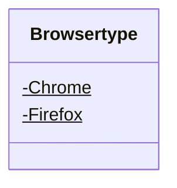

<div id="IBrowser-class-diagram"></div>

##### `IBrowser` class diagram

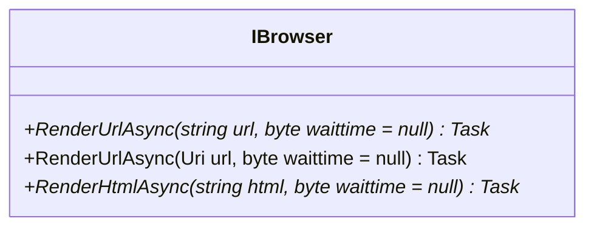

<div id="RemoteBrowser-class-diagram"></div>

##### `RemoteBrowser` class diagram

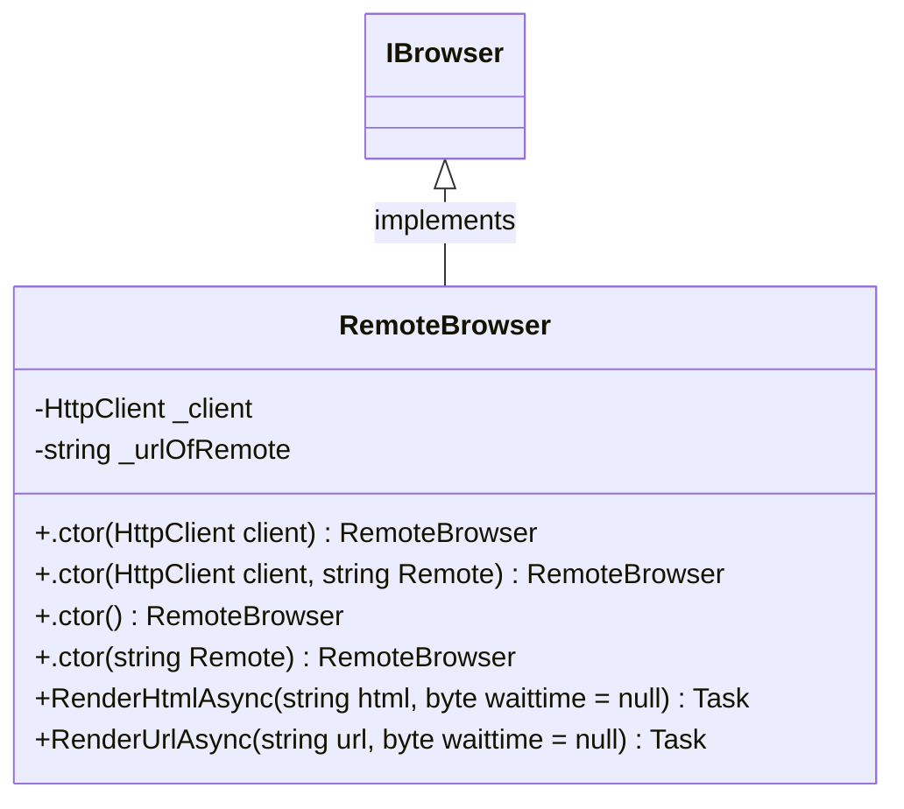

<div id="SeleniumBrowser-class-diagram"></div>

##### `SeleniumBrowser` class diagram

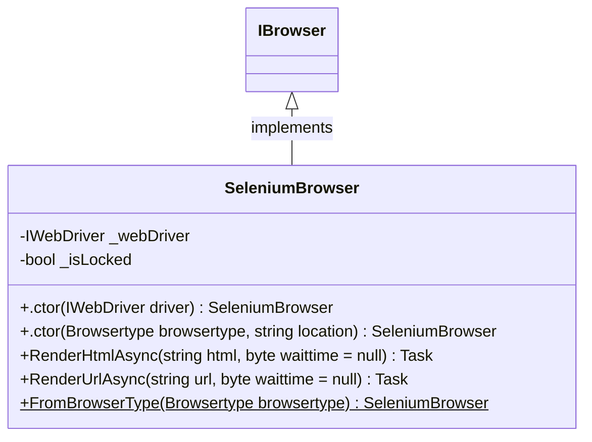

<div id="DiscordSink-class-diagram"></div>

##### `DiscordSink` class diagram

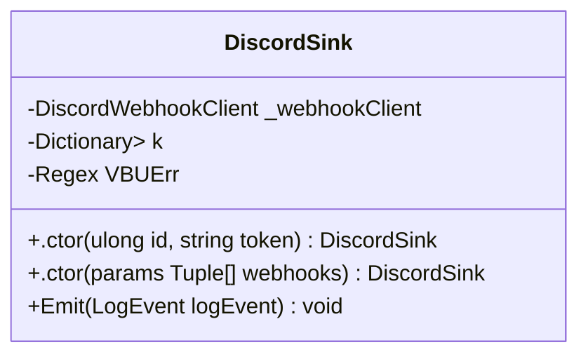

<div id="DiscordSinkExtensions-class-diagram"></div>

##### `DiscordSinkExtensions` class diagram

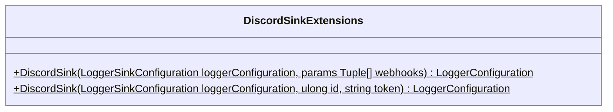

<div id="Anime-class-diagram"></div>

##### `Anime` class diagram

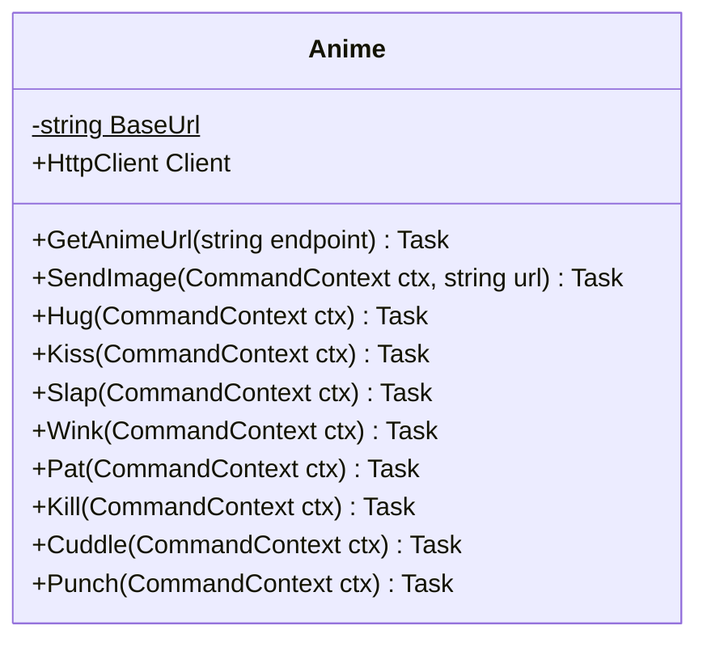

<div id="Anime.RootObject-class-diagram"></div>

##### `Anime.RootObject` class diagram

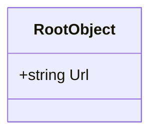

<div id="PixelsArchiverConfig-class-diagram"></div>

##### `PixelsArchiverConfig` class diagram

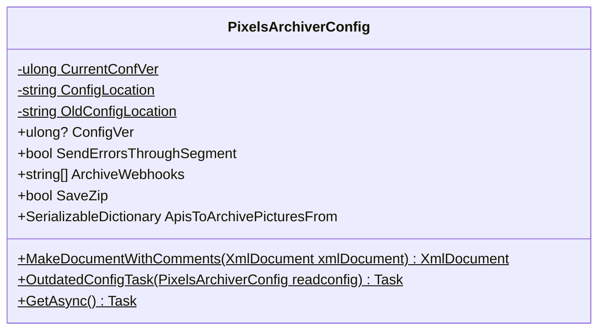

<div id="PixelArchiverService-class-diagram"></div>

##### `PixelArchiverService` class diagram

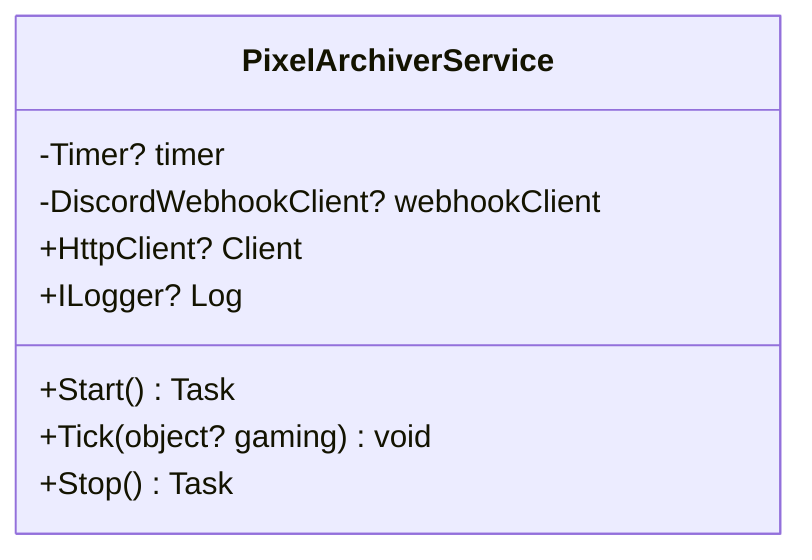

<div id="Rootobject-class-diagram"></div>

##### `Rootobject` class diagram

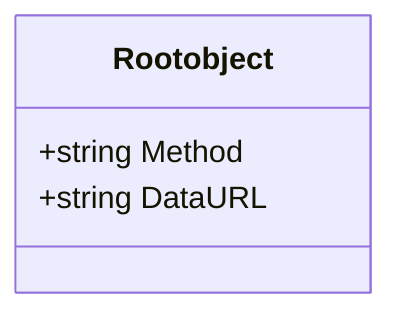

<div id="CategoryAttribute-class-diagram"></div>

##### `CategoryAttribute` class diagram

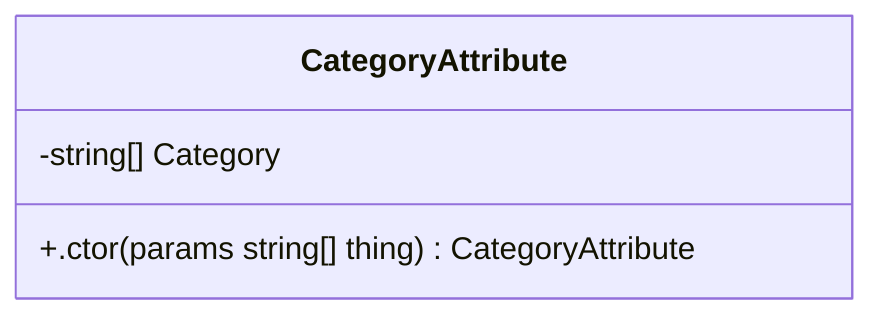

<div id="RequireAttachmentAttribute-class-diagram"></div>

##### `RequireAttachmentAttribute` class diagram

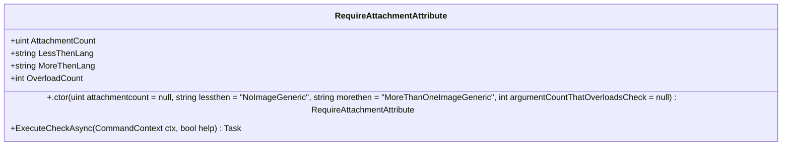

<div id="RequireConfigVariableAttribute-class-diagram"></div>

##### `RequireConfigVariableAttribute` class diagram

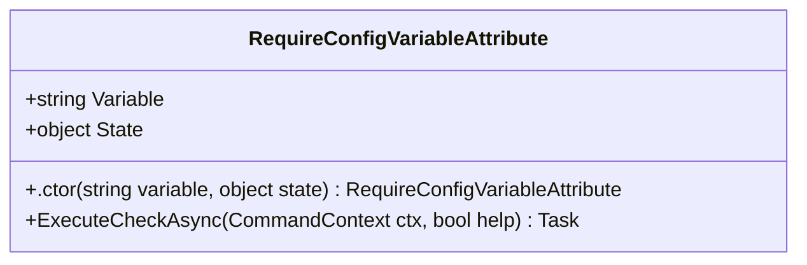

<div id="RequireGuildDatabaseValueAttribute-class-diagram"></div>

##### `RequireGuildDatabaseValueAttribute` class diagram

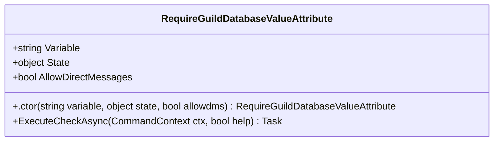

<div id="RequireGuildDatabaseValueSlashAttribute-class-diagram"></div>

##### `RequireGuildDatabaseValueSlashAttribute` class diagram

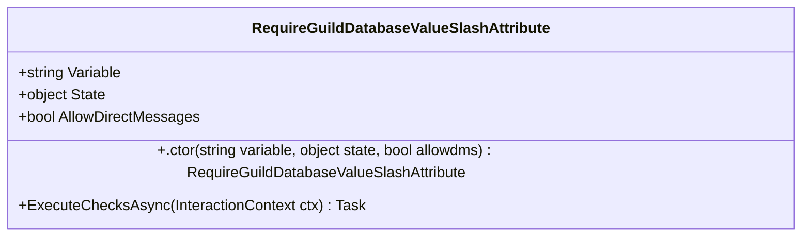

<div id="RequireTranslatorAttribute-class-diagram"></div>

##### `RequireTranslatorAttribute` class diagram

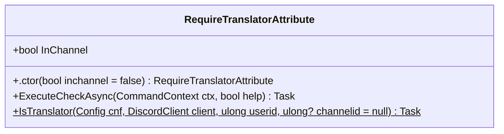

<div id="XmlCommentInsideAttribute-class-diagram"></div>

##### `XmlCommentInsideAttribute` class diagram

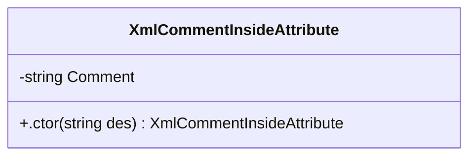

<div id="XmlDescriptionAttribute-class-diagram"></div>

##### `XmlDescriptionAttribute` class diagram

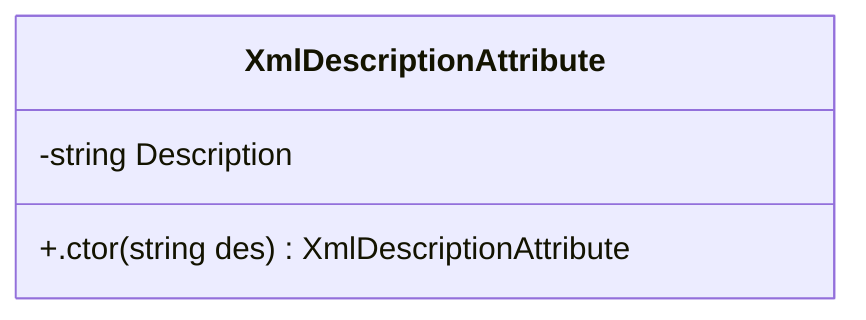

<div id="BetterVoteLavalinkPlayer-class-diagram"></div>

##### `BetterVoteLavalinkPlayer` class diagram

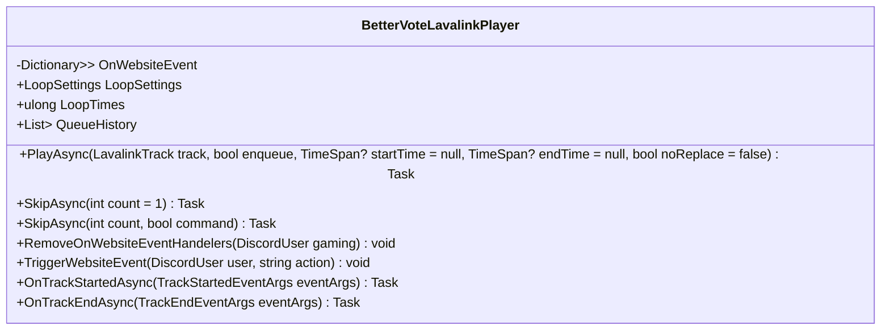

<div id="CustomHelpFormatter-class-diagram"></div>

##### `CustomHelpFormatter` class diagram

```mermaid
classDiagram
class CustomHelpFormatter{
    +DiscordEmbedBuilder EmbedBuilder
    +Command Command
    +Language Lang
    +.ctor(CommandContext ctx) CustomHelpFormatter
    +WithCommand(Command command) BaseHelpFormatter
    +WithSubcommands(IEnumerable<Command> subcommands) BaseHelpFormatter
    +Build() CommandHelpMessage
}

```

<div id="Oauth.Guild-class-diagram"></div>

##### `Oauth.Guild` class diagram

```mermaid
classDiagram
class Guild{
    +string Id
    +ulong UId
    +string Name
    +string Icon
    +bool Owner
    +string Permissions
    +string[] Features
}

```

<div id="IRequireFonts-class-diagram"></div>

##### `IRequireFonts` class diagram

```mermaid
classDiagram
class IRequireFonts{
}

```

<div id="LoopSettings-class-diagram"></div>

##### `LoopSettings` class diagram

```mermaid
classDiagram
class LoopSettings{
    -NotLooping$
    -LoopingSong$
    -LoopingQueue$
}

```

<div id="Oauth-class-diagram"></div>

##### `Oauth` class diagram

```mermaid
classDiagram
class Oauth{
}

```

<div id="Oauth.Oauththingy-class-diagram"></div>

##### `Oauth.Oauththingy` class diagram

```mermaid
classDiagram
class Oauththingy{
    +string Id
    +ulong UId
    +string Username
    +string Avatar
    +string Discriminator
    +int Public_flags
    +int Flags
    +string Email
    +bool Verified
    +string Locale
    +bool Mfa_enabled
}

```

<div id="SilverBotCommandModule-class-diagram"></div>

##### `SilverBotCommandModule` class diagram

```mermaid
classDiagram
class SilverBotCommandModule{
    +ExecuteRequirements(Config conf) Task<bool>
}

```

<div id="SilverBotPlaylist-class-diagram"></div>

##### `SilverBotPlaylist` class diagram

```mermaid
classDiagram
class SilverBotPlaylist{
    +string[] Identifiers
    +double CurrentSongTimems
    +string PlaylistTitle
}

```

<div id="Oauth.Token-class-diagram"></div>

##### `Oauth.Token` class diagram

```mermaid
classDiagram
class Token{
    +string AccessToken
    +string TokenType
    +ulong ExpiresIn
    +string RefreshToken
    +string Scope
}

```

<div id="PlannedEvent-class-diagram"></div>

##### `PlannedEvent` class diagram

```mermaid
classDiagram
class PlannedEvent{
    +string EventID
    +DateTime Time
    +PlannedEventType Type
    +ulong UserID
    +ulong ChannelID
    +ulong MessageID
    +ulong? ResponseMessageID
    +string Data
    +bool Handled
}

```

<div id="PlannedEventType-class-diagram"></div>

##### `PlannedEventType` class diagram

```mermaid
classDiagram
class PlannedEventType{
    -EmojiPoll$
    -GiveAway$
    -Reminder$
}

```

<div id="ServerStatString-class-diagram"></div>

##### `ServerStatString` class diagram

```mermaid
classDiagram
class ServerStatString{
    +string Template
    +.ctor() ServerStatString
    +.ctor(string template) ServerStatString
    +Serialize(Dictionary<string, string> dict) string
    +GetStringDictionaryAsync(DiscordGuild guild)$ Task<Dictionary<string, string>>
}

```

<div id="TranslatorSettings-class-diagram"></div>

##### `TranslatorSettings` class diagram

```mermaid
classDiagram
class TranslatorSettings{
    +ulong Id
    +bool IsTranslator
    +Language CurrentCustomLanguage
    +ICollection<Language> CustomLanguages
}

```

<div id="UserExperience-class-diagram"></div>

##### `UserExperience` class diagram

```mermaid
classDiagram
class UserExperience{
    +ulong Id
    +string XPString
    +BigInteger XP
    +Increase() void
    +Increase(ulong count) void
    +Decrease() void
    +Decrease(ulong count) void
}

```

<div id="UserQuote-class-diagram"></div>

##### `UserQuote` class diagram

```mermaid
classDiagram
class UserQuote{
    +string QuoteId
    +ulong UserId
    +string QuoteContent
    +DateTime TimeStamp
}

```

<div id="AdminCommands-class-diagram"></div>

##### `AdminCommands` class diagram

```mermaid
classDiagram
class AdminCommands{
    -DiscordEmoji[] _pollEmojiCache
    +DatabaseContext Database
    +HttpClient HttpClient
    +SetPrefix(CommandContext ctx, params string[] cake) Task
    +EmojiPollAsync(CommandContext commandContext, TimeSpan duration, string question) Task
    +GiveAway(CommandContext commandContext, TimeSpan duration, string item) Task
    +ExportEmotesToGuilded(CommandContext ctx) Task
    +DownloadEmotz(CommandContext ctx) Task
}

```

<div id="Audio-class-diagram"></div>

##### `Audio` class diagram

```mermaid
classDiagram
class Audio{
    +LavalinkNode AudioService
    +LyricsService LyricsService
    +Config Config
    +SpotifyClient SpotifyClient
    +ArtworkService ArtworkService
    +IsInVc(CommandContext ctx) bool
    +IsInVc(CommandContext ctx, LavalinkNode lavalinkNode)$ bool
    +SendNowPlayingMessage(CommandContext ctx, string title = "", string message = "", string imageurl = "", string url = "", Language language = null)$ Task
    +SendSimpleMessage(CommandContext ctx, string title = "", string message = "", string image = "", Language language = null)$ Task
    +TimeTillSongPlays(QueuedLavalinkPlayer player, int song) TimeSpan
    +PlayNext(CommandContext ctx, SongORSongs song) Task
    +Play(CommandContext ctx) Task
    +Play(CommandContext ctx, SongORSongs song) Task
    +Volume(CommandContext ctx, ushort volume) Task
    +Seek(CommandContext ctx, TimeSpan time) Task
    +ClearQueue(CommandContext ctx) Task
    +Shuffle(CommandContext ctx) Task
    +ExportQueue(CommandContext ctx, string playlistName = null) Task
    +Remove(CommandContext ctx, int songindex) Task
    +QueueHistory(CommandContext ctx) Task
    +Queue(CommandContext ctx) Task
    +Loop(CommandContext ctx, LoopSettings settings) Task
    +Pause(CommandContext ctx) Task
    +Ovh(CommandContext ctx, string name, string artist) Task
    +Aliases(CommandContext ctx) Task
    +Resume(CommandContext ctx) Task
    +Join(CommandContext ctx) Task
    +StaticJoin(CommandContext ctx, LavalinkNode audioService)$ Task
    +Skip(CommandContext ctx) Task
    +VoteSkip(CommandContext ctx) Task
    +ForceDisconnect(CommandContext ctx) Task
    +Disconnect(CommandContext ctx) Task
}

```

<div id="BibiCommands-class-diagram"></div>

##### `BibiCommands` class diagram

```mermaid
classDiagram
IRequireFonts <|-- BibiCommands : implements
class BibiCommands{
    -Font _bibiFont
    +string[] RequiredFontFamilies$
    +Config Config
    +int BibiPictureCount
    +ExecuteRequirements(Config conf) Task<bool>
    +Bibi(CommandContext ctx, string input) Task
}

```

<div id="BibiLib-class-diagram"></div>

##### `BibiLib` class diagram

```mermaid
classDiagram
class BibiLib{
    -string[] _bibiDescText
    -string[] _bibiFullDescText
    +Config Config
    +ExecuteRequirements(Config conf) Task<bool>
    +EnsureCreated() void
    +GetBibiDescText() string[]
    +GetBibiFullDescText() string[]
    +BibiLibrary(CommandContext ctx) Task
    +BibiLibraryFull(CommandContext ctx) Task
}

```

<div id="Bubot-class-diagram"></div>

##### `Bubot` class diagram

```mermaid
classDiagram
class Bubot{
    +Silveryeet(CommandContext ctx) Task
}

```

<div id="CalculatorCommands-class-diagram"></div>

##### `CalculatorCommands` class diagram

```mermaid
classDiagram
class CalculatorCommands{
    -string Jscode$
    +ExecuteRequirements(Config conf) Task<bool>
    +Calc(CommandContext ctx, string input) Task
}

```

<div id="CodeEnv-class-diagram"></div>

##### `CodeEnv` class diagram

```mermaid
classDiagram
class CodeEnv{
    +CommandContext Ctx
    +DiscordMember Member
    +DiscordUser User
    +DiscordGuild Guild
    +DiscordClient Client
    +Config ExConfig
    +Config Config
    +string VerString
    +DatabaseContext DbContext
    +.ctor(CommandContext context, Config config, DatabaseContext dbctx) CodeEnv
}

```

<div id="ImageModule.EFilter-class-diagram"></div>

##### `ImageModule.EFilter` class diagram

```mermaid
classDiagram
class EFilter{
    -Grayscale$
    -Comic$
}

```

<div id="OwnerOnly.Emote-class-diagram"></div>

##### `OwnerOnly.Emote` class diagram

```mermaid
classDiagram
class Emote{
    +string Name
    +string Url
}

```

<div id="Emotes-class-diagram"></div>

##### `Emotes` class diagram

```mermaid
classDiagram
class Emotes{
    +DatabaseContext Database
    +Config Config
    +HttpClient HttpClient
    +AddEmote(CommandContext ctx, string name, SdImage url) Task
    +AddEmote(CommandContext ctx, string name) Task
}

```

<div id="Experience-class-diagram"></div>

##### `Experience` class diagram

```mermaid
classDiagram
IRequireFonts <|-- Experience : implements
class Experience{
    -IEnumerable<int> Range$
    -SolidBrush _blackBrush
    -Font _diavloLight
    +DatabaseContext Database
    +HttpClient HttpClient
    +string[] RequiredFontFamilies$
    +BonusXp(CommandContext ctx, byte percent) Task
    +BonusXpPerperson(CommandContext ctx, ulong xp) Task
    +XpCommand(CommandContext ctx) Task
    +XpCommand(CommandContext ctx, DiscordMember member) Task
    +XpLeaderboard(CommandContext ctx) Task
    +XpCard(CommandContext ctx, DiscordUser user) Task
    +XpCard(CommandContext ctx) Task
    +GetNeededXpForNextLevel(BigInteger xp) BigInteger
    +GetProgressToNextLevel(BigInteger xp) double
    +GetLevel(BigInteger xp) BigInteger
}

```

<div id="Genericcommands-class-diagram"></div>

##### `Genericcommands` class diagram

```mermaid
classDiagram
class Genericcommands{
    +Config Config
    +HttpClient HttpClient
    +GreetCommand(CommandContext ctx) Task
    +Fox(CommandContext ctx) Task
    +Kindsffeefdfdfergergrgfdfdsgfdfg(CommandContext ctx) Task
    +Time(CommandContext ctx) Task
    +Invite(CommandContext ctx) Task
    +Ping(CommandContext ctx) Task
    +DumpMessage(CommandContext ctx, DiscordMessage message) Task
    +DumpMessage(CommandContext ctx) Task
    +Dukt(CommandContext ctx) Task
    +SimpleImageMeme(CommandContext ctx, string imageurl, string title = null, string content = null, Language language = null)$ Task
    +Monke(CommandContext ctx) Task
    +IsAtSilverCraftAsync(DiscordClient discord, DiscordUser b, Config cnf)$ Task<bool>
    +Userinfo(CommandContext ctx, DiscordUser a) Task
    +Userinfo(CommandContext ctx) Task
}

```

<div id="Giphy-class-diagram"></div>

##### `Giphy` class diagram

```mermaid
classDiagram
class Giphy{
    -Giphy _giphy
    +Config Config
    +CreateInstance()$ Giphy
    +MakeSureTokenIsSet() void
    +Random(CommandContext ctx) Task
    +Search(CommandContext ctx, string term) Task
    +WaitForNextMessage(CommandContext ctx, DiscordMessage oldmessage, InteractivityExtension interactivity, Language lang, int page, string formated, GiphySearchResult gifResult, DiscordEmbedBuilder b = null) Task
}

```

<div id="ImageModule-class-diagram"></div>

##### `ImageModule` class diagram

```mermaid
classDiagram
IRequireFonts <|-- ImageModule : implements
class ImageModule{
    -int MaxBytes$
    -JpegEncoder BadJpegEncoder$
    -FontFamily _captionFont
    -FontFamily _jokerFontFamily
    -Font _motivateFont
    -Font _subtitlesFont
    +HttpClient HttpClient
    +string[] RequiredFontFamilies$
    +DrawText(string text, Font font, Color textColor, Color backColor)$ Image
    +DrawText(CommandContext ctx, string text, string font = "Diavlo Light", float size = 30) Task
    +SendImageStream(CommandContext ctx, Stream outstream, string filename = "sbimg.png", string content = null, Language lang = null)$ Task
    +ResizeAsync(byte[] photoBytes, Size size, IImageFormat? format = null)$ Task<Tuple<MemoryStream, string>>
    +Make_jpegnisedAsync(byte[] photoBytes)$ Task<MemoryStream>
    +Send_img_plsAsync(CommandContext ctx, string e, Language lang = null)$ Task
    +TintAsync(byte[] photoBytes, Color color)$ Task<Tuple<MemoryStream, string>>
    +FilterImgBytes(byte[] photoBytes, EFilter filter)$ Task<Tuple<MemoryStream, string>>
    +Jpegize(CommandContext ctx, SdImage image) Task
    +Jpegize(CommandContext ctx) Task
    +Resize(CommandContext ctx, SdImage image, int x = 0, int y = 0, IImageFormat format = null) Task
    +Resize(CommandContext ctx, SdImage image, IImageFormat format) Task
    +Resize(CommandContext ctx, IImageFormat format) Task
    +Resize(CommandContext ctx, int x = 0, int y = 0, IImageFormat format = null) Task
    +Tint(CommandContext ctx, SdImage image, Color color) Task
    +Tint(CommandContext ctx, Color color) Task
    +Grayscale(CommandContext ctx) Task
    +Grayscale(CommandContext ctx, SdImage image) Task
    +GetProfilePictureAsync(DiscordUser user, ushort size = null) Task<byte[]>
    +Reliable(CommandContext ctx) Task
    +Reliable(CommandContext ctx, DiscordUser koichi) Task
    +Reliable(CommandContext ctx, DiscordUser jotaro, DiscordUser koichi) Task
    +Seal(CommandContext ctx, string text) Task
    +HappyNewYear(CommandContext ctx) Task
    +HappyNewYear(CommandContext ctx, DiscordUser person) Task
    +AdventureTime(CommandContext ctx) Task
    +AdventureTime(CommandContext ctx, DiscordUser friendo) Task
    +AdventureTime(CommandContext ctx, DiscordUser person, DiscordUser friendo) Task
    +Paint(CommandContext ctx, SdImage image) Task
    +Paint(CommandContext ctx) Task
    +Motivate(CommandContext ctx, SdImage image, string text) Task
    +Motivate(CommandContext ctx, string text) Task
    +JokerLaugh(CommandContext ctx, string text) Task
    +Caption(CommandContext ctx, SdImage image, string text) Task
    +Caption(CommandContext ctx, string text) Task
}

```

<div id="CalculatorCommands.MathStep-class-diagram"></div>

##### `CalculatorCommands.MathStep` class diagram

```mermaid
classDiagram
class MathStep{
    +string OldVal
    +string NewVal
    +string Step
}

```

<div id="MiscCommands-class-diagram"></div>

##### `MiscCommands` class diagram

```mermaid
classDiagram
class MiscCommands{
    -Regex _csharpErrorR
    -Regex _dotNetErrorR
    -Regex _fsharpErrorR
    -Regex _ideErrorR
    -Regex _nuGetErrorR
    -Regex _serilogErrorR
    -Regex _sonarErrorR
    -Regex _vbErrorR
    +DatabaseContext Database
    +Config Config
    +HttpClient HttpClient
    +VersionInfoCmd(CommandContext ctx) Task
    +SetLanguage(CommandContext ctx, string langName) Task
    +SetLanguage(CommandContext ctx, bool enable) Task
    +TranlateUnknown(CommandContext ctx, string text) Task
    +TranlateUnknown(CommandContext ctx, string languageTo, string text) Task
    +Urban(CommandContext ctx, string query) Task
    +Nuget(CommandContext ctx, string query) Task
    +Csharperror(CommandContext ctx, string error) Task
}

```

<div id="ModCommands-class-diagram"></div>

##### `ModCommands` class diagram

```mermaid
classDiagram
class ModCommands{
    +Kick(CommandContext ctx, DiscordMember a, string reason = "The kick boot has spoken") Task
    +Ban(CommandContext ctx, DiscordUser a, string reason = "The ban hammer has spoken") Task
    +Kms(CommandContext ctx, bool ban = false) Task
    +Purge(CommandContext ctx, int amount) Task
}

```

<div id="OwnerOnly-class-diagram"></div>

##### `OwnerOnly` class diagram

```mermaid
classDiagram
class OwnerOnly{
    -string[] _urls
    -string[] _imports
    -JsonSerializerOptions Options$
    +DatabaseContext Database
    +IBrowser Browser
    +Config Config
    +HttpClient HttpClient
    +ReloadColors(CommandContext ctx) Task
    +Stress(CommandContext ctx) Task
    +UnRegCmd(CommandContext ctx, string cmdwithparm) Task
    +RegMod(CommandContext ctx, string mod, bool skipcheck = false) Task
    +Sudo(CommandContext ctx, DiscordMember member, string command) Task
    +Category(CommandContext ctx, DiscordRole role) Task
    +Category(CommandContext ctx, DiscordMember person) Task
    +RemoveCodeBraces(string str)$ string
    +SendStringFileWithContent(CommandContext ctx, string title, string file, string filename = "message.txt")$ Task
    +SendBestRepresentationAsync(object ob, CommandContext ctx)$ Task
    +Dependencies(CommandContext ctx) Task
    +Eval(CommandContext ctx, string code) Task
    +JsEval(CommandContext ctx, string code) Task
    +RunConsole(CommandContext ctx, string command) Task
    +Runsql(CommandContext ctx, string sql) Task
    +IsBrowserNotSpecifed(CommandContext ctx) Task<bool>
    +Webshot(CommandContext ctx, string html) Task
    +Addemotez(CommandContext ctx) Task
    +Guilds(CommandContext ctx) Task
    +ToggleBanUser(CommandContext ctx, DiscordUser userid, bool ban = true) Task
    +Reloadsplashes(CommandContext ctx) Task
    +Reloadsplashesas(CommandContext ctx) Task
    +RemoveUser(CommandContext ctx, DiscordUser userid) Task
    +Html(CommandContext ctx, string html) Task
}

```

<div id="ReactionRoleCommands-class-diagram"></div>

##### `ReactionRoleCommands` class diagram

```mermaid
classDiagram
class ReactionRoleCommands{
    -Regex Emote$
    +DatabaseContext DbCtx
    +ExecuteRequirements(Config conf) Task<bool>
    +ReactionRoleAdd(CommandContext ctx) Task
}

```

<div id="ReminderCommands-class-diagram"></div>

##### `ReminderCommands` class diagram

```mermaid
classDiagram
class ReminderCommands{
    +DatabaseContext DbCtx
    +RemindCommand(CommandContext ctx, TimeSpan duration, string item) Task
    +ListReminders(CommandContext ctx) Task
}

```

<div id="OwnerOnly.Rootobject-class-diagram"></div>

##### `OwnerOnly.Rootobject` class diagram

```mermaid
classDiagram
class Rootobject{
    +string Name
    +string Author
    +Emote[] Emotes
}

```

<div id="ServerStatsCommands-class-diagram"></div>

##### `ServerStatsCommands` class diagram

```mermaid
classDiagram
class ServerStatsCommands{
    -Regex _emote
    +DatabaseContext Database
    +EmoteAnalytics(CommandContext ctx, DiscordChannel channel, int limit = 10000) Task
    +SetCategory(CommandContext ctx, DiscordChannel category) Task
    +SetStatisticStrings(CommandContext ctx) Task
    +SetStatisticStrings(CommandContext ctx, params string[] cake) Task
}

```

<div id="OwnerOnly.SourceFile-class-diagram"></div>

##### `OwnerOnly.SourceFile` class diagram

```mermaid
classDiagram
class SourceFile{
    +string Name
    +string Extension
    +byte[] FileBytes
}

```

<div id="TranslatorCommands-class-diagram"></div>

##### `TranslatorCommands` class diagram

```mermaid
classDiagram
class TranslatorCommands{
    -Regex _customlangregex
    -JsonSerializerOptions _options
    +DatabaseContext DatabaseContext
    +HttpClient HttpClient
    +Edit(CommandContext ctx) Task
    +Get(CommandContext ctx, string name) Task
    +SetLanguage(CommandContext ctx, string lang) Task
    +UploadCustomLanguage(CommandContext ctx) Task
    +GenerateLanguageTemplate(CommandContext ctx, string lang = null) Task
}

```

<div id="UserQuotesModule-class-diagram"></div>

##### `UserQuotesModule` class diagram

```mermaid
classDiagram
class UserQuotesModule{
    +DatabaseContext Dctx
    +PresentQuote(CommandContext ctx, UserQuote quote, Language lang) Task
    +Add(CommandContext ctx, string content) Task
    +Get(CommandContext ctx, string id) Task
}

```

<div id="Webshot-class-diagram"></div>

##### `Webshot` class diagram

```mermaid
classDiagram
class Webshot{
    +IBrowser Browser
    +DatabaseContext Database
    +WebshotCommand(CommandContext ctx, string html, byte waittime = null) Task
    +Optin(CommandContext ctx, bool toggle) Task
}

```

<div id="BrowserConfig.browserconfig-class-diagram"></div>

##### `BrowserConfig.browserconfig` class diagram

```mermaid
classDiagram
class browserconfig{
    +browserconfigMsapplication msapplication
}

```

<div id="BrowserConfig-class-diagram"></div>

##### `BrowserConfig` class diagram

```mermaid
classDiagram
class BrowserConfig{
    +Index() browserconfig
}

```

<div id="BrowserConfig.browserconfigMsapplication-class-diagram"></div>

##### `BrowserConfig.browserconfigMsapplication` class diagram

```mermaid
classDiagram
class browserconfigMsapplication{
    +browserconfigMsapplicationTile tile
}

```

<div id="BrowserConfig.browserconfigMsapplicationTile-class-diagram"></div>

##### `BrowserConfig.browserconfigMsapplicationTile` class diagram

```mermaid
classDiagram
class browserconfigMsapplicationTile{
    +browserconfigMsapplicationTileSquare70x70logo square70x70logo
    +browserconfigMsapplicationTileSquare150x150logo square150x150logo
    +browserconfigMsapplicationTileSquare310x310logo square310x310logo
    +browserconfigMsapplicationTileWide310x150logo wide310x150logo
    +string TileColor
}

```

<div id="BrowserConfig.browserconfigMsapplicationTileSquare150x150logo-class-diagram"></div>

##### `BrowserConfig.browserconfigMsapplicationTileSquare150x150logo` class diagram

```mermaid
classDiagram
class browserconfigMsapplicationTileSquare150x150logo{
    +string src
}

```

<div id="BrowserConfig.browserconfigMsapplicationTileSquare310x310logo-class-diagram"></div>

##### `BrowserConfig.browserconfigMsapplicationTileSquare310x310logo` class diagram

```mermaid
classDiagram
class browserconfigMsapplicationTileSquare310x310logo{
    +string src
}

```

<div id="BrowserConfig.browserconfigMsapplicationTileSquare70x70logo-class-diagram"></div>

##### `BrowserConfig.browserconfigMsapplicationTileSquare70x70logo` class diagram

```mermaid
classDiagram
class browserconfigMsapplicationTileSquare70x70logo{
    +string src
}

```

<div id="BrowserConfig.browserconfigMsapplicationTileWide310x150logo-class-diagram"></div>

##### `BrowserConfig.browserconfigMsapplicationTileWide310x150logo` class diagram

```mermaid
classDiagram
class browserconfigMsapplicationTileWide310x150logo{
    +string src
}

```

<div id="Manifest.Icon-class-diagram"></div>

##### `Manifest.Icon` class diagram

```mermaid
classDiagram
class Icon{
    +string Src
    +string Sizes
    +string Type
    +string Purpose
}

```

<div id="Manifest-class-diagram"></div>

##### `Manifest` class diagram

```mermaid
classDiagram
class Manifest{
    +Index() Rootobject
}

```

<div id="Manifest.Rootobject-class-diagram"></div>

##### `Manifest.Rootobject` class diagram

```mermaid
classDiagram
class Rootobject{
    +string Name
    +string ShortName
    +Icon[] Icons
    +string StartUrl
    +string Display
    +string BackgroundColor
    +string ThemeColor
}

```

<div id="AttachmentCountIncorrect-class-diagram"></div>

##### `AttachmentCountIncorrect` class diagram

```mermaid
classDiagram
class AttachmentCountIncorrect{
    -TooManyAttachments$
    -TooLittleAttachments$
}

```

<div id="ImageFormatConverter-class-diagram"></div>

##### `ImageFormatConverter` class diagram

```mermaid
classDiagram
class ImageFormatConverter{
    +ConvertAsync(string value, CommandContext ctx) Task<Optional<IImageFormat>>
}

```

<div id="LoopSettingsConverter-class-diagram"></div>

##### `LoopSettingsConverter` class diagram

```mermaid
classDiagram
class LoopSettingsConverter{
    +ConvertAsync(string value, CommandContext ctx) Task<Optional<LoopSettings>>
}

```

<div id="RequireDjAttribute-class-diagram"></div>

##### `RequireDjAttribute` class diagram

```mermaid
classDiagram
class RequireDjAttribute{
    +ExecuteCheckAsync(CommandContext ctx, bool help) Task<bool>
}

```

<div id="SColorConverter-class-diagram"></div>

##### `SColorConverter` class diagram

```mermaid
classDiagram
class SColorConverter{
    +ConvertAsync(string value, CommandContext ctx) Task<Optional<Color>>
}

```

<div id="SdImage-class-diagram"></div>

##### `SdImage` class diagram

```mermaid
classDiagram
class SdImage{
    -byte[] _bytes
    -bool _disposedValue
    -string Url
    +.ctor() SdImage
    +.ctor(string url) SdImage
    +.ctor(DiscordUser user) SdImage
    +Dispose() void
    +FromContext(CommandContext ctx)$ SdImage
    +FromAttachments(IReadOnlyList<DiscordAttachment> attachments)$ SdImage
    +GetBytesAsync(HttpClient httpClient) Task<byte[]>
    +Dispose(bool disposing) void
    +age() void
}

```

<div id="SdImageConverter-class-diagram"></div>

##### `SdImageConverter` class diagram

```mermaid
classDiagram
class SdImageConverter{
    -Regex UrLregex$
    -Regex Emote$
    -Regex User$
    +ConvertAsync(string value, CommandContext ctx) Task<Optional<SdImage>>
}

```

<div id="SongOrSongsConverter-class-diagram"></div>

##### `SongOrSongsConverter` class diagram

```mermaid
classDiagram
class SongOrSongsConverter{
    -Regex PlaylistRegex$
    -Regex TrackRegex$
    -Regex AlbumRegex$
    +ConvertAsync(string value, CommandContext ctx) Task<Optional<SongORSongs>>
    +IsSpotifyString(string url) bool
    +GetTracksUsingAlbum(FullAlbum album, LavalinkNode audioService, uint skipsongs = null) IAsyncEnumerable<LavalinkTrack>
    +GetTracksUsingPlaylist(FullPlaylist playlist, LavalinkNode audioService, uint skipsongs = null) IAsyncEnumerable<LavalinkTrack>
    +IsInVc(CommandContext ctx, LavalinkNode audioService) bool
}

```

<div id="DatabaseContextFactory-class-diagram"></div>

##### `DatabaseContextFactory` class diagram

```mermaid
classDiagram
class DatabaseContextFactory{
    +CreateDbContext(string[] args) DatabaseContext
}

```

<div id="AttachmentCountIncorrectException-class-diagram"></div>

##### `AttachmentCountIncorrectException` class diagram

```mermaid
classDiagram
class AttachmentCountIncorrectException{
    +AttachmentCountIncorrect AttachmentCount
    +.ctor(AttachmentCountIncorrect count) AttachmentCountIncorrectException
    +.ctor(AttachmentCountIncorrect count, string message) AttachmentCountIncorrectException
    +.ctor(AttachmentCountIncorrect count, string message, Exception inner) AttachmentCountIncorrectException
    +.ctor(SerializationInfo info, StreamingContext context) AttachmentCountIncorrectException
    +SetAttachmentCount(AttachmentCountIncorrect value) void
}

```

<div id="MojangException-class-diagram"></div>

##### `MojangException` class diagram

```mermaid
classDiagram
class MojangException{
    +.ctor() MojangException
    +.ctor(string error, string errormessage) MojangException
    +.ctor(SerializationInfo info, StreamingContext context) MojangException
}

```

<div id="TemplateReturningNullException-class-diagram"></div>

##### `TemplateReturningNullException` class diagram

```mermaid
classDiagram
class TemplateReturningNullException{
    +.ctor() TemplateReturningNullException
    +.ctor(string template) TemplateReturningNullException
    +.ctor(string template, Exception innerException) TemplateReturningNullException
}

```

<div id="Fortnite-class-diagram"></div>

##### `Fortnite` class diagram

```mermaid
classDiagram
class Fortnite{
    -FortniteApiClient _api
    +Config Config
    +ExecuteRequirements(Config conf) Task<bool>
    +CreateInstance()$ Fortnite
    +MakeSureApiIsSet() void
    +Stats(CommandContext ctx, string name) Task
    +Brnews(CommandContext ctx) Task
    +Crnews(CommandContext ctx) Task
    +Stwnews(CommandContext ctx) Task
    +Itm(CommandContext ctx) Task
}

```

<div id="MinecraftModule-class-diagram"></div>

##### `MinecraftModule` class diagram

```mermaid
classDiagram
class MinecraftModule{
    +HttpClient HttpClient
    +Calculate(CommandContext ctx, string input) Task
}

```

<div id="SteamCommands-class-diagram"></div>

##### `SteamCommands` class diagram

```mermaid
classDiagram
class SteamCommands{
    +Search(CommandContext ctx, string game) Task
}

```

<div id="Addcustomprefixes-class-diagram"></div>

##### `Addcustomprefixes` class diagram

```mermaid
classDiagram
class Addcustomprefixes{
    +Up(MigrationBuilder migrationBuilder) void
    +Down(MigrationBuilder migrationBuilder) void
    +BuildTargetModel(ModelBuilder modelBuilder) void
}

```

<div id="Adddatafieldstoevents-class-diagram"></div>

##### `Adddatafieldstoevents` class diagram

```mermaid
classDiagram
class Adddatafieldstoevents{
    +Up(MigrationBuilder migrationBuilder) void
    +Down(MigrationBuilder migrationBuilder) void
    +BuildTargetModel(ModelBuilder modelBuilder) void
}

```

<div id="Addeventsindatabase-class-diagram"></div>

##### `Addeventsindatabase` class diagram

```mermaid
classDiagram
class Addeventsindatabase{
    +Up(MigrationBuilder migrationBuilder) void
    +Down(MigrationBuilder migrationBuilder) void
    +BuildTargetModel(ModelBuilder modelBuilder) void
}

```

<div id="Addreminderstringstodb-class-diagram"></div>

##### `Addreminderstringstodb` class diagram

```mermaid
classDiagram
class Addreminderstringstodb{
    +Up(MigrationBuilder migrationBuilder) void
    +Down(MigrationBuilder migrationBuilder) void
    +BuildTargetModel(ModelBuilder modelBuilder) void
}

```

<div id="addresponsemessageid-class-diagram"></div>

##### `addresponsemessageid` class diagram

```mermaid
classDiagram
class addresponsemessageid{
    +Up(MigrationBuilder migrationBuilder) void
    +Down(MigrationBuilder migrationBuilder) void
    +BuildTargetModel(ModelBuilder modelBuilder) void
}

```

<div id="addtoggleforrepeatedthings-class-diagram"></div>

##### `addtoggleforrepeatedthings` class diagram

```mermaid
classDiagram
class addtoggleforrepeatedthings{
    +Up(MigrationBuilder migrationBuilder) void
    +Down(MigrationBuilder migrationBuilder) void
    +BuildTargetModel(ModelBuilder modelBuilder) void
}

```

<div id="adduserquotes-class-diagram"></div>

##### `adduserquotes` class diagram

```mermaid
classDiagram
class adduserquotes{
    +Up(MigrationBuilder migrationBuilder) void
    +Down(MigrationBuilder migrationBuilder) void
    +BuildTargetModel(ModelBuilder modelBuilder) void
}

```

<div id="AddUserXP-class-diagram"></div>

##### `AddUserXP` class diagram

```mermaid
classDiagram
class AddUserXP{
    +Up(MigrationBuilder migrationBuilder) void
    +Down(MigrationBuilder migrationBuilder) void
    +BuildTargetModel(ModelBuilder modelBuilder) void
}

```

<div id="addwebshottoserversettngs-class-diagram"></div>

##### `addwebshottoserversettngs` class diagram

```mermaid
classDiagram
class addwebshottoserversettngs{
    +Up(MigrationBuilder migrationBuilder) void
    +Down(MigrationBuilder migrationBuilder) void
    +BuildTargetModel(ModelBuilder modelBuilder) void
}

```

<div id="Allowthetranslationofremindercontent-class-diagram"></div>

##### `Allowthetranslationofremindercontent` class diagram

```mermaid
classDiagram
class Allowthetranslationofremindercontent{
    +Up(MigrationBuilder migrationBuilder) void
    +Down(MigrationBuilder migrationBuilder) void
    +BuildTargetModel(ModelBuilder modelBuilder) void
}

```

<div id="Beemove-class-diagram"></div>

##### `Beemove` class diagram

```mermaid
classDiagram
class Beemove{
    +Up(MigrationBuilder migrationBuilder) void
    +Down(MigrationBuilder migrationBuilder) void
    +BuildTargetModel(ModelBuilder modelBuilder) void
}

```

<div id="DatabaseContextModelSnapshot-class-diagram"></div>

##### `DatabaseContextModelSnapshot` class diagram

```mermaid
classDiagram
class DatabaseContextModelSnapshot{
    +BuildModel(ModelBuilder modelBuilder) void
}

```

<div id="Fixbugandaddreactionrols-class-diagram"></div>

##### `Fixbugandaddreactionrols` class diagram

```mermaid
classDiagram
class Fixbugandaddreactionrols{
    +Up(MigrationBuilder migrationBuilder) void
    +Down(MigrationBuilder migrationBuilder) void
    +BuildTargetModel(ModelBuilder modelBuilder) void
}

```

<div id="InitialCreate-class-diagram"></div>

##### `InitialCreate` class diagram

```mermaid
classDiagram
class InitialCreate{
    +Up(MigrationBuilder migrationBuilder) void
    +Down(MigrationBuilder migrationBuilder) void
    +BuildTargetModel(ModelBuilder modelBuilder) void
}

```

<div id="RR-class-diagram"></div>

##### `RR` class diagram

```mermaid
classDiagram
class RR{
    +Up(MigrationBuilder migrationBuilder) void
    +Down(MigrationBuilder migrationBuilder) void
    +BuildTargetModel(ModelBuilder modelBuilder) void
}

```

<div id="transleuitry10-class-diagram"></div>

##### `transleuitry10` class diagram

```mermaid
classDiagram
class transleuitry10{
    +Up(MigrationBuilder migrationBuilder) void
    +Down(MigrationBuilder migrationBuilder) void
    +BuildTargetModel(ModelBuilder modelBuilder) void
}

```

<div id="usejsoninsteadoflettingefcoremapalistitsel-class-diagram"></div>

##### `usejsoninsteadoflettingefcoremapalistitsel` class diagram

```mermaid
classDiagram
class usejsoninsteadoflettingefcoremapalistitsel{
    +Up(MigrationBuilder migrationBuilder) void
    +Down(MigrationBuilder migrationBuilder) void
    +BuildTargetModel(ModelBuilder modelBuilder) void
}

```

<div id="Config-class-diagram"></div>

##### `Config` class diagram

```mermaid
classDiagram
class Config{
    -ulong CurrentConfVer$
    +string[] Prefix
    +LogLevel MinimumLogLevel
    +bool UseTxtFilesAsLogs
    +string Token
    +bool UseSlashCommands
    +string[] ModulesToLoad
    +SerializableDictionary<string, string> ServicesToLoadExternal
    +SerializableDictionary<string, string> ModulesToLoadExternal
    +string Gtoken
    +string FApiToken
    +string JavaLoc
    +ulong ServerId
    +bool CallGCOnSplashChange
    +bool ReactionRolesEnabled
    +bool HostWebsite
    +bool ClearTasks
    +int MsInterval
    +ulong? ConfigVer
    +bool AzureSignalR
    +string LogWebhook
    +string BotInfoUrl
    +bool TopggIsSelfbot
    +bool AllowPublicWebshot
    +int BrowserType
    +string DriverLocation
    +bool UseLavaLink
    +bool AutoDownloadAndStartLavalink
    +string LavalinkBuildsSourceGitHubUser
    +string LavalinkBuildsSourceGitHubRepo
    +string LavalinkRestUri
    +string LavalinkWebSocketUri
    +string LavalinkPassword
    +ulong FridayTextChannel
    +int DatabaseType
    +string ConnString
    +bool UseNodeJs
    +bool ColorConfig
    +bool EmulateBubot
    +bool EmulateBubotBibi
    +string LocalBibiPictures
    +string BibiLibCutOut
    +string BibiLibCutOutConfig
    +string BibiLibFull
    +string BibiLibFullConfig
    +bool SitInVc
    +string SpotifyClientId
    +string SpotifyClientSecret
    +bool EnableServerStatistics
    +ulong TranslatorRoleId
    +ulong TranslatorModeChannel
    +string LoginPageDiscordRedirectUrl
    +ulong LoginPageDiscordClientId
    +string LoginPageDiscordClientSecret
    +bool EnableUpdateChecking
    +string SegmentPrivateSource
    +string SegmentPublicSource
    +bool SendErrorsThroughSegment
    +string[] ArchiveWebhooks
    +ulong[] ChannelsToArchivePicturesFrom
    +SerializableDictionary<string, string> SongAliases
    +bool AllowYoutubeDl
    +Splash[] Splashes
    +MakeDocumentWithComments(XmlDocument xmlDocument)$ XmlDocument
    +OutdatedConfigTask(Config readconfig)$ Task
    +GetAsync()$ Task<Config>
}

```

<div id="DatabaseContext-class-diagram"></div>

##### `DatabaseContext` class diagram

```mermaid
classDiagram
class DatabaseContext{
    -string HtmlStart$
    -ServerStatString[] StatsTemplates
    +DbSet<ServerSettings> serverSettings
    +DbSet<UserSettings> userSettings
    +DbSet<UserExperience> userExperiences
    +DbSet<UserQuote> userQuotes
    +DbSet<PlannedEvent> plannedEvents
    +DbSet<TranslatorSettings> translatorSettings
    +DbSet<ReactionRoleMapping> ReactionRoleMappings
    +.ctor(DbContextOptions<DatabaseContext> options) DatabaseContext
    +RemoveUser(ulong userId) Task
    +GetIdsOfEmoteOptedInServers() List<ulong>
    +GetLangCodeUser(ulong id) string
    +atString[]>[] DatabaseContext.GetStatisticSettings() Tuple<ulong,
    +GetServerSettings(ulong id) ServerSettings
    +GetLangCodeGuild(ulong id) string
    +IsOptedInEmotes(ulong id) bool
    +IsBanned(ulong id) bool
    +OptIntoEmotes(ulong id) void
    +SetServerStatsCategory(ulong sid, ulong? id) void
    +SetServerPrefixes(ulong sid, string[] prefixes) void
    +SetServerStatStrings(ulong sid, ServerStatString[] id) void
    +ToggleBanUser(ulong id, bool BAN) void
    +InserOrUpdateLangCodeUser(ulong id, string lang) void
    +RunSqlAsync(string sql, IBrowser browser) Task<Tuple<string, Stream>>
    +InserOrUpdateLangCodeGuild(ulong id, string lang) void
}

```

<div id="ImageSteps-class-diagram"></div>

##### `ImageSteps` class diagram

```mermaid
classDiagram
class ImageSteps{
    -HttpClient client
    -bool disposedValue
    -Step[] steps
    +Dispose() void
    +SetClient(HttpClient c) void
    +Create(string url, HttpClient c)$ Task<ImageSteps>
    +ExecuteStepsAsync(Step[] filledsteps) Task<Image>
    +Dispose(bool disposing) void
    +eSteps() void
}

```

<div id="IService-class-diagram"></div>

##### `IService` class diagram

```mermaid
classDiagram
class IService{
    +Start()* Task
    +Stop()* Task
}

```

<div id="Language-class-diagram"></div>

##### `Language` class diagram

```mermaid
classDiagram
class Language{
    -Dictionary<string, Language> CachedLanguages$
    -JsonSerializerOptions options$
    +Guid Id
    +string LangName
    +string LangCodeGoogleTranslate
    +string Hi
    +string TimeInUtc
    +string CommandIsDisabled
    +string RequestedBy
    +string DblaReturnedNull
    +string AlreadyConnected
    +string UserNotConnected
    +string VolumeNotCorrect
    +string Joined
    +string NotConnected
    +string NotPlaying
    +string NothingInQueue
    +string NothingInQueueHistory
    +string SongByAuthor
    +string RemovedFront
    +string RemovedXSongOrSongs
    +string RemovedSong
    +string RemovedSongs
    +string LoopingSong
    +string LoopingQueue
    +string WrongImageCount
    +string NotLooping
    +string NoResults
    +string Left
    +string InformationAbout
    +string JoinedSilverCraft
    +string PrefixUsedTopgg
    +string ShuffledSuccess
    +string User
    +string Userid
    +string IsAnOwner
    +string IsABot
    +string AccountCreationDate
    +string AccountJoinDate
    +string SilverhostingJokeTitle
    +string SilverhostingJokeDescription
    +string PurgeNumberNegative
    +string PurgeNothingToDelete
    +string PurgeRemovedFront
    +string PurgeRemovedSingle
    +string PurgeRemovedPlural
    +string NoEmotesFound
    +string SearchedFor
    +string MultipleEmotesFound
    +string AlreadyOptedIn
    +string Server
    +string OptedIn
    +string OptedInWebshot
    +string OptedOutWebshot
    +string AllAvailibleEmotes
    +string UserIsBannedFromSilversocial
    +string UselessFact
    +string UserHasLowerRole
    +string Ban
    +string Kick
    +string BotHasLowerRole
    +string RandomGif
    +string PoweredByGiphy
    +string Meme
    +string NoImageGeneric
    +string EmoteWasLargerThan256K
    +string MoreThanOneImageGeneric
    +string OutputFileLargerThan8M
    +string PageGif
    +string PageGifButtonText
    +string PageNuget
    +string PeriodExpired
    +string UserIsntBot
    +string NowPlaying
    +string Enqueued
    +string SkippedNP
    +string CanForceSkip
    +string NotPaused
    +string Voted
    +string AlreadyVoted
    +string TimeTillTrackPlays
    +string TimeWhenTrackPlayed
    +string SearchFail
    +string SearchFailTitle
    +string SearchFailDescription
    +string Success
    +string UrbanExample
    +string SongLength
    +string SongTimePosition
    +string SongTimeLeft
    +string SongTimeLeftSongLoopingCurrent
    +string SongTimeLeftSongLooping
    +string LoadedSilverBotPlaylistWithTitle
    +string SongNotExist
    +string VersionInfoTitle
    +string PurgedBySilverBotReason
    +string NotValidLanguage
    +string CultureInfo
    +string BotBannedUser
    +string BotKickedUser
    +string AddedXAmountOfSongs
    +string TrackingStarted
    +string TrackingStopped
    +string TrackCanNotBeSeeked
    +string XPCommandSelf
    +string XPCommandOther
    +string XPCommandGeneralFail
    +string XPCommandCardSuccess
    +string XPCommandFailSelf
    +string XPCommandFailOther
    +string XPCommandLeaderBoardTitle
    +string XPCommandLeaderBoardPerson
    +string DisabledRepeatedPhrases
    +string EnableRepeatedPhrases
    +string CheckFailed
    +string ChecksFailed
    +string InvalidOverload
    +string GeneralException
    +string NoMatchingSubcommandsAndGroupNotExecutable
    +string QuotePreviewQuoteID
    +string QuoteGetNoBook
    +string QuoteGetNoQuoteWithId
    +string QuotePreviewDeleteSuccess
    +string HelpCommandHelpString
    +string HelpCommandNoDescription
    +string HelpCommandGroupCanBeExecuted
    +string HelpCommandGroupAliases
    +string HelpCommandGroupArguments
    +string HelpCommandGroupSubcommands
    +string HelpCommandGroupListingAllCommands
    +string RequireDJCheckFailed
    +string RequireGuildCheckFailed
    +string RequireNsfwCheckFailed
    +string RequireOwnerCheckFailed
    +string RequireRolesCheckFailedSG
    +string RequireRolesCheckFailedPL
    +string RequireBotPermisionsCheckFailedPL
    +string RequireBotPermisionsCheckFailedSG
    +string RequireUserPermisionsCheckFailedPL
    +string RequireUserPermisionsCheckFailedSG
    +string RequireBotAndUserPermisionsCheckFailedPL
    +string RequireBotAndUserPermisionsCheckFailedSG
    +string UnknownImageFormat
    +string AttributeDataBaseCheckNoDirectMessages
    +string AttributeDataBaseCheckWebShot
    +string JpegSuccess
    +string SilverSuccess
    +string ComicSuccess
    +string ResizeSuccess
    +string TintSuccess
    +string MathSteps
    +string Results
    +string SomethingsContributors
    +string NuGetVerified
    +string Type
    +string Downloads
    +string Version
    +string SetToProvidedStrings
    +string SetToDefaultStrings
    +string NoPerm
    +string CategorySetSuccess
    +string EmojiMessageDownloadStart
    +string EmojiMessageDownloadEnd
    +string EmojiEnd
    +string ReactionRoleNoPermManageRoles
    +string ReactionRoleIntro
    +string ReactionRoleTitle
    +string ReactionRoleResponseYes
    +string ReactionRoleResponseYes2
    +string ReactionRoleResponseYes3
    +string ReactionRoleResponseNo
    +string ReactionRoleResponseNo2
    +string ReactionRoleResponseNo3
    +string ReactionRoleRolesAdded
    +string ReactionRoleDone
    +string ReactionRoleNone
    +string ReactionRoleMainLoop
    +string ReactionRoleEmbedColour
    +string FreeToPlayGameType
    +string NotAvailableGameType
    +string CostsMoneyGameTypeBug
    +string NoGamesWereReturned
    +string NoGamesWereReturnedDescription
    +string AmericanMoney
    +string OS
    +string DsharpplusVersion
    +string VersionNumber
    +string GitRepo
    +string GitCommitHash
    +string GitBranch
    +string IsDirty
    +string CLR
    +string ReminderErrorNoContent
    +string ReminderSuccess
    +string ListReminderNone
    +string ListReminderStart
    +string ListReminderListMore
    +string ReminderContent
    +string PollResultsStart
    +string PollResultsResultYes
    +string PollResultsResultNo
    +string PollResultsResultUndecided
    +string PollErrorQuestionNull
    +string GiveawayResultsNoReactions
    +string GiveawayItemNull
    +string GiveawayResultsWon
    +string QueueNothing
    +GetCultureInfo() CultureInfo
    + Language.GetLoadedLanguages()$ Dictionary<string,
    +LoadedLanguages()$ string[]
    +GetAsync(string a)$ Task<Language>
    +SerialiseDefaultAsync(string loc)$ Task
    +SerialiseDefault(string loc)$ void
    +GetLanguageFromGuildIdAsync(ulong id, DatabaseContext db)$ Task<Language>
    +GetLanguageFromCtxAsync(CommandContext ctx)$ Task<Language>
    +GetLanguageFromCtxAsync(BaseContext ctx)$ Task<Language>
}

```

<div id="Meme-class-diagram"></div>

##### `Meme` class diagram

```mermaid
classDiagram
class Meme{
    +string PostLink
    +string Subreddit
    +string Title
    +string Url
    +bool Nsfw
    +bool Spoiler
    +string Author
    +int Ups
}

```

<div id="PictureStep-class-diagram"></div>

##### `PictureStep` class diagram

```mermaid
classDiagram
IDisposable <|-- PictureStep : implements
class PictureStep{
    +string Url
    +bool IsPfp
    +SdImage ImageF
    +ulong xSize
    +ulong ySize
    +.ctor() PictureStep
    +.ctor(ulong x, ulong y, ulong xSize, ulong ySize, string url, bool isPfp) PictureStep
    +Dispose() void
    +Image() SdImage
    +ureStep() void
    +Dispose(bool disposing) void
}

```

<div id="ServerSettings-class-diagram"></div>

##### `ServerSettings` class diagram

```mermaid
classDiagram
class ServerSettings{
    +ulong ServerId
    +string LangName
    +bool EmotesOptin
    +ulong? ServerStatsCategoryId
    +ServerStatString[] ServerStatsTemplates
    +string ServerStatsTemplatesInJson
    +bool RepeatThings
    +bool WebShot
    +string[] Prefixes
    +string PrefixesInJson
    +.ctor() ServerSettings
}

```

<div id="SongORSongs-class-diagram"></div>

##### `SongORSongs` class diagram

```mermaid
classDiagram
class SongORSongs{
    +LavalinkTrack? Song
    +TimeSpan? SongStartTime
    +string NameOfPlayList
    +IAsyncEnumerable<LavalinkTrack>? GetRestOfSongs
    +.ctor(LavalinkTrack song, string nameofplaylist, IAsyncEnumerable<LavalinkTrack>? songs) SongORSongs
    +.ctor(LavalinkTrack song, string nameofplaylist, IAsyncEnumerable<LavalinkTrack>? songs, TimeSpan startime) SongORSongs
}

```

<div id="Splash-class-diagram"></div>

##### `Splash` class diagram

```mermaid
classDiagram
class Splash{
    +string Name
    +ActivityType Type
    +string StreamUrl
    +.ctor() Splash
    +.ctor(string namewithparameters, ActivityType type) Splash
    +GetFromDiscordActivity(DiscordActivity discordActivity)$ Splash
    +GetDiscordActivity(Dictionary<string, string> pairs) DiscordActivity
}

```

<div id="Steam-class-diagram"></div>

##### `Steam` class diagram

```mermaid
classDiagram
class Steam{
    +.ctor() Steam
    +Search(string searchQuery)$ List<Listing>
}

```

<div id="Step-class-diagram"></div>

##### `Step` class diagram

```mermaid
classDiagram
class Step{
    +ulong x
    +ulong y
    +.ctor() Step
    +.ctor(ulong x, ulong y) Step
}

```

<div id="TemplateStep-class-diagram"></div>

##### `TemplateStep` class diagram

```mermaid
classDiagram
IDisposable <|-- TemplateStep : implements
class TemplateStep{
    -Image _image
    -bool isUrl
    -string template
    +.ctor() TemplateStep
    +.ctor(ulong x, ulong y, string template, bool isUrl) TemplateStep
    +Dispose() void
    +GetImage(HttpClient e = null) Image
    +lateStep() void
    +Dispose(bool disposing) void
}

```

<div id="UserSettings-class-diagram"></div>

##### `UserSettings` class diagram

```mermaid
classDiagram
class UserSettings{
    +ulong Id
    +string LangName
    +bool IsBanned
    +bool UsesNewMusicPage
}

```

<div id="ErrorModel-class-diagram"></div>

##### `ErrorModel` class diagram

```mermaid
classDiagram
class ErrorModel{
    +string RequestId
    +bool ShowRequestId
    +OnGet() void
}

```

<div id="ReactionRoleMapping-class-diagram"></div>

##### `ReactionRoleMapping` class diagram

```mermaid
classDiagram
class ReactionRoleMapping{
    +Guid MappingId
    +ulong RoleId
    +ulong MessageId
    +ulong ChannelId
    +string Emoji
    +ulong? EmojiId
    +ReactionRoleType Mode
}

```

<div id="ReactionRoleType-class-diagram"></div>

##### `ReactionRoleType` class diagram

```mermaid
classDiagram
class ReactionRoleType{
    -None$
    -Normal$
    -Inverse$
    -Sticky$
    -Vanishing$
}

```

<div id="BrowserDimension-class-diagram"></div>

##### `BrowserDimension` class diagram

```mermaid
classDiagram
class BrowserDimension{
    +int Width
    +int Height
}

```

<div id="BrowserService-class-diagram"></div>

##### `BrowserService` class diagram

```mermaid
classDiagram
class BrowserService{
    -IJSRuntime _js
    +.ctor(IJSRuntime js) BrowserService
    +GetDimensions() Task<BrowserDimension>
}

```

<div id="CloudFlareConnectingIpMiddleware-class-diagram"></div>

##### `CloudFlareConnectingIpMiddleware` class diagram

```mermaid
classDiagram
class CloudFlareConnectingIpMiddleware{
    -string CloudflareConnectingIpHeaderName$
    +GetStrings(string url)$ IEnumerable<string>
    +GetCloudflareIp()$ string[]
    +UseCloudflareForwardHeaderOptions(IApplicationBuilder builder)$ void
}

```

<div id="CommandErrorHandler-class-diagram"></div>

##### `CommandErrorHandler` class diagram

```mermaid
classDiagram
class CommandErrorHandler{
    +ServiceProvider ServiceProvider$
    +Logger Log$
    +bool UseSegment$
    +CommandsNextExtension E$
    +RegisterErrorHandler(ServiceProvider sp, Logger log, CommandsNextExtension e)$ Task
    +Reload()$ void
    +RenderErrorMessageForAttribute(CheckBaseAttribute checkBase, Language lang, bool isinguild, CommandErrorEventArgs e)$ string
    +Commands_CommandErrored(CommandsNextExtension sender, CommandErrorEventArgs e)$ Task
}

```

<div id="ConsoleInputHelper-class-diagram"></div>

##### `ConsoleInputHelper` class diagram

```mermaid
classDiagram
class ConsoleInputHelper{
    +GetBoolFromConsole(bool? defaultValue = null)$ bool
}

```

<div id="EventsRunner-class-diagram"></div>

##### `EventsRunner` class diagram

```mermaid
classDiagram
class EventsRunner{
    +ServiceProvider ServiceProvider$
    +Logger Log$
    +InjectEvents(ServiceProvider sp, Logger log)$ void
    +RunEmojiEvent(PlannedEvent @event, DatabaseContext dbctx)$ Task
    +RunEmojiEventAsync(PlannedEvent @event, DatabaseContext dbctx)$ Task
    +RunReminderEvent(PlannedEvent @event, DatabaseContext dbctx)$ Task
    +RunReminderEventAsync(PlannedEvent @event, DatabaseContext dbctx)$ Task
    +RunGiveAwayEvent(PlannedEvent @event, DatabaseContext dbctx)$ Task
    +RunGiveAwayEventAsync(PlannedEvent @event, DatabaseContext dbctx)$ Task
    +RunEventsAsync()$ Task
}

```

<div id="IAnalyse-class-diagram"></div>

##### `IAnalyse` class diagram

```mermaid
classDiagram
class IAnalyse{
    +EmitEvent(DiscordUser userId, string eventName, IDictionary<string, object> args)* Task
}

```

<div id="Program-class-diagram"></div>

##### `Program` class diagram

```mermaid
classDiagram
class Program{
    -char DirSlash$
    -Config _config$
    -DiscordClient _discord$
    -LavalinkNode _audioService$
    -InactivityTrackingService _trackingService$
    -Logger _log$
    -HttpClient HttpClient$
    -int _lastFriday$
    -string[] MessagesToRepeat$
    -Dictionary<ulong, DateTime> XpLevelling$
    -TimeSpan MessageLimit$
    -Dictionary<string, Tuple<Task, CancellationTokenSource>> RunningTasks$
    -Dictionary<Guid, Tuple<Task, CancellationTokenSource>> RunningTasksOfSecondRow$
    +ServiceProvider ServiceProvider$
    +RunningTasksOfSecondRowAdd(Guid a, Tuple<Task, CancellationTokenSource> b)$ Task
    +RunningTasksAdd(string a, Tuple<Task, CancellationTokenSource> b)$ Task
    +CreateHostBuilder(string[] args)$ IHostBuilder
    +Main(string[] args)$ void
    +CancelTasks()$ void
    +SendLog(Exception exception)$ void
    +GetConfig()$ Config
    +NewHttpClientWithUserAgent()$ HttpClient
    +IsNotNullAndIsNotB(object a, object b)$ bool
    +CheckIfAllFontsAreHere(string[] requiredFonts)$ bool
    +MainAsync(string[] args)$ Task
    +ResolvePrefixAsync(DiscordMessage msg)$ Task<int>
    +Commands_CommandExecuted(CommandsNextExtension sender, CommandExecutionEventArgs e)$ Task
    +GetStringDictionary(DiscordClient client)$ Dictionary<string, string>
    +StatisticsMainAsync(CancellationToken ct = null)$ Task
    +WaitForFridayAsync(CancellationToken ct = null)$ Task
    +ExecuteFridayAsync(bool friday = true, CancellationToken ct = null)$ Task
    +IncreaseXp(ulong id, ulong count = null)$ Task
    +Discord_MessageCreated(DiscordClient sender, MessageCreateEventArgs e)$ Task
}

```

<div id="ReactionRolesHandlers-class-diagram"></div>

##### `ReactionRolesHandlers` class diagram

```mermaid
classDiagram
class ReactionRolesHandlers{
    +AddReactionRolesHandlers(DiscordClient discord)$ void
    +RemoveReactionRolesHandlers(DiscordClient discord)$ void
    +Discord_MessageReactionAdded(DiscordClient sender, MessageReactionAddEventArgs e)$ Task
    +Discord_MessageReactionRemoved(DiscordClient sender, MessageReactionRemoveEventArgs e)$ Task
}

```

<div id="SegmentIo-class-diagram"></div>

##### `SegmentIo` class diagram

```mermaid
classDiagram
IAnalyse <|-- SegmentIo : implements
class SegmentIo{
    +.ctor(string token) SegmentIo
    +EmitEvent(DiscordUser userId, string eventName, IDictionary<string, object> args) Task
}

```

<div id="SerializableDictionary&lt;TKey, TValue&gt;-class-diagram"></div>

##### `SerializableDictionary<TKey, TValue>` class diagram

```mermaid
classDiagram
IXmlSerializable <|-- SerializableDictionary<TKey, TValue> : implements
class SerializableDictionary<TKey, TValue>{
    +GetSchema() XmlSchema
    +ReadXml(XmlReader reader) void
    +WriteXml(XmlWriter writer) void
}

```

<div id="SlashErrorHandler-class-diagram"></div>

##### `SlashErrorHandler` class diagram

```mermaid
classDiagram
class SlashErrorHandler{
    +ServiceProvider ServiceProvider$
    +Logger Log$
    +RegisterErrorHandler(ServiceProvider sp, Logger log, SlashCommandsExtension e)$ Task
    +RemoveStringFromEnd(string a, string sub)$ string
    +RenderErrorMessageForAttribute(SlashCheckBaseAttribute checkBase, Language lang, bool isinguild, SlashCommandErrorEventArgs e)$ string
    +Slash_SlashCommandErrored(SlashCommandsExtension sender, SlashCommandErrorEventArgs e)$ Task
}

```

<div id="VersionInfo-class-diagram"></div>

##### `VersionInfo` class diagram

```mermaid
classDiagram
class VersionInfo{
    -string VNumber$
    +Checkforupdates(HttpClient client, Logger log)$ Task
}

```

<div id="WebpageStartup-class-diagram"></div>

##### `WebpageStartup` class diagram

```mermaid
classDiagram
class WebpageStartup{
    +IConfiguration Configuration
    +.ctor(IConfiguration configuration) WebpageStartup
    +ConfigureServices(IServiceCollection services) void
    +Configure(IApplicationBuilder app, IWebHostEnvironment env) void
}

```

<div id="GeneralCommands-class-diagram"></div>

##### `GeneralCommands` class diagram

```mermaid
classDiagram
class GeneralCommands{
    +DatabaseContext Dbctx
    +Config Cnf
    +TestCommand(InteractionContext ctx) Task
    +WhoIsTask(BaseContext ctx, DiscordUser user) Task
    +WhoIsCommand(InteractionContext ctx, DiscordUser user) Task
    +UserMenu(ContextMenuContext ctx) Task
    +VersionInfoCommand(InteractionContext ctx) Task
    +DuktHostingCommand(InteractionContext ctx) Task
    +DumpCommand(ContextMenuContext ctx) Task
}

```

<div id="WebshotSlash-class-diagram"></div>

##### `WebshotSlash` class diagram

```mermaid
classDiagram
class WebshotSlash{
    +IBrowser Browser
    +WebShot(InteractionContext ctx, string url, long waittime = null) Task
}

```

<div id="ArrayUtils-class-diagram"></div>

##### `ArrayUtils` class diagram

```mermaid
classDiagram
class ArrayUtils{
    +RandomFromArray<T>(T[] vs)$ T
}

```

<div id="GitHubUtils.Asset-class-diagram"></div>

##### `GitHubUtils.Asset` class diagram

```mermaid
classDiagram
class Asset{
    +string Url
    +int Id
    +string NodeId
    +string Name
    +string Label
    +Uploader Uploader
    +string ContentType
    +string State
    +int Size
    +int DownloadCount
    +DateTime CreatedAt
    +DateTime UpdatedAt
    +string BrowserDownloadUrl
}

```

<div id="GitHubUtils.Author-class-diagram"></div>

##### `GitHubUtils.Author` class diagram

```mermaid
classDiagram
class Author{
    +string Login
    +int Id
    +string NodeId
    +string AvatarUrl
    +string GravatarId
    +string Url
    +string HtmlUrl
    +string FollowersUrl
    +string FollowingUrl
    +string GistsUrl
    +string StarredUrl
    +string SubscriptionsUrl
    +string OrganizationsUrl
    +string ReposUrl
    +string EventsUrl
    +string ReceivedEventsUrl
    +string Type
    +bool SiteAdmin
}

```

<div id="GitHubUtils.Author1-class-diagram"></div>

##### `GitHubUtils.Author1` class diagram

```mermaid
classDiagram
class Author1{
    +string Login
    +int Id
    +string NodeId
    +string AvatarUrl
    +string GravatarId
    +string Url
    +string HtmlUrl
    +string Followers_url
    +string Following_url
    +string Gists_url
    +string Starred_url
    +string Subscriptions_url
    +string Organizations_url
    +string Repos_url
    +string Events_url
    +string Received_events_url
    +string Type
    +bool Site_admin
}

```

<div id="ColorUtils-class-diagram"></div>

##### `ColorUtils` class diagram

```mermaid
classDiagram
class ColorUtils{
    -DiscordColor[] cache$
    +DiscordColor[] Internal$
    +CreateInstance()$ ColorUtils
    +GetAsync(bool ignorecache = false, bool useinternal = false)$ Task<DiscordColor[]>
    +ReloadConfig()$ Task
    +GetSingleAsync()$ Task<DiscordColor>
    +GetSingleAsyncInternal(bool ignorecache = false, bool useinternal = false)$ Task<DiscordColor>
}

```

<div id="GitHubUtils.Commit-class-diagram"></div>

##### `GitHubUtils.Commit` class diagram

```mermaid
classDiagram
class Commit{
    +CommitAuthor Author
    +Committer Committer
    +string Message
    +Tree Tree
    +string Url
    +int CommentCount
    +Verification Verification
}

```

<div id="GitHubUtils.CommitAuthor-class-diagram"></div>

##### `GitHubUtils.CommitAuthor` class diagram

```mermaid
classDiagram
class CommitAuthor{
    +string Name
    +string Email
    +DateTime Date
}

```

<div id="GitHubUtils.CommitInfo-class-diagram"></div>

##### `GitHubUtils.CommitInfo` class diagram

```mermaid
classDiagram
class CommitInfo{
    +string Sha
    +string Node_id
    +Commit Commit
    +string Url
    +string HtmlUrl
    +string CommentsUrl
    +Author1 Author
    +Committer1 Committer
    +Parent[] Parents
    +Stats Stats
    +File[] Files
    +GetLatestFromRepoAsync(Repo repo, HttpClient client)$ Task<CommitInfo>
    +GetLatestFromRepoAsync(Repo repo, string branch, HttpClient client)$ Task<CommitInfo>
}

```

<div id="GitHubUtils.Committer-class-diagram"></div>

##### `GitHubUtils.Committer` class diagram

```mermaid
classDiagram
class Committer{
    +string Name
    +string Email
    +DateTime Date
}

```

<div id="GitHubUtils.Committer1-class-diagram"></div>

##### `GitHubUtils.Committer1` class diagram

```mermaid
classDiagram
class Committer1{
    +string Login
    +int Id
    +string Node_id
    +string Avatar_url
    +string Gravatar_id
    +string Url
    +string Html_url
    +string Followers_url
    +string Following_url
    +string Gists_url
    +string Starred_url
    +string Subscriptions_url
    +string Organizations_url
    +string Repos_url
    +string Events_url
    +string Received_events_url
    +string Type
    +bool SiteAdmin
}

```

<div id="NuGetUtils.Context-class-diagram"></div>

##### `NuGetUtils.Context` class diagram

```mermaid
classDiagram
class Context{
    +string Vocab
    +string Base
}

```

<div id="DateTimeUtils-class-diagram"></div>

##### `DateTimeUtils` class diagram

```mermaid
classDiagram
class DateTimeUtils{
    +DateTimeToTimeStamp(DateTime? dt, TimestampFormat tf = null, string def = "NA")$ string
    +DateTimeToTimeStamp(DateTime dt, TimestampFormat tf = null)$ string
}

```

<div id="NuGetUtils.Datum-class-diagram"></div>

##### `NuGetUtils.Datum` class diagram

```mermaid
classDiagram
class Datum{
    +string Atid
    +string Type
    +string Registration
    +string Id
    +string Version
    +string Description
    +string Summary
    +string Title
    +string IconUrl
    +string LicenseUrl
    +string ProjectUrl
    +string[] Tags
    +string[] Authors
    +int? TotalDownloads
    +bool? Verified
    +Packagetype[] PackageTypes
    +Version[] Versions
}

```

<div id="UrbanDictUtils.Defenition-class-diagram"></div>

##### `UrbanDictUtils.Defenition` class diagram

```mermaid
classDiagram
class Defenition{
    +string Definition
    +string Permalink
    +int ThumbsUp
    +object[] SoundUrls
    +string Author
    +string Word
    +int Defid
    +string CurrentVote
    +DateTime WrittenOn
    +string Example
    +int ThumbsDown
}

```

<div id="GitHubUtils.File-class-diagram"></div>

##### `GitHubUtils.File` class diagram

```mermaid
classDiagram
class File{
    +string Sha
    +string Filename
    +string Status
    +int Additions
    +int Deletions
    +int Changes
    +string Bloburl
    +string Rawurl
    +string Contents_url
    +string Patch
}

```

<div id="FileSizes-class-diagram"></div>

##### `FileSizes` class diagram

```mermaid
classDiagram
class FileSizes{
    -FSize[] FSizes$
    +.ctor() FileSizes
}

```

<div id="FileSizeUtils-class-diagram"></div>

##### `FileSizeUtils` class diagram

```mermaid
classDiagram
class FileSizeUtils{
    +FormatSize(long bytes)$ string
}

```

<div id="FileUtils-class-diagram"></div>

##### `FileUtils` class diagram

```mermaid
classDiagram
class FileUtils{
    +GetFileExtensionFromUrl(string url)$ string
}

```

<div id="FSize-class-diagram"></div>

##### `FSize` class diagram

```mermaid
classDiagram
class FSize{
    -string FullName
    -string Suffix
    +.ctor(string fn, string sfx) FSize
}

```

<div id="GitHubUtils-class-diagram"></div>

##### `GitHubUtils` class diagram

```mermaid
classDiagram
class GitHubUtils{
    -Regex R$
}

```

<div id="MinecraftUtils-class-diagram"></div>

##### `MinecraftUtils` class diagram

```mermaid
classDiagram
class MinecraftUtils{
    -string GetProfileUrl$
    -string CrafatarBaseUrl$
    +GetPlayerAsync(string name, HttpClient httpClient)$ Task<Player>
}

```

<div id="NuGetUtils-class-diagram"></div>

##### `NuGetUtils` class diagram

```mermaid
classDiagram
class NuGetUtils{
    +SearchAsync(string query, HttpClient httpClient)$ Task<Datum[]>
}

```

<div id="NumberUtils-class-diagram"></div>

##### `NumberUtils` class diagram

```mermaid
classDiagram
class NumberUtils{
    -string[] Divisors$
    +FormatSize(long bytes)$ string
}

```

<div id="NuGetUtils.Packagetype-class-diagram"></div>

##### `NuGetUtils.Packagetype` class diagram

```mermaid
classDiagram
class Packagetype{
    +string Name
}

```

<div id="GitHubUtils.Parent-class-diagram"></div>

##### `GitHubUtils.Parent` class diagram

```mermaid
classDiagram
class Parent{
    +string Sha
    +string Url
    +string Htmlurl
}

```

<div id="MinecraftUtils.Player-class-diagram"></div>

##### `MinecraftUtils.Player` class diagram

```mermaid
classDiagram
class Player{
    +string Name
    +string Id
    +string Error
    +string ErrorMessage
    +bool Demo
    +GetAvatarUrl() string
    +GetHeadUrl() string
    +GetBodyUrl() string
}

```

<div id="RandomGenerator-class-diagram"></div>

##### `RandomGenerator` class diagram

```mermaid
classDiagram
class RandomGenerator{
    +Next(int minValue, int maxExclusiveValue)$ int
    +GetRandomUInt()$ uint
    +GenerateRandomBytes(int bytesNumber)$ byte[]
    +RandomString(int length)$ string
    +RandomAbcString(int length, double timespan = 1.5)$ string
}

```

<div id="GitHubUtils.Release-class-diagram"></div>

##### `GitHubUtils.Release` class diagram

```mermaid
classDiagram
class Release{
    +string Url
    +string AssetsUrl
    +string UploadUrl
    +string HtmlUrl
    +int Id
    +Author Author
    +string NodeId
    +string TagName
    +string TargetCommitish
    +string Name
    +bool Draft
    +bool Prerelease
    +DateTime CreatedAt
    +DateTime PublishedAt
    +Asset[] Assets
    +string TarballUrl
    +string ZipballUrl
    +string Body
    +DownloadLatestAsync(Release release, HttpClient client)$ Task
    +DownloadLatestAsync(HttpClient client) Task
    +GetLatestFromRepoAsync(Repo repo, HttpClient client)$ Task<Release>
}

```

<div id="GitHubUtils.Repo-class-diagram"></div>

##### `GitHubUtils.Repo` class diagram

```mermaid
classDiagram
class Repo{
    +string User
    +string Reponame
    +.ctor(string user, string reponame) Repo
    +.ctor() Repo
    +TryParseUrl(string url)$ Optional<Repo>
}

```

<div id="NuGetUtils.Rootobject-class-diagram"></div>

##### `NuGetUtils.Rootobject` class diagram

```mermaid
classDiagram
class Rootobject{
    +Context Context
    +int TotalHits
    +Datum[] Data
}

```

<div id="UrbanDictUtils.Rootobject-class-diagram"></div>

##### `UrbanDictUtils.Rootobject` class diagram

```mermaid
classDiagram
class Rootobject{
    +Defenition[] List
}

```

<div id="ColorUtils.SdColor-class-diagram"></div>

##### `ColorUtils.SdColor` class diagram

```mermaid
classDiagram
class SdColor{
    +byte R
    +byte G
    +byte B
    +ToDiscordColor() DiscordColor
    +FromDiscordColor(DiscordColor color)$ SdColor
}

```

<div id="GitHubUtils.Stats-class-diagram"></div>

##### `GitHubUtils.Stats` class diagram

```mermaid
classDiagram
class Stats{
    +int Total
    +int Additions
    +int Deletions
}

```

<div id="StringUtils-class-diagram"></div>

##### `StringUtils` class diagram

```mermaid
classDiagram
class StringUtils{
    +RandomFromArray(string[] vs)$ string
    +FormatFromDictionary(string formatString, Dictionary<string, string> valueDict)$ string
    +SplitInParts(string s, int partLength)$ IEnumerable<string>
    +SplitInPartsIterator(string s, int partLength)$ IEnumerable<string>
    +BoolToEmoteString(bool b)$ string
    +RemoveStringFromEnd(string a, string sub)$ string
    +ArrayToString(string[] arr, string seperator = "")$ string
}

```

<div id="Translator-class-diagram"></div>

##### `Translator` class diagram

```mermaid
classDiagram
class Translator{
    -Dictionary<string, string> LanguageModeMap$
    -HttpClient _httpClient
    +IEnumerable<string> Languages$
    +.ctor() Translator
    +.ctor(HttpClient httpClient) Translator
    +TranslateAsync(string sourceText, string sourceLanguage, string targetLanguage) Task<Tuple<string, string>>
    +ContainsKeyOrVal(string language)$ bool
    +LanguageEnumToIdentifier(string language)$ string
}

```

<div id="GitHubUtils.Tree-class-diagram"></div>

##### `GitHubUtils.Tree` class diagram

```mermaid
classDiagram
class Tree{
    +string Sha
    +string Url
}

```

<div id="GitHubUtils.Uploader-class-diagram"></div>

##### `GitHubUtils.Uploader` class diagram

```mermaid
classDiagram
class Uploader{
    +string Login
    +int Id
    +string NodeId
    +string AvatarUrl
    +string GravatarId
    +string Url
    +string HtmlUrl
    +string FollowersUrl
    +string FollowingUrl
    +string GistsUrl
    +string StarredUrl
    +string SubscriptionsUrl
    +string OrganizationsUrl
    +string ReposUrl
    +string EventsUrl
    +string ReceivedEventsUrl
    +string Type
    +bool SiteAdmin
}

```

<div id="UrbanDictUtils-class-diagram"></div>

##### `UrbanDictUtils` class diagram

```mermaid
classDiagram
class UrbanDictUtils{
    +GetDefenition(string word, HttpClient httpClient)$ Task<Defenition[]>
}

```

<div id="GitHubUtils.Verification-class-diagram"></div>

##### `GitHubUtils.Verification` class diagram

```mermaid
classDiagram
class Verification{
    +bool Verified
    +string Reason
    +string Signature
    +string Payload
}

```

<div id="NuGetUtils.Version-class-diagram"></div>

##### `NuGetUtils.Version` class diagram

```mermaid
classDiagram
class Version{
    +string StrVersion
    +int Downloads
    +string Id
}

```

<div id="WebHookUtils-class-diagram"></div>

##### `WebHookUtils` class diagram

```mermaid
classDiagram
class WebHookUtils{
    -Regex WebhookUrlRegex$
    +ParseWebhookUrlNullable(string webhookUrl, out ulong? webhookIdnullable, out string webhookToken)$ void
    +ParseWebhookUrl(string webhookUrl, out ulong webhookId, out string webhookToken)$ void
}

```

<div id="XmlUtils-class-diagram"></div>

##### `XmlUtils` class diagram

```mermaid
classDiagram
class XmlUtils{
    +SerializeToXmlAsync(object input)$ Task<string>
    +SerializeToXmlDocument(object input)$ XmlDocument
    +CommentInObject(XmlDocument inputdoc, string xpath, string comment)$ XmlDocument
    +CommentBeforeObject(XmlDocument inputdoc, string xpath, string comment)$ XmlDocument
}

```

<div id="SessionHelper-class-diagram"></div>

##### `SessionHelper` class diagram

```mermaid
classDiagram
class SessionHelper{
    +SetObjectAsJson(ISession session, string key, object value)$ void
    +GetObjectFromJson<T>(ISession session, string key)$ T
    +GetGuildsFromSession(ISession session, HttpClient client)$ Guild[]
    +GetUserInfoFromSession(ISession session, HttpClient client)$ Oauththingy
}

```

*This file is maintained by a bot.*

<!-- markdownlint-restore -->
