<!-- markdownlint-capture -->
<!-- markdownlint-disable -->

# Code Metrics

This file is dynamically maintained by a bot, *please do not* edit this by hand. It represents various [code metrics](https://aka.ms/dotnet/code-metrics), such as cyclomatic complexity, maintainability index, and so on.

<div id='sdbrowser'></div>

## SDBrowser :heavy_check_mark:

The *SDBrowser.csproj* project file contains:

- 1 namespaces.
- 4 named types.
- 166 total lines of source code.
- Approximately 76 lines of executable code.
- The highest cyclomatic complexity is 5 :heavy_check_mark:.

<details>
<summary>
  <strong id="sdbrowser">
    SDBrowser :heavy_check_mark:
  </strong>
</summary>
<br>

The `SDBrowser` namespace contains 4 named types.

- 4 named types.
- 166 total lines of source code.
- Approximately 76 lines of executable code.
- The highest cyclomatic complexity is 5 :heavy_check_mark:.

<details>
<summary>
  <strong id="browsertype">
    Browsertype :heavy_check_mark:
  </strong>
</summary>
<br>

- The `Browsertype` contains 2 members.
- 5 total lines of source code.
- Approximately 0 lines of executable code.
- The highest cyclomatic complexity is 0 :heavy_check_mark:.

| Member kind | Line number | Maintainability index | Cyclomatic complexity | Depth of inheritance | Class coupling | Lines of source / executable code |
| :-: | :-: | :-: | :-: | :-: | :-: | :-: |
| Field | <a href='https://github.com/thesilvercraft/SilverCraft.SilverBot/blob/master/SDBrowser/Browsertype.cs#L5' title='Browsertype.Chrome'>5</a> | 100 | 0 :heavy_check_mark: | 0 | 0 | 1 / 0 |
| Field | <a href='https://github.com/thesilvercraft/SilverCraft.SilverBot/blob/master/SDBrowser/Browsertype.cs#L6' title='Browsertype.Firefox'>6</a> | 100 | 0 :heavy_check_mark: | 0 | 0 | 1 / 0 |

<a href="#Browsertype-class-diagram">:link: to `Browsertype` class diagram</a>

<a href="#sdbrowser">:top: back to SDBrowser</a>

</details>

<details>
<summary>
  <strong id="ibrowser">
    IBrowser :heavy_check_mark:
  </strong>
</summary>
<br>

- The `IBrowser` contains 3 members.
- 12 total lines of source code.
- Approximately 8 lines of executable code.
- The highest cyclomatic complexity is 1 :heavy_check_mark:.

| Member kind | Line number | Maintainability index | Cyclomatic complexity | Depth of inheritance | Class coupling | Lines of source / executable code |
| :-: | :-: | :-: | :-: | :-: | :-: | :-: |
| Method | <a href='https://github.com/thesilvercraft/SilverCraft.SilverBot/blob/master/SDBrowser/IBrowser.cs#L16' title='Task<Stream> IBrowser.RenderHtmlAsync(string html, byte waittime = null)'>16</a> | 87 | 1 :heavy_check_mark: | 0 | 2 | 1 / 2 |
| Method | <a href='https://github.com/thesilvercraft/SilverCraft.SilverBot/blob/master/SDBrowser/IBrowser.cs#L9' title='Task<Stream> IBrowser.RenderUrlAsync(string url, byte waittime = null)'>9</a> | 87 | 1 :heavy_check_mark: | 0 | 2 | 1 / 2 |
| Method | <a href='https://github.com/thesilvercraft/SilverCraft.SilverBot/blob/master/SDBrowser/IBrowser.cs#L11' title='Task<Stream> IBrowser.RenderUrlAsync(Uri url, byte waittime = null)'>11</a> | 84 | 1 :heavy_check_mark: | 0 | 4 | 4 / 2 |

<a href="#IBrowser-class-diagram">:link: to `IBrowser` class diagram</a>

<a href="#sdbrowser">:top: back to SDBrowser</a>

</details>

<details>
<summary>
  <strong id="remotebrowser">
    RemoteBrowser :heavy_check_mark:
  </strong>
</summary>
<br>

- The `RemoteBrowser` contains 8 members.
- 36 total lines of source code.
- Approximately 13 lines of executable code.
- The highest cyclomatic complexity is 1 :heavy_check_mark:.

| Member kind | Line number | Maintainability index | Cyclomatic complexity | Depth of inheritance | Class coupling | Lines of source / executable code |
| :-: | :-: | :-: | :-: | :-: | :-: | :-: |
| Field | <a href='https://github.com/thesilvercraft/SilverCraft.SilverBot/blob/master/SDBrowser/RemoteBrowser.cs#L12' title='HttpClient RemoteBrowser._client'>12</a> | 100 | 0 :heavy_check_mark: | 0 | 1 | 1 / 0 |
| Field | <a href='https://github.com/thesilvercraft/SilverCraft.SilverBot/blob/master/SDBrowser/RemoteBrowser.cs#L14' title='string RemoteBrowser._urlOfRemote'>14</a> | 93 | 0 :heavy_check_mark: | 0 | 0 | 1 / 1 |
| Method | <a href='https://github.com/thesilvercraft/SilverCraft.SilverBot/blob/master/SDBrowser/RemoteBrowser.cs#L16' title='RemoteBrowser.RemoteBrowser(HttpClient client)'>16</a> | 96 | 1 :heavy_check_mark: | 0 | 1 | 4 / 1 |
| Method | <a href='https://github.com/thesilvercraft/SilverCraft.SilverBot/blob/master/SDBrowser/RemoteBrowser.cs#L20' title='RemoteBrowser.RemoteBrowser(HttpClient client, string Remote)'>20</a> | 85 | 1 :heavy_check_mark: | 0 | 1 | 5 / 2 |
| Method | <a href='https://github.com/thesilvercraft/SilverCraft.SilverBot/blob/master/SDBrowser/RemoteBrowser.cs#L25' title='RemoteBrowser.RemoteBrowser()'>25</a> | 100 | 1 :heavy_check_mark: | 0 | 1 | 4 / 1 |
| Method | <a href='https://github.com/thesilvercraft/SilverCraft.SilverBot/blob/master/SDBrowser/RemoteBrowser.cs#L29' title='RemoteBrowser.RemoteBrowser(string Remote)'>29</a> | 86 | 1 :heavy_check_mark: | 0 | 1 | 5 / 2 |
| Method | <a href='https://github.com/thesilvercraft/SilverCraft.SilverBot/blob/master/SDBrowser/RemoteBrowser.cs#L34' title='Task<Stream> RemoteBrowser.RenderHtmlAsync(string html, byte waittime = null)'>34</a> | 86 | 1 :heavy_check_mark: | 0 | 4 | 4 / 2 |
| Method | <a href='https://github.com/thesilvercraft/SilverCraft.SilverBot/blob/master/SDBrowser/RemoteBrowser.cs#L39' title='Task<Stream> RemoteBrowser.RenderUrlAsync(string url, byte waittime = null)'>39</a> | 78 | 1 :heavy_check_mark: | 0 | 4 | 5 / 2 |

<a href="#RemoteBrowser-class-diagram">:link: to `RemoteBrowser` class diagram</a>

<a href="#sdbrowser">:top: back to SDBrowser</a>

</details>

<details>
<summary>
  <strong id="seleniumbrowser">
    SeleniumBrowser :heavy_check_mark:
  </strong>
</summary>
<br>

- The `SeleniumBrowser` contains 7 members.
- 108 total lines of source code.
- Approximately 55 lines of executable code.
- The highest cyclomatic complexity is 5 :heavy_check_mark:.

| Member kind | Line number | Maintainability index | Cyclomatic complexity | Depth of inheritance | Class coupling | Lines of source / executable code |
| :-: | :-: | :-: | :-: | :-: | :-: | :-: |
| Field | <a href='https://github.com/thesilvercraft/SilverCraft.SilverBot/blob/master/SDBrowser/SeleniumBrowser.cs#L16' title='bool SeleniumBrowser._isLocked'>16</a> | 100 | 0 :heavy_check_mark: | 0 | 0 | 1 / 0 |
| Field | <a href='https://github.com/thesilvercraft/SilverCraft.SilverBot/blob/master/SDBrowser/SeleniumBrowser.cs#L15' title='IWebDriver SeleniumBrowser._webDriver'>15</a> | 100 | 0 :heavy_check_mark: | 0 | 1 | 1 / 0 |
| Method | <a href='https://github.com/thesilvercraft/SilverCraft.SilverBot/blob/master/SDBrowser/SeleniumBrowser.cs#L18' title='SeleniumBrowser.SeleniumBrowser(IWebDriver driver)'>18</a> | 96 | 1 :heavy_check_mark: | 0 | 1 | 4 / 1 |
| Method | <a href='https://github.com/thesilvercraft/SilverCraft.SilverBot/blob/master/SDBrowser/SeleniumBrowser.cs#L23' title='SeleniumBrowser.SeleniumBrowser(Browsertype browsertype, string location)'>23</a> | 53 | 5 :heavy_check_mark: | 0 | 10 | 37 / 21 |
| Method | <a href='https://github.com/thesilvercraft/SilverCraft.SilverBot/blob/master/SDBrowser/SeleniumBrowser.cs#L115' title='SeleniumBrowser SeleniumBrowser.FromBrowserType(Browsertype browsertype)'>115</a> | 100 | 1 :heavy_check_mark: | 0 | 2 | 4 / 1 |
| Method | <a href='https://github.com/thesilvercraft/SilverCraft.SilverBot/blob/master/SDBrowser/SeleniumBrowser.cs#L61' title='Task<Stream> SeleniumBrowser.RenderHtmlAsync(string html, byte waittime = null)'>61</a> | 58 | 3 :heavy_check_mark: | 0 | 9 | 22 / 14 |
| Method | <a href='https://github.com/thesilvercraft/SilverCraft.SilverBot/blob/master/SDBrowser/SeleniumBrowser.cs#L84' title='Task<Stream> SeleniumBrowser.RenderUrlAsync(string url, byte waittime = null)'>84</a> | 57 | 3 :heavy_check_mark: | 0 | 9 | 30 / 16 |

<a href="#SeleniumBrowser-class-diagram">:link: to `SeleniumBrowser` class diagram</a>

<a href="#sdbrowser">:top: back to SDBrowser</a>

</details>

</details>

<a href="#sdbrowser">:top: back to SDBrowser</a>

<div id='sdiscordsink'></div>

## SDiscordSink :exploding_head:

The *SDiscordSink.csproj* project file contains:

- 1 namespaces.
- 2 named types.
- 136 total lines of source code.
- Approximately 53 lines of executable code.
- The highest cyclomatic complexity is 21 :exploding_head:.

<details>
<summary>
  <strong id="sdiscordsink">
    SDiscordSink :exploding_head:
  </strong>
</summary>
<br>

The `SDiscordSink` namespace contains 2 named types.

- 2 named types.
- 136 total lines of source code.
- Approximately 53 lines of executable code.
- The highest cyclomatic complexity is 21 :exploding_head:.

<details>
<summary>
  <strong id="discordsink">
    DiscordSink :exploding_head:
  </strong>
</summary>
<br>

- The `DiscordSink` contains 6 members.
- 117 total lines of source code.
- Approximately 51 lines of executable code.
- The highest cyclomatic complexity is 21 :exploding_head:.

| Member kind | Line number | Maintainability index | Cyclomatic complexity | Depth of inheritance | Class coupling | Lines of source / executable code |
| :-: | :-: | :-: | :-: | :-: | :-: | :-: |
| Field | <a href='https://github.com/thesilvercraft/SilverCraft.SilverBot/blob/master/SDiscordSink/DiscordSink.cs#L39' title='DiscordWebhookClient DiscordSink._webhookClient'>39</a> | 100 | 0 :heavy_check_mark: | 0 | 1 | 1 / 0 |
| Method | <a href='https://github.com/thesilvercraft/SilverCraft.SilverBot/blob/master/SDiscordSink/DiscordSink.cs#L41' title='DiscordSink.DiscordSink(ulong id, string token)'>41</a> | 86 | 1 :heavy_check_mark: | 0 | 2 | 5 / 2 |
| Method | <a href='https://github.com/thesilvercraft/SilverCraft.SilverBot/blob/master/SDiscordSink/DiscordSink.cs#L47' title='DiscordSink.DiscordSink(params Tuple<ulong, string>[] webhooks)'>47</a> | 82 | 2 :heavy_check_mark: | 0 | 3 | 8 / 3 |
| Method | <a href='https://github.com/thesilvercraft/SilverCraft.SilverBot/blob/master/SDiscordSink/DiscordSink.cs#L67' title='void DiscordSink.Emit(LogEvent logEvent)'>67</a> | 40 | 21 :exploding_head: | 0 | 15 | 86 / 44 |
| Field | <a href='https://github.com/thesilvercraft/SilverCraft.SilverBot/blob/master/SDiscordSink/DiscordSink.cs#L56' title='Dictionary<LogEventLevel, Tuple<string, DiscordColor?>> DiscordSink.k'>56</a> | 84 | 0 :heavy_check_mark: | 0 | 6 | 8 / 1 |
| Field | <a href='https://github.com/thesilvercraft/SilverCraft.SilverBot/blob/master/SDiscordSink/DiscordSink.cs#L66' title='Regex DiscordSink.VBUErr'>66</a> | 91 | 0 :heavy_check_mark: | 0 | 2 | 1 / 1 |

<a href="#DiscordSink-class-diagram">:link: to `DiscordSink` class diagram</a>

<a href="#sdiscordsink">:top: back to SDiscordSink</a>

</details>

<details>
<summary>
  <strong id="discordsinkextensions">
    DiscordSinkExtensions :heavy_check_mark:
  </strong>
</summary>
<br>

- The `DiscordSinkExtensions` contains 2 members.
- 14 total lines of source code.
- Approximately 2 lines of executable code.
- The highest cyclomatic complexity is 1 :heavy_check_mark:.

| Member kind | Line number | Maintainability index | Cyclomatic complexity | Depth of inheritance | Class coupling | Lines of source / executable code |
| :-: | :-: | :-: | :-: | :-: | :-: | :-: |
| Method | <a href='https://github.com/thesilvercraft/SilverCraft.SilverBot/blob/master/SDiscordSink/DiscordSink.cs#L24' title='LoggerConfiguration DiscordSinkExtensions.DiscordSink(LoggerSinkConfiguration loggerConfiguration, params Tuple<ulong, string>[] webhooks)'>24</a> | 94 | 1 :heavy_check_mark: | 0 | 5 | 5 / 1 |
| Method | <a href='https://github.com/thesilvercraft/SilverCraft.SilverBot/blob/master/SDiscordSink/DiscordSink.cs#L30' title='LoggerConfiguration DiscordSinkExtensions.DiscordSink(LoggerSinkConfiguration loggerConfiguration, ulong id, string token)'>30</a> | 92 | 1 :heavy_check_mark: | 0 | 4 | 5 / 1 |

<a href="#DiscordSinkExtensions-class-diagram">:link: to `DiscordSinkExtensions` class diagram</a>

<a href="#sdiscordsink">:top: back to SDiscordSink</a>

</details>

</details>

<a href="#sdiscordsink">:top: back to SDiscordSink</a>

<div id='silverbot-shared'></div>

## SilverBot.Shared :exploding_head:

The *SilverBot.Shared.csproj* project file contains:

- 11 namespaces.
- 99 named types.
- 4,324 total lines of source code.
- Approximately 1,756 lines of executable code.
- The highest cyclomatic complexity is 16 :exploding_head:.

<details>
<summary>
  <strong id="silverbot-shared-attributes">
    SilverBot.Shared.Attributes :warning:
  </strong>
</summary>
<br>

The `SilverBot.Shared.Attributes` namespace contains 8 named types.

- 8 named types.
- 187 total lines of source code.
- Approximately 53 lines of executable code.
- The highest cyclomatic complexity is 9 :warning:.

<details>
<summary>
  <strong id="aigenchannelattribute">
    AiGenChannelAttribute :heavy_check_mark:
  </strong>
</summary>
<br>

- The `AiGenChannelAttribute` contains 3 members.
- 15 total lines of source code.
- Approximately 2 lines of executable code.
- The highest cyclomatic complexity is 2 :heavy_check_mark:.

| Member kind | Line number | Maintainability index | Cyclomatic complexity | Depth of inheritance | Class coupling | Lines of source / executable code |
| :-: | :-: | :-: | :-: | :-: | :-: | :-: |
| Method | <a href='https://github.com/thesilvercraft/SilverCraft.SilverBot/blob/master/SilverBot.Shared/Attributes/RequireAttachmentAttribute.cs#L54' title='AiGenChannelAttribute.AiGenChannelAttribute(ulong id)'>54</a> | 96 | 1 :heavy_check_mark: | 0 | 0 | 4 / 1 |
| Method | <a href='https://github.com/thesilvercraft/SilverCraft.SilverBot/blob/master/SilverBot.Shared/Attributes/RequireAttachmentAttribute.cs#L61' title='Task<bool> AiGenChannelAttribute.ExecuteCheckAsync(CommandContext ctx, bool help)'>61</a> | 94 | 1 :heavy_check_mark: | 0 | 3 | 6 / 1 |
| Property | <a href='https://github.com/thesilvercraft/SilverCraft.SilverBot/blob/master/SilverBot.Shared/Attributes/RequireAttachmentAttribute.cs#L59' title='ulong AiGenChannelAttribute.Id'>59</a> | 100 | 2 :heavy_check_mark: | 0 | 0 | 1 / 0 |

<a href="#AiGenChannelAttribute-class-diagram">:link: to `AiGenChannelAttribute` class diagram</a>

<a href="#silverbot-shared-attributes">:top: back to SilverBot.Shared.Attributes</a>

</details>

<details>
<summary>
  <strong id="categoryattribute">
    CategoryAttribute :heavy_check_mark:
  </strong>
</summary>
<br>

- The `CategoryAttribute` contains 2 members.
- 10 total lines of source code.
- Approximately 3 lines of executable code.
- The highest cyclomatic complexity is 1 :heavy_check_mark:.

| Member kind | Line number | Maintainability index | Cyclomatic complexity | Depth of inheritance | Class coupling | Lines of source / executable code |
| :-: | :-: | :-: | :-: | :-: | :-: | :-: |
| Method | <a href='https://github.com/thesilvercraft/SilverCraft.SilverBot/blob/master/SilverBot.Shared/Attributes/CategoryAttribute.cs#L13' title='CategoryAttribute.CategoryAttribute(params string[] thing)'>13</a> | 96 | 1 :heavy_check_mark: | 0 | 0 | 4 / 1 |
| Field | <a href='https://github.com/thesilvercraft/SilverCraft.SilverBot/blob/master/SilverBot.Shared/Attributes/CategoryAttribute.cs#L11' title='string[] CategoryAttribute.Category'>11</a> | 100 | 0 :heavy_check_mark: | 0 | 0 | 1 / 0 |

<a href="#CategoryAttribute-class-diagram">:link: to `CategoryAttribute` class diagram</a>

<a href="#silverbot-shared-attributes">:top: back to SilverBot.Shared.Attributes</a>

</details>

<details>
<summary>
  <strong id="requireattachmentattribute">
    RequireAttachmentAttribute :heavy_check_mark:
  </strong>
</summary>
<br>

- The `RequireAttachmentAttribute` contains 6 members.
- 39 total lines of source code.
- Approximately 13 lines of executable code.
- The highest cyclomatic complexity is 7 :heavy_check_mark:.

| Member kind | Line number | Maintainability index | Cyclomatic complexity | Depth of inheritance | Class coupling | Lines of source / executable code |
| :-: | :-: | :-: | :-: | :-: | :-: | :-: |
| Method | <a href='https://github.com/thesilvercraft/SilverCraft.SilverBot/blob/master/SilverBot.Shared/Attributes/RequireAttachmentAttribute.cs#L15' title='RequireAttachmentAttribute.RequireAttachmentAttribute(uint attachmentcount = null, string lessthen = "NoImageGeneric", string morethen = "MoreThanOneImageGeneric", int argumentCountThatOverloadsCheck = null)'>15</a> | 57 | 7 :heavy_check_mark: | 0 | 4 | 24 / 12 |
| Property | <a href='https://github.com/thesilvercraft/SilverCraft.SilverBot/blob/master/SilverBot.Shared/Attributes/RequireAttachmentAttribute.cs#L40' title='uint RequireAttachmentAttribute.AttachmentCount'>40</a> | 100 | 2 :heavy_check_mark: | 0 | 0 | 1 / 0 |
| Method | <a href='https://github.com/thesilvercraft/SilverCraft.SilverBot/blob/master/SilverBot.Shared/Attributes/RequireAttachmentAttribute.cs#L45' title='Task<bool> RequireAttachmentAttribute.ExecuteCheckAsync(CommandContext ctx, bool help)'>45</a> | 88 | 3 :heavy_check_mark: | 0 | 3 | 6 / 1 |
| Property | <a href='https://github.com/thesilvercraft/SilverCraft.SilverBot/blob/master/SilverBot.Shared/Attributes/RequireAttachmentAttribute.cs#L41' title='string RequireAttachmentAttribute.LessThenLang'>41</a> | 100 | 2 :heavy_check_mark: | 0 | 0 | 1 / 0 |
| Property | <a href='https://github.com/thesilvercraft/SilverCraft.SilverBot/blob/master/SilverBot.Shared/Attributes/RequireAttachmentAttribute.cs#L42' title='string RequireAttachmentAttribute.MoreThenLang'>42</a> | 100 | 2 :heavy_check_mark: | 0 | 0 | 1 / 0 |
| Property | <a href='https://github.com/thesilvercraft/SilverCraft.SilverBot/blob/master/SilverBot.Shared/Attributes/RequireAttachmentAttribute.cs#L43' title='int RequireAttachmentAttribute.OverloadCount'>43</a> | 100 | 2 :heavy_check_mark: | 0 | 0 | 1 / 0 |

<a href="#RequireAttachmentAttribute-class-diagram">:link: to `RequireAttachmentAttribute` class diagram</a>

<a href="#silverbot-shared-attributes">:top: back to SilverBot.Shared.Attributes</a>

</details>

<details>
<summary>
  <strong id="requireconfigvariableattribute">
    RequireConfigVariableAttribute :heavy_check_mark:
  </strong>
</summary>
<br>

- The `RequireConfigVariableAttribute` contains 4 members.
- 17 total lines of source code.
- Approximately 4 lines of executable code.
- The highest cyclomatic complexity is 3 :heavy_check_mark:.

| Member kind | Line number | Maintainability index | Cyclomatic complexity | Depth of inheritance | Class coupling | Lines of source / executable code |
| :-: | :-: | :-: | :-: | :-: | :-: | :-: |
| Method | <a href='https://github.com/thesilvercraft/SilverCraft.SilverBot/blob/master/SilverBot.Shared/Attributes/RequireConfigVariableAttribute.cs#L16' title='RequireConfigVariableAttribute.RequireConfigVariableAttribute(string variable, object? state)'>16</a> | 85 | 1 :heavy_check_mark: | 0 | 1 | 5 / 2 |
| Method | <a href='https://github.com/thesilvercraft/SilverCraft.SilverBot/blob/master/SilverBot.Shared/Attributes/RequireConfigVariableAttribute.cs#L25' title='Task<bool> RequireConfigVariableAttribute.ExecuteCheckAsync(CommandContext ctx, bool help)'>25</a> | 83 | 3 :heavy_check_mark: | 0 | 5 | 5 / 2 |
| Property | <a href='https://github.com/thesilvercraft/SilverCraft.SilverBot/blob/master/SilverBot.Shared/Attributes/RequireConfigVariableAttribute.cs#L23' title='object? RequireConfigVariableAttribute.State'>23</a> | 100 | 1 :heavy_check_mark: | 0 | 1 | 1 / 0 |
| Property | <a href='https://github.com/thesilvercraft/SilverCraft.SilverBot/blob/master/SilverBot.Shared/Attributes/RequireConfigVariableAttribute.cs#L22' title='string RequireConfigVariableAttribute.Variable'>22</a> | 100 | 1 :heavy_check_mark: | 0 | 0 | 1 / 0 |

<a href="#RequireConfigVariableAttribute-class-diagram">:link: to `RequireConfigVariableAttribute` class diagram</a>

<a href="#silverbot-shared-attributes">:top: back to SilverBot.Shared.Attributes</a>

</details>

<details>
<summary>
  <strong id="requiredjattribute">
    RequireDjAttribute :warning:
  </strong>
</summary>
<br>

- The `RequireDjAttribute` contains 1 members.
- 11 total lines of source code.
- Approximately 3 lines of executable code.
- The highest cyclomatic complexity is 9 :warning:.

| Member kind | Line number | Maintainability index | Cyclomatic complexity | Depth of inheritance | Class coupling | Lines of source / executable code |
| :-: | :-: | :-: | :-: | :-: | :-: | :-: |
| Method | <a href='https://github.com/thesilvercraft/SilverCraft.SilverBot/blob/master/SilverBot.Shared/Attributes/RequireDjAttribute.cs#L15' title='Task<bool> RequireDjAttribute.ExecuteCheckAsync(CommandContext ctx, bool help)'>15</a> | 75 | 9 :warning: | 0 | 3 | 8 / 3 |

<a href="#RequireDjAttribute-class-diagram">:link: to `RequireDjAttribute` class diagram</a>

<a href="#silverbot-shared-attributes">:top: back to SilverBot.Shared.Attributes</a>

</details>

<details>
<summary>
  <strong id="requiredjslashattribute">
    RequireDjSlashAttribute :heavy_check_mark:
  </strong>
</summary>
<br>

- The `RequireDjSlashAttribute` contains 1 members.
- 11 total lines of source code.
- Approximately 3 lines of executable code.
- The highest cyclomatic complexity is 6 :heavy_check_mark:.

| Member kind | Line number | Maintainability index | Cyclomatic complexity | Depth of inheritance | Class coupling | Lines of source / executable code |
| :-: | :-: | :-: | :-: | :-: | :-: | :-: |
| Method | <a href='https://github.com/thesilvercraft/SilverCraft.SilverBot/blob/master/SilverBot.Shared/Attributes/RequireDjSlashAttribute.cs#L14' title='Task<bool> RequireDjSlashAttribute.ExecuteChecksAsync(InteractionContext ctx)'>14</a> | 77 | 6 :heavy_check_mark: | 0 | 3 | 8 / 3 |

<a href="#RequireDjSlashAttribute-class-diagram">:link: to `RequireDjSlashAttribute` class diagram</a>

<a href="#silverbot-shared-attributes">:top: back to SilverBot.Shared.Attributes</a>

</details>

<details>
<summary>
  <strong id="requiremoduleguildenabled">
    RequireModuleGuildEnabled :heavy_check_mark:
  </strong>
</summary>
<br>

- The `RequireModuleGuildEnabled` contains 4 members.
- 37 total lines of source code.
- Approximately 15 lines of executable code.
- The highest cyclomatic complexity is 5 :heavy_check_mark:.

| Member kind | Line number | Maintainability index | Cyclomatic complexity | Depth of inheritance | Class coupling | Lines of source / executable code |
| :-: | :-: | :-: | :-: | :-: | :-: | :-: |
| Method | <a href='https://github.com/thesilvercraft/SilverCraft.SilverBot/blob/master/SilverBot.Shared/Attributes/RequireDatabaseValue.cs#L19' title='RequireModuleGuildEnabled.RequireModuleGuildEnabled(EnabledModules module, bool allowdms)'>19</a> | 85 | 1 :heavy_check_mark: | 0 | 1 | 5 / 2 |
| Property | <a href='https://github.com/thesilvercraft/SilverCraft.SilverBot/blob/master/SilverBot.Shared/Attributes/RequireDatabaseValue.cs#L26' title='bool RequireModuleGuildEnabled.AllowDirectMessages'>26</a> | 100 | 1 :heavy_check_mark: | 0 | 0 | 1 / 0 |
| Method | <a href='https://github.com/thesilvercraft/SilverCraft.SilverBot/blob/master/SilverBot.Shared/Attributes/RequireDatabaseValue.cs#L28' title='Task<bool> RequireModuleGuildEnabled.ExecuteCheckAsync(CommandContext ctx, bool help)'>28</a> | 61 | 5 :heavy_check_mark: | 0 | 4 | 24 / 11 |
| Property | <a href='https://github.com/thesilvercraft/SilverCraft.SilverBot/blob/master/SilverBot.Shared/Attributes/RequireDatabaseValue.cs#L25' title='EnabledModules RequireModuleGuildEnabled.Module'>25</a> | 100 | 1 :heavy_check_mark: | 0 | 1 | 1 / 0 |

<a href="#RequireModuleGuildEnabled-class-diagram">:link: to `RequireModuleGuildEnabled` class diagram</a>

<a href="#silverbot-shared-attributes">:top: back to SilverBot.Shared.Attributes</a>

</details>

<details>
<summary>
  <strong id="requiretranslatorattribute">
    RequireTranslatorAttribute :heavy_check_mark:
  </strong>
</summary>
<br>

- The `RequireTranslatorAttribute` contains 4 members.
- 27 total lines of source code.
- Approximately 10 lines of executable code.
- The highest cyclomatic complexity is 4 :heavy_check_mark:.

| Member kind | Line number | Maintainability index | Cyclomatic complexity | Depth of inheritance | Class coupling | Lines of source / executable code |
| :-: | :-: | :-: | :-: | :-: | :-: | :-: |
| Method | <a href='https://github.com/thesilvercraft/SilverCraft.SilverBot/blob/master/SilverBot.Shared/Attributes/RequireTranslatorAttribute.cs#L17' title='RequireTranslatorAttribute.RequireTranslatorAttribute(bool inchannel = false)'>17</a> | 83 | 1 :heavy_check_mark: | 0 | 0 | 4 / 2 |
| Method | <a href='https://github.com/thesilvercraft/SilverCraft.SilverBot/blob/master/SilverBot.Shared/Attributes/RequireTranslatorAttribute.cs#L24' title='Task<bool> RequireTranslatorAttribute.ExecuteCheckAsync(CommandContext ctx, bool help)'>24</a> | 84 | 2 :heavy_check_mark: | 0 | 3 | 5 / 2 |
| Property | <a href='https://github.com/thesilvercraft/SilverCraft.SilverBot/blob/master/SilverBot.Shared/Attributes/RequireTranslatorAttribute.cs#L22' title='bool RequireTranslatorAttribute.InChannel'>22</a> | 100 | 1 :heavy_check_mark: | 0 | 0 | 1 / 0 |
| Method | <a href='https://github.com/thesilvercraft/SilverCraft.SilverBot/blob/master/SilverBot.Shared/Attributes/RequireTranslatorAttribute.cs#L30' title='Task<bool> RequireTranslatorAttribute.IsTranslator(Config cnf, DiscordClient client, ulong userid, ulong? channelid = null)'>30</a> | 66 | 4 :heavy_check_mark: | 0 | 5 | 11 / 6 |

<a href="#RequireTranslatorAttribute-class-diagram">:link: to `RequireTranslatorAttribute` class diagram</a>

<a href="#silverbot-shared-attributes">:top: back to SilverBot.Shared.Attributes</a>

</details>

</details>

<details>
<summary>
  <strong id="silverbot-shared-objects-classes">
    SilverBot.Shared.Objects.Classes :exploding_head:
  </strong>
</summary>
<br>

The `SilverBot.Shared.Objects.Classes` namespace contains 12 named types.

- 12 named types.
- 516 total lines of source code.
- Approximately 206 lines of executable code.
- The highest cyclomatic complexity is 16 :exploding_head:.

<details>
<summary>
  <strong id="bettervotelavalinkplayer">
    BetterVoteLavalinkPlayer :warning:
  </strong>
</summary>
<br>

- The `BetterVoteLavalinkPlayer` contains 12 members.
- 95 total lines of source code.
- Approximately 41 lines of executable code.
- The highest cyclomatic complexity is 8 :warning:.

| Member kind | Line number | Maintainability index | Cyclomatic complexity | Depth of inheritance | Class coupling | Lines of source / executable code |
| :-: | :-: | :-: | :-: | :-: | :-: | :-: |
| Property | <a href='https://github.com/thesilvercraft/SilverCraft.SilverBot/blob/master/SilverBot.Shared/Objects/Classes/BetterVoteLavalinkPlayer.cs#L29' title='LoopSettings BetterVoteLavalinkPlayer.LoopSettings'>29</a> | 100 | 2 :heavy_check_mark: | 0 | 1 | 1 / 1 |
| Property | <a href='https://github.com/thesilvercraft/SilverCraft.SilverBot/blob/master/SilverBot.Shared/Objects/Classes/BetterVoteLavalinkPlayer.cs#L30' title='ulong BetterVoteLavalinkPlayer.LoopTimes'>30</a> | 100 | 2 :heavy_check_mark: | 0 | 0 | 1 / 1 |
| Event | <a href='https://github.com/thesilvercraft/SilverCraft.SilverBot/blob/master/SilverBot.Shared/Objects/Classes/BetterVoteLavalinkPlayer.cs#L86' title='event EventHandler<TrackStartedEventArgs>? BetterVoteLavalinkPlayer.OnNewTrack'>86</a> | 100 | 0 :heavy_check_mark: | 0 | 3 | 1 / 0 |
| Method | <a href='https://github.com/thesilvercraft/SilverCraft.SilverBot/blob/master/SilverBot.Shared/Objects/Classes/BetterVoteLavalinkPlayer.cs#L111' title='Task BetterVoteLavalinkPlayer.OnTrackEndAsync(TrackEndEventArgs eventArgs)'>111</a> | 81 | 2 :heavy_check_mark: | 0 | 3 | 9 / 3 |
| Method | <a href='https://github.com/thesilvercraft/SilverCraft.SilverBot/blob/master/SilverBot.Shared/Objects/Classes/BetterVoteLavalinkPlayer.cs#L104' title='Task BetterVoteLavalinkPlayer.OnTrackStartedAsync(TrackStartedEventArgs eventArgs)'>104</a> | 81 | 2 :heavy_check_mark: | 0 | 6 | 6 / 3 |
| Field | <a href='https://github.com/thesilvercraft/SilverCraft.SilverBot/blob/master/SilverBot.Shared/Objects/Classes/BetterVoteLavalinkPlayer.cs#L28' title='Dictionary<DiscordUser, List<Func<string, DiscordUser, bool>>> BetterVoteLavalinkPlayer.OnWebsiteEvent'>28</a> | 93 | 0 :heavy_check_mark: | 0 | 4 | 1 / 1 |
| Method | <a href='https://github.com/thesilvercraft/SilverCraft.SilverBot/blob/master/SilverBot.Shared/Objects/Classes/BetterVoteLavalinkPlayer.cs#L33' title='Task<int> BetterVoteLavalinkPlayer.PlayAsync(LavalinkTrack track, bool enqueue, TimeSpan? startTime = null, TimeSpan? endTime = null, bool noReplace = false)'>33</a> | 68 | 2 :heavy_check_mark: | 0 | 9 | 10 / 6 |
| Property | <a href='https://github.com/thesilvercraft/SilverCraft.SilverBot/blob/master/SilverBot.Shared/Objects/Classes/BetterVoteLavalinkPlayer.cs#L31' title='List<Tuple<LavalinkTrack, DateTime, bool>> BetterVoteLavalinkPlayer.QueueHistory'>31</a> | 100 | 2 :heavy_check_mark: | 0 | 4 | 1 / 1 |
| Method | <a href='https://github.com/thesilvercraft/SilverCraft.SilverBot/blob/master/SilverBot.Shared/Objects/Classes/BetterVoteLavalinkPlayer.cs#L88' title='void BetterVoteLavalinkPlayer.RemoveOnWebsiteEventHandelers(DiscordUser gaming)'>88</a> | 97 | 1 :heavy_check_mark: | 0 | 5 | 4 / 1 |
| Method | <a href='https://github.com/thesilvercraft/SilverCraft.SilverBot/blob/master/SilverBot.Shared/Objects/Classes/BetterVoteLavalinkPlayer.cs#L44' title='Task BetterVoteLavalinkPlayer.SkipAsync(int count = 1)'>44</a> | 82 | 1 :heavy_check_mark: | 0 | 1 | 4 / 2 |
| Method | <a href='https://github.com/thesilvercraft/SilverCraft.SilverBot/blob/master/SilverBot.Shared/Objects/Classes/BetterVoteLavalinkPlayer.cs#L49' title='Task BetterVoteLavalinkPlayer.SkipAsync(int count, bool command)'>49</a> | 55 | 8 :warning: | 0 | 9 | 36 / 19 |
| Method | <a href='https://github.com/thesilvercraft/SilverCraft.SilverBot/blob/master/SilverBot.Shared/Objects/Classes/BetterVoteLavalinkPlayer.cs#L93' title='void BetterVoteLavalinkPlayer.TriggerWebsiteEvent(DiscordUser user, string action)'>93</a> | 81 | 3 :heavy_check_mark: | 0 | 6 | 10 / 3 |

<a href="#BetterVoteLavalinkPlayer-class-diagram">:link: to `BetterVoteLavalinkPlayer` class diagram</a>

<a href="#silverbot-shared-objects-classes">:top: back to SilverBot.Shared.Objects.Classes</a>

</details>

<details>
<summary>
  <strong id="coolerhelpformatter">
    CoolerHelpFormatter :exploding_head:
  </strong>
</summary>
<br>

- The `CoolerHelpFormatter` contains 7 members.
- 147 total lines of source code.
- Approximately 53 lines of executable code.
- The highest cyclomatic complexity is 16 :exploding_head:.

| Member kind | Line number | Maintainability index | Cyclomatic complexity | Depth of inheritance | Class coupling | Lines of source / executable code |
| :-: | :-: | :-: | :-: | :-: | :-: | :-: |
| Method | <a href='https://github.com/thesilvercraft/SilverCraft.SilverBot/blob/master/SilverBot.Shared/Objects/Classes/CoolerHelpFormatter.cs#L26' title='CoolerHelpFormatter.CoolerHelpFormatter(CommandContext ctx)'>26</a> | 78 | 2 :heavy_check_mark: | 0 | 4 | 12 / 3 |
| Method | <a href='https://github.com/thesilvercraft/SilverCraft.SilverBot/blob/master/SilverBot.Shared/Objects/Classes/CoolerHelpFormatter.cs#L157' title='CommandHelpMessage CoolerHelpFormatter.Build()'>157</a> | 75 | 2 :heavy_check_mark: | 0 | 7 | 13 / 4 |
| Property | <a href='https://github.com/thesilvercraft/SilverCraft.SilverBot/blob/master/SilverBot.Shared/Objects/Classes/CoolerHelpFormatter.cs#L36' title='Command CoolerHelpFormatter.Command'>36</a> | 100 | 2 :heavy_check_mark: | 0 | 1 | 1 / 0 |
| Property | <a href='https://github.com/thesilvercraft/SilverCraft.SilverBot/blob/master/SilverBot.Shared/Objects/Classes/CoolerHelpFormatter.cs#L35' title='DiscordEmbedBuilder CoolerHelpFormatter.EmbedBuilder'>35</a> | 100 | 1 :heavy_check_mark: | 0 | 1 | 1 / 0 |
| Property | <a href='https://github.com/thesilvercraft/SilverCraft.SilverBot/blob/master/SilverBot.Shared/Objects/Classes/CoolerHelpFormatter.cs#L37' title='Language CoolerHelpFormatter.Lang'>37</a> | 100 | 1 :heavy_check_mark: | 0 | 1 | 1 / 0 |
| Method | <a href='https://github.com/thesilvercraft/SilverCraft.SilverBot/blob/master/SilverBot.Shared/Objects/Classes/CoolerHelpFormatter.cs#L44' title='BaseHelpFormatter CoolerHelpFormatter.WithCommand(Command command)'>44</a> | 50 | 16 :exploding_head: | 0 | 7 | 50 / 21 |
| Method | <a href='https://github.com/thesilvercraft/SilverCraft.SilverBot/blob/master/SilverBot.Shared/Objects/Classes/CoolerHelpFormatter.cs#L95' title='BaseHelpFormatter CoolerHelpFormatter.WithSubcommands(IEnumerable<Command> subcommands)'>95</a> | 50 | 13 :x: | 0 | 11 | 62 / 25 |

<a href="#CoolerHelpFormatter-class-diagram">:link: to `CoolerHelpFormatter` class diagram</a>

<a href="#silverbot-shared-objects-classes">:top: back to SilverBot.Shared.Objects.Classes</a>

</details>

<details>
<summary>
  <strong id="oauth-guild">
    Oauth.Guild :heavy_check_mark:
  </strong>
</summary>
<br>

- The `Oauth.Guild` contains 7 members.
- 17 total lines of source code.
- Approximately 14 lines of executable code.
- The highest cyclomatic complexity is 2 :heavy_check_mark:.

| Member kind | Line number | Maintainability index | Cyclomatic complexity | Depth of inheritance | Class coupling | Lines of source / executable code |
| :-: | :-: | :-: | :-: | :-: | :-: | :-: |
| Property | <a href='https://github.com/thesilvercraft/SilverCraft.SilverBot/blob/master/SilverBot.Shared/Objects/Classes/Oauth.cs#L66' title='string[] Guild.Features'>66</a> | 100 | 2 :heavy_check_mark: | 0 | 1 | 2 / 2 |
| Property | <a href='https://github.com/thesilvercraft/SilverCraft.SilverBot/blob/master/SilverBot.Shared/Objects/Classes/Oauth.cs#L59' title='string Guild.Icon'>59</a> | 100 | 2 :heavy_check_mark: | 0 | 1 | 1 / 2 |
| Property | <a href='https://github.com/thesilvercraft/SilverCraft.SilverBot/blob/master/SilverBot.Shared/Objects/Classes/Oauth.cs#L53' title='string Guild.Id'>53</a> | 100 | 2 :heavy_check_mark: | 0 | 1 | 1 / 2 |
| Property | <a href='https://github.com/thesilvercraft/SilverCraft.SilverBot/blob/master/SilverBot.Shared/Objects/Classes/Oauth.cs#L57' title='string Guild.Name'>57</a> | 100 | 2 :heavy_check_mark: | 0 | 1 | 1 / 2 |
| Property | <a href='https://github.com/thesilvercraft/SilverCraft.SilverBot/blob/master/SilverBot.Shared/Objects/Classes/Oauth.cs#L61' title='bool Guild.Owner'>61</a> | 100 | 2 :heavy_check_mark: | 0 | 1 | 1 / 2 |
| Property | <a href='https://github.com/thesilvercraft/SilverCraft.SilverBot/blob/master/SilverBot.Shared/Objects/Classes/Oauth.cs#L63' title='string Guild.Permissions'>63</a> | 100 | 2 :heavy_check_mark: | 0 | 1 | 1 / 2 |
| Property | <a href='https://github.com/thesilvercraft/SilverCraft.SilverBot/blob/master/SilverBot.Shared/Objects/Classes/Oauth.cs#L55' title='ulong Guild.UId'>55</a> | 100 | 2 :heavy_check_mark: | 0 | 1 | 1 / 2 |

<a href="#Oauth.Guild-class-diagram">:link: to `Oauth.Guild` class diagram</a>

<a href="#silverbot-shared-objects-classes">:top: back to SilverBot.Shared.Objects.Classes</a>

</details>

<details>
<summary>
  <strong id="loopsettings">
    LoopSettings :heavy_check_mark:
  </strong>
</summary>
<br>

- The `LoopSettings` contains 3 members.
- 8 total lines of source code.
- Approximately 4 lines of executable code.
- The highest cyclomatic complexity is 0 :heavy_check_mark:.

| Member kind | Line number | Maintainability index | Cyclomatic complexity | Depth of inheritance | Class coupling | Lines of source / executable code |
| :-: | :-: | :-: | :-: | :-: | :-: | :-: |
| Field | <a href='https://github.com/thesilvercraft/SilverCraft.SilverBot/blob/master/SilverBot.Shared/Objects/Classes/BetterVoteLavalinkPlayer.cs#L22' title='LoopSettings.LoopingQueue'>22</a> | 93 | 0 :heavy_check_mark: | 0 | 2 | 1 / 2 |
| Field | <a href='https://github.com/thesilvercraft/SilverCraft.SilverBot/blob/master/SilverBot.Shared/Objects/Classes/BetterVoteLavalinkPlayer.cs#L20' title='LoopSettings.LoopingSong'>20</a> | 93 | 0 :heavy_check_mark: | 0 | 2 | 1 / 2 |
| Field | <a href='https://github.com/thesilvercraft/SilverCraft.SilverBot/blob/master/SilverBot.Shared/Objects/Classes/BetterVoteLavalinkPlayer.cs#L18' title='LoopSettings.NotLooping'>18</a> | 93 | 0 :heavy_check_mark: | 0 | 2 | 1 / 2 |

<a href="#LoopSettings-class-diagram">:link: to `LoopSettings` class diagram</a>

<a href="#silverbot-shared-objects-classes">:top: back to SilverBot.Shared.Objects.Classes</a>

</details>

<details>
<summary>
  <strong id="meme">
    Meme :heavy_check_mark:
  </strong>
</summary>
<br>

- The `Meme` contains 8 members.
- 50 total lines of source code.
- Approximately 16 lines of executable code.
- The highest cyclomatic complexity is 2 :heavy_check_mark:.

| Member kind | Line number | Maintainability index | Cyclomatic complexity | Depth of inheritance | Class coupling | Lines of source / executable code |
| :-: | :-: | :-: | :-: | :-: | :-: | :-: |
| Property | <a href='https://github.com/thesilvercraft/SilverCraft.SilverBot/blob/master/SilverBot.Shared/Objects/Classes/Meme.cs#L53' title='string Meme.Author'>53</a> | 100 | 2 :heavy_check_mark: | 0 | 1 | 5 / 2 |
| Property | <a href='https://github.com/thesilvercraft/SilverCraft.SilverBot/blob/master/SilverBot.Shared/Objects/Classes/Meme.cs#L41' title='bool Meme.Nsfw'>41</a> | 100 | 2 :heavy_check_mark: | 0 | 1 | 5 / 2 |
| Property | <a href='https://github.com/thesilvercraft/SilverCraft.SilverBot/blob/master/SilverBot.Shared/Objects/Classes/Meme.cs#L17' title='string Meme.PostLink'>17</a> | 100 | 2 :heavy_check_mark: | 0 | 1 | 5 / 2 |
| Property | <a href='https://github.com/thesilvercraft/SilverCraft.SilverBot/blob/master/SilverBot.Shared/Objects/Classes/Meme.cs#L47' title='bool Meme.Spoiler'>47</a> | 100 | 2 :heavy_check_mark: | 0 | 1 | 5 / 2 |
| Property | <a href='https://github.com/thesilvercraft/SilverCraft.SilverBot/blob/master/SilverBot.Shared/Objects/Classes/Meme.cs#L23' title='string Meme.Subreddit'>23</a> | 100 | 2 :heavy_check_mark: | 0 | 1 | 5 / 2 |
| Property | <a href='https://github.com/thesilvercraft/SilverCraft.SilverBot/blob/master/SilverBot.Shared/Objects/Classes/Meme.cs#L29' title='string Meme.Title'>29</a> | 100 | 2 :heavy_check_mark: | 0 | 1 | 5 / 2 |
| Property | <a href='https://github.com/thesilvercraft/SilverCraft.SilverBot/blob/master/SilverBot.Shared/Objects/Classes/Meme.cs#L59' title='int Meme.Ups'>59</a> | 100 | 2 :heavy_check_mark: | 0 | 1 | 5 / 2 |
| Property | <a href='https://github.com/thesilvercraft/SilverCraft.SilverBot/blob/master/SilverBot.Shared/Objects/Classes/Meme.cs#L35' title='string Meme.Url'>35</a> | 100 | 2 :heavy_check_mark: | 0 | 1 | 5 / 2 |

<a href="#Meme-class-diagram">:link: to `Meme` class diagram</a>

<a href="#silverbot-shared-objects-classes">:top: back to SilverBot.Shared.Objects.Classes</a>

</details>

<details>
<summary>
  <strong id="oauth">
    Oauth :question:
  </strong>
</summary>
<br>

- The `Oauth` contains 0 members.
- 58 total lines of source code.
- Approximately 0 lines of executable code.
- The highest cyclomatic complexity is 0 :question:.

| Member kind | Line number | Maintainability index | Cyclomatic complexity | Depth of inheritance | Class coupling | Lines of source / executable code |
| :-: | :-: | :-: | :-: | :-: | :-: | :-: |

<a href="#Oauth-class-diagram">:link: to `Oauth` class diagram</a>

<a href="#silverbot-shared-objects-classes">:top: back to SilverBot.Shared.Objects.Classes</a>

</details>

<details>
<summary>
  <strong id="oauth-oauththingy">
    Oauth.Oauththingy :heavy_check_mark:
  </strong>
</summary>
<br>

- The `Oauth.Oauththingy` contains 11 members.
- 24 total lines of source code.
- Approximately 22 lines of executable code.
- The highest cyclomatic complexity is 2 :heavy_check_mark:.

| Member kind | Line number | Maintainability index | Cyclomatic complexity | Depth of inheritance | Class coupling | Lines of source / executable code |
| :-: | :-: | :-: | :-: | :-: | :-: | :-: |
| Property | <a href='https://github.com/thesilvercraft/SilverCraft.SilverBot/blob/master/SilverBot.Shared/Objects/Classes/Oauth.cs#L21' title='string Oauththingy.Avatar'>21</a> | 100 | 2 :heavy_check_mark: | 0 | 1 | 1 / 2 |
| Property | <a href='https://github.com/thesilvercraft/SilverCraft.SilverBot/blob/master/SilverBot.Shared/Objects/Classes/Oauth.cs#L23' title='string Oauththingy.Discriminator'>23</a> | 100 | 2 :heavy_check_mark: | 0 | 1 | 1 / 2 |
| Property | <a href='https://github.com/thesilvercraft/SilverCraft.SilverBot/blob/master/SilverBot.Shared/Objects/Classes/Oauth.cs#L29' title='string Oauththingy.Email'>29</a> | 100 | 2 :heavy_check_mark: | 0 | 1 | 1 / 2 |
| Property | <a href='https://github.com/thesilvercraft/SilverCraft.SilverBot/blob/master/SilverBot.Shared/Objects/Classes/Oauth.cs#L27' title='int Oauththingy.Flags'>27</a> | 100 | 2 :heavy_check_mark: | 0 | 1 | 1 / 2 |
| Property | <a href='https://github.com/thesilvercraft/SilverCraft.SilverBot/blob/master/SilverBot.Shared/Objects/Classes/Oauth.cs#L15' title='string Oauththingy.Id'>15</a> | 100 | 2 :heavy_check_mark: | 0 | 1 | 1 / 2 |
| Property | <a href='https://github.com/thesilvercraft/SilverCraft.SilverBot/blob/master/SilverBot.Shared/Objects/Classes/Oauth.cs#L33' title='string Oauththingy.Locale'>33</a> | 100 | 2 :heavy_check_mark: | 0 | 1 | 1 / 2 |
| Property | <a href='https://github.com/thesilvercraft/SilverCraft.SilverBot/blob/master/SilverBot.Shared/Objects/Classes/Oauth.cs#L35' title='bool Oauththingy.Mfa_enabled'>35</a> | 100 | 2 :heavy_check_mark: | 0 | 1 | 1 / 2 |
| Property | <a href='https://github.com/thesilvercraft/SilverCraft.SilverBot/blob/master/SilverBot.Shared/Objects/Classes/Oauth.cs#L25' title='int Oauththingy.Public_flags'>25</a> | 100 | 2 :heavy_check_mark: | 0 | 1 | 1 / 2 |
| Property | <a href='https://github.com/thesilvercraft/SilverCraft.SilverBot/blob/master/SilverBot.Shared/Objects/Classes/Oauth.cs#L17' title='ulong Oauththingy.UId'>17</a> | 100 | 2 :heavy_check_mark: | 0 | 1 | 1 / 2 |
| Property | <a href='https://github.com/thesilvercraft/SilverCraft.SilverBot/blob/master/SilverBot.Shared/Objects/Classes/Oauth.cs#L19' title='string Oauththingy.Username'>19</a> | 100 | 2 :heavy_check_mark: | 0 | 1 | 1 / 2 |
| Property | <a href='https://github.com/thesilvercraft/SilverCraft.SilverBot/blob/master/SilverBot.Shared/Objects/Classes/Oauth.cs#L31' title='bool Oauththingy.Verified'>31</a> | 100 | 2 :heavy_check_mark: | 0 | 1 | 1 / 2 |

<a href="#Oauth.Oauththingy-class-diagram">:link: to `Oauth.Oauththingy` class diagram</a>

<a href="#silverbot-shared-objects-classes">:top: back to SilverBot.Shared.Objects.Classes</a>

</details>

<details>
<summary>
  <strong id="serializabledictionarytkey,+tvalue">
    SerializableDictionary&lt;TKey, TValue&gt; :heavy_check_mark:
  </strong>
</summary>
<br>

- The `SerializableDictionary<TKey, TValue>` contains 3 members.
- 58 total lines of source code.
- Approximately 32 lines of executable code.
- The highest cyclomatic complexity is 3 :heavy_check_mark:.

| Member kind | Line number | Maintainability index | Cyclomatic complexity | Depth of inheritance | Class coupling | Lines of source / executable code |
| :-: | :-: | :-: | :-: | :-: | :-: | :-: |
| Method | <a href='https://github.com/thesilvercraft/SilverCraft.SilverBot/blob/master/SilverBot.Shared/Objects/Classes/SerializableDictionary.cs#L18' title='XmlSchema SerializableDictionary<TKey, TValue>.GetSchema()'>18</a> | 100 | 1 :heavy_check_mark: | 0 | 1 | 6 / 1 |
| Method | <a href='https://github.com/thesilvercraft/SilverCraft.SilverBot/blob/master/SilverBot.Shared/Objects/Classes/SerializableDictionary.cs#L23' title='void SerializableDictionary<TKey, TValue>.ReadXml(XmlReader reader)'>23</a> | 58 | 3 :heavy_check_mark: | 0 | 4 | 27 / 17 |
| Method | <a href='https://github.com/thesilvercraft/SilverCraft.SilverBot/blob/master/SilverBot.Shared/Objects/Classes/SerializableDictionary.cs#L51' title='void SerializableDictionary<TKey, TValue>.WriteXml(XmlWriter writer)'>51</a> | 63 | 2 :heavy_check_mark: | 0 | 5 | 17 / 12 |

<a href="#SerializableDictionary&lt;TKey, TValue&gt;-class-diagram">:link: to `SerializableDictionary&lt;TKey, TValue&gt;` class diagram</a>

<a href="#silverbot-shared-objects-classes">:top: back to SilverBot.Shared.Objects.Classes</a>

</details>

<details>
<summary>
  <strong id="silverbotplaylist">
    SilverBotPlaylist :heavy_check_mark:
  </strong>
</summary>
<br>

- The `SilverBotPlaylist` contains 6 members.
- 21 total lines of source code.
- Approximately 3 lines of executable code.
- The highest cyclomatic complexity is 3 :heavy_check_mark:.

| Member kind | Line number | Maintainability index | Cyclomatic complexity | Depth of inheritance | Class coupling | Lines of source / executable code |
| :-: | :-: | :-: | :-: | :-: | :-: | :-: |
| Property | <a href='https://github.com/thesilvercraft/SilverCraft.SilverBot/blob/master/SilverBot.Shared/Objects/Classes/SerialisableQueue.cs#L11' title='double SilverBotPlaylist.CurrentSongTimems'>11</a> | 100 | 2 :heavy_check_mark: | 0 | 0 | 1 / 0 |
| Method | <a href='https://github.com/thesilvercraft/SilverCraft.SilverBot/blob/master/SilverBot.Shared/Objects/Classes/SerialisableQueue.cs#L14' title='bool SilverBotPlaylist.Equals(SilverBotPlaylist other)'>14</a> | 88 | 3 :heavy_check_mark: | 0 | 2 | 4 / 1 |
| Method | <a href='https://github.com/thesilvercraft/SilverCraft.SilverBot/blob/master/SilverBot.Shared/Objects/Classes/SerialisableQueue.cs#L19' title='bool SilverBotPlaylist.Equals(object? obj)'>19</a> | 92 | 2 :heavy_check_mark: | 0 | 1 | 4 / 1 |
| Method | <a href='https://github.com/thesilvercraft/SilverCraft.SilverBot/blob/master/SilverBot.Shared/Objects/Classes/SerialisableQueue.cs#L24' title='int SilverBotPlaylist.GetHashCode()'>24</a> | 93 | 1 :heavy_check_mark: | 0 | 2 | 4 / 1 |
| Property | <a href='https://github.com/thesilvercraft/SilverCraft.SilverBot/blob/master/SilverBot.Shared/Objects/Classes/SerialisableQueue.cs#L10' title='string[] SilverBotPlaylist.Identifiers'>10</a> | 100 | 2 :heavy_check_mark: | 0 | 0 | 1 / 0 |
| Property | <a href='https://github.com/thesilvercraft/SilverCraft.SilverBot/blob/master/SilverBot.Shared/Objects/Classes/SerialisableQueue.cs#L12' title='string? SilverBotPlaylist.PlaylistTitle'>12</a> | 100 | 2 :heavy_check_mark: | 0 | 1 | 1 / 0 |

<a href="#SilverBotPlaylist-class-diagram">:link: to `SilverBotPlaylist` class diagram</a>

<a href="#silverbot-shared-objects-classes">:top: back to SilverBot.Shared.Objects.Classes</a>

</details>

<details>
<summary>
  <strong id="songorsongs">
    SongORSongs :heavy_check_mark:
  </strong>
</summary>
<br>

- The `SongORSongs` contains 6 members.
- 23 total lines of source code.
- Approximately 7 lines of executable code.
- The highest cyclomatic complexity is 2 :heavy_check_mark:.

| Member kind | Line number | Maintainability index | Cyclomatic complexity | Depth of inheritance | Class coupling | Lines of source / executable code |
| :-: | :-: | :-: | :-: | :-: | :-: | :-: |
| Method | <a href='https://github.com/thesilvercraft/SilverCraft.SilverBot/blob/master/SilverBot.Shared/Objects/Classes/SongOrSongs.cs#L15' title='SongORSongs.SongORSongs(LavalinkTrack song, string nameofplaylist, IAsyncEnumerable<LavalinkTrack>? songs)'>15</a> | 79 | 1 :heavy_check_mark: | 0 | 3 | 6 / 3 |
| Method | <a href='https://github.com/thesilvercraft/SilverCraft.SilverBot/blob/master/SilverBot.Shared/Objects/Classes/SongOrSongs.cs#L22' title='SongORSongs.SongORSongs(LavalinkTrack song, string nameofplaylist, IAsyncEnumerable<LavalinkTrack>? songs, TimeSpan startime)'>22</a> | 75 | 1 :heavy_check_mark: | 0 | 4 | 8 / 4 |
| Property | <a href='https://github.com/thesilvercraft/SilverCraft.SilverBot/blob/master/SilverBot.Shared/Objects/Classes/SongOrSongs.cs#L34' title='IAsyncEnumerable<LavalinkTrack>? SongORSongs.GetRestOfSongs'>34</a> | 100 | 2 :heavy_check_mark: | 0 | 3 | 1 / 0 |
| Property | <a href='https://github.com/thesilvercraft/SilverCraft.SilverBot/blob/master/SilverBot.Shared/Objects/Classes/SongOrSongs.cs#L33' title='string SongORSongs.NameOfPlayList'>33</a> | 100 | 2 :heavy_check_mark: | 0 | 0 | 1 / 0 |
| Property | <a href='https://github.com/thesilvercraft/SilverCraft.SilverBot/blob/master/SilverBot.Shared/Objects/Classes/SongOrSongs.cs#L31' title='LavalinkTrack? SongORSongs.Song'>31</a> | 100 | 2 :heavy_check_mark: | 0 | 2 | 1 / 0 |
| Property | <a href='https://github.com/thesilvercraft/SilverCraft.SilverBot/blob/master/SilverBot.Shared/Objects/Classes/SongOrSongs.cs#L32' title='TimeSpan? SongORSongs.SongStartTime'>32</a> | 100 | 2 :heavy_check_mark: | 0 | 2 | 1 / 0 |

<a href="#SongORSongs-class-diagram">:link: to `SongORSongs` class diagram</a>

<a href="#silverbot-shared-objects-classes">:top: back to SilverBot.Shared.Objects.Classes</a>

</details>

<details>
<summary>
  <strong id="splash">
    Splash :heavy_check_mark:
  </strong>
</summary>
<br>

- The `Splash` contains 7 members.
- 34 total lines of source code.
- Approximately 4 lines of executable code.
- The highest cyclomatic complexity is 2 :heavy_check_mark:.

| Member kind | Line number | Maintainability index | Cyclomatic complexity | Depth of inheritance | Class coupling | Lines of source / executable code |
| :-: | :-: | :-: | :-: | :-: | :-: | :-: |
| Method | <a href='https://github.com/thesilvercraft/SilverCraft.SilverBot/blob/master/SilverBot.Shared/Objects/Classes/Splash.cs#L14' title='Splash.Splash()'>14</a> | 100 | 1 :heavy_check_mark: | 0 | 0 | 3 / 0 |
| Method | <a href='https://github.com/thesilvercraft/SilverCraft.SilverBot/blob/master/SilverBot.Shared/Objects/Classes/Splash.cs#L18' title='Splash.Splash(string namewithparameters, ActivityType type)'>18</a> | 85 | 1 :heavy_check_mark: | 0 | 1 | 5 / 2 |
| Method | <a href='https://github.com/thesilvercraft/SilverCraft.SilverBot/blob/master/SilverBot.Shared/Objects/Classes/Splash.cs#L38' title='DiscordActivity Splash.GetDiscordActivity(Dictionary<string, string> pairs)'>38</a> | 90 | 1 :heavy_check_mark: | 0 | 5 | 7 / 1 |
| Method | <a href='https://github.com/thesilvercraft/SilverCraft.SilverBot/blob/master/SilverBot.Shared/Objects/Classes/Splash.cs#L28' title='Splash Splash.GetFromDiscordActivity(DiscordActivity discordActivity)'>28</a> | 89 | 1 :heavy_check_mark: | 0 | 3 | 9 / 1 |
| Property | <a href='https://github.com/thesilvercraft/SilverCraft.SilverBot/blob/master/SilverBot.Shared/Objects/Classes/Splash.cs#L24' title='string Splash.Name'>24</a> | 100 | 2 :heavy_check_mark: | 0 | 0 | 1 / 0 |
| Property | <a href='https://github.com/thesilvercraft/SilverCraft.SilverBot/blob/master/SilverBot.Shared/Objects/Classes/Splash.cs#L26' title='string Splash.StreamUrl'>26</a> | 100 | 2 :heavy_check_mark: | 0 | 0 | 1 / 0 |
| Property | <a href='https://github.com/thesilvercraft/SilverCraft.SilverBot/blob/master/SilverBot.Shared/Objects/Classes/Splash.cs#L25' title='ActivityType Splash.Type'>25</a> | 100 | 2 :heavy_check_mark: | 0 | 1 | 1 / 0 |

<a href="#Splash-class-diagram">:link: to `Splash` class diagram</a>

<a href="#silverbot-shared-objects-classes">:top: back to SilverBot.Shared.Objects.Classes</a>

</details>

<details>
<summary>
  <strong id="oauth-token">
    Oauth.Token :heavy_check_mark:
  </strong>
</summary>
<br>

- The `Oauth.Token` contains 5 members.
- 12 total lines of source code.
- Approximately 10 lines of executable code.
- The highest cyclomatic complexity is 2 :heavy_check_mark:.

| Member kind | Line number | Maintainability index | Cyclomatic complexity | Depth of inheritance | Class coupling | Lines of source / executable code |
| :-: | :-: | :-: | :-: | :-: | :-: | :-: |
| Property | <a href='https://github.com/thesilvercraft/SilverCraft.SilverBot/blob/master/SilverBot.Shared/Objects/Classes/Oauth.cs#L40' title='string Token.AccessToken'>40</a> | 100 | 2 :heavy_check_mark: | 0 | 1 | 1 / 2 |
| Property | <a href='https://github.com/thesilvercraft/SilverCraft.SilverBot/blob/master/SilverBot.Shared/Objects/Classes/Oauth.cs#L44' title='ulong Token.ExpiresIn'>44</a> | 100 | 2 :heavy_check_mark: | 0 | 1 | 1 / 2 |
| Property | <a href='https://github.com/thesilvercraft/SilverCraft.SilverBot/blob/master/SilverBot.Shared/Objects/Classes/Oauth.cs#L46' title='string Token.RefreshToken'>46</a> | 100 | 2 :heavy_check_mark: | 0 | 1 | 1 / 2 |
| Property | <a href='https://github.com/thesilvercraft/SilverCraft.SilverBot/blob/master/SilverBot.Shared/Objects/Classes/Oauth.cs#L48' title='string Token.Scope'>48</a> | 100 | 2 :heavy_check_mark: | 0 | 1 | 1 / 2 |
| Property | <a href='https://github.com/thesilvercraft/SilverCraft.SilverBot/blob/master/SilverBot.Shared/Objects/Classes/Oauth.cs#L42' title='string Token.TokenType'>42</a> | 100 | 2 :heavy_check_mark: | 0 | 1 | 1 / 2 |

<a href="#Oauth.Token-class-diagram">:link: to `Oauth.Token` class diagram</a>

<a href="#silverbot-shared-objects-classes">:top: back to SilverBot.Shared.Objects.Classes</a>

</details>

</details>

<details>
<summary>
  <strong id="silverbot-shared-objects-database-classes">
    SilverBot.Shared.Objects.Database.Classes :heavy_check_mark:
  </strong>
</summary>
<br>

The `SilverBot.Shared.Objects.Database.Classes` namespace contains 11 named types.

- 11 named types.
- 236 total lines of source code.
- Approximately 42 lines of executable code.
- The highest cyclomatic complexity is 3 :heavy_check_mark:.

<details>
<summary>
  <strong id="enabledmodules">
    EnabledModules :heavy_check_mark:
  </strong>
</summary>
<br>

- The `EnabledModules` contains 19 members.
- 23 total lines of source code.
- Approximately 4 lines of executable code.
- The highest cyclomatic complexity is 0 :heavy_check_mark:.

| Member kind | Line number | Maintainability index | Cyclomatic complexity | Depth of inheritance | Class coupling | Lines of source / executable code |
| :-: | :-: | :-: | :-: | :-: | :-: | :-: |
| Field | <a href='https://github.com/thesilvercraft/SilverCraft.SilverBot/blob/master/SilverBot.Shared/Objects/Database/Classes/ServerSettings.cs#L60' title='EnabledModules.Admin'>60</a> | 93 | 0 :heavy_check_mark: | 0 | 0 | 1 / 1 |
| Field | <a href='https://github.com/thesilvercraft/SilverCraft.SilverBot/blob/master/SilverBot.Shared/Objects/Database/Classes/ServerSettings.cs#L66' title='EnabledModules.All'>66</a> | 87 | 0 :heavy_check_mark: | 0 | 1 | 1 / 1 |
| Field | <a href='https://github.com/thesilvercraft/SilverCraft.SilverBot/blob/master/SilverBot.Shared/Objects/Database/Classes/ServerSettings.cs#L65' title='EnabledModules.AllExceptReminders'>65</a> | 78 | 0 :heavy_check_mark: | 0 | 1 | 1 / 1 |
| Field | <a href='https://github.com/thesilvercraft/SilverCraft.SilverBot/blob/master/SilverBot.Shared/Objects/Database/Classes/ServerSettings.cs#L64' title='EnabledModules.Anime'>64</a> | 93 | 0 :heavy_check_mark: | 0 | 0 | 1 / 1 |
| Field | <a href='https://github.com/thesilvercraft/SilverCraft.SilverBot/blob/master/SilverBot.Shared/Objects/Database/Classes/ServerSettings.cs#L54' title='EnabledModules.Audio'>54</a> | 93 | 0 :heavy_check_mark: | 0 | 0 | 1 / 1 |
| Field | <a href='https://github.com/thesilvercraft/SilverCraft.SilverBot/blob/master/SilverBot.Shared/Objects/Database/Classes/ServerSettings.cs#L59' title='EnabledModules.Bubot'>59</a> | 93 | 0 :heavy_check_mark: | 0 | 0 | 1 / 1 |
| Field | <a href='https://github.com/thesilvercraft/SilverCraft.SilverBot/blob/master/SilverBot.Shared/Objects/Database/Classes/ServerSettings.cs#L53' title='EnabledModules.Experience'>53</a> | 93 | 0 :heavy_check_mark: | 0 | 0 | 1 / 1 |
| Field | <a href='https://github.com/thesilvercraft/SilverCraft.SilverBot/blob/master/SilverBot.Shared/Objects/Database/Classes/ServerSettings.cs#L57' title='EnabledModules.Fortnite'>57</a> | 93 | 0 :heavy_check_mark: | 0 | 0 | 1 / 1 |
| Field | <a href='https://github.com/thesilvercraft/SilverCraft.SilverBot/blob/master/SilverBot.Shared/Objects/Database/Classes/ServerSettings.cs#L49' title='EnabledModules.Generic'>49</a> | 93 | 0 :heavy_check_mark: | 0 | 0 | 1 / 1 |
| Field | <a href='https://github.com/thesilvercraft/SilverCraft.SilverBot/blob/master/SilverBot.Shared/Objects/Database/Classes/ServerSettings.cs#L50' title='EnabledModules.ImageModule'>50</a> | 93 | 0 :heavy_check_mark: | 0 | 0 | 1 / 1 |
| Field | <a href='https://github.com/thesilvercraft/SilverCraft.SilverBot/blob/master/SilverBot.Shared/Objects/Database/Classes/ServerSettings.cs#L58' title='EnabledModules.Minecraft'>58</a> | 93 | 0 :heavy_check_mark: | 0 | 0 | 1 / 1 |
| Field | <a href='https://github.com/thesilvercraft/SilverCraft.SilverBot/blob/master/SilverBot.Shared/Objects/Database/Classes/ServerSettings.cs#L52' title='EnabledModules.Misc'>52</a> | 93 | 0 :heavy_check_mark: | 0 | 0 | 1 / 1 |
| Field | <a href='https://github.com/thesilvercraft/SilverCraft.SilverBot/blob/master/SilverBot.Shared/Objects/Database/Classes/ServerSettings.cs#L55' title='EnabledModules.Moderator'>55</a> | 93 | 0 :heavy_check_mark: | 0 | 0 | 1 / 1 |
| Field | <a href='https://github.com/thesilvercraft/SilverCraft.SilverBot/blob/master/SilverBot.Shared/Objects/Database/Classes/ServerSettings.cs#L48' title='EnabledModules.None'>48</a> | 93 | 0 :heavy_check_mark: | 0 | 0 | 1 / 1 |
| Field | <a href='https://github.com/thesilvercraft/SilverCraft.SilverBot/blob/master/SilverBot.Shared/Objects/Database/Classes/ServerSettings.cs#L63' title='EnabledModules.QuoteBook'>63</a> | 93 | 0 :heavy_check_mark: | 0 | 0 | 1 / 1 |
| Field | <a href='https://github.com/thesilvercraft/SilverCraft.SilverBot/blob/master/SilverBot.Shared/Objects/Database/Classes/ServerSettings.cs#L56' title='EnabledModules.ReactionRole'>56</a> | 93 | 0 :heavy_check_mark: | 0 | 0 | 1 / 1 |
| Field | <a href='https://github.com/thesilvercraft/SilverCraft.SilverBot/blob/master/SilverBot.Shared/Objects/Database/Classes/ServerSettings.cs#L51' title='EnabledModules.Reminders'>51</a> | 93 | 0 :heavy_check_mark: | 0 | 0 | 1 / 1 |
| Field | <a href='https://github.com/thesilvercraft/SilverCraft.SilverBot/blob/master/SilverBot.Shared/Objects/Database/Classes/ServerSettings.cs#L62' title='EnabledModules.ServerStats'>62</a> | 93 | 0 :heavy_check_mark: | 0 | 0 | 1 / 1 |
| Field | <a href='https://github.com/thesilvercraft/SilverCraft.SilverBot/blob/master/SilverBot.Shared/Objects/Database/Classes/ServerSettings.cs#L61' title='EnabledModules.Steam'>61</a> | 93 | 0 :heavy_check_mark: | 0 | 0 | 1 / 1 |

<a href="#EnabledModules-class-diagram">:link: to `EnabledModules` class diagram</a>

<a href="#silverbot-shared-objects-database-classes">:top: back to SilverBot.Shared.Objects.Database.Classes</a>

</details>

<details>
<summary>
  <strong id="ihaveexecutablerequirements">
    IHaveExecutableRequirements :heavy_check_mark:
  </strong>
</summary>
<br>

- The `IHaveExecutableRequirements` contains 1 members.
- 4 total lines of source code.
- Approximately 0 lines of executable code.
- The highest cyclomatic complexity is 1 :heavy_check_mark:.

| Member kind | Line number | Maintainability index | Cyclomatic complexity | Depth of inheritance | Class coupling | Lines of source / executable code |
| :-: | :-: | :-: | :-: | :-: | :-: | :-: |
| Method | <a href='https://github.com/thesilvercraft/SilverCraft.SilverBot/blob/master/SilverBot.Shared/Objects/Database/Classes/SilverBotCommandModule.cs#L11' title='Task<bool> IHaveExecutableRequirements.ExecuteRequirements(Config conf)'>11</a> | 100 | 1 :heavy_check_mark: | 0 | 2 | 1 / 0 |

<a href="#IHaveExecutableRequirements-class-diagram">:link: to `IHaveExecutableRequirements` class diagram</a>

<a href="#silverbot-shared-objects-database-classes">:top: back to SilverBot.Shared.Objects.Database.Classes</a>

</details>

<details>
<summary>
  <strong id="irequireassets">
    IRequireAssets :question:
  </strong>
</summary>
<br>

- The `IRequireAssets` contains 0 members.
- 3 total lines of source code.
- Approximately 0 lines of executable code.
- The highest cyclomatic complexity is 0 :question:.

| Member kind | Line number | Maintainability index | Cyclomatic complexity | Depth of inheritance | Class coupling | Lines of source / executable code |
| :-: | :-: | :-: | :-: | :-: | :-: | :-: |

<a href="#IRequireAssets-class-diagram">:link: to `IRequireAssets` class diagram</a>

<a href="#silverbot-shared-objects-database-classes">:top: back to SilverBot.Shared.Objects.Database.Classes</a>

</details>

<details>
<summary>
  <strong id="plannedevent">
    PlannedEvent :heavy_check_mark:
  </strong>
</summary>
<br>

- The `PlannedEvent` contains 9 members.
- 49 total lines of source code.
- Approximately 2 lines of executable code.
- The highest cyclomatic complexity is 2 :heavy_check_mark:.

| Member kind | Line number | Maintainability index | Cyclomatic complexity | Depth of inheritance | Class coupling | Lines of source / executable code |
| :-: | :-: | :-: | :-: | :-: | :-: | :-: |
| Property | <a href='https://github.com/thesilvercraft/SilverCraft.SilverBot/blob/master/SilverBot.Shared/Objects/Database/Classes/PlannedEvent.cs#L37' title='ulong PlannedEvent.ChannelID'>37</a> | 100 | 2 :heavy_check_mark: | 0 | 0 | 4 / 0 |
| Property | <a href='https://github.com/thesilvercraft/SilverCraft.SilverBot/blob/master/SilverBot.Shared/Objects/Database/Classes/PlannedEvent.cs#L52' title='string PlannedEvent.Data'>52</a> | 100 | 2 :heavy_check_mark: | 0 | 0 | 4 / 0 |
| Property | <a href='https://github.com/thesilvercraft/SilverCraft.SilverBot/blob/master/SilverBot.Shared/Objects/Database/Classes/PlannedEvent.cs#L17' title='string PlannedEvent.EventID'>17</a> | 100 | 2 :heavy_check_mark: | 0 | 1 | 5 / 2 |
| Property | <a href='https://github.com/thesilvercraft/SilverCraft.SilverBot/blob/master/SilverBot.Shared/Objects/Database/Classes/PlannedEvent.cs#L58' title='bool PlannedEvent.Handled'>58</a> | 100 | 2 :heavy_check_mark: | 0 | 0 | 5 / 0 |
| Property | <a href='https://github.com/thesilvercraft/SilverCraft.SilverBot/blob/master/SilverBot.Shared/Objects/Database/Classes/PlannedEvent.cs#L42' title='ulong PlannedEvent.MessageID'>42</a> | 100 | 2 :heavy_check_mark: | 0 | 0 | 4 / 0 |
| Property | <a href='https://github.com/thesilvercraft/SilverCraft.SilverBot/blob/master/SilverBot.Shared/Objects/Database/Classes/PlannedEvent.cs#L47' title='ulong? PlannedEvent.ResponseMessageID'>47</a> | 100 | 2 :heavy_check_mark: | 0 | 1 | 4 / 0 |
| Property | <a href='https://github.com/thesilvercraft/SilverCraft.SilverBot/blob/master/SilverBot.Shared/Objects/Database/Classes/PlannedEvent.cs#L22' title='DateTime PlannedEvent.Time'>22</a> | 100 | 2 :heavy_check_mark: | 0 | 1 | 4 / 0 |
| Property | <a href='https://github.com/thesilvercraft/SilverCraft.SilverBot/blob/master/SilverBot.Shared/Objects/Database/Classes/PlannedEvent.cs#L27' title='PlannedEventType PlannedEvent.Type'>27</a> | 100 | 2 :heavy_check_mark: | 0 | 1 | 4 / 0 |
| Property | <a href='https://github.com/thesilvercraft/SilverCraft.SilverBot/blob/master/SilverBot.Shared/Objects/Database/Classes/PlannedEvent.cs#L32' title='ulong PlannedEvent.UserID'>32</a> | 100 | 2 :heavy_check_mark: | 0 | 0 | 4 / 0 |

<a href="#PlannedEvent-class-diagram">:link: to `PlannedEvent` class diagram</a>

<a href="#silverbot-shared-objects-database-classes">:top: back to SilverBot.Shared.Objects.Database.Classes</a>

</details>

<details>
<summary>
  <strong id="plannedeventtype">
    PlannedEventType :heavy_check_mark:
  </strong>
</summary>
<br>

- The `PlannedEventType` contains 3 members.
- 6 total lines of source code.
- Approximately 0 lines of executable code.
- The highest cyclomatic complexity is 0 :heavy_check_mark:.

| Member kind | Line number | Maintainability index | Cyclomatic complexity | Depth of inheritance | Class coupling | Lines of source / executable code |
| :-: | :-: | :-: | :-: | :-: | :-: | :-: |
| Field | <a href='https://github.com/thesilvercraft/SilverCraft.SilverBot/blob/master/SilverBot.Shared/Objects/Database/Classes/PlannedEvent.cs#L63' title='PlannedEventType.EmojiPoll'>63</a> | 100 | 0 :heavy_check_mark: | 0 | 0 | 1 / 0 |
| Field | <a href='https://github.com/thesilvercraft/SilverCraft.SilverBot/blob/master/SilverBot.Shared/Objects/Database/Classes/PlannedEvent.cs#L64' title='PlannedEventType.GiveAway'>64</a> | 100 | 0 :heavy_check_mark: | 0 | 0 | 1 / 0 |
| Field | <a href='https://github.com/thesilvercraft/SilverCraft.SilverBot/blob/master/SilverBot.Shared/Objects/Database/Classes/PlannedEvent.cs#L65' title='PlannedEventType.Reminder'>65</a> | 100 | 0 :heavy_check_mark: | 0 | 0 | 1 / 0 |

<a href="#PlannedEventType-class-diagram">:link: to `PlannedEventType` class diagram</a>

<a href="#silverbot-shared-objects-database-classes">:top: back to SilverBot.Shared.Objects.Database.Classes</a>

</details>

<details>
<summary>
  <strong id="serversettings">
    ServerSettings :heavy_check_mark:
  </strong>
</summary>
<br>

- The `ServerSettings` contains 11 members.
- 30 total lines of source code.
- Approximately 16 lines of executable code.
- The highest cyclomatic complexity is 3 :heavy_check_mark:.

| Member kind | Line number | Maintainability index | Cyclomatic complexity | Depth of inheritance | Class coupling | Lines of source / executable code |
| :-: | :-: | :-: | :-: | :-: | :-: | :-: |
| Property | <a href='https://github.com/thesilvercraft/SilverCraft.SilverBot/blob/master/SilverBot.Shared/Objects/Database/Classes/ServerSettings.cs#L30' title='EnabledModules ServerSettings.EnabledModules'>30</a> | 100 | 2 :heavy_check_mark: | 0 | 1 | 1 / 1 |
| Property | <a href='https://github.com/thesilvercraft/SilverCraft.SilverBot/blob/master/SilverBot.Shared/Objects/Database/Classes/ServerSettings.cs#L18' title='string ServerSettings.LangName'>18</a> | 100 | 2 :heavy_check_mark: | 0 | 0 | 1 / 1 |
| Property | <a href='https://github.com/thesilvercraft/SilverCraft.SilverBot/blob/master/SilverBot.Shared/Objects/Database/Classes/ServerSettings.cs#L35' title='string[] ServerSettings.Prefixes'>35</a> | 95 | 3 :heavy_check_mark: | 0 | 2 | 6 / 4 |
| Property | <a href='https://github.com/thesilvercraft/SilverCraft.SilverBot/blob/master/SilverBot.Shared/Objects/Database/Classes/ServerSettings.cs#L41' title='string ServerSettings.PrefixesInJson'>41</a> | 100 | 2 :heavy_check_mark: | 0 | 0 | 1 / 1 |
| Property | <a href='https://github.com/thesilvercraft/SilverCraft.SilverBot/blob/master/SilverBot.Shared/Objects/Database/Classes/ServerSettings.cs#L42' title='List<ReactionRoleMapping> ServerSettings.ReactionRoleMappings'>42</a> | 100 | 2 :heavy_check_mark: | 0 | 2 | 1 / 1 |
| Property | <a href='https://github.com/thesilvercraft/SilverCraft.SilverBot/blob/master/SilverBot.Shared/Objects/Database/Classes/ServerSettings.cs#L32' title='bool ServerSettings.RepeatThings'>32</a> | 100 | 2 :heavy_check_mark: | 0 | 0 | 1 / 0 |
| Property | <a href='https://github.com/thesilvercraft/SilverCraft.SilverBot/blob/master/SilverBot.Shared/Objects/Database/Classes/ServerSettings.cs#L17' title='ulong ServerSettings.ServerId'>17</a> | 100 | 2 :heavy_check_mark: | 0 | 0 | 1 / 0 |
| Property | <a href='https://github.com/thesilvercraft/SilverCraft.SilverBot/blob/master/SilverBot.Shared/Objects/Database/Classes/ServerSettings.cs#L16' title='Guid ServerSettings.ServerSettingsId'>16</a> | 100 | 2 :heavy_check_mark: | 0 | 2 | 1 / 2 |
| Property | <a href='https://github.com/thesilvercraft/SilverCraft.SilverBot/blob/master/SilverBot.Shared/Objects/Database/Classes/ServerSettings.cs#L19' title='ulong? ServerSettings.ServerStatsCategoryId'>19</a> | 100 | 2 :heavy_check_mark: | 0 | 1 | 1 / 1 |
| Property | <a href='https://github.com/thesilvercraft/SilverCraft.SilverBot/blob/master/SilverBot.Shared/Objects/Database/Classes/ServerSettings.cs#L22' title='ServerStatString[] ServerSettings.ServerStatsTemplates'>22</a> | 95 | 3 :heavy_check_mark: | 0 | 3 | 8 / 4 |
| Property | <a href='https://github.com/thesilvercraft/SilverCraft.SilverBot/blob/master/SilverBot.Shared/Objects/Database/Classes/ServerSettings.cs#L31' title='string ServerSettings.ServerStatsTemplatesInJson'>31</a> | 100 | 2 :heavy_check_mark: | 0 | 0 | 1 / 1 |

<a href="#ServerSettings-class-diagram">:link: to `ServerSettings` class diagram</a>

<a href="#silverbot-shared-objects-database-classes">:top: back to SilverBot.Shared.Objects.Database.Classes</a>

</details>

<details>
<summary>
  <strong id="serverstatstring">
    ServerStatString :heavy_check_mark:
  </strong>
</summary>
<br>

- The `ServerStatString` contains 5 members.
- 29 total lines of source code.
- Approximately 6 lines of executable code.
- The highest cyclomatic complexity is 2 :heavy_check_mark:.

| Member kind | Line number | Maintainability index | Cyclomatic complexity | Depth of inheritance | Class coupling | Lines of source / executable code |
| :-: | :-: | :-: | :-: | :-: | :-: | :-: |
| Method | <a href='https://github.com/thesilvercraft/SilverCraft.SilverBot/blob/master/SilverBot.Shared/Objects/Database/Classes/ServerStatString.cs#L14' title='ServerStatString.ServerStatString()'>14</a> | 100 | 1 :heavy_check_mark: | 0 | 0 | 3 / 0 |
| Method | <a href='https://github.com/thesilvercraft/SilverCraft.SilverBot/blob/master/SilverBot.Shared/Objects/Database/Classes/ServerStatString.cs#L18' title='ServerStatString.ServerStatString(string template)'>18</a> | 96 | 1 :heavy_check_mark: | 0 | 0 | 4 / 1 |
| Method | <a href='https://github.com/thesilvercraft/SilverCraft.SilverBot/blob/master/SilverBot.Shared/Objects/Database/Classes/ServerStatString.cs#L29' title='Task<Dictionary<string, string>> ServerStatString.GetStringDictionaryAsync(DiscordGuild guild)'>29</a> | 74 | 1 :heavy_check_mark: | 0 | 5 | 11 / 4 |
| Method | <a href='https://github.com/thesilvercraft/SilverCraft.SilverBot/blob/master/SilverBot.Shared/Objects/Database/Classes/ServerStatString.cs#L24' title='string ServerStatString.Serialize(Dictionary<string, string> dict)'>24</a> | 93 | 1 :heavy_check_mark: | 0 | 2 | 4 / 1 |
| Property | <a href='https://github.com/thesilvercraft/SilverCraft.SilverBot/blob/master/SilverBot.Shared/Objects/Database/Classes/ServerStatString.cs#L23' title='string ServerStatString.Template'>23</a> | 100 | 2 :heavy_check_mark: | 0 | 0 | 1 / 0 |

<a href="#ServerStatString-class-diagram">:link: to `ServerStatString` class diagram</a>

<a href="#silverbot-shared-objects-database-classes">:top: back to SilverBot.Shared.Objects.Database.Classes</a>

</details>

<details>
<summary>
  <strong id="translatorsettings">
    TranslatorSettings :heavy_check_mark:
  </strong>
</summary>
<br>

- The `TranslatorSettings` contains 4 members.
- 9 total lines of source code.
- Approximately 3 lines of executable code.
- The highest cyclomatic complexity is 2 :heavy_check_mark:.

| Member kind | Line number | Maintainability index | Cyclomatic complexity | Depth of inheritance | Class coupling | Lines of source / executable code |
| :-: | :-: | :-: | :-: | :-: | :-: | :-: |
| Property | <a href='https://github.com/thesilvercraft/SilverCraft.SilverBot/blob/master/SilverBot.Shared/Objects/Database/Classes/TranslatorSettings.cs#L17' title='Language? TranslatorSettings.CurrentCustomLanguage'>17</a> | 100 | 2 :heavy_check_mark: | 0 | 1 | 1 / 0 |
| Property | <a href='https://github.com/thesilvercraft/SilverCraft.SilverBot/blob/master/SilverBot.Shared/Objects/Database/Classes/TranslatorSettings.cs#L18' title='ICollection<Language> TranslatorSettings.CustomLanguages'>18</a> | 100 | 2 :heavy_check_mark: | 0 | 3 | 1 / 1 |
| Property | <a href='https://github.com/thesilvercraft/SilverCraft.SilverBot/blob/master/SilverBot.Shared/Objects/Database/Classes/TranslatorSettings.cs#L13' title='ulong TranslatorSettings.Id'>13</a> | 100 | 2 :heavy_check_mark: | 0 | 1 | 1 / 2 |
| Property | <a href='https://github.com/thesilvercraft/SilverCraft.SilverBot/blob/master/SilverBot.Shared/Objects/Database/Classes/TranslatorSettings.cs#L15' title='bool TranslatorSettings.IsTranslator'>15</a> | 100 | 2 :heavy_check_mark: | 0 | 0 | 1 / 0 |

<a href="#TranslatorSettings-class-diagram">:link: to `TranslatorSettings` class diagram</a>

<a href="#silverbot-shared-objects-database-classes">:top: back to SilverBot.Shared.Objects.Database.Classes</a>

</details>

<details>
<summary>
  <strong id="userexperience">
    UserExperience :heavy_check_mark:
  </strong>
</summary>
<br>

- The `UserExperience` contains 6 members.
- 27 total lines of source code.
- Approximately 6 lines of executable code.
- The highest cyclomatic complexity is 2 :heavy_check_mark:.

| Member kind | Line number | Maintainability index | Cyclomatic complexity | Depth of inheritance | Class coupling | Lines of source / executable code |
| :-: | :-: | :-: | :-: | :-: | :-: | :-: |
| Method | <a href='https://github.com/thesilvercraft/SilverCraft.SilverBot/blob/master/SilverBot.Shared/Objects/Database/Classes/UserExperience.cs#L31' title='void UserExperience.Decrease()'>31</a> | 100 | 1 :heavy_check_mark: | 0 | 1 | 4 / 1 |
| Method | <a href='https://github.com/thesilvercraft/SilverCraft.SilverBot/blob/master/SilverBot.Shared/Objects/Database/Classes/UserExperience.cs#L36' title='void UserExperience.Decrease(ulong count)'>36</a> | 94 | 1 :heavy_check_mark: | 0 | 1 | 4 / 1 |
| Property | <a href='https://github.com/thesilvercraft/SilverCraft.SilverBot/blob/master/SilverBot.Shared/Objects/Database/Classes/UserExperience.cs#L16' title='ulong UserExperience.Id'>16</a> | 100 | 2 :heavy_check_mark: | 0 | 1 | 1 / 2 |
| Method | <a href='https://github.com/thesilvercraft/SilverCraft.SilverBot/blob/master/SilverBot.Shared/Objects/Database/Classes/UserExperience.cs#L21' title='void UserExperience.Increase()'>21</a> | 100 | 1 :heavy_check_mark: | 0 | 1 | 4 / 1 |
| Method | <a href='https://github.com/thesilvercraft/SilverCraft.SilverBot/blob/master/SilverBot.Shared/Objects/Database/Classes/UserExperience.cs#L26' title='void UserExperience.Increase(ulong count)'>26</a> | 94 | 1 :heavy_check_mark: | 0 | 1 | 4 / 1 |
| Property | <a href='https://github.com/thesilvercraft/SilverCraft.SilverBot/blob/master/SilverBot.Shared/Objects/Database/Classes/UserExperience.cs#L19' title='ulong UserExperience.XP'>19</a> | 100 | 2 :heavy_check_mark: | 0 | 0 | 1 / 0 |

<a href="#UserExperience-class-diagram">:link: to `UserExperience` class diagram</a>

<a href="#silverbot-shared-objects-database-classes">:top: back to SilverBot.Shared.Objects.Database.Classes</a>

</details>

<details>
<summary>
  <strong id="userquote">
    UserQuote :heavy_check_mark:
  </strong>
</summary>
<br>

- The `UserQuote` contains 4 members.
- 12 total lines of source code.
- Approximately 2 lines of executable code.
- The highest cyclomatic complexity is 2 :heavy_check_mark:.

| Member kind | Line number | Maintainability index | Cyclomatic complexity | Depth of inheritance | Class coupling | Lines of source / executable code |
| :-: | :-: | :-: | :-: | :-: | :-: | :-: |
| Property | <a href='https://github.com/thesilvercraft/SilverCraft.SilverBot/blob/master/SilverBot.Shared/Objects/Database/Classes/UserQuotes.cs#L20' title='string UserQuote.QuoteContent'>20</a> | 100 | 2 :heavy_check_mark: | 0 | 0 | 1 / 0 |
| Property | <a href='https://github.com/thesilvercraft/SilverCraft.SilverBot/blob/master/SilverBot.Shared/Objects/Database/Classes/UserQuotes.cs#L17' title='string UserQuote.QuoteId'>17</a> | 100 | 2 :heavy_check_mark: | 0 | 1 | 5 / 2 |
| Property | <a href='https://github.com/thesilvercraft/SilverCraft.SilverBot/blob/master/SilverBot.Shared/Objects/Database/Classes/UserQuotes.cs#L21' title='DateTime UserQuote.TimeStamp'>21</a> | 100 | 2 :heavy_check_mark: | 0 | 1 | 1 / 0 |
| Property | <a href='https://github.com/thesilvercraft/SilverCraft.SilverBot/blob/master/SilverBot.Shared/Objects/Database/Classes/UserQuotes.cs#L19' title='ulong UserQuote.UserId'>19</a> | 100 | 2 :heavy_check_mark: | 0 | 0 | 1 / 0 |

<a href="#UserQuote-class-diagram">:link: to `UserQuote` class diagram</a>

<a href="#silverbot-shared-objects-database-classes">:top: back to SilverBot.Shared.Objects.Database.Classes</a>

</details>

<details>
<summary>
  <strong id="usersettings">
    UserSettings :heavy_check_mark:
  </strong>
</summary>
<br>

- The `UserSettings` contains 4 members.
- 20 total lines of source code.
- Approximately 3 lines of executable code.
- The highest cyclomatic complexity is 2 :heavy_check_mark:.

| Member kind | Line number | Maintainability index | Cyclomatic complexity | Depth of inheritance | Class coupling | Lines of source / executable code |
| :-: | :-: | :-: | :-: | :-: | :-: | :-: |
| Property | <a href='https://github.com/thesilvercraft/SilverCraft.SilverBot/blob/master/SilverBot.Shared/Objects/Database/Classes/UserSettings.cs#L17' title='ulong UserSettings.Id'>17</a> | 100 | 2 :heavy_check_mark: | 0 | 1 | 5 / 2 |
| Property | <a href='https://github.com/thesilvercraft/SilverCraft.SilverBot/blob/master/SilverBot.Shared/Objects/Database/Classes/UserSettings.cs#L27' title='bool UserSettings.IsBanned'>27</a> | 100 | 2 :heavy_check_mark: | 0 | 0 | 4 / 0 |
| Property | <a href='https://github.com/thesilvercraft/SilverCraft.SilverBot/blob/master/SilverBot.Shared/Objects/Database/Classes/UserSettings.cs#L22' title='string UserSettings.LangName'>22</a> | 100 | 2 :heavy_check_mark: | 0 | 0 | 4 / 0 |
| Property | <a href='https://github.com/thesilvercraft/SilverCraft.SilverBot/blob/master/SilverBot.Shared/Objects/Database/Classes/UserSettings.cs#L29' title='bool UserSettings.UsesNewMusicPage'>29</a> | 100 | 2 :heavy_check_mark: | 0 | 0 | 1 / 1 |

<a href="#UserSettings-class-diagram">:link: to `UserSettings` class diagram</a>

<a href="#silverbot-shared-objects-database-classes">:top: back to SilverBot.Shared.Objects.Database.Classes</a>

</details>

</details>

<details>
<summary>
  <strong id="silverbot-shared-objects-database">
    SilverBot.Shared.Objects.Database :heavy_check_mark:
  </strong>
</summary>
<br>

The `SilverBot.Shared.Objects.Database` namespace contains 1 named types.

- 1 named types.
- 264 total lines of source code.
- Approximately 117 lines of executable code.
- The highest cyclomatic complexity is 6 :heavy_check_mark:.

<details>
<summary>
  <strong id="databasecontext">
    DatabaseContext :heavy_check_mark:
  </strong>
</summary>
<br>

- The `DatabaseContext` contains 22 members.
- 262 total lines of source code.
- Approximately 117 lines of executable code.
- The highest cyclomatic complexity is 6 :heavy_check_mark:.

| Member kind | Line number | Maintainability index | Cyclomatic complexity | Depth of inheritance | Class coupling | Lines of source / executable code |
| :-: | :-: | :-: | :-: | :-: | :-: | :-: |
| Method | <a href='https://github.com/thesilvercraft/SilverCraft.SilverBot/blob/master/SilverBot.Shared/Objects/Database/DatabaseContext.cs#L24' title='DatabaseContext.DatabaseContext(DbContextOptions<DatabaseContext> options)'>24</a> | 100 | 1 :heavy_check_mark: | 0 | 2 | 3 / 0 |
| Method | <a href='https://github.com/thesilvercraft/SilverCraft.SilverBot/blob/master/SilverBot.Shared/Objects/Database/DatabaseContext.cs#L99' title='string DatabaseContext.GetLangCodeGuild(ulong id)'>99</a> | 84 | 3 :heavy_check_mark: | 0 | 3 | 4 / 2 |
| Method | <a href='https://github.com/thesilvercraft/SilverCraft.SilverBot/blob/master/SilverBot.Shared/Objects/Database/DatabaseContext.cs#L70' title='string DatabaseContext.GetLangCodeUser(ulong id)'>70</a> | 84 | 3 :heavy_check_mark: | 0 | 3 | 4 / 2 |
| Method | <a href='https://github.com/thesilvercraft/SilverCraft.SilverBot/blob/master/SilverBot.Shared/Objects/Database/DatabaseContext.cs#L83' title='ServerSettings DatabaseContext.GetServerSettings(ulong id)'>83</a> | 67 | 2 :heavy_check_mark: | 0 | 3 | 15 / 8 |
| Method | <a href='https://github.com/thesilvercraft/SilverCraft.SilverBot/blob/master/SilverBot.Shared/Objects/Database/DatabaseContext.cs#L75' title='Tuple<ulong, ulong?, ServerStatString[]>[] DatabaseContext.GetStatisticSettings()'>75</a> | 80 | 1 :heavy_check_mark: | 0 | 5 | 7 / 3 |
| Method | <a href='https://github.com/thesilvercraft/SilverCraft.SilverBot/blob/master/SilverBot.Shared/Objects/Database/DatabaseContext.cs#L248' title='void DatabaseContext.InserOrUpdateLangCodeGuild(ulong id, string lang)'>248</a> | 68 | 2 :heavy_check_mark: | 0 | 3 | 19 / 7 |
| Method | <a href='https://github.com/thesilvercraft/SilverCraft.SilverBot/blob/master/SilverBot.Shared/Objects/Database/DatabaseContext.cs#L193' title='void DatabaseContext.InserOrUpdateLangCodeUser(ulong id, string lang)'>193</a> | 67 | 2 :heavy_check_mark: | 0 | 3 | 20 / 7 |
| Method | <a href='https://github.com/thesilvercraft/SilverCraft.SilverBot/blob/master/SilverBot.Shared/Objects/Database/DatabaseContext.cs#L105' title='bool DatabaseContext.IsBanned(ulong id)'>105</a> | 84 | 2 :heavy_check_mark: | 0 | 3 | 4 / 2 |
| Property | <a href='https://github.com/thesilvercraft/SilverCraft.SilverBot/blob/master/SilverBot.Shared/Objects/Database/DatabaseContext.cs#L273' title='DbSet<PlannedEvent> DatabaseContext.plannedEvents'>273</a> | 100 | 2 :heavy_check_mark: | 0 | 3 | 1 / 2 |
| Property | <a href='https://github.com/thesilvercraft/SilverCraft.SilverBot/blob/master/SilverBot.Shared/Objects/Database/DatabaseContext.cs#L275' title='DbSet<ReactionRoleMapping> DatabaseContext.ReactionRoleMappings'>275</a> | 100 | 2 :heavy_check_mark: | 0 | 3 | 1 / 2 |
| Method | <a href='https://github.com/thesilvercraft/SilverCraft.SilverBot/blob/master/SilverBot.Shared/Objects/Database/DatabaseContext.cs#L31' title='Task DatabaseContext.RemoveUser(ulong userId)'>31</a> | 51 | 6 :heavy_check_mark: | 0 | 8 | 40 / 25 |
| Method | <a href='https://github.com/thesilvercraft/SilverCraft.SilverBot/blob/master/SilverBot.Shared/Objects/Database/DatabaseContext.cs#L214' title='Task<string> DatabaseContext.RunSqlAsync(string sql)'>214</a> | 57 | 4 :heavy_check_mark: | 0 | 9 | 33 / 17 |
| Property | <a href='https://github.com/thesilvercraft/SilverCraft.SilverBot/blob/master/SilverBot.Shared/Objects/Database/DatabaseContext.cs#L269' title='DbSet<ServerSettings> DatabaseContext.serverSettings'>269</a> | 100 | 2 :heavy_check_mark: | 0 | 3 | 2 / 2 |
| Method | <a href='https://github.com/thesilvercraft/SilverCraft.SilverBot/blob/master/SilverBot.Shared/Objects/Database/DatabaseContext.cs#L132' title='void DatabaseContext.SetServerPrefixes(ulong sid, string[] prefixes)'>132</a> | 68 | 2 :heavy_check_mark: | 0 | 3 | 19 / 7 |
| Method | <a href='https://github.com/thesilvercraft/SilverCraft.SilverBot/blob/master/SilverBot.Shared/Objects/Database/DatabaseContext.cs#L112' title='void DatabaseContext.SetServerStatsCategory(ulong sid, ulong? id)'>112</a> | 68 | 2 :heavy_check_mark: | 0 | 4 | 19 / 7 |
| Method | <a href='https://github.com/thesilvercraft/SilverCraft.SilverBot/blob/master/SilverBot.Shared/Objects/Database/DatabaseContext.cs#L152' title='void DatabaseContext.SetServerStatStrings(ulong sid, ServerStatString[]? id)'>152</a> | 66 | 2 :heavy_check_mark: | 0 | 4 | 20 / 8 |
| Field | <a href='https://github.com/thesilvercraft/SilverCraft.SilverBot/blob/master/SilverBot.Shared/Objects/Database/DatabaseContext.cs#L18' title='ServerStatString[] DatabaseContext.StatsTemplates'>18</a> | 83 | 0 :heavy_check_mark: | 0 | 1 | 4 / 1 |
| Method | <a href='https://github.com/thesilvercraft/SilverCraft.SilverBot/blob/master/SilverBot.Shared/Objects/Database/DatabaseContext.cs#L173' title='void DatabaseContext.ToggleBanUser(ulong id, bool BAN)'>173</a> | 68 | 2 :heavy_check_mark: | 0 | 3 | 19 / 7 |
| Property | <a href='https://github.com/thesilvercraft/SilverCraft.SilverBot/blob/master/SilverBot.Shared/Objects/Database/DatabaseContext.cs#L274' title='DbSet<TranslatorSettings> DatabaseContext.translatorSettings'>274</a> | 100 | 2 :heavy_check_mark: | 0 | 3 | 1 / 2 |
| Property | <a href='https://github.com/thesilvercraft/SilverCraft.SilverBot/blob/master/SilverBot.Shared/Objects/Database/DatabaseContext.cs#L271' title='DbSet<UserExperience> DatabaseContext.userExperiences'>271</a> | 100 | 2 :heavy_check_mark: | 0 | 3 | 1 / 2 |
| Property | <a href='https://github.com/thesilvercraft/SilverCraft.SilverBot/blob/master/SilverBot.Shared/Objects/Database/DatabaseContext.cs#L272' title='DbSet<UserQuote> DatabaseContext.userQuotes'>272</a> | 100 | 2 :heavy_check_mark: | 0 | 3 | 1 / 2 |
| Property | <a href='https://github.com/thesilvercraft/SilverCraft.SilverBot/blob/master/SilverBot.Shared/Objects/Database/DatabaseContext.cs#L270' title='DbSet<UserSettings> DatabaseContext.userSettings'>270</a> | 100 | 2 :heavy_check_mark: | 0 | 3 | 1 / 2 |

<a href="#DatabaseContext-class-diagram">:link: to `DatabaseContext` class diagram</a>

<a href="#silverbot-shared-objects-database">:top: back to SilverBot.Shared.Objects.Database</a>

</details>

</details>

<details>
<summary>
  <strong id="silverbot-shared-exceptions">
    SilverBot.Shared.Exceptions :heavy_check_mark:
  </strong>
</summary>
<br>

The `SilverBot.Shared.Exceptions` namespace contains 3 named types.

- 3 named types.
- 80 total lines of source code.
- Approximately 10 lines of executable code.
- The highest cyclomatic complexity is 2 :heavy_check_mark:.

<details>
<summary>
  <strong id="attachmentcountincorrectexception">
    AttachmentCountIncorrectException :heavy_check_mark:
  </strong>
</summary>
<br>

- The `AttachmentCountIncorrectException` contains 6 members.
- 33 total lines of source code.
- Approximately 6 lines of executable code.
- The highest cyclomatic complexity is 2 :heavy_check_mark:.

| Member kind | Line number | Maintainability index | Cyclomatic complexity | Depth of inheritance | Class coupling | Lines of source / executable code |
| :-: | :-: | :-: | :-: | :-: | :-: | :-: |
| Method | <a href='https://github.com/thesilvercraft/SilverCraft.SilverBot/blob/master/SilverBot.Shared/Exceptions/AttachmentCountIncorrectException.cs#L15' title='AttachmentCountIncorrectException.AttachmentCountIncorrectException(AttachmentCountIncorrect count)'>15</a> | 100 | 1 :heavy_check_mark: | 0 | 1 | 4 / 1 |
| Method | <a href='https://github.com/thesilvercraft/SilverCraft.SilverBot/blob/master/SilverBot.Shared/Exceptions/AttachmentCountIncorrectException.cs#L20' title='AttachmentCountIncorrectException.AttachmentCountIncorrectException(AttachmentCountIncorrect count, string message)'>20</a> | 97 | 1 :heavy_check_mark: | 0 | 2 | 4 / 1 |
| Method | <a href='https://github.com/thesilvercraft/SilverCraft.SilverBot/blob/master/SilverBot.Shared/Exceptions/AttachmentCountIncorrectException.cs#L25' title='AttachmentCountIncorrectException.AttachmentCountIncorrectException(AttachmentCountIncorrect count, string message, Exception inner)'>25</a> | 94 | 1 :heavy_check_mark: | 0 | 3 | 5 / 1 |
| Method | <a href='https://github.com/thesilvercraft/SilverCraft.SilverBot/blob/master/SilverBot.Shared/Exceptions/AttachmentCountIncorrectException.cs#L33' title='AttachmentCountIncorrectException.AttachmentCountIncorrectException(SerializationInfo info, StreamingContext context)'>33</a> | 98 | 1 :heavy_check_mark: | 0 | 3 | 6 / 0 |
| Property | <a href='https://github.com/thesilvercraft/SilverCraft.SilverBot/blob/master/SilverBot.Shared/Exceptions/AttachmentCountIncorrectException.cs#L38' title='AttachmentCountIncorrect AttachmentCountIncorrectException.AttachmentCount'>38</a> | 100 | 2 :heavy_check_mark: | 0 | 1 | 1 / 0 |
| Method | <a href='https://github.com/thesilvercraft/SilverCraft.SilverBot/blob/master/SilverBot.Shared/Exceptions/AttachmentCountIncorrectException.cs#L40' title='void AttachmentCountIncorrectException.SetAttachmentCount(AttachmentCountIncorrect value)'>40</a> | 96 | 1 :heavy_check_mark: | 0 | 1 | 4 / 1 |

<a href="#AttachmentCountIncorrectException-class-diagram">:link: to `AttachmentCountIncorrectException` class diagram</a>

<a href="#silverbot-shared-exceptions">:top: back to SilverBot.Shared.Exceptions</a>

</details>

<details>
<summary>
  <strong id="mojangexception">
    MojangException :heavy_check_mark:
  </strong>
</summary>
<br>

- The `MojangException` contains 3 members.
- 16 total lines of source code.
- Approximately 2 lines of executable code.
- The highest cyclomatic complexity is 1 :heavy_check_mark:.

| Member kind | Line number | Maintainability index | Cyclomatic complexity | Depth of inheritance | Class coupling | Lines of source / executable code |
| :-: | :-: | :-: | :-: | :-: | :-: | :-: |
| Method | <a href='https://github.com/thesilvercraft/SilverCraft.SilverBot/blob/master/SilverBot.Shared/Exceptions/MojangException.cs#L11' title='MojangException.MojangException()'>11</a> | 100 | 1 :heavy_check_mark: | 0 | 0 | 3 / 0 |
| Method | <a href='https://github.com/thesilvercraft/SilverCraft.SilverBot/blob/master/SilverBot.Shared/Exceptions/MojangException.cs#L15' title='MojangException.MojangException(string error, string errormessage)'>15</a> | 97 | 1 :heavy_check_mark: | 0 | 1 | 4 / 0 |
| Method | <a href='https://github.com/thesilvercraft/SilverCraft.SilverBot/blob/master/SilverBot.Shared/Exceptions/MojangException.cs#L20' title='MojangException.MojangException(SerializationInfo info, StreamingContext context)'>20</a> | 98 | 1 :heavy_check_mark: | 0 | 6 | 3 / 0 |

<a href="#MojangException-class-diagram">:link: to `MojangException` class diagram</a>

<a href="#silverbot-shared-exceptions">:top: back to SilverBot.Shared.Exceptions</a>

</details>

<details>
<summary>
  <strong id="templatereturningnullexception">
    TemplateReturningNullException :heavy_check_mark:
  </strong>
</summary>
<br>

- The `TemplateReturningNullException` contains 3 members.
- 17 total lines of source code.
- Approximately 2 lines of executable code.
- The highest cyclomatic complexity is 1 :heavy_check_mark:.

| Member kind | Line number | Maintainability index | Cyclomatic complexity | Depth of inheritance | Class coupling | Lines of source / executable code |
| :-: | :-: | :-: | :-: | :-: | :-: | :-: |
| Method | <a href='https://github.com/thesilvercraft/SilverCraft.SilverBot/blob/master/SilverBot.Shared/Exceptions/TemplateReturningNullException.cs#L11' title='TemplateReturningNullException.TemplateReturningNullException()'>11</a> | 100 | 1 :heavy_check_mark: | 0 | 0 | 3 / 0 |
| Method | <a href='https://github.com/thesilvercraft/SilverCraft.SilverBot/blob/master/SilverBot.Shared/Exceptions/TemplateReturningNullException.cs#L15' title='TemplateReturningNullException.TemplateReturningNullException(string template)'>15</a> | 100 | 1 :heavy_check_mark: | 0 | 1 | 4 / 0 |
| Method | <a href='https://github.com/thesilvercraft/SilverCraft.SilverBot/blob/master/SilverBot.Shared/Exceptions/TemplateReturningNullException.cs#L20' title='TemplateReturningNullException.TemplateReturningNullException(string template, Exception innerException)'>20</a> | 97 | 1 :heavy_check_mark: | 0 | 2 | 4 / 0 |

<a href="#TemplateReturningNullException-class-diagram">:link: to `TemplateReturningNullException` class diagram</a>

<a href="#silverbot-shared-exceptions">:top: back to SilverBot.Shared.Exceptions</a>

</details>

</details>

<details>
<summary>
  <strong id="silverbot-shared-objects-language">
    SilverBot.Shared.Objects.Language :heavy_check_mark:
  </strong>
</summary>
<br>

The `SilverBot.Shared.Objects.Language` namespace contains 2 named types.

- 2 named types.
- 767 total lines of source code.
- Approximately 289 lines of executable code.
- The highest cyclomatic complexity is 7 :heavy_check_mark:.

<details>
<summary>
  <strong id="language">
    Language :heavy_check_mark:
  </strong>
</summary>
<br>

- The `Language` contains 234 members.
- 638 total lines of source code.
- Approximately 239 lines of executable code.
- The highest cyclomatic complexity is 2 :heavy_check_mark:.

| Member kind | Line number | Maintainability index | Cyclomatic complexity | Depth of inheritance | Class coupling | Lines of source / executable code |
| :-: | :-: | :-: | :-: | :-: | :-: | :-: |
| Property | <a href='https://github.com/thesilvercraft/SilverCraft.SilverBot/blob/master/SilverBot.Shared/Objects/Language/Language.cs#L214' title='string Language.AccountCreationDate'>214</a> | 100 | 2 :heavy_check_mark: | 0 | 0 | 1 / 1 |
| Property | <a href='https://github.com/thesilvercraft/SilverCraft.SilverBot/blob/master/SilverBot.Shared/Objects/Language/Language.cs#L215' title='string Language.AccountJoinDate'>215</a> | 100 | 2 :heavy_check_mark: | 0 | 0 | 1 / 1 |
| Property | <a href='https://github.com/thesilvercraft/SilverCraft.SilverBot/blob/master/SilverBot.Shared/Objects/Language/Language.cs#L443' title='string Language.AddedXAmountOfSongs'>443</a> | 100 | 2 :heavy_check_mark: | 0 | 0 | 1 / 1 |
| Property | <a href='https://github.com/thesilvercraft/SilverCraft.SilverBot/blob/master/SilverBot.Shared/Objects/Language/Language.cs#L278' title='string Language.AllAvailibleEmotes'>278</a> | 100 | 2 :heavy_check_mark: | 0 | 0 | 4 / 1 |
| Property | <a href='https://github.com/thesilvercraft/SilverCraft.SilverBot/blob/master/SilverBot.Shared/Objects/Language/Language.cs#L77' title='string Language.AlreadyConnected'>77</a> | 100 | 2 :heavy_check_mark: | 0 | 0 | 5 / 1 |
| Property | <a href='https://github.com/thesilvercraft/SilverCraft.SilverBot/blob/master/SilverBot.Shared/Objects/Language/Language.cs#L253' title='string Language.AlreadyOptedIn'>253</a> | 100 | 2 :heavy_check_mark: | 0 | 0 | 4 / 1 |
| Property | <a href='https://github.com/thesilvercraft/SilverCraft.SilverBot/blob/master/SilverBot.Shared/Objects/Language/Language.cs#L393' title='string Language.AlreadyVoted'>393</a> | 100 | 2 :heavy_check_mark: | 0 | 0 | 4 / 1 |
| Property | <a href='https://github.com/thesilvercraft/SilverCraft.SilverBot/blob/master/SilverBot.Shared/Objects/Language/Language.cs#L592' title='string Language.AmericanMoney'>592</a> | 100 | 2 :heavy_check_mark: | 0 | 0 | 1 / 1 |
| Property | <a href='https://github.com/thesilvercraft/SilverCraft.SilverBot/blob/master/SilverBot.Shared/Objects/Language/Language.cs#L537' title='string Language.AttributeDataBaseCheckNoDirectMessages'>537</a> | 100 | 2 :heavy_check_mark: | 0 | 0 | 2 / 1 |
| Property | <a href='https://github.com/thesilvercraft/SilverCraft.SilverBot/blob/master/SilverBot.Shared/Objects/Language/Language.cs#L540' title='string Language.AttributeDataBaseCheckWebShot'>540</a> | 100 | 2 :heavy_check_mark: | 0 | 0 | 2 / 1 |
| Property | <a href='https://github.com/thesilvercraft/SilverCraft.SilverBot/blob/master/SilverBot.Shared/Objects/Language/Language.cs#L292' title='string Language.Ban'>292</a> | 100 | 2 :heavy_check_mark: | 0 | 0 | 1 / 1 |
| Property | <a href='https://github.com/thesilvercraft/SilverCraft.SilverBot/blob/master/SilverBot.Shared/Objects/Language/Language.cs#L441' title='string Language.BotBannedUser'>441</a> | 100 | 2 :heavy_check_mark: | 0 | 0 | 1 / 1 |
| Property | <a href='https://github.com/thesilvercraft/SilverCraft.SilverBot/blob/master/SilverBot.Shared/Objects/Language/Language.cs#L294' title='string Language.BotHasLowerRole'>294</a> | 100 | 2 :heavy_check_mark: | 0 | 0 | 1 / 1 |
| Property | <a href='https://github.com/thesilvercraft/SilverCraft.SilverBot/blob/master/SilverBot.Shared/Objects/Language/Language.cs#L442' title='string Language.BotKickedUser'>442</a> | 100 | 2 :heavy_check_mark: | 0 | 0 | 1 / 1 |
| Property | <a href='https://github.com/thesilvercraft/SilverCraft.SilverBot/blob/master/SilverBot.Shared/Objects/Language/Language.cs#L621' title='string Language.CancelReminderErrorAlreadyHandled'>621</a> | 100 | 2 :heavy_check_mark: | 0 | 0 | 1 / 1 |
| Property | <a href='https://github.com/thesilvercraft/SilverCraft.SilverBot/blob/master/SilverBot.Shared/Objects/Language/Language.cs#L620' title='string Language.CancelReminderErrorMultiple'>620</a> | 100 | 2 :heavy_check_mark: | 0 | 0 | 1 / 1 |
| Property | <a href='https://github.com/thesilvercraft/SilverCraft.SilverBot/blob/master/SilverBot.Shared/Objects/Language/Language.cs#L619' title='string Language.CancelReminderErrorNoEvent'>619</a> | 100 | 2 :heavy_check_mark: | 0 | 0 | 1 / 1 |
| Property | <a href='https://github.com/thesilvercraft/SilverCraft.SilverBot/blob/master/SilverBot.Shared/Objects/Language/Language.cs#L622' title='string Language.CancelReminderSuccess'>622</a> | 100 | 2 :heavy_check_mark: | 0 | 0 | 1 / 1 |
| Property | <a href='https://github.com/thesilvercraft/SilverCraft.SilverBot/blob/master/SilverBot.Shared/Objects/Language/Language.cs#L378' title='string Language.CanForceSkip'>378</a> | 100 | 2 :heavy_check_mark: | 0 | 0 | 4 / 1 |
| Property | <a href='https://github.com/thesilvercraft/SilverCraft.SilverBot/blob/master/SilverBot.Shared/Objects/Language/Language.cs#L559' title='string Language.CategorySetSuccess'>559</a> | 100 | 2 :heavy_check_mark: | 0 | 0 | 2 / 1 |
| Property | <a href='https://github.com/thesilvercraft/SilverCraft.SilverBot/blob/master/SilverBot.Shared/Objects/Language/Language.cs#L470' title='string Language.CheckFailed'>470</a> | 100 | 2 :heavy_check_mark: | 0 | 0 | 5 / 1 |
| Property | <a href='https://github.com/thesilvercraft/SilverCraft.SilverBot/blob/master/SilverBot.Shared/Objects/Language/Language.cs#L475' title='string Language.ChecksFailed'>475</a> | 100 | 2 :heavy_check_mark: | 0 | 0 | 4 / 1 |
| Property | <a href='https://github.com/thesilvercraft/SilverCraft.SilverBot/blob/master/SilverBot.Shared/Objects/Language/Language.cs#L600' title='string Language.CLR'>600</a> | 100 | 2 :heavy_check_mark: | 0 | 0 | 1 / 1 |
| Property | <a href='https://github.com/thesilvercraft/SilverCraft.SilverBot/blob/master/SilverBot.Shared/Objects/Language/Language.cs#L545' title='string Language.ComicSuccess'>545</a> | 100 | 2 :heavy_check_mark: | 0 | 0 | 1 / 1 |
| Property | <a href='https://github.com/thesilvercraft/SilverCraft.SilverBot/blob/master/SilverBot.Shared/Objects/Language/Language.cs#L56' title='string Language.CommandIsDisabled'>56</a> | 100 | 2 :heavy_check_mark: | 0 | 0 | 4 / 1 |
| Property | <a href='https://github.com/thesilvercraft/SilverCraft.SilverBot/blob/master/SilverBot.Shared/Objects/Language/Language.cs#L589' title='string Language.CostsMoneyGameTypeBug'>589</a> | 100 | 2 :heavy_check_mark: | 0 | 0 | 1 / 1 |
| Property | <a href='https://github.com/thesilvercraft/SilverCraft.SilverBot/blob/master/SilverBot.Shared/Objects/Language/Language.cs#L439' title='string Language.CultureInfo'>439</a> | 100 | 2 :heavy_check_mark: | 0 | 0 | 1 / 1 |
| Property | <a href='https://github.com/thesilvercraft/SilverCraft.SilverBot/blob/master/SilverBot.Shared/Objects/Language/Language.cs#L71' title='string Language.DblaReturnedNull'>71</a> | 100 | 2 :heavy_check_mark: | 0 | 0 | 4 / 1 |
| Property | <a href='https://github.com/thesilvercraft/SilverCraft.SilverBot/blob/master/SilverBot.Shared/Objects/Language/Language.cs#L461' title='string Language.DisabledRepeatedPhrases'>461</a> | 100 | 2 :heavy_check_mark: | 0 | 0 | 2 / 1 |
| Property | <a href='https://github.com/thesilvercraft/SilverCraft.SilverBot/blob/master/SilverBot.Shared/Objects/Language/Language.cs#L553' title='string Language.Downloads'>553</a> | 100 | 2 :heavy_check_mark: | 0 | 0 | 1 / 1 |
| Property | <a href='https://github.com/thesilvercraft/SilverCraft.SilverBot/blob/master/SilverBot.Shared/Objects/Language/Language.cs#L594' title='string Language.DsharpplusVersion'>594</a> | 100 | 2 :heavy_check_mark: | 0 | 0 | 1 / 1 |
| Property | <a href='https://github.com/thesilvercraft/SilverCraft.SilverBot/blob/master/SilverBot.Shared/Objects/Language/Language.cs#L568' title='string Language.EmojiEnd'>568</a> | 100 | 2 :heavy_check_mark: | 0 | 0 | 2 / 1 |
| Property | <a href='https://github.com/thesilvercraft/SilverCraft.SilverBot/blob/master/SilverBot.Shared/Objects/Language/Language.cs#L565' title='string Language.EmojiMessageDownloadEnd'>565</a> | 100 | 2 :heavy_check_mark: | 0 | 0 | 2 / 1 |
| Property | <a href='https://github.com/thesilvercraft/SilverCraft.SilverBot/blob/master/SilverBot.Shared/Objects/Language/Language.cs#L562' title='string Language.EmojiMessageDownloadStart'>562</a> | 100 | 2 :heavy_check_mark: | 0 | 0 | 2 / 1 |
| Property | <a href='https://github.com/thesilvercraft/SilverCraft.SilverBot/blob/master/SilverBot.Shared/Objects/Language/Language.cs#L318' title='string Language.EmoteWasLargerThan256K'>318</a> | 100 | 2 :heavy_check_mark: | 0 | 0 | 5 / 1 |
| Property | <a href='https://github.com/thesilvercraft/SilverCraft.SilverBot/blob/master/SilverBot.Shared/Objects/Language/Language.cs#L464' title='string Language.EnableRepeatedPhrases'>464</a> | 100 | 2 :heavy_check_mark: | 0 | 0 | 1 / 1 |
| Property | <a href='https://github.com/thesilvercraft/SilverCraft.SilverBot/blob/master/SilverBot.Shared/Objects/Language/Language.cs#L368' title='string Language.Enqueued'>368</a> | 100 | 2 :heavy_check_mark: | 0 | 0 | 4 / 1 |
| Property | <a href='https://github.com/thesilvercraft/SilverCraft.SilverBot/blob/master/SilverBot.Shared/Objects/Language/Language.cs#L587' title='string Language.FreeToPlayGameType'>587</a> | 100 | 2 :heavy_check_mark: | 0 | 0 | 1 / 1 |
| Property | <a href='https://github.com/thesilvercraft/SilverCraft.SilverBot/blob/master/SilverBot.Shared/Objects/Language/Language.cs#L485' title='string Language.GeneralException'>485</a> | 100 | 2 :heavy_check_mark: | 0 | 0 | 5 / 1 |
| Method | <a href='https://github.com/thesilvercraft/SilverCraft.SilverBot/blob/master/SilverBot.Shared/Objects/Language/Language.cs#L646' title='CultureInfo Language.GetCultureInfo()'>646</a> | 100 | 1 :heavy_check_mark: | 0 | 1 | 4 / 1 |
| Property | <a href='https://github.com/thesilvercraft/SilverCraft.SilverBot/blob/master/SilverBot.Shared/Objects/Language/Language.cs#L598' title='string Language.GitBranch'>598</a> | 100 | 2 :heavy_check_mark: | 0 | 0 | 1 / 1 |
| Property | <a href='https://github.com/thesilvercraft/SilverCraft.SilverBot/blob/master/SilverBot.Shared/Objects/Language/Language.cs#L597' title='string Language.GitCommitHash'>597</a> | 100 | 2 :heavy_check_mark: | 0 | 0 | 1 / 1 |
| Property | <a href='https://github.com/thesilvercraft/SilverCraft.SilverBot/blob/master/SilverBot.Shared/Objects/Language/Language.cs#L596' title='string Language.GitRepo'>596</a> | 100 | 2 :heavy_check_mark: | 0 | 0 | 1 / 1 |
| Property | <a href='https://github.com/thesilvercraft/SilverCraft.SilverBot/blob/master/SilverBot.Shared/Objects/Language/Language.cs#L616' title='string Language.GiveawayItemNull'>616</a> | 100 | 2 :heavy_check_mark: | 0 | 0 | 1 / 1 |
| Property | <a href='https://github.com/thesilvercraft/SilverCraft.SilverBot/blob/master/SilverBot.Shared/Objects/Language/Language.cs#L615' title='string Language.GiveawayResultsNoReactions'>615</a> | 100 | 2 :heavy_check_mark: | 0 | 0 | 1 / 1 |
| Property | <a href='https://github.com/thesilvercraft/SilverCraft.SilverBot/blob/master/SilverBot.Shared/Objects/Language/Language.cs#L617' title='string Language.GiveawayResultsWon'>617</a> | 100 | 2 :heavy_check_mark: | 0 | 0 | 1 / 1 |
| Property | <a href='https://github.com/thesilvercraft/SilverCraft.SilverBot/blob/master/SilverBot.Shared/Objects/Language/Language.cs#L504' title='string Language.HelpCommandGroupAliases'>504</a> | 100 | 2 :heavy_check_mark: | 0 | 0 | 1 / 1 |
| Property | <a href='https://github.com/thesilvercraft/SilverCraft.SilverBot/blob/master/SilverBot.Shared/Objects/Language/Language.cs#L505' title='string Language.HelpCommandGroupArguments'>505</a> | 100 | 2 :heavy_check_mark: | 0 | 0 | 1 / 1 |
| Property | <a href='https://github.com/thesilvercraft/SilverCraft.SilverBot/blob/master/SilverBot.Shared/Objects/Language/Language.cs#L501' title='string Language.HelpCommandGroupCanBeExecuted'>501</a> | 100 | 2 :heavy_check_mark: | 0 | 1 | 2 / 1 |
| Property | <a href='https://github.com/thesilvercraft/SilverCraft.SilverBot/blob/master/SilverBot.Shared/Objects/Language/Language.cs#L508' title='string Language.HelpCommandGroupListingAllCommands'>508</a> | 100 | 2 :heavy_check_mark: | 0 | 0 | 2 / 1 |
| Property | <a href='https://github.com/thesilvercraft/SilverCraft.SilverBot/blob/master/SilverBot.Shared/Objects/Language/Language.cs#L506' title='string Language.HelpCommandGroupSubcommands'>506</a> | 100 | 2 :heavy_check_mark: | 0 | 0 | 1 / 1 |
| Property | <a href='https://github.com/thesilvercraft/SilverCraft.SilverBot/blob/master/SilverBot.Shared/Objects/Language/Language.cs#L498' title='string Language.HelpCommandHelpString'>498</a> | 100 | 2 :heavy_check_mark: | 0 | 0 | 1 / 1 |
| Property | <a href='https://github.com/thesilvercraft/SilverCraft.SilverBot/blob/master/SilverBot.Shared/Objects/Language/Language.cs#L499' title='string Language.HelpCommandNoDescription'>499</a> | 100 | 2 :heavy_check_mark: | 0 | 0 | 1 / 1 |
| Property | <a href='https://github.com/thesilvercraft/SilverCraft.SilverBot/blob/master/SilverBot.Shared/Objects/Language/Language.cs#L41' title='string Language.Hi'>41</a> | 100 | 2 :heavy_check_mark: | 0 | 0 | 9 / 1 |
| Property | <a href='https://github.com/thesilvercraft/SilverCraft.SilverBot/blob/master/SilverBot.Shared/Objects/Language/Language.cs#L20' title='Guid Language.Id'>20</a> | 100 | 2 :heavy_check_mark: | 0 | 3 | 3 / 4 |
| Property | <a href='https://github.com/thesilvercraft/SilverCraft.SilverBot/blob/master/SilverBot.Shared/Objects/Language/Language.cs#L177' title='string Language.InformationAbout'>177</a> | 100 | 2 :heavy_check_mark: | 0 | 0 | 4 / 1 |
| Property | <a href='https://github.com/thesilvercraft/SilverCraft.SilverBot/blob/master/SilverBot.Shared/Objects/Language/Language.cs#L480' title='string Language.InvalidOverload'>480</a> | 100 | 2 :heavy_check_mark: | 0 | 0 | 4 / 1 |
| Property | <a href='https://github.com/thesilvercraft/SilverCraft.SilverBot/blob/master/SilverBot.Shared/Objects/Language/Language.cs#L212' title='string Language.IsABot'>212</a> | 100 | 2 :heavy_check_mark: | 0 | 0 | 4 / 1 |
| Property | <a href='https://github.com/thesilvercraft/SilverCraft.SilverBot/blob/master/SilverBot.Shared/Objects/Language/Language.cs#L207' title='string Language.IsAnOwner'>207</a> | 100 | 2 :heavy_check_mark: | 0 | 0 | 4 / 1 |
| Property | <a href='https://github.com/thesilvercraft/SilverCraft.SilverBot/blob/master/SilverBot.Shared/Objects/Language/Language.cs#L599' title='string Language.IsDirty'>599</a> | 100 | 2 :heavy_check_mark: | 0 | 0 | 1 / 1 |
| Property | <a href='https://github.com/thesilvercraft/SilverCraft.SilverBot/blob/master/SilverBot.Shared/Objects/Language/Language.cs#L97' title='string Language.Joined'>97</a> | 100 | 2 :heavy_check_mark: | 0 | 0 | 9 / 1 |
| Property | <a href='https://github.com/thesilvercraft/SilverCraft.SilverBot/blob/master/SilverBot.Shared/Objects/Language/Language.cs#L182' title='string Language.JoinedSilverCraft'>182</a> | 100 | 2 :heavy_check_mark: | 0 | 0 | 4 / 1 |
| Property | <a href='https://github.com/thesilvercraft/SilverCraft.SilverBot/blob/master/SilverBot.Shared/Objects/Language/Language.cs#L543' title='string Language.JpegSuccess'>543</a> | 100 | 2 :heavy_check_mark: | 0 | 0 | 1 / 1 |
| Property | <a href='https://github.com/thesilvercraft/SilverCraft.SilverBot/blob/master/SilverBot.Shared/Objects/Language/Language.cs#L293' title='string Language.Kick'>293</a> | 100 | 2 :heavy_check_mark: | 0 | 0 | 1 / 1 |
| Property | <a href='https://github.com/thesilvercraft/SilverCraft.SilverBot/blob/master/SilverBot.Shared/Objects/Language/Language.cs#L31' title='string Language.LangCodeGoogleTranslate'>31</a> | 100 | 2 :heavy_check_mark: | 0 | 0 | 4 / 1 |
| Property | <a href='https://github.com/thesilvercraft/SilverCraft.SilverBot/blob/master/SilverBot.Shared/Objects/Language/Language.cs#L25' title='string Language.LangName'>25</a> | 100 | 2 :heavy_check_mark: | 0 | 0 | 4 / 1 |
| Property | <a href='https://github.com/thesilvercraft/SilverCraft.SilverBot/blob/master/SilverBot.Shared/Objects/Language/Language.cs#L623' title='string Language.LavalinkNotSetup'>623</a> | 100 | 2 :heavy_check_mark: | 0 | 0 | 2 / 1 |
| Property | <a href='https://github.com/thesilvercraft/SilverCraft.SilverBot/blob/master/SilverBot.Shared/Objects/Language/Language.cs#L172' title='string Language.Left'>172</a> | 100 | 2 :heavy_check_mark: | 0 | 0 | 4 / 1 |
| Property | <a href='https://github.com/thesilvercraft/SilverCraft.SilverBot/blob/master/SilverBot.Shared/Objects/Language/Language.cs#L606' title='string Language.ListReminderListMore'>606</a> | 100 | 2 :heavy_check_mark: | 0 | 0 | 1 / 1 |
| Property | <a href='https://github.com/thesilvercraft/SilverCraft.SilverBot/blob/master/SilverBot.Shared/Objects/Language/Language.cs#L604' title='string Language.ListReminderNone'>604</a> | 100 | 2 :heavy_check_mark: | 0 | 0 | 1 / 1 |
| Property | <a href='https://github.com/thesilvercraft/SilverCraft.SilverBot/blob/master/SilverBot.Shared/Objects/Language/Language.cs#L605' title='string Language.ListReminderStart'>605</a> | 100 | 2 :heavy_check_mark: | 0 | 0 | 1 / 1 |
| Property | <a href='https://github.com/thesilvercraft/SilverCraft.SilverBot/blob/master/SilverBot.Shared/Objects/Language/Language.cs#L434' title='string Language.LoadedSilverBotPlaylistWithTitle'>434</a> | 100 | 2 :heavy_check_mark: | 0 | 0 | 1 / 1 |
| Property | <a href='https://github.com/thesilvercraft/SilverCraft.SilverBot/blob/master/SilverBot.Shared/Objects/Language/Language.cs#L148' title='string Language.LoopingQueue'>148</a> | 100 | 2 :heavy_check_mark: | 0 | 0 | 4 / 1 |
| Property | <a href='https://github.com/thesilvercraft/SilverCraft.SilverBot/blob/master/SilverBot.Shared/Objects/Language/Language.cs#L143' title='string Language.LoopingSong'>143</a> | 100 | 2 :heavy_check_mark: | 0 | 0 | 4 / 1 |
| Property | <a href='https://github.com/thesilvercraft/SilverCraft.SilverBot/blob/master/SilverBot.Shared/Objects/Language/Language.cs#L548' title='string Language.MathSteps'>548</a> | 100 | 2 :heavy_check_mark: | 0 | 0 | 1 / 1 |
| Property | <a href='https://github.com/thesilvercraft/SilverCraft.SilverBot/blob/master/SilverBot.Shared/Objects/Language/Language.cs#L305' title='string Language.Meme'>305</a> | 100 | 2 :heavy_check_mark: | 0 | 0 | 4 / 1 |
| Property | <a href='https://github.com/thesilvercraft/SilverCraft.SilverBot/blob/master/SilverBot.Shared/Objects/Language/Language.cs#L327' title='string Language.MoreThanOneImageGeneric'>327</a> | 100 | 2 :heavy_check_mark: | 0 | 0 | 7 / 1 |
| Property | <a href='https://github.com/thesilvercraft/SilverCraft.SilverBot/blob/master/SilverBot.Shared/Objects/Language/Language.cs#L248' title='string Language.MultipleEmotesFound'>248</a> | 100 | 2 :heavy_check_mark: | 0 | 0 | 4 / 1 |
| Property | <a href='https://github.com/thesilvercraft/SilverCraft.SilverBot/blob/master/SilverBot.Shared/Objects/Language/Language.cs#L535' title='string Language.NetVipsLoadFail'>535</a> | 100 | 2 :heavy_check_mark: | 0 | 0 | 2 / 1 |
| Property | <a href='https://github.com/thesilvercraft/SilverCraft.SilverBot/blob/master/SilverBot.Shared/Objects/Language/Language.cs#L238' title='string Language.NoEmotesFound'>238</a> | 100 | 2 :heavy_check_mark: | 0 | 0 | 4 / 1 |
| Property | <a href='https://github.com/thesilvercraft/SilverCraft.SilverBot/blob/master/SilverBot.Shared/Objects/Language/Language.cs#L590' title='string Language.NoGamesWereReturned'>590</a> | 100 | 2 :heavy_check_mark: | 0 | 0 | 1 / 1 |
| Property | <a href='https://github.com/thesilvercraft/SilverCraft.SilverBot/blob/master/SilverBot.Shared/Objects/Language/Language.cs#L591' title='string Language.NoGamesWereReturnedDescription'>591</a> | 100 | 2 :heavy_check_mark: | 0 | 0 | 1 / 1 |
| Property | <a href='https://github.com/thesilvercraft/SilverCraft.SilverBot/blob/master/SilverBot.Shared/Objects/Language/Language.cs#L313' title='string Language.NoImageGeneric'>313</a> | 100 | 2 :heavy_check_mark: | 0 | 0 | 7 / 1 |
| Property | <a href='https://github.com/thesilvercraft/SilverCraft.SilverBot/blob/master/SilverBot.Shared/Objects/Language/Language.cs#L491' title='string Language.NoMatchingSubcommandsAndGroupNotExecutable'>491</a> | 100 | 2 :heavy_check_mark: | 0 | 0 | 5 / 1 |
| Property | <a href='https://github.com/thesilvercraft/SilverCraft.SilverBot/blob/master/SilverBot.Shared/Objects/Language/Language.cs#L557' title='string Language.NoPerm'>557</a> | 100 | 2 :heavy_check_mark: | 0 | 0 | 1 / 1 |
| Property | <a href='https://github.com/thesilvercraft/SilverCraft.SilverBot/blob/master/SilverBot.Shared/Objects/Language/Language.cs#L166' title='string Language.NoResults'>166</a> | 100 | 2 :heavy_check_mark: | 0 | 0 | 8 / 1 |
| Property | <a href='https://github.com/thesilvercraft/SilverCraft.SilverBot/blob/master/SilverBot.Shared/Objects/Language/Language.cs#L588' title='string Language.NotAvailableGameType'>588</a> | 100 | 2 :heavy_check_mark: | 0 | 0 | 1 / 1 |
| Property | <a href='https://github.com/thesilvercraft/SilverCraft.SilverBot/blob/master/SilverBot.Shared/Objects/Language/Language.cs#L102' title='string Language.NotConnected'>102</a> | 100 | 2 :heavy_check_mark: | 0 | 0 | 4 / 1 |
| Property | <a href='https://github.com/thesilvercraft/SilverCraft.SilverBot/blob/master/SilverBot.Shared/Objects/Language/Language.cs#L112' title='string Language.NothingInQueue'>112</a> | 100 | 2 :heavy_check_mark: | 0 | 0 | 4 / 1 |
| Property | <a href='https://github.com/thesilvercraft/SilverCraft.SilverBot/blob/master/SilverBot.Shared/Objects/Language/Language.cs#L116' title='string Language.NothingInQueueHistory'>116</a> | 100 | 2 :heavy_check_mark: | 0 | 0 | 1 / 1 |
| Property | <a href='https://github.com/thesilvercraft/SilverCraft.SilverBot/blob/master/SilverBot.Shared/Objects/Language/Language.cs#L113' title='string Language.NothingInQueueToRemove'>113</a> | 100 | 2 :heavy_check_mark: | 0 | 0 | 1 / 1 |
| Property | <a href='https://github.com/thesilvercraft/SilverCraft.SilverBot/blob/master/SilverBot.Shared/Objects/Language/Language.cs#L158' title='string Language.NotLooping'>158</a> | 100 | 2 :heavy_check_mark: | 0 | 0 | 4 / 1 |
| Property | <a href='https://github.com/thesilvercraft/SilverCraft.SilverBot/blob/master/SilverBot.Shared/Objects/Language/Language.cs#L383' title='string Language.NotPaused'>383</a> | 100 | 2 :heavy_check_mark: | 0 | 0 | 4 / 1 |
| Property | <a href='https://github.com/thesilvercraft/SilverCraft.SilverBot/blob/master/SilverBot.Shared/Objects/Language/Language.cs#L107' title='string Language.NotPlaying'>107</a> | 100 | 2 :heavy_check_mark: | 0 | 0 | 4 / 1 |
| Property | <a href='https://github.com/thesilvercraft/SilverCraft.SilverBot/blob/master/SilverBot.Shared/Objects/Language/Language.cs#L438' title='string Language.NotValidLanguage'>438</a> | 100 | 2 :heavy_check_mark: | 0 | 0 | 1 / 1 |
| Property | <a href='https://github.com/thesilvercraft/SilverCraft.SilverBot/blob/master/SilverBot.Shared/Objects/Language/Language.cs#L363' title='string Language.NowPlaying'>363</a> | 100 | 2 :heavy_check_mark: | 0 | 0 | 4 / 1 |
| Property | <a href='https://github.com/thesilvercraft/SilverCraft.SilverBot/blob/master/SilverBot.Shared/Objects/Language/Language.cs#L551' title='string Language.NuGetVerified'>551</a> | 100 | 2 :heavy_check_mark: | 0 | 0 | 1 / 1 |
| Property | <a href='https://github.com/thesilvercraft/SilverCraft.SilverBot/blob/master/SilverBot.Shared/Objects/Language/Language.cs#L263' title='string Language.OptedIn'>263</a> | 100 | 2 :heavy_check_mark: | 0 | 0 | 4 / 1 |
| Property | <a href='https://github.com/thesilvercraft/SilverCraft.SilverBot/blob/master/SilverBot.Shared/Objects/Language/Language.cs#L268' title='string Language.OptedInWebshot'>268</a> | 100 | 2 :heavy_check_mark: | 0 | 0 | 4 / 1 |
| Property | <a href='https://github.com/thesilvercraft/SilverCraft.SilverBot/blob/master/SilverBot.Shared/Objects/Language/Language.cs#L273' title='string Language.OptedOutWebshot'>273</a> | 100 | 2 :heavy_check_mark: | 0 | 0 | 4 / 1 |
| Property | <a href='https://github.com/thesilvercraft/SilverCraft.SilverBot/blob/master/SilverBot.Shared/Objects/Language/Language.cs#L593' title='string Language.OS'>593</a> | 100 | 2 :heavy_check_mark: | 0 | 0 | 1 / 1 |
| Property | <a href='https://github.com/thesilvercraft/SilverCraft.SilverBot/blob/master/SilverBot.Shared/Objects/Language/Language.cs#L335' title='string Language.OutputFileLargerThan8M'>335</a> | 100 | 2 :heavy_check_mark: | 0 | 0 | 7 / 1 |
| Property | <a href='https://github.com/thesilvercraft/SilverCraft.SilverBot/blob/master/SilverBot.Shared/Objects/Language/Language.cs#L340' title='string Language.PageGif'>340</a> | 100 | 2 :heavy_check_mark: | 0 | 0 | 5 / 1 |
| Property | <a href='https://github.com/thesilvercraft/SilverCraft.SilverBot/blob/master/SilverBot.Shared/Objects/Language/Language.cs#L343' title='string Language.PageGifButtonText'>343</a> | 100 | 2 :heavy_check_mark: | 0 | 0 | 1 / 1 |
| Property | <a href='https://github.com/thesilvercraft/SilverCraft.SilverBot/blob/master/SilverBot.Shared/Objects/Language/Language.cs#L348' title='string Language.PageNuget'>348</a> | 100 | 2 :heavy_check_mark: | 0 | 0 | 4 / 1 |
| Property | <a href='https://github.com/thesilvercraft/SilverCraft.SilverBot/blob/master/SilverBot.Shared/Objects/Language/Language.cs#L353' title='string Language.PeriodExpired'>353</a> | 100 | 2 :heavy_check_mark: | 0 | 0 | 4 / 1 |
| Property | <a href='https://github.com/thesilvercraft/SilverCraft.SilverBot/blob/master/SilverBot.Shared/Objects/Language/Language.cs#L613' title='string Language.PollErrorQuestionNull'>613</a> | 100 | 2 :heavy_check_mark: | 0 | 0 | 1 / 1 |
| Property | <a href='https://github.com/thesilvercraft/SilverCraft.SilverBot/blob/master/SilverBot.Shared/Objects/Language/Language.cs#L611' title='string Language.PollResultsResultNo'>611</a> | 100 | 2 :heavy_check_mark: | 0 | 0 | 1 / 1 |
| Property | <a href='https://github.com/thesilvercraft/SilverCraft.SilverBot/blob/master/SilverBot.Shared/Objects/Language/Language.cs#L612' title='string Language.PollResultsResultUndecided'>612</a> | 100 | 2 :heavy_check_mark: | 0 | 0 | 1 / 1 |
| Property | <a href='https://github.com/thesilvercraft/SilverCraft.SilverBot/blob/master/SilverBot.Shared/Objects/Language/Language.cs#L610' title='string Language.PollResultsResultYes'>610</a> | 100 | 2 :heavy_check_mark: | 0 | 0 | 1 / 1 |
| Property | <a href='https://github.com/thesilvercraft/SilverCraft.SilverBot/blob/master/SilverBot.Shared/Objects/Language/Language.cs#L609' title='string Language.PollResultsStart'>609</a> | 100 | 2 :heavy_check_mark: | 0 | 0 | 1 / 1 |
| Property | <a href='https://github.com/thesilvercraft/SilverCraft.SilverBot/blob/master/SilverBot.Shared/Objects/Language/Language.cs#L300' title='string Language.PoweredByGiphy'>300</a> | 100 | 2 :heavy_check_mark: | 0 | 0 | 4 / 1 |
| Property | <a href='https://github.com/thesilvercraft/SilverCraft.SilverBot/blob/master/SilverBot.Shared/Objects/Language/Language.cs#L187' title='string Language.PrefixUsedTopgg'>187</a> | 100 | 2 :heavy_check_mark: | 0 | 0 | 4 / 1 |
| Property | <a href='https://github.com/thesilvercraft/SilverCraft.SilverBot/blob/master/SilverBot.Shared/Objects/Language/Language.cs#L437' title='string Language.PurgedBySilverBotReason'>437</a> | 100 | 2 :heavy_check_mark: | 0 | 0 | 1 / 1 |
| Property | <a href='https://github.com/thesilvercraft/SilverCraft.SilverBot/blob/master/SilverBot.Shared/Objects/Language/Language.cs#L229' title='string Language.PurgeNothingToDelete'>229</a> | 100 | 2 :heavy_check_mark: | 0 | 0 | 1 / 1 |
| Property | <a href='https://github.com/thesilvercraft/SilverCraft.SilverBot/blob/master/SilverBot.Shared/Objects/Language/Language.cs#L228' title='string Language.PurgeNumberNegative'>228</a> | 100 | 2 :heavy_check_mark: | 0 | 0 | 1 / 1 |
| Property | <a href='https://github.com/thesilvercraft/SilverCraft.SilverBot/blob/master/SilverBot.Shared/Objects/Language/Language.cs#L231' title='string Language.PurgeRemovedFront'>231</a> | 100 | 2 :heavy_check_mark: | 0 | 0 | 1 / 1 |
| Property | <a href='https://github.com/thesilvercraft/SilverCraft.SilverBot/blob/master/SilverBot.Shared/Objects/Language/Language.cs#L233' title='string Language.PurgeRemovedPlural'>233</a> | 100 | 2 :heavy_check_mark: | 0 | 0 | 1 / 1 |
| Property | <a href='https://github.com/thesilvercraft/SilverCraft.SilverBot/blob/master/SilverBot.Shared/Objects/Language/Language.cs#L232' title='string Language.PurgeRemovedSingle'>232</a> | 100 | 2 :heavy_check_mark: | 0 | 0 | 1 / 1 |
| Property | <a href='https://github.com/thesilvercraft/SilverCraft.SilverBot/blob/master/SilverBot.Shared/Objects/Language/Language.cs#L618' title='string Language.QueueNothing'>618</a> | 100 | 2 :heavy_check_mark: | 0 | 0 | 1 / 1 |
| Property | <a href='https://github.com/thesilvercraft/SilverCraft.SilverBot/blob/master/SilverBot.Shared/Objects/Language/Language.cs#L495' title='string Language.QuoteGetNoBook'>495</a> | 100 | 2 :heavy_check_mark: | 0 | 0 | 1 / 1 |
| Property | <a href='https://github.com/thesilvercraft/SilverCraft.SilverBot/blob/master/SilverBot.Shared/Objects/Language/Language.cs#L496' title='string Language.QuoteGetNoQuoteWithId'>496</a> | 100 | 2 :heavy_check_mark: | 0 | 0 | 1 / 1 |
| Property | <a href='https://github.com/thesilvercraft/SilverCraft.SilverBot/blob/master/SilverBot.Shared/Objects/Language/Language.cs#L497' title='string Language.QuotePreviewDeleteSuccess'>497</a> | 100 | 2 :heavy_check_mark: | 0 | 0 | 1 / 1 |
| Property | <a href='https://github.com/thesilvercraft/SilverCraft.SilverBot/blob/master/SilverBot.Shared/Objects/Language/Language.cs#L494' title='string Language.QuotePreviewQuoteID'>494</a> | 100 | 2 :heavy_check_mark: | 0 | 0 | 1 / 1 |
| Property | <a href='https://github.com/thesilvercraft/SilverCraft.SilverBot/blob/master/SilverBot.Shared/Objects/Language/Language.cs#L295' title='string Language.RandomGif'>295</a> | 100 | 2 :heavy_check_mark: | 0 | 0 | 1 / 1 |
| Property | <a href='https://github.com/thesilvercraft/SilverCraft.SilverBot/blob/master/SilverBot.Shared/Objects/Language/Language.cs#L582' title='string Language.ReactionRoleDone'>582</a> | 100 | 2 :heavy_check_mark: | 0 | 0 | 1 / 1 |
| Property | <a href='https://github.com/thesilvercraft/SilverCraft.SilverBot/blob/master/SilverBot.Shared/Objects/Language/Language.cs#L586' title='string Language.ReactionRoleEmbedColour'>586</a> | 100 | 2 :heavy_check_mark: | 0 | 0 | 1 / 1 |
| Property | <a href='https://github.com/thesilvercraft/SilverCraft.SilverBot/blob/master/SilverBot.Shared/Objects/Language/Language.cs#L572' title='string Language.ReactionRoleIntro'>572</a> | 100 | 2 :heavy_check_mark: | 0 | 0 | 1 / 1 |
| Property | <a href='https://github.com/thesilvercraft/SilverCraft.SilverBot/blob/master/SilverBot.Shared/Objects/Language/Language.cs#L585' title='string Language.ReactionRoleMainLoop'>585</a> | 100 | 2 :heavy_check_mark: | 0 | 0 | 1 / 1 |
| Property | <a href='https://github.com/thesilvercraft/SilverCraft.SilverBot/blob/master/SilverBot.Shared/Objects/Language/Language.cs#L583' title='string Language.ReactionRoleNone'>583</a> | 100 | 2 :heavy_check_mark: | 0 | 0 | 1 / 1 |
| Property | <a href='https://github.com/thesilvercraft/SilverCraft.SilverBot/blob/master/SilverBot.Shared/Objects/Language/Language.cs#L571' title='string Language.ReactionRoleNoPermManageRoles'>571</a> | 100 | 2 :heavy_check_mark: | 0 | 0 | 1 / 1 |
| Property | <a href='https://github.com/thesilvercraft/SilverCraft.SilverBot/blob/master/SilverBot.Shared/Objects/Language/Language.cs#L578' title='string Language.ReactionRoleResponseNo'>578</a> | 100 | 2 :heavy_check_mark: | 0 | 0 | 1 / 1 |
| Property | <a href='https://github.com/thesilvercraft/SilverCraft.SilverBot/blob/master/SilverBot.Shared/Objects/Language/Language.cs#L579' title='string Language.ReactionRoleResponseNo2'>579</a> | 100 | 2 :heavy_check_mark: | 0 | 0 | 1 / 1 |
| Property | <a href='https://github.com/thesilvercraft/SilverCraft.SilverBot/blob/master/SilverBot.Shared/Objects/Language/Language.cs#L580' title='string Language.ReactionRoleResponseNo3'>580</a> | 100 | 2 :heavy_check_mark: | 0 | 0 | 1 / 1 |
| Property | <a href='https://github.com/thesilvercraft/SilverCraft.SilverBot/blob/master/SilverBot.Shared/Objects/Language/Language.cs#L574' title='string Language.ReactionRoleResponseYes'>574</a> | 100 | 2 :heavy_check_mark: | 0 | 0 | 1 / 1 |
| Property | <a href='https://github.com/thesilvercraft/SilverCraft.SilverBot/blob/master/SilverBot.Shared/Objects/Language/Language.cs#L575' title='string Language.ReactionRoleResponseYes2'>575</a> | 100 | 2 :heavy_check_mark: | 0 | 0 | 1 / 1 |
| Property | <a href='https://github.com/thesilvercraft/SilverCraft.SilverBot/blob/master/SilverBot.Shared/Objects/Language/Language.cs#L576' title='string Language.ReactionRoleResponseYes3'>576</a> | 100 | 2 :heavy_check_mark: | 0 | 0 | 1 / 1 |
| Property | <a href='https://github.com/thesilvercraft/SilverCraft.SilverBot/blob/master/SilverBot.Shared/Objects/Language/Language.cs#L581' title='string Language.ReactionRoleRolesAdded'>581</a> | 100 | 2 :heavy_check_mark: | 0 | 0 | 1 / 1 |
| Property | <a href='https://github.com/thesilvercraft/SilverCraft.SilverBot/blob/master/SilverBot.Shared/Objects/Language/Language.cs#L573' title='string Language.ReactionRoleTitle'>573</a> | 100 | 2 :heavy_check_mark: | 0 | 0 | 1 / 1 |
| Property | <a href='https://github.com/thesilvercraft/SilverCraft.SilverBot/blob/master/SilverBot.Shared/Objects/Language/Language.cs#L607' title='string Language.ReminderContent'>607</a> | 100 | 2 :heavy_check_mark: | 0 | 0 | 1 / 1 |
| Property | <a href='https://github.com/thesilvercraft/SilverCraft.SilverBot/blob/master/SilverBot.Shared/Objects/Language/Language.cs#L602' title='string Language.ReminderErrorNoContent'>602</a> | 100 | 2 :heavy_check_mark: | 0 | 0 | 1 / 1 |
| Property | <a href='https://github.com/thesilvercraft/SilverCraft.SilverBot/blob/master/SilverBot.Shared/Objects/Language/Language.cs#L603' title='string Language.ReminderSuccess'>603</a> | 100 | 2 :heavy_check_mark: | 0 | 0 | 1 / 1 |
| Property | <a href='https://github.com/thesilvercraft/SilverCraft.SilverBot/blob/master/SilverBot.Shared/Objects/Language/Language.cs#L128' title='string Language.RemovedFront'>128</a> | 100 | 2 :heavy_check_mark: | 0 | 0 | 1 / 1 |
| Property | <a href='https://github.com/thesilvercraft/SilverCraft.SilverBot/blob/master/SilverBot.Shared/Objects/Language/Language.cs#L137' title='string Language.RemovedSong'>137</a> | 100 | 2 :heavy_check_mark: | 0 | 0 | 1 / 1 |
| Property | <a href='https://github.com/thesilvercraft/SilverCraft.SilverBot/blob/master/SilverBot.Shared/Objects/Language/Language.cs#L138' title='string Language.RemovedSongs'>138</a> | 100 | 2 :heavy_check_mark: | 0 | 0 | 1 / 1 |
| Property | <a href='https://github.com/thesilvercraft/SilverCraft.SilverBot/blob/master/SilverBot.Shared/Objects/Language/Language.cs#L135' title='string Language.RemovedXSongOrSongs'>135</a> | 100 | 2 :heavy_check_mark: | 0 | 0 | 6 / 1 |
| Property | <a href='https://github.com/thesilvercraft/SilverCraft.SilverBot/blob/master/SilverBot.Shared/Objects/Language/Language.cs#L66' title='string Language.RequestedBy'>66</a> | 100 | 2 :heavy_check_mark: | 0 | 0 | 9 / 1 |
| Property | <a href='https://github.com/thesilvercraft/SilverCraft.SilverBot/blob/master/SilverBot.Shared/Objects/Language/Language.cs#L527' title='string Language.RequireBotAndUserPermisionsCheckFailedPL'>527</a> | 100 | 2 :heavy_check_mark: | 0 | 0 | 2 / 1 |
| Property | <a href='https://github.com/thesilvercraft/SilverCraft.SilverBot/blob/master/SilverBot.Shared/Objects/Language/Language.cs#L530' title='string Language.RequireBotAndUserPermisionsCheckFailedSG'>530</a> | 100 | 2 :heavy_check_mark: | 0 | 0 | 2 / 1 |
| Property | <a href='https://github.com/thesilvercraft/SilverCraft.SilverBot/blob/master/SilverBot.Shared/Objects/Language/Language.cs#L518' title='string Language.RequireBotPermisionsCheckFailedPL'>518</a> | 100 | 2 :heavy_check_mark: | 0 | 0 | 2 / 1 |
| Property | <a href='https://github.com/thesilvercraft/SilverCraft.SilverBot/blob/master/SilverBot.Shared/Objects/Language/Language.cs#L521' title='string Language.RequireBotPermisionsCheckFailedSG'>521</a> | 100 | 2 :heavy_check_mark: | 0 | 0 | 2 / 1 |
| Property | <a href='https://github.com/thesilvercraft/SilverCraft.SilverBot/blob/master/SilverBot.Shared/Objects/Language/Language.cs#L511' title='string Language.RequireDJCheckFailed'>511</a> | 100 | 2 :heavy_check_mark: | 0 | 0 | 1 / 1 |
| Property | <a href='https://github.com/thesilvercraft/SilverCraft.SilverBot/blob/master/SilverBot.Shared/Objects/Language/Language.cs#L512' title='string Language.RequireGuildCheckFailed'>512</a> | 100 | 2 :heavy_check_mark: | 0 | 0 | 1 / 1 |
| Property | <a href='https://github.com/thesilvercraft/SilverCraft.SilverBot/blob/master/SilverBot.Shared/Objects/Language/Language.cs#L513' title='string Language.RequireNsfwCheckFailed'>513</a> | 100 | 2 :heavy_check_mark: | 0 | 0 | 1 / 1 |
| Property | <a href='https://github.com/thesilvercraft/SilverCraft.SilverBot/blob/master/SilverBot.Shared/Objects/Language/Language.cs#L514' title='string Language.RequireOwnerCheckFailed'>514</a> | 100 | 2 :heavy_check_mark: | 0 | 0 | 1 / 1 |
| Property | <a href='https://github.com/thesilvercraft/SilverCraft.SilverBot/blob/master/SilverBot.Shared/Objects/Language/Language.cs#L516' title='string Language.RequireRolesCheckFailedPL'>516</a> | 100 | 2 :heavy_check_mark: | 0 | 0 | 1 / 1 |
| Property | <a href='https://github.com/thesilvercraft/SilverCraft.SilverBot/blob/master/SilverBot.Shared/Objects/Language/Language.cs#L515' title='string Language.RequireRolesCheckFailedSG'>515</a> | 100 | 2 :heavy_check_mark: | 0 | 0 | 1 / 1 |
| Property | <a href='https://github.com/thesilvercraft/SilverCraft.SilverBot/blob/master/SilverBot.Shared/Objects/Language/Language.cs#L524' title='string Language.RequireUserPermisionsCheckFailedPL'>524</a> | 100 | 2 :heavy_check_mark: | 0 | 0 | 1 / 1 |
| Property | <a href='https://github.com/thesilvercraft/SilverCraft.SilverBot/blob/master/SilverBot.Shared/Objects/Language/Language.cs#L525' title='string Language.RequireUserPermisionsCheckFailedSG'>525</a> | 100 | 2 :heavy_check_mark: | 0 | 0 | 1 / 1 |
| Property | <a href='https://github.com/thesilvercraft/SilverCraft.SilverBot/blob/master/SilverBot.Shared/Objects/Language/Language.cs#L546' title='string Language.ResizeSuccess'>546</a> | 100 | 2 :heavy_check_mark: | 0 | 0 | 1 / 1 |
| Property | <a href='https://github.com/thesilvercraft/SilverCraft.SilverBot/blob/master/SilverBot.Shared/Objects/Language/Language.cs#L549' title='string Language.Results'>549</a> | 100 | 2 :heavy_check_mark: | 0 | 0 | 1 / 1 |
| Property | <a href='https://github.com/thesilvercraft/SilverCraft.SilverBot/blob/master/SilverBot.Shared/Objects/Language/Language.cs#L243' title='string Language.SearchedFor'>243</a> | 100 | 2 :heavy_check_mark: | 0 | 0 | 4 / 1 |
| Property | <a href='https://github.com/thesilvercraft/SilverCraft.SilverBot/blob/master/SilverBot.Shared/Objects/Language/Language.cs#L406' title='string Language.SearchFail'>406</a> | 100 | 2 :heavy_check_mark: | 0 | 0 | 4 / 1 |
| Property | <a href='https://github.com/thesilvercraft/SilverCraft.SilverBot/blob/master/SilverBot.Shared/Objects/Language/Language.cs#L416' title='string Language.SearchFailDescription'>416</a> | 100 | 2 :heavy_check_mark: | 0 | 0 | 4 / 1 |
| Property | <a href='https://github.com/thesilvercraft/SilverCraft.SilverBot/blob/master/SilverBot.Shared/Objects/Language/Language.cs#L411' title='string Language.SearchFailTitle'>411</a> | 100 | 2 :heavy_check_mark: | 0 | 0 | 4 / 1 |
| Property | <a href='https://github.com/thesilvercraft/SilverCraft.SilverBot/blob/master/SilverBot.Shared/Objects/Language/Language.cs#L258' title='string Language.Server'>258</a> | 100 | 2 :heavy_check_mark: | 0 | 0 | 4 / 1 |
| Property | <a href='https://github.com/thesilvercraft/SilverCraft.SilverBot/blob/master/SilverBot.Shared/Objects/Language/Language.cs#L556' title='string Language.SetToDefaultStrings'>556</a> | 100 | 2 :heavy_check_mark: | 0 | 0 | 1 / 1 |
| Property | <a href='https://github.com/thesilvercraft/SilverCraft.SilverBot/blob/master/SilverBot.Shared/Objects/Language/Language.cs#L555' title='string Language.SetToProvidedStrings'>555</a> | 100 | 2 :heavy_check_mark: | 0 | 0 | 1 / 1 |
| Property | <a href='https://github.com/thesilvercraft/SilverCraft.SilverBot/blob/master/SilverBot.Shared/Objects/Language/Language.cs#L192' title='string Language.ShuffledSuccess'>192</a> | 100 | 2 :heavy_check_mark: | 0 | 0 | 4 / 1 |
| Property | <a href='https://github.com/thesilvercraft/SilverCraft.SilverBot/blob/master/SilverBot.Shared/Objects/Language/Language.cs#L225' title='string Language.SilverhostingJokeDescription'>225</a> | 100 | 2 :heavy_check_mark: | 0 | 0 | 5 / 1 |
| Property | <a href='https://github.com/thesilvercraft/SilverCraft.SilverBot/blob/master/SilverBot.Shared/Objects/Language/Language.cs#L220' title='string Language.SilverhostingJokeTitle'>220</a> | 100 | 2 :heavy_check_mark: | 0 | 0 | 4 / 1 |
| Property | <a href='https://github.com/thesilvercraft/SilverCraft.SilverBot/blob/master/SilverBot.Shared/Objects/Language/Language.cs#L544' title='string Language.SilverSuccess'>544</a> | 100 | 2 :heavy_check_mark: | 0 | 0 | 1 / 1 |
| Property | <a href='https://github.com/thesilvercraft/SilverCraft.SilverBot/blob/master/SilverBot.Shared/Objects/Language/Language.cs#L373' title='string Language.SkippedNP'>373</a> | 100 | 2 :heavy_check_mark: | 0 | 0 | 4 / 1 |
| Property | <a href='https://github.com/thesilvercraft/SilverCraft.SilverBot/blob/master/SilverBot.Shared/Objects/Language/Language.cs#L550' title='string Language.SomethingsContributors'>550</a> | 100 | 2 :heavy_check_mark: | 0 | 0 | 1 / 1 |
| Property | <a href='https://github.com/thesilvercraft/SilverCraft.SilverBot/blob/master/SilverBot.Shared/Objects/Language/Language.cs#L126' title='string Language.SongByAuthor'>126</a> | 100 | 2 :heavy_check_mark: | 0 | 0 | 9 / 1 |
| Property | <a href='https://github.com/thesilvercraft/SilverCraft.SilverBot/blob/master/SilverBot.Shared/Objects/Language/Language.cs#L420' title='string Language.SongLength'>420</a> | 100 | 2 :heavy_check_mark: | 0 | 0 | 1 / 1 |
| Property | <a href='https://github.com/thesilvercraft/SilverCraft.SilverBot/blob/master/SilverBot.Shared/Objects/Language/Language.cs#L435' title='string Language.SongNotExist'>435</a> | 100 | 2 :heavy_check_mark: | 0 | 0 | 1 / 1 |
| Property | <a href='https://github.com/thesilvercraft/SilverCraft.SilverBot/blob/master/SilverBot.Shared/Objects/Language/Language.cs#L422' title='string Language.SongTimeLeft'>422</a> | 100 | 2 :heavy_check_mark: | 0 | 0 | 1 / 1 |
| Property | <a href='https://github.com/thesilvercraft/SilverCraft.SilverBot/blob/master/SilverBot.Shared/Objects/Language/Language.cs#L432' title='string Language.SongTimeLeftSongLooping'>432</a> | 100 | 2 :heavy_check_mark: | 0 | 0 | 4 / 1 |
| Property | <a href='https://github.com/thesilvercraft/SilverCraft.SilverBot/blob/master/SilverBot.Shared/Objects/Language/Language.cs#L427' title='string Language.SongTimeLeftSongLoopingCurrent'>427</a> | 100 | 2 :heavy_check_mark: | 0 | 0 | 4 / 1 |
| Property | <a href='https://github.com/thesilvercraft/SilverCraft.SilverBot/blob/master/SilverBot.Shared/Objects/Language/Language.cs#L421' title='string Language.SongTimePosition'>421</a> | 100 | 2 :heavy_check_mark: | 0 | 0 | 1 / 1 |
| Property | <a href='https://github.com/thesilvercraft/SilverCraft.SilverBot/blob/master/SilverBot.Shared/Objects/Language/Language.cs#L418' title='string Language.Success'>418</a> | 100 | 2 :heavy_check_mark: | 0 | 0 | 1 / 1 |
| Property | <a href='https://github.com/thesilvercraft/SilverCraft.SilverBot/blob/master/SilverBot.Shared/Objects/Language/Language.cs#L51' title='string Language.TimeInUtc'>51</a> | 100 | 2 :heavy_check_mark: | 0 | 0 | 9 / 1 |
| Property | <a href='https://github.com/thesilvercraft/SilverCraft.SilverBot/blob/master/SilverBot.Shared/Objects/Language/Language.cs#L401' title='string Language.TimesTrackLooped'>401</a> | 100 | 2 :heavy_check_mark: | 0 | 0 | 1 / 1 |
| Property | <a href='https://github.com/thesilvercraft/SilverCraft.SilverBot/blob/master/SilverBot.Shared/Objects/Language/Language.cs#L398' title='string Language.TimeTillTrackPlays'>398</a> | 100 | 2 :heavy_check_mark: | 0 | 0 | 4 / 1 |
| Property | <a href='https://github.com/thesilvercraft/SilverCraft.SilverBot/blob/master/SilverBot.Shared/Objects/Language/Language.cs#L400' title='string Language.TimeWhenTrackPlayed'>400</a> | 100 | 2 :heavy_check_mark: | 0 | 0 | 1 / 1 |
| Property | <a href='https://github.com/thesilvercraft/SilverCraft.SilverBot/blob/master/SilverBot.Shared/Objects/Language/Language.cs#L547' title='string Language.TintSuccess'>547</a> | 100 | 2 :heavy_check_mark: | 0 | 0 | 1 / 1 |
| Property | <a href='https://github.com/thesilvercraft/SilverCraft.SilverBot/blob/master/SilverBot.Shared/Objects/Language/Language.cs#L446' title='string Language.TrackCanNotBeSeeked'>446</a> | 100 | 2 :heavy_check_mark: | 0 | 0 | 1 / 1 |
| Property | <a href='https://github.com/thesilvercraft/SilverCraft.SilverBot/blob/master/SilverBot.Shared/Objects/Language/Language.cs#L444' title='string Language.TrackingStarted'>444</a> | 100 | 2 :heavy_check_mark: | 0 | 0 | 1 / 1 |
| Property | <a href='https://github.com/thesilvercraft/SilverCraft.SilverBot/blob/master/SilverBot.Shared/Objects/Language/Language.cs#L445' title='string Language.TrackingStopped'>445</a> | 100 | 2 :heavy_check_mark: | 0 | 0 | 1 / 1 |
| Property | <a href='https://github.com/thesilvercraft/SilverCraft.SilverBot/blob/master/SilverBot.Shared/Objects/Language/Language.cs#L552' title='string Language.Type'>552</a> | 100 | 2 :heavy_check_mark: | 0 | 0 | 1 / 1 |
| Property | <a href='https://github.com/thesilvercraft/SilverCraft.SilverBot/blob/master/SilverBot.Shared/Objects/Language/Language.cs#L26' title='string Language.UnknownError'>26</a> | 100 | 2 :heavy_check_mark: | 0 | 0 | 1 / 1 |
| Property | <a href='https://github.com/thesilvercraft/SilverCraft.SilverBot/blob/master/SilverBot.Shared/Objects/Language/Language.cs#L533' title='string Language.UnknownImageFormat'>533</a> | 100 | 2 :heavy_check_mark: | 0 | 0 | 2 / 1 |
| Property | <a href='https://github.com/thesilvercraft/SilverCraft.SilverBot/blob/master/SilverBot.Shared/Objects/Language/Language.cs#L419' title='string Language.UrbanExample'>419</a> | 100 | 2 :heavy_check_mark: | 0 | 0 | 1 / 1 |
| Property | <a href='https://github.com/thesilvercraft/SilverCraft.SilverBot/blob/master/SilverBot.Shared/Objects/Language/Language.cs#L285' title='string Language.UselessFact'>285</a> | 100 | 2 :heavy_check_mark: | 0 | 0 | 1 / 1 |
| Property | <a href='https://github.com/thesilvercraft/SilverCraft.SilverBot/blob/master/SilverBot.Shared/Objects/Language/Language.cs#L197' title='string Language.User'>197</a> | 100 | 2 :heavy_check_mark: | 0 | 0 | 4 / 1 |
| Property | <a href='https://github.com/thesilvercraft/SilverCraft.SilverBot/blob/master/SilverBot.Shared/Objects/Language/Language.cs#L290' title='string Language.UserHasLowerRole'>290</a> | 100 | 2 :heavy_check_mark: | 0 | 0 | 4 / 1 |
| Property | <a href='https://github.com/thesilvercraft/SilverCraft.SilverBot/blob/master/SilverBot.Shared/Objects/Language/Language.cs#L202' title='string Language.Userid'>202</a> | 100 | 2 :heavy_check_mark: | 0 | 0 | 4 / 1 |
| Property | <a href='https://github.com/thesilvercraft/SilverCraft.SilverBot/blob/master/SilverBot.Shared/Objects/Language/Language.cs#L283' title='string Language.UserIsBannedFromSilversocial'>283</a> | 100 | 2 :heavy_check_mark: | 0 | 0 | 4 / 1 |
| Property | <a href='https://github.com/thesilvercraft/SilverCraft.SilverBot/blob/master/SilverBot.Shared/Objects/Language/Language.cs#L358' title='string Language.UserIsntBot'>358</a> | 100 | 2 :heavy_check_mark: | 0 | 0 | 4 / 1 |
| Property | <a href='https://github.com/thesilvercraft/SilverCraft.SilverBot/blob/master/SilverBot.Shared/Objects/Language/Language.cs#L82' title='string Language.UserNotConnected'>82</a> | 100 | 2 :heavy_check_mark: | 0 | 0 | 4 / 1 |
| Property | <a href='https://github.com/thesilvercraft/SilverCraft.SilverBot/blob/master/SilverBot.Shared/Objects/Language/Language.cs#L554' title='string Language.Version'>554</a> | 100 | 2 :heavy_check_mark: | 0 | 0 | 1 / 1 |
| Property | <a href='https://github.com/thesilvercraft/SilverCraft.SilverBot/blob/master/SilverBot.Shared/Objects/Language/Language.cs#L436' title='string Language.VersionInfoTitle'>436</a> | 100 | 2 :heavy_check_mark: | 0 | 0 | 1 / 1 |
| Property | <a href='https://github.com/thesilvercraft/SilverCraft.SilverBot/blob/master/SilverBot.Shared/Objects/Language/Language.cs#L595' title='string Language.VersionNumber'>595</a> | 100 | 2 :heavy_check_mark: | 0 | 0 | 1 / 1 |
| Property | <a href='https://github.com/thesilvercraft/SilverCraft.SilverBot/blob/master/SilverBot.Shared/Objects/Language/Language.cs#L87' title='string Language.VolumeNotCorrect'>87</a> | 100 | 2 :heavy_check_mark: | 0 | 0 | 4 / 1 |
| Property | <a href='https://github.com/thesilvercraft/SilverCraft.SilverBot/blob/master/SilverBot.Shared/Objects/Language/Language.cs#L388' title='string Language.Voted'>388</a> | 100 | 2 :heavy_check_mark: | 0 | 0 | 4 / 1 |
| Property | <a href='https://github.com/thesilvercraft/SilverCraft.SilverBot/blob/master/SilverBot.Shared/Objects/Language/Language.cs#L642' title='string Language.WebsiteBLoopQueue'>642</a> | 100 | 2 :heavy_check_mark: | 0 | 0 | 1 / 1 |
| Property | <a href='https://github.com/thesilvercraft/SilverCraft.SilverBot/blob/master/SilverBot.Shared/Objects/Language/Language.cs#L641' title='string Language.WebsiteBLoopSong'>641</a> | 100 | 2 :heavy_check_mark: | 0 | 0 | 1 / 1 |
| Property | <a href='https://github.com/thesilvercraft/SilverCraft.SilverBot/blob/master/SilverBot.Shared/Objects/Language/Language.cs#L643' title='string Language.WebsiteBVolumeDown'>643</a> | 100 | 2 :heavy_check_mark: | 0 | 0 | 1 / 1 |
| Property | <a href='https://github.com/thesilvercraft/SilverCraft.SilverBot/blob/master/SilverBot.Shared/Objects/Language/Language.cs#L644' title='string Language.WebsiteBVolumeUp'>644</a> | 100 | 2 :heavy_check_mark: | 0 | 0 | 1 / 1 |
| Property | <a href='https://github.com/thesilvercraft/SilverCraft.SilverBot/blob/master/SilverBot.Shared/Objects/Language/Language.cs#L638' title='string Language.WebsiteForceSkip'>638</a> | 100 | 2 :heavy_check_mark: | 0 | 0 | 1 / 1 |
| Property | <a href='https://github.com/thesilvercraft/SilverCraft.SilverBot/blob/master/SilverBot.Shared/Objects/Language/Language.cs#L632' title='string Language.WebsiteLoopOff'>632</a> | 100 | 2 :heavy_check_mark: | 0 | 0 | 1 / 1 |
| Property | <a href='https://github.com/thesilvercraft/SilverCraft.SilverBot/blob/master/SilverBot.Shared/Objects/Language/Language.cs#L634' title='string Language.WebsiteLoopQueue'>634</a> | 100 | 2 :heavy_check_mark: | 0 | 0 | 1 / 1 |
| Property | <a href='https://github.com/thesilvercraft/SilverCraft.SilverBot/blob/master/SilverBot.Shared/Objects/Language/Language.cs#L633' title='string Language.WebsiteLoopSong'>633</a> | 100 | 2 :heavy_check_mark: | 0 | 0 | 1 / 1 |
| Property | <a href='https://github.com/thesilvercraft/SilverCraft.SilverBot/blob/master/SilverBot.Shared/Objects/Language/Language.cs#L640' title='string Language.WebsiteNoLoop'>640</a> | 100 | 2 :heavy_check_mark: | 0 | 0 | 1 / 1 |
| Property | <a href='https://github.com/thesilvercraft/SilverCraft.SilverBot/blob/master/SilverBot.Shared/Objects/Language/Language.cs#L627' title='string Language.WebsitePlayerPaused'>627</a> | 100 | 2 :heavy_check_mark: | 0 | 0 | 1 / 1 |
| Property | <a href='https://github.com/thesilvercraft/SilverCraft.SilverBot/blob/master/SilverBot.Shared/Objects/Language/Language.cs#L626' title='string Language.WebsitePlayerResumed'>626</a> | 100 | 2 :heavy_check_mark: | 0 | 0 | 1 / 1 |
| Property | <a href='https://github.com/thesilvercraft/SilverCraft.SilverBot/blob/master/SilverBot.Shared/Objects/Language/Language.cs#L635' title='string Language.WebsitePlayingNothingTrackName'>635</a> | 100 | 2 :heavy_check_mark: | 0 | 0 | 1 / 1 |
| Property | <a href='https://github.com/thesilvercraft/SilverCraft.SilverBot/blob/master/SilverBot.Shared/Objects/Language/Language.cs#L636' title='string Language.WebsitePlayPause'>636</a> | 100 | 2 :heavy_check_mark: | 0 | 0 | 1 / 1 |
| Property | <a href='https://github.com/thesilvercraft/SilverCraft.SilverBot/blob/master/SilverBot.Shared/Objects/Language/Language.cs#L639' title='string Language.WebsiteShuffle'>639</a> | 100 | 2 :heavy_check_mark: | 0 | 0 | 1 / 1 |
| Property | <a href='https://github.com/thesilvercraft/SilverCraft.SilverBot/blob/master/SilverBot.Shared/Objects/Language/Language.cs#L631' title='string Language.WebsiteShuffled'>631</a> | 100 | 2 :heavy_check_mark: | 0 | 0 | 1 / 1 |
| Property | <a href='https://github.com/thesilvercraft/SilverCraft.SilverBot/blob/master/SilverBot.Shared/Objects/Language/Language.cs#L630' title='string Language.WebsiteSkipped'>630</a> | 100 | 2 :heavy_check_mark: | 0 | 0 | 1 / 1 |
| Property | <a href='https://github.com/thesilvercraft/SilverCraft.SilverBot/blob/master/SilverBot.Shared/Objects/Language/Language.cs#L628' title='string Language.WebsiteSkippedViaVote'>628</a> | 100 | 2 :heavy_check_mark: | 0 | 0 | 1 / 1 |
| Property | <a href='https://github.com/thesilvercraft/SilverCraft.SilverBot/blob/master/SilverBot.Shared/Objects/Language/Language.cs#L629' title='string Language.WebsiteVotedForSkip'>629</a> | 100 | 2 :heavy_check_mark: | 0 | 0 | 1 / 1 |
| Property | <a href='https://github.com/thesilvercraft/SilverCraft.SilverBot/blob/master/SilverBot.Shared/Objects/Language/Language.cs#L637' title='string Language.WebsiteVoteSkip'>637</a> | 100 | 2 :heavy_check_mark: | 0 | 0 | 1 / 1 |
| Property | <a href='https://github.com/thesilvercraft/SilverCraft.SilverBot/blob/master/SilverBot.Shared/Objects/Language/Language.cs#L153' title='string Language.WrongImageCount'>153</a> | 100 | 2 :heavy_check_mark: | 0 | 0 | 4 / 1 |
| Property | <a href='https://github.com/thesilvercraft/SilverCraft.SilverBot/blob/master/SilverBot.Shared/Objects/Language/Language.cs#L450' title='string Language.XPCommandCardSuccess'>450</a> | 100 | 2 :heavy_check_mark: | 0 | 0 | 1 / 1 |
| Property | <a href='https://github.com/thesilvercraft/SilverCraft.SilverBot/blob/master/SilverBot.Shared/Objects/Language/Language.cs#L455' title='string Language.XPCommandFailOther'>455</a> | 100 | 2 :heavy_check_mark: | 0 | 0 | 2 / 1 |
| Property | <a href='https://github.com/thesilvercraft/SilverCraft.SilverBot/blob/master/SilverBot.Shared/Objects/Language/Language.cs#L452' title='string Language.XPCommandFailSelf'>452</a> | 100 | 2 :heavy_check_mark: | 0 | 0 | 2 / 1 |
| Property | <a href='https://github.com/thesilvercraft/SilverCraft.SilverBot/blob/master/SilverBot.Shared/Objects/Language/Language.cs#L449' title='string Language.XPCommandGeneralFail'>449</a> | 100 | 2 :heavy_check_mark: | 0 | 0 | 1 / 1 |
| Property | <a href='https://github.com/thesilvercraft/SilverCraft.SilverBot/blob/master/SilverBot.Shared/Objects/Language/Language.cs#L459' title='string Language.XPCommandLeaderBoardPerson'>459</a> | 100 | 2 :heavy_check_mark: | 0 | 0 | 1 / 1 |
| Property | <a href='https://github.com/thesilvercraft/SilverCraft.SilverBot/blob/master/SilverBot.Shared/Objects/Language/Language.cs#L458' title='string Language.XPCommandLeaderBoardTitle'>458</a> | 100 | 2 :heavy_check_mark: | 0 | 0 | 1 / 1 |
| Property | <a href='https://github.com/thesilvercraft/SilverCraft.SilverBot/blob/master/SilverBot.Shared/Objects/Language/Language.cs#L448' title='string Language.XPCommandOther'>448</a> | 100 | 2 :heavy_check_mark: | 0 | 0 | 1 / 1 |
| Property | <a href='https://github.com/thesilvercraft/SilverCraft.SilverBot/blob/master/SilverBot.Shared/Objects/Language/Language.cs#L447' title='string Language.XPCommandSelf'>447</a> | 100 | 2 :heavy_check_mark: | 0 | 0 | 1 / 1 |

<a href="#Language-class-diagram">:link: to `Language` class diagram</a>

<a href="#silverbot-shared-objects-language">:top: back to SilverBot.Shared.Objects.Language</a>

</details>

<details>
<summary>
  <strong id="languageservice">
    LanguageService :heavy_check_mark:
  </strong>
</summary>
<br>

- The `LanguageService` contains 15 members.
- 124 total lines of source code.
- Approximately 50 lines of executable code.
- The highest cyclomatic complexity is 7 :heavy_check_mark:.

| Member kind | Line number | Maintainability index | Cyclomatic complexity | Depth of inheritance | Class coupling | Lines of source / executable code |
| :-: | :-: | :-: | :-: | :-: | :-: | :-: |
| Field | <a href='https://github.com/thesilvercraft/SilverCraft.SilverBot/blob/master/SilverBot.Shared/Objects/Language/LanguageService.cs#L13' title='Dictionary<string, Language> LanguageService.CachedLanguages'>13</a> | 93 | 0 :heavy_check_mark: | 0 | 2 | 1 / 1 |
| Method | <a href='https://github.com/thesilvercraft/SilverCraft.SilverBot/blob/master/SilverBot.Shared/Objects/Language/LanguageService.cs#L89' title='Language LanguageService.FromCtx(CommandContext ctx)'>89</a> | 88 | 1 :heavy_check_mark: | 0 | 4 | 4 / 2 |
| Method | <a href='https://github.com/thesilvercraft/SilverCraft.SilverBot/blob/master/SilverBot.Shared/Objects/Language/LanguageService.cs#L93' title='Task<Language> LanguageService.FromCtxAsync(CommandContext ctx)'>93</a> | 80 | 3 :heavy_check_mark: | 0 | 6 | 6 / 3 |
| Method | <a href='https://github.com/thesilvercraft/SilverCraft.SilverBot/blob/master/SilverBot.Shared/Objects/Language/LanguageService.cs#L99' title='Task<Language> LanguageService.FromCtxAsync(BaseContext ctx)'>99</a> | 80 | 3 :heavy_check_mark: | 0 | 6 | 6 / 3 |
| Method | <a href='https://github.com/thesilvercraft/SilverCraft.SilverBot/blob/master/SilverBot.Shared/Objects/Language/LanguageService.cs#L113' title='Task<Language> LanguageService.FromCtxAsync(dynamic ctx, Config config, DatabaseContext databaseContext)'>113</a> | 61 | 7 :heavy_check_mark: | 0 | 7 | 19 / 9 |
| Method | <a href='https://github.com/thesilvercraft/SilverCraft.SilverBot/blob/master/SilverBot.Shared/Objects/Language/LanguageService.cs#L105' title='Language LanguageService.FromUserId(ulong userId, DatabaseContext databaseContext)'>105</a> | 86 | 1 :heavy_check_mark: | 0 | 4 | 4 / 2 |
| Method | <a href='https://github.com/thesilvercraft/SilverCraft.SilverBot/blob/master/SilverBot.Shared/Objects/Language/LanguageService.cs#L109' title='Task<Language> LanguageService.FromUserIdAsync(ulong userId, DatabaseContext databaseContext)'>109</a> | 91 | 1 :heavy_check_mark: | 0 | 4 | 4 / 1 |
| Method | <a href='https://github.com/thesilvercraft/SilverCraft.SilverBot/blob/master/SilverBot.Shared/Objects/Language/LanguageService.cs#L38' title='Language LanguageService.Get(string languageName)'>38</a> | 88 | 1 :heavy_check_mark: | 0 | 3 | 4 / 2 |
| Method | <a href='https://github.com/thesilvercraft/SilverCraft.SilverBot/blob/master/SilverBot.Shared/Objects/Language/LanguageService.cs#L42' title='Task<Language> LanguageService.GetAsync(string languageName)'>42</a> | 58 | 6 :heavy_check_mark: | 0 | 8 | 29 / 14 |
| Method | <a href='https://github.com/thesilvercraft/SilverCraft.SilverBot/blob/master/SilverBot.Shared/Objects/Language/LanguageService.cs#L84' title='Task<Language> LanguageService.GetLanguageFromGuildIdAsync(ulong id, DatabaseContext db)'>84</a> | 91 | 1 :heavy_check_mark: | 0 | 4 | 4 / 1 |
| Method | <a href='https://github.com/thesilvercraft/SilverCraft.SilverBot/blob/master/SilverBot.Shared/Objects/Language/LanguageService.cs#L19' title='Dictionary<string, Language> LanguageService.GetLoadedLanguages()'>19</a> | 76 | 2 :heavy_check_mark: | 0 | 3 | 9 / 4 |
| Method | <a href='https://github.com/thesilvercraft/SilverCraft.SilverBot/blob/master/SilverBot.Shared/Objects/Language/LanguageService.cs#L29' title='IEnumerable<string> LanguageService.LoadedLanguages()'>29</a> | 80 | 2 :heavy_check_mark: | 0 | 4 | 8 / 3 |
| Field | <a href='https://github.com/thesilvercraft/SilverCraft.SilverBot/blob/master/SilverBot.Shared/Objects/Language/LanguageService.cs#L15' title='JsonSerializerOptions LanguageService.options'>15</a> | 93 | 0 :heavy_check_mark: | 0 | 2 | 3 / 1 |
| Method | <a href='https://github.com/thesilvercraft/SilverCraft.SilverBot/blob/master/SilverBot.Shared/Objects/Language/LanguageService.cs#L78' title='void LanguageService.SerialiseDefault(string loc)'>78</a> | 86 | 1 :heavy_check_mark: | 0 | 4 | 5 / 2 |
| Method | <a href='https://github.com/thesilvercraft/SilverCraft.SilverBot/blob/master/SilverBot.Shared/Objects/Language/LanguageService.cs#L72' title='Task LanguageService.SerialiseDefaultAsync(string loc)'>72</a> | 86 | 1 :heavy_check_mark: | 0 | 5 | 5 / 2 |

<a href="#LanguageService-class-diagram">:link: to `LanguageService` class diagram</a>

<a href="#silverbot-shared-objects-language">:top: back to SilverBot.Shared.Objects.Language</a>

</details>

</details>

<details>
<summary>
  <strong id="silverbot-shared-objects">
    SilverBot.Shared.Objects :x:
  </strong>
</summary>
<br>

The `SilverBot.Shared.Objects` namespace contains 6 named types.

- 6 named types.
- 580 total lines of source code.
- Approximately 217 lines of executable code.
- The highest cyclomatic complexity is 12 :x:.

<details>
<summary>
  <strong id="attachmentcountincorrect">
    AttachmentCountIncorrect :heavy_check_mark:
  </strong>
</summary>
<br>

- The `AttachmentCountIncorrect` contains 2 members.
- 5 total lines of source code.
- Approximately 0 lines of executable code.
- The highest cyclomatic complexity is 0 :heavy_check_mark:.

| Member kind | Line number | Maintainability index | Cyclomatic complexity | Depth of inheritance | Class coupling | Lines of source / executable code |
| :-: | :-: | :-: | :-: | :-: | :-: | :-: |
| Field | <a href='https://github.com/thesilvercraft/SilverCraft.SilverBot/blob/master/SilverBot.Shared/Objects/SDImage.cs#L124' title='AttachmentCountIncorrect.TooLittleAttachments'>124</a> | 100 | 0 :heavy_check_mark: | 0 | 0 | 1 / 0 |
| Field | <a href='https://github.com/thesilvercraft/SilverCraft.SilverBot/blob/master/SilverBot.Shared/Objects/SDImage.cs#L123' title='AttachmentCountIncorrect.TooManyAttachments'>123</a> | 100 | 0 :heavy_check_mark: | 0 | 0 | 1 / 0 |

<a href="#AttachmentCountIncorrect-class-diagram">:link: to `AttachmentCountIncorrect` class diagram</a>

<a href="#silverbot-shared-objects">:top: back to SilverBot.Shared.Objects</a>

</details>

<details>
<summary>
  <strong id="config">
    Config :x:
  </strong>
</summary>
<br>

- The `Config` contains 53 members.
- 383 total lines of source code.
- Approximately 171 lines of executable code.
- The highest cyclomatic complexity is 12 :x:.

| Member kind | Line number | Maintainability index | Cyclomatic complexity | Depth of inheritance | Class coupling | Lines of source / executable code |
| :-: | :-: | :-: | :-: | :-: | :-: | :-: |
| Property | <a href='https://github.com/thesilvercraft/SilverCraft.SilverBot/blob/master/SilverBot.Shared/Objects/Config.cs#L399' title='bool Config.AllowedToRead'>399</a> | 100 | 2 :heavy_check_mark: | 0 | 1 | 2 / 3 |
| Property | <a href='https://github.com/thesilvercraft/SilverCraft.SilverBot/blob/master/SilverBot.Shared/Objects/Config.cs#L194' title='string[] Config.ArchiveWebhooks'>194</a> | 100 | 2 :heavy_check_mark: | 0 | 2 | 2 / 3 |
| Property | <a href='https://github.com/thesilvercraft/SilverCraft.SilverBot/blob/master/SilverBot.Shared/Objects/Config.cs#L126' title='bool Config.AutoDownloadAndStartLavalink'>126</a> | 100 | 2 :heavy_check_mark: | 0 | 1 | 3 / 3 |
| Property | <a href='https://github.com/thesilvercraft/SilverCraft.SilverBot/blob/master/SilverBot.Shared/Objects/Config.cs#L163' title='string Config.BibiLibCutOut'>163</a> | 100 | 2 :heavy_check_mark: | 0 | 1 | 2 / 3 |
| Property | <a href='https://github.com/thesilvercraft/SilverCraft.SilverBot/blob/master/SilverBot.Shared/Objects/Config.cs#L166' title='string Config.BibiLibCutOutConfig'>166</a> | 100 | 2 :heavy_check_mark: | 0 | 1 | 2 / 3 |
| Property | <a href='https://github.com/thesilvercraft/SilverCraft.SilverBot/blob/master/SilverBot.Shared/Objects/Config.cs#L169' title='string Config.BibiLibFull'>169</a> | 100 | 2 :heavy_check_mark: | 0 | 1 | 2 / 3 |
| Property | <a href='https://github.com/thesilvercraft/SilverCraft.SilverBot/blob/master/SilverBot.Shared/Objects/Config.cs#L172' title='string Config.BibiLibFullConfig'>172</a> | 100 | 2 :heavy_check_mark: | 0 | 1 | 2 / 3 |
| Property | <a href='https://github.com/thesilvercraft/SilverCraft.SilverBot/blob/master/SilverBot.Shared/Objects/Config.cs#L102' title='bool Config.CallGcOnSplashChange'>102</a> | 100 | 2 :heavy_check_mark: | 0 | 1 | 2 / 3 |
| Property | <a href='https://github.com/thesilvercraft/SilverCraft.SilverBot/blob/master/SilverBot.Shared/Objects/Config.cs#L197' title='ulong[] Config.ChannelsToArchivePicturesFrom'>197</a> | 100 | 2 :heavy_check_mark: | 0 | 2 | 2 / 3 |
| Property | <a href='https://github.com/thesilvercraft/SilverCraft.SilverBot/blob/master/SilverBot.Shared/Objects/Config.cs#L111' title='bool Config.ClearTasks'>111</a> | 100 | 2 :heavy_check_mark: | 0 | 1 | 2 / 3 |
| Property | <a href='https://github.com/thesilvercraft/SilverCraft.SilverBot/blob/master/SilverBot.Shared/Objects/Config.cs#L151' title='bool Config.ColorConfig'>151</a> | 100 | 2 :heavy_check_mark: | 0 | 1 | 2 / 3 |
| Property | <a href='https://github.com/thesilvercraft/SilverCraft.SilverBot/blob/master/SilverBot.Shared/Objects/Config.cs#L118' title='ulong? Config.ConfigVer'>118</a> | 100 | 2 :heavy_check_mark: | 0 | 2 | 2 / 2 |
| Field | <a href='https://github.com/thesilvercraft/SilverCraft.SilverBot/blob/master/SilverBot.Shared/Objects/Config.cs#L21' title='ulong Config.CurrentConfVer'>21</a> | 93 | 0 :heavy_check_mark: | 0 | 0 | 1 / 1 |
| Property | <a href='https://github.com/thesilvercraft/SilverCraft.SilverBot/blob/master/SilverBot.Shared/Objects/Config.cs#L154' title='bool Config.EmulateBubot'>154</a> | 100 | 2 :heavy_check_mark: | 0 | 1 | 2 / 3 |
| Property | <a href='https://github.com/thesilvercraft/SilverCraft.SilverBot/blob/master/SilverBot.Shared/Objects/Config.cs#L157' title='bool Config.EmulateBubotBibi'>157</a> | 100 | 2 :heavy_check_mark: | 0 | 1 | 2 / 3 |
| Property | <a href='https://github.com/thesilvercraft/SilverCraft.SilverBot/blob/master/SilverBot.Shared/Objects/Config.cs#L178' title='bool Config.EnableServerStatistics'>178</a> | 100 | 2 :heavy_check_mark: | 0 | 1 | 2 / 3 |
| Property | <a href='https://github.com/thesilvercraft/SilverCraft.SilverBot/blob/master/SilverBot.Shared/Objects/Config.cs#L189' title='bool Config.EnableUpdateChecking'>189</a> | 100 | 2 :heavy_check_mark: | 0 | 1 | 2 / 3 |
| Property | <a href='https://github.com/thesilvercraft/SilverCraft.SilverBot/blob/master/SilverBot.Shared/Objects/Config.cs#L79' title='SerializableDictionary<string, string> Config.ExtraParams'>79</a> | 100 | 2 :heavy_check_mark: | 0 | 3 | 5 / 3 |
| Property | <a href='https://github.com/thesilvercraft/SilverCraft.SilverBot/blob/master/SilverBot.Shared/Objects/Config.cs#L93' title='string Config.FApiToken'>93</a> | 100 | 2 :heavy_check_mark: | 0 | 1 | 2 / 3 |
| Property | <a href='https://github.com/thesilvercraft/SilverCraft.SilverBot/blob/master/SilverBot.Shared/Objects/Config.cs#L148' title='ulong Config.FridayTextChannel'>148</a> | 100 | 2 :heavy_check_mark: | 0 | 1 | 2 / 2 |
| Method | <a href='https://github.com/thesilvercraft/SilverCraft.SilverBot/blob/master/SilverBot.Shared/Objects/Config.cs#L346' title='Task<Config?> Config.GetAsync()'>346</a> | 49 | 12 :x: | 0 | 6 | 46 / 27 |
| Property | <a href='https://github.com/thesilvercraft/SilverCraft.SilverBot/blob/master/SilverBot.Shared/Objects/Config.cs#L90' title='string Config.Gtoken'>90</a> | 100 | 2 :heavy_check_mark: | 0 | 1 | 2 / 3 |
| Property | <a href='https://github.com/thesilvercraft/SilverCraft.SilverBot/blob/master/SilverBot.Shared/Objects/Config.cs#L108' title='bool Config.HostWebsite'>108</a> | 100 | 2 :heavy_check_mark: | 0 | 1 | 2 / 3 |
| Property | <a href='https://github.com/thesilvercraft/SilverCraft.SilverBot/blob/master/SilverBot.Shared/Objects/Config.cs#L96' title='string Config.JavaLoc'>96</a> | 100 | 2 :heavy_check_mark: | 0 | 1 | 2 / 3 |
| Property | <a href='https://github.com/thesilvercraft/SilverCraft.SilverBot/blob/master/SilverBot.Shared/Objects/Config.cs#L136' title='string Config.LavalinkBuildsSourceGitHubRepo'>136</a> | 100 | 2 :heavy_check_mark: | 0 | 0 | 1 / 1 |
| Property | <a href='https://github.com/thesilvercraft/SilverCraft.SilverBot/blob/master/SilverBot.Shared/Objects/Config.cs#L134' title='string Config.LavalinkBuildsSourceGitHubUser'>134</a> | 100 | 2 :heavy_check_mark: | 0 | 1 | 3 / 3 |
| Property | <a href='https://github.com/thesilvercraft/SilverCraft.SilverBot/blob/master/SilverBot.Shared/Objects/Config.cs#L145' title='string Config.LavalinkPassword'>145</a> | 100 | 2 :heavy_check_mark: | 0 | 1 | 2 / 3 |
| Property | <a href='https://github.com/thesilvercraft/SilverCraft.SilverBot/blob/master/SilverBot.Shared/Objects/Config.cs#L139' title='string Config.LavalinkRestUri'>139</a> | 100 | 2 :heavy_check_mark: | 0 | 1 | 2 / 3 |
| Property | <a href='https://github.com/thesilvercraft/SilverCraft.SilverBot/blob/master/SilverBot.Shared/Objects/Config.cs#L142' title='string Config.LavalinkWebSocketUri'>142</a> | 100 | 2 :heavy_check_mark: | 0 | 1 | 2 / 3 |
| Property | <a href='https://github.com/thesilvercraft/SilverCraft.SilverBot/blob/master/SilverBot.Shared/Objects/Config.cs#L160' title='string Config.LocalBibiPictures'>160</a> | 100 | 2 :heavy_check_mark: | 0 | 1 | 2 / 3 |
| Property | <a href='https://github.com/thesilvercraft/SilverCraft.SilverBot/blob/master/SilverBot.Shared/Objects/Config.cs#L185' title='ulong Config.LoginPageDiscordClientId'>185</a> | 100 | 2 :heavy_check_mark: | 0 | 0 | 1 / 1 |
| Property | <a href='https://github.com/thesilvercraft/SilverCraft.SilverBot/blob/master/SilverBot.Shared/Objects/Config.cs#L186' title='string Config.LoginPageDiscordClientSecret'>186</a> | 100 | 2 :heavy_check_mark: | 0 | 0 | 1 / 1 |
| Property | <a href='https://github.com/thesilvercraft/SilverCraft.SilverBot/blob/master/SilverBot.Shared/Objects/Config.cs#L37' title='LogLevel Config.MinimumLogLevel'>37</a> | 100 | 2 :heavy_check_mark: | 0 | 3 | 3 / 3 |
| Property | <a href='https://github.com/thesilvercraft/SilverCraft.SilverBot/blob/master/SilverBot.Shared/Objects/Config.cs#L84' title='string[] Config.ModulesFilesToLoadExternal'>84</a> | 100 | 2 :heavy_check_mark: | 0 | 1 | 5 / 3 |
| Property | <a href='https://github.com/thesilvercraft/SilverCraft.SilverBot/blob/master/SilverBot.Shared/Objects/Config.cs#L47' title='string[] Config.ModulesToLoad'>47</a> | 100 | 2 :heavy_check_mark: | 0 | 1 | 26 / 3 |
| Property | <a href='https://github.com/thesilvercraft/SilverCraft.SilverBot/blob/master/SilverBot.Shared/Objects/Config.cs#L115' title='int Config.MsInterval'>115</a> | 100 | 2 :heavy_check_mark: | 0 | 1 | 3 / 3 |
| Method | <a href='https://github.com/thesilvercraft/SilverCraft.SilverBot/blob/master/SilverBot.Shared/Objects/Config.cs#L325' title='Task Config.OutdatedConfigTask(Config readConfig, CommentXmlConfigReaderNotifyWhenChanged<Config> configReader)'>325</a> | 62 | 4 :heavy_check_mark: | 0 | 7 | 20 / 10 |
| Property | <a href='https://github.com/thesilvercraft/SilverCraft.SilverBot/blob/master/SilverBot.Shared/Objects/Config.cs#L24' title='string[] Config.Prefix'>24</a> | 100 | 2 :heavy_check_mark: | 0 | 1 | 11 / 3 |
| Event | <a href='https://github.com/thesilvercraft/SilverCraft.SilverBot/blob/master/SilverBot.Shared/Objects/Config.cs#L393' title='event PropertyChangedEventHandler? Config.PropertyChanged'>393</a> | 100 | 0 :heavy_check_mark: | 0 | 2 | 1 / 0 |
| Property | <a href='https://github.com/thesilvercraft/SilverCraft.SilverBot/blob/master/SilverBot.Shared/Objects/Config.cs#L105' title='bool Config.ReactionRolesEnabled'>105</a> | 100 | 2 :heavy_check_mark: | 0 | 1 | 2 / 3 |
| Property | <a href='https://github.com/thesilvercraft/SilverCraft.SilverBot/blob/master/SilverBot.Shared/Objects/Config.cs#L99' title='ulong Config.ServerId'>99</a> | 100 | 2 :heavy_check_mark: | 0 | 1 | 2 / 3 |
| Property | <a href='https://github.com/thesilvercraft/SilverCraft.SilverBot/blob/master/SilverBot.Shared/Objects/Config.cs#L74' title='SerializableDictionary<string, string> Config.ServicesToLoadExternal'>74</a> | 100 | 2 :heavy_check_mark: | 0 | 3 | 5 / 3 |
| Method | <a href='https://github.com/thesilvercraft/SilverCraft.SilverBot/blob/master/SilverBot.Shared/Objects/Config.cs#L394' title='void Config.PropertyChanged(object e, PropertyChangedEventArgs a)'>394</a> | 93 | 2 :heavy_check_mark: | 0 | 4 | 4 / 1 |
| Property | <a href='https://github.com/thesilvercraft/SilverCraft.SilverBot/blob/master/SilverBot.Shared/Objects/Config.cs#L175' title='bool Config.SitInVc'>175</a> | 100 | 2 :heavy_check_mark: | 0 | 1 | 2 / 3 |
| Property | <a href='https://github.com/thesilvercraft/SilverCraft.SilverBot/blob/master/SilverBot.Shared/Objects/Config.cs#L201' title='SerializableDictionary<string, string> Config.SongAliases'>201</a> | 100 | 2 :heavy_check_mark: | 0 | 3 | 17 / 3 |
| Property | <a href='https://github.com/thesilvercraft/SilverCraft.SilverBot/blob/master/SilverBot.Shared/Objects/Config.cs#L217' title='Splash[] Config.Splashes'>217</a> | 100 | 2 :heavy_check_mark: | 0 | 2 | 106 / 1 |
| Property | <a href='https://github.com/thesilvercraft/SilverCraft.SilverBot/blob/master/SilverBot.Shared/Objects/Config.cs#L130' title='bool Config.SponsorBlock'>130</a> | 100 | 2 :heavy_check_mark: | 0 | 1 | 3 / 3 |
| Property | <a href='https://github.com/thesilvercraft/SilverCraft.SilverBot/blob/master/SilverBot.Shared/Objects/Config.cs#L43' title='string Config.Token'>43</a> | 100 | 2 :heavy_check_mark: | 0 | 1 | 2 / 3 |
| Property | <a href='https://github.com/thesilvercraft/SilverCraft.SilverBot/blob/master/SilverBot.Shared/Objects/Config.cs#L183' title='ulong Config.TranslatorModeChannel'>183</a> | 100 | 2 :heavy_check_mark: | 0 | 0 | 1 / 1 |
| Property | <a href='https://github.com/thesilvercraft/SilverCraft.SilverBot/blob/master/SilverBot.Shared/Objects/Config.cs#L181' title='ulong Config.TranslatorRoleId'>181</a> | 100 | 2 :heavy_check_mark: | 0 | 1 | 2 / 3 |
| Property | <a href='https://github.com/thesilvercraft/SilverCraft.SilverBot/blob/master/SilverBot.Shared/Objects/Config.cs#L191' title='bool Config.UseAnalytics'>191</a> | 100 | 2 :heavy_check_mark: | 0 | 0 | 1 / 1 |
| Property | <a href='https://github.com/thesilvercraft/SilverCraft.SilverBot/blob/master/SilverBot.Shared/Objects/Config.cs#L122' title='bool Config.UseLavaLink'>122</a> | 100 | 2 :heavy_check_mark: | 0 | 1 | 3 / 3 |
| Property | <a href='https://github.com/thesilvercraft/SilverCraft.SilverBot/blob/master/SilverBot.Shared/Objects/Config.cs#L40' title='bool Config.UseTxtFilesAsLogs'>40</a> | 100 | 2 :heavy_check_mark: | 0 | 1 | 2 / 3 |

<a href="#Config-class-diagram">:link: to `Config` class diagram</a>

<a href="#silverbot-shared-objects">:top: back to SilverBot.Shared.Objects</a>

</details>

<details>
<summary>
  <strong id="consoleinputhelper">
    ConsoleInputHelper :heavy_check_mark:
  </strong>
</summary>
<br>

- The `ConsoleInputHelper` contains 1 members.
- 24 total lines of source code.
- Approximately 3 lines of executable code.
- The highest cyclomatic complexity is 6 :heavy_check_mark:.

| Member kind | Line number | Maintainability index | Cyclomatic complexity | Depth of inheritance | Class coupling | Lines of source / executable code |
| :-: | :-: | :-: | :-: | :-: | :-: | :-: |
| Method | <a href='https://github.com/thesilvercraft/SilverCraft.SilverBot/blob/master/SilverBot.Shared/Objects/ConsoleInputHelper.cs#L10' title='bool ConsoleInputHelper.GetBoolFromConsole(bool? defaultValue = null)'>10</a> | 74 | 6 :heavy_check_mark: | 0 | 2 | 21 / 3 |

<a href="#ConsoleInputHelper-class-diagram">:link: to `ConsoleInputHelper` class diagram</a>

<a href="#silverbot-shared-objects">:top: back to SilverBot.Shared.Objects</a>

</details>

<details>
<summary>
  <strong id="iservice">
    IService :heavy_check_mark:
  </strong>
</summary>
<br>

- The `IService` contains 2 members.
- 10 total lines of source code.
- Approximately 0 lines of executable code.
- The highest cyclomatic complexity is 1 :heavy_check_mark:.

| Member kind | Line number | Maintainability index | Cyclomatic complexity | Depth of inheritance | Class coupling | Lines of source / executable code |
| :-: | :-: | :-: | :-: | :-: | :-: | :-: |
| Method | <a href='https://github.com/thesilvercraft/SilverCraft.SilverBot/blob/master/SilverBot.Shared/Objects/IService.cs#L14' title='Task IService.Start()'>14</a> | 100 | 1 :heavy_check_mark: | 0 | 1 | 1 / 0 |
| Method | <a href='https://github.com/thesilvercraft/SilverCraft.SilverBot/blob/master/SilverBot.Shared/Objects/IService.cs#L16' title='Task IService.Stop()'>16</a> | 100 | 1 :heavy_check_mark: | 0 | 1 | 1 / 0 |

<a href="#IService-class-diagram">:link: to `IService` class diagram</a>

<a href="#silverbot-shared-objects">:top: back to SilverBot.Shared.Objects</a>

</details>

<details>
<summary>
  <strong id="sdimage">
    SdImage :warning:
  </strong>
</summary>
<br>

- The `SdImage` contains 13 members.
- 104 total lines of source code.
- Approximately 31 lines of executable code.
- The highest cyclomatic complexity is 8 :warning:.

| Member kind | Line number | Maintainability index | Cyclomatic complexity | Depth of inheritance | Class coupling | Lines of source / executable code |
| :-: | :-: | :-: | :-: | :-: | :-: | :-: |
| Field | <a href='https://github.com/thesilvercraft/SilverCraft.SilverBot/blob/master/SilverBot.Shared/Objects/SDImage.cs#L18' title='byte[] SdImage._bytes'>18</a> | 100 | 0 :heavy_check_mark: | 0 | 0 | 1 / 0 |
| Field | <a href='https://github.com/thesilvercraft/SilverCraft.SilverBot/blob/master/SilverBot.Shared/Objects/SDImage.cs#L19' title='bool SdImage._disposedValue'>19</a> | 100 | 0 :heavy_check_mark: | 0 | 0 | 1 / 0 |
| Method | <a href='https://github.com/thesilvercraft/SilverCraft.SilverBot/blob/master/SilverBot.Shared/Objects/SDImage.cs#L22' title='SdImage.SdImage()'>22</a> | 100 | 1 :heavy_check_mark: | 0 | 0 | 3 / 0 |
| Method | <a href='https://github.com/thesilvercraft/SilverCraft.SilverBot/blob/master/SilverBot.Shared/Objects/SDImage.cs#L26' title='SdImage.SdImage(string url)'>26</a> | 96 | 1 :heavy_check_mark: | 0 | 0 | 4 / 1 |
| Method | <a href='https://github.com/thesilvercraft/SilverCraft.SilverBot/blob/master/SilverBot.Shared/Objects/SDImage.cs#L31' title='SdImage.SdImage(DiscordUser user)'>31</a> | 94 | 1 :heavy_check_mark: | 0 | 2 | 4 / 1 |
| Method | <a href='https://github.com/thesilvercraft/SilverCraft.SilverBot/blob/master/SilverBot.Shared/Objects/SDImage.cs#L36' title='void SdImage.Dispose()'>36</a> | 93 | 1 :heavy_check_mark: | 0 | 1 | 5 / 2 |
| Method | <a href='https://github.com/thesilvercraft/SilverCraft.SilverBot/blob/master/SilverBot.Shared/Objects/SDImage.cs#L105' title='void SdImage.Dispose(bool disposing)'>105</a> | 76 | 2 :heavy_check_mark: | 0 | 1 | 9 / 4 |
| Method | <a href='https://github.com/thesilvercraft/SilverCraft.SilverBot/blob/master/SilverBot.Shared/Objects/SDImage.cs#L115' title='SdImage.~SdImage()'>115</a> | 100 | 1 :heavy_check_mark: | 0 | 0 | 4 / 1 |
| Method | <a href='https://github.com/thesilvercraft/SilverCraft.SilverBot/blob/master/SilverBot.Shared/Objects/SDImage.cs#L81' title='SdImage SdImage.FromAttachments(IReadOnlyList<DiscordAttachment> attachments)'>81</a> | 73 | 3 :heavy_check_mark: | 0 | 6 | 14 / 5 |
| Method | <a href='https://github.com/thesilvercraft/SilverCraft.SilverBot/blob/master/SilverBot.Shared/Objects/SDImage.cs#L42' title='SdImage SdImage.FromContext(CommandContext ctx)'>42</a> | 58 | 8 :warning: | 0 | 7 | 38 / 15 |
| Method | <a href='https://github.com/thesilvercraft/SilverCraft.SilverBot/blob/master/SilverBot.Shared/Objects/SDImage.cs#L96' title='Task<byte[]> SdImage.GetBytesAsync(HttpClient httpClient)'>96</a> | 93 | 1 :heavy_check_mark: | 0 | 3 | 4 / 1 |
| Method | <a href='https://github.com/thesilvercraft/SilverCraft.SilverBot/blob/master/SilverBot.Shared/Objects/SDImage.cs#L100' title='Task<Stream> SdImage.GetByteStream(HttpClient httpClient)'>100</a> | 90 | 2 :heavy_check_mark: | 0 | 5 | 4 / 1 |
| Field | <a href='https://github.com/thesilvercraft/SilverCraft.SilverBot/blob/master/SilverBot.Shared/Objects/SDImage.cs#L20' title='string SdImage.Url'>20</a> | 100 | 0 :heavy_check_mark: | 0 | 0 | 1 / 0 |

<a href="#SdImage-class-diagram">:link: to `SdImage` class diagram</a>

<a href="#silverbot-shared-objects">:top: back to SilverBot.Shared.Objects</a>

</details>

<details>
<summary>
  <strong id="sdimageconverter">
    SdImageConverter :heavy_check_mark:
  </strong>
</summary>
<br>

- The `SdImageConverter` contains 4 members.
- 35 total lines of source code.
- Approximately 12 lines of executable code.
- The highest cyclomatic complexity is 4 :heavy_check_mark:.

| Member kind | Line number | Maintainability index | Cyclomatic complexity | Depth of inheritance | Class coupling | Lines of source / executable code |
| :-: | :-: | :-: | :-: | :-: | :-: | :-: |
| Method | <a href='https://github.com/thesilvercraft/SilverCraft.SilverBot/blob/master/SilverBot.Shared/Objects/SDImage.cs#L139' title='Task<Optional<SdImage>> SdImageConverter.ConvertAsync(string value, CommandContext ctx)'>139</a> | 65 | 4 :heavy_check_mark: | 0 | 6 | 22 / 9 |
| Field | <a href='https://github.com/thesilvercraft/SilverCraft.SilverBot/blob/master/SilverBot.Shared/Objects/SDImage.cs#L133' title='Regex SdImageConverter.Emote'>133</a> | 90 | 0 :heavy_check_mark: | 0 | 2 | 1 / 1 |
| Field | <a href='https://github.com/thesilvercraft/SilverCraft.SilverBot/blob/master/SilverBot.Shared/Objects/SDImage.cs#L129' title='Regex SdImageConverter.UrLregex'>129</a> | 90 | 0 :heavy_check_mark: | 0 | 2 | 2 / 1 |
| Field | <a href='https://github.com/thesilvercraft/SilverCraft.SilverBot/blob/master/SilverBot.Shared/Objects/SDImage.cs#L136' title='Regex SdImageConverter.User'>136</a> | 90 | 0 :heavy_check_mark: | 0 | 2 | 1 / 1 |

<a href="#SdImageConverter-class-diagram">:link: to `SdImageConverter` class diagram</a>

<a href="#silverbot-shared-objects">:top: back to SilverBot.Shared.Objects</a>

</details>

</details>

<details>
<summary>
  <strong id="silverbot-shared-pagination">
    SilverBot.Shared.Pagination :x:
  </strong>
</summary>
<br>

The `SilverBot.Shared.Pagination` namespace contains 7 named types.

- 7 named types.
- 190 total lines of source code.
- Approximately 50 lines of executable code.
- The highest cyclomatic complexity is 12 :x:.

<details>
<summary>
  <strong id="bibipage">
    BibiPage :heavy_check_mark:
  </strong>
</summary>
<br>

- The `BibiPage` contains 10 members.
- 24 total lines of source code.
- Approximately 11 lines of executable code.
- The highest cyclomatic complexity is 2 :heavy_check_mark:.

| Member kind | Line number | Maintainability index | Cyclomatic complexity | Depth of inheritance | Class coupling | Lines of source / executable code |
| :-: | :-: | :-: | :-: | :-: | :-: | :-: |
| Method | <a href='https://github.com/thesilvercraft/SilverCraft.SilverBot/blob/master/SilverBot.Shared/Pagination/BibiPage.cs#L11' title='BibiPage.BibiPage(int pageId, string urlFormat, string[] _bibiDescText, Language lang, DiscordUser user)'>11</a> | 71 | 1 :heavy_check_mark: | 0 | 3 | 8 / 5 |
| Field | <a href='https://github.com/thesilvercraft/SilverCraft.SilverBot/blob/master/SilverBot.Shared/Pagination/BibiPage.cs#L9' title='string[] BibiPage.BibiDescText'>9</a> | 100 | 0 :heavy_check_mark: | 0 | 0 | 1 / 0 |
| Property | <a href='https://github.com/thesilvercraft/SilverCraft.SilverBot/blob/master/SilverBot.Shared/Pagination/BibiPage.cs#L22' title='Optional<string> BibiPage.Content'>22</a> | 100 | 1 :heavy_check_mark: | 0 | 1 | 1 / 0 |
| Property | <a href='https://github.com/thesilvercraft/SilverCraft.SilverBot/blob/master/SilverBot.Shared/Pagination/BibiPage.cs#L23' title='Optional<DiscordEmbedBuilder> BibiPage.Embed'>23</a> | 86 | 2 :heavy_check_mark: | 0 | 5 | 4 / 2 |
| Property | <a href='https://github.com/thesilvercraft/SilverCraft.SilverBot/blob/master/SilverBot.Shared/Pagination/BibiPage.cs#L27' title='int BibiPage.Id'>27</a> | 100 | 1 :heavy_check_mark: | 0 | 0 | 1 / 0 |
| Field | <a href='https://github.com/thesilvercraft/SilverCraft.SilverBot/blob/master/SilverBot.Shared/Pagination/BibiPage.cs#L21' title='string BibiPage.imgurl'>21</a> | 100 | 0 :heavy_check_mark: | 0 | 0 | 1 / 0 |
| Field | <a href='https://github.com/thesilvercraft/SilverCraft.SilverBot/blob/master/SilverBot.Shared/Pagination/BibiPage.cs#L10' title='Language BibiPage.Lang'>10</a> | 100 | 0 :heavy_check_mark: | 0 | 1 | 1 / 0 |
| Property | <a href='https://github.com/thesilvercraft/SilverCraft.SilverBot/blob/master/SilverBot.Shared/Pagination/BibiPage.cs#L29' title='int? BibiPage.NextId'>29</a> | 94 | 2 :heavy_check_mark: | 0 | 2 | 1 / 2 |
| Property | <a href='https://github.com/thesilvercraft/SilverCraft.SilverBot/blob/master/SilverBot.Shared/Pagination/BibiPage.cs#L28' title='int? BibiPage.PreviousId'>28</a> | 94 | 2 :heavy_check_mark: | 0 | 2 | 1 / 2 |
| Field | <a href='https://github.com/thesilvercraft/SilverCraft.SilverBot/blob/master/SilverBot.Shared/Pagination/BibiPage.cs#L20' title='DiscordUser BibiPage.user'>20</a> | 100 | 0 :heavy_check_mark: | 0 | 1 | 1 / 0 |

<a href="#BibiPage-class-diagram">:link: to `BibiPage` class diagram</a>

<a href="#silverbot-shared-pagination">:top: back to SilverBot.Shared.Pagination</a>

</details>

<details>
<summary>
  <strong id="bibipagination">
    BibiPagination :heavy_check_mark:
  </strong>
</summary>
<br>

- The `BibiPagination` contains 8 members.
- 23 total lines of source code.
- Approximately 7 lines of executable code.
- The highest cyclomatic complexity is 1 :heavy_check_mark:.

| Member kind | Line number | Maintainability index | Cyclomatic complexity | Depth of inheritance | Class coupling | Lines of source / executable code |
| :-: | :-: | :-: | :-: | :-: | :-: | :-: |
| Method | <a href='https://github.com/thesilvercraft/SilverCraft.SilverBot/blob/master/SilverBot.Shared/Pagination/BibiPagination.cs#L8' title='BibiPagination.BibiPagination(string urlFormat, string[] _bibiDescText, Language lang, DiscordUser user)'>8</a> | 72 | 1 :heavy_check_mark: | 0 | 4 | 8 / 5 |
| Property | <a href='https://github.com/thesilvercraft/SilverCraft.SilverBot/blob/master/SilverBot.Shared/Pagination/BibiPagination.cs#L27' title='Range BibiPagination.AllowedRange'>27</a> | 100 | 1 :heavy_check_mark: | 0 | 1 | 1 / 0 |
| Field | <a href='https://github.com/thesilvercraft/SilverCraft.SilverBot/blob/master/SilverBot.Shared/Pagination/BibiPagination.cs#L16' title='string[] BibiPagination.BibiDescText'>16</a> | 100 | 0 :heavy_check_mark: | 0 | 0 | 1 / 0 |
| Property | <a href='https://github.com/thesilvercraft/SilverCraft.SilverBot/blob/master/SilverBot.Shared/Pagination/BibiPagination.cs#L21' title='int BibiPagination.DefaultId'>21</a> | 100 | 1 :heavy_check_mark: | 0 | 0 | 1 / 1 |
| Method | <a href='https://github.com/thesilvercraft/SilverCraft.SilverBot/blob/master/SilverBot.Shared/Pagination/BibiPagination.cs#L22' title='ILazyPage BibiPagination.GetPageAtId(int id)'>22</a> | 89 | 1 :heavy_check_mark: | 0 | 4 | 4 / 1 |
| Field | <a href='https://github.com/thesilvercraft/SilverCraft.SilverBot/blob/master/SilverBot.Shared/Pagination/BibiPagination.cs#L17' title='Language BibiPagination.Lang'>17</a> | 100 | 0 :heavy_check_mark: | 0 | 1 | 1 / 0 |
| Field | <a href='https://github.com/thesilvercraft/SilverCraft.SilverBot/blob/master/SilverBot.Shared/Pagination/BibiPagination.cs#L20' title='string BibiPagination.UrlFormat'>20</a> | 100 | 0 :heavy_check_mark: | 0 | 0 | 1 / 0 |
| Field | <a href='https://github.com/thesilvercraft/SilverCraft.SilverBot/blob/master/SilverBot.Shared/Pagination/BibiPagination.cs#L18' title='DiscordUser BibiPagination.User'>18</a> | 100 | 0 :heavy_check_mark: | 0 | 1 | 1 / 0 |

<a href="#BibiPagination-class-diagram">:link: to `BibiPagination` class diagram</a>

<a href="#silverbot-shared-pagination">:top: back to SilverBot.Shared.Pagination</a>

</details>

<details>
<summary>
  <strong id="coolerpaginatior">
    CoolerPaginatior :x:
  </strong>
</summary>
<br>

- The `CoolerPaginatior` contains 5 members.
- 89 total lines of source code.
- Approximately 30 lines of executable code.
- The highest cyclomatic complexity is 12 :x:.

| Member kind | Line number | Maintainability index | Cyclomatic complexity | Depth of inheritance | Class coupling | Lines of source / executable code |
| :-: | :-: | :-: | :-: | :-: | :-: | :-: |
| Method | <a href='https://github.com/thesilvercraft/SilverCraft.SilverBot/blob/master/SilverBot.Shared/Pagination/CoolerPaginatior.cs#L8' title='CoolerPaginatior.CoolerPaginatior(DiscordClient client)'>8</a> | 56 | 12 :x: | 0 | 11 | 47 / 14 |
| Method | <a href='https://github.com/thesilvercraft/SilverCraft.SilverBot/blob/master/SilverBot.Shared/Pagination/CoolerPaginatior.cs#L57' title='IEnumerable<DiscordButtonComponent> CoolerPaginatior.GetButtons(ILazyPage page, IPagination pagination, Guid id)'>57</a> | 69 | 7 :heavy_check_mark: | 0 | 9 | 13 / 4 |
| Field | <a href='https://github.com/thesilvercraft/SilverCraft.SilverBot/blob/master/SilverBot.Shared/Pagination/CoolerPaginatior.cs#L55' title='Dictionary<Guid, PaginationRecord> CoolerPaginatior.Paginations'>55</a> | 93 | 0 :heavy_check_mark: | 0 | 3 | 1 / 1 |
| Method | <a href='https://github.com/thesilvercraft/SilverCraft.SilverBot/blob/master/SilverBot.Shared/Pagination/CoolerPaginatior.cs#L70' title='Task<DiscordMessage> CoolerPaginatior.SendPage(ILazyPage page, DiscordChannel channel, IPagination pagination, Guid id)'>70</a> | 70 | 3 :heavy_check_mark: | 0 | 11 | 15 / 6 |
| Method | <a href='https://github.com/thesilvercraft/SilverCraft.SilverBot/blob/master/SilverBot.Shared/Pagination/CoolerPaginatior.cs#L85' title='Task<Guid> CoolerPaginatior.SendPaginatedMessage(DiscordChannel channel, DiscordUser user, bool allowOtherUsersToStartTheirOwn, IPagination pagination)'>85</a> | 71 | 1 :heavy_check_mark: | 0 | 10 | 9 / 5 |

<a href="#CoolerPaginatior-class-diagram">:link: to `CoolerPaginatior` class diagram</a>

<a href="#silverbot-shared-pagination">:top: back to SilverBot.Shared.Pagination</a>

</details>

<details>
<summary>
  <strong id="ilazypage">
    ILazyPage :heavy_check_mark:
  </strong>
</summary>
<br>

- The `ILazyPage` contains 5 members.
- 17 total lines of source code.
- Approximately 0 lines of executable code.
- The highest cyclomatic complexity is 1 :heavy_check_mark:.

| Member kind | Line number | Maintainability index | Cyclomatic complexity | Depth of inheritance | Class coupling | Lines of source / executable code |
| :-: | :-: | :-: | :-: | :-: | :-: | :-: |
| Property | <a href='https://github.com/thesilvercraft/SilverCraft.SilverBot/blob/master/SilverBot.Shared/Pagination/ILazyPage.cs#L10' title='Optional<string> ILazyPage.Content'>10</a> | 100 | 1 :heavy_check_mark: | 0 | 1 | 4 / 0 |
| Property | <a href='https://github.com/thesilvercraft/SilverCraft.SilverBot/blob/master/SilverBot.Shared/Pagination/ILazyPage.cs#L14' title='Optional<DiscordEmbedBuilder> ILazyPage.Embed'>14</a> | 100 | 1 :heavy_check_mark: | 0 | 2 | 4 / 0 |
| Property | <a href='https://github.com/thesilvercraft/SilverCraft.SilverBot/blob/master/SilverBot.Shared/Pagination/ILazyPage.cs#L18' title='int ILazyPage.Id'>18</a> | 100 | 1 :heavy_check_mark: | 0 | 0 | 4 / 0 |
| Property | <a href='https://github.com/thesilvercraft/SilverCraft.SilverBot/blob/master/SilverBot.Shared/Pagination/ILazyPage.cs#L20' title='int? ILazyPage.NextId'>20</a> | 100 | 1 :heavy_check_mark: | 0 | 1 | 1 / 0 |
| Property | <a href='https://github.com/thesilvercraft/SilverCraft.SilverBot/blob/master/SilverBot.Shared/Pagination/ILazyPage.cs#L19' title='int? ILazyPage.PreviousId'>19</a> | 100 | 1 :heavy_check_mark: | 0 | 1 | 1 / 0 |

<a href="#ILazyPage-class-diagram">:link: to `ILazyPage` class diagram</a>

<a href="#silverbot-shared-pagination">:top: back to SilverBot.Shared.Pagination</a>

</details>

<details>
<summary>
  <strong id="ipagination">
    IPagination :heavy_check_mark:
  </strong>
</summary>
<br>

- The `IPagination` contains 3 members.
- 6 total lines of source code.
- Approximately 0 lines of executable code.
- The highest cyclomatic complexity is 1 :heavy_check_mark:.

| Member kind | Line number | Maintainability index | Cyclomatic complexity | Depth of inheritance | Class coupling | Lines of source / executable code |
| :-: | :-: | :-: | :-: | :-: | :-: | :-: |
| Property | <a href='https://github.com/thesilvercraft/SilverCraft.SilverBot/blob/master/SilverBot.Shared/Pagination/IPagination.cs#L7' title='Range IPagination.AllowedRange'>7</a> | 100 | 1 :heavy_check_mark: | 0 | 1 | 1 / 0 |
| Property | <a href='https://github.com/thesilvercraft/SilverCraft.SilverBot/blob/master/SilverBot.Shared/Pagination/IPagination.cs#L5' title='int IPagination.DefaultId'>5</a> | 100 | 1 :heavy_check_mark: | 0 | 0 | 1 / 0 |
| Method | <a href='https://github.com/thesilvercraft/SilverCraft.SilverBot/blob/master/SilverBot.Shared/Pagination/IPagination.cs#L6' title='ILazyPage IPagination.GetPageAtId(int id)'>6</a> | 100 | 1 :heavy_check_mark: | 0 | 1 | 1 / 0 |

<a href="#IPagination-class-diagram">:link: to `IPagination` class diagram</a>

<a href="#silverbot-shared-pagination">:top: back to SilverBot.Shared.Pagination</a>

</details>

<details>
<summary>
  <strong id="ipaginator">
    IPaginator :heavy_check_mark:
  </strong>
</summary>
<br>

- The `IPaginator` contains 1 members.
- 5 total lines of source code.
- Approximately 0 lines of executable code.
- The highest cyclomatic complexity is 1 :heavy_check_mark:.

| Member kind | Line number | Maintainability index | Cyclomatic complexity | Depth of inheritance | Class coupling | Lines of source / executable code |
| :-: | :-: | :-: | :-: | :-: | :-: | :-: |
| Method | <a href='https://github.com/thesilvercraft/SilverCraft.SilverBot/blob/master/SilverBot.Shared/Pagination/IPaginator.cs#L7' title='Task<Guid> IPaginator.SendPaginatedMessage(DiscordChannel channel, DiscordUser user, bool allowOtherUsersToStartTheirOwn, IPagination pagination)'>7</a> | 100 | 1 :heavy_check_mark: | 0 | 5 | 2 / 0 |

<a href="#IPaginator-class-diagram">:link: to `IPaginator` class diagram</a>

<a href="#silverbot-shared-pagination">:top: back to SilverBot.Shared.Pagination</a>

</details>

<details>
<summary>
  <strong id="paginationrecord">
    PaginationRecord :heavy_check_mark:
  </strong>
</summary>
<br>

- The `PaginationRecord` contains 3 members.
- 11 total lines of source code.
- Approximately 2 lines of executable code.
- The highest cyclomatic complexity is 2 :heavy_check_mark:.

| Member kind | Line number | Maintainability index | Cyclomatic complexity | Depth of inheritance | Class coupling | Lines of source / executable code |
| :-: | :-: | :-: | :-: | :-: | :-: | :-: |
| Method | <a href='https://github.com/thesilvercraft/SilverCraft.SilverBot/blob/master/SilverBot.Shared/Pagination/PaginationRecord.cs#L5' title='PaginationRecord.PaginationRecord(IPagination pagination, int currentPage)'>5</a> | 85 | 1 :heavy_check_mark: | 0 | 1 | 5 / 2 |
| Property | <a href='https://github.com/thesilvercraft/SilverCraft.SilverBot/blob/master/SilverBot.Shared/Pagination/PaginationRecord.cs#L12' title='int PaginationRecord.CurrentPage'>12</a> | 100 | 2 :heavy_check_mark: | 0 | 0 | 1 / 0 |
| Property | <a href='https://github.com/thesilvercraft/SilverCraft.SilverBot/blob/master/SilverBot.Shared/Pagination/PaginationRecord.cs#L11' title='IPagination PaginationRecord.Pagination'>11</a> | 100 | 1 :heavy_check_mark: | 0 | 1 | 1 / 0 |

<a href="#PaginationRecord-class-diagram">:link: to `PaginationRecord` class diagram</a>

<a href="#silverbot-shared-pagination">:top: back to SilverBot.Shared.Pagination</a>

</details>

</details>

<details>
<summary>
  <strong id="silverbot-shared-objects-database-classes-reactionrole">
    SilverBot.Shared.Objects.Database.Classes.ReactionRole :heavy_check_mark:
  </strong>
</summary>
<br>

The `SilverBot.Shared.Objects.Database.Classes.ReactionRole` namespace contains 2 named types.

- 2 named types.
- 42 total lines of source code.
- Approximately 7 lines of executable code.
- The highest cyclomatic complexity is 2 :heavy_check_mark:.

<details>
<summary>
  <strong id="reactionrolemapping">
    ReactionRoleMapping :heavy_check_mark:
  </strong>
</summary>
<br>

- The `ReactionRoleMapping` contains 8 members.
- 14 total lines of source code.
- Approximately 2 lines of executable code.
- The highest cyclomatic complexity is 2 :heavy_check_mark:.

| Member kind | Line number | Maintainability index | Cyclomatic complexity | Depth of inheritance | Class coupling | Lines of source / executable code |
| :-: | :-: | :-: | :-: | :-: | :-: | :-: |
| Property | <a href='https://github.com/thesilvercraft/SilverCraft.SilverBot/blob/master/SilverBot.Shared/Objects/Database/Classes/ReactionRole/ReactionRoleMapping.cs#L20' title='ulong ReactionRoleMapping.ChannelId'>20</a> | 100 | 2 :heavy_check_mark: | 0 | 0 | 1 / 0 |
| Property | <a href='https://github.com/thesilvercraft/SilverCraft.SilverBot/blob/master/SilverBot.Shared/Objects/Database/Classes/ReactionRole/ReactionRoleMapping.cs#L21' title='string? ReactionRoleMapping.Emoji'>21</a> | 100 | 2 :heavy_check_mark: | 0 | 1 | 1 / 0 |
| Property | <a href='https://github.com/thesilvercraft/SilverCraft.SilverBot/blob/master/SilverBot.Shared/Objects/Database/Classes/ReactionRole/ReactionRoleMapping.cs#L22' title='ulong? ReactionRoleMapping.EmojiId'>22</a> | 100 | 2 :heavy_check_mark: | 0 | 1 | 1 / 0 |
| Property | <a href='https://github.com/thesilvercraft/SilverCraft.SilverBot/blob/master/SilverBot.Shared/Objects/Database/Classes/ReactionRole/ReactionRoleMapping.cs#L14' title='Guid ReactionRoleMapping.MappingId'>14</a> | 100 | 2 :heavy_check_mark: | 0 | 2 | 2 / 2 |
| Property | <a href='https://github.com/thesilvercraft/SilverCraft.SilverBot/blob/master/SilverBot.Shared/Objects/Database/Classes/ReactionRole/ReactionRoleMapping.cs#L18' title='ulong ReactionRoleMapping.MessageId'>18</a> | 100 | 2 :heavy_check_mark: | 0 | 0 | 1 / 0 |
| Property | <a href='https://github.com/thesilvercraft/SilverCraft.SilverBot/blob/master/SilverBot.Shared/Objects/Database/Classes/ReactionRole/ReactionRoleMapping.cs#L23' title='ReactionRoleType ReactionRoleMapping.Mode'>23</a> | 100 | 2 :heavy_check_mark: | 0 | 1 | 1 / 0 |
| Property | <a href='https://github.com/thesilvercraft/SilverCraft.SilverBot/blob/master/SilverBot.Shared/Objects/Database/Classes/ReactionRole/ReactionRoleMapping.cs#L16' title='ulong ReactionRoleMapping.RoleId'>16</a> | 100 | 2 :heavy_check_mark: | 0 | 0 | 1 / 0 |
| Property | <a href='https://github.com/thesilvercraft/SilverCraft.SilverBot/blob/master/SilverBot.Shared/Objects/Database/Classes/ReactionRole/ReactionRoleMapping.cs#L15' title='Guid ReactionRoleMapping.ServerSettingsId'>15</a> | 100 | 2 :heavy_check_mark: | 0 | 1 | 1 / 0 |

<a href="#ReactionRoleMapping-class-diagram">:link: to `ReactionRoleMapping` class diagram</a>

<a href="#silverbot-shared-objects-database-classes-reactionrole">:top: back to SilverBot.Shared.Objects.Database.Classes.ReactionRole</a>

</details>

<details>
<summary>
  <strong id="reactionroletype">
    ReactionRoleType :heavy_check_mark:
  </strong>
</summary>
<br>

- The `ReactionRoleType` contains 5 members.
- 25 total lines of source code.
- Approximately 5 lines of executable code.
- The highest cyclomatic complexity is 0 :heavy_check_mark:.

| Member kind | Line number | Maintainability index | Cyclomatic complexity | Depth of inheritance | Class coupling | Lines of source / executable code |
| :-: | :-: | :-: | :-: | :-: | :-: | :-: |
| Field | <a href='https://github.com/thesilvercraft/SilverCraft.SilverBot/blob/master/SilverBot.Shared/Objects/Database/Classes/ReactionRole/ReactionRoleMapping.cs#L34' title='ReactionRoleType.Inverse'>34</a> | 90 | 0 :heavy_check_mark: | 0 | 1 | 4 / 1 |
| Field | <a href='https://github.com/thesilvercraft/SilverCraft.SilverBot/blob/master/SilverBot.Shared/Objects/Database/Classes/ReactionRole/ReactionRoleMapping.cs#L29' title='ReactionRoleType.None'>29</a> | 93 | 0 :heavy_check_mark: | 0 | 0 | 1 / 1 |
| Field | <a href='https://github.com/thesilvercraft/SilverCraft.SilverBot/blob/master/SilverBot.Shared/Objects/Database/Classes/ReactionRole/ReactionRoleMapping.cs#L49' title='ReactionRoleType.Normal'>49</a> | 89 | 0 :heavy_check_mark: | 0 | 1 | 4 / 1 |
| Field | <a href='https://github.com/thesilvercraft/SilverCraft.SilverBot/blob/master/SilverBot.Shared/Objects/Database/Classes/ReactionRole/ReactionRoleMapping.cs#L39' title='ReactionRoleType.Sticky'>39</a> | 89 | 0 :heavy_check_mark: | 0 | 1 | 4 / 1 |
| Field | <a href='https://github.com/thesilvercraft/SilverCraft.SilverBot/blob/master/SilverBot.Shared/Objects/Database/Classes/ReactionRole/ReactionRoleMapping.cs#L44' title='ReactionRoleType.Vanishing'>44</a> | 89 | 0 :heavy_check_mark: | 0 | 1 | 4 / 1 |

<a href="#ReactionRoleType-class-diagram">:link: to `ReactionRoleType` class diagram</a>

<a href="#silverbot-shared-objects-database-classes-reactionrole">:top: back to SilverBot.Shared.Objects.Database.Classes.ReactionRole</a>

</details>

</details>

<details>
<summary>
  <strong id="silverbot-shared">
    SilverBot.Shared :x:
  </strong>
</summary>
<br>

The `SilverBot.Shared` namespace contains 4 named types.

- 4 named types.
- 78 total lines of source code.
- Approximately 21 lines of executable code.
- The highest cyclomatic complexity is 12 :x:.

<details>
<summary>
  <strong id="commentxmlconfigreadernotifywhenchangedt">
    CommentXmlConfigReaderNotifyWhenChanged&lt;T&gt; :x:
  </strong>
</summary>
<br>

- The `CommentXmlConfigReaderNotifyWhenChanged<T>` contains 3 members.
- 50 total lines of source code.
- Approximately 17 lines of executable code.
- The highest cyclomatic complexity is 12 :x:.

| Member kind | Line number | Maintainability index | Cyclomatic complexity | Depth of inheritance | Class coupling | Lines of source / executable code |
| :-: | :-: | :-: | :-: | :-: | :-: | :-: |
| Method | <a href='https://github.com/thesilvercraft/SilverCraft.SilverBot/blob/master/SilverBot.Shared/Attributes/XmlDescriptionAttribute.cs#L22' title='void CommentXmlConfigReaderNotifyWhenChanged<T>.Dispose()'>22</a> | 96 | 2 :heavy_check_mark: | 0 | 4 | 4 / 1 |
| Field | <a href='https://github.com/thesilvercraft/SilverCraft.SilverBot/blob/master/SilverBot.Shared/Attributes/XmlDescriptionAttribute.cs#L20' title='List<FileSystemWatcher> CommentXmlConfigReaderNotifyWhenChanged<T>.fileSystemWatchers'>20</a> | 93 | 0 :heavy_check_mark: | 0 | 2 | 1 / 1 |
| Method | <a href='https://github.com/thesilvercraft/SilverCraft.SilverBot/blob/master/SilverBot.Shared/Attributes/XmlDescriptionAttribute.cs#L27' title='T? CommentXmlConfigReaderNotifyWhenChanged<T>.Read(string path)'>27</a> | 55 | 12 :x: | 0 | 7 | 40 / 15 |

<a href="#CommentXmlConfigReaderNotifyWhenChanged&lt;T&gt;-class-diagram">:link: to `CommentXmlConfigReaderNotifyWhenChanged&lt;T&gt;` class diagram</a>

<a href="#silverbot-shared">:top: back to SilverBot.Shared</a>

</details>

<details>
<summary>
  <strong id="fileassetschemechecker">
    FileAssetSchemeChecker :heavy_check_mark:
  </strong>
</summary>
<br>

- The `FileAssetSchemeChecker` contains 2 members.
- 9 total lines of source code.
- Approximately 4 lines of executable code.
- The highest cyclomatic complexity is 2 :heavy_check_mark:.

| Member kind | Line number | Maintainability index | Cyclomatic complexity | Depth of inheritance | Class coupling | Lines of source / executable code |
| :-: | :-: | :-: | :-: | :-: | :-: | :-: |
| Method | <a href='https://github.com/thesilvercraft/SilverCraft.SilverBot/blob/master/SilverBot.Shared/AssetScheme.cs#L15' title='bool FileAssetSchemeChecker.CheckForAsset(string asset)'>15</a> | 85 | 1 :heavy_check_mark: | 0 | 2 | 5 / 2 |
| Property | <a href='https://github.com/thesilvercraft/SilverCraft.SilverBot/blob/master/SilverBot.Shared/AssetScheme.cs#L14' title='string FileAssetSchemeChecker.Scheme'>14</a> | 100 | 2 :heavy_check_mark: | 0 | 0 | 1 / 2 |

<a href="#FileAssetSchemeChecker-class-diagram">:link: to `FileAssetSchemeChecker` class diagram</a>

<a href="#silverbot-shared">:top: back to SilverBot.Shared</a>

</details>

<details>
<summary>
  <strong id="iassetschemechecker">
    IAssetSchemeChecker :heavy_check_mark:
  </strong>
</summary>
<br>

- The `IAssetSchemeChecker` contains 2 members.
- 6 total lines of source code.
- Approximately 0 lines of executable code.
- The highest cyclomatic complexity is 1 :heavy_check_mark:.

| Member kind | Line number | Maintainability index | Cyclomatic complexity | Depth of inheritance | Class coupling | Lines of source / executable code |
| :-: | :-: | :-: | :-: | :-: | :-: | :-: |
| Method | <a href='https://github.com/thesilvercraft/SilverCraft.SilverBot/blob/master/SilverBot.Shared/AssetScheme.cs#L9' title='bool IAssetSchemeChecker.CheckForAsset(string asset)'>9</a> | 100 | 1 :heavy_check_mark: | 0 | 0 | 1 / 0 |
| Property | <a href='https://github.com/thesilvercraft/SilverCraft.SilverBot/blob/master/SilverBot.Shared/AssetScheme.cs#L7' title='string IAssetSchemeChecker.Scheme'>7</a> | 100 | 1 :heavy_check_mark: | 0 | 0 | 1 / 0 |

<a href="#IAssetSchemeChecker-class-diagram">:link: to `IAssetSchemeChecker` class diagram</a>

<a href="#silverbot-shared">:top: back to SilverBot.Shared</a>

</details>

<details>
<summary>
  <strong id="icanbetoldthatapartofmeischanged">
    ICanBeToldThatAPartOfMeIsChanged :heavy_check_mark:
  </strong>
</summary>
<br>

- The `ICanBeToldThatAPartOfMeIsChanged` contains 2 members.
- 5 total lines of source code.
- Approximately 0 lines of executable code.
- The highest cyclomatic complexity is 1 :heavy_check_mark:.

| Member kind | Line number | Maintainability index | Cyclomatic complexity | Depth of inheritance | Class coupling | Lines of source / executable code |
| :-: | :-: | :-: | :-: | :-: | :-: | :-: |
| Property | <a href='https://github.com/thesilvercraft/SilverCraft.SilverBot/blob/master/SilverBot.Shared/Attributes/XmlDescriptionAttribute.cs#L15' title='bool ICanBeToldThatAPartOfMeIsChanged.AllowedToRead'>15</a> | 100 | 1 :heavy_check_mark: | 0 | 0 | 1 / 0 |
| Method | <a href='https://github.com/thesilvercraft/SilverCraft.SilverBot/blob/master/SilverBot.Shared/Attributes/XmlDescriptionAttribute.cs#L14' title='void ICanBeToldThatAPartOfMeIsChanged.PropertyChanged(object sender, PropertyChangedEventArgs e)'>14</a> | 100 | 1 :heavy_check_mark: | 0 | 1 | 1 / 0 |

<a href="#ICanBeToldThatAPartOfMeIsChanged-class-diagram">:link: to `ICanBeToldThatAPartOfMeIsChanged` class diagram</a>

<a href="#silverbot-shared">:top: back to SilverBot.Shared</a>

</details>

</details>

<details>
<summary>
  <strong id="silverbot-shared-utils">
    SilverBot.Shared.Utils :heavy_check_mark:
  </strong>
</summary>
<br>

The `SilverBot.Shared.Utils` namespace contains 43 named types.

- 43 named types.
- 1,384 total lines of source code.
- Approximately 744 lines of executable code.
- The highest cyclomatic complexity is 6 :heavy_check_mark:.

<details>
<summary>
  <strong id="arrayutils">
    ArrayUtils :heavy_check_mark:
  </strong>
</summary>
<br>

- The `ArrayUtils` contains 1 members.
- 9 total lines of source code.
- Approximately 1 lines of executable code.
- The highest cyclomatic complexity is 2 :heavy_check_mark:.

| Member kind | Line number | Maintainability index | Cyclomatic complexity | Depth of inheritance | Class coupling | Lines of source / executable code |
| :-: | :-: | :-: | :-: | :-: | :-: | :-: |
| Method | <a href='https://github.com/thesilvercraft/SilverCraft.SilverBot/blob/master/SilverBot.Shared/Utils/ArrayUtils.cs#L10' title='T ArrayUtils.RandomFrom<T>(T[] vs)'>10</a> | 88 | 2 :heavy_check_mark: | 0 | 4 | 6 / 1 |

<a href="#ArrayUtils-class-diagram">:link: to `ArrayUtils` class diagram</a>

<a href="#silverbot-shared-utils">:top: back to SilverBot.Shared.Utils</a>

</details>

<details>
<summary>
  <strong id="githubutils-asset">
    GitHubUtils.Asset :heavy_check_mark:
  </strong>
</summary>
<br>

- The `GitHubUtils.Asset` contains 13 members.
- 29 total lines of source code.
- Approximately 34 lines of executable code.
- The highest cyclomatic complexity is 2 :heavy_check_mark:.

| Member kind | Line number | Maintainability index | Cyclomatic complexity | Depth of inheritance | Class coupling | Lines of source / executable code |
| :-: | :-: | :-: | :-: | :-: | :-: | :-: |
| Property | <a href='https://github.com/thesilvercraft/SilverCraft.SilverBot/blob/master/SilverBot.Shared/Utils/GitHubUtils.cs#L410' title='string Asset.BrowserDownloadUrl'>410</a> | 100 | 2 :heavy_check_mark: | 0 | 1 | 2 / 3 |
| Property | <a href='https://github.com/thesilvercraft/SilverCraft.SilverBot/blob/master/SilverBot.Shared/Utils/GitHubUtils.cs#L397' title='string Asset.ContentType'>397</a> | 100 | 2 :heavy_check_mark: | 0 | 1 | 1 / 3 |
| Property | <a href='https://github.com/thesilvercraft/SilverCraft.SilverBot/blob/master/SilverBot.Shared/Utils/GitHubUtils.cs#L405' title='DateTime Asset.CreatedAt'>405</a> | 100 | 2 :heavy_check_mark: | 0 | 2 | 1 / 2 |
| Property | <a href='https://github.com/thesilvercraft/SilverCraft.SilverBot/blob/master/SilverBot.Shared/Utils/GitHubUtils.cs#L403' title='int Asset.DownloadCount'>403</a> | 100 | 2 :heavy_check_mark: | 0 | 1 | 1 / 2 |
| Property | <a href='https://github.com/thesilvercraft/SilverCraft.SilverBot/blob/master/SilverBot.Shared/Utils/GitHubUtils.cs#L387' title='int Asset.Id'>387</a> | 100 | 2 :heavy_check_mark: | 0 | 1 | 1 / 2 |
| Property | <a href='https://github.com/thesilvercraft/SilverCraft.SilverBot/blob/master/SilverBot.Shared/Utils/GitHubUtils.cs#L393' title='string Asset.Label'>393</a> | 100 | 2 :heavy_check_mark: | 0 | 1 | 1 / 3 |
| Property | <a href='https://github.com/thesilvercraft/SilverCraft.SilverBot/blob/master/SilverBot.Shared/Utils/GitHubUtils.cs#L391' title='string Asset.Name'>391</a> | 100 | 2 :heavy_check_mark: | 0 | 1 | 1 / 3 |
| Property | <a href='https://github.com/thesilvercraft/SilverCraft.SilverBot/blob/master/SilverBot.Shared/Utils/GitHubUtils.cs#L389' title='string Asset.NodeId'>389</a> | 100 | 2 :heavy_check_mark: | 0 | 1 | 1 / 3 |
| Property | <a href='https://github.com/thesilvercraft/SilverCraft.SilverBot/blob/master/SilverBot.Shared/Utils/GitHubUtils.cs#L401' title='int Asset.Size'>401</a> | 100 | 2 :heavy_check_mark: | 0 | 1 | 1 / 2 |
| Property | <a href='https://github.com/thesilvercraft/SilverCraft.SilverBot/blob/master/SilverBot.Shared/Utils/GitHubUtils.cs#L399' title='string Asset.State'>399</a> | 100 | 2 :heavy_check_mark: | 0 | 1 | 1 / 3 |
| Property | <a href='https://github.com/thesilvercraft/SilverCraft.SilverBot/blob/master/SilverBot.Shared/Utils/GitHubUtils.cs#L407' title='DateTime Asset.UpdatedAt'>407</a> | 100 | 2 :heavy_check_mark: | 0 | 2 | 1 / 2 |
| Property | <a href='https://github.com/thesilvercraft/SilverCraft.SilverBot/blob/master/SilverBot.Shared/Utils/GitHubUtils.cs#L395' title='Uploader Asset.Uploader'>395</a> | 100 | 2 :heavy_check_mark: | 0 | 2 | 1 / 3 |
| Property | <a href='https://github.com/thesilvercraft/SilverCraft.SilverBot/blob/master/SilverBot.Shared/Utils/GitHubUtils.cs#L385' title='string Asset.Url'>385</a> | 100 | 2 :heavy_check_mark: | 0 | 1 | 1 / 3 |

<a href="#GitHubUtils.Asset-class-diagram">:link: to `GitHubUtils.Asset` class diagram</a>

<a href="#silverbot-shared-utils">:top: back to SilverBot.Shared.Utils</a>

</details>

<details>
<summary>
  <strong id="githubutils-author">
    GitHubUtils.Author :heavy_check_mark:
  </strong>
</summary>
<br>

- The `GitHubUtils.Author` contains 18 members.
- 41 total lines of source code.
- Approximately 52 lines of executable code.
- The highest cyclomatic complexity is 2 :heavy_check_mark:.

| Member kind | Line number | Maintainability index | Cyclomatic complexity | Depth of inheritance | Class coupling | Lines of source / executable code |
| :-: | :-: | :-: | :-: | :-: | :-: | :-: |
| Property | <a href='https://github.com/thesilvercraft/SilverCraft.SilverBot/blob/master/SilverBot.Shared/Utils/GitHubUtils.cs#L349' title='string Author.AvatarUrl'>349</a> | 100 | 2 :heavy_check_mark: | 0 | 1 | 1 / 3 |
| Property | <a href='https://github.com/thesilvercraft/SilverCraft.SilverBot/blob/master/SilverBot.Shared/Utils/GitHubUtils.cs#L373' title='string Author.EventsUrl'>373</a> | 100 | 2 :heavy_check_mark: | 0 | 1 | 1 / 3 |
| Property | <a href='https://github.com/thesilvercraft/SilverCraft.SilverBot/blob/master/SilverBot.Shared/Utils/GitHubUtils.cs#L357' title='string Author.FollowersUrl'>357</a> | 100 | 2 :heavy_check_mark: | 0 | 1 | 1 / 3 |
| Property | <a href='https://github.com/thesilvercraft/SilverCraft.SilverBot/blob/master/SilverBot.Shared/Utils/GitHubUtils.cs#L359' title='string Author.FollowingUrl'>359</a> | 100 | 2 :heavy_check_mark: | 0 | 1 | 1 / 3 |
| Property | <a href='https://github.com/thesilvercraft/SilverCraft.SilverBot/blob/master/SilverBot.Shared/Utils/GitHubUtils.cs#L361' title='string Author.GistsUrl'>361</a> | 100 | 2 :heavy_check_mark: | 0 | 1 | 1 / 3 |
| Property | <a href='https://github.com/thesilvercraft/SilverCraft.SilverBot/blob/master/SilverBot.Shared/Utils/GitHubUtils.cs#L351' title='string Author.GravatarId'>351</a> | 100 | 2 :heavy_check_mark: | 0 | 1 | 1 / 3 |
| Property | <a href='https://github.com/thesilvercraft/SilverCraft.SilverBot/blob/master/SilverBot.Shared/Utils/GitHubUtils.cs#L355' title='string Author.HtmlUrl'>355</a> | 100 | 2 :heavy_check_mark: | 0 | 1 | 1 / 3 |
| Property | <a href='https://github.com/thesilvercraft/SilverCraft.SilverBot/blob/master/SilverBot.Shared/Utils/GitHubUtils.cs#L345' title='int Author.Id'>345</a> | 100 | 2 :heavy_check_mark: | 0 | 1 | 1 / 2 |
| Property | <a href='https://github.com/thesilvercraft/SilverCraft.SilverBot/blob/master/SilverBot.Shared/Utils/GitHubUtils.cs#L343' title='string Author.Login'>343</a> | 100 | 2 :heavy_check_mark: | 0 | 1 | 1 / 3 |
| Property | <a href='https://github.com/thesilvercraft/SilverCraft.SilverBot/blob/master/SilverBot.Shared/Utils/GitHubUtils.cs#L347' title='string Author.NodeId'>347</a> | 100 | 2 :heavy_check_mark: | 0 | 1 | 1 / 3 |
| Property | <a href='https://github.com/thesilvercraft/SilverCraft.SilverBot/blob/master/SilverBot.Shared/Utils/GitHubUtils.cs#L369' title='string Author.OrganizationsUrl'>369</a> | 100 | 2 :heavy_check_mark: | 0 | 1 | 2 / 3 |
| Property | <a href='https://github.com/thesilvercraft/SilverCraft.SilverBot/blob/master/SilverBot.Shared/Utils/GitHubUtils.cs#L376' title='string Author.ReceivedEventsUrl'>376</a> | 100 | 2 :heavy_check_mark: | 0 | 1 | 2 / 3 |
| Property | <a href='https://github.com/thesilvercraft/SilverCraft.SilverBot/blob/master/SilverBot.Shared/Utils/GitHubUtils.cs#L371' title='string Author.ReposUrl'>371</a> | 100 | 2 :heavy_check_mark: | 0 | 1 | 1 / 3 |
| Property | <a href='https://github.com/thesilvercraft/SilverCraft.SilverBot/blob/master/SilverBot.Shared/Utils/GitHubUtils.cs#L380' title='bool Author.SiteAdmin'>380</a> | 100 | 2 :heavy_check_mark: | 0 | 1 | 1 / 2 |
| Property | <a href='https://github.com/thesilvercraft/SilverCraft.SilverBot/blob/master/SilverBot.Shared/Utils/GitHubUtils.cs#L363' title='string Author.StarredUrl'>363</a> | 100 | 2 :heavy_check_mark: | 0 | 1 | 1 / 3 |
| Property | <a href='https://github.com/thesilvercraft/SilverCraft.SilverBot/blob/master/SilverBot.Shared/Utils/GitHubUtils.cs#L366' title='string Author.SubscriptionsUrl'>366</a> | 100 | 2 :heavy_check_mark: | 0 | 1 | 2 / 3 |
| Property | <a href='https://github.com/thesilvercraft/SilverCraft.SilverBot/blob/master/SilverBot.Shared/Utils/GitHubUtils.cs#L378' title='string Author.Type'>378</a> | 100 | 2 :heavy_check_mark: | 0 | 1 | 1 / 3 |
| Property | <a href='https://github.com/thesilvercraft/SilverCraft.SilverBot/blob/master/SilverBot.Shared/Utils/GitHubUtils.cs#L353' title='string Author.Url'>353</a> | 100 | 2 :heavy_check_mark: | 0 | 1 | 1 / 3 |

<a href="#GitHubUtils.Author-class-diagram">:link: to `GitHubUtils.Author` class diagram</a>

<a href="#silverbot-shared-utils">:top: back to SilverBot.Shared.Utils</a>

</details>

<details>
<summary>
  <strong id="githubutils-author1">
    GitHubUtils.Author1 :heavy_check_mark:
  </strong>
</summary>
<br>

- The `GitHubUtils.Author1` contains 18 members.
- 41 total lines of source code.
- Approximately 52 lines of executable code.
- The highest cyclomatic complexity is 2 :heavy_check_mark:.

| Member kind | Line number | Maintainability index | Cyclomatic complexity | Depth of inheritance | Class coupling | Lines of source / executable code |
| :-: | :-: | :-: | :-: | :-: | :-: | :-: |
| Property | <a href='https://github.com/thesilvercraft/SilverCraft.SilverBot/blob/master/SilverBot.Shared/Utils/GitHubUtils.cs#L156' title='string Author1.AvatarUrl'>156</a> | 100 | 2 :heavy_check_mark: | 0 | 1 | 1 / 3 |
| Property | <a href='https://github.com/thesilvercraft/SilverCraft.SilverBot/blob/master/SilverBot.Shared/Utils/GitHubUtils.cs#L180' title='string Author1.Events_url'>180</a> | 100 | 2 :heavy_check_mark: | 0 | 1 | 1 / 3 |
| Property | <a href='https://github.com/thesilvercraft/SilverCraft.SilverBot/blob/master/SilverBot.Shared/Utils/GitHubUtils.cs#L164' title='string Author1.Followers_url'>164</a> | 100 | 2 :heavy_check_mark: | 0 | 1 | 1 / 3 |
| Property | <a href='https://github.com/thesilvercraft/SilverCraft.SilverBot/blob/master/SilverBot.Shared/Utils/GitHubUtils.cs#L166' title='string Author1.Following_url'>166</a> | 100 | 2 :heavy_check_mark: | 0 | 1 | 1 / 3 |
| Property | <a href='https://github.com/thesilvercraft/SilverCraft.SilverBot/blob/master/SilverBot.Shared/Utils/GitHubUtils.cs#L168' title='string Author1.Gists_url'>168</a> | 100 | 2 :heavy_check_mark: | 0 | 1 | 1 / 3 |
| Property | <a href='https://github.com/thesilvercraft/SilverCraft.SilverBot/blob/master/SilverBot.Shared/Utils/GitHubUtils.cs#L158' title='string Author1.GravatarId'>158</a> | 100 | 2 :heavy_check_mark: | 0 | 1 | 1 / 3 |
| Property | <a href='https://github.com/thesilvercraft/SilverCraft.SilverBot/blob/master/SilverBot.Shared/Utils/GitHubUtils.cs#L162' title='string Author1.HtmlUrl'>162</a> | 100 | 2 :heavy_check_mark: | 0 | 1 | 1 / 3 |
| Property | <a href='https://github.com/thesilvercraft/SilverCraft.SilverBot/blob/master/SilverBot.Shared/Utils/GitHubUtils.cs#L152' title='int Author1.Id'>152</a> | 100 | 2 :heavy_check_mark: | 0 | 1 | 1 / 2 |
| Property | <a href='https://github.com/thesilvercraft/SilverCraft.SilverBot/blob/master/SilverBot.Shared/Utils/GitHubUtils.cs#L150' title='string Author1.Login'>150</a> | 100 | 2 :heavy_check_mark: | 0 | 1 | 1 / 3 |
| Property | <a href='https://github.com/thesilvercraft/SilverCraft.SilverBot/blob/master/SilverBot.Shared/Utils/GitHubUtils.cs#L154' title='string Author1.NodeId'>154</a> | 100 | 2 :heavy_check_mark: | 0 | 1 | 1 / 3 |
| Property | <a href='https://github.com/thesilvercraft/SilverCraft.SilverBot/blob/master/SilverBot.Shared/Utils/GitHubUtils.cs#L176' title='string Author1.Organizations_url'>176</a> | 100 | 2 :heavy_check_mark: | 0 | 1 | 2 / 3 |
| Property | <a href='https://github.com/thesilvercraft/SilverCraft.SilverBot/blob/master/SilverBot.Shared/Utils/GitHubUtils.cs#L183' title='string Author1.Received_events_url'>183</a> | 100 | 2 :heavy_check_mark: | 0 | 1 | 2 / 3 |
| Property | <a href='https://github.com/thesilvercraft/SilverCraft.SilverBot/blob/master/SilverBot.Shared/Utils/GitHubUtils.cs#L178' title='string Author1.Repos_url'>178</a> | 100 | 2 :heavy_check_mark: | 0 | 1 | 1 / 3 |
| Property | <a href='https://github.com/thesilvercraft/SilverCraft.SilverBot/blob/master/SilverBot.Shared/Utils/GitHubUtils.cs#L187' title='bool Author1.Site_admin'>187</a> | 100 | 2 :heavy_check_mark: | 0 | 1 | 1 / 2 |
| Property | <a href='https://github.com/thesilvercraft/SilverCraft.SilverBot/blob/master/SilverBot.Shared/Utils/GitHubUtils.cs#L170' title='string Author1.Starred_url'>170</a> | 100 | 2 :heavy_check_mark: | 0 | 1 | 1 / 3 |
| Property | <a href='https://github.com/thesilvercraft/SilverCraft.SilverBot/blob/master/SilverBot.Shared/Utils/GitHubUtils.cs#L173' title='string Author1.Subscriptions_url'>173</a> | 100 | 2 :heavy_check_mark: | 0 | 1 | 2 / 3 |
| Property | <a href='https://github.com/thesilvercraft/SilverCraft.SilverBot/blob/master/SilverBot.Shared/Utils/GitHubUtils.cs#L185' title='string Author1.Type'>185</a> | 100 | 2 :heavy_check_mark: | 0 | 1 | 1 / 3 |
| Property | <a href='https://github.com/thesilvercraft/SilverCraft.SilverBot/blob/master/SilverBot.Shared/Utils/GitHubUtils.cs#L160' title='string Author1.Url'>160</a> | 100 | 2 :heavy_check_mark: | 0 | 1 | 1 / 3 |

<a href="#GitHubUtils.Author1-class-diagram">:link: to `GitHubUtils.Author1` class diagram</a>

<a href="#silverbot-shared-utils">:top: back to SilverBot.Shared.Utils</a>

</details>

<details>
<summary>
  <strong id="colorutils">
    ColorUtils :heavy_check_mark:
  </strong>
</summary>
<br>

- The `ColorUtils` contains 8 members.
- 133 total lines of source code.
- Approximately 43 lines of executable code.
- The highest cyclomatic complexity is 6 :heavy_check_mark:.

| Member kind | Line number | Maintainability index | Cyclomatic complexity | Depth of inheritance | Class coupling | Lines of source / executable code |
| :-: | :-: | :-: | :-: | :-: | :-: | :-: |
| Field | <a href='https://github.com/thesilvercraft/SilverCraft.SilverBot/blob/master/SilverBot.Shared/Utils/ColorUtils.cs#L14' title='DiscordColor[] ColorUtils.cache'>14</a> | 100 | 0 :heavy_check_mark: | 0 | 0 | 1 / 0 |
| Method | <a href='https://github.com/thesilvercraft/SilverCraft.SilverBot/blob/master/SilverBot.Shared/Utils/ColorUtils.cs#L25' title='ColorUtils ColorUtils.CreateInstance()'>25</a> | 100 | 1 :heavy_check_mark: | 0 | 0 | 4 / 1 |
| Method | <a href='https://github.com/thesilvercraft/SilverCraft.SilverBot/blob/master/SilverBot.Shared/Utils/ColorUtils.cs#L65' title='DiscordColor[] ColorUtils.Get(bool ignorecache = false, bool useinternal = false)'>65</a> | 56 | 6 :heavy_check_mark: | 0 | 5 | 29 / 16 |
| Method | <a href='https://github.com/thesilvercraft/SilverCraft.SilverBot/blob/master/SilverBot.Shared/Utils/ColorUtils.cs#L36' title='Task<DiscordColor[]> ColorUtils.GetAsync(bool ignorecache = false, bool useinternal = false)'>36</a> | 56 | 6 :heavy_check_mark: | 0 | 6 | 35 / 16 |
| Method | <a href='https://github.com/thesilvercraft/SilverCraft.SilverBot/blob/master/SilverBot.Shared/Utils/ColorUtils.cs#L110' title='DiscordColor ColorUtils.GetSingle(bool ignorecache = false, bool useinternal = false)'>110</a> | 72 | 1 :heavy_check_mark: | 0 | 3 | 11 / 4 |
| Method | <a href='https://github.com/thesilvercraft/SilverCraft.SilverBot/blob/master/SilverBot.Shared/Utils/ColorUtils.cs#L122' title='Task<DiscordColor> ColorUtils.GetSingleAsync(bool ignorecache = false, bool useinternal = false)'>122</a> | 72 | 1 :heavy_check_mark: | 0 | 4 | 11 / 4 |
| Property | <a href='https://github.com/thesilvercraft/SilverCraft.SilverBot/blob/master/SilverBot.Shared/Utils/ColorUtils.cs#L16' title='DiscordColor[] ColorUtils.Internal'>16</a> | 100 | 1 :heavy_check_mark: | 0 | 2 | 8 / 1 |
| Method | <a href='https://github.com/thesilvercraft/SilverCraft.SilverBot/blob/master/SilverBot.Shared/Utils/ColorUtils.cs#L98' title='Task ColorUtils.ReloadConfig()'>98</a> | 96 | 1 :heavy_check_mark: | 0 | 3 | 8 / 1 |

<a href="#ColorUtils-class-diagram">:link: to `ColorUtils` class diagram</a>

<a href="#silverbot-shared-utils">:top: back to SilverBot.Shared.Utils</a>

</details>

<details>
<summary>
  <strong id="githubutils-commit">
    GitHubUtils.Commit :heavy_check_mark:
  </strong>
</summary>
<br>

- The `GitHubUtils.Commit` contains 7 members.
- 16 total lines of source code.
- Approximately 20 lines of executable code.
- The highest cyclomatic complexity is 2 :heavy_check_mark:.

| Member kind | Line number | Maintainability index | Cyclomatic complexity | Depth of inheritance | Class coupling | Lines of source / executable code |
| :-: | :-: | :-: | :-: | :-: | :-: | :-: |
| Property | <a href='https://github.com/thesilvercraft/SilverCraft.SilverBot/blob/master/SilverBot.Shared/Utils/GitHubUtils.cs#L97' title='CommitAuthor Commit.Author'>97</a> | 100 | 2 :heavy_check_mark: | 0 | 2 | 1 / 3 |
| Property | <a href='https://github.com/thesilvercraft/SilverCraft.SilverBot/blob/master/SilverBot.Shared/Utils/GitHubUtils.cs#L107' title='int Commit.CommentCount'>107</a> | 100 | 2 :heavy_check_mark: | 0 | 1 | 1 / 2 |
| Property | <a href='https://github.com/thesilvercraft/SilverCraft.SilverBot/blob/master/SilverBot.Shared/Utils/GitHubUtils.cs#L99' title='Committer Commit.Committer'>99</a> | 100 | 2 :heavy_check_mark: | 0 | 2 | 1 / 3 |
| Property | <a href='https://github.com/thesilvercraft/SilverCraft.SilverBot/blob/master/SilverBot.Shared/Utils/GitHubUtils.cs#L101' title='string Commit.Message'>101</a> | 100 | 2 :heavy_check_mark: | 0 | 1 | 1 / 3 |
| Property | <a href='https://github.com/thesilvercraft/SilverCraft.SilverBot/blob/master/SilverBot.Shared/Utils/GitHubUtils.cs#L103' title='Tree Commit.Tree'>103</a> | 100 | 2 :heavy_check_mark: | 0 | 2 | 1 / 3 |
| Property | <a href='https://github.com/thesilvercraft/SilverCraft.SilverBot/blob/master/SilverBot.Shared/Utils/GitHubUtils.cs#L105' title='string Commit.Url'>105</a> | 100 | 2 :heavy_check_mark: | 0 | 1 | 1 / 3 |
| Property | <a href='https://github.com/thesilvercraft/SilverCraft.SilverBot/blob/master/SilverBot.Shared/Utils/GitHubUtils.cs#L109' title='Verification Commit.Verification'>109</a> | 100 | 2 :heavy_check_mark: | 0 | 2 | 1 / 3 |

<a href="#GitHubUtils.Commit-class-diagram">:link: to `GitHubUtils.Commit` class diagram</a>

<a href="#silverbot-shared-utils">:top: back to SilverBot.Shared.Utils</a>

</details>

<details>
<summary>
  <strong id="githubutils-commitauthor">
    GitHubUtils.CommitAuthor :heavy_check_mark:
  </strong>
</summary>
<br>

- The `GitHubUtils.CommitAuthor` contains 3 members.
- 8 total lines of source code.
- Approximately 8 lines of executable code.
- The highest cyclomatic complexity is 2 :heavy_check_mark:.

| Member kind | Line number | Maintainability index | Cyclomatic complexity | Depth of inheritance | Class coupling | Lines of source / executable code |
| :-: | :-: | :-: | :-: | :-: | :-: | :-: |
| Property | <a href='https://github.com/thesilvercraft/SilverCraft.SilverBot/blob/master/SilverBot.Shared/Utils/GitHubUtils.cs#L118' title='DateTime CommitAuthor.Date'>118</a> | 100 | 2 :heavy_check_mark: | 0 | 2 | 1 / 2 |
| Property | <a href='https://github.com/thesilvercraft/SilverCraft.SilverBot/blob/master/SilverBot.Shared/Utils/GitHubUtils.cs#L116' title='string CommitAuthor.Email'>116</a> | 100 | 2 :heavy_check_mark: | 0 | 1 | 1 / 3 |
| Property | <a href='https://github.com/thesilvercraft/SilverCraft.SilverBot/blob/master/SilverBot.Shared/Utils/GitHubUtils.cs#L114' title='string CommitAuthor.Name'>114</a> | 100 | 2 :heavy_check_mark: | 0 | 1 | 1 / 3 |

<a href="#GitHubUtils.CommitAuthor-class-diagram">:link: to `GitHubUtils.CommitAuthor` class diagram</a>

<a href="#silverbot-shared-utils">:top: back to SilverBot.Shared.Utils</a>

</details>

<details>
<summary>
  <strong id="githubutils-commitinfo">
    GitHubUtils.CommitInfo :heavy_check_mark:
  </strong>
</summary>
<br>

- The `GitHubUtils.CommitInfo` contains 13 members.
- 42 total lines of source code.
- Approximately 39 lines of executable code.
- The highest cyclomatic complexity is 2 :heavy_check_mark:.

| Member kind | Line number | Maintainability index | Cyclomatic complexity | Depth of inheritance | Class coupling | Lines of source / executable code |
| :-: | :-: | :-: | :-: | :-: | :-: | :-: |
| Property | <a href='https://github.com/thesilvercraft/SilverCraft.SilverBot/blob/master/SilverBot.Shared/Utils/GitHubUtils.cs#L66' title='Author1 CommitInfo.Author'>66</a> | 100 | 2 :heavy_check_mark: | 0 | 2 | 1 / 3 |
| Property | <a href='https://github.com/thesilvercraft/SilverCraft.SilverBot/blob/master/SilverBot.Shared/Utils/GitHubUtils.cs#L64' title='string CommitInfo.CommentsUrl'>64</a> | 100 | 2 :heavy_check_mark: | 0 | 1 | 1 / 3 |
| Property | <a href='https://github.com/thesilvercraft/SilverCraft.SilverBot/blob/master/SilverBot.Shared/Utils/GitHubUtils.cs#L58' title='Commit CommitInfo.Commit'>58</a> | 100 | 2 :heavy_check_mark: | 0 | 2 | 1 / 3 |
| Property | <a href='https://github.com/thesilvercraft/SilverCraft.SilverBot/blob/master/SilverBot.Shared/Utils/GitHubUtils.cs#L68' title='Committer1 CommitInfo.Committer'>68</a> | 100 | 2 :heavy_check_mark: | 0 | 2 | 1 / 3 |
| Property | <a href='https://github.com/thesilvercraft/SilverCraft.SilverBot/blob/master/SilverBot.Shared/Utils/GitHubUtils.cs#L74' title='File[] CommitInfo.Files'>74</a> | 100 | 2 :heavy_check_mark: | 0 | 2 | 1 / 3 |
| Method | <a href='https://github.com/thesilvercraft/SilverCraft.SilverBot/blob/master/SilverBot.Shared/Utils/GitHubUtils.cs#L76' title='Task<CommitInfo> CommitInfo.GetLatestFromRepoAsync(Repo repo, HttpClient client)'>76</a> | 92 | 1 :heavy_check_mark: | 0 | 4 | 4 / 1 |
| Method | <a href='https://github.com/thesilvercraft/SilverCraft.SilverBot/blob/master/SilverBot.Shared/Utils/GitHubUtils.cs#L81' title='Task<CommitInfo> CommitInfo.GetLatestFromRepoAsync(Repo repo, string branch, HttpClient client)'>81</a> | 71 | 2 :heavy_check_mark: | 0 | 6 | 12 / 5 |
| Property | <a href='https://github.com/thesilvercraft/SilverCraft.SilverBot/blob/master/SilverBot.Shared/Utils/GitHubUtils.cs#L62' title='string CommitInfo.HtmlUrl'>62</a> | 100 | 2 :heavy_check_mark: | 0 | 1 | 1 / 3 |
| Property | <a href='https://github.com/thesilvercraft/SilverCraft.SilverBot/blob/master/SilverBot.Shared/Utils/GitHubUtils.cs#L56' title='string CommitInfo.Node_id'>56</a> | 100 | 2 :heavy_check_mark: | 0 | 1 | 1 / 3 |
| Property | <a href='https://github.com/thesilvercraft/SilverCraft.SilverBot/blob/master/SilverBot.Shared/Utils/GitHubUtils.cs#L70' title='Parent[] CommitInfo.Parents'>70</a> | 100 | 2 :heavy_check_mark: | 0 | 2 | 1 / 3 |
| Property | <a href='https://github.com/thesilvercraft/SilverCraft.SilverBot/blob/master/SilverBot.Shared/Utils/GitHubUtils.cs#L54' title='string CommitInfo.Sha'>54</a> | 100 | 2 :heavy_check_mark: | 0 | 1 | 1 / 3 |
| Property | <a href='https://github.com/thesilvercraft/SilverCraft.SilverBot/blob/master/SilverBot.Shared/Utils/GitHubUtils.cs#L72' title='Stats CommitInfo.Stats'>72</a> | 100 | 2 :heavy_check_mark: | 0 | 2 | 1 / 3 |
| Property | <a href='https://github.com/thesilvercraft/SilverCraft.SilverBot/blob/master/SilverBot.Shared/Utils/GitHubUtils.cs#L60' title='string CommitInfo.Url'>60</a> | 100 | 2 :heavy_check_mark: | 0 | 1 | 1 / 3 |

<a href="#GitHubUtils.CommitInfo-class-diagram">:link: to `GitHubUtils.CommitInfo` class diagram</a>

<a href="#silverbot-shared-utils">:top: back to SilverBot.Shared.Utils</a>

</details>

<details>
<summary>
  <strong id="githubutils-committer">
    GitHubUtils.Committer :heavy_check_mark:
  </strong>
</summary>
<br>

- The `GitHubUtils.Committer` contains 3 members.
- 8 total lines of source code.
- Approximately 8 lines of executable code.
- The highest cyclomatic complexity is 2 :heavy_check_mark:.

| Member kind | Line number | Maintainability index | Cyclomatic complexity | Depth of inheritance | Class coupling | Lines of source / executable code |
| :-: | :-: | :-: | :-: | :-: | :-: | :-: |
| Property | <a href='https://github.com/thesilvercraft/SilverCraft.SilverBot/blob/master/SilverBot.Shared/Utils/GitHubUtils.cs#L127' title='DateTime Committer.Date'>127</a> | 100 | 2 :heavy_check_mark: | 0 | 2 | 1 / 2 |
| Property | <a href='https://github.com/thesilvercraft/SilverCraft.SilverBot/blob/master/SilverBot.Shared/Utils/GitHubUtils.cs#L125' title='string Committer.Email'>125</a> | 100 | 2 :heavy_check_mark: | 0 | 1 | 1 / 3 |
| Property | <a href='https://github.com/thesilvercraft/SilverCraft.SilverBot/blob/master/SilverBot.Shared/Utils/GitHubUtils.cs#L123' title='string Committer.Name'>123</a> | 100 | 2 :heavy_check_mark: | 0 | 1 | 1 / 3 |

<a href="#GitHubUtils.Committer-class-diagram">:link: to `GitHubUtils.Committer` class diagram</a>

<a href="#silverbot-shared-utils">:top: back to SilverBot.Shared.Utils</a>

</details>

<details>
<summary>
  <strong id="githubutils-committer1">
    GitHubUtils.Committer1 :heavy_check_mark:
  </strong>
</summary>
<br>

- The `GitHubUtils.Committer1` contains 18 members.
- 41 total lines of source code.
- Approximately 52 lines of executable code.
- The highest cyclomatic complexity is 2 :heavy_check_mark:.

| Member kind | Line number | Maintainability index | Cyclomatic complexity | Depth of inheritance | Class coupling | Lines of source / executable code |
| :-: | :-: | :-: | :-: | :-: | :-: | :-: |
| Property | <a href='https://github.com/thesilvercraft/SilverCraft.SilverBot/blob/master/SilverBot.Shared/Utils/GitHubUtils.cs#L198' title='string Committer1.Avatar_url'>198</a> | 100 | 2 :heavy_check_mark: | 0 | 1 | 1 / 3 |
| Property | <a href='https://github.com/thesilvercraft/SilverCraft.SilverBot/blob/master/SilverBot.Shared/Utils/GitHubUtils.cs#L222' title='string Committer1.Events_url'>222</a> | 100 | 2 :heavy_check_mark: | 0 | 1 | 1 / 3 |
| Property | <a href='https://github.com/thesilvercraft/SilverCraft.SilverBot/blob/master/SilverBot.Shared/Utils/GitHubUtils.cs#L206' title='string Committer1.Followers_url'>206</a> | 100 | 2 :heavy_check_mark: | 0 | 1 | 1 / 3 |
| Property | <a href='https://github.com/thesilvercraft/SilverCraft.SilverBot/blob/master/SilverBot.Shared/Utils/GitHubUtils.cs#L208' title='string Committer1.Following_url'>208</a> | 100 | 2 :heavy_check_mark: | 0 | 1 | 1 / 3 |
| Property | <a href='https://github.com/thesilvercraft/SilverCraft.SilverBot/blob/master/SilverBot.Shared/Utils/GitHubUtils.cs#L210' title='string Committer1.Gists_url'>210</a> | 100 | 2 :heavy_check_mark: | 0 | 1 | 1 / 3 |
| Property | <a href='https://github.com/thesilvercraft/SilverCraft.SilverBot/blob/master/SilverBot.Shared/Utils/GitHubUtils.cs#L200' title='string Committer1.Gravatar_id'>200</a> | 100 | 2 :heavy_check_mark: | 0 | 1 | 1 / 3 |
| Property | <a href='https://github.com/thesilvercraft/SilverCraft.SilverBot/blob/master/SilverBot.Shared/Utils/GitHubUtils.cs#L204' title='string Committer1.Html_url'>204</a> | 100 | 2 :heavy_check_mark: | 0 | 1 | 1 / 3 |
| Property | <a href='https://github.com/thesilvercraft/SilverCraft.SilverBot/blob/master/SilverBot.Shared/Utils/GitHubUtils.cs#L194' title='int Committer1.Id'>194</a> | 100 | 2 :heavy_check_mark: | 0 | 1 | 1 / 2 |
| Property | <a href='https://github.com/thesilvercraft/SilverCraft.SilverBot/blob/master/SilverBot.Shared/Utils/GitHubUtils.cs#L192' title='string Committer1.Login'>192</a> | 100 | 2 :heavy_check_mark: | 0 | 1 | 1 / 3 |
| Property | <a href='https://github.com/thesilvercraft/SilverCraft.SilverBot/blob/master/SilverBot.Shared/Utils/GitHubUtils.cs#L196' title='string Committer1.Node_id'>196</a> | 100 | 2 :heavy_check_mark: | 0 | 1 | 1 / 3 |
| Property | <a href='https://github.com/thesilvercraft/SilverCraft.SilverBot/blob/master/SilverBot.Shared/Utils/GitHubUtils.cs#L218' title='string Committer1.Organizations_url'>218</a> | 100 | 2 :heavy_check_mark: | 0 | 1 | 2 / 3 |
| Property | <a href='https://github.com/thesilvercraft/SilverCraft.SilverBot/blob/master/SilverBot.Shared/Utils/GitHubUtils.cs#L225' title='string Committer1.Received_events_url'>225</a> | 100 | 2 :heavy_check_mark: | 0 | 1 | 2 / 3 |
| Property | <a href='https://github.com/thesilvercraft/SilverCraft.SilverBot/blob/master/SilverBot.Shared/Utils/GitHubUtils.cs#L220' title='string Committer1.Repos_url'>220</a> | 100 | 2 :heavy_check_mark: | 0 | 1 | 1 / 3 |
| Property | <a href='https://github.com/thesilvercraft/SilverCraft.SilverBot/blob/master/SilverBot.Shared/Utils/GitHubUtils.cs#L229' title='bool Committer1.SiteAdmin'>229</a> | 100 | 2 :heavy_check_mark: | 0 | 1 | 1 / 2 |
| Property | <a href='https://github.com/thesilvercraft/SilverCraft.SilverBot/blob/master/SilverBot.Shared/Utils/GitHubUtils.cs#L212' title='string Committer1.Starred_url'>212</a> | 100 | 2 :heavy_check_mark: | 0 | 1 | 1 / 3 |
| Property | <a href='https://github.com/thesilvercraft/SilverCraft.SilverBot/blob/master/SilverBot.Shared/Utils/GitHubUtils.cs#L215' title='string Committer1.Subscriptions_url'>215</a> | 100 | 2 :heavy_check_mark: | 0 | 1 | 2 / 3 |
| Property | <a href='https://github.com/thesilvercraft/SilverCraft.SilverBot/blob/master/SilverBot.Shared/Utils/GitHubUtils.cs#L227' title='string Committer1.Type'>227</a> | 100 | 2 :heavy_check_mark: | 0 | 1 | 1 / 3 |
| Property | <a href='https://github.com/thesilvercraft/SilverCraft.SilverBot/blob/master/SilverBot.Shared/Utils/GitHubUtils.cs#L202' title='string Committer1.Url'>202</a> | 100 | 2 :heavy_check_mark: | 0 | 1 | 1 / 3 |

<a href="#GitHubUtils.Committer1-class-diagram">:link: to `GitHubUtils.Committer1` class diagram</a>

<a href="#silverbot-shared-utils">:top: back to SilverBot.Shared.Utils</a>

</details>

<details>
<summary>
  <strong id="nugetutils-context">
    NuGetUtils.Context :heavy_check_mark:
  </strong>
</summary>
<br>

- The `NuGetUtils.Context` contains 2 members.
- 6 total lines of source code.
- Approximately 4 lines of executable code.
- The highest cyclomatic complexity is 2 :heavy_check_mark:.

| Member kind | Line number | Maintainability index | Cyclomatic complexity | Depth of inheritance | Class coupling | Lines of source / executable code |
| :-: | :-: | :-: | :-: | :-: | :-: | :-: |
| Property | <a href='https://github.com/thesilvercraft/SilverCraft.SilverBot/blob/master/SilverBot.Shared/Utils/NuGetUtils.cs#L43' title='string Context.Base'>43</a> | 100 | 2 :heavy_check_mark: | 0 | 1 | 1 / 2 |
| Property | <a href='https://github.com/thesilvercraft/SilverCraft.SilverBot/blob/master/SilverBot.Shared/Utils/NuGetUtils.cs#L41' title='string Context.Vocab'>41</a> | 100 | 2 :heavy_check_mark: | 0 | 1 | 1 / 2 |

<a href="#NuGetUtils.Context-class-diagram">:link: to `NuGetUtils.Context` class diagram</a>

<a href="#silverbot-shared-utils">:top: back to SilverBot.Shared.Utils</a>

</details>

<details>
<summary>
  <strong id="datetimeutils">
    DateTimeUtils :heavy_check_mark:
  </strong>
</summary>
<br>

- The `DateTimeUtils` contains 2 members.
- 19 total lines of source code.
- Approximately 7 lines of executable code.
- The highest cyclomatic complexity is 2 :heavy_check_mark:.

| Member kind | Line number | Maintainability index | Cyclomatic complexity | Depth of inheritance | Class coupling | Lines of source / executable code |
| :-: | :-: | :-: | :-: | :-: | :-: | :-: |
| Method | <a href='https://github.com/thesilvercraft/SilverCraft.SilverBot/blob/master/SilverBot.Shared/Utils/DateTimeUtils.cs#L13' title='string DateTimeUtils.DateTimeToTimeStamp(DateTime? dt, TimestampFormat tf = null, string def = "NA")'>13</a> | 71 | 2 :heavy_check_mark: | 0 | 4 | 11 / 5 |
| Method | <a href='https://github.com/thesilvercraft/SilverCraft.SilverBot/blob/master/SilverBot.Shared/Utils/DateTimeUtils.cs#L25' title='string DateTimeUtils.DateTimeToTimeStamp(DateTime dt, TimestampFormat tf = null)'>25</a> | 86 | 1 :heavy_check_mark: | 0 | 3 | 4 / 2 |

<a href="#DateTimeUtils-class-diagram">:link: to `DateTimeUtils` class diagram</a>

<a href="#silverbot-shared-utils">:top: back to SilverBot.Shared.Utils</a>

</details>

<details>
<summary>
  <strong id="nugetutils-datum">
    NuGetUtils.Datum :heavy_check_mark:
  </strong>
</summary>
<br>

- The `NuGetUtils.Datum` contains 17 members.
- 36 total lines of source code.
- Approximately 34 lines of executable code.
- The highest cyclomatic complexity is 2 :heavy_check_mark:.

| Member kind | Line number | Maintainability index | Cyclomatic complexity | Depth of inheritance | Class coupling | Lines of source / executable code |
| :-: | :-: | :-: | :-: | :-: | :-: | :-: |
| Property | <a href='https://github.com/thesilvercraft/SilverCraft.SilverBot/blob/master/SilverBot.Shared/Utils/NuGetUtils.cs#L48' title='string Datum.Atid'>48</a> | 100 | 2 :heavy_check_mark: | 0 | 1 | 1 / 2 |
| Property | <a href='https://github.com/thesilvercraft/SilverCraft.SilverBot/blob/master/SilverBot.Shared/Utils/NuGetUtils.cs#L72' title='string[] Datum.Authors'>72</a> | 100 | 2 :heavy_check_mark: | 0 | 1 | 1 / 2 |
| Property | <a href='https://github.com/thesilvercraft/SilverCraft.SilverBot/blob/master/SilverBot.Shared/Utils/NuGetUtils.cs#L58' title='string Datum.Description'>58</a> | 100 | 2 :heavy_check_mark: | 0 | 1 | 1 / 2 |
| Property | <a href='https://github.com/thesilvercraft/SilverCraft.SilverBot/blob/master/SilverBot.Shared/Utils/NuGetUtils.cs#L64' title='string Datum.IconUrl'>64</a> | 100 | 2 :heavy_check_mark: | 0 | 1 | 1 / 2 |
| Property | <a href='https://github.com/thesilvercraft/SilverCraft.SilverBot/blob/master/SilverBot.Shared/Utils/NuGetUtils.cs#L54' title='string Datum.Id'>54</a> | 100 | 2 :heavy_check_mark: | 0 | 1 | 1 / 2 |
| Property | <a href='https://github.com/thesilvercraft/SilverCraft.SilverBot/blob/master/SilverBot.Shared/Utils/NuGetUtils.cs#L66' title='string Datum.LicenseUrl'>66</a> | 100 | 2 :heavy_check_mark: | 0 | 1 | 1 / 2 |
| Property | <a href='https://github.com/thesilvercraft/SilverCraft.SilverBot/blob/master/SilverBot.Shared/Utils/NuGetUtils.cs#L78' title='Packagetype[] Datum.PackageTypes'>78</a> | 100 | 2 :heavy_check_mark: | 0 | 2 | 1 / 2 |
| Property | <a href='https://github.com/thesilvercraft/SilverCraft.SilverBot/blob/master/SilverBot.Shared/Utils/NuGetUtils.cs#L68' title='string Datum.ProjectUrl'>68</a> | 100 | 2 :heavy_check_mark: | 0 | 1 | 1 / 2 |
| Property | <a href='https://github.com/thesilvercraft/SilverCraft.SilverBot/blob/master/SilverBot.Shared/Utils/NuGetUtils.cs#L52' title='string Datum.Registration'>52</a> | 100 | 2 :heavy_check_mark: | 0 | 1 | 1 / 2 |
| Property | <a href='https://github.com/thesilvercraft/SilverCraft.SilverBot/blob/master/SilverBot.Shared/Utils/NuGetUtils.cs#L60' title='string Datum.Summary'>60</a> | 100 | 2 :heavy_check_mark: | 0 | 1 | 1 / 2 |
| Property | <a href='https://github.com/thesilvercraft/SilverCraft.SilverBot/blob/master/SilverBot.Shared/Utils/NuGetUtils.cs#L70' title='string[] Datum.Tags'>70</a> | 100 | 2 :heavy_check_mark: | 0 | 1 | 1 / 2 |
| Property | <a href='https://github.com/thesilvercraft/SilverCraft.SilverBot/blob/master/SilverBot.Shared/Utils/NuGetUtils.cs#L62' title='string Datum.Title'>62</a> | 100 | 2 :heavy_check_mark: | 0 | 1 | 1 / 2 |
| Property | <a href='https://github.com/thesilvercraft/SilverCraft.SilverBot/blob/master/SilverBot.Shared/Utils/NuGetUtils.cs#L74' title='int? Datum.TotalDownloads'>74</a> | 100 | 2 :heavy_check_mark: | 0 | 2 | 1 / 2 |
| Property | <a href='https://github.com/thesilvercraft/SilverCraft.SilverBot/blob/master/SilverBot.Shared/Utils/NuGetUtils.cs#L50' title='string Datum.Type'>50</a> | 100 | 2 :heavy_check_mark: | 0 | 1 | 1 / 2 |
| Property | <a href='https://github.com/thesilvercraft/SilverCraft.SilverBot/blob/master/SilverBot.Shared/Utils/NuGetUtils.cs#L76' title='bool? Datum.Verified'>76</a> | 100 | 2 :heavy_check_mark: | 0 | 2 | 1 / 2 |
| Property | <a href='https://github.com/thesilvercraft/SilverCraft.SilverBot/blob/master/SilverBot.Shared/Utils/NuGetUtils.cs#L56' title='string Datum.Version'>56</a> | 100 | 2 :heavy_check_mark: | 0 | 1 | 1 / 2 |
| Property | <a href='https://github.com/thesilvercraft/SilverCraft.SilverBot/blob/master/SilverBot.Shared/Utils/NuGetUtils.cs#L80' title='Version[] Datum.Versions'>80</a> | 100 | 2 :heavy_check_mark: | 0 | 2 | 1 / 2 |

<a href="#NuGetUtils.Datum-class-diagram">:link: to `NuGetUtils.Datum` class diagram</a>

<a href="#silverbot-shared-utils">:top: back to SilverBot.Shared.Utils</a>

</details>

<details>
<summary>
  <strong id="urbandictutils-defenition">
    UrbanDictUtils.Defenition :heavy_check_mark:
  </strong>
</summary>
<br>

- The `UrbanDictUtils.Defenition` contains 11 members.
- 24 total lines of source code.
- Approximately 22 lines of executable code.
- The highest cyclomatic complexity is 2 :heavy_check_mark:.

| Member kind | Line number | Maintainability index | Cyclomatic complexity | Depth of inheritance | Class coupling | Lines of source / executable code |
| :-: | :-: | :-: | :-: | :-: | :-: | :-: |
| Property | <a href='https://github.com/thesilvercraft/SilverCraft.SilverBot/blob/master/SilverBot.Shared/Utils/UrbanDictUtils.cs#L44' title='string Defenition.Author'>44</a> | 100 | 2 :heavy_check_mark: | 0 | 1 | 1 / 2 |
| Property | <a href='https://github.com/thesilvercraft/SilverCraft.SilverBot/blob/master/SilverBot.Shared/Utils/UrbanDictUtils.cs#L50' title='string Defenition.CurrentVote'>50</a> | 100 | 2 :heavy_check_mark: | 0 | 1 | 1 / 2 |
| Property | <a href='https://github.com/thesilvercraft/SilverCraft.SilverBot/blob/master/SilverBot.Shared/Utils/UrbanDictUtils.cs#L48' title='int Defenition.Defid'>48</a> | 100 | 2 :heavy_check_mark: | 0 | 1 | 1 / 2 |
| Property | <a href='https://github.com/thesilvercraft/SilverCraft.SilverBot/blob/master/SilverBot.Shared/Utils/UrbanDictUtils.cs#L36' title='string Defenition.Definition'>36</a> | 100 | 2 :heavy_check_mark: | 0 | 1 | 1 / 2 |
| Property | <a href='https://github.com/thesilvercraft/SilverCraft.SilverBot/blob/master/SilverBot.Shared/Utils/UrbanDictUtils.cs#L54' title='string Defenition.Example'>54</a> | 100 | 2 :heavy_check_mark: | 0 | 1 | 1 / 2 |
| Property | <a href='https://github.com/thesilvercraft/SilverCraft.SilverBot/blob/master/SilverBot.Shared/Utils/UrbanDictUtils.cs#L38' title='string Defenition.Permalink'>38</a> | 100 | 2 :heavy_check_mark: | 0 | 1 | 1 / 2 |
| Property | <a href='https://github.com/thesilvercraft/SilverCraft.SilverBot/blob/master/SilverBot.Shared/Utils/UrbanDictUtils.cs#L42' title='object[] Defenition.SoundUrls'>42</a> | 100 | 2 :heavy_check_mark: | 0 | 1 | 1 / 2 |
| Property | <a href='https://github.com/thesilvercraft/SilverCraft.SilverBot/blob/master/SilverBot.Shared/Utils/UrbanDictUtils.cs#L56' title='int Defenition.ThumbsDown'>56</a> | 100 | 2 :heavy_check_mark: | 0 | 1 | 1 / 2 |
| Property | <a href='https://github.com/thesilvercraft/SilverCraft.SilverBot/blob/master/SilverBot.Shared/Utils/UrbanDictUtils.cs#L40' title='int Defenition.ThumbsUp'>40</a> | 100 | 2 :heavy_check_mark: | 0 | 1 | 1 / 2 |
| Property | <a href='https://github.com/thesilvercraft/SilverCraft.SilverBot/blob/master/SilverBot.Shared/Utils/UrbanDictUtils.cs#L46' title='string Defenition.Word'>46</a> | 100 | 2 :heavy_check_mark: | 0 | 1 | 1 / 2 |
| Property | <a href='https://github.com/thesilvercraft/SilverCraft.SilverBot/blob/master/SilverBot.Shared/Utils/UrbanDictUtils.cs#L52' title='DateTime Defenition.WrittenOn'>52</a> | 100 | 2 :heavy_check_mark: | 0 | 2 | 1 / 2 |

<a href="#UrbanDictUtils.Defenition-class-diagram">:link: to `UrbanDictUtils.Defenition` class diagram</a>

<a href="#silverbot-shared-utils">:top: back to SilverBot.Shared.Utils</a>

</details>

<details>
<summary>
  <strong id="embedbuilderutils">
    EmbedBuilderUtils :heavy_check_mark:
  </strong>
</summary>
<br>

- The `EmbedBuilderUtils` contains 3 members.
- 9 total lines of source code.
- Approximately 3 lines of executable code.
- The highest cyclomatic complexity is 1 :heavy_check_mark:.

| Member kind | Line number | Maintainability index | Cyclomatic complexity | Depth of inheritance | Class coupling | Lines of source / executable code |
| :-: | :-: | :-: | :-: | :-: | :-: | :-: |
| Method | <a href='https://github.com/thesilvercraft/SilverCraft.SilverBot/blob/master/SilverBot.Shared/Utils/EmbedBuilderUtils.cs#L11' title='DiscordEmbedBuilder EmbedBuilderUtils.AddRequestedByFooter(DiscordEmbedBuilder builder, CommandContext ctx, Language lang)'>11</a> | 95 | 1 :heavy_check_mark: | 0 | 4 | 2 / 1 |
| Method | <a href='https://github.com/thesilvercraft/SilverCraft.SilverBot/blob/master/SilverBot.Shared/Utils/EmbedBuilderUtils.cs#L13' title='DiscordEmbedBuilder EmbedBuilderUtils.AddRequestedByFooter(DiscordEmbedBuilder builder, BaseContext ctx, Language lang)'>13</a> | 95 | 1 :heavy_check_mark: | 0 | 4 | 2 / 1 |
| Method | <a href='https://github.com/thesilvercraft/SilverCraft.SilverBot/blob/master/SilverBot.Shared/Utils/EmbedBuilderUtils.cs#L15' title='DiscordEmbedBuilder EmbedBuilderUtils.AddRequestedByFooter(DiscordEmbedBuilder builder, DiscordUser user, Language lang)'>15</a> | 92 | 1 :heavy_check_mark: | 0 | 4 | 2 / 1 |

<a href="#EmbedBuilderUtils-class-diagram">:link: to `EmbedBuilderUtils` class diagram</a>

<a href="#silverbot-shared-utils">:top: back to SilverBot.Shared.Utils</a>

</details>

<details>
<summary>
  <strong id="githubutils-file">
    GitHubUtils.File :heavy_check_mark:
  </strong>
</summary>
<br>

- The `GitHubUtils.File` contains 10 members.
- 22 total lines of source code.
- Approximately 27 lines of executable code.
- The highest cyclomatic complexity is 2 :heavy_check_mark:.

| Member kind | Line number | Maintainability index | Cyclomatic complexity | Depth of inheritance | Class coupling | Lines of source / executable code |
| :-: | :-: | :-: | :-: | :-: | :-: | :-: |
| Property | <a href='https://github.com/thesilvercraft/SilverCraft.SilverBot/blob/master/SilverBot.Shared/Utils/GitHubUtils.cs#L258' title='int File.Additions'>258</a> | 100 | 2 :heavy_check_mark: | 0 | 1 | 1 / 2 |
| Property | <a href='https://github.com/thesilvercraft/SilverCraft.SilverBot/blob/master/SilverBot.Shared/Utils/GitHubUtils.cs#L264' title='string File.Bloburl'>264</a> | 100 | 2 :heavy_check_mark: | 0 | 1 | 1 / 3 |
| Property | <a href='https://github.com/thesilvercraft/SilverCraft.SilverBot/blob/master/SilverBot.Shared/Utils/GitHubUtils.cs#L262' title='int File.Changes'>262</a> | 100 | 2 :heavy_check_mark: | 0 | 1 | 1 / 2 |
| Property | <a href='https://github.com/thesilvercraft/SilverCraft.SilverBot/blob/master/SilverBot.Shared/Utils/GitHubUtils.cs#L268' title='string File.Contents_url'>268</a> | 100 | 2 :heavy_check_mark: | 0 | 1 | 1 / 3 |
| Property | <a href='https://github.com/thesilvercraft/SilverCraft.SilverBot/blob/master/SilverBot.Shared/Utils/GitHubUtils.cs#L260' title='int File.Deletions'>260</a> | 100 | 2 :heavy_check_mark: | 0 | 1 | 1 / 2 |
| Property | <a href='https://github.com/thesilvercraft/SilverCraft.SilverBot/blob/master/SilverBot.Shared/Utils/GitHubUtils.cs#L254' title='string File.Filename'>254</a> | 100 | 2 :heavy_check_mark: | 0 | 1 | 1 / 3 |
| Property | <a href='https://github.com/thesilvercraft/SilverCraft.SilverBot/blob/master/SilverBot.Shared/Utils/GitHubUtils.cs#L270' title='string File.Patch'>270</a> | 100 | 2 :heavy_check_mark: | 0 | 1 | 1 / 3 |
| Property | <a href='https://github.com/thesilvercraft/SilverCraft.SilverBot/blob/master/SilverBot.Shared/Utils/GitHubUtils.cs#L266' title='string File.Rawurl'>266</a> | 100 | 2 :heavy_check_mark: | 0 | 1 | 1 / 3 |
| Property | <a href='https://github.com/thesilvercraft/SilverCraft.SilverBot/blob/master/SilverBot.Shared/Utils/GitHubUtils.cs#L252' title='string File.Sha'>252</a> | 100 | 2 :heavy_check_mark: | 0 | 1 | 1 / 3 |
| Property | <a href='https://github.com/thesilvercraft/SilverCraft.SilverBot/blob/master/SilverBot.Shared/Utils/GitHubUtils.cs#L256' title='string File.Status'>256</a> | 100 | 2 :heavy_check_mark: | 0 | 1 | 1 / 3 |

<a href="#GitHubUtils.File-class-diagram">:link: to `GitHubUtils.File` class diagram</a>

<a href="#silverbot-shared-utils">:top: back to SilverBot.Shared.Utils</a>

</details>

<details>
<summary>
  <strong id="filesizes">
    FileSizes :heavy_check_mark:
  </strong>
</summary>
<br>

- The `FileSizes` contains 2 members.
- 13 total lines of source code.
- Approximately 1 lines of executable code.
- The highest cyclomatic complexity is 1 :heavy_check_mark:.

| Member kind | Line number | Maintainability index | Cyclomatic complexity | Depth of inheritance | Class coupling | Lines of source / executable code |
| :-: | :-: | :-: | :-: | :-: | :-: | :-: |
| Method | <a href='https://github.com/thesilvercraft/SilverCraft.SilverBot/blob/master/SilverBot.Shared/Utils/FileSizes.cs#L17' title='FileSizes.FileSizes()'>17</a> | 100 | 1 :heavy_check_mark: | 0 | 0 | 3 / 0 |
| Field | <a href='https://github.com/thesilvercraft/SilverCraft.SilverBot/blob/master/SilverBot.Shared/Utils/FileSizes.cs#L10' title='FSize[] FileSizes.FSizes'>10</a> | 78 | 0 :heavy_check_mark: | 0 | 1 | 5 / 1 |

<a href="#FileSizes-class-diagram">:link: to `FileSizes` class diagram</a>

<a href="#silverbot-shared-utils">:top: back to SilverBot.Shared.Utils</a>

</details>

<details>
<summary>
  <strong id="filesizeutils">
    FileSizeUtils :heavy_check_mark:
  </strong>
</summary>
<br>

- The `FileSizeUtils` contains 1 members.
- 15 total lines of source code.
- Approximately 6 lines of executable code.
- The highest cyclomatic complexity is 2 :heavy_check_mark:.

| Member kind | Line number | Maintainability index | Cyclomatic complexity | Depth of inheritance | Class coupling | Lines of source / executable code |
| :-: | :-: | :-: | :-: | :-: | :-: | :-: |
| Method | <a href='https://github.com/thesilvercraft/SilverCraft.SilverBot/blob/master/SilverBot.Shared/Utils/FileSizeUtils.cs#L10' title='string FileSizeUtils.FormatSize(long bytes)'>10</a> | 69 | 2 :heavy_check_mark: | 0 | 4 | 12 / 6 |

<a href="#FileSizeUtils-class-diagram">:link: to `FileSizeUtils` class diagram</a>

<a href="#silverbot-shared-utils">:top: back to SilverBot.Shared.Utils</a>

</details>

<details>
<summary>
  <strong id="fileutils">
    FileUtils :heavy_check_mark:
  </strong>
</summary>
<br>

- The `FileUtils` contains 1 members.
- 14 total lines of source code.
- Approximately 3 lines of executable code.
- The highest cyclomatic complexity is 2 :heavy_check_mark:.

| Member kind | Line number | Maintainability index | Cyclomatic complexity | Depth of inheritance | Class coupling | Lines of source / executable code |
| :-: | :-: | :-: | :-: | :-: | :-: | :-: |
| Method | <a href='https://github.com/thesilvercraft/SilverCraft.SilverBot/blob/master/SilverBot.Shared/Utils/FileUtils.cs#L15' title='string FileUtils.GetFileExtensionFromUrl(string url)'>15</a> | 78 | 2 :heavy_check_mark: | 0 | 3 | 11 / 3 |

<a href="#FileUtils-class-diagram">:link: to `FileUtils` class diagram</a>

<a href="#silverbot-shared-utils">:top: back to SilverBot.Shared.Utils</a>

</details>

<details>
<summary>
  <strong id="fsize">
    FSize :heavy_check_mark:
  </strong>
</summary>
<br>

- The `FSize` contains 3 members.
- 24 total lines of source code.
- Approximately 2 lines of executable code.
- The highest cyclomatic complexity is 1 :heavy_check_mark:.

| Member kind | Line number | Maintainability index | Cyclomatic complexity | Depth of inheritance | Class coupling | Lines of source / executable code |
| :-: | :-: | :-: | :-: | :-: | :-: | :-: |
| Method | <a href='https://github.com/thesilvercraft/SilverCraft.SilverBot/blob/master/SilverBot.Shared/Utils/FSize.cs#L26' title='FSize.FSize(string fn, string sfx)'>26</a> | 85 | 1 :heavy_check_mark: | 0 | 0 | 11 / 2 |
| Field | <a href='https://github.com/thesilvercraft/SilverCraft.SilverBot/blob/master/SilverBot.Shared/Utils/FSize.cs#L13' title='string FSize.FullName'>13</a> | 100 | 0 :heavy_check_mark: | 0 | 0 | 1 / 0 |
| Field | <a href='https://github.com/thesilvercraft/SilverCraft.SilverBot/blob/master/SilverBot.Shared/Utils/FSize.cs#L18' title='string FSize.Suffix'>18</a> | 100 | 0 :heavy_check_mark: | 0 | 0 | 1 / 0 |

<a href="#FSize-class-diagram">:link: to `FSize` class diagram</a>

<a href="#silverbot-shared-utils">:top: back to SilverBot.Shared.Utils</a>

</details>

<details>
<summary>
  <strong id="githubutils">
    GitHubUtils :heavy_check_mark:
  </strong>
</summary>
<br>

- The `GitHubUtils` contains 1 members.
- 440 total lines of source code.
- Approximately 1 lines of executable code.
- The highest cyclomatic complexity is 0 :heavy_check_mark:.

| Member kind | Line number | Maintainability index | Cyclomatic complexity | Depth of inheritance | Class coupling | Lines of source / executable code |
| :-: | :-: | :-: | :-: | :-: | :-: | :-: |
| Field | <a href='https://github.com/thesilvercraft/SilverCraft.SilverBot/blob/master/SilverBot.Shared/Utils/GitHubUtils.cs#L17' title='Regex GitHubUtils.R'>17</a> | 90 | 0 :heavy_check_mark: | 0 | 2 | 1 / 1 |

<a href="#GitHubUtils-class-diagram">:link: to `GitHubUtils` class diagram</a>

<a href="#silverbot-shared-utils">:top: back to SilverBot.Shared.Utils</a>

</details>

<details>
<summary>
  <strong id="minecraftutils">
    MinecraftUtils :heavy_check_mark:
  </strong>
</summary>
<br>

- The `MinecraftUtils` contains 3 members.
- 46 total lines of source code.
- Approximately 8 lines of executable code.
- The highest cyclomatic complexity is 3 :heavy_check_mark:.

| Member kind | Line number | Maintainability index | Cyclomatic complexity | Depth of inheritance | Class coupling | Lines of source / executable code |
| :-: | :-: | :-: | :-: | :-: | :-: | :-: |
| Field | <a href='https://github.com/thesilvercraft/SilverCraft.SilverBot/blob/master/SilverBot.Shared/Utils/MinecraftUtils.cs#L16' title='string MinecraftUtils.CrafatarBaseUrl'>16</a> | 93 | 0 :heavy_check_mark: | 0 | 0 | 1 / 1 |
| Method | <a href='https://github.com/thesilvercraft/SilverCraft.SilverBot/blob/master/SilverBot.Shared/Utils/MinecraftUtils.cs#L18' title='Task<Player> MinecraftUtils.GetPlayerAsync(string name, HttpClient httpClient)'>18</a> | 69 | 3 :heavy_check_mark: | 0 | 7 | 12 / 6 |
| Field | <a href='https://github.com/thesilvercraft/SilverCraft.SilverBot/blob/master/SilverBot.Shared/Utils/MinecraftUtils.cs#L15' title='string MinecraftUtils.GetProfileUrl'>15</a> | 93 | 0 :heavy_check_mark: | 0 | 0 | 1 / 1 |

<a href="#MinecraftUtils-class-diagram">:link: to `MinecraftUtils` class diagram</a>

<a href="#silverbot-shared-utils">:top: back to SilverBot.Shared.Utils</a>

</details>

<details>
<summary>
  <strong id="nugetutils">
    NuGetUtils :heavy_check_mark:
  </strong>
</summary>
<br>

- The `NuGetUtils` contains 1 members.
- 85 total lines of source code.
- Approximately 3 lines of executable code.
- The highest cyclomatic complexity is 2 :heavy_check_mark:.

| Member kind | Line number | Maintainability index | Cyclomatic complexity | Depth of inheritance | Class coupling | Lines of source / executable code |
| :-: | :-: | :-: | :-: | :-: | :-: | :-: |
| Method | <a href='https://github.com/thesilvercraft/SilverCraft.SilverBot/blob/master/SilverBot.Shared/Utils/NuGetUtils.cs#L20' title='Task<Datum[]> NuGetUtils.SearchAsync(string query, HttpClient httpClient)'>20</a> | 79 | 2 :heavy_check_mark: | 0 | 4 | 15 / 3 |

<a href="#NuGetUtils-class-diagram">:link: to `NuGetUtils` class diagram</a>

<a href="#silverbot-shared-utils">:top: back to SilverBot.Shared.Utils</a>

</details>

<details>
<summary>
  <strong id="numberutils">
    NumberUtils :heavy_check_mark:
  </strong>
</summary>
<br>

- The `NumberUtils` contains 2 members.
- 26 total lines of source code.
- Approximately 7 lines of executable code.
- The highest cyclomatic complexity is 2 :heavy_check_mark:.

| Member kind | Line number | Maintainability index | Cyclomatic complexity | Depth of inheritance | Class coupling | Lines of source / executable code |
| :-: | :-: | :-: | :-: | :-: | :-: | :-: |
| Field | <a href='https://github.com/thesilvercraft/SilverCraft.SilverBot/blob/master/SilverBot.Shared/Utils/NumberUtils.cs#L10' title='string[] NumberUtils.Divisors'>10</a> | 84 | 0 :heavy_check_mark: | 0 | 0 | 9 / 1 |
| Method | <a href='https://github.com/thesilvercraft/SilverCraft.SilverBot/blob/master/SilverBot.Shared/Utils/NumberUtils.cs#L21' title='string NumberUtils.FormatSize(long bytes)'>21</a> | 69 | 2 :heavy_check_mark: | 0 | 1 | 12 / 6 |

<a href="#NumberUtils-class-diagram">:link: to `NumberUtils` class diagram</a>

<a href="#silverbot-shared-utils">:top: back to SilverBot.Shared.Utils</a>

</details>

<details>
<summary>
  <strong id="nugetutils-packagetype">
    NuGetUtils.Packagetype :heavy_check_mark:
  </strong>
</summary>
<br>

- The `NuGetUtils.Packagetype` contains 1 members.
- 4 total lines of source code.
- Approximately 2 lines of executable code.
- The highest cyclomatic complexity is 2 :heavy_check_mark:.

| Member kind | Line number | Maintainability index | Cyclomatic complexity | Depth of inheritance | Class coupling | Lines of source / executable code |
| :-: | :-: | :-: | :-: | :-: | :-: | :-: |
| Property | <a href='https://github.com/thesilvercraft/SilverCraft.SilverBot/blob/master/SilverBot.Shared/Utils/NuGetUtils.cs#L85' title='string Packagetype.Name'>85</a> | 100 | 2 :heavy_check_mark: | 0 | 1 | 1 / 2 |

<a href="#NuGetUtils.Packagetype-class-diagram">:link: to `NuGetUtils.Packagetype` class diagram</a>

<a href="#silverbot-shared-utils">:top: back to SilverBot.Shared.Utils</a>

</details>

<details>
<summary>
  <strong id="githubutils-parent">
    GitHubUtils.Parent :heavy_check_mark:
  </strong>
</summary>
<br>

- The `GitHubUtils.Parent` contains 3 members.
- 8 total lines of source code.
- Approximately 9 lines of executable code.
- The highest cyclomatic complexity is 2 :heavy_check_mark:.

| Member kind | Line number | Maintainability index | Cyclomatic complexity | Depth of inheritance | Class coupling | Lines of source / executable code |
| :-: | :-: | :-: | :-: | :-: | :-: | :-: |
| Property | <a href='https://github.com/thesilvercraft/SilverCraft.SilverBot/blob/master/SilverBot.Shared/Utils/GitHubUtils.cs#L247' title='string Parent.Htmlurl'>247</a> | 100 | 2 :heavy_check_mark: | 0 | 1 | 1 / 3 |
| Property | <a href='https://github.com/thesilvercraft/SilverCraft.SilverBot/blob/master/SilverBot.Shared/Utils/GitHubUtils.cs#L243' title='string Parent.Sha'>243</a> | 100 | 2 :heavy_check_mark: | 0 | 1 | 1 / 3 |
| Property | <a href='https://github.com/thesilvercraft/SilverCraft.SilverBot/blob/master/SilverBot.Shared/Utils/GitHubUtils.cs#L245' title='string Parent.Url'>245</a> | 100 | 2 :heavy_check_mark: | 0 | 1 | 1 / 3 |

<a href="#GitHubUtils.Parent-class-diagram">:link: to `GitHubUtils.Parent` class diagram</a>

<a href="#silverbot-shared-utils">:top: back to SilverBot.Shared.Utils</a>

</details>

<details>
<summary>
  <strong id="minecraftutils-player">
    MinecraftUtils.Player :heavy_check_mark:
  </strong>
</summary>
<br>

- The `MinecraftUtils.Player` contains 8 members.
- 27 total lines of source code.
- Approximately 13 lines of executable code.
- The highest cyclomatic complexity is 2 :heavy_check_mark:.

| Member kind | Line number | Maintainability index | Cyclomatic complexity | Depth of inheritance | Class coupling | Lines of source / executable code |
| :-: | :-: | :-: | :-: | :-: | :-: | :-: |
| Property | <a href='https://github.com/thesilvercraft/SilverCraft.SilverBot/blob/master/SilverBot.Shared/Utils/MinecraftUtils.cs#L41' title='bool Player.Demo'>41</a> | 100 | 2 :heavy_check_mark: | 0 | 1 | 1 / 2 |
| Property | <a href='https://github.com/thesilvercraft/SilverCraft.SilverBot/blob/master/SilverBot.Shared/Utils/MinecraftUtils.cs#L37' title='string Player.Error'>37</a> | 100 | 2 :heavy_check_mark: | 0 | 1 | 1 / 2 |
| Property | <a href='https://github.com/thesilvercraft/SilverCraft.SilverBot/blob/master/SilverBot.Shared/Utils/MinecraftUtils.cs#L39' title='string Player.ErrorMessage'>39</a> | 100 | 2 :heavy_check_mark: | 0 | 1 | 1 / 2 |
| Method | <a href='https://github.com/thesilvercraft/SilverCraft.SilverBot/blob/master/SilverBot.Shared/Utils/MinecraftUtils.cs#L43' title='string Player.GetAvatarUrl()'>43</a> | 94 | 1 :heavy_check_mark: | 0 | 0 | 4 / 1 |
| Method | <a href='https://github.com/thesilvercraft/SilverCraft.SilverBot/blob/master/SilverBot.Shared/Utils/MinecraftUtils.cs#L53' title='string Player.GetBodyUrl()'>53</a> | 94 | 1 :heavy_check_mark: | 0 | 0 | 4 / 1 |
| Method | <a href='https://github.com/thesilvercraft/SilverCraft.SilverBot/blob/master/SilverBot.Shared/Utils/MinecraftUtils.cs#L48' title='string Player.GetHeadUrl()'>48</a> | 94 | 1 :heavy_check_mark: | 0 | 0 | 4 / 1 |
| Property | <a href='https://github.com/thesilvercraft/SilverCraft.SilverBot/blob/master/SilverBot.Shared/Utils/MinecraftUtils.cs#L35' title='string Player.Id'>35</a> | 100 | 2 :heavy_check_mark: | 0 | 1 | 1 / 2 |
| Property | <a href='https://github.com/thesilvercraft/SilverCraft.SilverBot/blob/master/SilverBot.Shared/Utils/MinecraftUtils.cs#L33' title='string Player.Name'>33</a> | 100 | 2 :heavy_check_mark: | 0 | 1 | 1 / 2 |

<a href="#MinecraftUtils.Player-class-diagram">:link: to `MinecraftUtils.Player` class diagram</a>

<a href="#silverbot-shared-utils">:top: back to SilverBot.Shared.Utils</a>

</details>

<details>
<summary>
  <strong id="randomgenerator">
    RandomGenerator :heavy_check_mark:
  </strong>
</summary>
<br>

- The `RandomGenerator` contains 5 members.
- 51 total lines of source code.
- Approximately 13 lines of executable code.
- The highest cyclomatic complexity is 2 :heavy_check_mark:.

| Member kind | Line number | Maintainability index | Cyclomatic complexity | Depth of inheritance | Class coupling | Lines of source / executable code |
| :-: | :-: | :-: | :-: | :-: | :-: | :-: |
| Method | <a href='https://github.com/thesilvercraft/SilverCraft.SilverBot/blob/master/SilverBot.Shared/Utils/RandomGenerator.cs#L32' title='byte[] RandomGenerator.GenerateRandomBytes(int bytesNumber)'>32</a> | 100 | 1 :heavy_check_mark: | 0 | 1 | 4 / 1 |
| Method | <a href='https://github.com/thesilvercraft/SilverCraft.SilverBot/blob/master/SilverBot.Shared/Utils/RandomGenerator.cs#L26' title='uint RandomGenerator.GetRandomUInt()'>26</a> | 85 | 1 :heavy_check_mark: | 0 | 1 | 5 / 2 |
| Method | <a href='https://github.com/thesilvercraft/SilverCraft.SilverBot/blob/master/SilverBot.Shared/Utils/RandomGenerator.cs#L14' title='int RandomGenerator.Next(int minValue, int maxExclusiveValue)'>14</a> | 76 | 2 :heavy_check_mark: | 0 | 3 | 11 / 4 |
| Method | <a href='https://github.com/thesilvercraft/SilverCraft.SilverBot/blob/master/SilverBot.Shared/Utils/RandomGenerator.cs#L48' title='string RandomGenerator.RandomAbcString(int length, double timespan = 1.5)'>48</a> | 76 | 1 :heavy_check_mark: | 0 | 1 | 14 / 4 |
| Method | <a href='https://github.com/thesilvercraft/SilverCraft.SilverBot/blob/master/SilverBot.Shared/Utils/RandomGenerator.cs#L42' title='string RandomGenerator.RandomString(int length)'>42</a> | 86 | 1 :heavy_check_mark: | 0 | 1 | 10 / 2 |

<a href="#RandomGenerator-class-diagram">:link: to `RandomGenerator` class diagram</a>

<a href="#silverbot-shared-utils">:top: back to SilverBot.Shared.Utils</a>

</details>

<details>
<summary>
  <strong id="githubutils-release">
    GitHubUtils.Release :heavy_check_mark:
  </strong>
</summary>
<br>

- The `GitHubUtils.Release` contains 21 members.
- 67 total lines of source code.
- Approximately 60 lines of executable code.
- The highest cyclomatic complexity is 2 :heavy_check_mark:.

| Member kind | Line number | Maintainability index | Cyclomatic complexity | Depth of inheritance | Class coupling | Lines of source / executable code |
| :-: | :-: | :-: | :-: | :-: | :-: | :-: |
| Property | <a href='https://github.com/thesilvercraft/SilverCraft.SilverBot/blob/master/SilverBot.Shared/Utils/GitHubUtils.cs#L303' title='Asset[] Release.Assets'>303</a> | 100 | 2 :heavy_check_mark: | 0 | 2 | 1 / 3 |
| Property | <a href='https://github.com/thesilvercraft/SilverCraft.SilverBot/blob/master/SilverBot.Shared/Utils/GitHubUtils.cs#L277' title='string Release.AssetsUrl'>277</a> | 100 | 2 :heavy_check_mark: | 0 | 1 | 1 / 3 |
| Property | <a href='https://github.com/thesilvercraft/SilverCraft.SilverBot/blob/master/SilverBot.Shared/Utils/GitHubUtils.cs#L285' title='Author Release.Author'>285</a> | 100 | 2 :heavy_check_mark: | 0 | 2 | 1 / 3 |
| Property | <a href='https://github.com/thesilvercraft/SilverCraft.SilverBot/blob/master/SilverBot.Shared/Utils/GitHubUtils.cs#L309' title='string Release.Body'>309</a> | 100 | 2 :heavy_check_mark: | 0 | 1 | 1 / 3 |
| Property | <a href='https://github.com/thesilvercraft/SilverCraft.SilverBot/blob/master/SilverBot.Shared/Utils/GitHubUtils.cs#L299' title='DateTime Release.CreatedAt'>299</a> | 100 | 2 :heavy_check_mark: | 0 | 2 | 1 / 2 |
| Method | <a href='https://github.com/thesilvercraft/SilverCraft.SilverBot/blob/master/SilverBot.Shared/Utils/GitHubUtils.cs#L311' title='Task Release.DownloadLatestAsync(Release release, HttpClient client)'>311</a> | 71 | 1 :heavy_check_mark: | 0 | 6 | 10 / 5 |
| Method | <a href='https://github.com/thesilvercraft/SilverCraft.SilverBot/blob/master/SilverBot.Shared/Utils/GitHubUtils.cs#L322' title='Task Release.DownloadLatestAsync(HttpClient client)'>322</a> | 96 | 1 :heavy_check_mark: | 0 | 3 | 4 / 1 |
| Property | <a href='https://github.com/thesilvercraft/SilverCraft.SilverBot/blob/master/SilverBot.Shared/Utils/GitHubUtils.cs#L295' title='bool Release.Draft'>295</a> | 100 | 2 :heavy_check_mark: | 0 | 1 | 1 / 2 |
| Method | <a href='https://github.com/thesilvercraft/SilverCraft.SilverBot/blob/master/SilverBot.Shared/Utils/GitHubUtils.cs#L327' title='Task<Release> Release.GetLatestFromRepoAsync(Repo repo, HttpClient client)'>327</a> | 72 | 2 :heavy_check_mark: | 0 | 6 | 12 / 5 |
| Property | <a href='https://github.com/thesilvercraft/SilverCraft.SilverBot/blob/master/SilverBot.Shared/Utils/GitHubUtils.cs#L281' title='string Release.HtmlUrl'>281</a> | 100 | 2 :heavy_check_mark: | 0 | 1 | 1 / 3 |
| Property | <a href='https://github.com/thesilvercraft/SilverCraft.SilverBot/blob/master/SilverBot.Shared/Utils/GitHubUtils.cs#L283' title='int Release.Id'>283</a> | 100 | 2 :heavy_check_mark: | 0 | 1 | 1 / 2 |
| Property | <a href='https://github.com/thesilvercraft/SilverCraft.SilverBot/blob/master/SilverBot.Shared/Utils/GitHubUtils.cs#L293' title='string Release.Name'>293</a> | 100 | 2 :heavy_check_mark: | 0 | 1 | 1 / 3 |
| Property | <a href='https://github.com/thesilvercraft/SilverCraft.SilverBot/blob/master/SilverBot.Shared/Utils/GitHubUtils.cs#L287' title='string Release.NodeId'>287</a> | 100 | 2 :heavy_check_mark: | 0 | 1 | 1 / 3 |
| Property | <a href='https://github.com/thesilvercraft/SilverCraft.SilverBot/blob/master/SilverBot.Shared/Utils/GitHubUtils.cs#L297' title='bool Release.Prerelease'>297</a> | 100 | 2 :heavy_check_mark: | 0 | 1 | 1 / 2 |
| Property | <a href='https://github.com/thesilvercraft/SilverCraft.SilverBot/blob/master/SilverBot.Shared/Utils/GitHubUtils.cs#L301' title='DateTime Release.PublishedAt'>301</a> | 100 | 2 :heavy_check_mark: | 0 | 2 | 1 / 2 |
| Property | <a href='https://github.com/thesilvercraft/SilverCraft.SilverBot/blob/master/SilverBot.Shared/Utils/GitHubUtils.cs#L289' title='string Release.TagName'>289</a> | 100 | 2 :heavy_check_mark: | 0 | 1 | 1 / 3 |
| Property | <a href='https://github.com/thesilvercraft/SilverCraft.SilverBot/blob/master/SilverBot.Shared/Utils/GitHubUtils.cs#L305' title='string Release.TarballUrl'>305</a> | 100 | 2 :heavy_check_mark: | 0 | 1 | 1 / 3 |
| Property | <a href='https://github.com/thesilvercraft/SilverCraft.SilverBot/blob/master/SilverBot.Shared/Utils/GitHubUtils.cs#L291' title='string Release.TargetCommitish'>291</a> | 100 | 2 :heavy_check_mark: | 0 | 1 | 1 / 3 |
| Property | <a href='https://github.com/thesilvercraft/SilverCraft.SilverBot/blob/master/SilverBot.Shared/Utils/GitHubUtils.cs#L279' title='string Release.UploadUrl'>279</a> | 100 | 2 :heavy_check_mark: | 0 | 1 | 1 / 3 |
| Property | <a href='https://github.com/thesilvercraft/SilverCraft.SilverBot/blob/master/SilverBot.Shared/Utils/GitHubUtils.cs#L275' title='string Release.Url'>275</a> | 100 | 2 :heavy_check_mark: | 0 | 1 | 1 / 3 |
| Property | <a href='https://github.com/thesilvercraft/SilverCraft.SilverBot/blob/master/SilverBot.Shared/Utils/GitHubUtils.cs#L307' title='string Release.ZipballUrl'>307</a> | 100 | 2 :heavy_check_mark: | 0 | 1 | 1 / 3 |

<a href="#GitHubUtils.Release-class-diagram">:link: to `GitHubUtils.Release` class diagram</a>

<a href="#silverbot-shared-utils">:top: back to SilverBot.Shared.Utils</a>

</details>

<details>
<summary>
  <strong id="githubutils-repo">
    GitHubUtils.Repo :heavy_check_mark:
  </strong>
</summary>
<br>

- The `GitHubUtils.Repo` contains 5 members.
- 31 total lines of source code.
- Approximately 6 lines of executable code.
- The highest cyclomatic complexity is 2 :heavy_check_mark:.

| Member kind | Line number | Maintainability index | Cyclomatic complexity | Depth of inheritance | Class coupling | Lines of source / executable code |
| :-: | :-: | :-: | :-: | :-: | :-: | :-: |
| Method | <a href='https://github.com/thesilvercraft/SilverCraft.SilverBot/blob/master/SilverBot.Shared/Utils/GitHubUtils.cs#L22' title='Repo.Repo(string user, string reponame)'>22</a> | 85 | 1 :heavy_check_mark: | 0 | 0 | 5 / 2 |
| Method | <a href='https://github.com/thesilvercraft/SilverCraft.SilverBot/blob/master/SilverBot.Shared/Utils/GitHubUtils.cs#L28' title='Repo.Repo()'>28</a> | 100 | 1 :heavy_check_mark: | 0 | 0 | 3 / 0 |
| Property | <a href='https://github.com/thesilvercraft/SilverCraft.SilverBot/blob/master/SilverBot.Shared/Utils/GitHubUtils.cs#L34' title='string Repo.Reponame'>34</a> | 100 | 2 :heavy_check_mark: | 0 | 0 | 1 / 0 |
| Method | <a href='https://github.com/thesilvercraft/SilverCraft.SilverBot/blob/master/SilverBot.Shared/Utils/GitHubUtils.cs#L36' title='Optional<Repo> Repo.TryParseUrl(string url)'>36</a> | 74 | 2 :heavy_check_mark: | 0 | 3 | 14 / 4 |
| Property | <a href='https://github.com/thesilvercraft/SilverCraft.SilverBot/blob/master/SilverBot.Shared/Utils/GitHubUtils.cs#L32' title='string Repo.User'>32</a> | 100 | 2 :heavy_check_mark: | 0 | 0 | 1 / 0 |

<a href="#GitHubUtils.Repo-class-diagram">:link: to `GitHubUtils.Repo` class diagram</a>

<a href="#silverbot-shared-utils">:top: back to SilverBot.Shared.Utils</a>

</details>

<details>
<summary>
  <strong id="nugetutils-rootobject">
    NuGetUtils.Rootobject :heavy_check_mark:
  </strong>
</summary>
<br>

- The `NuGetUtils.Rootobject` contains 3 members.
- 8 total lines of source code.
- Approximately 6 lines of executable code.
- The highest cyclomatic complexity is 2 :heavy_check_mark:.

| Member kind | Line number | Maintainability index | Cyclomatic complexity | Depth of inheritance | Class coupling | Lines of source / executable code |
| :-: | :-: | :-: | :-: | :-: | :-: | :-: |
| Property | <a href='https://github.com/thesilvercraft/SilverCraft.SilverBot/blob/master/SilverBot.Shared/Utils/NuGetUtils.cs#L32' title='Context Rootobject.Context'>32</a> | 100 | 2 :heavy_check_mark: | 0 | 2 | 1 / 2 |
| Property | <a href='https://github.com/thesilvercraft/SilverCraft.SilverBot/blob/master/SilverBot.Shared/Utils/NuGetUtils.cs#L36' title='Datum[] Rootobject.Data'>36</a> | 100 | 2 :heavy_check_mark: | 0 | 2 | 1 / 2 |
| Property | <a href='https://github.com/thesilvercraft/SilverCraft.SilverBot/blob/master/SilverBot.Shared/Utils/NuGetUtils.cs#L34' title='int Rootobject.TotalHits'>34</a> | 100 | 2 :heavy_check_mark: | 0 | 1 | 1 / 2 |

<a href="#NuGetUtils.Rootobject-class-diagram">:link: to `NuGetUtils.Rootobject` class diagram</a>

<a href="#silverbot-shared-utils">:top: back to SilverBot.Shared.Utils</a>

</details>

<details>
<summary>
  <strong id="urbandictutils-rootobject">
    UrbanDictUtils.Rootobject :heavy_check_mark:
  </strong>
</summary>
<br>

- The `UrbanDictUtils.Rootobject` contains 1 members.
- 4 total lines of source code.
- Approximately 2 lines of executable code.
- The highest cyclomatic complexity is 2 :heavy_check_mark:.

| Member kind | Line number | Maintainability index | Cyclomatic complexity | Depth of inheritance | Class coupling | Lines of source / executable code |
| :-: | :-: | :-: | :-: | :-: | :-: | :-: |
| Property | <a href='https://github.com/thesilvercraft/SilverCraft.SilverBot/blob/master/SilverBot.Shared/Utils/UrbanDictUtils.cs#L31' title='Defenition[] Rootobject.List'>31</a> | 100 | 2 :heavy_check_mark: | 0 | 2 | 1 / 2 |

<a href="#UrbanDictUtils.Rootobject-class-diagram">:link: to `UrbanDictUtils.Rootobject` class diagram</a>

<a href="#silverbot-shared-utils">:top: back to SilverBot.Shared.Utils</a>

</details>

<details>
<summary>
  <strong id="colorutils-sdcolor">
    ColorUtils.SdColor :heavy_check_mark:
  </strong>
</summary>
<br>

- The `ColorUtils.SdColor` contains 5 members.
- 16 total lines of source code.
- Approximately 2 lines of executable code.
- The highest cyclomatic complexity is 2 :heavy_check_mark:.

| Member kind | Line number | Maintainability index | Cyclomatic complexity | Depth of inheritance | Class coupling | Lines of source / executable code |
| :-: | :-: | :-: | :-: | :-: | :-: | :-: |
| Property | <a href='https://github.com/thesilvercraft/SilverCraft.SilverBot/blob/master/SilverBot.Shared/Utils/ColorUtils.cs#L132' title='byte SdColor.B'>132</a> | 100 | 2 :heavy_check_mark: | 0 | 0 | 1 / 0 |
| Method | <a href='https://github.com/thesilvercraft/SilverCraft.SilverBot/blob/master/SilverBot.Shared/Utils/ColorUtils.cs#L139' title='SdColor SdColor.FromDiscordColor(DiscordColor color)'>139</a> | 90 | 1 :heavy_check_mark: | 0 | 2 | 4 / 1 |
| Property | <a href='https://github.com/thesilvercraft/SilverCraft.SilverBot/blob/master/SilverBot.Shared/Utils/ColorUtils.cs#L131' title='byte SdColor.G'>131</a> | 100 | 2 :heavy_check_mark: | 0 | 0 | 1 / 0 |
| Property | <a href='https://github.com/thesilvercraft/SilverCraft.SilverBot/blob/master/SilverBot.Shared/Utils/ColorUtils.cs#L130' title='byte SdColor.R'>130</a> | 100 | 2 :heavy_check_mark: | 0 | 0 | 1 / 0 |
| Method | <a href='https://github.com/thesilvercraft/SilverCraft.SilverBot/blob/master/SilverBot.Shared/Utils/ColorUtils.cs#L134' title='DiscordColor SdColor.ToDiscordColor()'>134</a> | 93 | 1 :heavy_check_mark: | 0 | 1 | 4 / 1 |

<a href="#ColorUtils.SdColor-class-diagram">:link: to `ColorUtils.SdColor` class diagram</a>

<a href="#silverbot-shared-utils">:top: back to SilverBot.Shared.Utils</a>

</details>

<details>
<summary>
  <strong id="githubutils-stats">
    GitHubUtils.Stats :heavy_check_mark:
  </strong>
</summary>
<br>

- The `GitHubUtils.Stats` contains 3 members.
- 8 total lines of source code.
- Approximately 6 lines of executable code.
- The highest cyclomatic complexity is 2 :heavy_check_mark:.

| Member kind | Line number | Maintainability index | Cyclomatic complexity | Depth of inheritance | Class coupling | Lines of source / executable code |
| :-: | :-: | :-: | :-: | :-: | :-: | :-: |
| Property | <a href='https://github.com/thesilvercraft/SilverCraft.SilverBot/blob/master/SilverBot.Shared/Utils/GitHubUtils.cs#L236' title='int Stats.Additions'>236</a> | 100 | 2 :heavy_check_mark: | 0 | 1 | 1 / 2 |
| Property | <a href='https://github.com/thesilvercraft/SilverCraft.SilverBot/blob/master/SilverBot.Shared/Utils/GitHubUtils.cs#L238' title='int Stats.Deletions'>238</a> | 100 | 2 :heavy_check_mark: | 0 | 1 | 1 / 2 |
| Property | <a href='https://github.com/thesilvercraft/SilverCraft.SilverBot/blob/master/SilverBot.Shared/Utils/GitHubUtils.cs#L234' title='int Stats.Total'>234</a> | 100 | 2 :heavy_check_mark: | 0 | 1 | 1 / 2 |

<a href="#GitHubUtils.Stats-class-diagram">:link: to `GitHubUtils.Stats` class diagram</a>

<a href="#silverbot-shared-utils">:top: back to SilverBot.Shared.Utils</a>

</details>

<details>
<summary>
  <strong id="stringutils">
    StringUtils :heavy_check_mark:
  </strong>
</summary>
<br>

- The `StringUtils` contains 8 members.
- 131 total lines of source code.
- Approximately 38 lines of executable code.
- The highest cyclomatic complexity is 6 :heavy_check_mark:.

| Member kind | Line number | Maintainability index | Cyclomatic complexity | Depth of inheritance | Class coupling | Lines of source / executable code |
| :-: | :-: | :-: | :-: | :-: | :-: | :-: |
| Method | <a href='https://github.com/thesilvercraft/SilverCraft.SilverBot/blob/master/SilverBot.Shared/Utils/StringUtils.cs#L112' title='string StringUtils.ArrayToString(string[] arr, string seperator = "")'>112</a> | 60 | 6 :heavy_check_mark: | 0 | 2 | 35 / 12 |
| Method | <a href='https://github.com/thesilvercraft/SilverCraft.SilverBot/blob/master/SilverBot.Shared/Utils/StringUtils.cs#L73' title='string StringUtils.BoolToEmoteString(bool b)'>73</a> | 94 | 2 :heavy_check_mark: | 0 | 0 | 9 / 1 |
| Method | <a href='https://github.com/thesilvercraft/SilverCraft.SilverBot/blob/master/SilverBot.Shared/Utils/StringUtils.cs#L23' title='string StringUtils.FormatFromDictionary(string formatString, Dictionary<string, string> valueDict)'>23</a> | 63 | 2 :heavy_check_mark: | 0 | 4 | 15 / 11 |
| Method | <a href='https://github.com/thesilvercraft/SilverCraft.SilverBot/blob/master/SilverBot.Shared/Utils/StringUtils.cs#L18' title='string StringUtils.RandomFromArray(string[] vs)'>18</a> | 96 | 1 :heavy_check_mark: | 0 | 1 | 9 / 1 |
| Method | <a href='https://github.com/thesilvercraft/SilverCraft.SilverBot/blob/master/SilverBot.Shared/Utils/StringUtils.cs#L84' title='string StringUtils.RemoveStringFromEnd(string a, string sub)'>84</a> | 83 | 2 :heavy_check_mark: | 0 | 3 | 14 / 3 |
| Method | <a href='https://github.com/thesilvercraft/SilverCraft.SilverBot/blob/master/SilverBot.Shared/Utils/StringUtils.cs#L98' title='string StringUtils.RemoveStringFromStart(string a, string sub)'>98</a> | 83 | 2 :heavy_check_mark: | 0 | 3 | 14 / 3 |
| Method | <a href='https://github.com/thesilvercraft/SilverCraft.SilverBot/blob/master/SilverBot.Shared/Utils/StringUtils.cs#L45' title='IEnumerable<string> StringUtils.SplitInParts(string s, int partLength)'>45</a> | 72 | 3 :heavy_check_mark: | 0 | 4 | 20 / 5 |
| Method | <a href='https://github.com/thesilvercraft/SilverCraft.SilverBot/blob/master/SilverBot.Shared/Utils/StringUtils.cs#L60' title='IEnumerable<string> StringUtils.SplitInPartsIterator(string s, int partLength)'>60</a> | 81 | 2 :heavy_check_mark: | 0 | 2 | 7 / 2 |

<a href="#StringUtils-class-diagram">:link: to `StringUtils` class diagram</a>

<a href="#silverbot-shared-utils">:top: back to SilverBot.Shared.Utils</a>

</details>

<details>
<summary>
  <strong id="translator">
    Translator :heavy_check_mark:
  </strong>
</summary>
<br>

- The `Translator` contains 8 members.
- 158 total lines of source code.
- Approximately 38 lines of executable code.
- The highest cyclomatic complexity is 6 :heavy_check_mark:.

| Member kind | Line number | Maintainability index | Cyclomatic complexity | Depth of inheritance | Class coupling | Lines of source / executable code |
| :-: | :-: | :-: | :-: | :-: | :-: | :-: |
| Field | <a href='https://github.com/thesilvercraft/SilverCraft.SilverBot/blob/master/SilverBot.Shared/Utils/Translator.cs#L82' title='HttpClient Translator._httpClient'>82</a> | 100 | 0 :heavy_check_mark: | 0 | 1 | 1 / 0 |
| Method | <a href='https://github.com/thesilvercraft/SilverCraft.SilverBot/blob/master/SilverBot.Shared/Utils/Translator.cs#L84' title='Translator.Translator()'>84</a> | 81 | 1 :heavy_check_mark: | 0 | 2 | 6 / 3 |
| Method | <a href='https://github.com/thesilvercraft/SilverCraft.SilverBot/blob/master/SilverBot.Shared/Utils/Translator.cs#L91' title='Translator.Translator(HttpClient httpClient)'>91</a> | 96 | 1 :heavy_check_mark: | 0 | 1 | 4 / 1 |
| Method | <a href='https://github.com/thesilvercraft/SilverCraft.SilverBot/blob/master/SilverBot.Shared/Utils/Translator.cs#L153' title='bool Translator.ContainsKeyOrVal(string language)'>153</a> | 92 | 2 :heavy_check_mark: | 0 | 2 | 4 / 1 |
| Method | <a href='https://github.com/thesilvercraft/SilverCraft.SilverBot/blob/master/SilverBot.Shared/Utils/Translator.cs#L158' title='string Translator.LanguageEnumToIdentifier(string language)'>158</a> | 78 | 2 :heavy_check_mark: | 0 | 3 | 11 / 4 |
| Field | <a href='https://github.com/thesilvercraft/SilverCraft.SilverBot/blob/master/SilverBot.Shared/Utils/Translator.cs#L14' title='Dictionary<string, string> Translator.LanguageModeMap'>14</a> | 73 | 0 :heavy_check_mark: | 0 | 2 | 66 / 1 |
| Property | <a href='https://github.com/thesilvercraft/SilverCraft.SilverBot/blob/master/SilverBot.Shared/Utils/Translator.cs#L96' title='IEnumerable<string> Translator.Languages'>96</a> | 90 | 2 :heavy_check_mark: | 0 | 3 | 1 / 4 |
| Method | <a href='https://github.com/thesilvercraft/SilverCraft.SilverBot/blob/master/SilverBot.Shared/Utils/Translator.cs#L98' title='Task<Tuple<string, string>> Translator.TranslateAsync(string sourceText, string sourceLanguage, string targetLanguage)'>98</a> | 49 | 6 :heavy_check_mark: | 0 | 5 | 54 / 24 |

<a href="#Translator-class-diagram">:link: to `Translator` class diagram</a>

<a href="#silverbot-shared-utils">:top: back to SilverBot.Shared.Utils</a>

</details>

<details>
<summary>
  <strong id="githubutils-tree">
    GitHubUtils.Tree :heavy_check_mark:
  </strong>
</summary>
<br>

- The `GitHubUtils.Tree` contains 2 members.
- 6 total lines of source code.
- Approximately 6 lines of executable code.
- The highest cyclomatic complexity is 2 :heavy_check_mark:.

| Member kind | Line number | Maintainability index | Cyclomatic complexity | Depth of inheritance | Class coupling | Lines of source / executable code |
| :-: | :-: | :-: | :-: | :-: | :-: | :-: |
| Property | <a href='https://github.com/thesilvercraft/SilverCraft.SilverBot/blob/master/SilverBot.Shared/Utils/GitHubUtils.cs#L132' title='string Tree.Sha'>132</a> | 100 | 2 :heavy_check_mark: | 0 | 1 | 1 / 3 |
| Property | <a href='https://github.com/thesilvercraft/SilverCraft.SilverBot/blob/master/SilverBot.Shared/Utils/GitHubUtils.cs#L134' title='string Tree.Url'>134</a> | 100 | 2 :heavy_check_mark: | 0 | 1 | 1 / 3 |

<a href="#GitHubUtils.Tree-class-diagram">:link: to `GitHubUtils.Tree` class diagram</a>

<a href="#silverbot-shared-utils">:top: back to SilverBot.Shared.Utils</a>

</details>

<details>
<summary>
  <strong id="githubutils-uploader">
    GitHubUtils.Uploader :heavy_check_mark:
  </strong>
</summary>
<br>

- The `GitHubUtils.Uploader` contains 18 members.
- 41 total lines of source code.
- Approximately 52 lines of executable code.
- The highest cyclomatic complexity is 2 :heavy_check_mark:.

| Member kind | Line number | Maintainability index | Cyclomatic complexity | Depth of inheritance | Class coupling | Lines of source / executable code |
| :-: | :-: | :-: | :-: | :-: | :-: | :-: |
| Property | <a href='https://github.com/thesilvercraft/SilverCraft.SilverBot/blob/master/SilverBot.Shared/Utils/GitHubUtils.cs#L421' title='string Uploader.AvatarUrl'>421</a> | 100 | 2 :heavy_check_mark: | 0 | 1 | 1 / 3 |
| Property | <a href='https://github.com/thesilvercraft/SilverCraft.SilverBot/blob/master/SilverBot.Shared/Utils/GitHubUtils.cs#L445' title='string Uploader.EventsUrl'>445</a> | 100 | 2 :heavy_check_mark: | 0 | 1 | 1 / 3 |
| Property | <a href='https://github.com/thesilvercraft/SilverCraft.SilverBot/blob/master/SilverBot.Shared/Utils/GitHubUtils.cs#L429' title='string Uploader.FollowersUrl'>429</a> | 100 | 2 :heavy_check_mark: | 0 | 1 | 1 / 3 |
| Property | <a href='https://github.com/thesilvercraft/SilverCraft.SilverBot/blob/master/SilverBot.Shared/Utils/GitHubUtils.cs#L431' title='string Uploader.FollowingUrl'>431</a> | 100 | 2 :heavy_check_mark: | 0 | 1 | 1 / 3 |
| Property | <a href='https://github.com/thesilvercraft/SilverCraft.SilverBot/blob/master/SilverBot.Shared/Utils/GitHubUtils.cs#L433' title='string Uploader.GistsUrl'>433</a> | 100 | 2 :heavy_check_mark: | 0 | 1 | 1 / 3 |
| Property | <a href='https://github.com/thesilvercraft/SilverCraft.SilverBot/blob/master/SilverBot.Shared/Utils/GitHubUtils.cs#L423' title='string Uploader.GravatarId'>423</a> | 100 | 2 :heavy_check_mark: | 0 | 1 | 1 / 3 |
| Property | <a href='https://github.com/thesilvercraft/SilverCraft.SilverBot/blob/master/SilverBot.Shared/Utils/GitHubUtils.cs#L427' title='string Uploader.HtmlUrl'>427</a> | 100 | 2 :heavy_check_mark: | 0 | 1 | 1 / 3 |
| Property | <a href='https://github.com/thesilvercraft/SilverCraft.SilverBot/blob/master/SilverBot.Shared/Utils/GitHubUtils.cs#L417' title='int Uploader.Id'>417</a> | 100 | 2 :heavy_check_mark: | 0 | 1 | 1 / 2 |
| Property | <a href='https://github.com/thesilvercraft/SilverCraft.SilverBot/blob/master/SilverBot.Shared/Utils/GitHubUtils.cs#L415' title='string Uploader.Login'>415</a> | 100 | 2 :heavy_check_mark: | 0 | 1 | 1 / 3 |
| Property | <a href='https://github.com/thesilvercraft/SilverCraft.SilverBot/blob/master/SilverBot.Shared/Utils/GitHubUtils.cs#L419' title='string Uploader.NodeId'>419</a> | 100 | 2 :heavy_check_mark: | 0 | 1 | 1 / 3 |
| Property | <a href='https://github.com/thesilvercraft/SilverCraft.SilverBot/blob/master/SilverBot.Shared/Utils/GitHubUtils.cs#L441' title='string Uploader.OrganizationsUrl'>441</a> | 100 | 2 :heavy_check_mark: | 0 | 1 | 2 / 3 |
| Property | <a href='https://github.com/thesilvercraft/SilverCraft.SilverBot/blob/master/SilverBot.Shared/Utils/GitHubUtils.cs#L448' title='string Uploader.ReceivedEventsUrl'>448</a> | 100 | 2 :heavy_check_mark: | 0 | 1 | 2 / 3 |
| Property | <a href='https://github.com/thesilvercraft/SilverCraft.SilverBot/blob/master/SilverBot.Shared/Utils/GitHubUtils.cs#L443' title='string Uploader.ReposUrl'>443</a> | 100 | 2 :heavy_check_mark: | 0 | 1 | 1 / 3 |
| Property | <a href='https://github.com/thesilvercraft/SilverCraft.SilverBot/blob/master/SilverBot.Shared/Utils/GitHubUtils.cs#L452' title='bool Uploader.SiteAdmin'>452</a> | 100 | 2 :heavy_check_mark: | 0 | 1 | 1 / 2 |
| Property | <a href='https://github.com/thesilvercraft/SilverCraft.SilverBot/blob/master/SilverBot.Shared/Utils/GitHubUtils.cs#L435' title='string Uploader.StarredUrl'>435</a> | 100 | 2 :heavy_check_mark: | 0 | 1 | 1 / 3 |
| Property | <a href='https://github.com/thesilvercraft/SilverCraft.SilverBot/blob/master/SilverBot.Shared/Utils/GitHubUtils.cs#L438' title='string Uploader.SubscriptionsUrl'>438</a> | 100 | 2 :heavy_check_mark: | 0 | 1 | 2 / 3 |
| Property | <a href='https://github.com/thesilvercraft/SilverCraft.SilverBot/blob/master/SilverBot.Shared/Utils/GitHubUtils.cs#L450' title='string Uploader.Type'>450</a> | 100 | 2 :heavy_check_mark: | 0 | 1 | 1 / 3 |
| Property | <a href='https://github.com/thesilvercraft/SilverCraft.SilverBot/blob/master/SilverBot.Shared/Utils/GitHubUtils.cs#L425' title='string Uploader.Url'>425</a> | 100 | 2 :heavy_check_mark: | 0 | 1 | 1 / 3 |

<a href="#GitHubUtils.Uploader-class-diagram">:link: to `GitHubUtils.Uploader` class diagram</a>

<a href="#silverbot-shared-utils">:top: back to SilverBot.Shared.Utils</a>

</details>

<details>
<summary>
  <strong id="urbandictutils">
    UrbanDictUtils :heavy_check_mark:
  </strong>
</summary>
<br>

- The `UrbanDictUtils` contains 1 members.
- 45 total lines of source code.
- Approximately 5 lines of executable code.
- The highest cyclomatic complexity is 2 :heavy_check_mark:.

| Member kind | Line number | Maintainability index | Cyclomatic complexity | Depth of inheritance | Class coupling | Lines of source / executable code |
| :-: | :-: | :-: | :-: | :-: | :-: | :-: |
| Method | <a href='https://github.com/thesilvercraft/SilverCraft.SilverBot/blob/master/SilverBot.Shared/Utils/UrbanDictUtils.cs#L16' title='Task<Defenition[]> UrbanDictUtils.GetDefenition(string word, HttpClient httpClient)'>16</a> | 73 | 2 :heavy_check_mark: | 0 | 5 | 12 / 5 |

<a href="#UrbanDictUtils-class-diagram">:link: to `UrbanDictUtils` class diagram</a>

<a href="#silverbot-shared-utils">:top: back to SilverBot.Shared.Utils</a>

</details>

<details>
<summary>
  <strong id="githubutils-verification">
    GitHubUtils.Verification :heavy_check_mark:
  </strong>
</summary>
<br>

- The `GitHubUtils.Verification` contains 4 members.
- 10 total lines of source code.
- Approximately 11 lines of executable code.
- The highest cyclomatic complexity is 2 :heavy_check_mark:.

| Member kind | Line number | Maintainability index | Cyclomatic complexity | Depth of inheritance | Class coupling | Lines of source / executable code |
| :-: | :-: | :-: | :-: | :-: | :-: | :-: |
| Property | <a href='https://github.com/thesilvercraft/SilverCraft.SilverBot/blob/master/SilverBot.Shared/Utils/GitHubUtils.cs#L145' title='string Verification.Payload'>145</a> | 100 | 2 :heavy_check_mark: | 0 | 1 | 1 / 3 |
| Property | <a href='https://github.com/thesilvercraft/SilverCraft.SilverBot/blob/master/SilverBot.Shared/Utils/GitHubUtils.cs#L141' title='string Verification.Reason'>141</a> | 100 | 2 :heavy_check_mark: | 0 | 1 | 1 / 3 |
| Property | <a href='https://github.com/thesilvercraft/SilverCraft.SilverBot/blob/master/SilverBot.Shared/Utils/GitHubUtils.cs#L143' title='string Verification.Signature'>143</a> | 100 | 2 :heavy_check_mark: | 0 | 1 | 1 / 3 |
| Property | <a href='https://github.com/thesilvercraft/SilverCraft.SilverBot/blob/master/SilverBot.Shared/Utils/GitHubUtils.cs#L139' title='bool Verification.Verified'>139</a> | 100 | 2 :heavy_check_mark: | 0 | 1 | 1 / 2 |

<a href="#GitHubUtils.Verification-class-diagram">:link: to `GitHubUtils.Verification` class diagram</a>

<a href="#silverbot-shared-utils">:top: back to SilverBot.Shared.Utils</a>

</details>

<details>
<summary>
  <strong id="nugetutils-version">
    NuGetUtils.Version :heavy_check_mark:
  </strong>
</summary>
<br>

- The `NuGetUtils.Version` contains 3 members.
- 8 total lines of source code.
- Approximately 6 lines of executable code.
- The highest cyclomatic complexity is 2 :heavy_check_mark:.

| Member kind | Line number | Maintainability index | Cyclomatic complexity | Depth of inheritance | Class coupling | Lines of source / executable code |
| :-: | :-: | :-: | :-: | :-: | :-: | :-: |
| Property | <a href='https://github.com/thesilvercraft/SilverCraft.SilverBot/blob/master/SilverBot.Shared/Utils/NuGetUtils.cs#L92' title='int Version.Downloads'>92</a> | 100 | 2 :heavy_check_mark: | 0 | 1 | 1 / 2 |
| Property | <a href='https://github.com/thesilvercraft/SilverCraft.SilverBot/blob/master/SilverBot.Shared/Utils/NuGetUtils.cs#L94' title='string Version.Id'>94</a> | 100 | 2 :heavy_check_mark: | 0 | 1 | 1 / 2 |
| Property | <a href='https://github.com/thesilvercraft/SilverCraft.SilverBot/blob/master/SilverBot.Shared/Utils/NuGetUtils.cs#L90' title='string Version.StrVersion'>90</a> | 100 | 2 :heavy_check_mark: | 0 | 1 | 1 / 2 |

<a href="#NuGetUtils.Version-class-diagram">:link: to `NuGetUtils.Version` class diagram</a>

<a href="#silverbot-shared-utils">:top: back to SilverBot.Shared.Utils</a>

</details>

<details>
<summary>
  <strong id="webhookutils">
    WebHookUtils :heavy_check_mark:
  </strong>
</summary>
<br>

- The `WebHookUtils` contains 2 members.
- 26 total lines of source code.
- Approximately 9 lines of executable code.
- The highest cyclomatic complexity is 6 :heavy_check_mark:.

| Member kind | Line number | Maintainability index | Cyclomatic complexity | Depth of inheritance | Class coupling | Lines of source / executable code |
| :-: | :-: | :-: | :-: | :-: | :-: | :-: |
| Method | <a href='https://github.com/thesilvercraft/SilverCraft.SilverBot/blob/master/SilverBot.Shared/Utils/WebHookUtils.cs#L18' title='void WebHookUtils.ParseWebhookUrlNullable(string webhookUrl, out ulong? webhookIdnullable, out string webhookToken)'>18</a> | 65 | 6 :heavy_check_mark: | 0 | 4 | 19 / 8 |
| Field | <a href='https://github.com/thesilvercraft/SilverCraft.SilverBot/blob/master/SilverBot.Shared/Utils/WebHookUtils.cs#L14' title='Regex WebHookUtils.WebhookUrlRegex'>14</a> | 90 | 0 :heavy_check_mark: | 0 | 2 | 2 / 1 |

<a href="#WebHookUtils-class-diagram">:link: to `WebHookUtils` class diagram</a>

<a href="#silverbot-shared-utils">:top: back to SilverBot.Shared.Utils</a>

</details>

<details>
<summary>
  <strong id="xmlutils">
    XmlUtils :heavy_check_mark:
  </strong>
</summary>
<br>

- The `XmlUtils` contains 4 members.
- 78 total lines of source code.
- Approximately 23 lines of executable code.
- The highest cyclomatic complexity is 3 :heavy_check_mark:.

| Member kind | Line number | Maintainability index | Cyclomatic complexity | Depth of inheritance | Class coupling | Lines of source / executable code |
| :-: | :-: | :-: | :-: | :-: | :-: | :-: |
| Method | <a href='https://github.com/thesilvercraft/SilverCraft.SilverBot/blob/master/SilverBot.Shared/Utils/XmlUtils.cs#L81' title='XmlDocument XmlUtils.CommentBeforeObject(XmlDocument inputdoc, string xpath, string comment)'>81</a> | 73 | 3 :heavy_check_mark: | 0 | 2 | 16 / 5 |
| Method | <a href='https://github.com/thesilvercraft/SilverCraft.SilverBot/blob/master/SilverBot.Shared/Utils/XmlUtils.cs#L66' title='XmlDocument XmlUtils.CommentInObject(XmlDocument inputdoc, string xpath, string comment)'>66</a> | 79 | 1 :heavy_check_mark: | 0 | 2 | 14 / 3 |
| Method | <a href='https://github.com/thesilvercraft/SilverCraft.SilverBot/blob/master/SilverBot.Shared/Utils/XmlUtils.cs#L19' title='Task<string> XmlUtils.SerializeToXmlAsync(object input)'>19</a> | 72 | 1 :heavy_check_mark: | 0 | 5 | 17 / 6 |
| Method | <a href='https://github.com/thesilvercraft/SilverCraft.SilverBot/blob/master/SilverBot.Shared/Utils/XmlUtils.cs#L37' title='XmlDocument XmlUtils.SerializeToXmlDocument(object input)'>37</a> | 66 | 1 :heavy_check_mark: | 0 | 5 | 25 / 9 |

<a href="#XmlUtils-class-diagram">:link: to `XmlUtils` class diagram</a>

<a href="#silverbot-shared-utils">:top: back to SilverBot.Shared.Utils</a>

</details>

</details>

<a href="#silverbot-shared">:top: back to SilverBot.Shared</a>

<div id='silverbot-sysadminmodule'></div>

## SilverBot.SysAdminModule :radioactive:

The *SilverBot.SysAdminModule.csproj* project file contains:

- 1 namespaces.
- 5 named types.
- 295 total lines of source code.
- Approximately 106 lines of executable code.
- The highest cyclomatic complexity is 11 :radioactive:.

<details>
<summary>
  <strong id="silverbot-sysadminmodule">
    SilverBot.SysAdminModule :radioactive:
  </strong>
</summary>
<br>

The `SilverBot.SysAdminModule` namespace contains 5 named types.

- 5 named types.
- 295 total lines of source code.
- Approximately 106 lines of executable code.
- The highest cyclomatic complexity is 11 :radioactive:.

<details>
<summary>
  <strong id="ipackage">
    IPackage :heavy_check_mark:
  </strong>
</summary>
<br>

- The `IPackage` contains 5 members.
- 24 total lines of source code.
- Approximately 0 lines of executable code.
- The highest cyclomatic complexity is 1 :heavy_check_mark:.

| Member kind | Line number | Maintainability index | Cyclomatic complexity | Depth of inheritance | Class coupling | Lines of source / executable code |
| :-: | :-: | :-: | :-: | :-: | :-: | :-: |
| Property | <a href='https://github.com/thesilvercraft/SilverCraft.SilverBot/blob/master/SilverBot.SysAdminModule/SysAdminModule.cs#L87' title='string? IPackage.Description'>87</a> | 100 | 1 :heavy_check_mark: | 0 | 1 | 4 / 0 |
| Property | <a href='https://github.com/thesilvercraft/SilverCraft.SilverBot/blob/master/SilverBot.SysAdminModule/SysAdminModule.cs#L91' title='string? IPackage.FullDescription'>91</a> | 100 | 1 :heavy_check_mark: | 0 | 1 | 4 / 0 |
| Property | <a href='https://github.com/thesilvercraft/SilverCraft.SilverBot/blob/master/SilverBot.SysAdminModule/SysAdminModule.cs#L79' title='string IPackage.Name'>79</a> | 100 | 1 :heavy_check_mark: | 0 | 0 | 4 / 0 |
| Property | <a href='https://github.com/thesilvercraft/SilverCraft.SilverBot/blob/master/SilverBot.SysAdminModule/SysAdminModule.cs#L96' title='string? IPackage.Source'>96</a> | 100 | 1 :heavy_check_mark: | 0 | 1 | 4 / 0 |
| Property | <a href='https://github.com/thesilvercraft/SilverCraft.SilverBot/blob/master/SilverBot.SysAdminModule/SysAdminModule.cs#L83' title='string IPackage.Version'>83</a> | 100 | 1 :heavy_check_mark: | 0 | 0 | 4 / 0 |

<a href="#IPackage-class-diagram">:link: to `IPackage` class diagram</a>

<a href="#silverbot-sysadminmodule">:top: back to SilverBot.SysAdminModule</a>

</details>

<details>
<summary>
  <strong id="ipackagemanager">
    IPackageManager :heavy_check_mark:
  </strong>
</summary>
<br>

- The `IPackageManager` contains 8 members.
- 41 total lines of source code.
- Approximately 0 lines of executable code.
- The highest cyclomatic complexity is 1 :heavy_check_mark:.

| Member kind | Line number | Maintainability index | Cyclomatic complexity | Depth of inheritance | Class coupling | Lines of source / executable code |
| :-: | :-: | :-: | :-: | :-: | :-: | :-: |
| Method | <a href='https://github.com/thesilvercraft/SilverCraft.SilverBot/blob/master/SilverBot.SysAdminModule/SysAdminModule.cs#L112' title='IEnumerable<IPackage> IPackageManager.GetInstalledPackages()'>112</a> | 100 | 1 :heavy_check_mark: | 0 | 2 | 5 / 0 |
| Method | <a href='https://github.com/thesilvercraft/SilverCraft.SilverBot/blob/master/SilverBot.SysAdminModule/SysAdminModule.cs#L117' title='IEnumerable<IPackage> IPackageManager.GetPackagesReadyToUpdate()'>117</a> | 100 | 1 :heavy_check_mark: | 0 | 2 | 5 / 0 |
| Method | <a href='https://github.com/thesilvercraft/SilverCraft.SilverBot/blob/master/SilverBot.SysAdminModule/SysAdminModule.cs#L132' title='void IPackageManager.InstallPackage(string id)'>132</a> | 100 | 1 :heavy_check_mark: | 0 | 0 | 5 / 0 |
| Property | <a href='https://github.com/thesilvercraft/SilverCraft.SilverBot/blob/master/SilverBot.SysAdminModule/SysAdminModule.cs#L103' title='string IPackageManager.Name'>103</a> | 100 | 1 :heavy_check_mark: | 0 | 0 | 4 / 0 |
| Method | <a href='https://github.com/thesilvercraft/SilverCraft.SilverBot/blob/master/SilverBot.SysAdminModule/SysAdminModule.cs#L122' title='void IPackageManager.UpgradeIndex()'>122</a> | 100 | 1 :heavy_check_mark: | 0 | 0 | 5 / 0 |
| Method | <a href='https://github.com/thesilvercraft/SilverCraft.SilverBot/blob/master/SilverBot.SysAdminModule/SysAdminModule.cs#L127' title='void IPackageManager.UpgradePackage(string id)'>127</a> | 100 | 1 :heavy_check_mark: | 0 | 0 | 5 / 0 |
| Method | <a href='https://github.com/thesilvercraft/SilverCraft.SilverBot/blob/master/SilverBot.SysAdminModule/SysAdminModule.cs#L136' title='void IPackageManager.UpgradePackages()'>136</a> | 100 | 1 :heavy_check_mark: | 0 | 0 | 4 / 0 |
| Property | <a href='https://github.com/thesilvercraft/SilverCraft.SilverBot/blob/master/SilverBot.SysAdminModule/SysAdminModule.cs#L107' title='string IPackageManager.Version'>107</a> | 100 | 1 :heavy_check_mark: | 0 | 0 | 4 / 0 |

<a href="#IPackageManager-class-diagram">:link: to `IPackageManager` class diagram</a>

<a href="#silverbot-sysadminmodule">:top: back to SilverBot.SysAdminModule</a>

</details>

<details>
<summary>
  <strong id="scooppackage">
    ScoopPackage :heavy_check_mark:
  </strong>
</summary>
<br>

- The `ScoopPackage` contains 12 members.
- 35 total lines of source code.
- Approximately 14 lines of executable code.
- The highest cyclomatic complexity is 2 :heavy_check_mark:.

| Member kind | Line number | Maintainability index | Cyclomatic complexity | Depth of inheritance | Class coupling | Lines of source / executable code |
| :-: | :-: | :-: | :-: | :-: | :-: | :-: |
| Method | <a href='https://github.com/thesilvercraft/SilverCraft.SilverBot/blob/master/SilverBot.SysAdminModule/ScoopPackage.cs#L10' title='ScoopPackage.ScoopPackage(string name, string version)'>10</a> | 85 | 1 :heavy_check_mark: | 0 | 0 | 5 / 2 |
| Method | <a href='https://github.com/thesilvercraft/SilverCraft.SilverBot/blob/master/SilverBot.SysAdminModule/ScoopPackage.cs#L15' title='ScoopPackage.ScoopPackage(string name, string version, string newversion)'>15</a> | 92 | 1 :heavy_check_mark: | 0 | 1 | 4 / 1 |
| Method | <a href='https://github.com/thesilvercraft/SilverCraft.SilverBot/blob/master/SilverBot.SysAdminModule/ScoopPackage.cs#L19' title='ScoopPackage.ScoopPackage(string name, string version, string bucket, string date, string time)'>19</a> | 72 | 1 :heavy_check_mark: | 0 | 0 | 8 / 5 |
| Property | <a href='https://github.com/thesilvercraft/SilverCraft.SilverBot/blob/master/SilverBot.SysAdminModule/ScoopPackage.cs#L35' title='string ScoopPackage.Bucket'>35</a> | 100 | 1 :heavy_check_mark: | 0 | 0 | 1 / 0 |
| Property | <a href='https://github.com/thesilvercraft/SilverCraft.SilverBot/blob/master/SilverBot.SysAdminModule/ScoopPackage.cs#L27' title='string ScoopPackage.Date'>27</a> | 100 | 1 :heavy_check_mark: | 0 | 0 | 1 / 0 |
| Property | <a href='https://github.com/thesilvercraft/SilverCraft.SilverBot/blob/master/SilverBot.SysAdminModule/ScoopPackage.cs#L38' title='string? ScoopPackage.Description'>38</a> | 100 | 2 :heavy_check_mark: | 0 | 1 | 1 / 2 |
| Property | <a href='https://github.com/thesilvercraft/SilverCraft.SilverBot/blob/master/SilverBot.SysAdminModule/ScoopPackage.cs#L40' title='string? ScoopPackage.FullDescription'>40</a> | 100 | 2 :heavy_check_mark: | 0 | 4 | 1 / 2 |
| Property | <a href='https://github.com/thesilvercraft/SilverCraft.SilverBot/blob/master/SilverBot.SysAdminModule/ScoopPackage.cs#L30' title='string ScoopPackage.Name'>30</a> | 100 | 1 :heavy_check_mark: | 0 | 0 | 1 / 0 |
| Property | <a href='https://github.com/thesilvercraft/SilverCraft.SilverBot/blob/master/SilverBot.SysAdminModule/ScoopPackage.cs#L33' title='string? ScoopPackage.NewVersion'>33</a> | 100 | 1 :heavy_check_mark: | 0 | 1 | 1 / 0 |
| Property | <a href='https://github.com/thesilvercraft/SilverCraft.SilverBot/blob/master/SilverBot.SysAdminModule/ScoopPackage.cs#L36' title='string? ScoopPackage.Source'>36</a> | 100 | 2 :heavy_check_mark: | 0 | 1 | 1 / 2 |
| Property | <a href='https://github.com/thesilvercraft/SilverCraft.SilverBot/blob/master/SilverBot.SysAdminModule/ScoopPackage.cs#L28' title='string ScoopPackage.Time'>28</a> | 100 | 1 :heavy_check_mark: | 0 | 0 | 1 / 0 |
| Property | <a href='https://github.com/thesilvercraft/SilverCraft.SilverBot/blob/master/SilverBot.SysAdminModule/ScoopPackage.cs#L32' title='string ScoopPackage.Version'>32</a> | 100 | 1 :heavy_check_mark: | 0 | 0 | 1 / 0 |

<a href="#ScoopPackage-class-diagram">:link: to `ScoopPackage` class diagram</a>

<a href="#silverbot-sysadminmodule">:top: back to SilverBot.SysAdminModule</a>

</details>

<details>
<summary>
  <strong id="scooppackagemanager">
    ScoopPackageManager :heavy_check_mark:
  </strong>
</summary>
<br>

- The `ScoopPackageManager` contains 10 members.
- 123 total lines of source code.
- Approximately 65 lines of executable code.
- The highest cyclomatic complexity is 5 :heavy_check_mark:.

| Member kind | Line number | Maintainability index | Cyclomatic complexity | Depth of inheritance | Class coupling | Lines of source / executable code |
| :-: | :-: | :-: | :-: | :-: | :-: | :-: |
| Method | <a href='https://github.com/thesilvercraft/SilverCraft.SilverBot/blob/master/SilverBot.SysAdminModule/SysAdminModule.cs#L157' title='IEnumerable<IPackage> ScoopPackageManager.GetInstalledPackages()'>157</a> | 60 | 5 :heavy_check_mark: | 0 | 6 | 23 / 11 |
| Method | <a href='https://github.com/thesilvercraft/SilverCraft.SilverBot/blob/master/SilverBot.SysAdminModule/SysAdminModule.cs#L181' title='IEnumerable<IPackage> ScoopPackageManager.GetPackagesReadyToUpdate()'>181</a> | 60 | 5 :heavy_check_mark: | 0 | 6 | 23 / 11 |
| Method | <a href='https://github.com/thesilvercraft/SilverCraft.SilverBot/blob/master/SilverBot.SysAdminModule/SysAdminModule.cs#L144' title='string ScoopPackageManager.GetScoopVer()'>144</a> | 70 | 1 :heavy_check_mark: | 0 | 3 | 9 / 6 |
| Method | <a href='https://github.com/thesilvercraft/SilverCraft.SilverBot/blob/master/SilverBot.SysAdminModule/SysAdminModule.cs#L206' title='void ScoopPackageManager.InstallPackage(string id)'>206</a> | 69 | 1 :heavy_check_mark: | 0 | 3 | 13 / 8 |
| Property | <a href='https://github.com/thesilvercraft/SilverCraft.SilverBot/blob/master/SilverBot.SysAdminModule/SysAdminModule.cs#L141' title='string ScoopPackageManager.Name'>141</a> | 100 | 2 :heavy_check_mark: | 0 | 0 | 1 / 2 |
| Method | <a href='https://github.com/thesilvercraft/SilverCraft.SilverBot/blob/master/SilverBot.SysAdminModule/SysAdminModule.cs#L153' title='Process? ScoopPackageManager.RunCommand(string args)'>153</a> | 90 | 1 :heavy_check_mark: | 0 | 4 | 4 / 1 |
| Method | <a href='https://github.com/thesilvercraft/SilverCraft.SilverBot/blob/master/SilverBot.SysAdminModule/SysAdminModule.cs#L220' title='void ScoopPackageManager.UpgradeIndex()'>220</a> | 69 | 1 :heavy_check_mark: | 0 | 3 | 13 / 8 |
| Method | <a href='https://github.com/thesilvercraft/SilverCraft.SilverBot/blob/master/SilverBot.SysAdminModule/SysAdminModule.cs#L234' title='void ScoopPackageManager.UpgradePackage(string id)'>234</a> | 69 | 1 :heavy_check_mark: | 0 | 3 | 13 / 8 |
| Method | <a href='https://github.com/thesilvercraft/SilverCraft.SilverBot/blob/master/SilverBot.SysAdminModule/SysAdminModule.cs#L248' title='void ScoopPackageManager.UpgradePackages()'>248</a> | 69 | 1 :heavy_check_mark: | 0 | 3 | 13 / 8 |
| Property | <a href='https://github.com/thesilvercraft/SilverCraft.SilverBot/blob/master/SilverBot.SysAdminModule/SysAdminModule.cs#L143' title='string ScoopPackageManager.Version'>143</a> | 100 | 2 :heavy_check_mark: | 0 | 0 | 1 / 2 |

<a href="#ScoopPackageManager-class-diagram">:link: to `ScoopPackageManager` class diagram</a>

<a href="#silverbot-sysadminmodule">:top: back to SilverBot.SysAdminModule</a>

</details>

<details>
<summary>
  <strong id="sysadminmodule">
    SysAdminModule :radioactive:
  </strong>
</summary>
<br>

- The `SysAdminModule` contains 4 members.
- 61 total lines of source code.
- Approximately 27 lines of executable code.
- The highest cyclomatic complexity is 11 :radioactive:.

| Member kind | Line number | Maintainability index | Cyclomatic complexity | Depth of inheritance | Class coupling | Lines of source / executable code |
| :-: | :-: | :-: | :-: | :-: | :-: | :-: |
| Property | <a href='https://github.com/thesilvercraft/SilverCraft.SilverBot/blob/master/SilverBot.SysAdminModule/SysAdminModule.cs#L15' title='DiscordClient SysAdminModule.client'>15</a> | 100 | 2 :heavy_check_mark: | 0 | 1 | 1 / 0 |
| Field | <a href='https://github.com/thesilvercraft/SilverCraft.SilverBot/blob/master/SilverBot.SysAdminModule/SysAdminModule.cs#L16' title='IPackageManager SysAdminModule.pm'>16</a> | 93 | 0 :heavy_check_mark: | 0 | 2 | 1 / 1 |
| Method | <a href='https://github.com/thesilvercraft/SilverCraft.SilverBot/blob/master/SilverBot.SysAdminModule/SysAdminModule.cs#L17' title='Task SysAdminModule.Start()'>17</a> | 49 | 11 :radioactive: | 0 | 9 | 51 / 26 |
| Method | <a href='https://github.com/thesilvercraft/SilverCraft.SilverBot/blob/master/SilverBot.SysAdminModule/SysAdminModule.cs#L69' title='Task SysAdminModule.Stop()'>69</a> | 100 | 1 :heavy_check_mark: | 0 | 1 | 4 / 0 |

<a href="#SysAdminModule-class-diagram">:link: to `SysAdminModule` class diagram</a>

<a href="#silverbot-sysadminmodule">:top: back to SilverBot.SysAdminModule</a>

</details>

</details>

<a href="#silverbot-sysadminmodule">:top: back to SilverBot.SysAdminModule</a>

<div id='silverbot-web'></div>

## SilverBot.Web :warning:

The *SilverBot.Web.csproj* project file contains:

- 4 namespaces.
- 15 named types.
- 398 total lines of source code.
- Approximately 235 lines of executable code.
- The highest cyclomatic complexity is 8 :warning:.

<details>
<summary>
  <strong id="global+namespace">
    &lt;global namespace&gt; :warning:
  </strong>
</summary>
<br>

The `<global namespace>` namespace contains 1 named types.

- 1 named types.
- 78 total lines of source code.
- Approximately 76 lines of executable code.
- The highest cyclomatic complexity is 8 :warning:.

<details>
<summary>
  <strong id="program">
    Program :warning:
  </strong>
</summary>
<br>

- The `Program` contains 1 members.
- 78 total lines of source code.
- Approximately 76 lines of executable code.
- The highest cyclomatic complexity is 8 :warning:.

| Member kind | Line number | Maintainability index | Cyclomatic complexity | Depth of inheritance | Class coupling | Lines of source / executable code |
| :-: | :-: | :-: | :-: | :-: | :-: | :-: |
| Method | <a href='https://github.com/thesilvercraft/SilverCraft.SilverBot/blob/master/SilverBot.Web/Program.cs#L6' title='<top-level-statements-entry-point>'>6</a> | 47 | 8 :warning: | 0 | 8 | 78 / 38 |

<a href="#Program-class-diagram">:link: to `Program` class diagram</a>

<a href="#global+namespace">:top: back to &lt;global namespace&gt;</a>

</details>

</details>

<details>
<summary>
  <strong id="silverbot-web-controllers">
    SilverBot.Web.Controllers :heavy_check_mark:
  </strong>
</summary>
<br>

The `SilverBot.Web.Controllers` namespace contains 12 named types.

- 12 named types.
- 215 total lines of source code.
- Approximately 116 lines of executable code.
- The highest cyclomatic complexity is 4 :heavy_check_mark:.

<details>
<summary>
  <strong id="browserconfig-browserconfig">
    BrowserConfig.browserconfig :heavy_check_mark:
  </strong>
</summary>
<br>

- The `BrowserConfig.browserconfig` contains 1 members.
- 13 total lines of source code.
- Approximately 8 lines of executable code.
- The highest cyclomatic complexity is 2 :heavy_check_mark:.

| Member kind | Line number | Maintainability index | Cyclomatic complexity | Depth of inheritance | Class coupling | Lines of source / executable code |
| :-: | :-: | :-: | :-: | :-: | :-: | :-: |
| Property | <a href='https://github.com/thesilvercraft/SilverCraft.SilverBot/blob/master/SilverBot.Web/Controllers/browserconfig.cs#L70' title='browserconfigMsapplication browserconfig.msapplication'>70</a> | 100 | 2 :heavy_check_mark: | 0 | 1 | 1 / 0 |

<a href="#BrowserConfig.browserconfig-class-diagram">:link: to `BrowserConfig.browserconfig` class diagram</a>

<a href="#silverbot-web-controllers">:top: back to SilverBot.Web.Controllers</a>

</details>

<details>
<summary>
  <strong id="browserconfig">
    BrowserConfig :heavy_check_mark:
  </strong>
</summary>
<br>

- The `BrowserConfig` contains 1 members.
- 118 total lines of source code.
- Approximately 26 lines of executable code.
- The highest cyclomatic complexity is 4 :heavy_check_mark:.

| Member kind | Line number | Maintainability index | Cyclomatic complexity | Depth of inheritance | Class coupling | Lines of source / executable code |
| :-: | :-: | :-: | :-: | :-: | :-: | :-: |
| Method | <a href='https://github.com/thesilvercraft/SilverCraft.SilverBot/blob/master/SilverBot.Web/Controllers/browserconfig.cs#L18' title='browserconfig BrowserConfig.Index()'>18</a> | 50 | 4 :heavy_check_mark: | 0 | 8 | 40 / 20 |

<a href="#BrowserConfig-class-diagram">:link: to `BrowserConfig` class diagram</a>

<a href="#silverbot-web-controllers">:top: back to SilverBot.Web.Controllers</a>

</details>

<details>
<summary>
  <strong id="browserconfig-browserconfigmsapplication">
    BrowserConfig.browserconfigMsapplication :heavy_check_mark:
  </strong>
</summary>
<br>

- The `BrowserConfig.browserconfigMsapplication` contains 1 members.
- 7 total lines of source code.
- Approximately 6 lines of executable code.
- The highest cyclomatic complexity is 2 :heavy_check_mark:.

| Member kind | Line number | Maintainability index | Cyclomatic complexity | Depth of inheritance | Class coupling | Lines of source / executable code |
| :-: | :-: | :-: | :-: | :-: | :-: | :-: |
| Property | <a href='https://github.com/thesilvercraft/SilverCraft.SilverBot/blob/master/SilverBot.Web/Controllers/browserconfig.cs#L78' title='browserconfigMsapplicationTile browserconfigMsapplication.tile'>78</a> | 100 | 2 :heavy_check_mark: | 0 | 1 | 1 / 0 |

<a href="#BrowserConfig.browserconfigMsapplication-class-diagram">:link: to `BrowserConfig.browserconfigMsapplication` class diagram</a>

<a href="#silverbot-web-controllers">:top: back to SilverBot.Web.Controllers</a>

</details>

<details>
<summary>
  <strong id="browserconfig-browserconfigmsapplicationtile">
    BrowserConfig.browserconfigMsapplicationTile :heavy_check_mark:
  </strong>
</summary>
<br>

- The `BrowserConfig.browserconfigMsapplicationTile` contains 5 members.
- 15 total lines of source code.
- Approximately 6 lines of executable code.
- The highest cyclomatic complexity is 2 :heavy_check_mark:.

| Member kind | Line number | Maintainability index | Cyclomatic complexity | Depth of inheritance | Class coupling | Lines of source / executable code |
| :-: | :-: | :-: | :-: | :-: | :-: | :-: |
| Property | <a href='https://github.com/thesilvercraft/SilverCraft.SilverBot/blob/master/SilverBot.Web/Controllers/browserconfig.cs#L88' title='browserconfigMsapplicationTileSquare150x150logo browserconfigMsapplicationTile.square150x150logo'>88</a> | 100 | 2 :heavy_check_mark: | 0 | 1 | 1 / 0 |
| Property | <a href='https://github.com/thesilvercraft/SilverCraft.SilverBot/blob/master/SilverBot.Web/Controllers/browserconfig.cs#L90' title='browserconfigMsapplicationTileSquare310x310logo browserconfigMsapplicationTile.square310x310logo'>90</a> | 100 | 2 :heavy_check_mark: | 0 | 1 | 1 / 0 |
| Property | <a href='https://github.com/thesilvercraft/SilverCraft.SilverBot/blob/master/SilverBot.Web/Controllers/browserconfig.cs#L86' title='browserconfigMsapplicationTileSquare70x70logo browserconfigMsapplicationTile.square70x70logo'>86</a> | 100 | 2 :heavy_check_mark: | 0 | 1 | 1 / 0 |
| Property | <a href='https://github.com/thesilvercraft/SilverCraft.SilverBot/blob/master/SilverBot.Web/Controllers/browserconfig.cs#L94' title='string browserconfigMsapplicationTile.TileColor'>94</a> | 100 | 2 :heavy_check_mark: | 0 | 0 | 1 / 0 |
| Property | <a href='https://github.com/thesilvercraft/SilverCraft.SilverBot/blob/master/SilverBot.Web/Controllers/browserconfig.cs#L92' title='browserconfigMsapplicationTileWide310x150logo browserconfigMsapplicationTile.wide310x150logo'>92</a> | 100 | 2 :heavy_check_mark: | 0 | 1 | 1 / 0 |

<a href="#BrowserConfig.browserconfigMsapplicationTile-class-diagram">:link: to `BrowserConfig.browserconfigMsapplicationTile` class diagram</a>

<a href="#silverbot-web-controllers">:top: back to SilverBot.Web.Controllers</a>

</details>

<details>
<summary>
  <strong id="browserconfig-browserconfigmsapplicationtilesquare150x150logo">
    BrowserConfig.browserconfigMsapplicationTileSquare150x150logo :heavy_check_mark:
  </strong>
</summary>
<br>

- The `BrowserConfig.browserconfigMsapplicationTileSquare150x150logo` contains 1 members.
- 7 total lines of source code.
- Approximately 8 lines of executable code.
- The highest cyclomatic complexity is 2 :heavy_check_mark:.

| Member kind | Line number | Maintainability index | Cyclomatic complexity | Depth of inheritance | Class coupling | Lines of source / executable code |
| :-: | :-: | :-: | :-: | :-: | :-: | :-: |
| Property | <a href='https://github.com/thesilvercraft/SilverCraft.SilverBot/blob/master/SilverBot.Web/Controllers/browserconfig.cs#L110' title='string browserconfigMsapplicationTileSquare150x150logo.src'>110</a> | 100 | 2 :heavy_check_mark: | 0 | 1 | 1 / 2 |

<a href="#BrowserConfig.browserconfigMsapplicationTileSquare150x150logo-class-diagram">:link: to `BrowserConfig.browserconfigMsapplicationTileSquare150x150logo` class diagram</a>

<a href="#silverbot-web-controllers">:top: back to SilverBot.Web.Controllers</a>

</details>

<details>
<summary>
  <strong id="browserconfig-browserconfigmsapplicationtilesquare310x310logo">
    BrowserConfig.browserconfigMsapplicationTileSquare310x310logo :heavy_check_mark:
  </strong>
</summary>
<br>

- The `BrowserConfig.browserconfigMsapplicationTileSquare310x310logo` contains 1 members.
- 7 total lines of source code.
- Approximately 8 lines of executable code.
- The highest cyclomatic complexity is 2 :heavy_check_mark:.

| Member kind | Line number | Maintainability index | Cyclomatic complexity | Depth of inheritance | Class coupling | Lines of source / executable code |
| :-: | :-: | :-: | :-: | :-: | :-: | :-: |
| Property | <a href='https://github.com/thesilvercraft/SilverCraft.SilverBot/blob/master/SilverBot.Web/Controllers/browserconfig.cs#L118' title='string browserconfigMsapplicationTileSquare310x310logo.src'>118</a> | 100 | 2 :heavy_check_mark: | 0 | 1 | 1 / 2 |

<a href="#BrowserConfig.browserconfigMsapplicationTileSquare310x310logo-class-diagram">:link: to `BrowserConfig.browserconfigMsapplicationTileSquare310x310logo` class diagram</a>

<a href="#silverbot-web-controllers">:top: back to SilverBot.Web.Controllers</a>

</details>

<details>
<summary>
  <strong id="browserconfig-browserconfigmsapplicationtilesquare70x70logo">
    BrowserConfig.browserconfigMsapplicationTileSquare70x70logo :heavy_check_mark:
  </strong>
</summary>
<br>

- The `BrowserConfig.browserconfigMsapplicationTileSquare70x70logo` contains 1 members.
- 7 total lines of source code.
- Approximately 8 lines of executable code.
- The highest cyclomatic complexity is 2 :heavy_check_mark:.

| Member kind | Line number | Maintainability index | Cyclomatic complexity | Depth of inheritance | Class coupling | Lines of source / executable code |
| :-: | :-: | :-: | :-: | :-: | :-: | :-: |
| Property | <a href='https://github.com/thesilvercraft/SilverCraft.SilverBot/blob/master/SilverBot.Web/Controllers/browserconfig.cs#L102' title='string browserconfigMsapplicationTileSquare70x70logo.src'>102</a> | 100 | 2 :heavy_check_mark: | 0 | 1 | 1 / 2 |

<a href="#BrowserConfig.browserconfigMsapplicationTileSquare70x70logo-class-diagram">:link: to `BrowserConfig.browserconfigMsapplicationTileSquare70x70logo` class diagram</a>

<a href="#silverbot-web-controllers">:top: back to SilverBot.Web.Controllers</a>

</details>

<details>
<summary>
  <strong id="browserconfig-browserconfigmsapplicationtilewide310x150logo">
    BrowserConfig.browserconfigMsapplicationTileWide310x150logo :heavy_check_mark:
  </strong>
</summary>
<br>

- The `BrowserConfig.browserconfigMsapplicationTileWide310x150logo` contains 1 members.
- 7 total lines of source code.
- Approximately 8 lines of executable code.
- The highest cyclomatic complexity is 2 :heavy_check_mark:.

| Member kind | Line number | Maintainability index | Cyclomatic complexity | Depth of inheritance | Class coupling | Lines of source / executable code |
| :-: | :-: | :-: | :-: | :-: | :-: | :-: |
| Property | <a href='https://github.com/thesilvercraft/SilverCraft.SilverBot/blob/master/SilverBot.Web/Controllers/browserconfig.cs#L126' title='string browserconfigMsapplicationTileWide310x150logo.src'>126</a> | 100 | 2 :heavy_check_mark: | 0 | 1 | 1 / 2 |

<a href="#BrowserConfig.browserconfigMsapplicationTileWide310x150logo-class-diagram">:link: to `BrowserConfig.browserconfigMsapplicationTileWide310x150logo` class diagram</a>

<a href="#silverbot-web-controllers">:top: back to SilverBot.Web.Controllers</a>

</details>

<details>
<summary>
  <strong id="manifest-icon">
    Manifest.Icon :heavy_check_mark:
  </strong>
</summary>
<br>

- The `Manifest.Icon` contains 4 members.
- 10 total lines of source code.
- Approximately 8 lines of executable code.
- The highest cyclomatic complexity is 2 :heavy_check_mark:.

| Member kind | Line number | Maintainability index | Cyclomatic complexity | Depth of inheritance | Class coupling | Lines of source / executable code |
| :-: | :-: | :-: | :-: | :-: | :-: | :-: |
| Property | <a href='https://github.com/thesilvercraft/SilverCraft.SilverBot/blob/master/SilverBot.Web/Controllers/Manifest.cs#L91' title='string Icon.Purpose'>91</a> | 100 | 2 :heavy_check_mark: | 0 | 1 | 1 / 2 |
| Property | <a href='https://github.com/thesilvercraft/SilverCraft.SilverBot/blob/master/SilverBot.Web/Controllers/Manifest.cs#L87' title='string Icon.Sizes'>87</a> | 100 | 2 :heavy_check_mark: | 0 | 1 | 1 / 2 |
| Property | <a href='https://github.com/thesilvercraft/SilverCraft.SilverBot/blob/master/SilverBot.Web/Controllers/Manifest.cs#L85' title='string Icon.Src'>85</a> | 100 | 2 :heavy_check_mark: | 0 | 1 | 1 / 2 |
| Property | <a href='https://github.com/thesilvercraft/SilverCraft.SilverBot/blob/master/SilverBot.Web/Controllers/Manifest.cs#L89' title='string Icon.Type'>89</a> | 100 | 2 :heavy_check_mark: | 0 | 1 | 1 / 2 |

<a href="#Manifest.Icon-class-diagram">:link: to `Manifest.Icon` class diagram</a>

<a href="#silverbot-web-controllers">:top: back to SilverBot.Web.Controllers</a>

</details>

<details>
<summary>
  <strong id="login">
    Login :heavy_check_mark:
  </strong>
</summary>
<br>

- The `Login` contains 1 members.
- 8 total lines of source code.
- Approximately 2 lines of executable code.
- The highest cyclomatic complexity is 1 :heavy_check_mark:.

| Member kind | Line number | Maintainability index | Cyclomatic complexity | Depth of inheritance | Class coupling | Lines of source / executable code |
| :-: | :-: | :-: | :-: | :-: | :-: | :-: |
| Method | <a href='https://github.com/thesilvercraft/SilverCraft.SilverBot/blob/master/SilverBot.Web/Controllers/Login.cs#L15' title='IActionResult Login.LogIn()'>15</a> | 89 | 1 :heavy_check_mark: | 0 | 4 | 5 / 2 |

<a href="#Login-class-diagram">:link: to `Login` class diagram</a>

<a href="#silverbot-web-controllers">:top: back to SilverBot.Web.Controllers</a>

</details>

<details>
<summary>
  <strong id="manifest">
    Manifest :heavy_check_mark:
  </strong>
</summary>
<br>

- The `Manifest` contains 1 members.
- 82 total lines of source code.
- Approximately 14 lines of executable code.
- The highest cyclomatic complexity is 4 :heavy_check_mark:.

| Member kind | Line number | Maintainability index | Cyclomatic complexity | Depth of inheritance | Class coupling | Lines of source / executable code |
| :-: | :-: | :-: | :-: | :-: | :-: | :-: |
| Method | <a href='https://github.com/thesilvercraft/SilverCraft.SilverBot/blob/master/SilverBot.Web/Controllers/Manifest.cs#L17' title='Rootobject Manifest.Index()'>17</a> | 58 | 4 :heavy_check_mark: | 0 | 3 | 48 / 8 |

<a href="#Manifest-class-diagram">:link: to `Manifest` class diagram</a>

<a href="#silverbot-web-controllers">:top: back to SilverBot.Web.Controllers</a>

</details>

<details>
<summary>
  <strong id="manifest-rootobject">
    Manifest.Rootobject :heavy_check_mark:
  </strong>
</summary>
<br>

- The `Manifest.Rootobject` contains 7 members.
- 16 total lines of source code.
- Approximately 14 lines of executable code.
- The highest cyclomatic complexity is 2 :heavy_check_mark:.

| Member kind | Line number | Maintainability index | Cyclomatic complexity | Depth of inheritance | Class coupling | Lines of source / executable code |
| :-: | :-: | :-: | :-: | :-: | :-: | :-: |
| Property | <a href='https://github.com/thesilvercraft/SilverCraft.SilverBot/blob/master/SilverBot.Web/Controllers/Manifest.cs#L78' title='string Rootobject.BackgroundColor'>78</a> | 100 | 2 :heavy_check_mark: | 0 | 1 | 1 / 2 |
| Property | <a href='https://github.com/thesilvercraft/SilverCraft.SilverBot/blob/master/SilverBot.Web/Controllers/Manifest.cs#L76' title='string Rootobject.Display'>76</a> | 100 | 2 :heavy_check_mark: | 0 | 1 | 1 / 2 |
| Property | <a href='https://github.com/thesilvercraft/SilverCraft.SilverBot/blob/master/SilverBot.Web/Controllers/Manifest.cs#L72' title='Icon[] Rootobject.Icons'>72</a> | 100 | 2 :heavy_check_mark: | 0 | 2 | 1 / 2 |
| Property | <a href='https://github.com/thesilvercraft/SilverCraft.SilverBot/blob/master/SilverBot.Web/Controllers/Manifest.cs#L68' title='string Rootobject.Name'>68</a> | 100 | 2 :heavy_check_mark: | 0 | 1 | 1 / 2 |
| Property | <a href='https://github.com/thesilvercraft/SilverCraft.SilverBot/blob/master/SilverBot.Web/Controllers/Manifest.cs#L70' title='string Rootobject.ShortName'>70</a> | 100 | 2 :heavy_check_mark: | 0 | 1 | 1 / 2 |
| Property | <a href='https://github.com/thesilvercraft/SilverCraft.SilverBot/blob/master/SilverBot.Web/Controllers/Manifest.cs#L74' title='string Rootobject.StartUrl'>74</a> | 100 | 2 :heavy_check_mark: | 0 | 1 | 1 / 2 |
| Property | <a href='https://github.com/thesilvercraft/SilverCraft.SilverBot/blob/master/SilverBot.Web/Controllers/Manifest.cs#L80' title='string Rootobject.ThemeColor'>80</a> | 100 | 2 :heavy_check_mark: | 0 | 1 | 1 / 2 |

<a href="#Manifest.Rootobject-class-diagram">:link: to `Manifest.Rootobject` class diagram</a>

<a href="#silverbot-web-controllers">:top: back to SilverBot.Web.Controllers</a>

</details>

</details>

<details>
<summary>
  <strong id="silverbot-web-pages">
    SilverBot.Web.Pages :heavy_check_mark:
  </strong>
</summary>
<br>

The `SilverBot.Web.Pages` namespace contains 1 named types.

- 1 named types.
- 14 total lines of source code.
- Approximately 7 lines of executable code.
- The highest cyclomatic complexity is 3 :heavy_check_mark:.

<details>
<summary>
  <strong id="errormodel">
    ErrorModel :heavy_check_mark:
  </strong>
</summary>
<br>

- The `ErrorModel` contains 3 members.
- 12 total lines of source code.
- Approximately 7 lines of executable code.
- The highest cyclomatic complexity is 3 :heavy_check_mark:.

| Member kind | Line number | Maintainability index | Cyclomatic complexity | Depth of inheritance | Class coupling | Lines of source / executable code |
| :-: | :-: | :-: | :-: | :-: | :-: | :-: |
| Method | <a href='https://github.com/thesilvercraft/SilverCraft.SilverBot/blob/master/SilverBot.Web/Pages/Error.cshtml.cs#L20' title='void ErrorModel.OnGet()'>20</a> | 100 | 3 :heavy_check_mark: | 0 | 1 | 4 / 1 |
| Property | <a href='https://github.com/thesilvercraft/SilverCraft.SilverBot/blob/master/SilverBot.Web/Pages/Error.cshtml.cs#L17' title='string ErrorModel.RequestId'>17</a> | 100 | 2 :heavy_check_mark: | 0 | 0 | 1 / 0 |
| Property | <a href='https://github.com/thesilvercraft/SilverCraft.SilverBot/blob/master/SilverBot.Web/Pages/Error.cshtml.cs#L18' title='bool ErrorModel.ShowRequestId'>18</a> | 100 | 2 :heavy_check_mark: | 0 | 1 | 1 / 2 |

<a href="#ErrorModel-class-diagram">:link: to `ErrorModel` class diagram</a>

<a href="#silverbot-web-pages">:top: back to SilverBot.Web.Pages</a>

</details>

</details>

<details>
<summary>
  <strong id="silverbot-web-webhelpers">
    SilverBot.Web.WebHelpers :heavy_check_mark:
  </strong>
</summary>
<br>

The `SilverBot.Web.WebHelpers` namespace contains 1 named types.

- 1 named types.
- 91 total lines of source code.
- Approximately 36 lines of executable code.
- The highest cyclomatic complexity is 4 :heavy_check_mark:.

<details>
<summary>
  <strong id="sessionhelper">
    SessionHelper :heavy_check_mark:
  </strong>
</summary>
<br>

- The `SessionHelper` contains 10 members.
- 89 total lines of source code.
- Approximately 36 lines of executable code.
- The highest cyclomatic complexity is 4 :heavy_check_mark:.

| Member kind | Line number | Maintainability index | Cyclomatic complexity | Depth of inheritance | Class coupling | Lines of source / executable code |
| :-: | :-: | :-: | :-: | :-: | :-: | :-: |
| Method | <a href='https://github.com/thesilvercraft/SilverCraft.SilverBot/blob/master/SilverBot.Web/WebHelpers/SessionHelper.cs#L61' title='AuthenticationState SessionHelper.AuthState(AuthenticationStateProvider provider)'>61</a> | 100 | 1 :heavy_check_mark: | 0 | 3 | 4 / 1 |
| Method | <a href='https://github.com/thesilvercraft/SilverCraft.SilverBot/blob/master/SilverBot.Web/WebHelpers/SessionHelper.cs#L81' title='string SessionHelper.AvatarHash(ClaimsPrincipal user)'>81</a> | 97 | 1 :heavy_check_mark: | 0 | 2 | 4 / 1 |
| Method | <a href='https://github.com/thesilvercraft/SilverCraft.SilverBot/blob/master/SilverBot.Web/WebHelpers/SessionHelper.cs#L69' title='string SessionHelper.Discriminator(ClaimsPrincipal user)'>69</a> | 97 | 1 :heavy_check_mark: | 0 | 2 | 4 / 1 |
| Method | <a href='https://github.com/thesilvercraft/SilverCraft.SilverBot/blob/master/SilverBot.Web/WebHelpers/SessionHelper.cs#L31' title='Guild[] SessionHelper.GetGuilds(ClaimsPrincipal user, HttpClient client, IMemoryCache cache)'>31</a> | 57 | 4 :heavy_check_mark: | 0 | 9 | 29 / 16 |
| Method | <a href='https://github.com/thesilvercraft/SilverCraft.SilverBot/blob/master/SilverBot.Web/WebHelpers/SessionHelper.cs#L25' title='T SessionHelper.GetObjectFromJson<T>(ISession session, string key)'>25</a> | 84 | 2 :heavy_check_mark: | 0 | 2 | 5 / 2 |
| Method | <a href='https://github.com/thesilvercraft/SilverCraft.SilverBot/blob/master/SilverBot.Web/WebHelpers/SessionHelper.cs#L85' title='Oauththingy SessionHelper.GetUserInfoFromSession(ISession session, HttpClient client)'>85</a> | 61 | 3 :heavy_check_mark: | 0 | 11 | 20 / 11 |
| Method | <a href='https://github.com/thesilvercraft/SilverCraft.SilverBot/blob/master/SilverBot.Web/WebHelpers/SessionHelper.cs#L77' title='ulong SessionHelper.PUID(ClaimsPrincipal user)'>77</a> | 96 | 1 :heavy_check_mark: | 0 | 2 | 4 / 1 |
| Method | <a href='https://github.com/thesilvercraft/SilverCraft.SilverBot/blob/master/SilverBot.Web/WebHelpers/SessionHelper.cs#L20' title='void SessionHelper.SetObjectAsJson(ISession session, string key, object value)'>20</a> | 95 | 1 :heavy_check_mark: | 0 | 2 | 4 / 1 |
| Method | <a href='https://github.com/thesilvercraft/SilverCraft.SilverBot/blob/master/SilverBot.Web/WebHelpers/SessionHelper.cs#L73' title='string SessionHelper.UID(ClaimsPrincipal user)'>73</a> | 97 | 1 :heavy_check_mark: | 0 | 2 | 4 / 1 |
| Method | <a href='https://github.com/thesilvercraft/SilverCraft.SilverBot/blob/master/SilverBot.Web/WebHelpers/SessionHelper.cs#L65' title='string SessionHelper.Username(ClaimsPrincipal user)'>65</a> | 97 | 1 :heavy_check_mark: | 0 | 2 | 4 / 1 |

<a href="#SessionHelper-class-diagram">:link: to `SessionHelper` class diagram</a>

<a href="#silverbot-web-webhelpers">:top: back to SilverBot.Web.WebHelpers</a>

</details>

</details>

<a href="#silverbot-web">:top: back to SilverBot.Web</a>

<div id='silverbotds-animemodule'></div>

## SilverBotDS.AnimeModule :heavy_check_mark:

The *SilverBotDS.AnimeModule.csproj* project file contains:

- 1 namespaces.
- 3 named types.
- 155 total lines of source code.
- Approximately 54 lines of executable code.
- The highest cyclomatic complexity is 2 :heavy_check_mark:.

<details>
<summary>
  <strong id="silverbotds-animemodule">
    SilverBotDS.AnimeModule :heavy_check_mark:
  </strong>
</summary>
<br>

The `SilverBotDS.AnimeModule` namespace contains 3 named types.

- 3 named types.
- 155 total lines of source code.
- Approximately 54 lines of executable code.
- The highest cyclomatic complexity is 2 :heavy_check_mark:.

<details>
<summary>
  <strong id="anime">
    Anime :heavy_check_mark:
  </strong>
</summary>
<br>

- The `Anime` contains 12 members.
- 78 total lines of source code.
- Approximately 31 lines of executable code.
- The highest cyclomatic complexity is 2 :heavy_check_mark:.

| Member kind | Line number | Maintainability index | Cyclomatic complexity | Depth of inheritance | Class coupling | Lines of source / executable code |
| :-: | :-: | :-: | :-: | :-: | :-: | :-: |
| Field | <a href='https://github.com/thesilvercraft/SilverCraft.SilverBot/blob/master/SilverBotDS.AnimeModule/Anime.cs#L22' title='string Anime.BaseUrl'>22</a> | 93 | 0 :heavy_check_mark: | 0 | 0 | 1 / 1 |
| Property | <a href='https://github.com/thesilvercraft/SilverCraft.SilverBot/blob/master/SilverBotDS.AnimeModule/Anime.cs#L23' title='HttpClient Anime.Client'>23</a> | 100 | 2 :heavy_check_mark: | 0 | 1 | 1 / 0 |
| Method | <a href='https://github.com/thesilvercraft/SilverCraft.SilverBot/blob/master/SilverBotDS.AnimeModule/Anime.cs#L82' title='Task Anime.Cuddle(CommandContext ctx)'>82</a> | 81 | 1 :heavy_check_mark: | 0 | 6 | 6 / 3 |
| Method | <a href='https://github.com/thesilvercraft/SilverCraft.SilverBot/blob/master/SilverBotDS.AnimeModule/Anime.cs#L25' title='Task<string> Anime.GetAnimeUrl(string endpoint)'>25</a> | 91 | 1 :heavy_check_mark: | 0 | 3 | 5 / 1 |
| Method | <a href='https://github.com/thesilvercraft/SilverCraft.SilverBot/blob/master/SilverBotDS.AnimeModule/Anime.cs#L40' title='Task Anime.Hug(CommandContext ctx)'>40</a> | 81 | 1 :heavy_check_mark: | 0 | 6 | 6 / 3 |
| Method | <a href='https://github.com/thesilvercraft/SilverCraft.SilverBot/blob/master/SilverBotDS.AnimeModule/Anime.cs#L75' title='Task Anime.Kill(CommandContext ctx)'>75</a> | 81 | 1 :heavy_check_mark: | 0 | 6 | 6 / 3 |
| Method | <a href='https://github.com/thesilvercraft/SilverCraft.SilverBot/blob/master/SilverBotDS.AnimeModule/Anime.cs#L47' title='Task Anime.Kiss(CommandContext ctx)'>47</a> | 81 | 1 :heavy_check_mark: | 0 | 6 | 6 / 3 |
| Method | <a href='https://github.com/thesilvercraft/SilverCraft.SilverBot/blob/master/SilverBotDS.AnimeModule/Anime.cs#L68' title='Task Anime.Pat(CommandContext ctx)'>68</a> | 81 | 1 :heavy_check_mark: | 0 | 6 | 6 / 3 |
| Method | <a href='https://github.com/thesilvercraft/SilverCraft.SilverBot/blob/master/SilverBotDS.AnimeModule/Anime.cs#L89' title='Task Anime.Punch(CommandContext ctx)'>89</a> | 81 | 1 :heavy_check_mark: | 0 | 6 | 6 / 3 |
| Method | <a href='https://github.com/thesilvercraft/SilverCraft.SilverBot/blob/master/SilverBotDS.AnimeModule/Anime.cs#L31' title='Task Anime.SendImage(CommandContext ctx, string url)'>31</a> | 96 | 1 :heavy_check_mark: | 0 | 5 | 6 / 1 |
| Method | <a href='https://github.com/thesilvercraft/SilverCraft.SilverBot/blob/master/SilverBotDS.AnimeModule/Anime.cs#L54' title='Task Anime.Slap(CommandContext ctx)'>54</a> | 81 | 1 :heavy_check_mark: | 0 | 6 | 6 / 3 |
| Method | <a href='https://github.com/thesilvercraft/SilverCraft.SilverBot/blob/master/SilverBotDS.AnimeModule/Anime.cs#L61' title='Task Anime.Wink(CommandContext ctx)'>61</a> | 81 | 1 :heavy_check_mark: | 0 | 6 | 6 / 3 |

<a href="#Anime-class-diagram">:link: to `Anime` class diagram</a>

<a href="#silverbotds-animemodule">:top: back to SilverBotDS.AnimeModule</a>

</details>

<details>
<summary>
  <strong id="animeslash">
    AnimeSlash :heavy_check_mark:
  </strong>
</summary>
<br>

- The `AnimeSlash` contains 12 members.
- 69 total lines of source code.
- Approximately 21 lines of executable code.
- The highest cyclomatic complexity is 2 :heavy_check_mark:.

| Member kind | Line number | Maintainability index | Cyclomatic complexity | Depth of inheritance | Class coupling | Lines of source / executable code |
| :-: | :-: | :-: | :-: | :-: | :-: | :-: |
| Field | <a href='https://github.com/thesilvercraft/SilverCraft.SilverBot/blob/master/SilverBotDS.AnimeModule/AnimeSlash.cs#L18' title='string AnimeSlash.BaseUrl'>18</a> | 93 | 0 :heavy_check_mark: | 0 | 0 | 1 / 1 |
| Property | <a href='https://github.com/thesilvercraft/SilverCraft.SilverBot/blob/master/SilverBotDS.AnimeModule/AnimeSlash.cs#L19' title='HttpClient AnimeSlash.Client'>19</a> | 100 | 2 :heavy_check_mark: | 0 | 1 | 1 / 0 |
| Method | <a href='https://github.com/thesilvercraft/SilverCraft.SilverBot/blob/master/SilverBotDS.AnimeModule/AnimeSlash.cs#L71' title='Task AnimeSlash.Cuddle(InteractionContext ctx)'>71</a> | 84 | 1 :heavy_check_mark: | 0 | 5 | 5 / 2 |
| Method | <a href='https://github.com/thesilvercraft/SilverCraft.SilverBot/blob/master/SilverBotDS.AnimeModule/AnimeSlash.cs#L21' title='Task<string> AnimeSlash.GetAnimeUrl(string endpoint)'>21</a> | 91 | 1 :heavy_check_mark: | 0 | 3 | 5 / 1 |
| Method | <a href='https://github.com/thesilvercraft/SilverCraft.SilverBot/blob/master/SilverBotDS.AnimeModule/AnimeSlash.cs#L35' title='Task AnimeSlash.Hug(InteractionContext ctx)'>35</a> | 84 | 1 :heavy_check_mark: | 0 | 5 | 5 / 2 |
| Method | <a href='https://github.com/thesilvercraft/SilverCraft.SilverBot/blob/master/SilverBotDS.AnimeModule/AnimeSlash.cs#L65' title='Task AnimeSlash.Kill(InteractionContext ctx)'>65</a> | 84 | 1 :heavy_check_mark: | 0 | 5 | 5 / 2 |
| Method | <a href='https://github.com/thesilvercraft/SilverCraft.SilverBot/blob/master/SilverBotDS.AnimeModule/AnimeSlash.cs#L41' title='Task AnimeSlash.Kiss(InteractionContext ctx)'>41</a> | 84 | 1 :heavy_check_mark: | 0 | 5 | 5 / 2 |
| Method | <a href='https://github.com/thesilvercraft/SilverCraft.SilverBot/blob/master/SilverBotDS.AnimeModule/AnimeSlash.cs#L59' title='Task AnimeSlash.Pat(InteractionContext ctx)'>59</a> | 84 | 1 :heavy_check_mark: | 0 | 5 | 5 / 2 |
| Method | <a href='https://github.com/thesilvercraft/SilverCraft.SilverBot/blob/master/SilverBotDS.AnimeModule/AnimeSlash.cs#L77' title='Task AnimeSlash.Punch(InteractionContext ctx)'>77</a> | 84 | 1 :heavy_check_mark: | 0 | 5 | 5 / 2 |
| Method | <a href='https://github.com/thesilvercraft/SilverCraft.SilverBot/blob/master/SilverBotDS.AnimeModule/AnimeSlash.cs#L27' title='Task AnimeSlash.SendImage(InteractionContext ctx, string url)'>27</a> | 97 | 1 :heavy_check_mark: | 0 | 5 | 6 / 1 |
| Method | <a href='https://github.com/thesilvercraft/SilverCraft.SilverBot/blob/master/SilverBotDS.AnimeModule/AnimeSlash.cs#L47' title='Task AnimeSlash.Slap(InteractionContext ctx)'>47</a> | 84 | 1 :heavy_check_mark: | 0 | 5 | 5 / 2 |
| Method | <a href='https://github.com/thesilvercraft/SilverCraft.SilverBot/blob/master/SilverBotDS.AnimeModule/AnimeSlash.cs#L53' title='Task AnimeSlash.Wink(InteractionContext ctx)'>53</a> | 84 | 1 :heavy_check_mark: | 0 | 5 | 5 / 2 |

<a href="#AnimeSlash-class-diagram">:link: to `AnimeSlash` class diagram</a>

<a href="#silverbotds-animemodule">:top: back to SilverBotDS.AnimeModule</a>

</details>

<details>
<summary>
  <strong id="rootobject">
    RootObject :heavy_check_mark:
  </strong>
</summary>
<br>

- The `RootObject` contains 1 members.
- 3 total lines of source code.
- Approximately 2 lines of executable code.
- The highest cyclomatic complexity is 2 :heavy_check_mark:.

| Member kind | Line number | Maintainability index | Cyclomatic complexity | Depth of inheritance | Class coupling | Lines of source / executable code |
| :-: | :-: | :-: | :-: | :-: | :-: | :-: |
| Property | <a href='https://github.com/thesilvercraft/SilverCraft.SilverBot/blob/master/SilverBotDS.AnimeModule/Anime.cs#L98' title='string RootObject.Url'>98</a> | 100 | 2 :heavy_check_mark: | 0 | 1 | 1 / 2 |

<a href="#RootObject-class-diagram">:link: to `RootObject` class diagram</a>

<a href="#silverbotds-animemodule">:top: back to SilverBotDS.AnimeModule</a>

</details>

</details>

<a href="#silverbotds-animemodule">:top: back to SilverBotDS.AnimeModule</a>

<div id='silverbotds'></div>

## SilverBotDS :exploding_head:

The *SilverBotDS.csproj* project file contains:

- 7 namespaces.
- 61 named types.
- 24,308 total lines of source code.
- Approximately 6,591 lines of executable code.
- The highest cyclomatic complexity is 58 :exploding_head:.

<details>
<summary>
  <strong id="silverbotds-commands">
    SilverBotDS.Commands :exploding_head:
  </strong>
</summary>
<br>

The `SilverBotDS.Commands` namespace contains 30 named types.

- 30 named types.
- 4,280 total lines of source code.
- Approximately 1,873 lines of executable code.
- The highest cyclomatic complexity is 33 :exploding_head:.

<details>
<summary>
  <strong id="admincommands">
    AdminCommands :heavy_check_mark:
  </strong>
</summary>
<br>

- The `AdminCommands` contains 9 members.
- 182 total lines of source code.
- Approximately 68 lines of executable code.
- The highest cyclomatic complexity is 4 :heavy_check_mark:.

| Member kind | Line number | Maintainability index | Cyclomatic complexity | Depth of inheritance | Class coupling | Lines of source / executable code |
| :-: | :-: | :-: | :-: | :-: | :-: | :-: |
| Field | <a href='https://github.com/thesilvercraft/SilverCraft.SilverBot/blob/master/SilverBotDS/Commands/AdminCommands.cs#L34' title='DiscordEmoji[] AdminCommands._pollEmojiCache'>34</a> | 100 | 0 :heavy_check_mark: | 0 | 0 | 1 / 0 |
| Property | <a href='https://github.com/thesilvercraft/SilverCraft.SilverBot/blob/master/SilverBotDS/Commands/AdminCommands.cs#L35' title='DatabaseContext AdminCommands.Database'>35</a> | 100 | 2 :heavy_check_mark: | 0 | 1 | 1 / 0 |
| Method | <a href='https://github.com/thesilvercraft/SilverCraft.SilverBot/blob/master/SilverBotDS/Commands/AdminCommands.cs#L173' title='Task AdminCommands.DownloadEmotz(CommandContext ctx)'>173</a> | 55 | 4 :heavy_check_mark: | 0 | 12 | 38 / 18 |
| Method | <a href='https://github.com/thesilvercraft/SilverCraft.SilverBot/blob/master/SilverBotDS/Commands/AdminCommands.cs#L60' title='Task AdminCommands.EmojiPollAsync(CommandContext commandContext, TimeSpan duration, string question)'>60</a> | 57 | 4 :heavy_check_mark: | 0 | 13 | 53 / 15 |
| Method | <a href='https://github.com/thesilvercraft/SilverCraft.SilverBot/blob/master/SilverBotDS/Commands/AdminCommands.cs#L146' title='Task AdminCommands.ExportEmotesToGuilded(CommandContext ctx)'>146</a> | 61 | 3 :heavy_check_mark: | 0 | 9 | 27 / 11 |
| Method | <a href='https://github.com/thesilvercraft/SilverCraft.SilverBot/blob/master/SilverBotDS/Commands/AdminCommands.cs#L106' title='Task AdminCommands.GiveAway(CommandContext commandContext, TimeSpan duration, string item)'>106</a> | 58 | 3 :heavy_check_mark: | 0 | 12 | 38 / 13 |
| Property | <a href='https://github.com/thesilvercraft/SilverCraft.SilverBot/blob/master/SilverBotDS/Commands/AdminCommands.cs#L36' title='HttpClient AdminCommands.HttpClient'>36</a> | 100 | 2 :heavy_check_mark: | 0 | 1 | 1 / 0 |
| Property | <a href='https://github.com/thesilvercraft/SilverCraft.SilverBot/blob/master/SilverBotDS/Commands/AdminCommands.cs#L37' title='LanguageService AdminCommands.LanguageService'>37</a> | 100 | 2 :heavy_check_mark: | 0 | 1 | 1 / 0 |
| Method | <a href='https://github.com/thesilvercraft/SilverCraft.SilverBot/blob/master/SilverBotDS/Commands/AdminCommands.cs#L40' title='Task AdminCommands.SetPrefix(CommandContext ctx, params string[] cake)'>40</a> | 74 | 1 :heavy_check_mark: | 0 | 8 | 11 / 5 |

<a href="#AdminCommands-class-diagram">:link: to `AdminCommands` class diagram</a>

<a href="#silverbotds-commands">:top: back to SilverBotDS.Commands</a>

</details>

<details>
<summary>
  <strong id="audio">
    Audio :x:
  </strong>
</summary>
<br>

- The `Audio` contains 37 members.
- 686 total lines of source code.
- Approximately 310 lines of executable code.
- The highest cyclomatic complexity is 12 :x:.

| Member kind | Line number | Maintainability index | Cyclomatic complexity | Depth of inheritance | Class coupling | Lines of source / executable code |
| :-: | :-: | :-: | :-: | :-: | :-: | :-: |
| Method | <a href='https://github.com/thesilvercraft/SilverCraft.SilverBot/blob/master/SilverBotDS/Commands/Audio.cs#L583' title='Task Audio.Aliases(CommandContext ctx)'>583</a> | 73 | 2 :heavy_check_mark: | 0 | 8 | 11 / 6 |
| Property | <a href='https://github.com/thesilvercraft/SilverCraft.SilverBot/blob/master/SilverBotDS/Commands/Audio.cs#L44' title='ArtworkService Audio.ArtworkService'>44</a> | 100 | 2 :heavy_check_mark: | 0 | 1 | 1 / 0 |
| Property | <a href='https://github.com/thesilvercraft/SilverCraft.SilverBot/blob/master/SilverBotDS/Commands/Audio.cs#L41' title='LavalinkNode Audio.AudioService'>41</a> | 100 | 2 :heavy_check_mark: | 0 | 1 | 1 / 0 |
| Method | <a href='https://github.com/thesilvercraft/SilverCraft.SilverBot/blob/master/SilverBotDS/Commands/Audio.cs#L375' title='Task Audio.ClearQueue(CommandContext ctx)'>375</a> | 61 | 4 :heavy_check_mark: | 0 | 8 | 19 / 11 |
| Property | <a href='https://github.com/thesilvercraft/SilverCraft.SilverBot/blob/master/SilverBotDS/Commands/Audio.cs#L43' title='Config Audio.Config'>43</a> | 100 | 2 :heavy_check_mark: | 0 | 1 | 1 / 0 |
| Method | <a href='https://github.com/thesilvercraft/SilverCraft.SilverBot/blob/master/SilverBotDS/Commands/Audio.cs#L713' title='Task Audio.Disconnect(CommandContext ctx)'>713</a> | 65 | 4 :heavy_check_mark: | 0 | 9 | 12 / 9 |
| Method | <a href='https://github.com/thesilvercraft/SilverCraft.SilverBot/blob/master/SilverBotDS/Commands/Audio.cs#L406' title='Task Audio.ExportQueue(CommandContext ctx, string? playlistName = null)'>406</a> | 58 | 11 :radioactive: | 0 | 12 | 22 / 12 |
| Method | <a href='https://github.com/thesilvercraft/SilverCraft.SilverBot/blob/master/SilverBotDS/Commands/Audio.cs#L697' title='Task Audio.ForceDisconnect(CommandContext ctx)'>697</a> | 66 | 1 :heavy_check_mark: | 0 | 9 | 15 / 10 |
| Method | <a href='https://github.com/thesilvercraft/SilverCraft.SilverBot/blob/master/SilverBotDS/Commands/Audio.cs#L544' title='string Audio.GetMessageOfLoopSetting(Language lang, LoopSettings setting)'>544</a> | 91 | 1 :heavy_check_mark: | 0 | 5 | 8 / 1 |
| Method | <a href='https://github.com/thesilvercraft/SilverCraft.SilverBot/blob/master/SilverBotDS/Commands/Audio.cs#L47' title='bool Audio.IsInVc(CommandContext ctx)'>47</a> | 94 | 1 :heavy_check_mark: | 0 | 2 | 1 / 1 |
| Method | <a href='https://github.com/thesilvercraft/SilverCraft.SilverBot/blob/master/SilverBotDS/Commands/Audio.cs#L49' title='bool Audio.IsInVc(CommandContext ctx, LavalinkNode lavalinkNode)'>49</a> | 92 | 2 :heavy_check_mark: | 0 | 3 | 2 / 1 |
| Method | <a href='https://github.com/thesilvercraft/SilverCraft.SilverBot/blob/master/SilverBotDS/Commands/Audio.cs#L610' title='Task Audio.Join(CommandContext ctx)'>610</a> | 81 | 1 :heavy_check_mark: | 0 | 6 | 6 / 3 |
| Property | <a href='https://github.com/thesilvercraft/SilverCraft.SilverBot/blob/master/SilverBotDS/Commands/Audio.cs#L45' title='LanguageService Audio.LanguageService'>45</a> | 100 | 2 :heavy_check_mark: | 0 | 1 | 1 / 0 |
| Method | <a href='https://github.com/thesilvercraft/SilverCraft.SilverBot/blob/master/SilverBotDS/Commands/Audio.cs#L535' title='Task Audio.Loop(CommandContext ctx, LoopSettings settings)'>535</a> | 67 | 1 :heavy_check_mark: | 0 | 9 | 11 / 8 |
| Property | <a href='https://github.com/thesilvercraft/SilverCraft.SilverBot/blob/master/SilverBotDS/Commands/Audio.cs#L42' title='LyricsService Audio.LyricsService'>42</a> | 100 | 2 :heavy_check_mark: | 0 | 1 | 1 / 0 |
| Method | <a href='https://github.com/thesilvercraft/SilverCraft.SilverBot/blob/master/SilverBotDS/Commands/Audio.cs#L324' title='Task Audio.MakeSureBothAreInVC(CommandContext ctx, Language lang)'>324</a> | 84 | 1 :heavy_check_mark: | 0 | 4 | 5 / 2 |
| Method | <a href='https://github.com/thesilvercraft/SilverCraft.SilverBot/blob/master/SilverBotDS/Commands/Audio.cs#L306' title='Task Audio.MakeSureBotIsInVC(CommandContext ctx, Language lang)'>306</a> | 80 | 2 :heavy_check_mark: | 0 | 6 | 8 / 3 |
| Method | <a href='https://github.com/thesilvercraft/SilverCraft.SilverBot/blob/master/SilverBotDS/Commands/Audio.cs#L364' title='Task Audio.MakeSurePlayerIsntNull(CommandContext ctx, Language lang, BetterVoteLavalinkPlayer? player)'>364</a> | 80 | 2 :heavy_check_mark: | 0 | 8 | 8 / 3 |
| Method | <a href='https://github.com/thesilvercraft/SilverCraft.SilverBot/blob/master/SilverBotDS/Commands/Audio.cs#L314' title='Task Audio.MakeSureUserIsInVC(CommandContext ctx, Language lang)'>314</a> | 75 | 4 :heavy_check_mark: | 0 | 6 | 10 / 4 |
| Method | <a href='https://github.com/thesilvercraft/SilverCraft.SilverBot/blob/master/SilverBotDS/Commands/Audio.cs#L570' title='Task Audio.Ovh(CommandContext ctx, string name, string artist)'>570</a> | 70 | 2 :heavy_check_mark: | 0 | 8 | 12 / 6 |
| Method | <a href='https://github.com/thesilvercraft/SilverCraft.SilverBot/blob/master/SilverBotDS/Commands/Audio.cs#L555' title='Task Audio.Pause(CommandContext ctx)'>555</a> | 66 | 4 :heavy_check_mark: | 0 | 7 | 14 / 8 |
| Method | <a href='https://github.com/thesilvercraft/SilverCraft.SilverBot/blob/master/SilverBotDS/Commands/Audio.cs#L186' title='Task Audio.Play(CommandContext ctx)'>186</a> | 65 | 4 :heavy_check_mark: | 0 | 8 | 22 / 8 |
| Method | <a href='https://github.com/thesilvercraft/SilverCraft.SilverBot/blob/master/SilverBotDS/Commands/Audio.cs#L207' title='Task Audio.Play(CommandContext ctx, SongORSongs song)'>207</a> | 52 | 10 :radioactive: | 0 | 13 | 52 / 20 |
| Method | <a href='https://github.com/thesilvercraft/SilverCraft.SilverBot/blob/master/SilverBotDS/Commands/Audio.cs#L145' title='Task Audio.PlayNext(CommandContext ctx, SongORSongs song)'>145</a> | 53 | 10 :radioactive: | 0 | 15 | 40 / 19 |
| Method | <a href='https://github.com/thesilvercraft/SilverCraft.SilverBot/blob/master/SilverBotDS/Commands/Audio.cs#L476' title='Task Audio.Queue(CommandContext ctx)'>476</a> | 48 | 12 :x: | 0 | 13 | 58 / 24 |
| Method | <a href='https://github.com/thesilvercraft/SilverCraft.SilverBot/blob/master/SilverBotDS/Commands/Audio.cs#L449' title='Task Audio.QueueHistory(CommandContext ctx)'>449</a> | 58 | 5 :heavy_check_mark: | 0 | 11 | 26 / 13 |
| Method | <a href='https://github.com/thesilvercraft/SilverCraft.SilverBot/blob/master/SilverBotDS/Commands/Audio.cs#L429' title='Task Audio.Remove(CommandContext ctx, int songindex)'>429</a> | 61 | 4 :heavy_check_mark: | 0 | 7 | 18 / 10 |
| Method | <a href='https://github.com/thesilvercraft/SilverCraft.SilverBot/blob/master/SilverBotDS/Commands/Audio.cs#L595' title='Task Audio.Resume(CommandContext ctx)'>595</a> | 66 | 4 :heavy_check_mark: | 0 | 7 | 14 / 8 |
| Method | <a href='https://github.com/thesilvercraft/SilverCraft.SilverBot/blob/master/SilverBotDS/Commands/Audio.cs#L292' title='Task Audio.Seek(CommandContext ctx, TimeSpan time)'>292</a> | 66 | 2 :heavy_check_mark: | 0 | 9 | 17 / 9 |
| Method | <a href='https://github.com/thesilvercraft/SilverCraft.SilverBot/blob/master/SilverBotDS/Commands/Audio.cs#L52' title='Task Audio.SendNowPlayingMessage(CommandContext ctx, string title = "", string message = "", string imageurl = "", string url = "", Language? language = null)'>52</a> | 54 | 7 :heavy_check_mark: | 0 | 7 | 33 / 19 |
| Method | <a href='https://github.com/thesilvercraft/SilverCraft.SilverBot/blob/master/SilverBotDS/Commands/Audio.cs#L86' title='Task Audio.SendSimpleMessage(CommandContext ctx, string title = "", string message = "", string? image = null, Language? language = null)'>86</a> | 56 | 6 :heavy_check_mark: | 0 | 7 | 30 / 16 |
| Method | <a href='https://github.com/thesilvercraft/SilverCraft.SilverBot/blob/master/SilverBotDS/Commands/Audio.cs#L395' title='Task Audio.Shuffle(CommandContext ctx)'>395</a> | 68 | 2 :heavy_check_mark: | 0 | 8 | 11 / 8 |
| Method | <a href='https://github.com/thesilvercraft/SilverCraft.SilverBot/blob/master/SilverBotDS/Commands/Audio.cs#L637' title='Task Audio.Skip(CommandContext ctx)'>637</a> | 58 | 10 :radioactive: | 0 | 10 | 21 / 13 |
| Method | <a href='https://github.com/thesilvercraft/SilverCraft.SilverBot/blob/master/SilverBotDS/Commands/Audio.cs#L615' title='Task Audio.StaticJoin(CommandContext ctx, LavalinkNode audioService)'>615</a> | 66 | 10 :radioactive: | 0 | 4 | 17 / 7 |
| Method | <a href='https://github.com/thesilvercraft/SilverCraft.SilverBot/blob/master/SilverBotDS/Commands/Audio.cs#L117' title='TimeSpan Audio.TimeTillSongPlays(QueuedLavalinkPlayer player, int song)'>117</a> | 62 | 6 :heavy_check_mark: | 0 | 3 | 24 / 10 |
| Method | <a href='https://github.com/thesilvercraft/SilverCraft.SilverBot/blob/master/SilverBotDS/Commands/Audio.cs#L263' title='Task Audio.Volume(CommandContext ctx, ushort volume)'>263</a> | 58 | 6 :heavy_check_mark: | 0 | 9 | 29 / 14 |
| Method | <a href='https://github.com/thesilvercraft/SilverCraft.SilverBot/blob/master/SilverBotDS/Commands/Audio.cs#L658' title='Task Audio.VoteSkip(CommandContext ctx)'>658</a> | 54 | 12 :x: | 0 | 10 | 37 / 18 |

<a href="#Audio-class-diagram">:link: to `Audio` class diagram</a>

<a href="#silverbotds-commands">:top: back to SilverBotDS.Commands</a>

</details>

<details>
<summary>
  <strong id="bibicommands">
    BibiCommands :heavy_check_mark:
  </strong>
</summary>
<br>

- The `BibiCommands` contains 6 members.
- 48 total lines of source code.
- Approximately 23 lines of executable code.
- The highest cyclomatic complexity is 2 :heavy_check_mark:.

| Member kind | Line number | Maintainability index | Cyclomatic complexity | Depth of inheritance | Class coupling | Lines of source / executable code |
| :-: | :-: | :-: | :-: | :-: | :-: | :-: |
| Method | <a href='https://github.com/thesilvercraft/SilverCraft.SilverBot/blob/master/SilverBotDS/Commands/bubot.cs#L72' title='Task BibiCommands.Bibi(CommandContext ctx, string input)'>72</a> | 58 | 2 :heavy_check_mark: | 0 | 12 | 25 / 14 |
| Property | <a href='https://github.com/thesilvercraft/SilverCraft.SilverBot/blob/master/SilverBotDS/Commands/bubot.cs#L59' title='int BibiCommands.BibiPictureCount'>59</a> | 90 | 1 :heavy_check_mark: | 0 | 2 | 4 / 2 |
| Property | <a href='https://github.com/thesilvercraft/SilverCraft.SilverBot/blob/master/SilverBotDS/Commands/bubot.cs#L56' title='Config BibiCommands.Config'>56</a> | 100 | 2 :heavy_check_mark: | 0 | 1 | 1 / 0 |
| Method | <a href='https://github.com/thesilvercraft/SilverCraft.SilverBot/blob/master/SilverBotDS/Commands/bubot.cs#L64' title='Task<bool> BibiCommands.ExecuteRequirements(Config conf)'>64</a> | 100 | 1 :heavy_check_mark: | 0 | 3 | 4 / 1 |
| Property | <a href='https://github.com/thesilvercraft/SilverCraft.SilverBot/blob/master/SilverBotDS/Commands/bubot.cs#L57' title='LanguageService BibiCommands.LanguageService'>57</a> | 100 | 2 :heavy_check_mark: | 0 | 1 | 1 / 0 |
| Property | <a href='https://github.com/thesilvercraft/SilverCraft.SilverBot/blob/master/SilverBotDS/Commands/bubot.cs#L51' title='string[] BibiCommands.RequiredAssets'>51</a> | 100 | 2 :heavy_check_mark: | 0 | 0 | 4 / 2 |

<a href="#BibiCommands-class-diagram">:link: to `BibiCommands` class diagram</a>

<a href="#silverbotds-commands">:top: back to SilverBotDS.Commands</a>

</details>

<details>
<summary>
  <strong id="bibilib">
    BibiLib :heavy_check_mark:
  </strong>
</summary>
<br>

- The `BibiLib` contains 11 members.
- 56 total lines of source code.
- Approximately 29 lines of executable code.
- The highest cyclomatic complexity is 3 :heavy_check_mark:.

| Member kind | Line number | Maintainability index | Cyclomatic complexity | Depth of inheritance | Class coupling | Lines of source / executable code |
| :-: | :-: | :-: | :-: | :-: | :-: | :-: |
| Field | <a href='https://github.com/thesilvercraft/SilverCraft.SilverBot/blob/master/SilverBotDS/Commands/bubot.cs#L103' title='string[] BibiLib._bibiDescText'>103</a> | 100 | 0 :heavy_check_mark: | 0 | 0 | 1 / 0 |
| Field | <a href='https://github.com/thesilvercraft/SilverCraft.SilverBot/blob/master/SilverBotDS/Commands/bubot.cs#L104' title='string[] BibiLib._bibiFullDescText'>104</a> | 100 | 0 :heavy_check_mark: | 0 | 0 | 1 / 0 |
| Method | <a href='https://github.com/thesilvercraft/SilverCraft.SilverBot/blob/master/SilverBotDS/Commands/bubot.cs#L134' title='Task BibiLib.BibiLibrary(CommandContext ctx)'>134</a> | 71 | 1 :heavy_check_mark: | 0 | 9 | 9 / 6 |
| Method | <a href='https://github.com/thesilvercraft/SilverCraft.SilverBot/blob/master/SilverBotDS/Commands/bubot.cs#L144' title='Task BibiLib.BibiLibraryFull(CommandContext ctx)'>144</a> | 70 | 1 :heavy_check_mark: | 0 | 9 | 9 / 6 |
| Property | <a href='https://github.com/thesilvercraft/SilverCraft.SilverBot/blob/master/SilverBotDS/Commands/bubot.cs#L105' title='Config BibiLib.Config'>105</a> | 100 | 2 :heavy_check_mark: | 0 | 1 | 1 / 0 |
| Method | <a href='https://github.com/thesilvercraft/SilverCraft.SilverBot/blob/master/SilverBotDS/Commands/bubot.cs#L115' title='void BibiLib.EnsureCreated()'>115</a> | 85 | 1 :heavy_check_mark: | 0 | 0 | 5 / 2 |
| Method | <a href='https://github.com/thesilvercraft/SilverCraft.SilverBot/blob/master/SilverBotDS/Commands/bubot.cs#L110' title='Task<bool> BibiLib.ExecuteRequirements(Config conf)'>110</a> | 94 | 3 :heavy_check_mark: | 0 | 3 | 4 / 1 |
| Method | <a href='https://github.com/thesilvercraft/SilverCraft.SilverBot/blob/master/SilverBotDS/Commands/bubot.cs#L121' title='string[] BibiLib.GetBibiDescText()'>121</a> | 93 | 1 :heavy_check_mark: | 0 | 3 | 5 / 2 |
| Method | <a href='https://github.com/thesilvercraft/SilverCraft.SilverBot/blob/master/SilverBotDS/Commands/bubot.cs#L127' title='string[] BibiLib.GetBibiFullDescText()'>127</a> | 93 | 1 :heavy_check_mark: | 0 | 3 | 5 / 2 |
| Property | <a href='https://github.com/thesilvercraft/SilverCraft.SilverBot/blob/master/SilverBotDS/Commands/bubot.cs#L107' title='LanguageService BibiLib.LanguageService'>107</a> | 100 | 2 :heavy_check_mark: | 0 | 1 | 1 / 0 |
| Property | <a href='https://github.com/thesilvercraft/SilverCraft.SilverBot/blob/master/SilverBotDS/Commands/bubot.cs#L106' title='IPaginator BibiLib.Paginator'>106</a> | 100 | 2 :heavy_check_mark: | 0 | 1 | 1 / 0 |

<a href="#BibiLib-class-diagram">:link: to `BibiLib` class diagram</a>

<a href="#silverbotds-commands">:top: back to SilverBotDS.Commands</a>

</details>

<details>
<summary>
  <strong id="audio-botnotinvcexception">
    Audio.BotNotInVCException :heavy_check_mark:
  </strong>
</summary>
<br>

- The `Audio.BotNotInVCException` contains 2 members.
- 12 total lines of source code.
- Approximately 0 lines of executable code.
- The highest cyclomatic complexity is 1 :heavy_check_mark:.

| Member kind | Line number | Maintainability index | Cyclomatic complexity | Depth of inheritance | Class coupling | Lines of source / executable code |
| :-: | :-: | :-: | :-: | :-: | :-: | :-: |
| Method | <a href='https://github.com/thesilvercraft/SilverCraft.SilverBot/blob/master/SilverBotDS/Commands/Audio.cs#L331' title='BotNotInVCException.BotNotInVCException(string? message)'>331</a> | 100 | 1 :heavy_check_mark: | 0 | 2 | 3 / 0 |
| Method | <a href='https://github.com/thesilvercraft/SilverCraft.SilverBot/blob/master/SilverBotDS/Commands/Audio.cs#L335' title='BotNotInVCException.BotNotInVCException(string? message, Exception? innerException)'>335</a> | 98 | 1 :heavy_check_mark: | 0 | 3 | 3 / 0 |

<a href="#Audio.BotNotInVCException-class-diagram">:link: to `Audio.BotNotInVCException` class diagram</a>

<a href="#silverbotds-commands">:top: back to SilverBotDS.Commands</a>

</details>

<details>
<summary>
  <strong id="bubot">
    Bubot :heavy_check_mark:
  </strong>
</summary>
<br>

- The `Bubot` contains 1 members.
- 15 total lines of source code.
- Approximately 7 lines of executable code.
- The highest cyclomatic complexity is 1 :heavy_check_mark:.

| Member kind | Line number | Maintainability index | Cyclomatic complexity | Depth of inheritance | Class coupling | Lines of source / executable code |
| :-: | :-: | :-: | :-: | :-: | :-: | :-: |
| Method | <a href='https://github.com/thesilvercraft/SilverCraft.SilverBot/blob/master/SilverBotDS/Commands/bubot.cs#L38' title='Task Bubot.Silveryeet(CommandContext ctx)'>38</a> | 82 | 1 :heavy_check_mark: | 0 | 6 | 9 / 3 |

<a href="#Bubot-class-diagram">:link: to `Bubot` class diagram</a>

<a href="#silverbotds-commands">:top: back to SilverBotDS.Commands</a>

</details>

<details>
<summary>
  <strong id="codeenv">
    CodeEnv :heavy_check_mark:
  </strong>
</summary>
<br>

- The `CodeEnv` contains 10 members.
- 25 total lines of source code.
- Approximately 9 lines of executable code.
- The highest cyclomatic complexity is 2 :heavy_check_mark:.

| Member kind | Line number | Maintainability index | Cyclomatic complexity | Depth of inheritance | Class coupling | Lines of source / executable code |
| :-: | :-: | :-: | :-: | :-: | :-: | :-: |
| Method | <a href='https://github.com/thesilvercraft/SilverCraft.SilverBot/blob/master/SilverBotDS/Commands/CodeEnv.cs#L17' title='CodeEnv.CodeEnv(CommandContext context, Config config, DatabaseContext dbctx)'>17</a> | 64 | 1 :heavy_check_mark: | 0 | 9 | 12 / 9 |
| Property | <a href='https://github.com/thesilvercraft/SilverCraft.SilverBot/blob/master/SilverBotDS/Commands/CodeEnv.cs#L34' title='DiscordClient CodeEnv.Client'>34</a> | 100 | 2 :heavy_check_mark: | 0 | 1 | 1 / 0 |
| Property | <a href='https://github.com/thesilvercraft/SilverCraft.SilverBot/blob/master/SilverBotDS/Commands/CodeEnv.cs#L36' title='Config CodeEnv.Config'>36</a> | 100 | 2 :heavy_check_mark: | 0 | 1 | 1 / 0 |
| Property | <a href='https://github.com/thesilvercraft/SilverCraft.SilverBot/blob/master/SilverBotDS/Commands/CodeEnv.cs#L30' title='CommandContext CodeEnv.Ctx'>30</a> | 100 | 2 :heavy_check_mark: | 0 | 1 | 1 / 0 |
| Property | <a href='https://github.com/thesilvercraft/SilverCraft.SilverBot/blob/master/SilverBotDS/Commands/CodeEnv.cs#L38' title='DatabaseContext CodeEnv.DbContext'>38</a> | 100 | 2 :heavy_check_mark: | 0 | 1 | 1 / 0 |
| Property | <a href='https://github.com/thesilvercraft/SilverCraft.SilverBot/blob/master/SilverBotDS/Commands/CodeEnv.cs#L35' title='Config CodeEnv.ExConfig'>35</a> | 100 | 2 :heavy_check_mark: | 0 | 1 | 1 / 0 |
| Property | <a href='https://github.com/thesilvercraft/SilverCraft.SilverBot/blob/master/SilverBotDS/Commands/CodeEnv.cs#L33' title='DiscordGuild CodeEnv.Guild'>33</a> | 100 | 2 :heavy_check_mark: | 0 | 1 | 1 / 0 |
| Property | <a href='https://github.com/thesilvercraft/SilverCraft.SilverBot/blob/master/SilverBotDS/Commands/CodeEnv.cs#L31' title='DiscordMember CodeEnv.Member'>31</a> | 100 | 2 :heavy_check_mark: | 0 | 1 | 1 / 0 |
| Property | <a href='https://github.com/thesilvercraft/SilverCraft.SilverBot/blob/master/SilverBotDS/Commands/CodeEnv.cs#L32' title='DiscordUser CodeEnv.User'>32</a> | 100 | 2 :heavy_check_mark: | 0 | 1 | 1 / 0 |
| Property | <a href='https://github.com/thesilvercraft/SilverCraft.SilverBot/blob/master/SilverBotDS/Commands/CodeEnv.cs#L37' title='string CodeEnv.VerString'>37</a> | 100 | 2 :heavy_check_mark: | 0 | 0 | 1 / 0 |

<a href="#CodeEnv-class-diagram">:link: to `CodeEnv` class diagram</a>

<a href="#silverbotds-commands">:top: back to SilverBotDS.Commands</a>

</details>

<details>
<summary>
  <strong id="owneronly-emote">
    OwnerOnly.Emote :heavy_check_mark:
  </strong>
</summary>
<br>

- The `OwnerOnly.Emote` contains 2 members.
- 6 total lines of source code.
- Approximately 4 lines of executable code.
- The highest cyclomatic complexity is 2 :heavy_check_mark:.

| Member kind | Line number | Maintainability index | Cyclomatic complexity | Depth of inheritance | Class coupling | Lines of source / executable code |
| :-: | :-: | :-: | :-: | :-: | :-: | :-: |
| Property | <a href='https://github.com/thesilvercraft/SilverCraft.SilverBot/blob/master/SilverBotDS/Commands/OwnerOnly.cs#L532' title='string Emote.Name'>532</a> | 100 | 2 :heavy_check_mark: | 0 | 1 | 1 / 2 |
| Property | <a href='https://github.com/thesilvercraft/SilverCraft.SilverBot/blob/master/SilverBotDS/Commands/OwnerOnly.cs#L534' title='string Emote.Url'>534</a> | 100 | 2 :heavy_check_mark: | 0 | 1 | 1 / 2 |

<a href="#OwnerOnly.Emote-class-diagram">:link: to `OwnerOnly.Emote` class diagram</a>

<a href="#silverbotds-commands">:top: back to SilverBotDS.Commands</a>

</details>

<details>
<summary>
  <strong id="experience">
    Experience :heavy_check_mark:
  </strong>
</summary>
<br>

- The `Experience` contains 15 members.
- 263 total lines of source code.
- Approximately 130 lines of executable code.
- The highest cyclomatic complexity is 6 :heavy_check_mark:.

| Member kind | Line number | Maintainability index | Cyclomatic complexity | Depth of inheritance | Class coupling | Lines of source / executable code |
| :-: | :-: | :-: | :-: | :-: | :-: | :-: |
| Method | <a href='https://github.com/thesilvercraft/SilverCraft.SilverBot/blob/master/SilverBotDS/Commands/Experience.cs#L56' title='Task Experience.BonusXp(CommandContext ctx, byte percent)'>56</a> | 69 | 2 :heavy_check_mark: | 0 | 7 | 12 / 7 |
| Method | <a href='https://github.com/thesilvercraft/SilverCraft.SilverBot/blob/master/SilverBotDS/Commands/Experience.cs#L69' title='Task Experience.BonusXpPerperson(CommandContext ctx, ulong xp)'>69</a> | 73 | 2 :heavy_check_mark: | 0 | 7 | 12 / 6 |
| Property | <a href='https://github.com/thesilvercraft/SilverCraft.SilverBot/blob/master/SilverBotDS/Commands/Experience.cs#L49' title='DatabaseContext Experience.Database'>49</a> | 100 | 2 :heavy_check_mark: | 0 | 1 | 1 / 0 |
| Method | <a href='https://github.com/thesilvercraft/SilverCraft.SilverBot/blob/master/SilverBotDS/Commands/Experience.cs#L287' title='ulong Experience.GetLevel(ulong xp)'>287</a> | 70 | 2 :heavy_check_mark: | 0 | 1 | 12 / 6 |
| Method | <a href='https://github.com/thesilvercraft/SilverCraft.SilverBot/blob/master/SilverBotDS/Commands/Experience.cs#L261' title='BigInteger Experience.GetNeededXpForNextLevel(ulong xp)'>261</a> | 70 | 2 :heavy_check_mark: | 0 | 2 | 12 / 6 |
| Method | <a href='https://github.com/thesilvercraft/SilverCraft.SilverBot/blob/master/SilverBotDS/Commands/Experience.cs#L274' title='double Experience.GetProgressToNextLevel(ulong xp)'>274</a> | 69 | 2 :heavy_check_mark: | 0 | 1 | 12 / 6 |
| Property | <a href='https://github.com/thesilvercraft/SilverCraft.SilverBot/blob/master/SilverBotDS/Commands/Experience.cs#L50' title='HttpClient Experience.HttpClient'>50</a> | 100 | 2 :heavy_check_mark: | 0 | 1 | 1 / 0 |
| Property | <a href='https://github.com/thesilvercraft/SilverCraft.SilverBot/blob/master/SilverBotDS/Commands/Experience.cs#L51' title='LanguageService Experience.LanguageService'>51</a> | 100 | 2 :heavy_check_mark: | 0 | 1 | 1 / 0 |
| Field | <a href='https://github.com/thesilvercraft/SilverCraft.SilverBot/blob/master/SilverBotDS/Commands/Experience.cs#L42' title='IEnumerable<int> Experience.Range'>42</a> | 91 | 0 :heavy_check_mark: | 0 | 2 | 1 / 1 |
| Property | <a href='https://github.com/thesilvercraft/SilverCraft.SilverBot/blob/master/SilverBotDS/Commands/Experience.cs#L44' title='string[] Experience.RequiredAssets'>44</a> | 100 | 2 :heavy_check_mark: | 0 | 0 | 4 / 2 |
| Method | <a href='https://github.com/thesilvercraft/SilverCraft.SilverBot/blob/master/SilverBotDS/Commands/Experience.cs#L178' title='Task Experience.XpCard(CommandContext ctx, DiscordUser user)'>178</a> | 42 | 6 :heavy_check_mark: | 0 | 13 | 77 / 41 |
| Method | <a href='https://github.com/thesilvercraft/SilverCraft.SilverBot/blob/master/SilverBotDS/Commands/Experience.cs#L256' title='Task Experience.XpCard(CommandContext ctx)'>256</a> | 89 | 1 :heavy_check_mark: | 0 | 4 | 5 / 2 |
| Method | <a href='https://github.com/thesilvercraft/SilverCraft.SilverBot/blob/master/SilverBotDS/Commands/Experience.cs#L81' title='Task Experience.XpCommand(CommandContext ctx)'>81</a> | 63 | 2 :heavy_check_mark: | 0 | 8 | 21 / 11 |
| Method | <a href='https://github.com/thesilvercraft/SilverCraft.SilverBot/blob/master/SilverBotDS/Commands/Experience.cs#L103' title='Task Experience.XpCommand(CommandContext ctx, DiscordMember member)'>103</a> | 63 | 2 :heavy_check_mark: | 0 | 9 | 20 / 10 |
| Method | <a href='https://github.com/thesilvercraft/SilverCraft.SilverBot/blob/master/SilverBotDS/Commands/Experience.cs#L125' title='Task Experience.XpLeaderboard(CommandContext ctx)'>125</a> | 49 | 5 :heavy_check_mark: | 0 | 15 | 51 / 28 |

<a href="#Experience-class-diagram">:link: to `Experience` class diagram</a>

<a href="#silverbotds-commands">:top: back to SilverBotDS.Commands</a>

</details>

<details>
<summary>
  <strong id="fullresponse">
    fullresponse :heavy_check_mark:
  </strong>
</summary>
<br>

- The `fullresponse` contains 3 members.
- 6 total lines of source code.
- Approximately 0 lines of executable code.
- The highest cyclomatic complexity is 2 :heavy_check_mark:.

| Member kind | Line number | Maintainability index | Cyclomatic complexity | Depth of inheritance | Class coupling | Lines of source / executable code |
| :-: | :-: | :-: | :-: | :-: | :-: | :-: |
| Property | <a href='https://github.com/thesilvercraft/SilverCraft.SilverBot/blob/master/SilverBotDS/Commands/StableDiff.cs#L308' title='Output[] fullresponse.output'>308</a> | 100 | 2 :heavy_check_mark: | 0 | 1 | 1 / 0 |
| Property | <a href='https://github.com/thesilvercraft/SilverCraft.SilverBot/blob/master/SilverBotDS/Commands/StableDiff.cs#L307' title='Request fullresponse.request'>307</a> | 100 | 2 :heavy_check_mark: | 0 | 1 | 1 / 0 |
| Property | <a href='https://github.com/thesilvercraft/SilverCraft.SilverBot/blob/master/SilverBotDS/Commands/StableDiff.cs#L306' title='string fullresponse.status'>306</a> | 100 | 2 :heavy_check_mark: | 0 | 0 | 1 / 0 |

<a href="#fullresponse-class-diagram">:link: to `fullresponse` class diagram</a>

<a href="#silverbotds-commands">:top: back to SilverBotDS.Commands</a>

</details>

<details>
<summary>
  <strong id="genericcommands">
    Genericcommands :heavy_check_mark:
  </strong>
</summary>
<br>

- The `Genericcommands` contains 14 members.
- 163 total lines of source code.
- Approximately 57 lines of executable code.
- The highest cyclomatic complexity is 4 :heavy_check_mark:.

| Member kind | Line number | Maintainability index | Cyclomatic complexity | Depth of inheritance | Class coupling | Lines of source / executable code |
| :-: | :-: | :-: | :-: | :-: | :-: | :-: |
| Method | <a href='https://github.com/thesilvercraft/SilverCraft.SilverBot/blob/master/SilverBotDS/Commands/genericcommands.cs#L97' title='Task Genericcommands.ArchiveMessage(CommandContext ctx, DiscordMessage message)'>97</a> | 57 | 2 :heavy_check_mark: | 0 | 12 | 29 / 16 |
| Property | <a href='https://github.com/thesilvercraft/SilverCraft.SilverBot/blob/master/SilverBotDS/Commands/genericcommands.cs#L33' title='Config Genericcommands.Config'>33</a> | 100 | 2 :heavy_check_mark: | 0 | 1 | 1 / 0 |
| Method | <a href='https://github.com/thesilvercraft/SilverCraft.SilverBot/blob/master/SilverBotDS/Commands/genericcommands.cs#L141' title='Task Genericcommands.Dukt(CommandContext ctx)'>141</a> | 73 | 1 :heavy_check_mark: | 0 | 9 | 15 / 5 |
| Method | <a href='https://github.com/thesilvercraft/SilverCraft.SilverBot/blob/master/SilverBotDS/Commands/genericcommands.cs#L81' title='Task Genericcommands.DumpMessage(CommandContext ctx, DiscordMessage message)'>81</a> | 73 | 1 :heavy_check_mark: | 0 | 9 | 16 / 5 |
| Method | <a href='https://github.com/thesilvercraft/SilverCraft.SilverBot/blob/master/SilverBotDS/Commands/genericcommands.cs#L126' title='Task Genericcommands.DumpMessage(CommandContext ctx)'>126</a> | 73 | 2 :heavy_check_mark: | 0 | 5 | 13 / 5 |
| Method | <a href='https://github.com/thesilvercraft/SilverCraft.SilverBot/blob/master/SilverBotDS/Commands/genericcommands.cs#L39' title='Task Genericcommands.GreetCommand(CommandContext ctx)'>39</a> | 77 | 1 :heavy_check_mark: | 0 | 7 | 9 / 4 |
| Property | <a href='https://github.com/thesilvercraft/SilverCraft.SilverBot/blob/master/SilverBotDS/Commands/genericcommands.cs#L34' title='HttpClient Genericcommands.HttpClient'>34</a> | 100 | 2 :heavy_check_mark: | 0 | 1 | 1 / 0 |
| Method | <a href='https://github.com/thesilvercraft/SilverCraft.SilverBot/blob/master/SilverBotDS/Commands/genericcommands.cs#L60' title='Task Genericcommands.Invite(CommandContext ctx)'>60</a> | 82 | 1 :heavy_check_mark: | 0 | 6 | 11 / 3 |
| Method | <a href='https://github.com/thesilvercraft/SilverCraft.SilverBot/blob/master/SilverBotDS/Commands/genericcommands.cs#L154' title='Task<bool> Genericcommands.IsAtSilverCraftAsync(DiscordClient discord, DiscordUser b, Config cnf)'>154</a> | 94 | 1 :heavy_check_mark: | 0 | 5 | 4 / 1 |
| Property | <a href='https://github.com/thesilvercraft/SilverCraft.SilverBot/blob/master/SilverBotDS/Commands/genericcommands.cs#L35' title='LanguageService Genericcommands.LanguageService'>35</a> | 100 | 2 :heavy_check_mark: | 0 | 1 | 1 / 0 |
| Method | <a href='https://github.com/thesilvercraft/SilverCraft.SilverBot/blob/master/SilverBotDS/Commands/genericcommands.cs#L71' title='Task Genericcommands.Ping(CommandContext ctx)'>71</a> | 79 | 1 :heavy_check_mark: | 0 | 5 | 7 / 3 |
| Method | <a href='https://github.com/thesilvercraft/SilverCraft.SilverBot/blob/master/SilverBotDS/Commands/genericcommands.cs#L49' title='Task Genericcommands.Time(CommandContext ctx)'>49</a> | 78 | 1 :heavy_check_mark: | 0 | 7 | 10 / 4 |
| Method | <a href='https://github.com/thesilvercraft/SilverCraft.SilverBot/blob/master/SilverBotDS/Commands/genericcommands.cs#L162' title='Task Genericcommands.Userinfo(CommandContext ctx, DiscordUser a)'>162</a> | 71 | 4 :heavy_check_mark: | 0 | 11 | 24 / 4 |
| Method | <a href='https://github.com/thesilvercraft/SilverCraft.SilverBot/blob/master/SilverBotDS/Commands/genericcommands.cs#L186' title='Task Genericcommands.Userinfo(CommandContext ctx)'>186</a> | 83 | 1 :heavy_check_mark: | 0 | 5 | 6 / 3 |

<a href="#Genericcommands-class-diagram">:link: to `Genericcommands` class diagram</a>

<a href="#silverbotds-commands">:top: back to SilverBotDS.Commands</a>

</details>

<details>
<summary>
  <strong id="imagemodule">
    ImageModule :radioactive:
  </strong>
</summary>
<br>

- The `ImageModule` contains 57 members.
- 810 total lines of source code.
- Approximately 386 lines of executable code.
- The highest cyclomatic complexity is 11 :radioactive:.

| Member kind | Line number | Maintainability index | Cyclomatic complexity | Depth of inheritance | Class coupling | Lines of source / executable code |
| :-: | :-: | :-: | :-: | :-: | :-: | :-: |
| Field | <a href='https://github.com/thesilvercraft/SilverCraft.SilverBot/blob/master/SilverBotDS/Commands/ImageModule.cs#L253' title='string ImageModule._captionFont'>253</a> | 93 | 0 :heavy_check_mark: | 0 | 0 | 1 / 1 |
| Field | <a href='https://github.com/thesilvercraft/SilverCraft.SilverBot/blob/master/SilverBotDS/Commands/ImageModule.cs#L256' title='string ImageModule._subtitlesFont'>256</a> | 93 | 0 :heavy_check_mark: | 0 | 0 | 1 / 1 |
| Method | <a href='https://github.com/thesilvercraft/SilverCraft.SilverBot/blob/master/SilverBotDS/Commands/ImageModule.cs#L593' title='Task ImageModule.AdventureTime(CommandContext ctx)'>593</a> | 85 | 1 :heavy_check_mark: | 0 | 5 | 3 / 3 |
| Method | <a href='https://github.com/thesilvercraft/SilverCraft.SilverBot/blob/master/SilverBotDS/Commands/ImageModule.cs#L595' title='Task ImageModule.AdventureTime(CommandContext ctx, DiscordUser friendo)'>595</a> | 87 | 1 :heavy_check_mark: | 0 | 5 | 2 / 2 |
| Method | <a href='https://github.com/thesilvercraft/SilverCraft.SilverBot/blob/master/SilverBotDS/Commands/ImageModule.cs#L597' title='Task ImageModule.AdventureTime(CommandContext ctx, DiscordUser person, DiscordUser friendo)'>597</a> | 58 | 4 :heavy_check_mark: | 0 | 11 | 20 / 14 |
| Method | <a href='https://github.com/thesilvercraft/SilverCraft.SilverBot/blob/master/SilverBotDS/Commands/ImageModule.cs#L268' title='void ImageModule.AutoFixRequiredAssets(IEnumerable<string> missing)'>268</a> | 57 | 4 :heavy_check_mark: | 0 | 5 | 23 / 17 |
| Method | <a href='https://github.com/thesilvercraft/SilverCraft.SilverBot/blob/master/SilverBotDS/Commands/ImageModule.cs#L325' title='Task<Image> ImageModule.Caption(Image loadedimg, string text, string font = null)'>325</a> | 52 | 6 :heavy_check_mark: | 0 | 5 | 43 / 18 |
| Method | <a href='https://github.com/thesilvercraft/SilverCraft.SilverBot/blob/master/SilverBotDS/Commands/ImageModule.cs#L293' title='Task ImageModule.CaptionAndSend(CommandContext ctx, Stream input, string text, string extension, string font = null)'>293</a> | 76 | 1 :heavy_check_mark: | 0 | 6 | 5 / 3 |
| Method | <a href='https://github.com/thesilvercraft/SilverCraft.SilverBot/blob/master/SilverBotDS/Commands/ImageModule.cs#L298' title='Task ImageModule.CaptionAndSend(CommandContext ctx, byte[] input, string text, string extension, string font = null)'>298</a> | 68 | 2 :heavy_check_mark: | 0 | 5 | 10 / 6 |
| Method | <a href='https://github.com/thesilvercraft/SilverCraft.SilverBot/blob/master/SilverBotDS/Commands/ImageModule.cs#L308' title='Task ImageModule.CaptionAndSend(CommandContext ctx, Image loadedimg, string text, string extension, string font = null)'>308</a> | 69 | 1 :heavy_check_mark: | 0 | 6 | 7 / 5 |
| Method | <a href='https://github.com/thesilvercraft/SilverCraft.SilverBot/blob/master/SilverBotDS/Commands/ImageModule.cs#L384' title='Task ImageModule.CaptionImage(CommandContext ctx, SdImage image, string text)'>384</a> | 71 | 1 :heavy_check_mark: | 0 | 8 | 10 / 6 |
| Method | <a href='https://github.com/thesilvercraft/SilverCraft.SilverBot/blob/master/SilverBotDS/Commands/ImageModule.cs#L394' title='Task ImageModule.CaptionImage(CommandContext ctx, string text)'>394</a> | 87 | 1 :heavy_check_mark: | 0 | 5 | 2 / 2 |
| Method | <a href='https://github.com/thesilvercraft/SilverCraft.SilverBot/blob/master/SilverBotDS/Commands/ImageModule.cs#L144' title='Task ImageModule.CommonCodeWithTemplate(CommandContext ctx, string template, Func<Image, Task<Tuple<bool, Image>>> func, bool TriggerTyping = true, string filename = "sbimg.png", string? encoder = null, string msgcontent = "there")'>144</a> | 55 | 5 :heavy_check_mark: | 0 | 12 | 25 / 16 |
| Method | <a href='https://github.com/thesilvercraft/SilverCraft.SilverBot/blob/master/SilverBotDS/Commands/ImageModule.cs#L616' title='Task ImageModule.CommonCodeWithTemplateGIFMagick(CommandContext ctx, string template, Func<MagickImageCollection, Task<Tuple<bool, MagickImageCollection>>> func, bool TriggerTyping = true, string filename = "sbimg.png", MagickFormat? encoder = null, int quality = 75)'>616</a> | 55 | 5 :heavy_check_mark: | 0 | 14 | 23 / 15 |
| Method | <a href='https://github.com/thesilvercraft/SilverCraft.SilverBot/blob/master/SilverBotDS/Commands/ImageModule.cs#L487' title='Task<Image> ImageModule.EpicGifComposite(Image img, SdImage img2, Tuple<int, int, int>[] gaming)'>487</a> | 49 | 10 :radioactive: | 0 | 9 | 44 / 25 |
| Method | <a href='https://github.com/thesilvercraft/SilverCraft.SilverBot/blob/master/SilverBotDS/Commands/ImageModule.cs#L170' title='Task<Image> ImageModule.GetProfilePictureAsyncStatic(DiscordUser user, ushort size = null)'>170</a> | 80 | 1 :heavy_check_mark: | 0 | 5 | 4 / 2 |
| Method | <a href='https://github.com/thesilvercraft/SilverCraft.SilverBot/blob/master/SilverBotDS/Commands/ImageModule.cs#L182' title='Task<Image> ImageModule.GetProfilePictureAsyncStatic(DiscordUser user, HttpClient client, ushort size = null)'>182</a> | 58 | 6 :heavy_check_mark: | 0 | 7 | 29 / 13 |
| Method | <a href='https://github.com/thesilvercraft/SilverCraft.SilverBot/blob/master/SilverBotDS/Commands/ImageModule.cs#L827' title='Task ImageModule.Grayscale(CommandContext ctx)'>827</a> | 82 | 1 :heavy_check_mark: | 0 | 4 | 7 / 3 |
| Method | <a href='https://github.com/thesilvercraft/SilverCraft.SilverBot/blob/master/SilverBotDS/Commands/ImageModule.cs#L834' title='Task ImageModule.Grayscale(CommandContext ctx, SdImage image)'>834</a> | 70 | 1 :heavy_check_mark: | 0 | 10 | 9 / 6 |
| Method | <a href='https://github.com/thesilvercraft/SilverCraft.SilverBot/blob/master/SilverBotDS/Commands/ImageModule.cs#L816' title='Task<Tuple<MemoryStream, string>> ImageModule.GrayScaleAsync(byte[] photoBytes, string extension)'>816</a> | 74 | 1 :heavy_check_mark: | 0 | 5 | 8 / 5 |
| Method | <a href='https://github.com/thesilvercraft/SilverCraft.SilverBot/blob/master/SilverBotDS/Commands/ImageModule.cs#L806' title='Task ImageModule.HappyNewYear(CommandContext ctx)'>806</a> | 89 | 1 :heavy_check_mark: | 0 | 4 | 2 / 2 |
| Method | <a href='https://github.com/thesilvercraft/SilverCraft.SilverBot/blob/master/SilverBotDS/Commands/ImageModule.cs#L808' title='Task ImageModule.HappyNewYear(CommandContext ctx, DiscordUser person)'>808</a> | 73 | 1 :heavy_check_mark: | 0 | 8 | 7 / 4 |
| Property | <a href='https://github.com/thesilvercraft/SilverCraft.SilverBot/blob/master/SilverBotDS/Commands/ImageModule.cs#L258' title='HttpClient ImageModule.HttpClient'>258</a> | 100 | 2 :heavy_check_mark: | 0 | 1 | 1 / 0 |
| Method | <a href='https://github.com/thesilvercraft/SilverCraft.SilverBot/blob/master/SilverBotDS/Commands/ImageModule.cs#L221' title='bool ImageModule.IsAnimated(byte[] bytes)'>221</a> | 83 | 7 :heavy_check_mark: | 0 | 0 | 4 / 1 |
| Method | <a href='https://github.com/thesilvercraft/SilverCraft.SilverBot/blob/master/SilverBotDS/Commands/ImageModule.cs#L398' title='Task ImageModule.JokerLaugh(CommandContext ctx, string text)'>398</a> | 71 | 2 :heavy_check_mark: | 0 | 9 | 11 / 6 |
| Method | <a href='https://github.com/thesilvercraft/SilverCraft.SilverBot/blob/master/SilverBotDS/Commands/ImageModule.cs#L533' title='Task ImageModule.Jpegize(CommandContext ctx, SdImage image)'>533</a> | 75 | 1 :heavy_check_mark: | 0 | 8 | 7 / 4 |
| Method | <a href='https://github.com/thesilvercraft/SilverCraft.SilverBot/blob/master/SilverBotDS/Commands/ImageModule.cs#L542' title='Task ImageModule.Jpegize(CommandContext ctx)'>542</a> | 89 | 1 :heavy_check_mark: | 0 | 4 | 3 / 2 |
| Method | <a href='https://github.com/thesilvercraft/SilverCraft.SilverBot/blob/master/SilverBotDS/Commands/ImageModule.cs#L368' title='MemoryStream ImageModule.JPEGSpecialSauce(byte[] photoBytes)'>368</a> | 70 | 1 :heavy_check_mark: | 0 | 4 | 14 / 6 |
| Property | <a href='https://github.com/thesilvercraft/SilverCraft.SilverBot/blob/master/SilverBotDS/Commands/ImageModule.cs#L67' title='LanguageService ImageModule.LanguageService'>67</a> | 100 | 2 :heavy_check_mark: | 0 | 1 | 1 / 0 |
| Method | <a href='https://github.com/thesilvercraft/SilverCraft.SilverBot/blob/master/SilverBotDS/Commands/ImageModule.cs#L649' title='Task ImageModule.Linus(CommandContext ctx, string company = "NVIDIA")'>649</a> | 64 | 1 :heavy_check_mark: | 0 | 10 | 19 / 8 |
| Method | <a href='https://github.com/thesilvercraft/SilverCraft.SilverBot/blob/master/SilverBotDS/Commands/ImageModule.cs#L204' title='Image ImageModule.LoadFromStream(Stream s, bool? gif = null)'>204</a> | 57 | 10 :radioactive: | 0 | 5 | 17 / 11 |
| Method | <a href='https://github.com/thesilvercraft/SilverCraft.SilverBot/blob/master/SilverBotDS/Commands/ImageModule.cs#L71' title='int ImageModule.MaxBytes(dynamic ctx)'>71</a> | 88 | 3 :heavy_check_mark: | 0 | 1 | 6 / 1 |
| Field | <a href='https://github.com/thesilvercraft/SilverCraft.SilverBot/blob/master/SilverBotDS/Commands/ImageModule.cs#L69' title='int ImageModule.MegaByte'>69</a> | 93 | 0 :heavy_check_mark: | 0 | 0 | 1 / 1 |
| Method | <a href='https://github.com/thesilvercraft/SilverCraft.SilverBot/blob/master/SilverBotDS/Commands/ImageModule.cs#L766' title='Task ImageModule.ObMedal(CommandContext ctx)'>766</a> | 89 | 1 :heavy_check_mark: | 0 | 4 | 5 / 2 |
| Method | <a href='https://github.com/thesilvercraft/SilverCraft.SilverBot/blob/master/SilverBotDS/Commands/ImageModule.cs#L771' title='Task ImageModule.ObMedal(CommandContext ctx, DiscordUser obama)'>771</a> | 66 | 1 :heavy_check_mark: | 0 | 8 | 15 / 8 |
| Method | <a href='https://github.com/thesilvercraft/SilverCraft.SilverBot/blob/master/SilverBotDS/Commands/ImageModule.cs#L786' title='Task ImageModule.ObMedal(CommandContext ctx, DiscordUser obama, DiscordUser secondPerson)'>786</a> | 61 | 1 :heavy_check_mark: | 0 | 8 | 20 / 11 |
| Method | <a href='https://github.com/thesilvercraft/SilverCraft.SilverBot/blob/master/SilverBotDS/Commands/ImageModule.cs#L713' title='Task ImageModule.Reliable(CommandContext ctx)'>713</a> | 88 | 1 :heavy_check_mark: | 0 | 4 | 2 / 2 |
| Method | <a href='https://github.com/thesilvercraft/SilverCraft.SilverBot/blob/master/SilverBotDS/Commands/ImageModule.cs#L716' title='Task ImageModule.Reliable(CommandContext ctx, DiscordUser koichi)'>716</a> | 87 | 1 :heavy_check_mark: | 0 | 5 | 2 / 2 |
| Method | <a href='https://github.com/thesilvercraft/SilverCraft.SilverBot/blob/master/SilverBotDS/Commands/ImageModule.cs#L719' title='Task ImageModule.Reliable(CommandContext ctx, DiscordUser jotaro, DiscordUser koichi)'>719</a> | 46 | 11 :radioactive: | 0 | 11 | 47 / 28 |
| Property | <a href='https://github.com/thesilvercraft/SilverCraft.SilverBot/blob/master/SilverBotDS/Commands/ImageModule.cs#L260' title='string[] ImageModule.RequiredAssets'>260</a> | 91 | 2 :heavy_check_mark: | 0 | 0 | 8 / 2 |
| Method | <a href='https://github.com/thesilvercraft/SilverCraft.SilverBot/blob/master/SilverBotDS/Commands/ImageModule.cs#L668' title='Task ImageModule.Resize(CommandContext ctx, SdImage image, int x = 0, int y = 0, MagickFormat? format = null)'>668</a> | 65 | 1 :heavy_check_mark: | 0 | 9 | 8 / 7 |
| Method | <a href='https://github.com/thesilvercraft/SilverCraft.SilverBot/blob/master/SilverBotDS/Commands/ImageModule.cs#L704' title='Task ImageModule.Resize(CommandContext ctx, SdImage image, MagickFormat? format)'>704</a> | 84 | 1 :heavy_check_mark: | 0 | 7 | 2 / 2 |
| Method | <a href='https://github.com/thesilvercraft/SilverCraft.SilverBot/blob/master/SilverBotDS/Commands/ImageModule.cs#L707' title='Task ImageModule.Resize(CommandContext ctx, MagickFormat? format)'>707</a> | 85 | 1 :heavy_check_mark: | 0 | 6 | 2 / 2 |
| Method | <a href='https://github.com/thesilvercraft/SilverCraft.SilverBot/blob/master/SilverBotDS/Commands/ImageModule.cs#L710' title='Task ImageModule.Resize(CommandContext ctx, int x = 0, int y = 0, MagickFormat? format = null)'>710</a> | 70 | 1 :heavy_check_mark: | 0 | 7 | 3 / 5 |
| Method | <a href='https://github.com/thesilvercraft/SilverCraft.SilverBot/blob/master/SilverBotDS/Commands/ImageModule.cs#L226' title='Stream ImageModule.ResizeAsyncOP(byte[] photoBytes, int x, int y)'>226</a> | 60 | 3 :heavy_check_mark: | 0 | 6 | 27 / 14 |
| Method | <a href='https://github.com/thesilvercraft/SilverCraft.SilverBot/blob/master/SilverBotDS/Commands/ImageModule.cs#L676' title='Tuple<Stream, string> ImageModule.ResizeAsyncOP(byte[] bytes, int x, int y, MagickFormat? format)'>676</a> | 59 | 7 :heavy_check_mark: | 0 | 9 | 26 / 14 |
| Method | <a href='https://github.com/thesilvercraft/SilverCraft.SilverBot/blob/master/SilverBotDS/Commands/ImageModule.cs#L641' title='Task ImageModule.Seal(CommandContext ctx, string text)'>641</a> | 76 | 1 :heavy_check_mark: | 0 | 9 | 7 / 4 |
| Method | <a href='https://github.com/thesilvercraft/SilverCraft.SilverBot/blob/master/SilverBotDS/Commands/ImageModule.cs#L78' title='Task ImageModule.Send_img_plsAsync(CommandContext ctx, string message)'>78</a> | 93 | 2 :heavy_check_mark: | 0 | 4 | 7 / 1 |
| Method | <a href='https://github.com/thesilvercraft/SilverCraft.SilverBot/blob/master/SilverBotDS/Commands/ImageModule.cs#L135' title='Task ImageModule.SendImageStream(CommandContext ctx, Stream outStream, string filename = "sbimg.png", string? content = null)'>135</a> | 73 | 1 :heavy_check_mark: | 0 | 6 | 8 / 4 |
| Method | <a href='https://github.com/thesilvercraft/SilverCraft.SilverBot/blob/master/SilverBotDS/Commands/ImageModule.cs#L86' title='Task ImageModule.SendImageStreamIfAllowed(CommandContext ctx, Stream image, bool DisposeOfStream, string Filename = "sbimg.png", string? content = null, Language? lang = null, bool dryrun = false)'>86</a> | 57 | 6 :heavy_check_mark: | 0 | 6 | 25 / 13 |
| Method | <a href='https://github.com/thesilvercraft/SilverCraft.SilverBot/blob/master/SilverBotDS/Commands/ImageModule.cs#L112' title='Task ImageModule.SendImageStreamIfAllowed(InteractionContext ctx, Stream image, bool DisposeOfStream, string Filename = "sbimg.png", string? content = null, Language? lang = null, bool dryrun = false)'>112</a> | 58 | 6 :heavy_check_mark: | 0 | 7 | 23 / 13 |
| Method | <a href='https://github.com/thesilvercraft/SilverCraft.SilverBot/blob/master/SilverBotDS/Commands/ImageModule.cs#L543' title='Tuple<MemoryStream, string> ImageModule.Tint(Stream photoStream, Color color, string extension)'>543</a> | 54 | 4 :heavy_check_mark: | 0 | 7 | 30 / 17 |
| Method | <a href='https://github.com/thesilvercraft/SilverCraft.SilverBot/blob/master/SilverBotDS/Commands/ImageModule.cs#L576' title='Task ImageModule.Tint(CommandContext ctx, SdImage image, Color color)'>576</a> | 70 | 1 :heavy_check_mark: | 0 | 8 | 13 / 6 |
| Method | <a href='https://github.com/thesilvercraft/SilverCraft.SilverBot/blob/master/SilverBotDS/Commands/ImageModule.cs#L588' title='Task ImageModule.Tint(CommandContext ctx, Color color)'>588</a> | 87 | 1 :heavy_check_mark: | 0 | 6 | 4 / 2 |
| Method | <a href='https://github.com/thesilvercraft/SilverCraft.SilverBot/blob/master/SilverBotDS/Commands/ImageModule.cs#L315' title='void ImageModule.WriteImageToStream(Image w, Stream s, string extension)'>315</a> | 73 | 2 :heavy_check_mark: | 0 | 4 | 10 / 5 |
| Method | <a href='https://github.com/thesilvercraft/SilverCraft.SilverBot/blob/master/SilverBotDS/Commands/ImageModule.cs#L436' title='Task ImageModule.Yeet(CommandContext ctx)'>436</a> | 84 | 1 :heavy_check_mark: | 0 | 5 | 30 / 3 |
| Method | <a href='https://github.com/thesilvercraft/SilverCraft.SilverBot/blob/master/SilverBotDS/Commands/ImageModule.cs#L439' title='Task ImageModule.Yeet(CommandContext ctx, SdImage img2)'>439</a> | 63 | 1 :heavy_check_mark: | 0 | 10 | 49 / 5 |

<a href="#ImageModule-class-diagram">:link: to `ImageModule` class diagram</a>

<a href="#silverbotds-commands">:top: back to SilverBotDS.Commands</a>

</details>

<details>
<summary>
  <strong id="input">
    input :heavy_check_mark:
  </strong>
</summary>
<br>

- The `input` contains 21 members.
- 24 total lines of source code.
- Approximately 17 lines of executable code.
- The highest cyclomatic complexity is 2 :heavy_check_mark:.

| Member kind | Line number | Maintainability index | Cyclomatic complexity | Depth of inheritance | Class coupling | Lines of source / executable code |
| :-: | :-: | :-: | :-: | :-: | :-: | :-: |
| Property | <a href='https://github.com/thesilvercraft/SilverCraft.SilverBot/blob/master/SilverBotDS/Commands/StableDiff.cs#L261' title='string input.guidance_scale'>261</a> | 100 | 2 :heavy_check_mark: | 0 | 0 | 1 / 1 |
| Property | <a href='https://github.com/thesilvercraft/SilverCraft.SilverBot/blob/master/SilverBotDS/Commands/StableDiff.cs#L263' title='string input.height'>263</a> | 100 | 2 :heavy_check_mark: | 0 | 0 | 1 / 1 |
| Property | <a href='https://github.com/thesilvercraft/SilverCraft.SilverBot/blob/master/SilverBotDS/Commands/StableDiff.cs#L256' title='string input.init_image'>256</a> | 100 | 2 :heavy_check_mark: | 0 | 0 | 1 / 1 |
| Property | <a href='https://github.com/thesilvercraft/SilverCraft.SilverBot/blob/master/SilverBotDS/Commands/StableDiff.cs#L258' title='string input.negative_prompt'>258</a> | 100 | 2 :heavy_check_mark: | 0 | 0 | 1 / 0 |
| Property | <a href='https://github.com/thesilvercraft/SilverCraft.SilverBot/blob/master/SilverBotDS/Commands/StableDiff.cs#L260' title='string input.num_inference_steps'>260</a> | 100 | 2 :heavy_check_mark: | 0 | 0 | 1 / 1 |
| Property | <a href='https://github.com/thesilvercraft/SilverCraft.SilverBot/blob/master/SilverBotDS/Commands/StableDiff.cs#L259' title='int input.num_outputs'>259</a> | 100 | 2 :heavy_check_mark: | 0 | 0 | 1 / 1 |
| Property | <a href='https://github.com/thesilvercraft/SilverCraft.SilverBot/blob/master/SilverBotDS/Commands/StableDiff.cs#L273' title='string input.original_prompt'>273</a> | 100 | 2 :heavy_check_mark: | 0 | 0 | 1 / 0 |
| Property | <a href='https://github.com/thesilvercraft/SilverCraft.SilverBot/blob/master/SilverBotDS/Commands/StableDiff.cs#L271' title='string input.output_format'>271</a> | 100 | 2 :heavy_check_mark: | 0 | 0 | 1 / 1 |
| Property | <a href='https://github.com/thesilvercraft/SilverCraft.SilverBot/blob/master/SilverBotDS/Commands/StableDiff.cs#L272' title='string input.output_quality'>272</a> | 100 | 2 :heavy_check_mark: | 0 | 0 | 1 / 1 |
| Property | <a href='https://github.com/thesilvercraft/SilverCraft.SilverBot/blob/master/SilverBotDS/Commands/StableDiff.cs#L254' title='string input.prompt'>254</a> | 100 | 2 :heavy_check_mark: | 0 | 0 | 1 / 0 |
| Property | <a href='https://github.com/thesilvercraft/SilverCraft.SilverBot/blob/master/SilverBotDS/Commands/StableDiff.cs#L274' title='string input.sampler'>274</a> | 100 | 2 :heavy_check_mark: | 0 | 0 | 1 / 1 |
| Property | <a href='https://github.com/thesilvercraft/SilverCraft.SilverBot/blob/master/SilverBotDS/Commands/StableDiff.cs#L257' title='int input.seed'>257</a> | 100 | 2 :heavy_check_mark: | 0 | 0 | 1 / 0 |
| Property | <a href='https://github.com/thesilvercraft/SilverCraft.SilverBot/blob/master/SilverBotDS/Commands/StableDiff.cs#L255' title='long input.session_id'>255</a> | 100 | 2 :heavy_check_mark: | 0 | 0 | 1 / 1 |
| Property | <a href='https://github.com/thesilvercraft/SilverCraft.SilverBot/blob/master/SilverBotDS/Commands/StableDiff.cs#L270' title='bool input.show_only_filtered_image'>270</a> | 100 | 2 :heavy_check_mark: | 0 | 0 | 1 / 1 |
| Property | <a href='https://github.com/thesilvercraft/SilverCraft.SilverBot/blob/master/SilverBotDS/Commands/StableDiff.cs#L269' title='bool input.stream_image_progress'>269</a> | 100 | 2 :heavy_check_mark: | 0 | 0 | 1 / 1 |
| Property | <a href='https://github.com/thesilvercraft/SilverCraft.SilverBot/blob/master/SilverBotDS/Commands/StableDiff.cs#L268' title='bool input.stream_progress_updates'>268</a> | 100 | 2 :heavy_check_mark: | 0 | 0 | 1 / 1 |
| Property | <a href='https://github.com/thesilvercraft/SilverCraft.SilverBot/blob/master/SilverBotDS/Commands/StableDiff.cs#L264' title='bool input.turbo'>264</a> | 100 | 2 :heavy_check_mark: | 0 | 0 | 1 / 1 |
| Property | <a href='https://github.com/thesilvercraft/SilverCraft.SilverBot/blob/master/SilverBotDS/Commands/StableDiff.cs#L265' title='bool input.use_full_precision'>265</a> | 100 | 2 :heavy_check_mark: | 0 | 0 | 1 / 1 |
| Property | <a href='https://github.com/thesilvercraft/SilverCraft.SilverBot/blob/master/SilverBotDS/Commands/StableDiff.cs#L266' title='string input.use_stable_diffusion_model'>266</a> | 100 | 2 :heavy_check_mark: | 0 | 0 | 1 / 1 |
| Property | <a href='https://github.com/thesilvercraft/SilverCraft.SilverBot/blob/master/SilverBotDS/Commands/StableDiff.cs#L267' title='string input.use_vae_model'>267</a> | 100 | 2 :heavy_check_mark: | 0 | 0 | 1 / 1 |
| Property | <a href='https://github.com/thesilvercraft/SilverCraft.SilverBot/blob/master/SilverBotDS/Commands/StableDiff.cs#L262' title='string input.width'>262</a> | 100 | 2 :heavy_check_mark: | 0 | 0 | 1 / 1 |

<a href="#input-class-diagram">:link: to `input` class diagram</a>

<a href="#silverbotds-commands">:top: back to SilverBotDS.Commands</a>

</details>

<details>
<summary>
  <strong id="misccommands">
    MiscCommands :warning:
  </strong>
</summary>
<br>

- The `MiscCommands` contains 19 members.
- 241 total lines of source code.
- Approximately 87 lines of executable code.
- The highest cyclomatic complexity is 9 :warning:.

| Member kind | Line number | Maintainability index | Cyclomatic complexity | Depth of inheritance | Class coupling | Lines of source / executable code |
| :-: | :-: | :-: | :-: | :-: | :-: | :-: |
| Field | <a href='https://github.com/thesilvercraft/SilverCraft.SilverBot/blob/master/SilverBotDS/Commands/Misc.cs#L33' title='Regex MiscCommands._csharpErrorR'>33</a> | 90 | 0 :heavy_check_mark: | 0 | 2 | 1 / 1 |
| Field | <a href='https://github.com/thesilvercraft/SilverCraft.SilverBot/blob/master/SilverBotDS/Commands/Misc.cs#L36' title='Regex MiscCommands._dotNetErrorR'>36</a> | 90 | 0 :heavy_check_mark: | 0 | 2 | 1 / 1 |
| Field | <a href='https://github.com/thesilvercraft/SilverCraft.SilverBot/blob/master/SilverBotDS/Commands/Misc.cs#L39' title='Regex MiscCommands._fsharpErrorR'>39</a> | 90 | 0 :heavy_check_mark: | 0 | 2 | 1 / 1 |
| Field | <a href='https://github.com/thesilvercraft/SilverCraft.SilverBot/blob/master/SilverBotDS/Commands/Misc.cs#L42' title='Regex MiscCommands._ideErrorR'>42</a> | 90 | 0 :heavy_check_mark: | 0 | 2 | 1 / 1 |
| Field | <a href='https://github.com/thesilvercraft/SilverCraft.SilverBot/blob/master/SilverBotDS/Commands/Misc.cs#L45' title='Regex MiscCommands._nuGetErrorR'>45</a> | 90 | 0 :heavy_check_mark: | 0 | 2 | 1 / 1 |
| Field | <a href='https://github.com/thesilvercraft/SilverCraft.SilverBot/blob/master/SilverBotDS/Commands/Misc.cs#L48' title='Regex MiscCommands._serilogErrorR'>48</a> | 90 | 0 :heavy_check_mark: | 0 | 2 | 1 / 1 |
| Field | <a href='https://github.com/thesilvercraft/SilverCraft.SilverBot/blob/master/SilverBotDS/Commands/Misc.cs#L51' title='Regex MiscCommands._sonarErrorR'>51</a> | 90 | 0 :heavy_check_mark: | 0 | 2 | 1 / 1 |
| Field | <a href='https://github.com/thesilvercraft/SilverCraft.SilverBot/blob/master/SilverBotDS/Commands/Misc.cs#L54' title='Regex MiscCommands._vbErrorR'>54</a> | 90 | 0 :heavy_check_mark: | 0 | 2 | 1 / 1 |
| Property | <a href='https://github.com/thesilvercraft/SilverCraft.SilverBot/blob/master/SilverBotDS/Commands/Misc.cs#L76' title='Config MiscCommands.Config'>76</a> | 100 | 2 :heavy_check_mark: | 0 | 1 | 1 / 0 |
| Method | <a href='https://github.com/thesilvercraft/SilverCraft.SilverBot/blob/master/SilverBotDS/Commands/Misc.cs#L214' title='Task MiscCommands.Csharperror(CommandContext ctx, string error)'>214</a> | 49 | 9 :warning: | 0 | 6 | 55 / 27 |
| Property | <a href='https://github.com/thesilvercraft/SilverCraft.SilverBot/blob/master/SilverBotDS/Commands/Misc.cs#L75' title='DatabaseContext MiscCommands.Database'>75</a> | 100 | 2 :heavy_check_mark: | 0 | 1 | 1 / 0 |
| Property | <a href='https://github.com/thesilvercraft/SilverCraft.SilverBot/blob/master/SilverBotDS/Commands/Misc.cs#L77' title='HttpClient MiscCommands.HttpClient'>77</a> | 100 | 2 :heavy_check_mark: | 0 | 1 | 1 / 0 |
| Property | <a href='https://github.com/thesilvercraft/SilverCraft.SilverBot/blob/master/SilverBotDS/Commands/Misc.cs#L56' title='LanguageService MiscCommands.LanguageService'>56</a> | 100 | 2 :heavy_check_mark: | 0 | 1 | 1 / 0 |
| Method | <a href='https://github.com/thesilvercraft/SilverCraft.SilverBot/blob/master/SilverBotDS/Commands/Misc.cs#L91' title='Task MiscCommands.SetLanguage(CommandContext ctx, string langName)'>91</a> | 64 | 3 :heavy_check_mark: | 0 | 9 | 29 / 11 |
| Method | <a href='https://github.com/thesilvercraft/SilverCraft.SilverBot/blob/master/SilverBotDS/Commands/Misc.cs#L121' title='Task MiscCommands.SetLanguage(CommandContext ctx, bool enable)'>121</a> | 60 | 3 :heavy_check_mark: | 0 | 10 | 35 / 14 |
| Method | <a href='https://github.com/thesilvercraft/SilverCraft.SilverBot/blob/master/SilverBotDS/Commands/Misc.cs#L157' title='Task MiscCommands.TranlateUnknown(CommandContext ctx, string text)'>157</a> | 64 | 2 :heavy_check_mark: | 0 | 13 | 21 / 9 |
| Method | <a href='https://github.com/thesilvercraft/SilverCraft.SilverBot/blob/master/SilverBotDS/Commands/Misc.cs#L179' title='Task MiscCommands.TranlateUnknown(CommandContext ctx, string languageTo, string text)'>179</a> | 60 | 4 :heavy_check_mark: | 0 | 13 | 36 / 13 |
| Method | <a href='https://github.com/thesilvercraft/SilverCraft.SilverBot/blob/master/SilverBotDS/Commands/Misc.cs#L82' title='Task MiscCommands.VersionInfoCmd(CommandContext ctx)'>82</a> | 73 | 1 :heavy_check_mark: | 0 | 9 | 8 / 5 |
| Method | <a href='https://github.com/thesilvercraft/SilverCraft.SilverBot/blob/master/SilverBotDS/Commands/Misc.cs#L58' title='DiscordEmbed MiscCommands.VersionInfoEmbed(Language lang, dynamic ctx)'>58</a> | 88 | 1 :heavy_check_mark: | 0 | 5 | 16 / 1 |

<a href="#MiscCommands-class-diagram">:link: to `MiscCommands` class diagram</a>

<a href="#silverbotds-commands">:top: back to SilverBotDS.Commands</a>

</details>

<details>
<summary>
  <strong id="modcommands">
    ModCommands :heavy_check_mark:
  </strong>
</summary>
<br>

- The `ModCommands` contains 5 members.
- 139 total lines of source code.
- Approximately 64 lines of executable code.
- The highest cyclomatic complexity is 6 :heavy_check_mark:.

| Member kind | Line number | Maintainability index | Cyclomatic complexity | Depth of inheritance | Class coupling | Lines of source / executable code |
| :-: | :-: | :-: | :-: | :-: | :-: | :-: |
| Method | <a href='https://github.com/thesilvercraft/SilverCraft.SilverBot/blob/master/SilverBotDS/Commands/ModCommands.cs#L65' title='Task ModCommands.Ban(CommandContext ctx, DiscordUser a, string reason = "The ban hammer has spoken")'>65</a> | 53 | 6 :heavy_check_mark: | 0 | 10 | 38 / 20 |
| Method | <a href='https://github.com/thesilvercraft/SilverCraft.SilverBot/blob/master/SilverBotDS/Commands/ModCommands.cs#L30' title='Task ModCommands.Kick(CommandContext ctx, DiscordMember a, string reason = "The kick boot has spoken")'>30</a> | 53 | 6 :heavy_check_mark: | 0 | 10 | 34 / 19 |
| Method | <a href='https://github.com/thesilvercraft/SilverCraft.SilverBot/blob/master/SilverBotDS/Commands/ModCommands.cs#L104' title='Task ModCommands.Kms(CommandContext ctx, bool ban = false)'>104</a> | 68 | 2 :heavy_check_mark: | 0 | 6 | 16 / 8 |
| Property | <a href='https://github.com/thesilvercraft/SilverCraft.SilverBot/blob/master/SilverBotDS/Commands/ModCommands.cs#L26' title='LanguageService ModCommands.LanguageService'>26</a> | 100 | 2 :heavy_check_mark: | 0 | 1 | 1 / 0 |
| Method | <a href='https://github.com/thesilvercraft/SilverCraft.SilverBot/blob/master/SilverBotDS/Commands/ModCommands.cs#L122' title='Task ModCommands.Purge(CommandContext ctx, int amount)'>122</a> | 59 | 4 :heavy_check_mark: | 0 | 10 | 41 / 13 |

<a href="#ModCommands-class-diagram">:link: to `ModCommands` class diagram</a>

<a href="#silverbotds-commands">:top: back to SilverBotDS.Commands</a>

</details>

<details>
<summary>
  <strong id="output">
    Output :heavy_check_mark:
  </strong>
</summary>
<br>

- The `Output` contains 3 members.
- 6 total lines of source code.
- Approximately 0 lines of executable code.
- The highest cyclomatic complexity is 2 :heavy_check_mark:.

| Member kind | Line number | Maintainability index | Cyclomatic complexity | Depth of inheritance | Class coupling | Lines of source / executable code |
| :-: | :-: | :-: | :-: | :-: | :-: | :-: |
| Property | <a href='https://github.com/thesilvercraft/SilverCraft.SilverBot/blob/master/SilverBotDS/Commands/StableDiff.cs#L299' title='string Output.data'>299</a> | 100 | 2 :heavy_check_mark: | 0 | 0 | 1 / 0 |
| Property | <a href='https://github.com/thesilvercraft/SilverCraft.SilverBot/blob/master/SilverBotDS/Commands/StableDiff.cs#L301' title='object Output.path_abs'>301</a> | 100 | 2 :heavy_check_mark: | 0 | 0 | 1 / 0 |
| Property | <a href='https://github.com/thesilvercraft/SilverCraft.SilverBot/blob/master/SilverBotDS/Commands/StableDiff.cs#L300' title='int Output.seed'>300</a> | 100 | 2 :heavy_check_mark: | 0 | 0 | 1 / 0 |

<a href="#Output-class-diagram">:link: to `Output` class diagram</a>

<a href="#silverbotds-commands">:top: back to SilverBotDS.Commands</a>

</details>

<details>
<summary>
  <strong id="owneronly">
    OwnerOnly :radioactive:
  </strong>
</summary>
<br>

- The `OwnerOnly` contains 27 members.
- 627 total lines of source code.
- Approximately 240 lines of executable code.
- The highest cyclomatic complexity is 11 :radioactive:.

| Member kind | Line number | Maintainability index | Cyclomatic complexity | Depth of inheritance | Class coupling | Lines of source / executable code |
| :-: | :-: | :-: | :-: | :-: | :-: | :-: |
| Field | <a href='https://github.com/thesilvercraft/SilverCraft.SilverBot/blob/master/SilverBotDS/Commands/OwnerOnly.cs#L208' title='string[] OwnerOnly._imports'>208</a> | 81 | 0 :heavy_check_mark: | 0 | 0 | 5 / 1 |
| Field | <a href='https://github.com/thesilvercraft/SilverCraft.SilverBot/blob/master/SilverBotDS/Commands/OwnerOnly.cs#L44' title='string[] OwnerOnly._urls'>44</a> | 85 | 0 :heavy_check_mark: | 0 | 0 | 4 / 1 |
| Method | <a href='https://github.com/thesilvercraft/SilverCraft.SilverBot/blob/master/SilverBotDS/Commands/OwnerOnly.cs#L548' title='Task OwnerOnly.Addemotez(CommandContext ctx)'>548</a> | 46 | 8 :warning: | 0 | 13 | 71 / 37 |
| Method | <a href='https://github.com/thesilvercraft/SilverCraft.SilverBot/blob/master/SilverBotDS/Commands/OwnerOnly.cs#L135' title='Task OwnerOnly.Category(CommandContext ctx, DiscordRole role)'>135</a> | 62 | 1 :heavy_check_mark: | 0 | 9 | 39 / 10 |
| Method | <a href='https://github.com/thesilvercraft/SilverCraft.SilverBot/blob/master/SilverBotDS/Commands/OwnerOnly.cs#L175' title='Task OwnerOnly.Category(CommandContext ctx, DiscordMember person)'>175</a> | 63 | 1 :heavy_check_mark: | 0 | 8 | 35 / 9 |
| Property | <a href='https://github.com/thesilvercraft/SilverCraft.SilverBot/blob/master/SilverBotDS/Commands/OwnerOnly.cs#L40' title='Config OwnerOnly.Config'>40</a> | 100 | 2 :heavy_check_mark: | 0 | 1 | 1 / 0 |
| Property | <a href='https://github.com/thesilvercraft/SilverCraft.SilverBot/blob/master/SilverBotDS/Commands/OwnerOnly.cs#L39' title='DatabaseContext OwnerOnly.Database'>39</a> | 100 | 2 :heavy_check_mark: | 0 | 1 | 1 / 0 |
| Method | <a href='https://github.com/thesilvercraft/SilverCraft.SilverBot/blob/master/SilverBotDS/Commands/OwnerOnly.cs#L343' title='Task OwnerOnly.Dependencies(CommandContext ctx)'>343</a> | 68 | 3 :heavy_check_mark: | 0 | 8 | 20 / 8 |
| Method | <a href='https://github.com/thesilvercraft/SilverCraft.SilverBot/blob/master/SilverBotDS/Commands/OwnerOnly.cs#L369' title='Task OwnerOnly.Eval(CommandContext ctx, string code)'>369</a> | 43 | 10 :radioactive: | 0 | 14 | 112 / 44 |
| Method | <a href='https://github.com/thesilvercraft/SilverCraft.SilverBot/blob/master/SilverBotDS/Commands/OwnerOnly.cs#L617' title='Task OwnerOnly.Guilds(CommandContext ctx)'>617</a> | 74 | 2 :heavy_check_mark: | 0 | 6 | 12 / 5 |
| Property | <a href='https://github.com/thesilvercraft/SilverCraft.SilverBot/blob/master/SilverBotDS/Commands/OwnerOnly.cs#L41' title='HttpClient OwnerOnly.HttpClient'>41</a> | 100 | 2 :heavy_check_mark: | 0 | 1 | 1 / 0 |
| Property | <a href='https://github.com/thesilvercraft/SilverCraft.SilverBot/blob/master/SilverBotDS/Commands/OwnerOnly.cs#L42' title='LanguageService OwnerOnly.LanguageService'>42</a> | 100 | 2 :heavy_check_mark: | 0 | 1 | 1 / 0 |
| Field | <a href='https://github.com/thesilvercraft/SilverCraft.SilverBot/blob/master/SilverBotDS/Commands/OwnerOnly.cs#L336' title='JsonSerializerOptions OwnerOnly.Options'>336</a> | 93 | 0 :heavy_check_mark: | 0 | 2 | 3 / 1 |
| Method | <a href='https://github.com/thesilvercraft/SilverCraft.SilverBot/blob/master/SilverBotDS/Commands/OwnerOnly.cs#L77' title='Task OwnerOnly.RegMod(CommandContext ctx, string mod, bool skipcheck = false)'>77</a> | 56 | 7 :heavy_check_mark: | 0 | 9 | 42 / 17 |
| Method | <a href='https://github.com/thesilvercraft/SilverCraft.SilverBot/blob/master/SilverBotDS/Commands/OwnerOnly.cs#L52' title='Task OwnerOnly.ReloadColors(CommandContext ctx)'>52</a> | 70 | 2 :heavy_check_mark: | 0 | 8 | 18 / 6 |
| Method | <a href='https://github.com/thesilvercraft/SilverCraft.SilverBot/blob/master/SilverBotDS/Commands/OwnerOnly.cs#L639' title='Task OwnerOnly.Reloadsplashes(CommandContext ctx)'>639</a> | 79 | 1 :heavy_check_mark: | 0 | 5 | 7 / 4 |
| Method | <a href='https://github.com/thesilvercraft/SilverCraft.SilverBot/blob/master/SilverBotDS/Commands/OwnerOnly.cs#L647' title='Task OwnerOnly.Reloadsplashesas(CommandContext ctx)'>647</a> | 76 | 1 :heavy_check_mark: | 0 | 6 | 8 / 5 |
| Method | <a href='https://github.com/thesilvercraft/SilverCraft.SilverBot/blob/master/SilverBotDS/Commands/OwnerOnly.cs#L215' title='string OwnerOnly.RemoveCodeBraces(string str)'>215</a> | 52 | 11 :radioactive: | 0 | 1 | 54 / 21 |
| Method | <a href='https://github.com/thesilvercraft/SilverCraft.SilverBot/blob/master/SilverBotDS/Commands/OwnerOnly.cs#L655' title='Task OwnerOnly.RemoveUser(CommandContext ctx, DiscordUser userid)'>655</a> | 77 | 1 :heavy_check_mark: | 0 | 6 | 7 / 4 |
| Method | <a href='https://github.com/thesilvercraft/SilverCraft.SilverBot/blob/master/SilverBotDS/Commands/OwnerOnly.cs#L477' title='Task OwnerOnly.RunConsole(CommandContext ctx, string command)'>477</a> | 52 | 8 :warning: | 0 | 10 | 36 / 21 |
| Method | <a href='https://github.com/thesilvercraft/SilverCraft.SilverBot/blob/master/SilverBotDS/Commands/OwnerOnly.cs#L514' title='Task OwnerOnly.Runsql(CommandContext ctx, string sql)'>514</a> | 76 | 1 :heavy_check_mark: | 0 | 8 | 8 / 4 |
| Method | <a href='https://github.com/thesilvercraft/SilverCraft.SilverBot/blob/master/SilverBotDS/Commands/OwnerOnly.cs#L284' title='Task OwnerOnly.SendBestRepresentationAsync(object ob, CommandContext ctx)'>284</a> | 54 | 10 :radioactive: | 0 | 9 | 51 / 19 |
| Method | <a href='https://github.com/thesilvercraft/SilverCraft.SilverBot/blob/master/SilverBotDS/Commands/OwnerOnly.cs#L270' title='Task OwnerOnly.SendStringFileWithContent(CommandContext ctx, string title, string file, string filename = "message.txt")'>270</a> | 81 | 1 :heavy_check_mark: | 0 | 5 | 7 / 2 |
| Method | <a href='https://github.com/thesilvercraft/SilverCraft.SilverBot/blob/master/SilverBotDS/Commands/OwnerOnly.cs#L277' title='Task OwnerOnly.SendStringFileWithContent(BaseContext ctx, string title, string file, string filename = "message.txt")'>277</a> | 81 | 1 :heavy_check_mark: | 0 | 5 | 7 / 2 |
| Method | <a href='https://github.com/thesilvercraft/SilverCraft.SilverBot/blob/master/SilverBotDS/Commands/OwnerOnly.cs#L123' title='Task OwnerOnly.Sudo(CommandContext ctx, DiscordMember member, string command)'>123</a> | 68 | 1 :heavy_check_mark: | 0 | 10 | 12 / 8 |
| Method | <a href='https://github.com/thesilvercraft/SilverCraft.SilverBot/blob/master/SilverBotDS/Commands/OwnerOnly.cs#L630' title='Task OwnerOnly.ToggleBanUser(CommandContext ctx, DiscordUser userid, bool ban = true)'>630</a> | 71 | 2 :heavy_check_mark: | 0 | 6 | 7 / 5 |
| Method | <a href='https://github.com/thesilvercraft/SilverCraft.SilverBot/blob/master/SilverBotDS/Commands/OwnerOnly.cs#L70' title='Task OwnerOnly.UnRegCmd(CommandContext ctx, string cmdwithparm)'>70</a> | 83 | 1 :heavy_check_mark: | 0 | 6 | 6 / 3 |

<a href="#OwnerOnly-class-diagram">:link: to `OwnerOnly` class diagram</a>

<a href="#silverbotds-commands">:top: back to SilverBotDS.Commands</a>

</details>

<details>
<summary>
  <strong id="partialresponse">
    partialresponse :heavy_check_mark:
  </strong>
</summary>
<br>

- The `partialresponse` contains 3 members.
- 6 total lines of source code.
- Approximately 0 lines of executable code.
- The highest cyclomatic complexity is 2 :heavy_check_mark:.

| Member kind | Line number | Maintainability index | Cyclomatic complexity | Depth of inheritance | Class coupling | Lines of source / executable code |
| :-: | :-: | :-: | :-: | :-: | :-: | :-: |
| Property | <a href='https://github.com/thesilvercraft/SilverCraft.SilverBot/blob/master/SilverBotDS/Commands/StableDiff.cs#L247' title='int partialresponse.step'>247</a> | 100 | 2 :heavy_check_mark: | 0 | 0 | 1 / 0 |
| Property | <a href='https://github.com/thesilvercraft/SilverCraft.SilverBot/blob/master/SilverBotDS/Commands/StableDiff.cs#L248' title='double partialresponse.step_time'>248</a> | 100 | 2 :heavy_check_mark: | 0 | 0 | 1 / 0 |
| Property | <a href='https://github.com/thesilvercraft/SilverCraft.SilverBot/blob/master/SilverBotDS/Commands/StableDiff.cs#L249' title='int partialresponse.total_steps'>249</a> | 100 | 2 :heavy_check_mark: | 0 | 0 | 1 / 0 |

<a href="#partialresponse-class-diagram">:link: to `partialresponse` class diagram</a>

<a href="#silverbotds-commands">:top: back to SilverBotDS.Commands</a>

</details>

<details>
<summary>
  <strong id="audio-playerisnullexception">
    Audio.PlayerIsNullException :heavy_check_mark:
  </strong>
</summary>
<br>

- The `Audio.PlayerIsNullException` contains 2 members.
- 12 total lines of source code.
- Approximately 0 lines of executable code.
- The highest cyclomatic complexity is 1 :heavy_check_mark:.

| Member kind | Line number | Maintainability index | Cyclomatic complexity | Depth of inheritance | Class coupling | Lines of source / executable code |
| :-: | :-: | :-: | :-: | :-: | :-: | :-: |
| Method | <a href='https://github.com/thesilvercraft/SilverCraft.SilverBot/blob/master/SilverBotDS/Commands/Audio.cs#L354' title='PlayerIsNullException.PlayerIsNullException(string? message)'>354</a> | 100 | 1 :heavy_check_mark: | 0 | 2 | 3 / 0 |
| Method | <a href='https://github.com/thesilvercraft/SilverCraft.SilverBot/blob/master/SilverBotDS/Commands/Audio.cs#L358' title='PlayerIsNullException.PlayerIsNullException(string? message, Exception? innerException)'>358</a> | 98 | 1 :heavy_check_mark: | 0 | 3 | 3 / 0 |

<a href="#Audio.PlayerIsNullException-class-diagram">:link: to `Audio.PlayerIsNullException` class diagram</a>

<a href="#silverbotds-commands">:top: back to SilverBotDS.Commands</a>

</details>

<details>
<summary>
  <strong id="reactionrolecommands">
    ReactionRoleCommands :exploding_head:
  </strong>
</summary>
<br>

- The `ReactionRoleCommands` contains 5 members.
- 167 total lines of source code.
- Approximately 97 lines of executable code.
- The highest cyclomatic complexity is 33 :exploding_head:.

| Member kind | Line number | Maintainability index | Cyclomatic complexity | Depth of inheritance | Class coupling | Lines of source / executable code |
| :-: | :-: | :-: | :-: | :-: | :-: | :-: |
| Property | <a href='https://github.com/thesilvercraft/SilverCraft.SilverBot/blob/master/SilverBotDS/Commands/ReactionRoleCommands.cs#L36' title='DatabaseContext ReactionRoleCommands.DbCtx'>36</a> | 100 | 2 :heavy_check_mark: | 0 | 1 | 1 / 0 |
| Field | <a href='https://github.com/thesilvercraft/SilverCraft.SilverBot/blob/master/SilverBotDS/Commands/ReactionRoleCommands.cs#L43' title='Regex ReactionRoleCommands.Emote'>43</a> | 90 | 0 :heavy_check_mark: | 0 | 2 | 1 / 1 |
| Method | <a href='https://github.com/thesilvercraft/SilverCraft.SilverBot/blob/master/SilverBotDS/Commands/ReactionRoleCommands.cs#L38' title='Task<bool> ReactionRoleCommands.ExecuteRequirements(Config conf)'>38</a> | 100 | 1 :heavy_check_mark: | 0 | 3 | 4 / 1 |
| Property | <a href='https://github.com/thesilvercraft/SilverCraft.SilverBot/blob/master/SilverBotDS/Commands/ReactionRoleCommands.cs#L45' title='LanguageService ReactionRoleCommands.LanguageService'>45</a> | 100 | 2 :heavy_check_mark: | 0 | 1 | 1 / 0 |
| Method | <a href='https://github.com/thesilvercraft/SilverCraft.SilverBot/blob/master/SilverBotDS/Commands/ReactionRoleCommands.cs#L48' title='Task ReactionRoleCommands.ReactionRoleAdd(CommandContext ctx)'>48</a> | 31 | 33 :exploding_head: | 0 | 22 | 148 / 85 |

<a href="#ReactionRoleCommands-class-diagram">:link: to `ReactionRoleCommands` class diagram</a>

<a href="#silverbotds-commands">:top: back to SilverBotDS.Commands</a>

</details>

<details>
<summary>
  <strong id="remindercommands">
    ReminderCommands :warning:
  </strong>
</summary>
<br>

- The `ReminderCommands` contains 7 members.
- 160 total lines of source code.
- Approximately 70 lines of executable code.
- The highest cyclomatic complexity is 8 :warning:.

| Member kind | Line number | Maintainability index | Cyclomatic complexity | Depth of inheritance | Class coupling | Lines of source / executable code |
| :-: | :-: | :-: | :-: | :-: | :-: | :-: |
| Property | <a href='https://github.com/thesilvercraft/SilverCraft.SilverBot/blob/master/SilverBotDS/Commands/ReminderCommands.cs#L29' title='DatabaseContext ReminderCommands.DbCtx'>29</a> | 100 | 2 :heavy_check_mark: | 0 | 1 | 1 / 0 |
| Method | <a href='https://github.com/thesilvercraft/SilverCraft.SilverBot/blob/master/SilverBotDS/Commands/ReminderCommands.cs#L122' title='Task ReminderCommands.DeleteReminder(CommandContext ctx, string id)'>122</a> | 63 | 8 :warning: | 0 | 8 | 29 / 8 |
| Method | <a href='https://github.com/thesilvercraft/SilverCraft.SilverBot/blob/master/SilverBotDS/Commands/ReminderCommands.cs#L153' title='Task ReminderCommands.DeleteReminderF(CommandContext ctx, string id)'>153</a> | 59 | 8 :warning: | 0 | 9 | 32 / 11 |
| Property | <a href='https://github.com/thesilvercraft/SilverCraft.SilverBot/blob/master/SilverBotDS/Commands/ReminderCommands.cs#L30' title='LanguageService ReminderCommands.LanguageService'>30</a> | 100 | 2 :heavy_check_mark: | 0 | 1 | 1 / 0 |
| Method | <a href='https://github.com/thesilvercraft/SilverCraft.SilverBot/blob/master/SilverBotDS/Commands/ReminderCommands.cs#L65' title='Task ReminderCommands.ListReminders(CommandContext ctx)'>65</a> | 57 | 6 :heavy_check_mark: | 0 | 10 | 27 / 15 |
| Method | <a href='https://github.com/thesilvercraft/SilverCraft.SilverBot/blob/master/SilverBotDS/Commands/ReminderCommands.cs#L94' title='Task ReminderCommands.ListRemindersG(CommandContext ctx)'>94</a> | 55 | 6 :heavy_check_mark: | 0 | 11 | 28 / 18 |
| Method | <a href='https://github.com/thesilvercraft/SilverCraft.SilverBot/blob/master/SilverBotDS/Commands/ReminderCommands.cs#L34' title='Task ReminderCommands.RemindCommand(CommandContext ctx, TimeSpan duration, string item)'>34</a> | 62 | 2 :heavy_check_mark: | 0 | 11 | 30 / 10 |

<a href="#ReminderCommands-class-diagram">:link: to `ReminderCommands` class diagram</a>

<a href="#silverbotds-commands">:top: back to SilverBotDS.Commands</a>

</details>

<details>
<summary>
  <strong id="request">
    Request :heavy_check_mark:
  </strong>
</summary>
<br>

- The `Request` contains 17 members.
- 20 total lines of source code.
- Approximately 0 lines of executable code.
- The highest cyclomatic complexity is 2 :heavy_check_mark:.

| Member kind | Line number | Maintainability index | Cyclomatic complexity | Depth of inheritance | Class coupling | Lines of source / executable code |
| :-: | :-: | :-: | :-: | :-: | :-: | :-: |
| Property | <a href='https://github.com/thesilvercraft/SilverCraft.SilverBot/blob/master/SilverBotDS/Commands/StableDiff.cs#L283' title='double Request.guidance_scale'>283</a> | 100 | 2 :heavy_check_mark: | 0 | 0 | 1 / 0 |
| Property | <a href='https://github.com/thesilvercraft/SilverCraft.SilverBot/blob/master/SilverBotDS/Commands/StableDiff.cs#L285' title='int Request.height'>285</a> | 100 | 2 :heavy_check_mark: | 0 | 0 | 1 / 0 |
| Property | <a href='https://github.com/thesilvercraft/SilverCraft.SilverBot/blob/master/SilverBotDS/Commands/StableDiff.cs#L280' title='string Request.negative_prompt'>280</a> | 100 | 2 :heavy_check_mark: | 0 | 0 | 1 / 0 |
| Property | <a href='https://github.com/thesilvercraft/SilverCraft.SilverBot/blob/master/SilverBotDS/Commands/StableDiff.cs#L282' title='int Request.num_inference_steps'>282</a> | 100 | 2 :heavy_check_mark: | 0 | 0 | 1 / 0 |
| Property | <a href='https://github.com/thesilvercraft/SilverCraft.SilverBot/blob/master/SilverBotDS/Commands/StableDiff.cs#L281' title='int Request.num_outputs'>281</a> | 100 | 2 :heavy_check_mark: | 0 | 0 | 1 / 0 |
| Property | <a href='https://github.com/thesilvercraft/SilverCraft.SilverBot/blob/master/SilverBotDS/Commands/StableDiff.cs#L293' title='string Request.output_format'>293</a> | 100 | 2 :heavy_check_mark: | 0 | 0 | 1 / 0 |
| Property | <a href='https://github.com/thesilvercraft/SilverCraft.SilverBot/blob/master/SilverBotDS/Commands/StableDiff.cs#L294' title='int Request.output_quality'>294</a> | 100 | 2 :heavy_check_mark: | 0 | 0 | 1 / 0 |
| Property | <a href='https://github.com/thesilvercraft/SilverCraft.SilverBot/blob/master/SilverBotDS/Commands/StableDiff.cs#L279' title='string Request.prompt'>279</a> | 100 | 2 :heavy_check_mark: | 0 | 0 | 1 / 0 |
| Property | <a href='https://github.com/thesilvercraft/SilverCraft.SilverBot/blob/master/SilverBotDS/Commands/StableDiff.cs#L287' title='double Request.prompt_strength'>287</a> | 100 | 2 :heavy_check_mark: | 0 | 0 | 1 / 0 |
| Property | <a href='https://github.com/thesilvercraft/SilverCraft.SilverBot/blob/master/SilverBotDS/Commands/StableDiff.cs#L288' title='string Request.sampler'>288</a> | 100 | 2 :heavy_check_mark: | 0 | 0 | 1 / 0 |
| Property | <a href='https://github.com/thesilvercraft/SilverCraft.SilverBot/blob/master/SilverBotDS/Commands/StableDiff.cs#L286' title='int Request.seed'>286</a> | 100 | 2 :heavy_check_mark: | 0 | 0 | 1 / 0 |
| Property | <a href='https://github.com/thesilvercraft/SilverCraft.SilverBot/blob/master/SilverBotDS/Commands/StableDiff.cs#L278' title='string Request.session_id'>278</a> | 100 | 2 :heavy_check_mark: | 0 | 0 | 1 / 0 |
| Property | <a href='https://github.com/thesilvercraft/SilverCraft.SilverBot/blob/master/SilverBotDS/Commands/StableDiff.cs#L289' title='object Request.use_face_correction'>289</a> | 100 | 2 :heavy_check_mark: | 0 | 0 | 1 / 0 |
| Property | <a href='https://github.com/thesilvercraft/SilverCraft.SilverBot/blob/master/SilverBotDS/Commands/StableDiff.cs#L291' title='string Request.use_stable_diffusion_model'>291</a> | 100 | 2 :heavy_check_mark: | 0 | 0 | 1 / 0 |
| Property | <a href='https://github.com/thesilvercraft/SilverCraft.SilverBot/blob/master/SilverBotDS/Commands/StableDiff.cs#L290' title='object Request.use_upscale'>290</a> | 100 | 2 :heavy_check_mark: | 0 | 0 | 1 / 0 |
| Property | <a href='https://github.com/thesilvercraft/SilverCraft.SilverBot/blob/master/SilverBotDS/Commands/StableDiff.cs#L292' title='object Request.use_vae_model'>292</a> | 100 | 2 :heavy_check_mark: | 0 | 0 | 1 / 0 |
| Property | <a href='https://github.com/thesilvercraft/SilverCraft.SilverBot/blob/master/SilverBotDS/Commands/StableDiff.cs#L284' title='int Request.width'>284</a> | 100 | 2 :heavy_check_mark: | 0 | 0 | 1 / 0 |

<a href="#Request-class-diagram">:link: to `Request` class diagram</a>

<a href="#silverbotds-commands">:top: back to SilverBotDS.Commands</a>

</details>

<details>
<summary>
  <strong id="response">
    response :heavy_check_mark:
  </strong>
</summary>
<br>

- The `response` contains 4 members.
- 7 total lines of source code.
- Approximately 0 lines of executable code.
- The highest cyclomatic complexity is 2 :heavy_check_mark:.

| Member kind | Line number | Maintainability index | Cyclomatic complexity | Depth of inheritance | Class coupling | Lines of source / executable code |
| :-: | :-: | :-: | :-: | :-: | :-: | :-: |
| Property | <a href='https://github.com/thesilvercraft/SilverCraft.SilverBot/blob/master/SilverBotDS/Commands/StableDiff.cs#L241' title='int response.queue'>241</a> | 100 | 2 :heavy_check_mark: | 0 | 0 | 1 / 0 |
| Property | <a href='https://github.com/thesilvercraft/SilverCraft.SilverBot/blob/master/SilverBotDS/Commands/StableDiff.cs#L240' title='string response.status'>240</a> | 100 | 2 :heavy_check_mark: | 0 | 0 | 1 / 0 |
| Property | <a href='https://github.com/thesilvercraft/SilverCraft.SilverBot/blob/master/SilverBotDS/Commands/StableDiff.cs#L242' title='string response.stream'>242</a> | 100 | 2 :heavy_check_mark: | 0 | 0 | 1 / 0 |
| Property | <a href='https://github.com/thesilvercraft/SilverCraft.SilverBot/blob/master/SilverBotDS/Commands/StableDiff.cs#L243' title='long response.task'>243</a> | 100 | 2 :heavy_check_mark: | 0 | 0 | 1 / 0 |

<a href="#response-class-diagram">:link: to `response` class diagram</a>

<a href="#silverbotds-commands">:top: back to SilverBotDS.Commands</a>

</details>

<details>
<summary>
  <strong id="owneronly-rootobject">
    OwnerOnly.Rootobject :heavy_check_mark:
  </strong>
</summary>
<br>

- The `OwnerOnly.Rootobject` contains 3 members.
- 8 total lines of source code.
- Approximately 6 lines of executable code.
- The highest cyclomatic complexity is 2 :heavy_check_mark:.

| Member kind | Line number | Maintainability index | Cyclomatic complexity | Depth of inheritance | Class coupling | Lines of source / executable code |
| :-: | :-: | :-: | :-: | :-: | :-: | :-: |
| Property | <a href='https://github.com/thesilvercraft/SilverCraft.SilverBot/blob/master/SilverBotDS/Commands/OwnerOnly.cs#L525' title='string Rootobject.Author'>525</a> | 100 | 2 :heavy_check_mark: | 0 | 1 | 1 / 2 |
| Property | <a href='https://github.com/thesilvercraft/SilverCraft.SilverBot/blob/master/SilverBotDS/Commands/OwnerOnly.cs#L527' title='Emote[] Rootobject.Emotes'>527</a> | 100 | 2 :heavy_check_mark: | 0 | 2 | 1 / 2 |
| Property | <a href='https://github.com/thesilvercraft/SilverCraft.SilverBot/blob/master/SilverBotDS/Commands/OwnerOnly.cs#L523' title='string Rootobject.Name'>523</a> | 100 | 2 :heavy_check_mark: | 0 | 1 | 1 / 2 |

<a href="#OwnerOnly.Rootobject-class-diagram">:link: to `OwnerOnly.Rootobject` class diagram</a>

<a href="#silverbotds-commands">:top: back to SilverBotDS.Commands</a>

</details>

<details>
<summary>
  <strong id="serverstatscommands">
    ServerStatsCommands :heavy_check_mark:
  </strong>
</summary>
<br>

- The `ServerStatsCommands` contains 7 members.
- 110 total lines of source code.
- Approximately 50 lines of executable code.
- The highest cyclomatic complexity is 6 :heavy_check_mark:.

| Member kind | Line number | Maintainability index | Cyclomatic complexity | Depth of inheritance | Class coupling | Lines of source / executable code |
| :-: | :-: | :-: | :-: | :-: | :-: | :-: |
| Field | <a href='https://github.com/thesilvercraft/SilverCraft.SilverBot/blob/master/SilverBotDS/Commands/ServerStatsCommands.cs#L28' title='Regex ServerStatsCommands._emote'>28</a> | 90 | 0 :heavy_check_mark: | 0 | 2 | 1 / 1 |
| Property | <a href='https://github.com/thesilvercraft/SilverCraft.SilverBot/blob/master/SilverBotDS/Commands/ServerStatsCommands.cs#L31' title='DatabaseContext ServerStatsCommands.Database'>31</a> | 100 | 2 :heavy_check_mark: | 0 | 1 | 1 / 0 |
| Method | <a href='https://github.com/thesilvercraft/SilverCraft.SilverBot/blob/master/SilverBotDS/Commands/ServerStatsCommands.cs#L37' title='Task ServerStatsCommands.EmoteAnalytics(CommandContext ctx, DiscordChannel channel, int limit = 10000)'>37</a> | 50 | 6 :heavy_check_mark: | 0 | 14 | 47 / 23 |
| Property | <a href='https://github.com/thesilvercraft/SilverCraft.SilverBot/blob/master/SilverBotDS/Commands/ServerStatsCommands.cs#L32' title='LanguageService ServerStatsCommands.LanguageService'>32</a> | 100 | 2 :heavy_check_mark: | 0 | 1 | 1 / 0 |
| Method | <a href='https://github.com/thesilvercraft/SilverCraft.SilverBot/blob/master/SilverBotDS/Commands/ServerStatsCommands.cs#L85' title='Task ServerStatsCommands.SetCategory(CommandContext ctx, DiscordChannel category)'>85</a> | 66 | 3 :heavy_check_mark: | 0 | 10 | 25 / 9 |
| Method | <a href='https://github.com/thesilvercraft/SilverCraft.SilverBot/blob/master/SilverBotDS/Commands/ServerStatsCommands.cs#L111' title='Task ServerStatsCommands.SetStatisticStrings(CommandContext ctx)'>111</a> | 73 | 1 :heavy_check_mark: | 0 | 9 | 12 / 6 |
| Method | <a href='https://github.com/thesilvercraft/SilverCraft.SilverBot/blob/master/SilverBotDS/Commands/ServerStatsCommands.cs#L124' title='Task ServerStatsCommands.SetStatisticStrings(CommandContext ctx, params string[] cake)'>124</a> | 71 | 1 :heavy_check_mark: | 0 | 10 | 12 / 7 |

<a href="#ServerStatsCommands-class-diagram">:link: to `ServerStatsCommands` class diagram</a>

<a href="#silverbotds-commands">:top: back to SilverBotDS.Commands</a>

</details>

<details>
<summary>
  <strong id="owneronly-sourcefile">
    OwnerOnly.SourceFile :heavy_check_mark:
  </strong>
</summary>
<br>

- The `OwnerOnly.SourceFile` contains 3 members.
- 6 total lines of source code.
- Approximately 0 lines of executable code.
- The highest cyclomatic complexity is 2 :heavy_check_mark:.

| Member kind | Line number | Maintainability index | Cyclomatic complexity | Depth of inheritance | Class coupling | Lines of source / executable code |
| :-: | :-: | :-: | :-: | :-: | :-: | :-: |
| Property | <a href='https://github.com/thesilvercraft/SilverCraft.SilverBot/blob/master/SilverBotDS/Commands/OwnerOnly.cs#L540' title='string SourceFile.Extension'>540</a> | 100 | 2 :heavy_check_mark: | 0 | 0 | 1 / 0 |
| Property | <a href='https://github.com/thesilvercraft/SilverCraft.SilverBot/blob/master/SilverBotDS/Commands/OwnerOnly.cs#L541' title='byte[] SourceFile.FileBytes'>541</a> | 100 | 2 :heavy_check_mark: | 0 | 0 | 1 / 0 |
| Property | <a href='https://github.com/thesilvercraft/SilverCraft.SilverBot/blob/master/SilverBotDS/Commands/OwnerOnly.cs#L539' title='string SourceFile.Name'>539</a> | 100 | 2 :heavy_check_mark: | 0 | 0 | 1 / 0 |

<a href="#OwnerOnly.SourceFile-class-diagram">:link: to `OwnerOnly.SourceFile` class diagram</a>

<a href="#silverbotds-commands">:top: back to SilverBotDS.Commands</a>

</details>

<details>
<summary>
  <strong id="stablediff">
    StableDiff :exploding_head:
  </strong>
</summary>
<br>

- The `StableDiff` contains 13 members.
- 212 total lines of source code.
- Approximately 96 lines of executable code.
- The highest cyclomatic complexity is 30 :exploding_head:.

| Member kind | Line number | Maintainability index | Cyclomatic complexity | Depth of inheritance | Class coupling | Lines of source / executable code |
| :-: | :-: | :-: | :-: | :-: | :-: | :-: |
| Property | <a href='https://github.com/thesilvercraft/SilverCraft.SilverBot/blob/master/SilverBotDS/Commands/StableDiff.cs#L31' title='Config StableDiff.Config'>31</a> | 100 | 2 :heavy_check_mark: | 0 | 1 | 1 / 0 |
| Property | <a href='https://github.com/thesilvercraft/SilverCraft.SilverBot/blob/master/SilverBotDS/Commands/StableDiff.cs#L30' title='HttpClient StableDiff.HttpClient'>30</a> | 100 | 2 :heavy_check_mark: | 0 | 1 | 1 / 0 |
| Method | <a href='https://github.com/thesilvercraft/SilverCraft.SilverBot/blob/master/SilverBotDS/Commands/StableDiff.cs#L37' title='Task StableDiff.Imagine(CommandContext ctx, string prompt)'>37</a> | 86 | 1 :heavy_check_mark: | 0 | 5 | 5 / 2 |
| Method | <a href='https://github.com/thesilvercraft/SilverCraft.SilverBot/blob/master/SilverBotDS/Commands/StableDiff.cs#L42' title='Task StableDiff.Imagine(CommandContext ctx, string prompt, int steps)'>42</a> | 85 | 1 :heavy_check_mark: | 0 | 5 | 5 / 2 |
| Method | <a href='https://github.com/thesilvercraft/SilverCraft.SilverBot/blob/master/SilverBotDS/Commands/StableDiff.cs#L47' title='Task StableDiff.Imagine(CommandContext ctx, string model, string prompt)'>47</a> | 85 | 1 :heavy_check_mark: | 0 | 5 | 5 / 2 |
| Method | <a href='https://github.com/thesilvercraft/SilverCraft.SilverBot/blob/master/SilverBotDS/Commands/StableDiff.cs#L52' title='Task StableDiff.Imagine(CommandContext ctx, string model, int seed, string prompt)'>52</a> | 84 | 1 :heavy_check_mark: | 0 | 5 | 5 / 2 |
| Method | <a href='https://github.com/thesilvercraft/SilverCraft.SilverBot/blob/master/SilverBotDS/Commands/StableDiff.cs#L57' title='Task StableDiff.Imagine(CommandContext ctx, string model, string prompt, int steps)'>57</a> | 84 | 1 :heavy_check_mark: | 0 | 5 | 5 / 2 |
| Method | <a href='https://github.com/thesilvercraft/SilverCraft.SilverBot/blob/master/SilverBotDS/Commands/StableDiff.cs#L62' title='Task StableDiff.Imagine(CommandContext ctx, string model, int seed, string prompt, int resolution)'>62</a> | 83 | 1 :heavy_check_mark: | 0 | 5 | 5 / 2 |
| Method | <a href='https://github.com/thesilvercraft/SilverCraft.SilverBot/blob/master/SilverBotDS/Commands/StableDiff.cs#L67' title='Task StableDiff.Imagine(CommandContext ctx, string model, int seed, string prompt, int steps, int resolution)'>67</a> | 83 | 1 :heavy_check_mark: | 0 | 5 | 5 / 2 |
| Field | <a href='https://github.com/thesilvercraft/SilverCraft.SilverBot/blob/master/SilverBotDS/Commands/StableDiff.cs#L33' title='string[] StableDiff.NotSafeModel'>33</a> | 89 | 0 :heavy_check_mark: | 0 | 0 | 1 / 1 |
| Field | <a href='https://github.com/thesilvercraft/SilverCraft.SilverBot/blob/master/SilverBotDS/Commands/StableDiff.cs#L32' title='string[] StableDiff.SafeModel'>32</a> | 87 | 0 :heavy_check_mark: | 0 | 0 | 1 / 1 |
| Method | <a href='https://github.com/thesilvercraft/SilverCraft.SilverBot/blob/master/SilverBotDS/Commands/StableDiff.cs#L72' title='Task StableDiff.TImagine(CommandContext ctx, string model = "sd-v1-4", int? seed = null, string negative_prompt = "", string prompt = "space", int resolution = 512, int steps = 25)'>72</a> | 30 | 30 :exploding_head: | 0 | 16 | 165 / 75 |
| Field | <a href='https://github.com/thesilvercraft/SilverCraft.SilverBot/blob/master/SilverBotDS/Commands/StableDiff.cs#L34' title='ulong[] StableDiff.Trusted'>34</a> | 89 | 0 :heavy_check_mark: | 0 | 0 | 1 / 1 |

<a href="#StableDiff-class-diagram">:link: to `StableDiff` class diagram</a>

<a href="#silverbotds-commands">:top: back to SilverBotDS.Commands</a>

</details>

<details>
<summary>
  <strong id="translatorcommands">
    TranslatorCommands :heavy_check_mark:
  </strong>
</summary>
<br>

- The `TranslatorCommands` contains 10 members.
- 187 total lines of source code.
- Approximately 88 lines of executable code.
- The highest cyclomatic complexity is 7 :heavy_check_mark:.

| Member kind | Line number | Maintainability index | Cyclomatic complexity | Depth of inheritance | Class coupling | Lines of source / executable code |
| :-: | :-: | :-: | :-: | :-: | :-: | :-: |
| Field | <a href='https://github.com/thesilvercraft/SilverCraft.SilverBot/blob/master/SilverBotDS/Commands/TranslatorCommands.cs#L32' title='Regex TranslatorCommands._customlangregex'>32</a> | 93 | 0 :heavy_check_mark: | 0 | 1 | 1 / 1 |
| Field | <a href='https://github.com/thesilvercraft/SilverCraft.SilverBot/blob/master/SilverBotDS/Commands/TranslatorCommands.cs#L34' title='JsonSerializerOptions TranslatorCommands._options'>34</a> | 93 | 0 :heavy_check_mark: | 0 | 2 | 3 / 1 |
| Property | <a href='https://github.com/thesilvercraft/SilverCraft.SilverBot/blob/master/SilverBotDS/Commands/TranslatorCommands.cs#L39' title='DatabaseContext TranslatorCommands.DatabaseContext'>39</a> | 100 | 2 :heavy_check_mark: | 0 | 1 | 1 / 0 |
| Method | <a href='https://github.com/thesilvercraft/SilverCraft.SilverBot/blob/master/SilverBotDS/Commands/TranslatorCommands.cs#L45' title='Task TranslatorCommands.Edit(CommandContext ctx)'>45</a> | 82 | 1 :heavy_check_mark: | 0 | 5 | 7 / 3 |
| Method | <a href='https://github.com/thesilvercraft/SilverCraft.SilverBot/blob/master/SilverBotDS/Commands/TranslatorCommands.cs#L156' title='Task TranslatorCommands.GenerateLanguageTemplate(CommandContext ctx, string? lang = null)'>156</a> | 49 | 6 :heavy_check_mark: | 0 | 13 | 59 / 28 |
| Method | <a href='https://github.com/thesilvercraft/SilverCraft.SilverBot/blob/master/SilverBotDS/Commands/TranslatorCommands.cs#L53' title='Task TranslatorCommands.Get(CommandContext ctx, string name)'>53</a> | 77 | 1 :heavy_check_mark: | 0 | 7 | 7 / 4 |
| Property | <a href='https://github.com/thesilvercraft/SilverCraft.SilverBot/blob/master/SilverBotDS/Commands/TranslatorCommands.cs#L40' title='HttpClient TranslatorCommands.HttpClient'>40</a> | 100 | 2 :heavy_check_mark: | 0 | 1 | 1 / 0 |
| Property | <a href='https://github.com/thesilvercraft/SilverCraft.SilverBot/blob/master/SilverBotDS/Commands/TranslatorCommands.cs#L41' title='LanguageService TranslatorCommands.LanguageService'>41</a> | 100 | 2 :heavy_check_mark: | 0 | 1 | 1 / 0 |
| Method | <a href='https://github.com/thesilvercraft/SilverCraft.SilverBot/blob/master/SilverBotDS/Commands/TranslatorCommands.cs#L61' title='Task TranslatorCommands.SetLanguage(CommandContext ctx, string lang)'>61</a> | 49 | 7 :heavy_check_mark: | 0 | 12 | 64 / 30 |
| Method | <a href='https://github.com/thesilvercraft/SilverCraft.SilverBot/blob/master/SilverBotDS/Commands/TranslatorCommands.cs#L126' title='Task TranslatorCommands.UploadCustomLanguage(CommandContext ctx)'>126</a> | 58 | 2 :heavy_check_mark: | 0 | 10 | 29 / 17 |

<a href="#TranslatorCommands-class-diagram">:link: to `TranslatorCommands` class diagram</a>

<a href="#silverbotds-commands">:top: back to SilverBotDS.Commands</a>

</details>

<details>
<summary>
  <strong id="audio-usernotinvcexception">
    Audio.UserNotInVCException :heavy_check_mark:
  </strong>
</summary>
<br>

- The `Audio.UserNotInVCException` contains 2 members.
- 11 total lines of source code.
- Approximately 0 lines of executable code.
- The highest cyclomatic complexity is 1 :heavy_check_mark:.

| Member kind | Line number | Maintainability index | Cyclomatic complexity | Depth of inheritance | Class coupling | Lines of source / executable code |
| :-: | :-: | :-: | :-: | :-: | :-: | :-: |
| Method | <a href='https://github.com/thesilvercraft/SilverCraft.SilverBot/blob/master/SilverBotDS/Commands/Audio.cs#L343' title='UserNotInVCException.UserNotInVCException(string? message)'>343</a> | 100 | 1 :heavy_check_mark: | 0 | 2 | 3 / 0 |
| Method | <a href='https://github.com/thesilvercraft/SilverCraft.SilverBot/blob/master/SilverBotDS/Commands/Audio.cs#L347' title='UserNotInVCException.UserNotInVCException(string? message, Exception? innerException)'>347</a> | 98 | 1 :heavy_check_mark: | 0 | 3 | 3 / 0 |

<a href="#Audio.UserNotInVCException-class-diagram">:link: to `Audio.UserNotInVCException` class diagram</a>

<a href="#silverbotds-commands">:top: back to SilverBotDS.Commands</a>

</details>

<details>
<summary>
  <strong id="userquotesmodule">
    UserQuotesModule :heavy_check_mark:
  </strong>
</summary>
<br>

- The `UserQuotesModule` contains 5 members.
- 79 total lines of source code.
- Approximately 35 lines of executable code.
- The highest cyclomatic complexity is 4 :heavy_check_mark:.

| Member kind | Line number | Maintainability index | Cyclomatic complexity | Depth of inheritance | Class coupling | Lines of source / executable code |
| :-: | :-: | :-: | :-: | :-: | :-: | :-: |
| Method | <a href='https://github.com/thesilvercraft/SilverCraft.SilverBot/blob/master/SilverBotDS/Commands/UserQuotes.cs#L62' title='Task UserQuotesModule.Add(CommandContext ctx, string content)'>62</a> | 68 | 1 :heavy_check_mark: | 0 | 9 | 16 / 7 |
| Property | <a href='https://github.com/thesilvercraft/SilverCraft.SilverBot/blob/master/SilverBotDS/Commands/UserQuotes.cs#L30' title='DatabaseContext UserQuotesModule.Dctx'>30</a> | 100 | 2 :heavy_check_mark: | 0 | 1 | 1 / 0 |
| Method | <a href='https://github.com/thesilvercraft/SilverCraft.SilverBot/blob/master/SilverBotDS/Commands/UserQuotes.cs#L79' title='Task UserQuotesModule.Get(CommandContext ctx, string id)'>79</a> | 61 | 4 :heavy_check_mark: | 0 | 7 | 24 / 12 |
| Property | <a href='https://github.com/thesilvercraft/SilverCraft.SilverBot/blob/master/SilverBotDS/Commands/UserQuotes.cs#L31' title='LanguageService UserQuotesModule.LanguageService'>31</a> | 100 | 2 :heavy_check_mark: | 0 | 1 | 1 / 0 |
| Method | <a href='https://github.com/thesilvercraft/SilverCraft.SilverBot/blob/master/SilverBotDS/Commands/UserQuotes.cs#L32' title='Task UserQuotesModule.PresentQuote(CommandContext ctx, UserQuote quote, Language lang)'>32</a> | 65 | 2 :heavy_check_mark: | 0 | 12 | 27 / 8 |

<a href="#UserQuotesModule-class-diagram">:link: to `UserQuotesModule` class diagram</a>

<a href="#silverbotds-commands">:top: back to SilverBotDS.Commands</a>

</details>

</details>

<details>
<summary>
  <strong id="silverbotds-converters">
    SilverBotDS.Converters :exploding_head:
  </strong>
</summary>
<br>

The `SilverBotDS.Converters` namespace contains 5 named types.

- 5 named types.
- 156 total lines of source code.
- Approximately 49 lines of executable code.
- The highest cyclomatic complexity is 15 :exploding_head:.

<details>
<summary>
  <strong id="colorconverter">
    ColorConverter :heavy_check_mark:
  </strong>
</summary>
<br>

- The `ColorConverter` contains 1 members.
- 22 total lines of source code.
- Approximately 8 lines of executable code.
- The highest cyclomatic complexity is 5 :heavy_check_mark:.

| Member kind | Line number | Maintainability index | Cyclomatic complexity | Depth of inheritance | Class coupling | Lines of source / executable code |
| :-: | :-: | :-: | :-: | :-: | :-: | :-: |
| Method | <a href='https://github.com/thesilvercraft/SilverCraft.SilverBot/blob/master/SilverBotDS/Converters/SColorConverter.cs#L17' title='Color? ColorConverter.Convert(string value)'>17</a> | 65 | 5 :heavy_check_mark: | 0 | 6 | 19 / 8 |

<a href="#ColorConverter-class-diagram">:link: to `ColorConverter` class diagram</a>

<a href="#silverbotds-converters">:top: back to SilverBotDS.Converters</a>

</details>

<details>
<summary>
  <strong id="imageformatconverter">
    ImageFormatConverter :heavy_check_mark:
  </strong>
</summary>
<br>

- The `ImageFormatConverter` contains 1 members.
- 23 total lines of source code.
- Approximately 1 lines of executable code.
- The highest cyclomatic complexity is 1 :heavy_check_mark:.

| Member kind | Line number | Maintainability index | Cyclomatic complexity | Depth of inheritance | Class coupling | Lines of source / executable code |
| :-: | :-: | :-: | :-: | :-: | :-: | :-: |
| Method | <a href='https://github.com/thesilvercraft/SilverCraft.SilverBot/blob/master/SilverBotDS/Converters/IImageFormatConverter.cs#L15' title='Task<Optional<MagickFormat>> ImageFormatConverter.ConvertAsync(string value, CommandContext ctx)'>15</a> | 87 | 1 :heavy_check_mark: | 0 | 5 | 20 / 1 |

<a href="#ImageFormatConverter-class-diagram">:link: to `ImageFormatConverter` class diagram</a>

<a href="#silverbotds-converters">:top: back to SilverBotDS.Converters</a>

</details>

<details>
<summary>
  <strong id="loopsettingsconverter">
    LoopSettingsConverter :heavy_check_mark:
  </strong>
</summary>
<br>

- The `LoopSettingsConverter` contains 1 members.
- 18 total lines of source code.
- Approximately 3 lines of executable code.
- The highest cyclomatic complexity is 2 :heavy_check_mark:.

| Member kind | Line number | Maintainability index | Cyclomatic complexity | Depth of inheritance | Class coupling | Lines of source / executable code |
| :-: | :-: | :-: | :-: | :-: | :-: | :-: |
| Method | <a href='https://github.com/thesilvercraft/SilverCraft.SilverBot/blob/master/SilverBotDS/Converters/LoopSettingsConverter.cs#L17' title='Task<Optional<LoopSettings>> LoopSettingsConverter.ConvertAsync(string value, CommandContext ctx)'>17</a> | 77 | 2 :heavy_check_mark: | 0 | 7 | 15 / 3 |

<a href="#LoopSettingsConverter-class-diagram">:link: to `LoopSettingsConverter` class diagram</a>

<a href="#silverbotds-converters">:top: back to SilverBotDS.Converters</a>

</details>

<details>
<summary>
  <strong id="scolorconverter">
    SColorConverter :heavy_check_mark:
  </strong>
</summary>
<br>

- The `SColorConverter` contains 1 members.
- 11 total lines of source code.
- Approximately 4 lines of executable code.
- The highest cyclomatic complexity is 2 :heavy_check_mark:.

| Member kind | Line number | Maintainability index | Cyclomatic complexity | Depth of inheritance | Class coupling | Lines of source / executable code |
| :-: | :-: | :-: | :-: | :-: | :-: | :-: |
| Method | <a href='https://github.com/thesilvercraft/SilverCraft.SilverBot/blob/master/SilverBotDS/Converters/SColorConverter.cs#L39' title='Task<Optional<Color>> SColorConverter.ConvertAsync(string value, CommandContext ctx)'>39</a> | 77 | 2 :heavy_check_mark: | 0 | 7 | 9 / 4 |

<a href="#SColorConverter-class-diagram">:link: to `SColorConverter` class diagram</a>

<a href="#silverbotds-converters">:top: back to SilverBotDS.Converters</a>

</details>

<details>
<summary>
  <strong id="songorsongsconverter">
    SongOrSongsConverter :exploding_head:
  </strong>
</summary>
<br>

- The `SongOrSongsConverter` contains 2 members.
- 74 total lines of source code.
- Approximately 33 lines of executable code.
- The highest cyclomatic complexity is 15 :exploding_head:.

| Member kind | Line number | Maintainability index | Cyclomatic complexity | Depth of inheritance | Class coupling | Lines of source / executable code |
| :-: | :-: | :-: | :-: | :-: | :-: | :-: |
| Method | <a href='https://github.com/thesilvercraft/SilverCraft.SilverBot/blob/master/SilverBotDS/Converters/SongOrSongsConverter.cs#L29' title='Task<Optional<SongORSongs>> SongOrSongsConverter.ConvertAsync(string value, CommandContext ctx)'>29</a> | 46 | 15 :exploding_head: | 0 | 7 | 62 / 32 |
| Method | <a href='https://github.com/thesilvercraft/SilverCraft.SilverBot/blob/master/SilverBotDS/Converters/SongOrSongsConverter.cs#L92' title='bool SongOrSongsConverter.IsInVc(CommandContext ctx, LavalinkNode audioService)'>92</a> | 88 | 4 :heavy_check_mark: | 0 | 3 | 7 / 1 |

<a href="#SongOrSongsConverter-class-diagram">:link: to `SongOrSongsConverter` class diagram</a>

<a href="#silverbotds-converters">:top: back to SilverBotDS.Converters</a>

</details>

</details>

<details>
<summary>
  <strong id="silverbotds-commands-gamering">
    SilverBotDS.Commands.Gamering :warning:
  </strong>
</summary>
<br>

The `SilverBotDS.Commands.Gamering` namespace contains 2 named types.

- 2 named types.
- 116 total lines of source code.
- Approximately 50 lines of executable code.
- The highest cyclomatic complexity is 9 :warning:.

<details>
<summary>
  <strong id="minecraftmodule">
    MinecraftModule :heavy_check_mark:
  </strong>
</summary>
<br>

- The `MinecraftModule` contains 2 members.
- 26 total lines of source code.
- Approximately 15 lines of executable code.
- The highest cyclomatic complexity is 2 :heavy_check_mark:.

| Member kind | Line number | Maintainability index | Cyclomatic complexity | Depth of inheritance | Class coupling | Lines of source / executable code |
| :-: | :-: | :-: | :-: | :-: | :-: | :-: |
| Method | <a href='https://github.com/thesilvercraft/SilverCraft.SilverBot/blob/master/SilverBotDS/Commands/Gamering/Minecraft.cs#L33' title='Task MinecraftModule.Calculate(CommandContext ctx, string input)'>33</a> | 68 | 1 :heavy_check_mark: | 0 | 9 | 15 / 7 |
| Property | <a href='https://github.com/thesilvercraft/SilverCraft.SilverBot/blob/master/SilverBotDS/Commands/Gamering/Minecraft.cs#L28' title='HttpClient MinecraftModule.HttpClient'>28</a> | 100 | 2 :heavy_check_mark: | 0 | 1 | 2 / 0 |

<a href="#MinecraftModule-class-diagram">:link: to `MinecraftModule` class diagram</a>

<a href="#silverbotds-commands-gamering">:top: back to SilverBotDS.Commands.Gamering</a>

</details>

<details>
<summary>
  <strong id="steamcommands">
    SteamCommands :warning:
  </strong>
</summary>
<br>

- The `SteamCommands` contains 2 members.
- 84 total lines of source code.
- Approximately 35 lines of executable code.
- The highest cyclomatic complexity is 9 :warning:.

| Member kind | Line number | Maintainability index | Cyclomatic complexity | Depth of inheritance | Class coupling | Lines of source / executable code |
| :-: | :-: | :-: | :-: | :-: | :-: | :-: |
| Property | <a href='https://github.com/thesilvercraft/SilverCraft.SilverBot/blob/master/SilverBotDS/Commands/Gamering/Steam.cs#L30' title='LanguageService SteamCommands.LanguageService'>30</a> | 100 | 2 :heavy_check_mark: | 0 | 1 | 1 / 0 |
| Method | <a href='https://github.com/thesilvercraft/SilverCraft.SilverBot/blob/master/SilverBotDS/Commands/Gamering/Steam.cs#L35' title='Task SteamCommands.Search(CommandContext ctx, string game)'>35</a> | 48 | 9 :warning: | 0 | 15 | 75 / 29 |

<a href="#SteamCommands-class-diagram">:link: to `SteamCommands` class diagram</a>

<a href="#silverbotds-commands-gamering">:top: back to SilverBotDS.Commands.Gamering</a>

</details>

</details>

<details>
<summary>
  <strong id="silverbotds-migrations">
    SilverBotDS.Migrations :heavy_check_mark:
  </strong>
</summary>
<br>

The `SilverBotDS.Migrations` namespace contains 6 named types.

- 6 named types.
- 17,040 total lines of source code.
- Approximately 3,696 lines of executable code.
- The highest cyclomatic complexity is 1 :heavy_check_mark:.

<details>
<summary>
  <strong id="databasecontextmodelsnapshot">
    DatabaseContextModelSnapshot :heavy_check_mark:
  </strong>
</summary>
<br>

- The `DatabaseContextModelSnapshot` contains 1 members.
- 2,097 total lines of source code.
- Approximately 545 lines of executable code.
- The highest cyclomatic complexity is 1 :heavy_check_mark:.

| Member kind | Line number | Maintainability index | Cyclomatic complexity | Depth of inheritance | Class coupling | Lines of source / executable code |
| :-: | :-: | :-: | :-: | :-: | :-: | :-: |
| Method | <a href='https://github.com/thesilvercraft/SilverCraft.SilverBot/blob/master/SilverBotDS/Migrations/DatabaseContextModelSnapshot.cs#L15' title='void DatabaseContextModelSnapshot.BuildModel(ModelBuilder modelBuilder)'>15</a> | 11 | 1 :heavy_check_mark: | 0 | 2 | 2,093 / 543 |

<a href="#DatabaseContextModelSnapshot-class-diagram">:link: to `DatabaseContextModelSnapshot` class diagram</a>

<a href="#silverbotds-migrations">:top: back to SilverBotDS.Migrations</a>

</details>

<details>
<summary>
  <strong id="moduleenablingperserver">
    ModuleEnablingPerServer :heavy_check_mark:
  </strong>
</summary>
<br>

- The `ModuleEnablingPerServer` contains 3 members.
- 2,067 total lines of source code.
- Approximately 528 lines of executable code.
- The highest cyclomatic complexity is 1 :heavy_check_mark:.

| Member kind | Line number | Maintainability index | Cyclomatic complexity | Depth of inheritance | Class coupling | Lines of source / executable code |
| :-: | :-: | :-: | :-: | :-: | :-: | :-: |
| Method | <a href='https://github.com/thesilvercraft/SilverCraft.SilverBot/blob/master/SilverBotDS/Migrations/20221223182819_ModuleEnablingPerServer.Designer.cs#L18' title='void ModuleEnablingPerServer.BuildTargetModel(ModelBuilder modelBuilder)'>18</a> | 12 | 1 :heavy_check_mark: | 0 | 2 | 1,941 / 504 |
| Method | <a href='https://github.com/thesilvercraft/SilverCraft.SilverBot/blob/master/SilverBotDS/Migrations/20221223182819_ModuleEnablingPerServer.cs#L79' title='void ModuleEnablingPerServer.Down(MigrationBuilder migrationBuilder)'>79</a> | 63 | 1 :heavy_check_mark: | 0 | 2 | 49 / 10 |
| Method | <a href='https://github.com/thesilvercraft/SilverCraft.SilverBot/blob/master/SilverBotDS/Migrations/20221223182819_ModuleEnablingPerServer.cs#L11' title='void ModuleEnablingPerServer.Up(MigrationBuilder migrationBuilder)'>11</a> | 62 | 1 :heavy_check_mark: | 0 | 2 | 67 / 10 |

<a href="#ModuleEnablingPerServer-class-diagram">:link: to `ModuleEnablingPerServer` class diagram</a>

<a href="#silverbotds-migrations">:top: back to SilverBotDS.Migrations</a>

</details>

<details>
<summary>
  <strong id="moduleenablingperserver2">
    ModuleEnablingPerServer2 :heavy_check_mark:
  </strong>
</summary>
<br>

- The `ModuleEnablingPerServer2` contains 3 members.
- 1,971 total lines of source code.
- Approximately 511 lines of executable code.
- The highest cyclomatic complexity is 1 :heavy_check_mark:.

| Member kind | Line number | Maintainability index | Cyclomatic complexity | Depth of inheritance | Class coupling | Lines of source / executable code |
| :-: | :-: | :-: | :-: | :-: | :-: | :-: |
| Method | <a href='https://github.com/thesilvercraft/SilverCraft.SilverBot/blob/master/SilverBotDS/Migrations/20221223203451_ModuleEnablingPerServer2.Designer.cs#L18' title='void ModuleEnablingPerServer2.BuildTargetModel(ModelBuilder modelBuilder)'>18</a> | 12 | 1 :heavy_check_mark: | 0 | 2 | 1,944 / 505 |
| Method | <a href='https://github.com/thesilvercraft/SilverCraft.SilverBot/blob/master/SilverBotDS/Migrations/20221223203451_ModuleEnablingPerServer2.cs#L22' title='void ModuleEnablingPerServer2.Down(MigrationBuilder migrationBuilder)'>22</a> | 95 | 1 :heavy_check_mark: | 0 | 2 | 7 / 1 |
| Method | <a href='https://github.com/thesilvercraft/SilverCraft.SilverBot/blob/master/SilverBotDS/Migrations/20221223203451_ModuleEnablingPerServer2.cs#L11' title='void ModuleEnablingPerServer2.Up(MigrationBuilder migrationBuilder)'>11</a> | 92 | 1 :heavy_check_mark: | 0 | 2 | 10 / 1 |

<a href="#ModuleEnablingPerServer2-class-diagram">:link: to `ModuleEnablingPerServer2` class diagram</a>

<a href="#silverbotds-migrations">:top: back to SilverBotDS.Migrations</a>

</details>

<details>
<summary>
  <strong id="newlangstringswebsitemusiccontrolller">
    NewLangStringsWebsiteMusicControlller :heavy_check_mark:
  </strong>
</summary>
<br>

- The `NewLangStringsWebsiteMusicControlller` contains 3 members.
- 6,361 total lines of source code.
- Approximately 1,051 lines of executable code.
- The highest cyclomatic complexity is 1 :heavy_check_mark:.

| Member kind | Line number | Maintainability index | Cyclomatic complexity | Depth of inheritance | Class coupling | Lines of source / executable code |
| :-: | :-: | :-: | :-: | :-: | :-: | :-: |
| Method | <a href='https://github.com/thesilvercraft/SilverCraft.SilverBot/blob/master/SilverBotDS/Migrations/20221231090517_NewLangStringsWebsiteMusicControlller.Designer.cs#L18' title='void NewLangStringsWebsiteMusicControlller.BuildTargetModel(ModelBuilder modelBuilder)'>18</a> | 11 | 1 :heavy_check_mark: | 0 | 2 | 2,094 / 543 |
| Method | <a href='https://github.com/thesilvercraft/SilverCraft.SilverBot/blob/master/SilverBotDS/Migrations/20221231090517_NewLangStringsWebsiteMusicControlller.cs#L1975' title='void NewLangStringsWebsiteMusicControlller.Down(MigrationBuilder migrationBuilder)'>1,975</a> | 18 | 1 :heavy_check_mark: | 0 | 4 | 2,295 / 252 |
| Method | <a href='https://github.com/thesilvercraft/SilverCraft.SilverBot/blob/master/SilverBotDS/Migrations/20221231090517_NewLangStringsWebsiteMusicControlller.cs#L12' title='void NewLangStringsWebsiteMusicControlller.Up(MigrationBuilder migrationBuilder)'>12</a> | 19 | 1 :heavy_check_mark: | 0 | 3 | 1,962 / 252 |

<a href="#NewLangStringsWebsiteMusicControlller-class-diagram">:link: to `NewLangStringsWebsiteMusicControlller` class diagram</a>

<a href="#silverbotds-migrations">:top: back to SilverBotDS.Migrations</a>

</details>

<details>
<summary>
  <strong id="the2nddbtype">
    The2ndDbType :heavy_check_mark:
  </strong>
</summary>
<br>

- The `The2ndDbType` contains 3 members.
- 2,508 total lines of source code.
- Approximately 548 lines of executable code.
- The highest cyclomatic complexity is 1 :heavy_check_mark:.

| Member kind | Line number | Maintainability index | Cyclomatic complexity | Depth of inheritance | Class coupling | Lines of source / executable code |
| :-: | :-: | :-: | :-: | :-: | :-: | :-: |
| Method | <a href='https://github.com/thesilvercraft/SilverCraft.SilverBot/blob/master/SilverBotDS/Migrations/20221008192024_The2ndDbType.Designer.cs#L23' title='void The2ndDbType.BuildTargetModel(ModelBuilder modelBuilder)'>23</a> | 12 | 1 :heavy_check_mark: | 0 | 2 | 1,912 / 499 |
| Method | <a href='https://github.com/thesilvercraft/SilverCraft.SilverBot/blob/master/SilverBotDS/Migrations/20221008192024_The2ndDbType.cs#L577' title='void The2ndDbType.Down(MigrationBuilder migrationBuilder)'>577</a> | 68 | 1 :heavy_check_mark: | 0 | 2 | 26 / 8 |
| Method | <a href='https://github.com/thesilvercraft/SilverCraft.SilverBot/blob/master/SilverBotDS/Migrations/20221008192024_The2ndDbType.cs#L15' title='void The2ndDbType.Up(MigrationBuilder migrationBuilder)'>15</a> | 35 | 1 :heavy_check_mark: | 0 | 2 | 561 / 37 |

<a href="#The2ndDbType-class-diagram">:link: to `The2ndDbType` class diagram</a>

<a href="#silverbotds-migrations">:top: back to SilverBotDS.Migrations</a>

</details>

<details>
<summary>
  <strong id="ulongxp">
    UlongXP :heavy_check_mark:
  </strong>
</summary>
<br>

- The `UlongXP` contains 3 members.
- 1,981 total lines of source code.
- Approximately 513 lines of executable code.
- The highest cyclomatic complexity is 1 :heavy_check_mark:.

| Member kind | Line number | Maintainability index | Cyclomatic complexity | Depth of inheritance | Class coupling | Lines of source / executable code |
| :-: | :-: | :-: | :-: | :-: | :-: | :-: |
| Method | <a href='https://github.com/thesilvercraft/SilverCraft.SilverBot/blob/master/SilverBotDS/Migrations/20221229224715_UlongXP.Designer.cs#L18' title='void UlongXP.BuildTargetModel(ModelBuilder modelBuilder)'>18</a> | 12 | 1 :heavy_check_mark: | 0 | 2 | 1,943 / 505 |
| Method | <a href='https://github.com/thesilvercraft/SilverCraft.SilverBot/blob/master/SilverBotDS/Migrations/20221229224715_UlongXP.cs#L26' title='void UlongXP.Down(MigrationBuilder migrationBuilder)'>26</a> | 83 | 1 :heavy_check_mark: | 0 | 2 | 14 / 2 |
| Method | <a href='https://github.com/thesilvercraft/SilverCraft.SilverBot/blob/master/SilverBotDS/Migrations/20221229224715_UlongXP.cs#L11' title='void UlongXP.Up(MigrationBuilder migrationBuilder)'>11</a> | 83 | 1 :heavy_check_mark: | 0 | 2 | 14 / 2 |

<a href="#UlongXP-class-diagram">:link: to `UlongXP` class diagram</a>

<a href="#silverbotds-migrations">:top: back to SilverBotDS.Migrations</a>

</details>

</details>

<details>
<summary>
  <strong id="silverbotds-programextensions">
    SilverBotDS.ProgramExtensions :exploding_head:
  </strong>
</summary>
<br>

The `SilverBotDS.ProgramExtensions` namespace contains 6 named types.

- 6 named types.
- 617 total lines of source code.
- Approximately 177 lines of executable code.
- The highest cyclomatic complexity is 27 :exploding_head:.

<details>
<summary>
  <strong id="archiver">
    Archiver :exploding_head:
  </strong>
</summary>
<br>

- The `Archiver` contains 1 members.
- 107 total lines of source code.
- Approximately 50 lines of executable code.
- The highest cyclomatic complexity is 17 :exploding_head:.

| Member kind | Line number | Maintainability index | Cyclomatic complexity | Depth of inheritance | Class coupling | Lines of source / executable code |
| :-: | :-: | :-: | :-: | :-: | :-: | :-: |
| Method | <a href='https://github.com/thesilvercraft/SilverCraft.SilverBot/blob/master/SilverBotDS/ProgramExtensions/ArchiverExtension.cs#L18' title='Task Archiver.AddArchiverAsync(ProgramHelper _, Config config, Logger log, HttpClient httpClient, DiscordClient discord)'>18</a> | 41 | 17 :exploding_head: | 0 | 16 | 104 / 50 |

<a href="#Archiver-class-diagram">:link: to `Archiver` class diagram</a>

<a href="#silverbotds-programextensions">:top: back to SilverBotDS.ProgramExtensions</a>

</details>

<details>
<summary>
  <strong id="commanderrorhandler">
    CommandErrorHandler :exploding_head:
  </strong>
</summary>
<br>

- The `CommandErrorHandler` contains 9 members.
- 176 total lines of source code.
- Approximately 39 lines of executable code.
- The highest cyclomatic complexity is 27 :exploding_head:.

| Member kind | Line number | Maintainability index | Cyclomatic complexity | Depth of inheritance | Class coupling | Lines of source / executable code |
| :-: | :-: | :-: | :-: | :-: | :-: | :-: |
| Method | <a href='https://github.com/thesilvercraft/SilverCraft.SilverBot/blob/master/SilverBotDS/ProgramExtensions/CommandErrorHandler.cs#L107' title='Task CommandErrorHandler.Commands_CommandErrored(CommandsNextExtension sender, CommandErrorEventArgs e)'>107</a> | 48 | 27 :exploding_head: | 0 | 16 | 99 / 20 |
| Property | <a href='https://github.com/thesilvercraft/SilverCraft.SilverBot/blob/master/SilverBotDS/ProgramExtensions/CommandErrorHandler.cs#L36' title='CommandsNextExtension CommandErrorHandler.E'>36</a> | 100 | 2 :heavy_check_mark: | 0 | 1 | 1 / 0 |
| Property | <a href='https://github.com/thesilvercraft/SilverCraft.SilverBot/blob/master/SilverBotDS/ProgramExtensions/CommandErrorHandler.cs#L34' title='Logger CommandErrorHandler.Log'>34</a> | 100 | 2 :heavy_check_mark: | 0 | 1 | 1 / 0 |
| Method | <a href='https://github.com/thesilvercraft/SilverCraft.SilverBot/blob/master/SilverBotDS/ProgramExtensions/CommandErrorHandler.cs#L38' title='Task CommandErrorHandler.RegisterErrorHandler(ServiceProvider sp, Logger log, CommandsNextExtension e)'>38</a> | 70 | 1 :heavy_check_mark: | 0 | 5 | 9 / 6 |
| Method | <a href='https://github.com/thesilvercraft/SilverCraft.SilverBot/blob/master/SilverBotDS/ProgramExtensions/CommandErrorHandler.cs#L48' title='void CommandErrorHandler.Reload()'>48</a> | 81 | 1 :heavy_check_mark: | 0 | 3 | 6 / 3 |
| Method | <a href='https://github.com/thesilvercraft/SilverCraft.SilverBot/blob/master/SilverBotDS/ProgramExtensions/CommandErrorHandler.cs#L69' title='string CommandErrorHandler.RenderErrorMessageForAttribute(CheckBaseAttribute checkBase, Language lang, bool isinguild, CommandErrorEventArgs e)'>69</a> | 58 | 15 :exploding_head: | 0 | 12 | 45 / 9 |
| Property | <a href='https://github.com/thesilvercraft/SilverCraft.SilverBot/blob/master/SilverBotDS/ProgramExtensions/CommandErrorHandler.cs#L33' title='ServiceProvider CommandErrorHandler.ServiceProvider'>33</a> | 100 | 2 :heavy_check_mark: | 0 | 1 | 1 / 0 |
| Property | <a href='https://github.com/thesilvercraft/SilverCraft.SilverBot/blob/master/SilverBotDS/ProgramExtensions/CommandErrorHandler.cs#L35' title='bool CommandErrorHandler.UseAnalytics'>35</a> | 100 | 2 :heavy_check_mark: | 0 | 0 | 1 / 0 |
| Field | <a href='https://github.com/thesilvercraft/SilverCraft.SilverBot/blob/master/SilverBotDS/ProgramExtensions/CommandErrorHandler.cs#L54' title='List<string> CommandErrorHandler.WaysToPissOffUser'>54</a> | 89 | 0 :heavy_check_mark: | 0 | 2 | 6 / 1 |

<a href="#CommandErrorHandler-class-diagram">:link: to `CommandErrorHandler` class diagram</a>

<a href="#silverbotds-programextensions">:top: back to SilverBotDS.ProgramExtensions</a>

</details>

<details>
<summary>
  <strong id="fontassetschemechecker">
    FontAssetSchemeChecker :heavy_check_mark:
  </strong>
</summary>
<br>

- The `FontAssetSchemeChecker` contains 2 members.
- 9 total lines of source code.
- Approximately 4 lines of executable code.
- The highest cyclomatic complexity is 2 :heavy_check_mark:.

| Member kind | Line number | Maintainability index | Cyclomatic complexity | Depth of inheritance | Class coupling | Lines of source / executable code |
| :-: | :-: | :-: | :-: | :-: | :-: | :-: |
| Method | <a href='https://github.com/thesilvercraft/SilverCraft.SilverBot/blob/master/SilverBotDS/ProgramExtensions/FontAssetSchemeChecker.cs#L11' title='bool FontAssetSchemeChecker.CheckForAsset(string asset)'>11</a> | 84 | 1 :heavy_check_mark: | 0 | 1 | 5 / 2 |
| Property | <a href='https://github.com/thesilvercraft/SilverCraft.SilverBot/blob/master/SilverBotDS/ProgramExtensions/FontAssetSchemeChecker.cs#L10' title='string FontAssetSchemeChecker.Scheme'>10</a> | 100 | 2 :heavy_check_mark: | 0 | 0 | 1 / 2 |

<a href="#FontAssetSchemeChecker-class-diagram">:link: to `FontAssetSchemeChecker` class diagram</a>

<a href="#silverbotds-programextensions">:top: back to SilverBotDS.ProgramExtensions</a>

</details>

<details>
<summary>
  <strong id="reactionroleshandlers">
    ReactionRolesHandlers :x:
  </strong>
</summary>
<br>

- The `ReactionRolesHandlers` contains 4 members.
- 85 total lines of source code.
- Approximately 21 lines of executable code.
- The highest cyclomatic complexity is 14 :x:.

| Member kind | Line number | Maintainability index | Cyclomatic complexity | Depth of inheritance | Class coupling | Lines of source / executable code |
| :-: | :-: | :-: | :-: | :-: | :-: | :-: |
| Method | <a href='https://github.com/thesilvercraft/SilverCraft.SilverBot/blob/master/SilverBotDS/ProgramExtensions/ReactionRolesHandlers.cs#L20' title='void ReactionRolesHandlers.AddReactionRolesHandlers(DiscordClient discord)'>20</a> | 89 | 1 :heavy_check_mark: | 0 | 2 | 5 / 2 |
| Method | <a href='https://github.com/thesilvercraft/SilverCraft.SilverBot/blob/master/SilverBotDS/ProgramExtensions/ReactionRolesHandlers.cs#L32' title='Task ReactionRolesHandlers.Discord_MessageReactionAdded(DiscordClient sender, MessageReactionAddEventArgs e)'>32</a> | 62 | 14 :x: | 0 | 8 | 34 / 8 |
| Method | <a href='https://github.com/thesilvercraft/SilverCraft.SilverBot/blob/master/SilverBotDS/ProgramExtensions/ReactionRolesHandlers.cs#L67' title='Task ReactionRolesHandlers.Discord_MessageReactionRemoved(DiscordClient sender, MessageReactionRemoveEventArgs e)'>67</a> | 61 | 13 :x: | 0 | 8 | 35 / 9 |
| Method | <a href='https://github.com/thesilvercraft/SilverCraft.SilverBot/blob/master/SilverBotDS/ProgramExtensions/ReactionRolesHandlers.cs#L26' title='void ReactionRolesHandlers.RemoveReactionRolesHandlers(DiscordClient discord)'>26</a> | 89 | 1 :heavy_check_mark: | 0 | 2 | 5 / 2 |

<a href="#ReactionRolesHandlers-class-diagram">:link: to `ReactionRolesHandlers` class diagram</a>

<a href="#silverbotds-programextensions">:top: back to SilverBotDS.ProgramExtensions</a>

</details>

<details>
<summary>
  <strong id="slasherrorhandler">
    SlashErrorHandler :exploding_head:
  </strong>
</summary>
<br>

- The `SlashErrorHandler` contains 6 members.
- 130 total lines of source code.
- Approximately 30 lines of executable code.
- The highest cyclomatic complexity is 22 :exploding_head:.

| Member kind | Line number | Maintainability index | Cyclomatic complexity | Depth of inheritance | Class coupling | Lines of source / executable code |
| :-: | :-: | :-: | :-: | :-: | :-: | :-: |
| Property | <a href='https://github.com/thesilvercraft/SilverCraft.SilverBot/blob/master/SilverBotDS/ProgramExtensions/SlashErrorHandler.cs#L32' title='Logger SlashErrorHandler.Log'>32</a> | 100 | 2 :heavy_check_mark: | 0 | 1 | 1 / 0 |
| Method | <a href='https://github.com/thesilvercraft/SilverCraft.SilverBot/blob/master/SilverBotDS/ProgramExtensions/SlashErrorHandler.cs#L34' title='Task SlashErrorHandler.RegisterErrorHandler(ServiceProvider sp, Logger log, SlashCommandsExtension e)'>34</a> | 77 | 1 :heavy_check_mark: | 0 | 5 | 7 / 4 |
| Method | <a href='https://github.com/thesilvercraft/SilverCraft.SilverBot/blob/master/SilverBotDS/ProgramExtensions/SlashErrorHandler.cs#L42' title='string SlashErrorHandler.RemoveStringFromEnd(string a, string sub)'>42</a> | 83 | 2 :heavy_check_mark: | 0 | 3 | 8 / 3 |
| Method | <a href='https://github.com/thesilvercraft/SilverCraft.SilverBot/blob/master/SilverBotDS/ProgramExtensions/SlashErrorHandler.cs#L59' title='string SlashErrorHandler.RenderErrorMessageForAttribute(SlashCheckBaseAttribute checkBase, Language lang, bool isinguild, SlashCommandErrorEventArgs e)'>59</a> | 85 | 1 :heavy_check_mark: | 0 | 4 | 17 / 2 |
| Property | <a href='https://github.com/thesilvercraft/SilverCraft.SilverBot/blob/master/SilverBotDS/ProgramExtensions/SlashErrorHandler.cs#L31' title='ServiceProvider SlashErrorHandler.ServiceProvider'>31</a> | 100 | 2 :heavy_check_mark: | 0 | 1 | 1 / 0 |
| Method | <a href='https://github.com/thesilvercraft/SilverCraft.SilverBot/blob/master/SilverBotDS/ProgramExtensions/SlashErrorHandler.cs#L69' title='Task SlashErrorHandler.Slash_SlashCommandErrored(SlashCommandsExtension sender, SlashCommandErrorEventArgs e)'>69</a> | 49 | 22 :exploding_head: | 0 | 12 | 89 / 21 |

<a href="#SlashErrorHandler-class-diagram">:link: to `SlashErrorHandler` class diagram</a>

<a href="#silverbotds-programextensions">:top: back to SilverBotDS.ProgramExtensions</a>

</details>

<details>
<summary>
  <strong id="versioninfo">
    VersionInfo :radioactive:
  </strong>
</summary>
<br>

- The `VersionInfo` contains 2 members.
- 93 total lines of source code.
- Approximately 33 lines of executable code.
- The highest cyclomatic complexity is 11 :radioactive:.

| Member kind | Line number | Maintainability index | Cyclomatic complexity | Depth of inheritance | Class coupling | Lines of source / executable code |
| :-: | :-: | :-: | :-: | :-: | :-: | :-: |
| Method | <a href='https://github.com/thesilvercraft/SilverCraft.SilverBot/blob/master/SilverBotDS/ProgramExtensions/VersionInfo.cs#L23' title='Task VersionInfo.Checkforupdates(HttpClient client, Logger log)'>23</a> | 47 | 11 :radioactive: | 0 | 10 | 87 / 32 |
| Field | <a href='https://github.com/thesilvercraft/SilverCraft.SilverBot/blob/master/SilverBotDS/ProgramExtensions/VersionInfo.cs#L20' title='string VersionInfo.VNumber'>20</a> | 88 | 0 :heavy_check_mark: | 0 | 1 | 1 / 1 |

<a href="#VersionInfo-class-diagram">:link: to `VersionInfo` class diagram</a>

<a href="#silverbotds-programextensions">:top: back to SilverBotDS.ProgramExtensions</a>

</details>

</details>

<details>
<summary>
  <strong id="silverbotds">
    SilverBotDS :exploding_head:
  </strong>
</summary>
<br>

The `SilverBotDS` namespace contains 6 named types.

- 6 named types.
- 1,185 total lines of source code.
- Approximately 451 lines of executable code.
- The highest cyclomatic complexity is 58 :exploding_head:.

<details>
<summary>
  <strong id="consoleanalytics">
    ConsoleAnalytics :heavy_check_mark:
  </strong>
</summary>
<br>

- The `ConsoleAnalytics` contains 1 members.
- 8 total lines of source code.
- Approximately 1 lines of executable code.
- The highest cyclomatic complexity is 1 :heavy_check_mark:.

| Member kind | Line number | Maintainability index | Cyclomatic complexity | Depth of inheritance | Class coupling | Lines of source / executable code |
| :-: | :-: | :-: | :-: | :-: | :-: | :-: |
| Method | <a href='https://github.com/thesilvercraft/SilverCraft.SilverBot/blob/master/SilverBotDS/IAnalyse.cs#L19' title='Task ConsoleAnalytics.EmitEvent(DiscordUser userId, string eventName, IDictionary<string, object> args)'>19</a> | 100 | 1 :heavy_check_mark: | 0 | 4 | 5 / 1 |

<a href="#ConsoleAnalytics-class-diagram">:link: to `ConsoleAnalytics` class diagram</a>

<a href="#silverbotds">:top: back to SilverBotDS</a>

</details>

<details>
<summary>
  <strong id="databasecontextfactory">
    DatabaseContextFactory :heavy_check_mark:
  </strong>
</summary>
<br>

- The `DatabaseContextFactory` contains 1 members.
- 10 total lines of source code.
- Approximately 4 lines of executable code.
- The highest cyclomatic complexity is 1 :heavy_check_mark:.

| Member kind | Line number | Maintainability index | Cyclomatic complexity | Depth of inheritance | Class coupling | Lines of source / executable code |
| :-: | :-: | :-: | :-: | :-: | :-: | :-: |
| Method | <a href='https://github.com/thesilvercraft/SilverCraft.SilverBot/blob/master/SilverBotDS/DatabaseContextFactory.cs#L15' title='DatabaseContext DatabaseContextFactory.CreateDbContext(string[] args)'>15</a> | 78 | 1 :heavy_check_mark: | 0 | 3 | 7 / 4 |

<a href="#DatabaseContextFactory-class-diagram">:link: to `DatabaseContextFactory` class diagram</a>

<a href="#silverbotds">:top: back to SilverBotDS</a>

</details>

<details>
<summary>
  <strong id="eventsrunner">
    EventsRunner :warning:
  </strong>
</summary>
<br>

- The `EventsRunner` contains 10 members.
- 195 total lines of source code.
- Approximately 84 lines of executable code.
- The highest cyclomatic complexity is 9 :warning:.

| Member kind | Line number | Maintainability index | Cyclomatic complexity | Depth of inheritance | Class coupling | Lines of source / executable code |
| :-: | :-: | :-: | :-: | :-: | :-: | :-: |
| Method | <a href='https://github.com/thesilvercraft/SilverCraft.SilverBot/blob/master/SilverBotDS/EventsRunner.cs#L28' title='void EventsRunner.InjectEvents(ServiceProvider sp, Logger log)'>28</a> | 85 | 1 :heavy_check_mark: | 0 | 2 | 5 / 2 |
| Property | <a href='https://github.com/thesilvercraft/SilverCraft.SilverBot/blob/master/SilverBotDS/EventsRunner.cs#L26' title='Logger EventsRunner.Log'>26</a> | 100 | 2 :heavy_check_mark: | 0 | 1 | 1 / 0 |
| Method | <a href='https://github.com/thesilvercraft/SilverCraft.SilverBot/blob/master/SilverBotDS/EventsRunner.cs#L34' title='Task EventsRunner.RunEmojiEvent(PlannedEvent @event, DatabaseContext dbctx)'>34</a> | 72 | 3 :heavy_check_mark: | 0 | 7 | 12 / 5 |
| Method | <a href='https://github.com/thesilvercraft/SilverCraft.SilverBot/blob/master/SilverBotDS/EventsRunner.cs#L47' title='Task EventsRunner.RunEmojiEventAsync(PlannedEvent @event, DatabaseContext dbctx)'>47</a> | 50 | 6 :heavy_check_mark: | 0 | 11 | 38 / 23 |
| Method | <a href='https://github.com/thesilvercraft/SilverCraft.SilverBot/blob/master/SilverBotDS/EventsRunner.cs#L156' title='Task EventsRunner.RunEventsAsync()'>156</a> | 54 | 9 :warning: | 0 | 9 | 61 / 20 |
| Method | <a href='https://github.com/thesilvercraft/SilverCraft.SilverBot/blob/master/SilverBotDS/EventsRunner.cs#L116' title='Task EventsRunner.RunGiveAwayEvent(PlannedEvent @event, DatabaseContext dbctx)'>116</a> | 72 | 3 :heavy_check_mark: | 0 | 7 | 12 / 5 |
| Method | <a href='https://github.com/thesilvercraft/SilverCraft.SilverBot/blob/master/SilverBotDS/EventsRunner.cs#L129' title='Task EventsRunner.RunGiveAwayEventAsync(PlannedEvent @event, DatabaseContext dbctx)'>129</a> | 58 | 5 :heavy_check_mark: | 0 | 9 | 26 / 13 |
| Method | <a href='https://github.com/thesilvercraft/SilverCraft.SilverBot/blob/master/SilverBotDS/EventsRunner.cs#L86' title='Task EventsRunner.RunReminderEvent(PlannedEvent @event, DatabaseContext dbctx)'>86</a> | 72 | 3 :heavy_check_mark: | 0 | 7 | 12 / 5 |
| Method | <a href='https://github.com/thesilvercraft/SilverCraft.SilverBot/blob/master/SilverBotDS/EventsRunner.cs#L99' title='Task EventsRunner.RunReminderEventAsync(PlannedEvent @event, DatabaseContext dbctx)'>99</a> | 63 | 2 :heavy_check_mark: | 0 | 11 | 16 / 11 |
| Property | <a href='https://github.com/thesilvercraft/SilverCraft.SilverBot/blob/master/SilverBotDS/EventsRunner.cs#L25' title='ServiceProvider EventsRunner.ServiceProvider'>25</a> | 100 | 2 :heavy_check_mark: | 0 | 1 | 1 / 0 |

<a href="#EventsRunner-class-diagram">:link: to `EventsRunner` class diagram</a>

<a href="#silverbotds">:top: back to SilverBotDS</a>

</details>

<details>
<summary>
  <strong id="ianalyse">
    IAnalyse :heavy_check_mark:
  </strong>
</summary>
<br>

- The `IAnalyse` contains 1 members.
- 4 total lines of source code.
- Approximately 0 lines of executable code.
- The highest cyclomatic complexity is 1 :heavy_check_mark:.

| Member kind | Line number | Maintainability index | Cyclomatic complexity | Depth of inheritance | Class coupling | Lines of source / executable code |
| :-: | :-: | :-: | :-: | :-: | :-: | :-: |
| Method | <a href='https://github.com/thesilvercraft/SilverCraft.SilverBot/blob/master/SilverBotDS/IAnalyse.cs#L14' title='Task IAnalyse.EmitEvent(DiscordUser userId, string eventName, IDictionary<string, object> args)'>14</a> | 100 | 1 :heavy_check_mark: | 0 | 3 | 1 / 0 |

<a href="#IAnalyse-class-diagram">:link: to `IAnalyse` class diagram</a>

<a href="#silverbotds">:top: back to SilverBotDS</a>

</details>

<details>
<summary>
  <strong id="program">
    Program :exploding_head:
  </strong>
</summary>
<br>

- The `Program` contains 35 members.
- 955 total lines of source code.
- Approximately 362 lines of executable code.
- The highest cyclomatic complexity is 58 :exploding_head:.

| Member kind | Line number | Maintainability index | Cyclomatic complexity | Depth of inheritance | Class coupling | Lines of source / executable code |
| :-: | :-: | :-: | :-: | :-: | :-: | :-: |
| Field | <a href='https://github.com/thesilvercraft/SilverCraft.SilverBot/blob/master/SilverBotDS/Program.cs#L67' title='LavalinkNode Program._audioService'>67</a> | 100 | 0 :heavy_check_mark: | 0 | 1 | 1 / 0 |
| Field | <a href='https://github.com/thesilvercraft/SilverCraft.SilverBot/blob/master/SilverBotDS/Program.cs#L64' title='Config Program._config'>64</a> | 100 | 0 :heavy_check_mark: | 0 | 1 | 1 / 0 |
| Field | <a href='https://github.com/thesilvercraft/SilverCraft.SilverBot/blob/master/SilverBotDS/Program.cs#L66' title='DiscordClient Program._discord'>66</a> | 100 | 0 :heavy_check_mark: | 0 | 1 | 1 / 0 |
| Field | <a href='https://github.com/thesilvercraft/SilverCraft.SilverBot/blob/master/SilverBotDS/Program.cs#L72' title='int Program._lastFriday'>72</a> | 100 | 0 :heavy_check_mark: | 0 | 0 | 1 / 0 |
| Field | <a href='https://github.com/thesilvercraft/SilverCraft.SilverBot/blob/master/SilverBotDS/Program.cs#L69' title='Logger Program._log'>69</a> | 100 | 0 :heavy_check_mark: | 0 | 1 | 1 / 0 |
| Field | <a href='https://github.com/thesilvercraft/SilverCraft.SilverBot/blob/master/SilverBotDS/Program.cs#L68' title='InactivityTrackingService Program._trackingService'>68</a> | 100 | 0 :heavy_check_mark: | 0 | 1 | 1 / 0 |
| Method | <a href='https://github.com/thesilvercraft/SilverCraft.SilverBot/blob/master/SilverBotDS/Program.cs#L172' title='bool Program.AssetPresent(string asset)'>172</a> | 84 | 2 :heavy_check_mark: | 0 | 3 | 2 / 2 |
| Field | <a href='https://github.com/thesilvercraft/SilverCraft.SilverBot/blob/master/SilverBotDS/Program.cs#L175' title='List<IAssetSchemeChecker> Program.AssetSchemeCheckers'>175</a> | 93 | 0 :heavy_check_mark: | 0 | 5 | 1 / 1 |
| Method | <a href='https://github.com/thesilvercraft/SilverCraft.SilverBot/blob/master/SilverBotDS/Program.cs#L131' title='void Program.CancelTasks()'>131</a> | 79 | 3 :heavy_check_mark: | 0 | 7 | 12 / 4 |
| Method | <a href='https://github.com/thesilvercraft/SilverCraft.SilverBot/blob/master/SilverBotDS/Program.cs#L798' title='Task Program.Commands_CommandExecuted(CommandsNextExtension sender, CommandExecutionEventArgs e)'>798</a> | 78 | 3 :heavy_check_mark: | 0 | 6 | 14 / 3 |
| Method | <a href='https://github.com/thesilvercraft/SilverCraft.SilverBot/blob/master/SilverBotDS/Program.cs#L102' title='IHostBuilder Program.CreateHostBuilder(string[] args)'>102</a> | 100 | 1 :heavy_check_mark: | 0 | 1 | 5 / 1 |
| Method | <a href='https://github.com/thesilvercraft/SilverCraft.SilverBot/blob/master/SilverBotDS/Program.cs#L690' title='object Program.CreateInstance(Type t, IServiceProvider services)'>690</a> | 47 | 17 :exploding_head: | 0 | 7 | 61 / 27 |
| Method | <a href='https://github.com/thesilvercraft/SilverCraft.SilverBot/blob/master/SilverBotDS/Program.cs#L958' title='Task Program.Discord_MessageCreated(DiscordClient sender, MessageCreateEventArgs e)'>958</a> | 55 | 16 :exploding_head: | 0 | 12 | 58 / 15 |
| Method | <a href='https://github.com/thesilvercraft/SilverCraft.SilverBot/blob/master/SilverBotDS/Program.cs#L918' title='Task Program.ExecuteFridayAsync(bool friday = true, CancellationToken ct = null)'>918</a> | 62 | 2 :heavy_check_mark: | 0 | 5 | 17 / 10 |
| Method | <a href='https://github.com/thesilvercraft/SilverCraft.SilverBot/blob/master/SilverBotDS/Program.cs#L167' title='IEnumerable<string> Program.GetMissingAssets(string[] required)'>167</a> | 89 | 1 :heavy_check_mark: | 0 | 2 | 4 / 2 |
| Method | <a href='https://github.com/thesilvercraft/SilverCraft.SilverBot/blob/master/SilverBotDS/Program.cs#L813' title='Dictionary<string, string> Program.GetStringDictionary(DiscordClient client)'>813</a> | 93 | 1 :heavy_check_mark: | 0 | 3 | 8 / 1 |
| Field | <a href='https://github.com/thesilvercraft/SilverCraft.SilverBot/blob/master/SilverBotDS/Program.cs#L70' title='HttpClient Program.HttpClient'>70</a> | 93 | 0 :heavy_check_mark: | 0 | 1 | 1 / 1 |
| Method | <a href='https://github.com/thesilvercraft/SilverCraft.SilverBot/blob/master/SilverBotDS/Program.cs#L936' title='Task Program.IncreaseXp(ulong id, ulong count = null)'>936</a> | 61 | 3 :heavy_check_mark: | 0 | 4 | 21 / 12 |
| Method | <a href='https://github.com/thesilvercraft/SilverCraft.SilverBot/blob/master/SilverBotDS/Program.cs#L157' title='bool Program.IsNotNullAndIsNotB(object? a, object? b)'>157</a> | 76 | 5 :heavy_check_mark: | 0 | 2 | 9 / 3 |
| Method | <a href='https://github.com/thesilvercraft/SilverCraft.SilverBot/blob/master/SilverBotDS/Program.cs#L105' title='void Program.Main(string[] args)'>105</a> | 64 | 8 :warning: | 0 | 3 | 25 / 9 |
| Method | <a href='https://github.com/thesilvercraft/SilverCraft.SilverBot/blob/master/SilverBotDS/Program.cs#L180' title='Task Program.MainAsync(string[] args, bool ExitAfterbootup = false, CancellationToken cancellationToken = null)'>180</a> | 16 | 58 :exploding_head: | 0 | 62 | 509 / 201 |
| Field | <a href='https://github.com/thesilvercraft/SilverCraft.SilverBot/blob/master/SilverBotDS/Program.cs#L82' title='TimeSpan Program.MessageLimit'>82</a> | 93 | 0 :heavy_check_mark: | 0 | 2 | 1 / 1 |
| Field | <a href='https://github.com/thesilvercraft/SilverCraft.SilverBot/blob/master/SilverBotDS/Program.cs#L74' title='string[] Program.MessagesToRepeat'>74</a> | 83 | 0 :heavy_check_mark: | 0 | 0 | 5 / 1 |
| Method | <a href='https://github.com/thesilvercraft/SilverCraft.SilverBot/blob/master/SilverBotDS/Program.cs#L150' title='HttpClient Program.NewHttpClientWithUserAgent()'>150</a> | 84 | 1 :heavy_check_mark: | 0 | 2 | 6 / 3 |
| Method | <a href='https://github.com/thesilvercraft/SilverCraft.SilverBot/blob/master/SilverBotDS/Program.cs#L752' title='Task<int> Program.ResolvePrefixAsync(DiscordMessage msg)'>752</a> | 53 | 11 :radioactive: | 0 | 7 | 45 / 21 |
| Field | <a href='https://github.com/thesilvercraft/SilverCraft.SilverBot/blob/master/SilverBotDS/Program.cs#L84' title='Dictionary<string, Tuple<Task, CancellationTokenSource>> Program.RunningTasks'>84</a> | 93 | 0 :heavy_check_mark: | 0 | 4 | 1 / 1 |
| Method | <a href='https://github.com/thesilvercraft/SilverCraft.SilverBot/blob/master/SilverBotDS/Program.cs#L93' title='Task Program.RunningTasksAdd(string a, Tuple<Task, CancellationTokenSource> b)'>93</a> | 87 | 1 :heavy_check_mark: | 0 | 5 | 5 / 2 |
| Field | <a href='https://github.com/thesilvercraft/SilverCraft.SilverBot/blob/master/SilverBotDS/Program.cs#L85' title='Dictionary<Guid, Tuple<Task, CancellationTokenSource>> Program.RunningTasksOfSecondRow'>85</a> | 93 | 0 :heavy_check_mark: | 0 | 5 | 1 / 1 |
| Method | <a href='https://github.com/thesilvercraft/SilverCraft.SilverBot/blob/master/SilverBotDS/Program.cs#L87' title='Task Program.RunningTasksOfSecondRowAdd(Guid a, Tuple<Task, CancellationTokenSource> b)'>87</a> | 87 | 1 :heavy_check_mark: | 0 | 6 | 5 / 2 |
| Method | <a href='https://github.com/thesilvercraft/SilverCraft.SilverBot/blob/master/SilverBotDS/Program.cs#L144' title='void Program.SendLog(Exception exception)'>144</a> | 94 | 1 :heavy_check_mark: | 0 | 3 | 4 / 1 |
| Property | <a href='https://github.com/thesilvercraft/SilverCraft.SilverBot/blob/master/SilverBotDS/Program.cs#L83' title='ServiceProvider Program.ServiceProvider'>83</a> | 100 | 2 :heavy_check_mark: | 0 | 1 | 1 / 0 |
| Field | <a href='https://github.com/thesilvercraft/SilverCraft.SilverBot/blob/master/SilverBotDS/Program.cs#L178' title='ServiceCollection Program.services'>178</a> | 93 | 0 :heavy_check_mark: | 0 | 1 | 1 / 1 |
| Method | <a href='https://github.com/thesilvercraft/SilverCraft.SilverBot/blob/master/SilverBotDS/Program.cs#L822' title='Task Program.StatisticsMainAsync(CancellationToken ct = null)'>822</a> | 47 | 8 :warning: | 0 | 10 | 72 / 32 |
| Method | <a href='https://github.com/thesilvercraft/SilverCraft.SilverBot/blob/master/SilverBotDS/Program.cs#L895' title='Task Program.WaitForFridayAsync(CancellationToken ct = null)'>895</a> | 62 | 6 :heavy_check_mark: | 0 | 3 | 22 / 9 |
| Field | <a href='https://github.com/thesilvercraft/SilverCraft.SilverBot/blob/master/SilverBotDS/Program.cs#L81' title='Dictionary<ulong, DateTime> Program.XpLevelling'>81</a> | 93 | 0 :heavy_check_mark: | 0 | 2 | 1 / 1 |

<a href="#Program-class-diagram">:link: to `Program` class diagram</a>

<a href="#silverbotds">:top: back to SilverBotDS</a>

</details>

<details>
<summary>
  <strong id="programhelper">
    ProgramHelper :question:
  </strong>
</summary>
<br>

- The `ProgramHelper` contains 0 members.
- 1 total lines of source code.
- Approximately 0 lines of executable code.
- The highest cyclomatic complexity is 0 :question:.

| Member kind | Line number | Maintainability index | Cyclomatic complexity | Depth of inheritance | Class coupling | Lines of source / executable code |
| :-: | :-: | :-: | :-: | :-: | :-: | :-: |

<a href="#ProgramHelper-class-diagram">:link: to `ProgramHelper` class diagram</a>

<a href="#silverbotds">:top: back to SilverBotDS</a>

</details>

</details>

<details>
<summary>
  <strong id="silverbotds-commands-slash">
    SilverBotDS.Commands.Slash :x:
  </strong>
</summary>
<br>

The `SilverBotDS.Commands.Slash` namespace contains 6 named types.

- 6 named types.
- 914 total lines of source code.
- Approximately 295 lines of executable code.
- The highest cyclomatic complexity is 12 :x:.

<details>
<summary>
  <strong id="audioslash">
    AudioSlash :x:
  </strong>
</summary>
<br>

- The `AudioSlash` contains 32 members.
- 758 total lines of source code.
- Approximately 254 lines of executable code.
- The highest cyclomatic complexity is 12 :x:.

| Member kind | Line number | Maintainability index | Cyclomatic complexity | Depth of inheritance | Class coupling | Lines of source / executable code |
| :-: | :-: | :-: | :-: | :-: | :-: | :-: |
| Property | <a href='https://github.com/thesilvercraft/SilverCraft.SilverBot/blob/master/SilverBotDS/Commands/Slash/AudioSlash.cs#L40' title='ArtworkService AudioSlash.ArtworkService'>40</a> | 100 | 2 :heavy_check_mark: | 0 | 1 | 1 / 0 |
| Property | <a href='https://github.com/thesilvercraft/SilverCraft.SilverBot/blob/master/SilverBotDS/Commands/Slash/AudioSlash.cs#L35' title='LavalinkNode AudioSlash.AudioService'>35</a> | 100 | 2 :heavy_check_mark: | 0 | 1 | 1 / 0 |
| Method | <a href='https://github.com/thesilvercraft/SilverCraft.SilverBot/blob/master/SilverBotDS/Commands/Slash/AudioSlash.cs#L425' title='Task AudioSlash.ClearQueue(InteractionContext ctx)'>425</a> | 61 | 4 :heavy_check_mark: | 0 | 7 | 19 / 11 |
| Property | <a href='https://github.com/thesilvercraft/SilverCraft.SilverBot/blob/master/SilverBotDS/Commands/Slash/AudioSlash.cs#L38' title='Config AudioSlash.Config'>38</a> | 100 | 2 :heavy_check_mark: | 0 | 1 | 1 / 0 |
| Method | <a href='https://github.com/thesilvercraft/SilverCraft.SilverBot/blob/master/SilverBotDS/Commands/Slash/AudioSlash.cs#L128' title='Task<SongORSongs?> AudioSlash.ConvertToSong(InteractionContext ctx, string value, Language lang = null)'>128</a> | 48 | 12 :x: | 0 | 11 | 56 / 27 |
| Method | <a href='https://github.com/thesilvercraft/SilverCraft.SilverBot/blob/master/SilverBotDS/Commands/Slash/AudioSlash.cs#L724' title='Task AudioSlash.Disconnect(InteractionContext ctx)'>724</a> | 67 | 3 :heavy_check_mark: | 0 | 7 | 11 / 8 |
| Method | <a href='https://github.com/thesilvercraft/SilverCraft.SilverBot/blob/master/SilverBotDS/Commands/Slash/AudioSlash.cs#L459' title='Task AudioSlash.ExportQueue(InteractionContext ctx, string? playlistName = null)'>459</a> | 61 | 1 :heavy_check_mark: | 0 | 11 | 18 / 11 |
| Property | <a href='https://github.com/thesilvercraft/SilverCraft.SilverBot/blob/master/SilverBotDS/Commands/Slash/AudioSlash.cs#L39' title='HttpClient AudioSlash.HttpClient'>39</a> | 100 | 2 :heavy_check_mark: | 0 | 1 | 1 / 0 |
| Method | <a href='https://github.com/thesilvercraft/SilverCraft.SilverBot/blob/master/SilverBotDS/Commands/Slash/AudioSlash.cs#L43' title='bool AudioSlash.IsInVc(BaseContext ctx)'>43</a> | 94 | 1 :heavy_check_mark: | 0 | 2 | 1 / 1 |
| Method | <a href='https://github.com/thesilvercraft/SilverCraft.SilverBot/blob/master/SilverBotDS/Commands/Slash/AudioSlash.cs#L45' title='bool AudioSlash.IsInVc(BaseContext ctx, LavalinkNode lavalinkNode)'>45</a> | 92 | 2 :heavy_check_mark: | 0 | 3 | 2 / 1 |
| Method | <a href='https://github.com/thesilvercraft/SilverCraft.SilverBot/blob/master/SilverBotDS/Commands/Slash/AudioSlash.cs#L675' title='Task AudioSlash.Join(InteractionContext ctx)'>675</a> | 80 | 1 :heavy_check_mark: | 0 | 5 | 8 / 3 |
| Property | <a href='https://github.com/thesilvercraft/SilverCraft.SilverBot/blob/master/SilverBotDS/Commands/Slash/AudioSlash.cs#L41' title='LanguageService AudioSlash.LanguageService'>41</a> | 100 | 2 :heavy_check_mark: | 0 | 1 | 1 / 0 |
| Method | <a href='https://github.com/thesilvercraft/SilverCraft.SilverBot/blob/master/SilverBotDS/Commands/Slash/AudioSlash.cs#L498' title='Task AudioSlash.Loop(InteractionContext ctx, LoopSettings settings)'>498</a> | 66 | 5 :heavy_check_mark: | 0 | 10 | 28 / 7 |
| Property | <a href='https://github.com/thesilvercraft/SilverCraft.SilverBot/blob/master/SilverBotDS/Commands/Slash/AudioSlash.cs#L36' title='LyricsService AudioSlash.LyricsService'>36</a> | 100 | 2 :heavy_check_mark: | 0 | 1 | 1 / 0 |
| Method | <a href='https://github.com/thesilvercraft/SilverCraft.SilverBot/blob/master/SilverBotDS/Commands/Slash/AudioSlash.cs#L375' title='Task AudioSlash.MakeSureBothAreInVC(InteractionContext ctx, Language lang)'>375</a> | 84 | 1 :heavy_check_mark: | 0 | 4 | 5 / 2 |
| Method | <a href='https://github.com/thesilvercraft/SilverCraft.SilverBot/blob/master/SilverBotDS/Commands/Slash/AudioSlash.cs#L358' title='Task AudioSlash.MakeSureBotIsInVC(InteractionContext ctx, Language lang)'>358</a> | 82 | 2 :heavy_check_mark: | 0 | 6 | 8 / 3 |
| Method | <a href='https://github.com/thesilvercraft/SilverCraft.SilverBot/blob/master/SilverBotDS/Commands/Slash/AudioSlash.cs#L415' title='Task AudioSlash.MakeSurePlayerIsntNull(InteractionContext ctx, Language lang, BetterVoteLavalinkPlayer? player)'>415</a> | 80 | 2 :heavy_check_mark: | 0 | 8 | 8 / 3 |
| Method | <a href='https://github.com/thesilvercraft/SilverCraft.SilverBot/blob/master/SilverBotDS/Commands/Slash/AudioSlash.cs#L366' title='Task AudioSlash.MakeSureUserIsInVC(InteractionContext ctx, Language lang)'>366</a> | 75 | 4 :heavy_check_mark: | 0 | 6 | 9 / 4 |
| Method | <a href='https://github.com/thesilvercraft/SilverCraft.SilverBot/blob/master/SilverBotDS/Commands/Slash/AudioSlash.cs#L615' title='Task AudioSlash.Pause(InteractionContext ctx)'>615</a> | 67 | 2 :heavy_check_mark: | 0 | 6 | 105 / 8 |
| Method | <a href='https://github.com/thesilvercraft/SilverCraft.SilverBot/blob/master/SilverBotDS/Commands/Slash/AudioSlash.cs#L257' title='Task AudioSlash.Play(InteractionContext ctx, string sg)'>257</a> | 50 | 10 :radioactive: | 0 | 15 | 77 / 23 |
| Method | <a href='https://github.com/thesilvercraft/SilverCraft.SilverBot/blob/master/SilverBotDS/Commands/Slash/AudioSlash.cs#L186' title='Task AudioSlash.PlayNext(InteractionContext ctx, string sg)'>186</a> | 53 | 8 :warning: | 0 | 15 | 47 / 20 |
| Method | <a href='https://github.com/thesilvercraft/SilverCraft.SilverBot/blob/master/SilverBotDS/Commands/Slash/AudioSlash.cs#L479' title='Task AudioSlash.Remove(InteractionContext ctx, long songindex)'>479</a> | 62 | 3 :heavy_check_mark: | 0 | 7 | 19 / 10 |
| Method | <a href='https://github.com/thesilvercraft/SilverCraft.SilverBot/blob/master/SilverBotDS/Commands/Slash/AudioSlash.cs#L659' title='Task AudioSlash.Resume(InteractionContext ctx)'>659</a> | 67 | 2 :heavy_check_mark: | 0 | 6 | 42 / 8 |
| Method | <a href='https://github.com/thesilvercraft/SilverCraft.SilverBot/blob/master/SilverBotDS/Commands/Slash/AudioSlash.cs#L343' title='Task AudioSlash.Seek(InteractionContext ctx, TimeSpan? time)'>343</a> | 66 | 1 :heavy_check_mark: | 0 | 10 | 18 / 9 |
| Method | <a href='https://github.com/thesilvercraft/SilverCraft.SilverBot/blob/master/SilverBotDS/Commands/Slash/AudioSlash.cs#L48' title='Task AudioSlash.SendNowPlayingMessage(BaseContext ctx, string title = "", string message = "", string imageurl = "", string url = "", Language? language = null)'>48</a> | 54 | 7 :heavy_check_mark: | 0 | 7 | 29 / 18 |
| Method | <a href='https://github.com/thesilvercraft/SilverCraft.SilverBot/blob/master/SilverBotDS/Commands/Slash/AudioSlash.cs#L78' title='Task AudioSlash.SendSimpleMessage(BaseContext ctx, string title = "", string message = "", string image = "", Language? language = null)'>78</a> | 57 | 6 :heavy_check_mark: | 0 | 7 | 25 / 15 |
| Method | <a href='https://github.com/thesilvercraft/SilverCraft.SilverBot/blob/master/SilverBotDS/Commands/Slash/AudioSlash.cs#L446' title='Task AudioSlash.Shuffle(InteractionContext ctx)'>446</a> | 68 | 1 :heavy_check_mark: | 0 | 7 | 12 / 8 |
| Method | <a href='https://github.com/thesilvercraft/SilverCraft.SilverBot/blob/master/SilverBotDS/Commands/Slash/AudioSlash.cs#L700' title='Task AudioSlash.Skip(InteractionContext ctx)'>700</a> | 60 | 6 :heavy_check_mark: | 0 | 8 | 25 / 12 |
| Method | <a href='https://github.com/thesilvercraft/SilverCraft.SilverBot/blob/master/SilverBotDS/Commands/Slash/AudioSlash.cs#L682' title='Task AudioSlash.StaticJoin(InteractionContext ctx, LavalinkNode audioService)'>682</a> | 70 | 6 :heavy_check_mark: | 0 | 4 | 14 / 6 |
| Method | <a href='https://github.com/thesilvercraft/SilverCraft.SilverBot/blob/master/SilverBotDS/Commands/Slash/AudioSlash.cs#L104' title='TimeSpan AudioSlash.TimeTillSongPlays(QueuedLavalinkPlayer player, int song)'>104</a> | 66 | 4 :heavy_check_mark: | 0 | 3 | 23 / 8 |
| Method | <a href='https://github.com/thesilvercraft/SilverCraft.SilverBot/blob/master/SilverBotDS/Commands/Slash/AudioSlash.cs#L314' title='Task AudioSlash.Volume(InteractionContext ctx, long volume)'>314</a> | 60 | 7 :heavy_check_mark: | 0 | 8 | 28 / 12 |
| Method | <a href='https://github.com/thesilvercraft/SilverCraft.SilverBot/blob/master/SilverBotDS/Commands/Slash/AudioSlash.cs#L735' title='Task AudioSlash.VoteSkip(InteractionContext ctx)'>735</a> | 57 | 7 :heavy_check_mark: | 0 | 8 | 37 / 16 |

<a href="#AudioSlash-class-diagram">:link: to `AudioSlash` class diagram</a>

<a href="#silverbotds-commands-slash">:top: back to SilverBotDS.Commands.Slash</a>

</details>

<details>
<summary>
  <strong id="audioslash-botnotinvcexception">
    AudioSlash.BotNotInVCException :heavy_check_mark:
  </strong>
</summary>
<br>

- The `AudioSlash.BotNotInVCException` contains 2 members.
- 12 total lines of source code.
- Approximately 0 lines of executable code.
- The highest cyclomatic complexity is 1 :heavy_check_mark:.

| Member kind | Line number | Maintainability index | Cyclomatic complexity | Depth of inheritance | Class coupling | Lines of source / executable code |
| :-: | :-: | :-: | :-: | :-: | :-: | :-: |
| Method | <a href='https://github.com/thesilvercraft/SilverCraft.SilverBot/blob/master/SilverBotDS/Commands/Slash/AudioSlash.cs#L382' title='BotNotInVCException.BotNotInVCException(string? message)'>382</a> | 100 | 1 :heavy_check_mark: | 0 | 2 | 3 / 0 |
| Method | <a href='https://github.com/thesilvercraft/SilverCraft.SilverBot/blob/master/SilverBotDS/Commands/Slash/AudioSlash.cs#L386' title='BotNotInVCException.BotNotInVCException(string? message, Exception? innerException)'>386</a> | 98 | 1 :heavy_check_mark: | 0 | 3 | 3 / 0 |

<a href="#AudioSlash.BotNotInVCException-class-diagram">:link: to `AudioSlash.BotNotInVCException` class diagram</a>

<a href="#silverbotds-commands-slash">:top: back to SilverBotDS.Commands.Slash</a>

</details>

<details>
<summary>
  <strong id="bubotslash">
    BubotSlash :heavy_check_mark:
  </strong>
</summary>
<br>

- The `BubotSlash` contains 10 members.
- 64 total lines of source code.
- Approximately 24 lines of executable code.
- The highest cyclomatic complexity is 2 :heavy_check_mark:.

| Member kind | Line number | Maintainability index | Cyclomatic complexity | Depth of inheritance | Class coupling | Lines of source / executable code |
| :-: | :-: | :-: | :-: | :-: | :-: | :-: |
| Field | <a href='https://github.com/thesilvercraft/SilverCraft.SilverBot/blob/master/SilverBotDS/Commands/Slash/BubotSlash.cs#L22' title='string[] BubotSlash._bibiDescText'>22</a> | 100 | 0 :heavy_check_mark: | 0 | 0 | 1 / 0 |
| Field | <a href='https://github.com/thesilvercraft/SilverCraft.SilverBot/blob/master/SilverBotDS/Commands/Slash/BubotSlash.cs#L23' title='string[] BubotSlash._bibiFullDescText'>23</a> | 100 | 0 :heavy_check_mark: | 0 | 0 | 1 / 0 |
| Method | <a href='https://github.com/thesilvercraft/SilverCraft.SilverBot/blob/master/SilverBotDS/Commands/Slash/BubotSlash.cs#L60' title='Task BubotSlash.Bibi(InteractionContext ctx, string input)'>60</a> | 59 | 2 :heavy_check_mark: | 0 | 11 | 24 / 13 |
| Property | <a href='https://github.com/thesilvercraft/SilverCraft.SilverBot/blob/master/SilverBotDS/Commands/Slash/BubotSlash.cs#L51' title='int BubotSlash.BibiPictureCount'>51</a> | 90 | 1 :heavy_check_mark: | 0 | 2 | 4 / 2 |
| Property | <a href='https://github.com/thesilvercraft/SilverCraft.SilverBot/blob/master/SilverBotDS/Commands/Slash/BubotSlash.cs#L24' title='Config BubotSlash.Config'>24</a> | 100 | 2 :heavy_check_mark: | 0 | 1 | 1 / 0 |
| Method | <a href='https://github.com/thesilvercraft/SilverCraft.SilverBot/blob/master/SilverBotDS/Commands/Slash/BubotSlash.cs#L28' title='void BubotSlash.EnsureCreated()'>28</a> | 85 | 1 :heavy_check_mark: | 0 | 0 | 5 / 2 |
| Method | <a href='https://github.com/thesilvercraft/SilverCraft.SilverBot/blob/master/SilverBotDS/Commands/Slash/BubotSlash.cs#L26' title='Task<bool> BubotSlash.ExecuteRequirements(Config conf)'>26</a> | 100 | 1 :heavy_check_mark: | 0 | 3 | 1 / 1 |
| Method | <a href='https://github.com/thesilvercraft/SilverCraft.SilverBot/blob/master/SilverBotDS/Commands/Slash/BubotSlash.cs#L34' title='string[] BubotSlash.GetBibiDescText()'>34</a> | 93 | 1 :heavy_check_mark: | 0 | 3 | 5 / 2 |
| Method | <a href='https://github.com/thesilvercraft/SilverCraft.SilverBot/blob/master/SilverBotDS/Commands/Slash/BubotSlash.cs#L40' title='string[] BubotSlash.GetBibiFullDescText()'>40</a> | 93 | 1 :heavy_check_mark: | 0 | 3 | 5 / 2 |
| Property | <a href='https://github.com/thesilvercraft/SilverCraft.SilverBot/blob/master/SilverBotDS/Commands/Slash/BubotSlash.cs#L45' title='string[] BubotSlash.RequiredAssets'>45</a> | 100 | 2 :heavy_check_mark: | 0 | 0 | 4 / 2 |

<a href="#BubotSlash-class-diagram">:link: to `BubotSlash` class diagram</a>

<a href="#silverbotds-commands-slash">:top: back to SilverBotDS.Commands.Slash</a>

</details>

<details>
<summary>
  <strong id="generalcommands">
    GeneralCommands :heavy_check_mark:
  </strong>
</summary>
<br>

- The `GeneralCommands` contains 10 members.
- 84 total lines of source code.
- Approximately 17 lines of executable code.
- The highest cyclomatic complexity is 5 :heavy_check_mark:.

| Member kind | Line number | Maintainability index | Cyclomatic complexity | Depth of inheritance | Class coupling | Lines of source / executable code |
| :-: | :-: | :-: | :-: | :-: | :-: | :-: |
| Property | <a href='https://github.com/thesilvercraft/SilverCraft.SilverBot/blob/master/SilverBotDS/Commands/Slash/GeneralCommands.cs#L23' title='Config GeneralCommands.Cnf'>23</a> | 100 | 2 :heavy_check_mark: | 0 | 1 | 1 / 0 |
| Property | <a href='https://github.com/thesilvercraft/SilverCraft.SilverBot/blob/master/SilverBotDS/Commands/Slash/GeneralCommands.cs#L22' title='DatabaseContext GeneralCommands.Dbctx'>22</a> | 100 | 2 :heavy_check_mark: | 0 | 1 | 1 / 0 |
| Method | <a href='https://github.com/thesilvercraft/SilverCraft.SilverBot/blob/master/SilverBotDS/Commands/Slash/GeneralCommands.cs#L80' title='Task GeneralCommands.DuktHostingCommand(InteractionContext ctx)'>80</a> | 79 | 1 :heavy_check_mark: | 0 | 7 | 13 / 3 |
| Method | <a href='https://github.com/thesilvercraft/SilverCraft.SilverBot/blob/master/SilverBotDS/Commands/Slash/GeneralCommands.cs#L94' title='Task GeneralCommands.DumpCommand(ContextMenuContext ctx)'>94</a> | 80 | 1 :heavy_check_mark: | 0 | 6 | 10 / 3 |
| Property | <a href='https://github.com/thesilvercraft/SilverCraft.SilverBot/blob/master/SilverBotDS/Commands/Slash/GeneralCommands.cs#L24' title='LanguageService GeneralCommands.LanguageService'>24</a> | 100 | 2 :heavy_check_mark: | 0 | 1 | 1 / 0 |
| Method | <a href='https://github.com/thesilvercraft/SilverCraft.SilverBot/blob/master/SilverBotDS/Commands/Slash/GeneralCommands.cs#L28' title='Task GeneralCommands.TestCommand(InteractionContext ctx)'>28</a> | 86 | 1 :heavy_check_mark: | 0 | 5 | 6 / 2 |
| Method | <a href='https://github.com/thesilvercraft/SilverCraft.SilverBot/blob/master/SilverBotDS/Commands/Slash/GeneralCommands.cs#L66' title='Task GeneralCommands.UserMenu(ContextMenuContext ctx)'>66</a> | 89 | 1 :heavy_check_mark: | 0 | 4 | 5 / 2 |
| Method | <a href='https://github.com/thesilvercraft/SilverCraft.SilverBot/blob/master/SilverBotDS/Commands/Slash/GeneralCommands.cs#L72' title='Task GeneralCommands.VersionInfoCommand(InteractionContext ctx)'>72</a> | 80 | 1 :heavy_check_mark: | 0 | 8 | 7 / 3 |
| Method | <a href='https://github.com/thesilvercraft/SilverCraft.SilverBot/blob/master/SilverBotDS/Commands/Slash/GeneralCommands.cs#L60' title='Task GeneralCommands.WhoIsCommand(InteractionContext ctx, DiscordUser user)'>60</a> | 86 | 1 :heavy_check_mark: | 0 | 5 | 5 / 2 |
| Method | <a href='https://github.com/thesilvercraft/SilverCraft.SilverBot/blob/master/SilverBotDS/Commands/Slash/GeneralCommands.cs#L34' title='Task GeneralCommands.WhoIsTask(BaseContext ctx, DiscordUser user)'>34</a> | 77 | 5 :heavy_check_mark: | 0 | 11 | 24 / 2 |

<a href="#GeneralCommands-class-diagram">:link: to `GeneralCommands` class diagram</a>

<a href="#silverbotds-commands-slash">:top: back to SilverBotDS.Commands.Slash</a>

</details>

<details>
<summary>
  <strong id="audioslash-playerisnullexception">
    AudioSlash.PlayerIsNullException :heavy_check_mark:
  </strong>
</summary>
<br>

- The `AudioSlash.PlayerIsNullException` contains 2 members.
- 12 total lines of source code.
- Approximately 0 lines of executable code.
- The highest cyclomatic complexity is 1 :heavy_check_mark:.

| Member kind | Line number | Maintainability index | Cyclomatic complexity | Depth of inheritance | Class coupling | Lines of source / executable code |
| :-: | :-: | :-: | :-: | :-: | :-: | :-: |
| Method | <a href='https://github.com/thesilvercraft/SilverCraft.SilverBot/blob/master/SilverBotDS/Commands/Slash/AudioSlash.cs#L405' title='PlayerIsNullException.PlayerIsNullException(string? message)'>405</a> | 100 | 1 :heavy_check_mark: | 0 | 2 | 3 / 0 |
| Method | <a href='https://github.com/thesilvercraft/SilverCraft.SilverBot/blob/master/SilverBotDS/Commands/Slash/AudioSlash.cs#L409' title='PlayerIsNullException.PlayerIsNullException(string? message, Exception? innerException)'>409</a> | 98 | 1 :heavy_check_mark: | 0 | 3 | 3 / 0 |

<a href="#AudioSlash.PlayerIsNullException-class-diagram">:link: to `AudioSlash.PlayerIsNullException` class diagram</a>

<a href="#silverbotds-commands-slash">:top: back to SilverBotDS.Commands.Slash</a>

</details>

<details>
<summary>
  <strong id="audioslash-usernotinvcexception">
    AudioSlash.UserNotInVCException :heavy_check_mark:
  </strong>
</summary>
<br>

- The `AudioSlash.UserNotInVCException` contains 2 members.
- 11 total lines of source code.
- Approximately 0 lines of executable code.
- The highest cyclomatic complexity is 1 :heavy_check_mark:.

| Member kind | Line number | Maintainability index | Cyclomatic complexity | Depth of inheritance | Class coupling | Lines of source / executable code |
| :-: | :-: | :-: | :-: | :-: | :-: | :-: |
| Method | <a href='https://github.com/thesilvercraft/SilverCraft.SilverBot/blob/master/SilverBotDS/Commands/Slash/AudioSlash.cs#L394' title='UserNotInVCException.UserNotInVCException(string? message)'>394</a> | 100 | 1 :heavy_check_mark: | 0 | 2 | 3 / 0 |
| Method | <a href='https://github.com/thesilvercraft/SilverCraft.SilverBot/blob/master/SilverBotDS/Commands/Slash/AudioSlash.cs#L398' title='UserNotInVCException.UserNotInVCException(string? message, Exception? innerException)'>398</a> | 98 | 1 :heavy_check_mark: | 0 | 3 | 3 / 0 |

<a href="#AudioSlash.UserNotInVCException-class-diagram">:link: to `AudioSlash.UserNotInVCException` class diagram</a>

<a href="#silverbotds-commands-slash">:top: back to SilverBotDS.Commands.Slash</a>

</details>

</details>

<a href="#silverbotds">:top: back to SilverBotDS</a>

## Metric definitions

  - **Maintainability index**: Measures ease of code maintenance. 🧽 ⬆ Higher values are better.
  - **Cyclomatic complexity**: Measures the number of branches. 🌱 ⬇️ Lower values are better.
  - **Depth of inheritance**: Measures length of object inheritance hierarchy. 🇿 ⬇️ Lower values are better.
  - **Class coupling**: Measures the number of classes that are referenced.🇨 🇨 ⬇️ Lower values are better.
  - **Lines of source code**: Exact number of lines of source code. 🇱 🇴 🇨 ⬇️ Lower values are better.
  - **Lines of executable code**: Approximates the lines of executable code. 🇱 🇴 🇪 🇨 ⬇️ Lower values are better.

## Mermaid class diagrams

<div id="Browsertype-class-diagram"></div>

##### `Browsertype` class diagram

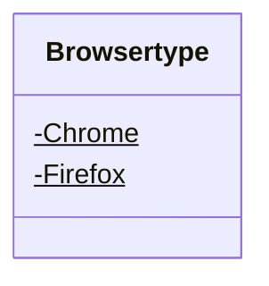

<div id="IBrowser-class-diagram"></div>

##### `IBrowser` class diagram

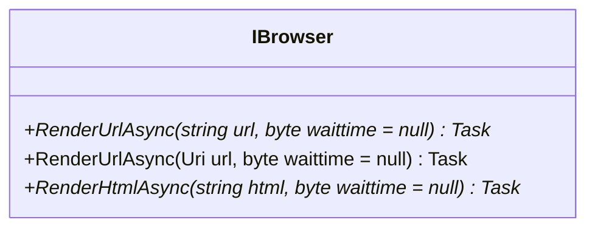

<div id="RemoteBrowser-class-diagram"></div>

##### `RemoteBrowser` class diagram

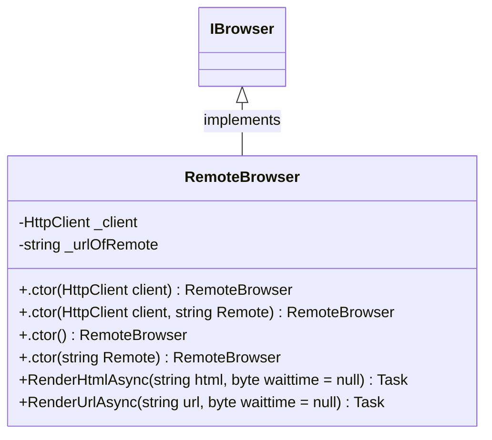

<div id="SeleniumBrowser-class-diagram"></div>

##### `SeleniumBrowser` class diagram

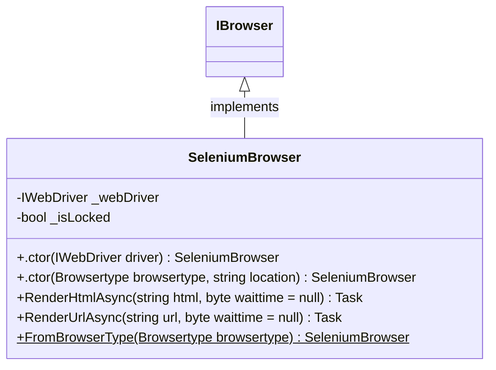

<div id="DiscordSink-class-diagram"></div>

##### `DiscordSink` class diagram

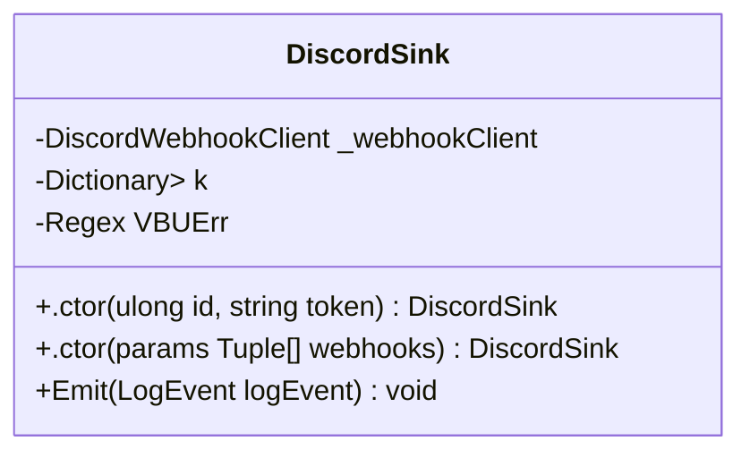

<div id="DiscordSinkExtensions-class-diagram"></div>

##### `DiscordSinkExtensions` class diagram

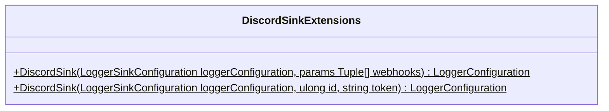

<div id="AiGenChannelAttribute-class-diagram"></div>

##### `AiGenChannelAttribute` class diagram

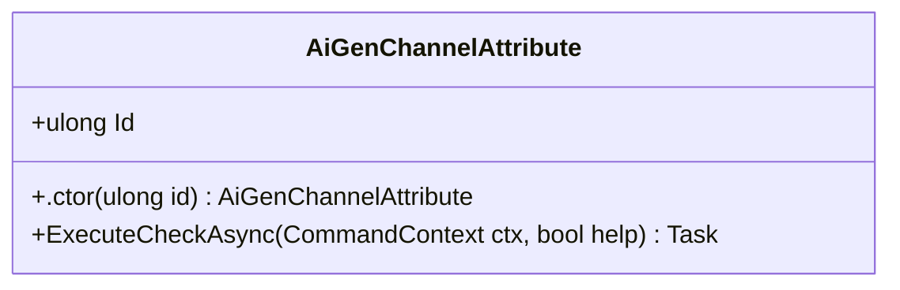

<div id="CategoryAttribute-class-diagram"></div>

##### `CategoryAttribute` class diagram

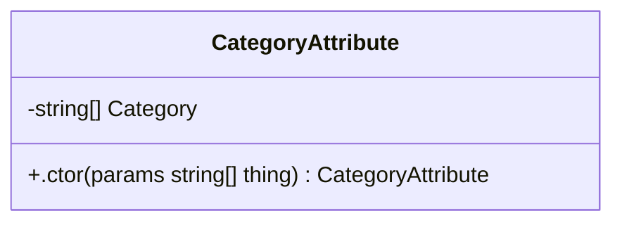

<div id="RequireAttachmentAttribute-class-diagram"></div>

##### `RequireAttachmentAttribute` class diagram

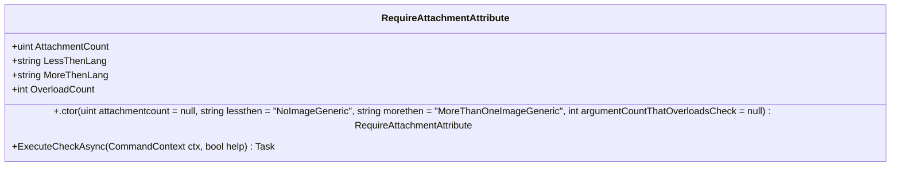

<div id="RequireConfigVariableAttribute-class-diagram"></div>

##### `RequireConfigVariableAttribute` class diagram

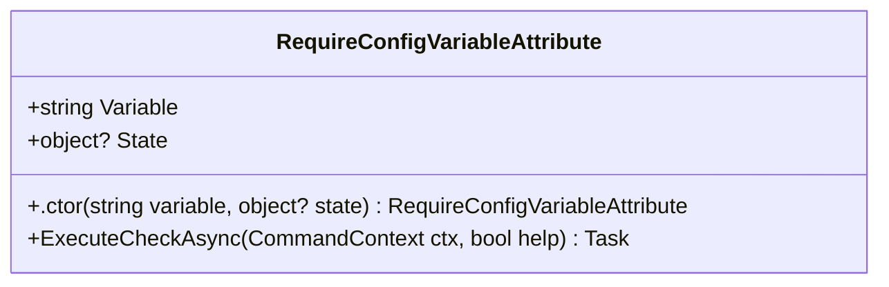

<div id="RequireDjAttribute-class-diagram"></div>

##### `RequireDjAttribute` class diagram

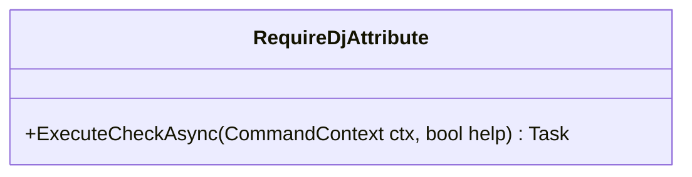

<div id="RequireDjSlashAttribute-class-diagram"></div>

##### `RequireDjSlashAttribute` class diagram

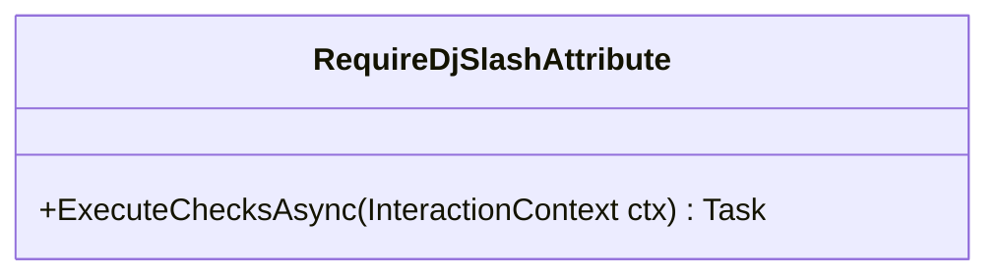

<div id="RequireModuleGuildEnabled-class-diagram"></div>

##### `RequireModuleGuildEnabled` class diagram

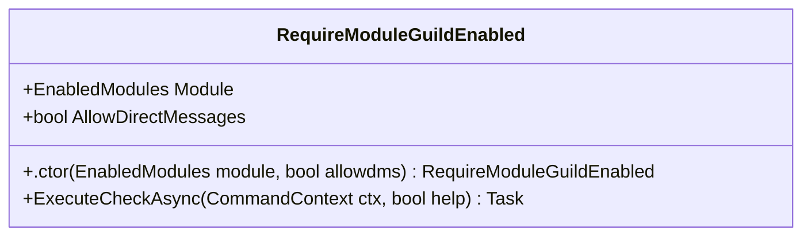

<div id="RequireTranslatorAttribute-class-diagram"></div>

##### `RequireTranslatorAttribute` class diagram

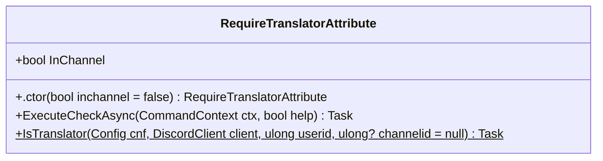

<div id="BetterVoteLavalinkPlayer-class-diagram"></div>

##### `BetterVoteLavalinkPlayer` class diagram

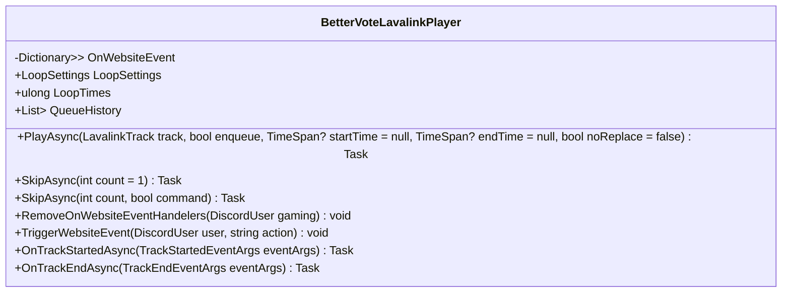

<div id="CoolerHelpFormatter-class-diagram"></div>

##### `CoolerHelpFormatter` class diagram

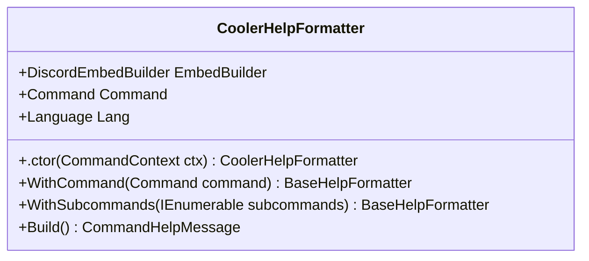

<div id="Oauth.Guild-class-diagram"></div>

##### `Oauth.Guild` class diagram

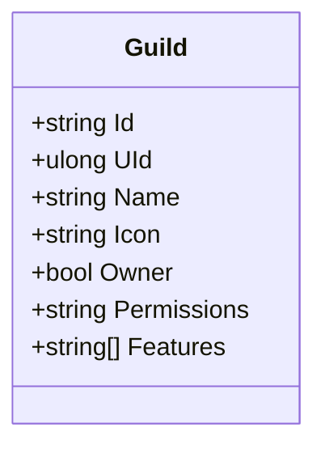

<div id="LoopSettings-class-diagram"></div>

##### `LoopSettings` class diagram

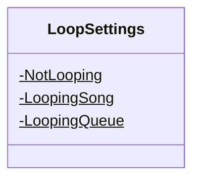

<div id="Meme-class-diagram"></div>

##### `Meme` class diagram

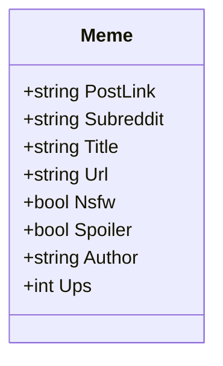

<div id="Oauth-class-diagram"></div>

##### `Oauth` class diagram

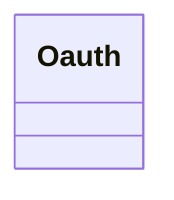

<div id="Oauth.Oauththingy-class-diagram"></div>

##### `Oauth.Oauththingy` class diagram

```mermaid
classDiagram
class Oauththingy{
    +string Id
    +ulong UId
    +string Username
    +string Avatar
    +string Discriminator
    +int Public_flags
    +int Flags
    +string Email
    +bool Verified
    +string Locale
    +bool Mfa_enabled
}

```

<div id="SerializableDictionary&lt;TKey, TValue&gt;-class-diagram"></div>

##### `SerializableDictionary<TKey, TValue>` class diagram

```mermaid
classDiagram
IXmlSerializable <|-- SerializableDictionary<TKey, TValue> : implements
class SerializableDictionary<TKey, TValue>{
    +GetSchema() XmlSchema
    +ReadXml(XmlReader reader) void
    +WriteXml(XmlWriter writer) void
}

```

<div id="SilverBotPlaylist-class-diagram"></div>

##### `SilverBotPlaylist` class diagram

```mermaid
classDiagram
IEquatable~SilverBotPlaylist~ <|-- SilverBotPlaylist : implements
class SilverBotPlaylist{
    +string[] Identifiers
    +double CurrentSongTimems
    +string? PlaylistTitle
    +Equals(SilverBotPlaylist other) bool
    +Equals(object? obj) bool
    +GetHashCode() int
}

```

<div id="SongORSongs-class-diagram"></div>

##### `SongORSongs` class diagram

```mermaid
classDiagram
class SongORSongs{
    +LavalinkTrack? Song
    +TimeSpan? SongStartTime
    +string NameOfPlayList
    +IAsyncEnumerable<LavalinkTrack>? GetRestOfSongs
    +.ctor(LavalinkTrack song, string nameofplaylist, IAsyncEnumerable<LavalinkTrack>? songs) SongORSongs
    +.ctor(LavalinkTrack song, string nameofplaylist, IAsyncEnumerable<LavalinkTrack>? songs, TimeSpan startime) SongORSongs
}

```

<div id="Splash-class-diagram"></div>

##### `Splash` class diagram

```mermaid
classDiagram
class Splash{
    +string Name
    +ActivityType Type
    +string StreamUrl
    +.ctor() Splash
    +.ctor(string namewithparameters, ActivityType type) Splash
    +GetFromDiscordActivity(DiscordActivity discordActivity)$ Splash
    +GetDiscordActivity(Dictionary<string, string> pairs) DiscordActivity
}

```

<div id="Oauth.Token-class-diagram"></div>

##### `Oauth.Token` class diagram

```mermaid
classDiagram
class Token{
    +string AccessToken
    +string TokenType
    +ulong ExpiresIn
    +string RefreshToken
    +string Scope
}

```

<div id="EnabledModules-class-diagram"></div>

##### `EnabledModules` class diagram

```mermaid
classDiagram
class EnabledModules{
    -None$
    -Generic$
    -ImageModule$
    -Reminders$
    -Misc$
    -Experience$
    -Audio$
    -Moderator$
    -ReactionRole$
    -Fortnite$
    -Minecraft$
    -Bubot$
    -Admin$
    -Steam$
    -ServerStats$
    -QuoteBook$
    -Anime$
    -AllExceptReminders$
    -All$
}

```

<div id="IHaveExecutableRequirements-class-diagram"></div>

##### `IHaveExecutableRequirements` class diagram

```mermaid
classDiagram
class IHaveExecutableRequirements{
    +ExecuteRequirements(Config conf)* Task<bool>
}

```

<div id="IRequireAssets-class-diagram"></div>

##### `IRequireAssets` class diagram

```mermaid
classDiagram
class IRequireAssets{
}

```

<div id="PlannedEvent-class-diagram"></div>

##### `PlannedEvent` class diagram

```mermaid
classDiagram
class PlannedEvent{
    +string EventID
    +DateTime Time
    +PlannedEventType Type
    +ulong UserID
    +ulong ChannelID
    +ulong MessageID
    +ulong? ResponseMessageID
    +string Data
    +bool Handled
}

```

<div id="PlannedEventType-class-diagram"></div>

##### `PlannedEventType` class diagram

```mermaid
classDiagram
class PlannedEventType{
    -EmojiPoll$
    -GiveAway$
    -Reminder$
}

```

<div id="ServerSettings-class-diagram"></div>

##### `ServerSettings` class diagram

```mermaid
classDiagram
class ServerSettings{
    +Guid ServerSettingsId
    +ulong ServerId
    +string LangName
    +ulong? ServerStatsCategoryId
    +ServerStatString[] ServerStatsTemplates
    +EnabledModules EnabledModules
    +string ServerStatsTemplatesInJson
    +bool RepeatThings
    +string[] Prefixes
    +string PrefixesInJson
    +List<ReactionRoleMapping> ReactionRoleMappings
}

```

<div id="ServerStatString-class-diagram"></div>

##### `ServerStatString` class diagram

```mermaid
classDiagram
class ServerStatString{
    +string Template
    +.ctor() ServerStatString
    +.ctor(string template) ServerStatString
    +Serialize(Dictionary<string, string> dict) string
    +GetStringDictionaryAsync(DiscordGuild guild)$ Task<Dictionary<string, string>>
}

```

<div id="TranslatorSettings-class-diagram"></div>

##### `TranslatorSettings` class diagram

```mermaid
classDiagram
class TranslatorSettings{
    +ulong Id
    +bool IsTranslator
    +Language? CurrentCustomLanguage
    +ICollection<Language> CustomLanguages
}

```

<div id="UserExperience-class-diagram"></div>

##### `UserExperience` class diagram

```mermaid
classDiagram
class UserExperience{
    +ulong Id
    +ulong XP
    +Increase() void
    +Increase(ulong count) void
    +Decrease() void
    +Decrease(ulong count) void
}

```

<div id="UserQuote-class-diagram"></div>

##### `UserQuote` class diagram

```mermaid
classDiagram
class UserQuote{
    +string QuoteId
    +ulong UserId
    +string QuoteContent
    +DateTime TimeStamp
}

```

<div id="UserSettings-class-diagram"></div>

##### `UserSettings` class diagram

```mermaid
classDiagram
class UserSettings{
    +ulong Id
    +string LangName
    +bool IsBanned
    +bool UsesNewMusicPage
}

```

<div id="DatabaseContext-class-diagram"></div>

##### `DatabaseContext` class diagram

```mermaid
classDiagram
class DatabaseContext{
    -ServerStatString[] StatsTemplates
    +DbSet<ServerSettings> serverSettings
    +DbSet<UserSettings> userSettings
    +DbSet<UserExperience> userExperiences
    +DbSet<UserQuote> userQuotes
    +DbSet<PlannedEvent> plannedEvents
    +DbSet<TranslatorSettings> translatorSettings
    +DbSet<ReactionRoleMapping> ReactionRoleMappings
    +.ctor(DbContextOptions<DatabaseContext> options) DatabaseContext
    +RemoveUser(ulong userId) Task
    +GetLangCodeUser(ulong id) string
    +atString[]>[] DatabaseContext.GetStatisticSettings() Tuple<ulong,
    +GetServerSettings(ulong id) ServerSettings
    +GetLangCodeGuild(ulong id) string
    +IsBanned(ulong id) bool
    +SetServerStatsCategory(ulong sid, ulong? id) void
    +SetServerPrefixes(ulong sid, string[] prefixes) void
    +SetServerStatStrings(ulong sid, ServerStatString[]? id) void
    +ToggleBanUser(ulong id, bool BAN) void
    +InserOrUpdateLangCodeUser(ulong id, string lang) void
    +RunSqlAsync(string sql) Task<string>
    +InserOrUpdateLangCodeGuild(ulong id, string lang) void
}

```

<div id="AttachmentCountIncorrectException-class-diagram"></div>

##### `AttachmentCountIncorrectException` class diagram

```mermaid
classDiagram
class AttachmentCountIncorrectException{
    +AttachmentCountIncorrect AttachmentCount
    +.ctor(AttachmentCountIncorrect count) AttachmentCountIncorrectException
    +.ctor(AttachmentCountIncorrect count, string message) AttachmentCountIncorrectException
    +.ctor(AttachmentCountIncorrect count, string message, Exception inner) AttachmentCountIncorrectException
    +.ctor(SerializationInfo info, StreamingContext context) AttachmentCountIncorrectException
    +SetAttachmentCount(AttachmentCountIncorrect value) void
}

```

<div id="MojangException-class-diagram"></div>

##### `MojangException` class diagram

```mermaid
classDiagram
class MojangException{
    +.ctor() MojangException
    +.ctor(string error, string errormessage) MojangException
    +.ctor(SerializationInfo info, StreamingContext context) MojangException
}

```

<div id="TemplateReturningNullException-class-diagram"></div>

##### `TemplateReturningNullException` class diagram

```mermaid
classDiagram
class TemplateReturningNullException{
    +.ctor() TemplateReturningNullException
    +.ctor(string template) TemplateReturningNullException
    +.ctor(string template, Exception innerException) TemplateReturningNullException
}

```

<div id="Language-class-diagram"></div>

##### `Language` class diagram

```mermaid
classDiagram
class Language{
    +Guid Id
    +string LangName
    +string UnknownError
    +string LangCodeGoogleTranslate
    +string Hi
    +string TimeInUtc
    +string CommandIsDisabled
    +string RequestedBy
    +string DblaReturnedNull
    +string AlreadyConnected
    +string UserNotConnected
    +string VolumeNotCorrect
    +string Joined
    +string NotConnected
    +string NotPlaying
    +string NothingInQueue
    +string NothingInQueueToRemove
    +string NothingInQueueHistory
    +string SongByAuthor
    +string RemovedFront
    +string RemovedXSongOrSongs
    +string RemovedSong
    +string RemovedSongs
    +string LoopingSong
    +string LoopingQueue
    +string WrongImageCount
    +string NotLooping
    +string NoResults
    +string Left
    +string InformationAbout
    +string JoinedSilverCraft
    +string PrefixUsedTopgg
    +string ShuffledSuccess
    +string User
    +string Userid
    +string IsAnOwner
    +string IsABot
    +string AccountCreationDate
    +string AccountJoinDate
    +string SilverhostingJokeTitle
    +string SilverhostingJokeDescription
    +string PurgeNumberNegative
    +string PurgeNothingToDelete
    +string PurgeRemovedFront
    +string PurgeRemovedSingle
    +string PurgeRemovedPlural
    +string NoEmotesFound
    +string SearchedFor
    +string MultipleEmotesFound
    +string AlreadyOptedIn
    +string Server
    +string OptedIn
    +string OptedInWebshot
    +string OptedOutWebshot
    +string AllAvailibleEmotes
    +string UserIsBannedFromSilversocial
    +string UselessFact
    +string UserHasLowerRole
    +string Ban
    +string Kick
    +string BotHasLowerRole
    +string RandomGif
    +string PoweredByGiphy
    +string Meme
    +string NoImageGeneric
    +string EmoteWasLargerThan256K
    +string MoreThanOneImageGeneric
    +string OutputFileLargerThan8M
    +string PageGif
    +string PageGifButtonText
    +string PageNuget
    +string PeriodExpired
    +string UserIsntBot
    +string NowPlaying
    +string Enqueued
    +string SkippedNP
    +string CanForceSkip
    +string NotPaused
    +string Voted
    +string AlreadyVoted
    +string TimeTillTrackPlays
    +string TimeWhenTrackPlayed
    +string TimesTrackLooped
    +string SearchFail
    +string SearchFailTitle
    +string SearchFailDescription
    +string Success
    +string UrbanExample
    +string SongLength
    +string SongTimePosition
    +string SongTimeLeft
    +string SongTimeLeftSongLoopingCurrent
    +string SongTimeLeftSongLooping
    +string LoadedSilverBotPlaylistWithTitle
    +string SongNotExist
    +string VersionInfoTitle
    +string PurgedBySilverBotReason
    +string NotValidLanguage
    +string CultureInfo
    +string BotBannedUser
    +string BotKickedUser
    +string AddedXAmountOfSongs
    +string TrackingStarted
    +string TrackingStopped
    +string TrackCanNotBeSeeked
    +string XPCommandSelf
    +string XPCommandOther
    +string XPCommandGeneralFail
    +string XPCommandCardSuccess
    +string XPCommandFailSelf
    +string XPCommandFailOther
    +string XPCommandLeaderBoardTitle
    +string XPCommandLeaderBoardPerson
    +string DisabledRepeatedPhrases
    +string EnableRepeatedPhrases
    +string CheckFailed
    +string ChecksFailed
    +string InvalidOverload
    +string GeneralException
    +string NoMatchingSubcommandsAndGroupNotExecutable
    +string QuotePreviewQuoteID
    +string QuoteGetNoBook
    +string QuoteGetNoQuoteWithId
    +string QuotePreviewDeleteSuccess
    +string HelpCommandHelpString
    +string HelpCommandNoDescription
    +string HelpCommandGroupCanBeExecuted
    +string HelpCommandGroupAliases
    +string HelpCommandGroupArguments
    +string HelpCommandGroupSubcommands
    +string HelpCommandGroupListingAllCommands
    +string RequireDJCheckFailed
    +string RequireGuildCheckFailed
    +string RequireNsfwCheckFailed
    +string RequireOwnerCheckFailed
    +string RequireRolesCheckFailedSG
    +string RequireRolesCheckFailedPL
    +string RequireBotPermisionsCheckFailedPL
    +string RequireBotPermisionsCheckFailedSG
    +string RequireUserPermisionsCheckFailedPL
    +string RequireUserPermisionsCheckFailedSG
    +string RequireBotAndUserPermisionsCheckFailedPL
    +string RequireBotAndUserPermisionsCheckFailedSG
    +string UnknownImageFormat
    +string NetVipsLoadFail
    +string AttributeDataBaseCheckNoDirectMessages
    +string AttributeDataBaseCheckWebShot
    +string JpegSuccess
    +string SilverSuccess
    +string ComicSuccess
    +string ResizeSuccess
    +string TintSuccess
    +string MathSteps
    +string Results
    +string SomethingsContributors
    +string NuGetVerified
    +string Type
    +string Downloads
    +string Version
    +string SetToProvidedStrings
    +string SetToDefaultStrings
    +string NoPerm
    +string CategorySetSuccess
    +string EmojiMessageDownloadStart
    +string EmojiMessageDownloadEnd
    +string EmojiEnd
    +string ReactionRoleNoPermManageRoles
    +string ReactionRoleIntro
    +string ReactionRoleTitle
    +string ReactionRoleResponseYes
    +string ReactionRoleResponseYes2
    +string ReactionRoleResponseYes3
    +string ReactionRoleResponseNo
    +string ReactionRoleResponseNo2
    +string ReactionRoleResponseNo3
    +string ReactionRoleRolesAdded
    +string ReactionRoleDone
    +string ReactionRoleNone
    +string ReactionRoleMainLoop
    +string ReactionRoleEmbedColour
    +string FreeToPlayGameType
    +string NotAvailableGameType
    +string CostsMoneyGameTypeBug
    +string NoGamesWereReturned
    +string NoGamesWereReturnedDescription
    +string AmericanMoney
    +string OS
    +string DsharpplusVersion
    +string VersionNumber
    +string GitRepo
    +string GitCommitHash
    +string GitBranch
    +string IsDirty
    +string CLR
    +string ReminderErrorNoContent
    +string ReminderSuccess
    +string ListReminderNone
    +string ListReminderStart
    +string ListReminderListMore
    +string ReminderContent
    +string PollResultsStart
    +string PollResultsResultYes
    +string PollResultsResultNo
    +string PollResultsResultUndecided
    +string PollErrorQuestionNull
    +string GiveawayResultsNoReactions
    +string GiveawayItemNull
    +string GiveawayResultsWon
    +string QueueNothing
    +string CancelReminderErrorNoEvent
    +string CancelReminderErrorMultiple
    +string CancelReminderErrorAlreadyHandled
    +string CancelReminderSuccess
    +string LavalinkNotSetup
    +string WebsitePlayerResumed
    +string WebsitePlayerPaused
    +string WebsiteSkippedViaVote
    +string WebsiteVotedForSkip
    +string WebsiteSkipped
    +string WebsiteShuffled
    +string WebsiteLoopOff
    +string WebsiteLoopSong
    +string WebsiteLoopQueue
    +string WebsitePlayingNothingTrackName
    +string WebsitePlayPause
    +string WebsiteVoteSkip
    +string WebsiteForceSkip
    +string WebsiteShuffle
    +string WebsiteNoLoop
    +string WebsiteBLoopSong
    +string WebsiteBLoopQueue
    +string WebsiteBVolumeDown
    +string WebsiteBVolumeUp
    +GetCultureInfo() CultureInfo
}

```

<div id="LanguageService-class-diagram"></div>

##### `LanguageService` class diagram

```mermaid
classDiagram
class LanguageService{
    -Dictionary<string, Language> CachedLanguages$
    -JsonSerializerOptions options$
    +geService.GetLoadedLanguages() Dictionary<string,
    +LoadedLanguages() IEnumerable<string>
    +Get(string languageName) Language
    +GetAsync(string languageName) Task<Language>
    +SerialiseDefaultAsync(string loc)$ Task
    +SerialiseDefault(string loc)$ void
    +GetLanguageFromGuildIdAsync(ulong id, DatabaseContext db) Task<Language>
    +FromCtx(CommandContext ctx) Language
    +FromCtxAsync(CommandContext ctx) Task<Language>
    +FromCtxAsync(BaseContext ctx) Task<Language>
    +FromUserId(ulong userId, DatabaseContext databaseContext) Language
    +FromUserIdAsync(ulong userId, DatabaseContext databaseContext) Task<Language>
    +FromCtxAsync(dynamic ctx, Config config, DatabaseContext databaseContext) Task<Language>
}

```

<div id="AttachmentCountIncorrect-class-diagram"></div>

##### `AttachmentCountIncorrect` class diagram

```mermaid
classDiagram
class AttachmentCountIncorrect{
    -TooManyAttachments$
    -TooLittleAttachments$
}

```

<div id="Config-class-diagram"></div>

##### `Config` class diagram

```mermaid
classDiagram
ICanBeToldThatAPartOfMeIsChanged <|-- Config : implements
class Config{
    -ulong CurrentConfVer$
    +string[] Prefix
    +LogLevel MinimumLogLevel
    +bool UseTxtFilesAsLogs
    +string Token
    +string[] ModulesToLoad
    +SerializableDictionary<string, string> ServicesToLoadExternal
    +SerializableDictionary<string, string> ExtraParams
    +string[] ModulesFilesToLoadExternal
    +string Gtoken
    +string FApiToken
    +string JavaLoc
    +ulong ServerId
    +bool CallGcOnSplashChange
    +bool ReactionRolesEnabled
    +bool HostWebsite
    +bool ClearTasks
    +int MsInterval
    +ulong? ConfigVer
    +bool UseLavaLink
    +bool AutoDownloadAndStartLavalink
    +bool SponsorBlock
    +string LavalinkBuildsSourceGitHubUser
    +string LavalinkBuildsSourceGitHubRepo
    +string LavalinkRestUri
    +string LavalinkWebSocketUri
    +string LavalinkPassword
    +ulong FridayTextChannel
    +bool ColorConfig
    +bool EmulateBubot
    +bool EmulateBubotBibi
    +string LocalBibiPictures
    +string BibiLibCutOut
    +string BibiLibCutOutConfig
    +string BibiLibFull
    +string BibiLibFullConfig
    +bool SitInVc
    +bool EnableServerStatistics
    +ulong TranslatorRoleId
    +ulong TranslatorModeChannel
    +ulong LoginPageDiscordClientId
    +string LoginPageDiscordClientSecret
    +bool EnableUpdateChecking
    +bool UseAnalytics
    +string[] ArchiveWebhooks
    +ulong[] ChannelsToArchivePicturesFrom
    +SerializableDictionary<string, string> SongAliases
    +Splash[] Splashes
    +bool AllowedToRead
    +OutdatedConfigTask(Config readConfig, CommentXmlConfigReaderNotifyWhenChanged<Config> configReader)$ Task
    +GetAsync()$ Task<Config?>
    +PropertyChanged(object e, PropertyChangedEventArgs a) void
}

```

<div id="ConsoleInputHelper-class-diagram"></div>

##### `ConsoleInputHelper` class diagram

```mermaid
classDiagram
class ConsoleInputHelper{
    +GetBoolFromConsole(bool? defaultValue = null)$ bool
}

```

<div id="IService-class-diagram"></div>

##### `IService` class diagram

```mermaid
classDiagram
class IService{
    +Start()* Task
    +Stop()* Task
}

```

<div id="SdImage-class-diagram"></div>

##### `SdImage` class diagram

```mermaid
classDiagram
class SdImage{
    -byte[] _bytes
    -bool _disposedValue
    -string Url
    +.ctor() SdImage
    +.ctor(string url) SdImage
    +.ctor(DiscordUser user) SdImage
    +Dispose() void
    +FromContext(CommandContext ctx)$ SdImage
    +FromAttachments(IReadOnlyList<DiscordAttachment> attachments)$ SdImage
    +GetBytesAsync(HttpClient httpClient) Task<byte[]>
    +GetByteStream(HttpClient httpClient) Task<Stream>
    +Dispose(bool disposing) void
    +age() void
}

```

<div id="SdImageConverter-class-diagram"></div>

##### `SdImageConverter` class diagram

```mermaid
classDiagram
class SdImageConverter{
    -Regex UrLregex$
    -Regex Emote$
    -Regex User$
    +ConvertAsync(string value, CommandContext ctx) Task<Optional<SdImage>>
}

```

<div id="BibiPage-class-diagram"></div>

##### `BibiPage` class diagram

```mermaid
classDiagram
ILazyPage <|-- BibiPage : implements
class BibiPage{
    -string[] BibiDescText
    -Language Lang
    -DiscordUser user
    -string imgurl
    +Optional<string> Content
    +Optional<DiscordEmbedBuilder> Embed
    +int Id
    +int? PreviousId
    +int? NextId
    +.ctor(int pageId, string urlFormat, string[] _bibiDescText, Language lang, DiscordUser user) BibiPage
}

```

<div id="BibiPagination-class-diagram"></div>

##### `BibiPagination` class diagram

```mermaid
classDiagram
IPagination <|-- BibiPagination : implements
class BibiPagination{
    -string[] BibiDescText
    -Language Lang
    -DiscordUser User
    -string UrlFormat
    +int DefaultId
    +Range AllowedRange
    +.ctor(string urlFormat, string[] _bibiDescText, Language lang, DiscordUser user) BibiPagination
    +GetPageAtId(int id) ILazyPage
}

```

<div id="CoolerPaginatior-class-diagram"></div>

##### `CoolerPaginatior` class diagram

```mermaid
classDiagram
IPaginator <|-- CoolerPaginatior : implements
class CoolerPaginatior{
    -Dictionary<Guid, PaginationRecord> Paginations
    +.ctor(DiscordClient client) CoolerPaginatior
    +GetButtons(ILazyPage page, IPagination pagination, Guid id) IEnumerable<DiscordButtonComponent>
    +SendPage(ILazyPage page, DiscordChannel channel, IPagination pagination, Guid id) Task<DiscordMessage>
    +SendPaginatedMessage(DiscordChannel channel, DiscordUser user, bool allowOtherUsersToStartTheirOwn, IPagination pagination) Task<Guid>
}

```

<div id="ILazyPage-class-diagram"></div>

##### `ILazyPage` class diagram

```mermaid
classDiagram
class ILazyPage{
    +Optional<string> Content*
    +Optional<DiscordEmbedBuilder> Embed*
    +int Id*
    +int? PreviousId*
    +int? NextId*
}

```

<div id="IPagination-class-diagram"></div>

##### `IPagination` class diagram

```mermaid
classDiagram
class IPagination{
    +int DefaultId*
    +Range AllowedRange*
    +GetPageAtId(int id)* ILazyPage
}

```

<div id="IPaginator-class-diagram"></div>

##### `IPaginator` class diagram

```mermaid
classDiagram
class IPaginator{
    +SendPaginatedMessage(DiscordChannel channel, DiscordUser user, bool allowOtherUsersToStartTheirOwn, IPagination pagination)* Task<Guid>
}

```

<div id="PaginationRecord-class-diagram"></div>

##### `PaginationRecord` class diagram

```mermaid
classDiagram
class PaginationRecord{
    +IPagination Pagination
    +int CurrentPage
    +.ctor(IPagination pagination, int currentPage) PaginationRecord
}

```

<div id="ReactionRoleMapping-class-diagram"></div>

##### `ReactionRoleMapping` class diagram

```mermaid
classDiagram
class ReactionRoleMapping{
    +Guid MappingId
    +Guid ServerSettingsId
    +ulong RoleId
    +ulong MessageId
    +ulong ChannelId
    +string? Emoji
    +ulong? EmojiId
    +ReactionRoleType Mode
}

```

<div id="ReactionRoleType-class-diagram"></div>

##### `ReactionRoleType` class diagram

```mermaid
classDiagram
class ReactionRoleType{
    -None$
    -Inverse$
    -Sticky$
    -Vanishing$
    -Normal$
}

```

<div id="CommentXmlConfigReaderNotifyWhenChanged&lt;T&gt;-class-diagram"></div>

##### `CommentXmlConfigReaderNotifyWhenChanged<T>` class diagram

```mermaid
classDiagram
IDisposable <|-- CommentXmlConfigReaderNotifyWhenChanged<T> : implements
class CommentXmlConfigReaderNotifyWhenChanged<T>{
    -List<FileSystemWatcher> fileSystemWatchers
    +Dispose() void
    +Read(string path) T?
}

```

<div id="FileAssetSchemeChecker-class-diagram"></div>

##### `FileAssetSchemeChecker` class diagram

```mermaid
classDiagram
IAssetSchemeChecker <|-- FileAssetSchemeChecker : implements
class FileAssetSchemeChecker{
    +string Scheme
    +CheckForAsset(string asset) bool
}

```

<div id="IAssetSchemeChecker-class-diagram"></div>

##### `IAssetSchemeChecker` class diagram

```mermaid
classDiagram
class IAssetSchemeChecker{
    +string Scheme*
    +CheckForAsset(string asset)* bool
}

```

<div id="ICanBeToldThatAPartOfMeIsChanged-class-diagram"></div>

##### `ICanBeToldThatAPartOfMeIsChanged` class diagram

```mermaid
classDiagram
class ICanBeToldThatAPartOfMeIsChanged{
    +bool AllowedToRead*
    +PropertyChanged(object sender, PropertyChangedEventArgs e)* void
}

```

<div id="ArrayUtils-class-diagram"></div>

##### `ArrayUtils` class diagram

```mermaid
classDiagram
class ArrayUtils{
    +RandomFrom<T>(T[] vs)$ T
}

```

<div id="GitHubUtils.Asset-class-diagram"></div>

##### `GitHubUtils.Asset` class diagram

```mermaid
classDiagram
class Asset{
    +string Url
    +int Id
    +string NodeId
    +string Name
    +string Label
    +Uploader Uploader
    +string ContentType
    +string State
    +int Size
    +int DownloadCount
    +DateTime CreatedAt
    +DateTime UpdatedAt
    +string BrowserDownloadUrl
}

```

<div id="GitHubUtils.Author-class-diagram"></div>

##### `GitHubUtils.Author` class diagram

```mermaid
classDiagram
class Author{
    +string Login
    +int Id
    +string NodeId
    +string AvatarUrl
    +string GravatarId
    +string Url
    +string HtmlUrl
    +string FollowersUrl
    +string FollowingUrl
    +string GistsUrl
    +string StarredUrl
    +string SubscriptionsUrl
    +string OrganizationsUrl
    +string ReposUrl
    +string EventsUrl
    +string ReceivedEventsUrl
    +string Type
    +bool SiteAdmin
}

```

<div id="GitHubUtils.Author1-class-diagram"></div>

##### `GitHubUtils.Author1` class diagram

```mermaid
classDiagram
class Author1{
    +string Login
    +int Id
    +string NodeId
    +string AvatarUrl
    +string GravatarId
    +string Url
    +string HtmlUrl
    +string Followers_url
    +string Following_url
    +string Gists_url
    +string Starred_url
    +string Subscriptions_url
    +string Organizations_url
    +string Repos_url
    +string Events_url
    +string Received_events_url
    +string Type
    +bool Site_admin
}

```

<div id="ColorUtils-class-diagram"></div>

##### `ColorUtils` class diagram

```mermaid
classDiagram
class ColorUtils{
    -DiscordColor[] cache$
    +DiscordColor[] Internal$
    +CreateInstance()$ ColorUtils
    +GetAsync(bool ignorecache = false, bool useinternal = false)$ Task<DiscordColor[]>
    +Get(bool ignorecache = false, bool useinternal = false)$ DiscordColor[]
    +ReloadConfig()$ Task
    +GetSingle(bool ignorecache = false, bool useinternal = false)$ DiscordColor
    +GetSingleAsync(bool ignorecache = false, bool useinternal = false)$ Task<DiscordColor>
}

```

<div id="GitHubUtils.Commit-class-diagram"></div>

##### `GitHubUtils.Commit` class diagram

```mermaid
classDiagram
class Commit{
    +CommitAuthor Author
    +Committer Committer
    +string Message
    +Tree Tree
    +string Url
    +int CommentCount
    +Verification Verification
}

```

<div id="GitHubUtils.CommitAuthor-class-diagram"></div>

##### `GitHubUtils.CommitAuthor` class diagram

```mermaid
classDiagram
class CommitAuthor{
    +string Name
    +string Email
    +DateTime Date
}

```

<div id="GitHubUtils.CommitInfo-class-diagram"></div>

##### `GitHubUtils.CommitInfo` class diagram

```mermaid
classDiagram
class CommitInfo{
    +string Sha
    +string Node_id
    +Commit Commit
    +string Url
    +string HtmlUrl
    +string CommentsUrl
    +Author1 Author
    +Committer1 Committer
    +Parent[] Parents
    +Stats Stats
    +File[] Files
    +GetLatestFromRepoAsync(Repo repo, HttpClient client)$ Task<CommitInfo>
    +GetLatestFromRepoAsync(Repo repo, string branch, HttpClient client)$ Task<CommitInfo>
}

```

<div id="GitHubUtils.Committer-class-diagram"></div>

##### `GitHubUtils.Committer` class diagram

```mermaid
classDiagram
class Committer{
    +string Name
    +string Email
    +DateTime Date
}

```

<div id="GitHubUtils.Committer1-class-diagram"></div>

##### `GitHubUtils.Committer1` class diagram

```mermaid
classDiagram
class Committer1{
    +string Login
    +int Id
    +string Node_id
    +string Avatar_url
    +string Gravatar_id
    +string Url
    +string Html_url
    +string Followers_url
    +string Following_url
    +string Gists_url
    +string Starred_url
    +string Subscriptions_url
    +string Organizations_url
    +string Repos_url
    +string Events_url
    +string Received_events_url
    +string Type
    +bool SiteAdmin
}

```

<div id="NuGetUtils.Context-class-diagram"></div>

##### `NuGetUtils.Context` class diagram

```mermaid
classDiagram
class Context{
    +string Vocab
    +string Base
}

```

<div id="DateTimeUtils-class-diagram"></div>

##### `DateTimeUtils` class diagram

```mermaid
classDiagram
class DateTimeUtils{
    +DateTimeToTimeStamp(DateTime? dt, TimestampFormat tf = null, string def = "NA")$ string
    +DateTimeToTimeStamp(DateTime dt, TimestampFormat tf = null)$ string
}

```

<div id="NuGetUtils.Datum-class-diagram"></div>

##### `NuGetUtils.Datum` class diagram

```mermaid
classDiagram
class Datum{
    +string Atid
    +string Type
    +string Registration
    +string Id
    +string Version
    +string Description
    +string Summary
    +string Title
    +string IconUrl
    +string LicenseUrl
    +string ProjectUrl
    +string[] Tags
    +string[] Authors
    +int? TotalDownloads
    +bool? Verified
    +Packagetype[] PackageTypes
    +Version[] Versions
}

```

<div id="UrbanDictUtils.Defenition-class-diagram"></div>

##### `UrbanDictUtils.Defenition` class diagram

```mermaid
classDiagram
class Defenition{
    +string Definition
    +string Permalink
    +int ThumbsUp
    +object[] SoundUrls
    +string Author
    +string Word
    +int Defid
    +string CurrentVote
    +DateTime WrittenOn
    +string Example
    +int ThumbsDown
}

```

<div id="EmbedBuilderUtils-class-diagram"></div>

##### `EmbedBuilderUtils` class diagram

```mermaid
classDiagram
class EmbedBuilderUtils{
    +AddRequestedByFooter(DiscordEmbedBuilder builder, CommandContext ctx, Language lang)$ DiscordEmbedBuilder
    +AddRequestedByFooter(DiscordEmbedBuilder builder, BaseContext ctx, Language lang)$ DiscordEmbedBuilder
    +AddRequestedByFooter(DiscordEmbedBuilder builder, DiscordUser user, Language lang)$ DiscordEmbedBuilder
}

```

<div id="GitHubUtils.File-class-diagram"></div>

##### `GitHubUtils.File` class diagram

```mermaid
classDiagram
class File{
    +string Sha
    +string Filename
    +string Status
    +int Additions
    +int Deletions
    +int Changes
    +string Bloburl
    +string Rawurl
    +string Contents_url
    +string Patch
}

```

<div id="FileSizes-class-diagram"></div>

##### `FileSizes` class diagram

```mermaid
classDiagram
class FileSizes{
    -FSize[] FSizes$
    +.ctor() FileSizes
}

```

<div id="FileSizeUtils-class-diagram"></div>

##### `FileSizeUtils` class diagram

```mermaid
classDiagram
class FileSizeUtils{
    +FormatSize(long bytes)$ string
}

```

<div id="FileUtils-class-diagram"></div>

##### `FileUtils` class diagram

```mermaid
classDiagram
class FileUtils{
    +GetFileExtensionFromUrl(string url)$ string
}

```

<div id="FSize-class-diagram"></div>

##### `FSize` class diagram

```mermaid
classDiagram
class FSize{
    -string FullName
    -string Suffix
    +.ctor(string fn, string sfx) FSize
}

```

<div id="GitHubUtils-class-diagram"></div>

##### `GitHubUtils` class diagram

```mermaid
classDiagram
class GitHubUtils{
    -Regex R$
}

```

<div id="MinecraftUtils-class-diagram"></div>

##### `MinecraftUtils` class diagram

```mermaid
classDiagram
class MinecraftUtils{
    -string GetProfileUrl$
    -string CrafatarBaseUrl$
    +GetPlayerAsync(string name, HttpClient httpClient)$ Task<Player>
}

```

<div id="NuGetUtils-class-diagram"></div>

##### `NuGetUtils` class diagram

```mermaid
classDiagram
class NuGetUtils{
    +SearchAsync(string query, HttpClient httpClient)$ Task<Datum[]>
}

```

<div id="NumberUtils-class-diagram"></div>

##### `NumberUtils` class diagram

```mermaid
classDiagram
class NumberUtils{
    -string[] Divisors$
    +FormatSize(long bytes)$ string
}

```

<div id="NuGetUtils.Packagetype-class-diagram"></div>

##### `NuGetUtils.Packagetype` class diagram

```mermaid
classDiagram
class Packagetype{
    +string Name
}

```

<div id="GitHubUtils.Parent-class-diagram"></div>

##### `GitHubUtils.Parent` class diagram

```mermaid
classDiagram
class Parent{
    +string Sha
    +string Url
    +string Htmlurl
}

```

<div id="MinecraftUtils.Player-class-diagram"></div>

##### `MinecraftUtils.Player` class diagram

```mermaid
classDiagram
class Player{
    +string Name
    +string Id
    +string Error
    +string ErrorMessage
    +bool Demo
    +GetAvatarUrl() string
    +GetHeadUrl() string
    +GetBodyUrl() string
}

```

<div id="RandomGenerator-class-diagram"></div>

##### `RandomGenerator` class diagram

```mermaid
classDiagram
class RandomGenerator{
    +Next(int minValue, int maxExclusiveValue)$ int
    +GetRandomUInt()$ uint
    +GenerateRandomBytes(int bytesNumber)$ byte[]
    +RandomString(int length)$ string
    +RandomAbcString(int length, double timespan = 1.5)$ string
}

```

<div id="GitHubUtils.Release-class-diagram"></div>

##### `GitHubUtils.Release` class diagram

```mermaid
classDiagram
class Release{
    +string Url
    +string AssetsUrl
    +string UploadUrl
    +string HtmlUrl
    +int Id
    +Author Author
    +string NodeId
    +string TagName
    +string TargetCommitish
    +string Name
    +bool Draft
    +bool Prerelease
    +DateTime CreatedAt
    +DateTime PublishedAt
    +Asset[] Assets
    +string TarballUrl
    +string ZipballUrl
    +string Body
    +DownloadLatestAsync(Release release, HttpClient client)$ Task
    +DownloadLatestAsync(HttpClient client) Task
    +GetLatestFromRepoAsync(Repo repo, HttpClient client)$ Task<Release>
}

```

<div id="GitHubUtils.Repo-class-diagram"></div>

##### `GitHubUtils.Repo` class diagram

```mermaid
classDiagram
class Repo{
    +string User
    +string Reponame
    +.ctor(string user, string reponame) Repo
    +.ctor() Repo
    +TryParseUrl(string url)$ Optional<Repo>
}

```

<div id="NuGetUtils.Rootobject-class-diagram"></div>

##### `NuGetUtils.Rootobject` class diagram

```mermaid
classDiagram
class Rootobject{
    +Context Context
    +int TotalHits
    +Datum[] Data
}

```

<div id="UrbanDictUtils.Rootobject-class-diagram"></div>

##### `UrbanDictUtils.Rootobject` class diagram

```mermaid
classDiagram
class Rootobject{
    +Defenition[] List
}

```

<div id="ColorUtils.SdColor-class-diagram"></div>

##### `ColorUtils.SdColor` class diagram

```mermaid
classDiagram
class SdColor{
    +byte R
    +byte G
    +byte B
    +ToDiscordColor() DiscordColor
    +FromDiscordColor(DiscordColor color)$ SdColor
}

```

<div id="GitHubUtils.Stats-class-diagram"></div>

##### `GitHubUtils.Stats` class diagram

```mermaid
classDiagram
class Stats{
    +int Total
    +int Additions
    +int Deletions
}

```

<div id="StringUtils-class-diagram"></div>

##### `StringUtils` class diagram

```mermaid
classDiagram
class StringUtils{
    +RandomFromArray(string[] vs)$ string
    +FormatFromDictionary(string formatString, Dictionary<string, string> valueDict)$ string
    +SplitInParts(string s, int partLength)$ IEnumerable<string>
    +SplitInPartsIterator(string s, int partLength)$ IEnumerable<string>
    +BoolToEmoteString(bool b)$ string
    +RemoveStringFromEnd(string a, string sub)$ string
    +RemoveStringFromStart(string a, string sub)$ string
    +ArrayToString(string[] arr, string seperator = "")$ string
}

```

<div id="Translator-class-diagram"></div>

##### `Translator` class diagram

```mermaid
classDiagram
class Translator{
    -Dictionary<string, string> LanguageModeMap$
    -HttpClient _httpClient
    +IEnumerable<string> Languages$
    +.ctor() Translator
    +.ctor(HttpClient httpClient) Translator
    +TranslateAsync(string sourceText, string sourceLanguage, string targetLanguage) Task<Tuple<string, string>>
    +ContainsKeyOrVal(string language)$ bool
    +LanguageEnumToIdentifier(string language)$ string
}

```

<div id="GitHubUtils.Tree-class-diagram"></div>

##### `GitHubUtils.Tree` class diagram

```mermaid
classDiagram
class Tree{
    +string Sha
    +string Url
}

```

<div id="GitHubUtils.Uploader-class-diagram"></div>

##### `GitHubUtils.Uploader` class diagram

```mermaid
classDiagram
class Uploader{
    +string Login
    +int Id
    +string NodeId
    +string AvatarUrl
    +string GravatarId
    +string Url
    +string HtmlUrl
    +string FollowersUrl
    +string FollowingUrl
    +string GistsUrl
    +string StarredUrl
    +string SubscriptionsUrl
    +string OrganizationsUrl
    +string ReposUrl
    +string EventsUrl
    +string ReceivedEventsUrl
    +string Type
    +bool SiteAdmin
}

```

<div id="UrbanDictUtils-class-diagram"></div>

##### `UrbanDictUtils` class diagram

```mermaid
classDiagram
class UrbanDictUtils{
    +GetDefenition(string word, HttpClient httpClient)$ Task<Defenition[]>
}

```

<div id="GitHubUtils.Verification-class-diagram"></div>

##### `GitHubUtils.Verification` class diagram

```mermaid
classDiagram
class Verification{
    +bool Verified
    +string Reason
    +string Signature
    +string Payload
}

```

<div id="NuGetUtils.Version-class-diagram"></div>

##### `NuGetUtils.Version` class diagram

```mermaid
classDiagram
class Version{
    +string StrVersion
    +int Downloads
    +string Id
}

```

<div id="WebHookUtils-class-diagram"></div>

##### `WebHookUtils` class diagram

```mermaid
classDiagram
class WebHookUtils{
    -Regex WebhookUrlRegex$
    +ParseWebhookUrlNullable(string webhookUrl, out ulong? webhookIdnullable, out string webhookToken)$ void
}

```

<div id="XmlUtils-class-diagram"></div>

##### `XmlUtils` class diagram

```mermaid
classDiagram
class XmlUtils{
    +SerializeToXmlAsync(object input)$ Task<string>
    +SerializeToXmlDocument(object input)$ XmlDocument
    +CommentInObject(XmlDocument inputdoc, string xpath, string comment)$ XmlDocument
    +CommentBeforeObject(XmlDocument inputdoc, string xpath, string comment)$ XmlDocument
}

```

<div id="IPackage-class-diagram"></div>

##### `IPackage` class diagram

```mermaid
classDiagram
class IPackage{
    +string Name*
    +string Version*
    +string? Description*
    +string? FullDescription*
    +string? Source*
}

```

<div id="IPackageManager-class-diagram"></div>

##### `IPackageManager` class diagram

```mermaid
classDiagram
class IPackageManager{
    +string Name*
    +string Version*
    +GetInstalledPackages()* IEnumerable<IPackage>
    +GetPackagesReadyToUpdate()* IEnumerable<IPackage>
    +UpgradeIndex()* void
    +UpgradePackage(string id)* void
    +InstallPackage(string id)* void
    +UpgradePackages()* void
}

```

<div id="ScoopPackage-class-diagram"></div>

##### `ScoopPackage` class diagram

```mermaid
classDiagram
IPackage <|-- ScoopPackage : implements
class ScoopPackage{
    +string Date
    +string Time
    +string Name
    +string Version
    +string? NewVersion
    +string Bucket
    +string? Source
    +string? Description
    +string? FullDescription
    +.ctor(string name, string version) ScoopPackage
    +.ctor(string name, string version, string newversion) ScoopPackage
    +.ctor(string name, string version, string bucket, string date, string time) ScoopPackage
}

```

<div id="ScoopPackageManager-class-diagram"></div>

##### `ScoopPackageManager` class diagram

```mermaid
classDiagram
IPackageManager <|-- ScoopPackageManager : implements
class ScoopPackageManager{
    +string Name
    +string Version
    +GetScoopVer() string
    +RunCommand(string args) Process?
    +GetInstalledPackages() IEnumerable<IPackage>
    +GetPackagesReadyToUpdate() IEnumerable<IPackage>
    +InstallPackage(string id) void
    +UpgradeIndex() void
    +UpgradePackage(string id) void
    +UpgradePackages() void
}

```

<div id="SysAdminModule-class-diagram"></div>

##### `SysAdminModule` class diagram

```mermaid
classDiagram
class SysAdminModule{
    -IPackageManager pm
    +DiscordClient client
    +Start() Task
    +Stop() Task
}

```

<div id="Program-class-diagram"></div>

##### `Program` class diagram

```mermaid
classDiagram
class Program{
    +el-statements-entry-point>$ <top-level-statements-entry-point>
}

```

<div id="BrowserConfig.browserconfig-class-diagram"></div>

##### `BrowserConfig.browserconfig` class diagram

```mermaid
classDiagram
class browserconfig{
    +browserconfigMsapplication msapplication
}

```

<div id="BrowserConfig-class-diagram"></div>

##### `BrowserConfig` class diagram

```mermaid
classDiagram
class BrowserConfig{
    +Index() browserconfig
}

```

<div id="BrowserConfig.browserconfigMsapplication-class-diagram"></div>

##### `BrowserConfig.browserconfigMsapplication` class diagram

```mermaid
classDiagram
class browserconfigMsapplication{
    +browserconfigMsapplicationTile tile
}

```

<div id="BrowserConfig.browserconfigMsapplicationTile-class-diagram"></div>

##### `BrowserConfig.browserconfigMsapplicationTile` class diagram

```mermaid
classDiagram
class browserconfigMsapplicationTile{
    +browserconfigMsapplicationTileSquare70x70logo square70x70logo
    +browserconfigMsapplicationTileSquare150x150logo square150x150logo
    +browserconfigMsapplicationTileSquare310x310logo square310x310logo
    +browserconfigMsapplicationTileWide310x150logo wide310x150logo
    +string TileColor
}

```

<div id="BrowserConfig.browserconfigMsapplicationTileSquare150x150logo-class-diagram"></div>

##### `BrowserConfig.browserconfigMsapplicationTileSquare150x150logo` class diagram

```mermaid
classDiagram
class browserconfigMsapplicationTileSquare150x150logo{
    +string src
}

```

<div id="BrowserConfig.browserconfigMsapplicationTileSquare310x310logo-class-diagram"></div>

##### `BrowserConfig.browserconfigMsapplicationTileSquare310x310logo` class diagram

```mermaid
classDiagram
class browserconfigMsapplicationTileSquare310x310logo{
    +string src
}

```

<div id="BrowserConfig.browserconfigMsapplicationTileSquare70x70logo-class-diagram"></div>

##### `BrowserConfig.browserconfigMsapplicationTileSquare70x70logo` class diagram

```mermaid
classDiagram
class browserconfigMsapplicationTileSquare70x70logo{
    +string src
}

```

<div id="BrowserConfig.browserconfigMsapplicationTileWide310x150logo-class-diagram"></div>

##### `BrowserConfig.browserconfigMsapplicationTileWide310x150logo` class diagram

```mermaid
classDiagram
class browserconfigMsapplicationTileWide310x150logo{
    +string src
}

```

<div id="Manifest.Icon-class-diagram"></div>

##### `Manifest.Icon` class diagram

```mermaid
classDiagram
class Icon{
    +string Src
    +string Sizes
    +string Type
    +string Purpose
}

```

<div id="Login-class-diagram"></div>

##### `Login` class diagram

```mermaid
classDiagram
class Login{
    +LogIn() IActionResult
}

```

<div id="Manifest-class-diagram"></div>

##### `Manifest` class diagram

```mermaid
classDiagram
class Manifest{
    +Index() Rootobject
}

```

<div id="Manifest.Rootobject-class-diagram"></div>

##### `Manifest.Rootobject` class diagram

```mermaid
classDiagram
class Rootobject{
    +string Name
    +string ShortName
    +Icon[] Icons
    +string StartUrl
    +string Display
    +string BackgroundColor
    +string ThemeColor
}

```

<div id="ErrorModel-class-diagram"></div>

##### `ErrorModel` class diagram

```mermaid
classDiagram
class ErrorModel{
    +string RequestId
    +bool ShowRequestId
    +OnGet() void
}

```

<div id="SessionHelper-class-diagram"></div>

##### `SessionHelper` class diagram

```mermaid
classDiagram
class SessionHelper{
    +SetObjectAsJson(ISession session, string key, object value)$ void
    +GetObjectFromJson<T>(ISession session, string key)$ T
    +GetGuilds(ClaimsPrincipal user, HttpClient client, IMemoryCache cache)$ Guild[]
    +AuthState(AuthenticationStateProvider provider)$ AuthenticationState
    +Username(ClaimsPrincipal user)$ string
    +Discriminator(ClaimsPrincipal user)$ string
    +UID(ClaimsPrincipal user)$ string
    +PUID(ClaimsPrincipal user)$ ulong
    +AvatarHash(ClaimsPrincipal user)$ string
    +GetUserInfoFromSession(ISession session, HttpClient client)$ Oauththingy
}

```

<div id="Anime-class-diagram"></div>

##### `Anime` class diagram

```mermaid
classDiagram
class Anime{
    -string BaseUrl$
    +HttpClient Client
    +GetAnimeUrl(string endpoint) Task<string>
    +SendImage(CommandContext ctx, string url) Task
    +Hug(CommandContext ctx) Task
    +Kiss(CommandContext ctx) Task
    +Slap(CommandContext ctx) Task
    +Wink(CommandContext ctx) Task
    +Pat(CommandContext ctx) Task
    +Kill(CommandContext ctx) Task
    +Cuddle(CommandContext ctx) Task
    +Punch(CommandContext ctx) Task
}

```

<div id="AnimeSlash-class-diagram"></div>

##### `AnimeSlash` class diagram

```mermaid
classDiagram
class AnimeSlash{
    -string BaseUrl$
    +HttpClient Client
    +GetAnimeUrl(string endpoint) Task<string>
    +SendImage(InteractionContext ctx, string url) Task
    +Hug(InteractionContext ctx) Task
    +Kiss(InteractionContext ctx) Task
    +Slap(InteractionContext ctx) Task
    +Wink(InteractionContext ctx) Task
    +Pat(InteractionContext ctx) Task
    +Kill(InteractionContext ctx) Task
    +Cuddle(InteractionContext ctx) Task
    +Punch(InteractionContext ctx) Task
}

```

<div id="RootObject-class-diagram"></div>

##### `RootObject` class diagram

```mermaid
classDiagram
class RootObject{
    +string Url
}

```

<div id="AdminCommands-class-diagram"></div>

##### `AdminCommands` class diagram

```mermaid
classDiagram
class AdminCommands{
    -DiscordEmoji[] _pollEmojiCache
    +DatabaseContext Database
    +HttpClient HttpClient
    +LanguageService LanguageService
    +SetPrefix(CommandContext ctx, params string[] cake) Task
    +EmojiPollAsync(CommandContext commandContext, TimeSpan duration, string question) Task
    +GiveAway(CommandContext commandContext, TimeSpan duration, string item) Task
    +ExportEmotesToGuilded(CommandContext ctx) Task
    +DownloadEmotz(CommandContext ctx) Task
}

```

<div id="Audio-class-diagram"></div>

##### `Audio` class diagram

```mermaid
classDiagram
class Audio{
    +LavalinkNode AudioService
    +LyricsService LyricsService
    +Config Config
    +ArtworkService ArtworkService
    +LanguageService LanguageService
    +IsInVc(CommandContext ctx) bool
    +IsInVc(CommandContext ctx, LavalinkNode lavalinkNode)$ bool
    +SendNowPlayingMessage(CommandContext ctx, string title = "", string message = "", string imageurl = "", string url = "", Language? language = null)$ Task
    +SendSimpleMessage(CommandContext ctx, string title = "", string message = "", string? image = null, Language? language = null)$ Task
    +TimeTillSongPlays(QueuedLavalinkPlayer player, int song) TimeSpan
    +PlayNext(CommandContext ctx, SongORSongs song) Task
    +Play(CommandContext ctx) Task
    +Play(CommandContext ctx, SongORSongs song) Task
    +Volume(CommandContext ctx, ushort volume) Task
    +Seek(CommandContext ctx, TimeSpan time) Task
    +MakeSureBotIsInVC(CommandContext ctx, Language lang) Task
    +MakeSureUserIsInVC(CommandContext ctx, Language lang)$ Task
    +MakeSureBothAreInVC(CommandContext ctx, Language lang) Task
    +MakeSurePlayerIsntNull(CommandContext ctx, Language lang, BetterVoteLavalinkPlayer? player) Task
    +ClearQueue(CommandContext ctx) Task
    +Shuffle(CommandContext ctx) Task
    +ExportQueue(CommandContext ctx, string? playlistName = null) Task
    +Remove(CommandContext ctx, int songindex) Task
    +QueueHistory(CommandContext ctx) Task
    +Queue(CommandContext ctx) Task
    +Loop(CommandContext ctx, LoopSettings settings) Task
    +GetMessageOfLoopSetting(Language lang, LoopSettings setting) string
    +Pause(CommandContext ctx) Task
    +Ovh(CommandContext ctx, string name, string artist) Task
    +Aliases(CommandContext ctx) Task
    +Resume(CommandContext ctx) Task
    +Join(CommandContext ctx) Task
    +StaticJoin(CommandContext ctx, LavalinkNode audioService)$ Task
    +Skip(CommandContext ctx) Task
    +VoteSkip(CommandContext ctx) Task
    +ForceDisconnect(CommandContext ctx) Task
    +Disconnect(CommandContext ctx) Task
}

```

<div id="BibiCommands-class-diagram"></div>

##### `BibiCommands` class diagram

```mermaid
classDiagram
IHaveExecutableRequirements <|-- BibiCommands : implements
IRequireAssets <|-- BibiCommands : implements
class BibiCommands{
    +string[] RequiredAssets$
    +Config Config
    +LanguageService LanguageService
    +int BibiPictureCount
    +ExecuteRequirements(Config conf) Task<bool>
    +Bibi(CommandContext ctx, string input) Task
}

```

<div id="BibiLib-class-diagram"></div>

##### `BibiLib` class diagram

```mermaid
classDiagram
IHaveExecutableRequirements <|-- BibiLib : implements
class BibiLib{
    -string[] _bibiDescText
    -string[] _bibiFullDescText
    +Config Config
    +IPaginator Paginator
    +LanguageService LanguageService
    +ExecuteRequirements(Config conf) Task<bool>
    +EnsureCreated() void
    +GetBibiDescText() string[]
    +GetBibiFullDescText() string[]
    +BibiLibrary(CommandContext ctx) Task
    +BibiLibraryFull(CommandContext ctx) Task
}

```

<div id="Audio.BotNotInVCException-class-diagram"></div>

##### `Audio.BotNotInVCException` class diagram

```mermaid
classDiagram
class BotNotInVCException{
    +.ctor(string? message) BotNotInVCException
    +.ctor(string? message, Exception? innerException) BotNotInVCException
}

```

<div id="Bubot-class-diagram"></div>

##### `Bubot` class diagram

```mermaid
classDiagram
class Bubot{
    +Silveryeet(CommandContext ctx) Task
}

```

<div id="CodeEnv-class-diagram"></div>

##### `CodeEnv` class diagram

```mermaid
classDiagram
class CodeEnv{
    +CommandContext Ctx
    +DiscordMember Member
    +DiscordUser User
    +DiscordGuild Guild
    +DiscordClient Client
    +Config ExConfig
    +Config Config
    +string VerString
    +DatabaseContext DbContext
    +.ctor(CommandContext context, Config config, DatabaseContext dbctx) CodeEnv
}

```

<div id="OwnerOnly.Emote-class-diagram"></div>

##### `OwnerOnly.Emote` class diagram

```mermaid
classDiagram
class Emote{
    +string Name
    +string Url
}

```

<div id="Experience-class-diagram"></div>

##### `Experience` class diagram

```mermaid
classDiagram
IRequireAssets <|-- Experience : implements
class Experience{
    -IEnumerable<int> Range$
    +string[] RequiredAssets$
    +DatabaseContext Database
    +HttpClient HttpClient
    +LanguageService LanguageService
    +BonusXp(CommandContext ctx, byte percent) Task
    +BonusXpPerperson(CommandContext ctx, ulong xp) Task
    +XpCommand(CommandContext ctx) Task
    +XpCommand(CommandContext ctx, DiscordMember member) Task
    +XpLeaderboard(CommandContext ctx) Task
    +XpCard(CommandContext ctx, DiscordUser user) Task
    +XpCard(CommandContext ctx) Task
    +GetNeededXpForNextLevel(ulong xp) BigInteger
    +GetProgressToNextLevel(ulong xp) double
    +GetLevel(ulong xp) ulong
}

```

<div id="fullresponse-class-diagram"></div>

##### `fullresponse` class diagram

```mermaid
classDiagram
class fullresponse{
    +string status
    +Request request
    +Output[] output
}

```

<div id="Genericcommands-class-diagram"></div>

##### `Genericcommands` class diagram

```mermaid
classDiagram
class Genericcommands{
    +Config Config
    +HttpClient HttpClient
    +LanguageService LanguageService
    +GreetCommand(CommandContext ctx) Task
    +Time(CommandContext ctx) Task
    +Invite(CommandContext ctx) Task
    +Ping(CommandContext ctx) Task
    +DumpMessage(CommandContext ctx, DiscordMessage message) Task
    +ArchiveMessage(CommandContext ctx, DiscordMessage message) Task
    +DumpMessage(CommandContext ctx) Task
    +Dukt(CommandContext ctx) Task
    +IsAtSilverCraftAsync(DiscordClient discord, DiscordUser b, Config cnf)$ Task<bool>
    +Userinfo(CommandContext ctx, DiscordUser a) Task
    +Userinfo(CommandContext ctx) Task
}

```

<div id="ImageModule-class-diagram"></div>

##### `ImageModule` class diagram

```mermaid
classDiagram
IRequireAssets <|-- ImageModule : implements
class ImageModule{
    -int MegaByte$
    -string _captionFont$
    -string _subtitlesFont$
    +LanguageService LanguageService
    +HttpClient HttpClient
    +string[] RequiredAssets$
    +MaxBytes(dynamic ctx)$ int
    +Send_img_plsAsync(CommandContext ctx, string message)$ Task
    +SendImageStreamIfAllowed(CommandContext ctx, Stream image, bool DisposeOfStream, string Filename = "sbimg.png", string? content = null, Language? lang = null, bool dryrun = false)$ Task
    +SendImageStreamIfAllowed(InteractionContext ctx, Stream image, bool DisposeOfStream, string Filename = "sbimg.png", string? content = null, Language? lang = null, bool dryrun = false)$ Task
    +SendImageStream(CommandContext ctx, Stream outStream, string filename = "sbimg.png", string? content = null)$ Task
    +CommonCodeWithTemplate(CommandContext ctx, string template, Func<Image, Task<Tuple<bool, Image>>> func, bool TriggerTyping = true, string filename = "sbimg.png", string? encoder = null, string msgcontent = "there") Task
    +GetProfilePictureAsyncStatic(DiscordUser user, ushort size = null) Task<Image>
    +GetProfilePictureAsyncStatic(DiscordUser user, HttpClient client, ushort size = null)$ Task<Image>
    +LoadFromStream(Stream s, bool? gif = null)$ Image
    +IsAnimated(byte[] bytes)$ bool
    +ResizeAsyncOP(byte[] photoBytes, int x, int y)$ Stream
    +AutoFixRequiredAssets(IEnumerable<string> missing)$ void
    +CaptionAndSend(CommandContext ctx, Stream input, string text, string extension, string font = null) Task
    +CaptionAndSend(CommandContext ctx, byte[] input, string text, string extension, string font = null) Task
    +CaptionAndSend(CommandContext ctx, Image loadedimg, string text, string extension, string font = null) Task
    +WriteImageToStream(Image w, Stream s, string extension)$ void
    +Caption(Image loadedimg, string text, string font = null) Task<Image>
    +JPEGSpecialSauce(byte[] photoBytes)$ MemoryStream
    +CaptionImage(CommandContext ctx, SdImage image, string text) Task
    +CaptionImage(CommandContext ctx, string text) Task
    +JokerLaugh(CommandContext ctx, string text) Task
    +Yeet(CommandContext ctx) Task
    +Yeet(CommandContext ctx, SdImage img2) Task
    +EpicGifComposite(Image img, SdImage img2, Tuple<int, int, int>[] gaming) Task<Image>
    +Jpegize(CommandContext ctx, SdImage image) Task
    +Jpegize(CommandContext ctx) Task
    +Tint(Stream photoStream, Color color, string extension)$ Tuple<MemoryStream, string>
    +Tint(CommandContext ctx, SdImage image, Color color) Task
    +Tint(CommandContext ctx, Color color) Task
    +AdventureTime(CommandContext ctx) Task
    +AdventureTime(CommandContext ctx, DiscordUser friendo) Task
    +AdventureTime(CommandContext ctx, DiscordUser person, DiscordUser friendo) Task
    +CommonCodeWithTemplateGIFMagick(CommandContext ctx, string template, Func<MagickImageCollection, Task<Tuple<bool, MagickImageCollection>>> func, bool TriggerTyping = true, string filename = "sbimg.png", MagickFormat? encoder = null, int quality = 75) Task
    +Seal(CommandContext ctx, string text) Task
    +Linus(CommandContext ctx, string company = "NVIDIA") Task
    +Resize(CommandContext ctx, SdImage image, int x = 0, int y = 0, MagickFormat? format = null) Task
    +ResizeAsyncOP(byte[] bytes, int x, int y, MagickFormat? format) Tuple<Stream, string>
    +Resize(CommandContext ctx, SdImage image, MagickFormat? format) Task
    +Resize(CommandContext ctx, MagickFormat? format) Task
    +Resize(CommandContext ctx, int x = 0, int y = 0, MagickFormat? format = null) Task
    +Reliable(CommandContext ctx) Task
    +Reliable(CommandContext ctx, DiscordUser koichi) Task
    +Reliable(CommandContext ctx, DiscordUser jotaro, DiscordUser koichi) Task
    +ObMedal(CommandContext ctx) Task
    +ObMedal(CommandContext ctx, DiscordUser obama) Task
    +ObMedal(CommandContext ctx, DiscordUser obama, DiscordUser secondPerson) Task
    +HappyNewYear(CommandContext ctx) Task
    +HappyNewYear(CommandContext ctx, DiscordUser person) Task
    +GrayScaleAsync(byte[] photoBytes, string extension)$ Task<Tuple<MemoryStream, string>>
    +Grayscale(CommandContext ctx) Task
    +Grayscale(CommandContext ctx, SdImage image) Task
}

```

<div id="input-class-diagram"></div>

##### `input` class diagram

```mermaid
classDiagram
class input{
    +string prompt
    +long session_id
    +string init_image
    +int seed
    +string negative_prompt
    +int num_outputs
    +string num_inference_steps
    +string guidance_scale
    +string width
    +string height
    +bool turbo
    +bool use_full_precision
    +string use_stable_diffusion_model
    +string use_vae_model
    +bool stream_progress_updates
    +bool stream_image_progress
    +bool show_only_filtered_image
    +string output_format
    +string output_quality
    +string original_prompt
    +string sampler
}

```

<div id="MiscCommands-class-diagram"></div>

##### `MiscCommands` class diagram

```mermaid
classDiagram
class MiscCommands{
    -Regex _csharpErrorR
    -Regex _dotNetErrorR
    -Regex _fsharpErrorR
    -Regex _ideErrorR
    -Regex _nuGetErrorR
    -Regex _serilogErrorR
    -Regex _sonarErrorR
    -Regex _vbErrorR
    +LanguageService LanguageService
    +DatabaseContext Database
    +Config Config
    +HttpClient HttpClient
    +VersionInfoEmbed(Language lang, dynamic ctx)$ DiscordEmbed
    +VersionInfoCmd(CommandContext ctx) Task
    +SetLanguage(CommandContext ctx, string langName) Task
    +SetLanguage(CommandContext ctx, bool enable) Task
    +TranlateUnknown(CommandContext ctx, string text) Task
    +TranlateUnknown(CommandContext ctx, string languageTo, string text) Task
    +Csharperror(CommandContext ctx, string error) Task
}

```

<div id="ModCommands-class-diagram"></div>

##### `ModCommands` class diagram

```mermaid
classDiagram
class ModCommands{
    +LanguageService LanguageService
    +Kick(CommandContext ctx, DiscordMember a, string reason = "The kick boot has spoken") Task
    +Ban(CommandContext ctx, DiscordUser a, string reason = "The ban hammer has spoken") Task
    +Kms(CommandContext ctx, bool ban = false) Task
    +Purge(CommandContext ctx, int amount) Task
}

```

<div id="Output-class-diagram"></div>

##### `Output` class diagram

```mermaid
classDiagram
class Output{
    +string data
    +int seed
    +object path_abs
}

```

<div id="OwnerOnly-class-diagram"></div>

##### `OwnerOnly` class diagram

```mermaid
classDiagram
class OwnerOnly{
    -string[] _urls
    -string[] _imports
    -JsonSerializerOptions Options$
    +DatabaseContext Database
    +Config Config
    +HttpClient HttpClient
    +LanguageService LanguageService
    +ReloadColors(CommandContext ctx) Task
    +UnRegCmd(CommandContext ctx, string cmdwithparm) Task
    +RegMod(CommandContext ctx, string mod, bool skipcheck = false) Task
    +Sudo(CommandContext ctx, DiscordMember member, string command) Task
    +Category(CommandContext ctx, DiscordRole role) Task
    +Category(CommandContext ctx, DiscordMember person) Task
    +RemoveCodeBraces(string str)$ string
    +SendStringFileWithContent(CommandContext ctx, string title, string file, string filename = "message.txt")$ Task
    +SendStringFileWithContent(BaseContext ctx, string title, string file, string filename = "message.txt")$ Task
    +SendBestRepresentationAsync(object ob, CommandContext ctx)$ Task
    +Dependencies(CommandContext ctx) Task
    +Eval(CommandContext ctx, string code) Task
    +RunConsole(CommandContext ctx, string command) Task
    +Runsql(CommandContext ctx, string sql) Task
    +Addemotez(CommandContext ctx) Task
    +Guilds(CommandContext ctx) Task
    +ToggleBanUser(CommandContext ctx, DiscordUser userid, bool ban = true) Task
    +Reloadsplashes(CommandContext ctx) Task
    +Reloadsplashesas(CommandContext ctx) Task
    +RemoveUser(CommandContext ctx, DiscordUser userid) Task
}

```

<div id="partialresponse-class-diagram"></div>

##### `partialresponse` class diagram

```mermaid
classDiagram
class partialresponse{
    +int step
    +double step_time
    +int total_steps
}

```

<div id="Audio.PlayerIsNullException-class-diagram"></div>

##### `Audio.PlayerIsNullException` class diagram

```mermaid
classDiagram
class PlayerIsNullException{
    +.ctor(string? message) PlayerIsNullException
    +.ctor(string? message, Exception? innerException) PlayerIsNullException
}

```

<div id="ReactionRoleCommands-class-diagram"></div>

##### `ReactionRoleCommands` class diagram

```mermaid
classDiagram
IHaveExecutableRequirements <|-- ReactionRoleCommands : implements
class ReactionRoleCommands{
    -Regex Emote$
    +DatabaseContext DbCtx
    +LanguageService LanguageService
    +ExecuteRequirements(Config conf) Task<bool>
    +ReactionRoleAdd(CommandContext ctx) Task
}

```

<div id="ReminderCommands-class-diagram"></div>

##### `ReminderCommands` class diagram

```mermaid
classDiagram
class ReminderCommands{
    +DatabaseContext DbCtx
    +LanguageService LanguageService
    +RemindCommand(CommandContext ctx, TimeSpan duration, string item) Task
    +ListReminders(CommandContext ctx) Task
    +ListRemindersG(CommandContext ctx) Task
    +DeleteReminder(CommandContext ctx, string id) Task
    +DeleteReminderF(CommandContext ctx, string id) Task
}

```

<div id="Request-class-diagram"></div>

##### `Request` class diagram

```mermaid
classDiagram
class Request{
    +string session_id
    +string prompt
    +string negative_prompt
    +int num_outputs
    +int num_inference_steps
    +double guidance_scale
    +int width
    +int height
    +int seed
    +double prompt_strength
    +string sampler
    +object use_face_correction
    +object use_upscale
    +string use_stable_diffusion_model
    +object use_vae_model
    +string output_format
    +int output_quality
}

```

<div id="response-class-diagram"></div>

##### `response` class diagram

```mermaid
classDiagram
class response{
    +string status
    +int queue
    +string stream
    +long task
}

```

<div id="OwnerOnly.Rootobject-class-diagram"></div>

##### `OwnerOnly.Rootobject` class diagram

```mermaid
classDiagram
class Rootobject{
    +string Name
    +string Author
    +Emote[] Emotes
}

```

<div id="ServerStatsCommands-class-diagram"></div>

##### `ServerStatsCommands` class diagram

```mermaid
classDiagram
class ServerStatsCommands{
    -Regex _emote
    +DatabaseContext Database
    +LanguageService LanguageService
    +EmoteAnalytics(CommandContext ctx, DiscordChannel channel, int limit = 10000) Task
    +SetCategory(CommandContext ctx, DiscordChannel category) Task
    +SetStatisticStrings(CommandContext ctx) Task
    +SetStatisticStrings(CommandContext ctx, params string[] cake) Task
}

```

<div id="OwnerOnly.SourceFile-class-diagram"></div>

##### `OwnerOnly.SourceFile` class diagram

```mermaid
classDiagram
class SourceFile{
    +string Name
    +string Extension
    +byte[] FileBytes
}

```

<div id="StableDiff-class-diagram"></div>

##### `StableDiff` class diagram

```mermaid
classDiagram
class StableDiff{
    -string[] SafeModel
    -string[] NotSafeModel
    -ulong[] Trusted
    +HttpClient HttpClient
    +Config Config
    +Imagine(CommandContext ctx, string prompt) Task
    +Imagine(CommandContext ctx, string prompt, int steps) Task
    +Imagine(CommandContext ctx, string model, string prompt) Task
    +Imagine(CommandContext ctx, string model, int seed, string prompt) Task
    +Imagine(CommandContext ctx, string model, string prompt, int steps) Task
    +Imagine(CommandContext ctx, string model, int seed, string prompt, int resolution) Task
    +Imagine(CommandContext ctx, string model, int seed, string prompt, int steps, int resolution) Task
    +TImagine(CommandContext ctx, string model = "sd-v1-4", int? seed = null, string negative_prompt = "", string prompt = "space", int resolution = 512, int steps = 25) Task
}

```

<div id="TranslatorCommands-class-diagram"></div>

##### `TranslatorCommands` class diagram

```mermaid
classDiagram
class TranslatorCommands{
    -Regex _customlangregex
    -JsonSerializerOptions _options
    +DatabaseContext DatabaseContext
    +HttpClient HttpClient
    +LanguageService LanguageService
    +Edit(CommandContext ctx) Task
    +Get(CommandContext ctx, string name) Task
    +SetLanguage(CommandContext ctx, string lang) Task
    +UploadCustomLanguage(CommandContext ctx) Task
    +GenerateLanguageTemplate(CommandContext ctx, string? lang = null) Task
}

```

<div id="Audio.UserNotInVCException-class-diagram"></div>

##### `Audio.UserNotInVCException` class diagram

```mermaid
classDiagram
class UserNotInVCException{
    +.ctor(string? message) UserNotInVCException
    +.ctor(string? message, Exception? innerException) UserNotInVCException
}

```

<div id="UserQuotesModule-class-diagram"></div>

##### `UserQuotesModule` class diagram

```mermaid
classDiagram
class UserQuotesModule{
    +DatabaseContext Dctx
    +LanguageService LanguageService
    +PresentQuote(CommandContext ctx, UserQuote quote, Language lang) Task
    +Add(CommandContext ctx, string content) Task
    +Get(CommandContext ctx, string id) Task
}

```

<div id="ColorConverter-class-diagram"></div>

##### `ColorConverter` class diagram

```mermaid
classDiagram
class ColorConverter{
    +Convert(string value)$ Color?
}

```

<div id="ImageFormatConverter-class-diagram"></div>

##### `ImageFormatConverter` class diagram

```mermaid
classDiagram
class ImageFormatConverter{
    +ConvertAsync(string value, CommandContext ctx) Task<Optional<MagickFormat>>
}

```

<div id="LoopSettingsConverter-class-diagram"></div>

##### `LoopSettingsConverter` class diagram

```mermaid
classDiagram
class LoopSettingsConverter{
    +ConvertAsync(string value, CommandContext ctx) Task<Optional<LoopSettings>>
}

```

<div id="SColorConverter-class-diagram"></div>

##### `SColorConverter` class diagram

```mermaid
classDiagram
class SColorConverter{
    +ConvertAsync(string value, CommandContext ctx) Task<Optional<Color>>
}

```

<div id="SongOrSongsConverter-class-diagram"></div>

##### `SongOrSongsConverter` class diagram

```mermaid
classDiagram
class SongOrSongsConverter{
    +ConvertAsync(string value, CommandContext ctx) Task<Optional<SongORSongs>>
    +IsInVc(CommandContext ctx, LavalinkNode audioService) bool
}

```

<div id="MinecraftModule-class-diagram"></div>

##### `MinecraftModule` class diagram

```mermaid
classDiagram
class MinecraftModule{
    +HttpClient HttpClient
    +Calculate(CommandContext ctx, string input) Task
}

```

<div id="SteamCommands-class-diagram"></div>

##### `SteamCommands` class diagram

```mermaid
classDiagram
class SteamCommands{
    +LanguageService LanguageService
    +Search(CommandContext ctx, string game) Task
}

```

<div id="DatabaseContextModelSnapshot-class-diagram"></div>

##### `DatabaseContextModelSnapshot` class diagram

```mermaid
classDiagram
class DatabaseContextModelSnapshot{
    +BuildModel(ModelBuilder modelBuilder) void
}

```

<div id="ModuleEnablingPerServer-class-diagram"></div>

##### `ModuleEnablingPerServer` class diagram

```mermaid
classDiagram
class ModuleEnablingPerServer{
    +Up(MigrationBuilder migrationBuilder) void
    +Down(MigrationBuilder migrationBuilder) void
    +BuildTargetModel(ModelBuilder modelBuilder) void
}

```

<div id="ModuleEnablingPerServer2-class-diagram"></div>

##### `ModuleEnablingPerServer2` class diagram

```mermaid
classDiagram
class ModuleEnablingPerServer2{
    +Up(MigrationBuilder migrationBuilder) void
    +Down(MigrationBuilder migrationBuilder) void
    +BuildTargetModel(ModelBuilder modelBuilder) void
}

```

<div id="NewLangStringsWebsiteMusicControlller-class-diagram"></div>

##### `NewLangStringsWebsiteMusicControlller` class diagram

```mermaid
classDiagram
class NewLangStringsWebsiteMusicControlller{
    +Up(MigrationBuilder migrationBuilder) void
    +Down(MigrationBuilder migrationBuilder) void
    +BuildTargetModel(ModelBuilder modelBuilder) void
}

```

<div id="The2ndDbType-class-diagram"></div>

##### `The2ndDbType` class diagram

```mermaid
classDiagram
class The2ndDbType{
    +Up(MigrationBuilder migrationBuilder) void
    +Down(MigrationBuilder migrationBuilder) void
    +BuildTargetModel(ModelBuilder modelBuilder) void
}

```

<div id="UlongXP-class-diagram"></div>

##### `UlongXP` class diagram

```mermaid
classDiagram
class UlongXP{
    +Up(MigrationBuilder migrationBuilder) void
    +Down(MigrationBuilder migrationBuilder) void
    +BuildTargetModel(ModelBuilder modelBuilder) void
}

```

<div id="Archiver-class-diagram"></div>

##### `Archiver` class diagram

```mermaid
classDiagram
class Archiver{
    +AddArchiverAsync(ProgramHelper _, Config config, Logger log, HttpClient httpClient, DiscordClient discord)$ Task
}

```

<div id="CommandErrorHandler-class-diagram"></div>

##### `CommandErrorHandler` class diagram

```mermaid
classDiagram
class CommandErrorHandler{
    -List<string> WaysToPissOffUser$
    +ServiceProvider ServiceProvider$
    +Logger Log$
    +bool UseAnalytics$
    +CommandsNextExtension E$
    +RegisterErrorHandler(ServiceProvider sp, Logger log, CommandsNextExtension e)$ Task
    +Reload()$ void
    +RenderErrorMessageForAttribute(CheckBaseAttribute checkBase, Language lang, bool isinguild, CommandErrorEventArgs e)$ string
    +Commands_CommandErrored(CommandsNextExtension sender, CommandErrorEventArgs e)$ Task
}

```

<div id="FontAssetSchemeChecker-class-diagram"></div>

##### `FontAssetSchemeChecker` class diagram

```mermaid
classDiagram
class FontAssetSchemeChecker{
    +string Scheme
    +CheckForAsset(string asset) bool
}

```

<div id="ReactionRolesHandlers-class-diagram"></div>

##### `ReactionRolesHandlers` class diagram

```mermaid
classDiagram
class ReactionRolesHandlers{
    +AddReactionRolesHandlers(DiscordClient discord)$ void
    +RemoveReactionRolesHandlers(DiscordClient discord)$ void
    +Discord_MessageReactionAdded(DiscordClient sender, MessageReactionAddEventArgs e)$ Task
    +Discord_MessageReactionRemoved(DiscordClient sender, MessageReactionRemoveEventArgs e)$ Task
}

```

<div id="SlashErrorHandler-class-diagram"></div>

##### `SlashErrorHandler` class diagram

```mermaid
classDiagram
class SlashErrorHandler{
    +ServiceProvider ServiceProvider$
    +Logger Log$
    +RegisterErrorHandler(ServiceProvider sp, Logger log, SlashCommandsExtension e)$ Task
    +RemoveStringFromEnd(string a, string sub)$ string
    +RenderErrorMessageForAttribute(SlashCheckBaseAttribute checkBase, Language lang, bool isinguild, SlashCommandErrorEventArgs e)$ string
    +Slash_SlashCommandErrored(SlashCommandsExtension sender, SlashCommandErrorEventArgs e)$ Task
}

```

<div id="VersionInfo-class-diagram"></div>

##### `VersionInfo` class diagram

```mermaid
classDiagram
class VersionInfo{
    -string VNumber$
    +Checkforupdates(HttpClient client, Logger log)$ Task
}

```

<div id="ConsoleAnalytics-class-diagram"></div>

##### `ConsoleAnalytics` class diagram

```mermaid
classDiagram
IAnalyse <|-- ConsoleAnalytics : implements
class ConsoleAnalytics{
    +EmitEvent(DiscordUser userId, string eventName, IDictionary<string, object> args) Task
}

```

<div id="DatabaseContextFactory-class-diagram"></div>

##### `DatabaseContextFactory` class diagram

```mermaid
classDiagram
class DatabaseContextFactory{
    +CreateDbContext(string[] args) DatabaseContext
}

```

<div id="EventsRunner-class-diagram"></div>

##### `EventsRunner` class diagram

```mermaid
classDiagram
class EventsRunner{
    +ServiceProvider ServiceProvider$
    +Logger Log$
    +InjectEvents(ServiceProvider sp, Logger log)$ void
    +RunEmojiEvent(PlannedEvent @event, DatabaseContext dbctx)$ Task
    +RunEmojiEventAsync(PlannedEvent @event, DatabaseContext dbctx)$ Task
    +RunReminderEvent(PlannedEvent @event, DatabaseContext dbctx)$ Task
    +RunReminderEventAsync(PlannedEvent @event, DatabaseContext dbctx)$ Task
    +RunGiveAwayEvent(PlannedEvent @event, DatabaseContext dbctx)$ Task
    +RunGiveAwayEventAsync(PlannedEvent @event, DatabaseContext dbctx)$ Task
    +RunEventsAsync()$ Task
}

```

<div id="IAnalyse-class-diagram"></div>

##### `IAnalyse` class diagram

```mermaid
classDiagram
class IAnalyse{
    +EmitEvent(DiscordUser userId, string eventName, IDictionary<string, object> args)* Task
}

```

<div id="Program-class-diagram"></div>

##### `Program` class diagram

```mermaid
classDiagram
class Program{
    -Config _config$
    -DiscordClient _discord$
    -LavalinkNode _audioService$
    -InactivityTrackingService _trackingService$
    -Logger _log$
    -HttpClient HttpClient$
    -int _lastFriday$
    -string[] MessagesToRepeat$
    -Dictionary<ulong, DateTime> XpLevelling$
    -TimeSpan MessageLimit$
    -Dictionary<string, Tuple<Task, CancellationTokenSource>> RunningTasks$
    -Dictionary<Guid, Tuple<Task, CancellationTokenSource>> RunningTasksOfSecondRow$
    -List<IAssetSchemeChecker> AssetSchemeCheckers$
    -ServiceCollection services$
    +ServiceProvider ServiceProvider$
    +RunningTasksOfSecondRowAdd(Guid a, Tuple<Task, CancellationTokenSource> b)$ Task
    +RunningTasksAdd(string a, Tuple<Task, CancellationTokenSource> b)$ Task
    +CreateHostBuilder(string[] args)$ IHostBuilder
    +Main(string[] args)$ void
    +CancelTasks()$ void
    +SendLog(Exception exception)$ void
    +NewHttpClientWithUserAgent()$ HttpClient
    +IsNotNullAndIsNotB(object? a, object? b)$ bool
    +GetMissingAssets(string[] required)$ IEnumerable<string>
    +AssetPresent(string asset)$ bool
    +MainAsync(string[] args, bool ExitAfterbootup = false, CancellationToken cancellationToken = null)$ Task
    +CreateInstance(Type t, IServiceProvider services)$ object
    +ResolvePrefixAsync(DiscordMessage msg)$ Task<int>
    +Commands_CommandExecuted(CommandsNextExtension sender, CommandExecutionEventArgs e)$ Task
    +GetStringDictionary(DiscordClient client)$ Dictionary<string, string>
    +StatisticsMainAsync(CancellationToken ct = null)$ Task
    +WaitForFridayAsync(CancellationToken ct = null)$ Task
    +ExecuteFridayAsync(bool friday = true, CancellationToken ct = null)$ Task
    +IncreaseXp(ulong id, ulong count = null)$ Task
    +Discord_MessageCreated(DiscordClient sender, MessageCreateEventArgs e)$ Task
}

```

<div id="ProgramHelper-class-diagram"></div>

##### `ProgramHelper` class diagram

```mermaid
classDiagram
IEquatable~ProgramHelper~ <|-- ProgramHelper : implements
class ProgramHelper{
}

```

<div id="AudioSlash-class-diagram"></div>

##### `AudioSlash` class diagram

```mermaid
classDiagram
class AudioSlash{
    +LavalinkNode AudioService
    +LyricsService LyricsService
    +Config Config
    +HttpClient HttpClient
    +ArtworkService ArtworkService
    +LanguageService LanguageService
    +IsInVc(BaseContext ctx) bool
    +IsInVc(BaseContext ctx, LavalinkNode lavalinkNode)$ bool
    +SendNowPlayingMessage(BaseContext ctx, string title = "", string message = "", string imageurl = "", string url = "", Language? language = null)$ Task
    +SendSimpleMessage(BaseContext ctx, string title = "", string message = "", string image = "", Language? language = null)$ Task
    +TimeTillSongPlays(QueuedLavalinkPlayer player, int song) TimeSpan
    +ConvertToSong(InteractionContext ctx, string value, Language lang = null) Task<SongORSongs?>
    +PlayNext(InteractionContext ctx, string sg) Task
    +Play(InteractionContext ctx, string sg) Task
    +Volume(InteractionContext ctx, long volume) Task
    +Seek(InteractionContext ctx, TimeSpan? time) Task
    +MakeSureBotIsInVC(InteractionContext ctx, Language lang) Task
    +MakeSureUserIsInVC(InteractionContext ctx, Language lang)$ Task
    +MakeSureBothAreInVC(InteractionContext ctx, Language lang) Task
    +MakeSurePlayerIsntNull(InteractionContext ctx, Language lang, BetterVoteLavalinkPlayer? player) Task
    +ClearQueue(InteractionContext ctx) Task
    +Shuffle(InteractionContext ctx) Task
    +ExportQueue(InteractionContext ctx, string? playlistName = null) Task
    +Remove(InteractionContext ctx, long songindex) Task
    +Loop(InteractionContext ctx, LoopSettings settings) Task
    +Pause(InteractionContext ctx) Task
    +Resume(InteractionContext ctx) Task
    +Join(InteractionContext ctx) Task
    +StaticJoin(InteractionContext ctx, LavalinkNode audioService)$ Task
    +Skip(InteractionContext ctx) Task
    +Disconnect(InteractionContext ctx) Task
    +VoteSkip(InteractionContext ctx) Task
}

```

<div id="AudioSlash.BotNotInVCException-class-diagram"></div>

##### `AudioSlash.BotNotInVCException` class diagram

```mermaid
classDiagram
class BotNotInVCException{
    +.ctor(string? message) BotNotInVCException
    +.ctor(string? message, Exception? innerException) BotNotInVCException
}

```

<div id="BubotSlash-class-diagram"></div>

##### `BubotSlash` class diagram

```mermaid
classDiagram
IHaveExecutableRequirements <|-- BubotSlash : implements
IRequireAssets <|-- BubotSlash : implements
class BubotSlash{
    -string[] _bibiDescText
    -string[] _bibiFullDescText
    +Config Config
    +string[] RequiredAssets$
    +int BibiPictureCount
    +ExecuteRequirements(Config conf) Task<bool>
    +EnsureCreated() void
    +GetBibiDescText() string[]
    +GetBibiFullDescText() string[]
    +Bibi(InteractionContext ctx, string input) Task
}

```

<div id="GeneralCommands-class-diagram"></div>

##### `GeneralCommands` class diagram

```mermaid
classDiagram
class GeneralCommands{
    +DatabaseContext Dbctx
    +Config Cnf
    +LanguageService LanguageService
    +TestCommand(InteractionContext ctx) Task
    +WhoIsTask(BaseContext ctx, DiscordUser user) Task
    +WhoIsCommand(InteractionContext ctx, DiscordUser user) Task
    +UserMenu(ContextMenuContext ctx) Task
    +VersionInfoCommand(InteractionContext ctx) Task
    +DuktHostingCommand(InteractionContext ctx) Task
    +DumpCommand(ContextMenuContext ctx) Task
}

```

<div id="AudioSlash.PlayerIsNullException-class-diagram"></div>

##### `AudioSlash.PlayerIsNullException` class diagram

```mermaid
classDiagram
class PlayerIsNullException{
    +.ctor(string? message) PlayerIsNullException
    +.ctor(string? message, Exception? innerException) PlayerIsNullException
}

```

<div id="AudioSlash.UserNotInVCException-class-diagram"></div>

##### `AudioSlash.UserNotInVCException` class diagram

```mermaid
classDiagram
class UserNotInVCException{
    +.ctor(string? message) UserNotInVCException
    +.ctor(string? message, Exception? innerException) UserNotInVCException
}

```

***This file is maintained by a github action.***

<!-- markdownlint-restore -->
